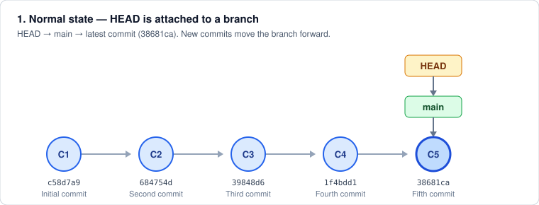
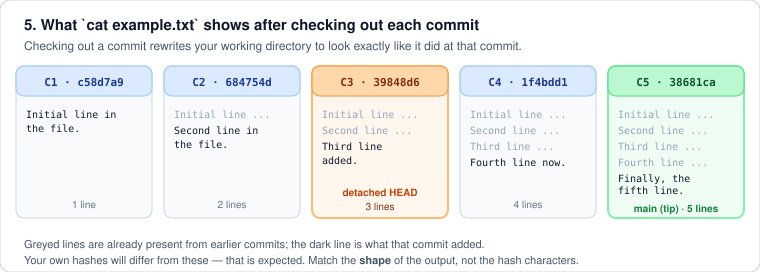
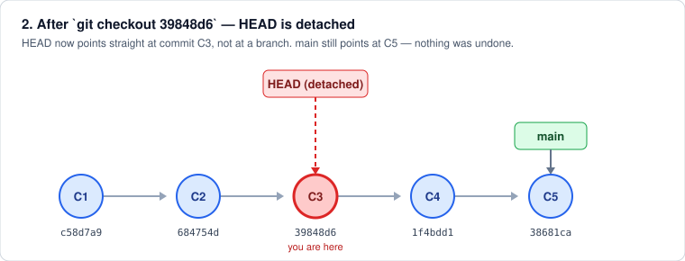
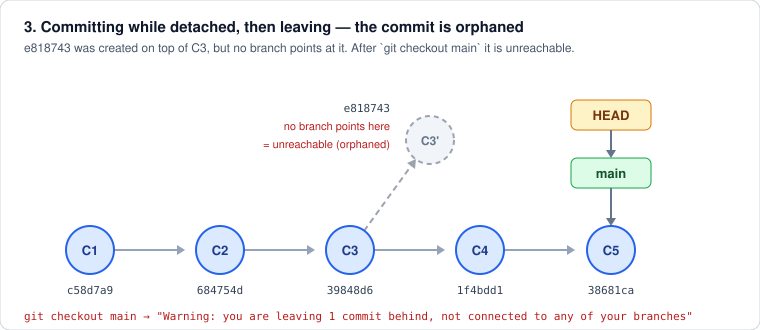
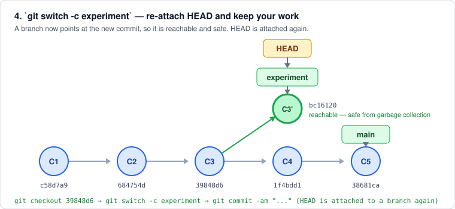

### Git Lab Exercise: Git checkout and Detached Head

> **Week 4 · Undoing Changes · LAB 01** — อ้างอิงสไลด์ `04_GIT.pdf` (หัวข้อ *git checkout and Detached HEAD*)
> ทุกบล็อก **Expected Output** ในเอกสารนี้ **รันจริง** บน container `tuchsanai/devtools:2569_1` (Ubuntu 24.04, git 2.54.0)
> ⚠️ **commit hash ของนักศึกษาจะไม่ตรงกับในเอกสาร** — ให้เทียบ *รูปแบบ* ของผลลัพธ์ ไม่ใช่ตัวอักษรของ hash

---

#### Objective
This lab will guide you through using `git checkout` to navigate between commits, using `git log --oneline` to view a concise commit history, and understanding the concept of a detached head in Git. You will create and navigate through a series of five commits.

**ภาพรวมก่อนเริ่ม — สถานะปกติของ Git**



ปกติ **HEAD → branch → commit ล่าสุด** เวลา commit ใหม่ branch จะถูกลากตามไปข้างหน้าเสมอ
LAB นี้จะพาไป "ถอด" HEAD ออกจาก branch (detached HEAD) แล้วพากลับมาให้ปลอดภัย

---

#### Lab Environment (เตรียมเครื่อง)

รัน container สำหรับทดสอบ แล้ว SSH เข้าไป:

```bash
docker run -dit --name devtools --privileged -p 2222:22 tuchsanai/devtools:2569_1
ssh root@localhost -p 2222        # password: passwd
```

ตั้งตัวตนและชื่อ branch เริ่มต้น (ทำครั้งเดียวต่อ container) — **ใช้ชื่อและอีเมลของตัวเอง** ตัวอย่างข้างล่างเป็นตัวตนสมมุติ:

```bash
git config --global user.name "somchai-dev"               # ← ใช้ชื่อของตัวเอง
git config --global user.email "somchai.dev@example.com"  # ← ใช้อีเมลของตัวเอง
git config --global init.defaultBranch main
```

> 📌 ถ้า **ไม่** ตั้ง `init.defaultBranch` git จะสร้าง branch แรกชื่อ `master` แทน `main` และขึ้น hint ยาว ๆ (ดูหมายเหตุใน Setup ข้อ 1) — ทั้งสองแบบทำ LAB นี้ได้เหมือนกัน แค่เปลี่ยนชื่อ branch ที่ใช้ในคำสั่ง `git checkout`

---

#### Setup
1. **Initialize a New Git Repository:**
   Open your terminal and run the following commands to create a new repository:

   ```bash
   git init GitCheckoutLab
   cd GitCheckoutLab
   ```

   **Expected Output**

   ```
   Initialized empty Git repository in /root/GitCheckoutLab/.git/
   ```

   > 📌 ถ้ายังไม่ได้ตั้ง `init.defaultBranch` จะได้ผลลัพธ์แบบนี้แทน (ไม่ใช่ error — branch แรกจะชื่อ `master`):
   >
   > ```
   > hint: Using 'master' as the name for the initial branch. This default branch name
   > hint: will change to "main" in Git 3.0. To configure the initial branch name
   > hint: to use in all of your new repositories, which will suppress this warning,
   > hint: call:
   > hint:
   > hint: 	git config --global init.defaultBranch <name>
   > hint:
   > hint: Names commonly chosen instead of 'master' are 'main', 'trunk' and
   > hint: 'development'. The just-created branch can be renamed via this command:
   > hint:
   > hint: 	git branch -m <name>
   > hint:
   > hint: Disable this message with "git config set advice.defaultBranchName false"
   > Initialized empty Git repository in /root/GitCheckoutLab/.git/
   > ```

2. **Create an Initial File and Commit:**
   Create your first file and make the initial commit:

   ```bash
   echo "Initial line in the file." > example.txt
   git add example.txt
   git commit -m "Initial commit"
   ```

   **Expected Output**

   ```
   [main (root-commit) c58d7a9] Initial commit
    1 file changed, 1 insertion(+)
    create mode 100644 example.txt
   ```

   > 📌 `(root-commit)` ปรากฏเฉพาะ commit แรกของ repo เท่านั้น เพราะเป็น commit ที่ไม่มี parent

---

#### Tasks
1. **Make Four Additional Commits:**
   You will add new content to `example.txt` and make four more commits. Here's how to proceed:

   - **Second Commit:**
     ```bash
     echo "Second line in the file." >> example.txt
     git commit -am "Second commit"
     ```

   - **Third Commit:**
     ```bash
     echo "Third line added." >> example.txt
     git commit -am "Third commit"
     ```

   - **Fourth Commit:**
     ```bash
     echo "Fourth line now." >> example.txt
     git commit -am "Fourth commit"
     ```

   - **Fifth Commit:**
     ```bash
     echo "Finally, the fifth line." >> example.txt
     git commit -am "Fifth commit"
     ```

   **Expected Output** (ทีละ commit)

   ```
   [main 684754d] Second commit
    1 file changed, 1 insertion(+)

   [main 39848d6] Third commit
    1 file changed, 1 insertion(+)

   [main 1f4bdd1] Fourth commit
    1 file changed, 1 insertion(+)

   [main 38681ca] Fifth commit
    1 file changed, 1 insertion(+)
   ```

   > 📌 `git commit -am` = `git add` ไฟล์ที่ **เคยถูก track แล้ว** + `git commit` ในคำสั่งเดียว จึงใช้ได้ที่นี่เพราะ `example.txt` ถูก `git add` ไปแล้วตั้งแต่ commit แรก

2. **View the Commit History with `git log --oneline`:**
   After your five commits, run the following command to view a summarized commit history:

   ```bash
   git log --oneline
   ```

   **Expected Output**

   ```
   38681ca Fifth commit
   1f4bdd1 Fourth commit
   39848d6 Third commit
   684754d Second commit
   c58d7a9 Initial commit
   ```

   ลองเพิ่ม `--graph --decorate` เพื่อดูว่า HEAD และ branch ชี้อยู่ที่ไหน:

   ```bash
   git log --oneline --graph --decorate
   ```

   **Expected Output**

   ```
   * 38681ca (HEAD -> main) Fifth commit
   * 1f4bdd1 Fourth commit
   * 39848d6 Third commit
   * 684754d Second commit
   * c58d7a9 Initial commit
   ```

   > 📌 `(HEAD -> main)` คือหลักฐานว่า HEAD **ยังติดอยู่กับ branch** (attached) — ตรงกับรูปที่ 1 ด้านบน จำภาพนี้ไว้เพื่อเทียบกับตอน detached

   ตรวจไฟล์และสถานะปัจจุบัน:

   ```bash
   cat example.txt
   git status
   ```

   **Expected Output**

   ```
   Initial line in the file.
   Second line in the file.
   Third line added.
   Fourth line now.
   Finally, the fifth line.
   ```

   ```
   On branch main
   nothing to commit, working tree clean
   ```

   **ไฟล์ `example.txt` จะหน้าตาอย่างไรในแต่ละ commit**

   

3. **Checkout to Specific Commits and Explore:**
   - **Checkout to the Third Commit:**
     Find and use the hash of the third commit to switch to it:

     ```bash
     git checkout <hash-of-third-commit>
     ```

     ในเอกสารนี้ hash ของ commit ที่ 3 คือ `39848d6` (ของนักศึกษาจะเป็นค่าอื่น):

     ```bash
     git checkout 39848d6
     ```

     **Expected Output**

     ```
     Note: switching to '39848d6'.

     You are in 'detached HEAD' state. You can look around, make experimental
     changes and commit them, and you can discard any commits you make in this
     state without impacting any branches by switching back to a branch.

     If you want to create a new branch to retain commits you create, you may
     do so (now or later) by using -c with the switch command. Example:

       git switch -c <new-branch-name>

     Or undo this operation with:

       git switch -

     Turn off this advice by setting config variable advice.detachedHead to false

     HEAD is now at 39848d6 Third commit
     ```

     

   - **Explore Detached Head State:**
     While in this state, observe the contents and status of your repository.

     ```bash
     git status
     cat example.txt
     git log --oneline
     git branch
     ```

     **Expected Output**

     ```
     HEAD detached at 39848d6
     nothing to commit, working tree clean
     ```

     ```
     Initial line in the file.
     Second line in the file.
     Third line added.
     ```

     ```
     39848d6 Third commit
     684754d Second commit
     c58d7a9 Initial commit
     ```

     ```
     * (HEAD detached at 39848d6)
       main
     ```

     > 📌 **สังเกต 3 อย่าง**
     > 1. `git status` เปลี่ยนจาก `On branch main` เป็น `HEAD detached at 39848d6`
     > 2. `cat example.txt` เหลือ **3 บรรทัด** — working directory ถูกย้อนกลับไปเป็นหน้าตาตอน commit ที่ 3
     > 3. `git log --oneline` เห็นแค่ 3 commits เพราะ log ไล่จาก HEAD ย้อนตาม parent เท่านั้น — **commit ที่ 4 และ 5 ไม่ได้หายไป**

     ยืนยันว่า commit ที่ 4–5 ยังอยู่ครบ ด้วย `--all`:

     ```bash
     git log --oneline --all
     ```

     **Expected Output**

     ```
     38681ca Fifth commit
     39848d6 Third commit
     1f4bdd1 Fourth commit
     684754d Second commit
     c58d7a9 Initial commit
     ```

     **ทดลอง commit ขณะ detached HEAD** (เพื่อดูว่าทำไมมันอันตราย):

     ```bash
     echo "Experimental line (detached HEAD)." >> example.txt
     git commit -am "Experimental commit while detached"
     git status
     ```

     **Expected Output**

     ```
     [detached HEAD e818743] Experimental commit while detached
      1 file changed, 1 insertion(+)
     ```

     ```
     HEAD detached from 39848d6
     nothing to commit, working tree clean
     ```

     

     > 📌 commit สำเร็จจริง แต่ **ไม่มี branch ไหนชี้มาที่มันเลย** — พอย้ายออกไป branch อื่น commit นี้จะกลายเป็น commit ลอย (orphaned) และถูก garbage collector เก็บกวาดทิ้งในภายหลัง

   - **Return to the Latest Commit:**
     Checkout back to the latest commit on your main branch:

     ```bash
     git checkout main or git checkout master

     ```

     **Expected Output**

     ```
     Warning: you are leaving 1 commit behind, not connected to
     any of your branches:

       e818743 Experimental commit while detached

     If you want to keep it by creating a new branch, this may be a good time
     to do so with:

      git branch <new-branch-name> e818743

     Switched to branch 'main'
     ```

     > 📌 นี่คือคำเตือนที่ตรงกับสไลด์ — *"If you started making changes here, they won't be preserved since HEAD is not pointing at a branch reference"* ถ้าไม่มี commit ค้างขณะ detached จะได้แค่บรรทัด `Switched to branch 'main'` เฉย ๆ

     ตรวจว่ากลับมาที่ commit ล่าสุดจริง:

     ```bash
     git log --oneline
     cat example.txt
     ```

     **Expected Output**

     ```
     38681ca Fifth commit
     1f4bdd1 Fourth commit
     39848d6 Third commit
     684754d Second commit
     c58d7a9 Initial commit
     ```

     ```
     Initial line in the file.
     Second line in the file.
     Third line added.
     Fourth line now.
     Finally, the fifth line.
     ```

     > 📌 ไฟล์กลับมาครบ 5 บรรทัด และ **ไม่มี** บรรทัด `Experimental line` ติดมาด้วย — การ checkout ไปดูอดีตไม่ได้ทำให้ประวัติเสียหาย

   - **Checkout to the First Commit:**
     Finally, checkout to the first commit using its commit hash.

     ```bash
     git checkout c58d7a9
     cat example.txt
     git status
     git log --oneline
     ```

     **Expected Output**

     ```
     Note: switching to 'c58d7a9'.

     You are in 'detached HEAD' state. You can look around, make experimental
     changes and commit them, and you can discard any commits you make in this
     state without impacting any branches by switching back to a branch.

     If you want to create a new branch to retain commits you create, you may
     do so (now or later) by using -c with the switch command. Example:

       git switch -c <new-branch-name>

     Or undo this operation with:

       git switch -

     Turn off this advice by setting config variable advice.detachedHead to false

     HEAD is now at c58d7a9 Initial commit
     ```

     ```
     Initial line in the file.
     ```

     ```
     HEAD detached at c58d7a9
     nothing to commit, working tree clean
     ```

     ```
     c58d7a9 Initial commit
     ```

     > 📌 เหลือไฟล์บรรทัดเดียวและ log เหลือ commit เดียว — เท่ากับย้อนเวลากลับไปวินาทีที่สร้างโปรเจกต์

---

#### วิธีที่ถูกต้อง: เก็บงานจาก detached HEAD ด้วย `git switch -c`

ถ้าอยากทดลองแก้โค้ดจากจุดในอดีต **และเก็บผลงานไว้จริง ๆ** ให้สร้าง branch ทับตรงจุดนั้น เพื่อ "เสียบ" HEAD กลับเข้ากับ branch:

```bash
git checkout 39848d6
git switch -c experiment
git status
echo "Line kept on the experiment branch." >> example.txt
git commit -am "Experimental commit on a real branch"
git branch
```

**Expected Output**

```
Previous HEAD position was c58d7a9 Initial commit
HEAD is now at 39848d6 Third commit
```

```
Switched to a new branch 'experiment'
```

```
On branch experiment
nothing to commit, working tree clean
```

```
[experiment bc16120] Experimental commit on a real branch
 1 file changed, 1 insertion(+)
```

```
* experiment
  main
```



> 📌 สังเกตว่า `git status` กลับไปพูดว่า `On branch experiment` (ไม่ใช่ `HEAD detached`) และ commit ขึ้นว่า `[experiment bc16120]` ไม่ใช่ `[detached HEAD ...]` — งานถูกเก็บอย่างปลอดภัยแล้ว

กลับมาที่ `main` แล้วดูภาพรวมทั้ง repo:

```bash
git switch main
git log --oneline --all --graph --decorate
```

**Expected Output**

```
Switched to branch 'main'
```

```
* bc16120 (experiment) Experimental commit on a real branch
| * 38681ca (HEAD -> main) Fifth commit
| * 1f4bdd1 Fourth commit
|/
* 39848d6 Third commit
* 684754d Second commit
* c58d7a9 Initial commit
```

> 📌 ประวัติแตกเป็นสองเส้นจาก `39848d6` — เส้นหนึ่งคือ `main` (commit 4–5) อีกเส้นคือ `experiment`

---

#### กู้ commit ที่ลอยไปแล้ว ด้วย `git reflog` (Bonus)

commit `e818743` ที่ทำค้างไว้ตอน detached ยังไม่ถูกลบทันที — `git reflog` จำทุกตำแหน่งที่ HEAD เคยไปยืน:

```bash
git reflog
```

**Expected Output**

```
38681ca HEAD@{0}: checkout: moving from experiment to main
bc16120 HEAD@{1}: commit: Experimental commit on a real branch
39848d6 HEAD@{2}: checkout: moving from 39848d691c16cfc210cc05b3fcc4c178134d8827 to experiment
39848d6 HEAD@{3}: checkout: moving from c58d7a98871bcf35a77ba28d2b4de8eb6d334a5c to 39848d6
c58d7a9 HEAD@{4}: checkout: moving from main to c58d7a9
38681ca HEAD@{5}: checkout: moving from e818743a10b35f45d10b5c275222f040e9b096d7 to main
e818743 HEAD@{6}: commit: Experimental commit while detached
39848d6 HEAD@{7}: checkout: moving from main to 39848d6
38681ca HEAD@{8}: commit: Fifth commit
1f4bdd1 HEAD@{9}: commit: Fourth commit
39848d6 HEAD@{10}: commit: Third commit
684754d HEAD@{11}: commit: Second commit
c58d7a9 HEAD@{12}: commit (initial): Initial commit
```

ชี้ branch ใหม่ไปที่ commit ลอยตัวนั้นเพื่อกู้คืน:

```bash
git branch rescue e818743
git log --oneline rescue
git branch -a
```

**Expected Output**

```
e818743 Experimental commit while detached
39848d6 Third commit
684754d Second commit
c58d7a9 Initial commit
```

```
  experiment
* main
  rescue
```

```bash
git log --oneline --all --graph --decorate
```

**Expected Output**

```
* bc16120 (experiment) Experimental commit on a real branch
| * e818743 (rescue) Experimental commit while detached
|/
| * 38681ca (HEAD -> main) Fifth commit
| * 1f4bdd1 Fourth commit
|/
* 39848d6 Third commit
* 684754d Second commit
* c58d7a9 Initial commit
```

---

#### ตรวจงานตัวเอง (Self-check)

| # | ทำอะไร | ต้องเห็นอะไรจึงถือว่าถูก |
|---|--------|--------------------------|
| 1 | `git log --oneline` หลัง 5 commits | 5 บรรทัด เรียงจากใหม่ไปเก่า: Fifth → Initial |
| 2 | `git checkout <hash commit ที่ 3>` | ข้อความ `You are in 'detached HEAD' state.` + `HEAD is now at ... Third commit` |
| 3 | `git status` ขณะ detached | `HEAD detached at <hash>` (ไม่ใช่ `On branch main`) |
| 4 | `cat example.txt` ขณะอยู่ commit ที่ 3 | เหลือ **3 บรรทัด** เท่านั้น |
| 5 | `git log --oneline` ขณะอยู่ commit ที่ 3 | เหลือ **3 commits** แต่ `git log --oneline --all` ยังเห็นครบ 5 |
| 6 | `git commit` ขณะ detached | ขึ้น `[detached HEAD <hash>]` ไม่ใช่ `[main <hash>]` |
| 7 | `git checkout main` หลัง commit ตอน detached | `Warning: you are leaving 1 commit behind ...` |
| 8 | `cat example.txt` หลังกลับมา main | ครบ 5 บรรทัด และ **ไม่มี** บรรทัด Experimental |
| 9 | `git switch -c experiment` | `Switched to a new branch 'experiment'` และ `git status` = `On branch experiment` |
| 10 | `git reflog` | เห็นบรรทัด `commit: Experimental commit while detached` ที่กู้กลับมาได้ |

---

#### สรุปคำสั่งใน LAB นี้

| คำสั่ง | ทำอะไร |
|--------|---------|
| `git log --oneline` | ดูประวัติแบบย่อ (hash สั้น + ข้อความ commit) จาก HEAD ย้อนหลัง |
| `git log --oneline --all --graph --decorate` | ดูทุก branch พร้อมกันเป็นกราฟ + เห็นว่า HEAD/branch ชี้ที่ไหน |
| `git checkout <hash>` | ย้าย HEAD ไปที่ commit นั้นตรง ๆ → **detached HEAD** (ดูอดีตได้ ไม่ทำลายประวัติ) |
| `git checkout main` / `git switch main` | เสียบ HEAD กลับเข้ากับ branch |
| `git switch -c <branch>` | สร้าง branch ใหม่ ณ จุดที่ยืนอยู่ + ย้ายเข้าไป (ใช้เก็บงานจาก detached HEAD) |
| `git branch <name> <hash>` | ชี้ branch ใหม่ไปที่ commit ที่ระบุ (ใช้กู้ commit ลอย) |
| `git reflog` | ดูประวัติการย้ายของ HEAD ทั้งหมด — ตาข่ายกันตกของ Git |

---

#### Deliverables
- Submit a report detailing your process, observations in the detached head state, and changes in the repository at different commit stages.
- Discuss the utility of `git log --oneline` and how it assists in understanding the history of changes in a project.
