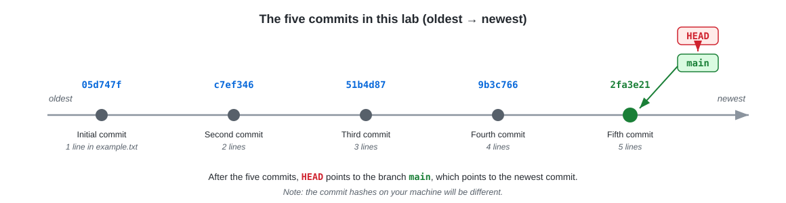
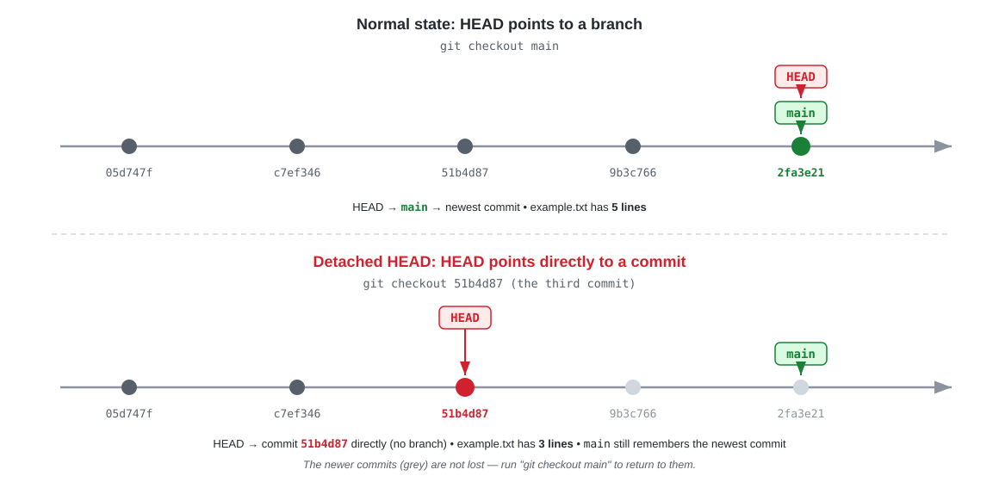

### Git Lab Exercise: Git checkout and Detached Head

#### Objective
This lab will guide you through using `git checkout` to navigate between commits, using `git log --oneline` to view a concise commit history, and understanding the concept of a detached head in Git. You will create and navigate through a series of five commits.

#### Setup
1. **Initialize a New Git Repository:**
   Open your terminal and run the following commands to create a new repository:

   ```bash
   git init GitCheckoutLab
   cd GitCheckoutLab
   ```

   ✅ **Expected output:**
   ```
   Initialized empty Git repository in /root/GitCheckoutLab/.git/
   ```

2. **Create an Initial File and Commit:**
   Create your first file and make the initial commit:

   ```bash
   echo "Initial line in the file." > example.txt
   git add example.txt
   git commit -m "Initial commit"
   ```

   ✅ **Expected output:**
   ```
   [main (root-commit) 05d747f] Initial commit
    1 file changed, 1 insertion(+)
    create mode 100644 example.txt
   ```

   > **Note:** The commit hashes (e.g. `05d747f`) on your machine will be different from the ones shown in this document.

#### Tasks
1. **Make Four Additional Commits:**
   You will add new content to `example.txt` and make four more commits. Here's how to proceed:

   - **Second Commit:**
     ```bash
     echo "Second line in the file." >> example.txt
     git commit -am "Second commit"
     ```

     ✅ **Expected output:**
     ```
     [main c7ef346] Second commit
      1 file changed, 1 insertion(+)
     ```

   - **Third Commit:**
     ```bash
     echo "Third line added." >> example.txt
     git commit -am "Third commit"
     ```

     ✅ **Expected output:**
     ```
     [main 51b4d87] Third commit
      1 file changed, 1 insertion(+)
     ```

   - **Fourth Commit:**
     ```bash
     echo "Fourth line now." >> example.txt
     git commit -am "Fourth commit"
     ```

     ✅ **Expected output:**
     ```
     [main 9b3c766] Fourth commit
      1 file changed, 1 insertion(+)
     ```

   - **Fifth Commit:**
     ```bash
     echo "Finally, the fifth line." >> example.txt
     git commit -am "Fifth commit"
     ```

     ✅ **Expected output:**
     ```
     [main 2fa3e21] Fifth commit
      1 file changed, 1 insertion(+)
     ```

   After all five commits, your repository history looks like this:

   

2. **View the Commit History with `git log --oneline`:**
   After your five commits, run the following command to view a summarized commit history:

   ```bash
   git log --oneline
   ```

   ✅ **Expected output** (newest commit at the top):
   ```
   2fa3e21 Fifth commit
   9b3c766 Fourth commit
   51b4d87 Third commit
   c7ef346 Second commit
   05d747f Initial commit
   ```

3. **Checkout to Specific Commits and Explore:**

   The diagram below compares the normal state with the detached HEAD state you are about to enter:

   

   - **Checkout to the Third Commit:**
     Find and use the hash of the third commit to switch to it:

     ```bash
     git checkout <hash-of-third-commit>
     ```

     ✅ **Expected output** (using hash `51b4d87` as an example):
     ```
     Note: switching to '51b4d87'.

     You are in 'detached HEAD' state. You can look around, make experimental
     changes and commit them, and you can discard any commits you make in this
     state without impacting any branches by switching back to a branch.

     If you want to create a new branch to retain commits you create, you may
     do so (now or later) by using -c with the switch command. Example:

       git switch -c <new-branch-name>

     Or undo this operation with:

       git switch -

     Turn off this advice by setting config variable advice.detachedHead to false

     HEAD is now at 51b4d87 Third commit
     ```

   - **Explore Detached Head State:**
     While in this state, observe the contents and status of your repository.

     ```bash
     cat example.txt
     ```

     ✅ **Expected output** — the file has only 3 lines, because the fourth and fifth commits are "in the future" relative to this commit:
     ```
     Initial line in the file.
     Second line in the file.
     Third line added.
     ```

     ```bash
     git status
     ```

     ✅ **Expected output:**
     ```
     HEAD detached at 51b4d87
     nothing to commit, working tree clean
     ```

     ```bash
     git log --oneline
     ```

     ✅ **Expected output** — notice that the fourth and fifth commits are **not shown**, because `git log` only shows history up to the current HEAD:
     ```
     51b4d87 Third commit
     c7ef346 Second commit
     05d747f Initial commit
     ```

     > 💡 **Tip:** The newer commits are not lost! Run `git log --oneline --all` to see every commit in the repository, including the ones ahead of HEAD.

   - **Return to the Latest Commit:**
     Checkout back to the latest commit on your main branch:

     ```bash
     git checkout main or git checkout master

     ```

     ✅ **Expected output:**
     ```
     Previous HEAD position was 51b4d87 Third commit
     Switched to branch 'main'
     ```

     Verify that `example.txt` is back to its full 5 lines:

     ```bash
     cat example.txt
     ```

     ✅ **Expected output:**
     ```
     Initial line in the file.
     Second line in the file.
     Third line added.
     Fourth line now.
     Finally, the fifth line.
     ```

   - **Checkout to the First Commit:**
     Finally, checkout to the first commit using its commit hash.
     Find the hash of the first commit from `git log --oneline --all`, then run:

     ```bash
     git checkout <hash-of-first-commit>
     ```

     For example, if the hash of the first commit is `05d747f`:

     ```bash
     git checkout 05d747f
     ```

     ✅ **Expected output** (using hash `05d747f` as an example) — you are in the detached HEAD state again:
     ```
     Note: switching to '05d747f'.

     You are in 'detached HEAD' state. ...

     HEAD is now at 05d747f Initial commit
     ```

     Now `example.txt` contains only the very first line:
     ```bash
     cat example.txt
     ```
     ```
     Initial line in the file.
     ```

     When you are done exploring, return to the latest commit with `git checkout main`.

#### Deliverables
- Submit a report detailing your process, observations in the detached head state, and changes in the repository at different commit stages.
- Discuss the utility of `git log --oneline` and how it assists in understanding the history of changes in a project.
