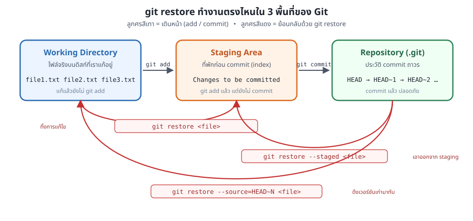
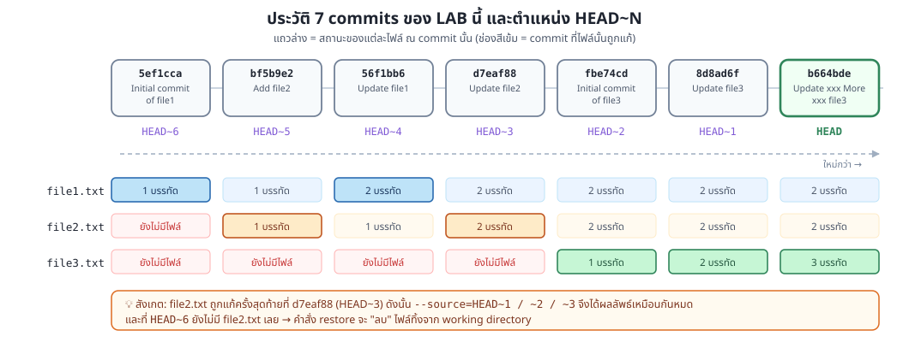
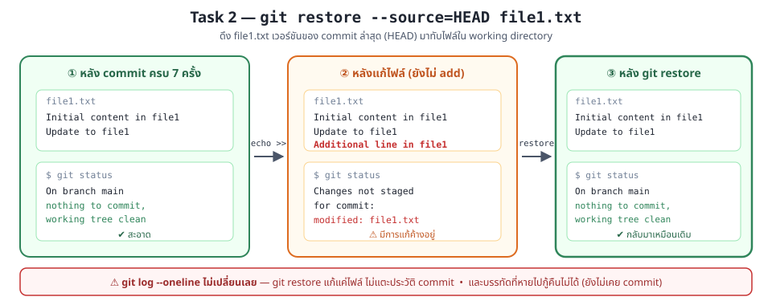
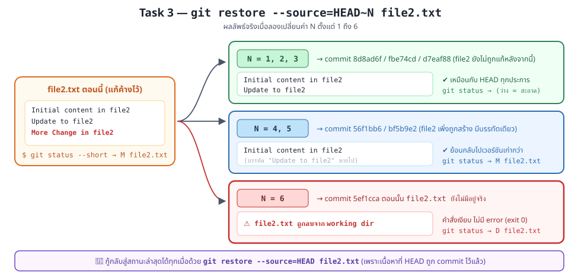
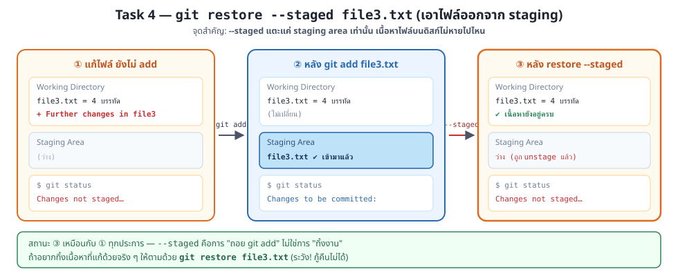
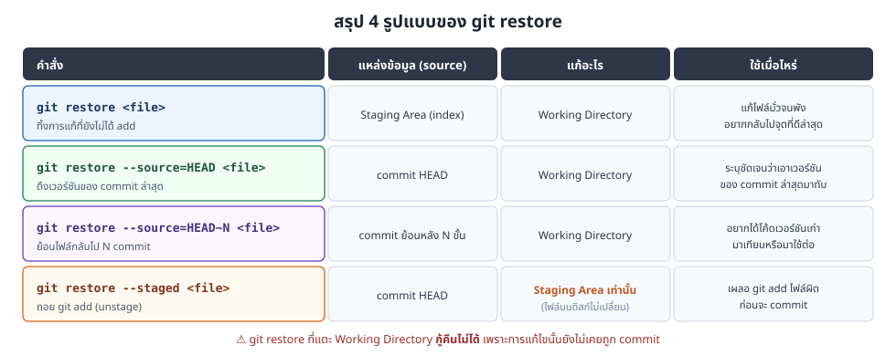

### Git Lab Exercise: Proficiency with `git restore`

#### Objective
Develop a comprehensive understanding of the `git restore` command in Git through a series of hands-on exercises. This lab includes making five distinct commits, followed by operations using `git restore`, and understanding the repository's state with `git log` and `git status`.

---

### ภาพรวม: `git restore` ทำงานตรงไหน

Git มีพื้นที่ทำงาน 3 ส่วน คือ **Working Directory** (ไฟล์จริงที่เราแก้), **Staging Area** (ที่พักก่อน commit) และ **Repository** (ประวัติ commit ใน `.git`)
คำสั่ง `git restore` คือคำสั่งสำหรับ **ย้อนกลับ** ระหว่างพื้นที่เหล่านี้



> **หมายเหตุ:** `git restore` แก้เฉพาะ *ไฟล์* เท่านั้น **ไม่แตะประวัติ commit** — `git log` จะเหมือนเดิมเสมอ
> (ต่างจาก `git reset` และ `git revert` ที่จะเรียนใน LAB03 และ LAB04)

---

#### Setup
1. **Initialize a New Git Repository:**
   Begin by creating a new Git repository in your terminal:

   ```bash
   git init GitRestoreLab
   cd GitRestoreLab
   ```

   ```bash
   git init 
   ```

<details>
<summary><b>📄 ผลการทดลองจริง — Setup</b></summary>

```console
$ git init GitRestoreLab
Initialized empty Git repository in /root/GitRestoreLab/.git/

$ cd GitRestoreLab

$ git init
Reinitialized existing Git repository in /root/GitRestoreLab/.git/
```

> คำสั่ง `git init` ครั้งที่สองจะขึ้นว่า `Reinitialized` เพราะ repo ถูกสร้างไปแล้วจากคำสั่งแรก — ไม่ใช่ error และไม่ทำให้ข้อมูลหาย

</details>

2. **Create Files and Commit Sequentially:**
   Follow these steps for each of the five commits:

   - **Commit :**
     ```bash
     echo "Initial content in file1" > file1.txt
     git add file1.txt
     git commit -m "Initial commit of file1"
     ```

   - **Commit :**
     ```bash
     echo "Initial content in file2" > file2.txt
     git add file2.txt
     git commit -m "Add file2"
     ```

   - **Commit :**
   ```bash
      echo "Update to file1" >> file1.txt
      git add file1.txt
      git commit -m "Update file1"
   ```
   ```bash
      echo "Update to file2" >> file2.txt
      git add file2.txt
      git commit -m "Update file2"
   ```


- **Commit :**
   ```bash
      echo "Initial content in file3" > file3.txt
      git add file3.txt
      git commit -m "Initial commit of file3"
   ```
   ```bash
      echo "Update to file3" >> file3.txt
      git add file3.txt
      git commit -m "Update file3"
   ```


- **Commit :**
    ```bash
     echo "xxxx More xxxx Update to file3" >> file3.txt
     git add file3.txt
     git commit -m "Update xxx More xxx file3"
    ```

<details>
<summary><b>📄 ผลการทดลองจริง — การ commit ทั้ง 7 ครั้ง</b></summary>

```console
$ git commit -m "Initial commit of file1"
[main (root-commit) 5ef1cca] Initial commit of file1
 1 file changed, 1 insertion(+)
 create mode 100644 file1.txt

$ git commit -m "Add file2"
[main bf5b9e2] Add file2
 1 file changed, 1 insertion(+)
 create mode 100644 file2.txt

$ git commit -m "Update file1"
[main 56f1bb6] Update file1
 1 file changed, 1 insertion(+)

$ git commit -m "Update file2"
[main d7eaf88] Update file2
 1 file changed, 1 insertion(+)

$ git commit -m "Initial commit of file3"
[main fbe74cd] Initial commit of file3
 1 file changed, 1 insertion(+)
 create mode 100644 file3.txt

$ git commit -m "Update file3"
[main 8d8ad6f] Update file3
 1 file changed, 1 insertion(+)

$ git commit -m "Update xxx More xxx file3"
[main b664bde] Update xxx More xxx file3
 1 file changed, 1 insertion(+)
```

> **⚠️ commit hash ของนักศึกษาจะไม่ตรงกับตัวอย่างนี้** (เช่น `5ef1cca`) เพราะ hash คำนวณจากชื่อผู้เขียน อีเมล และเวลาที่ commit ด้วย
> ให้ดูที่ **จำนวน commit (7 ครั้ง)** และ **ข้อความ commit** ว่าตรงกันหรือไม่ แล้วใช้ `HEAD~N` แทนการพิมพ์ hash

</details>

---

### แผนผังประวัติ commit ของ LAB นี้

หลังทำ Setup เสร็จ จะได้ประวัติทั้งหมด **7 commits** โดยมีตำแหน่ง `HEAD~N` ดังนี้



ให้เก็บภาพนี้ไว้เทียบตอนทำ Task 3 — มันคือคำตอบว่าทำไม `HEAD~1`, `HEAD~2`, `HEAD~3` ถึงให้ผลลัพธ์เหมือนกัน

---

#### Tasks
1. **Use `git log` and `git status`:**
   After each operation, examine the commit history and current status:

   ```bash
   git log --oneline
   git status
   ```

<details>
<summary><b>📄 ผลการทดลองจริง — Task 1</b></summary>

```console
$ git log --oneline
b664bde Update xxx More xxx file3
8d8ad6f Update file3
fbe74cd Initial commit of file3
d7eaf88 Update file2
56f1bb6 Update file1
bf5b9e2 Add file2
5ef1cca Initial commit of file1

$ git status
On branch main
nothing to commit, working tree clean
```

ตรวจสอบเนื้อหาไฟล์ทั้งสาม:

```console
$ cat file1.txt
Initial content in file1
Update to file1

$ cat file2.txt
Initial content in file2
Update to file2

$ cat file3.txt
Initial content in file3
Update to file3
xxxx More xxxx Update to file3
```

**✅ เช็กว่าถูกต้องหรือไม่:** ต้องได้ 7 commits, สถานะ `working tree clean`, file1 = 2 บรรทัด, file2 = 2 บรรทัด, file3 = 3 บรรทัด

</details>

2. **Practice Using `git restore` with HEAD:**
   Modify a file and revert the changes using `HEAD`:

   ```bash
   echo "Additional line in file1" >> file1.txt
   git status  # Check the effect
   git log --oneline  # Check the effect
   ```
  ```bash
   git restore --source=HEAD file1.txt
   git status  # Check the effect
   git log --oneline  # Check the effect
   ```



<details>
<summary><b>📄 ผลการทดลองจริง — Task 2</b></summary>

**ขั้นที่ 1: แก้ไฟล์ แล้วดูสถานะ**

```console
$ echo "Additional line in file1" >> file1.txt

$ cat file1.txt
Initial content in file1
Update to file1
Additional line in file1

$ git status
On branch main
Changes not staged for commit:
  (use "git add <file>..." to update what will be committed)
  (use "git restore <file>..." to discard changes in working directory)
	modified:   file1.txt

no changes added to commit (use "git add" and/or "git commit -a")

$ git log --oneline
b664bde Update xxx More xxx file3
8d8ad6f Update file3
fbe74cd Initial commit of file3
d7eaf88 Update file2
56f1bb6 Update file1
bf5b9e2 Add file2
5ef1cca Initial commit of file1
```

**ขั้นที่ 2: restore กลับ**

```console
$ git restore --source=HEAD file1.txt
                                      ← คำสั่งนี้ไม่พิมพ์อะไรออกมาเมื่อสำเร็จ

$ cat file1.txt
Initial content in file1
Update to file1

$ git status
On branch main
nothing to commit, working tree clean

$ git log --oneline
b664bde Update xxx More xxx file3
8d8ad6f Update file3
fbe74cd Initial commit of file3
d7eaf88 Update file2
56f1bb6 Update file1
bf5b9e2 Add file2
5ef1cca Initial commit of file1
```

**✅ เช็กว่าถูกต้องหรือไม่:**
- บรรทัด `Additional line in file1` หายไปแล้ว → `cat file1.txt` เหลือ 2 บรรทัด
- `git status` กลับมาเป็น `working tree clean`
- **`git log --oneline` เหมือนเดิมเป๊ะทั้งก่อนและหลัง** ← นี่คือหัวใจของบทเรียนนี้

**⚠️ ข้อควรระวัง:** บรรทัดที่หายไปนั้น **กู้คืนไม่ได้** เพราะยังไม่เคยถูก commit เลย (ตามที่สไลด์ระบุว่า *"You can not undo a git restore command, since your changes were not committed!"*)

</details>

3. **Restore to Specific Commit and HEAD~3:**
   Alter a file and restore it to an earlier commit:

   ```bash
   echo "More Change in file2" >> file2.txt
   ```

   ** try to change N = 1,2,3..
   ```bash
   git restore --source=HEAD~N file2.txt
   ```



<details>
<summary><b>📄 ผลการทดลองจริง — Task 3</b></summary>

**ขั้นที่ 1: แก้ file2.txt**

```console
$ echo "More Change in file2" >> file2.txt

$ cat file2.txt
Initial content in file2
Update to file2
More Change in file2

$ git status --short
 M file2.txt
```

**ขั้นที่ 2: ทดลอง N = 1, 2, 3 → ได้ผลเหมือนกันทั้งสามค่า**

```console
$ git restore --source=HEAD~1 file2.txt
$ cat file2.txt
Initial content in file2
Update to file2
$ git status --short
                        ← ว่างเปล่า = สะอาด (เหมือนกับ HEAD พอดี)

$ git restore --source=HEAD~2 file2.txt
$ cat file2.txt
Initial content in file2
Update to file2
$ git status --short
                        ← ยังว่างเปล่าเหมือนเดิม

$ git restore --source=HEAD~3 file2.txt
$ cat file2.txt
Initial content in file2
Update to file2
$ git status --short
                        ← ยังว่างเปล่าเหมือนเดิม
```

> **ทำไมถึงเหมือนกันหมด?** เพราะ `file2.txt` ถูกแก้ครั้งสุดท้ายที่ commit `d7eaf88` ซึ่งคือ **HEAD~3**
> commit `fbe74cd` (HEAD~2) และ `8d8ad6f` (HEAD~1) ไปแก้ `file3.txt` ไม่ได้แตะ `file2.txt` เลย
> **บทเรียน:** `HEAD~N` นับ *จำนวน commit* ไม่ใช่ *จำนวนครั้งที่ไฟล์นี้ถูกแก้*

**ขั้นที่ 3: ทดลอง N = 4, 5 → ย้อนกลับไปจริง ๆ**

```console
$ git restore --source=HEAD~4 file2.txt
$ cat file2.txt
Initial content in file2
                        ← บรรทัด "Update to file2" หายไปแล้ว
$ git status --short
 M file2.txt            ← ตอนนี้ต่างจาก HEAD แล้ว

$ git restore --source=HEAD~5 file2.txt
$ cat file2.txt
Initial content in file2
$ git status --short
 M file2.txt
```

**ขั้นที่ 4: ทดลอง N = 6 → ⚠️ ไฟล์ถูกลบทิ้ง!**

```console
$ git restore --source=HEAD~6 file2.txt
                        ← ไม่มีข้อความใด ๆ, exit code = 0 (เหมือนสำเร็จปกติ)

$ ls -1
file1.txt
file3.txt               ← file2.txt หายไปจาก working directory!

$ git status --short
 D file2.txt            ← D = Deleted
```

> **ทำไม?** commit `5ef1cca` (HEAD~6) คือ commit แรกสุด ตอนนั้นยังไม่มี `file2.txt` อยู่เลย
> Git จึงตีความว่า "สถานะของ file2.txt ณ commit นั้นคือ *ไม่มีไฟล์*" แล้วลบไฟล์ออกจาก working directory
> **น่ากลัวตรงที่คำสั่งไม่เตือนอะไรเลย** — ต้องดู `git status` เองทุกครั้ง

**ขั้นที่ 5: กู้กลับสู่สถานะล่าสุด**

```console
$ git restore --source=HEAD file2.txt

$ cat file2.txt
Initial content in file2
Update to file2

$ git status --short
                        ← สะอาดแล้ว ไฟล์กลับมาครบ
```

**✅ เช็กว่าถูกต้องหรือไม่:**

| N | commit ที่อ้างถึง | เนื้อหา `file2.txt` | `git status --short` |
|---|---|---|---|
| 1, 2, 3 | `8d8ad6f`, `fbe74cd`, `d7eaf88` | 2 บรรทัด | (ว่าง = สะอาด) |
| 4, 5 | `56f1bb6`, `bf5b9e2` | 1 บรรทัด | ` M file2.txt` |
| 6 | `5ef1cca` | **ไฟล์ถูกลบ** | ` D file2.txt` |

</details>

4. **Stage Changes and Explore `git restore --staged`:**
   Stage changes in a file and then unstage them:

   ```bash
   echo "Further changes in file3" >> file3.txt
   git add file3.txt
   git status  # Verify staged
   ```

  ```bash
   git restore --staged file3.txt
   git status  # Verify unstage
   ```



<details>
<summary><b>📄 ผลการทดลองจริง — Task 4</b></summary>

**ขั้นที่ 1: แก้ไฟล์ (ยังไม่ add)**

```console
$ echo "Further changes in file3" >> file3.txt

$ cat file3.txt
Initial content in file3
Update to file3
xxxx More xxxx Update to file3
Further changes in file3

$ git status
On branch main
Changes not staged for commit:
  (use "git add <file>..." to update what will be committed)
  (use "git restore <file>..." to discard changes in working directory)
	modified:   file3.txt

no changes added to commit (use "git add" and/or "git commit -a")
```

**ขั้นที่ 2: `git add` → เข้า staging area**

```console
$ git add file3.txt

$ git status
On branch main
Changes to be committed:
  (use "git restore --staged <file>..." to unstage)
	modified:   file3.txt
```

> สังเกตว่า Git บอกวิธี unstage ให้เองในบรรทัด `(use "git restore --staged <file>..." to unstage)`

**ขั้นที่ 3: `git restore --staged` → ถอยออกจาก staging area**

```console
$ git restore --staged file3.txt

$ git status
On branch main
Changes not staged for commit:
  (use "git add <file>..." to update what will be committed)
  (use "git restore <file>..." to discard changes in working directory)
	modified:   file3.txt

no changes added to commit (use "git add" and/or "git commit -a")

$ cat file3.txt
Initial content in file3
Update to file3
xxxx More xxxx Update to file3
Further changes in file3        ← เนื้อหายังอยู่ครบ ไม่หายไปไหน
```

**✅ เช็กว่าถูกต้องหรือไม่:**
- ข้อความเปลี่ยนจาก `Changes to be committed:` กลับเป็น `Changes not staged for commit:`
- **`cat file3.txt` ยังมี 4 บรรทัดครบถ้วน** ← `--staged` ไม่แตะไฟล์บนดิสก์
- สถานะสุดท้ายเหมือนกับก่อนพิมพ์ `git add` ทุกประการ

</details>

<details>
<summary><b>📄 ผลการทดลองจริง — โบนัส: <code>git restore</code> เปล่า ๆ (ทิ้งงานจริง ๆ)</b></summary>

ต่อจาก Task 4 ถ้าอยากทิ้งบรรทัด `Further changes in file3` ไปเลย ให้ใช้ `git restore` โดยไม่ใส่ option:

```console
$ git restore file3.txt

$ cat file3.txt
Initial content in file3
Update to file3
xxxx More xxxx Update to file3      ← บรรทัดที่ 4 หายไปแล้ว

$ git status
On branch main
nothing to commit, working tree clean
```

**สถานะสุดท้ายของ LAB:**

```console
$ git log --oneline
b664bde Update xxx More xxx file3
8d8ad6f Update file3
fbe74cd Initial commit of file3
d7eaf88 Update file2
56f1bb6 Update file1
bf5b9e2 Add file2
5ef1cca Initial commit of file1

$ git status
On branch main
nothing to commit, working tree clean

$ ls -1
file1.txt
file2.txt
file3.txt
```

> ตลอดทั้ง LAB ประวัติ commit **ไม่เปลี่ยนแปลงเลยแม้แต่ครั้งเดียว** — ยังคงเป็น 7 commits เท่าเดิม

</details>

---

### สรุปคำสั่ง `git restore` ทั้งหมด



---

### สภาพแวดล้อมที่ใช้ทดลอง

ผลการทดลองทั้งหมดข้างต้นรันจริงบน container `tuchsanai/devtools:2569_1` (Git version 2.54.0)

```bash
# รัน container
docker run -dit --name devtools --privileged -p 2222:22 tuchsanai/devtools:2569_1

# เข้าใช้งานผ่าน SSH (password: passwd)
ssh root@localhost -p 2222
```

ตั้งค่าผู้ใช้ก่อนเริ่ม LAB:

```bash
git config --global user.name "tuchsanai"
git config --global user.email "tuchsanai@gmail.com"
```

> หากใช้ Git เวอร์ชันเก่ากว่า 2.28 branch เริ่มต้นอาจเป็น `master` แทน `main` ซึ่งไม่กระทบผลการทดลอง

---

#### Deliverables
- A detailed report documenting each step, the `git` commands used, and the outcomes observed.
- Analysis of the role of `git log` and `git status` in managing repository changes.

#### Conclusion
This lab is designed to provide a deep understanding of `git restore`, emphasizing its importance in precise version control and repository management in Git.
