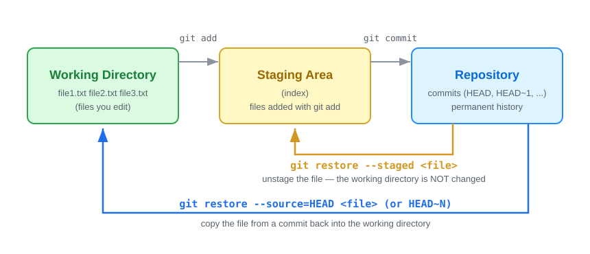
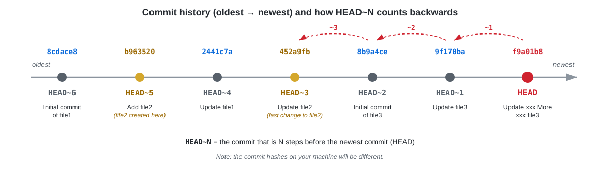

### Git Lab Exercise: Proficiency with `git restore`

#### Objective (วัตถุประสงค์)

LAB นี้จะพาฝึกใช้คำสั่ง `git restore` เพื่อ "ย้อนคืน" ไฟล์กลับไปยังสถานะที่ต้องการ ผ่านการลงมือทำจริงทีละขั้นตอน โดยภาพรวมของสิ่งที่นักศึกษาจะได้ทำมีดังนี้

1. **สร้าง repository และประวัติ commit ของตัวเอง** — เริ่มจาก `git init` แล้วสร้างไฟล์ `file1.txt`, `file2.txt`, `file3.txt` พร้อม commit ต่อเนื่องรวม 7 ครั้ง เพื่อให้มีประวัติสำหรับใช้ย้อนกลับในขั้นตอนถัดไป
2. **อ่านสถานะของ repository** — ใช้ `git log --oneline` ดูประวัติ commit และ `git status` ตรวจสอบว่าไฟล์อยู่ในสถานะใด (clean / modified / staged) หลังทำแต่ละคำสั่ง
3. **ยกเลิกการแก้ไขไฟล์ใน working directory** — แก้ไขไฟล์แล้วใช้ `git restore --source=HEAD <file>` เพื่อทิ้งการแก้ไขและดึงเนื้อหาจาก commit ล่าสุดกลับมา
4. **ดึงไฟล์เวอร์ชันเก่าจาก commit ก่อนหน้า** — ใช้ `git restore --source=HEAD~N <file>` เพื่อย้อนไฟล์กลับไปยัง commit ที่ N ก่อนหน้า และทำความเข้าใจว่า `HEAD~1`, `HEAD~2`, ... ชี้ไปที่ commit ใดในประวัติ
5. **ถอนไฟล์ออกจาก staging area** — ใช้ `git restore --staged <file>` เพื่อ unstage ไฟล์ที่ `git add` ไปแล้ว โดยการแก้ไขในไฟล์ยังคงอยู่ (คำสั่งนี้แตะเฉพาะ staging area ไม่แตะ working directory)

เมื่อจบ LAB นักศึกษาจะเข้าใจความแตกต่างของ `git restore` ทั้งสองรูปแบบ (คืนไฟล์ใน working directory กับถอนไฟล์จาก staging area) และสามารถเลือกใช้ได้ถูกสถานการณ์

The diagram below shows the two forms of `git restore` you will practice in this lab:



#### Setup
1. **Initialize a New Git Repository:**
   Begin by creating a new Git repository in your terminal:

   ```bash
   git init GitRestoreLab
   cd GitRestoreLab
   ```

   ```bash
   git init 
   ```

   > 📝 **คำอธิบาย:** `git init GitRestoreLab` จะสร้างโฟลเดอร์ใหม่ชื่อ `GitRestoreLab` พร้อม repository เปล่าข้างใน แล้วใช้ `cd` เข้าไปทำงานในโฟลเดอร์นั้น (ส่วน `git init` เฉยๆ ใช้ในกรณีที่สร้างโฟลเดอร์เองไว้แล้วและอยู่ข้างในโฟลเดอร์นั้นอยู่แล้ว — เลือกทำอย่างใดอย่างหนึ่งพอ)

2. **Create Files and Commit Sequentially:**
   Follow these steps for each of the five commits:

   - **Commit :**
     ```bash
     echo "Initial content in file1" > file1.txt
     git add file1.txt
     git commit -m "Initial commit of file1"
     ```

     > 📝 **คำอธิบาย:** `echo "..." > file1.txt` สร้างไฟล์ใหม่พร้อมเนื้อหา 1 บรรทัด (เครื่องหมาย `>` คือเขียนทับทั้งไฟล์) จากนั้น `git add` นำไฟล์เข้า staging area และ `git commit` บันทึกเป็น commit แรกของ repository

   - **Commit :**
     ```bash
     echo "Initial content in file2" > file2.txt
     git add file2.txt
     git commit -m "Add file2"
     ```

     > 📝 **คำอธิบาย:** สร้าง `file2.txt` และ commit เป็นครั้งที่ 2 — จุดนี้คือ commit ที่ `file2.txt` เกิดขึ้นครั้งแรก (จะเห็นความสำคัญตอน Task 3 เมื่อย้อนไฟล์กลับไปหา commit เก่าๆ)

   - **Commit :**
   ```bash
      echo "Update to file1" >> file1.txt
      git add file1.txt
      git commit -m "Update file1"
   ```
   ```bash
      echo "Update to file2" >> file2.txt
      git add file2.txt
      git commit -m "Update file2"
   ```

   > 📝 **คำอธิบาย:** สังเกตว่ารอบนี้ใช้ `>>` (ต่อท้ายไฟล์) ไม่ใช่ `>` (เขียนทับ) — ทั้ง `file1.txt` และ `file2.txt` จึงมี 2 บรรทัด และได้ commit เพิ่มอีก 2 ครั้ง (รวมเป็น 4) การอัปเดตไฟล์ทีละ commit แบบนี้ทำให้แต่ละไฟล์มี "เวอร์ชัน" หลายจุดในประวัติให้ย้อนกลับไปหาได้

- **Commit :**
   ```bash
      echo "Initial content in file3" > file3.txt
      git add file3.txt
      git commit -m "Initial commit of file3"
   ```
   ```bash
      echo "Update to file3" >> file3.txt
      git add file3.txt
      git commit -m "Update file3"
   ```

   > 📝 **คำอธิบาย:** สร้าง `file3.txt` แล้วอัปเดต 1 ครั้ง ได้ commit ที่ 5 และ 6 — ไฟล์นี้จะถูกใช้เป็นตัวทดลองใน Task 4 (เรื่อง staging area)

- **Commit :**
    ```bash
     echo "xxxx More xxxx Update to file3" >> file3.txt
     git add file3.txt
     git commit -m "Update xxx More xxx file3"
    ```

   > 📝 **คำอธิบาย:** commit ที่ 7 ซึ่งเป็น commit สุดท้าย — ตำแหน่งนี้คือ **HEAD** (commit ล่าสุดที่ branch ชี้อยู่) เมื่อจบ Setup ประวัติทั้งหมดจะมี 7 commits ให้ใช้ฝึก `git restore` ใน Tasks ถัดไป

   

#### Tasks
1. **Use `git log` and `git status`:**
   After each operation, examine the commit history and current status:

   ```bash
   git log --oneline
   git status
   ```

   > 📝 **คำอธิบาย:** `git log --oneline` แสดงประวัติ commit แบบย่อ (บรรทัดละ 1 commit เรียงจาก **ใหม่สุดอยู่บนสุด**) ส่วน `git status` บอกสถานะปัจจุบันของไฟล์ — ตอนนี้ควรเห็น commit ครบ 7 รายการ และ `working tree clean` เพราะยังไม่มีการแก้ไขใดๆ ค้างอยู่ ใน Tasks ถัดไปให้รันสองคำสั่งนี้หลังทุกการเปลี่ยนแปลง เพื่อสังเกตว่าอะไรเปลี่ยน (และอะไรไม่เปลี่ยน)

   ✅ **Expected output** (your commit hashes will be different):

   ```text
   $ git log --oneline
   f9a01b8 Update xxx More xxx file3
   9f170ba Update file3
   8b9a4ce Initial commit of file3
   452a9fb Update file2
   2441c7a Update file1
   b963520 Add file2
   8cdace8 Initial commit of file1

   $ git status
   On branch master
   nothing to commit, working tree clean
   ```

2. **Practice Using `git restore` with HEAD:**
   Modify a file and revert the changes using `HEAD`:

   ```bash
   echo "Additional line in file1" >> file1.txt
   git status  # Check the effect
   git log --oneline  # Check the effect
   ```

   > 📝 **คำอธิบาย:** เติมบรรทัดใหม่ลงท้าย `file1.txt` เพื่อ "จำลองการแก้ไขที่ยังไม่ได้ commit" — `git status` จะรายงานว่าไฟล์เป็น `modified` แต่ `git log` **ไม่เปลี่ยน** เพราะการแก้ไขใน working directory ยังไม่ถูกบันทึกเป็น commit

   ✅ **Expected output** — `file1.txt` is now **modified** (but `git log` does not change, because nothing was committed):

   ```text
   $ git status
   On branch master
   Changes not staged for commit:
     (use "git add <file>..." to update what will be committed)
     (use "git restore <file>..." to discard changes in working directory)
           modified:   file1.txt

   no changes added to commit (use "git add" and/or "git commit -a")

   $ cat file1.txt
   Initial content in file1
   Update to file1
   Additional line in file1
   ```

  ```bash
   git restore --source=HEAD file1.txt
   git status  # Check the effect
   git log --oneline  # Check the effect
   ```

   > 📝 **คำอธิบาย:** คำสั่งนี้ใช้ย้อนไฟล์กลับไปเป็นเวอร์ชันล่าสุดที่เคย commit ไว้ — Git จะดึงเนื้อหา `file1.txt` จาก commit ล่าสุด (HEAD) มาเขียนทับไฟล์ใน working directory ผลที่เกิดขึ้นคือ
   >
   > - บรรทัด `Additional line in file1` ที่เพิ่งเติมเข้าไป **หายไป** เพราะบรรทัดนี้ไม่มีอยู่ในเวอร์ชันของ HEAD
   > - `git status` กลับมาเป็น `working tree clean` เพราะไฟล์กลับไปตรงกับ commit ล่าสุดแล้ว
   > - `git log` **ไม่เปลี่ยน** เพราะคำสั่งนี้แก้เฉพาะไฟล์ ไม่ได้สร้างหรือลบ commit ใดๆ
   >
   > ⚠️ **ข้อควรระวัง:** การแก้ไขที่ถูกทิ้งด้วยวิธีนี้**กู้คืนไม่ได้** เพราะมันยังไม่เคยถูก commit — ก่อนใช้คำสั่งนี้ต้องแน่ใจว่าไม่ต้องการการแก้ไขนั้นแล้วจริงๆ

   ✅ **Expected output** — the extra line is gone and the working tree is clean again:

   ```text
   $ cat file1.txt
   Initial content in file1
   Update to file1

   $ git status
   On branch master
   nothing to commit, working tree clean
   ```


3. **Restore to Specific Commit and HEAD~3:**
   Alter a file and restore it to an earlier commit:

   ```bash
   echo "More Change in file2" >> file2.txt
   ```

   > 📝 **คำอธิบาย:** เติมบรรทัดลง `file2.txt` ให้มี 3 บรรทัด เพื่อใช้เป็นจุดตั้งต้นก่อนทดลองย้อนไฟล์กลับไปหา commit เก่าๆ

   Before choosing `N`, look at the history again. `HEAD~N` means "N commits **before** the latest commit":

   

   ** try to change N = 1,2,3..
   ```bash
   git restore --source=HEAD~N file2.txt
   ```

   > 📝 **คำอธิบาย:** `--source=HEAD~N` บอก Git ให้ดึง `file2.txt` เวอร์ชันของ commit ที่อยู่ก่อน HEAD ไป N ครั้งมาทับไฟล์ปัจจุบัน — ลองเปลี่ยนค่า N หลายๆ ค่าแล้ว `cat file2.txt` ดูทุกครั้ง จะเห็นเนื้อหาไฟล์ "เดินทางย้อนเวลา" ตามประวัติ commit (ใช้รูปด้านบนช่วยไล่ว่า N แต่ละค่าตรงกับ commit ไหน)

   ✅ **Expected output** — after adding the line, `file2.txt` has 3 lines:

   ```text
   $ cat file2.txt
   Initial content in file2
   Update to file2
   More Change in file2
   ```

   With `N = 1` the extra line disappears, because `file2.txt` in commit `HEAD~1` still had only 2 lines:

   ```text
   $ git restore --source=HEAD~1 file2.txt
   $ cat file2.txt
   Initial content in file2
   Update to file2
   ```

   With `N = 4` the file goes all the way back to its **initial content** (commit "Update file1" happened *before* "Update file2"), and `git status` reports the file as modified because it now differs from `HEAD`:

   ```text
   $ git restore --source=HEAD~4 file2.txt
   $ cat file2.txt
   Initial content in file2

   $ git status
   On branch master
   Changes not staged for commit:
     (use "git add <file>..." to update what will be committed)
     (use "git restore <file>..." to discard changes in working directory)
           modified:   file2.txt

   no changes added to commit (use "git add" and/or "git commit -a")
   ```

   You can bring the file back to the latest committed version at any time:

   ```text
   $ git restore --source=HEAD file2.txt
   $ cat file2.txt
   Initial content in file2
   Update to file2
   ```

   > 📝 **คำอธิบาย:** การย้อนด้วย `--source=HEAD~N` ไม่ได้ลบ commit ใดทิ้ง — ประวัติใน `git log` ยังครบ 7 รายการเหมือนเดิม เพียงแค่ไฟล์ใน working directory ถูกเปลี่ยนเนื้อหา ดังนั้นจึงกลับมาเวอร์ชันล่าสุดได้เสมอด้วย `--source=HEAD` ก่อนไป Task ถัดไป ให้รันคำสั่งนี้เพื่อให้ working tree กลับมา clean


4. **Stage Changes and Explore `git restore --staged`:**
   Stage changes in a file and then unstage them:

   ```bash
   echo "Further changes in file3" >> file3.txt
   git add file3.txt
   git status  # Verify staged
   ```

   > 📝 **คำอธิบาย:** เติมบรรทัดลง `file3.txt` แล้ว `git add` เพื่อนำการแก้ไขเข้า **staging area** — สังเกตว่า `git status` ย้ายไฟล์ไปอยู่ใต้หัวข้อ `Changes to be committed` แปลว่าถ้าสั่ง `git commit` ตอนนี้ การแก้ไขนี้จะถูกบันทึกทันที

   ✅ **Expected output** — the change is **staged** (ready to be committed):

   ```text
   $ git status
   On branch master
   Changes to be committed:
     (use "git restore --staged <file>..." to unstage)
           modified:   file3.txt
   ```

  ```bash
   git restore --staged file3.txt
   git status  # Verify unstage
   ```

   > 📝 **คำอธิบาย:** `git restore --staged file3.txt` คือการ **unstage** (ตรงข้ามกับ `git add`) — Git จะรีเซ็ต staging area ของไฟล์นี้กลับไปเท่ากับ HEAD ไฟล์จึงย้ายจาก `Changes to be committed` กลับมาเป็น `Changes not staged for commit` แต่**เนื้อหาไฟล์ใน working directory ไม่ถูกแตะเลย** — ลอง `cat file3.txt` จะเห็นบรรทัดที่เติมยังอยู่ครบ นี่คือข้อแตกต่างสำคัญจาก `git restore` แบบธรรมดาใน Task 2 ที่ทิ้งการแก้ไขจริงๆ

   ✅ **Expected output** — the file is **unstaged**, but notice that your change is still in the file (`git restore --staged` only touches the staging area, not the working directory):

   ```text
   $ git status
   On branch master
   Changes not staged for commit:
     (use "git add <file>..." to update what will be committed)
     (use "git restore <file>..." to discard changes in working directory)
           modified:   file3.txt

   no changes added to commit (use "git add" and/or "git commit -a")

   $ cat file3.txt
   Initial content in file3
   Update to file3
   xxxx More xxxx Update to file3
   Further changes in file3
   ```


#### Deliverables
- A detailed report documenting each step, the `git` commands used, and the outcomes observed.
- Analysis of the role of `git log` and `git status` in managing repository changes.

#### Conclusion
This lab is designed to provide a deep understanding of `git restore`, emphasizing its importance in precise version control and repository management in Git.
