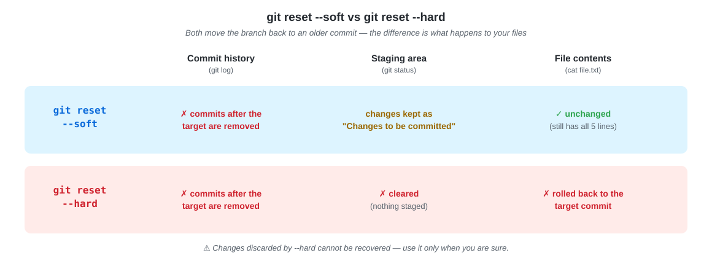
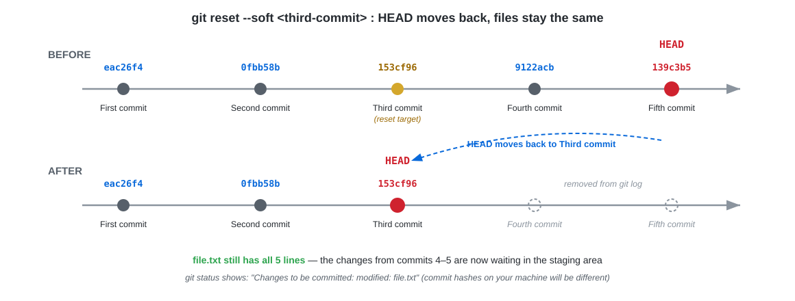
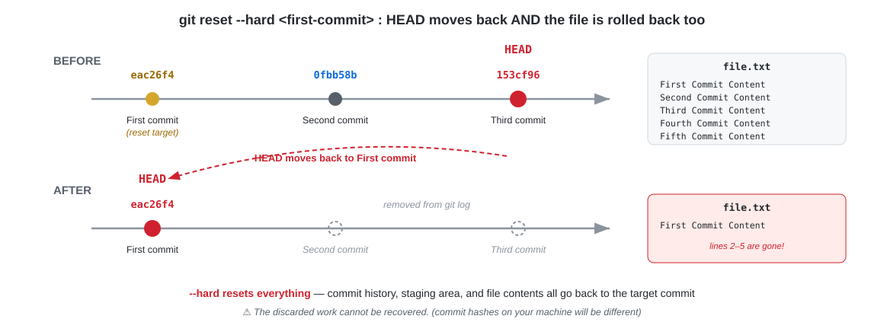

### Lab Title: Exploring Git Reset - Soft and Hard

#### Objective:
To understand and practice the use of `git reset` with `soft` and `hard` options in Git.

LAB นี้จะพาฝึกใช้คำสั่ง `git reset` เพื่อ "ถอย" branch กลับไปยัง commit เก่า โดยภาพรวมของสิ่งที่นักศึกษาจะได้ทำมีดังนี้

1. **สร้าง repository และประวัติ commit ของตัวเอง** — เริ่มจาก `git init` แล้วสร้างไฟล์ `file.txt` พร้อม commit ต่อเนื่องรวม 5 ครั้ง เพื่อให้มีประวัติสำหรับใช้ reset ในขั้นตอนถัดไป
2. **ใช้ `git reset --soft`** — ถอยกลับไปยัง commit ที่ 3 แล้วสังเกตว่า commit ที่ 4–5 หายไปจาก `git log` แต่**เนื้อหาไฟล์ไม่เปลี่ยน** (การแก้ไขถูกเก็บไว้ใน staging area)
3. **ใช้ `git reset --hard`** — ถอยกลับไปยัง commit แรก แล้วสังเกตว่าทั้ง commit และ**เนื้อหาไฟล์ถูกย้อนกลับทั้งหมด**

เมื่อจบ LAB นักศึกษาจะเข้าใจความแตกต่างของ `--soft` กับ `--hard` และรู้ว่าเมื่อไหร่ควรใช้แบบไหน

The diagram below summarizes the difference between the two options you will practice in this lab:



#### Prerequisites:
- Basic understanding of command-line interface and Git commands.
- Git installed on the student's computer.

#### Lab Steps:

1. **Setup and Initialization**
   - Create a new directory and initialize a Git repository:
     ```bash
     mkdir git-reset-lab
     cd git-reset-lab
     git init
     ```

   > 📝 **คำอธิบาย:** สร้างโฟลเดอร์ใหม่ชื่อ `git-reset-lab` แล้ว `git init` เพื่อสร้าง repository เปล่าข้างใน — ทุกอย่างใน LAB นี้จะทำอยู่ในโฟลเดอร์นี้

   ✅ **Expected output:**

   ```text
   Initialized empty Git repository in /root/git-reset-lab/.git/
   ```

2. **First Commit**
   - Create a file and make the first commit:
     ```bash
     echo "First Commit Content" > file.txt
     git add file.txt
     git commit -m "First commit"
     ```

   > 📝 **คำอธิบาย:** `echo "..." > file.txt` สร้างไฟล์ใหม่พร้อมเนื้อหา 1 บรรทัด (เครื่องหมาย `>` คือเขียนทับทั้งไฟล์) จากนั้น `git add` นำไฟล์เข้า staging area และ `git commit` บันทึกเป็น commit แรกของ repository

   ✅ **Expected output:**

   ```text
   [master (root-commit) eac26f4] First commit
    1 file changed, 1 insertion(+)
    create mode 100644 file.txt
   ```

3. **Second Commit**
   - Update the file and make the second commit:
     ```bash
     echo "Second Commit Content" >> file.txt
     git add file.txt
     git commit -m "Second commit"
     ```

   > 📝 **คำอธิบาย:** รอบนี้ใช้ `>>` (ต่อท้ายไฟล์) ไม่ใช่ `>` (เขียนทับ) — `file.txt` จึงมี 2 บรรทัด แล้ว commit เป็นครั้งที่ 2

   ✅ **Expected output:**

   ```text
   [master 0fbb58b] Second commit
    1 file changed, 1 insertion(+)
   ```

4. **Third Commit**
   - Append to the file and make the third commit:
     ```bash
     echo "Third Commit Content" >> file.txt
     git add file.txt
     git commit -m "Third commit"
     ```

   > 📝 **คำอธิบาย:** เติมบรรทัดที่ 3 แล้ว commit — **จำ commit นี้ไว้ให้ดี** เพราะใน Step 7 เราจะ reset กลับมาที่ commit นี้

   ✅ **Expected output:**

   ```text
   [master 153cf96] Third commit
    1 file changed, 1 insertion(+)
   ```

5. **Fourth Commit**
   - Continue updating the file for the fourth commit:
     ```bash
     echo "Fourth Commit Content" >> file.txt
     git add file.txt
     git commit -m "Fourth commit"
     ```

   > 📝 **คำอธิบาย:** เติมบรรทัดที่ 4 แล้ว commit เป็นครั้งที่ 4 — commit นี้ (และ commit ถัดไป) คือ commit ที่จะ "หายไป" หลังการ reset

   ✅ **Expected output:**

   ```text
   [master 9122acb] Fourth commit
    1 file changed, 1 insertion(+)
   ```

6. **Fifth Commit**
   - Finally, make the fifth commit:
     ```bash
     echo "Fifth Commit Content" >> file.txt
     git add file.txt
     git commit -m "Fifth commit"
     ```

   > 📝 **คำอธิบาย:** commit สุดท้าย (ครั้งที่ 5) — ตำแหน่งนี้คือ **HEAD** ก่อนเริ่มทดลอง reset ให้ตรวจสอบประวัติทั้งหมดด้วย `git log --oneline` และดูเนื้อหาไฟล์ด้วย `cat file.txt`

   ✅ **Expected output** (your commit hashes will be different):

   ```bash
   git log --oneline
   ```

   ```text
   139c3b5 Fifth commit
   9122acb Fourth commit
   153cf96 Third commit
   0fbb58b Second commit
   eac26f4 First commit
   ```

   ```bash
   cat file.txt
   ```

   ```text
   First Commit Content
   Second Commit Content
   Third Commit Content
   Fourth Commit Content
   Fifth Commit Content
   ```

7. **Using Git Reset Soft**
   - First, find the hash of the **third commit** from `git log --oneline` (in the example above it is `153cf96` — yours will be different).
   - Reset to the third commit using the `soft` option:
     ```bash
     git reset --soft <commit-hash-of-third-commit>
     ```
   - Instruct students to observe the staging area and commit history.

   

   > 📝 **คำอธิบาย:** `git reset --soft` จะย้าย HEAD (และ branch) ถอยกลับไปที่ commit ที่ 3 ผลที่เกิดขึ้นคือ
   >
   > - `git log` เหลือแค่ 3 commits — commit ที่ 4 และ 5 **หายไปจากประวัติ**
   > - **เนื้อหาไฟล์ไม่เปลี่ยนเลย** — `cat file.txt` ยังเห็นครบทั้ง 5 บรรทัด
   > - การแก้ไขจาก commit ที่ 4–5 ถูกเก็บไว้ใน **staging area** — `git status` แสดง `Changes to be committed` แปลว่าพร้อมจะ commit ใหม่ได้ทันที
   >
   > `--soft` จึงเหมาะกับกรณีเช่น อยากรวม commit หลายๆ ครั้งให้เป็น commit เดียว หรือ commit ผิด branch แล้วอยากเอางานไป commit ใหม่โดยไม่เสียการแก้ไข

   ✅ **Expected output** — the log now shows only 3 commits, but the file still has all 5 lines:

   ```bash
   git log --oneline
   ```

   ```text
   153cf96 Third commit
   0fbb58b Second commit
   eac26f4 First commit
   ```

   ```bash
   git status
   ```

   ```text
   On branch master
   Changes to be committed:
     (use "git restore --staged <file>..." to unstage)
           modified:   file.txt
   ```

   ```bash
   cat file.txt
   ```

   ```text
   First Commit Content
   Second Commit Content
   Third Commit Content
   Fourth Commit Content
   Fifth Commit Content
   ```

8. **Using Git Reset Hard**
   - Next, reset to the first commit using the `hard` option:
     ```bash
     git reset --hard <commit-hash-of-first-commit>
     ```

   

   > 📝 **คำอธิบาย:** `git reset --hard` ย้าย HEAD กลับไปที่ commit แรก และคราวนี้ **ทุกอย่างถูกย้อนกลับหมด**
   >
   > - `git log` เหลือ commit เดียว
   > - staging area ถูกเคลียร์ — `git status` กลับมาเป็น `working tree clean`
   > - **เนื้อหาไฟล์ถูกย้อนกลับด้วย** — `cat file.txt` เหลือแค่บรรทัดเดียว (บรรทัดที่ 2–5 หายไป)
   >
   > ⚠️ **ข้อควรระวัง:** งานที่ถูกทิ้งด้วย `--hard` ให้ถือว่า**กู้คืนไม่ได้** — ก่อนใช้คำสั่งนี้ต้องแน่ใจว่าไม่ต้องการงานส่วนนั้นแล้วจริงๆ

   ✅ **Expected output** — everything is rolled back to the first commit:

   ```bash
   git reset --hard eac26f4
   ```

   ```text
   HEAD is now at eac26f4 First commit
   ```

   ```bash
   git log --oneline
   ```

   ```text
   eac26f4 First commit
   ```

   ```bash
   git status
   ```

   ```text
   On branch master
   nothing to commit, working tree clean
   ```

   ```bash
   cat file.txt
   ```

   ```text
   First Commit Content
   ```

#### Summary (สรุป)

| | commit history (`git log`) | staging area (`git status`) | file contents (`cat`) |
|---|---|---|---|
| `git reset --soft <hash>` | ✂️ commits after `<hash>` are removed | changes kept as *"Changes to be committed"* | ✅ unchanged |
| `git reset --hard <hash>` | ✂️ commits after `<hash>` are removed | cleared (*"working tree clean"*) | ❌ rolled back to `<hash>` |
