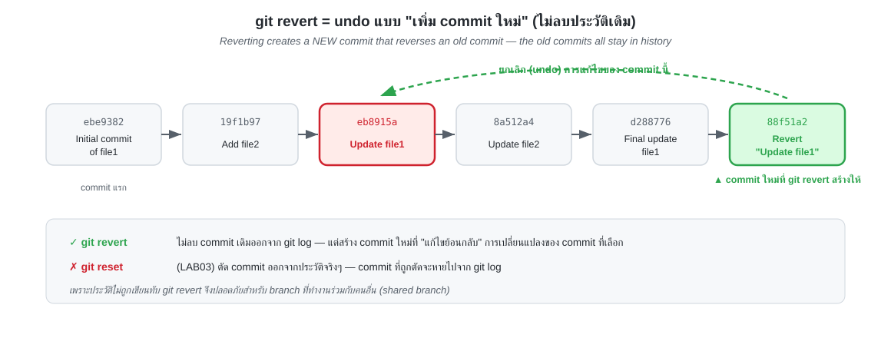
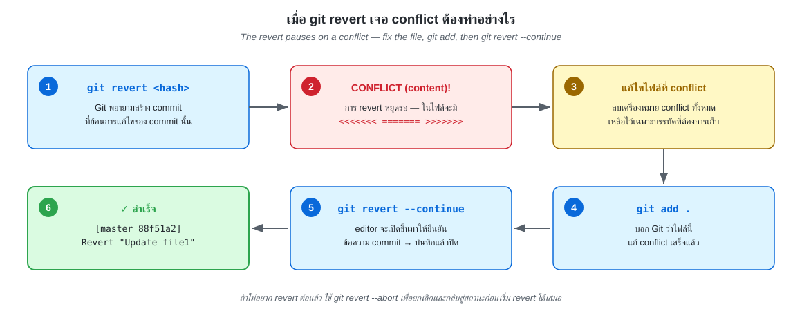

### Git Lab Exercise: Understanding `git revert`

#### Objective
Learn to effectively use the `git revert` command to undo changes in a Git repository. This lab will involve making five distinct commits and using `git revert` to undo some of these changes.

LAB นี้จะพาฝึกใช้คำสั่ง `git revert` เพื่อ "ย้อน" การแก้ไขของ commit ที่เลือก **โดยไม่ลบประวัติเดิม** ภาพรวมของสิ่งที่นักศึกษาจะได้ทำมีดังนี้

1. **สร้าง repository และประวัติ commit ของตัวเอง** — สร้างไฟล์ `file1.txt` และ `file2.txt` พร้อม commit ต่อเนื่องรวม 5 ครั้ง
2. **ใช้ `git revert` ย้อน commit ที่ 3** — จะพบว่าเกิด **merge conflict** (ตั้งใจให้เกิด!) เพราะ commit หลังจากนั้นแก้ไขไฟล์เดียวกันในบริเวณใกล้กัน
3. **ฝึกแก้ conflict** — แก้ไขไฟล์ ลบเครื่องหมาย conflict แล้วใช้ `git revert --continue` เพื่อจบการ revert
4. **สังเกตความแตกต่างจาก `git reset` (LAB03)** — commit เดิมยังอยู่ครบใน `git log` แต่มี commit ใหม่ชื่อ `Revert "..."` เพิ่มเข้ามา

The diagram below summarizes the key idea of this lab — `git revert` undoes a commit by **adding a new commit**, it never deletes history:



#### Setup
1. **Initialize a New Git Repository:**
   Begin by creating a new Git repository in your terminal:

   ```bash
   git init GitRevertLab
   cd GitRevertLab
   ```

   > 📝 **คำอธิบาย:** `git init GitRevertLab` สร้างโฟลเดอร์ใหม่พร้อม repository เปล่าข้างในให้ในคำสั่งเดียว — ทุกอย่างใน LAB นี้จะทำอยู่ในโฟลเดอร์นี้

   ✅ **Expected output:**

   ```text
   Initialized empty Git repository in /root/GitRevertLab/.git/
   ```

2. **Sequential File Creation and Committing:**
   Here are the steps for each of the five commits:

   - **Commit 1:**
     ```bash
     echo "Initial content in file1" > file1.txt
     git add file1.txt
     git commit -m "Initial commit of file1"
     ```

     > 📝 **คำอธิบาย:** สร้าง `file1.txt` ด้วยเนื้อหา 1 บรรทัด (เครื่องหมาย `>` คือเขียนทับทั้งไฟล์) แล้ว commit เป็น commit แรกของ repository

     ✅ **Expected output** (your commit hashes will be different):

     ```text
     [master (root-commit) ebe9382] Initial commit of file1
      1 file changed, 1 insertion(+)
      create mode 100644 file1.txt
     ```

   - **Commit 2:**
     ```bash
     echo "Initial content in file2" > file2.txt
     git add file2.txt
     git commit -m "Add file2"
     ```

     > 📝 **คำอธิบาย:** สร้างไฟล์ที่สอง `file2.txt` — LAB นี้ใช้ 2 ไฟล์ เพื่อให้เห็นภายหลังว่าการ revert บางครั้งก็เกิด conflict บางครั้งก็ไม่เกิด ขึ้นอยู่กับว่า commit หลังจากนั้นแก้ไฟล์เดียวกันหรือไม่

     ✅ **Expected output:**

     ```text
     [master 19f1b97] Add file2
      1 file changed, 1 insertion(+)
      create mode 100644 file2.txt
     ```

   - **Commit 3:**
     ```bash
     echo "Update to file1" >> file1.txt
     git add file1.txt
     git commit -m "Update file1"
     ```

     > 📝 **คำอธิบาย:** ใช้ `>>` (ต่อท้ายไฟล์) เติมบรรทัดที่ 2 ให้ `file1.txt` — **จำ commit นี้ไว้ให้ดี** เพราะใน Tasks เราจะ revert commit นี้ และจะเกิด conflict ให้ฝึกแก้

     ✅ **Expected output:**

     ```text
     [master eb8915a] Update file1
      1 file changed, 1 insertion(+)
     ```

   - **Commit 4:**
     ```bash
     echo "Update to file2" >> file2.txt
     git add file2.txt
     git commit -m "Update file2"
     ```

     > 📝 **คำอธิบาย:** เติมบรรทัดที่ 2 ให้ `file2.txt` แล้ว commit เป็นครั้งที่ 4

     ✅ **Expected output:**

     ```text
     [master 8a512a4] Update file2
      1 file changed, 1 insertion(+)
     ```

   - **Commit 5:**
     ```bash
     echo "Final update to file1" >> file1.txt
     git add file1.txt
     git commit -m "Final update file1"
     ```

     > 📝 **คำอธิบาย:** commit สุดท้าย (ครั้งที่ 5) เติมบรรทัดที่ 3 ให้ `file1.txt` — commit นี้แหละที่จะทำให้การ revert commit ที่ 3 เกิด conflict เพราะทั้งคู่แก้ไขบรรทัดที่อยู่ติดกันในไฟล์เดียวกัน

     ✅ **Expected output:**

     ```text
     [master d288776] Final update file1
      1 file changed, 1 insertion(+)
     ```

#### Tasks
1. **Use `git log` to View Commit History:**
   Familiarize yourself with the commit history to understand the changes made:

   ```bash
   git log --oneline
   ```

   > 📝 **คำอธิบาย:** `git log --oneline` แสดงประวัติแบบย่อ บรรทัดละ 1 commit เรียงจาก**ใหม่สุดอยู่บนสุด** — จด commit hash ของ commit ที่ 3 (`Update file1`) ไว้ เพราะจะใช้ในขั้นตอนถัดไป (hash ของแต่ละคนจะไม่เหมือนกัน)

   ✅ **Expected output** (your commit hashes will be different):

   ```text
   d288776 Final update file1
   8a512a4 Update file2
   eb8915a Update file1
   19f1b97 Add file2
   ebe9382 Initial commit of file1
   ```

   ตรวจสอบเนื้อหาไฟล์ทั้งสองก่อนเริ่ม revert:

   ```bash
   cat file1.txt
   ```

   ```text
   Initial content in file1
   Update to file1
   Final update to file1
   ```

   ```bash
   cat file2.txt
   ```

   ```text
   Initial content in file2
   Update to file2
   ```

2. **Revert Specific Commits:** : Don't worry if there are merge conflicts. We will resolve them in the next step.
   Choose a commit to revert. For example, revert the third commit:

   ```bash
   git revert <commit-hash-of-third-commit>
   # Follow prompts to complete the revert
   git log --oneline  # Verify the revert
   ```

   Repeat this process for other commits you wish to revert.

   > 📝 **คำอธิบาย:** `git revert` จะพยายามสร้าง commit ใหม่ที่ "แก้ไขย้อนกลับ" การเปลี่ยนแปลงของ commit ที่ 3 (คือลบบรรทัด `Update to file1` ออก) แต่เนื่องจาก commit ที่ 5 ได้เติมบรรทัด `Final update to file1` ไว้**ติดกัน**ในไฟล์เดียวกัน Git จึงไม่แน่ใจว่าจะรวมการแก้ไขอย่างไร → เกิด **CONFLICT** และการ revert จะหยุดรอให้เราแก้ก่อน (ตรงตามที่โจทย์บอกว่า "Don't worry")

   ✅ **Expected output** — the revert stops with a conflict (ใช้ hash ของ commit ที่ 3 ของตัวเอง):

   ```bash
   git revert eb8915a
   ```

   ```text
   Auto-merging file1.txt
   CONFLICT (content): Merge conflict in file1.txt
   error: could not revert eb8915a... Update file1
   hint: After resolving the conflicts, mark them with
   hint: "git add/rm <pathspec>", then run
   hint: "git revert --continue".
   hint: You can instead skip this commit with "git revert --skip".
   hint: To abort and get back to the state before "git revert",
   hint: run "git revert --abort".
   ```

   ตรวจสอบสถานะและดูเครื่องหมาย conflict ในไฟล์:

   ```bash
   git status
   ```

   ```text
   On branch master
   You are currently reverting commit eb8915a.
     (fix conflicts and run "git revert --continue")
     (use "git revert --skip" to skip this patch)
     (use "git revert --abort" to cancel the revert operation)

   Unmerged paths:
     (use "git restore --staged <file>..." to unstage)
     (use "git add <file>..." to mark resolution)
           both modified:   file1.txt

   no changes added to commit (use "git add" and/or "git commit -a")
   ```

   ```bash
   cat file1.txt
   ```

   ```text
   Initial content in file1
   <<<<<<< HEAD
   Update to file1
   Final update to file1
   =======
   >>>>>>> parent of eb8915a (Update file1)
   ```

   > 📝 **อ่านเครื่องหมาย conflict:** ส่วนบน (`<<<<<<< HEAD` ถึง `=======`) คือเนื้อหาปัจจุบันของเรา ส่วนล่าง (`=======` ถึง `>>>>>>>`) คือเนื้อหาที่ Git อยากย้อนกลับไป (ก่อนมี commit ที่ 3 — ซึ่งว่างเปล่า) — เราต้องตัดสินใจเองว่าผลลัพธ์สุดท้ายควรเป็นอย่างไร

3. **Resolve Conflicts if They Occur:**
   If a revert causes conflicts, resolve them manually, then complete the revert:

   ```bash
   # Edit the conflicted files
   git add .
   git revert --continue
   git log --oneline  # Verify the revert
   ```

   

   > 📝 **คำอธิบาย:** เป้าหมายของการ revert commit ที่ 3 คือ **ลบบรรทัด `Update to file1`** แต่**เก็บบรรทัด `Final update to file1`** (ของ commit ที่ 5) ไว้ ดังนั้นให้เปิดไฟล์ด้วย editor (เช่น `nano file1.txt` หรือ `vi file1.txt`) แล้วแก้ให้เหลือแค่ 2 บรรทัดนี้:
   >
   > ```text
   > Initial content in file1
   > Final update to file1
   > ```
   >
   > (ลบเครื่องหมาย `<<<<<<<`, `=======`, `>>>>>>>` และบรรทัด `Update to file1` ออกให้หมด) จากนั้น `git add .` เพื่อบอกว่าแก้เสร็จแล้ว และ `git revert --continue` เพื่อจบการ revert — ขั้นตอนนี้ editor จะเปิดขึ้นมาให้ยืนยันข้อความ commit ให้**บันทึกแล้วปิด** (nano: `Ctrl+O`, `Enter`, `Ctrl+X` / vi: `:wq`)

   ✅ **Expected output** — after editing the file, `git add .` and `git revert --continue`:

   ```text
   [master 88f51a2] Revert "Update file1"
    1 file changed, 1 deletion(-)
   ```

   ```bash
   git log --oneline
   ```

   ```text
   88f51a2 Revert "Update file1"
   d288776 Final update file1
   8a512a4 Update file2
   eb8915a Update file1
   19f1b97 Add file2
   ebe9382 Initial commit of file1
   ```

   ```bash
   cat file1.txt
   ```

   ```text
   Initial content in file1
   Final update to file1
   ```

   > 📝 **สังเกต:** commit ที่ 3 (`eb8915a Update file1`) **ยังอยู่ในประวัติ** ไม่ได้หายไปไหน — สิ่งที่เพิ่มเข้ามาคือ commit ใหม่ `Revert "Update file1"` ที่แก้ไขย้อนกลับให้ และบรรทัด `Update to file1` หายไปจากไฟล์แล้ว นี่คือความแตกต่างสำคัญจาก `git reset` ใน LAB03

4. **Revert Another Commit (no conflict this time):**
   Now revert the fourth commit (`Update file2`) — this one completes without any conflict:

   ```bash
   git revert <commit-hash-of-fourth-commit>
   git log --oneline  # Verify the revert
   ```

   > 📝 **คำอธิบาย:** รอบนี้ revert ผ่านทันทีโดยไม่มี conflict เพราะหลังจาก commit ที่ 4 **ไม่มี commit ไหนแก้ `file2.txt` อีกเลย** Git จึงย้อนการแก้ไขได้อย่างมั่นใจ — editor จะเปิดขึ้นมาให้ยืนยันข้อความ commit เช่นเดิม ให้บันทึกแล้วปิด

   ✅ **Expected output:**

   ```bash
   git revert 8a512a4
   ```

   ```text
   [master afafcf3] Revert "Update file2"
    1 file changed, 1 deletion(-)
   ```

   ```bash
   git log --oneline
   ```

   ```text
   afafcf3 Revert "Update file2"
   88f51a2 Revert "Update file1"
   d288776 Final update file1
   8a512a4 Update file2
   eb8915a Update file1
   19f1b97 Add file2
   ebe9382 Initial commit of file1
   ```

   ```bash
   cat file2.txt
   ```

   ```text
   Initial content in file2
   ```

#### Summary (สรุป)

| | `git revert <hash>` | `git reset <hash>` (LAB03) |
|---|---|---|
| ประวัติ commit เดิม | ✅ อยู่ครบ — เพิ่ม commit ใหม่ `Revert "..."` ต่อท้าย | ✂️ commit หลัง `<hash>` ถูกตัดออกจากประวัติ |
| ย้อนได้เฉพาะ commit ที่เลือก | ✅ ได้ — เลือก commit ไหนก็ได้ในอดีต | ❌ ไม่ได้ — ถอยกลับไปทั้งหมดจนถึง `<hash>` |
| เหมาะกับ branch ที่ใช้ร่วมกับคนอื่น | ✅ ปลอดภัย เพราะไม่เขียนประวัติทับ | ⚠️ ควรเลี่ยง เพราะประวัติถูกเขียนใหม่ |
| อาจเกิด merge conflict | ⚠️ ได้ ถ้ามี commit หลังจากนั้นแก้ไฟล์บริเวณเดียวกัน | ไม่เกิด |

#### Conclusion
This lab is aimed at providing a hands-on understanding of `git revert` and its impact on a Git repository, emphasizing its role in undoing changes and managing the project's history.
