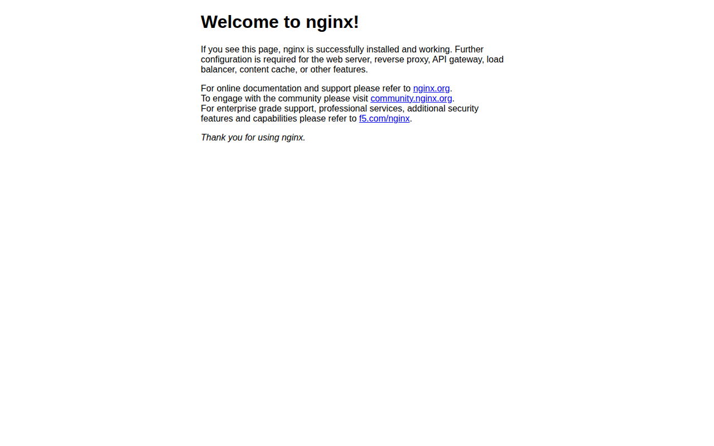

# LAB 2 — Nginx + Port Mapping

> โฟลเดอร์ `002_LAB_Nginx_Port_Mapping` = **LAB 2** ในสไลด์ `Docker_Basics_Run_Port_Volume_Build.html`
> (LAB 1 เป็นคำสั่ง `docker run` พื้นฐาน อยู่ในโฟลเดอร์ `001_LAB_Docker_Run` — เอกสารล้วน ไม่มีไฟล์โค้ด)

## สิ่งที่จะได้เรียนรู้

- เปิดเว็บเซิร์ฟเวอร์ Nginx ด้วยคำสั่งเดียว โดยไม่ต้องติดตั้งอะไรเลย
- `-p HOST_PORT:CONTAINER_PORT` ทำงานอย่างไร
- **กฎเหล็ก** : host port ห้ามซ้ำ · container port ซ้ำได้

## ภาพรวมของแล็บนี้

1. **เตรียมเครื่องเรียนและ clone โค้ด** — ยืนยันว่า Docker ในเครื่องเรียนพร้อมใช้งานก่อนเริ่ม
2. **รัน nginx แบบ foreground หนึ่งครั้ง** — พิสูจน์ว่า Docker ไป pull image ให้เองเมื่อไม่มีในเครื่อง และเห็น log ของ nginx วิ่งสด ๆ จนกด `Ctrl+C`
3. **รันใหม่แบบ detached (`-d`) ตั้งชื่อ `web1`** — พิสูจน์ว่า container ทำงานเบื้องหลังได้ เราได้ prompt คืนมาสั่งคำสั่งอื่นต่อทันที
4. **ทดสอบด้วย `curl` แล้วอ่าน `docker logs`** — พิสูจน์ว่า request วิ่งจาก port ของเครื่องเรา ผ่าน port mapping เข้าไปถึง nginx ในกล่องจริง จากนั้น forward port ออกมาเปิดดูในเบราว์เซอร์
5. **รันเพิ่มเป็น 3 กล่อง ด้วย host port คนละเบอร์** — พิสูจน์ว่า container port ซ้ำกันได้ เพราะแต่ละกล่องมี network เป็นของตัวเอง
6. **จงใจใช้ host port ซ้ำ** — เห็น error `port is already allocated`, exit code `125` และ container ที่ค้างสถานะ `Created` แล้วจึงเก็บกวาดให้เกลี้ยง

---

## 0. เตรียมเครื่องเรียน

ทำบนเครื่องของเราเอง (ไม่ใช้ cloud) — เปิด container ที่ติดตั้ง Docker มาให้แล้ว

```bash
docker rm -f devtools
docker run -dit --name devtools --privileged -p 2222:22 tuchsanai/devtools:2569_1
ssh root@localhost -p 2222        # password : passwd
```

> 📝 **คำอธิบาย:** สามบรรทัดนี้คือการ "เปิดเครื่องเรียน" แล้วเดินเข้าไปข้างใน · `docker rm -f devtools`
> ลบเครื่องเรียนตัวเดิมทิ้งก่อน กันปัญหาชื่อซ้ำ (`-f` = force คือลบทั้งที่ยังรันอยู่) · `-dit` คือ `-d` รันเบื้องหลัง +
> `-i` เปิด stdin ค้างไว้ + `-t` ให้มี terminal รวมกันแล้วกล่องจะไม่ดับทันที · `--privileged` ให้สิทธิ์เต็มเพื่อรัน
> Docker ซ้อนอยู่ข้างในกล่องได้ · `-p 2222:22` ส่ง port 2222 ของเครื่องเรา เข้า port 22 (SSH) ของกล่อง
> ถ้ายังไม่เคยสร้าง `devtools` มาก่อน บรรทัดแรกจะไม่พิมพ์อะไรออกมาเลย (Docker รุ่นใหม่ `rm -f` จะเงียบเมื่อไม่พบ container) ไม่ใช่ error

> ใน VS Code ใช้ **Remote-SSH** ต่อไปที่ `root@localhost:2222` แล้วทำแล็บทั้งหมดข้างใน

ตรวจว่าพร้อมใช้งาน :

```bash
docker --version
docker compose version
```

> 📝 **คำอธิบาย:** ถามเวอร์ชันของ Docker engine และของ Compose เพื่อยืนยันว่าเราอยู่ "ในเครื่องเรียน" จริง
> และ Docker daemon ทำงานอยู่ก่อนจะเริ่มแล็บ สังเกตว่าเป็น `docker compose` (เว้นวรรค) ไม่ใช่ `docker-compose`
> (ขีดกลาง) ซึ่งเป็นรุ่นเก่าที่เลิกใช้แล้ว ถ้าขึ้น `Cannot connect to the Docker daemon` แปลว่า daemon ยังไม่ขึ้น
> ให้รอสักครู่แล้วลองใหม่

✅ **Expected output** — ขอแค่ทั้งสองบรรทัดขึ้น "เลขเวอร์ชัน" ไม่ใช่ error (เลขเวอร์ชันของแต่ละเครื่องอาจไม่ตรงกับเอกสารนี้):

```
Docker version 29.6.2, build dfc4efb
Docker Compose version v5.3.1
```

---

## 1. Clone โค้ดแล็บ

```bash
mkdir -p ~/labwork
cd ~/labwork
git clone https://github.com/Tuchsanai/DevTools.git
cd DevTools/03_Docker/01_Docker/002_LAB_Nginx_Port_Mapping
```

> 📝 **คำอธิบาย:** `mkdir -p ~/labwork` สร้างโฟลเดอร์เก็บงาน (`-p` = ถ้ามีอยู่แล้วก็ไม่ต้อง error) · `git clone`
> ดึงรีโพของวิชาลงมาไว้ในเครื่องเรียน · แล้ว `cd` เข้าโฟลเดอร์ของแล็บนี้ ทำครั้งเดียวใช้ได้ทุกแล็บของสัปดาห์นี้
> ระหว่าง clone จะเห็นบรรทัด `Cloning into 'DevTools'...` กับตัวเลขเปอร์เซ็นต์วิ่งขึ้นมา ถ้าเคย clone ไว้แล้ว git
> จะบอกว่าโฟลเดอร์ปลายทางไม่ว่าง กรณีนั้นข้ามไป `cd` เข้าโฟลเดอร์เดิมได้เลย

---

## 2. รัน Nginx พร้อม Port Mapping

```bash
docker run -p 8080:80 nginx
```

> 📝 **คำอธิบาย:** `docker run` สร้างและเริ่ม container ใหม่ · `-p 8080:80` เปิด port 8080 บนเครื่องเรียน
> แล้วส่งต่อเข้า port 80 ในกล่อง (เลข **ซ้าย = ของเรา** · เลข **ขวา = ของกล่อง** ที่ nginx ฟังอยู่) ·
> `nginx` คือ image ที่จะใช้ รอบนี้จงใจ **ไม่ใส่ `-d`** เพื่อให้เห็นว่า foreground เป็นอย่างไร — terminal
> จะค้างและพิมพ์ log ของ nginx ออกมาสด ๆ จนกว่าจะกด `Ctrl+C`

ครั้งแรกจะไม่มี image ในเครื่อง Docker จึง **pull ให้อัตโนมัติ** แล้วค่อยรัน :

✅ **Expected output** — ดูบรรทัด `Status: Downloaded newer image for nginx:latest` แล้วต่อด้วย `start worker processes` ถือว่า nginx ขึ้นแล้ว (digest, เวลา, จำนวน layer และเลข worker ของแต่ละเครื่องจะไม่ตรงกับเอกสารนี้):

```
Unable to find image 'nginx:latest' locally
latest: Pulling from library/nginx
5a4222b844e8: Pulling fs layer
        ... (รวม 7 layer) ...
Digest: sha256:8541484afbc9c8a5a8a99b379568ebbc957f658583ec9448fc43104229c03cf8
Status: Downloaded newer image for nginx:latest
/docker-entrypoint.sh: Configuration complete; ready for start up
2026/08/10 16:15:37 [notice] 1#1: nginx/1.31.3
2026/08/10 16:15:37 [notice] 1#1: start worker processes
2026/08/10 16:15:37 [notice] 1#1: start worker process 29
        ... (worker process 30–60 ตามจำนวน CPU) ...
        ^ ค้างอยู่ตรงนี้ — container ยังทำงาน กด Ctrl+C เพื่อหยุด
^C2026/08/10 16:15:44 [notice] 1#1: signal 2 (SIGINT) received, exiting
        ... (worker ทุกตัว exiting → exit) ...
2026/08/10 16:15:44 [notice] 1#1: exit
```

รันแบบนี้เป็น **foreground** — terminal จะค้าง และเมื่อกด `Ctrl+C` nginx จะรับ **SIGINT** ปิด worker ทุกตัวอย่างเรียบร้อยก่อนจบ

พูดให้ลึกอีกนิด : `Ctrl+C` ส่งสัญญาณไปที่ **process หมายเลข 1 ในกล่อง** (คือ nginx เอง) ไม่ได้ "ฆ่า" กล่องดื้อ ๆ
nginx จึงมีเวลาปิด worker ทีละตัวแล้วจึงจบด้วยบรรทัด `exit` — นี่คือการหยุดแบบสุภาพ (graceful shutdown)
ส่วนจำนวน worker ที่เห็นจะเท่ากับจำนวน CPU ของเครื่อง ของแต่ละคนจึงไม่เท่ากัน

container ที่หยุดแล้วยังค้างอยู่ในเครื่อง — เก็บกวาดก่อนรันรอบใหม่ :

```bash
docker rm -f $(docker ps -aq) 2>/dev/null
```

> 📝 **คำอธิบาย:** `docker ps -aq` พิมพ์ **ID ของ container ทุกตัว** ออกมา (`-a` = รวมตัวที่หยุดแล้ว ·
> `-q` = quiet เอาเฉพาะ ID) แล้ว `$( )` ส่งรายการนั้นต่อให้ `docker rm -f` ลบทิ้งทั้งหมด · `2>/dev/null`
> โยนข้อความ error ทิ้ง เผื่อกรณีไม่มี container เหลือให้ลบ ที่ต้องลบเพราะ container ที่กด `Ctrl+C` ไปเมื่อกี้
> **หยุดแล้วแต่ยังไม่หาย** และยังจองชื่อกับ port ไว้อยู่ ระวัง: คำสั่งนี้ลบ **ทุก** container ในเครื่องเรียน

✅ **Expected output** — ได้ ID สั้น 12 ตัวอักษรของ container ที่ถูกลบ ตัวละบรรทัด (ID ของแต่ละคนจะไม่ตรงกับเอกสารนี้ และถ้าไม่มี container เหลืออยู่เลย จะไม่มีอะไรพิมพ์ออกมา):

```
076779a1b4d7
```

ถ้าอยากได้ prompt คืนตั้งแต่แรก ให้เติม `-d` (detached) :

```bash
docker run -d -p 8080:80 --name web1 nginx
```

> 📝 **คำอธิบาย:** `-d` (detached) สั่งให้ container ไปทำงานเบื้องหลังแล้วคืน prompt กลับมาทันที ·
> `--name web1` ตั้งชื่อไว้เรียกง่าย ไม่ต้องจำ container ID สิ่งที่ Docker พิมพ์กลับมาคือ **container ID เต็ม
> 64 ตัวอักษร** ไม่ใช่ error รอบนี้ไม่มีข้อความ pull แล้ว เพราะ image `nginx` ถูกเก็บไว้ในเครื่องตั้งแต่รอบที่แล้ว

✅ **Expected output** — ได้ container ID ยาว ๆ กลับมาบรรทัดเดียว แล้วได้ prompt คืนทันที (ID ของแต่ละคนจะไม่ซ้ำกัน):

```
f51b32b42d5095604e974b35877933b889ecfee7e9b27f129ab400648722c584
```

```bash
docker ps
```

> 📝 **คำอธิบาย:** `docker ps` แสดงเฉพาะ container ที่ **กำลังทำงานอยู่** เรียกตรงนี้เพื่อยืนยันว่า `web1`
> ไม่ได้ดับไปหลังจากคืน prompt ให้ดู 2 คอลัมน์เป็นหลัก : `STATUS` ต้องขึ้น `Up ...` และ `PORTS` ต้องมีลูกศร
> `8080->80/tcp` ซึ่งคือ port mapping ที่เราสั่งไว้ สังเกตว่า CONTAINER ID ในตารางเป็น 12 ตัวอักษรแรก
> ของ ID ยาวที่ได้มาเมื่อกี้

✅ **Expected output** — ดูคอลัมน์ `STATUS` ว่าเป็น `Up ...` และ `PORTS` มี `0.0.0.0:8080->80/tcp` (CONTAINER ID และเวลาของแต่ละคนจะไม่ตรงกับเอกสารนี้):

```
CONTAINER ID   IMAGE     COMMAND                  CREATED         STATUS         PORTS                                     NAMES
f51b32b42d50   nginx     "/docker-entrypoint.…"   5 seconds ago   Up 4 seconds   0.0.0.0:8080->80/tcp, [::]:8080->80/tcp   web1
```

---

## 3. ทดสอบ

```bash
curl -I http://localhost:8080
```

> 📝 **คำอธิบาย:** `curl` ยิง HTTP request จาก terminal ได้เลย ไม่ต้องเปิดเบราว์เซอร์ · `-I` (ตัว i ใหญ่)
> ขอเฉพาะ **header** ไม่เอาเนื้อหน้าเว็บ ยิงตรงนี้เพื่อพิสูจน์ว่า request เดินทางจาก host port 8080
> ผ่าน port mapping เข้าไปถึง nginx ในกล่องจริง ให้อ่านบรรทัดแรกเป็นหลัก ที่เหลือเป็นรายละเอียดประกอบ

✅ **Expected output** — บรรทัดแรกต้องเป็น `HTTP/1.1 200 OK` (วันที่และเวลาของแต่ละคนจะไม่ตรงกับเอกสารนี้):

```
HTTP/1.1 200 OK
Server: nginx/1.31.3
Date: Mon, 10 Aug 2026 16:16:06 GMT
Content-Type: text/html
Content-Length: 896
```

```bash
curl http://localhost:8080
```

> 📝 **คำอธิบาย:** คำสั่งเดิมแต่ตัด `-I` ออก คราวนี้ curl จะพิมพ์ **เนื้อ HTML** ของหน้าแรกออกมา ซึ่งคือหน้าเดียวกัน
> กับที่จะเห็นในเบราว์เซอร์ ทำเพื่อยืนยันว่าไม่ได้แค่ "ต่อติด" แต่ได้ไฟล์จริงจาก nginx กลับมาด้วย

✅ **Expected output** — มองหาคำว่า `Welcome to nginx!` ก็พอ (ของจริงจะยาวกว่านี้ เอกสารตัดมาให้ดูเฉพาะบรรทัดหลัก):

```html
<title>Welcome to nginx!</title>
<h1>Welcome to nginx!</h1>
<p>If you see this page, nginx is successfully installed and working. ...
```

ดู access log ที่เกิดจาก `curl` เมื่อกี้ :

```bash
docker logs web1
```

> 📝 **คำอธิบาย:** `docker logs <ชื่อ container>` ดึงสิ่งที่โปรแกรมในกล่องพิมพ์ออกทาง stdout/stderr มาดูย้อนหลัง
> โดยไม่ต้องเข้าไปในกล่อง ดูตอนนี้เพื่อจะเห็นว่า `curl` สองครั้งเมื่อกี้กลายเป็น access log สองบรรทัดพอดี
> (`HEAD` มาจาก `-I` และ `GET` มาจากคำสั่งถัดมา) ส่วน IP ต้นทาง `172.18.0.1` คือ gateway ของ Docker network
> ไม่ใช่ IP ของตัวกล่องเอง — nginx มองเห็นเราเข้ามาทางนั้น

✅ **Expected output** — ต้องมี 2 บรรทัด บรรทัดแรกมี `"HEAD / HTTP/1.1" 200` และบรรทัดที่สองมี `"GET / HTTP/1.1" 200` (วันที่ เวลา และเวอร์ชัน curl ของแต่ละคนจะต่างกัน):

```
172.18.0.1 - - [10/Aug/2026:16:16:06 +0000] "HEAD / HTTP/1.1" 200 0 "-" "curl/8.5.0" "-"
172.18.0.1 - - [10/Aug/2026:16:16:10 +0000] "GET / HTTP/1.1" 200 896 "-" "curl/8.5.0" "-"
```

### เปิดดูในเบราว์เซอร์ — Forward Port ใน VS Code

port `8080` เปิดอยู่ **ข้างในเครื่องเรียน** ไม่ใช่บนเครื่องเราโดยตรง — ต้องให้ VS Code
forward port ออกมาก่อน (VS Code จะสร้าง **SSH tunnel** ให้อัตโนมัติ) :

1. เปิดแท็บ **PORTS** (แถวเดียวกับ TERMINAL)
2. กดปุ่ม **Forward a Port**
3. พิมพ์ `8080` แล้วกด **Enter**
4. เปิด `http://localhost:8080` ในเบราว์เซอร์ (หรือคลิกไอคอนลูกโลกในแถวของ port)


ผลที่ได้ในเบราว์เซอร์ :



#### ทางเลือก : forward ด้วยคำสั่ง `ssh -L` (ไม่ใช้ VS Code)

เปิด terminal ใหม่บนเครื่องเรา แล้ว **ssh เข้าไปยัง port ภายในเครื่องเรียน** โดยตรง :

```bash
ssh -L 8080:localhost:8080 root@localhost -p 2222        # password : passwd
```

> 📝 **คำอธิบาย:** ทำ SSH tunnel ด้วยมือ แทนการกดปุ่มในแท็บ PORTS · `-L 8080:localhost:8080` สั่งให้ ssh
> เปิด port 8080 บนเครื่องเรา แล้วส่งทุก connection ผ่านท่อ ssh ไปโผล่ที่ `localhost:8080` ฝั่งเครื่องเรียน ·
> `-p 2222` ตรงนี้คือ port ของ SSH (คนละความหมายกับ `-p` ของ `docker run`) หน้าต่างนี้ต้องเปิดค้างไว้ —
> ปิดเมื่อไหร่ tunnel หายทันที และเบราว์เซอร์จะเปิดหน้าเว็บไม่ได้อีก

| ส่วนของคำสั่ง | ความหมาย |
|---|---|
| `-L 8080:localhost:8080` | ผูก port `8080` บนเครื่องเรา เข้ากับ port `8080` **ภายในเครื่องเรียน** (SSH tunnel) |
| `root@localhost -p 2222` | ssh เข้าเครื่องเรียน `devtools` ตามปกติ |

ตราบใดที่ ssh session นี้ยังเปิดอยู่ เปิด `http://localhost:8080` ในเบราว์เซอร์ได้ทันที

#### ทดลองเสร็จแล้ว — ลบ tunnel ทุกครั้ง

- แบบ `ssh -L` : พิมพ์ `exit` (หรือกด `Ctrl+D`) ใน session นั้น — tunnel ปิดทันที
- แบบ VS Code : แท็บ **PORTS** → คลิกขวาที่ port → **Stop Forwarding Port**

---

## 4. กฎเหล็กของ Port Mapping

รัน 3 container จาก image เดียวกัน โดยใช้ **host port ต่างกัน** :

```bash
docker run -d -p 8000:80 --name web2 nginx
docker run -d -p 8001:80 --name web3 nginx
docker ps
```

> 📝 **คำอธิบาย:** เพิ่ม nginx อีก 2 กล่อง โดยจงใจให้ **host port ต่างกัน** (8000 และ 8001) แต่ปล่อยให้
> container port เป็น 80 เหมือนกันหมด แล้วเรียก `docker ps` เพื่อดูผลรวมทั้ง 3 ตัวในตารางเดียว
> จุดที่ต้องดูคือคอลัมน์ `PORTS` — อ่านตามแนวตั้งจะเห็นว่าเลขฝั่งซ้ายไม่ซ้ำกันเลยสักตัว ส่วนเลขฝั่งขวาเป็น 80 ทั้งหมด
> นั่นคือกฎเหล็กทั้งข้อ

✅ **Expected output** — ต้องเห็นครบ 3 แถว (`web1` `web2` `web3`) สถานะ `Up` ทุกแถว และ host port 8080 / 8000 / 8001 ไม่ซ้ำกัน (CONTAINER ID และเวลาของแต่ละคนจะไม่ตรงกับเอกสารนี้):

```
CONTAINER ID   IMAGE     COMMAND                  CREATED         STATUS         PORTS                                     NAMES
ffaff645adcc   nginx     "/docker-entrypoint.…"   3 seconds ago   Up 3 seconds   0.0.0.0:8001->80/tcp, [::]:8001->80/tcp   web3
61d58a7e5fff   nginx     "/docker-entrypoint.…"   6 seconds ago   Up 6 seconds   0.0.0.0:8000->80/tcp, [::]:8000->80/tcp   web2
f51b32b42d50   nginx     "/docker-entrypoint.…"   2 minutes ago   Up 2 minutes   0.0.0.0:8080->80/tcp, [::]:8080->80/tcp   web1
```

ทั้ง 3 ตัวใช้ **container port 80 เหมือนกันหมด** แต่ไม่ชนกัน เพราะแต่ละ container มี **network stack และ IP ของตัวเอง** — port 80 ของกล่องหนึ่ง ไม่ใช่ port 80 ของอีกกล่อง :

```bash
docker exec web1 hostname -i     # 172.18.0.2
docker exec web2 hostname -i     # 172.18.0.3
docker exec web3 hostname -i     # 172.18.0.4
```

> 📝 **คำอธิบาย:** `docker exec <ชื่อ> <คำสั่ง>` สั่งให้คำสั่งนั้นทำงาน **ข้างในกล่องที่กำลังรันอยู่** ·
> `hostname -i` พิมพ์ IP ที่กล่องนั้นได้รับมาจาก Docker network รันสามบรรทัดนี้เพื่อพิสูจน์ด้วยตาว่าแต่ละกล่อง
> ได้ IP คนละเบอร์ จึงถือ port 80 ของตัวเองได้โดยไม่ชนใคร เลขที่เขียนไว้หลัง `#` คือผลที่ได้จริงบนเครื่องเรียน
> ของแต่ละคนอาจเป็น `172.x.0.x` เบอร์อื่น แต่ที่ต้องเหมือนกันคือ **ทั้งสามต้องไม่ซ้ำกัน**

> IP `172.18.0.x` นี้ **เข้าถึงได้เฉพาะจาก Docker Host** เท่านั้น — เครื่องอื่นมองไม่เห็น
> จึงต้องทำ port mapping เพื่อให้โลกภายนอกเข้าถึงได้

ทดสอบว่าทั้ง 3 host port ตอบจริง :

```bash
curl -I http://localhost:8080    # HTTP/1.1 200 OK
curl -I http://localhost:8000    # HTTP/1.1 200 OK
curl -I http://localhost:8001    # HTTP/1.1 200 OK
```

> 📝 **คำอธิบาย:** ยิง `curl -I` ไล่ทั้ง 3 host port เพื่อยืนยันว่า mapping ทุกเส้นใช้งานได้จริง ไม่ใช่แค่ขึ้นสวย ๆ
> ในตาราง `docker ps` สิ่งที่ต้องเห็นคือบรรทัดแรกของทั้งสามครั้งเป็น `HTTP/1.1 200 OK` ตามที่เขียนไว้หลัง `#`
> ถ้าอันไหนขึ้น `Connection refused` แปลว่ากล่องนั้นดับไปแล้ว ให้กลับไปดู `docker ps` อีกครั้ง

### ถ้าใช้ host port ซ้ำ

```bash
docker run -d -p 8000:80 --name web4 nginx
```

> 📝 **คำอธิบาย:** คราวนี้จงใจฝ่าฝืนกฎ — ขอ host port `8000` ทั้งที่ `web2` จองไว้แล้ว ทำเพื่อให้เห็นหน้าตาของ error
> ตัวจริงก่อนไปเจอตอนทำงาน สิ่งที่เกิดขึ้นคือ Docker **สร้าง container ได้** (จึงพิมพ์ ID ออกมาก่อน) แต่พอไปขอจอง
> port กับระบบเครือข่ายของ host แล้วจองไม่ได้ จึงล้มตอนสตาร์ต ให้อ่านที่ท้ายบรรทัด error เป็นหลัก

✅ **Expected output** — บรรทัดแรกคือ container ID ที่สร้างได้ แต่บรรทัดถัดมาเป็น error ลงท้ายด้วย `Bind for 0.0.0.0:8000 failed: port is already allocated` (container ID และเลข endpoint ในวงเล็บของแต่ละคนจะไม่ตรงกับเอกสารนี้):

```
cc1497160aa8e67b8e45ae80dcd76102f74ea2b97210bc6d2f5883c2311c1c23
docker: Error response from daemon: failed to set up container networking: driver failed programming external connectivity on endpoint web4 (3034aed54de2...): Bind for 0.0.0.0:8000 failed: port is already allocated

Run 'docker run --help' for more information
```

```bash
echo $?
```

> 📝 **คำอธิบาย:** `$?` คือ exit code ของคำสั่งที่เพิ่งจบไป · `echo` พิมพ์ค่านั้นออกมาให้ดู รันติดกันทันทีหลัง error
> เพื่อยืนยันว่าคำสั่ง "ล้มเหลว" จริงในสายตาของ shell : `0` = สำเร็จ · เลขอื่น = ล้มเหลว ระวังอย่าแทรกคำสั่งอื่นก่อน
> ไม่งั้นค่า `$?` จะกลายเป็นของคำสั่งใหม่แทน

✅ **Expected output** — ต้องได้เลข `125` ไม่ใช่ `0`:

```
125
```

เลข `125` เป็นรหัสเฉพาะของ Docker ที่แปลว่า **"ตัว daemon เองรัน container ไม่สำเร็จ"** (คนละเรื่องกับโปรแกรม
ข้างในกล่องที่ทำงานแล้วพัง ซึ่งจะคืนเลขของโปรแกรมนั้นเอง) จำไว้ใช้ตอนเขียนสคริปต์ได้เลย

อีกเรื่องที่ต้องรู้คือ `web4` **ไม่หายไปเอง** — container ถูกสร้างค้างไว้ในสถานะ `Created` (รันไม่สำเร็จเพราะ host port 8000 ถูก `web2` ใช้อยู่) :

```bash
docker ps -a
```

> 📝 **คำอธิบาย:** `-a` (all) ทำให้เห็น container ที่ **ไม่ได้รันอยู่** ด้วย ซึ่ง `docker ps` เปล่า ๆ จะซ่อนไว้
> ใช้ตรงนี้เพื่อพิสูจน์ว่า `web4` ที่ล้มเหลวไม่ได้หายไปไหน ให้ดูแถวบนสุด : คอลัมน์ `STATUS` เป็นคำว่า `Created`
> (ไม่ใช่ `Up`) และคอลัมน์ `PORTS` ว่างเปล่า เพราะมันไม่เคยได้ผูก port สำเร็จเลยสักครั้ง

✅ **Expected output** — แถว `web4` มีสถานะ `Created` และช่อง `PORTS` ว่าง ส่วนอีก 3 แถวยัง `Up` ตามปกติ (CONTAINER ID และเวลาของแต่ละคนจะไม่ตรงกับเอกสารนี้):

```
CONTAINER ID   IMAGE     COMMAND                  CREATED          STATUS          PORTS                                     NAMES
cc1497160aa8   nginx     "/docker-entrypoint.…"   4 seconds ago    Created                                                   web4
ffaff645adcc   nginx     "/docker-entrypoint.…"   19 seconds ago   Up 19 seconds   0.0.0.0:8001->80/tcp, [::]:8001->80/tcp   web3
61d58a7e5fff   nginx     "/docker-entrypoint.…"   22 seconds ago   Up 22 seconds   0.0.0.0:8000->80/tcp, [::]:8000->80/tcp   web2
f51b32b42d50   nginx     "/docker-entrypoint.…"   2 minutes ago    Up 2 minutes    0.0.0.0:8080->80/tcp, [::]:8080->80/tcp   web1
```

ต้องลบทิ้งเอง :

```bash
docker rm web4
```

> 📝 **คำอธิบาย:** ลบ container ที่ค้างอยู่ทิ้ง ตรงนี้ไม่ต้องใส่ `-f` เพราะ `web4` ไม่ได้รันอยู่แล้ว (`-f` มีไว้บังคับ
> ลบตัวที่กำลังรัน) ต้องเก็บกวาดเองทุกครั้ง ไม่งั้นครั้งหน้าจะเจอ error ว่าชื่อ `web4` ถูกใช้ไปแล้ว
> Docker จะพิมพ์ **ชื่อของสิ่งที่ลบสำเร็จ** กลับมาให้เป็นการยืนยัน

✅ **Expected output** — ได้ชื่อ container ที่ลบสำเร็จกลับมาบรรทัดเดียว ไม่มีคำว่า error:

```
web4
```

---

## 5. เก็บกวาด

```bash
docker rm -f web1 web2 web3
```

> 📝 **คำอธิบาย:** ลบทั้ง 3 กล่องรวดเดียว โดยใส่ชื่อต่อกันหลายตัวได้เลย · `-f` (force) จำเป็นรอบนี้เพราะทั้งสาม
> ยังรันอยู่ Docker จะสั่งหยุดให้ก่อนแล้วค่อยลบ ต้องทำทุกครั้งที่จบแล็บ เพื่อคืน host port 8080 / 8000 / 8001
> ให้แล็บถัดไปหยิบไปใช้ได้โดยไม่ชนกัน

✅ **Expected output** — ได้ชื่อครบทั้ง 3 กลับมา เรียงตามลำดับที่สั่งลบ:

```
web1
web2
web3
```

```bash
docker ps -a
```

> 📝 **คำอธิบาย:** ตรวจซ้ำครั้งสุดท้ายว่าไม่เหลือ container ค้างจริง ๆ (ใช้ `-a` เพื่อให้เห็นตัวที่หยุดแล้วด้วย
> ไม่งั้นอาจมีตัวที่ `Exited` ซ่อนอยู่โดยไม่รู้ตัว) ถ้ายังมีแถวเหลือ ให้ลบชื่อนั้นด้วย `docker rm -f <ชื่อ>`
> ก่อนไปแล็บถัดไป

✅ **Expected output** — เห็นแค่บรรทัดหัวตาราง ไม่มีแถวข้อมูลตามลงมาเลยสักแถว:

```
CONTAINER ID   IMAGE     COMMAND   CREATED   STATUS    PORTS     NAMES
```

---

## สรุปคำสั่งของแล็บนี้

| คำสั่ง | ความหมาย |
|---|---|
| `docker run -p 8080:80 nginx` | เปิด port 8080 ของเครื่องเรา ส่งต่อไป port 80 ในกล่อง |
| `docker run -d ...` | รันเบื้องหลัง ไม่ค้าง terminal |
| `docker ps` / `docker ps -a` | ดู container ที่ทำงานอยู่ / ทั้งหมด |
| `docker logs <name>` | ดู log ของ container |
| `docker rm -f <name>` | ลบ container ทิ้ง |

> เลข **ซ้าย = ของเรา** (พิมพ์ในเบราว์เซอร์) · เลข **ขวา = ของกล่อง** (แอปข้างในฟังอยู่)

## ✅ เช็กลิสต์ก่อนจบแล็บ

- [ ] `docker --version` และ `docker compose version` ขึ้นเลขเวอร์ชันทั้งคู่ ไม่มี error
- [ ] ตอนรัน nginx ครั้งแรก เห็นบรรทัด `Status: Downloaded newer image for nginx:latest`
- [ ] เห็น terminal ค้างแบบ foreground แล้วกด `Ctrl+C` จนขึ้น `signal 2 (SIGINT) received, exiting` และ `exit`
- [ ] รันด้วย `-d` แล้วได้ container ID ยาว 64 ตัวอักษรกลับมา พร้อม prompt คืนทันที
- [ ] `docker ps` แสดง `web1` สถานะ `Up` และ `PORTS` เป็น `0.0.0.0:8080->80/tcp`
- [ ] `curl -I http://localhost:8080` ได้บรรทัดแรกเป็น `HTTP/1.1 200 OK`
- [ ] `curl http://localhost:8080` เห็นคำว่า `Welcome to nginx!`
- [ ] `docker logs web1` มีทั้งบรรทัด `"HEAD / HTTP/1.1" 200` และ `"GET / HTTP/1.1" 200`
- [ ] forward port `8080` ใน VS Code (หรือ `ssh -L`) แล้วเปิดหน้า Welcome to nginx! ในเบราว์เซอร์ได้จริง
- [ ] ปิด tunnel เรียบร้อยแล้ว (Stop Forwarding Port หรือ `exit` ใน session ของ `ssh -L`)
- [ ] `docker ps` แสดงครบ 3 กล่อง host port `8080` / `8000` / `8001` ไม่ซ้ำ แต่ container port เป็น `80` ทั้งหมด
- [ ] `docker exec web1 hostname -i` (และ `web2` / `web3`) ได้ IP คนละเบอร์ทั้งสามกล่อง
- [ ] `curl -I` ทั้ง 3 port ได้ `HTTP/1.1 200 OK` ครบ
- [ ] ลอง `web4` ทับ host port `8000` แล้วเห็น error `port is already allocated`
- [ ] `echo $?` ได้ `125`
- [ ] `docker ps -a` เห็น `web4` สถานะ `Created` แล้วลบด้วย `docker rm web4` สำเร็จ
- [ ] จบด้วย `docker ps -a` ที่เหลือแค่บรรทัดหัวตาราง ไม่มีแถวข้อมูล

*ผลลัพธ์ทั้งหมดในเอกสารนี้มาจากการรันจริงในเครื่องเรียน `tuchsanai/devtools:2569_1` เมื่อ 10 ส.ค. 2026*
