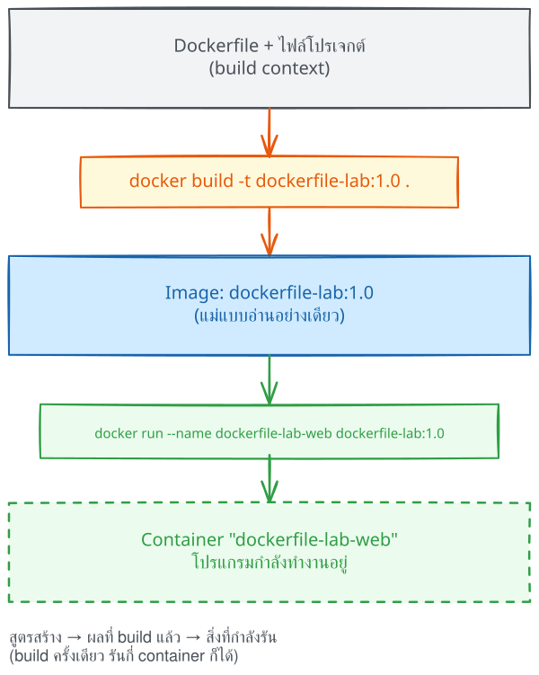
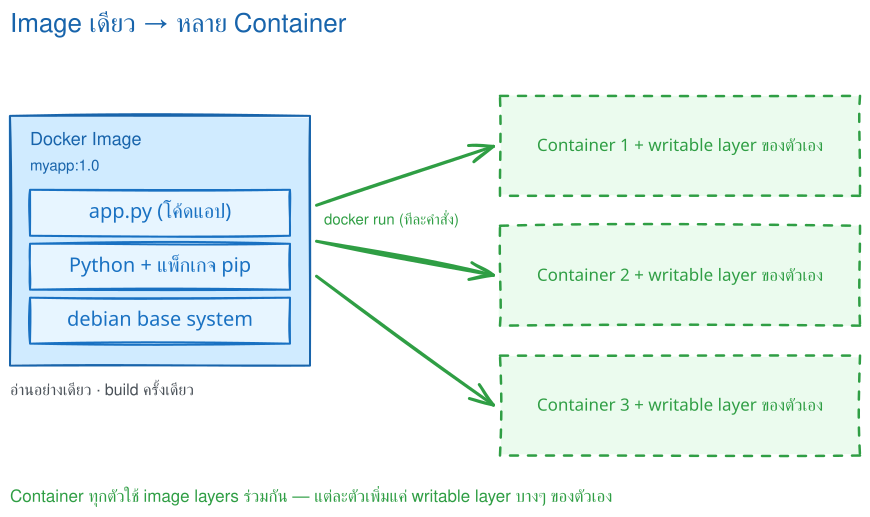
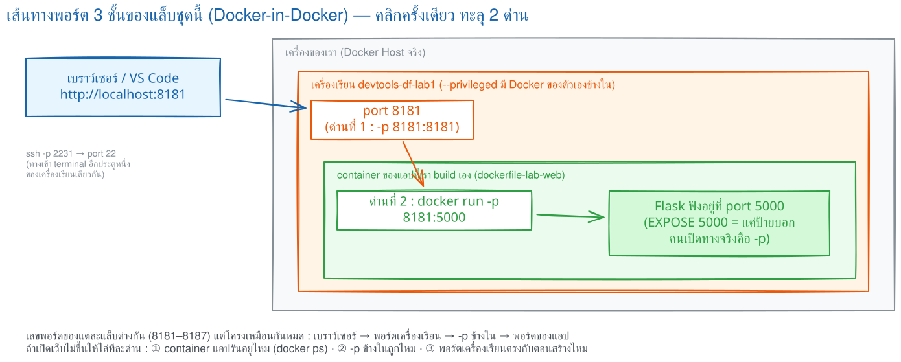
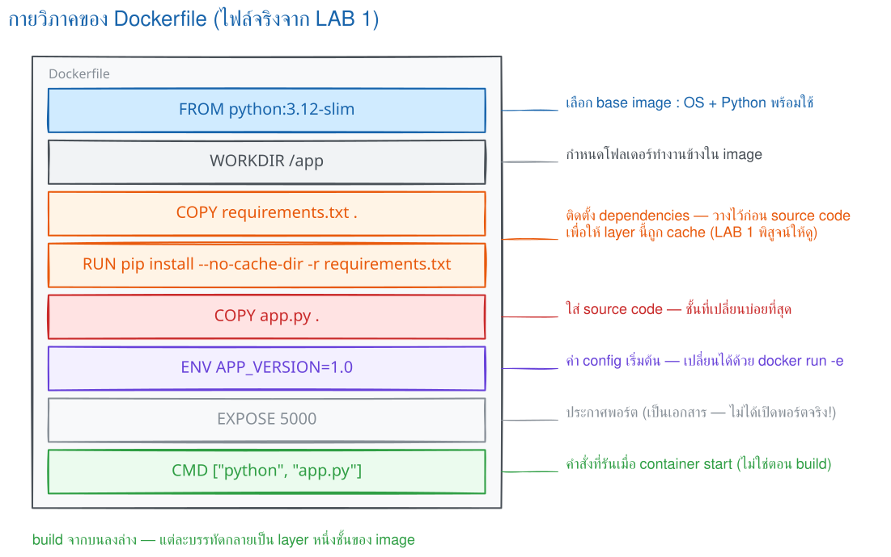
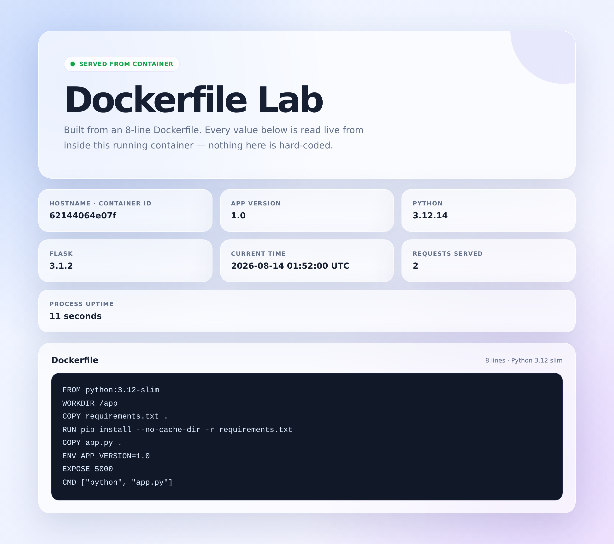
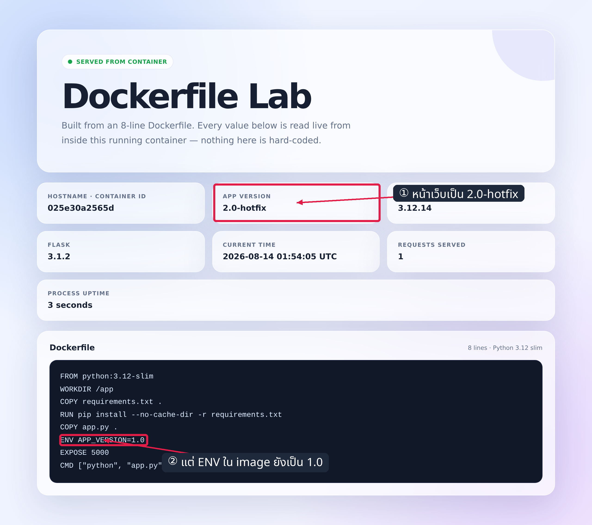
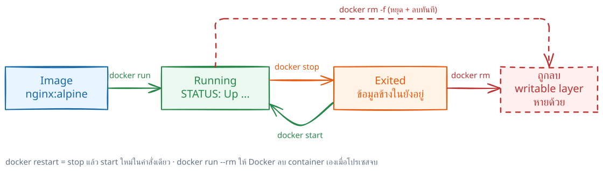

# LAB 1 — Dockerfile → Image → Container

> โฟลเดอร์ `001_LAB_Dockerfile_First_Image` · ไฟล์ของแล็บ : `Dockerfile` · `app.py` · `requirements.txt` · `.dockerignore` · `verify.sh`

### 🎯 แล็บนี้ใน 30 วินาที

| | |
|---|---|
| **คำถามเดียวที่ตอบให้จบ** | ไฟล์ข้อความ **8 บรรทัด** กลายเป็นเว็บที่ตอบ `HTTP 200` ได้อย่างไร |
| **ต้องผ่านอะไรมาก่อน** | ไม่ต้อง — แล็บแรกของชุด |
| **เวลา** | ~35 นาที · การทดลอง **9 อัน** อันละ 2–4 นาที |
| **จบแล้วต้องทำได้เอง** | `build` → `run -p` → `curl` ได้ `200` และบอกได้ว่าแต่ละบรรทัดใน Dockerfile ทำงานตอนไหน |
| **แล็บนี้ยัง *ไม่* สอน** | layer cache → **LAB 2** · `CMD`/`ENTRYPOINT` แบบลึก → **LAB 3** · `ENV` หลายชั้น → **LAB 4** |

---

## ทฤษฎีก่อนลงมือ

### สามคำที่ต้องแยกให้ออก

```
Dockerfile  ──docker build──▶  Image  ──docker run──▶  Container
   (สูตร)                   (ผลที่อบเสร็จ)            (สิ่งที่กำลังรัน)
```

| คำ | คืออะไร | ดูด้วยคำสั่ง |
|---|---|---|
| **Dockerfile** | ไฟล์ข้อความ บอกขั้นตอนประกอบ image | `cat Dockerfile` |
| **Image** | แม่แบบ **อ่านอย่างเดียว** สร้าง container ได้หลายตัว | `docker image ls` |
| **Container** | อินสแตนซ์ที่ **กำลังรัน** มี filesystem เขียนได้ของตัวเอง | `docker ps -a` |



> 🖼 **วิธีอ่านรูปนี้:** ไล่ลูกศรซ้ายไปขวา — โฟลเดอร์งานเข้า `docker build` จนได้ image แล้ว `docker run` จึงสร้าง container · สามช่องนี้คือสามคำในตารางข้างบน

### image ตัวเดียว ใช้สร้าง container กี่ตัวก็ได้



> 🖼 **วิธีอ่านรูปนี้:** layers ฐานถูกใช้ร่วมกันทั้งสามตัว แต่ **writable layer ด้านบนแยกกัน** — การทดลองที่ 5 จะพิสูจน์ด้วยตัวนับ request ที่ไม่ปะปนกัน

### กฎ 4 ข้อที่ใช้ตลอดแล็บ

| กฎ | เหตุผล |
|---|---|
| build ก่อน run เสมอ | `docker run` ใช้ image สำเร็จรูป ไม่อ่าน Dockerfile ใหม่ |
| จุด `.` ท้ายคำสั่ง build คือขอบเขตของไฟล์ | `COPY` หยิบได้เฉพาะไฟล์ในขอบเขตนี้ |
| image อ่านอย่างเดียว | ข้อมูลตอนรันลง writable layer ของ container ตัวนั้น |
| `EXPOSE` ไม่เปิดพอร์ต | ทางเข้าจากภายนอกมาจาก `-p` เท่านั้น |

### สิ่งที่มักเข้าใจผิด

- **คิดว่า** แก้ `app.py` แล้ว container ที่รันอยู่เห็นโค้ดใหม่ → **จริง ๆ** ต้อง build image ใหม่แล้วสร้าง container ใหม่
- **คิดว่า** `EXPOSE 5000` เปิดทางให้เบราว์เซอร์แล้ว → **จริง ๆ** เป็นแค่ข้อความกำกับ image (การทดลองที่ 6 พิสูจน์)
- **คิดว่า** ลบ container แล้ว image หายด้วย → **จริง ๆ** คนละอย่างกัน ลบคนละคำสั่ง

---

## เตรียมเครื่องเรียน

### ขั้นที่ 1 — เปิดกล่องเรียน

รันบน **เครื่องของเราเอง** :

```bash
docker rm -f devtools-df-lab1 2>/dev/null
docker run -dit --name devtools-df-lab1 --privileged \
  -p 2231:22 -p 8181:8181 tuchsanai/devtools:2569_1
ssh root@localhost -p 2231        # password : passwd
```

> 📝 `--privileged` จำเป็นเพราะเราจะรัน Docker **ซ้อนข้างในกล่อง** (ใช้กับกล่องเรียนที่ทิ้งได้เท่านั้น ไม่ใช่ production) · `-p 2231:22` คือ SSH · `-p 8181:8181` คือทางให้เบราว์เซอร์เห็นเว็บของเรา



> 🖼 **วิธีอ่านรูปนี้:** พอร์ตมี **3 ชั้น** — เบราว์เซอร์ `8181` → กล่องเรียน `8181` → Flask ใน container `5000` · ขาดชั้นไหนเว็บก็ไม่ขึ้น จำภาพนี้ไว้ใช้ตอนไล่ปัญหา

### ขั้นที่ 2 — เช็กว่า Docker ในกล่องพร้อม

**คำสั่งทุกอันหลังจากนี้พิมพ์ข้างในกล่องเรียน**

```bash
docker info --format 'Docker daemon: {{.ServerVersion}}'
```

✅ **ต้องได้เลขเวอร์ชัน ไม่ใช่ error** (เลขของแต่ละคนอาจต่างกัน) :

```
Docker daemon: 29.6.2
```

> 📝 ถ้าขึ้น `Cannot connect to the Docker daemon` แปลว่า daemon ข้างในยังตื่นไม่เสร็จ — รอ 10–20 วินาทีแล้วลองใหม่

### ขั้นที่ 3 — โหลดโค้ดแล็บ

```bash
mkdir -p ~/labwork && cd ~/labwork
git clone https://github.com/Tuchsanai/DevTools.git
cd DevTools/02_Docker/02_Dockerfile_Build_Run_Compose_Guide/001_LAB_Dockerfile_First_Image
ls -a
```

> 📝 ต้องใส่ `-a` ไม่งั้นจะไม่เห็น `.dockerignore` เพราะขึ้นต้นด้วยจุด · ถ้าเคย clone แล้ว git จะบอกว่าโฟลเดอร์ไม่ว่าง — `cd` เข้าไปได้เลย

จำ path ไว้ในตัวแปร จะได้กลับมาง่าย :

```bash
LAB=$PWD
```

---

## การทดลองที่ 1 — Dockerfile 8 บรรทัดนี้สั่งอะไรบ้าง

**คำถาม:** บรรทัดไหนทำงานตอน build บรรทัดไหนมีผลตอน run

```bash
cat Dockerfile
```

✅ **สิ่งที่ต้องเห็น** — 8 บรรทัด ไม่มีคอมเมนต์ :

```
FROM python:3.12-slim
WORKDIR /app
COPY requirements.txt .
RUN pip install --no-cache-dir -r requirements.txt
COPY app.py .
ENV APP_VERSION=1.0
EXPOSE 5000
CMD ["python", "app.py"]
```

| บรรทัด | ทำหน้าที่อะไร | ทำงานเมื่อไร |
|---|---|---|
| `FROM python:3.12-slim` | เลือกจุดตั้งต้นที่มี Python พร้อมใช้ | build |
| `WORKDIR /app` | ตั้ง "โต๊ะทำงาน" ให้คำสั่งถัดไป | build |
| `COPY requirements.txt .` | เอารายการแพ็กเกจเข้ามาก่อน | build |
| `RUN pip install ...` | ติดตั้งแพ็กเกจ **อบติดไปกับ image** | build |
| `COPY app.py .` | เอาโค้ดแอปเข้ามาทีหลัง | build |
| `ENV APP_VERSION=1.0` | ค่า default ที่แอปอ่านได้ | มีผลตอน run |
| `EXPOSE 5000` | **ข้อความกำกับ** ว่าแอปฟังพอร์ตไหน | ไม่ทำอะไรเลย |
| `CMD ["python", "app.py"]` | คำสั่งที่จะเริ่มเมื่อ container เกิด | มีผลตอน run |



> 🖼 **วิธีอ่านรูปนี้:** อ่านจาก `FROM` ถึง `CMD` ตามลำดับของ builder · แยกคำสั่งที่สร้าง **layer** ออกจากคำสั่งที่เป็นแค่ **metadata**

> 📝 **ที่มักพลาด:** `RUN` ทำงานตอน build เท่านั้น ไม่ได้รันซ้ำตอน `docker run` · และอย่าเขียน `FROM python:latest` เพราะวันนี้กับพรุ่งนี้อาจได้คนละเวอร์ชัน

---

## การทดลองที่ 2 — เปลี่ยนสูตรให้เป็น image

**คำถาม:** `docker build` ทำอะไรบ้างกว่าจะได้ image

```bash
docker build -t dockerfile-lab:1.0 .
```

✅ **สิ่งที่ต้องเห็น** — ขั้น `[1/5]` ถึง `[5/5]` แล้วปิดท้ายด้วย `naming to ...` (เวลาของแต่ละคนไม่ตรงกับเอกสารนี้) :

```
#4 [1/5] FROM docker.io/library/python:3.12-slim@sha256:dd29372629ee...
#6 [2/5] WORKDIR /app
#7 [3/5] COPY requirements.txt .
#8 [4/5] RUN pip install --no-cache-dir -r requirements.txt
#8 1.488 Successfully installed ... flask-3.1.2 ...
#9 [5/5] COPY app.py .
#10 naming to docker.io/library/dockerfile-lab:1.0 done
```

> 📝 **อ่าน log ให้เป็น:** ดูเลขในวงเล็บเหลี่ยม — `[2/5]` = ขั้นที่ 2 จาก 5 ขั้นของไฟล์นี้ (เลข `#4` `#6` ข้างหน้าเป็นหมายเลขงานภายในของ BuildKit ของแต่ละคนไม่ตรงกัน ไม่ต้องสนใจ) — นับเฉพาะคำสั่งที่ทำงานจริง (`ENV`/`EXPOSE`/`CMD` เป็น metadata จึงไม่ถูกนับ) · **จุด `.` ท้ายคำสั่งคือขอบเขตของไฟล์ ห้ามลืม** ถ้าลืม Docker จะฟ้อง `requires 1 argument`

**ยืนยันว่ามี image จริง:**

```bash
docker image ls dockerfile-lab
```

✅ **สิ่งที่ต้องเห็น** — มีแถว `dockerfile-lab:1.0` (ID/ขนาดของแต่ละคนต่างกัน) :

```
IMAGE                ID             DISK USAGE   CONTENT SIZE
dockerfile-lab:1.0   a115b25c97b5        197MB         48.2MB
```

---

## การทดลองที่ 3 — เปลี่ยน image ให้เป็นเว็บที่ตอบได้จริง

**คำถาม:** ต้องใส่อะไรบ้างเว็บถึงจะเรียกได้จากข้างนอก

```bash
docker run -d --name dockerfile-lab-web -p 8181:5000 dockerfile-lab:1.0
docker ps
```

✅ **สิ่งที่ต้องเห็น** — `STATUS` เป็น `Up` และคอลัมน์ `PORTS` **มีลูกศร** `->` :

```
CONTAINER ID   IMAGE                COMMAND           STATUS         PORTS
62144064e07f   dockerfile-lab:1.0   "python app.py"   Up 28 seconds  0.0.0.0:8181->5000/tcp
```

> 📝 `-p 8181:5000` อ่านว่า **host:container** · `-d` รันเบื้องหลัง · คอลัมน์ `COMMAND` เป็น `"python app.py"` = `CMD` บรรทัดที่ 8 ถูกหยิบมาใช้จริง

**ทดสอบด้วย `curl`:**

```bash
curl -i -s http://localhost:8181/ | head -2
```

✅ **สิ่งที่ต้องเห็น** — บรรทัดแรกคือ `HTTP/1.1 200 OK` :

```
HTTP/1.1 200 OK
Server: Werkzeug/3.1.8 Python/3.12.14
```

> 📝 `-i` สั่งให้ `curl` พิมพ์ response header ออกมาด้วย เราจึงอ่าน status code ได้ · ถ้าได้ `curl: (7)` แปลว่าต่อไม่ติด ให้ย้อนไปดูว่าคอลัมน์ PORTS มีลูกศรไหม

---

## การทดลองที่ 4 — เปิดหน้าเว็บในเบราว์เซอร์

**คำถาม:** ค่าที่โชว์บนหน้าเว็บมาจากไหนบ้าง

เปิดบนเครื่องเราที่ **`http://localhost:8181`**



| ค่าบนหน้าเว็บ | มาจากไหน |
|---|---|
| **HOSTNAME** | container ID 12 ตัวแรก (Docker ตั้งให้เอง) |
| **APP VERSION 1.0** | `ENV APP_VERSION=1.0` บรรทัดที่ 6 |
| **PYTHON 3.12.14** | `FROM python:3.12-slim` บรรทัดที่ 1 |
| **FLASK 3.1.2** | `requirements.txt` ที่ `RUN pip install` ติดตั้งไว้ |
| **REQUESTS SERVED** | ตัวนับในหน่วยความจำของ container ตัวนี้เท่านั้น |

> 📝 ถ้าเปิดไม่ขึ้น: ใน VS Code ใช้แท็บ **PORTS** → **Forward a Port** ใส่ `8181` · หรือทำ tunnel เอง `ssh -L 8181:localhost:8181 root@localhost -p 2231`

---

## การทดลองที่ 5 — image เดียวสร้าง 2 container แล้วแยกกันจริงไหม

**คำถาม:** container สองตัวจาก image เดียวกัน ใช้ข้อมูลร่วมกันหรือแยกกัน

```bash
docker run -d --name dockerfile-lab-web2 -p 8281:5000 dockerfile-lab:1.0
sleep 3
curl -s http://localhost:8181/health; echo
curl -s http://localhost:8281/health; echo
```

✅ **สิ่งที่ต้องเห็น** — `hostname` **คนละค่า** และ `requests` **คนละตัวเลข** :

```
{"app_version":"1.0","flask":"3.1.2","hostname":"62144064e07f","python":"3.12.14","requests":3,"status":"ok","uptime_seconds":83}
{"app_version":"1.0","flask":"3.1.2","hostname":"367aca3033ab","python":"3.12.14","requests":0,"status":"ok","uptime_seconds":2}
```

> 📝 **คำตอบ:** สูตร 1 ชุด · image 1 ก้อน · container กี่ตัวก็ได้ · host port ห้ามซ้ำ (8181 ถูกจองแล้วจึงใช้ 8281) แต่ **container port ซ้ำได้** เพราะแต่ละตัวมี network ของตัวเอง

เก็บตัวที่สองทิ้งก่อนไปต่อ :

```bash
docker rm -f dockerfile-lab-web2
```

---

## การทดลองที่ 6 — `EXPOSE` เปิดพอร์ตให้จริงหรือไม่

**คำถาม:** Dockerfile เขียน `EXPOSE 5000` ไว้แล้ว ถ้าไม่ใส่ `-p` จะเรียกได้ไหม

```bash
docker run -d --name dockerfile-lab-noport dockerfile-lab:1.0
sleep 2
docker ps --filter name=dockerfile-lab-noport --format "table {{.Names}}\t{{.Ports}}"
curl -sS --max-time 5 http://localhost:5000/ ; echo "curl exit code = $?"
```

✅ **สิ่งที่ต้องเห็น** — คอลัมน์ PORTS ขึ้น `5000/tcp` แต่ **ไม่มีลูกศร** และ `curl` ต่อไม่ติด :

```
NAMES                   PORTS
dockerfile-lab-noport   5000/tcp

curl: (7) Failed to connect to localhost port 5000 after 0 ms: Couldn't connect to server
curl exit code = 7
```

**แล้วแอปข้างในตายจริงหรือ?** ถามจากข้างใน container เอง :

```bash
docker exec dockerfile-lab-noport python -c "import urllib.request; print(urllib.request.urlopen('http://127.0.0.1:5000/health').status)"
```

✅ **สิ่งที่ต้องเห็น** — ได้ `200` = **แอปทำงานปกติมาตลอด** ขาดแค่ทางเข้าจากภายนอก :

```
200
```

> 📝 **บทเรียน:** `EXPOSE` = ข้อความกำกับ image บอกคนอ่านว่าแอปตั้งใจฟังพอร์ตไหน · สิ่งที่เปิดทางจริงคือ `-p host:container` ตอน `docker run` เท่านั้น

```bash
docker rm -f dockerfile-lab-noport
```

---

## การทดลองที่ 7 — เปลี่ยนค่า `ENV` ตอน run โดยไม่ build ใหม่

**คำถาม:** ค่าใน `ENV` แก้ได้ไหมโดยไม่แตะ Dockerfile

```bash
docker rm -f dockerfile-lab-web
docker run -d --name dockerfile-lab-v2 -p 8181:5000 -e APP_VERSION=2.0-hotfix dockerfile-lab:1.0
sleep 3
curl -s http://localhost:8181/health; echo
```

✅ **สิ่งที่ต้องเห็น** — `app_version` กลายเป็น `2.0-hotfix` :

```
{"app_version":"2.0-hotfix","flask":"3.1.2","hostname":"025e30a2565d","python":"3.12.14","requests":0,"status":"ok","uptime_seconds":2}
```



**แล้ว image เปลี่ยนไปด้วยไหม?**

```bash
docker image inspect --format '{{range .Config.Env}}{{println .}}{{end}}' dockerfile-lab:1.0 | grep APP_VERSION
```

✅ **สิ่งที่ต้องเห็น** — ยังเป็น `1.0` เหมือนเดิม :

```
APP_VERSION=1.0
```

> 📝 **บทเรียน:** `ENV` ใน Dockerfile คือ **ค่าเริ่มต้น** ไม่ใช่ค่าตายตัว · image เดียวจึงใช้ได้หลาย environment โดยเปลี่ยนแค่ `-e` — **LAB 4** จะลงลึกเรื่องนี้

**คืนสภาพเดิมก่อนไปต่อ** (ข้ามไม่ได้ ไม่งั้นพอร์ต 8181 จะยังถูกจอง) :

```bash
docker rm -f dockerfile-lab-v2
docker run -d --name dockerfile-lab-web -p 8181:5000 dockerfile-lab:1.0
```

---

## การทดลองที่ 8 — `.dockerignore` กันไฟล์ลับไม่ให้หลุดเข้า image

**คำถาม:** ถ้า Dockerfile เขียน `COPY . .` ไฟล์ `.env` จะติดเข้าไปด้วยไหม

**เตรียมโฟลเดอร์ทดลองที่มีไฟล์ลับปนอยู่:**

```bash
mkdir -p ~/ctx-demo && cd ~/ctx-demo
cp $LAB/app.py $LAB/requirements.txt .
printf 'SECRET_KEY=super-secret-do-not-ship\n' > .env
printf 'FROM python:3.12-slim\nWORKDIR /app\nCOPY . .\nCMD ["python","app.py"]\n' > Dockerfile
ls -a
```

> 📝 โฟลเดอร์นี้ตั้งใจใช้ `COPY . .` (คัดลอกทั้งโฟลเดอร์) ซึ่งเป็นวิธีที่โปรเจกต์จริงเขียนกันบ่อยที่สุด

**รอบที่ 1 — ยังไม่มี `.dockerignore` :**

```bash
docker build -q -t ctx-demo:before . >/dev/null && docker run --rm ctx-demo:before ls -a /app
```

✅ **สิ่งที่ต้องเห็น** — **`.env` หลุดเข้า image เรียบร้อย** :

```
.
..
.env
Dockerfile
app.py
requirements.txt
```

**รอบที่ 2 — ใส่ `.dockerignore` แล้ว build ใหม่ :**

```bash
cp $LAB/.dockerignore .
docker build -q -t ctx-demo:after . >/dev/null && docker run --rm ctx-demo:after ls -a /app
```

✅ **สิ่งที่ต้องเห็น** — **`.env` หายไปแล้ว** :

```
.
..
.dockerignore
Dockerfile
app.py
requirements.txt
```

> 📝 **บทเรียน:** `.dockerignore` ใช้กติกาคล้าย `.gitignore` และต้องวางไว้ที่ **รากของโฟลเดอร์ที่ build** · ไฟล์ที่ถูกกันไว้ `COPY` มองไม่เห็นเลย ต่อให้เขียน `COPY . .` ก็ตาม · **ทุกโปรเจกต์ควรมีไฟล์นี้ตั้งแต่วันแรก**

กลับไปโฟลเดอร์แล็บ :

```bash
cd $LAB
```

---

## การทดลองที่ 9 — image เก็บอะไร container เก็บอะไร

**คำถาม:** `inspect` สองตัวนี้ต่างกันอย่างไร

**ถาม image** (สิ่งที่อบไว้ตอน build) :

```bash
docker image inspect --format '{{json .Config.Cmd}}'          dockerfile-lab:1.0
docker image inspect --format '{{json .Config.ExposedPorts}}' dockerfile-lab:1.0
```

✅ **สิ่งที่ต้องเห็น** — ตรงกับ Dockerfile บรรทัดที่ 8 และ 7 :

```
["python","app.py"]
{"5000/tcp":{}}
```

**ถาม container** (สิ่งที่เกิดตอน run) :

```bash
docker container inspect --format '{{.State.Status}}'               dockerfile-lab-web
docker container inspect --format '{{json .NetworkSettings.Ports}}' dockerfile-lab-web
```

✅ **สิ่งที่ต้องเห็น** — สถานะ `running` และ port binding จริงที่มาจาก `-p` :

```
running
{"5000/tcp":[{"HostIp":"0.0.0.0","HostPort":"8181"},{"HostIp":"::","HostPort":"8181"}]}
```

> 📝 **จุดที่ต้องแยกให้ออก:** `ExposedPorts` ของ image = **คำประกาศ** ที่มาจาก `EXPOSE` · `NetworkSettings.Ports` ของ container = **การผูกพอร์ตจริง** ที่มาจาก `-p` — ถามผิดตัวจะได้คำตอบผิด

---

## เมื่อของไม่ทำงาน — ไล่ตามลำดับ 4 ขั้น

อย่าเดา ให้ไล่ตามนี้ทีละขั้น :

| ขั้น | คำสั่ง | ถามว่า |
|---|---|---|
| 1 | `docker image ls` | build สำเร็จหรือยัง |
| 2 | `docker ps -a` | container อยู่สถานะอะไร (**ต้องมี `-a`** ถึงจะเห็นตัวที่ตายแล้ว) |
| 3 | `docker logs <ชื่อ>` | process หลักพิมพ์อะไรออกมา |
| 4 | `docker exec -it <ชื่อ> sh` | เข้าไปดูของจริงข้างใน (พิมพ์ `exit` เพื่อออก) |

ลองขั้นที่ 3 กับ 4 กับ container ที่กำลังรันอยู่ :

```bash
docker logs dockerfile-lab-web 2>&1 | grep "Running on"
docker exec dockerfile-lab-web sh -c 'pwd; ls; env | grep APP_VERSION'
```

✅ **สิ่งที่ต้องเห็น** — Flask ฟังทุก interface และข้างใน `/app` มีเฉพาะไฟล์ที่ `COPY` เข้าไป :

```
 * Running on all addresses (0.0.0.0)
 * Running on http://127.0.0.1:5000
 * Running on http://172.18.0.2:5000

/app
app.py
requirements.txt
APP_VERSION=1.0
```

> 📝 หลักฐาน 3 อย่างจากจอนี้ : `pwd` = `/app` มาจาก `WORKDIR` · ใน `/app` มีแค่ 2 ไฟล์ = `COPY` สองบรรทัดทำงานตรงตามสั่ง · `APP_VERSION=1.0` มาจาก `ENV`

---

## ตรวจงานด้วย `verify.sh`

```bash
cd $LAB
bash verify.sh ; echo "exit code = $?"
```

✅ **สิ่งที่ต้องเห็น** — `[PASS]` ทุกบรรทัด ปิดท้าย `ALL CHECKS PASSED` และ exit code `0` :

```
[PASS] พบไฟล์ Dockerfile
        ... (รวม 24 บรรทัด [PASS]) ...
[PASS] หน้าแรกตอบ HTTP 200
[PASS] container ทั้งสองมี hostname ต่างกัน
ALL CHECKS PASSED
exit code = 0
```

> 📝 สคริปต์ build image · เปิด container บนพอร์ต 8181 กับ 8281 · ยิง `curl` ตรวจ · แล้ว **ลบ container ที่ตัวเองสร้างทิ้งให้เอง** (ไม่ลบ image ของเรา)

---

## แก้ปัญหาที่พบบ่อย

| อาการ | สาเหตุ | วิธีแก้ |
|---|---|---|
| `requires 1 argument` | ลืมจุด `.` ท้ายคำสั่ง `docker build` | เติมจุดเป็นตัวสุดท้าย : `docker build -t dockerfile-lab:1.0 .` |
| `failed to compute cache key: "/xxx": not found` ตอน `COPY` | ไฟล์อยู่นอกโฟลเดอร์ที่ build หรือถูก `.dockerignore` ตัดไป | ย้ายไฟล์เข้ามา หรือแก้ `.dockerignore` |
| `port is already allocated` | host port ซ้ำกับ container ตัวอื่น | `docker ps` หาว่าใครจอง แล้ว `docker rm -f <ชื่อ>` หรือเปลี่ยนพอร์ต |
| `Conflict. The container name ... is already in use` | มี container ชื่อเดิมค้างอยู่ (หยุดแล้วก็ยังจองชื่อ) | `docker rm -f <ชื่อ>` แล้วรันใหม่ |
| `curl: (7)` ทั้งที่ `docker ps` ขึ้น `Up` | ลืม `-p` หรือแอปฟังที่ `127.0.0.1` แทน `0.0.0.0` | ดูคอลัมน์ PORTS ว่ามีลูกศร `->` ไหม |
| แก้ `app.py` แล้วหน้าเว็บเหมือนเดิม | image เก่ายังถูกใช้อยู่ | `docker build` ใหม่ แล้ว `docker rm -f` + `docker run` ใหม่ |
| container ไม่โผล่ใน `docker ps` ทั้งที่เพิ่งสั่ง run | แอปพังตั้งแต่ start จึง `exited` ไปแล้ว | `docker ps -a` ดูสถานะ แล้ว `docker logs <ชื่อ>` |
| `image is being used by ... container` ตอนลบ image | ยังมี container อ้างถึง image นี้อยู่ | ลบ container ก่อนด้วย `docker rm -f <ชื่อ>` |

---

## เก็บกวาด



> 🖼 **วิธีอ่านรูปนี้:** `docker stop` เก็บ container ไว้ (start กลับมาได้) ส่วน `docker rm` ลบทิ้งพร้อม writable layer

**ในกล่องเรียน:**

```bash
docker rm -f dockerfile-lab-web
docker image rm dockerfile-lab:1.0 ctx-demo:before ctx-demo:after
rm -rf ~/ctx-demo
docker ps -a
```

> 📝 ต้องลบ container ก่อนลบ image เสมอ · ถ้าเพิ่งรัน `verify.sh` ไป สคริปต์อาจลบ container ให้แล้ว บรรทัดแรกจึงอาจขึ้น `No such container` — **ถือว่าปกติ**

**ออกจากกล่องแล้วลบกล่องบนเครื่องเรา:**

```bash
exit
docker rm -f devtools-df-lab1
docker ps -a --filter "name=^devtools-"
```

✅ ตารางสุดท้ายต้องเหลือแค่หัวตาราง ไม่มีแถวข้อมูล

---

## สรุปคำสั่งของแล็บนี้

| คำสั่ง | ความหมาย |
|---|---|
| `docker build -t <ชื่อ:tag> .` | อ่าน `./Dockerfile` สร้าง image · **จุดท้ายคือขอบเขตของไฟล์** |
| `docker image ls` / `docker ps` / `docker ps -a` | ดู image / container ที่รันอยู่ / รวมตัวที่หยุดแล้ว |
| `docker run -d --name <ชื่อ> -p <host>:<container> <image>` | สร้าง container รันเบื้องหลังพร้อมเปิดพอร์ต |
| `docker run -e KEY=value <image>` | ทับค่า `ENV` ตอนรัน โดยไม่แตะ image |
| `docker run --rm <image> <คำสั่ง>` | รันคำสั่งอื่นแทน `CMD` แล้วลบ container ทิ้งทันที |
| `docker logs <ชื่อ>` | อ่าน stdout/stderr ของ process หลัก |
| `docker exec <ชื่อ> <คำสั่ง>` | สั่งงานข้างใน container ที่กำลังรัน |
| `docker image inspect --format '...' <image>` | อ่าน metadata ที่อบไว้ตอน build (`Cmd` · `Env` · `ExposedPorts`) |
| `docker container inspect --format '...' <ชื่อ>` | อ่านสถานะจริงตอนรัน (`State.Status` · port bindings) |
| `docker rm -f <ชื่อ>` / `docker image rm <image>` | ลบ container / ลบ image |

> **จำสองประโยคนี้:** จุด `.` ท้าย `docker build` คือ **ขอบเขตของไฟล์** ไม่ใช่จุดจบประโยค · `EXPOSE` เป็นแค่ **ข้อความกำกับ** ส่วน `-p` คือของจริง

## ✅ เช็กลิสต์ก่อนจบแล็บ

- [ ] อธิบายได้ว่า Dockerfile / Image / Container ต่างกันอย่างไร
- [ ] ชี้ได้ว่าบรรทัดไหนใน Dockerfile ทำงาน **ตอน build** บรรทัดไหนมีผล **ตอน run**
- [ ] `docker build` สำเร็จ และอ่าน log ออกว่า `[1/5]`…`[5/5]` คืออะไร
- [ ] `curl -i http://localhost:8181/` ได้ **HTTP 200** และเปิดหน้า dashboard ในเบราว์เซอร์ได้
- [ ] container 2 ตัวจาก image เดียวกันมี `hostname` และตัวนับ `requests` **แยกกัน**
- [ ] รันโดยไม่ใส่ `-p` แล้ว `curl` จากข้างนอกไม่ติด แต่เรียกจากข้างใน container ได้ `200`
- [ ] `-e APP_VERSION=2.0-hotfix` เปลี่ยนค่าที่แอปเห็นได้ โดย **image ยังเป็น 1.0**
- [ ] `COPY . .` แล้ว `.env` หลุดเข้า image จริง และหายไปเมื่อใส่ `.dockerignore`
- [ ] แยกได้ว่า `ExposedPorts` ของ image ต่างจาก `NetworkSettings.Ports` ของ container อย่างไร
- [ ] `bash verify.sh` ขึ้น `ALL CHECKS PASSED` และเก็บกวาดจนไม่เหลือ container ของแล็บ

*ผลลัพธ์ทั้งหมดในเอกสารนี้มาจากการรันจริงในเครื่องเรียน `tuchsanai/devtools:2569_1`*
