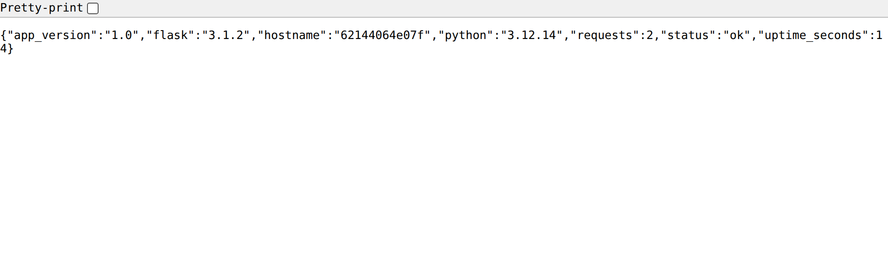

# LAB 1 — Dockerfile → Image → Container : สร้าง Image แรกด้วยตัวเอง

> โฟลเดอร์ `001_LAB_Dockerfile_First_Image` = **LAB 1** ของชุด "Dockerfile → Build → Run → Compose" (ครอบคลุมตอนที่ 2, 3 และ 4 ของคู่มือ)
> ไฟล์ของแล็บนี้ : `Dockerfile` · `app.py` · `requirements.txt` · `.dockerignore` · `verify.sh`

### 🎯 แล็บนี้ใน 30 วินาที

| | |
|---|---|
| **คำถามเดียวที่ตอบให้จบ** | ไฟล์ข้อความ **8 บรรทัด** กลายเป็นเว็บที่ตอบ `HTTP 200` ได้อย่างไร |
| **ต้องผ่านอะไรมาก่อน** | ไม่ต้อง — นี่คือแล็บแรกของชุด |
| **เวลา** | ~35 นาที (แกนหลัก ข้อ 0–10 ประมาณ 28 นาที · ทดลองเพิ่มเติม ~7 นาที) |
| **จบแล้วต้องทำได้เอง** | อ่าน Dockerfile ทีละบรรทัดออก · `build` → `run -p` → `curl` ได้ `200` · ไล่ปัญหาครบ 4 ขั้น |
| **แล็บนี้ยัง *ไม่* สอน** | layer cache และ options ของ build → **LAB 2** · `CMD`/`ENTRYPOINT` แบบลึก → **LAB 3** · `ENV` หลายชั้น → **LAB 4** |

## สิ่งที่จะได้เรียนรู้

- แยกให้ออกว่า **Dockerfile = สูตร** · **Image = ผลที่อบเสร็จ** · **Container = สิ่งที่กำลังรัน** และพิสูจน์ว่า image เดียวสร้าง container ได้หลายตัว
- อ่าน **Dockerfile 8 บรรทัด** ทีละบรรทัด และตอบได้ว่าบรรทัดไหนทำงานตอน build บรรทัดไหนมีผลตอน run
- ใช้ `docker build [OPTIONS] PATH` ให้ถูกรูปแบบ **อ่าน build log** ออก แล้ว `docker run -p` จน `curl -i` ได้ **HTTP 200**
- เข้าใจ **build context** และใช้ `.dockerignore` ตัด `.git/` · `.env` · `__pycache__/` ออก **พร้อมตัวเลขจริงก่อน/หลัง**
- จำ **ลำดับตรวจปัญหาหลัง build** : `docker image ls` → `docker ps -a` → `docker logs` → `docker exec -it ... sh`
- แยก `docker image inspect` (สิ่งที่อบไว้ตอน build) ออกจาก `docker container inspect` (สิ่งที่เกิดตอน run) ด้วย `--format`
- พิสูจน์ว่า **`EXPOSE` ไม่ได้เปิดพอร์ตจริง** แล้วคืนพื้นที่อย่างระวังด้วย `docker system df` + `docker rm -f` / `docker image rm`

## ภาพรวมของแล็บนี้

1. **เปิดเครื่องเรียนแล้วเช็กว่า Docker พร้อม** — ทุกอย่างในแล็บนี้ทำข้างในกล่องเรียน ไม่เลอะเครื่องตัวเอง
2. **Clone โค้ดแล็บ** แล้ว **ทำความเข้าใจสามคำ** Dockerfile / Image / Container ก่อนพิมพ์คำสั่งใด ๆ
3. **อ่าน Dockerfile 8 บรรทัด** พร้อมตาราง "ทำหน้าที่อะไร / ที่มักพลาด"
4. **`docker build -t dockerfile-lab:1.0 .`** — แยก 3 ส่วนของคำสั่ง แล้วอ่าน log ตั้งแต่ `[1/5]` ถึง `exporting to image`
5. **`docker run -d -p 8181:5000`** แล้ว `curl -i` ให้ได้ HTTP 200 · เปิดหน้า dashboard ในเบราว์เซอร์
6. **Build context + `.dockerignore`** — วัดตัวเลขที่ส่งเข้า build จริง ก่อน/หลัง และดูว่า `.env` หลุดเข้า image หรือไม่
7. **ลำดับตรวจปัญหาหลัง build** 4 ขั้น จาก image → container → log → เข้าไปดูข้างใน
8. **`inspect` ให้ตรงชนิด object** — image เก็บ `Cmd`/`Env`/`ExposedPorts` ส่วน container เก็บ `State.Status`/port bindings
9. **พิสูจน์ว่า `EXPOSE` ไม่เปิดพอร์ต** แล้วปิดท้ายด้วย `docker system df` + เก็บกวาด

> **คำถามก่อนเริ่ม:** ถ้าเราแก้ `app.py` บนเครื่องแล้วยังไม่ `docker build` ใหม่ — container ที่รันอยู่จะเห็นโค้ดใหม่ไหม? และถ้า Dockerfile เขียน `EXPOSE 5000` ไว้แล้ว ทำไมยังต้องพิมพ์ `-p 8181:5000` อีก? ข้อ 5 และข้อ 9 จะพิสูจน์คำตอบด้วยผลรันจริง

### Terminal Map

| หน้าต่าง | หน้าที่ |
|---|---|
| **T1** | ทำแล็บทั้งหมด (build · run · curl · inspect) — ไม่มีคำสั่งไหนค้างจอ ใช้หน้าต่างเดียวจบ |
| **เบราว์เซอร์** | เปิด `http://localhost:8181` ดูหน้า dashboard ที่ container เสิร์ฟ (ข้อ 5) |

## ทฤษฎีก่อนลงมือ

### ภาพจำหลัก

Dockerfile คือสูตรที่ถูก build เป็น image แล้ว image จึงถูก run เป็น container — สามคำนี้อยู่คนละช่วงของงานอย่างชัดเจน


> 🖼 **วิธีอ่านรูปนี้:** ไล่ลูกศรซ้ายไปขวา: โฟลเดอร์งานเข้า `docker build -t dockerfile-lab:1.0 .` จนได้ image แล้ว `docker run` จึงสร้าง `dockerfile-lab-web` · ลำดับนี้เชื่อมข้อ 3–5 และแยกไฟล์ต้นทาง แม่แบบ และสิ่งที่รันออกจากกัน

### กลไกจริง

ในข้อ 4 Docker CLI ตีความ `.` เป็นรากของ **build context** รวบรวมไฟล์ แล้วตัดรายการใน `.dockerignore` ก่อนส่งให้ daemon หรือ BuildKit ลองนึกว่า context คือกล่องพัสดุ: ฝั่ง build หยิบได้เฉพาะของในกล่อง แม้เครื่องเรามีไฟล์อื่น `COPY` ก็เอื้อมออกนอกขอบเขตไม่ได้ ข้อ 6 จะพิสูจน์ด้วยขนาดข้อมูลจริง

Builder อ่าน Dockerfile จากบนลงล่าง `FROM` กำหนดฐาน ส่วน `RUN` และ `COPY` เปลี่ยน filesystem จนเกิด layer ใหม่ ขณะที่ `ENV`, `EXPOSE` และ `CMD` เป็นข้อมูลกำกับ เมื่อจบแล้ว read-only layers ถูกผูกกับชื่อ `dockerfile-lab:1.0` การแก้ `app.py` บนเครื่องจึงไม่เปลี่ยน image เดิม ต้อง build ใหม่จึงได้เนื้อหาใหม่

ในข้อ 5 `docker run` ให้ daemon สร้าง container ซึ่งอ่าน layers ของ image ร่วมกัน แต่แต่ละตัวมี **writable layer** ของตนเอง Image จึงเหมือนแม่พิมพ์หนึ่งอัน ส่วน container คือชิ้นงานหลายชิ้นที่จดข้อมูลแยกกัน การเขียนหรือสถานะในตัวหนึ่งไม่เปลี่ยน image และไม่ไหลสู่อีกตัว — ทดลองเพิ่มเติม ข. จะพิสูจน์ด้วย hostname และตัวนับ request ที่แยกกันของแต่ละตัว

ก่อนรัน Docker เตรียม network, environment และ port binding แล้วเริ่ม process หลักตาม `CMD` ตราบใดที่ process หลักยังทำงาน container จะมีสถานะ Running; เมื่อจบหรือถูก stop จะเป็น Exited แต่ object กับ writable layer ยังอยู่ จึง start ตัวเดิมได้ ส่วน rm ลบ container โดยไม่ลบ image ต้นทาง

เพราะ Docker รันซ้อนในกล่องเรียน พอร์ตจึงมีสามชั้น: เบราว์เซอร์เข้า 8181 ของเครื่องเรา ข้อ 0 ส่งต่อไป 8181 ของ `devtools-df-lab1` และ `-p 8181:5000` ในข้อ 5 ส่งต่อถึง Flask ที่ 5000 ขาดจุดเชื่อมใด เว็บก็เข้าไม่ได้แม้แอปยังรัน

### กฎที่ต้องจำ

| กฎ | เหตุผล |
|---|---|
| Build ก่อน run | `docker run` ใช้ image สำเร็จรูป ไม่อ่าน Dockerfile ใหม่ |
| `.` กำหนดขอบเขต | daemon เห็น context หลังผ่าน `.dockerignore` |
| Image อ่านอย่างเดียว | ข้อมูลตอน run ลง writable layer ของตัวนั้น |
| `EXPOSE` ไม่เปิดทาง | traffic ภายนอกต้องมี port binding จาก `-p` |
| stop ไม่ใช่ rm | stop เก็บ object ไว้ แต่ rm ลบออก |

### สิ่งที่มักเข้าใจผิด

- **คิดว่า** แก้ไฟล์แล้ว container เดิมเปลี่ยนตาม **แต่จริง ๆ** ต้อง build image และสร้าง container ใหม่หากไม่ได้ใช้ mount
- **คิดว่า** image ใช้ได้ครั้งเดียว **แต่จริง ๆ** หลาย container แชร์ read-only layers และมี writable layer แยกกัน
- **คิดว่า** `EXPOSE 5000` เปิด Flask ให้เบราว์เซอร์ **แต่จริง ๆ** มันเป็น metadata และต้อง map พอร์ตให้ครบ

### ทายผลก่อนทดลอง

1. ก่อนทำข้อ 6 ลองทายว่า เมื่อตัด `.git/`, `.env` และ `__pycache__/` แล้ว ค่า `transferring context` กับไฟล์ใน image จะเปลี่ยนอย่างไร?
2. ก่อนทำข้อ 9 ลองทายว่า container ที่มี `EXPOSE 5000` แต่ไม่มี `-p` จะมี port binding หรือไม่ และการเรียกจากภายนอกกับข้างในจะต่างกันอย่างไร?

## 0. เตรียมเครื่องเรียน

ทำบนเครื่องของเราเอง — เปิด container ที่ติดตั้ง Docker มาให้แล้ว (Docker-in-Docker)

```bash
docker rm -f devtools-df-lab1 2>/dev/null
docker run -dit --name devtools-df-lab1 --privileged \
  -p 2231:22 -p 8181:8181 tuchsanai/devtools:2569_1
ssh root@localhost -p 2231        # password : passwd
```

> 📝 **คำอธิบาย:** `docker rm -f ... 2>/dev/null` ลบกล่องเรียนตัวเก่ากันชื่อซ้ำ (`2>/dev/null` โยน error ทิ้งถ้าไม่มีตัวเก่า) · `-dit` = `-d` รันเบื้องหลัง + `-i` เปิด stdin ค้าง + `-t` ให้มี terminal กล่องจะได้ไม่ดับ · `--privileged` ให้สิทธิ์เต็มเพื่อรัน **Docker ซ้อนข้างในกล่อง** (จำเป็น เพราะแล็บนี้จะ build/run container ข้างในกล่องอีกที — ใช้ได้เฉพาะ disposable classroom container นี้ ไม่ใช่ค่าที่ควรใช้กับ production) · `-p 2231:22` ส่ง port 2231 ของเครื่องเรา เข้า port 22 (SSH) ของกล่อง · `-p 8181:8181` เปิดทางให้เบราว์เซอร์เห็นเว็บที่กล่องเรียน publish ไว้ · **พอร์ตของแล็บนี้เป็น 3 ชั้น** : เบราว์เซอร์ `8181` → กล่องเรียน `8181` → Flask ใน container `5000` — จำภาพนี้ไว้ เดี๋ยวข้อ 5 จะได้ไม่งง · ใน VS Code ใช้ **Remote-SSH** ต่อไปที่ `root@localhost:2231` แล้วทำแล็บทั้งหมดข้างใน


> 🖼 **วิธีอ่านรูปนี้:** ตามลูกศรจากเบราว์เซอร์พอร์ต 8181 ผ่าน `devtools-df-lab1` ถึง Flask พอร์ต 5000 · จุดแรกมาจากข้อ 0 และจุดถัดไปมาจาก `-p 8181:5000` ในข้อ 5; ถ้าเว็บไม่ตอบให้ตรวจทีละช่วง

```bash
docker --version
docker info --format 'Docker daemon: {{.ServerVersion}}'
```

> 📝 **คำอธิบาย:** บรรทัดแรกเช็ก Docker CLI บรรทัดที่สองถาม daemon โดยตรง จึงยืนยันได้ว่าคำสั่ง `docker` วิ่งถึง daemon ก่อนเริ่มแล็บ · สิ่งที่ต้องดูคือ "มีเลขเวอร์ชันขึ้นมาไหม" ไม่ใช่ "เลขตรงกับเอกสารไหม" · ถ้าขึ้น `Cannot connect to the Docker daemon` แปลว่ายังอยู่นอกกล่องเรียน หรือ daemon ข้างในยังไม่ขึ้น — รอสัก 10 วินาทีแล้วลองใหม่

✅ **Expected output** — ขอแค่มีเลขเวอร์ชันครบสองบรรทัด ไม่ใช่ error (เลขเวอร์ชันของแต่ละคนอาจไม่ตรงกับเอกสารนี้):

```
Docker version 29.6.2, build dfc4efb
Docker daemon: 29.6.2
```

## 1. Clone โค้ดแล็บ

```bash
mkdir -p ~/labwork && cd ~/labwork
git clone https://github.com/Tuchsanai/DevTools.git
cd DevTools/02_Docker/02_Dockerfile_Build_Run_Compose_Guide/001_LAB_Dockerfile_First_Image
ls -a
```

> 📝 **คำอธิบาย:** `mkdir -p ~/labwork` สร้างโฟลเดอร์เก็บงาน (`-p` = มีอยู่แล้วก็ไม่ error) · `git clone` ดึงรีโพของวิชาลงมา ทำครั้งเดียวใช้ได้ทุกแล็บ · `ls -a` **ต้องใส่ `-a`** ไม่งั้นจะไม่เห็น `.dockerignore` เพราะขึ้นต้นด้วยจุด · ถ้าเคย clone ไว้แล้ว git จะบอกว่าโฟลเดอร์ไม่ว่าง — ข้ามไป `cd` ได้เลย ·
> ในโฟลเดอร์มี **`Dockerfile`** (สูตร 8 บรรทัด) · **`requirements.txt`** (รายชื่อแพ็กเกจที่ `RUN pip install` จะใช้) · **`app.py`** (โค้ด Flask ที่ `CMD` จะสั่งให้เริ่ม) · **`.dockerignore`** (รายการไฟล์ที่ไม่ส่งเข้า build context — ข้อ 6) · **`verify.sh`** (สคริปต์ตรวจงานตัวเอง)

## 2. สามคำที่ต้องแยกให้ออกก่อนพิมพ์คำสั่ง

```
Dockerfile  ──docker build──▶  Image  ──docker run──▶  Container
   (สูตร)                   (ผลที่อบเสร็จ)            (สิ่งที่กำลังรัน)
```

| คำ | คืออะไร | อยู่ที่ไหน | ดูด้วยคำสั่ง |
|---|---|---|---|
| **Dockerfile** | ไฟล์ข้อความธรรมดา บอกขั้นตอนประกอบ image | ในโฟลเดอร์โปรเจกต์ของเรา | `cat Dockerfile` |
| **Image** | แม่แบบ **อ่านอย่างเดียว** เก็บเป็น layers นำไปสร้าง container ได้หลายครั้ง | ในเครื่อง (Docker จัดการให้) | `docker image ls` |
| **Container** | อินสแตนซ์ของ image ที่ **กำลังรัน** มี filesystem เขียนได้ · เครือข่าย · สถานะของตัวเอง | รันอยู่ในเครื่อง | `docker ps -a` |

> 📝 **คำอธิบาย:** จำประโยคเดียวพอ — *Dockerfile ไม่ใช่ image และไม่ใช่ container มันคือ "คำสั่งสร้าง" image ที่ Docker อ่านจากบนลงล่าง* · **ตอน build** Docker อ่านสูตร + รับไฟล์จากโฟลเดอร์ที่เราเลือก → เตรียมระบบตั้งต้นตาม `FROM` → ทำตามสูตรทีละบรรทัด → บันทึกเป็น image พร้อมชื่อและ tag · **ตอน run** Docker วางชั้นเขียนข้อมูลชั่วคราวทับบน image → เตรียมเครือข่าย/ค่า ENV/ทางเชื่อมพอร์ต → เริ่มโปรแกรมตาม `CMD` → container หยุดเมื่อโปรแกรมหลักจบ · **จุดที่มือใหม่พลาดบ่อยที่สุด:** แก้ `app.py` บนเครื่องแล้ว **image เดิมไม่เปลี่ยนตาม** ต้อง `docker build` ใหม่เสมอ (ยกเว้นตอนพัฒนาที่ใช้ bind mount ซึ่งจะเรียนภายหลัง)


> 🖼 **วิธีอ่านรูปนี้:** มอง layers ฐานที่ทั้งสามตัวใช้ร่วมกัน แล้วเทียบ writable layer ด้านบนที่แยกกัน · ภาพนี้เชื่อมกับทดลองเพิ่มเติม ข. ซึ่งแสดงการแยกสถานะให้เห็นผ่าน hostname และตัวนับ request ที่ไม่ปะปนกันของแต่ละ container

> **ชวนคิด:** ถ้าใช้ image เดียวกันสร้าง container 3 ตัว เรามี "สูตร" กี่ชุด "ผลที่อบเสร็จ" กี่ชิ้น และ "สิ่งที่กำลังรัน" กี่ตัว? — คำตอบอยู่ใน **ทดลองเพิ่มเติม ข.**

## 3. อ่าน Dockerfile ตัวแรกทีละบรรทัด

```bash
cat Dockerfile
```

✅ **Expected output** — ไฟล์ 8 บรรทัด ไม่มีคอมเมนต์ ไม่มีบรรทัดว่าง:

```
FROM python:3.12-slim
WORKDIR /app
COPY requirements.txt .
RUN pip install --no-cache-dir -r requirements.txt
COPY app.py .
ENV APP_VERSION=1.0
EXPOSE 5000
CMD ["python", "app.py"]
```

ไฟล์นี้มี 8 บรรทัด แต่ใช้คำสั่งจริงแค่ **7 ตัว** (`COPY` ถูกใช้ 2 ครั้ง) :

| บรรทัด | คำสั่งในไฟล์นี้ | ทำหน้าที่อะไร | ข้อควรรู้ / ที่มักพลาด |
|---|---|---|---|
| 1 | `FROM python:3.12-slim` | เลือกจุดตั้งต้นที่มี Python พร้อมใช้ ไม่ต้องติดตั้งภาษาเองตั้งแต่ศูนย์ | **ทุก Dockerfile ต้องขึ้นต้นด้วย `FROM`** · ระบุ tag ให้ชัดเจนเสมอ อย่าใช้ `latest` ลอย ๆ เพราะวันนี้กับพรุ่งนี้อาจได้คนละเวอร์ชัน |
| 2 | `WORKDIR /app` | กำหนด "โต๊ะทำงาน" ใน image ให้คำสั่งถัดไปอ้างพาธเดียวกัน | `COPY`, `RUN`, `CMD` ที่ตามมาใช้ตำแหน่งนี้เป็นจุดอ้างอิง · ถ้าโฟลเดอร์ยังไม่มี Docker สร้างให้เอง · **อย่าใช้ `RUN cd /app` แทน** เพราะ `cd` มีผลเฉพาะบรรทัดนั้น |
| 3 | `COPY requirements.txt .` | นำรายการแพ็กเกจเข้ามาก่อน เพราะบรรทัดถัดไปต้องใช้ไฟล์นี้ | จุด `.` ปลายทางคือ `WORKDIR` ปัจจุบัน (= `/app`) · คัดลอกเฉพาะสิ่งจำเป็น และคู่กับ `.dockerignore` เสมอ |
| 4 | `RUN pip install --no-cache-dir -r requirements.txt` | ติดตั้งแพ็กเกจ **ตอน build** ผลที่ติดตั้งแล้วจึงอบติดไปกับ image | `RUN` รันตอน build เท่านั้น **ไม่ได้รันตอน `docker run`** · `--no-cache-dir` ไม่ให้ pip เก็บ cache ทำให้ image เล็กลง |
| 5 | `COPY app.py .` | นำโค้ดแอปเข้ามาหลังติดตั้งแพ็กเกจเสร็จแล้ว | **ลำดับนี้ตั้งใจ** — โค้ดแอปแก้บ่อยกว่ารายการแพ็กเกจ วางทีหลังจึงใช้ cache ได้คุ้มกว่า (เหตุผลเต็มอยู่ใน LAB 2) |
| 6 | `ENV APP_VERSION=1.0` | ตั้ง environment variable เริ่มต้นที่แอปอ่านได้ตอนทำงาน | เปลี่ยนค่าตอน run ได้ด้วย `-e` (ทดลอง ค.) · **ห้ามฝัง secret** ไว้ใน `ENV` เพราะติดไปกับ image และใครก็ `inspect` เห็น |
| 7 | `EXPOSE 5000` | บันทึกไว้ว่าแอป **ตั้งใจ** ฟังพอร์ต 5000 | **ไม่ได้เปิดพอร์ตจริง** เป็นแค่เอกสารกำกับ image · การเปิดทางเข้า container ต้องใช้ `docker run -p` (พิสูจน์ในข้อ 9) |
| 8 | `CMD ["python", "app.py"]` | ระบุคำสั่งเริ่มต้นที่จะทำงานเมื่อ container ถูกสร้าง | เขียนแบบ **exec form** เพื่อแยกชื่อโปรแกรมกับ argument ให้ชัด · ผู้ใช้ override ได้ด้วยการพิมพ์คำสั่งต่อท้ายชื่อ image ตอน `docker run` (ทดลอง ก.) |


> 🖼 **วิธีอ่านรูปนี้:** อ่านจาก `FROM` ถึง `CMD` ตามลำดับของ builder · แยกคำสั่งที่สร้าง layer ออกจาก metadata แล้วเทียบกับขั้น `[1/5]` ถึง `[5/5]` ใน build log ข้อ 4

> **อีก 2 คำสั่งที่เป็นญาติกัน — รู้จักไว้ ยังไม่ต้องใช้ :** `ENTRYPOINT` คล้าย `CMD` (บรรทัด 8) แต่ `CMD` = ค่าเริ่มต้นที่ผู้ใช้ **แทนที่ได้ทั้งหมด** ส่วน `ENTRYPOINT` = ตัวโปรแกรมหลักที่ยึดไว้ สิ่งที่ผู้ใช้พิมพ์มัก **ถูกต่อท้ายเป็น argument** (LAB 3) · `ARG` คล้าย `ENV` (บรรทัด 6) แต่ `ENV` อยู่ตอน run และติดไปกับ image ส่วน `ARG` **มีเฉพาะตอน build** ส่งค่าด้วย `--build-arg` พอ build เสร็จก็หายไป (LAB 4)

> **ชวนคิด:** ถ้าไม่มีบรรทัด `CMD` image ยัง build สำเร็จได้หรือไม่ แล้ว container จะรู้ได้อย่างไรว่าควรเริ่มโปรแกรมอะไร?

## 4. Build : เปลี่ยนสูตรให้เป็น Image

รูปแบบคำสั่งที่ต้องอ่านให้ออกก่อน :

```
docker build [OPTIONS] PATH | URL | -
```

> 📝 **คำอธิบาย:** นี่คือ **รูปแบบ** ไม่ใช่คำสั่งที่พิมพ์ตามทั้งบรรทัด — `|` แปลว่า "เลือกอย่างใดอย่างหนึ่ง" · คำสั่งจริงแบ่งเป็น 3 ส่วน : **(1) คำสั่ง** `docker build` เริ่มกระบวนการสร้าง image · **(2) Options** ส่วนที่กำหนดเพิ่ม · **(3) Build context** อาร์กิวเมนต์ **ตัวสุดท้ายเสมอ** เช่น `.` หรือ `./app` = ชุดไฟล์ที่ Docker มีสิทธิ์หยิบไปใช้ระหว่าง build

แล็บนี้ใช้ option แค่ **3 ตัว** — เท่านี้พอสำหรับทุกข้อในแล็บ :

| Option | ใช้เมื่อ | ตัวอย่าง | ใช้ที่ข้อไหนในแล็บนี้ |
|---|---|---|---|
| `-t` | ตั้งชื่อ`:tag` ให้ image ที่ได้ | `docker build -t myapp:1.0 .` | ข้อ 4 |
| `-f` | Dockerfile ชื่ออื่นหรืออยู่คนละที่ | `docker build -f Dockerfile.prod -t myapp:1.0 .` | LAB 3 ที่มี Dockerfile หลายไฟล์ |
| `--progress=plain` | อยากเห็น log แบบข้อความละเอียด ไม่ให้ทับบรรทัด | `docker build --progress=plain -t myapp:1.0 .` | ข้อ 6 |

> 📌 **option ที่เหลือรอไว้ที่ LAB 2** — `--no-cache` · `--pull` · `--target` และการติดหลาย tag ในครั้งเดียว
> จะได้ลงมือทดลองพร้อม **จับเวลาจริง** ที่นั่น จึงยังไม่ต้องท่องตอนนี้ · ส่วน `--build-arg` อยู่ที่ **LAB 4**
> ⚠️ ข้อห้ามข้อเดียวที่ต้องจำตั้งแต่วันนี้ : **อย่าส่ง password หรือ token ผ่าน `--build-arg`** เพราะค่าจะไปโผล่ในประวัติของ image (LAB 4 ข้อ 9 จะสาธิตการรั่วให้เห็นกับตา)

```bash
docker build -t dockerfile-lab:1.0 .
```

> 📝 **คำอธิบาย:** `-t dockerfile-lab:1.0` ตั้งชื่อ repository `dockerfile-lab` และ tag `1.0` (รูปแบบเต็ม `[registry/]repository[:tag]`) · **จุด `.` ท้ายคำสั่งคือ build context** ไม่ใช่เครื่องหมายวรรคตอน — ห้ามลืมเด็ดขาด — ถ้าลืม Docker จะฟ้อง `requires 1 argument` ทันที · เพราะไม่ได้ใส่ `-f` Docker จึงหยิบไฟล์ชื่อ `./Dockerfile` อัตโนมัติ

✅ **Expected output** — ไล่จากบนลงล่าง : โหลดสูตร → โหลด `.dockerignore` → ส่ง context → ทำ 5 ขั้น `[1/5]`…`[5/5]` → `naming to docker.io/library/dockerfile-lab:1.0` (digest · จำนวนวินาทีของแต่ละคนจะไม่ตรงกับเอกสารนี้ และครั้งแรกจะช้ากว่าเพราะต้อง pull `python:3.12-slim` มาก่อน):

```
#1 [internal] load build definition from Dockerfile
#3 [internal] load .dockerignore
#3 transferring context: 136B done
#4 [internal] load build context
#4 transferring context: 9.65kB done
#5 [1/5] FROM docker.io/library/python:3.12-slim@sha256:dd29372629eeba2dd003fd9e9d35a5b8236c44727875a0364254b5127af88e65
        ... (ตัดท่อนกลาง — pull layer ของ base image ทีละก้อน แล้ว extracting) ...
#5 DONE 3.6s
#6 [2/5] WORKDIR /app
#6 DONE 0.1s
#7 [3/5] COPY requirements.txt .
#7 DONE 0.1s
#8 [4/5] RUN pip install --no-cache-dir -r requirements.txt
        ... (ตัดท่อนกลาง — Collecting/Downloading/Installing แพ็กเกจย่อยของ Flask) ...
#8 1.488 Successfully installed blinker-1.9.0 click-8.4.2 flask-3.1.2 itsdangerous-2.2.0 jinja2-3.1.6 markupsafe-3.0.3 werkzeug-3.1.8
#8 DONE 1.6s
#9 [5/5] COPY app.py .
#9 DONE 0.1s
#10 exporting to image
#10 naming to docker.io/library/dockerfile-lab:1.0 done
#10 DONE 0.9s
```

> 📝 **วิธีอ่าน build log:** `[2/5]`, `[3/5]` … คือ **ขั้นที่เท่าไรจากทั้งหมด 5 ขั้น** ของไฟล์นี้ (`FROM`, `WORKDIR`, `COPY`, `RUN`, `COPY` — ส่วน `ENV`/`EXPOSE`/`CMD` เป็น metadata ไม่นับเป็นขั้นที่ต้องทำงาน) · `#4 transferring context: 9.65kB` คือขนาดไฟล์ที่ถูกส่งเข้า build จริง **ตัวเลขนี้คือพระเอกของข้อ 6** · `Successfully installed ... flask-3.1.2` ยืนยันว่าแพ็กเกจถูกอบติดไปกับ image แล้ว · ถ้ารันในเทอร์มินัลที่มี TTY Docker จะทับบรรทัดให้เหลือสรุปสั้นกว่านี้ เนื้อหาเหมือนกัน

## 5. Run : เปลี่ยน Image ให้เป็น Container ที่ตอบ HTTP ได้

```bash
docker run -d --name dockerfile-lab-web -p 8181:5000 dockerfile-lab:1.0
docker ps
```

> 📝 **คำอธิบาย:** `-d` (detached) ให้ container ทำงานเบื้องหลังและคืน prompt ให้เรา · `--name dockerfile-lab-web` ตั้งชื่อจำง่าย ใช้แทน container ID ในคำสั่ง `logs`/`exec`/`rm` · `-p 8181:5000` อ่านว่า **host:container** — traffic ที่เข้าพอร์ต 8181 ของกล่องเรียนจะถูกส่งต่อไปพอร์ต 5000 ข้างใน container · แอปข้างในต้องฟังที่ `0.0.0.0:5000` ไม่ใช่ `127.0.0.1` ไม่งั้นจะรับได้เฉพาะจากในตัวเอง · ชื่อ image **ต้องเป็นอาร์กิวเมนต์ตัวสุดท้าย** ก่อนคำสั่ง (ถ้ามี)

✅ **Expected output** — บรรทัดแรกคือ container ID ยาว 64 ตัว จากนั้น `docker ps` ต้องขึ้น `STATUS = Up` และคอลัมน์ `PORTS` มี **ลูกศร** `0.0.0.0:8181->5000/tcp` · คอลัมน์ `COMMAND` เป็น `"python app.py"` = `CMD` บรรทัด 8 ถูกหยิบมาใช้จริง (ID · เวลาของแต่ละคนจะไม่ตรงกับเอกสารนี้):

```
62144064e07f826ddebe7113084ee953054f9345e9f0e693853bbe92c14ed5cf
CONTAINER ID   IMAGE                COMMAND           CREATED          STATUS          PORTS                                         NAMES
62144064e07f   dockerfile-lab:1.0   "python app.py"   28 seconds ago   Up 28 seconds   0.0.0.0:8181->5000/tcp, [::]:8181->5000/tcp   dockerfile-lab-web
```

```bash
curl -i http://localhost:8181/
curl -s http://localhost:8181/health
```

> 📝 **คำอธิบาย:** `-i` สั่งให้ `curl` พิมพ์ **response header** ออกมาด้วย เราจึงอ่าน status code ได้ · `-s` (silent) ปิดแถบความคืบหน้า เหมาะกับ endpoint ที่ตอบ JSON สั้น ๆ · จุดที่ต้องดูคือบรรทัดแรก `HTTP/1.1 200 OK` ส่วน `Server: Werkzeug/... Python/3.12.14` ยืนยันว่าใครเป็นคนตอบ

✅ **Expected output** — บรรทัดแรกต้องเป็น `HTTP/1.1 200 OK` และ `/health` คืน JSON ที่มี `"status":"ok"` (`hostname` = container ID 12 ตัวแรกของ **คุณ** · เวลา · `uptime_seconds` จะไม่ตรงกับเอกสารนี้):

```
HTTP/1.1 200 OK
Server: Werkzeug/3.1.8 Python/3.12.14
Content-Type: text/html; charset=utf-8
Content-Length: 7296
Connection: close

<!doctype html>
--- /health ---
{"app_version":"1.0","flask":"3.1.2","hostname":"62144064e07f","python":"3.12.14","requests":3,"status":"ok","uptime_seconds":27}
```

เปิดหน้าเว็บในเบราว์เซอร์บนเครื่องเรา : **`http://localhost:8181`**

> 📝 **คำอธิบาย:** เปิดได้ทันทีเพราะข้อ 0 เราสั่ง `-p 8181:8181` ตอนสร้างกล่องเรียนไว้แล้ว traffic จึงวิ่งครบ 3 ชั้น · ถ้าเปิดไม่ขึ้น ให้ใช้แท็บ **PORTS** ของ VS Code กด **Forward a Port** แล้วใส่ `8181` หรือทำ tunnel เองด้วย `ssh -L 8181:localhost:8181 root@localhost -p 2231`


> 📝 **สิ่งที่ต้องสังเกตบนหน้าเว็บ:** ทุกค่าถูกอ่านสด **จากข้างใน container** ไม่มีค่าไหน hard-code · **HOSTNAME · CONTAINER ID** = `62144064e07f` ตรงกับ 12 ตัวแรกใน `docker ps` (ถ้าไม่ได้ระบุ `--hostname` เอง Docker จะตั้ง hostname ของ container ให้เท่ากับ **ID 12 ตัวแรก** เสมอ) · **APP VERSION 1.0** มาจาก `ENV` บรรทัด 6 · **PYTHON 3.12.14** มาจาก `FROM` บรรทัด 1 · **FLASK 3.1.2** มาจาก `requirements.txt` · **REQUESTS SERVED** เพิ่มทุกครั้งที่ refresh — ตัวนับนี้อยู่ใน **หน่วยความจำของ container ตัวนี้เท่านั้น** จำไว้เทียบในทดลอง ข.

endpoint `/health` คืน JSON ล้วน เหมาะกับให้เครื่องอ่าน (health check / monitoring) :



## 6. Build context และ `.dockerignore` — พิสูจน์ด้วยตัวเลข

**Build context** คือชุดไฟล์ที่ Docker client ส่งให้ build engine เมื่อเราพิมพ์ `.` = "ทุกอย่างในโฟลเดอร์ปัจจุบัน"
กติกาเหล็ก 2 ข้อ : **(1)** `COPY` หยิบไฟล์ที่อยู่ **นอก** context ไม่ได้ · **(2)** context ยิ่งใหญ่ยิ่งช้า และเสี่ยงพา secret เข้า image

จำลองโปรเจกต์จริงที่มีขยะปนอยู่ :

```bash
LAB=~/labwork/DevTools/02_Docker/02_Dockerfile_Build_Run_Compose_Guide/001_LAB_Dockerfile_First_Image
mkdir -p ~/ctx-demo && cd ~/ctx-demo
cp $LAB/app.py $LAB/requirements.txt .
printf 'FROM python:3.12-slim\nWORKDIR /app\nCOPY . .\nCMD ["python","app.py"]\n' > Dockerfile
git init -q
printf 'SECRET_KEY=super-secret-do-not-ship\n' > .env
mkdir -p __pycache__ && head -c 3000000 /dev/urandom > __pycache__/app.cpython-312.pyc
ls -a; du -sh .
```

> 📝 **คำอธิบาย:** โฟลเดอร์ทดลองนี้ตั้งใจใช้ `COPY . .` (คัดลอกทั้งโฟลเดอร์) ซึ่งเป็นสิ่งที่โปรเจกต์จริงเขียนกันบ่อยที่สุด จะได้เห็นผลของ context ชัด ๆ · `git init -q` สร้าง `.git/` จริง · `.env` จำลองไฟล์เก็บ secret · `head -c 3000000 /dev/urandom > ...` สร้างไฟล์ cache ปลอมขนาด 3 MB ให้ตัวเลขเห็นชัด · **รอบแรกยังไม่ใส่ `.dockerignore`** เพื่อเก็บตัวเลข "ก่อน" ไว้เทียบ

✅ **Expected output** — โฟลเดอร์รวมประมาณ 3.1M ตัวหนักคือ `__pycache__` (ขนาดของแต่ละคนจะต่างกันเล็กน้อย):

```
.  ..  .env  .git  Dockerfile  __pycache__  app.py  requirements.txt
3.1M	.
```

### รอบที่ 1 — ยังไม่มี `.dockerignore`

```bash
docker build --progress=plain -t ctx-demo:before . 2>&1 | grep -E '^#[0-9]+ (\[internal\] load|transferring context)'
docker run --rm ctx-demo:before ls -a /app
docker run --rm ctx-demo:before cat /app/.env
```

> 📝 **คำอธิบาย:** `--progress=plain` บังคับให้ Docker พิมพ์ log แบบข้อความไม่ทับบรรทัด เราจึงอ่าน `transferring context` ได้ · `2>&1` รวม stderr เข้ามาก่อนส่งให้ `grep` เพราะ build log ออกทาง stderr · `docker run --rm <image> ls -a /app` คือการ **แทนที่ `CMD`** ชั่วคราวเพื่อส่องดูข้างใน image (รายละเอียดในทดลอง ก.) · `--rm` ลบ container ทิ้งอัตโนมัติเมื่อจบ

✅ **Expected output** — บรรทัดชี้ขาดคือ `transferring context: 3.04MB` และ **secret หลุดเข้า image สำเร็จ**:

```
#3 [internal] load .dockerignore
#3 transferring context: 2B done
#4 [internal] load build context
#4 transferring context: 3.04MB 0.0s done
.  ..  .env  .git  Dockerfile  __pycache__  app.py  requirements.txt
SECRET_KEY=super-secret-do-not-ship
```

> ⚠️ อ่านสองบรรทัดสุดท้ายให้ดี — `.git/`, `__pycache__/` และ **`.env` ที่มีรหัสลับ ถูกอบติดไปกับ image เรียบร้อยแล้ว** ใครได้ image นี้ไปก็อ่าน secret ได้ทันที (`transferring context: 2B` ของ `#3` คือค่าที่ Docker รายงานเมื่อยังไม่มีไฟล์ `.dockerignore`)

### รอบที่ 2 — ใส่ `.dockerignore` แล้ว build ใหม่

```bash
cd ~ && cp -a ctx-demo ctx-demo-fixed && cd ctx-demo-fixed
cp $LAB/.dockerignore .
cat .dockerignore
docker build --progress=plain -t ctx-demo:after . 2>&1 | grep -E '^#[0-9]+ (\[internal\] load|transferring context)'
docker run --rm ctx-demo:after ls -a /app
docker run --rm ctx-demo:after cat /app/.env
```

> 📝 **คำอธิบาย:** ที่ต้องคัดลอกเป็นโฟลเดอร์ใหม่ เพราะ BuildKit จำ context ของโฟลเดอร์เดิมไว้แล้วส่งเฉพาะส่วนต่าง ถ้า build ซ้ำที่เดิมตัวเลขจะเล็กผิดปกติจนเทียบกันไม่ได้ · `.dockerignore` ใช้กติกาคล้าย `.gitignore` : ลงท้ายด้วย `/` = ทั้งโฟลเดอร์ · ใช้ `*` ได้ · หนึ่งบรรทัดหนึ่งรูปแบบ · **ต้องวางไว้ที่รากของ build context เท่านั้น**

✅ **Expected output** — ตัวเลขร่วงจาก **3.04MB เหลือ 9.89kB** และ `.env` หายไปจาก image:

```
.git/
.env
__pycache__/
        ... (ตัดท่อนกลาง — *.pyc .venv/ node_modules/ *.log test_logs/ images/ readme.md) ...
verify.sh
#3 [internal] load .dockerignore
#3 transferring context: 136B done
#5 [internal] load build context
#5 transferring context: 9.89kB done
.  ..  .dockerignore  Dockerfile  app.py  requirements.txt
cat: /app/.env: No such file or directory
```

> **สรุปหลักฐาน 3 อย่างในหน้าเดียว :** context เล็กลงราว 300 เท่า (3.04MB → 9.89kB) · ไฟล์ใน `/app` เหลือเฉพาะที่จำเป็น · `cat /app/.env` ฟ้อง **No such file or directory** = secret ไม่หลุดแล้ว · สังเกตว่า `.dockerignore` เองยังติดเข้าไปด้วย เพราะเราไม่ได้ใส่ชื่อตัวเองไว้ในรายการ — ไฟล์เล็กและไม่ใช่ความลับ จึงปล่อยไว้ได้

## 7. ลำดับตรวจปัญหาหลัง build (4 ขั้น จำให้ขึ้นใจ)

เวลามีอะไรผิดพลาด อย่าเดา — ไล่ตามลำดับ **มี image ไหม → container รันไหม → log ว่าอะไร → เข้าไปดูของจริง**

```bash
cd $LAB
docker image ls                       # 1) มี image ที่ build แล้วหรือยัง
docker ps -a                          # 2) container อยู่ในสถานะอะไร (รวมตัวที่ตายแล้ว)
docker logs dockerfile-lab-web        # 3) process หลักพิมพ์อะไรออกมา
docker exec -it dockerfile-lab-web sh # 4) เข้าไปดูข้างในด้วยตาตัวเอง
```

> 📝 **คำอธิบาย:** `docker image ls` เป็นรูปแบบจัดกลุ่มของ `docker images` — Docker 29 แยกคอลัมน์ `DISK USAGE` (พื้นที่จริงบนดิสก์) กับ `CONTENT SIZE` (ขนาดเนื้อ image) ตัวเลขต่างกันเป็นเรื่องปกติเพราะ layer ที่ใช้ร่วมกันถูกนับครั้งเดียว · `docker ps -a` ต้องมี `-a` ถึงจะเห็น container ที่ **หยุดไปแล้ว** — ถ้าแอปพังตอน start มันจะไม่โผล่ใน `docker ps` ธรรมดา ทำให้หลายคนคิดว่า "ไม่ได้สร้าง" ทั้งที่สร้างแล้วแต่ตาย · `docker logs` อ่าน stdout/stderr ของ process หมายเลข 1 เท่านั้น (เติม `-f` เพื่อไล่ดูต่อเนื่อง กด `Ctrl+C` เพื่อหยุดดู ไม่ได้หยุด container) · `docker exec -it ... sh` ใช้ได้เฉพาะเมื่อ container **ยังรันอยู่** และ image มีโปรแกรม `sh` (image `slim` มี ส่วน `distroless` ไม่มี) · พิมพ์ `exit` เพื่อออกโดยไม่กระทบ container

✅ **Expected output (ขั้น 1)** — ต้องมีแถว `dockerfile-lab:1.0` โดย Docker 29 แยกคอลัมน์ `DISK USAGE` กับ `CONTENT SIZE` (ID · ขนาดของแต่ละคนจะไม่ตรงกับเอกสารนี้) : `dockerfile-lab:1.0   a115b25c97b5   197MB   48.2MB`

✅ **Expected output (ขั้น 3)** — เห็น `Running on all addresses (0.0.0.0)` แปลว่า Flask ฟังทุก interface ตามที่ต้องการ และเห็น access log ของ `curl` เมื่อกี้ (เวลา · IP ของแต่ละคนจะไม่ตรงกับเอกสารนี้ · ลำดับบรรทัดของสอง stream อาจสลับกันได้):

```
WARNING: This is a development server. Do not use it in a production deployment. Use a production WSGI server instead.
 * Running on all addresses (0.0.0.0)
 * Running on http://127.0.0.1:5000
Press CTRL+C to quit
172.18.0.1 - - [14/Aug/2026 01:51:52] "GET / HTTP/1.1" 200 -
172.17.0.1 - - [14/Aug/2026 01:52:03] "GET /health HTTP/1.1" 200 -
 * Serving Flask app 'app'
 * Debug mode: off
```

✅ **Expected output (ขั้น 4)** — เข้าไปข้างในแล้วพิมพ์ `pwd`, `ls -la`, `env | grep APP_VERSION`, `python -V`, `exit` :

```
/app
total 24
-rw-r--r-- 1 root root 9786 Aug 14 01:50 app.py
-rw-r--r-- 1 root root   13 Aug 14 01:47 requirements.txt
APP_VERSION=1.0
Python 3.12.14
```

> **อ่านหลักฐาน 4 อย่างจากจอนี้ :** `pwd` เป็น `/app` = `WORKDIR` บรรทัด 2 ทำงาน · ใน `/app` มีแค่ `app.py` กับ `requirements.txt` = `COPY` สองบรรทัดทำงานตรงตามสั่ง **และ `.dockerignore` กันไฟล์อื่นไว้ได้จริง** · `APP_VERSION=1.0` = `ENV` บรรทัด 6 · `Python 3.12.14` = `FROM` บรรทัด 1

## 8. `inspect` ให้ตรงชนิด object

**image เก็บสิ่งที่อบไว้ตอน build ส่วน container เก็บสิ่งที่เกิดขึ้นตอน run** — ถามผิดตัวจะได้คำตอบผิด

```bash
docker image inspect --format '{{json .Config.Cmd}}'          dockerfile-lab:1.0
docker image inspect --format '{{json .Config.ExposedPorts}}' dockerfile-lab:1.0
docker image inspect --format '{{range .Config.Env}}{{println .}}{{end}}' dockerfile-lab:1.0
```

> 📝 **คำอธิบาย:** `docker image inspect` เปล่า ๆ จะพ่น JSON ยาวหลายร้อยบรรทัด · `--format` ใช้ **Go template** ตัดเอาเฉพาะที่ต้องการ : `{{json X}}` พิมพ์ค่าเป็น JSON บรรทัดเดียว · `{{range .Config.Env}}{{println .}}{{end}}` วนพิมพ์ทีละบรรทัดเพราะ `Env` เป็น array · เขียนเต็มว่า `docker image inspect` แทน `docker inspect` เฉย ๆ เพื่อบอกให้ชัดว่ากำลังตรวจ object ชนิดไหน เวลา image กับ container ชื่อคล้ายกันจะได้ไม่หยิบผิดตัว

✅ **Expected output** — ทั้งสามค่าตรงกับ Dockerfile บรรทัดที่ 8, 7 และ 6 ตามลำดับ (`GPG_KEY`/`PYTHON_SHA256` เป็นของ base image ไม่ใช่ของเรา):

```
["python","app.py"]
{"5000/tcp":{}}
PATH=/usr/local/bin:/usr/local/sbin:/usr/local/bin:/usr/sbin:/usr/bin:/sbin:/bin
LANG=C.UTF-8
        ... (ตัดท่อนกลาง — GPG_KEY, PYTHON_VERSION, PYTHON_SHA256 ของ base image) ...
APP_VERSION=1.0
```

ทีนี้ถาม **container** บ้าง :

```bash
docker container inspect --format '{{.State.Status}}'               dockerfile-lab-web
docker container inspect --format '{{json .NetworkSettings.Ports}}' dockerfile-lab-web
docker container inspect --format 'image={{.Config.Image}} started={{.State.StartedAt}}' dockerfile-lab-web
```

> 📝 **คำอธิบาย:** `.State.Status` มีค่าได้หลายแบบ — `created` · `running` · `paused` · `exited` · `dead` · ถ้าเจอ `exited` ให้ไปอ่าน `docker logs` ต่อทันที · `.NetworkSettings.Ports` คือ **port binding จริง** ที่เกิดจาก `-p` ตอน run (คนละเรื่องกับ `ExposedPorts` ของ image ที่เป็นแค่คำประกาศ) · `.Config.Image` บอกว่า container นี้เกิดจาก image ตัวไหน

✅ **Expected output** — สถานะ `running` และ `5000/tcp` ถูกผูกกับ host port `8181` (เวลาเริ่มของแต่ละคนจะไม่ตรงกับเอกสารนี้):

```
running
{"5000/tcp":[{"HostIp":"0.0.0.0","HostPort":"8181"},{"HostIp":"::","HostPort":"8181"}]}
image=dockerfile-lab:1.0 started=2026-08-14T01:51:49.174794188Z
```

## 9. `EXPOSE` ไม่ได้เปิดพอร์ตจริง — พิสูจน์กัน

Dockerfile บรรทัด 7 เขียน `EXPOSE 5000` ไว้แล้ว ถ้ามันเปิดพอร์ตให้จริง เราก็ไม่ต้องพิมพ์ `-p` — ลองรันโดย **ไม่ใส่ `-p`** ดู

```bash
docker run -d --name dockerfile-lab-noport dockerfile-lab:1.0
docker ps --filter name=dockerfile-lab-noport --format "table {{.Names}}\t{{.Status}}\t{{.Ports}}"
curl --max-time 5 http://localhost:5000/ ; echo "curl exit code = $?"
docker container inspect --format '{{json .NetworkSettings.Ports}}' dockerfile-lab-noport
```

> 📝 **คำอธิบาย:** `--filter name=...` กรองเฉพาะ container ที่สนใจ · `--format "table ..."` เลือกคอลัมน์เองพร้อมหัวตาราง · `--max-time 5` กัน `curl` ค้างนานเกินไป · `echo "curl exit code = $?"` พิมพ์ exit code ของคำสั่งก่อนหน้า — `curl` คืน `7` เมื่อ **ต่อไม่ติด**

✅ **Expected output** — `docker ps` ยัง `Up` และคอลัมน์ PORTS ขึ้น `5000/tcp` **แต่ไม่มีลูกศร** · `curl` ต่อไม่ติด · port bindings เป็น `null`:

```
NAMES                   STATUS         PORTS
dockerfile-lab-noport   Up 3 seconds   5000/tcp
curl: (7) Failed to connect to localhost port 5000 after 0 ms: Couldn't connect to server
curl exit code = 7
{"5000/tcp":null}
```

แต่แอปข้างในตายจริงหรือ? ถามจากข้างใน container เอง :

```bash
docker exec dockerfile-lab-noport python -c "import urllib.request; r=urllib.request.urlopen('http://127.0.0.1:5000/health'); print(r.status, r.read().decode()[:80])"
docker rm -f dockerfile-lab-noport
```

> 📝 **คำอธิบาย:** เรียกจาก **ข้างใน** container ผ่าน `127.0.0.1:5000` ซึ่งไม่ต้องผ่าน port mapping เลย · ใช้ `python -c` แทน `curl` เพราะ image `python:3.12-slim` ไม่ได้ติดตั้ง `curl` มาให้

✅ **Expected output** — ได้ `200` พร้อม JSON = **แอปทำงานปกติมาตลอด** สิ่งที่ขาดคือทางเข้าจากภายนอกเท่านั้น:

```
200 {"app_version":"1.0","flask":"3.1.2","hostname":"7e0cb2c39578","python":"3.12.14
```

> **บทเรียนสำคัญ :** `EXPOSE` = **เอกสารกำกับ image** บอกคนอ่าน (และเครื่องมืออย่าง Compose) ว่า "แอปนี้ตั้งใจฟังพอร์ต 5000" · สิ่งที่ **เปิดทางจริง** คือ `-p host:container` ตอน `docker run` เท่านั้น · ลบ `EXPOSE` ทิ้งแล้วใส่ `-p` ก็ยังใช้งานได้ แต่คนอ่าน Dockerfile จะไม่รู้ว่าต้อง map พอร์ตไหน

## 10. ตรวจพื้นที่ก่อนคืนพื้นที่

```bash
docker system df
```

> 📝 **คำอธิบาย:** คำสั่งนี้ **อ่านอย่างเดียว ไม่ลบอะไร** แสดงพื้นที่ของ images · containers · local volumes · build cache พร้อมคอลัมน์ `RECLAIMABLE` = ส่วนที่ลบแล้วได้พื้นที่คืน · เติม `-v` เพื่อดูรายละเอียดรายตัว เป็นวิธีหาว่า "ดิสก์เต็มเพราะอะไร" ที่เร็วที่สุด · เวลาลบจริงให้ใช้คำสั่งที่ **ระบุเป้าหมายชัดเจน** (`docker rm -f <ชื่อ>` / `docker image rm <ชื่อ:tag>`) ส่วนตระกูล `prune` (`container prune` · `image prune` · `builder prune`) มีขอบเขตกว้างกว่าที่คิดเสมอ — **อย่าเติม `-f` ตอนเรียน** ให้ Docker แสดงรายการและถามยืนยันก่อน

✅ **Expected output** — ตัวเลขของแต่ละคนจะไม่ตรงกับเอกสารนี้ ให้ดู **โครงตาราง 4 แถว** และคอลัมน์ `RECLAIMABLE` เป็นหลัก:

```
TYPE            TOTAL     ACTIVE    SIZE      RECLAIMABLE
Images          3         1         203.4MB   6.231MB (3%)
Containers      2         2         458.8kB   0B (0%)
Local Volumes   0         0         0B        0B
Build Cache     28        2         216.3MB   12.64MB
```

> 📝 `Images 3` = `dockerfile-lab:1.0` + `ctx-demo:before` + `ctx-demo:after` จากข้อ 6 · `ACTIVE 1` แปลว่ามีแค่ image เดียวที่ยังมี container ใช้อยู่ · `Build Cache 216.3MB` เยอะกว่าที่คิดเสมอ LAB 2 จะอธิบายว่ามันคืออะไรและทำไมคุ้มที่จะเก็บไว้

## ทดลองเพิ่มเติม (~7 นาที)

> แกนหลักของแล็บจบแล้ว — สามข้อนี้ต่อยอดจากสิ่งที่เพิ่งทำ เลือกทำตามเวลาที่มี · **`verify.sh` อยู่ถัดจากหัวข้อนี้** ให้รันด้วยเสมอก่อนเก็บกวาด

### ก. แทนที่ `CMD` ตอน run — สิ่งที่พิมพ์ต่อท้ายชื่อ image ชนะเสมอ

```bash
docker run --rm dockerfile-lab:1.0 python -V
docker run --rm dockerfile-lab:1.0 env | grep APP_VERSION
```

> 📝 **คำอธิบาย:** อะไรก็ตามที่พิมพ์ **ต่อท้ายชื่อ image** จะเข้าไปแทนที่ `CMD` ของ Dockerfile ทั้งชุด · `--rm` ลบ container ทิ้งทันทีที่คำสั่งจบ เหมาะกับการส่องดูเฉย ๆ · เทคนิคนี้มีประโยชน์มากตอน debug : อยากรู้ว่าไฟล์เข้า image ครบไหมก็สั่ง `ls` แทนการรันแอป **โดยไม่ต้องแก้ Dockerfile เลย** · สังเกตว่า `ENV` ยังอยู่ครบ การ override `CMD` ไม่ได้ล้างค่าอื่นใน image

✅ **Expected output** — คำสั่งที่รันคือของเรา ไม่ใช่ `python app.py` และไม่มี web server ขึ้นมา:

```
Python 3.12.14
APP_VERSION=1.0
```

### ข. 1 Image → หลาย Container (ตอบคำถาม "ชวนคิด" ในข้อ 2)

```bash
docker run -d --name dockerfile-lab-web2 -p 8281:5000 dockerfile-lab:1.0
sleep 3
docker ps --format "table {{.Names}}\t{{.Image}}\t{{.Ports}}"
curl -s http://localhost:8181/health; echo
curl -s http://localhost:8281/health; echo
```

> 📝 **คำอธิบาย:** container ตัวที่สองใช้ **image เดิมทุกประการ** เปลี่ยนแค่ชื่อและ host port · host port ห้ามซ้ำ (8181 ถูกจองไปแล้ว) แต่ **container port ซ้ำได้** เพราะแต่ละ container มี network namespace ของตัวเอง · 8281 ไม่ได้ publish ออกไปนอกกล่องเรียน จึงเรียกได้เฉพาะด้วย `curl` ข้างในกล่อง — เพียงพอสำหรับพิสูจน์บทเรียนนี้แล้ว

✅ **Expected output** — สอง container จาก image เดียวกัน · **`hostname` คนละค่า** และ **ตัวนับ `requests` แยกกันคนละชุด** (ID · ตัวเลขของแต่ละคนจะไม่ตรงกับเอกสารนี้):

```
NAMES                 IMAGE                PORTS
dockerfile-lab-web2   dockerfile-lab:1.0   0.0.0.0:8281->5000/tcp, [::]:8281->5000/tcp
dockerfile-lab-web    dockerfile-lab:1.0   0.0.0.0:8181->5000/tcp, [::]:8181->5000/tcp
{"app_version":"1.0","flask":"3.1.2","hostname":"62144064e07f","python":"3.12.14","requests":3,"status":"ok","uptime_seconds":83}
{"app_version":"1.0","flask":"3.1.2","hostname":"367aca3033ab","python":"3.12.14","requests":0,"status":"ok","uptime_seconds":2}
```

> **คำตอบของ "ชวนคิด" :** สูตร **1 ชุด** · ผลที่อบเสร็จ **1 ชิ้น** · สิ่งที่กำลังรัน **2 ตัว (หรือกี่ตัวก็ได้)** · หลักฐานว่ามันแยกกันจริงคือ `requests` ของตัวแรกเป็น 3 ส่วนตัวที่สองเป็น 0 — **แต่ละ container มี writable layer และหน่วยความจำของตัวเอง**

### ค. เปลี่ยนค่า `ENV` ตอน run โดยไม่ build image ใหม่

```bash
docker rm -f dockerfile-lab-web
docker run -d --name dockerfile-lab-v2 -p 8181:5000 -e APP_VERSION=2.0-hotfix dockerfile-lab:1.0
sleep 3
curl -s http://localhost:8181/health; echo
docker image inspect --format '{{range .Config.Env}}{{println .}}{{end}}' dockerfile-lab:1.0 | grep APP_VERSION
```

> 📝 **คำอธิบาย:** `-e KEY=value` ส่ง environment variable เข้า container ตอนเริ่มทำงาน และ **ทับค่า default จาก `ENV`** ในภาพ image ได้ · ต้องลบ container เดิมก่อนเพราะ host port 8181 ถูกจองอยู่ · บรรทัดสุดท้ายถาม image ซ้ำเพื่อยืนยันว่า **image ไม่ได้ถูกแก้**

✅ **Expected output** — `/health` เป็น `2.0-hotfix` แต่ค่าใน image ยังเป็น `1.0`:

```
{"app_version":"2.0-hotfix","flask":"3.1.2","hostname":"025e30a2565d","python":"3.12.14","requests":0,"status":"ok","uptime_seconds":2}
APP_VERSION=1.0
```


> **บทเรียน :** `ENV` ใน Dockerfile คือ **ค่าเริ่มต้น** ไม่ใช่ค่าตายตัว · image เดียวจึงเอาไปใช้ได้หลาย environment (dev/staging/prod) โดยเปลี่ยนแค่ `-e` ตอน run — LAB 4 จะลงลึกเรื่องนี้ ·
> **กลับสู่สภาพเดิมก่อนไปข้อถัดไป (ข้ามไม่ได้ — ไม่งั้น `dockerfile-lab-v2` จะยังจองพอร์ต 8181 ไว้ แล้ว `verify.sh` จะฟ้อง `port is already allocated`)** : `docker rm -f dockerfile-lab-v2` แล้ว `docker run -d --name dockerfile-lab-web -p 8181:5000 dockerfile-lab:1.0`

## แก้ปัญหาที่พบบ่อย

| อาการ | สาเหตุ | วิธีแก้ |
|---|---|---|
| `ERROR: docker: 'docker buildx build' requires 1 argument` | ลืมจุด `.` (build context) ท้ายคำสั่ง `docker build` | เติมจุดท้ายสุด : `docker build -t dockerfile-lab:1.0 .` |
| `failed to compute cache key: "/xxx": not found` ตอน `COPY` | ไฟล์อยู่นอก build context หรือถูก `.dockerignore` ตัดไป | ย้ายไฟล์เข้ามาใน context หรือแก้ `.dockerignore` · อ่านคำเตือน `CopyIgnoredFile` ใน log ประกอบ |
| `port is already allocated` | host port ซ้ำกับ container ตัวอื่นที่ยังรันอยู่ | `docker ps` หาว่าใครจอง แล้ว `docker rm -f <ชื่อ>` หรือเปลี่ยนเป็น host port อื่น เช่น `-p 8281:5000` |
| `Conflict. The container name "/dockerfile-lab-web" is already in use` | มี container ชื่อเดิมค้างอยู่ (หยุดแล้วก็ยังจองชื่อ) | `docker rm -f dockerfile-lab-web` แล้วรัน `docker run` ใหม่ |
| `curl: (7) Failed to connect to localhost port 8181` ทั้งที่ `docker ps` ขึ้น `Up` | ลืมใส่ `-p` ตอน run (`EXPOSE` ไม่ได้เปิดพอร์ตให้) หรือแอปฟังที่ `127.0.0.1` ไม่ใช่ `0.0.0.0` | ตรวจคอลัมน์ PORTS ว่ามีลูกศร `->` ไหม · ถ้าไม่มีให้ `docker rm -f` แล้วรันใหม่พร้อม `-p 8181:5000` |
| แก้ `app.py` แล้วหน้าเว็บยังเหมือนเดิม | image เก่ายังถูกใช้อยู่ — การแก้ไฟล์บนเครื่องไม่เปลี่ยน image | `docker build -t dockerfile-lab:1.0 .` ใหม่ แล้ว `docker rm -f dockerfile-lab-web` + `docker run` ใหม่ |
| container ไม่โผล่ใน `docker ps` ทั้งที่เพิ่งสั่ง run | แอปพังตั้งแต่ start container จึง `exited` ไปแล้ว | `docker ps -a` ดูสถานะ แล้ว `docker logs <ชื่อ>` อ่าน traceback ตัวจริง |
| `docker image rm` ฟ้อง `image is being used by ... container` | ยังมี container (แม้หยุดแล้ว) อ้างถึง image นี้อยู่ | ลบ container ก่อน `docker rm -f <ชื่อ>` แล้วค่อย `docker image rm` |

## ตรวจงานตัวเองด้วย `verify.sh`

```bash
cd $LAB
bash verify.sh
echo "exit code = $?"
```

> 📝 **คำอธิบาย:** สคริปต์จะ build image · เปิด container บนพอร์ต 8181 และ 8281 · ยิง `curl` ตรวจ HTTP 200 กับ `/health` · ตรวจ metadata ของ image ทั้ง 3 อย่าง · แล้ว **ลบ container ที่ตัวเองสร้างทิ้งให้เอง** (ไม่ลบ image ของผู้เรียน) · ก่อนเริ่มทดสอบสคริปต์จะเคลียร์ container ของแล็บนี้ที่ค้างอยู่ (`dockerfile-lab-web` · `dockerfile-lab-web2` · `dockerfile-lab-v2` · `dockerfile-lab-noport`) เพื่อไม่ให้พอร์ต **8181/8281** ชนกัน — ถ้ามีโปรแกรมอื่นในกล่องเรียนจองสองพอร์ตนี้อยู่ ให้ปิดก่อนรัน

✅ **Expected output** — ต้องขึ้น `[PASS]` ทุกบรรทัด ปิดท้าย `ALL CHECKS PASSED` และ exit code `0`:

```
[PASS] พบไฟล์ Dockerfile
        ... (ตัดท่อนกลาง — รวมทั้งหมด 24 บรรทัด [PASS]) ...
[PASS] หน้าแรกตอบ HTTP 200
[PASS] hostname บนหน้าเว็บตรงกับ container ID 12 ตัวแรก
[PASS] container ทั้งสองมี hostname ต่างกัน
[PASS] image ใช้ Python 3.12
ALL CHECKS PASSED
exit code = 0
```

## เก็บกวาด (Cleanup)

ทำ **ในกล่องเรียน** ก่อน :


> 🖼 **วิธีอ่านรูปนี้:** ตามลูกศรจาก run ไป Running และ Exited โดย `docker stop` ยังเก็บชื่อกับข้อมูลไว้ จึง start ตัวเดิมได้ · ส่วน Cleanup ด้านล่างใช้ `docker rm -f` เพื่อหยุดและลบ container เป้าหมายพร้อม writable layer

```bash
docker rm -f dockerfile-lab-web dockerfile-lab-web2
docker image rm dockerfile-lab:1.0 ctx-demo:before ctx-demo:after
rm -rf ~/ctx-demo ~/ctx-demo-fixed
docker ps -a
docker image ls
```

> 📝 **คำอธิบาย:** `docker rm -f` รับหลายชื่อพร้อมกันได้ (`-f` บังคับหยุดก่อนลบเพราะยังรันอยู่) · ต้องลบ container ให้หมดก่อน `docker image rm` ไม่งั้นจะโดนปฏิเสธ · `rm -rf ~/ctx-demo ~/ctx-demo-fixed` ลบโฟลเดอร์ทดลองของข้อ 6 · **ไม่ต้องลบ** `~/labwork` เพราะแล็บถัดไปใช้ต่อ ·
> ⚠️ **ถ้าเพิ่งรัน `verify.sh` ไปเมื่อกี้** สคริปต์ได้ลบ `dockerfile-lab-web` / `dockerfile-lab-web2` ให้แล้ว บรรทัดแรกจึงอาจขึ้น `Error response from daemon: No such container: ...` แทนชื่อ container — **ถือว่าปกติ ไม่ใช่ความผิดพลาด** ข้ามไปทำบรรทัด `docker image rm` ต่อได้เลย

✅ **Expected output** — Docker พิมพ์ชื่อที่ลบสำเร็จ แล้วทั้งสองตารางเหลือแค่หัว ไม่มีแถวข้อมูล:

```
dockerfile-lab-web
dockerfile-lab-web2
Untagged: dockerfile-lab:1.0
Deleted: sha256:228e05b144712ade8de80b15430191cfe843d7b528bb5e4e52f5b9448db30b3c
        ... (ตัดท่อนกลาง — Untagged/Deleted ของ ctx-demo:before และ ctx-demo:after) ...
CONTAINER ID   IMAGE     COMMAND   CREATED   STATUS    PORTS     NAMES
IMAGE   ID             DISK USAGE   CONTENT SIZE   EXTRA
```

ออกจากกล่องเรียน แล้วลบกล่องเรียนบนเครื่องเรา :

```bash
exit
docker rm -f devtools-df-lab1
docker ps -a --filter "name=^devtools-"
```

> 📝 **คำอธิบาย:** `exit` ปิด session SSH กลับมาที่เครื่องเรา · `docker rm -f devtools-df-lab1` ลบกล่องเรียนทิ้งทั้งกล่อง (ของทุกอย่างข้างในหายตามไปด้วย รวมถึง image ที่ build ไว้) · `--filter "name=^devtools-"` ใช้ regex กรองเฉพาะ container ที่ชื่อ **ขึ้นต้นด้วย** `devtools-` — ต้องเหลือแค่หัวตาราง ถ้ายังมีแถวค้างให้ลบด้วย `docker rm -f <ชื่อ>` ก่อนไปแล็บถัดไป

## สรุปคำสั่งของแล็บนี้

| คำสั่ง | ความหมาย |
|---|---|
| `docker build -t dockerfile-lab:1.0 .` | อ่าน `./Dockerfile` สร้าง image ชื่อ `dockerfile-lab` tag `1.0` โดยใช้โฟลเดอร์ปัจจุบันเป็น build context |
| `docker build --progress=plain -t x .` | build พร้อมพิมพ์ log แบบข้อความละเอียด ใช้ดูบรรทัด `transferring context` |
| `docker image ls` / `docker ps` / `docker ps -a` | ดู image / container ที่กำลังรัน / รวมตัวที่หยุดแล้วด้วย |
| `docker run -d --name dockerfile-lab-web -p 8181:5000 dockerfile-lab:1.0` | สร้าง container จาก image รันเบื้องหลัง และ map พอร์ต host 8181 → container 5000 |
| `docker run --rm <image> <คำสั่ง>` | รันคำสั่งอื่นแทน `CMD` แล้วลบ container ทิ้งทันที (ใช้ส่องดูข้างใน image) |
| `docker logs dockerfile-lab-web` | อ่าน stdout/stderr ของ process หลักใน container (เติม `-f` เพื่อไล่ดูต่อเนื่อง) |
| `docker exec -it dockerfile-lab-web sh` | เปิด shell เข้าไปดูข้างใน container ที่กำลังรัน |
| `docker image inspect --format '{{json .Config.Cmd}}' <image>` | อ่าน metadata ที่ถูกอบไว้ใน image (`Cmd` · `Env` · `ExposedPorts`) |
| `docker container inspect --format '{{.State.Status}}' <ชื่อ>` | อ่านสถานะจริงของ container (`running` / `exited` / …) และ port bindings |
| `docker system df` | ดูพื้นที่ที่ images · containers · volumes · build cache ใช้ไป (อ่านอย่างเดียว) |
| `docker rm -f <ชื่อ>` / `docker image rm <ชื่อ:tag>` | ลบ container / ลบ image แบบระบุเป้าหมายชัดเจน |

> **จำสองประโยคนี้ให้ขึ้นใจ :** `.` ท้าย `docker build` คือ **build context** ไม่ใช่จุดจบประโยค · และ `EXPOSE` เป็นแค่ **เอกสาร** ส่วน `-p` คือของจริง

## ✅ เช็กลิสต์ก่อนจบแล็บ

- [ ] `docker --version` และ `docker info --format ...` ขึ้นเลขเวอร์ชันทั้งคู่ ไม่มี error · อธิบายได้ว่า Dockerfile / Image / Container ต่างกันอย่างไร
- [ ] ไล่ Dockerfile ได้ครบ 8 บรรทัด และบอกได้ว่าบรรทัดไหนทำงาน **ตอน build** บรรทัดไหนมีผล **ตอน run**
- [ ] `docker build -t dockerfile-lab:1.0 .` จบโดยไม่มี error และอ่าน log ได้ว่า `[1/5]`…`[5/5]` คืออะไร
- [ ] `docker ps` เห็น `dockerfile-lab-web` สถานะ `Up` พร้อม mapping `0.0.0.0:8181->5000/tcp`
- [ ] `curl -i http://localhost:8181/` ได้ **HTTP 200** · เปิดหน้า dashboard ในเบราว์เซอร์เห็น `hostname` ตรงกับ container ID 12 ตัวแรก และ `APP VERSION = 1.0`
- [ ] ทดลอง `.dockerignore` แล้วเห็นตัวเลข context ลดจาก **3.04MB → 9.89kB** และ `.env` ไม่หลุดเข้า image
- [ ] ไล่ลำดับตรวจปัญหาครบ 4 ขั้น (`image ls` → `ps -a` → `logs` → `exec`) และเข้าไปเห็น `/app` ข้างใน container
- [ ] `docker image inspect` เห็น `["python","app.py"]` · `{"5000/tcp":{}}` · `APP_VERSION=1.0` และ `docker container inspect` เห็น `running` + port binding `8181`
- [ ] รันโดยไม่ใส่ `-p` แล้ว `curl` ได้ `exit code 7` แต่เรียกจากข้างใน container ยังได้ `200` — อธิบายได้ว่าทำไม
- [ ] `bash verify.sh` ขึ้น `ALL CHECKS PASSED` และ exit code `0` · `docker ps -a` ในกล่องเรียนเหลือแค่หัวตาราง และ `docker ps -a --filter "name=^devtools-"` บนเครื่องเราไม่มี `devtools-df-lab1` เหลือ

*ผลลัพธ์ทั้งหมดในเอกสารนี้มาจากการรันจริงในเครื่องเรียน `tuchsanai/devtools:2569_1` เมื่อ 14 ส.ค. 2026*
