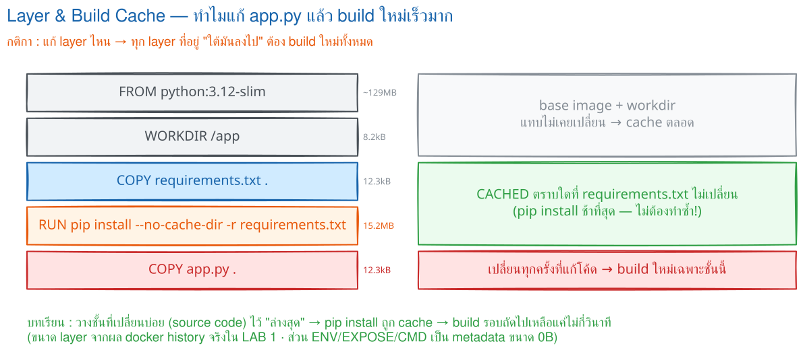
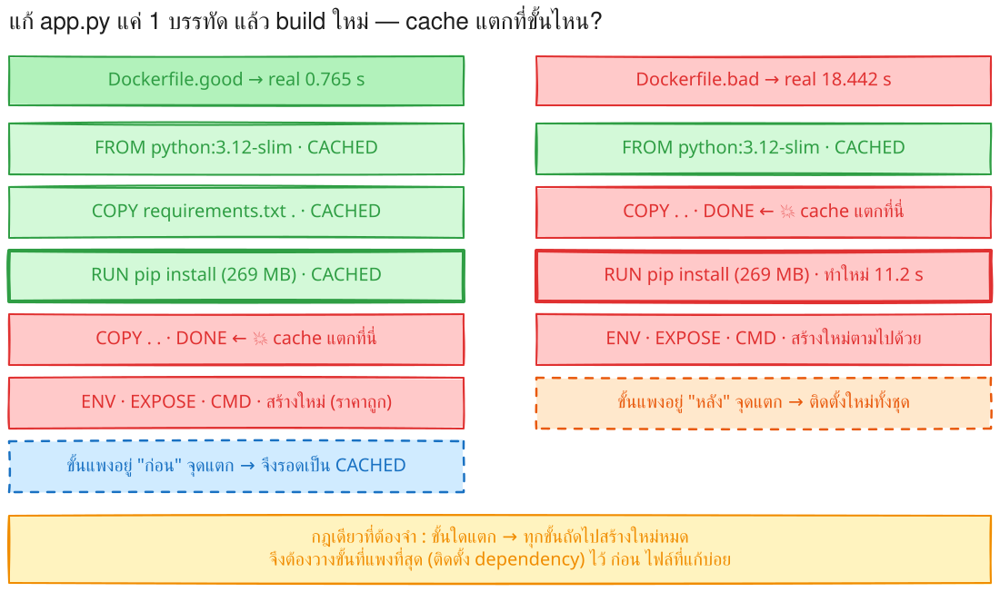
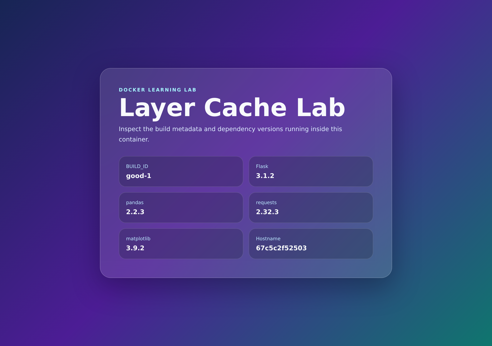

# LAB 2 — Layer Cache และ Options ของ `docker build`

> โฟลเดอร์ `002_LAB_Layer_Cache_Build_Options` · ไฟล์ของแล็บ : `Dockerfile.good` · `Dockerfile.bad` · `app.py` · `requirements.txt` · `.dockerignore` · `verify.sh`

### 🎯 แล็บนี้ใน 30 วินาที

| | |
|---|---|
| **คำถามเดียวที่ตอบให้จบ** | Dockerfile สองไฟล์ที่ต่างกันแค่ **ลำดับ 2 บรรทัด** ทำให้ build ต่างกันกี่เท่า |
| **ต้องผ่านอะไรมาก่อน** | **LAB 1** (build · run · ขอบเขตของไฟล์) |
| **เวลา** | ~35 นาที · การทดลอง **11 อัน** อันละ 2–4 นาที |
| **จบแล้วต้องทำได้เอง** | ชี้ได้ว่า cache แตกที่ขั้นไหนและเพราะอะไร · เรียง Dockerfile ให้ build เร็ว · คืนพื้นที่โดยรู้ว่ากำลังลบอะไร |
| **แล็บนี้ยัง *ไม่* สอน** | `--build-arg` → **LAB 4** · `--target` และ multi-stage → **LAB 7** |

---

## ทฤษฎีก่อนลงมือ

### image คือกอง layer ที่ซ้อนกัน

ทุกคำสั่งใน Dockerfile ที่เปลี่ยนไฟล์จะกลายเป็น **layer** หนึ่งชั้น วางซ้อนกันจากล่างขึ้นบน



> 🖼 **วิธีอ่านรูปนี้:** ไล่จาก base image ขึ้นมา — ชั้น `RUN pip install` หนัก **269MB** ส่วนชั้น `COPY . .` แค่ **16.4kB** · สังเกตเส้นที่บอกว่าเมื่อชั้นหนึ่งเปลี่ยน ชั้นถัดไปต้องสร้างใหม่ทั้งหมด

### กฎเดียวที่ต้องจำ

> **ขั้นไหนเปลี่ยน → ขั้นนั้นและทุกขั้นถัดไปต้องสร้างใหม่**

ดังนั้นต้องเรียง Dockerfile จาก **สิ่งที่เปลี่ยนน้อยที่สุด → สิ่งที่เปลี่ยนบ่อยที่สุด** :

```
base image → system package → รายการ dependency → ติดตั้ง dependency → source code
```

### Docker ตัดสินว่า cache แตกจากอะไร

| ขั้น | ตัดสินจาก |
|---|---|
| `FROM` | digest ของ base image |
| `COPY` / `ADD` | **checksum ของเนื้อไฟล์** ที่คัดลอกเข้าไป (ไม่ใช่เวลาแก้ไฟล์) |
| `RUN` | ข้อความของคำสั่ง + ผลของขั้นก่อนหน้า |

> `touch app.py` เฉย ๆ โดยเนื้อหาไม่เปลี่ยน **cache ไม่แตก** · แต่แก้เนื้อหาแม้ตัวอักษรเดียว checksum เปลี่ยนทันที

### สิ่งที่มักเข้าใจผิด

- **คิดว่า** `--no-cache` ดึง base image ใหม่ด้วย → **จริง ๆ** ไม่ดึง ต้องใช้ `--pull` คู่กัน (การทดลองที่ 6)
- **คิดว่า** ลบ image ใหญ่แล้วต้องได้พื้นที่คืนเท่าขนาดนั้น → **จริง ๆ** layer ที่ image อื่นยังใช้อยู่จะไม่ถูกลบ
- **คิดว่า** `.dockerignore` มีไว้ลดขนาดอย่างเดียว → **จริง ๆ** ช่วยกัน cache แตกด้วย (การทดลองที่ 8)

---

## เตรียมเครื่องเรียน

### ขั้นที่ 1 — เปิดกล่องเรียน

รันบน **เครื่องของเราเอง** :

```bash
docker rm -f devtools-df-lab2 2>/dev/null
docker run -dit --name devtools-df-lab2 --privileged \
  -p 2232:22 -p 8182:8182 tuchsanai/devtools:2569_1
ssh root@localhost -p 2232        # password : passwd
```

### ขั้นที่ 2 — โหลดโค้ดแล็บ

**คำสั่งทุกอันหลังจากนี้พิมพ์ข้างในกล่องเรียน**

```bash
mkdir -p ~/labwork && cd ~/labwork
git clone https://github.com/Tuchsanai/DevTools.git
cd DevTools/02_Docker/02_Dockerfile_Build_Run_Compose_Guide/002_LAB_Layer_Cache_Build_Options
```

---

## การทดลองที่ 1 — สอง Dockerfile นี้ต่างกันตรงไหน

**คำถาม:** ต่างกันที่เนื้อหา หรือต่างกันแค่ลำดับ

```bash
diff Dockerfile.good Dockerfile.bad
```

✅ **สิ่งที่ต้องเห็น** — คำสั่ง**ชุดเดียวกัน** แต่ `RUN pip install` ย้ายไปอยู่ **หลัง** `COPY . .` :

```
5,9c5
< # คัดลอกรายการ dependency ก่อนเพื่อใช้ cache
< COPY requirements.txt .
< # ติดตั้ง dependency ที่ระบุไว้
< RUN pip install --no-cache-dir -r requirements.txt
---
> # คัดลอกทุกไฟล์ก่อนทำให้ cache เสียได้ง่าย
11,12c7,10
> # ติดตั้ง dependency หลังคัดลอก source code
> RUN pip install --no-cache-dir -r requirements.txt
> ENV BUILD_ID=bad-1
```

วางเทียบกันให้เห็นชัด ๆ :

```dockerfile
# ---------- Dockerfile.good ----------              # ---------- Dockerfile.bad ----------
FROM python:3.12-slim                                FROM python:3.12-slim
WORKDIR /app                                         WORKDIR /app
COPY requirements.txt .                              COPY . .                    # ← ทุกไฟล์เข้ามาก่อน
RUN pip install --no-cache-dir -r requirements.txt   RUN pip install --no-cache-dir -r requirements.txt
COPY . .                                             ENV BUILD_ID=bad-1
ENV BUILD_ID=good-1                                  EXPOSE 8182
EXPOSE 8182                                          CMD ["python","app.py"]
CMD ["python","app.py"]
```

> 📝 `--no-cache-dir` เป็น option ของ **pip** (ไม่ให้ pip เก็บ cache ใน image) — **คนละเรื่องกับ** `--no-cache` ของ `docker build` ที่จะเจอในการทดลองที่ 6

---

## การทดลองที่ 2 — ล้างสนามให้เท่ากันก่อนจับเวลา

**คำถาม:** ทำไมต้องเตรียมก่อนถึงจะเทียบเวลาได้

```bash
docker pull python:3.12-slim
docker builder prune -af
```

✅ **สิ่งที่ต้องเห็น** — base image พร้อมแล้ว และ cache ถูกล้างเกลี้ยง :

```
Status: Image is up to date for python:3.12-slim
docker.io/library/python:3.12-slim
Total:	0B
```

> 📝 ถ้าไฟล์หนึ่งต้องโหลด base image ก่อนแต่อีกไฟล์ไม่ต้อง การจับเวลาจะเชื่อถือไม่ได้ · `-af` = ลบทุกอันโดยไม่ถาม — **ใส่ `-f` ตรงนี้เพราะจงใจล้างเพื่อการทดลอง ตอนใช้งานจริงอย่าเพิ่งใส่**

---

## การทดลองที่ 3 — build ครั้งแรก ลำดับมีผลไหม

**คำถาม:** ตอนที่ยังไม่มี cache เลย สองไฟล์นี้จะเร็วต่างกันไหม

```bash
time docker build -f Dockerfile.good -t cachelab-good:1.0 .
```

✅ **สิ่งที่ต้องเห็น** — ทุกขั้นขึ้น `DONE` **ไม่มีคำว่า `CACHED` เลยแม้แต่ขั้นเดียว** :

```
#8 [4/5] RUN pip install --no-cache-dir -r requirements.txt
#8 DONE 13.7s

real	0m21.336s
```

ทีนี้ไฟล์ที่ลำดับไม่ดี :

```bash
time docker build -f Dockerfile.bad -t cachelab-bad:1.0 .
```

✅ **สิ่งที่ต้องเห็น** — เหมือนกัน : ทุกขั้น `DONE` ไม่มี `CACHED` และต้องติดตั้ง package ใหม่หมดเช่นกัน :

```
#8 [4/4] RUN pip install --no-cache-dir -r requirements.txt
#8 DONE 13.5s
```

> 📝 **สรุปรอบนี้:** ทั้งสองไฟล์ต้องทำงานเท่ากันหมด เพราะยังไม่มี cache ให้ใช้ — **ลำดับยังไม่มีผลอะไรเลย** นี่คือเหตุผลที่คนเขียน Dockerfile ผิดลำดับแล้วไม่รู้ตัว
>
> ⚠️ **อย่าเทียบตัวเลข `real` ของสองบรรทัดนี้กัน** — รอบแรกต้องดาวน์โหลด package จากอินเทอร์เน็ต เวลาจึงขึ้นกับความเร็วเน็ต ณ ตอนนั้นล้วน ๆ (ในการทดสอบจริงเคยได้ตั้งแต่ 20 วินาทีถึงหลายนาที) · **ตัวเลขที่เทียบกันได้จริงอยู่ในการทดลองถัดไป** ซึ่งวัดในสภาพเดียวกันทั้งคู่

---

## การทดลองที่ 4 — แก้โค้ด 1 บรรทัด แล้ว build ใหม่

**คำถาม:** นี่คือสิ่งที่เกิดขึ้นทุกวันจริง ๆ — ลำดับจะมีผลตอนนี้ไหม

```bash
sed -i 's/# APP_VERSION = 1/# APP_VERSION = 2/' app.py
time docker build -f Dockerfile.good -t cachelab-good:1.0 .
```

✅ **สิ่งที่ต้องเห็น** — `RUN pip install` ขึ้น **`CACHED`** และจบไม่ถึง 1 วินาที :

```
#8 [4/5] RUN pip install --no-cache-dir -r requirements.txt
#8 CACHED
#9 [5/5] COPY . .
#9 DONE 0.0s

real	0m0.913s
```

ทีนี้ไฟล์ `bad` ที่แก้ **ไฟล์เดียวกัน บรรทัดเดียวกัน** :

```bash
time docker build -f Dockerfile.bad -t cachelab-bad:1.0 .
```

✅ **สิ่งที่ต้องเห็น** — **ไม่มี `CACHED`** ที่ขั้น `pip install` เลย ติดตั้งใหม่ทั้งชุด :

```
#7 [3/4] COPY . .
#7 DONE 0.0s
#8 [4/4] RUN pip install --no-cache-dir -r requirements.txt
#8 DONE 13.7s

real	0m20.939s
```



> 🖼 **วิธีอ่านรูปนี้:** มองหา **แถวสีแดงแถวแรก** ของแต่ละฝั่ง = จุดที่ cache แตก · ฝั่ง `good` จุดแตกอยู่ **ใต้** `RUN pip install` ขั้นแพงจึงรอด · ฝั่ง `bad` จุดแตกอยู่ **เหนือ** ขั้นนั้น ทุกอย่างใต้ลงไปจึงต้องทำใหม่

| Dockerfile | ขั้น `pip install` หลังแก้ `app.py` | เวลารวม (`real`) |
|---|---|---|
| `Dockerfile.good` | `CACHED` — ไม่ทำอะไรเลย | **0.913 s** |
| `Dockerfile.bad` | ติดตั้งใหม่ทั้งชุด 13.7 s | **20.939 s** |

> 📝 สองบรรทัดนี้วัดในเครื่องเดียวกัน นาทีเดียวกัน จึงเทียบกันได้จริง — ต่างกัน **~23 เท่า** · และนี่คือเวลาที่เราจ่าย **ทุกครั้งที่แก้โค้ด** วันหนึ่งอาจ build 20–50 รอบ (เลขของแต่ละคนไม่ตรงกัน แต่สัดส่วนต้องต่างกันชัดเจนแบบนี้)

---

## การทดลองที่ 5 — layer ไหนกินพื้นที่มากที่สุด

**คำถาม:** ที่บอกว่าขั้น `pip install` แพง แพงแค่ไหน

```bash
docker history cachelab-good:1.0
```

✅ **สิ่งที่ต้องเห็น** — layer `RUN ... pip install ...` = **269MB** ส่วน `COPY . .` ที่เราแก้บ่อยแค่ **16.4kB** :

```
IMAGE          CREATED          CREATED BY                                      SIZE
cd37a50f03d4   32 seconds ago   CMD ["python" "app.py"]                         0B
<missing>      32 seconds ago   ENV BUILD_ID=good-1                             0B
<missing>      32 seconds ago   COPY . . # buildkit                             16.4kB
<missing>      32 seconds ago   RUN /bin/sh -c pip install --no-cache-dir -r…   269MB
<missing>      43 seconds ago   COPY requirements.txt . # buildkit              12.3kB
<missing>      2 minutes ago    WORKDIR /app                                    8.19kB
```

> 📝 คอลัมน์ `SIZE` คือขนาดที่ layer นั้น **เพิ่มเข้ามา** ไม่ใช่ขนาดสะสม · `<missing>` ไม่ใช่ error — เป็นเรื่องปกติของ layer ที่ไม่มี ID ของตัวเอง · **นี่คือเครื่องมือหาว่า image อ้วนเพราะอะไร**

---

## การทดลองที่ 6 — `--no-cache` กับ `--pull` ต่างกันอย่างไร

**คำถาม:** สั่ง `--no-cache` แล้วได้ base image ใหม่ด้วยหรือเปล่า

```bash
time docker build --no-cache -f Dockerfile.good -t cachelab-good:1.0 .
```

✅ **สิ่งที่ต้องเห็น** — `RUN pip install` ทำใหม่จริง เวลากลับไปเท่ารอบแรก :

```
#8 [4/5] RUN pip install --no-cache-dir -r requirements.txt
#8 DONE 10.8s

real	0m18.018s
```

ทีนี้ลอง `--pull` บ้าง :

```bash
time docker build --pull -f Dockerfile.good -t cachelab-good:1.0 .
```

✅ **สิ่งที่ต้องเห็น** — ขั้น `load metadata` ใช้เวลาไปถาม registry แต่ขั้นอื่นยัง `CACHED` :

```
#2 [internal] load metadata for docker.io/library/python:3.12-slim
#2 DONE 1.4s
#8 [4/5] RUN pip install --no-cache-dir -r requirements.txt
#8 CACHED

real	0m1.876s
```

> 📝 **คำตอบ:** เป็นคนละเรื่องกัน — `--no-cache` = ไม่ใช้ cache ของขั้นต่าง ๆ แต่ `FROM` ยังใช้ image เดิมในเครื่อง · `--pull` = ไปถาม registry ว่ามี base image ใหม่กว่าไหม · **อยากได้ของใหม่หมดจริง ๆ ต้องใช้คู่กัน** `--pull --no-cache`
>
> ⚠️ **ของแปลกที่จะเห็นบน Docker 29:** ขั้น `WORKDIR` ยังขึ้น `CACHED` แม้สั่ง `--no-cache` เพราะเป็นขั้น metadata เบา ๆ — **ให้ดูขั้น `RUN` เป็นตัวตัดสิน**

---

## การทดลองที่ 7 — ติดหลาย tag จากการ build ครั้งเดียว

**คำถาม:** ใส่ `-t` สองอันแล้วได้ image สองก้อนไหม

```bash
docker build -f Dockerfile.good -t cachelab-good:1.1 -t cachelab-good:latest .
docker image ls cachelab-good
```

✅ **สิ่งที่ต้องเห็น** — `1.1` กับ `latest` มี **ID เดียวกัน** = image ก้อนเดียว มีสองชื่อ :

```
IMAGE                  ID             DISK USAGE   CONTENT SIZE
cachelab-good:1.0      060290589b07        524MB          121MB
cachelab-good:1.1      6df39de8d09d        524MB          121MB
cachelab-good:latest   6df39de8d09d        524MB          121MB
```

> 📝 ใส่ `-t` ซ้ำได้กี่ครั้งก็ได้ · รูปแบบ tag คือ `[registry/]repository[:tag]` ถ้าไม่ใส่ `:tag` Docker เติม `:latest` ให้เอง — **LAB 5** จะเจาะเรื่องนี้เต็ม ๆ

---

## การทดลองที่ 8 — `.dockerignore` กัน cache แตกได้ด้วย

**คำถาม:** แก้ไฟล์ที่ไม่เกี่ยวกับแอปเลย จะทำให้ build ใหม่ไหม

`notes.md` ถูกระบุไว้ใน `.dockerignore` แล้ว — ลองแก้ดู :

```bash
echo "note v1" > notes.md
docker build -f Dockerfile.good -t cachelab-good:1.0 .    # build ให้ cache นิ่งก่อน
echo "note v2 — แก้แล้ว" > notes.md
time docker build -f Dockerfile.good -t cachelab-good:1.0 .
```

✅ **สิ่งที่ต้องเห็น** — ทุกขั้นยัง `CACHED` **รวมถึง `COPY . .`** :

```
#9 [5/5] COPY . .
#9 CACHED

real	0m0.506s
```

ทีนี้เอา `notes.md` ออกจาก `.dockerignore` แล้วลองใหม่ :

```bash
sed -i '/^notes.md$/d' .dockerignore
echo "note v3 — ไม่ถูก ignore แล้ว" > notes.md
docker build -f Dockerfile.good -t cachelab-good:1.0 .
```

✅ **สิ่งที่ต้องเห็น** — คราวนี้ `COPY . .` เปลี่ยนจาก `CACHED` เป็น `DONE` = **cache แตกเพราะไฟล์ที่ไม่เกี่ยวกับแอปเลย** :

```
#9 [5/5] COPY . .
#9 DONE 0.0s
```

> 📝 **บทเรียน:** ไฟล์อย่าง `.git/`, `node_modules/`, ไฟล์ log, ไฟล์ note ส่วนตัว เปลี่ยนบ่อยมากแต่ไม่มีผลกับแอป — ถ้าไม่ใส่ใน `.dockerignore` มันจะทำให้ `COPY . .` แตกทุกครั้ง แล้วลากทุกขั้นถัดไปไปด้วย

คืนไฟล์กลับก่อนไปต่อ :

```bash
sed -i 's|^images/$|images/\nnotes.md|' .dockerignore && rm -f notes.md
```

---

## การทดลองที่ 9 — image ที่ไม่มีชื่อ (dangling) เกิดตอนไหน

**คำถาม:** build โดยไม่ตั้งชื่อจะได้อะไร

```bash
docker build -f Dockerfile.good .
docker image ls -f dangling=true
```

✅ **สิ่งที่ต้องเห็น** — บรรทัด `naming to moby-dangling@...` และตารางขึ้นแถว `<untagged>` :

```
#10 naming to moby-dangling@sha256:df7d12bbb34c... done

IMAGE        ID             DISK USAGE   CONTENT SIZE
<untagged>   df7d12bbb34c        524MB          121MB
```

ลบทิ้งแล้วดูว่าได้พื้นที่คืนเท่าไร :

```bash
docker image prune          # พิมพ์ y เมื่อมันถาม
```

✅ **สิ่งที่ต้องเห็น** — ลบ image ขนาด 524MB แต่คืนพื้นที่แค่ **หลักกิโลไบต์** :

```
Total reclaimed space: 3.273kB
```

> 📝 **ทำไมคืนแค่นั้น?** เพราะ layer เกือบทั้งหมด (รวม layer `pip install` 269MB) ยัง **ใช้ร่วมกัน** กับ `cachelab-good:1.0` ที่ยังมี tag อยู่ — Docker ลบได้เฉพาะส่วนที่ไม่มีใครใช้แล้ว
>
> ⚠️ **จุดที่เปลี่ยนไปใน Docker 29:** ตำราเก่าบอกว่า "build ทับ tag เดิมแล้วจะเหลือ image `<none>` เต็มเครื่อง" — **ไม่เป็นแบบนั้นแล้ว** วิธีทำให้เกิด dangling image บนเวอร์ชันนี้คือ **build โดยไม่ใส่ `-t`** อย่างที่เราเพิ่งทำ

---

## การทดลองที่ 10 — build cache กินพื้นที่เท่าไร

**คำถาม:** ลบ image ไปแล้วดิสก์ยังเต็ม เพราะอะไร

```bash
docker system df
```

✅ **สิ่งที่ต้องเห็น** — แถว **Build Cache** ใหญ่กว่าที่คิดเสมอ :

```
TYPE            TOTAL     ACTIVE    SIZE      RECLAIMABLE
Images          4         0         873.8MB   349.6MB (40%)
Containers      0         0         0B        0B
Local Volumes   0         0         0B        0B
Build Cache     17        0         1.086GB   1.043GB
```

ล้างแล้วดูซ้ำ :

```bash
docker builder prune        # พิมพ์ y เมื่อมันถาม
docker system df
```

✅ **สิ่งที่ต้องเห็น** — Build Cache ลดจาก **1.086GB → 43.23MB** และ `RECLAIMABLE` เหลือ `0B` :

```
Total:	1.043GB

TYPE            TOTAL     ACTIVE    SIZE      RECLAIMABLE
Build Cache     7         0         43.23MB   0B
```

> 📝 **ราคาที่ต้องจ่าย:** build ครั้งถัดไปจะช้าเท่ารอบแรก · `builder prune` คือการแลก **พื้นที่ดิสก์** กับ **เวลา build ครั้งหน้า** — สั่งเมื่อดิสก์ใกล้เต็มจริง ๆ ไม่ใช่สั่งเป็นนิสัย · ส่วน `docker system df` **อ่านอย่างเดียว ไม่ลบอะไร** ปลอดภัย 100%

---

## การทดลองที่ 11 — รันแอปจริงดูว่า image มาจากไฟล์ไหน

**คำถาม:** image ที่รันอยู่ build มาจาก `good` หรือ `bad`

```bash
docker build -f Dockerfile.good -t cachelab-good:1.0 .
docker run -d --name cachelab-web -p 8182:8182 cachelab-good:1.0
sleep 3
curl -s http://localhost:8182/health; echo
docker image inspect cachelab-good:1.0 --format '{{json .Config.Env}}' | tr ',' '\n' | grep BUILD_ID
```

✅ **สิ่งที่ต้องเห็น** — แอปตอบ `ok` และ `BUILD_ID` บอกที่มาของ image :

```
{"status":"ok"}
"BUILD_ID=good-1"]
```

เปิดในเบราว์เซอร์ที่ **`http://localhost:8182`** :



> 📝 เวอร์ชัน **Flask 3.1.2 · pandas 2.2.3 · requests 2.32.3 · matplotlib 3.9.2** ที่โชว์บนหน้าเว็บ คือเนื้อหาของ layer 269MB ที่เห็นใน `docker history` นั่นเอง

```bash
docker rm -f cachelab-web
```

---

## ตรวจงานด้วย `verify.sh`

```bash
bash verify.sh ; echo "exit code = $?"
```

✅ **สิ่งที่ต้องเห็น** — `[PASS]` ทุกบรรทัด ปิดท้าย `ALL CHECKS PASSED` :

```
[PASS] Dockerfile.good : ขั้น RUN pip install เป็น CACHED หลังแก้ app.py
[PASS] Dockerfile.bad : ขั้น RUN pip install ถูก build ใหม่ (cache แตก) — ลำดับคำสั่งมีผลจริง
[PASS] แก้ไฟล์ที่ถูก .dockerignore แล้ว ขั้น COPY . . ยังเป็น CACHED
ALL CHECKS PASSED
exit code = 0
```

> 📝 ใช้เวลาราว 1 นาที เพราะต้องรอ `Dockerfile.bad` ติดตั้ง package ใหม่จริงเพื่อพิสูจน์ · สคริปต์ **คืนไฟล์ `app.py` ให้เอง** และลบ container ชั่วคราวทิ้ง แต่ไม่ลบ image ของเรา

---

## แก้ปัญหาที่พบบ่อย

| อาการ | สาเหตุ | วิธีแก้ |
|---|---|---|
| แก้โค้ดนิดเดียวแต่ build นานเป็นนาทีทุกครั้ง | Dockerfile เรียงผิดลำดับแบบ `Dockerfile.bad` | ย้าย `COPY requirements.txt .` + `RUN pip install` ขึ้นไป**ก่อน** `COPY . .` |
| ทำการทดลองที่ 4 ซ้ำ แล้ว `bad` กลับขึ้น `CACHED` | เคย build เนื้อหาชุดเดียวกันนี้ไปแล้ว BuildKit จึงหยิบ cache เก่ามาใช้ | ใส่ค่าใหม่ที่ไม่เคยใช้ : `sed -i "s/^# APP_VERSION = .*/# APP_VERSION = $(date +%s)/" app.py` |
| build แล้วได้ของเก่าทั้งที่แก้ไฟล์ไปแล้ว | Docker ใช้ cache ของขั้นนั้นอยู่ (มักเกิดกับ `RUN apt-get update`) | สั่ง `--no-cache` ครั้งเดียว · ระยะยาวให้ **pin เวอร์ชันทุกตัว** ใน `requirements.txt` |
| สั่ง `--no-cache` แล้ว base image ยังเป็นตัวเก่า | `--no-cache` ไม่แตะ `FROM` | ใช้คู่กัน : `docker build --pull --no-cache ...` |
| ดิสก์เต็มทั้งที่ลบ image หมดแล้ว | **build cache** ของ BuildKit ยังอยู่ | `docker system df` ดูแถว Build Cache แล้ว `docker builder prune` |
| ลบ image ตัวใหญ่แล้วได้พื้นที่คืนแค่ไม่กี่ kB | layer ส่วนใหญ่ยังใช้ร่วมกับ image ตัวอื่น | เป็นพฤติกรรมปกติของ layer ที่ share กัน ไม่ใช่ bug |
| หา image `<none>` ไม่เจอทั้งที่ build ทับ tag เดิมหลายรอบ | Docker 29 ไม่ทิ้ง dangling จากการ build ทับ tag แล้ว | อยากเห็นตัวอย่างให้ build **โดยไม่ใส่ `-t`** (การทดลองที่ 9) |
| `port is already allocated` ตอนรันแอป | container เก่ายังจองพอร์ต 8182 อยู่ | `docker rm -f cachelab-web` แล้วรันใหม่ |
| `failed to read dockerfile: open Dockerfile: no such file` | ลืมใส่ `-f` ทั้งที่โฟลเดอร์นี้ไม่มีไฟล์ชื่อ `Dockerfile` เฉย ๆ | ใส่ `-f Dockerfile.good` หรือ `-f Dockerfile.bad` ทุกครั้ง |

---

## เก็บกวาด

**ในกล่องเรียน:**

```bash
docker rm -f cachelab-web 2>/dev/null
docker image rm cachelab-good:1.0 cachelab-good:1.1 cachelab-good:latest cachelab-bad:1.0
docker image ls
```

> 📝 เก็บ `python:3.12-slim` ไว้ใช้ต่อใน LAB ถัดไปได้ ไม่ต้องลบ

**ออกจากกล่องแล้วลบกล่องบนเครื่องเรา:**

```bash
exit
docker rm -f devtools-df-lab2
docker ps -a --filter "name=^devtools-"
```

✅ ตารางสุดท้ายต้องเหลือแค่หัวตาราง

---

## สรุปคำสั่งของแล็บนี้

| คำสั่ง | ความหมาย |
|---|---|
| `docker build -f <ไฟล์> -t <ชื่อ:tag> .` | เลือกไฟล์ Dockerfile ด้วย `-f` และตั้งชื่อด้วย `-t` |
| `docker build -t a:1.0 -t a:latest .` | ติดหลาย tag จากการ build ครั้งเดียว — ได้ image ก้อนเดียว |
| `docker build --no-cache ...` | ไม่ใช้ cache ของขั้นต่าง ๆ (แต่ **ไม่** ดึง base image ใหม่) |
| `docker build --pull ...` | ไปถาม registry ว่า base image มีรุ่นใหม่กว่าไหม |
| `docker build --pull --no-cache ...` | "ใหม่หมดจริง ๆ" ต้องใช้คู่กันเท่านั้น |
| `time docker build ...` | จับเวลาจริง — ดูบรรทัด `real` |
| `docker history <image>` | ดูทุก layer พร้อมขนาดที่แต่ละ layer เพิ่มเข้ามา |
| `docker image ls -f dangling=true` | กรองเฉพาะ image ที่ไม่มี tag |
| `docker image prune` | ลบ dangling image (ไม่ใส่ `-f` เพื่อให้ถามยืนยันก่อน) |
| `docker system df` | อ่านอย่างเดียว — ดูพื้นที่ของ images / containers / volumes / **build cache** |
| `docker builder prune` | ล้าง build cache — คืนดิสก์แลกกับ build ครั้งหน้าที่ช้าลง |

> **จำให้ครบ:** เรียง Dockerfile จาก **เปลี่ยนน้อย → เปลี่ยนบ่อย** · ขั้นที่แพงที่สุดต้องอยู่ **ก่อน** ไฟล์ที่แก้บ่อย · `CACHED` ใน log คือหลักฐานว่าเรียงถูก · `--no-cache` ≠ `--pull`

## ✅ เช็กลิสต์ก่อนจบแล็บ

- [ ] `diff` แล้วบอกได้ว่าสองไฟล์ต่างกันแค่ **ลำดับ** ไม่ใช่เนื้อหา
- [ ] รอบแรก (ไม่มี cache) เวลาของ `good` กับ `bad` **ใกล้เคียงกัน**
- [ ] หลังแก้ `app.py` 1 บรรทัด : `good` ขึ้น `CACHED` ที่ `pip install` และไม่ถึง 1 วินาที · `bad` ทำใหม่ทั้งชุด
- [ ] `docker history` ชี้ได้ว่า layer ไหนใหญ่ที่สุด (คำใบ้ : 269MB)
- [ ] อธิบายได้ว่าทำไม `--no-cache` อย่างเดียวไม่พอเมื่ออยากได้ base image ใหม่
- [ ] `-t` สองอันได้ image ก้อนเดียวสองชื่อ (ID ตรงกัน)
- [ ] แก้ไฟล์ที่อยู่ใน `.dockerignore` แล้ว `COPY . .` **ยัง `CACHED`** และเอาออกจากรายการแล้ว **แตกจริง**
- [ ] build โดยไม่ใส่ `-t` แล้วเห็น `<untagged>` และอธิบายได้ว่าทำไม prune คืนพื้นที่ได้น้อย
- [ ] `docker system df` ก่อน/หลัง `builder prune` แล้วจดตัวเลข Build Cache ที่ลดลงได้
- [ ] `bash verify.sh` ขึ้น `ALL CHECKS PASSED` และเก็บกวาดจนไม่เหลือ container ของแล็บ

*ผลลัพธ์ทั้งหมดในเอกสารนี้มาจากการรันจริงในเครื่องเรียน `tuchsanai/devtools:2569_1`*
