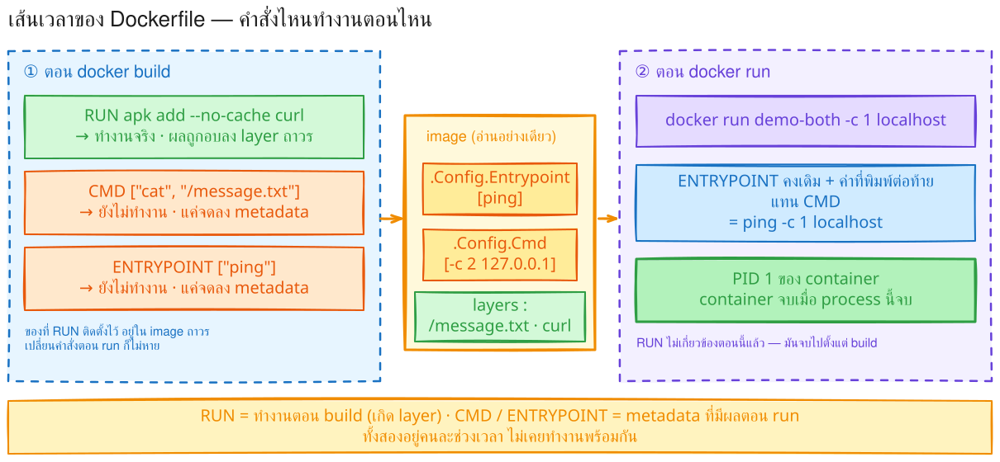
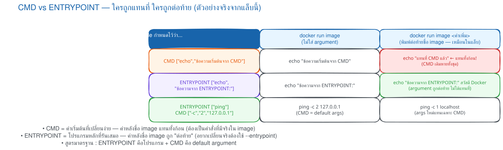
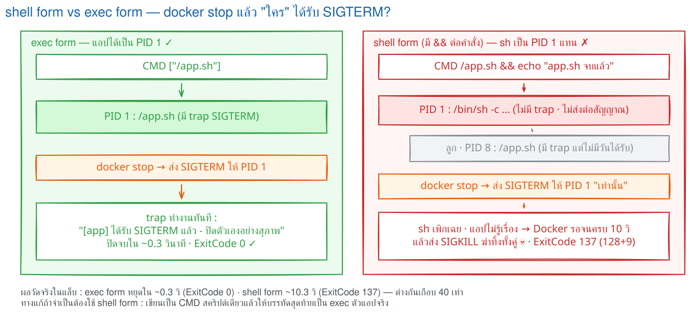

# LAB 3 — RUN vs CMD vs ENTRYPOINT

> โฟลเดอร์ `003_LAB_RUN_CMD_ENTRYPOINT` · ในโฟลเดอร์มี Dockerfile หลายไฟล์ (`Dockerfile.run` · `.cmd` · `.entrypoint` · `.both` · `.multicmd` · `.execform` · `.shellform` · `.sigexec` · `.sigshell` · `.nocmd` · `.nocmd_reset`) พร้อม `app.sh` และ `verify.sh`

### 🎯 แล็บนี้ใน 30 วินาที

| | |
|---|---|
| **คำถามเดียวที่ตอบให้จบ** | สิ่งที่พิมพ์ต่อท้ายชื่อ image ไป **แทนที่** หรือไป **ต่อท้าย** อะไรกันแน่ |
| **ต้องผ่านอะไรมาก่อน** | **LAB 1** (build · run) |
| **เวลา** | ~30 นาที · การทดลอง **9 อัน** อันละ 2–4 นาที |
| **จบแล้วต้องทำได้เอง** | เลือก `CMD` / `ENTRYPOINT` / ทั้งคู่ ให้ตรงงาน · อ่าน metadata แทนการเดา · บอกได้ว่าทำไม `docker stop` บางตัวช้า 10 วินาที |
| **หมายเหตุ** | แล็บนี้ **ไม่มีหน้าเว็บ ไม่ต้องเปิดพอร์ต** ใช้เทอร์มินัลเดียวจบ |

> ⚠️ **สำคัญ:** โฟลเดอร์นี้ไม่มีไฟล์ชื่อ `Dockerfile` เฉย ๆ จึงต้องใส่ **`-f <ชื่อไฟล์>` ทุกครั้ง** ที่ build

---

## ทฤษฎีก่อนลงมือ

### เส้นเวลา : คำสั่งไหนทำงานตอนไหน



> 🖼 **วิธีอ่านรูปนี้:** ฝั่งซ้าย (build) มีแค่ `RUN` ที่ทำงานจริงและทิ้งผลไว้เป็น layer ส่วน `CMD`/`ENTRYPOINT` แค่ถูกจดลง **ช่อง metadata** · ฝั่งขวา (run) Docker หยิบสองช่องนั้นมาประกอบเป็นคำสั่งจริงที่กลายเป็น **PID 1**

| คำสั่ง | ทำงานเมื่อไร | เก็บไว้ที่ไหน |
|---|---|---|
| `RUN` | ตอน `docker build` | ผลกลายเป็น **layer ถาวรใน image** |
| `CMD` | ตอน `docker run` | ช่อง metadata `.Config.Cmd` |
| `ENTRYPOINT` | ตอน `docker run` | ช่อง metadata `.Config.Entrypoint` |

### กฎ "แทนที่" กับ "ต่อท้าย"



> 🖼 **วิธีอ่านรูปนี้:** อ่านทีละแถวจาก metadata → ค่าที่พิมพ์ต่อท้ายชื่อ image → คำสั่งจริง · ค่านั้น **แทน `CMD` ทั้งก้อน** แต่ **ไม่แทน `ENTRYPOINT`**

### สิ่งที่มักเข้าใจผิด

- **คิดว่า** `CMD` ทำงานตอน build → **จริง ๆ** เป็นแค่ metadata คำสั่งที่สร้าง layer คือ `RUN`
- **คิดว่า** ค่าหลังชื่อ image ต่อท้ายเสมอ → **จริง ๆ** มันแทน `CMD` ทั้งก้อนก่อน แล้วจึงไปต่อท้าย `ENTRYPOINT`
- **คิดว่า** exec form ทำให้ `docker stop` เร็วเสมอ → **จริง ๆ** แอปต้องดัก `SIGTERM` เองด้วย (การทดลองที่ 8–9)

---

## เตรียมเครื่องเรียน

### ขั้นที่ 1 — เปิดกล่องเรียน

รันบน **เครื่องของเราเอง** :

```bash
docker rm -f devtools-df-lab3 2>/dev/null
docker run -dit --name devtools-df-lab3 --privileged \
  -p 2233:22 tuchsanai/devtools:2569_1
ssh root@localhost -p 2233        # password : passwd
```

> 📝 แล็บนี้ไม่มี app port เพราะไม่มีหน้าเว็บให้เปิด

### ขั้นที่ 2 — โหลดโค้ดแล็บ

**คำสั่งทุกอันหลังจากนี้พิมพ์ข้างในกล่องเรียน**

```bash
mkdir -p ~/labwork && cd ~/labwork
git clone https://github.com/Tuchsanai/DevTools.git
cd DevTools/02_Docker/02_Dockerfile_Build_Run_Compose_Guide/003_LAB_RUN_CMD_ENTRYPOINT
```

---

## การทดลองที่ 1 — `RUN` ทำงานตอนไหน

**คำถาม:** ของที่ `RUN` ติดตั้งไว้ จะหายไหมถ้าเปลี่ยนคำสั่งตอน run

`Dockerfile.run` :

```dockerfile
FROM alpine:3.20
RUN echo "สร้างไฟล์ในขั้น Build" > /message.txt
RUN apk add --no-cache curl
CMD ["cat", "/message.txt"]
```

```bash
docker build -f Dockerfile.run -t demo-run .
```

✅ **สิ่งที่ต้องเห็น** — `RUN` **ทั้งสองบรรทัดทำงานตอนนี้** (ตอน build ไม่ใช่ตอน run) :

```
#5 [2/3] RUN echo "สร้างไฟล์ในขั้น Build" > /message.txt
#5 DONE 0.3s
#6 [3/3] RUN apk add --no-cache curl
#6 1.245 (10/10) Installing curl (8.14.1-r2)
#6 DONE 1.4s
```

ทีนี้รันสองแบบเทียบกัน :

```bash
docker run --rm demo-run
docker run --rm demo-run curl --version
```

✅ **สิ่งที่ต้องเห็น** — รอบแรกใช้ `CMD` เดิม · รอบสองเราแทนคำสั่ง แต่ **`curl` ยังใช้ได้** :

```
สร้างไฟล์ในขั้น Build
curl 8.14.1 (x86_64-alpine-linux-musl) libcurl/8.14.1 ...
```

> 📝 **บทเรียน:** `RUN` = "อบเข้า image" ผลอยู่ถาวร · `CMD` = "คำสั่งเริ่มต้นตอนเปิดกล่อง" เปลี่ยนได้ · `--rm` ลบ container ทิ้งทันทีที่จบ (แล็บนี้รันหลายสิบรอบ ไม่งั้นซากเต็มเครื่อง)

---

## การทดลองที่ 2 — `CMD` ถูกแทนที่

**คำถาม:** พิมพ์คำสั่งต่อท้ายชื่อ image แล้ว `CMD` เดิมยังอยู่ไหม

`Dockerfile.cmd` :

```dockerfile
FROM alpine:3.20
CMD ["echo", "ข้อความเริ่มต้นจาก CMD"]
```

```bash
docker build -f Dockerfile.cmd -t demo-cmd .
docker run --rm demo-cmd
docker run --rm demo-cmd echo "แทนที่ CMD แล้ว"
```

✅ **สิ่งที่ต้องเห็น** — สองบรรทัด และ **ข้อความเดิมไม่โผล่ในรอบที่สอง** :

```
ข้อความเริ่มต้นจาก CMD
แทนที่ CMD แล้ว
```

> 📝 **ที่มักพลาด:** หลายคนคิดว่าจะได้สองข้อความ แต่ได้แค่ข้อความใหม่ เพราะของเดิม **ถูกทับทั้งชุด** · เปลี่ยนได้แม้กระทั่งโปรแกรม ไม่ใช่แค่ argument — ลองเองได้ `docker run --rm demo-cmd cat /etc/alpine-release`

---

## การทดลองที่ 3 — `ENTRYPOINT` ถูกต่อท้าย

**คำถาม:** เปลี่ยนคำเดียวจาก `CMD` เป็น `ENTRYPOINT` แล้วพฤติกรรมต่างกันอย่างไร

`Dockerfile.entrypoint` — ต่างจากไฟล์ที่แล้ว **แค่คำเดียว** :

```dockerfile
FROM alpine:3.20
ENTRYPOINT ["echo", "ข้อความจาก ENTRYPOINT:"]
```

```bash
docker build -f Dockerfile.entrypoint -t demo-entrypoint .
docker run --rm demo-entrypoint
docker run --rm demo-entrypoint สวัสดี Docker
```

✅ **สิ่งที่ต้องเห็น** — รอบแรกเหมือนกันเป๊ะ (ดูไม่ออก!) · **รอบสองข้อความเดิมยังอยู่** แล้วมีคำที่เราพิมพ์ต่อท้าย :

```
ข้อความจาก ENTRYPOINT:
ข้อความจาก ENTRYPOINT: สวัสดี Docker
```

> 📝 **นี่คือแก่นของแล็บ:** ค่าหลังชื่อ image ไม่ได้ทับ `ENTRYPOINT` แต่ถูกประกอบเป็น `echo "ข้อความจาก ENTRYPOINT:" "สวัสดี" "Docker"` · ความต่างจะไม่โผล่เลยถ้าไม่ลองใส่ค่าต่อท้าย

---

## การทดลองที่ 4 — จะเปลี่ยนโปรแกรมหลักต้องทำอย่างไร

**คำถาม:** image ที่มี `ENTRYPOINT` แล้วอยากเข้า shell ไปดูข้างใน ทำได้ไหม

```bash
docker run --rm demo-entrypoint sh
```

✅ **สิ่งที่ต้องเห็น** — **ไม่ได้ shell** แต่คำว่า `sh` กลายเป็น argument ของ `echo` :

```
ข้อความจาก ENTRYPOINT: sh
```

ทางแก้คือ option `--entrypoint` :

```bash
docker run --rm --entrypoint sh demo-entrypoint -c "echo ได้ shell แล้ว; id -u"
```

✅ **สิ่งที่ต้องเห็น** — คราวนี้ได้ shell จริง (`id -u` = 0 คือ root) :

```
ได้ shell แล้ว
0
```

> 📝 **กติกา:** `--entrypoint` เขียน **ก่อนชื่อ image** เสมอ (เป็น option ของ `docker run` ไม่ใช่ของ image) และรับได้แค่ **ชื่อโปรแกรมตัวเดียว** ส่วน argument ให้พิมพ์หลังชื่อ image · พอใส่ `--entrypoint` ค่า `CMD` เดิมจะถูกล้างทิ้งไปด้วย
>
> **นี่คือเหตุผลที่ image ที่มี `ENTRYPOINT` debug ยากกว่า** — ตอน dev จึงสะดวกกว่าถ้าใช้ `CMD` เดี่ยว

---

## การทดลองที่ 5 — `ENTRYPOINT` + `CMD` ใช้ร่วมกัน

**คำถาม:** ใส่ทั้งคู่แล้วได้อะไร

`Dockerfile.both` :

```dockerfile
FROM alpine:3.20
ENTRYPOINT ["ping"]
CMD ["-c", "2", "127.0.0.1"]
```

```bash
docker build -f Dockerfile.both -t demo-both .
docker run --rm demo-both
docker run --rm demo-both -c 1 localhost
```

✅ **สิ่งที่ต้องเห็น** — รอบแรก **2 packets** (มาจาก `CMD`) · รอบสอง **1 packet** และปลายทางเปลี่ยน :

```
$ docker run --rm demo-both                      $ docker run --rm demo-both -c 1 localhost
2 packets transmitted, 2 packets received        1 packets transmitted, 1 packets received
round-trip min/avg/max = 0.030/0.037/0.045 ms    round-trip min/avg/max = 0.025/0.025/0.025 ms
```

| การรัน | คำสั่งจริงที่ถูกเรียก |
|---|---|
| `docker run demo-both` | `ping -c 2 127.0.0.1` (ใช้ `CMD` ใน image) |
| `docker run demo-both -c 1 localhost` | `ping -c 1 localhost` (`CMD` ถูกแทน แต่ `ENTRYPOINT` ยังอยู่) |

> 📝 **ที่มักพลาด:** ไม่ต้องพิมพ์คำว่า `ping` ซ้ำ — พิมพ์ไปจะกลายเป็น `ping ping ...` แล้วพัง · **รูปแบบนี้คือมาตรฐานของ image ที่ทำตัวเป็นเครื่องมือ** เช่น `ffmpeg`, `curl` ใน container

---

## การทดลองที่ 6 — เปิดฝาดูว่า Docker เก็บไว้ช่องไหน

**คำถาม:** พฤติกรรม "แทนที่ vs ต่อท้าย" ตัดสินจากอะไร

```bash
docker image inspect \
  --format '{{index .RepoTags 0}} → ENTRYPOINT {{.Config.Entrypoint}} | CMD {{.Config.Cmd}}' \
  demo-run demo-cmd demo-entrypoint demo-both
```

✅ **สิ่งที่ต้องเห็น** — `demo-cmd` กับ `demo-entrypoint` เก็บข้อความไว้ **คนละช่อง** ทั้งที่ผลตอนรันเปล่า ๆ เหมือนกัน :

```
demo-run:latest → ENTRYPOINT [] | CMD [cat /message.txt]
demo-cmd:latest → ENTRYPOINT [] | CMD [echo ข้อความเริ่มต้นจาก CMD]
demo-entrypoint:latest → ENTRYPOINT [echo ข้อความจาก ENTRYPOINT:] | CMD []
demo-both:latest → ENTRYPOINT [ping] | CMD [-c 2 127.0.0.1]
```

> 📝 `docker image inspect` รับชื่อ image ได้หลายตัวในครั้งเดียว แล้วใช้ `--format` เดิมกับทุกตัว จึงไม่ต้องเขียนลูป

> 📝 **นี่คือหลักฐานชิ้นสำคัญ:** พฤติกรรมไม่ได้ขึ้นกับคำที่เราพิมพ์ตอน `docker run` แต่ขึ้นกับว่าข้อความนั้นถูกเก็บไว้ในช่อง **Cmd** (ทับได้) หรือช่อง **Entrypoint** (ทับไม่ได้ ต้องใช้ `--entrypoint`) · `[]` = ไม่ได้ตั้งไว้

---

## การทดลองที่ 7 — เขียน `CMD` สองบรรทัดจะเป็นอย่างไร

**คำถาม:** `CMD` สะสมเหมือน `RUN` หรือทับกัน

`Dockerfile.multicmd` มี `CMD` **สองบรรทัด** :

```bash
docker build -f Dockerfile.multicmd -t demo-multicmd .
docker image inspect --format '{{.Config.Cmd}}' demo-multicmd
docker run --rm demo-multicmd
```

✅ **สิ่งที่ต้องเห็น** — **ไม่มีคำว่า "ตัวแรก" หลงเหลืออยู่เลย** :

```
[echo CMD ตัวสุดท้าย - ตัวนี้เท่านั้นที่มีผล]
CMD ตัวสุดท้าย - ตัวนี้เท่านั้นที่มีผล
```

> 📝 **บทเรียน:** `CMD` และ `ENTRYPOINT` ไม่ได้สะสมแบบ `RUN` — เป็นการ **เขียนทับค่าเดียวในช่อง metadata** บรรทัดหลังทับบรรทัดก่อนเสมอ · **ตัวแรกหายเงียบ ๆ ไม่มี warning** วิธีตรวจที่เร็วที่สุดคืออ่าน `.Config.Cmd`

---

## การทดลองที่ 8 — exec form vs shell form : ใครได้เป็น PID 1

**คำถาม:** เขียน `CMD` สองแบบนี้ต่างกันแค่หน้าตาหรือเปล่า

| แบบ | หน้าตา | Docker ทำอะไร |
|---|---|---|
| **exec form** | `CMD ["sleep", "300"]` | เรียกโปรแกรมตรง ๆ ไม่ผ่าน shell |
| **shell form** | `CMD sleep 300` | ห่อเป็น `/bin/sh -c "sleep 300"` ให้อัตโนมัติ |

```bash
docker build -f Dockerfile.execform  -t demo-execform .
docker build -f Dockerfile.shellform -t demo-shellform .
docker image inspect --format '{{.Config.Cmd}}' demo-execform
docker image inspect --format '{{.Config.Cmd}}' demo-shellform
```

✅ **สิ่งที่ต้องเห็น** — metadata ต่างกันชัดเจนตั้งแต่ตอน build :

```
[sleep 300]
[/bin/sh -c sleep 300]
```

ทีนี้ดูว่าข้างใน container ใครได้เป็น PID 1 :

```bash
docker rm -f c-exec c-shell 2>/dev/null
docker run -d --name c-exec  demo-execform
docker run -d --name c-shell demo-shellform
sleep 2
docker exec c-exec  ps -o pid,args
docker exec c-shell ps -o pid,args
```

✅ **สิ่งที่ต้องเห็น** — **เซอร์ไพรส์ : เหมือนกันทั้งสองตัว!** ไม่มี `/bin/sh -c` โผล่เลย :

```
$ docker exec c-exec ps -o pid,args        $ docker exec c-shell ps -o pid,args
PID   COMMAND                              PID   COMMAND
    1 sleep 300                                1 sleep 300
```

> 📝 **ทำไมถึงเป็นแบบนี้:** `/bin/sh` ของ Alpine คือ **BusyBox `ash`** ซึ่งมี optimization ว่า ถ้าคำสั่งใน `-c` เป็นคำสั่งเดี่ยว ๆ มันจะ `exec` แทนที่ตัวเองด้วยโปรแกรมนั้นเลย shell จึง "หายตัว" ไป
>
> **นี่ไม่ได้แปลว่า shell form ปลอดภัย** — พอคำสั่งมีมากกว่าหนึ่งท่อน (`&&`, `|`, `;`) shell **ต้องอยู่ต่อ** และปัญหาจริงจะโผล่ทันที (การทดลองถัดไป)

```bash
docker rm -f c-exec c-shell
```

---

## การทดลองที่ 9 — ใครได้รับ `SIGTERM` ตอน `docker stop`

**คำถาม:** ทำไม `docker stop` บาง container ถึงช้า 10 วินาทีทุกครั้ง

คราวนี้ใช้ **แอปที่ดัก SIGTERM จริง** เหมือนแอป production — `app.sh` :

```sh
#!/bin/sh
trap 'echo "[app] ได้รับ SIGTERM แล้ว - ปิดตัวเองอย่างสุภาพ"; exit 0' TERM
echo "[app] เริ่มทำงานแล้ว PID=$$"
while true; do sleep 1 & wait $!; done
```

สอง Dockerfile ที่ต่างกันแค่รูปแบบการเขียน `CMD` :

```dockerfile
# Dockerfile.sigexec                   |   # Dockerfile.sigshell
FROM alpine:3.20                       |   FROM alpine:3.20
COPY --chmod=755 app.sh /app.sh        |   COPY --chmod=755 app.sh /app.sh
CMD ["/app.sh"]                        |   CMD /app.sh && echo "app.sh จบแล้ว"
```

```bash
docker build -f Dockerfile.sigexec  -t demo-sigexec .
docker build -f Dockerfile.sigshell -t demo-sigshell .
docker rm -f c-sigexec c-sigshell 2>/dev/null
docker run -d --name c-sigexec  demo-sigexec
docker run -d --name c-sigshell demo-sigshell
sleep 2
docker exec c-sigexec  ps -o pid,args
docker exec c-sigshell ps -o pid,args
```

✅ **สิ่งที่ต้องเห็น** — **คนละเรื่องเลย** : ฝั่ง exec form แอปเป็น PID 1 · ฝั่ง shell form มี `/bin/sh -c` คั่นกลาง :

```
$ docker exec c-sigexec ps -o pid,args     $ docker exec c-sigshell ps -o pid,args
PID   COMMAND                              PID   COMMAND
    1 {app.sh} /bin/sh /app.sh                 1 /bin/sh -c /app.sh && echo "..."
    9 sleep 1                                  7 {app.sh} /bin/sh /app.sh
```

จับเวลา `docker stop` ทั้งสองตัว :

```bash
for c in c-sigexec c-sigshell; do
  s=$(date +%s%N); docker stop $c >/dev/null; e=$(date +%s%N)
  echo "docker stop $c  ->  $(( (e-s)/1000000 )) ms"
done
docker inspect --format '{{.State.ExitCode}}' c-sigexec c-sigshell
```

✅ **สิ่งที่ต้องเห็น** — **ต่างกันเกือบ 40 เท่า** และ exit code คนละแบบ :

```
docker stop c-sigexec  ->  204 ms          <-- exit code 0
docker stop c-sigshell  ->  10243 ms       <-- exit code 137 (โดน SIGKILL)
```

ดู log ว่าใครได้รับสัญญาณบ้าง :

```bash
docker logs c-sigexec ; docker logs c-sigshell
```

✅ **สิ่งที่ต้องเห็น** — ฝั่ง shell form **ไม่มีบรรทัด "ได้รับ SIGTERM" เลย** :

```
$ docker logs c-sigexec                    $ docker logs c-sigshell
[app] เริ่มทำงานแล้ว PID=1                  [app] เริ่มทำงานแล้ว PID=7
[app] ได้รับ SIGTERM แล้ว - ปิดตัวเองอย่างสุภาพ   (ไม่มีบรรทัดที่สอง)
```



> 🖼 **วิธีอ่านรูปนี้:** ตามลูกศร `docker stop` ว่า `SIGTERM` ถึง PID 1 ตัวใด · ฝั่ง exec form ถึง `trap` จึงจบใน 0.3 วินาที · ฝั่ง shell form มี `sh` คั่น จึงรอครบ 10 วินาทีแล้วโดน `SIGKILL`

> 📝 `--chmod=755` ตอน `COPY` จำเป็น เพราะไฟล์ที่ clone มาอาจไม่มีสิทธิ์ execute — ถ้าลืมจะได้ `exec: "/app.sh": permission denied` (exit `126`)

> 📝 **บทเรียนที่ต้องจำติดตัว:** ใช้ **exec form เสมอ** สำหรับ process หลัก ไม่งั้นแอปไม่มีโอกาสปิด connection / flush ข้อมูล และทุกการ deploy เสียเวลา 10 วินาทีต่อ container ฟรี ๆ · ถ้าจำเป็นต้องใช้ shell form ให้เขียน `exec` นำหน้า (`CMD exec /app.sh`)
>
> **exit code 137 = 128 + 9** คือโดน `SIGKILL` — เป็นหลักฐานว่า `docker stop` ต้องใช้ไม้แข็ง

```bash
docker rm c-sigexec c-sigshell
```

---

## สรุป : เลือกใช้ให้ตรงงาน

| เขียนแบบ | เหมาะกับ | ตัวอย่าง |
|---|---|---|
| `CMD` เดี่ยว | แอปทั่วไปที่อยากให้แทนคำสั่งได้ง่าย (เข้า `sh` ไปดูได้ทันที) | `CMD ["python", "app.py"]` |
| `ENTRYPOINT` เดี่ยว | image ที่ทำตัวเป็นโปรแกรม CLI หนึ่งตัว ผู้ใช้พิมพ์แค่ option | `ENTRYPOINT ["ffmpeg"]` |
| `ENTRYPOINT` + `CMD` | โปรแกรมหลักตายตัว + option เริ่มต้นที่ปรับได้ | `ENTRYPOINT ["python","app.py"]` + `CMD ["--port","5000"]` |

---

## ตรวจงานด้วย `verify.sh`

```bash
bash verify.sh ; echo "exit code = $?"
```

✅ **สิ่งที่ต้องเห็น** — `[PASS]` ครบทุกข้อ ปิดท้าย `ALL CHECKS PASSED` :

```
[PASS] 1. RUN สร้าง /message.txt ไว้ตอน build และ CMD อ่านออกมาได้
        ... (รวม 18 ข้อ) ...
[PASS] 13. docker stop: exec form 269 ms (<3s) · shell form 10246 ms (รอ SIGKILL ครบ 10s)
[PASS] 14. exec form เท่านั้นที่แอปได้รับ SIGTERM (shell form ไม่ส่งต่อให้ลูก)
ALL CHECKS PASSED
exit code = 0
```

> 📝 ใช้เวลาราว 40–60 วินาที เพราะมีขั้นที่ต้องรอ `docker stop` แบบ shell form จนครบ 10 วินาที · สคริปต์ build image ครบทั้ง 11 ไฟล์เอง (รวม `Dockerfile.nocmd*` ที่เราไม่ได้ build ด้วยมือ) และลบเฉพาะ container ทดสอบของตัวเอง

---

## แก้ปัญหาที่พบบ่อย

> **อ่าน error ให้ออกก่อน 3 ระดับ:** `docker: Error response from daemon: ...` = daemon ปฏิเสธ (exit `125`) · `docker: ... executable file not found` = หาโปรแกรมไม่เจอ (exit `127`) · `<ชื่อโปรแกรม>: ...` = container เริ่มได้แล้วแต่แอปข้างในบ่นเอง

| อาการ | สาเหตุ | วิธีแก้ |
|---|---|---|
| `failed to read dockerfile: open Dockerfile: no such file` | ลืมใส่ `-f` ทั้งที่โฟลเดอร์นี้ไม่มีไฟล์ชื่อ `Dockerfile` เฉย ๆ | ใส่ `-f <ชื่อไฟล์>` ทุกครั้ง เช่น `-f Dockerfile.cmd` |
| `docker run image sh` แล้วไม่ได้ shell แต่ได้คำว่า `sh` ถูกพิมพ์ออกมา | image นั้นมี `ENTRYPOINT` — ค่าหลังชื่อ image กลายเป็น argument | ใช้ `docker run -it --entrypoint sh <image>` |
| แก้ `CMD` ใน Dockerfile แล้วรันได้ผลเดิม | ยังไม่ได้ build ใหม่ หรือ `-f` ชี้ผิดไฟล์ | build ใหม่ แล้วยืนยันด้วย `docker image inspect --format '{{.Config.Cmd}}'` |
| เขียน `CMD` ไว้สองที่ แล้วตัวแรกไม่ทำงาน ไม่มี warning | `CMD`/`ENTRYPOINT` **มีผลแค่บรรทัดสุดท้าย** | เหลือ `CMD` ไว้ตัวเดียวท้ายไฟล์ · ตรวจด้วย `inspect` ไม่ใช่ไล่อ่าน Dockerfile |
| `docker stop` ช้า 10 วินาทีทุกครั้ง และ exit code เป็น `137` | PID 1 ไม่ได้รับ/ไม่ได้ดัก SIGTERM | เปลี่ยนเป็น **exec form** · เลี่ยงไม่ได้ให้ใส่ `exec` นำหน้า |
| `no command specified` | image ไม่มีทั้ง `CMD` และ `ENTRYPOINT` (ถูกล้างด้วย `[]` หรือมาจาก `FROM scratch`) | ใส่ `CMD`/`ENTRYPOINT` ใน Dockerfile หรือระบุคำสั่งต่อท้ายตอนรัน |
| `executable file not found in $PATH` (exit `127`) | เรียกไฟล์โดยไม่ใส่ path เต็ม หรือลืม `chmod +x` | ใช้ path เต็ม `CMD ["/app.sh"]` และ `RUN chmod +x /app.sh` |
| `/bin/sh: [echo,: not found` | เขียน exec form ด้วย **single quote** — ต้องเป็น JSON array ที่ใช้ double quote | เขียนเป็น `CMD ["echo", "hello"]` |

---

## เก็บกวาด

**ในกล่องเรียน:**

```bash
docker rm -f c-exec c-shell c-sigexec c-sigshell 2>/dev/null
docker rmi demo-run demo-cmd demo-entrypoint demo-both demo-multicmd \
           demo-execform demo-shellform demo-sigexec demo-sigshell \
           demo-nocmd demo-nocmd-reset 2>/dev/null
docker images --filter "reference=demo-*"
```

> 📝 สองตัวท้าย `demo-nocmd*` เกิดจาก `verify.sh` — ถ้ายังไม่ได้รัน `2>/dev/null` จะกลืน error ให้เอง · **เก็บ `alpine:3.20` ไว้** LAB ถัดไปใช้ต่อ

**ออกจากกล่องแล้วลบกล่องบนเครื่องเรา:**

```bash
exit
docker rm -f devtools-df-lab3
docker ps -a --filter "name=^devtools-"
```

---

## สรุปคำสั่งของแล็บนี้

| คำสั่ง | ความหมาย |
|---|---|
| `docker build -f <ไฟล์> -t <ชื่อ> .` | build โดยเลือกไฟล์ Dockerfile (จำเป็นเมื่อมีหลายไฟล์ในโฟลเดอร์เดียว) |
| `docker run --rm <image>` | รันแล้วลบ container ทิ้งทันที — ใช้ `CMD`/`ENTRYPOINT` ที่ image กำหนด |
| `docker run --rm <image> <คำสั่ง>` | ค่าหลังชื่อ image : **แทน `CMD`** หรือ **ต่อท้าย `ENTRYPOINT`** แล้วแต่ image |
| `docker run --rm --entrypoint sh <image> -c "..."` | เปลี่ยนโปรแกรมหลัก — ทางเดียวที่จะทับ `ENTRYPOINT` ได้ |
| `docker image inspect --format '{{.Config.Entrypoint}} \| {{.Config.Cmd}}' <image>` | อ่านสองช่องที่ตัดสินพฤติกรรมทั้งหมดของแล็บนี้ |
| `docker exec <container> ps -o pid,args` | ดูว่า process ไหนได้เป็น **PID 1** |
| `docker logs <container>` | อ่าน stdout ย้อนหลัง — ใช้ดูว่าแอปได้รับ SIGTERM หรือไม่ |
| `docker inspect --format '{{.State.ExitCode}}' <container>` | รหัสจบของ PID 1 : `0` = จบเอง · `137` = โดน SIGKILL |
| `docker stop -t <วินาที> <container>` | ปรับเวลารอ SIGTERM ก่อน SIGKILL (ค่าเริ่มต้น 10 วินาที) |

> **RUN = ตอน build · CMD/ENTRYPOINT = metadata ที่มีผลตอน run · CMD ถูกทับ · ENTRYPOINT ถูกต่อท้าย · exec form ให้แอปเป็น PID 1 และปิดตัวเองได้ทัน**

## ✅ เช็กลิสต์ก่อนจบแล็บ

- [ ] `docker run --rm demo-run curl --version` ใช้ได้ และอธิบายได้ว่าทำไม `curl` ยังอยู่ทั้งที่ `CMD` ถูกแทนที่
- [ ] `demo-cmd` แทนคำสั่งแล้ว **ไม่เห็น** ข้อความเดิม · `demo-entrypoint` ใส่ค่าต่อท้ายแล้ว **เห็นทั้งสองส่วน**
- [ ] อธิบายได้ว่าทำไมต้องใช้ `--entrypoint` และเขียนไว้ตำแหน่งไหนของคำสั่ง
- [ ] `docker run --rm demo-both -c 1 localhost` ได้ `1 packets transmitted` โดยไม่ต้องพิมพ์คำว่า `ping`
- [ ] `inspect` เห็นว่า `demo-cmd` กับ `demo-entrypoint` เก็บข้อความไว้ **คนละช่อง**
- [ ] `demo-multicmd` เหลือแค่ `CMD` บรรทัดสุดท้าย
- [ ] `ps -o pid,args` ของ `c-sigexec` เห็น `app.sh` เป็น **PID 1** ส่วน `c-sigshell` เห็น `/bin/sh -c` เป็น PID 1
- [ ] วัดเวลา `docker stop` ได้จริง : exec form หลักร้อย ms · shell form ~10,000 ms และอธิบาย exit code `137` ได้
- [ ] อธิบายได้ว่าทำไม `CMD sleep 300` บน Alpine ถึงยังได้ PID 1 เป็น `sleep`
- [ ] `bash verify.sh` ขึ้น `ALL CHECKS PASSED` และเก็บกวาดจนไม่เหลือ image `demo-*`

*ผลลัพธ์ทั้งหมดในเอกสารนี้มาจากการรันจริงในเครื่องเรียน `tuchsanai/devtools:2569_1`*
