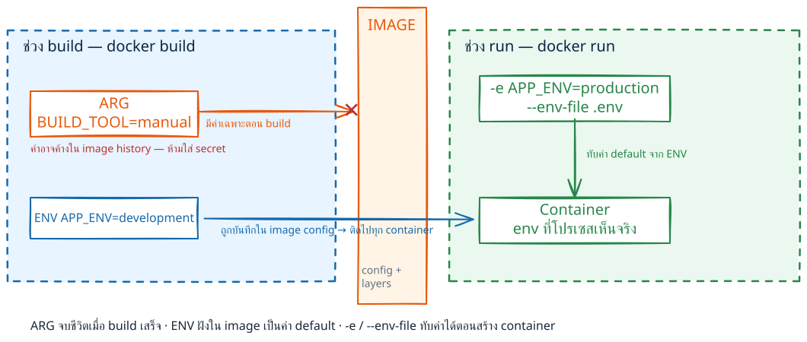
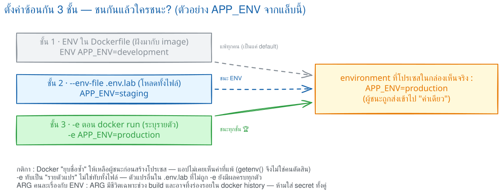
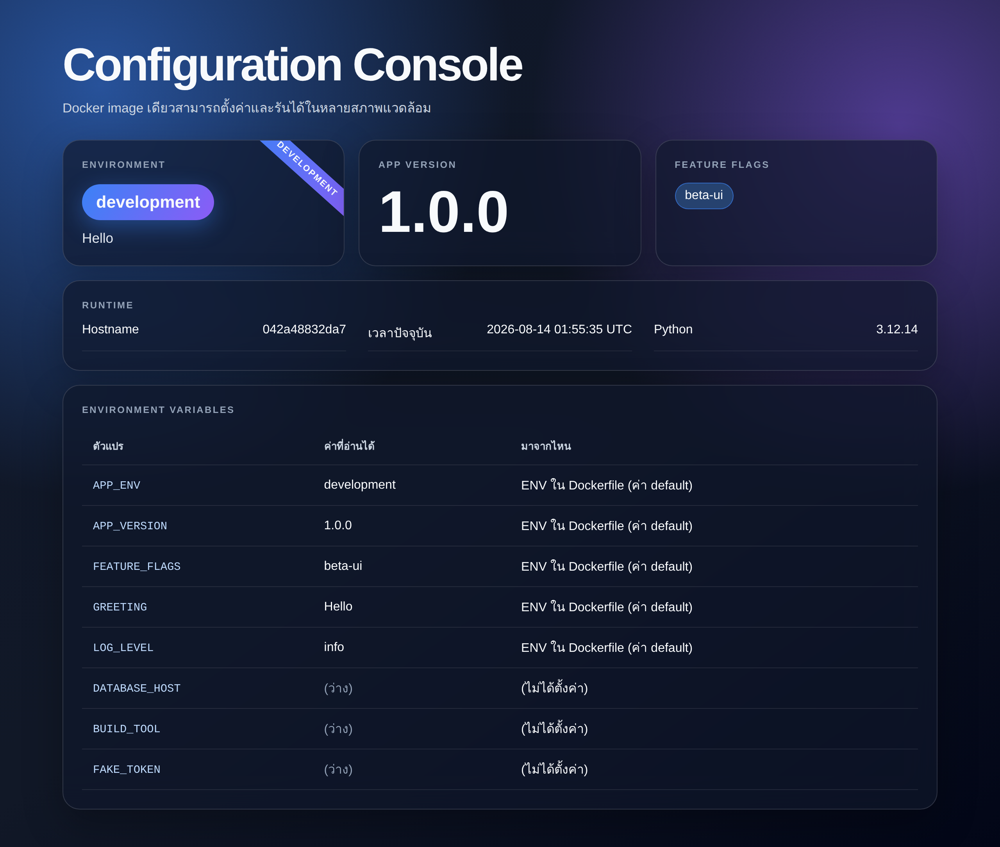
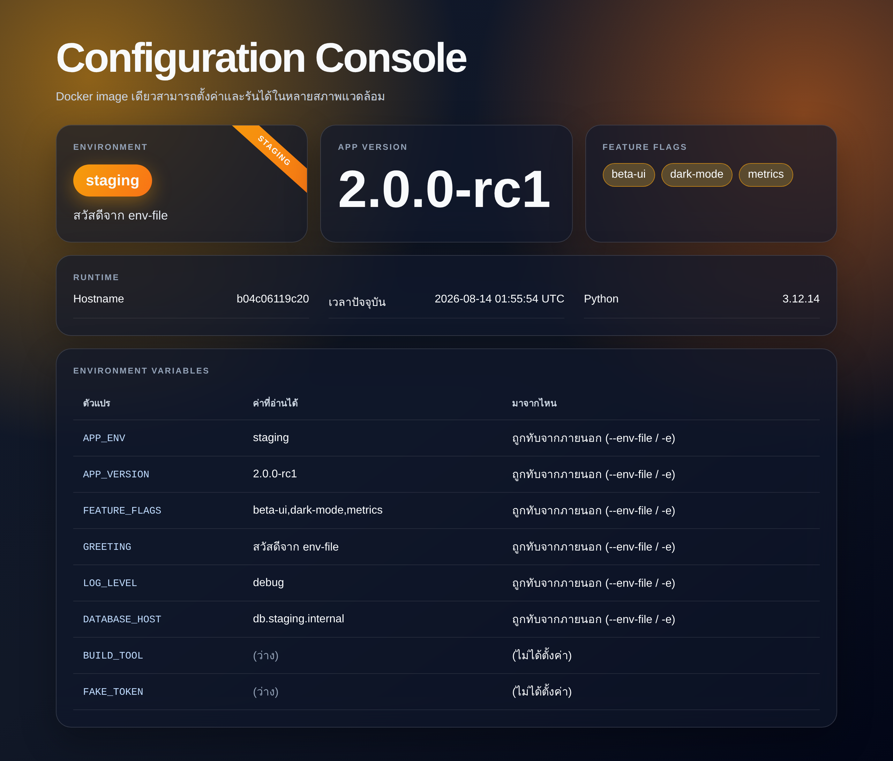
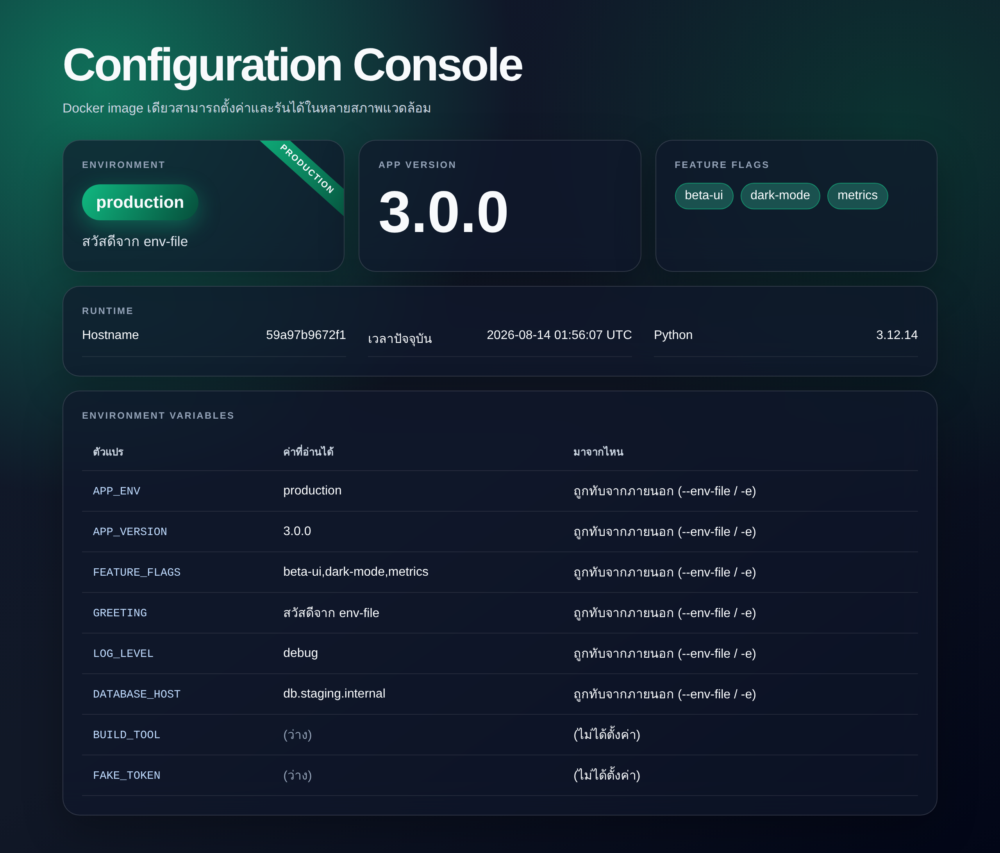

# LAB 4 — Environment Variables · ARG vs ENV : ตั้งค่าแอปโดยไม่ต้อง build ใหม่

> โฟลเดอร์ `004_LAB_ENV_ARG_Config` = **LAB 4** ของชุด "Dockerfile → Build → Run → Compose" (ตอนที่ 7 ของคู่มือ) ไฟล์โค้ดของแล็บนี้ : `Dockerfile` · `app.py` · `requirements.txt` · `.env.lab` · `.dockerignore` · `Dockerfile.args` · `Dockerfile.argfrom` · `Dockerfile.leak` · `verify.sh`

### 🎯 แล็บนี้ใน 30 วินาที

| | |
|---|---|
| **คำถามเดียวที่ตอบให้จบ** | ใส่ค่าเดียวกันไว้ทั้ง `ENV`, `--env-file` และ `-e` — **แอปจะเห็นค่าไหน** |
| **ต้องผ่านอะไรมาก่อน** | **LAB 1** (build/run · ทดลอง ค. ที่ใช้ `-e` ครั้งแรก) |
| **เวลา** | ~35 นาที (แกนหลัก ข้อ 0–11 ประมาณ 27 นาที · ทดลองเพิ่มเติม ~8 นาที) |
| **จบแล้วต้องทำได้เอง** | รัน image **ตัวเดียว** เป็น dev/staging/production โดยไม่ build ใหม่ · แยก `ARG` ออกจาก `ENV` ได้ · ชี้ให้เห็นว่า secret รั่วออกทาง `docker history` ได้อย่างไร |
| **แล็บนี้ยัง *ไม่* สอน** | `.dockerignore` ฉบับเต็ม (พิสูจน์การรั่วแล้วที่ **LAB 1** ข้อ 6 — ที่นี่แค่ยืนยันกับ `.env.*`) · การส่ง config ผ่าน Compose → **LAB 7** ข้อ 9 |

## สิ่งที่จะได้เรียนรู้

- **image เดียว รันได้หลายสภาพแวดล้อม** — เปลี่ยนแค่ค่า config ตอน `docker run` ไม่ต้อง build ใหม่ ไม่ต้องแก้โค้ด
- แหล่งที่มาของค่า **3 ชั้น** : `ENV` ใน Dockerfile → `--env-file` → `-e` ตอน run และ **ใครชนะใคร** (พิสูจน์ด้วยการรันจริงทั้ง 3 กรณี)
- ตรวจค่าที่ container **เห็นจริง** ด้วย `docker exec <c> env` และ `docker inspect -f '{{range .Config.Env}}...'` · โหลดหลายค่าด้วย `--env-file .env.lab` และรู้ว่าไฟล์นี้ **ต้องไม่หลุดเข้า image**
- ความต่างของ **`ARG` กับ `ENV`** : `ARG` มีชีวิตเฉพาะตอน build · `ENV` ติดไปกับ container ตอนรัน
- `ARG` **ก่อน `FROM`** ใช้เลือก base image ได้ แต่ต้อง **ประกาศซ้ำหลัง `FROM`** ถึงจะใช้ในคำสั่งของ stage นั้น
- อ่าน `docker history` เป็น และเข้าใจ **บทเรียนความปลอดภัย : ห้ามฝัง secret ใน `ARG`/`ENV`** (จะสาธิตการรั่วให้เห็นกับตา)
- อ่าน error จริงของ `--env-file` ที่หาไฟล์ไม่เจอ และรู้ว่า `--build-arg` ที่ไม่ได้ประกาศไว้ **เงียบกว่าที่คิด**

## ภาพรวมของแล็บนี้

1. **เตรียมเครื่องเรียนแล้วเช็ก Docker** — ยืนยันว่าสั่ง Docker จากในกล่องเรียนได้จริง
2. **อ่าน `Dockerfile` แล้ว build `lab4-config:1.0`** — Flask app ชื่อ **Configuration Console** ที่มี `ENV` ฝังเป็นค่า default
3. **ชั้นที่ 1 — `ENV` ใน Dockerfile** : รันเปล่า ๆ แล้วดูว่า container เห็นค่าอะไร
4. **ชั้นที่ 2 — `--env-file .env.lab`** : โหลดหลายค่าพร้อมกัน แล้วดูว่าทับ `ENV` เดิมหรือไม่
5. **ชั้นที่ 3 — `-e` ตอน run** : ใส่พร้อม `--env-file` แล้วดูว่าใครชนะ → สรุปเป็นตารางลำดับความสำคัญ
6. **`docker inspect`** — เห็นร่องรอยว่า Docker เก็บค่าทั้งสองชั้นไว้ แล้วให้ตัวหลังชนะ
7. **เปิดหน้าเว็บ 3 ธีม** — `development` / `staging` / `production` จาก **image เดียวกัน**
8. **`ARG` vs `ENV` ด้วย `Dockerfile.args`** — ทดลอง 3 รอบ จนเห็นว่า `BUILD_TOOL` **หายไปตอน run**
9. **`docker history`** — เห็นบรรทัด `ARG`/`ENV` แล้วสาธิต **secret รั่ว** ด้วยค่าปลอม
10. **`ARG` ก่อน `FROM`** — พิสูจน์ว่าต้องประกาศซ้ำหลัง `FROM` ถึงจะใช้ในคำสั่งของ stage นั้นได้
11. **`.dockerignore` กับ `.env.*`** — ยืนยันว่าไฟล์ config ไม่หลุดเข้า image แม้จะ `COPY . .`
12. **`verify.sh`** — ตรวจผลทั้งแล็บอัตโนมัติ 21 ข้อ

> **คำถามก่อนเริ่ม:** ถ้าใส่ค่าเดียวกันทั้งใน `ENV` ของ Dockerfile · ใน `--env-file` · และใน `-e` พร้อมกันหมด **แอปจะเห็นค่าไหน?** และถ้าส่ง token ผ่าน `--build-arg` โดยไม่ `ENV` ต่อ มันจะ "หายไป" จริงหรือไม่? ข้อ 3–5 และข้อ 9 จะใช้ผลรันจริงตอบให้ครบ

### Terminal Map

| หน้าต่าง | หน้าที่ | เปิดเมื่อใด |
|---|---|---|
| **T1** | ทุกคำสั่ง `docker build` / `run` / `exec` ในกล่องเรียน | ใช้ตั้งแต่เริ่ม LAB |
| **เบราว์เซอร์** | เปิด `http://localhost:8184` ดูหน้า Configuration Console | ใช้ในข้อ 7 |

---

## ทฤษฎีก่อนลงมือ

### ภาพจำหลัก

จำภาพว่า `ARG` คือป้ายงานชั่วคราวในโรงงาน build ส่วน `ENV` คือฉลากบน image ที่ตามไปถึงโปรเซสใน container



> 🖼 **วิธีอ่านรูปนี้:** ไล่จาก build ไป image แล้วจบที่ run: `ARG` สิ้นอายุหลัง build แต่ค่าอาจค้างใน `docker history` ขณะที่ `ENV` เดินทางต่อใน image metadata. จุดปลายรูปเชื่อมกับข้อ 8 ซึ่งแอปเห็น `APP_VERSION` ที่คัดลอกเข้า `ENV` แต่ไม่เห็น `BUILD_TOOL` ที่เป็น `ARG` อย่างเดียว

### กลไกจริง

ระดับ OS มอง environment เป็นรายการ `key=value` ที่ส่งให้โปรเซสตอนเกิด ไม่ใช่ไฟล์กลางที่ทุกโปรเซสอ่านร่วมกัน เปรียบเหมือนบัตรข้อมูลที่พนักงานได้รับตอนเข้ากะ: โปรแกรมอ่านบัตรของตนผ่าน API อย่าง `os.environ` และโปรเซสลูกมักรับสำเนาจากโปรเซสแม่ การแก้ค่าใน shell หนึ่งจึงไม่ย้อนกลับไปเปลี่ยนโปรเซสที่เริ่มแล้ว

ช่วง build Docker อ่าน Dockerfile ตามลำดับ `ARG` เป็นตัวแปรของคำสั่งช่วงนี้และรับค่าจาก `--build-arg` ได้ เมื่อ build จบ ขอบเขตของมันก็จบ จึงไม่ปรากฏใน container เอง แต่ถ้าใช้ค่าสร้างไฟล์หรือคัดลอกเข้า `ENV` ผลนั้นจะติด image ดังที่ข้อ 8 เปรียบเทียบ `BUILD_TOOL` กับ `APP_VERSION`

`ENV` ถูกบันทึกใน configuration ของ image ทุก container จึงรับชุดนี้เป็น default ตอน `docker run` Docker วางค่าจาก `--env-file` ทับเป็นราย key แล้ววาง `-e` ทับเป็นราย key อีกชั้น ชื่อที่ไม่ซ้ำยังอยู่ครบ ข้อ 5 จึงได้ `APP_ENV` จาก `-e` แต่ได้ `GREETING` จากไฟล์

ก่อนแอปเริ่ม Docker resolve ชื่อซ้ำและประกอบ environment ชุดสุดท้าย แล้วจึงสร้างโปรเซส แอปจึงเห็นหนึ่งค่าต่อ key ไม่ได้รับหลายค่าไปเลือกเอง `-e` ชนะ `--env-file` เพราะกติกาการยุบชั้นนี้ของ Docker เอง ไม่ใช่เพราะระบบปฏิบัติการหรือแอปเลือกให้ — จะพิมพ์ `-e` ไว้ก่อนหรือหลัง `--env-file` บนบรรทัดเดียวกันก็ได้ผลเหมือนเดิม

อ่านผลตาม timeline: value เกิดใน build time, อยู่ใน image config หรือไม่, และถูก override ที่ container start ก่อน process launch หรือไม่ วิธีนี้แยก build state, image state และ process state ชัดเจน

“หมดอายุ” ไม่ได้แปลว่า “ลับ” ค่า `ARG` อาจอยู่ในคำสั่งหรือ layer history ส่วน `ENV` อ่านได้จาก image metadata ด้วย `docker image inspect` ข้อ 9 จึงใช้ค่าปลอมพิสูจน์ว่า secret อาจตาม image ไปถึงผู้ที่ pull ได้ ค่าลับต้องใช้ช่องทาง secret ที่เหมาะกับ build time หรือ run time แทน `ARG`/`ENV`

### กฎที่ต้องจำ

| กฎ | เหตุผล |
|---|---|
| Environment เป็น `key=value` ของแต่ละโปรเซส | แอปอ่านค่าชุดสุดท้ายที่ได้รับตอนเริ่มทำงาน |
| `ARG` อยู่ในขอบเขต build | จะไปถึง run ก็ต่อเมื่อผลของมันถูกบันทึกต่อ เช่น คัดลอกเข้า `ENV` |
| `ENV` ใน image เป็นเพียง default | ตอน run สามารถทับเฉพาะ key ที่ต้องการได้ |
| ลำดับคือ `ENV` < `--env-file` < `-e` | Docker รวมค่าตามชั้นก่อนสร้างโปรเซส |
| `ARG` และ `ENV` ไม่ใช่ที่เก็บ secret | history, layer หรือ metadata อาจเปิดเผยค่าได้ |

### สิ่งที่มักเข้าใจผิด

- **คิดว่า** `ARG` หายหลัง build แล้วจึงใช้เก็บ token ได้ **แต่จริง ๆ** ค่าอาจค้างใน history หรือผลลัพธ์ของ layer
- **คิดว่า** `-e` หนึ่งตัวทำให้ค่าจาก `--env-file` หายทั้งชุด **แต่จริง ๆ** มันทับเฉพาะ key ชื่อเดียวกัน
- **คิดว่า** แอปหรือ `getenv()` เลือกค่าที่มาทีหลัง **แต่จริง ๆ** Docker resolve ค่าซ้ำก่อนเริ่มโปรเซส แอปได้รับค่าที่ชนะแล้ว

### ทายผลก่อนทดลอง

1. ในข้อ 5 ถ้ากำหนด `APP_ENV` ด้วย `-e` แต่ไม่กำหนด `GREETING` ค่าทั้งสองจะมาจากชั้นเดียวกันหรือคนละชั้น เพราะอะไร?
2. ในข้อ 8 และข้อ 9 เมื่อ `BUILD_TOOL` เป็น `ARG` อย่างเดียว หลัง build จบค่าจะหายจากการมองเห็นของ container และจากประวัติ image พร้อมกันหรือไม่?

## 0. เตรียมเครื่องเรียน

```bash
docker rm -f devtools-df-lab4 2>/dev/null
docker run -dit --name devtools-df-lab4 --privileged \
  -p 2234:22 -p 8184:8184 tuchsanai/devtools:2569_1
ssh root@localhost -p 2234        # password : passwd
```

> 📝 **คำอธิบาย:** `docker rm -f ... 2>/dev/null` ลบกล่องเรียนตัวเก่ากันชื่อซ้ำ (โยน error ทิ้งถ้ายังไม่มี) · `-dit` = `-d` รันเบื้องหลัง + `-i` เปิด stdin ค้าง + `-t` ให้มี terminal กล่องจะได้ไม่ดับทันที · `--privileged` ให้สิทธิ์เต็มเพื่อรัน **Docker ซ้อนข้างในกล่อง** — จำเป็น เพราะทั้งแล็บนี้เรา build/run อยู่ข้างในกล่องอีกที · `-p 2234:22` ส่ง port SSH · `-p 8184:8184` เปิดทางให้เบราว์เซอร์เข้าหน้าเว็บในข้อ 7 (**ทั้งแล็บใช้เลข `8184` ตัวเดียวตลอด**)

> ⚠️ `--privileged` ใช้เฉพาะ disposable classroom container นี้ ไม่ใช่ค่าที่ควรใช้กับ production workload · ใน VS Code ใช้ **Remote-SSH** ต่อไปที่ `root@localhost:2234` แล้วทำแล็บทั้งหมดข้างใน

```bash
docker --version
docker info --format 'Docker daemon: {{.ServerVersion}}'
```

> 📝 **คำอธิบาย:** บรรทัดแรกเช็ก Docker CLI บรรทัดที่สองถาม daemon โดยตรง จึงยืนยันได้ว่าคำสั่ง `docker` วิ่งถึง daemon ก่อนเริ่มแล็บ · ถ้าขึ้น `Cannot connect to the Docker daemon` แปลว่ายังอยู่นอกกล่องเรียน หรือ daemon ยังไม่ขึ้น ให้รอสัก 10 วินาทีแล้วลองใหม่

✅ **Expected output** — ขอแค่มี **เลขเวอร์ชัน** ครบสองบรรทัด ไม่ใช่ error (เลขของแต่ละคนอาจไม่ตรงกับเอกสารนี้):

```
Docker version 29.6.2, build dfc4efb
Docker daemon: 29.6.2
```

## 1. Clone โค้ดแล็บแล้วสำรวจไฟล์

```bash
mkdir -p ~/labwork && cd ~/labwork
git clone https://github.com/Tuchsanai/DevTools.git
cd DevTools/02_Docker/02_Dockerfile_Build_Run_Compose_Guide/004_LAB_ENV_ARG_Config
ls -a
```

> 📝 **คำอธิบาย:** `git clone` ทำครั้งเดียวใช้ได้ทุกแล็บของชุดนี้ (ถ้าเคย clone แล้วให้ `cd` เข้าไปเลย) · **ต้องใส่ `-a`** เพราะไฟล์สำคัญของแล็บนี้ขึ้นต้นด้วยจุด (`.env.lab`, `.dockerignore`) ซึ่ง `ls` เปล่า ๆ จะไม่แสดง · ไฟล์แบ่งเป็น 3 กลุ่ม: **แอปจริง** (`Dockerfile` · `app.py` · `requirements.txt`) · **ค่า config** (`.env.lab` · `.dockerignore`) · **ห้องทดลอง ARG** (`Dockerfile.args` · `Dockerfile.argfrom` · `Dockerfile.leak`)

## 2. อ่าน `Dockerfile` แล้ว build image

```bash
cat Dockerfile
```

```dockerfile
FROM python:3.12-slim
WORKDIR /app
COPY requirements.txt .
RUN pip install --no-cache-dir -r requirements.txt
COPY app.py .

ENV APP_ENV=development
ENV APP_VERSION=1.0.0
ENV GREETING="Hello"
ENV FEATURE_FLAGS="beta-ui"
ENV LOG_LEVEL=info

EXPOSE 8184
CMD ["python","app.py"]
```

> 📝 **คำอธิบาย:** 5 บรรทัด `ENV` คือ **ชั้นที่ 1** ของแล็บนี้ — ค่าเหล่านี้ **ฝังอยู่ใน image** ใครดึงไปรันที่ไหนก็ได้ค่าชุดนี้เป็น default (เขียนรวมบรรทัดเดียวก็ได้ ผลเหมือนกันแต่ได้ layer น้อยกว่า) ·
> `EXPOSE 8184` เป็นเพียง **เอกสารประกอบ image** บอกว่าแอปฟัง port ไหน — **ไม่ได้เปิด port ให้เอง** ต้องใช้ `-p` ตอน run อยู่ดี ·
> สังเกตว่า **ไม่มี `COPY .env`** และไม่มี `COPY . .` — ตั้งใจให้เฉพาะ `requirements.txt` กับ `app.py` เข้า image เท่านั้น · ฝั่ง `app.py` อ่านค่าด้วย `os.environ.get(...)` ธรรมดา **ไม่มีเวทมนตร์อะไรเลย** และมีฟังก์ชัน `value_source()` ที่เทียบค่าที่อ่านได้กับ default ในตัวแอป เพื่อเดาให้ว่าค่านั้น "มาจากชั้นไหน" แล้วแสดงบนหน้าเว็บ

```bash
docker build -t lab4-config:1.0 .
```

> 📝 **คำอธิบาย:** `-t lab4-config:1.0` ตั้งชื่อ:แท็กให้ image · `.` ท้ายคำสั่งคือ **build context** = โฟลเดอร์ปัจจุบันที่จะถูกส่งให้ daemon · ครั้งแรกจะ pull `python:3.12-slim` และติดตั้ง Flask ใช้เวลาสักครู่ ครั้งต่อไปจะเร็วเพราะ cache

✅ **Expected output** — ท้าย log ต้องมี `naming to docker.io/library/lab4-config:1.0` (digest · เวลาของแต่ละคนจะไม่ตรงกับเอกสารนี้):

```
#8 1.592 Successfully installed blinker-1.9.0 click-8.4.2 flask-3.1.2 itsdangerous-2.2.0 jinja2-3.1.6 markupsafe-3.0.3 werkzeug-3.1.8
        ... (ตัดท่อนกลาง — คำเตือน pip เป็น root · COPY app.py · exporting layers) ...
#10 exporting manifest sha256:643f370e1b057872db2d944040be72c2be2320e05c5b20c08450a59e006b6d8d 0.0s done
#10 naming to docker.io/library/lab4-config:1.0 done
#10 DONE 0.9s
```

## 3. ชั้นที่ 1 — `ENV` ใน Dockerfile (ค่า default ที่ติดมากับ image)

**ทายผลก่อนรัน:** ยังไม่ใส่ `-e` และไม่ใส่ `--env-file` เลย container จะเห็น `APP_ENV` เป็นอะไร?

```bash
docker rm -f cfg-a 2>/dev/null
docker run -d --name cfg-a lab4-config:1.0
docker exec cfg-a env | grep -E "^(APP_|GREETING|LOG_LEVEL|DATABASE_HOST)" | sort
```

> 📝 **คำอธิบาย:** `-d` รันเบื้องหลังแล้วคืน container ID ยาว 64 ตัว · `--name cfg-a` ตั้งชื่อไว้เรียกง่าย ("case A") · `docker exec cfg-a env` สั่งให้คำสั่ง `env` ไปรัน **ข้างใน container ที่กำลังรันอยู่** จึงเป็นวิธีดู "ค่าที่ container เห็นจริง" ที่ตรงที่สุด · `grep -E` กรองเฉพาะตัวแปรของแล็บ เพราะ `env` เปล่า ๆ มี `PATH`, `HOSTNAME`, `PYTHON_VERSION` ปนมาอีกเยอะ · `sort` เรียงให้เทียบกับข้ออื่นได้ตรง ๆ

✅ **Expected output** — ตรงกับบรรทัด `ENV` ใน Dockerfile เป๊ะ และ **ไม่มี `DATABASE_HOST`** เพราะ Dockerfile ไม่ได้ตั้งไว้ (ก่อนหน้านี้ `docker run -d` จะพิมพ์ container ID ยาว ๆ ซึ่งของแต่ละคนต่างกัน):

```
$ docker exec cfg-a env | grep -E "^(APP_|GREETING|LOG_LEVEL|DATABASE_HOST)" | sort
APP_ENV=development
APP_VERSION=1.0.0
GREETING=Hello
LOG_LEVEL=info
```

> **สิ่งที่เพิ่งพิสูจน์:** `ENV` ใน Dockerfile = ค่า default ที่ **เดินทางไปกับ image** — ไม่ต้องพิมพ์อะไรเพิ่มตอนรันก็ได้ค่าชุดนี้เสมอ

## 4. ชั้นที่ 2 — `--env-file` โหลดหลายค่าพร้อมกัน

```bash
cat .env.lab
```

```
APP_ENV=staging
APP_VERSION=2.0.0-rc1
FEATURE_FLAGS=beta-ui,dark-mode,metrics
GREETING=สวัสดีจาก env-file
LOG_LEVEL=debug
DATABASE_HOST=db.staging.internal
```

> 📝 **คำอธิบาย:** รูปแบบคือ `KEY=value` บรรทัดละตัว · **ห้ามมีช่องว่างรอบ `=`** และ **ไม่ต้องใส่เครื่องหมายคำพูด** — ถ้าใส่ `"` มันจะกลายเป็นส่วนหนึ่งของค่าจริง ๆ · บรรทัดขึ้นต้นด้วย `#` เป็นคอมเมนต์ · ค่าที่มีช่องว่างเขียนต่อได้ทั้งบรรทัด · ชื่อไฟล์ตั้งอะไรก็ได้ เราตั้ง `.env.lab` เพื่อไม่ให้ชนกับ `.env` ที่มักใช้เก็บของจริง

**ทายผลก่อนรัน:** `.env.lab` ตั้ง `APP_ENV=staging` ส่วน image มี `ENV APP_ENV=development` — container จะเห็นอะไร?

```bash
docker rm -f cfg-b 2>/dev/null
docker run -d --name cfg-b --env-file .env.lab lab4-config:1.0
docker exec cfg-b env | grep -E "^(APP_|GREETING|LOG_LEVEL|DATABASE_HOST)" | sort
```

> 📝 **คำอธิบาย:** `--env-file <path>` อ่านไฟล์ **บนเครื่องที่พิมพ์คำสั่ง** (ไม่ใช่ในกล่อง image) แล้วยัดทุกบรรทัดเข้าไปเป็น environment ของ container · path เป็น relative กับโฟลเดอร์ปัจจุบัน จึงต้อง `cd` มาที่โฟลเดอร์แล็บก่อน · ใส่ได้หลายไฟล์ (`--env-file a --env-file b`) โดยไฟล์หลังทับไฟล์ก่อน

✅ **Expected output** — ทุกค่าถูก **ทับ** ด้วยค่าจากไฟล์ และ `DATABASE_HOST` ที่ image ไม่มี **โผล่ขึ้นมาใหม่**:

```
$ docker exec cfg-b env | grep -E "^(APP_|GREETING|LOG_LEVEL|DATABASE_HOST)" | sort
APP_ENV=staging
APP_VERSION=2.0.0-rc1
DATABASE_HOST=db.staging.internal
GREETING=สวัสดีจาก env-file
LOG_LEVEL=debug
```

> **สิ่งที่เพิ่งพิสูจน์:** `--env-file` **ชนะ** `ENV` ใน Dockerfile และยังเพิ่มตัวแปรใหม่ที่ image ไม่เคยรู้จักได้ด้วย — ทีม deploy จึงเปลี่ยน config ได้โดย **ไม่ต้องแตะ Dockerfile เลย**

## 5. ชั้นที่ 3 — `-e` ตอน run (ใครชนะใคร)

**ทายผลก่อนรัน:** ใส่ **ทั้งสองอย่างพร้อมกัน** — `--env-file` ตั้ง `APP_ENV=staging` แต่ `-e APP_ENV=production` ตั้งอีกค่า จะได้อะไร?



> 🖼 **วิธีอ่านรูปนี้:** ตามสามชั้นลงสู่กล่อง “ค่าที่โปรเซสเห็นจริง”; `APP_MODE` จากชั้นใกล้ run ที่สุดเป็นผู้ชนะ. ชั้น `-e` ทับเฉพาะชื่อนี้ ไม่ได้ลบค่าอื่นใน `--env-file` เมื่อลองข้อ 5 ให้เทียบกฎเดียวกันกับ `APP_ENV`, `GREETING` และ `LOG_LEVEL`

```bash
docker rm -f cfg-c 2>/dev/null
docker run -d --name cfg-c --env-file .env.lab \
  -e APP_ENV=production -e APP_VERSION=3.0.0 lab4-config:1.0
docker exec cfg-c env | grep -E "^(APP_|GREETING|LOG_LEVEL|DATABASE_HOST)" | sort
```

> 📝 **คำอธิบาย:** `-e KEY=value` ตั้งทีละตัว ใส่กี่ตัวก็ได้ · เขียน `-e KEY` เฉย ๆ (ไม่มี `=`) จะเป็นการ **ส่งต่อค่าจาก shell ปัจจุบัน** เข้าไปให้ container · จุดที่ต้องดู: `APP_ENV`/`APP_VERSION` มาจาก `-e` ส่วน `GREETING`, `LOG_LEVEL`, `DATABASE_HOST` ที่ `-e` ไม่ได้แตะ **ยังเป็นค่าจาก `--env-file`** — การทับเกิดขึ้น **ทีละตัวแปร** ไม่ใช่ทับทั้งไฟล์

✅ **Expected output** — `-e` ชนะทั้งคู่ ส่วนตัวที่ `-e` ไม่ได้แตะยังเป็นค่าของ `--env-file`:

```
$ docker exec cfg-c env | grep -E "^(APP_|GREETING|LOG_LEVEL|DATABASE_HOST)" | sort
APP_ENV=production
APP_VERSION=3.0.0
DATABASE_HOST=db.staging.internal
GREETING=สวัสดีจาก env-file
LOG_LEVEL=debug
```

### ตารางสรุป — ผลจริงจากทั้ง 3 กรณี

| ตัวแปร | `cfg-a` (ENV อย่างเดียว) | `cfg-b` (+ `--env-file`) | `cfg-c` (+ `--env-file` + `-e`) | ผู้ชนะใน `cfg-c` |
|---|---|---|---|---|
| `APP_ENV` | `development` | `staging` | `production` | **`-e`** |
| `APP_VERSION` | `1.0.0` | `2.0.0-rc1` | `3.0.0` | **`-e`** |
| `GREETING` | `Hello` | `สวัสดีจาก env-file` | `สวัสดีจาก env-file` | **`--env-file`** |
| `LOG_LEVEL` | `info` | `debug` | `debug` | **`--env-file`** |
| `DATABASE_HOST` | *(ไม่มี)* | `db.staging.internal` | `db.staging.internal` | **`--env-file`** |

> **กฎที่ได้จากการทดลอง :** `-e` **ชนะ** `--env-file` **ชนะ** `ENV` ใน Dockerfile จำง่าย ๆ ว่า **"ยิ่งใกล้เวลารัน ยิ่งมีอำนาจ"** — สิ่งที่พิมพ์ตอน `docker run` มาทีหลังสุด จึงทับของเก่าได้หมด
>
> ⚠️ **ระวังเข้าใจผิด:** "ทีหลัง" ในที่นี้หมายถึง **ลำดับของชั้น** ไม่ใช่ลำดับที่พิมพ์บนบรรทัดคำสั่ง · docker CLI จะอ่าน `--env-file` ทุกไฟล์ให้จบก่อน **แล้วค่อยต่อท้ายด้วยค่าจาก `-e` เสมอ** ดังนั้นเขียน `-e APP_ENV=production --env-file .env.lab` (สลับที่กัน) ผลก็ยังได้ `production` เหมือนเดิม · ที่ **สลับที่แล้วมีผลจริง** คือกรณี `--env-file a --env-file b` ด้วยกันเอง (ไฟล์หลังทับไฟล์ก่อน) และ `-e KEY=x -e KEY=y` ด้วยกันเอง (ตัวหลังทับตัวก่อน)

## 6. `docker inspect` — ดูร่องรอยของทั้งสองชั้น

```bash
docker inspect -f '{{range .Config.Env}}{{println .}}{{end}}' cfg-c
docker image inspect -f '{{range .Config.Env}}{{println .}}{{end}}' lab4-config:1.0
```

> 📝 **คำอธิบาย:** `-f` (หรือ `--format`) ใช้ Go template ดึงเฉพาะที่อยากได้จาก JSON ก้อนใหญ่ · `{{range .Config.Env}}` วนลูปในอาเรย์ แล้ว `{{println .}}` พิมพ์ทีละบรรทัด — ถ้าไม่ใส่ `println` ค่าจะติดกันเป็นพืดอ่านไม่ออก · `docker inspect` (เฉย ๆ) ถาม **container** ส่วน `docker image inspect` ถาม **image** · **จุดที่ต้องดูให้ดี:** ฝั่ง container `APP_ENV`/`APP_VERSION` **โผล่มาสองครั้ง** — ตัวบนจาก `--env-file` ตัวล่างจาก `-e` · นี่คือ **รายการดิบที่ Docker จดไว้** ยังไม่ได้ตัดตัวซ้ำ · ตอนจะสตาร์ตโปรเซสจริง Docker จะยุบชื่อที่ซ้ำกันโดย **เก็บตัวสุดท้ายไว้** ค่าที่แอปเห็นจึงเป็น `production`/`3.0.0` ตรงกับข้อ 5 (สังเกตว่า `docker exec cfg-c env` ในข้อ 5 เห็น `APP_ENV` แค่บรรทัดเดียว ไม่ใช่สองบรรทัดแบบนี้) · ส่วนฝั่ง image มีแต่ค่า default ไม่มีร่องรอยของ `-e`/`--env-file` เลย เพราะสองอย่างนั้นเกิดตอน run

✅ **Expected output** — บล็อกบนคือ container (มีค่าซ้ำ) บล็อกล่างคือ image (มีแต่ default) — ค่า GPG/SHA ของแต่ละคนจะต่างกันตามเวอร์ชัน base image:

```
$ docker inspect -f "{{range .Config.Env}}{{println .}}{{end}}" cfg-c
APP_ENV=staging
APP_VERSION=2.0.0-rc1
        ... (ตัดท่อนกลาง — FEATURE_FLAGS, GREETING, LOG_LEVEL, DATABASE_HOST จาก --env-file) ...
APP_ENV=production          <- มาจาก -e ทับตัวข้างบน
APP_VERSION=3.0.0           <- มาจาก -e ทับตัวข้างบน
PATH=/usr/local/bin:/usr/local/sbin:/usr/local/bin:/usr/sbin:/usr/bin:/sbin:/bin
        ... (ตัดท่อนกลาง — LANG, GPG_KEY, PYTHON_VERSION, PYTHON_SHA256 ของ base image) ...

$ docker image inspect -f "{{range .Config.Env}}{{println .}}{{end}}" lab4-config:1.0
        ... (ตัดท่อนกลาง — PATH, LANG, GPG_KEY, PYTHON_VERSION, PYTHON_SHA256) ...
APP_ENV=development
APP_VERSION=1.0.0
GREETING=Hello
FEATURE_FLAGS=beta-ui
LOG_LEVEL=info
```

ลบ container ทดสอบสามตัวทิ้งก่อนไปข้อต่อไป : `docker rm -f cfg-a cfg-b cfg-c`

## 7. เปิด Configuration Console — image เดียว 3 สภาพแวดล้อม

ถึงตอนสนุก — เอา image **ตัวเดิมที่ build ไปแล้วในข้อ 2** มารัน 3 รอบ โดยเปลี่ยนแค่ค่า config

**รอบที่ 1 — development (ค่า default ล้วน ๆ)** แล้วเปิดเบราว์เซอร์ที่ `http://localhost:8184`

```bash
docker rm -f web 2>/dev/null
docker run -d --name web -p 8184:8184 lab4-config:1.0
```



> 📝 **คำอธิบาย:** `-p 8184:8184` ผูก port ของกล่องเรียนเข้ากับ port ที่ Flask ฟังอยู่ · เพราะข้อ 0 เราสั่ง `-p 8184:8184` ที่ชั้นนอกไว้แล้ว เบราว์เซอร์บนเครื่องเราจึงเข้าถึงได้ตรง ๆ · จุดที่ต้องดู: badge เขียน **development** ธีม **ฟ้า-ม่วง** · `APP VERSION` = `1.0.0` · chip มีอันเดียวคือ `beta-ui` · คอลัมน์ **"มาจากไหน"** เขียนว่า `ENV ใน Dockerfile (ค่า default)` ทุกแถวที่มีค่า ส่วน `DATABASE_HOST`/`BUILD_TOOL`/`FAKE_TOKEN` เป็น `(ไม่ได้ตั้งค่า)` · **Hostname** คือ container ID สั้น ๆ ของตัวมันเอง — ค่าของแต่ละคนจะไม่ตรงกับภาพ เช่นเดียวกับเวลา

**รอบที่ 2 — staging (โหลดจาก `--env-file`)** แล้วรีเฟรชหน้าเดิม

```bash
docker rm -f web
docker run -d --name web -p 8184:8184 --env-file .env.lab lab4-config:1.0
```



> 📝 **คำอธิบาย:** **ไม่มีการ build ใหม่แม้แต่ครั้งเดียว** — image เดิม tag เดิม แต่หน้าเว็บเปลี่ยนทั้งธีม · ธีมเป็น **ส้ม-เหลือง** เพราะ `APP_ENV=staging` · `APP VERSION` ขึ้น `2.0.0-rc1` · chip เพิ่มเป็น 3 อันตาม `FEATURE_FLAGS` ในไฟล์ · คอลัมน์ "มาจากไหน" เปลี่ยนเป็น `ถูกทับจากภายนอก (--env-file / -e)` แทบทุกแถว และ `DATABASE_HOST` มีค่าแล้ว

**รอบที่ 3 — production (`--env-file` + `-e` ทับ)** แล้วรีเฟรชอีกครั้ง

```bash
docker rm -f web
docker run -d --name web -p 8184:8184 --env-file .env.lab \
  -e APP_ENV=production -e APP_VERSION=3.0.0 lab4-config:1.0
curl -s http://localhost:8184/healthz
```



> 📝 **คำอธิบาย:** ธีมกลายเป็น **เขียวเข้ม** และ `APP VERSION` เป็น `3.0.0` ตาม `-e` ที่ทับ `.env.lab` · แต่ chip ยังเป็น 3 อันเดิม และ `DATABASE_HOST` ยังเป็น `db.staging.internal` เพราะ `-e` ไม่ได้แตะสองตัวนี้ — ตรงกับตารางในข้อ 5 เป๊ะ ๆ · `/healthz` เป็น endpoint เล็ก ๆ ที่คืน JSON ใช้ตรวจแบบอัตโนมัติได้โดยไม่ต้องเปิดเบราว์เซอร์ (`verify.sh` ก็ใช้แนวนี้) · `-s` = silent ไม่ต้องแสดงแถบความคืบหน้า

✅ **Expected output** — JSON สะท้อนค่าที่ส่งเข้าไปด้วย `-e`:

```
{"app_env":"production","app_version":"3.0.0","status":"ok"}
```

> **สิ่งที่ภาพ 3 รูปพิสูจน์ :** **image เดียว · build ครั้งเดียว · รันได้ 3 สภาพแวดล้อม** — นี่คือหัวใจของการแยก "โค้ด" ออกจาก "config" ของที่ทดสอบผ่านบน staging คือ **binary ตัวเดียวกัน** กับที่ขึ้น production ไม่ใช่ของที่ build ใหม่แล้วหวังว่าจะเหมือนเดิม

## 8. `ARG` vs `ENV` — ทดลองให้เห็นกับตา

| ประเด็น | `ARG` | `ENV` |
|---|---|---|
| มีผลช่วงไหน | **เฉพาะตอน build** | **build และ run** |
| วิธีตั้งค่า | `--build-arg` | `ENV` ใน Dockerfile หรือ `-e` ตอน run |
| ใครอ่านได้ | คำสั่ง `RUN` ระหว่าง build | คำสั่ง `RUN` และ **แอปใน container ตอนรัน** |
| ติดใน image history | เห็นได้ → **ห้ามใส่ secret** | เห็นได้ → **ห้ามใส่ secret** |

ไฟล์ทดลองคือ `Dockerfile.args` :

```dockerfile
FROM alpine:3.20
ARG APP_VERSION=dev
ARG BUILD_TOOL=manual
ENV APP_VERSION=$APP_VERSION
RUN echo "build เห็น: APP_VERSION=$APP_VERSION BUILD_TOOL=$BUILD_TOOL"
CMD ["sh","-c","echo run เห็น: APP_VERSION=$APP_VERSION BUILD_TOOL=$BUILD_TOOL"]
```

> 📝 **คำอธิบาย:** จุดสำคัญอยู่ที่บรรทัด `ENV APP_VERSION=$APP_VERSION` — มัน **คัดลอกค่าจาก ARG ไปเป็น ENV** ให้เฉพาะ `APP_VERSION` เท่านั้น · ส่วน `BUILD_TOOL` ถูกประกาศเป็น `ARG` อย่างเดียว **ไม่มีใครคัดลอกให้** · `RUN` เกิดตอน build จึงเห็นทั้งสองตัว ส่วน `CMD` เกิดตอน run จึงเห็นเฉพาะที่เป็น `ENV`

### ทดลอง 1 — ค่า default

```bash
docker build --progress=plain --no-cache -f Dockerfile.args -t demo-args .
docker run --rm demo-args
```

> 📝 **คำอธิบาย:** `-f Dockerfile.args` บอกให้ใช้ไฟล์ชื่อนี้แทน `Dockerfile` (จำเป็น เพราะโฟลเดอร์นี้มี Dockerfile หลายตัว) ·
> `--progress=plain` เปลี่ยนการแสดงผลของ BuildKit จาก "สรุปสวย ๆ" เป็น **log ดิบ** จึงเห็นข้อความที่ `RUN echo` พิมพ์ออกมา — ถ้าไม่ใส่จะไม่เห็นบรรทัดนี้เลย · `--no-cache` บังคับให้รัน `RUN` ใหม่จริง ๆ ไม่งั้นรอบสอง Docker จะใช้ cache แล้ว **ไม่พิมพ์อะไรเลย** (จุดที่คนพลาดบ่อยที่สุด) · `--rm` ตอน run = จบแล้วลบ container ทิ้งอัตโนมัติ

✅ **Expected output** — เทียบสองบรรทัดสุดท้ายให้ดี: ตอน build เห็น `BUILD_TOOL=manual` แต่ตอน run **`BUILD_TOOL=` ว่างเปล่า**:

```
#5 [2/2] RUN echo "build เห็น: APP_VERSION=dev BUILD_TOOL=manual"
#5 0.227 build เห็น: APP_VERSION=dev BUILD_TOOL=manual
        ... (ตัดท่อนกลาง — exporting layers / naming to docker.io/library/demo-args:latest) ...
$ docker run --rm demo-args
run เห็น: APP_VERSION=dev BUILD_TOOL=
```

> **สิ่งที่เพิ่งพิสูจน์:** `ARG BUILD_TOOL` ใช้ได้ใน `RUN` แต่ **ไม่ได้ถูกคัดลอกไป `ENV`** จึง **ตายเมื่อ build จบ** — container ที่เกิดทีหลังไม่รู้จักมันเลย

### ทดลอง 2 — ส่งค่าตอน build ด้วย `--build-arg`

```bash
docker build --progress=plain --no-cache --build-arg APP_VERSION=2.5 -f Dockerfile.args -t demo-args:2.5 .
docker run --rm demo-args:2.5
```

> 📝 **คำอธิบาย:** `--build-arg KEY=value` ส่งค่าเข้าไปแทนที่ default ของ `ARG` ที่ประกาศไว้ · ค่านี้มีชีวิตอยู่ **เฉพาะระหว่าง build ครั้งนี้** ·
> เราไม่ได้ส่ง `BUILD_TOOL` จึงยังเป็น `manual` ตาม default ในไฟล์

✅ **Expected output** — `APP_VERSION` เปลี่ยนเป็น `2.5` ทั้งตอน build และตอน run เพราะถูกคัดลอกเข้า `ENV`:

```
#5 [2/2] RUN echo "build เห็น: APP_VERSION=2.5 BUILD_TOOL=manual"
#5 0.199 build เห็น: APP_VERSION=2.5 BUILD_TOOL=manual
$ docker run --rm demo-args:2.5
run เห็น: APP_VERSION=2.5 BUILD_TOOL=
```

### ทดลอง 3 — `-e` ตอน run ชนะค่า `ENV` ที่ฝังไว้

```bash
docker run --rm -e APP_VERSION=override demo-args:2.5
docker run --rm -e BUILD_TOOL=github-actions demo-args:2.5
```

> 📝 **คำอธิบาย:** บรรทัดแรกยืนยันกฎเดิมจากข้อ 5 — `-e` ทับ `ENV` ที่ฝังใน image ได้ตลอด ·
> บรรทัดที่สองคือกับดักที่น่าคิด: `BUILD_TOOL` **ไม่ได้อยู่ใน image เลย** แต่พอส่ง `-e BUILD_TOOL=...` มันกลับมีค่า! เพราะ `-e` **สร้างตัวแปรใหม่ได้** ไม่จำเป็นต้องมีอยู่ก่อน — อย่าสับสน ค่านี้ **ไม่ได้มาจาก `ARG`** ตอน build มันเป็นคนละตัวที่บังเอิญชื่อเหมือนกัน

✅ **Expected output** — บรรทัดแรก `APP_VERSION` ถูกทับ · บรรทัดที่สอง `BUILD_TOOL` มีค่าเพราะ `-e` สร้างให้ใหม่:

```
$ docker run --rm -e APP_VERSION=override demo-args:2.5
run เห็น: APP_VERSION=override BUILD_TOOL=
$ docker run --rm -e BUILD_TOOL=github-actions demo-args:2.5
run เห็น: APP_VERSION=2.5 BUILD_TOOL=github-actions
```

> **ไทม์ไลน์ที่ควรจำ :** `--build-arg` ส่งค่าเข้า `ARG` ระหว่าง build → `ENV APP_VERSION=$APP_VERSION` คัดลอก **เฉพาะค่านี้** ไปเป็น default ใน image → ตอน run container ได้ `ENV` มา และ `-e` ทับได้อีกที
> ส่วน `ARG` ที่ไม่ถูกคัดลอกไป `ENV` **ตายคาที่เมื่อ build จบ**

## 9. `docker history` — และบทเรียนความปลอดภัยที่ต้องเห็นกับตา

```bash
docker history --no-trunc --format "{{.CreatedBy}}" demo-args:2.5
```

> 📝 **คำอธิบาย:** `docker history` แสดงว่า **แต่ละ layer ถูกสร้างด้วยคำสั่งอะไร** · `--no-trunc` ไม่ตัดข้อความให้สั้น (ปกติจะตัดด้วย `…`) · `--format "{{.CreatedBy}}"` เอาเฉพาะคอลัมน์คำสั่ง · อ่านจาก **ล่างขึ้นบน** = เก่าไปใหม่

✅ **Expected output** — เห็นบรรทัด `ARG` และ `ENV` **พร้อมค่าที่เราส่งเข้าไปตอน build**:

```
CMD ["sh" "-c" "echo run เห็น: APP_VERSION=$APP_VERSION BUILD_TOOL=$BUILD_TOOL"]
RUN |2 APP_VERSION=2.5 BUILD_TOOL=manual /bin/sh -c echo "build เห็น: APP_VERSION=$APP_VERSION BUILD_TOOL=$BUILD_TOOL" # buildkit
ENV APP_VERSION=2.5
ARG BUILD_TOOL=manual
ARG APP_VERSION=2.5
CMD ["/bin/sh"]
ADD alpine-minirootfs-3.20.10-x86_64.tar.gz / # buildkit
```

> 📝 **คำอธิบาย:** สังเกต `RUN |2 APP_VERSION=2.5 BUILD_TOOL=manual ...` — `|2` แปลว่าคำสั่งนี้ถูกรันโดยมี **build arg 2 ตัว** และ BuildKit **จดค่าทั้งสองไว้ในประวัติ** ·
> นี่คือหลักฐานว่า **`ARG` ที่ "ตายไปแล้ว" ยังทิ้งร่องรอยไว้ใน image** ใครก็ตามที่ `docker pull` image ของเราไป อ่านค่านี้ได้หมด

### สาธิตการรั่วจริง (ใช้ค่าปลอมเท่านั้น)

`Dockerfile.leak` คือตัวอย่าง **"วิธีที่ผิด"** ที่เขียนไว้ให้ดูโดยเฉพาะ — `ARG FAKE_TOKEN=none` แล้ว `ENV FAKE_TOKEN=$FAKE_TOKEN` ต่อ

```bash
docker build --no-cache --build-arg FAKE_TOKEN=PLACEHOLDER_NOT_A_REAL_TOKEN -f Dockerfile.leak -t demo-leak .
docker history --no-trunc --format "{{.CreatedBy}}" demo-leak | grep -i token
docker image inspect -f '{{range .Config.Env}}{{println .}}{{end}}' demo-leak | grep FAKE
```

> 📝 **คำอธิบาย:** ค่า `PLACEHOLDER_NOT_A_REAL_TOKEN` เป็น **ข้อความปลอมล้วน ๆ** — ห้ามลองด้วย token จริงเด็ดขาด เพราะสิ่งที่กำลังจะเกิดคือมันจะฝังอยู่ใน image อย่างถาวร ·
> `grep -i token` กรองเฉพาะบรรทัดที่มีคำว่า token (`-i` = ไม่สนตัวพิมพ์เล็กใหญ่) · บรรทัดสุดท้ายพิสูจน์ว่าค่านั้นยังอยู่ใน **metadata ของ image** ด้วย ไม่ใช่แค่ใน history

✅ **Expected output** — Docker เตือนเองตั้งแต่ตอน build แล้วค่าที่ควรเป็นความลับ **โผล่ครบทั้ง history และ metadata**:

```
 2 warnings found (use docker --debug to expand):
 - SecretsUsedInArgOrEnv: Do not use ARG or ENV instructions for sensitive data (ARG "FAKE_TOKEN") (line 4)
 - SecretsUsedInArgOrEnv: Do not use ARG or ENV instructions for sensitive data (ENV "FAKE_TOKEN") (line 5)
$ docker history --no-trunc --format "{{.CreatedBy}}" demo-leak | grep -i token
CMD ["sh" "-c" "echo FAKE_TOKEN=$FAKE_TOKEN"]
RUN |1 FAKE_TOKEN=PLACEHOLDER_NOT_A_REAL_TOKEN /bin/sh -c echo "กำลังใช้ token ระหว่าง build: $FAKE_TOKEN" > /token-usage.txt # buildkit
ENV FAKE_TOKEN=PLACEHOLDER_NOT_A_REAL_TOKEN
ARG FAKE_TOKEN=PLACEHOLDER_NOT_A_REAL_TOKEN
$ docker image inspect -f "{{range .Config.Env}}{{println .}}{{end}}" demo-leak | grep FAKE
FAKE_TOKEN=PLACEHOLDER_NOT_A_REAL_TOKEN
```

> **🔐 บทเรียนความปลอดภัย :** ค่าที่ผ่าน `ARG` และ `ENV` **มองเห็นได้จาก layer, metadata และ history** — และการ "ลบไฟล์ทีหลัง" ก็ไม่ช่วย เพราะประวัติยังอยู่ ·
> รหัสผ่าน · API token · private key จึง **ไม่ควรอยู่ใน Dockerfile หรือใน image** · ทางแก้ที่ถูกต้องมี 3 ทาง :
> **(1) ตอนรัน** — ส่งด้วย `-e` / `--env-file` / secret manager ของ orchestrator (ค่าอยู่แค่ในตัว container ไม่ติดไปกับ image)
> **(2) ตอน build ที่จำเป็นต้องใช้ secret จริง** — ใช้ BuildKit secret mount คือ `RUN --mount=type=secret,id=mytoken cat /run/secrets/mytoken` แล้วสั่ง `docker build --secret id=mytoken,src=./token.txt .` · ค่าจะถูก mount ให้เห็นเฉพาะตอนรันคำสั่งนั้น **ไม่ตกลง layer และไม่โผล่ใน `docker history`**
> **(3) multi-stage build** — ใช้ secret เฉพาะใน stage แรก (เช่นดาวน์โหลด/คอมไพล์) แล้ว `COPY --from=builder` เอา**เฉพาะผลลัพธ์**เข้า stage สุดท้าย ประวัติของ stage แรกจะไม่ติดไปกับ image ที่ push
> เทียบกับ `ARG`+`ENV` แบบใน `Dockerfile.leak` ที่รั่วครบทั้ง history และ metadata · สังเกตว่า Docker รุ่นนี้ **เตือนให้เองตั้งแต่ตอน build** ด้วยกฎ `SecretsUsedInArgOrEnv` — เห็นคำเตือนนี้ในงานจริงอย่าปล่อยผ่าน
>
> **ชวนคิด:** ทำไม database password ไม่ควรเป็น `ENV` ใน Dockerfile ทั้งที่ส่งด้วย `-e` ได้อยู่แล้ว? — เพราะเขียนไว้ใน Dockerfile = ฝังลง image ถาวรและตามไปกับทุกคนที่ pull ส่วน `-e` ตอน run ค่านั้นอยู่แค่ในตัว container ลบ container ค่าก็หายไปด้วย

## 10. `ARG` ก่อน `FROM` — ต้องประกาศซ้ำถึงจะใช้ได้

`ARG` ที่ประกาศ **ก่อน `FROM`** ใช้ได้เฉพาะกับบรรทัด `FROM` เท่านั้น ไฟล์ `Dockerfile.argfrom` พิสูจน์ให้ดู :

```dockerfile
ARG ALPINE_VERSION=3.20
FROM alpine:$ALPINE_VERSION
RUN echo "ยังไม่ประกาศซ้ำ ALPINE_VERSION=[$ALPINE_VERSION]"
ARG ALPINE_VERSION
RUN echo "ประกาศซ้ำแล้ว ALPINE_VERSION=[$ALPINE_VERSION]"
CMD ["sh","-c","cat /etc/alpine-release"]
```

```bash
docker build --progress=plain --no-cache -f Dockerfile.argfrom -t demo-argfrom .
docker run --rm demo-argfrom
docker build --progress=plain --no-cache --build-arg ALPINE_VERSION=3.19 -f Dockerfile.argfrom -t demo-argfrom:3.19 .
docker run --rm demo-argfrom:3.19
```

> 📝 **คำอธิบาย:** บรรทัด `ARG ALPINE_VERSION` (เปล่า ๆ ไม่มี `=`) หลัง `FROM` คือการบอกว่า **"ขอค่าเดิมที่ประกาศไว้ข้างนอกเข้ามาใช้ใน stage นี้ด้วย"** ·
> ถ้าลืมบรรทัดนี้ ตัวแปรจะเป็น **ค่าว่าง** ทันทีที่เข้าสู่ stage — ไม่มี error ไม่มี warning ให้เห็น ซึ่งอันตรายกว่า error เสียอีก · สองคำสั่งท้ายคือเหตุผลหลักที่มี `ARG` ก่อน `FROM` — ใช้ **เลือกเวอร์ชันของ base image** จากภายนอกโดยไม่ต้องแก้ Dockerfile (ระวัง: cache ของทั้งไฟล์เสียยกชุด และพฤติกรรม image เปลี่ยนจริง จึงต้อง pin เวอร์ชันที่ทดสอบแล้วเท่านั้น)

✅ **Expected output** — ก่อนประกาศซ้ำได้ `[]` หลังประกาศซ้ำได้ค่าจริง และ `CMD` ยืนยันเวอร์ชันของ base image (เลข patch อาจต่างกันตามวันที่ pull):

```
#5 0.229 ยังไม่ประกาศซ้ำ ALPINE_VERSION=[]
#6 0.268 ประกาศซ้ำแล้ว ALPINE_VERSION=[3.20]
$ docker run --rm demo-argfrom
3.20.10
        ... (build รอบสองด้วย --build-arg ALPINE_VERSION=3.19) ...
#5 0.252 ยังไม่ประกาศซ้ำ ALPINE_VERSION=[]
#6 0.460 ประกาศซ้ำแล้ว ALPINE_VERSION=[3.19]
$ docker run --rm demo-argfrom:3.19
3.19.9
```

## 11. `.dockerignore` กับ `.env.*` — ทำไมไฟล์ config ไม่ต้องอยู่ใน image

```bash
cat .dockerignore
```

```
.env
.env.*
__pycache__/
*.pyc
test_logs/
images/
readme.md
```

> 📝 **คำอธิบาย:** `.dockerignore` บอกว่า **อะไรบ้างที่ห้ามส่งเข้า build context** — ไฟล์ที่ถูกกันไว้ `COPY` ไม่เห็นเลย ต่อให้เขียน `COPY . .` ก็ตาม ·
> `.env` กันไฟล์ชื่อตรงตัว · `.env.*` กันทุกไฟล์ที่ขึ้นต้นด้วย `.env.` **รวม `.env.lab` ของเราด้วย** — ฟังดูเหมือนจะพัง แต่**ไม่เป็นปัญหาเลย** เพราะ `--env-file` อ่านไฟล์จาก **เครื่องที่พิมพ์คำสั่ง** ไม่ได้อ่านจากในกล่อง image · **นี่คือประเด็นของข้อนี้ทั้งข้อ**: ไฟล์ config ที่ใช้ตอนรัน **ไม่ต้องอยู่ใน image** ตั้งแต่แรก

> 🔁 **ของที่พิสูจน์ไปแล้วใน LAB 1 ข้อ 6** (จะไม่ทำซ้ำที่นี่) : ถ้า **ไม่มี** `.dockerignore` แล้วเขียน `COPY . .` ไฟล์ `.env` จะถูกอบติดไปกับ image จริง ๆ จน `cat /app/.env` อ่าน secret ออกมาได้ · ที่นี่เราตรวจแค่ด้านตรงข้าม คือ **ยืนยันว่ากติกา `.env.*` ทำงานจริงในโฟลเดอร์ของแล็บนี้**

```bash
cat > Dockerfile.copyall <<'EOF'
FROM alpine:3.20
WORKDIR /ctx
COPY . .
CMD ["ls","-a","/ctx"]
EOF
docker build -q -f Dockerfile.copyall -t demo-copyall . && docker run --rm demo-copyall
```

> 📝 **คำอธิบาย:** `cat > ไฟล์ <<'EOF' ... EOF` คือ heredoc ของ shell ใช้เขียนไฟล์หลายบรรทัดรวดเดียว (ครอบ `EOF` ด้วย `'` เพื่อไม่ให้ shell แทนค่าตัวแปรข้างใน) ·
> `Dockerfile.copyall` จงใจเขียน `COPY . .` แบบกวาดทั้งโฟลเดอร์ ซึ่งเป็นวิธีที่คนทำหลุดบ่อยที่สุด · `-q` ให้ build เงียบ ๆ เหลือแค่ image ID

✅ **Expected output** — ในกล่อง image **ไม่มี `.env.lab`** ทั้งที่ไฟล์นี้อยู่ในโฟลเดอร์จริง (ลองเทียบกับ `ls -a` บนเครื่องดู):

```
.
..
.dockerignore
Dockerfile
        ... (ตัดท่อนกลาง — Dockerfile.argfrom, Dockerfile.args, Dockerfile.copyall, Dockerfile.leak) ...
app.py
requirements.txt
verify.sh
```

เก็บกวาดของทดลองข้อนี้ : `rm -f Dockerfile.copyall && docker rmi -f demo-copyall`

> **สรุปกฎง่าย ๆ :** ไฟล์ config/secret ให้อยู่ **นอก image** เสมอ · ใส่ `.env` ใน `.dockerignore` **และ** ใน `.gitignore` ของโปรเจกต์ด้วย
> (รีโพวิชานี้เก็บ `.env.lab` ไว้ให้เรียนได้ เพราะข้างในเป็นค่าปลอมทั้งหมด — ของจริงห้ามทำแบบนี้)

---

## 12. ตรวจงานอัตโนมัติด้วย `verify.sh`

```bash
./verify.sh; echo "EXIT=$?"
```

> 📝 **คำอธิบาย:** สคริปต์จะ build image ของแล็บใหม่ (`Dockerfile` · `Dockerfile.args` · `Dockerfile.argfrom` — ไม่แตะ `Dockerfile.leak` เพราะเป็นตัวอย่างวิธีที่ผิด) แล้วรัน container ตรวจค่า ENV ทีละข้อ · ใช้ชื่อ container ของตัวเอง (`lab4-check`, `lab4-env-file`, `lab4-env-override`) และ **ลบเฉพาะ container ที่ตัวเองสร้าง** ทิ้งให้ ไม่ยุ่งกับ `web`/`cfg-*` ของเรา · ต้องรันจาก **ในโฟลเดอร์แล็บ** เพราะอ่าน `.env.lab` และ `Dockerfile*` แบบ relative path · ถ้ามีข้อไหน `[FAIL]` จะจบด้วย exit code `1` เพื่อให้ต่อกับ CI ได้

✅ **Expected output** — ต้องได้ `ALL CHECKS PASSED` และ `EXIT=0`:

```
[PASS] มีไฟล์ LAB ครบ
[PASS] .dockerignore มี .env
        ... (ตัดท่อนกลาง — รวมทั้งหมด 21 ข้อ ต้องเป็น [PASS] ทุกข้อ) ...
[PASS] ก่อนประกาศซ้ำ ค่าว่าง
[PASS] หลังประกาศซ้ำ มีค่า 3.20
ALL CHECKS PASSED
EXIT=0
```

## ทดลองเพิ่มเติม (~8 นาที)

> แกนหลักของแล็บจบแล้ว — หัวข้อต่อจากนี้เลือกทำตามเวลาที่มี แต่ข้อ 💥 **ทำให้พัง** อยู่ในเช็กลิสต์ท้ายแล็บ เพราะการอ่าน error ให้ออกคือทักษะที่ใช้จริงมากที่สุด

### ก. `-e` ทับ `--env-file` ทีละตัวแปร (ไม่ใช่ทับทั้งไฟล์)

```bash
docker run --rm --env-file .env.lab -e LOG_LEVEL=warn lab4-config:1.0 \
  env | grep -E "^(APP_ENV|LOG_LEVEL|DATABASE_HOST)" | sort
```

> 📝 **คำอธิบาย:** คำสั่งนี้ **override `CMD`** ด้วย `env` ต่อท้าย image (แทนที่จะรัน Flask) จึงได้ผลทันทีโดยไม่ต้อง `docker exec` ตาม · `--rm` ลบ container ทิ้งให้เอง เหมาะกับการเช็กค่าเร็ว ๆ · `-e` แตะแค่ตัวเดียว ตัวอื่นต้องยังเป็นค่าจากไฟล์

✅ **Expected output** — `LOG_LEVEL` เปลี่ยนตาม `-e` ส่วน `APP_ENV` และ `DATABASE_HOST` ยังมาจาก `.env.lab`:

```
APP_ENV=staging
DATABASE_HOST=db.staging.internal
LOG_LEVEL=warn
```

### ข. 💥 ทำให้พัง — `--env-file` ที่หาไฟล์ไม่เจอ

```bash
docker run --rm --env-file .env.missing lab4-config:1.0 env
echo "exit code = $?"
printf "BAD LINE NO EQUALS\n" > .env.bad
docker run --rm --env-file .env.bad lab4-config:1.0 env
rm -f .env.bad
```

> 📝 **คำอธิบาย:** `echo "exit code = $?"` พิมพ์รหัสจบของคำสั่งก่อนหน้า (`0` = สำเร็จ) — ต้องพิมพ์ **ต่อทันที** ไม่งั้นค่าจะถูกทับ ·
> จุดที่ต้องอ่าน: ข้อความบอกชัดว่าเป็นเรื่องของ **`--env-file`** และ `open .env.missing` คือ "เปิดไฟล์ไม่ได้" ไม่ใช่ปัญหาของ image หรือของแอปเลย · สามบรรทัดท้ายลองอีกแบบ: ไฟล์มีจริงแต่รูปแบบข้างในผิด Docker ก็ตรวจไวยากรณ์ให้ด้วย

✅ **Expected output** — Docker หยุดตั้งแต่ยังไม่สร้าง container คืน exit code `125` และกรณีไฟล์ผิดรูปแบบก็บอกตรง ๆ ว่าบรรทัดไหนผิด:

```
docker: --env-file: open .env.missing: no such file or directory
Run 'docker run --help' for more information
exit code = 125
docker: --env-file: invalid env file (.env.bad): variable 'BAD LINE NO EQUALS' contains whitespaces
```

> 📝 **แก้กลับ:** สาเหตุยอดฮิตคือ **อยู่ผิดโฟลเดอร์** (path เป็น relative) หรือพิมพ์ชื่อไฟล์ผิด · เช็กด้วย `ls -a` แล้วรันใหม่ด้วย `--env-file .env.lab` ต้องกลับมาทำงานปกติ ·
> `125` เป็นรหัสเฉพาะของ Docker แปลว่า **"ตัว docker CLI/daemon เองมีปัญหา"** (ต่างจาก `126` = สั่งรันไม่ได้ และ `127` = หาคำสั่งไม่เจอ ซึ่งเป็นปัญหาข้างใน container) ·
> เกร็ด: กรณีที่สอง (ไฟล์มีจริงแต่รูปแบบผิด) docker CLI ตรวจเจอตั้งแต่ยังไม่ได้คุยกับ daemon จึงคืน exit code **`1`** ไม่ใช่ `125` — ทั้งสองกรณีเหมือนกันตรงที่ **ยังไม่มี container ถูกสร้างเลย** ลองพิมพ์ `echo "exit code = $?"` ต่อท้ายทั้งสองคำสั่งเทียบกันดูได้

### ค. 💥 ทำให้พังแบบเงียบ ๆ — `--build-arg` ที่ไม่ได้ประกาศไว้

```bash
docker build --no-cache --build-arg NOT_DECLARED=1 -f Dockerfile.args -t demo-args:nc . 2>&1 | grep -ic warning
docker history --no-trunc --format "{{.CreatedBy}}" demo-args:nc | grep -c NOT_DECLARED
docker run --rm demo-args:nc sh -c 'echo [$NOT_DECLARED]'
```

> 📝 **คำอธิบาย:** `grep -c` นับจำนวนบรรทัดที่เจอ (`-i` = ไม่สนตัวพิมพ์) จึงตอบคำถาม "มีคำเตือนกี่บรรทัด" ได้ตรง ๆ ·
> **ผลที่ได้อาจไม่ตรงกับที่หลายคนจำมา:** ตำราเก่ามักบอกว่าจะขึ้น warning `one or more build-args ... were not consumed` ซึ่งเป็นพฤติกรรมของ **builder รุ่นเก่า** · BuildKit ที่มากับ Docker 29 ในเครื่องเรียนนี้ **ไม่เตือนเลย** — build ผ่านฉลุยและค่าที่ส่งไปหายเงียบ ๆ

✅ **Expected output** — คำเตือน `0` บรรทัด · ไม่มีร่องรอยใน history · และตัวแปรว่างเปล่าตอนรัน:

```
$ ... | grep -ic warning
0
$ docker history --no-trunc --format "{{.CreatedBy}}" demo-args:nc | grep -c NOT_DECLARED
0
$ docker run --rm demo-args:nc sh -c "echo [$NOT_DECLARED]"
[]
```

> **บทเรียน:** ถ้าพิมพ์ชื่อ build arg ผิด (เช่น `--build-arg APP_VERISON=2.5`) **จะไม่มีอะไรเตือนเราเลย** image จะ build ผ่านแล้วได้ค่า default แทน · วิธีกันคือ **ตรวจผลเสมอ** ด้วย `docker run` หรือ `docker history` หลัง build อย่างที่ `verify.sh` ทำ

## แก้ปัญหาที่พบบ่อย

| อาการ | สาเหตุ | วิธีแก้ |
|---|---|---|
| `docker: --env-file: open .env.lab: no such file or directory` | อยู่ผิดโฟลเดอร์ (path ของ `--env-file` เป็น relative) หรือพิมพ์ชื่อผิด | `cd` เข้าโฟลเดอร์แล็บแล้ว `ls -a` ให้เห็น `.env.lab` ก่อน แล้วรันใหม่ |
| ตั้ง `-e` แล้วแอปยัง**ไม่เปลี่ยนค่า** | ยังเป็น container ตัวเก่า — ค่า ENV **ตั้งได้ตอนสร้างเท่านั้น** `docker restart` ไม่เปลี่ยนให้ | `docker rm -f <ชื่อ>` แล้ว `docker run` ใหม่พร้อม `-e` ชุดใหม่ |
| `docker build` ไม่พิมพ์ข้อความจาก `RUN echo` | ไม่ได้ใส่ `--progress=plain` หรือ layer นั้นโดน cache ไปแล้ว | ใส่ทั้ง `--progress=plain` และ `--no-cache` |
| ส่ง `--build-arg X=1` แล้วค่าไม่เข้า และ**ไม่มี warning** | ไม่ได้ประกาศ `ARG X` ใน Dockerfile หรือสะกดชื่อผิด — BuildKit รุ่นใหม่ไม่เตือน | เพิ่ม `ARG X` ใน Dockerfile แล้วตรวจผลด้วย `docker history` ทุกครั้ง |
| ค่า `ARG` ใช้ได้ใน `RUN` แต่ `CMD`/แอป **มองไม่เห็น** | `ARG` มีชีวิตแค่ตอน build ไม่ได้ถูกคัดลอกไป `ENV` | เพิ่มบรรทัด `ENV X=$X` หลัง `ARG X` ถ้าต้องการให้ตอนรันเห็นด้วย |
| ตัวแปรที่ประกาศ `ARG` **ก่อน `FROM`** กลายเป็นค่าว่างใน `RUN` | `ARG` ก่อน `FROM` มี scope เฉพาะบรรทัด `FROM` | ประกาศ `ARG <ชื่อ>` ซ้ำอีกครั้ง **หลัง** `FROM` ในทุก stage ที่ต้องใช้ |
| `.env` หลุดเข้า image / `docker history` เห็น token | ใช้ `COPY . .` โดยไม่มี `.dockerignore` หรือส่ง secret ผ่าน `--build-arg` | ใส่ `.env` และ `.env.*` ใน `.dockerignore` · ส่ง secret ตอน run ด้วย `-e` หรือ secret manager เท่านั้น |
| เปิด `http://localhost:8184` ไม่ขึ้น | ลืม `-p 8184:8184` ที่ชั้นใดชั้นหนึ่ง (กล่องเรียน หรือ container ของแอป) | ตรวจ `docker ps` ให้เห็น `0.0.0.0:8184->8184/tcp` และให้ `docker run` ในข้อ 0 มี `-p 8184:8184` ด้วย |

---

## เก็บกวาด (Cleanup)

```bash
docker rm -f web cfg-a cfg-b cfg-c 2>/dev/null
docker rmi -f lab4-config:1.0 demo-args demo-args:2.5 demo-args:nc \
  demo-argfrom demo-argfrom:3.19 demo-leak 2>/dev/null
rm -f .env.bad Dockerfile.copyall
docker ps -a
```

จากนั้น **ออกจาก SSH** แล้วลบกล่องเรียนบนเครื่องเรา :

```bash
exit
docker rm -f devtools-df-lab4
docker ps -a --filter "name=^devtools-"
```

> 📝 **คำอธิบาย:** `docker rm -f` ลบ container (ทั้งที่รันอยู่และหยุดแล้ว) · `docker rmi -f` ลบ **image** — แล็บนี้สร้าง image ทดลองไว้หลายตัว ควรลบให้หมด **โดยเฉพาะ `demo-leak`** ที่มีค่า token ปลอมฝังอยู่ · `2>/dev/null` กลืน error กรณีบางตัวถูกลบไปแล้ว · ที่ **ไม่ต้องลบ** คือ base image `python:3.12-slim` กับ `alpine:3.20` แล็บถัดไปจะได้ไม่ต้อง pull ใหม่ ·
> `exit` ออกจาก session SSH กลับมาที่เครื่องเราก่อน (ไม่งั้นจะสั่งลบกล่องจากข้างในกล่องเอง) · `--filter "name=^devtools-"` กรองเฉพาะ container ที่ชื่อขึ้นต้นด้วย `devtools-` (`^` = ยึดหัวข้อความ) — ผลต้องเหลือ **แค่หัวตาราง**

✅ **Expected output** — Docker พิมพ์ชื่อที่ลบสำเร็จกลับมา แล้วตารางเหลือแค่หัว ไม่มีแถวข้อมูล:

```
devtools-df-lab4
CONTAINER ID   IMAGE     COMMAND   CREATED   STATUS    PORTS     NAMES
```

---

## สรุปคำสั่งของแล็บนี้

| คำสั่ง | ความหมาย |
|---|---|
| `docker build -t lab4-config:1.0 .` | build image ของแอปพร้อมค่า `ENV` default ที่ฝังอยู่ใน Dockerfile |
| `docker run -d --name cfg-a lab4-config:1.0` | รันโดยไม่ส่งค่าอะไรเลย → ได้ค่า default จาก `ENV` (ชั้นที่ 1) |
| `docker run --env-file .env.lab ...` | โหลดค่าหลายตัวจากไฟล์ `KEY=value` ทับค่า default (ชั้นที่ 2) |
| `docker run -e APP_ENV=production ...` | ตั้งค่าทีละตัวตอนรัน **ชนะทุกชั้น** (ชั้นที่ 3) |
| `docker exec <c> env` | ดูค่าที่ container **เห็นจริง** ขณะกำลังรัน |
| `docker inspect -f '{{range .Config.Env}}{{println .}}{{end}}' <c>` | ดู environment ทั้งหมดที่ Docker บันทึกไว้ให้ container (เห็นค่าซ้ำได้) |
| `docker image inspect -f '{{range .Config.Env}}{{println .}}{{end}}' <image>` | ดูค่า `ENV` ที่ฝังอยู่ใน **image** ล้วน ๆ |
| `docker build --build-arg APP_VERSION=2.5 -f Dockerfile.args .` | ส่งค่าเข้า `ARG` ระหว่าง build (มีผลเฉพาะตอน build) |
| `docker build --progress=plain --no-cache ...` | บังคับให้เห็น log ดิบและรัน `RUN` ใหม่จริง ๆ เพื่อดูผล `echo` |
| `docker history --no-trunc --format "{{.CreatedBy}}" <image>` | ดูว่าแต่ละ layer สร้างด้วยคำสั่งอะไร — **เห็นค่า `ARG`/`ENV` ที่ฝังไว้** |
| `docker rmi -f <image>` | ลบ image ทดลองทิ้ง (โดยเฉพาะตัวที่เผลอฝังค่าลับ) |
| `./verify.sh` | ตรวจผลลัพธ์ของแล็บทั้งหมดอัตโนมัติ 21 ข้อ |

> **จำสามชั้นให้ขึ้นใจ :** `ENV` (ฝังใน image) → `--env-file` (หลายค่าตอนรัน) → `-e` (ทีละค่าตอนรัน) · **ขวาชนะซ้ายเสมอ**

## ✅ เช็กลิสต์ก่อนจบแล็บ

- [ ] `docker build -t lab4-config:1.0 .` สำเร็จ เห็นบรรทัด `naming to docker.io/library/lab4-config:1.0`
- [ ] `cfg-a` เห็น `APP_ENV=development` · `cfg-b` เห็น `staging` · `cfg-c` เห็น `production` — และอธิบายได้ว่าทำไม
- [ ] อธิบายได้ว่าใน `cfg-c` ทำไม `GREETING`/`DATABASE_HOST` ยังเป็นค่าจาก `--env-file` ทั้งที่มี `-e` อยู่ด้วย
- [ ] `docker inspect` เห็น `APP_ENV` **สองบรรทัด** และรู้ว่าตัวหลังเป็นตัวที่มีผลจริง
- [ ] เปิด `http://localhost:8184` เห็นหน้า Configuration Console ครบ 3 ธีม จาก **image เดียวกัน** โดยไม่ build ใหม่ และ `/healthz` คืนค่าตรงกัน
- [ ] ทดลอง `Dockerfile.args` ครบ 3 รอบ เห็นว่า `BUILD_TOOL` **ว่างเปล่าตอน run** พร้อมอธิบายเหตุผลได้
- [ ] `docker history` เห็นบรรทัด `ARG APP_VERSION=2.5` และ `ENV APP_VERSION=2.5` ด้วยตาตัวเอง
- [ ] เห็นค่า `FAKE_TOKEN` ปลอมรั่วออกมาทาง `docker history` และ `docker image inspect` พร้อมคำเตือน `SecretsUsedInArgOrEnv`
- [ ] `Dockerfile.argfrom` แสดง `ALPINE_VERSION=[]` ก่อนประกาศซ้ำ และ `[3.20]` หลังประกาศซ้ำ
- [ ] `COPY . .` แล้ว `.env.lab` **ไม่หลุดเข้า image** เพราะกติกา `.env.*` ใน `.dockerignore` (ส่วนการรั่วจริงเห็นมาแล้วที่ LAB 1 ข้อ 6)
- [ ] เห็น error จริงของ `--env-file .env.missing` (exit code `125`) และรู้วิธีแก้
- [ ] `./verify.sh` ขึ้น `ALL CHECKS PASSED` และ `EXIT=0` · `docker ps -a --filter "name=^devtools-"` เหลือแค่หัวตาราง

*ผลลัพธ์ทั้งหมดในเอกสารนี้มาจากการรันจริงในเครื่องเรียน `tuchsanai/devtools:2569_1` เมื่อ 14 ส.ค. 2026*
