# LAB 5 — Docker Hub : Tag → Push → Pull

> โฟลเดอร์ `005_LAB_Registry_Tag_Push_Pull` · ไฟล์ของแล็บ : `Dockerfile` · `site/index.html` (รุ่น 1) · `site_v2/index.html` (รุ่น 2) · `verify.sh` · `images/`

### 🎯 แล็บนี้ใน 30 วินาที

| | |
|---|---|
| **คำถามเดียวที่ตอบให้จบ** | ถ้ามีคน `push` ทับ tag `1.0` ด้วย image คนละตัว — พรุ่งนี้เรา `pull` แล้วได้อะไร |
| **ต้องผ่านอะไรมาก่อน** | **LAB 1** (build/run) · **LAB 4** (`--build-arg`) · **บัญชี Docker Hub** (สมัครฟรีที่ `hub.docker.com`) |
| **เวลา** | ~40 นาที · การทดลอง **12 อัน** อันละ 2–4 นาที |
| **จบแล้วต้องทำได้เอง** | แกะชื่อ image ครบทุกส่วน · เดินวงจร build → tag → push → pull → run **บน Docker Hub จริง** · เลือกใช้ tag หรือ digest ได้อย่างมีเหตุผล |
| **แล็บนี้ยัง *ไม่* สอน** | การให้ container คุยกันด้วยชื่อ → **LAB 6** · การประกาศทั้ง stack ในไฟล์เดียว → **LAB 7** |

---

## ทฤษฎีก่อนลงมือ

### ชื่อ image คือ "ที่อยู่จัดส่ง"

```
[REGISTRY/][NAMESPACE/]REPOSITORY[:TAG][@DIGEST]
```


> 🖼 **วิธีอ่านรูปนี้:** ไล่จากซ้ายไปขวาตามสี — ปลายทาง / พื้นที่เจ้าของ / ชิ้นงาน / รุ่น · **กรอบแดง** คือชื่อที่ขาด namespace จนถูกส่งไป `library` ที่เราไม่มีสิทธิ์

| ส่วน | ตัวอย่างในแล็บนี้ | ถ้าไม่เขียน |
|---|---|---|
| **Registry** | `docker.io` | Docker เติม `docker.io` (Docker Hub) ให้อยู่แล้ว |
| **Namespace** | `<DOCKER_USER>` (ชื่อบัญชีของเรา) | กลายเป็น `library` ซึ่งเป็นพื้นที่ official image — เรา push ไม่ได้ |
| **Repository** | `regdemo` | — (ต้องมีเสมอ) |
| **Tag** | `1.0` | Docker เติม `:latest` ให้ (ซึ่งก็เป็นแค่ tag ธรรมดา) |
| **Digest** | `@sha256:1181…` | — (ระบุเมื่อต้องการความแน่นอน) |

### tag ย้ายได้ · digest ย้ายไม่ได้


> 🖼 **วิธีอ่านรูปนี้:** ตามลำดับ ①–③ — tag `1.0` ย้ายจากก้อนหนึ่งไปอีกก้อน แต่ **ก้อนเดิมยังอยู่** เข้าถึงได้ทาง digest เท่านั้น

| อ้างด้วย | พรุ่งนี้ได้ของเดิมไหม | เหมาะกับ |
|---|---|---|
| **Tag** `repo:1.0` | **ไม่รับประกัน** — เจ้าของ repo push ทับเมื่อไหร่ก็ได้ | งานพัฒนา อ่านง่าย |
| **Digest** `repo@sha256:…` | **ได้เหมือนเดิมเสมอ** เพราะคำนวณจากเนื้อหา | production / CI ที่ต้อง reproducible |

### วงจรที่จะเดินทั้งแล็บ


> 🖼 **วิธีอ่านรูปนี้:** ตามหมายเลข ①–⑥ : build → ติดชื่อให้มี namespace → push → `rmi` ลบของในเครื่อง → pull กลับมา → run ได้เหมือนเดิม

### สิ่งที่มักเข้าใจผิด

- **คิดว่า** `docker tag` สำเนา image อีกชุด → **จริง ๆ** แค่เพิ่มป้ายชี้ไปยังก้อนเดิม (การทดลองที่ 3)
- **คิดว่า** push/pull ส่ง image ทั้งก้อนทุกครั้ง → **จริง ๆ** ถ่ายโอนเฉพาะ layer ที่อีกฝั่งยังไม่มี
- **คิดว่า** `latest` แปลว่าใหม่ที่สุด → **จริง ๆ** เป็นแค่ tag ธรรมดาที่ใครก็ย้ายได้

---

## เตรียมเครื่องเรียน

### ขั้นที่ 1 — เปิดกล่องเรียน

รันบน **เครื่องของเราเอง** :

```bash
docker rm -f devtools-df-lab5 2>/dev/null
docker run -dit --name devtools-df-lab5 --privileged \
  -p 2235:22 -p 8185:8185 tuchsanai/devtools:2569_1
ssh root@localhost -p 2235        # password : passwd
```

> 📝 **`-p 8185:8185`** = พอร์ต 8185 ของเครื่องเรา → พอร์ต 8185 ของกล่องเรียน · แล็บนี้ต่อออกอินเทอร์เน็ตจริงเพื่อคุยกับ Docker Hub

### ขั้นที่ 2 — โหลดโค้ดแล็บ

**คำสั่งทุกอันหลังจากนี้พิมพ์ข้างในกล่องเรียน**

```bash
mkdir -p ~/labwork && cd ~/labwork
git clone https://github.com/Tuchsanai/DevTools.git
cd DevTools/02_Docker/02_Dockerfile_Build_Run_Compose_Guide/005_LAB_Registry_Tag_Push_Pull
cat Dockerfile
```

✅ **สิ่งที่ต้องเห็น** — Dockerfile สั้นมาก แต่ build ได้ **สองรุ่น** ด้วย `ARG` :

```dockerfile
FROM nginx:1.27-alpine
ARG SITE_DIR=site
ARG RELEASE=1.0
LABEL org.opencontainers.image.title="regdemo"
LABEL release="${RELEASE}"
COPY ${SITE_DIR}/ /usr/share/nginx/html/
EXPOSE 80
```

> 📝 `ARG SITE_DIR=site` ทำให้ `COPY ${SITE_DIR}/ ...` เลือกได้ว่าจะเอาเว็บชุดไหนเข้า image (ทบทวน `ARG` จาก **LAB 4**)

### ขั้นที่ 3 — สร้าง Access Token บน Docker Hub

การ `docker login` ด้วย **รหัสผ่านของบัญชี** ไม่ปลอดภัย เพราะรหัสผ่านเปิดสิทธิ์ทุกอย่างและเพิกถอนทีละเครื่องไม่ได้
Docker Hub จึงให้สร้าง **Personal Access Token** ซึ่งกำหนดสิทธิ์และวันหมดอายุแยกได้ และเพิกถอนใบเดียวได้เมื่อหลุด

> ⚠️ ทุกที่ที่เห็น `<DOCKER_USER>` และ `<DOCKER_TOKEN>` ให้แทนด้วยค่าของตัวเอง — **ห้ามพิมพ์ค่าจริงลงเอกสาร Git หรือแชต**

**ขั้นที่ 3.1 — เข้าสู่ระบบที่ `hub.docker.com` (ตรวจ domain ก่อนเสมอ)**

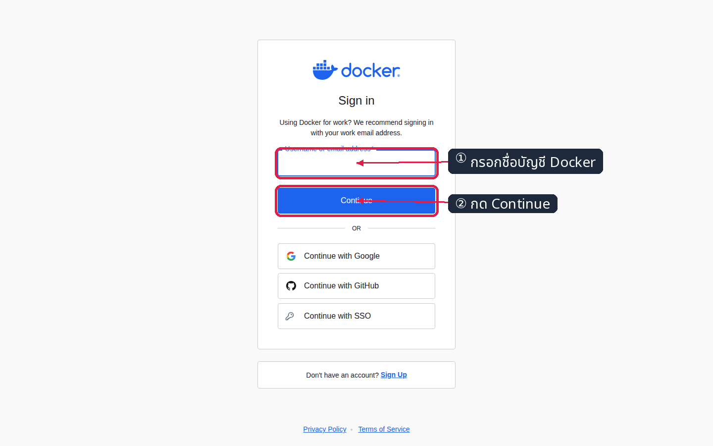

*ภาพ 3.1 — กรอกชื่อบัญชี (ไม่ใช่อีเมลก็ได้) แล้วกด Continue*

**ขั้นที่ 3.2 — กรอกรหัสผ่าน**

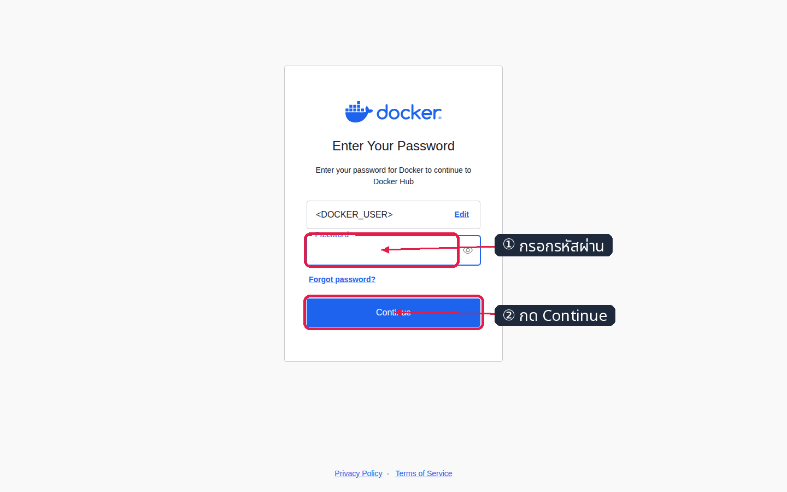

*ภาพ 3.2 — หน้านี้คือการยืนยันตัวตน **ผ่านเว็บ** ยังไม่ใช่ `docker login`*

**ขั้นที่ 3.3 — เปิดเมนูบัญชีที่มุมขวาบน**

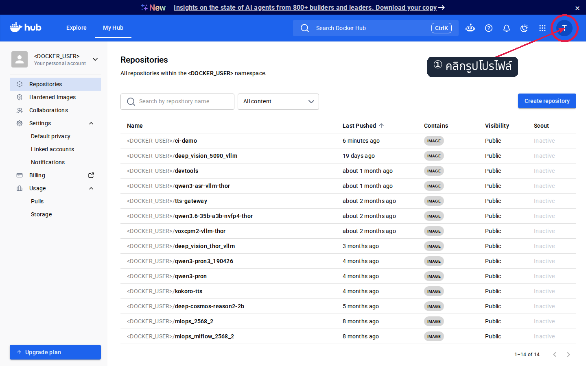

*ภาพ 3.3 — คลิกรูปโปรไฟล์เพื่อเปิดเมนูบัญชี*

**ขั้นที่ 3.4 — เลือก Account settings**

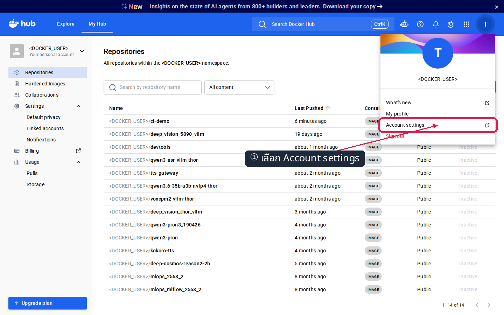

*ภาพ 3.4 — `Account settings` จะพาไปหน้าตั้งค่าบัญชีที่ `app.docker.com`*

**ขั้นที่ 3.5 — เปิดหน้า Personal access tokens แล้วกด Generate new token**

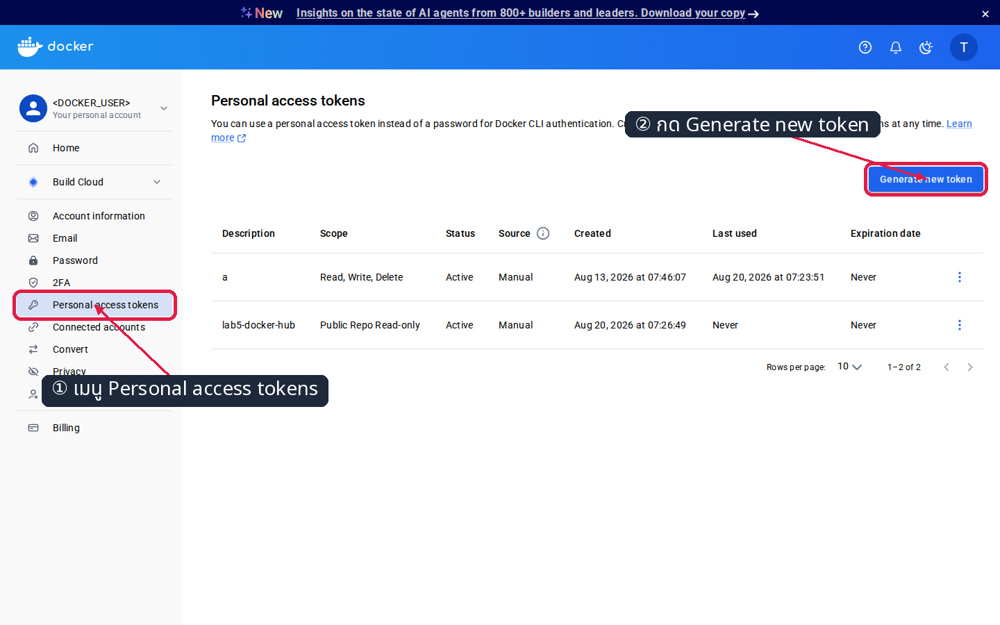

*ภาพ 3.5 — เมนูซ้าย `Personal access tokens` → ปุ่ม `Generate new token` มุมขวา*

**ขั้นที่ 3.6 — ตั้งชื่อและวันหมดอายุ**

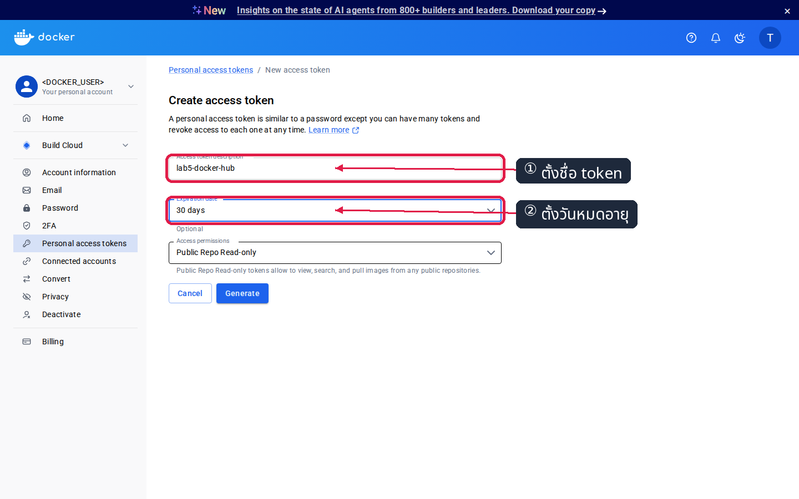

*ภาพ 3.6 — ตั้งชื่อให้รู้ว่าใช้ที่ไหน (เช่น `lab5-docker-hub`) และเลือกอายุ **30 days** ตามอายุงานจริง*

**ขั้นที่ 3.7 — เลือกสิทธิ์ Read & Write**

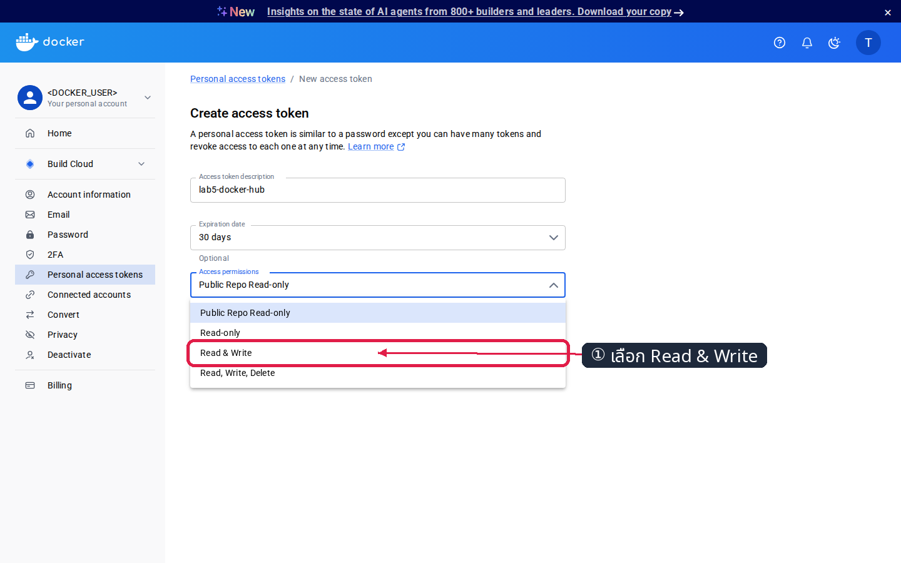

*ภาพ 3.7 — แล็บนี้ต้อง `push` จึงต้องใช้ **Read & Write** · ถ้าต้องการแค่ `pull` ให้เลือก `Read-only` ตามหลัก least privilege*

**ขั้นที่ 3.8 — กด Generate**

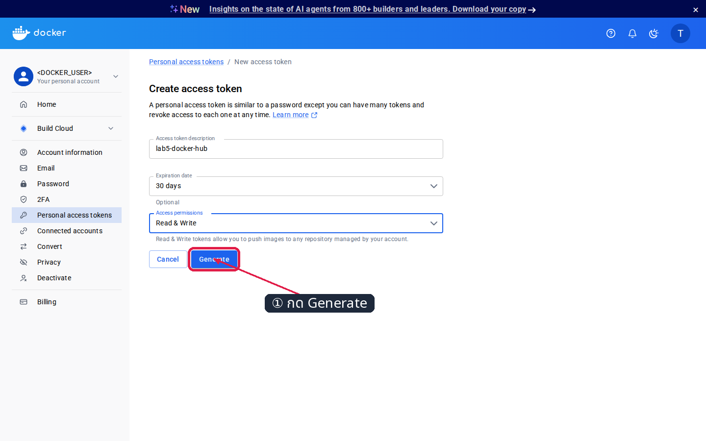

*ภาพ 3.8 — ตรวจชื่อ / อายุ / สิทธิ์ อีกครั้งก่อนกด Generate*

**ขั้นที่ 3.9 — คัดลอก token ทันที**

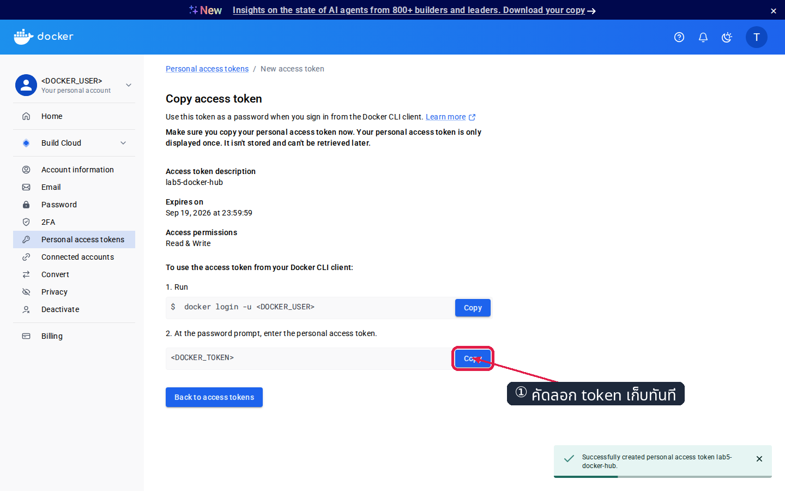

*ภาพ 3.9 — **token แสดงครั้งเดียวเท่านั้น** ปิดหน้านี้แล้วดูย้อนหลังไม่ได้ ต้องสร้างใหม่*

> 📝 เก็บ token ไว้ใน password manager · ถ้าเผลอทำหลุด ให้กลับมาหน้านี้แล้วลบ token ใบนั้นทิ้ง แล้วสร้างใบใหม่

### ขั้นที่ 4 — `docker login` และตั้งตัวแปรชื่อบัญชี

```bash
export DOCKER_USER=your-account          # แทน your-account ด้วยชื่อบัญชี Docker Hub ของตัวเอง
docker login -u "$DOCKER_USER"           # เมื่อขึ้น Password: ให้ "วาง" token ค่าจะไม่แสดงบนหน้าจอ
```

✅ **สิ่งที่ต้องเห็น** — ปิดท้ายด้วย `Login Succeeded` :

```
Password:
WARNING! Your credentials are stored unencrypted in '/root/.docker/config.json'.
Configure a credential helper to remove this warning. See
https://docs.docker.com/go/credential-store/

Login Succeeded
```

> 📝 **ห้ามพิมพ์ token ต่อท้ายคำสั่ง** (เช่น `docker login -u ... -p <token>`) เพราะจะถูกบันทึกลง `~/.bash_history` · ตัวแปร `$DOCKER_USER` จะถูกใช้ในทุกคำสั่งหลังจากนี้ ทำให้คัดลอกไปวางได้เลยโดยไม่ต้องแก้ชื่อทีละบรรทัด

---

## การทดลองที่ 1 — แกะชื่อ image ของจริง

**คำถาม:** ชื่อสั้น ๆ อย่าง `nginx:1.27-alpine` เต็ม ๆ แล้วคืออะไร

```bash
docker pull nginx:1.27-alpine
docker image inspect --format "TAGS   = {{.RepoTags}}"    nginx:1.27-alpine
docker image inspect --format "DIGEST = {{.RepoDigests}}" nginx:1.27-alpine
```

✅ **สิ่งที่ต้องเห็น** — สองแบบของชื่อ : แบบ `repo:tag` และแบบ `repo@sha256:...` :

```
TAGS   = [nginx:1.27-alpine]
DIGEST = [nginx@sha256:65645c7bb6a0661892a8b03b89d0743208a18dd2f3f17a54ef4b76fb8e2f2a10]
```

> 📝 `nginx` เขียนสั้นแบบไม่มี registry และไม่มี namespace ได้ เพราะเป็น **official image** ที่อยู่ใต้ `docker.io/library/` · `RepoDigests` จะมีค่าก็ต่อเมื่อ image นั้นเคย pull มาจาก registry หรือเคย push ขึ้นไปแล้ว

---

## การทดลองที่ 2 — build image รุ่นแรก

**คำถาม:** ชื่อที่ไม่มี namespace นำหน้า Docker ตีความว่าอะไร

```bash
docker build --provenance=false -t regdemo:1.0 .
docker images regdemo
```

✅ **สิ่งที่ต้องเห็น** — Docker **เติม `docker.io/library/` ให้เองอัตโนมัติ** :

```
#7 naming to docker.io/library/regdemo:1.0 done

IMAGE         ID             DISK USAGE   CONTENT SIZE   EXTRA
regdemo:1.0   11817de29b8c       73.6MB           21MB
```

> 📝 นี่คือสาเหตุที่ `docker push regdemo:1.0` เฉย ๆ จะวิ่งไป Docker Hub แล้วโดนปฏิเสธ — ต้องตั้งชื่อให้มี namespace ของเราก่อน (การทดลองถัดไป)
>
> `--provenance=false` สั่งไม่ให้แนบไฟล์ attestation มาด้วย ทำให้ image มี manifest เดียว — **digest ที่ push ตอบกลับ จึงตรงกับที่ Docker Hub แสดงพอดี** อ่านเทียบกันได้ง่ายตลอดแล็บ

---

## การทดลองที่ 3 — `docker tag` สำเนา image ไหม

**คำถาม:** ติดชื่อที่สองแล้ว image ในเครื่องเพิ่มเป็น 2 ก้อนหรือเปล่า

```bash
docker tag regdemo:1.0 "$DOCKER_USER/regdemo:1.0"
docker image inspect --format "{{.Id}}" regdemo:1.0 "$DOCKER_USER/regdemo:1.0"
```

✅ **สิ่งที่ต้องเห็น** — **หลักฐานชิ้นเอก** : ชื่อคนละชื่อ แต่ **ID เดียวกัน** :

```
sha256:11817de29b8ce2a558db676dc824400419c8f7b5a706e242004839c40b9df4d4
sha256:11817de29b8ce2a558db676dc824400419c8f7b5a706e242004839c40b9df4d4
```

> 📝 **image = ก้อนข้อมูล · tag = ป้ายชื่อที่ชี้มาที่ก้อนนั้น** — ป้ายกี่ใบก็ได้ ไม่กินพื้นที่เพิ่ม · ชื่อใหม่มีครบสูตร : registry `docker.io` (ไม่ต้องพิมพ์) / namespace `<DOCKER_USER>` / repository `regdemo` / tag `1.0`

---

## การทดลองที่ 4 — push ขึ้น Docker Hub

**คำถาม:** Docker รู้ได้อย่างไรว่าจะส่งไปที่ไหน และส่งอะไรขึ้นไปบ้าง

```bash
docker push "$DOCKER_USER/regdemo:1.0"
```

✅ **สิ่งที่ต้องเห็น** — layer ของ nginx ขึ้น `Mounted from library/nginx` มีเฉพาะ layer เว็บของเราที่ `Pushed` แล้วปิดท้ายด้วย **digest** (เรียกค่านี้ว่า **D1**) :

```
The push refers to repository [docker.io/<DOCKER_USER>/regdemo]
d7e507024086: Mounted from library/nginx
f18232174bc9: Mounted from library/nginx
34a64644b756: Mounted from library/nginx
dba5d08a7ddc: Pushed
1.0: digest: sha256:11817de29b8ce2a558db676dc824400419c8f7b5a706e242004839c40b9df4d4 size: 1998
```

> 📝 **Docker อ่านจาก "ชื่อ" เท่านั้น** ว่าจะส่งไปที่ไหน · `Mounted from library/nginx` แปลว่า layer นั้นมีอยู่บน Docker Hub อยู่แล้ว จึงไม่ต้องอัปโหลดซ้ำ — เราส่งขึ้นไปจริงแค่ layer เดียว · ค่า digest ของแต่ละคนจะไม่ตรงกับเอกสารนี้ เพราะคำนวณจากเนื้อหา image ที่ build ในเครื่องตัวเอง

---

## การทดลองที่ 5 — เก็บชื่อแบบ digest ไว้ใช้ตอนท้ายแล็บ

**คำถาม:** ชื่อแบบ `repo@sha256:...` เอามาจากไหนโดยไม่ต้องพิมพ์ตามทีละตัวอักษร

```bash
docker rmi regdemo:1.0
D1=$(docker image inspect --format "{{index .RepoDigests 0}}" "$DOCKER_USER/regdemo:1.0")
echo "$D1"
```

✅ **สิ่งที่ต้องเห็น** — สตริงเต็มรูปแบบที่เอาไปต่อท้าย `docker pull` ได้เลย และ digest ตรงกับที่ push ตอบ :

```
Untagged: regdemo:1.0
<DOCKER_USER>/regdemo@sha256:11817de29b8ce2a558db676dc824400419c8f7b5a706e242004839c40b9df4d4
```

> 📝 ต้อง `docker rmi regdemo:1.0` ก่อน เพราะ image ก้อนนี้มี **สองชื่อ** และ `.RepoDigests` เป็น **list ที่ลำดับไม่แน่นอน** — ถอดชื่อสั้นที่ไม่เคย push ออกไปก่อน จึงเหลือรายการเดียวที่มี namespace ครบและใช้ `pull` ได้จริง

---

## การทดลองที่ 6 — เปิดดู repository ที่ push ขึ้นไปบนเว็บ Docker Hub

**คำถาม:** เราไม่ได้กด "สร้าง repository" เลย แล้วของไปโผล่ที่ไหน

**ขั้นที่ 6.1 — เปิด `hub.docker.com` → `My Hub` → `Repositories`**

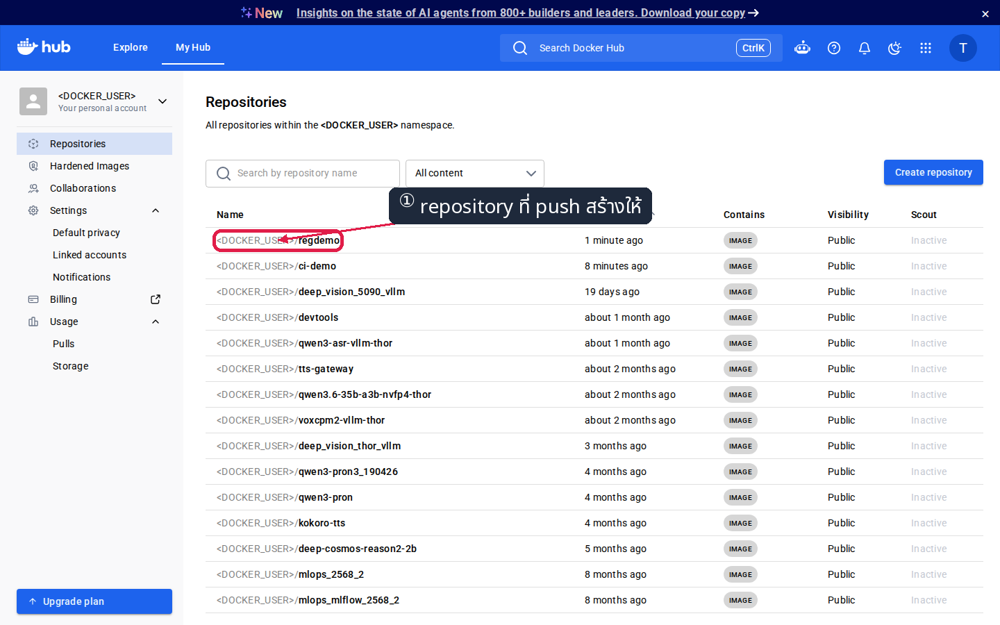

*ภาพ 6.1 — `docker push` **สร้าง repository ให้เองอัตโนมัติ** (ค่าเริ่มต้นเป็น Public) — คอลัมน์ Last Pushed บอกเวลาที่เพิ่ง push*

**ขั้นที่ 6.2 — คลิกชื่อ repository แล้วเปิดแท็บ Tags**

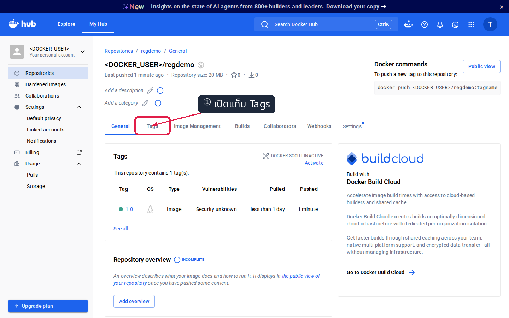

*ภาพ 6.2 — หน้า General สรุปว่ามีกี่ tag · กล่อง Docker commands ทางขวาบอกคำสั่ง push ของ repository นี้*

**ขั้นที่ 6.3 — อ่าน tag และ digest**

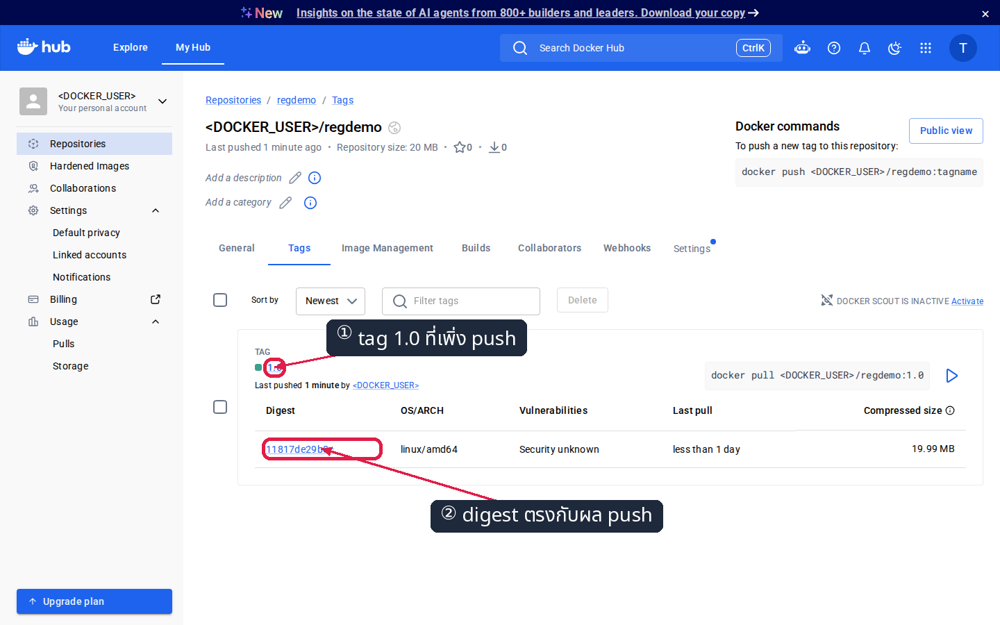

*ภาพ 6.3 — **digest ที่แสดง (`11817de29b8c`) คือ 12 ตัวแรกของ D1** ที่ `docker push` ตอบกลับมา*

✅ **สิ่งที่ต้องเห็น** — tag `1.0` หนึ่งรายการ และ digest ขึ้นต้นตรงกับ `$D1` ที่เก็บไว้

> 📝 หน้าเว็บกับบรรทัดผลลัพธ์ของ `docker push` คือ **ข้อมูลชุดเดียวกัน** คนละหน้าตา — Docker Hub เป็นเพียง registry ที่มีหน้าเว็บให้ดู ไม่ได้รัน container ให้เรา

---

## การทดลองที่ 7 — ถาม Docker Hub ด้วย HTTP API

**คำถาม:** ตอนนี้ tag `1.0` ชี้ไป digest ไหน โดยไม่ต้องเปิดเบราว์เซอร์

```bash
curl -s "https://hub.docker.com/v2/repositories/$DOCKER_USER/regdemo/tags/1.0/" \
  | python3 -c "import sys, json; print(json.load(sys.stdin).get('digest', 'ยังไม่พร้อม — รอ 10 วินาทีแล้วลองใหม่'))"
```

✅ **สิ่งที่ต้องเห็น** — ค่าเดียวกับ `$D1` และเดียวกับที่เห็นบนหน้าเว็บ :

```
sha256:11817de29b8ce2a558db676dc824400419c8f7b5a706e242004839c40b9df4d4
```

> 📝 registry ทุกตัวคือ **HTTP server** ที่ตอบเป็น JSON · บรรทัดที่สองมีหน้าที่เดียวคือหยิบค่า `digest` ออกจาก JSON ก้อนใหญ่ · repository ที่เป็น public ถามได้โดยไม่ต้องล็อกอิน · ถ้าเพิ่ง push เสร็จวินาทีนี้แล้วขึ้น `ยังไม่พร้อม` ให้รอ 10 วินาทีแล้วสั่งซ้ำ

---

## การทดลองที่ 8 — ลบ image ในเครื่องแล้ว pull กลับมารัน

**คำถาม:** ของอยู่บน Docker Hub จริงหรือแค่อยู่ในเครื่องเรา

```bash
docker rmi "$DOCKER_USER/regdemo:1.0"
docker pull "$DOCKER_USER/regdemo:1.0"
docker run -d --name regdemo-web -p 8185:80 "$DOCKER_USER/regdemo:1.0"
```

✅ **สิ่งที่ต้องเห็น** — `Downloaded newer image` = ดึงมาจาก Docker Hub จริง :

```
Digest: sha256:11817de29b8ce2a558db676dc824400419c8f7b5a706e242004839c40b9df4d4
Status: Downloaded newer image for <DOCKER_USER>/regdemo:1.0
```

เปิดเบราว์เซอร์บนเครื่องเราที่ **`http://localhost:8185`** :


*ภาพ 8 — หน้าเว็บรุ่นที่ 1 ที่มาจาก image บน Docker Hub ล้วน ๆ*

> 📝 **ปิดวงจรครบแล้ว** : build → tag → push → ลบทิ้ง → pull → run · registry **ไม่ได้รัน container ให้เรา** มันแค่ "เก็บและส่งต่อ" ไฟล์ image เท่านั้น

---

## การทดลองที่ 9 — push ทับ tag เดิมด้วย image คนละตัว

**คำถาม:** Docker Hub จะปฏิเสธ, สร้าง tag ใหม่, หรือย้าย tag เดิมไปชี้ของใหม่

```bash
docker build --provenance=false --build-arg SITE_DIR=site_v2 --build-arg RELEASE=2.0 -t regdemo:2.0 .
docker tag regdemo:2.0 "$DOCKER_USER/regdemo:1.0"
docker push "$DOCKER_USER/regdemo:1.0"
```

✅ **สิ่งที่ต้องเห็น** — layer ฐานขึ้น `Layer already exists` มีแค่ layer ของเว็บใหม่ที่ `Pushed` และได้ **digest ตัวใหม่ (D2)** :

```
61ca4f733c80: Layer already exists
39c2ddfd6010: Layer already exists
36c3707d6e94: Pushed
1.0: digest: sha256:40691f8361669806d45c07a2965f3e681cd7faca1baaf2f542584b53a17d8cb2 size: 1998
```

กลับไปที่หน้า **Tags** บน Docker Hub แล้วรีเฟรช :

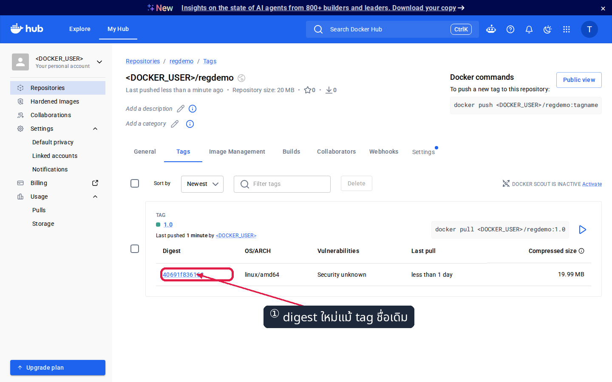

*ภาพ 9 — ชื่อ tag ยังเป็น `1.0` เหมือนเดิม แต่ **digest เปลี่ยนจาก `11817de29b8c` เป็น `40691f836166`** และ Last pushed ขยับเป็นเมื่อครู่*

> 📝 **เฉลย:** registry **ย้าย tag เดิมไปชี้ image ใหม่โดยไม่ถามอะไรเลย** และ image เก่ายังอยู่ครบ เพียงแต่ไม่มี tag ชี้ถึงแล้ว — เข้าถึงได้ทางเดียวคือผ่าน digest

---

## การทดลองที่ 10 — pull ด้วย tag เดิมเป๊ะ ๆ ได้อะไร

**คำถาม:** คำสั่ง `docker pull` ตัวอักษรเดิมทุกตัว จะได้ image เดิมไหม

```bash
docker rm -f regdemo-web
docker rmi -f "$DOCKER_USER/regdemo:1.0" regdemo:2.0
docker pull "$DOCKER_USER/regdemo:1.0"
docker run -d --name regdemo-web -p 8185:80 "$DOCKER_USER/regdemo:1.0"
```

✅ **สิ่งที่ต้องเห็น** — **คำสั่งเหมือนเดิมทุกตัวอักษร แต่ได้คนละหน้า** :

```
Digest: sha256:40691f8361669806d45c07a2965f3e681cd7faca1baaf2f542584b53a17d8cb2
Status: Downloaded newer image for <DOCKER_USER>/regdemo:1.0
```

รีเฟรช **`http://localhost:8185`** :


*ภาพ 10 — tag `1.0` เดิมถูก push ทับให้ชี้ image ใหม่ หน้าเว็บจึงกลายเป็นรุ่นที่ 2*

> 📝 นี่คือเหตุผลที่ระบบ deploy ซึ่ง pin ไว้แค่ `:1.0` อาจได้ของคนละตัวในวันถัดมาโดยไม่มีสัญญาณเตือน

---

## การทดลองที่ 11 — pull ด้วย digest ได้ของเดิมเสมอ

**คำถาม:** image รุ่น 1 หายไปจาก Docker Hub แล้วหรือยัง ในเมื่อไม่มี tag ชี้ถึง

```bash
docker pull "$D1"
docker run -d --name regdemo-old -p 8085:80 "$D1"
sleep 2
curl -s http://localhost:8085/ | grep RELEASE ; curl -s http://localhost:8185/ | grep RELEASE
```

✅ **สิ่งที่ต้องเห็น** — **หลักฐานชี้ขาดของแล็บนี้** : repository เดียวกัน registry เดียวกัน แต่ digest ต่างกัน → ได้คนละ image :

```
      <h1 id="release-title">RELEASE 1.0</h1>      ← พอร์ต 8085 : อ้างด้วย digest D1
      <h1 id="release-title">RELEASE 2.0</h1>      ← พอร์ต 8185 : อ้างด้วย tag 1.0
```

> 📝 `$D1` คือตัวแปรที่เก็บไว้ตั้งแต่การทดลองที่ 5 · พอร์ต 8085 ไม่ได้ publish ออกนอกกล่องเรียน จึงดูได้ด้วย `curl` จากใน SSH เท่านั้น
>
> **ทำไม `latest` ไม่ได้แปลว่าใหม่ที่สุด:** มันเป็นเพียง tag ธรรมดาตัวหนึ่ง ใครที่มีสิทธิ์ push ก็ชี้ `latest` ไปที่ image เก่าเมื่อปีที่แล้วได้ทันที และ Docker จะไม่เตือนอะไรเลย · เวลา deploy จึงควรใช้ **version tag** เป็นอย่างน้อย และเมื่อต้องการความแน่นอนสูงสุดให้ **pin ด้วย digest**

---

## การทดลองที่ 12 — `Untagged` ต่างจาก `Deleted` อย่างไร

**คำถาม:** `docker rmi` ลบอะไรกันแน่

```bash
docker tag "$DOCKER_USER/regdemo:1.0" regdemo:keep
docker rmi regdemo:keep
```

✅ **สิ่งที่ต้องเห็น** — มีแต่ `Untagged:` **ไม่มี `Deleted:`** เพราะยังมีชื่ออื่นชี้ก้อนนี้อยู่ :

```
Untagged: regdemo:keep
```

ทีนี้ลบ **ชื่อสุดท้าย** ของ image รุ่น 1 :

```bash
docker rm -f regdemo-old
docker rmi "$D1"
```

✅ **สิ่งที่ต้องเห็น** — คราวนี้ได้ **ทั้ง `Untagged:` และ `Deleted:`** :

```
Untagged: <DOCKER_USER>/regdemo@sha256:11817de29b8c...
Deleted: sha256:11817de29b8ce2a558db676dc824400419c8f7b5a706e242004839c40b9df4d4
```

> 📝 **กติกา:** `docker rmi` **ลบ "ชื่อ" ก่อนเสมอ** และจะลบ "ก้อน" ก็ต่อเมื่อชื่อสุดท้ายหายไปและไม่มี container ใดใช้อยู่ · **image ตัวนี้ยังอยู่บน Docker Hub นะ** — ที่เราลบคือสำเนาในเครื่องเรียนเท่านั้น สั่ง `docker pull` ด้วย digest เดิมก็ได้กลับมาอีก

---

## ตรวจงานด้วย `verify.sh`

รันจากในโฟลเดอร์ของแล็บ **และต้องรันก่อนหัวข้อ Cleanup** :

```bash
cd ~/labwork/DevTools/02_Docker/02_Dockerfile_Build_Run_Compose_Guide/005_LAB_Registry_Tag_Push_Pull
bash verify.sh ; echo "exit code = $?"
```

✅ **สิ่งที่ต้องเห็น** — `[PASS]` ครบทุกข้อ ปิดท้าย `ALL CHECKS PASSED` :

```
[PASS] c1 พบไฟล์ Dockerfile
[PASS] c2 พบไฟล์ site/index.html
[PASS] c3 พบไฟล์ site_v2/index.html
[PASS] c4 ตั้งตัวแปร DOCKER_USER แล้ว
[PASS] c5 พบ image <DOCKER_USER>/regdemo:1.0 ในเครื่อง
[PASS] c6 repository <DOCKER_USER>/regdemo บน Docker Hub มี tag 1.0
[PASS] c7 digest บน Docker Hub ตรงกับ image ในเครื่อง
[PASS] c8 รัน image ชั่วคราวแล้วหน้าเว็บมีคำว่า RELEASE
[PASS] c9 docker tag เพิ่มชื่อใหม่โดยไม่สำเนา image (IMAGE ID ตรงกัน)
ALL CHECKS PASSED
exit code = 0
```

> 📝 สคริปต์สร้างของใช้เองชื่อ `regdemo-verify` กับ tag ชั่วคราว `regdemo:verify-tmp` แล้ว **เก็บกวาดของตัวเองทั้งหมด** ไม่แตะ image หรือ repository ของเรา · ถ้า `c4` ไม่ผ่านให้ `export DOCKER_USER=...` ก่อนแล้วรันใหม่

---

## แก้ปัญหาที่พบบ่อย

| อาการ | สาเหตุ | วิธีแก้ |
|---|---|---|
| `push access denied ... insufficient_scope` | ชื่อ image ไม่มี namespace ของเรา Docker จึงส่งไป `docker.io/library/` ที่เราไม่มีสิทธิ์ | `docker tag <ชื่อเดิม> "$DOCKER_USER/<repo>:<tag>"` แล้ว push ชื่อใหม่ |
| `denied: requested access to the resource is denied` ทั้งที่ชื่อถูก | ยังไม่ได้ `docker login` หรือ token เป็น **Read-only** | `docker login -u "$DOCKER_USER"` ใหม่ · ตรวจสิทธิ์ token ว่าเป็น **Read & Write** (ขั้นที่ 3.7) |
| `unauthorized: incorrect username or password` | วาง token ผิดใบ หรือ token หมดอายุ/ถูกลบ | สร้าง token ใหม่ตามขั้นที่ 3 แล้ว login ใหม่ |
| `$DOCKER_USER` ว่างเปล่า ทำให้ชื่อ image กลายเป็น `/regdemo:1.0` | เปิด shell ใหม่ ตัวแปรจึงหาย | `export DOCKER_USER=your-account` อีกครั้งใน shell นั้น |
| `toomanyrequests: You have reached your pull rate limit` | ดึง image จาก Docker Hub เกินโควตาของบัญชี | รอครบชั่วโมง หรือ `docker login` ก่อนดึงเพื่อใช้โควตาของบัญชีเรา |
| `Bind for 0.0.0.0:8185 failed: port is already allocated` | container เดิมยังจองพอร์ตอยู่ | `docker rm -f regdemo-web` ก่อน แล้วรันใหม่ |
| `image is being used by running container` ตอน `docker rmi` | ยังมี container ที่สร้างจาก image นั้น | `docker ps -a --filter ancestor=<image>` หา แล้ว `docker rm -f` |
| สั่ง `docker rmi` แล้วขึ้นแค่ `Untagged:` พื้นที่ไม่ลด | ก้อนนั้นยังมีชื่ออื่นชี้อยู่ | `docker images` ดูว่าเหลือกี่ชื่อ แล้วลบให้ครบ |
| pull แล้วได้หน้าเว็บคนละรุ่นกับที่คิด | tag ถูก push ทับให้ชี้ image ใหม่ (การทดลองที่ 9) | ตรวจ digest บนหน้า Tags ก่อน · ต้องการรุ่นเดิมเป๊ะให้ pull ด้วย `@sha256:...` |
| หน้าเว็บ Docker Hub ยังไม่ขึ้น repository ที่เพิ่ง push | หน้าเว็บยังไม่ได้รีเฟรช | กด refresh · ตรวจว่าบรรทัดสุดท้ายของ push ขึ้น `digest: sha256:...` จริง |

---

## เก็บกวาด

**ในกล่องเรียน:**

```bash
docker rm -f regdemo-web regdemo-old 2>/dev/null
docker logout
docker ps -a
```

✅ **สิ่งที่ต้องเห็น** — ไม่เหลือ container ของแล็บ และ credential ถูกถอนออกจากเครื่อง :

```
Removing login credentials for https://index.docker.io/v1/
```

**ลบ repository บน Docker Hub** (ถ้าไม่ต้องการเก็บไว้โชว์) :

**ขั้นที่ 1 — เข้า repository → แท็บ Settings → เลื่อนลงล่างสุด**

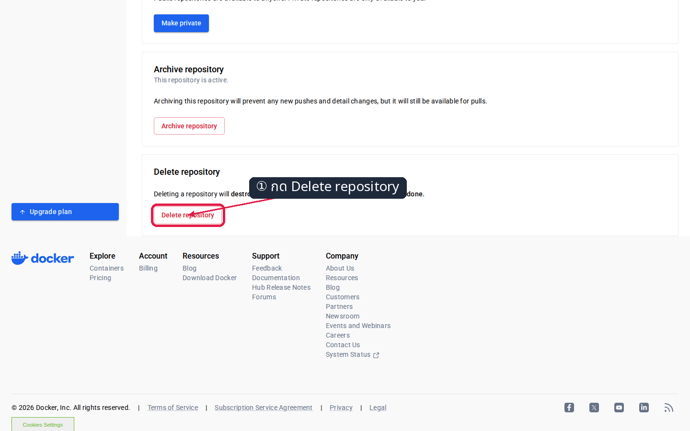

*ภาพ ค.1 — ปุ่ม `Delete repository` อยู่ล่างสุดของหน้า Settings ใต้หัวข้อ Archive repository*

**ขั้นที่ 2 — พิมพ์ชื่อ repository ยืนยันแล้วกดลบ**

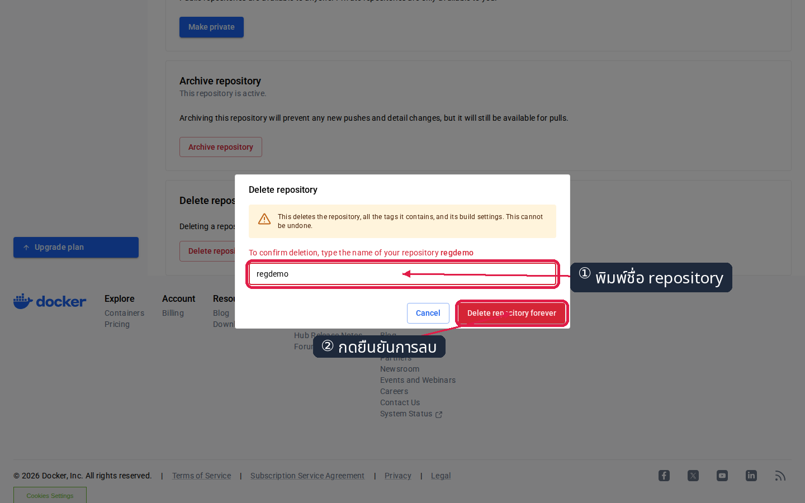

*ภาพ ค.2 — ต้องพิมพ์ `regdemo` ให้ตรงก่อน ปุ่มยืนยันจึงทำงาน — การลบนี้ย้อนกลับไม่ได้*

**ขั้นที่ 3 — ตรวจว่าหายไปจากรายการแล้ว**

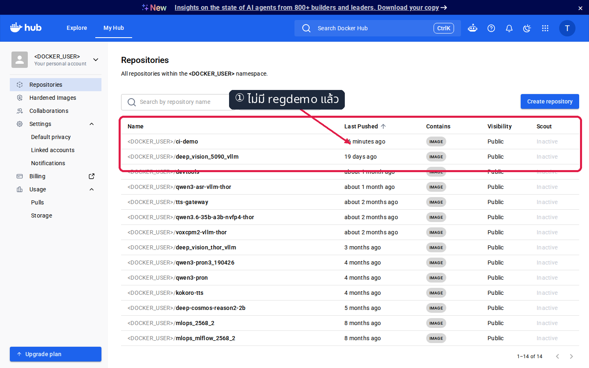

*ภาพ ค.3 — `regdemo` หายไปจากรายการ repository เรียบร้อย*

**ออกจากกล่องแล้วลบกล่องบนเครื่องเรา:**

```bash
exit
docker rm -f devtools-df-lab5
docker ps -a --filter "name=^devtools-"
```

---

## สรุปคำสั่งของแล็บนี้

| คำสั่ง | ความหมาย |
|---|---|
| `docker login -u "$DOCKER_USER"` | เข้าสู่ระบบ Docker Hub โดยวาง **access token** ที่ prompt (ไม่ใช่รหัสผ่านบัญชี) |
| `docker tag <เดิม> "$DOCKER_USER/regdemo:1.0"` | **เพิ่มชื่อ** ให้ image เดิมให้มี namespace ของเรา (ไม่สำเนา layers) |
| `docker push "$DOCKER_USER/regdemo:1.0"` | ส่ง manifest + เฉพาะ layer ที่ Docker Hub ยังไม่มี แล้วตอบ digest กลับมา |
| `docker pull <repo>:<tag>` | ดึงตาม **tag** — ได้ของที่ tag ชี้อยู่ ณ ขณะนั้น |
| `docker pull <repo>@sha256:<digest>` | ดึงตาม **digest** — ได้ของเดิมเสมอ |
| `docker image inspect --format "{{.Id}}" <ชื่อ>` | อ่าน IMAGE ID เพื่อพิสูจน์ว่าสองชื่อชี้ก้อนเดียวกัน |
| `docker image inspect --format "{{index .RepoDigests 0}}" <ชื่อ>` | เอาชื่อแบบ `repo@sha256:...` มาเก็บไว้ในตัวแปร |
| `curl -s "https://hub.docker.com/v2/repositories/$DOCKER_USER/<repo>/tags/<tag>/"` | ถาม Docker Hub ว่า tag นี้ชี้ digest ไหน (ตอบเป็น JSON) |
| `docker rmi <ชื่อ>` | ลบ **ชื่อ** ก่อน — `Untagged:` ถ้ายังมีชื่ออื่น, `Deleted:` เมื่อลบชื่อสุดท้าย |
| `docker logout` | ถอน credential ออกจากเครื่อง — ทำทุกครั้งบนเครื่องที่ใช้ร่วมกับคนอื่น |

> จำสั้น ๆ : **image = ก้อนข้อมูล (ID/digest)** · **tag = ป้ายชื่อที่ย้ายได้** · **registry = ที่ฝากส่ง ไม่ใช่ที่รัน** · อยากได้ของเดิมเป๊ะเมื่อไหร่ → **pin ด้วย digest**

## ✅ เช็กลิสต์ก่อนจบแล็บ

- [ ] อธิบายชื่อ `<DOCKER_USER>/regdemo:1.0` ได้ครบว่าส่วนไหนคือ registry / namespace / repository / tag
- [ ] สร้าง access token แบบ **Read & Write** พร้อมวันหมดอายุ และ `docker login` สำเร็จ
- [ ] หลัง `docker tag` เห็น **สองชื่อที่ต่างกันแต่ IMAGE ID เดียวกัน**
- [ ] `docker push` จบด้วย `1.0: digest: sha256:...` และค่าเดียวกันปรากฏบนหน้า Tags ของ Docker Hub
- [ ] ลบ image ในเครื่องแล้ว `docker pull` กลับมา `docker run` ได้ และ `http://localhost:8185` แสดง **RELEASE 1.0**
- [ ] push รุ่น 2 ทับ tag `1.0` แล้วเห็น `Layer already exists` กับ digest ตัวใหม่ที่ต่างจากเดิม
- [ ] pull ด้วย tag `1.0` ได้ **RELEASE 2.0** แต่ pull ด้วย `$D1` ยังได้ **RELEASE 1.0**
- [ ] `docker rmi` ชื่อแรกได้แค่ `Untagged:` · ลบชื่อสุดท้ายจึงได้ `Deleted:`
- [ ] อธิบายได้ว่าทำไม `latest` ไม่ได้แปลว่าใหม่ที่สุด
- [ ] `bash verify.sh` ขึ้น `ALL CHECKS PASSED` · `docker logout` แล้ว · ไม่เหลือ container ของแล็บ

*ผลลัพธ์ทั้งหมดในเอกสารนี้มาจากการรันจริงในเครื่องเรียน `tuchsanai/devtools:2569_1` และภาพหน้าจอทุกภาพมาจาก Docker Hub ของจริง (ปิดบังชื่อบัญชีเป็น `<DOCKER_USER>` แล้ว)*
