# LAB 5 — ส่ง Image เข้า Registry : Tag → Push → Pull

> โฟลเดอร์ `005_LAB_Registry_Tag_Push_Pull` = **LAB 5** ของชุด "Dockerfile → Build → Run → Compose" (ตอนที่ 8 ของคู่มือ) ไฟล์ในโฟลเดอร์นี้: `Dockerfile` · `site/index.html` (รุ่น 1) · `site_v2/index.html` (รุ่น 2) · `verify.sh` · `images/` (ภาพประกอบและ screenshot จริง)

### 🎯 แล็บนี้ใน 30 วินาที

| | |
|---|---|
| **คำถามเดียวที่ตอบให้จบ** | ถ้ามีคน `push` ทับ tag `1.0` ด้วย image คนละตัว — พรุ่งนี้เรา `pull` แล้วได้อะไร |
| **ต้องผ่านอะไรมาก่อน** | **LAB 1** (build/run) · **LAB 4** (`--build-arg` ที่ใช้สร้างรุ่นที่ 2) |
| **เวลา** | ~35 นาที (ข้อ 0–13 · ข้อ 12 Docker Hub เป็นเอกสารอ่านอย่างเดียว ไม่ต้องทำในคาบ) |
| **จบแล้วต้องทำได้เอง** | แกะชื่อ image ครบทุกส่วน · เดินวงจร build → tag → push → pull → run · เลือกระหว่าง tag กับ digest ได้อย่างมีเหตุผล |
| **แล็บนี้ยัง *ไม่* สอน** | เราจะใช้ **local registry** ทั้งแล็บ — ไม่ต้องมีบัญชี Docker Hub และ **ห้ามใส่ token จริง** ลงเอกสารใด ๆ (ข้อ 12 ใช้ `<DOCKER_USER>` / `<DOCKER_TOKEN>` เป็น placeholder) |

## สิ่งที่จะได้เรียนรู้

- อ่านและเขียน **ชื่อเต็มของ image** ได้ครบทุกส่วน: `[REGISTRY/][NAMESPACE/]REPOSITORY[:TAG][@DIGEST]` — และรู้ว่าถ้าไม่เขียน registry นำหน้า Docker จะเติม `docker.io` ให้เอง
- พิสูจน์ว่า `docker tag` คือการ **เพิ่มป้ายชื่อ** ให้ image เดิม **ไม่ใช่การสำเนา layers** (ดู IMAGE ID เดียวกัน 2 แถว และ `docker system df` ที่จำนวน image ไม่เพิ่ม)
- เปิด **local registry** (`registry:2`) ในเครื่องเรียน แล้วเดินวงจรเต็ม **build → tag → push → ลบชื่อ local → pull → run** โดยไม่ต้องแตะบัญชีภายนอก
- ส่อง registry ตรง ๆ ด้วย **HTTP API**: `/v2/_catalog` · `/v2/<repo>/tags/list` · หัว `Docker-Content-Digest` ของ manifest
- เข้าใจความต่างระหว่าง **tag กับ digest** จากการทดลองจริง — push ทับ tag `1.0` ด้วย image คนละตัว แล้วเห็นว่า **tag ย้ายไปชี้ของใหม่** แต่ `@sha256:...` ของเก่ายังได้ของเดิมเป๊ะ (จึงเข้าใจว่าทำไม `latest` ไม่ได้แปลว่า "ใหม่ที่สุด")
- แยกออกว่า `docker rmi` เมื่อไหร่แค่ **`Untagged`** และเมื่อไหร่ถึง **`Deleted`** (พื้นที่คืนจริง)
- ขั้นตอนทำงานกับ **Docker Hub** อย่างปลอดภัย: สร้าง Personal Access Token 7 ขั้น · `docker login` → `tag` → `push` → `pull` → `logout` · หลัก least privilege
- รู้ขอบเขต: registry แบบ HTTP ใช้ได้เฉพาะการทดลองบน localhost — ของจริงต้อง TLS + authentication

## ภาพรวมของแล็บนี้

1. **เตรียมเครื่องเรียน** — เปิด `devtools-df-lab5` ที่ publish port `2235` (SSH), `5035` (registry) และ `8185` (เว็บ)
2. **แกะชื่อเต็มของ image** — ดู `RepoTags` กับ `RepoDigests` ของ image จริงเทียบกับสูตร `[REGISTRY/][NAMESPACE/]REPOSITORY[:TAG][@DIGEST]`
3. **เปิด local registry** `registry:2` แล้วถาม catalog ครั้งแรก (ต้องว่าง)
4. **Build image รุ่นแรก** `regdemo:1.0` — หน้าเว็บ "Image Delivery Console" ตัวใหญ่ ๆ ว่า **RELEASE 1.0**
5. **Tag** ให้ตรงกับ registry แล้วพิสูจน์ว่า IMAGE ID **ตัวเดียวกัน**
6. **Push** ขึ้น registry แล้วจดค่า digest ที่ registry ตอบกลับ
7. **ส่อง registry ด้วย HTTP API** — catalog / tags / `Docker-Content-Digest`
8. **ลบชื่อ local ทิ้ง แล้ว pull กลับมา run** — เปิดหน้าเว็บที่ `http://localhost:8185` เห็น RELEASE 1.0
9. **Build รุ่นที่ 2 (RELEASE 2.0) แล้ว push ทับ tag `1.0`** — สังเกต `Layer already exists` และ digest ที่เปลี่ยนไป
10. **พิสูจน์ด้วยภาพ** ว่า tag `1.0` ย้ายไปชี้ image ใหม่ แต่ **pull ด้วย digest เก่ายังได้ RELEASE 1.0**
11. **`docker rmi`** — ลบชื่อแรกได้แค่ `Untagged`, ลบชื่อสุดท้ายจึง `Deleted`
12. **Docker Hub (อ่านอย่างเดียว)** — 7 ขั้นสร้าง Personal Access Token + วงจร login/tag/push/pull/logout
13. **รัน `verify.sh`** ให้ขึ้น `ALL CHECKS PASSED` แล้วเก็บกวาด

> **คำถามก่อนเริ่ม:** ถ้าเรา `docker push` ทับ tag `1.0` ด้วย image คนละตัว — คนที่ `docker pull ...:1.0` พรุ่งนี้จะได้ image ตัวไหน? แล้วถ้าเขา pin ด้วย `@sha256:...` ของเมื่อวานล่ะ? แล้ว `docker tag` ที่เราสั่งกันบ่อย ๆ มัน "สำเนา image" เพิ่มอีกชุดจริงไหม? แล็บนี้จะพิสูจน์ทั้งสามคำถามด้วยการรันจริง — พร้อมหลักฐานเป็นภาพหน้าจอ

### Terminal Map

แล็บนี้ใช้ **terminal เดียว** (SSH เข้าเครื่องเรียนแล้วพิมพ์ต่อกันทั้งหมด) ส่วนเบราว์เซอร์บนเครื่องเราใช้ดู 2 หน้า:

| ช่องทาง | ใช้ทำอะไร |
|---|---|
| **T1 (SSH)** | ทุกคำสั่ง `docker` ในเครื่องเรียน — build / tag / push / pull / run / curl |
| **เบราว์เซอร์ → `http://localhost:8185`** | ดูหน้าเว็บของ image ที่ pull กลับมา (RELEASE 1.0 / 2.0) |
| **เบราว์เซอร์ → `http://localhost:5035/v2/_catalog`** | ดู catalog ของ registry ตรง ๆ ผ่าน HTTP API |

## ทฤษฎีก่อนลงมือ

### ภาพจำหลัก

ชื่อ image คือ "ที่อยู่จัดส่ง" ที่บอกปลายทาง เจ้าของ ชิ้นงาน และรุ่น — ถ้าขาดบางส่วน Docker จะเติม default ให้เอง ซึ่งอาจพา `push` ไปผิดที่

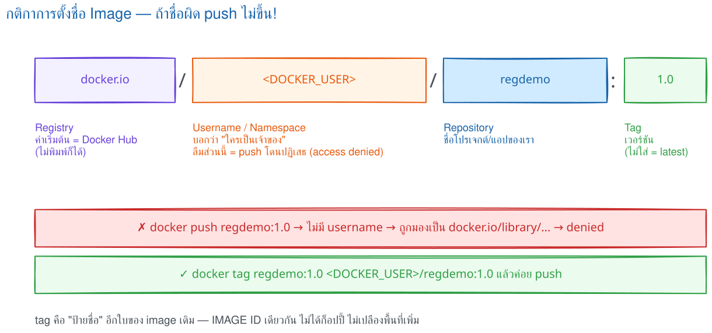

> 🖼 **วิธีอ่านรูปนี้:** ไล่ `docker.io/<DOCKER_USER>/regdemo:1.0` จากซ้ายไปขวาตามสี เพื่อแยกปลายทาง พื้นที่เจ้าของ ชิ้นงาน และรุ่น · กรอบแดงคือชื่อที่ขาด namespace จนถูกส่งไป `library` · กรอบเขียวคือชื่อที่พร้อมส่ง และบรรทัดล่างเชื่อมกับ IMAGE ID ในข้อ 5

### กลไกจริง

ชื่อเต็ม `docker.io/<DOCKER_USER>/regdemo:1.0` มี `docker.io` เป็น registry · `<DOCKER_USER>` เป็น namespace · `regdemo` เป็น repository · `1.0` เป็น tag — ถ้าไม่เขียน registry Docker จะเติม `docker.io` ให้ ชื่อสั้นที่ไม่มี namespace จะถูกมองเป็นของ `library` และชื่อที่ไม่ระบุ tag จะใช้ `latest` · default เหล่านี้ทำให้ pull official image พิมพ์สั้นลง แต่ก็ทำให้ `push regdemo:1.0` ที่ไม่ได้ตั้งชื่อให้ตรง registry ปลายทาง พุ่งไปยังพื้นที่ที่เราไม่มีสิทธิ์

ข้อ 4 สร้าง image จาก config, metadata และ layers ที่ระบุตัวตนด้วย hash ของเนื้อหา · ข้อ 5 ใช้ `docker tag` เพิ่มความสัมพันธ์ระหว่าง "ชื่อ" กับ image เดิม ไม่ได้คัดลอก bytes หรือ layers — ให้นึกถึงกระเป๋าใบเดียวที่ติดป้ายได้หลายใบ ป้ายเพิ่มแต่ของข้างในไม่เพิ่ม จึงเห็น IMAGE ID เดียวกัน

ข้อ 6 แกะชื่อเพื่อเลือก registry และ repository แล้วเทียบ digest ของแต่ละ layer กับ blobs ที่ปลายทางมี · Docker อัปโหลดเฉพาะก้อนที่ขาด พร้อม manifest หรือ OCI index ซึ่งเป็นสารบัญของ layers · pull ในข้อ 8 ทำย้อนทางและดึงเฉพาะก้อนที่เครื่องยังไม่มี · รุ่น 1 กับรุ่น 2 ใช้ base image ร่วมกัน ข้อ 9 จึงข้าม layers เดิมและส่งเฉพาะส่วนที่เปลี่ยน

digest คือ `sha256` จาก bytes ของวัตถุ จึงเหมือนลายนิ้วมือ — เนื้อหาเปลี่ยน ค่าก็เปลี่ยน · tag เป็นระเบียนชื่อที่ย้ายไปชี้ digest อื่นได้ การ push รุ่น 2 ทับ `1.0` ในข้อ 9 จึงเป็นการ "ย้ายป้าย" โดยไม่แตะ digest รุ่นแรก · ข้อ 10 เปรียบเทียบการถามว่า "ตอนนี้ป้ายชี้ไหน" กับการขอวัตถุเดิมตรง ๆ ผ่าน `@sha256:...`

ในแล็บนี้ Docker 29 ใช้ containerd image store: IMAGE ID เป็น digest ของ OCI index ก้อนเดียวกับที่ registry ตอบตอน push จึงเห็นเลขตรงกัน · อย่าเดา digest จากเลขย่อข้ามเครื่อง ให้อ้างค่าเต็มใน `RepoDigests` ตามข้อ 6–7

`docker rmi` เริ่มจากถอด reference ในเครื่อง — ถ้ายังมีชื่ออื่นชี้ image เดิมจะเห็นแค่ `Untagged` เมื่อถอดชื่อสุดท้ายจึงเห็น `Deleted` · layer ที่ image อื่นใช้ร่วมกันยังอยู่ และข้อ 11 ไม่ได้ลบสำเนาบน registry

### กฎที่ต้องจำ

| กฎ | เหตุผลที่ใช้ในแล็บ |
|---|---|
| อ่านชื่อจากซ้ายไปขวาก่อน push | registry และ namespace เป็นตัวกำหนดปลายทางกับสิทธิ์ |
| tag หลายชื่อไม่เท่ากับ image หลายก้อน | ชื่อเหล่านั้นชี้ข้อมูลชุดเดิมและใช้ layers ร่วมกัน |
| ต้องการรุ่นตายตัวให้ pin ด้วย digest | tag ถูกย้ายได้ แต่ digest ผูกกับเนื้อหา |
| แยก `Untagged` ออกจาก `Deleted` | อันแรกถอดชื่อ อันหลังจึงลบ image object ที่ไม่ถูกอ้างในเครื่อง |

### สิ่งที่มักเข้าใจผิด

- **คิดว่า** `docker tag` สำเนา image อีกชุด **แต่จริง ๆ** มันเพิ่มป้ายชี้ไปยัง object เดิม
- **คิดว่า** push และ pull ส่ง image ทั้งก้อนทุกครั้ง **แต่จริง ๆ** ทั้งสองฝั่งตรวจ digest แล้วถ่ายโอนเฉพาะ layers ที่อีกฝั่งยังไม่มี
- **คิดว่า** ลบ image ในเครื่องแล้วของบน registry หายตาม **แต่จริง ๆ** local image store กับ registry เป็นคนละขอบเขตกัน

### ทายผลก่อนทดลอง

1. ก่อนทำข้อ 5–6: หลังเพิ่มชื่อ local registry แล้ว IMAGE ID, จำนวน image และสถานะ layers ตอน push จะเปลี่ยนอย่างไร?
2. ก่อนทำข้อ 9–11: เมื่อ tag `1.0` ชี้รุ่น 2 การ pull ด้วย tag กับ digest รุ่นแรกจะต่างกันอย่างไร และลบชื่อครั้งใดจึงเปลี่ยนจาก `Untagged` เป็น `Deleted`?

## 0. เตรียมเครื่องเรียน

ทำบนเครื่องของเราเอง (ไม่ใช้ cloud) — เปิด container ที่ติดตั้ง Docker มาให้แล้ว

```bash
docker rm -f devtools-df-lab5 2>/dev/null
docker run -dit --name devtools-df-lab5 --privileged \
  -p 2235:22 -p 5035:5000 -p 8185:8185 \
  tuchsanai/devtools:2569_1
ssh root@localhost -p 2235        # password : passwd
```

> 📝 **คำอธิบาย:** `-dit` = `-d` รันเบื้องหลัง + `-i` เปิด stdin ค้าง + `-t` ให้มี terminal กล่องจะได้ไม่ดับ · `--privileged` ให้สิทธิ์เต็มเพื่อรัน **Docker ซ้อนข้างในกล่อง** (registry และเว็บของแล็บนี้รันข้างในนั้น) · `-p 2235:22` ต่อ SSH · **`-p 5035:5000`** ยิงพอร์ต 5035 ของเครื่องเราเข้า **พอร์ต 5000 ของเครื่องเรียน** ซึ่งจะเป็นที่อยู่ของ local registry · **`-p 8185:8185`** ไว้เปิดหน้าเว็บของ image ที่เรา build เอง · ทั้ง 3 พอร์ตนี้ **ไม่ซ้ำกับ LAB อื่น** เปิดค้างพร้อมกันได้ · ข้อควรระวังที่พลาดกันบ่อย: พอร์ตซ้ายคือของ**เครื่องเรา** พอร์ตขวาคือของ**เครื่องเรียน** — ในเครื่องเรียนเราจะสั่ง registry ให้ฟังที่ `5000` เสมอ ไม่ใช่ `5035`

ตรวจว่าพร้อมใช้งาน (คำสั่งต่อจากนี้ **พิมพ์ข้างในเครื่องเรียน** ทั้งหมด) :

```bash
docker --version
docker info --format 'Docker daemon: {{.ServerVersion}}'
```

> 📝 **คำอธิบาย:** บรรทัดแรกตรวจ Docker CLI บรรทัดที่สองต้องคุยกับ daemon ได้จริง · ถ้าขึ้น `Cannot connect to the Docker daemon` แปลว่า dockerd ข้างในยังไม่ตื่น รอสัก 10–20 วินาทีแล้วลองใหม่

✅ **Expected output** — ขอแค่มีเลขเวอร์ชันครบสองบรรทัด (เลขของแต่ละคนอาจไม่ตรงกับเอกสารนี้):

```
Docker version 29.6.2, build dfc4efb
Docker daemon: 29.6.2
```

## 1. Clone โค้ดแล็บ

```bash
mkdir -p ~/labwork && cd ~/labwork
git clone https://github.com/Tuchsanai/DevTools.git
cd DevTools/02_Docker/02_Dockerfile_Build_Run_Compose_Guide/005_LAB_Registry_Tag_Push_Pull
ls
```

> 📝 **คำอธิบาย:** ถ้าเคย clone ตอน LAB 1–4 แล้ว git จะบอกว่าโฟลเดอร์ปลายทางไม่ว่าง — ข้ามไป `cd` ได้เลย · ในโฟลเดอร์นี้มี `Dockerfile` หนึ่งใบที่ build ได้ **สองรุ่น** โดยเปลี่ยนแค่ `--build-arg` และมีหน้าเว็บสองชุดคือ `site/` (รุ่น 1) กับ `site_v2/` (รุ่น 2)

`Dockerfile` ของแล็บนี้สั้นมาก :

```dockerfile
FROM nginx:1.27-alpine
ARG SITE_DIR=site
ARG RELEASE=1.0
LABEL org.opencontainers.image.title="regdemo"
LABEL release="${RELEASE}"
COPY ${SITE_DIR}/ /usr/share/nginx/html/
EXPOSE 80
```

> 📝 **คำอธิบาย:** `FROM nginx:1.27-alpine` **pin เวอร์ชัน** ไว้เพื่อให้ผลเหมือนกันทั้งห้อง · `ARG SITE_DIR=site` ทำให้ `COPY ${SITE_DIR}/ ...` เลือกได้ว่าจะเอาเว็บชุดไหนเข้า image — นี่คือกลไกที่ทำให้ Dockerfile ใบเดียวสร้างได้สองรุ่น (ทบทวน ARG จาก LAB 4) · `LABEL release="${RELEASE}"` ฝัง metadata ไว้ในตัว image เพื่อให้ตรวจย้อนหลังได้ · `EXPOSE 80` เป็นการ **ประกาศ** ว่าแอปฟังพอร์ต 80 ไม่ได้เปิดพอร์ตให้เอง — ตอนรันยังต้อง `-p` เสมอ

## 2. แกะชื่อเต็มของ image ทีละส่วน

ชื่อเต็มของ image มีรูปแบบเดียวกันทั้งโลก :

```
[REGISTRY/][NAMESPACE/]REPOSITORY[:TAG][@DIGEST]
```

| ส่วน | ตัวอย่างในแล็บนี้ | หน้าที่ | ถ้าไม่เขียน |
|---|---|---|---|
| **Registry** | `localhost:5000` | เซิร์ฟเวอร์ที่เก็บ manifest + layers | Docker เติม `docker.io` (Docker Hub) ให้อัตโนมัติ |
| **Namespace** | `workshop` | เจ้าของ/องค์กร/กลุ่มที่มีสิทธิ์ push | บน Docker Hub จะกลายเป็น `library` (official image) ซึ่งเรา push ไม่ได้ |
| **Repository** | `regdemo` | ชื่อชุด image ของแอปตัวหนึ่ง | — (ต้องมีเสมอ) |
| **Tag** | `1.0` | ป้ายชื่อรุ่นที่ **ย้ายให้ชี้ image ใหม่ได้** | Docker เติม `:latest` ให้ (ซึ่งก็เป็นแค่ tag ธรรมดา) |
| **Digest** | `@sha256:4667…` | ลายนิ้วมือที่คำนวณจาก**เนื้อหา** อ้างแล้วได้ของเดิมเสมอ | — (ระบุเมื่อต้องการความแน่นอน) |

ลองดูของจริง — ดึง image `registry:2` (ตัวเดียวกับที่ข้อ 3 จะเอามาเปิด registry) มาไว้ในเครื่องก่อน แล้วค่อยอ่าน metadata ของมัน :

```bash
docker pull registry:2
docker image inspect --format "TAGS   = {{.RepoTags}}" registry:2
docker image inspect --format "DIGEST = {{.RepoDigests}}" registry:2
```

> 📝 **คำอธิบาย:** `docker image inspect` อ่าน metadata ของ image **ที่อยู่ในเครื่องแล้วเท่านั้น** — ถ้ายังไม่เคยดึงมาจะขึ้น `Error: No such image: registry:2` จึงต้อง `docker pull` ก่อนหนึ่งครั้ง (ครั้งต่อ ๆ ไป Docker จะบอกว่า `Image is up to date`) · `--format` ใช้ Go template ดึงเฉพาะฟิลด์ที่อยากดู · **`RepoTags`** คือรายชื่อแบบ `repo:tag` ทั้งหมดที่ผูกกับ image ก้อนนี้ · **`RepoDigests`** คือชื่อแบบ `repo@sha256:...` ที่ **registry** ยืนยัน (จะมีค่าก็ต่อเมื่อ image นั้นเคย pull มาจาก registry หรือเคย push ขึ้น registry แล้ว) · สังเกตว่า `registry:2` เขียนสั้น ๆ แบบไม่มี registry และไม่มี namespace ได้ เพราะเป็น **official image** ที่อยู่ใต้ `docker.io/library/`

✅ **Expected output** — (ตัดผลของ `docker pull` ออก เหลือเฉพาะสองบรรทัดที่ `inspect` ตอบ) ค่า digest ของแต่ละคน**อาจไม่ตรงกับเอกสารนี้** ถ้า Docker Hub ออก `registry:2` ตัวใหม่ ให้ดูที่ "รูปแบบ" ไม่ใช่ตัวเลข:

```
TAGS   = [registry:2]
DIGEST = [registry@sha256:a3d8aaa63ed8681a604f1dea0aa03f100d5895b6a58ace528858a7b332415373]
```

## 3. เปิด local registry ในเครื่องเรียน

```bash
docker run -d --name lab-registry -p 5000:5000 registry:2
docker ps --filter name=lab-registry
```

> 📝 **คำอธิบาย:** `registry:2` คือ **Distribution Registry** ตัวจริงที่ Docker Hub ก็ใช้เครื่องยนต์เดียวกัน — เราเอามารันเองเพื่อฝึกวงจรโดยไม่ต้องใช้บัญชีใคร · `-d` รันเบื้องหลัง · `--name lab-registry` ตั้งชื่อไว้เรียกใช้/ลบทีหลัง · `-p 5000:5000` ให้ registry ฟังที่พอร์ต 5000 **ของเครื่องเรียน** ซึ่งเราส่งต่อออกไปเป็น 5035 บนเครื่องเราแล้วตั้งแต่ข้อ 0 · ถ้าเครื่องยังไม่มี image นี้ Docker จะ **pull `registry:2` ให้อัตโนมัติ** ตอน `docker run` (ผลรันในเอกสารนี้เก็บตอนที่เครื่องยังไม่มี image จึงเห็นท่อน pull เต็ม ๆ)

✅ **Expected output** — สิ่งที่ต้องดูคือบรรทัด `Status: Downloaded newer image ...` แล้วตามด้วย container ID และแถว `Up` ใน `docker ps` (layer ID · digest · container ID ของแต่ละคนจะไม่ตรงกับเอกสารนี้):

```
Unable to find image 'registry:2' locally
2: Pulling from library/registry
        ... (แต่ละ layer ทยอย Download complete → Pull complete) ...
Status: Downloaded newer image for registry:2
88a43d198587789098880311565489dd4b1a0c8b38d4d127de79f8c49a31ed7b

CONTAINER ID   IMAGE        COMMAND                  CREATED        STATUS                  PORTS                                         NAMES
88a43d198587   registry:2   "/entrypoint.sh /etc…"   1 second ago   Up Less than a second   0.0.0.0:5000->5000/tcp, [::]:5000->5000/tcp   lab-registry
```

> **หมายเหตุ:** ถ้าคุณ `docker pull registry:2` ไปแล้วตั้งแต่ข้อ 2 Docker จะ **ข้ามท่อน** `Unable to find image ... → Status: Downloaded newer image` ทั้งหมด เหลือแค่ container ID บรรทัดเดียวแล้วตามด้วยตาราง `docker ps` — แบบนั้นถือว่าถูกต้องเหมือนกัน (ท่อน pull ในบล็อกข้างบนคือผลรันจริงตอนที่เครื่องยังไม่มี image)

ถาม registry ว่ามีอะไรอยู่บ้าง (ตอนนี้ควรจะ **ว่างเปล่า**) :

```bash
curl -s http://localhost:5000/v2/_catalog
```

> 📝 **คำอธิบาย:** `/v2/` คือ **Registry HTTP API v2** ซึ่งเป็นมาตรฐานเดียวกันทุก registry · `_catalog` คืนรายชื่อ repository ทั้งหมดในเครื่องนี้ · `-s` (silent) ปิดแถบ progress ของ curl ให้เหลือแต่ผลลัพธ์ · จำไว้ว่าที่อยู่ที่ **เครื่องเรียน** ใช้คือ `localhost:5000` ส่วนที่เบราว์เซอร์**บนเครื่องเรา**ใช้คือ `localhost:5035`

✅ **Expected output** — array ว่าง เพราะยังไม่มีใคร push อะไรเข้าไป:

```
{"repositories":[]}
```

## 4. Build image รุ่นแรก

```bash
docker build -t regdemo:1.0 .
docker images regdemo
```

> 📝 **คำอธิบาย:** `-t regdemo:1.0` ตั้งชื่อ `REPOSITORY:TAG` แบบ **ไม่มี registry นำหน้า** — เป็นชื่อที่ใช้ได้เฉพาะในเครื่องนี้ · จุดท้ายคำสั่งคือ **build context** (โฟลเดอร์ปัจจุบัน) ที่ถูกส่งให้ builder · ไม่ได้ใส่ `--build-arg` จึงได้ค่า default คือ `SITE_DIR=site` และ `RELEASE=1.0`

✅ **Expected output** — ท่อนสำคัญคือ `naming to docker.io/library/regdemo:1.0` (สังเกตว่า Docker **เติม `docker.io/library/` ให้เองอัตโนมัติ**) และตาราง `docker images` (เลข ID/ขนาด/เวลาของแต่ละคนจะไม่ตรงกับเอกสารนี้):

```
#6 [2/2] COPY site/ /usr/share/nginx/html/
#6 DONE 0.1s

#7 exporting to image
#7 exporting manifest sha256:34763d977a0f2f89d051c29d1dbaca31b6755567eb436fd3cd32d6db6881017e 0.0s done
#7 exporting manifest list sha256:46671988cbe09ac29df40a6f182b054cb091f114ec9c7b62fbb8b4be871c6df4 0.0s done
#7 naming to docker.io/library/regdemo:1.0 done
#7 unpacking to docker.io/library/regdemo:1.0 0.0s done
#7 DONE 0.3s

IMAGE         ID             DISK USAGE   CONTENT SIZE   EXTRA
regdemo:1.0   46671988cbe0       73.6MB           21MB
```

> **หมายเหตุเรื่องหน้าตาตาราง:** Docker 29 เปลี่ยนคอลัมน์ของ `docker images` เป็น `IMAGE / ID / DISK USAGE / CONTENT SIZE / EXTRA` ถ้าเครื่องใครยังเป็น Docker รุ่นเก่าจะเห็น `REPOSITORY / TAG / IMAGE ID / CREATED / SIZE` แทน — สาระสำคัญของแล็บนี้อยู่ที่ **ค่า ID** ซึ่งมีเหมือนกันทั้งสองแบบ

## 5. `docker tag` = เพิ่มชื่อ ไม่ใช่สำเนา image

**ทายก่อน:** หลังสั่ง tag แล้ว จำนวน image ในเครื่องจะเพิ่มขึ้นอีกก้อนไหม? พื้นที่ดิสก์จะโตขึ้นเท่าตัวหรือเปล่า?

```bash
docker tag regdemo:1.0 localhost:5000/workshop/regdemo:1.0
docker images | grep regdemo
docker image inspect --format "{{.Id}}" regdemo:1.0 localhost:5000/workshop/regdemo:1.0
docker system df
```

> 📝 **คำอธิบาย:** `docker tag <ชื่อเดิม> <ชื่อใหม่>` — ซ้ายคือ image ที่มีอยู่ ขวาคือชื่อที่จะเพิ่ม · ชื่อใหม่ `localhost:5000/workshop/regdemo:1.0` มีครบสูตร: registry = `localhost:5000`, namespace = `workshop`, repository = `regdemo`, tag = `1.0` · **นี่คือขั้นที่คนพลาดบ่อยที่สุด**: `docker push` จะดูจาก "ชื่อ" เท่านั้นว่าจะส่งไปที่ไหน ถ้าไม่ตั้งชื่อให้ขึ้นต้นด้วย registry ปลายทาง มันจะวิ่งไป Docker Hub เสมอ (ถ้าตั้งชื่อไม่ตรง จะได้ error `push access denied … insufficient_scope` — วิธีแก้อยู่ในตาราง "แก้ปัญหาที่พบบ่อย" ท้ายแล็บ) · `docker system df` สรุปการใช้พื้นที่ — ดูช่อง **Images / TOTAL** ว่าเพิ่มขึ้นไหม

✅ **Expected output** — **หลักฐานชิ้นเอก**: สองแถว ชื่อคนละชื่อ แต่ **ID เดียวกัน** (`46671988cbe0`) และ `docker system df` นับ `Images` แค่ **2** ก้อน (คือ `registry:2` + `regdemo` ก้อนเดียว ไม่ใช่ 3):

```
localhost:5000/workshop/regdemo:1.0   46671988cbe0       73.6MB           21MB
regdemo:1.0                           46671988cbe0       73.6MB           21MB

sha256:46671988cbe09ac29df40a6f182b054cb091f114ec9c7b62fbb8b4be871c6df4
sha256:46671988cbe09ac29df40a6f182b054cb091f114ec9c7b62fbb8b4be871c6df4

TYPE            TOTAL     ACTIVE    SIZE      RECLAIMABLE
Images          2         1         111MB     73.61MB (66%)
Containers      1         1         20.48kB   0B (0%)
Local Volumes   1         1         0B        0B
Build Cache     12        0         73.63MB   28.67kB
```

> **สรุปบทเรียน:** image คือก้อนข้อมูลที่ระบุด้วย ID ส่วน tag คือ **ป้ายชื่อที่ชี้มาที่ก้อนนั้น** — ป้ายกี่ใบก็ได้ ชี้ก้อนเดียวกัน ไม่กินพื้นที่เพิ่ม

## 6. Push ขึ้น registry

```bash
docker push localhost:5000/workshop/regdemo:1.0
```

> 📝 **คำอธิบาย:** Docker อ่านชื่อแล้วรู้ทันทีว่าปลายทางคือ `localhost:5000` · มันจะส่ง **manifest** (สารบัญของ image) และ **เฉพาะ layers ที่ registry ยังไม่มี** · บรรทัดสุดท้ายคือของสำคัญ: `1.0: digest: sha256:... size: ...` — **จดค่า digest นี้ไว้** เพราะข้อ 10 จะเอามาใช้พิสูจน์เรื่อง tag vs digest · ค่า digest ของแต่ละคน**จะไม่ตรงกับเอกสารนี้** เพราะคำนวณจากเนื้อหา image ที่ build ในเครื่องตัวเอง

✅ **Expected output** — ทุก layer ขึ้น `Pushed` และปิดท้ายด้วย digest (เรียก digest ตัวนี้ว่า **D1**):

```
The push refers to repository [localhost:5000/workshop/regdemo]
202431b9ce11: Pushed
d7e507024086: Pushed
f18232174bc9: Pushed
        ... (layer อื่น ๆ) ...
1.0: digest: sha256:46671988cbe09ac29df40a6f182b054cb091f114ec9c7b62fbb8b4be871c6df4 size: 856
```

> 💡 **เก็บค่าไว้ใช้ต่อ:** เก็บ digest ลงตัวแปรจะสะดวกกว่าคัดลอกด้วยมือ — `D1=$(docker image inspect --format '{{index .RepoDigests 0}}' localhost:5000/workshop/regdemo:1.0); echo "$D1"` จะได้สตริงเต็มรูปแบบ `localhost:5000/workshop/regdemo@sha256:4667...` ซึ่งเอาไปต่อท้าย `docker pull` ได้เลย

> ⚠️ **อย่าสับสนระหว่าง "IMAGE ID" กับ "manifest digest"** — เป็นคนละค่ากันโดยนิยาม
> - **IMAGE ID** (`docker images` / `docker image inspect --format '{{.Id}}'`) = ตัวระบุของ image **ในเครื่องเรา**
> - **manifest digest** (`{{.RepoDigests}}` · บรรทัด `1.0: digest: sha256:...` ตอน push · หัว `Docker-Content-Digest` ของ registry) = ลายนิ้วมือของ **manifest ที่อยู่บน registry** — ตัวนี้เท่านั้นที่ใช้เขียน `repo@sha256:...`
>
> ในเครื่องเรียนนี้ (Docker 29 ที่ใช้ **containerd image store**) ค่าทั้งสองบังเอิญ**ตรงกัน** เพราะ ID ที่แสดงคือ digest ของ *manifest list* ก้อนเดียวกับที่ push ขึ้นไป — จึงเห็น `46671988cbe0` ทั้งใน `docker images` และในบรรทัด digest ของ push · แต่บน Docker รุ่นเก่า (graph driver แบบเดิม) `IMAGE ID` คือ digest ของ **image config** ซึ่งเป็นคนละค่ากับ manifest digest แน่นอน (ในผล build ข้อ 4 จะเห็นทั้งสองค่าแยกกันที่บรรทัด `exporting config sha256:...` กับ `exporting manifest list sha256:...`) · **สรุปกฎง่าย ๆ:** จะอ้าง image ข้ามเครื่อง/ข้าม registry ให้ยึด `RepoDigests` เสมอ ห้ามหยิบ IMAGE ID ไปเขียนต่อท้าย `@sha256:`

## 7. ส่อง registry ด้วย HTTP API

```bash
curl -s http://localhost:5000/v2/_catalog
curl -s http://localhost:5000/v2/workshop/regdemo/tags/list
curl -sI -H "Accept: application/vnd.oci.image.index.v1+json,application/vnd.docker.distribution.manifest.v2+json" \
  http://localhost:5000/v2/workshop/regdemo/manifests/1.0
```

> 📝 **คำอธิบาย:** สามคำสั่งนี้คือการคุยกับ registry **โดยไม่ผ่าน Docker CLI เลย** ทำให้เห็นว่า registry เป็นแค่ HTTP server ธรรมดา · `_catalog` = มี repository อะไรบ้าง · `tags/list` = repository นั้นมี tag อะไรบ้าง · `manifests/1.0` = ขอ **manifest ของ tag 1.0** — ต้องส่ง `-H "Accept: ..."` บอกชนิดที่เรารับได้ ไม่งั้น registry จะตอบ manifest คนละเวอร์ชันหรือ `404` · `-I` สั่ง curl ให้ขอเฉพาะ **HTTP header** เพราะสิ่งที่เราต้องการคือหัว **`Docker-Content-Digest`** ซึ่งก็คือ digest ที่ tag นี้ชี้อยู่ ณ ตอนนี้

✅ **Expected output** — สังเกตว่า `Docker-Content-Digest` **ตรงกับ digest ที่ push ตอบกลับ (D1) เป๊ะ** (วันเวลาและค่า digest ของแต่ละคนจะต่างออกไป):

```
{"repositories":["workshop/regdemo"]}
{"name":"workshop/regdemo","tags":["1.0"]}

HTTP/1.1 200 OK
Content-Length: 856
Content-Type: application/vnd.oci.image.index.v1+json
Docker-Content-Digest: sha256:46671988cbe09ac29df40a6f182b054cb091f114ec9c7b62fbb8b4be871c6df4
Docker-Distribution-Api-Version: registry/2.0
Etag: "sha256:46671988cbe09ac29df40a6f182b054cb091f114ec9c7b62fbb8b4be871c6df4"
X-Content-Type-Options: nosniff
Date: Fri, 14 Aug 2026 01:54:25 GMT
```

เปิดเบราว์เซอร์**บนเครื่องเรา**ที่ `http://localhost:5035/v2/_catalog` ก็เห็นข้อมูลชุดเดียวกัน :

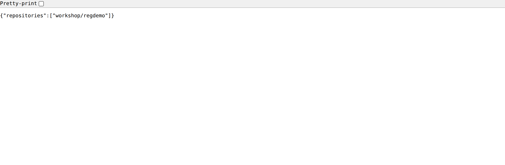

## 8. ลบชื่อ local แล้ว pull กลับมา run

จุดสำคัญ: ถ้าไม่ลบชื่อ local ทิ้งก่อน `docker pull` จะไม่ได้พิสูจน์อะไรเลย เพราะ image ยังอยู่ในเครื่อง

```bash
docker image rm regdemo:1.0 localhost:5000/workshop/regdemo:1.0
docker images | grep regdemo || echo "(ไม่เหลือ regdemo ในเครื่องแล้ว)"
```

> 📝 **คำอธิบาย:** `docker image rm` (ย่อว่า `docker rmi`) รับได้หลายชื่อพร้อมกัน · เราลบ**ทั้งสองชื่อ** เพื่อให้ image ก้อนนั้นไม่เหลือชื่อใด ๆ Docker จึงลบก้อนจริงทิ้ง · `|| echo ...` คือกันไม่ให้ `grep` ที่หาไม่เจอทำให้สับสน — เห็นข้อความไทยแปลว่าเกลี้ยงจริง

✅ **Expected output** — สังเกตว่ามี `Untagged:` **สองบรรทัด** แล้วจึงมี `Deleted:` **หนึ่งบรรทัด** (ลบชื่อครบทุกชื่อ ก้อนจึงถูกลบ — เดี๋ยวข้อ 11 จะเจาะเรื่องนี้อีกที):

```
Untagged: regdemo:1.0
Untagged: localhost:5000/workshop/regdemo:1.0
Deleted: sha256:46671988cbe09ac29df40a6f182b054cb091f114ec9c7b62fbb8b4be871c6df4

(ไม่เหลือ regdemo ในเครื่องแล้ว)
```

ดึงกลับมาจาก registry แล้วรันจริง :

```bash
docker pull localhost:5000/workshop/regdemo:1.0
docker run -d --name regdemo-web -p 8185:80 localhost:5000/workshop/regdemo:1.0
curl -s http://localhost:8185/ | grep -E "RELEASE 1.0|BUILD 1"
```

> 📝 **คำอธิบาย:** `docker pull` ดาวน์โหลด manifest + layers ที่ขาดจาก registry · บรรทัด `Digest: sha256:...` ที่ pull รายงานกลับมา **ต้องตรงกับ D1** เพราะเป็น image ก้อนเดิม · `-p 8185:80` ยิงพอร์ต 8185 ของ**เครื่องเรียน**เข้า 80 (nginx) ในคอนเทนเนอร์ ซึ่งต่อกับ `-p 8185:8185` ที่เราตั้งไว้ตั้งแต่ข้อ 0 ทำให้เบราว์เซอร์บนเครื่องเราเข้า `http://localhost:8185` ได้ · `grep -E "RELEASE 1.0|BUILD 1"` ยืนยันเนื้อหาหน้าเว็บด้วยข้อความ ไม่ต้องเปิดเบราว์เซอร์ก็รู้ผล

✅ **Expected output** — `Status: Downloaded newer image ...` = ดึงมาจาก registry จริง แล้ว curl เห็นข้อความของรุ่น 1:

```
1.0: Pulling from workshop/regdemo
202431b9ce11: Pull complete
Digest: sha256:46671988cbe09ac29df40a6f182b054cb091f114ec9c7b62fbb8b4be871c6df4
Status: Downloaded newer image for localhost:5000/workshop/regdemo:1.0
localhost:5000/workshop/regdemo:1.0

      <h1 id="release-title">RELEASE 1.0</h1>
      <span class="badge">BUILD 1</span>
```

เปิดเบราว์เซอร์บนเครื่องเราที่ **`http://localhost:8185`** จะเห็นหน้านี้ :

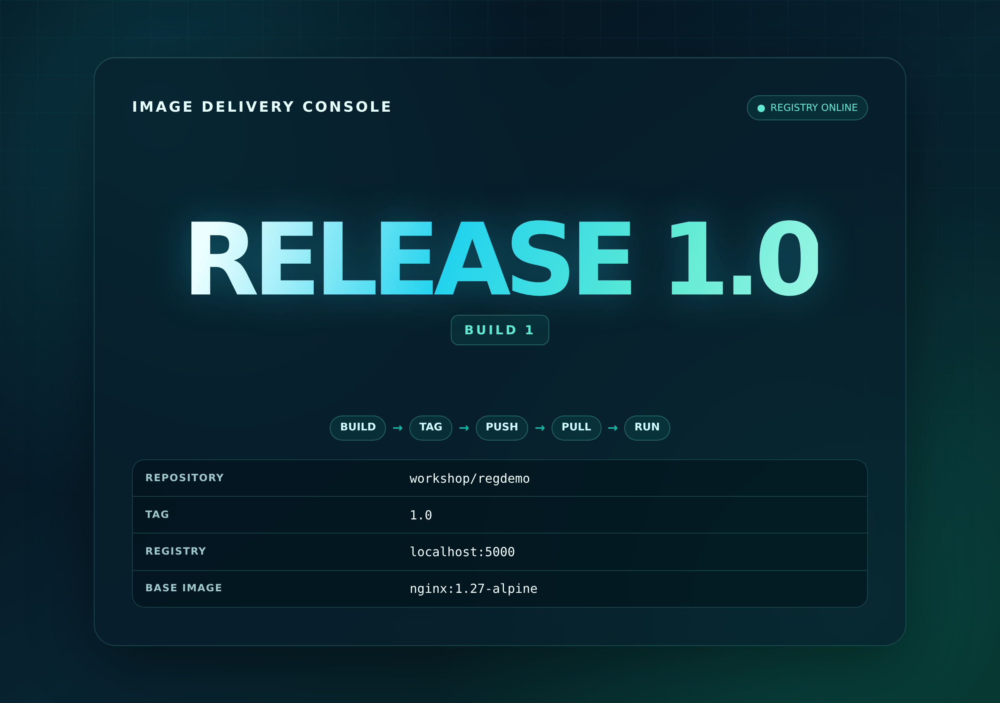

> **หยุดคิดสักครู่:** ตอนนี้เราปิดวงจรครบแล้ว — **build → tag → push → (ลบทิ้ง) → pull → run** และข้อสำคัญคือ registry **ไม่ได้รัน container ให้เรา** มันแค่ "เก็บและส่งต่อ" ไฟล์ image เท่านั้น คนที่รันคือ Docker daemon ในเครื่องปลายทาง

## 9. สร้างรุ่นที่ 2 แล้ว push ทับ tag `1.0`

**ทายก่อน:** ถ้าเรา push image คนละก้อนขึ้นไปด้วย tag `1.0` เดิม — registry จะปฏิเสธ, สร้าง tag ใหม่, หรือย้าย tag เดิมไปชี้ของใหม่?

```bash
docker build --build-arg SITE_DIR=site_v2 --build-arg RELEASE=2.0 -t regdemo:2.0 .
docker images | grep regdemo
docker tag regdemo:2.0 localhost:5000/workshop/regdemo:1.0
docker push localhost:5000/workshop/regdemo:1.0
```

> 📝 **คำอธิบาย:** `--build-arg SITE_DIR=site_v2` เปลี่ยนค่า `ARG` ใน Dockerfile ให้ `COPY` หยิบเว็บอีกชุด — Dockerfile ใบเดิม ผลลัพธ์คนละหน้าตา · `--build-arg RELEASE=2.0` แค่ไปเปลี่ยน `LABEL release` เท่านั้น (metadata) · บรรทัดที่สองคือหัวใจของบทเรียน: เราเอา **tag `1.0` เดิม** ไปแปะทับให้ชี้ image รุ่น 2 — Docker ไม่เตือนอะไรเลย · ระหว่าง push ให้จับตาคำว่า **`Layer already exists`**

✅ **Expected output** — สองแถวบนคือผล `docker images | grep regdemo` **ก่อน** สั่ง `docker tag` (ยังเป็นคนละ ID: `46671988cbe0` กับ `dfe0e5478b18` — ตัวอักษร `U` ท้ายแถวของ Docker 29 แปลว่า *in use* คือมี container ใช้อยู่) ส่วนท่อนล่างคือผล push : layer ที่ registry มีอยู่แล้ว (base nginx ทั้งหมด) ขึ้น `Layer already exists` มีแค่ layer ของเว็บชุดใหม่ที่ `Pushed` และได้ digest ตัวใหม่ (เรียกว่า **D2**):

```
localhost:5000/workshop/regdemo:1.0   46671988cbe0       73.6MB           21MB   U
regdemo:2.0                           dfe0e5478b18       73.6MB           21MB

The push refers to repository [localhost:5000/workshop/regdemo]
f18232174bc9: Layer already exists
61ca4f733c80: Layer already exists
        ... (layer ฐานทั้งหมดขึ้น Layer already exists) ...
e68542110cc8: Pushed
e69f88d81eb6: Pushed
d7e507024086: Layer already exists
1.0: digest: sha256:dfe0e5478b18341e4ff0c5c23e28e419e3332cd1f3f3c46604113fc3e751ac59 size: 856
```

> **เฉลย:** registry **ย้าย tag เดิมไปชี้ image ใหม่** โดยไม่ถามอะไรเลย และ **image เก่ายังอยู่ครบ** เพียงแต่ไม่มี tag ชี้ถึงแล้ว — เข้าถึงได้ทางเดียวคือผ่าน digest

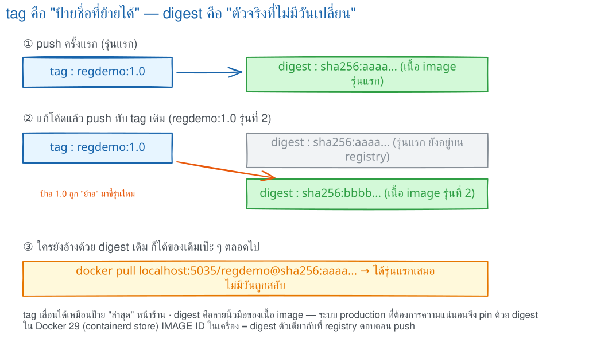

> 🖼 **วิธีอ่านรูปนี้:** ตามลำดับ ①–③ จะเห็น tag `1.0` ย้ายจาก `aaaa…` ไป `bbbb…` แต่ก้อนเดิมยังอยู่ · ในข้อ 9 ให้แทนสองค่านี้ด้วย digest จริงสองตัวของเราเอง · ข้อ 10 จะตรวจเส้นทางผ่าน tag เทียบกับการระบุรุ่นแรกด้วย `@sha256:` โดยตรง

ตรวจกับ registry ว่า tag `1.0` ตอนนี้ชี้ไปที่ไหน :

```bash
curl -sI -H "Accept: application/vnd.oci.image.index.v1+json,application/vnd.docker.distribution.manifest.v2+json" \
  http://localhost:5000/v2/workshop/regdemo/manifests/1.0 | grep -i "docker-content-digest"
curl -s http://localhost:5000/v2/workshop/regdemo/tags/list
```

✅ **Expected output** — digest เปลี่ยนจาก D1 (`4667…`) เป็น D2 (`dfe0…`) ทั้งที่ชื่อ tag เท่าเดิม และรายการ tag ก็ยังมีแค่ `1.0` ตัวเดียว:

```
Docker-Content-Digest: sha256:dfe0e5478b18341e4ff0c5c23e28e419e3332cd1f3f3c46604113fc3e751ac59
{"name":"workshop/regdemo","tags":["1.0"]}
```

ล้างของเก่าในเครื่องแล้ว pull ด้วย **tag เดิม** ดูว่าได้อะไรกลับมา :

```bash
docker rm -f regdemo-web
docker image rm -f localhost:5000/workshop/regdemo:1.0 regdemo:2.0
docker pull localhost:5000/workshop/regdemo:1.0
docker run -d --name regdemo-web -p 8185:80 localhost:5000/workshop/regdemo:1.0
curl -s http://localhost:8185/ | grep -E "RELEASE 2.0|BUILD 2"
```

> 📝 **คำอธิบาย:** ต้อง `docker rm -f regdemo-web` ก่อน เพราะพอร์ต 8185 ยังถูกคอนเทนเนอร์เดิมจองอยู่ (ไม่งั้นจะเจอ `port is already allocated`) · `docker image rm -f` บังคับถอดชื่อทั้งสองออกให้หมด เพื่อให้ `docker pull` ต้องดึงของจริงมาใหม่จริง ๆ

✅ **Expected output** — pull ด้วย **tag เดิมเป๊ะ** แต่ได้ digest ใหม่ และหน้าเว็บกลายเป็น **RELEASE 2.0**:

```
1.0: Pulling from workshop/regdemo
e69f88d81eb6: Pull complete
Digest: sha256:dfe0e5478b18341e4ff0c5c23e28e419e3332cd1f3f3c46604113fc3e751ac59
Status: Downloaded newer image for localhost:5000/workshop/regdemo:1.0
localhost:5000/workshop/regdemo:1.0

      <h1 id="release-title">RELEASE 2.0</h1>
      <span class="badge">BUILD 2</span>
```

รีเฟรช `http://localhost:8185` บนเบราว์เซอร์ — **คำสั่ง `docker pull` เหมือนเดิมทุกตัวอักษร แต่ได้คนละหน้า** :

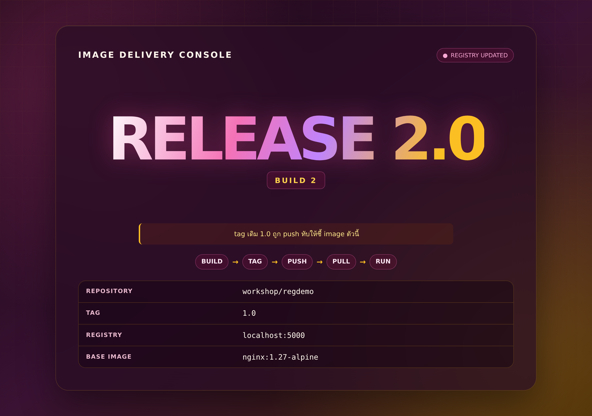

## 10. Pull ด้วย digest — ของเก่าไม่มีวันเปลี่ยน

**คำถาม:** image รุ่น 1 หายไปจาก registry แล้วหรือยัง ในเมื่อไม่มี tag ชี้ถึงมันอีกแล้ว?

```bash
docker pull localhost:5000/workshop/regdemo@sha256:46671988cbe09ac29df40a6f182b054cb091f114ec9c7b62fbb8b4be871c6df4
docker images | grep regdemo
docker run -d --name regdemo-old -p 8085:80 \
  localhost:5000/workshop/regdemo@sha256:46671988cbe09ac29df40a6f182b054cb091f114ec9c7b62fbb8b4be871c6df4
curl -s http://localhost:8085/ | grep -E "RELEASE"
curl -s http://localhost:8185/ | grep -E "RELEASE"
```

> 📝 **คำอธิบาย:** เปลี่ยน `:1.0` เป็น `@sha256:<D1>` — ให้ใส่ **digest ที่ registry ตอบกลับตอน push ครั้งแรกในเครื่องของคุณเอง** ไม่ใช่ค่าจากเอกสารนี้ (ถ้าเก็บไว้ในตัวแปรตามข้อ 6 ก็สั่ง `docker pull "$D1"` ได้เลย) · ใช้พอร์ต **8085** เพื่อไม่ชนกับ 8185 ที่รุ่น 2 ครองอยู่ — พอร์ตนี้ไม่ได้ publish ออกไปนอกเครื่องเรียน จึงดูได้ด้วย `curl` จากใน SSH (อยากดูในเบราว์เซอร์ก็ `docker rm -f regdemo-web` ก่อนแล้วรันตัวเก่าที่ `-p 8185:80` แทน) · **ข้อควรระวัง:** image ที่อ้างด้วย digest จะไม่มี tag — ใน `docker images` จะโผล่เป็นแถวชื่อยาว `repo@sha256:...`

✅ **Expected output** — **หลักฐานชี้ขาดของแล็บนี้**: repository เดียวกัน registry เดียวกัน แต่ digest ต่างกัน → ได้คนละ image คนละหน้าเว็บ:

```
localhost:5000/workshop/regdemo@sha256:4667...: Pulling from workshop/regdemo
Digest: sha256:46671988cbe09ac29df40a6f182b054cb091f114ec9c7b62fbb8b4be871c6df4
Status: Downloaded newer image for localhost:5000/workshop/regdemo@sha256:4667...

localhost:5000/workshop/regdemo:1.0                     dfe0e5478b18   73.6MB   21MB   U
localhost:5000/workshop/regdemo@sha256:46671988cbe0...  46671988cbe0   73.6MB   21MB

      <h1 id="release-title">RELEASE 1.0</h1>      ← พอร์ต 8085 : อ้างด้วย digest เก่า
      <h1 id="release-title">RELEASE 2.0</h1>      ← พอร์ต 8185 : อ้างด้วย tag 1.0
```

| อ้างด้วย | เขียนว่า | พรุ่งนี้ได้ของเดิมไหม | เหมาะกับ |
|---|---|---|---|
| **Tag** | `repo:1.0` | **ไม่รับประกัน** — เจ้าของ repo push ทับเมื่อไหร่ก็ได้ | งานพัฒนา อ่านง่าย สื่อความหมาย |
| **Digest** | `repo@sha256:…` | **ได้เหมือนเดิมเสมอ** เพราะคำนวณจากเนื้อหา | production / CI ที่ต้อง reproducible |

> **ทำไม `latest` ไม่ได้แปลว่าใหม่ที่สุด:** `latest` เป็นเพียง tag ธรรมดาตัวหนึ่งที่ Docker เติมให้เมื่อเราไม่ระบุ tag ใครก็ตามที่มีสิทธิ์ push สามารถชี้ `latest` ไปที่ image เก่าเมื่อปีที่แล้วได้ทันที และ Docker จะไม่เตือนอะไรเลย เวลา deploy จึงควรใช้ **version tag** เป็นอย่างน้อย และเมื่อต้องการความแน่นอนสูงสุดให้ **pin ด้วย digest**

## 11. `docker rmi` — `Untagged` ต่างจาก `Deleted` อย่างไร

```bash
docker tag localhost:5000/workshop/regdemo:1.0 regdemo:2.0
docker images | grep regdemo
docker rmi regdemo:2.0
```

> 📝 **คำอธิบาย:** เราแปะชื่อที่สองให้ image รุ่น 2 ก่อน (ตอนนี้ก้อนนั้นมี 2 ชื่อ) แล้วลบไปหนึ่งชื่อ · กติกาคือ: **`docker rmi` ลบ "ชื่อ" ก่อนเสมอ** และจะลบ "ก้อน" ก็ต่อเมื่อชื่อสุดท้ายหายไปและไม่มี container ใดใช้อยู่

✅ **Expected output** — มีแต่ `Untagged:` **ไม่มี `Deleted:`** เพราะยังมีชื่อ `localhost:5000/workshop/regdemo:1.0` ชี้ก้อนนี้อยู่:

```
localhost:5000/workshop/regdemo:1.0                     dfe0e5478b18   73.6MB   21MB   U
localhost:5000/workshop/regdemo@sha256:46671988cbe0...  46671988cbe0   73.6MB   21MB   U
regdemo:2.0                                             dfe0e5478b18   73.6MB   21MB   U

Untagged: regdemo:2.0
```

ทีนี้ลองลบ **ชื่อสุดท้าย** ของ image รุ่น 1 (ซึ่งเหลือแค่ชื่อแบบ digest ชื่อเดียว) :

```bash
docker system df
docker rm -f regdemo-old
docker rmi localhost:5000/workshop/regdemo@sha256:46671988cbe09ac29df40a6f182b054cb091f114ec9c7b62fbb8b4be871c6df4
docker system df
```

> 📝 **คำอธิบาย:** ต้อง `docker rm -f regdemo-old` ก่อน เพราะยังมี container ใช้ image นั้นอยู่ — ถ้าไม่ลบจะเจอ `image is being used by running container` · เทียบ `docker system df` ก่อน/หลังเพื่อดูว่าจำนวน image ลดลงจริงไหม

✅ **Expected output** — คราวนี้ได้ **ทั้ง `Untagged:` และ `Deleted:`** และ `Images TOTAL` ลดจาก 3 → 2:

```
TYPE            TOTAL     ACTIVE    SIZE      RECLAIMABLE
Images          3         3         111.1MB   0B (0%)      ← ก่อนลบ

regdemo-old
Untagged: localhost:5000/workshop/regdemo@sha256:46671988cbe09ac29df40a6f182b054cb091f114ec9c7b62fbb8b4be871c6df4
Deleted: sha256:46671988cbe09ac29df40a6f182b054cb091f114ec9c7b62fbb8b4be871c6df4

TYPE            TOTAL     ACTIVE    SIZE      RECLAIMABLE
Images          2         2         111MB     0B (0%)      ← หลังลบ
```

> 📝 **ทำไม SIZE ลดนิดเดียว (111.1MB → 111MB)?** เพราะ image สองรุ่นนี้ใช้ **layer ของ `nginx:1.27-alpine` ร่วมกัน** ต่างกันแค่ layer ของไฟล์ HTML ไม่กี่กิโลไบต์ พื้นที่ที่คืนมาจึงเท่ากับ layer ที่ **ไม่มีใครใช้ต่อแล้ว** เท่านั้น — นี่คือประโยชน์ของ layer sharing ที่เรียนมาตั้งแต่ LAB 2
>
> **หมายเหตุ:** image ตัวนี้ยังอยู่บน registry นะ — ที่เราลบคือสำเนาในเครื่องเรียนเท่านั้น สั่ง `docker pull` ด้วย digest เดิมก็ได้กลับมาอีก

## 12. Docker Hub — เตรียม Personal Access Token และวงจร push จริง

> ⚠️ **หัวข้อนี้เป็นเอกสารประกอบ ไม่ต้องทำในคาบ** — แล็บใช้ local registry เพื่อไม่ต้องผูกบัญชีจริงของใคร ทุกที่ที่เห็น `<DOCKER_USER>` และ `<DOCKER_TOKEN>` ให้แทนด้วยค่าของตัวเองตอนใช้งานจริง **ห้ามพิมพ์ค่าจริงลงเอกสาร Git หรือ chat** ภาพประกอบด้านล่างถูกปิดทับข้อมูลบัญชีไว้แล้ว

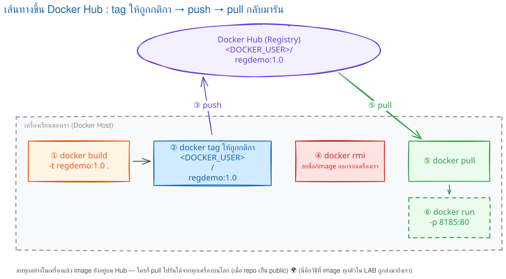

> 🖼 **วิธีอ่านรูปนี้:** ตามหมายเลข ①–⑥ ในรูป: build → ติดชื่อ `<DOCKER_USER>/regdemo:1.0` ให้ถูกกติกา → push ขึ้น Docker Hub → `rmi` ลบของในเครื่อง → pull กลับมา → run ที่ `-p 8185:80` ได้เหมือนเดิม แสดงว่า Hub แยกจาก local image store · ขั้น ①–⑥ ในรูปเทียบได้กับขั้นตอน 1)–5) ใน code block ด้านล่าง (รูปแยก pull กับ run เป็นคนละขั้น) · อย่าลืม logout เมื่อจบ

**ขั้นตอน 1 — เปิด Docker Hub แล้วกด Sign in** · เข้า `hub.docker.com` แล้ว **ตรวจ domain ในแถบที่อยู่ก่อนเสมอ** เพื่อกันการกรอกข้อมูลในเว็บปลอม จากนั้นกด **Sign in** มุมขวาบน (ยังไม่มีบัญชีให้กด **Sign up** ก่อน)

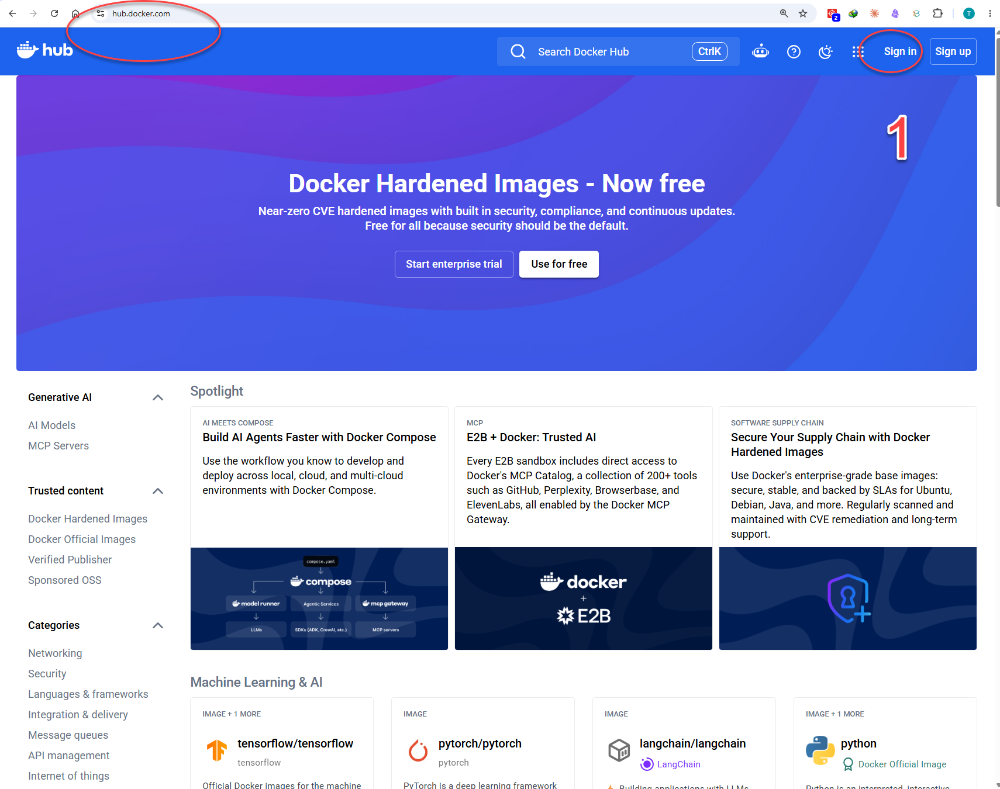

**ขั้นตอน 2 — ยืนยันตัวตนผ่านหน้าเว็บ** · กรอกรหัสผ่านหรือใช้ผู้ให้บริการที่ผูกไว้ แล้วกด **Continue** — ย้ำว่านี่คือการ login **หน้าเว็บ** เพื่อจัดการบัญชี ยังไม่ใช่ `docker login` ที่ให้สิทธิ์ CLI

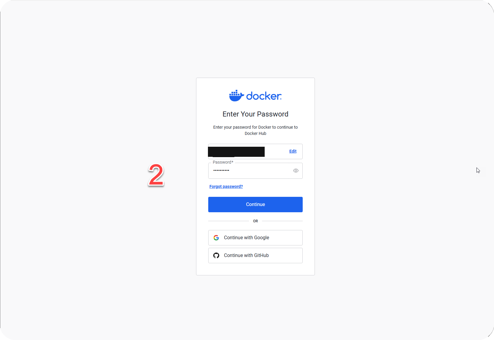

**ขั้นตอน 3 — เข้าหน้า My Hub แล้วคลิก avatar** · หลัง login จะเข้าสู่ **My Hub → Repositories** ซึ่งบอกว่าเราอยู่ใน namespace ไหน (ชื่อนี้แหละที่ต้องเอาไปตั้งเป็นชื่อ image) จากนั้นคลิก avatar มุมขวาบน

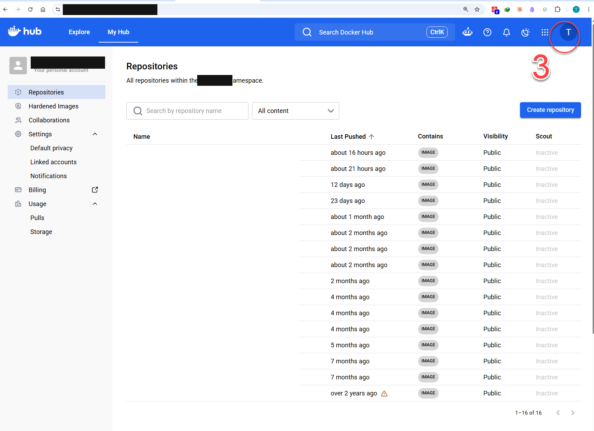

**ขั้นตอน 4 — เลือก Account settings** · เมนูนี้คือการตั้งค่า **บัญชี** ซึ่งคนละอันกับ Settings ในหน้า repository (อันนั้นตั้งค่าตัว repository ไม่ใช่ credential ของ CLI)

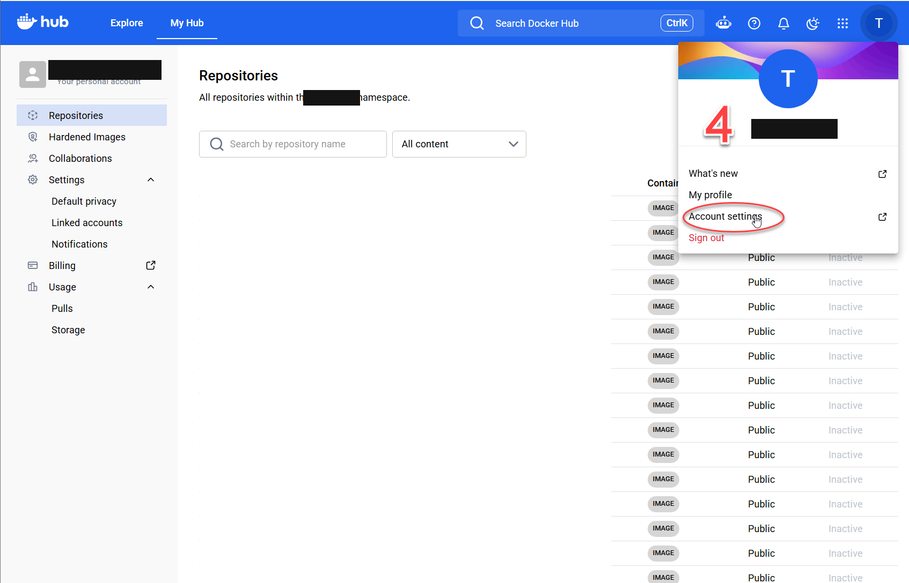

**ขั้นตอน 5 — เปิด Personal access tokens แล้วกด Generate new token** · ควรสร้าง token **แยกตามเครื่องหรือตามงาน** เพื่อให้ revoke ทีละตัวได้โดยไม่กระทบระบบอื่น

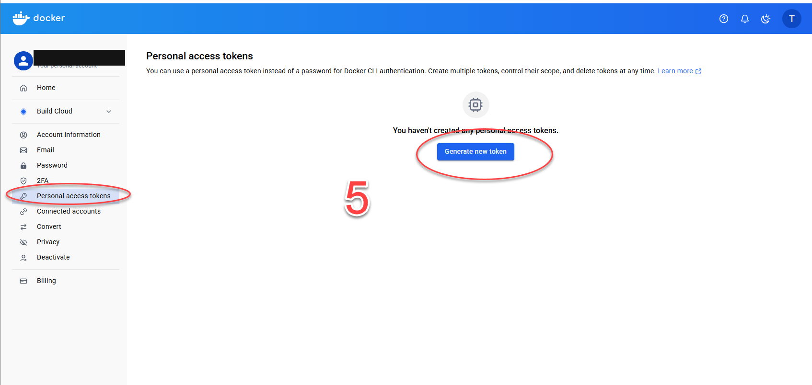

**ขั้นตอน 6 — ตั้งรายละเอียดและสิทธิ์ของ token** · ตั้ง **description** ให้สื่อว่าใช้ที่เครื่องไหน/งานอะไร · ตั้ง **Expiration date** ตามอายุงานแทนการเลือกไม่หมดอายุ · เลือกสิทธิ์ตามหลัก **least privilege** — ถ้าแค่ pull ให้เลือก **Read-only**, ต้อง push ค่อยใช้ **Read & Write**, และอย่าให้สิทธิ์ **Delete** ถ้า workflow ไม่ได้ต้องลบ

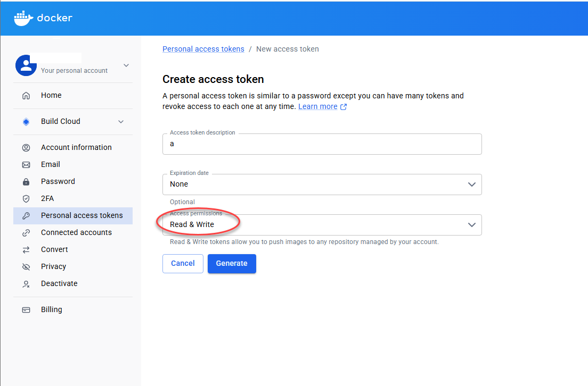

**ขั้นตอน 7 — คัดลอก token (แสดงครั้งเดียวเท่านั้น)** · กด **Copy** แล้วเก็บใน password/secret manager ทันที เพราะออกจากหน้านี้แล้วเรียกดูค่าเดิมไม่ได้ ทำหายให้ revoke ตัวเก่าแล้วสร้างใหม่
**ห้ามวาง token ลงใน** Dockerfile, HTML, source code, Git, screenshot, chat หรือคำสั่งที่ถูกบันทึกลง shell history

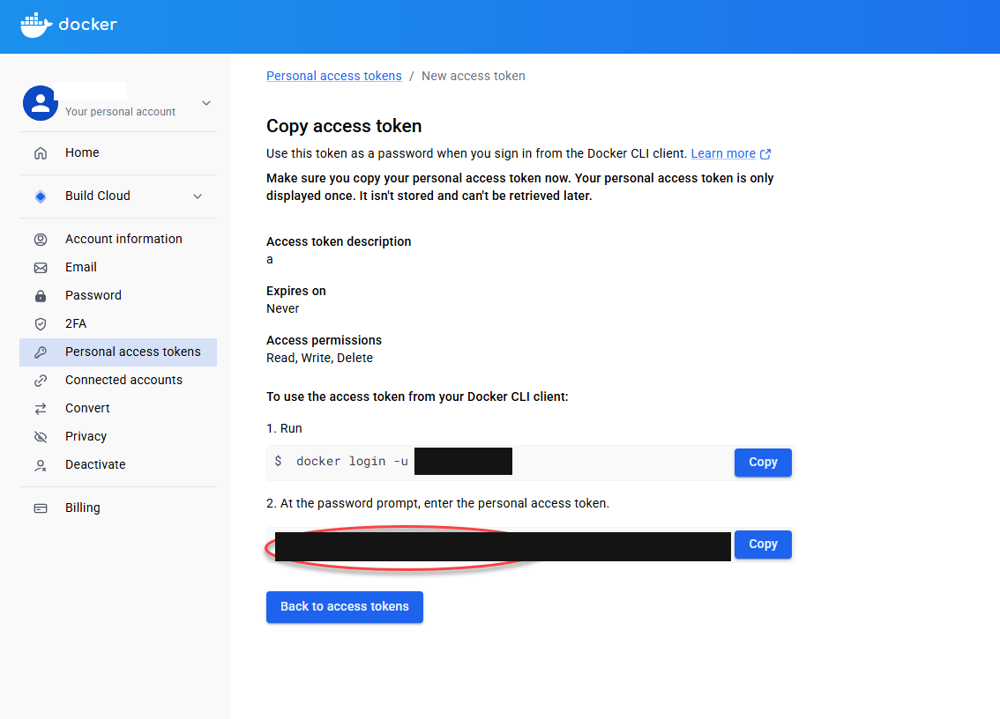

เมื่อได้ `<DOCKER_USER>` และ `<DOCKER_TOKEN>` แล้ว วงจรทำงานคือ :

```bash
# 1) login — เมื่อขึ้น Password: ให้ "วาง" token ค่าจะไม่แสดงบนหน้าจอ
docker login --username '<DOCKER_USER>'

# 2) ตั้งชื่อ image ให้ namespace ตรงกับบัญชีที่ login
#    (ชื่อทางซ้ายต้องเป็น image ที่มีอยู่จริงในเครื่อง — ชื่อ regdemo:1.0 ถูกลบไปตั้งแต่ข้อ 8 แล้ว
#     จึงใช้ชื่อที่ยังเหลืออยู่แทน หรือจะ build ใหม่ด้วย docker build -t regdemo:1.0 . ก่อนก็ได้)
docker tag localhost:5000/workshop/regdemo:1.0 <DOCKER_USER>/regdemo:1.0

# 3) push แล้วดู digest ที่ตอบกลับ
docker push <DOCKER_USER>/regdemo:1.0

# 4) พิสูจน์: ลบชื่อ Docker Hub ทิ้ง แล้วดึงกลับมารัน
docker image rm <DOCKER_USER>/regdemo:1.0
docker pull <DOCKER_USER>/regdemo:1.0
docker rm -f regdemo-web 2>/dev/null    # คืนพอร์ต 8185 ก่อน ไม่งั้นเจอ port is already allocated
docker run --rm -d -p 8185:80 <DOCKER_USER>/regdemo:1.0

# 5) เครื่องที่ใช้ร่วมกับคนอื่น ให้ logout ทุกครั้ง
docker logout
```

> 📝 **คำอธิบาย:** เกณฑ์ผ่านคือ login สำเร็จ (`Login Succeeded`), namespace ตรงกับบัญชี, push แสดง digest, หน้า **Tags** ของ repository เห็น tag ที่เพิ่ง push และ image ที่ pull กลับมารันได้ · **ห้ามพิมพ์ token ต่อท้ายคำสั่งเด็ดขาด** (เช่น `docker login -u ... -p <token>`) เพราะมันจะถูกบันทึกลง `~/.bash_history` · ถ้าจำเป็นต้องอัตโนมัติให้ใช้ `--password-stdin` · **ข้อผิดพลาดที่เจอบ่อยที่สุด** คือลืมข้อ 2 แล้วสั่ง `docker push regdemo:1.0` ตรง ๆ ซึ่งจะวิ่งไป `docker.io/library/` ที่เราไม่มีสิทธิ์ จึงถูกปฏิเสธด้วย `push access denied … insufficient_scope`

## 13. ตรวจงานอัตโนมัติด้วย `verify.sh`

```bash
cd ~/labwork/DevTools/02_Docker/02_Dockerfile_Build_Run_Compose_Guide/005_LAB_Registry_Tag_Push_Pull
./verify.sh
```

> 📝 **คำอธิบาย:** สคริปต์ตรวจว่า (1) ไฟล์ครบ (2) `lab-registry` ยังรันอยู่ (3) catalog มี `workshop/regdemo` (4) มี tag `1.0` (5) มี image ในเครื่อง (6) รัน image แล้วหน้าเว็บตอบจริง และ (7) `docker tag` ไม่ได้สำเนา image · สคริปต์สร้าง container ชั่วคราวชื่อ `regdemo-verify` และชื่อ tag ชั่วคราว `regdemo:verify-tmp` แล้ว **เก็บกวาดของตัวเองทั้งหมด** ไม่แตะ image หรือ registry ของเรา

✅ **Expected output** — ต้องขึ้น `[PASS]` ครบทุกข้อและปิดท้ายด้วย `ALL CHECKS PASSED` (exit code 0):

```
[PASS] พบไฟล์ Dockerfile
[PASS] พบไฟล์ site/index.html
[PASS] พบไฟล์ site_v2/index.html
[PASS] คอนเทนเนอร์ lab-registry กำลังทำงาน
[PASS] registry catalog มี repository workshop/regdemo
[PASS] repository workshop/regdemo มี tag 1.0
[PASS] พบ image localhost:5000/workshop/regdemo:1.0 ในเครื่อง
[PASS] รัน image ชั่วคราวแล้วหน้าเว็บมีคำว่า RELEASE
[PASS] docker tag เพิ่มชื่อใหม่โดยไม่สำเนา image (IMAGE ID ตรงกัน)
ALL CHECKS PASSED
```

## แก้ปัญหาที่พบบ่อย

| อาการ | สาเหตุ | วิธีแก้ |
|---|---|---|
| `push access denied ... insufficient_scope` ตอน push | ชื่อ image ไม่มี registry นำหน้า Docker จึงส่งไป `docker.io/library/` ที่เราไม่มีสิทธิ์ | `docker tag <ชื่อเดิม> localhost:5000/workshop/<repo>:<tag>` แล้ว push ชื่อใหม่ |
| `http: server gave HTTP response to HTTPS client` | push/pull ไปที่ registry ที่พูด **HTTP ธรรมดา** แต่ไม่ใช่ปลายทาง loopback — Docker ต่อ registry ด้วย **HTTPS เสมอ** ยกเว้น host ที่เป็น `localhost` / `127.0.0.0/8` ซึ่งยอมให้เป็น HTTP ได้โดยปริยาย (แล็บนี้จึงใช้ `localhost:5000` ได้เลยโดยไม่ต้องตั้งค่าอะไร) | ในแล็บ: อ้าง registry ด้วย `localhost:5000` เท่านั้น (อย่าเปลี่ยนไปใช้ IP ของเครื่องหรือชื่อโฮสต์) · ถ้าจำเป็นต้องต่อ registry HTTP ที่โฮสต์อื่นจริง ๆ ต้องประกาศไว้ที่ daemon เอง เช่นใส่ `{"insecure-registries": ["myhost:5000"]}` ใน `/etc/docker/daemon.json` แล้ว restart dockerd — **ใช้กับเครือข่ายทดลองเท่านั้น** เพราะปิดการตรวจใบรับรอง ของจริงให้ตั้ง TLS + authentication ให้ registry |
| `Cannot connect to the Docker daemon` | dockerd ข้างในเครื่องเรียนยังไม่ตื่นหลัง `docker run` | รอ 10–20 วินาทีแล้วลองใหม่ · ตรวจว่าเปิด container ด้วย `--privileged` |
| `Bind for 0.0.0.0:8185 failed: port is already allocated` | คอนเทนเนอร์เดิม (เช่น `regdemo-web`) ยังจองพอร์ตอยู่ | `docker rm -f regdemo-web` ก่อน แล้วค่อย `docker run` ใหม่ |
| `curl: (7) Failed to connect to localhost port 5000` | `lab-registry` ไม่ได้รันอยู่ หรือรันแล้ว exit | `docker ps -a --filter name=lab-registry` · `docker logs lab-registry` · ถ้าตายให้ `docker rm -f lab-registry` แล้วเปิดใหม่ |
| `manifest unknown` ตอนขอ manifest ด้วย curl | สะกด repository/tag ผิด หรือลืมส่ง header `Accept` ที่ตรงชนิด manifest | ตรวจชื่อจาก `/v2/_catalog` และ `/v2/<repo>/tags/list` ก่อน · ใส่ `-H "Accept: application/vnd.oci.image.index.v1+json,application/vnd.docker.distribution.manifest.v2+json"` |
| `image is being used by running container` ตอน `docker rmi` | ยังมี container (แม้จะหยุดแล้ว) ที่สร้างจาก image นั้น | `docker ps -a --filter ancestor=<image>` หา แล้ว `docker rm -f <container>` ก่อน |
| สั่ง `docker rmi` แล้วขึ้นแค่ `Untagged:` พื้นที่ไม่ลด | image ก้อนนั้นยังมีชื่ออื่นชี้อยู่ — ลบไปแค่ป้ายชื่อใบเดียว | `docker images | grep <ID>` ดูว่าเหลือกี่ชื่อ แล้วลบให้ครบ จึงจะเห็น `Deleted:` |
| pull แล้วได้หน้าเว็บคนละรุ่นกับที่คิด | tag ถูก push ทับให้ชี้ image ใหม่ (บทเรียนข้อ 9) | ตรวจ `Docker-Content-Digest` ของ tag ก่อน · ถ้าต้องการรุ่นเดิมเป๊ะให้ pull ด้วย `@sha256:...` |
| เบราว์เซอร์เปิด `localhost:5000` ไม่ขึ้น | `5000` เป็นพอร์ตของ **เครื่องเรียน** เครื่องเราต้องเข้าทาง `5035` ที่ publish ไว้ | ใช้ `http://localhost:5035/v2/_catalog` บนเบราว์เซอร์ · ใน SSH ใช้ `http://localhost:5000` |

## เก็บกวาด (Cleanup)

ลบของที่สร้างในแล็บนี้ (ทำ **ข้างในเครื่องเรียน**) :

```bash
docker rm -f regdemo-web regdemo-old 2>/dev/null
docker rm -f lab-registry
docker ps -a
```

> 📝 **คำอธิบาย:** ลบเว็บก่อน แล้วค่อยลบ registry · **ข้อมูลใน registry เก็บอยู่ในตัว container** (ไม่ได้ผูก volume) ดังนั้นลบ `lab-registry` = image ที่ push ไว้หายไปด้วย ซึ่งตั้งใจให้เป็นแบบนั้นสำหรับห้องเรียน · ส่วน image ในเครื่อง (`localhost:5000/workshop/regdemo:1.0`, `registry:2`) ยังอยู่ — อยากคืนพื้นที่ก็ `docker rmi` เพิ่มได้

ออกจากเครื่องเรียนแล้วลบ container ของแล็บ (ทำ **บนเครื่องเรา**) :

```bash
exit
docker rm -f devtools-df-lab5
docker ps -a --filter "name=^devtools-"
```

✅ **Expected output** — บรรทัดแรกคือชื่อ container ที่ถูกลบ แล้วตารางสุดท้ายเหลือแค่หัวตาราง (ถ้ายังทำแล็บอื่นค้างอยู่ จะเห็นแถวของแล็บนั้น ๆ ซึ่งไม่ต้องลบ):

```
devtools-df-lab5
CONTAINER ID   IMAGE     COMMAND   CREATED   STATUS    PORTS     NAMES
```

## สรุปคำสั่งของแล็บนี้

| คำสั่ง | ความหมาย |
|---|---|
| `docker run -d --name lab-registry -p 5000:5000 registry:2` | เปิด local registry (Distribution Registry) ที่พอร์ต 5000 ของเครื่องเรียน |
| `docker build -t regdemo:1.0 .` | build image ตั้งชื่อแบบ local (ไม่มี registry นำหน้า) |
| `docker build --build-arg SITE_DIR=site_v2 --build-arg RELEASE=2.0 -t regdemo:2.0 .` | build อีกรุ่นจาก Dockerfile ใบเดิม โดยเปลี่ยนค่า `ARG` |
| `docker tag <เดิม> localhost:5000/workshop/regdemo:1.0` | **เพิ่มชื่อ** ให้ image เดิมให้ตรงกับ registry ปลายทาง (ไม่สำเนา layers) |
| `docker push localhost:5000/workshop/regdemo:1.0` | ส่ง manifest + เฉพาะ layer ที่ registry ยังไม่มี แล้วตอบ digest กลับมา |
| `docker pull localhost:5000/workshop/regdemo:1.0` | ดึง image ตาม **tag** — ได้ของที่ tag ชี้อยู่ ณ ขณะนั้น |
| `docker pull localhost:5000/workshop/regdemo@sha256:<digest>` | ดึง image ตาม **digest** — ได้ของเดิมเสมอ ไม่ขึ้นกับว่า tag ถูกย้ายไปไหน |
| `docker image inspect --format "{{.Id}}" <ชื่อ>` | อ่าน IMAGE ID เพื่อพิสูจน์ว่าสองชื่อชี้ก้อนเดียวกัน (ใช้ `{{.RepoDigests}}` เพื่ออ่านชื่อแบบ `repo@sha256:...`) |
| `curl -s http://localhost:5000/v2/_catalog` · `.../v2/<repo>/tags/list` | ถาม registry ว่ามี repository อะไรบ้าง และ repository นั้นมี tag อะไร |
| `curl -sI -H "Accept: ..." .../v2/<repo>/manifests/<tag>` | ดูหัว `Docker-Content-Digest` ว่า tag นี้ชี้ digest ไหน |
| `docker rmi <ชื่อ>` | ลบ **ชื่อ** ก่อน — `Untagged:` เฉย ๆ ถ้ายังมีชื่ออื่นเหลือ, `Deleted:` เมื่อลบชื่อสุดท้าย |
| `docker system df` | สรุปพื้นที่ ใช้ตรวจว่า tag ไม่ได้ทำให้ image เพิ่ม และ `Deleted` คืนพื้นที่จริง |
| `docker login --username '<DOCKER_USER>'` / `docker logout` | เข้า/ออกจากบัญชี registry ภายนอก (วาง token ที่ prompt เท่านั้น) |
| `docker rm -f lab-registry` | จบแล็บ — ลบ registry ทิ้ง |

> จำสั้น ๆ : **image = ก้อนข้อมูล (ID/digest)** · **tag = ป้ายชื่อที่ย้ายได้** · **registry = ที่ฝากส่ง ไม่ใช่ที่รัน** อยากได้ของเดิมเป๊ะเมื่อไหร่ → **pin ด้วย digest**

## ✅ เช็กลิสต์ก่อนจบแล็บ

- [ ] เปิด `devtools-df-lab5` ด้วย `-p 2235:22 -p 5035:5000 -p 8185:8185` และ `docker --version` ตอบเลขเวอร์ชันได้
- [ ] อธิบายชื่อ `localhost:5000/workshop/regdemo:1.0` ได้ครบว่าส่วนไหนคือ registry / namespace / repository / tag
- [ ] `lab-registry` รันอยู่ และ `curl .../v2/_catalog` ครั้งแรกตอบ `{"repositories":[]}`
- [ ] หลัง `docker tag` เห็น **2 แถวชื่อต่างกันแต่ IMAGE ID เดียวกัน** และ `docker system df` ไม่ได้นับ image เพิ่ม
- [ ] `docker push` ครั้งแรกจบด้วย `1.0: digest: sha256:...` (จดค่า D1 ไว้) และหัว `Docker-Content-Digest` ของ tag `1.0` ตรงกับค่านั้น
- [ ] ลบชื่อ local ทิ้งจน `docker images` ไม่เหลือ `regdemo` แล้ว `docker pull` กลับมา `docker run` ได้ และ `http://localhost:8185` แสดง **RELEASE 1.0**
- [ ] push รุ่น 2 ทับ tag `1.0` แล้วเห็น `Layer already exists` กับ digest ตัวใหม่ (D2) ที่ต่างจาก D1
- [ ] pull ด้วย tag `1.0` ได้ **RELEASE 2.0** แต่ pull ด้วย `@sha256:<D1>` ยังได้ **RELEASE 1.0** — และอธิบายได้ว่าทำไม `latest` ไม่ได้แปลว่าใหม่ที่สุด
- [ ] `docker rmi` ชื่อแรกได้แค่ `Untagged:` · ลบชื่อสุดท้ายจึงได้ `Deleted:` และ `docker system df` เห็นจำนวน image ลดลง
- [ ] อธิบายได้ว่า registry เป็น **จุดส่งต่อ image** ไม่ใช่ที่รัน container และ HTTP registry ใช้ได้เฉพาะ localhost ทดลอง (ของจริงต้อง TLS + authentication)
- [ ] `./verify.sh` ขึ้น `ALL CHECKS PASSED` แล้วเก็บกวาดด้วย `docker rm -f lab-registry` + `docker rm -f devtools-df-lab5` จน `docker ps -a --filter "name=^devtools-"` ไม่เหลือแถวของแล็บนี้

*ผลลัพธ์ทั้งหมดในเอกสารนี้มาจากการรันจริงในเครื่องเรียน `tuchsanai/devtools:2569_1` เมื่อ 14 ส.ค. 2026*
