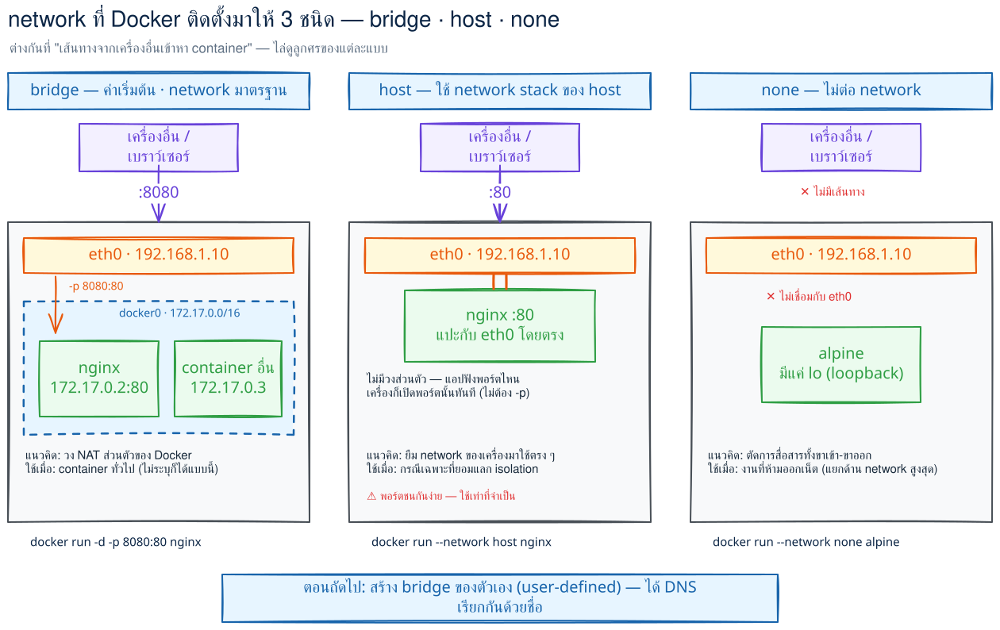
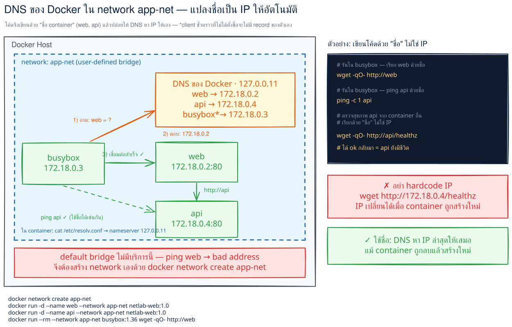
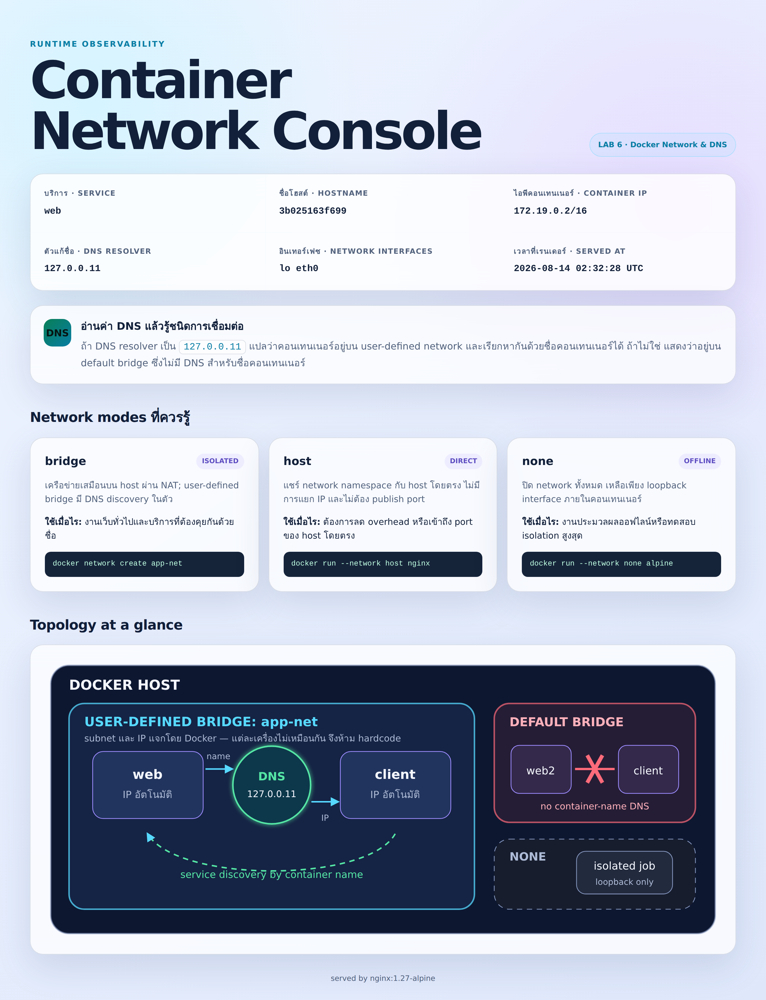
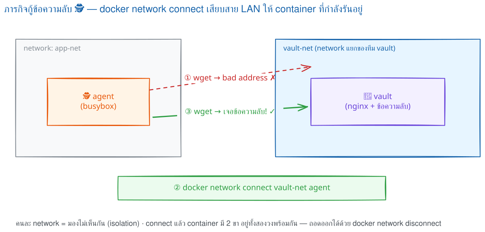

# LAB 6 — Network & DNS : ให้ container คุยกันด้วย "ชื่อ" ไม่ใช่ IP
> โฟลเดอร์ `006_LAB_Network_DNS` = **LAB 6** ของชุด "Dockerfile → Build → Run → Compose" (ตรงกับ **ตอนที่ 9** ของคู่มือ) ไฟล์ในโฟลเดอร์นี้: `Dockerfile` · `site/index.html.tpl` (หน้า **Container Network Console**) · `docker/netlab.conf` · `docker/40-render-console.sh` · `secret/flag.txt` (ข้อความลับของภารกิจ) · `verify.sh` (ตรวจอัตโนมัติ 12 ข้อ) · `images/` (ภาพหน้าจอจริง)

### 🎯 แล็บนี้ใน 30 วินาที

| | |
|---|---|
| **คำถามเดียวที่ตอบให้จบ** | container สองตัวบนเครื่องเดียวกัน เรียกกันด้วย **ชื่อ** ได้ไหม — ถ้าไม่ได้ ต้องแก้ตรงไหน |
| **ต้องผ่านอะไรมาก่อน** | **LAB 1** (โดยเฉพาะข้อ 9 : `EXPOSE` ไม่ได้เปิดพอร์ต · `-p` ต่างหากที่เปิด) |
| **เวลา** | ~35 นาที (แกนหลัก ข้อ 0–12 ประมาณ 27 นาที · ทดลองเพิ่มเติม ~8 นาที) |
| **จบแล้วต้องทำได้เอง** | สร้าง user-defined network แล้วให้ service เรียกกันด้วยชื่อ · ต่อ/ถอด network ตอน container กำลังรัน · บอกได้ว่าเมื่อไรต้อง `-p` และเมื่อไรไม่ต้อง |
| **แล็บนี้ยัง *ไม่* สอน** | การประกาศ network ในไฟล์เดียวพร้อม `internal: true` → **LAB 7** ข้อ 10 (ที่นี่ทำด้วย `docker network` ล้วน ๆ เพื่อให้เห็นกลไก) |

## สิ่งที่จะได้เรียนรู้
- Docker ติดตั้ง network มาให้ **3 ตัวตั้งแต่แรก** — `bridge` · `host` · `none` — และแต่ละตัวใช้เมื่อไร
- **หัวใจของแล็บ**: `default bridge` **ไม่มี DNS ของชื่อ container** แต่ **user-defined bridge มี** (resolver `127.0.0.11`) — พิสูจน์ด้วย error จริง `wget: bad address` แล้วแก้ด้วย `docker network create`
- อ่านรายละเอียด network ด้วย `docker network inspect --format` แบบ **Go template** : `{{range .Containers}}` · `{{range .IPAM.Config}}` · `{{.Name}} | {{.Driver}} | {{.Scope}}`
- **ต่อ network เพิ่มให้ container ที่กำลังรันอยู่** ด้วย `docker network connect` / ถอดด้วย `docker network disconnect` (ภารกิจล้วงข้อความลับจาก `vault`)
- `--network none` = เหลือแค่ `lo` ออกเน็ตไม่ได้ · `--network host` = ใช้ network stack ของเครื่องตรง ๆ **ไม่ต้อง `-p`** (และชน port ได้จริง)
- **IP เปลี่ยนได้ แต่ชื่อไม่เปลี่ยน** — สร้าง container ใหม่แล้ว IP ขยับ คนที่ hardcode IP ไว้จะยิงผิดตัว
- ทำไม backend (เช่น `api`, `redis`) **ไม่ต้อง `-p`** ถ้าอยู่ network เดียวกับ `web`

## ภาพรวมของแล็บนี้
1. **เตรียมเครื่องเรียน** — เปิด container `devtools-df-lab6` (Docker-in-Docker) แล้ว ssh เข้าไป
2. **Clone โค้ดแล็บ แล้ว build image `netlab-web:1.0`** — nginx ที่ **render หน้าเว็บใหม่ทุกครั้งที่ start** โดยอ่าน hostname / IP / DNS resolver จริงจากในตัวเอง
3. **`docker network ls`** — ดู network 3 ตัวที่ Docker แถมมาให้ พร้อมตารางสรุปว่าใช้เมื่อไร
4. **ทายผลแล้วทำให้พังก่อน** — รัน 2 container บน **default bridge** แล้วเรียกกันด้วยชื่อ → `wget: bad address` (แต่เรียกด้วย IP ได้)
5. **`docker network create app-net`** — ย้ายมา user-defined bridge → `nslookup web` ได้ IP จาก `127.0.0.11` และ `wget -qO- http://web` ได้หน้าเว็บจริง
6. **เปิดหน้า Container Network Console ในเบราว์เซอร์** แล้วอ่านค่า DNS resolver ของ container จากหน้าเว็บโดยตรง จากนั้นใช้ **`docker network inspect --format`** ดึงรายชื่อ container + IP, subnet/gateway
7. **`api` ที่ไม่มี `-p` เลย** — พิสูจน์ว่า service ใน network เดียวกันคุยกันได้โดยไม่ต้องเปิด port ออก host
8. **ภารกิจ `vault`** — ข้อความลับอยู่คนละ network → เข้าไม่ถึง → `docker network connect` → ล้วงได้ → `docker network disconnect` → เข้าไม่ได้อีก
9. **`--network none`** (เหลือแค่ `lo`, ได้ `Network is unreachable`) และ **`--network host`** (ไม่ต้อง `-p` ก็เข้าถึงได้ และเจอ `Address in use` ของจริงเมื่อ port ชนกัน)
10. **IP เปลี่ยน ชื่อไม่เปลี่ยน** — ลบแล้วสร้าง `web` ใหม่ IP ขยับจาก `.2` เป็น `.5` แต่ `http://web` ยังใช้ได้เหมือนเดิม แล้วปิดท้ายด้วย **ทดลองเพิ่มเติม** 2 อัน

> **คำถามก่อนเริ่ม:** ถ้ารัน `web` กับ `client` สองกล่องบนเครื่องเดียวกัน แล้วสั่ง `wget http://web` จาก `client` **มันจะติดต่อกันได้ไหม?** ถ้าได้ ใครเป็นคนแปลงคำว่า `web` เป็น IP ให้ และถ้าไม่ได้ **ต้องแก้ตรงไหน**? อีกข้อ: ถ้า `web` ต้องเรียก `api` ต้องสั่ง `-p` ให้ `api` ด้วยไหม?

### Terminal Map
| Terminal | หน้าที่ |
|---|---|
| **T1** | terminal เดียวจบทุกคำสั่ง — ssh เข้า `devtools-df-lab6` แล้วพิมพ์คำสั่ง `docker ...` ทั้งหมดที่นี่ |
| **Browser** | เปิด `http://localhost:8186` เพื่อดูหน้า **Container Network Console** ในข้อ 6 (ใช้ VS Code Remote-SSH หรือ port forward ก็ได้) |

## ทฤษฎีก่อนลงมือ

### ภาพจำหลัก

แก่นของแล็บนี้คือ container แต่ละตัวมีโลก network ของตัวเอง และ Docker เป็นผู้เลือกว่าจะต่อโลกนั้นเข้ากับ bridge, ยืมโลกของ host, หรือตัดสายออกทั้งหมด



> 🖼 **วิธีอ่านรูปนี้:** เริ่มมองจากเครื่องอื่นทางซ้าย แล้วตามเส้นไปยัง container ของแต่ละโหมด จุดสำคัญคือโหมด bridge ต้องผ่านขอบ host และกฎ publish port ส่วน host ใช้ทางเข้าเดียวกับเครื่องโดยตรง และ none ไม่มีเส้นทางเข้าออก ภาพนี้เชื่อมกับ network 3 ตัวในข้อ 3 และผลที่ต่างกันจริงในข้อ 10–11

### กลไกจริง

เมื่อ Docker สร้าง container แบบ bridge มันสร้าง **network namespace** แยกให้ก่อน ภายใน namespace มี interface, routing table และ port ของตัวเอง จึงทำให้ nginx ในหลาย container ฟัง port 80 พร้อมกันได้โดยไม่ชนกัน จากนั้น Docker สร้างสายเสมือนเป็นคู่ชื่อ **veth**: ปลายหนึ่งเป็น `eth0` ใน container อีกปลายเสียบอยู่กับ Linux bridge บน host เปรียบเหมือนห้องพักแต่ละห้องมีโทรศัพท์ของตนเอง และมีสายคนละเส้นวิ่งเข้าสู่ตู้สาขากลาง

บน default bridge ตู้สาขานั้นมักสัมพันธ์กับ `docker0` และ Docker แจก IP จากวงส่วนตัวให้แต่ละปลาย veth Packet ระหว่าง container ในวงเดียวกันจึงวิ่งผ่าน bridge ได้โดยตรง ส่วน packet ที่ออกสู่ network ภายนอกจะผ่าน routing และ NAT ของ host เพื่อแปลง source address จาก IP ส่วนตัวเป็น IP ที่โลกข้างนอกรู้จัก นี่อธิบายผลข้อ 4: การยิงด้วย IP ไปถึงได้ แปลว่าเส้นทางข้อมูลไม่เสีย แต่การยิงด้วยชื่อพังก่อนสร้าง TCP connection เพราะไม่มีสมุดรายชื่อของ container บน default bridge

เมื่อสร้าง user-defined bridge เช่น `app-net` Docker ดูแลทั้งวง IP และ **embedded DNS** ให้ container ในวงนั้น resolver ที่เห็นเป็น `127.0.0.11` คือที่อยู่แบบ loopback ภายใน namespace ซึ่ง Docker ดักคำถามแล้วตอบตามสมาชิกของ network นั้น ชื่อ `web` จึงถูกแปลงเป็น IP ปัจจุบันของ `web` ได้ แต่ชื่อของสมาชิกในอีก network จะไม่ถูกเปิดเผย ขอบเขต DNS จึงเป็นทั้งกลไกค้นหา service และกำแพงแบ่งกลุ่ม ดังที่ข้อ 5 และข้อ 9 พิสูจน์คนละมุม

การใส่ `-p` ทำงานคนละชั้นกับ DNS และไม่ได้ทำให้ container สองตัวคุยกันได้ดีขึ้น คำสั่งนี้สร้างกฎ **DNAT** ที่ขอบ host ให้ traffic ซึ่งมาถึง host port ถูกเปลี่ยนปลายทางไปยัง container IP และ container port จึงเปรียบได้กับการเจาะช่องรับแขกที่กำแพงอาคาร ถ้า `web` กับ `api` อยู่ bridge เดียวกัน ทั้งคู่ใช้ทางเดินภายในและเรียก port ของ container ตรง ๆ ได้อยู่แล้ว ข้อ 8 จึงตรวจได้ว่า backend ไม่มี published port แต่ยังให้บริการเพื่อนร่วมวงได้

โหมด `host` ตัดขั้น network namespace แยกออกในส่วน network: process ใน container ใช้ interface, IP และ port space ของ host โดยตรง จึงไม่ต้องทำ DNAT แต่มีโอกาสชน port ที่ host ใช้อยู่ ส่วน `none` ยังมี namespace แยก แต่ Docker ไม่ต่อ veth ให้ เหลือเพียง loopback จึงไม่มีเส้นทางไป container อื่นหรืออินเทอร์เน็ต ความต่างนี้ทำให้ผลข้อ 10–11 ไม่ใช่เพียงเรื่องตั้งค่า firewall แต่เป็น topology คนละแบบ

สุดท้าย IP ของ container เป็นข้อมูลที่ Docker จัดสรรตามสภาพวงในขณะสร้าง เมื่อ container ถูกลบแล้วสร้างใหม่ เลขเดิมอาจถูกสมาชิกอื่นรับไป DNS จะอัปเดตชื่อให้ชี้สมาชิกปัจจุบัน แต่ config ที่ hardcode IP จะยังวิ่งไปเลขเก่า ดังนั้นชื่อ service คือ **contract** ระหว่างผู้เรียกกับผู้ให้บริการ ส่วน IP เป็นเพียงตำแหน่งชั่วคราวที่ข้อ 12 จะทำให้เห็นด้วยตา

### กฎที่ต้องจำ

| กฎ | เหตุผล |
|---|---|
| ใช้ user-defined bridge กับบริการที่ต้องเรียกกันด้วยชื่อ | ได้ embedded DNS และขอบเขตสมาชิกที่ชัดเจน |
| publish เฉพาะ port ที่ผู้ใช้นอก network ต้องเข้าถึง | `-p` คือทางเข้าจากขอบ host ไม่ใช่เงื่อนไขของการคุยภายใน |
| เรียก service ด้วยชื่อและ container port | ชื่อคงความหมายเดิมแม้ IP ถูกจัดสรรใหม่ |
| มอง network เป็นขอบเขตการมองเห็น | มี DNS เดียวกันไม่ได้แปลว่าจะเห็นชื่อข้ามทุก network |
| เลือก `host` หรือ `none` เมื่อเข้าใจข้อแลกเปลี่ยน | แบบแรกแชร์ port space ส่วนแบบหลังไม่มีขา network |

### สิ่งที่มักเข้าใจผิด

- **คิดว่า** default bridge ติดต่อกันไม่ได้ **แต่จริง ๆ** ติดต่อด้วย IP ได้ ปัญหาที่ข้อ 4 เปิดเผยคือ name resolution ไม่ใช่สาย network ขาด
- **คิดว่า** `EXPOSE` หรือ `-p` จำเป็นสำหรับทุกการเรียก service **แต่จริง ๆ** container ใน network เดียวกันเข้าถึง container port ได้ตรง ๆ ส่วน `-p` เปิดทางจาก host
- **คิดว่า** IP เป็นตัวตนถาวรของ container **แต่จริง ๆ** IP เป็น lease ที่เปลี่ยนเมื่อสร้างใหม่ ขณะที่ชื่อเป็น contract ที่ client ควรพึ่งพา

### ทายผลก่อนทดลอง

1. ก่อนรันข้อ 4–5 ลองทายว่าเหตุใด client บน default bridge จึงอาจยิง IP สำเร็จ แต่ยิงชื่อไม่สำเร็จ และค่า resolver จะเปลี่ยนอย่างไรเมื่อย้ายเข้า `app-net`?
2. ก่อนรันข้อ 8 และข้อ 12 ลองทายว่า `api` ที่ไม่มี `-p` จะรับ request จาก `web` ได้หรือไม่ และหลังสร้าง `web` ใหม่ ผู้เรียกด้วยชื่อกับผู้เรียกด้วย IP เดิมจะเห็นผลต่างกันอย่างไร?

## 0. เตรียมเครื่องเรียน
ทำบนเครื่องของเราเอง — เปิด container ที่ติดตั้ง Docker มาให้แล้ว (Docker-in-Docker)
```bash
docker rm -f devtools-df-lab6 2>/dev/null
docker run -dit --name devtools-df-lab6 --privileged \
  -p 2236:22 -p 8186:8186 tuchsanai/devtools:2569_1
ssh root@localhost -p 2236        # password : passwd
```
> 📝 **คำอธิบาย:** `docker rm -f devtools-df-lab6` ลบกล่องเก่าของแล็บนี้ทิ้งก่อน (`2>/dev/null` ซ่อน error กรณียังไม่เคยมี) · `-dit` = `-d` รันเบื้องหลัง + `-i` เปิด stdin ค้าง + `-t` ให้มี terminal กล่องจะได้ไม่ดับ · `--privileged` ให้สิทธิ์เต็มเพื่อรัน **Docker ซ้อนข้างในกล่อง** (ทุก container ของแล็บนี้เกิดข้างในนั้น) · `-p 2236:22` คือ SSH · `-p 8186:8186` คือ port ของหน้าเว็บที่เราจะเปิดดูในข้อ 6 — **ต้อง publish ตั้งแต่ตอนสร้างกล่อง** เพราะ Docker เปลี่ยน port mapping ของ container ที่สร้างแล้วไม่ได้ · `--privileged` ใช้กับ container เรียนแบบใช้แล้วทิ้งเท่านั้น ไม่ใช่ production

ตรวจว่าพร้อมใช้งาน (พิมพ์**ข้างใน**เครื่องเรียน):
```bash
docker --version
docker info --format 'Docker daemon: {{.ServerVersion}}'
```
> 📝 **คำอธิบาย:** บรรทัดแรกตรวจ CLI บรรทัดที่สองต้องคุยกับ daemon ได้จริง · ถ้าขึ้น `Cannot connect to the Docker daemon` แปลว่า dockerd ข้างในยังบูตไม่เสร็จ รอ 10–20 วินาทีแล้วลองใหม่

✅ **Expected output** — ขอแค่มีเลขเวอร์ชันครบสองบรรทัด (เลขของแต่ละคนอาจไม่ตรงกับเอกสารนี้):
```
Docker version 29.6.2, build dfc4efb
Docker daemon: 29.6.2
```

## 1. Clone โค้ดแล็บ
```bash
mkdir -p ~/labwork && cd ~/labwork
git clone https://github.com/Tuchsanai/DevTools.git
cd DevTools/02_Docker/02_Dockerfile_Build_Run_Compose_Guide/006_LAB_Network_DNS
ls -R . | head -20
```
> 📝 **คำอธิบาย:** `mkdir -p` สร้างโฟลเดอร์งาน (`-p` = มีอยู่แล้วก็ไม่ error) · ถ้าเคย clone ตอน LAB ก่อนหน้าแล้ว git จะบอกว่าโฟลเดอร์ปลายทางไม่ว่าง — ข้ามไป `cd` ได้เลย · ไฟล์สำคัญ: `Dockerfile` (สร้าง image ของหน้าเว็บ), `site/index.html.tpl` (หน้าเว็บที่ยังไม่เติมค่า), `docker/40-render-console.sh` (ตัวเติมค่าจริงตอน start), `secret/flag.txt` (ข้อความลับของภารกิจข้อ 9) และ `verify.sh`

## 2. Build image ของหน้าเว็บ — `netlab-web:1.0`
ดู `Dockerfile` ก่อนว่ามีอะไร:
```bash
cat Dockerfile
```
```dockerfile
FROM nginx:1.27-alpine
COPY site/index.html.tpl /usr/share/nginx/html/index.html.tpl
COPY docker/netlab.conf /etc/nginx/conf.d/default.conf
COPY docker/40-render-console.sh /docker-entrypoint.d/40-render-console.sh
RUN chmod +x /docker-entrypoint.d/40-render-console.sh
EXPOSE 80 8186
```
> 📝 **คำอธิบาย:** `FROM nginx:1.27-alpine` **pin เวอร์ชัน** เพื่อให้ทั้งห้องได้ผลเหมือนกัน (อย่าใช้ `latest` ลอย ๆ) · ไฟล์ที่วางไว้ใน **`/docker-entrypoint.d/`** จะถูก image ของ nginx รันให้อัตโนมัติ **ทุกครั้งที่ container start** — เราใช้จุดนี้อ่าน hostname / IP / DNS resolver **ของ container ตัวเอง** มาเติมลงหน้าเว็บ ทำให้หน้าเว็บรายงาน "ของจริง" ไม่ใช่ค่าที่พิมพ์ค้างไว้ · `netlab.conf` สั่ง nginx `listen 80;` **และ** `listen 8186;` — port 80 ไว้ให้ container อื่นเรียกด้วยชื่อสั้น ๆ (`http://web`) ส่วน 8186 ไว้ให้เรา publish ออกมาดูในเบราว์เซอร์ และไว้ใช้ตอนทดสอบ `--network host` ในข้อ 11 · `EXPOSE` เป็นแค่ **เอกสารกำกับ image** ไม่ได้เปิด port ให้จริง (คนละเรื่องกับ `-p`)

build แล้วดูว่ามี image จริง:
```bash
docker build -t netlab-web:1.0 .
docker images netlab-web
```
> 📝 **คำอธิบาย:** `-t netlab-web:1.0` ตั้งชื่อ:tag ให้ image · จุด `.` ท้ายคำสั่งคือ **build context** = โฟลเดอร์ปัจจุบัน (ทุก `COPY` อ้างอิงจากตรงนี้ ห้ามลืม)

✅ **Expected output** — บรรทัดที่ต้องเห็นคือ `naming to docker.io/library/netlab-web:1.0` แล้วตามด้วยตาราง image (ขนาด/ID ของแต่ละคนจะไม่ตรงกับเอกสารนี้):
```
#10 naming to docker.io/library/netlab-web:1.0 done
#10 unpacking to docker.io/library/netlab-web:1.0 0.0s done
#10 DONE 0.2s
IMAGE            ID             DISK USAGE   CONTENT SIZE   EXTRA
netlab-web:1.0   06b4f631e842       73.7MB           21MB
```

## 3. network 3 ตัวที่ Docker แถมมาให้
```bash
docker network ls
```
> 📝 **คำอธิบาย:** `docker network ls` แสดง network ทั้งหมดของ daemon นี้ · เครื่องที่เพิ่งติดตั้ง Docker จะมีมาให้ **3 ตัว** เสมอ · คอลัมน์ `DRIVER` คือชนิดของ network (`bridge` / `host` / `null`) · คอลัมน์ `SCOPE` = `local` แปลว่าใช้ได้เฉพาะเครื่องนี้ (ถ้าเป็น Swarm จะมี `swarm` ด้วย) · สังเกตว่า network ชื่อ `none` มี driver ว่า **`null`** — ชื่อกับ driver ไม่จำเป็นต้องสะกดเหมือนกัน

✅ **Expected output** — 3 แถวเป๊ะ (NETWORK ID ของแต่ละเครื่องจะไม่ตรงกับเอกสารนี้):
```
NETWORK ID     NAME      DRIVER    SCOPE
efbc654b43bf   bridge    bridge    local
5d944a33c501   host      host      local
11f8ea3d2c95   none      null      local
```

| ชนิด | แนวคิด | ใช้เมื่อไร |
|---|---|---|
| **bridge** | network เสมือนบนเครื่อง คุยออกนอกผ่าน NAT — เป็น**ค่าเริ่มต้น**ถ้าไม่ระบุ `--network` | container ทั่วไป · **แต่ให้สร้างเองด้วย `docker network create`** เพื่อให้ได้ DNS ของชื่อ container |
| **host** | ใช้ network stack ของเครื่อง host ตรง ๆ ไม่มี IP แยก ไม่ต้อง `-p` | กรณีเฉพาะที่ต้องการ performance สูงสุด หรือต้องฟังทุก port ของ host (Linux เท่านั้น) |
| **none** | ไม่ต่อ network เลย เหลือแค่ `lo` | งานประมวลผลออฟไลน์ / ต้องการตัดการสื่อสารเพื่อความปลอดภัย |

## 4. ทำให้พังก่อน : บน default bridge เรียกกันด้วยชื่อ **ไม่ได้**
**ทายผลก่อนรัน:** เราจะเปิด `web-legacy` ไว้เฉย ๆ (ไม่ระบุ `--network` = ได้ default bridge) แล้วให้อีก container ยิง `http://web-legacy` — จะได้หน้าเว็บไหม?
```bash
docker run -d --name web-legacy -e SERVICE_NAME=web-legacy netlab-web:1.0
docker run --rm busybox:1.36 wget -qO- http://web-legacy
```
> 📝 **คำอธิบาย:** `docker run -d` รันเบื้องหลังแล้วคืน container ID ยาว ๆ · `-e SERVICE_NAME=web-legacy` ส่ง ENV เข้าไปให้สคริปต์ render เขียนชื่อบริการลงหน้าเว็บ · **ไม่ได้ใส่ `--network`** จึงตกไปอยู่บน `bridge` (default) และ **ไม่ได้ใส่ `-p`** เพราะรอบนี้เราจะยิงจาก container ด้วยกันเอง · ตัวยิงใช้ `busybox:1.36` ซึ่งมี `wget`/`nslookup` ครบและเบามาก · `--rm` = พอคำสั่งจบให้ลบ container ทิ้งเลย ไม่รกเครื่อง · `-qO-` = เงียบ ๆ แล้วพ่นผลลัพธ์ออก stdout (ตัวอักษรตัวหลังคือ **ตัวโอใหญ่** ไม่ใช่เลขศูนย์)

✅ **Expected output** — ไม่ได้หน้าเว็บ แต่ได้ **error จริง** บรรทัดเดียว:
```
wget: bad address 'web-legacy'
```
`bad address` แปลว่า **แปลงชื่อเป็น IP ไม่สำเร็จ** — ยังไม่ทันได้ต่อ TCP ด้วยซ้ำ ลองถาม DNS ตรง ๆ และดูว่า resolver ของมันคือใคร:
```bash
docker run --rm busybox:1.36 nslookup web-legacy
docker run --rm busybox:1.36 cat /etc/resolv.conf
```
> 📝 **คำอธิบาย:** `nslookup` ถาม DNS ตรง ๆ ให้เห็นว่าใครเป็นคนตอบ · `/etc/resolv.conf` คือไฟล์ที่บอกว่า container จะไปถาม DNS ที่ IP ไหน — บน **default bridge** Docker จะ**ก๊อป resolver ของเครื่อง host** มาให้ ซึ่ง**ไม่รู้จักชื่อ container** เลย

✅ **Expected output** — resolver เป็น IP ของ DNS ภายนอก (ไม่ใช่ `127.0.0.11`) และ `nslookup` ไม่ได้คำตอบ (ข้อความของแต่ละเครื่องอาจต่างกัน เช่น `NXDOMAIN` หรือ `connection timed out` แล้วแต่ DNS ต้นทาง — สาระคือ **ไม่มีใครรู้จักชื่อนี้**):
```
;; connection timed out; no servers could be reached
        ... (ตัดท่อนกลางของ resolv.conf) ...
nameserver 192.168.65.7
# Based on host file: '/etc/resolv.conf' (legacy)
```
**แล้วมันต่อกันได้จริงไหม?** ลองเปลี่ยนจากชื่อเป็น **IP**:
```bash
docker inspect -f '{{.NetworkSettings.Networks.bridge.IPAddress}}' web-legacy
IP=$(docker inspect -f '{{.NetworkSettings.Networks.bridge.IPAddress}}' web-legacy)
docker run --rm busybox:1.36 wget -qO- http://$IP/healthz
```
> 📝 **คำอธิบาย:** `docker inspect -f` (ย่อของ `--format`) ดึงค่าเดี่ยว ๆ ออกจาก JSON ก้อนใหญ่ด้วย **Go template** — `.NetworkSettings.Networks.bridge.IPAddress` คือ IP ของ container บน network ชื่อ `bridge` · เก็บใส่ตัวแปร shell `IP=$(...)` แล้วเอาไปต่อใน URL · `/healthz` คือ endpoint เล็ก ๆ ที่ nginx ของเราตอบว่า `ok` เอาไว้เช็กเร็ว ๆ ว่าถึงตัวจริงไหม

✅ **Expected output** — **ต่อถึง!** (IP ของแต่ละคนจะไม่ตรงกับเอกสารนี้):
```
172.18.0.2
ok
```
> **สรุปข้อ 4:** default bridge **ต่อกันได้อยู่แล้ว** ปัญหาอยู่ที่ **ไม่มีบริการแปลงชื่อ** ให้เท่านั้น — และการไปจำ IP เองคือทางที่ผิด (ข้อ 12 จะพิสูจน์ว่าทำไม)

## 5. ทางแก้ : สร้าง user-defined network เอง
```bash
docker network create app-net
docker network ls
```
> 📝 **คำอธิบาย:** `docker network create <ชื่อ>` **ไม่ต้องระบุ driver** เพราะค่าเริ่มต้นคือ `bridge` อยู่แล้ว · ผลลัพธ์ที่คืนมาคือ **network ID ยาว ๆ** · ความต่างจาก default bridge มีข้อเดียวที่สำคัญที่สุด: **user-defined bridge มี embedded DNS server ของ Docker ที่ `127.0.0.11`** คอยแปลงชื่อ container เป็น IP ให้

✅ **Expected output** — มี `app-net` เพิ่มมาเป็นตัวที่ 4 driver `bridge` (ID จะไม่ตรงกับเอกสารนี้):
```
3c69699fd164afeced62576b23c73c0df4933b434e1609f69da8f4ed35b278b9

NETWORK ID     NAME      DRIVER    SCOPE
3c69699fd164   app-net   bridge    local
efbc654b43bf   bridge    bridge    local
5d944a33c501   host      host      local
11f8ea3d2c95   none      null      local
```

รัน `web` บน `app-net` แล้วลองใหม่:
```bash
docker run -d --name web --network app-net -e SERVICE_NAME=web -p 8186:8186 netlab-web:1.0
docker run --rm --network app-net busybox:1.36 cat /etc/resolv.conf
docker run --rm --network app-net busybox:1.36 nslookup web
```
> 📝 **คำอธิบาย:** `--network app-net` สั่งให้ container เกิดบน network ที่เราสร้างเอง · `-p 8186:8186` publish ออกมาให้เบราว์เซอร์ของเราเข้าถึงในข้อ 6 (**ฝั่งซ้ายคือ port ของเครื่อง ฝั่งขวาคือ port ในกล่อง**) · ตัว client ก็ต้องใส่ `--network app-net` ด้วย — **DNS ของ Docker ทำงานเฉพาะภายใน network เดียวกัน**

✅ **Expected output** — resolver เปลี่ยนเป็น **`127.0.0.11`** และ `nslookup web` ได้ IP จริงกลับมา:
```
nameserver 127.0.0.11
options ndots:0

# Based on host file: '/etc/resolv.conf' (internal resolver)
# ExtServers: [host(192.168.65.7)]
Server:		127.0.0.11
Address:	127.0.0.11:53

Non-authoritative answer:
Name:	web
Address: 172.19.0.2
```
> `127.0.0.11` คือ **embedded DNS ของ Docker** ที่โผล่มาเฉพาะบน user-defined network · บรรทัด `ExtServers` บอกว่าชื่อที่มันไม่รู้จัก (เช่น `google.com`) จะถูกส่งต่อไป DNS ของ host ให้เอง



> 🖼 **วิธีอ่านรูปนี้:** มองตารางชื่อด้านใน `app-net` ก่อน แล้วตามลูกศรจาก busybox ไปถาม `127.0.0.11` และต่อถึง `web:80` จุดนี้ตรงกับ `nslookup web` และการเรียก `http://web` ในข้อ 5 (ส่วน `api` จะถูกสร้างจริงในข้อ 7 และ busybox ของเราเป็น container ชั่วคราวที่ไม่ได้ตั้งชื่อ จึงไม่มี record ใน DNS ตามหมายเหตุ `*` ในรูป) ชื่อยังใช้รูปเดิมได้แม้ Docker จะเปลี่ยน IP ภายหลัง จึงไม่ควรนำ IP จากผล inspect ไปฝังค้างในโค้ด

ยิงด้วย **ชื่อ** จริง ๆ:
```bash
docker run --rm --network app-net busybox:1.36 wget -qO- http://web/healthz
docker run --rm --network app-net busybox:1.36 wget -qO- http://web | grep -o 'stat-value">[^<]*'
```
> 📝 **คำอธิบาย:** คำสั่งแรกเช็กเร็ว ๆ ว่าถึงตัวจริง · คำสั่งที่สองดึง **HTML ทั้งหน้า** แล้ว `grep -o` ตัดเฉพาะค่าที่หน้าเว็บรายงาน (ปกติ `wget -qO- http://web` เฉย ๆ จะพ่น HTML ยาวมากเต็มจอ)

✅ **Expected output** — ได้ `ok` และเห็นค่าจริงของ container `web` (hostname = container ID 12 ตัวแรก · เวลาและ IP ของแต่ละคนจะไม่ตรงกับเอกสารนี้):
```
ok

stat-value">web
stat-value">1a5bb241375b
stat-value">172.19.0.2/16
stat-value">127.0.0.11
stat-value">lo eth0
stat-value">2026-08-14 01:55:40 UTC
```
> **นี่คือคำตอบของ "คำถามก่อนเริ่ม" ข้อแรก** — คนแปลงชื่อ `web` เป็น IP คือ **embedded DNS `127.0.0.11`** และสิ่งที่ต้องแก้คือ **ย้ายมาอยู่บน network ที่เราสร้างเอง**

## 6. เปิดหน้า Container Network Console ในเบราว์เซอร์
`web` ถูก publish ไว้ที่ port 8186 แล้ว เปิดในเบราว์เซอร์ของเครื่องเราได้เลย:
```
http://localhost:8186
```

หรือเช็กจาก terminal ในเครื่องเรียน:
```bash
curl -s -m 3 http://localhost:8186/healthz
```
> 📝 **คำอธิบาย:** ถ้าใช้ VS Code Remote-SSH ต่อไปที่ `root@localhost:2236` แท็บ **PORTS** จะ forward 8186 ให้อัตโนมัติ · ถ้าเปิดไม่ขึ้นให้ย้อนไปดูว่าตอน `docker run` กล่องเรียน (ข้อ 0) ใส่ `-p 8186:8186` ครบไหม — **เพิ่ม `-p` ทีหลังไม่ได้** ต้องลบกล่องแล้วสร้างใหม่ · `-m 3` คือ timeout 3 วินาที กันค้าง

✅ **Expected output** — `curl` ตอบ `ok` และเบราว์เซอร์ได้หน้านี้ (ค่าในการ์ดคือของ container ของคุณเอง — hostname / IP / เวลา จะไม่ตรงกับภาพ):



> จุดที่ต้องดูในหน้านี้คือการ์ด **DNS RESOLVER** — ถ้าขึ้น `127.0.0.11` แปลว่า container นี้อยู่บน user-defined network และเรียกเพื่อนด้วยชื่อได้ (ข้อ 11 เราจะรัน container เดียวกันนี้แบบ `--network host` แล้วกลับมาดูว่าเลขนี้เปลี่ยนเป็นอะไร)

## 7. `docker network inspect --format` : อ่านไส้ในของ network
เปิด container ตัวที่สองไว้ก่อน เพื่อให้มีอะไรให้ดูมากกว่า 1 ตัว:
```bash
docker run -d --name api --network app-net -e SERVICE_NAME=api netlab-web:1.0
docker network inspect -f '{{.Name}} | {{.Driver}} | {{.Scope}}' app-net
docker network inspect -f '{{range .IPAM.Config}}subnet={{.Subnet}} gateway={{.Gateway}}{{end}}' app-net
docker network inspect -f '{{range .Containers}}{{.Name}} = {{.IPv4Address}}{{println}}{{end}}' app-net
```
> 📝 **คำอธิบาย:** `-f` / `--format` ใช้แทนกันได้ · **ค่าเดี่ยว** อย่าง `.Name` `.Driver` `.Scope` เขียนตรง ๆ ได้เลย · แต่ `.IPAM.Config` เป็น **list ของช่วง IP** และ `.Containers` เป็น **map ของ container ที่ต่ออยู่** — ค่าพวกนี้ **ต้องใช้ `{{range}}...{{end}}` วน** ข้างในถึงจะหยิบ `.Subnet` `.Gateway` `.Name` `.IPv4Address` ได้ · `{{println}}` แทรกขึ้นบรรทัดใหม่ให้แต่ละรอบของ `range` (ไม่ใส่ก็ได้ แต่จะออกมาติดกันเป็นพืด) · **`IPAM`** ย่อจาก IP Address Management = ตัวจัดสรรช่วง IP ของ network นี้

✅ **Expected output** — subnet/gateway และรายชื่อ container พร้อม IP (subnet ของแต่ละเครื่องจะไม่ตรงกับเอกสารนี้ · **ลำดับแถวของ `range` ไม่แน่นอน** เพราะ `.Containers` เป็น map):
```
app-net | bridge | local

subnet=172.19.0.0/16 gateway=172.19.0.1

web = 172.19.0.2/16
api = 172.19.0.3/16
```
> `/16` คือขนาดของช่วง IP ที่ network นี้ใช้ · `gateway` คือ IP ของ Docker เองที่เป็นทางออกของ network นี้

**ลองเขียนผิดดูบ้าง** — หยิบค่าจาก map ตรง ๆ โดยไม่ `range`:
```bash
docker network inspect -f '{{.Containers.Name}}' app-net
```
✅ **Expected output** — ไม่ error แต่ได้ `<no value>` (ซึ่งหลอกกว่า error เสียอีก):
```
<no value>
```
> 📝 **คำอธิบาย:** `.Containers` เป็น **map ที่ key คือ container ID** ไม่ใช่ object ที่มีฟิลด์ `Name` ตรง ๆ Go template จึงคืน `<no value>` เงียบ ๆ · **จำกติกาสั้น ๆ: เจอ list/map ต้อง `range` เสมอ** · อยากดูโครงสร้างเต็ม ๆ ให้รัน `docker network inspect app-net` เปล่า ๆ แล้วอ่าน JSON

## 8. ทำไม backend ไม่ต้อง `-p`
`api` ที่เพิ่งเปิดในข้อ 7 **ไม่ได้ใส่ `-p` เลย** ลองดูว่ามันถูกเรียกได้ไหม:
```bash
docker ps --format 'table {{.Names}}\t{{.Ports}}'
docker port api
docker run --rm --network app-net busybox:1.36 wget -qO- http://api/healthz
```
> 📝 **คำอธิบาย:** `docker ps --format 'table ...'` เลือกแสดงเฉพาะคอลัมน์ที่อยากดู (`\t` = คั่นด้วย tab) · `docker port <ชื่อ>` แสดง **port ที่ publish ออก host** — ถ้าไม่ได้ publish ไว้จะ**ไม่พิมพ์อะไรเลย** · คอลัมน์ `PORTS` ที่ขึ้นว่า `80/tcp, 8186/tcp` เฉย ๆ คือค่าที่มาจาก `EXPOSE` ใน Dockerfile (แค่ป้ายบอก) ส่วนของ `web` ที่มี `0.0.0.0:8186->8186/tcp` ต่างหากคือ **การ publish จริง**

✅ **Expected output** — `api` ไม่มี mapping ใด ๆ (`docker port api` เงียบสนิท) แต่เพื่อนใน network เดียวกันยังเรียกได้ปกติ:
```
NAMES        PORTS
api          80/tcp, 8186/tcp
web          80/tcp, 0.0.0.0:8186->8186/tcp, [::]:8186->8186/tcp
web-legacy   80/tcp, 8186/tcp

ok
```
> **คำตอบของ "คำถามก่อนเริ่ม" ข้อสอง:** `-p` มีไว้เปิดให้ **คนนอก** (เบราว์เซอร์บนเครื่องเรา) เข้าถึงเท่านั้น · `web` เรียก `api` (หรือ `redis`, `postgres`) **ไม่ต้อง `-p`** เพราะคุยกันภายใน network เดียวกัน — และการไม่เปิด port ที่ไม่จำเป็นคือ **ความปลอดภัย** ที่ได้มาฟรี ๆ

## 9. ภารกิจ : `docker network connect` / `disconnect` ตอน container กำลังทำงาน
> **โจทย์:** `vault` เก็บข้อความลับไว้ที่ `/flag.txt` แต่มันอยู่บน network `vault-net` ส่วนสายลับของเรา (`agent`) อยู่บน `app-net` ห้ามลบ/สร้าง `agent` ใหม่ (สมมติว่ามันกำลังทำงานสำคัญค้างอยู่) — ต้องล้วงข้อความลับให้ได้
```bash
docker network create vault-net
docker run -d --name vault --network vault-net \
  -v ~/labwork/DevTools/02_Docker/02_Dockerfile_Build_Run_Compose_Guide/006_LAB_Network_DNS/secret/flag.txt:/usr/share/nginx/html/flag.txt:ro \
  -e SERVICE_NAME=vault netlab-web:1.0
docker run -d --name agent --network app-net busybox:1.36 sleep 3600
docker exec agent wget -qO- http://vault/flag.txt
```
> 📝 **คำอธิบาย:** `-v <ไฟล์บนเครื่อง>:<ที่อยู่ในกล่อง>:ro` เอาไฟล์ความลับใส่เข้าไปแบบ **read-only** (`ro`) โดยไม่ต้อง build image ใหม่ — path ฝั่งซ้าย **ต้องเป็น absolute path** · `agent` ใช้ `sleep 3600` เพื่อให้ container มีชีวิตอยู่ 1 ชั่วโมง (ถ้าไม่มีคำสั่งค้างไว้ busybox จะจบทันที) · `docker exec` สั่งงาน**ใน container ที่รันอยู่แล้ว** ต่างจาก `docker run` ที่สร้างตัวใหม่

✅ **Expected output** — ล้วงไม่ได้ เพราะคนละ network จึงมองไม่เห็นแม้แต่ชื่อ:
```
wget: bad address 'vault'
```
ถามละเอียดขึ้นอีกนิดว่า DNS ว่าอย่างไร และตอนนี้ `agent` อยู่ network ไหนบ้าง:
```bash
docker exec agent nslookup vault
docker inspect -f '{{range $k,$v := .NetworkSettings.Networks}}{{$k}} {{end}}' agent
```
> 📝 **คำอธิบาย:** `{{range $k,$v := .Networks}}` คือการ range **map** แล้วดึง **key** ออกมา (key ของ `.NetworkSettings.Networks` คือ**ชื่อ network**) · `$k` `$v` เป็นตัวแปรของ Go template ไม่ใช่ตัวแปร shell — ถ้าเขียนในเชลล์ต้องใช้ **single quote** ครอบ ไม่งั้น shell จะกินเครื่องหมาย `$` ไปก่อน

✅ **Expected output** — resolver ตอบ `NXDOMAIN` (รู้จัก DNS นะ แต่ **ไม่มีชื่อนี้ใน network นี้**) และ `agent` มีแค่ `app-net`:
```
Server:		127.0.0.11
Address:	127.0.0.11:53

** server can't find vault: NXDOMAIN

app-net
```



> 🖼 **วิธีอ่านรูปนี้:** อ่านจากซ้ายไปขวา: ตอนแรก `agent` มีขาอยู่เพียง `app-net` จึงถามชื่อ `vault` แล้วได้ `bad address` จากนั้น `docker network connect` เพิ่มขาเข้าสู่ `vault-net` โดยไม่ถอดขาเดิม ทำให้ container เดียวเห็นทั้ง `api` และ `vault` ภาพนี้เตรียมให้สังเกตผล inspect และข้อความลับในขั้นถัดไป

**เชื่อม network เพิ่มขณะที่ `agent` ยังรันอยู่:**
```bash
docker network connect vault-net agent
docker inspect -f '{{range $k,$v := .NetworkSettings.Networks}}{{$k}} {{end}}' agent
docker exec agent wget -qO- http://vault/flag.txt
```
> 📝 **คำอธิบาย:** `docker network connect <network> <container>` เสียบขา network เพิ่มให้ container **ที่กำลังทำงานอยู่** โดยไม่ต้อง restart — container จะได้ **interface และ IP ใหม่เพิ่มอีกใบ** และ **เห็นชื่อเพื่อนใน network นั้นทันที** · ลำดับ argument คือ **network ก่อน container ทีหลัง** (สลับแล้วจะเจอ `network agent not found`)

✅ **Expected output** — ได้ธงมาแล้ว! (`agent` มี 2 network):
```
app-net vault-net

DOCKER-NET-FLAG{name_resolution_beats_hardcoded_ip}
ถ้าคุณอ่านไฟล์นี้ได้ แสดงว่าคอนเทนเนอร์เชื่อมต่อ network เดียวกับ vault สำเร็จแล้ว
การเรียก vault ด้วยชื่อยืนยันว่า Docker DNS ทำ name resolution ได้ถูกต้อง
อย่าฝัง IP แบบตายตัว เพราะ IP ของคอนเทนเนอร์เปลี่ยนได้
```

ดูจากฝั่ง network บ้างว่าใครต่ออยู่ แล้ว **ถอดออก**:
```bash
docker network inspect -f '{{range .Containers}}{{.Name}} = {{.IPv4Address}}{{println}}{{end}}' vault-net
docker network disconnect vault-net agent
docker exec agent wget -qO- http://vault/flag.txt
docker exec agent wget -qO- http://api/healthz
```
> 📝 **คำอธิบาย:** ก่อน disconnect จะเห็น `agent` โผล่ใน `vault-net` ด้วย · `docker network disconnect` ถอดขาออก — จุดสำคัญคือ **ขาอื่นไม่กระทบ** `agent` จึงยังคุยกับ `api` บน `app-net` ได้ตามปกติ (นี่คือหลักฐานว่า network แต่ละวงแยกกันจริง ๆ ไม่ใช่เปิด-ปิดทั้งตัว)

✅ **Expected output** — ก่อนถอดเห็น 2 ตัวใน `vault-net`; หลังถอด `vault` หายไปจากสายตา แต่ `api` ยังอยู่:
```
vault = 172.20.0.2/16
agent = 172.20.0.3/16

wget: bad address 'vault'
ok
```

## 10. `--network none` : ตัดขาดจากโลก
```bash
docker run --rm --network none busybox:1.36 ip -o addr
docker run --rm --network none busybox:1.36 wget -T 5 -qO- http://1.1.1.1
docker run --rm --network none busybox:1.36 ping -c 1 -W 2 172.19.0.2
```
> 📝 **คำอธิบาย:** `ip -o addr` แสดง interface ทั้งหมดแบบบรรทัดเดียวต่อรายการ (`-o` = oneline อ่านง่ายกว่า) · `-T 5` ของ wget คือ timeout 5 วินาที · `ping -c 1 -W 2` ส่ง 1 ครั้ง รอ 2 วินาที · `--network none` ไม่ได้แค่ "บล็อกเน็ต" แต่ **ไม่สร้าง `eth0` ให้เลย** — เคอร์เนลจึงตอบกลับทันทีว่า `Network is unreachable` ไม่ต้องรอ timeout

✅ **Expected output** — มีแต่ `lo` และออกไปไหนไม่ได้เลย:
```
1: lo    inet 127.0.0.1/8 scope host lo\       valid_lft forever preferred_lft forever
1: lo    inet6 ::1/128 scope host \       valid_lft forever preferred_lft forever

wget: can't connect to remote host (1.1.1.1): Network is unreachable

PING 172.19.0.2 (172.19.0.2): 56 data bytes
ping: sendto: Network is unreachable
```
> ใช้จริงเมื่อไร: งานที่รับ input เป็นไฟล์แล้วประมวลผลอย่างเดียว เช่น แปลงรูป/รัน batch — ตัดเน็ตทิ้งไปเลยปลอดภัยกว่า

## 11. `--network host` : ใช้ network ของเครื่องตรง ๆ (ไม่ต้อง `-p`)
**ลองแบบผิดก่อน** — ตอนนี้ `web` จอง port 8186 ของเครื่องอยู่ (จาก `-p 8186:8186`) แล้วเราจะยัด container host mode ที่ฟัง 8186 เข้าไปอีกตัว:
```bash
docker run -d --name host-web --network host -e SERVICE_NAME=host-web netlab-web:1.0
sleep 2
docker ps -a --filter name=host-web --format 'table {{.Names}}\t{{.Status}}'
docker logs host-web 2>&1 | tail -3
```
> 📝 **คำอธิบาย:** `--network host` = ไม่สร้าง network namespace ใหม่ ใช้ของเครื่องเลย → nginx ข้างในจะไป bind `0.0.0.0:8186` **ของเครื่องจริง** ซึ่งถูกจองไปแล้ว · `--filter name=host-web` กรองเฉพาะตัวที่สนใจ · `docker logs` อ่าน stdout/stderr ของ container (`2>&1` ให้เห็นทั้งสองทาง)

✅ **Expected output** — container ขึ้นสถานะ `Up` (หลอกตา!) แต่ log บอกความจริงว่า bind ไม่ได้ และมันจะวนพยายามใหม่ไปเรื่อย ๆ:
```
NAMES      STATUS
host-web   Up 2 seconds

2026/08/14 01:57:40 [emerg] 1#1: bind() to 0.0.0.0:8186 failed (98: Address in use)
nginx: [emerg] bind() to 0.0.0.0:8186 failed (98: Address in use)
2026/08/14 01:57:40 [notice] 1#1: try again to bind() after 500ms
```
> **บทเรียน:** `Up` ไม่ได้แปลว่า "ใช้งานได้" เสมอไป — ต้องดู log ด้วย · และ host mode **ชน port กับเครื่องได้จริง** เพราะไม่มีชั้น NAT มากั้น

**คืน port ให้เครื่องแล้วลองใหม่:**
```bash
docker rm -f host-web
docker stop web
docker run -d --name host-web --network host -e SERVICE_NAME=host-web netlab-web:1.0
sleep 2
docker ps --filter name=host-web --format 'table {{.Names}}\t{{.Ports}}'
docker port host-web
curl -s -m 3 http://localhost:8186/healthz
```
> 📝 **คำอธิบาย:** `docker stop web` แค่หยุด ไม่ได้ลบ (เดี๋ยวสั่ง `docker start web` กลับมาได้) · สังเกตว่าคราวนี้เรา **ไม่ได้ใส่ `-p` เลย** แต่เข้าถึงได้จาก `localhost:8186` ของเครื่องเรียนตรง ๆ

✅ **Expected output** — คอลัมน์ `PORTS` **ว่างเปล่า** และ `docker port` ไม่พิมพ์อะไร แต่ curl ได้ `ok`:
```
NAMES      PORTS
host-web   

ok
```

ดูให้ลึกอีกนิดว่า "ใช้ stack ของเครื่อง" หน้าตาเป็นอย่างไร:
```bash
curl -s -m 3 http://localhost:8186/ | grep -o 'stat-value">[^<]*' | head -5
docker inspect -f '{{.HostConfig.NetworkMode}}' host-web
docker inspect -f '{{range $k,$v := .NetworkSettings.Networks}}{{$k}} IP=[{{$v.IPAddress}}]{{end}}' host-web
```
✅ **Expected output** — หน้าเว็บรายงาน **hostname ของเครื่องเรียน**, **IP ทุกใบของเครื่อง** (รวม gateway ของทุก bridge) และ DNS ก็เป็นของเครื่อง **ไม่ใช่ `127.0.0.11`** · และ Docker เองก็ไม่ได้แจก IP ให้ container นี้ (`invalid IP`) — ค่าของแต่ละเครื่องจะไม่ตรงกับเอกสารนี้:
```
stat-value">host-web
stat-value">1b7e3710cbe5
stat-value">172.17.0.8/16 172.18.0.1/16 172.19.0.1/16 172.20.0.1/16
stat-value">192.168.65.7
stat-value">lo eth0 docker0 veth40dfbd9 br-3c69699fd164 veth293e356 br-3d9858994f58 veth925a0f5 veth1a8209c

host
host IP=[invalid IP]
```
> **สังเกต:** เห็น interface `docker0`, `br-xxxx` และ `vethxxxx` ของ Docker เอง — เพราะเรากำลังมองจาก**มุมของเครื่อง host** จริง ๆ · ข้อเสียคือ **ไม่มี isolation และไม่มี DNS ของชื่อ container** จึงใช้เฉพาะกรณีจำเป็น (และ `--network host` เต็มรูปแบบใช้ได้บน **Linux** เท่านั้น)

คืนสภาพก่อนไปข้อต่อไป:
```bash
docker rm -f host-web
docker start web
curl -s -m 3 http://localhost:8186/healthz
```
✅ **Expected output** — `web` กลับมาถือ port 8186 เหมือนเดิม:
```
host-web
web
ok
```

## 12. IP เปลี่ยนได้ แต่ชื่อไม่เปลี่ยน
จด IP ปัจจุบันของ `web` ไว้ก่อน:
```bash
docker network inspect -f '{{range .Containers}}{{.Name}} = {{.IPv4Address}}{{println}}{{end}}' app-net
docker inspect -f '{{index .NetworkSettings.Networks "app-net" "IPAddress"}}' web
```
> 📝 **คำอธิบาย:** ชื่อ network ที่มี **ขีดกลาง** อย่าง `app-net` เขียนเป็น `.Networks.app-net.IPAddress` ตรง ๆ **ไม่ได้** (Go template จะงงกับเครื่องหมาย `-`) ต้องใช้ฟังก์ชัน **`index <map> "key" "field"`** แทน · ถ้าลองเขียน `{{.NetworkSettings.Networks."app-net".IPAddress}}` จะได้ `template parsing error: bad character U+0022 '"'` (ลองดูได้ ไม่พัง)

✅ **Expected output** — `web` ถือ `.2` อยู่ (ตัวเลขของแต่ละคนจะไม่ตรงกับเอกสารนี้):
```
agent = 172.19.0.4/16
api = 172.19.0.3/16
web = 172.19.0.2/16

172.19.0.2
```

ทีนี้ลบ `web` ทิ้งแล้วสร้างใหม่ โดยแทรก container อื่นเข้าไปก่อน (เลียนแบบสถานการณ์จริงตอน deploy ที่มีตัวอื่นเกิดคั่น):
```bash
docker rm -f web
docker run -d --name filler --network app-net busybox:1.36 sleep 600
docker run -d --name web --network app-net -e SERVICE_NAME=web -p 8186:8186 netlab-web:1.0
sleep 2
docker network inspect -f '{{range .Containers}}{{.Name}} = {{.IPv4Address}}{{println}}{{end}}' app-net
```
> 📝 **คำอธิบาย:** Docker แจก IP ที่ **ว่างต่ำสุด** ให้ container ที่เกิดใหม่ — `filler` จึงคว้า `.2` ที่ `web` เพิ่งคืนไป ส่วน `web` ตัวใหม่ต้องไปต่อท้าย

✅ **Expected output** — `web` ได้ IP **ใหม่** (`.5`) ส่วน `.2` ตอนนี้เป็นของ `filler`:
```
filler = 172.19.0.2/16
agent = 172.19.0.4/16
api = 172.19.0.3/16
web = 172.19.0.5/16
```

แล้ว "คนที่จำ IP ไว้" กับ "คนที่ใช้ชื่อ" ใครรอด:
```bash
docker run --rm --network app-net busybox:1.36 nslookup web
docker run --rm --network app-net busybox:1.36 wget -qO- http://web/healthz
docker run --rm --network app-net busybox:1.36 wget -qO- http://172.19.0.2/healthz
```
> 📝 **คำอธิบาย:** บรรทัดสุดท้ายคือคนที่ **hardcode IP `172.19.0.2`** ไว้ในไฟล์ config เมื่อวาน — วันนี้ IP นั้นเป็นของ `filler` ไปแล้ว (ให้เปลี่ยนเลขให้ตรงกับที่เครื่องคุณเห็นในผลลัพธ์ก่อนหน้า)

✅ **Expected output** — คนใช้ชื่อได้ IP ใหม่อัตโนมัติ ส่วนคน hardcode IP ยิงไปโดน container ผิดตัวจน `Connection refused`:
```
Name:	web
Address: 172.19.0.5

ok

wget: can't connect to remote host (172.19.0.2): Connection refused
```
> **บทเรียนของแล็บนี้ทั้งแล็บอยู่ตรงนี้:** *อย่า hardcode IP ของ container* — ใช้ **ชื่อ container / ชื่อ service** บน user-defined network เสมอ (ใน `docker compose` ชื่อ service ก็ทำหน้าที่นี้ให้อัตโนมัติ — LAB 7 จะได้เห็น)

เก็บ `filler` ทิ้งก่อนไปหัวข้อถัดไป:
```bash
docker rm -f filler
```

## ทดลองเพิ่มเติม (~8 นาที)

> แกนหลักของแล็บจบแล้ว — หัวข้อต่อจากนี้เลือกทำตามเวลาที่มี แต่ข้อ 💥 **ทำให้พัง** อยู่ในเช็กลิสต์ท้ายแล็บ เพราะการอ่าน error ให้ออกคือทักษะที่ใช้จริงมากที่สุด · **`verify.sh` ของแล็บนี้อยู่ถัดจากหัวข้อนี้** ให้รันด้วยเสมอก่อนเก็บกวาด
### 1) ทำให้พัง : ลบ network ทั้งที่ยังมีคนต่ออยู่
```bash
docker network rm app-net
```
> 📝 **คำอธิบาย:** ตอนนี้ `web`, `api`, `agent` ยังเสียบอยู่บน `app-net` — Docker จะไม่ยอมลบให้ เพราะจะทำให้ endpoint ของ container เหล่านั้นเป็นหมัน

✅ **Expected output** — error จริง พร้อม**บอกชื่อตัวการมาให้ครบ** (ID ของแต่ละคนจะไม่ตรงกับเอกสารนี้):
```
Error response from daemon: error while removing network: network app-net has active endpoints (name:"agent" id:"5082eeea139f", name:"web" id:"f3718e10c16c", name:"api" id:"950741ac132e")
exit status 1
```
**แก้ให้ถูกวิธี** — ดูก่อนว่าใครต่ออยู่ แล้วค่อยเอาออก (จะ `docker rm -f` ทิ้ง หรือ `docker network disconnect` ทีละตัวก็ได้):
```bash
docker network inspect -f '{{range .Containers}}{{.Name}} = {{.IPv4Address}}{{println}}{{end}}' app-net
docker rm -f web api agent
docker network rm app-net
docker network ls
```
✅ **Expected output** — คราวนี้ลบผ่าน (Docker คืนชื่อ network ที่ลบสำเร็จมาให้):
```
agent = 172.19.0.4/16
api = 172.19.0.3/16
web = 172.19.0.5/16

web
api
agent

app-net

NETWORK ID     NAME        DRIVER    SCOPE
efbc654b43bf   bridge      bridge    local
5d944a33c501   host        host      local
11f8ea3d2c95   none        null      local
3d9858994f58   vault-net   bridge    local
```
> ทางลัดเวลาเครื่องรก: `docker network prune` ลบ network ที่**ไม่มีใครใช้**ทั้งหมดในทีเดียว (ระวัง — ลบของ project อื่นด้วย)

### 2) กู้ container ที่เกิดมาแบบ `none` + ตั้งชื่อเล่นด้วย `--alias`
สร้าง network กับ `web` ขึ้นมาใหม่ แล้วปล่อย container ที่ "เกิดมาไม่มีเน็ต":
```bash
docker network create app-net
docker run -d --name web --network app-net -e SERVICE_NAME=web -p 8186:8186 netlab-web:1.0
docker run -d --name lost --network none busybox:1.36 sleep 600
docker exec lost ip -o addr
docker exec lost wget -T 5 -qO- http://web/healthz
```
✅ **Expected output** — มีแต่ `lo` และเรียกใครไม่ได้เลย:
```
1: lo    inet 127.0.0.1/8 scope host lo\       valid_lft forever preferred_lft forever
1: lo    inet6 ::1/128 scope host \       valid_lft forever preferred_lft forever

wget: bad address 'web'
```
**ลองต่อ network ให้มันตรง ๆ (อันนี้จะพัง):**
```bash
docker network connect --alias frontend app-net lost
```
✅ **Expected output** — Docker ปฏิเสธ เพราะ `none` เป็นโหมด "ส่วนตัว" ที่อยู่ร่วมกับ network อื่นไม่ได้:
```
Error response from daemon: container cannot be connected to multiple networks with one of the networks in private (none) mode
```
**แก้โดยถอด `none` ออกก่อน แล้วค่อยต่อ:**
```bash
docker network disconnect none lost
docker network connect --alias frontend app-net lost
docker exec lost ip -o addr
docker exec lost wget -qO- http://web/healthz
docker run --rm --network app-net busybox:1.36 nslookup frontend
docker inspect -f '{{range .NetworkSettings.Networks}}aliases={{.Aliases}}{{end}}' lost
```
> 📝 **คำอธิบาย:** `--alias <ชื่อเล่น>` ตั้ง **ชื่อเพิ่ม** ให้ container ใน network นั้น — เพื่อนใน network เดียวกันเรียกได้ทั้งชื่อจริง (`lost`) และชื่อเล่น (`frontend`) · มีประโยชน์มากตอนสลับตัวจริงเบื้องหลัง (blue/green) โดยไม่ต้องแก้โค้ดฝั่งผู้เรียก

✅ **Expected output** — `eth0` โผล่มาแล้ว เรียก `web` ได้ และชื่อเล่น `frontend` ก็ resolve ได้ด้วย:
```
1: lo    inet 127.0.0.1/8 scope host lo\       valid_lft forever preferred_lft forever
2: eth0    inet 172.19.0.3/16 brd 172.19.255.255 scope global eth0\       valid_lft forever preferred_lft forever

ok

Name:	frontend
Address: 172.19.0.3

aliases=[frontend]
```
> เก็บกวาดตัวทดลอง: `docker rm -f lost`

## ตรวจงานอัตโนมัติด้วย `verify.sh`
รันจากในโฟลเดอร์ของแล็บ **ในเครื่องเรียน** และ **ต้องรันก่อนหัวข้อ Cleanup** — สคริปต์สร้างของใช้เองชื่อขึ้นต้นด้วย `vfy-` แล้วลบเฉพาะของตัวเองทิ้งเมื่อจบ จึงไม่กระทบ `web`/`api`/`app-net` ที่เราสร้างระหว่างทำแล็บ:
```bash
cd ~/labwork/DevTools/02_Docker/02_Dockerfile_Build_Run_Compose_Guide/006_LAB_Network_DNS
bash verify.sh
```
✅ **Expected output** — 12 ข้อ ผ่านหมด แล้วปิดท้ายด้วย `ALL CHECKS PASSED` (exit code 0):
```
[PASS] c1 default networks bridge, host, none exist
[PASS] c2 build netlab-web:1.0
[PASS] c3 embedded DNS resolves vfy-web
        ... (ตัดท่อนกลาง c4–c11) ...
[PASS] c12 host mode shares the host network stack (no port mapping)
ALL CHECKS PASSED
```

## แก้ปัญหาที่พบบ่อย
| อาการ | สาเหตุ | วิธีแก้ |
|---|---|---|
| `wget: bad address 'web'` | container อยู่บน **default bridge** ซึ่งไม่มี DNS ของชื่อ container หรืออยู่คนละ network กับปลายทาง | `docker network create app-net` แล้วใส่ `--network app-net` **ทั้งสองฝั่ง** · ถ้าตัวหนึ่งรันอยู่แล้วใช้ `docker network connect app-net <ชื่อ>` |
| `nslookup` ตอบ `NXDOMAIN` ทั้งที่ resolver เป็น `127.0.0.11` | อยู่บน user-defined network แล้ว แต่ **คนละวง** กับปลายทาง (หรือสะกดชื่อผิด / ปลายทางถูกลบไปแล้ว) | `docker network inspect -f '{{range .Containers}}{{.Name}}{{println}}{{end}}' <net>` ดูว่าใครอยู่ในวงบ้าง |
| `wget: can't connect to remote host (...): Connection refused` | ชื่อ/IP แปลงได้แล้วแต่ปลายทาง**ไม่มีใครฟัง port นั้น** เช่น hardcode IP ไว้แล้ว IP ย้ายไปเป็นของ container อื่น | เลิกใช้ IP หันมาใช้ชื่อ · เช็กว่า process ในปลายทางรันจริงด้วย `docker logs <ชื่อ>` |
| `Error response from daemon: ... has active endpoints` | สั่ง `docker network rm` ทั้งที่ยังมี container ต่ออยู่ | เอา container ออกก่อน: `docker rm -f <ชื่อ>` หรือ `docker network disconnect <net> <ชื่อ>` แล้วค่อยลบ network |
| `container cannot be connected to multiple networks with one of the networks in private (none) mode` | container เกิดมาด้วย `--network none` | `docker network disconnect none <ชื่อ>` ก่อน แล้วค่อย `docker network connect <net> <ชื่อ>` |
| container `Up` แต่เว็บไม่ขึ้น + log มี `bind() to 0.0.0.0:8186 failed (98: Address in use)` | port ชนกัน (มักเกิดกับ `--network host` หรือ `-p` ซ้ำ) | หา/หยุดตัวที่จองอยู่ (`docker ps` ดูคอลัมน์ PORTS แล้ว `docker stop <ชื่อ>`) หรือเปลี่ยนไปใช้ port อื่น |
| `Network is unreachable` | รันด้วย `--network none` จึงไม่มี `eth0` ให้ใช้ | ถอด `--network none` ออก หรือ `docker network disconnect none <ชื่อ>` แล้ว connect เข้า network จริง |
| `template parsing error: bad character U+0022 '"'` | ชื่อ network มีขีดกลาง เลยเขียน `.Networks."app-net"` | ใช้ `{{index .NetworkSettings.Networks "app-net" "IPAddress"}}` แทน |
| เปิด `http://localhost:8186` ในเบราว์เซอร์ไม่ขึ้น | ตอนสร้างกล่องเรียนลืม `-p 8186:8186` หรือ container `web` ไม่ได้ publish port | `docker ps` ดูว่ามี `0.0.0.0:8186->8186/tcp` ไหม · ถ้ากล่องเรียนไม่ได้ publish ต้อง `docker rm -f devtools-df-lab6` แล้วสร้างใหม่ให้ครบ (แก้ทีหลังไม่ได้) |

## เก็บกวาด (Cleanup)
ลบทุกอย่างที่แล็บนี้สร้าง **ในเครื่องเรียน**:
```bash
docker rm -f web api agent vault web-legacy filler lost host-web 2>/dev/null
docker network rm app-net vault-net
docker network ls
docker ps -a
docker rmi netlab-web:1.0
```
> 📝 **คำอธิบาย:** `docker rm -f` ตามด้วยหลายชื่อได้ในทีเดียว (`2>/dev/null` ซ่อน error ของตัวที่ลบไปแล้ว) · **ต้องลบ container ก่อนลบ network** เสมอ ไม่งั้นเจอ `has active endpoints` · `docker network ls` ต้องเหลือ 3 ตัวมาตรฐาน — `bridge`, `host`, `none` **ลบไม่ได้และไม่ต้องลบ** · `docker rmi` ลบ image ของแล็บทิ้ง (จะเก็บไว้ก็ได้ถ้าจะกลับมาเล่นต่อ)

✅ **Expected output** — network เหลือ 3 ตัวมาตรฐาน และ `docker ps -a` เหลือแค่หัวตาราง:
```
web
vault
web-legacy

app-net
vault-net

NETWORK ID     NAME      DRIVER    SCOPE
efbc654b43bf   bridge    bridge    local
5d944a33c501   host      host      local
11f8ea3d2c95   none      null      local

CONTAINER ID   IMAGE     COMMAND   CREATED   STATUS    PORTS     NAMES

Untagged: netlab-web:1.0
Deleted: sha256:fe0d092276abf5cfb9a88e1368aeaa79de8006b9c79f093dc3ca3145c0be3b60
```
จากนั้น **ออกจาก ssh** (`exit`) แล้วลบกล่องเรียนทิ้งจากเครื่องของเรา:
```bash
docker rm -f devtools-df-lab6
docker ps -a --filter "name=^devtools-"
```
✅ **Expected output** — เหลือแค่หัวตาราง ไม่มี container ของแล็บค้าง:
```
devtools-df-lab6
CONTAINER ID   IMAGE     COMMAND   CREATED   STATUS    PORTS     NAMES
```

## สรุปคำสั่งของแล็บนี้
| คำสั่ง | ความหมาย |
|---|---|
| `docker network ls` | ดู network ทั้งหมด — เครื่องใหม่จะมี `bridge` · `host` · `none` มาให้ 3 ตัว |
| `docker network create app-net` | สร้าง **user-defined bridge** (driver `bridge` เป็นค่าเริ่มต้น) → ได้ DNS ของชื่อ container |
| `docker run --network app-net ...` | ให้ container เกิดบน network ที่เราสร้าง (ต้องใส่ **ทั้งสองฝั่ง** ถึงจะเห็นกัน) |
| `docker run --rm --network app-net busybox:1.36 wget -qO- http://web` | ยิง HTTP ด้วย **ชื่อ container** โดยไม่ต้องรู้ IP |
| `docker network inspect -f '{{.Name}} \| {{.Driver}} \| {{.Scope}}' app-net` | ข้อมูลพื้นฐานของ network (ค่าเดี่ยว ไม่ต้อง `range`) |
| `docker network inspect -f '{{range .IPAM.Config}}subnet={{.Subnet}} gateway={{.Gateway}}{{end}}' app-net` | ดูช่วง IP และ gateway ของ network |
| `docker network inspect -f '{{range .Containers}}{{.Name}} = {{.IPv4Address}}{{println}}{{end}}' app-net` | ดูว่าใครต่ออยู่ใน network นี้บ้างและได้ IP อะไร |
| `docker inspect -f '{{index .NetworkSettings.Networks "app-net" "IPAddress"}}' web` | ดึง IP ของ container บน network ที่ชื่อมีขีดกลาง (ต้องใช้ `index`) |
| `docker network connect app-net <container>` | เสียบ network เพิ่มให้ container **ที่กำลังรันอยู่** (ใส่ `--alias <ชื่อเล่น>` ได้) |
| `docker network disconnect app-net <container>` | ถอด network ออกจาก container โดยไม่กระทบขาอื่น |
| `docker run --network none ...` | ตัดขาด network ทั้งหมด เหลือแค่ `lo` |
| `docker run --network host ...` | ใช้ network stack ของเครื่องตรง ๆ ไม่ต้อง `-p` (Linux เท่านั้น) |
| `docker port <container>` | ดูว่า container publish port อะไรออก host บ้าง (ไม่ publish = ไม่พิมพ์อะไร) |
| `docker network rm app-net` | ลบ network — จะไม่ยอมลบถ้ายังมี **active endpoints** |

> จำสั้น ๆ : **default bridge = ไม่มี DNS** · **user-defined bridge = มี DNS ที่ `127.0.0.11`** · **`-p` มีไว้ให้คนนอกเข้า ไม่ใช่ให้ container คุยกันเอง** · **ชื่ออยู่ยง IP ไม่ยั่งยืน**

## ✅ เช็กลิสต์ก่อนจบแล็บ
- [ ] `docker network ls` เห็นครบ 3 ตัว และอธิบายได้ว่า `bridge` / `host` / `none` ใช้เมื่อไร
- [ ] บน default bridge เรียกด้วยชื่อแล้วได้ `wget: bad address` แต่เรียกด้วย IP ได้ `ok`
- [ ] บน `app-net` : `/etc/resolv.conf` ขึ้น `nameserver 127.0.0.11` และ `nslookup web` คืน IP จริง
- [ ] เปิด `http://localhost:8186` แล้วการ์ด **DNS RESOLVER** บนหน้าเว็บขึ้น `127.0.0.11`
- [ ] ใช้ `{{range .Containers}}` และ `{{range .IPAM.Config}}` ดึงชื่อ+IP และ subnet/gateway ได้ และอธิบายได้ว่าทำไมต้อง `range`
- [ ] `api` ไม่มี `-p` เลย (`docker port api` เงียบ) แต่ `web`/client ใน `app-net` ยังเรียกได้
- [ ] ภารกิจ `vault` : ก่อน connect ได้ `bad address` → หลัง `docker network connect` ได้ `DOCKER-NET-FLAG{...}` → หลัง `disconnect` กลับไป `bad address` แต่ `api` ยังเรียกได้
- [ ] `--network none` เห็นแค่ `lo` และได้ `Network is unreachable`
- [ ] `--network host` : `docker port` ว่าง แต่ `curl localhost:8186` ได้ `ok` และหน้าเว็บโชว์ interface ของเครื่อง (`docker0`, `br-*`, `veth*`)
- [ ] ลบแล้วสร้าง `web` ใหม่ : IP เปลี่ยน แต่ `http://web` ยังใช้ได้ ส่วน IP เก่ากลายเป็น `Connection refused`
- [ ] `bash verify.sh` ขึ้น `ALL CHECKS PASSED`
- [ ] cleanup ครบ : `docker network ls` เหลือ 3 ตัว · `docker ps -a` เหลือหัวตาราง · `docker ps -a --filter "name=^devtools-"` ไม่มีแถว

*ผลลัพธ์ทั้งหมดในเอกสารนี้มาจากการรันจริงในเครื่องเรียน `tuchsanai/devtools:2569_1` เมื่อ 14 ส.ค. 2026*
