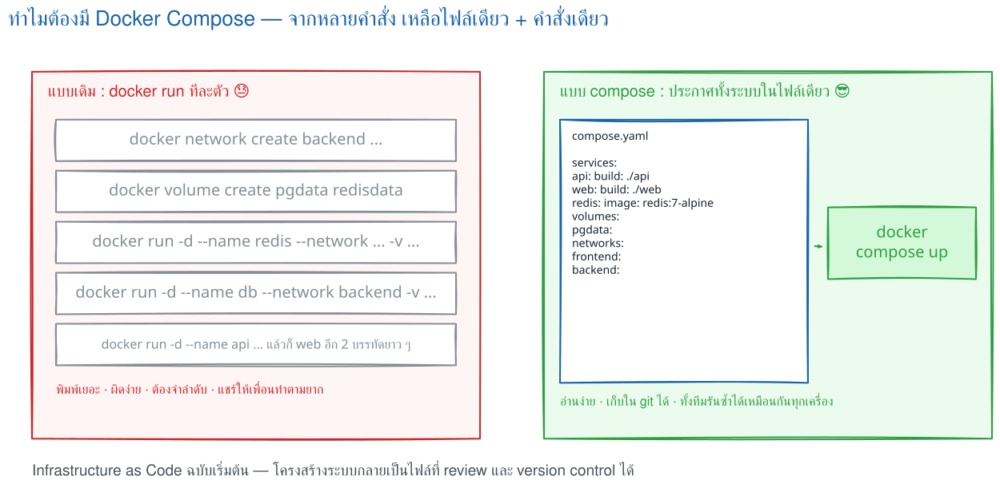
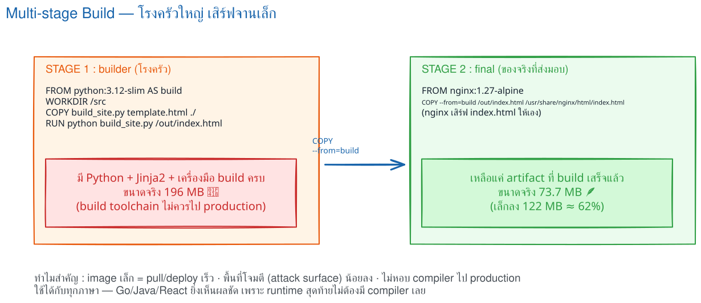
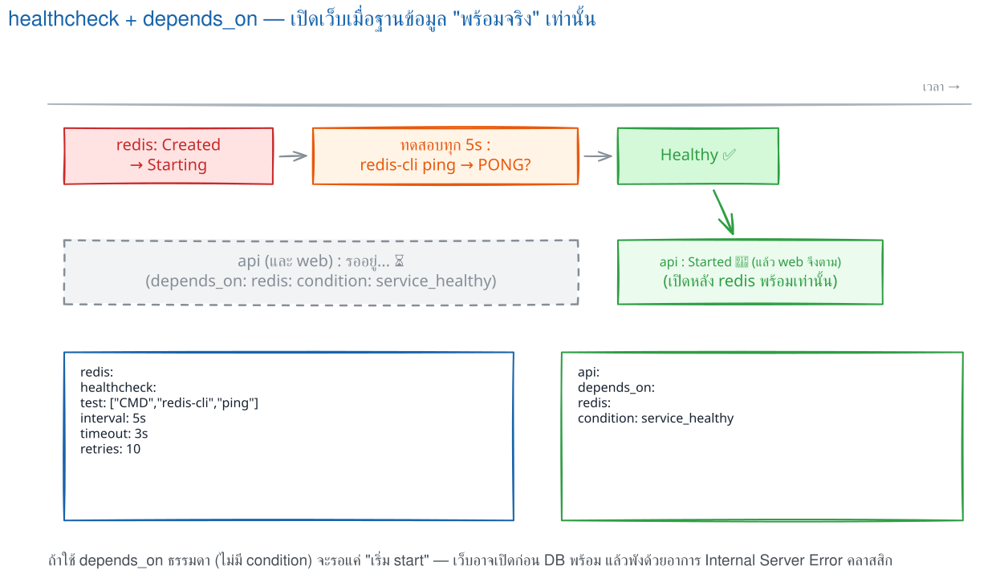
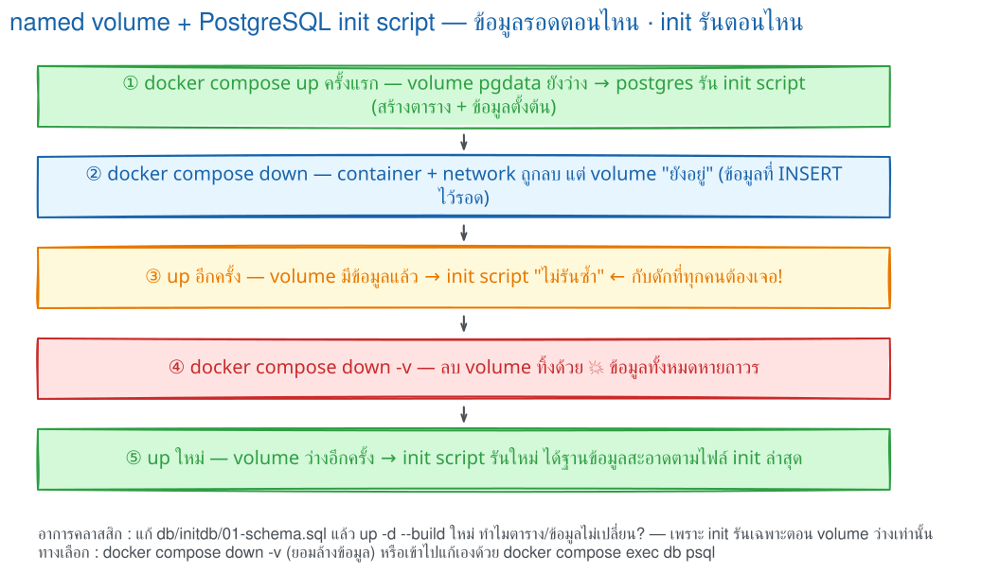
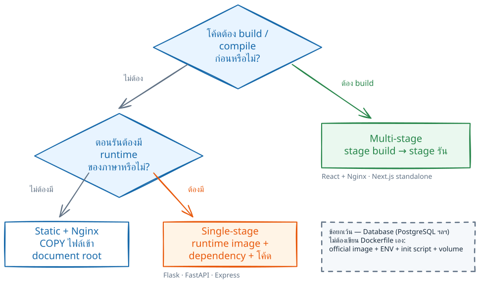

# LAB 7 — Docker Compose + Multi-stage build (capstone)

> โฟลเดอร์ `007_LAB_Compose_Multistage_Capstone` · ไฟล์ของแล็บ : `compose.yaml` · `.env.app` · `.dockerignore` · `web/` · `api/` · `db/initdb/01-schema.sql` · `verify.sh`

### 🎯 แล็บนี้ใน 30 วินาที

| | |
|---|---|
| **คำถามเดียวที่ตอบให้จบ** | ระบบ **4 service** ที่ต้องรอกันตอนบูตและมีข้อมูลถาวร ประกาศไว้ใน **ไฟล์เดียว** ได้อย่างไร |
| **ต้องผ่านอะไรมาก่อน** | ครบ **LAB 1–6** — แล็บนี้หยิบทุกเรื่องมาใช้พร้อมกัน |
| **เวลา** | ~50 นาที · การทดลอง **12 อัน** อันละ 3–5 นาที |
| **จบแล้วต้องทำได้เอง** | อ่าน/เขียน `compose.yaml` ทีละ key · ใช้ `healthcheck` ให้ระบบ **รอ** จริง · แยกชั้น network · รู้ว่าข้อมูลหายตอนไหน |
| **แล็บนี้ยัง *ไม่* สอน** | Compose หลายเครื่อง / Kubernetes อยู่นอกขอบเขต · พื้นฐานที่ไม่อธิบายซ้ำ : DNS ของชื่อ service (**LAB 6**) · ลำดับชั้น env (**LAB 4**) · layer cache (**LAB 2**) |

---

## ทฤษฎีก่อนลงมือ

### ระบบที่จะสร้าง : `devopsboard`


> 🖼 **วิธีอ่านรูปนี้:** วงสีฟ้า `frontend` กับวงสีชมพู `backend` **ซ้อนทับกัน** — ตรงพื้นที่ซ้อนคือ service ที่อยู่ทั้งสองวง (`web` และ `api`) · `db` กับ `redis` อยู่นอกวงฟ้าและไม่มี `ports:` เครื่องเราจึงเข้าไม่ถึงเลย

| service | สร้างจาก | เปิดออก host | network | volume |
|---|---|---|---|---|
| `web` | **multi-stage** : `python` สร้างไฟล์ static → runtime เป็น `nginx:1.27-alpine` | `8187:80` | frontend + backend | — |
| `api` | `python:3.12-slim` + Flask | `8087:5000` | frontend + backend | — |
| `redis` | `redis:7-alpine` | **ไม่เปิด** | backend | `redisdata` |
| `db` | `postgres:17-alpine` + init script | **ไม่เปิด** | backend | `pgdata` |

### ทำไมต้อง Compose



> 🖼 **วิธีอ่านรูปนี้:** ฝั่งซ้ายคือรายการงานที่ผู้ใช้ต้องจำเองทั้ง network, volume และลำดับ · ฝั่งขวารวมความสัมพันธ์เดียวกันไว้ในไฟล์เดียวที่ **commit ลง git ได้**

| สิ่งที่ทำด้วย `docker run` | key ใน `compose.yaml` |
|---|---|
| `docker build -t ...` | `build:` |
| `-p 8187:80` | `ports:` |
| `-e KEY=value` / `--env-file` | `environment:` / `env_file:` |
| `-v pgdata:/var/lib/...` | `volumes:` |
| `--network ...` | `networks:` |
| `--health-cmd` | `healthcheck:` |
| *(ทำไม่ได้)* | `depends_on: condition: service_healthy` |

### กฎ 4 ข้อที่ใช้ตลอดแล็บ

| กฎ | เหตุผล |
|---|---|
| `depends_on` เปล่า ๆ ไม่ได้ "รอ" | รอแค่ลำดับ start ต้องมี `healthcheck` + `condition: service_healthy` ถึงจะรอผลตรวจ |
| stage สุดท้ายควรมีเฉพาะของที่ใช้ตอนรัน | ลด image และลดเครื่องมือที่ไม่จำเป็นใน production |
| named volume ไม่ตายตาม container | ข้อมูลรอด `down` แต่ไม่รอด `down -v` |
| init script รันเฉพาะตอน data directory **ว่าง** | recreate container ไม่ทำให้ script รันซ้ำ |

### สิ่งที่มักเข้าใจผิด

- **คิดว่า** `depends_on` เปล่ารอฐานข้อมูลพร้อม → **จริง ๆ** รอเพียงลำดับเริ่มต้น (การทดลองที่ 7)
- **คิดว่า** multi-stage ทำให้ทุกแอปเล็กลงอัตโนมัติ → **จริง ๆ** ต้องคัด artifact เข้า stage สุดท้ายเอง
- **คิดว่า** recreate container ทำให้ init script รันใหม่ → **จริง ๆ** ตัวตัดสินคือ volume ว่างหรือไม่ (การทดลองที่ 11)

---

## เตรียมเครื่องเรียน

### ขั้นที่ 1 — เปิดกล่องเรียน

รันบน **เครื่องของเราเอง** — แล็บนี้ใช้ **2 พอร์ตแอป** :

```bash
docker rm -f devtools-df-lab7 2>/dev/null
docker run -dit --name devtools-df-lab7 --privileged \
  -p 2237:22 -p 8187:8187 -p 8087:8087 tuchsanai/devtools:2569_1
ssh root@localhost -p 2237        # password : passwd
```

### ขั้นที่ 2 — โหลดโค้ดแล็บ

**คำสั่งทุกอันหลังจากนี้พิมพ์ข้างในกล่องเรียน**

```bash
mkdir -p ~/labwork && cd ~/labwork
git clone https://github.com/Tuchsanai/DevTools.git
cd DevTools/02_Docker/02_Dockerfile_Build_Run_Compose_Guide/007_LAB_Compose_Multistage_Capstone
docker compose version
```

✅ **สิ่งที่ต้องเห็น** — เลขเวอร์ชันของ Compose plugin :

```
Docker Compose version v5.3.1
```

> 📝 สังเกตว่าเขียน **`docker compose` แบบเว้นวรรค** ซึ่งคือ Compose plugin รุ่นปัจจุบัน ไม่ใช่ `docker-compose` แบบขีดกลางของรุ่นเก่า

---

## การทดลองที่ 1 — อ่าน `compose.yaml` ทีละ key

**คำถาม:** ไฟล์เดียวนี้ประกาศอะไรไว้บ้าง

```bash
cat compose.yaml
```

ส่วนสำคัญของไฟล์ :

```yaml
services:
  web:
    build:
      context: ./web            # โฟลเดอร์ที่ใช้เป็น build context
    image: devopsboard-web:1.0  # ชื่อ image ที่ Compose จะตั้งให้หลัง build
    ports:
      - "8187:80"               # host 8187 → container 80 (nginx)
    networks: [frontend, backend]
    depends_on:
      api:
        condition: service_healthy   # รอจนกว่า api จะ healthy จริง
    restart: unless-stopped

  api:
    build: { context: ./api }
    image: devopsboard-api:1.0
    ports:
      - "8087:5000"
    networks: [frontend, backend]   # ต้องมี frontend ไม่งั้น ports: ไม่ทำงาน
    env_file: [.env.app]            # ค่าจำนวนมาก + รหัสผ่าน อยู่ในไฟล์แยก
    environment:
      APP_ENV: production           # ค่านี้ "ชนะ" APP_ENV ที่อยู่ใน .env.app
    depends_on:
      db:    { condition: service_healthy }
      redis: { condition: service_healthy }
    healthcheck:
      test: ["CMD", "python", "-c", "..."]
      interval: 5s
      retries: 12
      start_period: 5s

  redis:
    image: redis:7-alpine
    volumes: [ "redisdata:/data" ]
    networks: [backend]             # ไม่มี ports: → เข้าจาก host ไม่ได้เลย
    healthcheck:
      test: ["CMD", "redis-cli", "ping"]

  db:
    image: postgres:17-alpine
    env_file: [.env.app]
    environment: { POSTGRES_DB: appdb, POSTGRES_USER: appuser }
    volumes:
      - pgdata:/var/lib/postgresql/data
      - ./db/initdb:/docker-entrypoint-initdb.d:ro   # bind mount อ่านอย่างเดียว
    networks: [backend]
    healthcheck:
      test: ["CMD-SHELL", "pg_isready -U appuser -d appdb"]

volumes: { pgdata: , redisdata: }

networks:
  frontend:
  backend:
    internal: true                  # ออกอินเทอร์เน็ตไม่ได้ และ publish port ไม่ได้
```

**กฎ YAML ที่พลาดบ่อย — จำ 4 ข้อนี้พอ**

| กฎ | ถูก | ผิด |
|---|---|---|
| เยื้องด้วย **space** เท่านั้น | `␣␣image: nginx` | ใช้ปุ่ม Tab |
| `key: value` = map · `- item` = list | `ports:` แล้ว `␣␣- "8187:80"` | `ports:` แล้ว `␣␣8187:80` |
| ค่าที่มี `:` ให้ครอบเครื่องหมายคำพูด | `- "8187:80"` | `- 8187:80` |
| ค่าที่อาจถูกอ่านเป็น boolean/ตัวเลข ให้ครอบ | `PORT: "5000"` | `PORT: 5000` |

> 📝 **`POSTGRES_PASSWORD` ไม่ปรากฏใน `compose.yaml` เลย** — อยู่ใน `.env.app` ซึ่งถูกใส่ไว้ใน `.dockerignore` แล้ว และในงานจริงต้องอยู่ใน `.gitignore` ด้วย

---

## การทดลองที่ 2 — ตรวจไฟล์ก่อนรันจริง

**คำถาม:** เขียน YAML ถูกไหม รู้ได้ก่อนไหม

```bash
docker compose -p devopsboard config --quiet && echo 'YAML OK'
docker compose -p devopsboard config --services
```

✅ **สิ่งที่ต้องเห็น** — `YAML OK` และชื่อ service ครบ 4 (ลำดับอาจสลับ) :

```
YAML OK
db
redis
api
web
```

> 📝 `-p devopsboard` ตั้ง **ชื่อ project** เอง — ปกติ Compose ใช้ชื่อโฟลเดอร์ ซึ่งของเราคือ `007_LAB_...` ยาวและขึ้นต้นด้วยตัวเลข · **ต้องใส่ `-p devopsboard` ทุกคำสั่งในแล็บนี้** · `config --quiet` คือ "ตัวตรวจ syntax" ที่เร็วที่สุด

---

## การทดลองที่ 3 — สั่งครั้งเดียว ขึ้นทั้งระบบ

**คำถาม:** Compose ต้องทำอะไรบ้างกว่าจะได้ระบบครบ 4 service

```bash
docker compose -p devopsboard up -d --build
```

✅ **สิ่งที่ต้องเห็น** — สร้าง network 2 วง · volume 2 ก้อน · แล้ว start **ตามลำดับ dependency** โดย `api` รอ `db`/`redis` เป็น `Healthy` ก่อน :

```
 Container devopsboard-db-1     Created
 Container devopsboard-api-1    Created
 Container devopsboard-web-1    Created
 Container devopsboard-db-1     Started
 Container devopsboard-redis-1  Started
 Container devopsboard-db-1     Healthy      ← ผ่าน healthcheck แล้ว
 Container devopsboard-redis-1  Healthy
 Container devopsboard-api-1    Started      ← เพิ่งได้เริ่ม หลังสองตัวบน Healthy
 Container devopsboard-api-1    Healthy
 Container devopsboard-web-1    Started      ← เริ่มเป็นตัวสุดท้าย
```

> 📝 `--build` **บังคับ build image ใหม่ก่อนเสมอ** — ถ้าแก้ Dockerfile หรือ source แล้วสั่ง `up -d` เฉย ๆ Compose จะใช้ image เดิม **นี่คือกับดักอันดับหนึ่งของมือใหม่** · สังเกตคำว่า `Healthy` ไม่ใช่แค่ `Started` — นั่นคือ `condition: service_healthy` ทำงาน

---

## การทดลองที่ 4 — Compose ตั้งชื่อให้อย่างไร

**คำถาม:** container / network / volume ได้ชื่อว่าอะไร

```bash
docker compose -p devopsboard ps --format 'table {{.Service}}\t{{.Name}}\t{{.Ports}}'
docker network ls --filter name=devopsboard
docker volume ls --filter name=devopsboard
```

✅ **สิ่งที่ต้องเห็น** — **container ใช้ขีดกลาง** แต่ **network/volume ใช้ขีดล่าง** :

```
SERVICE   NAME                   PORTS
api       devopsboard-api-1      0.0.0.0:8087->5000/tcp
db        devopsboard-db-1       5432/tcp
redis     devopsboard-redis-1    6379/tcp
web       devopsboard-web-1      0.0.0.0:8187->80/tcp

NAME                     DRIVER
devopsboard_backend      bridge
devopsboard_frontend     bridge

VOLUME NAME
devopsboard_pgdata
devopsboard_redisdata
```

> 📝 **กฎการตั้งชื่อ:** container = `<project>-<service>-<N>` (ขีดกลาง มีเลขลำดับเผื่อ scale) · network/volume = `<project>_<ชื่อ>` (ขีดล่าง) · สังเกตว่า `db` กับ `redis` มีแต่พอร์ตฝั่ง container **ไม่มี `0.0.0.0:...->`**

---

## การทดลองที่ 5 — เปิดหน้า DevOps Board

**คำถาม:** ข้อมูลบนหน้าเว็บมาจากไหน

เปิดในเบราว์เซอร์ที่ **`http://localhost:8187`** :


**เดินตาม request หนึ่งครั้ง:**

1. เบราว์เซอร์ → พอร์ต **8187** ของกล่องเรียน → พอร์ต **80** ของ container `web`
2. `web` (nginx) ส่งไฟล์ `index.html` ที่ **stage build สร้างไว้ตั้งแต่ตอน build**
3. JavaScript เรียก `/api/stats` → nginx **reverse proxy** ไปที่ `http://api:5000/stats` (ชื่อ `api` แปลงเป็น IP ด้วย DNS ภายในของ Compose — หลักการเดียวกับ **LAB 6**)
4. `api` (Flask) สั่ง `INCR` ที่ `redis:6379` แล้ว `SELECT` จาก `db:5432`
5. ผลย้อนกลับทางเดิม → หน้า dashboard แสดงตัวเลขจริง

ตรวจจาก terminal ได้เหมือนกัน :

```bash
curl -s http://localhost:8187/api/stats | head -c 200; echo
```

> 📝 ทุกค่าบนหน้าเว็บถูกอ่านสดจาก Redis และ PostgreSQL จริง ไม่มีค่าไหน hard-code

---

## การทดลองที่ 6 — multi-stage ลดขนาด image ได้เท่าไร

**คำถาม:** stage แรกที่มี Python + Jinja2 ติดไปกับ image สุดท้ายไหม

`web/Dockerfile` มี `FROM` **สองครั้ง** = สอง stage :

```dockerfile
# Stage 1: build environment — จะไม่ติดไปกับ runtime image
FROM python:3.12-slim AS build
WORKDIR /src
COPY build_site.py template.html ./
RUN pip install --no-cache-dir jinja2==3.1.4 csscompressor==0.9.5   # toolchain ที่หนัก
RUN python build_site.py /out/index.html                            # สร้าง artifact

# Stage 2: nginx Alpine ขนาดเล็ก ไม่มี Python
FROM nginx:1.27-alpine
COPY --from=build /out/index.html /usr/share/nginx/html/index.html  # คัดเฉพาะ artifact
COPY nginx.conf /etc/nginx/conf.d/default.conf
```

ชั่งน้ำหนักทั้งสอง stage :

```bash
docker build --target build -t devopsboard-web:builder ./web
docker images --format 'table {{.Repository}}:{{.Tag}}\t{{.Size}}' | grep devopsboard
```

✅ **สิ่งที่ต้องเห็น** — stage build **196MB** แต่ image ที่ deploy จริงเหลือ **73.7MB** :

```
REPOSITORY:TAG            SIZE
devopsboard-web:1.0       73.7MB     ← image ที่ deploy จริง
devopsboard-web:builder   196MB      ← stage build ที่ถูกทิ้ง
devopsboard-api:1.0       207MB      ← single stage เพราะ runtime คือ Python
```



> 🖼 **วิธีอ่านรูปนี้:** ลูกศร `COPY --from=build` ขน **เฉพาะ artifact** ไม่ได้ขน Python หรือ Jinja2 ไปด้วย — **เล็กลง 122 MB ≈ 62%**

พิสูจน์อีกชั้นว่าเครื่องมือ build ไม่ติดไปด้วย :

```bash
docker run --rm devopsboard-web:1.0 python --version
```

✅ **สิ่งที่ต้องเห็น** — **error คือผลลัพธ์ที่ถูกต้อง** เพราะแปลว่า Python ไม่ได้ติดไปกับ image ที่จะขึ้น production :

```
/docker-entrypoint.sh: exec: line 47: python: not found
```

> 📝 **หลักการเลือก:** ถามสองข้อ — *"แอปต้อง build ก่อนไหม"* และ *"ตอนรันต้องมี runtime ภาษาอะไรใน image"* · ถ้าคำตอบคือ "build ด้วยเครื่องมือหนัก แต่รันด้วยไฟล์ static" ให้ใช้ multi-stage ทันที (React/Next.js/Java เข้าเงื่อนไขนี้เต็ม ๆ) · ส่วน `api/` ของเราไม่เข้า เพราะตอนรันก็ยังต้องมี Python อยู่ดี

---

## การทดลองที่ 7 — `healthcheck` ทำให้ระบบรอจริงไหม

**คำถาม:** Compose รู้ได้อย่างไรว่า `db` พร้อมรับ connection แล้ว

```bash
docker inspect --format '{{.Name}} => {{.State.Health.Status}}' \
  devopsboard-db-1 devopsboard-redis-1 devopsboard-api-1
docker inspect --format '{{json (index .State.Health.Log 0)}}' devopsboard-db-1
```

✅ **สิ่งที่ต้องเห็น** — `healthy` ครบสามตัว และเห็น **ผลการตรวจจริง** พร้อม `ExitCode: 0` :

```
/devopsboard-db-1 => healthy
/devopsboard-redis-1 => healthy
/devopsboard-api-1 => healthy

{"Start":"2026-08-16T21:27:56...","ExitCode":0,"Output":"/var/run/postgresql:5432 - accepting connections\n"}
```



> 🖼 **วิธีอ่านรูปนี้:** การสร้าง container กับการพร้อมให้บริการเป็น **คนละจังหวะ** — จุดตรวจทุก 5 วินาทีทำให้สถานะยังเป็น `starting` จนผลผ่านจึงเปลี่ยนเป็น `healthy` แล้วจึงปลดล็อกให้ `api` เริ่ม

> 📝 **ขอบเขตที่ต้องรู้:** `healthcheck` + `service_healthy` ช่วยเรื่อง **ลำดับตอนเริ่ม** เท่านั้น — หลังระบบขึ้นแล้ว database ยังล่มกลางทางได้ ดังนั้น **โค้ดแอปต้อง retry เอง** ด้วย

---

## การทดลองที่ 8 — `environment:` ชนะ `env_file:`

**คำถาม:** ประกาศค่าเดียวกันทั้งสองที่ จะได้ค่าไหน (ทบทวนจาก **LAB 4**)

```bash
grep -n 'APP_ENV' .env.app
docker compose -p devopsboard exec api env | grep -E 'APP_ENV|BOARD_TEAM'
```

✅ **สิ่งที่ต้องเห็น** — ไฟล์บอก `from-env-file` แต่ container เห็น `production` :

```
7:APP_ENV=from-env-file

BOARD_TEAM=DevOps Board Team 2569
APP_ENV=production
```

> 📝 **ลำดับความสำคัญ:** `docker compose run -e` → `environment:` → `env_file:` → `ENV` ใน Dockerfile · `BOARD_TEAM` ที่ไม่ได้ประกาศซ้ำก็ไหลมาจาก `.env.app` ตามปกติ
>
> ⚠️ `POSTGRES_PASSWORD` โผล่ใน `docker compose exec api env` และ `docker compose config` — **อย่าวางผลสองคำสั่งนี้ในที่สาธารณะ**

---

## การทดลองที่ 9 — `internal: true` ล้อมรั้วได้จริงไหม

**คำถาม:** container ที่อยู่แค่ `frontend` จะเห็น `db` ไหม

```bash
docker run --rm --network devopsboard_frontend busybox:1.36 \
  sh -c 'nc -z -w 3 db 5432; echo "จาก frontend exit=$?"'
docker run --rm --network devopsboard_backend busybox:1.36 \
  sh -c 'nc -z -w 3 db 5432; echo "จาก backend exit=$?"'
```

✅ **สิ่งที่ต้องเห็น** — จาก `frontend` **แม้แต่ชื่อ `db` ก็แปลงเป็น IP ไม่ได้** ส่วนจาก `backend` ต่อติด :

```
nc: bad address 'db'
จาก frontend exit=1

จาก backend exit=0
```

แล้วจาก **host** ล่ะ :

```bash
curl -sS -m 3 http://localhost:5432 ; curl -sS -m 3 http://localhost:6379
```

✅ **สิ่งที่ต้องเห็น** — เข้าไม่ได้ทั้งคู่ :

```
curl: (7) Failed to connect to localhost port 5432 after 0 ms: Couldn't connect to server
curl: (7) Failed to connect to localhost port 6379 after 0 ms: Couldn't connect to server
```

> 📝 **บทเรียน:** database ที่มีแค่ service ใน project เดียวกันใช้ **ไม่ต้อง publish port ออก host เลย** · แค่ไม่เขียน `ports:` ก็ปิดประตูจากภายนอกได้แล้ว และการแยก `frontend`/`backend` + `internal: true` ทำให้ container ที่ไม่เกี่ยวข้องมองไม่เห็น `db` แม้แต่ชื่อ
>
> ⚠️ **กับดัก:** `internal: true` ทำให้ **publish port ไม่ได้และไม่ฟ้อง error** — นี่คือเหตุผลที่ `api` ต้องอยู่ `frontend` ด้วย ไม่งั้นพอร์ต `8087` จะหายเงียบ ๆ

---

## การทดลองที่ 10 — ข้อมูลรอด `down` ไหม

**คำถาม:** ลบ container ทั้งหมดแล้วข้อมูลใน PostgreSQL หายไหม

เพิ่มข้อมูลใหม่ก่อน (กดปุ่มบนหน้าเว็บก็ได้ ผลเหมือนกัน) :

```bash
docker compose -p devopsboard exec db psql -U appuser -d appdb -c 'SELECT count(*) FROM items;'
curl -sS -X POST http://localhost:8187/api/items -H 'Content-Type: application/json' \
  -d '{"name":"ทดสอบ volume","owner":"student"}' >/dev/null
docker compose -p devopsboard exec db psql -U appuser -d appdb -c 'SELECT count(*) FROM items;'
```

✅ **สิ่งที่ต้องเห็น** — จาก **4 แถว (seed)** เพิ่มเป็น **5 แถว** :

```
 count
-------
     4

 count
-------
     5
```

ทีนี้ลบทั้งระบบแล้วสร้างใหม่ :

```bash
docker compose -p devopsboard down
docker volume ls --filter name=devopsboard
docker compose -p devopsboard up -d
sleep 8
docker compose -p devopsboard exec db psql -U appuser -d appdb -c 'SELECT count(*) FROM items;'
```

✅ **สิ่งที่ต้องเห็น** — container ถูกลบครบ แต่ **volume ยังอยู่** และข้อมูลครบ 5 แถวเหมือนเดิม :

```
 Container devopsboard-web-1 Removed
 Network devopsboard_frontend Removed

VOLUME NAME
devopsboard_pgdata
devopsboard_redisdata

 count
-------
     5
```

> 📝 **นี่คือเหตุผลที่ database ต้องใช้ named volume:** filesystem ของ container เป็นชั้นชั่วคราว ลบ container เมื่อไหร่ข้อมูลในชั้นนั้นหายทันที · `pgdata:/var/lib/postgresql/data` ย้ายข้อมูลออกมาไว้ในพื้นที่ที่ Docker ดูแล **อายุข้อมูลจึงไม่ผูกกับอายุ container**

---

## การทดลองที่ 11 — `down -v` กับ init script

**คำถาม:** แก้ init script แล้ว recreate `db` แถวใหม่จะขึ้นไหม

```bash
printf "\nINSERT INTO items (name, owner, status) VALUES ('รายการใหม่จาก init script', 'ops team', 'seed');\n" >> db/initdb/01-schema.sql
docker compose -p devopsboard up -d --force-recreate db
sleep 6
docker compose -p devopsboard exec db psql -U appuser -d appdb -c 'SELECT count(*) FROM items;'
```

✅ **สิ่งที่ต้องเห็น** — **ไม่มีผลเลย** ยังเป็น 5 แถวเท่าเดิม :

```
 count
-------
     5
```



> 🖼 **วิธีอ่านรูปนี้:** จับตาว่า **volume ยังอยู่หรือถูกลบ** ไม่ใช่ดูว่า container ถูกสร้างใหม่หรือไม่ — รอบ `up` แรก volume ว่างจึงรัน init ส่วนรอบหลังข้อมูลเดิมทำให้ init ถูกข้าม

ทีนี้ลบ volume ทิ้งจริง ๆ :

```bash
docker compose -p devopsboard down -v
docker compose -p devopsboard up -d
sleep 10
docker compose -p devopsboard exec db psql -U appuser -d appdb -c 'SELECT count(*) FROM items;'
```

✅ **สิ่งที่ต้องเห็น** — init script รันอีกครั้งได้ **5 แถว** (4 seed เดิม + 1 แถวที่เพิ่งเพิ่มในไฟล์) — และ **แถวที่เราเพิ่มผ่าน API หายไปถาวร** :

```
 Volume devopsboard_pgdata Removed
 Volume devopsboard_redisdata Removed

 count
-------
     5
```

> 📝 **กับดักที่ทุกคนต้องเจอ:** ไฟล์ใน `/docker-entrypoint-initdb.d/` ถูกรัน **เฉพาะครั้งที่ data directory ยังว่างเท่านั้น** · จะให้มีผลต้องลบ volume ทิ้งก่อน ซึ่งแปลว่า **ข้อมูลทั้งหมดหาย** — เหมาะกับ dev เท่านั้น ระบบจริงต้องใช้เครื่องมือ **migration** (Alembic, Flyway, Liquibase)

คืนไฟล์กลับ :

```bash
git checkout -- db/initdb/01-schema.sql
```

---

## การทดลองที่ 12 — เครื่องมือประจำวัน

**คำถาม:** ระบบขึ้นแล้ว ดูอะไรได้บ้าง

```bash
docker compose -p devopsboard exec api sh -c 'getent hosts redis; getent hosts db; getent hosts web'
curl -s http://localhost:8187/api/stats > /dev/null      # เรียกหนึ่งครั้งให้ตัวนับขยับ
docker compose -p devopsboard exec redis redis-cli GET devopsboard:visits
docker compose -p devopsboard logs --tail 3 api
```

✅ **สิ่งที่ต้องเห็น** — `api` มองเห็นทั้ง `redis`, `db` (ผ่าน backend) และ `web` (ผ่าน frontend) **โดยไม่ต้องรู้ IP เลย** :

```
172.20.0.3      redis
172.20.0.2      db
172.19.0.3      web

6

api-1  | 172.19.0.3 - - [16/Aug/2026 14:30:33] "GET /stats HTTP/1.0" 200 -
```

> 📝 **ตัวเลข `visits` ของแต่ละคนไม่ตรงกัน** — มันคือจำนวนครั้งที่ `/stats` ถูกเรียกนับจาก `redisdata` ถูกสร้างใหม่ (การทดลองที่ 11 เพิ่ง `down -v` ไป) · การเปิดหน้าเว็บและ `verify.sh` ก็ทำให้ขยับด้วย · สังเกตว่า `redis`/`db` อยู่คนละ subnet กับ `web` (`172.20.x` = backend · `172.19.x` = frontend) — ยืนยันการแยกชั้นจากการทดลองที่ 9 อีกครั้ง · `docker compose exec <service>` ใช้ **ชื่อ service** แทนชื่อ container ไม่ต้องจำเลข `-1` · เปลี่ยนเป็น `logs -f api` เพื่อติดตามสด (กด `Ctrl+C` เพื่อหยุดดู container ยังรันต่อ)

---

## เลือก Dockerfile ให้ตรงกับแอป

| ประเภทแอป | ตอน build เกิดอะไร | runtime image ที่ควรได้ | ต้อง multi-stage ไหม |
|---|---|---|---|
| Static HTML/CSS/JS | ไม่ต้อง compile | `nginx:1.27-alpine` + `COPY ./public/` | ไม่ต้อง |
| Python Flask | `pip install` | `python:3.12-slim` (งานจริงใช้ Gunicorn) | ไม่ต้อง — **นี่คือ `api/` ของเรา** |
| Node.js / Express | `npm ci --omit=dev` | `node:22-alpine` + `USER node` | ไม่ต้อง (ยกเว้นใช้ TypeScript) |
| React SPA | `npm run build` → ไฟล์ static | **`nginx:1.27-alpine` เท่านั้น** | **ต้อง** — แนวเดียวกับ `web/` ของเรา |
| Next.js standalone | `next build` (`output: 'standalone'`) | `node:22-alpine` เฉพาะ output ที่ deploy | **ต้อง (3 stage)** |
| PostgreSQL | ไม่ compile | official image + init script + named volume | ไม่ต้อง — **นี่คือ `db/` ของเรา** |



> 🖼 **วิธีอ่านรูปนี้:** เริ่มจากคำถามบนสุดว่าแอปต้อง build เพื่อสร้าง artifact หรือไม่ แล้วตามกิ่งไปดูว่าตอนรันยังต้องมี runtime ภาษาเดิมอยู่หรือเปล่า

---

## ตรวจงานด้วย `verify.sh`

```bash
bash verify.sh ; echo "exit code = $?"
```

✅ **สิ่งที่ต้องเห็น** — `[PASS]` ทุกบรรทัด ปิดท้าย `ALL CHECKS PASSED`

> 📝 สคริปต์ใช้ชื่อ project ของตัวเองและเก็บกวาดของตัวเองทิ้งเมื่อจบ

---

## แก้ปัญหาที่พบบ่อย

| อาการ | สาเหตุ | วิธีแก้ |
|---|---|---|
| `docker compose: 'compose' is not a docker command` | เครื่องมีแต่ `docker-compose` รุ่นเก่า (v1) | ใช้เครื่องเรียน `tuchsanai/devtools:2569_1` ที่มี Compose plugin |
| แก้โค้ดแล้ว `up -d` แต่ผลไม่เปลี่ยน | ไม่ได้ใส่ `--build` Compose จึงใช้ image เดิม | `docker compose -p devopsboard up -d --build` |
| ประกาศ `ports:` แล้วแต่ `ps` ไม่ขึ้น `0.0.0.0:...->` และ **ไม่มี error** | service นั้นอยู่แต่ network ที่ `internal: true` | เพิ่ม network ที่ไม่ internal (เช่น `frontend`) ให้ service นั้นด้วย |
| `Conflict. The container name ... is already in use` | มี container ชื่อชนจาก project อื่น | ใช้ `-p <project>` ให้ต่างกัน หรือ `docker rm -f <ชื่อ>` |
| `Bind for 0.0.0.0:8187 failed: port is already allocated` | พอร์ตซ้ำกับ container อื่น (เช่น LAB ก่อนหน้าที่ยังไม่ได้ลบ) | `docker ps` หาว่าใครจอง แล้วลบ หรือเปลี่ยนเลขพอร์ตซ้าย |
| `api` ขึ้นแล้วแต่ต่อ `db` ไม่ได้ตอนบูต | ใช้ `depends_on` เปล่า ๆ ซึ่งไม่รอ readiness | ใส่ `healthcheck` ที่ `db` + `condition: service_healthy` ที่ `api` |
| แก้ init script แล้วแถวใหม่ไม่ขึ้น | volume ไม่ว่าง init script จึงถูกข้าม | `down -v` แล้ว `up` ใหม่ (**ข้อมูลหายหมด**) หรือใช้ migration tool |
| ข้อมูลหายหลัง `down` | เผลอสั่ง `down -v` | `down` เฉย ๆ ไม่ลบ volume · ตรวจด้วย `docker volume ls` ก่อนเสมอ |
| YAML error `did not find expected key` | เยื้องด้วย Tab หรือเยื้องผิดชั้น | ใช้ space เท่านั้น · ตรวจด้วย `docker compose config --quiet` ก่อนรัน |

---

## เก็บกวาด

**ในกล่องเรียน:**

```bash
docker compose -p devopsboard down -v
docker image rm devopsboard-web:1.0 devopsboard-api:1.0 devopsboard-web:builder 2>/dev/null
docker ps -a
docker volume ls
```

> 📝 `down -v` ลบ container + network + **volume** ทั้งหมดของ project · ตรวจว่า `docker volume ls` ไม่เหลือ `devopsboard_*`

**ออกจากกล่องแล้วลบกล่องบนเครื่องเรา:**

```bash
exit
docker rm -f devtools-df-lab7
docker ps -a --filter "name=^devtools-"
```

---

## สรุปคำสั่งของแล็บนี้

| คำสั่ง | ความหมาย |
|---|---|
| `docker compose -p <project> up -d --build` | build แล้วทำให้สภาพจริงตรงกับที่ประกาศไว้ในไฟล์ |
| `docker compose -p <project> ps` | ดูสถานะทุก service พร้อม health |
| `docker compose -p <project> config --quiet` | ตรวจ syntax ของ YAML โดยไม่รันอะไร |
| `docker compose -p <project> logs --tail N <service>` | ดู log ท้าย ๆ (`-f` เพื่อติดตามสด) |
| `docker compose -p <project> exec <service> <คำสั่ง>` | สั่งงานข้างใน service (ใช้ **ชื่อ service** ไม่ใช่ชื่อ container) |
| `docker compose -p <project> up -d --force-recreate <service>` | ลบแล้วสร้าง container ของ service นั้นใหม่ |
| `docker compose -p <project> down` | ลบ container + network — **ไม่ลบ volume** |
| `docker compose -p <project> down -v` | ลบ **รวม volume** ด้วย — ข้อมูลหายถาวร |
| `docker build --target <stage> -t <ชื่อ> <path>` | build หยุดที่ stage ที่ระบุ (ใช้ชั่งขนาด stage กลาง) |
| `docker inspect --format '{{.State.Health.Status}}' <container>` | อ่านสถานะ health จริงของ container |

> **จำ 4 อย่าง:** `--build` ไม่ใส่ = ได้ของเก่า · `depends_on` เปล่า ๆ ไม่ได้รอ · `internal: true` ทำให้ publish port ไม่ได้แบบเงียบ ๆ · `down` ≠ `down -v`

## ✅ เช็กลิสต์ก่อนจบแล็บ

- [ ] อธิบายได้ว่า key ไหนใน `compose.yaml` แทน option ไหนของ `docker run`
- [ ] `up -d --build` แล้วเห็น `Healthy` ก่อน `Started` และอธิบายลำดับได้
- [ ] บอกได้ว่าทำไม container ใช้ **ขีดกลาง** แต่ network/volume ใช้ **ขีดล่าง**
- [ ] เปิด `http://localhost:8187` เห็นข้อมูลจริงจาก Redis + PostgreSQL
- [ ] `--target build` แล้วเทียบขนาดได้ **196MB → 73.7MB** และ `python --version` ใน image สุดท้าย **ต้อง error**
- [ ] `docker inspect` เห็น `healthy` ครบสามตัว พร้อม `ExitCode: 0` ของคำสั่งตรวจ
- [ ] `APP_ENV` ที่ container เห็นคือ `production` ไม่ใช่ `from-env-file`
- [ ] จาก `frontend` ต่อ `db` ไม่ได้ (`bad address`) แต่จาก `backend` ต่อได้
- [ ] เพิ่มข้อมูล → `down` → `up` แล้วข้อมูล **ยังอยู่** · `down -v` แล้ว **หายถาวร**
- [ ] แก้ init script แล้ว `--force-recreate db` **ไม่มีผล** จนกว่าจะลบ volume
- [ ] `bash verify.sh` ขึ้น `ALL CHECKS PASSED` และเก็บกวาดจนไม่เหลือ volume `devopsboard_*`

*ผลลัพธ์ทั้งหมดในเอกสารนี้มาจากการรันจริงในเครื่องเรียน `tuchsanai/devtools:2569_1`*
