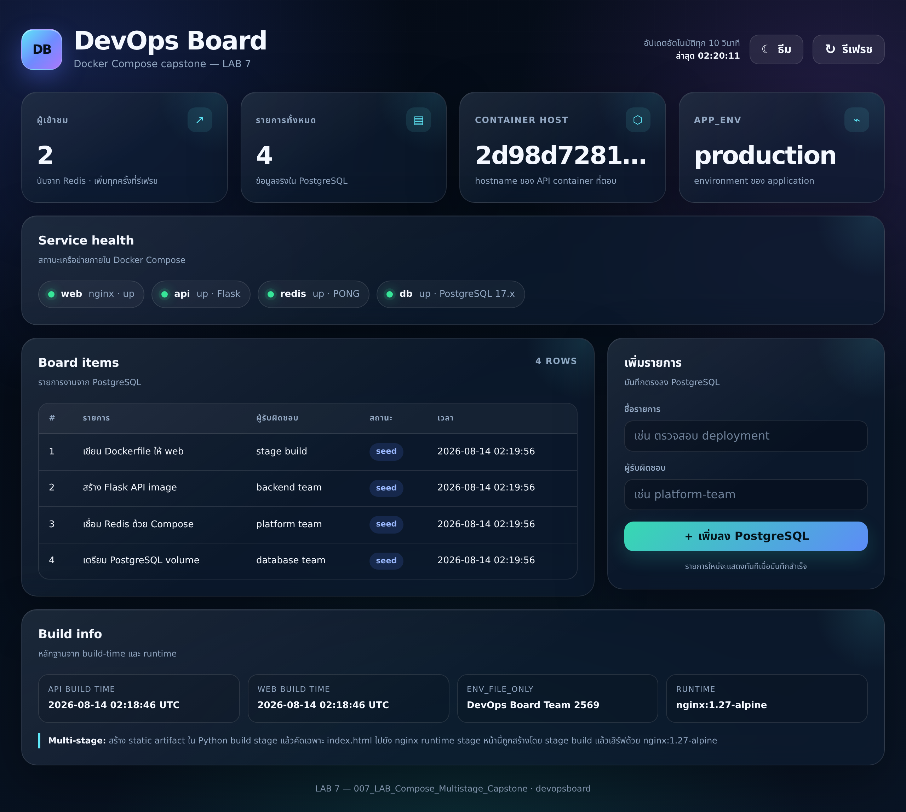
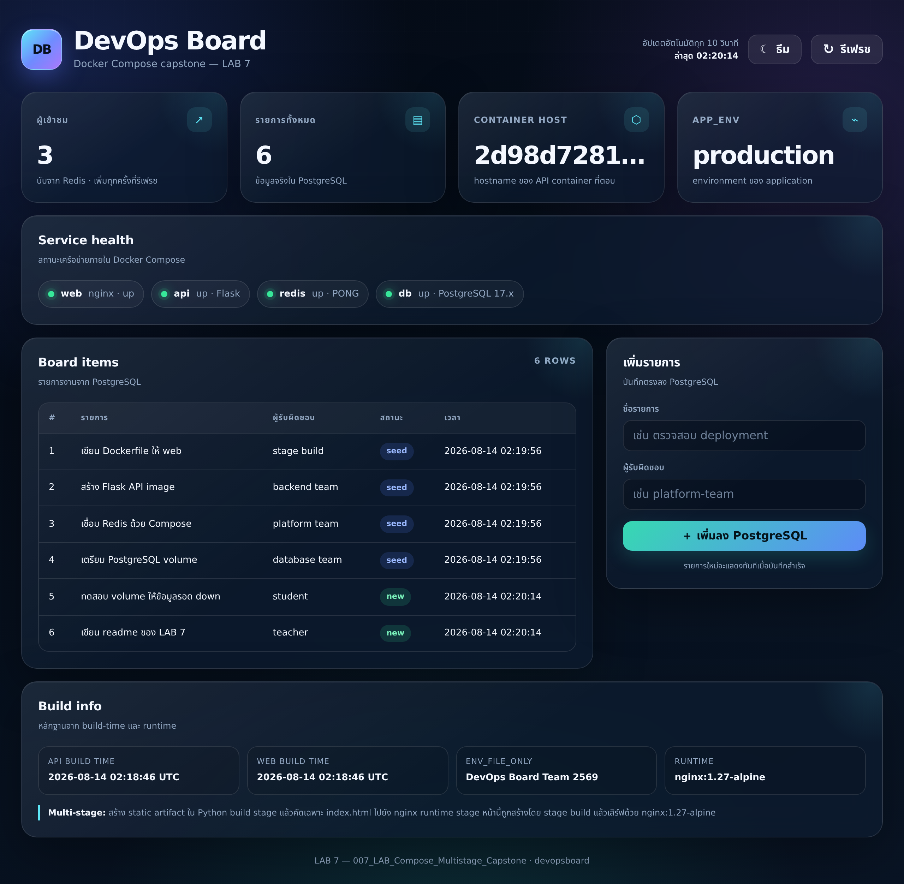

# LAB 7 — Docker Compose + Multi-stage build : ประกอบร่างระบบ 4 service ด้วยไฟล์เดียว (capstone)

> โฟลเดอร์ `007_LAB_Compose_Multistage_Capstone` = **LAB สุดท้าย** ของชุด "Dockerfile → Build → Run → Compose" ครอบคลุม **ตอนที่ 10 (Docker Compose)** · **ตอนที่ 11 (Multi-stage build)** · **ตอนที่ 12 (ตัวอย่าง Dockerfile 7 เทคโนโลยี)**
> ไฟล์ในโฟลเดอร์นี้ : `compose.yaml` · `.env.app` · `.dockerignore` · `web/` (Dockerfile multi-stage + `build_site.py` + `template.html` + `nginx.conf`) · `api/` (Dockerfile + `app.py` + `requirements.txt`) · `db/initdb/01-schema.sql` · `verify.sh` · `images/` · `test_logs/`

ระบบที่เราจะสร้างชื่อ **`devopsboard`** — หน้า dashboard ที่ดึงข้อมูล **จริง** จาก Redis และ PostgreSQL :

| service | สร้างจาก | พอร์ตที่เปิดออก host | network |
|---|---|---|---|
| `web` | **multi-stage build** : stage `build` เป็น `python:3.12-slim` สร้างไฟล์ static → runtime เป็น `nginx:1.27-alpine` | `8187:80` | frontend + backend |
| `api` | build จาก `python:3.12-slim` (Flask + redis + psycopg) | `8087:5000` | frontend + backend |
| `redis` | `redis:7-alpine` | **ไม่เปิด** | backend เท่านั้น |
| `db` | `postgres:17-alpine` + init script | **ไม่เปิด** | backend เท่านั้น |

## สิ่งที่จะได้เรียนรู้

- แปลง `docker run` หลายบรรทัดให้เป็น **`compose.yaml` ไฟล์เดียว** และอ่านออกทีละ key : `build` · `image` · `ports` · `environment` · `env_file` · `volumes` · `networks` · `depends_on` · `healthcheck` · `restart`
- **กฎ YAML ที่พลาดบ่อย** — ห้าม tab, เยื้องด้วย space, `-` คือ list, ค่าที่มี `:` ควรครอบเครื่องหมายคำพูด — พร้อมทำให้พังจริงแล้วอ่าน error
- **ชื่อที่ Compose ตั้งให้** : container `devopsboard-web-1` (ขีดกลาง) แต่ network/volume `devopsboard_frontend` / `devopsboard_pgdata` (ขีดล่าง)
- **Multi-stage build** : พิสูจน์ด้วยตัวเลขขนาด image จริง ว่า `COPY --from=build` คัดมาเฉพาะ artifact ทำให้ runtime image เล็กลง **62%**
- **healthcheck + `condition: service_healthy`** ทำให้ Compose **รอ** จริง ไม่ใช่แค่เรียงลำดับการ start
- **named volume** ทำให้ข้อมูลรอด `docker compose down` แต่ **หายถาวร** เมื่อ `down -v`
- **แยกชั้น network** ด้วย `internal: true` — คอนเทนเนอร์ที่อยู่แค่ `frontend` มองไม่เห็น `db` เลย แม้แต่ชื่อ DNS
- **PostgreSQL init script** (`/docker-entrypoint-initdb.d/`) รันเฉพาะตอน volume ว่างครั้งแรก พร้อมกับดักที่ทุกคนต้องเจอ
- `environment:` ชนะ `env_file:` และการเก็บรหัสผ่านไว้นอก `compose.yaml`

## ภาพรวมของแล็บนี้

1. **เทียบ "ก่อน–หลัง"** — เขียน `docker run` 7 บรรทัดสำหรับระบบ 4 service เทียบกับ `compose.yaml` ไฟล์เดียว แล้วดูตารางแปลง option ต่อ key
2. **อ่าน `compose.yaml` ของ devopsboard ทีละบรรทัด** — ทุก key ที่จะใช้ในแล็บนี้อยู่ในไฟล์เดียว
3. **`docker compose up -d --build`** — ดู Compose build 2 image, สร้าง network 2 วง, สร้าง volume 2 ก้อน และ **รอ healthcheck** ก่อนเริ่ม service ถัดไป
4. **อ่านชื่อที่ Compose ตั้งให้** ด้วย `docker ps` / `docker network ls` / `docker volume ls`
5. **เปิดหน้า DevOps Board ที่ `http://localhost:8187`** — ตัวนับผู้เข้าชมจาก Redis, ตารางจาก PostgreSQL, ไฟสถานะ service, และฟอร์มเพิ่มรายการที่เขียนลงฐานข้อมูลจริง
6. **พิสูจน์ multi-stage** — build เฉพาะ stage `build` ออกมาเทียบขนาดกับ image สุดท้าย
7. **พิสูจน์ healthcheck / env / network / volume / init script** ทีละเรื่อง โดยมีหลักฐานจากคำสั่งจริง
8. **ทำให้พัง** — YAML ผิด 3 แบบ, ถอด network ผิดจนพอร์ตหายเงียบ ๆ, `--scale` ชนพอร์ต และปิดท้ายด้วย `down -v` ที่ลบข้อมูลทิ้ง

> **คำถามก่อนเริ่ม:** ถ้า `db` ใช้เวลา boot 8 วินาที แต่ `api` ต่อฐานข้อมูลทันทีที่ start — `depends_on` แบบธรรมดาช่วยได้ไหม? และถ้าเราลบ container ทั้งหมดด้วย `docker compose down` ข้อมูลใน PostgreSQL จะหายหรือไม่? แล้ว `down -v` ล่ะ? แล็บนี้จะพิสูจน์ทั้งสามคำถามด้วยผลรันจริง

### Terminal Map

| หน้าต่าง | หน้าที่ |
|---|---|
| **T1** | หน้าต่างหลัก — `docker compose` ทุกคำสั่ง, `curl`, `psql` |
| **T2** | (ใช้เฉพาะข้อ 13) ติดตาม log แบบ `docker compose logs -f api` ซึ่งเป็นคำสั่ง blocking |

แล็บนี้ใช้ **หน้าต่างเดียวก็จบได้** ยกเว้นตอนที่อยากดู log ไหลสด ๆ พร้อมยิง request จากอีกหน้าต่าง

---

## 0. เตรียมเครื่องเรียน

ทำบนเครื่องของเราเอง (ไม่ใช้ cloud) — เปิด container ที่ติดตั้ง Docker มาให้แล้ว :

```bash
docker rm -f devtools-df-lab7 2>/dev/null
docker run -dit --name devtools-df-lab7 --privileged \
  -p 2237:22 -p 8187:8187 -p 8087:8087 \
  tuchsanai/devtools:2569_1
ssh root@localhost -p 2237        # password : passwd
```

> 📝 **คำอธิบาย:** `--privileged` จำเป็นสำหรับ **Docker-in-Docker** ในเครื่องเรียนแบบใช้แล้วทิ้ง (ไม่ใช่ค่าที่ควรใช้ใน production) · `-p 2237:22` คือทางเข้า SSH · `-p 8187:8187` และ `-p 8087:8087` ส่งพอร์ตของ **หน้าเว็บ** และ **API** ทะลุออกมาถึงเบราว์เซอร์บนเครื่องเรา · ถ้าพอร์ตใดถูกใช้อยู่แล้ว ให้เปลี่ยนเลขทางซ้ายแล้วจำไว้ว่าเปลี่ยนเป็นอะไร · คำสั่งที่เหลือทั้งหมดพิมพ์ **ข้างในเครื่องเรียน**

ใน VS Code ใช้ **Remote-SSH** ต่อไปที่ `root@localhost:2237` แล้วทำแล็บทั้งหมดข้างใน — ตรวจว่าพร้อมใช้งาน :

```bash
docker --version
docker compose version
docker info --format 'Docker daemon: {{.ServerVersion}}'
```

> 📝 **คำอธิบาย:** สิ่งที่ต้องดูคือ "มีเลขเวอร์ชันขึ้นครบสามบรรทัดไหม" ไม่ใช่ "เลขตรงกับเอกสารไหม" · สังเกตว่า **`docker compose` เขียนแบบเว้นวรรค** ซึ่งคือ Compose plugin รุ่นปัจจุบัน ไม่ใช่ `docker-compose` แบบขีดกลางของรุ่นเก่า · ถ้าขึ้น `Cannot connect to the Docker daemon` แปลว่า daemon ข้างในยังตื่นไม่เสร็จ รอสักครู่แล้วลองใหม่

✅ **Expected output** — เลขเวอร์ชันของแต่ละคนอาจไม่ตรงกับเอกสารนี้ ขอแค่ไม่ใช่ error :

```
$ docker --version
Docker version 29.6.2, build dfc4efb

$ docker compose version
Docker Compose version v5.3.1

$ docker info --format 'Docker daemon: {{.ServerVersion}}'
Docker daemon: 29.6.2
```

---

## 1. Clone โค้ดแล็บและดูโครงสร้างโปรเจกต์

```bash
mkdir -p ~/labwork && cd ~/labwork
git clone https://github.com/Tuchsanai/DevTools.git
cd DevTools/02_Docker/02_Dockerfile_Build_Run_Compose_Guide/007_LAB_Compose_Multistage_Capstone
ls -a
```

> 📝 **คำอธิบาย:** ถ้าเคย clone ไว้แล้วจาก LAB ก่อนหน้า ให้ข้ามบรรทัด `git clone` แล้ว `cd` เข้าโฟลเดอร์ได้เลย (git จะฟ้องว่าโฟลเดอร์ปลายทางไม่ว่างถ้าสั่งซ้ำ) · `ls -a` ต้องใช้ `-a` เพราะไฟล์สำคัญสองไฟล์ของแล็บนี้ขึ้นต้นด้วยจุด (`.env.app` และ `.dockerignore`) จึงถูกซ่อนจาก `ls` ธรรมดา

โครงสร้างของโปรเจกต์ `devopsboard` :

```
007_LAB_Compose_Multistage_Capstone/
├── compose.yaml            ← หัวใจของแล็บ: ประกาศทั้ง 4 service ไว้ที่นี่
├── .env.app                ← ค่าตั้งค่า + รหัสผ่าน (ห้าม commit ในงานจริง)
├── .dockerignore           ← ตัดไฟล์ที่ไม่ควรเข้า build context
├── web/
│   ├── Dockerfile          ← multi-stage 2 stage (python → nginx)
│   ├── build_site.py       ← "build tool" ที่ render หน้าเว็บด้วย Jinja2
│   ├── template.html       ← template ของ dashboard (CSS/JS inline ทั้งหมด)
│   ├── nginx.conf          ← เสิร์ฟ static + reverse proxy /api/ → api:5000
│   └── .dockerignore
├── api/
│   ├── Dockerfile          ← Flask API (single stage)
│   ├── app.py              ← /health · /stats · POST /items
│   ├── requirements.txt
│   └── .dockerignore
├── db/initdb/
│   └── 01-schema.sql       ← สร้างตาราง items + seed 4 แถว (รันครั้งแรกครั้งเดียว)
└── verify.sh               ← ตรวจผลแล็บอัตโนมัติ
```

---

## 2. ก่อน–หลัง : `docker run` หลายบรรทัด เทียบกับ `compose.yaml` ไฟล์เดียว

**ก่อน** — ถ้าไม่มี Compose เราต้องจำและพิมพ์เองแบบนี้ (อย่าเพิ่งรัน อ่านให้เห็นภาพก่อน) :

```bash
docker network create devopsboard_frontend
docker network create --internal devopsboard_backend
docker volume create devopsboard_pgdata
docker volume create devopsboard_redisdata
docker run -d --name devopsboard-db-1 --network devopsboard_backend \
  --env-file .env.app -e POSTGRES_DB=appdb -e POSTGRES_USER=appuser \
  -v devopsboard_pgdata:/var/lib/postgresql/data \
  -v "$PWD/db/initdb:/docker-entrypoint-initdb.d:ro" \
  --health-cmd 'pg_isready -U appuser -d appdb' --restart unless-stopped postgres:17-alpine
docker run -d --name devopsboard-redis-1 --network devopsboard_backend \
  -v devopsboard_redisdata:/data --health-cmd 'redis-cli ping' redis:7-alpine
# ...แล้วต้องนั่งรอเองว่า db พร้อมหรือยัง ก่อนจะ run api และ web ต่ออีก 2 บรรทัดยาว ๆ
```

**หลัง** — ทั้งหมดข้างบนเหลือคำสั่งเดียว เพราะทุกอย่างถูกประกาศไว้ใน `compose.yaml` :

```bash
docker compose -p devopsboard up -d --build
```

> 📝 **คำอธิบาย:** ความต่างไม่ได้อยู่ที่ "พิมพ์สั้นลง" อย่างเดียว แต่อยู่ที่ `compose.yaml` เป็นไฟล์ **declarative** — เราบอก "สภาพปลายทางที่ต้องการ" แล้ว Compose คำนวณเองว่าต้องสร้าง/แก้/ลบอะไร จึงรันซ้ำกี่ครั้งก็ได้ผลเหมือนเดิม และ **commit ลง git ได้** ต่างจาก `docker run` ที่อยู่ใน shell history ของคนเดียว · อีกจุดที่ `docker run` ทำไม่ได้เลยคือ **"รอจนกว่า db จะ healthy ค่อยเริ่ม api"** ซึ่ง Compose ทำให้ด้วย `depends_on` + `condition: service_healthy`

**ตารางแปลง — สิ่งที่ทำด้วย `docker run` ↔ key ใน `compose.yaml`**

| สิ่งที่ทำด้วย `docker run` | key ใน `compose.yaml` | หมายเหตุ |
|---|---|---|
| `docker build -t ...` | `build:` | Compose build ให้ตอน `up --build` |
| `docker run <image>` | `image:` | ใช้ image สำเร็จรูป หรือเป็น "ชื่อผลลัพธ์" เมื่อมี `build:` ด้วย |
| `-p 8187:80` | `ports:` | ความหมาย `host:container` เหมือนเดิม |
| `-e KEY=value` | `environment:` | map ของค่าตั้งค่า |
| `--env-file .env.app` | `env_file:` | ค่าใน `environment:` **ชนะ** `env_file:` |
| `-v pgdata:/var/lib/...` | `volumes:` | ทั้ง bind mount และ named volume |
| `--network ...` | `networks:` | ถ้าไม่เขียนเลย Compose สร้าง `<project>_default` ให้อัตโนมัติ |
| `--name` | *(ไม่ต้องเขียน)* | Compose ตั้งให้เป็น `<project>-<service>-N` |
| `--health-cmd` / `--health-interval` | `healthcheck:` | และใช้คู่กับ `depends_on: condition: service_healthy` |
| `--restart unless-stopped` | `restart:` | `no` / `always` / `on-failure` / `unless-stopped` |
| *(ทำไม่ได้)* | `depends_on: condition: service_healthy` | **รอ** ให้ service อื่นพร้อมก่อนจริง ๆ |

---

## 3. อ่าน `compose.yaml` ทีละ key

```bash
cat compose.yaml
```

ส่วนสำคัญของไฟล์ (ในไฟล์จริงมีคอมเมนต์ภาษาไทยกำกับทุกบรรทัด) :

```yaml
services:
  web:
    build:
      context: ./web            # โฟลเดอร์ที่ใช้เป็น build context (มี Dockerfile multi-stage อยู่)
    image: devopsboard-web:1.0  # ชื่อ image ที่ Compose จะตั้งให้หลัง build เสร็จ
    ports:
      - "8187:80"               # host 8187 → container 80 (nginx)
    networks:
      - frontend
      - backend
    depends_on:
      api:
        condition: service_healthy
    restart: unless-stopped

  api:
    build:
      context: ./api
    image: devopsboard-api:1.0
    ports:
      - "8087:5000"
    networks:                   # ต้องมี frontend ด้วย ไม่งั้น ports: ข้างบนจะไม่ทำงาน
      - frontend
      - backend
    env_file:
      - .env.app                # ค่าจำนวนมาก + รหัสผ่าน อยู่ในไฟล์แยก
    environment:
      APP_ENV: production       # ค่านี้ "ชนะ" APP_ENV ที่อยู่ใน .env.app
    depends_on:
      db:
        condition: service_healthy
      redis:
        condition: service_healthy
    restart: unless-stopped
    healthcheck:
      test: ["CMD", "python", "-c", "import urllib.request,sys; sys.exit(0 if urllib.request.urlopen('http://127.0.0.1:5000/health',timeout=3).status==200 else 1)"]
      interval: 5s
      timeout: 3s
      retries: 12
      start_period: 5s

  redis:
    image: redis:7-alpine
    volumes:
      - redisdata:/data         # named volume: ตัวนับผู้เข้าชมจะไม่หายตอนลบ container
    networks:                   # ไม่มี ports: → เข้าจาก host ไม่ได้เลย
      - backend
    healthcheck:
      test: ["CMD", "redis-cli", "ping"]
      interval: 5s
      timeout: 3s
      retries: 10
    restart: unless-stopped

  db:
    image: postgres:17-alpine
    env_file:
      - .env.app                # POSTGRES_PASSWORD มาจากที่นี่ที่เดียว
    environment:
      POSTGRES_DB: appdb
      POSTGRES_USER: appuser
    volumes:
      - pgdata:/var/lib/postgresql/data
      - ./db/initdb:/docker-entrypoint-initdb.d:ro   # bind mount แบบอ่านอย่างเดียว
    networks:
      - backend
    healthcheck:
      test: ["CMD-SHELL", "pg_isready -U appuser -d appdb"]
      interval: 5s
      timeout: 3s
      retries: 12
      start_period: 5s
    restart: unless-stopped

volumes:
  pgdata:
  redisdata:

networks:
  frontend:
  backend:
    internal: true              # network วงนี้ออกอินเทอร์เน็ตไม่ได้ และ publish port ออก host ไม่ได้
```

> 📝 **คำอธิบาย option ที่โผล่ใหม่:**
> - `build.context: ./web` — โฟลเดอร์ที่จะถูกส่งเป็น build context ให้ daemon (ไฟล์ที่ถูกตัดด้วย `web/.dockerignore` จะไม่ถูกส่ง)
> - `image:` เมื่อมาคู่กับ `build:` จะกลายเป็น **ชื่อที่ตั้งให้ผลลัพธ์** ไม่ใช่ image ที่จะไป pull
> - `depends_on` แบบ **list ธรรมดา** คุมแค่ *ลำดับที่สั่ง start* — ต้องเขียนเป็น **long form** พร้อม `condition: service_healthy` เท่านั้นจึงจะ "รอ" จริง
> - `healthcheck.test` มีสองแบบ : `["CMD", ...]` รันคำสั่งตรง ๆ ส่วน `["CMD-SHELL", "..."]` รันผ่าน shell (จึงใช้ pipe/ตัวแปรได้) · `start_period` คือช่วงผ่อนผันตอน boot ที่ยัง fail ได้โดยไม่นับเป็น unhealthy
> - `:ro` ท้าย bind mount ทำให้ container แก้ไฟล์ init script ของเราไม่ได้
> - `internal: true` ตัด gateway ออกจาก network วงนั้น — เป็นการ "ล้อมรั้ว" ให้ `db` และ `redis` คุยได้เฉพาะกับ service ในวงเดียวกัน
> - **`POSTGRES_PASSWORD` ไม่ปรากฏใน `compose.yaml` เลยแม้แต่ครั้งเดียว** มันอยู่ใน `.env.app` ซึ่งถูกใส่ไว้ใน `.dockerignore` แล้ว และในงานจริงต้องอยู่ใน `.gitignore` ด้วย

**กฎ YAML ที่พลาดบ่อย (จำ 4 ข้อนี้พอ)**

| กฎ | ถูก | ผิด |
|---|---|---|
| เยื้องด้วย **space** เท่านั้น นิยม 2 ช่อง | `␣␣image: nginx:1.27-alpine` | ใช้ปุ่ม Tab |
| `key: value` = map · `- item` = list | `ports:` แล้วบรรทัดถัดไป `␣␣- "8187:80"` | `ports:` แล้ว `␣␣8187:80` |
| ค่าที่มี `:` ให้ครอบเครื่องหมายคำพูด | `- "8187:80"` | `- 8187:80` |
| ค่าที่อาจถูกอ่านเป็น boolean/ตัวเลข ให้ครอบด้วย | `PORT: "5000"` · `DEBUG: "yes"` | `PORT: 5000` · `DEBUG: yes` |

ตรวจไฟล์ก่อนรันจริงได้เสมอ :

```bash
docker compose -p devopsboard config --quiet && echo 'YAML OK'
docker compose -p devopsboard config --services
docker compose -p devopsboard config --volumes
```

> 📝 **คำอธิบาย:** `-p devopsboard` ตั้ง **ชื่อ project** เอง · ปกติ Compose ใช้ **ชื่อโฟลเดอร์** เป็นชื่อ project แต่โฟลเดอร์ของเราชื่อ `007_LAB_Compose_Multistage_Capstone` ซึ่งยาวและขึ้นต้นด้วยตัวเลข ชื่อ container จะกลายเป็น `007_lab_compose_multistage_capstone-web-1` — ตั้งเองด้วย `-p` จึงอ่านง่ายกว่ามาก และ **ต้องใส่ `-p devopsboard` ทุกคำสั่ง** ในแล็บนี้ · `config --quiet` แปลงไฟล์เป็น config เต็มโดยไม่พิมพ์ออกมา ใช้เป็น "ตัวตรวจ syntax" ที่เร็วที่สุด

✅ **Expected output** — ต้องได้ `YAML OK` และเห็นชื่อ service ครบ 4 กับ volume ครบ 2 (ลำดับที่แสดงอาจสลับกันได้) :

```
$ docker compose -p devopsboard config --quiet && echo 'YAML OK'
YAML OK

$ docker compose -p devopsboard config --services
db
redis
api
web

$ docker compose -p devopsboard config --volumes
pgdata
redisdata
```

---

## 4. `docker compose up -d --build` — สั่งครั้งเดียว ขึ้นทั้งระบบ

**ทายก่อนรัน:** Compose ต้องทำอะไรบ้างกว่าจะได้ระบบครบ 4 service? และมันจะเริ่ม `api` ก่อนหรือหลัง `db` พร้อม?

```bash
docker compose -p devopsboard up -d --build
```

> 📝 **คำอธิบาย:** `up` = ทำให้สภาพจริงตรงกับที่ประกาศไว้ในไฟล์ · `-d` (detached) รันเบื้องหลังแล้วคืน prompt · `--build` บังคับให้ **build image ที่มี `build:` ใหม่ก่อนเสมอ** — ถ้าแก้ Dockerfile หรือ source แล้วสั่ง `up -d` เฉย ๆ Compose จะใช้ image เดิม นี่คือกับดักอันดับหนึ่งของมือใหม่ · ครั้งแรก Docker จะ pull base image (`python:3.12-slim`, `nginx:1.27-alpine`, `postgres:17-alpine`, `redis:7-alpine`) จึงใช้เวลาสักครู่

✅ **Expected output (ช่วง build)** — สังเกตว่า Compose build **ทั้งสอง image พร้อมกัน** และในฝั่ง `web` มีบรรทัด `[build 5/5] RUN python build_site.py` ซึ่งคือ **stage build ของ multi-stage** กำลังสร้างหน้าเว็บ (เลข layer/digest/เวลาของแต่ละคนจะไม่ตรงกับเอกสาร) :

```
$ docker compose -p devopsboard up -d --build
 Image devopsboard-web:1.0 Building
 Image devopsboard-api:1.0 Building
#2 [api internal] load build definition from Dockerfile
#3 [web internal] load build definition from Dockerfile
        ... (โหลด metadata และ pull base image) ...
#16 [web build 4/5] RUN pip install --no-cache-dir jinja2==3.1.4 csscompressor==0.9.5
#17 [api 4/6] RUN pip install --no-cache-dir -r requirements.txt
#17 2.206 Successfully installed Jinja2-3.1.6 MarkupSafe-3.0.3 Werkzeug-3.1.8 blinker-1.9.0 click-8.4.2 flask-3.1.0 itsdangerous-2.2.0 psycopg-3.2.3 psycopg-binary-3.2.3 redis-5.2.1 typing-extensions-4.16.0
#19 [web build 5/5] RUN python build_site.py /out/index.html
#19 0.426 [build] rendered /out/index.html (28462 bytes) at 2026-08-14 02:18:46 UTC
#19 DONE 0.5s
#22 [web stage-1 2/3] COPY --from=build /out/index.html /usr/share/nginx/html/index.html
#22 DONE 0.2s
#23 [web stage-1 3/3] COPY nginx.conf /etc/nginx/conf.d/default.conf
#23 DONE 0.1s
#21 naming to docker.io/library/devopsboard-api:1.0 done
#24 naming to docker.io/library/devopsboard-web:1.0 0.0s done
```

✅ **Expected output (ช่วงสร้างและ start)** — **นี่คือหลักฐานสำคัญที่สุดของแล็บนี้** อ่านบรรทัดล่างสุดจากบนลงล่างแล้วจะเห็นลำดับ `Waiting` → `Healthy` → ค่อย `Starting` ตัวถัดไป :

```
 Network devopsboard_frontend Created
 Network devopsboard_backend Created
 Volume devopsboard_redisdata Created
 Volume devopsboard_pgdata Created
 Container devopsboard-redis-1 Created
 Container devopsboard-db-1 Created
 Container devopsboard-api-1 Created
 Container devopsboard-web-1 Created
 Container devopsboard-redis-1 Starting
 Container devopsboard-db-1 Starting
 Container devopsboard-redis-1 Started
 Container devopsboard-db-1 Started
 Container devopsboard-db-1 Waiting          ← Compose รอ healthcheck ของ db
 Container devopsboard-redis-1 Waiting       ← และของ redis
 Container devopsboard-db-1 Healthy
 Container devopsboard-redis-1 Healthy
 Container devopsboard-api-1 Starting        ← api เพิ่งได้เริ่มหลังทั้งคู่ healthy
 Container devopsboard-api-1 Started
 Container devopsboard-api-1 Waiting
 Container devopsboard-api-1 Healthy
 Container devopsboard-web-1 Starting        ← web เริ่มเป็นตัวสุดท้าย
 Container devopsboard-web-1 Started
```

> **อ่านให้เป็น :** ถ้า `depends_on` เขียนแบบ list ธรรมดา (`depends_on: [db, redis]`) จะ **ไม่มี** บรรทัด `Waiting` / `Healthy` เลย — Compose จะยิง `api` ขึ้นทันทีหลังสั่ง start `db` แล้วแอปจะพัง เพราะ PostgreSQL ยัง boot ไม่เสร็จ

---

## 5. ชื่อที่ Compose ตั้งให้ : ขีดกลาง vs ขีดล่าง

```bash
docker compose -p devopsboard ps
docker ps --format 'table {{.Names}}\t{{.Image}}\t{{.Status}}'
docker network ls
docker volume ls
```

> 📝 **คำอธิบาย:** `docker compose ps` แสดงเฉพาะของ project นี้ พร้อมคอลัมน์ `SERVICE` และสถานะ health ส่วน `docker ps` แสดงทุก container ในเครื่อง · จุดที่ให้จำคือ **Compose ใช้เครื่องหมายไม่เหมือนกัน** : container ใช้ `-` (ขีดกลาง) แต่ network และ volume ใช้ `_` (ขีดล่าง) เวลาไปค้นด้วย `grep` หรือ `docker network inspect` จะได้ไม่พิมพ์ผิด

✅ **Expected output** — สังเกต 4 จุด : (1) ชื่อ container ลงท้าย `-1` ทุกตัว (2) `STATUS` ของ db/redis/api มีคำว่า `(healthy)` (3) `web` และ `api` เท่านั้นที่มี `0.0.0.0:...->` ใน `PORTS` (4) network/volume ใช้ `_` (เวลา `CREATED` และ NETWORK ID ของแต่ละคนจะต่างกัน) :

```
$ docker compose -p devopsboard ps
NAME                  IMAGE                 COMMAND                  SERVICE   CREATED          STATUS                    PORTS
devopsboard-api-1     devopsboard-api:1.0   "python app.py"          api       11 seconds ago   Up 5 seconds (healthy)    0.0.0.0:8087->5000/tcp, [::]:8087->5000/tcp
devopsboard-db-1      postgres:17-alpine    "docker-entrypoint.s…"   db        11 seconds ago   Up 11 seconds (healthy)   5432/tcp
devopsboard-redis-1   redis:7-alpine        "docker-entrypoint.s…"   redis     11 seconds ago   Up 11 seconds (healthy)   6379/tcp
devopsboard-web-1     devopsboard-web:1.0   "/docker-entrypoint.…"   web       11 seconds ago   Up Less than a second     0.0.0.0:8187->80/tcp, [::]:8187->80/tcp

$ docker network ls
NETWORK ID     NAME                   DRIVER    SCOPE
d42ee97a6a01   bridge                 bridge    local
aa33227144ae   devopsboard_backend    bridge    local
8650b0e0989d   devopsboard_frontend   bridge    local
2772a44f685e   host                   host      local
6f3e681abc6b   none                   null      local

$ docker volume ls
DRIVER    VOLUME NAME
local     devopsboard_pgdata
local     devopsboard_redisdata
```

> **กฎการตั้งชื่อของ Compose :** project `devopsboard` → container `devopsboard-web-1` (**ขีดกลาง** และมีเลขลำดับเพราะ scale ได้) · network `devopsboard_frontend` และ volume `devopsboard_pgdata` (**ขีดล่าง**) · **อย่าไปตั้ง `container_name:` เอง** เพราะจะชนกันเมื่อรันหลายชุดและ `--scale` ไม่ได้

---

## 6. เปิดหน้า DevOps Board — ข้อมูลจริงจาก Redis + PostgreSQL

หน้าเว็บอยู่ที่พอร์ต `8187` ซึ่งเรา publish ออกมาจากเครื่องเรียนแล้ว เปิดเบราว์เซอร์ไปที่ **`http://localhost:8187`**



> 📝 **จุดที่ต้องดูในหน้านี้:**
> - **ผู้เข้าชม** — มาจาก `INCR devopsboard:visits` ใน **Redis** กดปุ่ม "รีเฟรช" แล้วตัวเลขต้องเพิ่มขึ้นจริง
> - **รายการทั้งหมด / ตาราง Board items** — `SELECT` จาก **PostgreSQL** ตาราง `items` ที่ `db/initdb/01-schema.sql` seed ไว้ 4 แถว
> - **CONTAINER HOST** — `hostname` ของ container `devopsboard-api-1` ที่ตอบ request นี้ (ตรงกับ container ID)
> - **APP_ENV = production** — พิสูจน์ว่า `environment:` ชนะ `env_file:` (ในไฟล์ `.env.app` เขียนไว้ว่า `from-env-file`)
> - **Service health** — ไฟของ `redis` และ `db` มาจากผลตรวจจริงที่ API รายงานใน `/stats` · ไฟของ `api` เขียวเมื่อเบราว์เซอร์เรียก `/api/stats` สำเร็จ (ถ้า API ล่มจะกลายเป็นแดงทั้งแถว) · ส่วน `web` แสดงเขียวเสมอ เพราะถ้าโหลดหน้านี้ได้ แปลว่า nginx ทำงานอยู่แล้ว
> - **Build info** — `API build time` และ `Web build time` คือเวลาที่ **แต่ละ image ถูก build** ไม่ใช่เวลาปัจจุบัน; `Web build time` ถูก **ฝังลงไฟล์ HTML ตั้งแต่ stage build** ของ multi-stage
> - ทั้งหน้าไม่มี CDN เลย CSS/JS ฝัง inline ในไฟล์เดียว จึงเปิดได้แม้เครื่องเรียนไม่มีอินเทอร์เน็ต

ตรวจด้วย `curl` ว่าเส้นทาง **reverse proxy** ทำงานจริง :

```bash
curl -s http://localhost:8187/api/stats
for i in 1 2 3; do curl -s http://localhost:8187/api/stats; done
curl -sS http://localhost:8087/health
```

> 📝 **คำอธิบาย:** เบราว์เซอร์เรียก `/api/stats` ที่ **พอร์ต 8187 ของ nginx** แล้ว `web/nginx.conf` ส่งต่อไปยัง `http://api:5000/stats` ผ่าน **ชื่อ service `api`** ที่ Compose DNS แปลงให้ — เราจึงไม่ต้องแตะเรื่อง CORS เลย และได้พิสูจน์ DNS ของ Compose ไปในตัว · ส่วน `http://localhost:8087` คือการเข้า API **ตรง ๆ** ไม่ผ่าน nginx (path จึงเป็น `/health` ไม่ใช่ `/api/health`) ใช้ตอน debug

✅ **Expected output** — `visits` เพิ่มขึ้นทีละ 1 ทุกครั้งที่เรียก คือหลักฐานว่า Redis ทำงานจริง (ค่า `hostname`, เวลา, และเลข visits ของแต่ละคนจะไม่ตรงกับเอกสาร) :

```
$ curl -s http://localhost:8187/api/stats
{
  "api_build_time": "2026-08-14 02:18:46 UTC",
  "app_env": "production",
  "env_file_only": "DevOps Board Team 2569",
  "hostname": "dc0ac4e09bdc",
  "item_count": 4,
  "services": [
        ... (redis: status up, detail PONG · db: status up, detail PostgreSQL 17.x) ...
  ],
  "visits": 1
}
items[0] = {"created_at": "2026-08-14 02:18:49", "id": 1, "name": "เขียน Dockerfile ให้ web", "owner": "stage build", "status": "seed"}

$ for i in 1 2 3; do curl -s http://localhost:8187/api/stats; done
visits = 2
visits = 3
visits = 4

$ curl -sS http://localhost:8087/health
{"status":"ok"}
```

---

## 7. Multi-stage build — พิสูจน์ด้วยขนาด image จริง

`web/Dockerfile` มี `FROM` **สองครั้ง** = สอง stage :

```dockerfile
# Stage 1: ใช้ Python image เป็น build environment ซึ่งจะไม่ติดไปกับ runtime image
FROM python:3.12-slim AS build
WORKDIR /src
COPY build_site.py template.html ./
ARG BUILD_TIME=unknown
ENV BUILD_TIME=${BUILD_TIME}
RUN pip install --no-cache-dir jinja2==3.1.4 csscompressor==0.9.5   # toolchain ที่หนัก
RUN python build_site.py /out/index.html                            # สร้าง artifact

# Stage 2: nginx Alpine ขนาดเล็ก ไม่มี Python และไม่มี build toolchain
FROM nginx:1.27-alpine
COPY --from=build /out/index.html /usr/share/nginx/html/index.html  # คัดเฉพาะ artifact
COPY nginx.conf /etc/nginx/conf.d/default.conf
EXPOSE 80
CMD ["nginx","-g","daemon off;"]
```

**ทายก่อนรัน:** ถ้า stage `build` ต้องลง Python + Jinja2 ทั้งชุด แต่ stage สุดท้ายมีแค่ nginx + ไฟล์ HTML หนึ่งไฟล์ — ขนาดจะต่างกันกี่เท่า?

```bash
docker build --target build -t devopsboard-web:builder ./web
docker images --format 'table {{.Repository}}:{{.Tag}}\t{{.Size}}'
```

> 📝 **คำอธิบาย:** `--target build` สั่งให้ build **หยุดที่ stage ชื่อ `build`** แล้วเอา stage นั้นออกมาเป็น image จริง ๆ ปกติเราไม่ทำแบบนี้ (stage แรกเป็นแค่ตัวกลาง) แต่ทำครั้งนี้เพื่อ **ชั่งน้ำหนัก** ให้เห็นกับตา · `AS build` คือการตั้งชื่อ stage และ `--from=build` คือการเลือกคัดไฟล์ข้าม stage

✅ **Expected output** — ขนาดของแต่ละคนอาจต่างเล็กน้อยตาม base image ที่ pull มา แต่สัดส่วนจะใกล้เคียงกัน :

```
$ docker images --format 'table {{.Repository}}:{{.Tag}}\t{{.Size}}'
REPOSITORY:TAG            SIZE
devopsboard-web:builder   196MB
devopsboard-api:1.0       207MB
devopsboard-web:1.0       73.7MB
postgres:17-alpine        424MB
redis:7-alpine            57.8MB
```

| image | คืออะไร | ขนาดจริง | ผลของ multi-stage |
|---|---|---|---|
| `devopsboard-web:builder` | stage `build` (Python + Jinja2 + csscompressor + template) | **196 MB** | ถูกทิ้งหลัง build ไม่ถูก deploy |
| `devopsboard-web:1.0` | stage runtime (nginx + `index.html` 28 KB) | **73.7 MB** | **เล็กลง 122 MB ≈ 62%** |
| `devopsboard-api:1.0` | Flask API แบบ single stage (ต้องมี Python ตอนรันจริง) | 207 MB | ไม่ต้อง multi-stage เพราะ runtime *คือ* Python |

พิสูจน์อีกชั้นว่า runtime image **ไม่มี** เครื่องมือ build ติดไปด้วย :

```bash
docker run --rm devopsboard-web:builder python -c 'import jinja2; print("jinja2", jinja2.__version__)'
docker run --rm devopsboard-web:1.0 python --version
docker run --rm devopsboard-web:1.0 ls -la /usr/share/nginx/html/
```

> 📝 **คำอธิบาย:** คำสั่งแรกรันใน **stage build** ซึ่งมี Jinja2 อยู่ · คำสั่งที่สองรันใน **image สุดท้าย** แล้ว **ต้อง error** — นั่นคือสิ่งที่เราต้องการ เพราะแปลว่า Python ไม่ได้ติดไปกับ image ที่จะขึ้น production · คำสั่งที่สามแสดงว่าสิ่งเดียวที่ข้าม stage มาคือ `index.html`

✅ **Expected output** — บรรทัด `python: not found` ในคำสั่งที่สองคือ "ผลลัพธ์ที่ถูกต้อง" ของแล็บนี้ :

```
$ docker run --rm devopsboard-web:builder python -c 'import jinja2; print("jinja2", jinja2.__version__)'
jinja2 3.1.4

$ docker run --rm devopsboard-web:1.0 python --version
/docker-entrypoint.sh: exec: line 47: python: not found

$ docker run --rm devopsboard-web:1.0 ls -la /usr/share/nginx/html/
total 40
drwxr-xr-x    1 root     root          4096 Aug 14 02:18 .
drwxr-xr-x    1 root     root          4096 Apr 16  2025 ..
-rw-r--r--    1 root     root           497 Apr 16  2025 50x.html
-rw-r--r--    1 root     root         28462 Aug 14 02:18 index.html
```

> **หลักสำคัญ (ตอนที่ 11) :** ถามตัวเองสองข้อ — *"แอปต้อง build ก่อนไหม"* และ *"ตอนรันต้องมี runtime ภาษาอะไรอยู่ใน image"* · ถ้าคำตอบคือ "build ด้วยเครื่องมือหนัก แต่รันด้วยไฟล์ static" ให้ใช้ multi-stage ทันที · React/Next.js/Java เข้าเงื่อนไขนี้เต็ม ๆ ส่วน Flask API ของเราไม่เข้า เพราะตอนรันก็ยังต้องมี Python อยู่ดี

---

## 8. healthcheck ทำงานจริงแค่ไหน

```bash
docker compose -p devopsboard ps
docker inspect --format '{{.Name}} => {{.State.Health.Status}}' \
  devopsboard-db-1 devopsboard-redis-1 devopsboard-api-1
docker inspect --format '{{json (index .State.Health.Log 0)}}' devopsboard-db-1
docker inspect --format '{{json (index .State.Health.Log 0)}}' devopsboard-redis-1
```

> 📝 **คำอธิบาย:** `docker compose ps` แสดง health ในคอลัมน์ `STATUS` แบบย่อ ส่วน `docker inspect` เจาะเข้าไปดูของจริง · `.State.Health.Log` เก็บ **ผลการตรวจย้อนหลัง** พร้อม `ExitCode` และ `Output` ของคำสั่ง healthcheck — `ExitCode: 0` = ผ่าน · `index ... 0` คือหยิบรายการแรกในลิสต์ (ไวยากรณ์ของ Go template)

✅ **Expected output** — สิ่งที่ต้องเห็นคือ `healthy` ครบสามตัว และ `ExitCode` เป็น `0` พร้อมข้อความจริงจากคำสั่งตรวจ (เวลาของแต่ละคนจะต่างกัน) :

```
$ docker inspect --format '{{.Name}} => {{.State.Health.Status}}' devopsboard-db-1 devopsboard-redis-1 devopsboard-api-1
/devopsboard-db-1 => healthy
/devopsboard-redis-1 => healthy
/devopsboard-api-1 => healthy

$ docker inspect --format '{{json (index .State.Health.Log 0)}}' devopsboard-db-1
{"Start":"2026-08-14T09:18:53.472552575+07:00","End":"2026-08-14T09:18:53.523524263+07:00","ExitCode":0,"Output":"/var/run/postgresql:5432 - accepting connections\n"}

$ docker inspect --format '{{json (index .State.Health.Log 0)}}' devopsboard-redis-1
{"Start":"2026-08-14T09:18:53.44999917+07:00","End":"2026-08-14T09:18:53.516855381+07:00","ExitCode":0,"Output":"PONG\n"}
```

> **ขอบเขตที่ต้องรู้ :** `healthcheck` + `service_healthy` ช่วยเรื่อง **ลำดับตอนเริ่ม** เท่านั้น · หลังจากระบบขึ้นแล้ว database ยังล่มกลางทางได้ ดังนั้น **โค้ดแอปต้อง retry เอง** ด้วย (ใน `api/app.py` มีฟังก์ชัน `retry_startup_services()` และทุก endpoint ดักข้อผิดพลาดไว้ ไม่ปล่อยให้ 500)

---

## 9. `environment:` ชนะ `env_file:`

```bash
grep -n 'APP_ENV' .env.app compose.yaml
docker compose -p devopsboard exec api env | sort | grep -E 'APP_ENV|BOARD_TEAM|POSTGRES_|REDIS_HOST|DB_HOST'
```

> 📝 **คำอธิบาย:** `.env.app` ประกาศ `APP_ENV=from-env-file` ส่วน `compose.yaml` ประกาศ `APP_ENV: production` — ค่าที่ container ได้จริงจะเป็นตัวไหน? · `docker compose exec <service> <คำสั่ง>` ใช้ **ชื่อ service** แทนชื่อ container (แนวคิดเดียวกับ `docker exec` แต่ไม่ต้องจำเลข `-1`)

✅ **Expected output** — `APP_ENV=production` คือคำตอบ : **`environment:` ชนะ `env_file:`** ส่วน `BOARD_TEAM` ที่ไม่ได้ประกาศซ้ำก็ไหลมาจาก `.env.app` ตามปกติ :

```
$ grep -n 'APP_ENV' .env.app compose.yaml
.env.app:7:APP_ENV=from-env-file
compose.yaml:43:    # ค่านี้ทับ APP_ENV จาก env_file
compose.yaml:45:      APP_ENV: production

$ docker compose -p devopsboard exec api env | sort | grep -E 'APP_ENV|BOARD_TEAM|POSTGRES_|REDIS_HOST|DB_HOST'
APP_ENV=production
BOARD_TEAM=DevOps Board Team 2569
DB_HOST=db
POSTGRES_DB=appdb
POSTGRES_PASSWORD=devopsboard_pw_2569
POSTGRES_USER=appuser
REDIS_HOST=redis
```

> **ลำดับความสำคัญ (ตรงกับตอนที่ 7) :** `docker compose run -e` → `environment:` → `env_file:` → `ENV` ใน Dockerfile
> **ข้อควรระวังเรื่องความปลอดภัย :** สังเกตว่า `POSTGRES_PASSWORD` โผล่ทั้งใน `docker compose exec api env` และใน `docker compose config` — อย่าวางผลลัพธ์สองคำสั่งนี้ลงในที่สาธารณะหรือ issue tracker · และในงานจริง `.env.app` ต้องอยู่ใน **`.gitignore`** (แล็บนี้ commit ไว้เพื่อการเรียนเท่านั้น) ส่วน `.dockerignore` มีบรรทัด `.env.app` อยู่แล้วเพื่อกันไม่ให้ไฟล์หลุดเข้าไปใน image

---

## 10. network แยกชั้น — `db` และ `redis` ถูกล้อมรั้วจริงไหม

**ทายก่อนรัน:** ถ้าเราเปิด container ใหม่ที่ต่อกับ `devopsboard_frontend` อย่างเดียว มันจะ `ping db` ติดไหม?

```bash
docker run --rm --network devopsboard_frontend busybox:1.36 nslookup db
docker run --rm --network devopsboard_frontend busybox:1.36 sh -c 'nc -z -w 3 db 5432; echo exit=$?'
docker run --rm --network devopsboard_backend  busybox:1.36 sh -c 'nc -z -w 3 db 5432; echo "db:5432 exit=$?"; nc -z -w 3 redis 6379; echo "redis:6379 exit=$?"'
```

> 📝 **คำอธิบาย:** `--network <ชื่อ network>` ต่อ container ใหม่เข้ากับ network ที่ Compose สร้างไว้ (ต้องใช้ชื่อเต็มที่มี prefix project และเป็น **ขีดล่าง**) · `nc -z -w 3 host port` = ลองเปิด TCP connection แล้วปิดทันที `-z` คือไม่ส่งข้อมูล `-w 3` คือ timeout 3 วินาที · `echo exit=$?` พิมพ์ exit code ของคำสั่งก่อนหน้า — `0` แปลว่าต่อติด

✅ **Expected output** — จาก `frontend` แม้แต่ **ชื่อ `db` ก็ยังแปลงเป็น IP ไม่ได้** (`bad address 'db'`) ส่วนจาก `backend` ต่อติดทั้งคู่ :

```
### 1) จาก network frontend (ที่ db ไม่ได้อยู่)
$ docker run --rm --network devopsboard_frontend busybox:1.36 nslookup db
Server:		127.0.0.11
Address:	127.0.0.11:53

;; connection timed out; no servers could be reached

$ docker run --rm --network devopsboard_frontend busybox:1.36 sh -c 'nc -z -w 3 db 5432; echo exit=$?'
nc: bad address 'db'
exit=1

### 2) จาก network backend (ที่ db และ redis อยู่)
$ docker run --rm --network devopsboard_backend busybox:1.36 sh -c 'nc -z -w 3 db 5432; ...'
db:5432 exit=0
redis:6379 exit=0
```

แล้วจาก **host** ล่ะ?

```bash
docker compose -p devopsboard ps --format 'table {{.Service}}\t{{.Ports}}'
curl -sS -m 3 http://localhost:5432 ; curl -sS -m 3 http://localhost:6379
```

✅ **Expected output** — `db` และ `redis` มีแต่พอร์ตฝั่ง container (`5432/tcp`) ไม่มี `0.0.0.0:...->` จึงเข้าจากเครื่องเราไม่ได้เลย :

```
$ docker compose -p devopsboard ps --format 'table {{.Service}}\t{{.Ports}}'
SERVICE   PORTS
api       0.0.0.0:8087->5000/tcp, [::]:8087->5000/tcp
db        5432/tcp
redis     6379/tcp
web       0.0.0.0:8187->80/tcp, [::]:8187->80/tcp

$ curl -sS -m 3 http://localhost:5432 ; curl -sS -m 3 http://localhost:6379
curl: (7) Failed to connect to localhost port 5432 after 0 ms: Couldn't connect to server
curl: (7) Failed to connect to localhost port 6379 after 0 ms: Couldn't connect to server
```

> **บทเรียน :** database ที่มีแค่ service ใน project เดียวกันใช้งาน **ไม่ต้อง publish port ออก host เลย** · แค่ไม่เขียน `ports:` ก็ปิดประตูจากภายนอกได้แล้ว และการแยก `frontend` / `backend` (พร้อม `internal: true`) ทำให้ container ที่ไม่เกี่ยวข้องมองไม่เห็น `db` แม้แต่ชื่อ

---

## 11. named volume — ข้อมูลรอด `down` แต่ไม่รอด `down -v`

เพิ่มรายการใหม่ 2 รายการ (กดปุ่ม **"+ เพิ่มลง PostgreSQL"** บนหน้าเว็บก็ได้ ผลเหมือนกัน) :

```bash
docker compose -p devopsboard exec db psql -U appuser -d appdb -c 'SELECT count(*) FROM items;'
curl -sS -X POST http://localhost:8187/api/items -H 'Content-Type: application/json' \
  -d '{"name":"ทดสอบ volume ให้ข้อมูลรอด down","owner":"student"}'
curl -sS -X POST http://localhost:8187/api/items -H 'Content-Type: application/json' \
  -d '{"name":"เขียน readme ของ LAB 7","owner":"teacher"}'
docker compose -p devopsboard exec db psql -U appuser -d appdb -c 'SELECT id,name,owner,status FROM items ORDER BY id;'
```

> 📝 **คำอธิบาย:** `docker compose exec db psql -U appuser -d appdb -c "<SQL>"` เข้าไปรัน `psql` **ข้างใน container db** — เราเข้าถึงฐานข้อมูลได้ทั้งที่ไม่ได้ publish port 5432 ออกมาเลย · `POST /api/items` เข้าผ่าน nginx แล้วถูกส่งต่อไปยัง Flask ซึ่ง `INSERT` ลงตาราง `items` ด้วย `status='new'`

✅ **Expected output** — จาก 4 แถว (seed) เพิ่มเป็น 6 แถว โดยสองแถวใหม่มี `status = new` :

```
$ docker compose -p devopsboard exec db psql -U appuser -d appdb -c "SELECT count(*) FROM items;"
 count
-------
     4
(1 row)

$ curl -sS -X POST http://localhost:8187/api/items ...
{"item":{"created_at":"2026-08-14 02:20:14","id":5,"name":"...","owner":"student","status":"new"},"ok":true}
{"item":{"created_at":"2026-08-14 02:20:14","id":6,"name":"...","owner":"teacher","status":"new"},"ok":true}

$ docker compose -p devopsboard exec db psql -U appuser -d appdb -c "SELECT id,name,owner,status FROM items ORDER BY id;"
 id |            name             |     owner     | status
----+-----------------------------+---------------+--------
  1 | เขียน Dockerfile ให้ web      | stage build   | seed
  2 | สร้าง Flask API image        | backend team  | seed
  3 | เชื่อม Redis ด้วย Compose      | platform team | seed
  4 | เตรียม PostgreSQL volume     | database team | seed
  5 | ทดสอบ volume ให้ข้อมูลรอด down | student       | new
  6 | เขียน readme ของ LAB 7       | teacher       | new
(6 rows)
```

รีเฟรชหน้าเว็บ จะเห็นรายการใหม่ขึ้นทันทีพร้อม badge สีเขียว `new` :



**ทายก่อนรัน:** ถ้าเราลบ container ทั้งหมดด้วย `docker compose down` แล้ว `up -d` ใหม่ — 6 แถวนี้จะยังอยู่ไหม?

```bash
docker compose -p devopsboard down
docker volume ls
docker compose -p devopsboard up -d
curl -s http://localhost:8187/api/stats
```

> 📝 **คำอธิบาย:** `down` ลบ **container + network** ของ project แต่ **ไม่ลบ named volume** ตามค่าเริ่มต้น · `docker volume ls` ตรงกลางคือหลักฐานว่า `devopsboard_pgdata` และ `devopsboard_redisdata` ยังอยู่ทั้งที่ container หายไปหมดแล้ว · `up -d` ที่ตามมาไม่มี `--build` เพราะ image ยังอยู่และไม่ได้แก้โค้ด

✅ **Expected output** — container ถูกลบครบ แต่ volume ยังอยู่ พอ `up` กลับมา **ข้อมูลครบ 6 แถวเหมือนเดิม** และ `visits` ก็ไม่ได้เริ่มนับใหม่ (เพราะ `redisdata` ก็รอดเช่นกัน) :

```
$ docker compose -p devopsboard down
 Container devopsboard-web-1 Removed
 Container devopsboard-api-1 Removed
 Container devopsboard-redis-1 Removed
 Container devopsboard-db-1 Removed
 Network devopsboard_frontend Removed
 Network devopsboard_backend Removed

$ docker volume ls
DRIVER    VOLUME NAME
local     devopsboard_pgdata
local     devopsboard_redisdata

$ curl -s http://localhost:8187/api/stats  # นับจำนวนรายการหลัง down/up
item_count = 6
visits = 4
  1 เขียน Dockerfile ให้ web | seed
  2 สร้าง Flask API image | seed
  3 เชื่อม Redis ด้วย Compose | seed
  4 เตรียม PostgreSQL volume | seed
  5 ทดสอบ volume ให้ข้อมูลรอด down | new
  6 เขียน readme ของ LAB 7 | new
```

> **นี่คือเหตุผลที่ database ต้องใช้ named volume :** filesystem ของ container เป็นชั้นชั่วคราว — ลบ container เมื่อไหร่ข้อมูลในชั้นนั้นหายทันที · `pgdata:/var/lib/postgresql/data` ย้ายข้อมูลออกมาไว้ใน volume ที่ Docker ดูแล อายุของข้อมูลจึงไม่ผูกกับอายุของ container
> ⚠️ ส่วนคำสั่งที่ **ลบ** volume ด้วยคือ `docker compose down -v` — เก็บไว้ทดลองท้ายบทใน "ทดลองเพิ่มเติม" เพราะข้อมูลจะหายจริง

---

## 12. PostgreSQL init script และกับดักที่ทุกคนต้องเจอ

`db/initdb/01-schema.sql` ถูก mount เข้าไปที่ `/docker-entrypoint-initdb.d/` ของ official image :

```sql
-- สคริปต์นี้ทำงานเฉพาะครั้งแรกที่ PostgreSQL volume ยังว่าง
CREATE TABLE items (
  id SERIAL PRIMARY KEY,
  name TEXT NOT NULL,
  owner TEXT NOT NULL DEFAULT 'student',
  status TEXT NOT NULL DEFAULT 'seed',
  created_at TIMESTAMP NOT NULL DEFAULT now()
);

INSERT INTO items (name, owner, status) VALUES
  ('เขียน Dockerfile ให้ web', 'stage build', 'seed'),
  ... (รวม 4 แถว) ...
```

**ทายก่อนรัน:** ถ้าเราแก้ไฟล์นี้เพิ่มอีก 1 แถว แล้วสั่ง `up -d --force-recreate db` แถวใหม่จะขึ้นไหม?

```bash
printf "\nINSERT INTO items (name, owner, status) VALUES ('รายการใหม่จาก init script', 'ops team', 'seed');\n" >> db/initdb/01-schema.sql
docker compose -p devopsboard up -d --force-recreate db
sleep 6
docker compose -p devopsboard exec db psql -U appuser -d appdb -c 'SELECT count(*) FROM items;'
docker compose -p devopsboard logs --tail 4 db
```

> 📝 **คำอธิบาย:** `--force-recreate db` บังคับให้ **ลบแล้วสร้าง container `db` ใหม่** ทั้งที่ config ไม่เปลี่ยน — ถือเป็นการทดสอบที่หนักที่สุดเท่าที่ทำได้โดยไม่แตะ volume · `sleep 6` รอ PostgreSQL boot · แล้วนับแถวดูว่ามีผลหรือไม่

✅ **Expected output** — **ไม่มีผลเลย** ยังเป็น 6 แถวเท่าเดิม (4 seed + 2 ที่เราเพิ่มเองในข้อ 11) และใน log ไม่มีบรรทัดที่บอกว่ารัน init script :

```
$ docker compose -p devopsboard exec db psql -U appuser -d appdb -c "SELECT count(*) FROM items;"   # ยังเท่าเดิม!
 count
-------
     6
(1 row)

$ docker compose -p devopsboard logs --tail 4 db   # ไม่มีบรรทัดรัน init script
db-1  | 2026-08-14 02:20:53.153 UTC [1] LOG:  listening on IPv6 address "::", port 5432
db-1  | 2026-08-14 02:20:53.160 UTC [1] LOG:  listening on Unix socket "/var/run/postgresql/.s.PGSQL.5432"
db-1  | 2026-08-14 02:20:53.168 UTC [29] LOG:  database system was shut down at 2026-08-14 02:20:52 UTC
db-1  | 2026-08-14 02:20:53.177 UTC [1] LOG:  database system is ready to accept connections
```

> 📝 **คำอธิบายกับดัก:** ไฟล์ `.sql` / `.sh` ใน `/docker-entrypoint-initdb.d/` ถูกรัน **เฉพาะครั้งที่ data directory ยังว่างเท่านั้น** · ตอนนี้ `devopsboard_pgdata` มีข้อมูลอยู่แล้ว entrypoint ของ PostgreSQL จึงข้ามขั้นตอน init ไปเลย ต่อให้เรา recreate container กี่ครั้งก็ตาม · จะให้มีผลต้อง **ลบ volume ทิ้งก่อน** ซึ่งแปลว่า **ข้อมูลทั้งหมดหาย** — เหมาะกับ dev เท่านั้น ระบบจริงต้องใช้เครื่องมือ **migration** (Alembic, Flyway, Liquibase ฯลฯ)

ทดลองต่อให้จบ — ลบ volume แล้วดูว่า init script กลับมาทำงาน :

```bash
docker compose -p devopsboard down -v
docker volume ls
docker compose -p devopsboard up -d
sleep 5
docker compose -p devopsboard exec db psql -U appuser -d appdb -c 'SELECT id,name,status FROM items ORDER BY id;'
curl -s http://localhost:8187/api/stats
```

✅ **Expected output** — `down -v` ลบ volume ทั้งสองก้อน (`docker volume ls` เหลือแต่หัวตาราง) พอ `up` ใหม่ init script รันอีกครั้งได้ **5 แถว** (4 seed เดิม + 1 แถวที่เราเพิ่งเพิ่มในไฟล์) — และ **2 แถวที่เราเพิ่มผ่านหน้าเว็บหายไปถาวร** ส่วน `visits` กลับไปเริ่มที่ 1 เพราะ `redisdata` ถูกลบด้วย :

```
$ docker compose -p devopsboard down -v
 Container devopsboard-web-1 Removed
        ... (ลบ container ครบทั้ง 4) ...
 Volume devopsboard_pgdata Removed
 Volume devopsboard_redisdata Removed
 Network devopsboard_backend Removed
 Network devopsboard_frontend Removed

$ docker volume ls
DRIVER    VOLUME NAME

$ docker compose -p devopsboard exec db psql -U appuser -d appdb -c "SELECT id,name,status FROM items ORDER BY id;"
 id |           name           | status
----+--------------------------+--------
  1 | เขียน Dockerfile ให้ web   | seed
  2 | สร้าง Flask API image     | seed
  3 | เชื่อม Redis ด้วย Compose   | seed
  4 | เตรียม PostgreSQL volume  | seed
  5 | รายการใหม่จาก init script | seed
(5 rows)

$ curl -s http://localhost:8187/api/stats   # visits กลับไปเริ่มนับใหม่เพราะ redisdata ถูกลบด้วย
visits = 1 | item_count = 5
```

อย่าลืมแก้ไฟล์กลับให้เหมือนเดิม :

```bash
git checkout -- db/initdb/01-schema.sql
tail -3 db/initdb/01-schema.sql
```

---

## 13. `logs` · `exec` · `top` — เครื่องมือประจำวัน

```bash
docker compose -p devopsboard logs --tail 8 api
docker compose -p devopsboard exec api sh -c 'hostname; env | grep APP_ENV; ls /app'
docker compose -p devopsboard exec api sh -c 'getent hosts redis; getent hosts db; getent hosts web'
docker compose -p devopsboard exec redis redis-cli GET devopsboard:visits
docker compose -p devopsboard top api
```

> 📝 **คำอธิบาย:** `logs --tail N <service>` ดู log ท้าย ๆ · เปลี่ยนเป็น `logs -f api` เพื่อ **ติดตามสด** (เป็นคำสั่ง blocking — เปิดไว้ที่ **T2** แล้วยิง `curl` จาก **T1** จะเห็น log ไหลแบบเรียลไทม์ กด `Ctrl+C` เพื่อหยุดดู โดย container ยังรันต่อ) · `exec <service> <คำสั่ง>` เข้าไปรันข้างใน; ถ้าอยากได้ shell แบบโต้ตอบใช้ `docker compose -p devopsboard exec api sh` · `getent hosts <ชื่อ>` ถาม DNS ของระบบ — ใช้พิสูจน์ว่า **ชื่อ service = hostname** ที่เรียกกันได้ · `top` แสดง process ข้างใน container

✅ **Expected output** — จุดที่ต้องดู : `api` มองเห็นทั้ง `redis`, `db` (ผ่าน backend) และ `web` (ผ่าน frontend) โดยไม่ต้องรู้ IP เลย และค่า `devopsboard:visits` ใน Redis ตรงกับตัวเลขบนหน้าเว็บ (IP · hostname · PID · เวลา ของแต่ละคนจะต่างกัน) :

> ⚠️ **เรื่องตัวเลข `visits`:** บล็อกด้านล่างเก็บมาตอนที่ยังไม่ได้สั่ง `down -v` จึงเป็น `4` · ถ้าคุณเพิ่งทำข้อ 12 จบ (ซึ่งสั่ง `down -v` ไปแล้ว) ตัวนับจะ **เริ่มใหม่จาก 1** — สิ่งที่ต้องดูคือ "ตัวเลขนี้เท่ากับจำนวนครั้งที่เรียก `/stats` นับจาก volume ถูกสร้างใหม่" ไม่ใช่ตัวเลข `4` ตรง ๆ

```
$ docker compose -p devopsboard logs --tail 8 api
api-1  |  * Debug mode: off
api-1  | WARNING: This is a development server. Do not use it in a production deployment. Use a production WSGI server instead.
api-1  |  * Running on all addresses (0.0.0.0)
api-1  |  * Running on http://127.0.0.1:5000
api-1  |  * Running on http://172.19.0.2:5000
api-1  | 127.0.0.1 - - [14/Aug/2026 02:20:45] "GET /health HTTP/1.1" 200 -
api-1  | 172.19.0.3 - - [14/Aug/2026 02:20:49] "GET /stats HTTP/1.0" 200 -

$ docker compose -p devopsboard exec api sh -c 'hostname; env | grep APP_ENV; ls /app'
d18ec72e5276
APP_ENV=production
BUILD_TIME
Dockerfile
app.py
requirements.txt

$ docker compose -p devopsboard exec api sh -c 'getent hosts redis; getent hosts db; getent hosts web'
172.20.0.3      redis
172.20.0.2      db
172.19.0.3      web

$ docker compose -p devopsboard exec redis redis-cli GET devopsboard:visits
4

$ docker compose -p devopsboard top api
SERVICE  #   UID   PID    PPID   C   STIME  TTY  TIME      CMD
api      1   root  29624  29602  3   09:20  ?    00:00:00  python app.py
```

> 📝 **สังเกต:** `redis` และ `db` อยู่คนละ subnet กับ `web` (ในการรันนี้คือ `172.20.x` = `devopsboard_backend` และ `172.19.x` = `devopsboard_frontend` — เลข subnet ของแต่ละคนจะไม่ตรงกับเอกสาร) ตัวเลขนี้ยืนยันการแยกชั้นที่เราพิสูจน์ไปในข้อ 10 อีกครั้ง · บรรทัด `WARNING: This is a development server` ใน log ของ Flask เป็นเรื่องปกติของแล็บ งานจริงให้เปลี่ยน `CMD` เป็น `gunicorn`

---

## 14. เลือก Dockerfile ให้ตรงกับแอป (ตอนที่ 12 ฉบับย่อ)

คู่มือตอนที่ 12 ให้ตัวอย่างครบ 7 เทคโนโลยี — สรุปเป็นตารางไว้เปิดดูตอนทำงานจริง :

| # | ประเภทแอป | สิ่งที่เกิดตอน build | runtime image ที่ควรได้ | ต้อง multi-stage ไหม |
|---|---|---|---|---|
| 1 | Static HTML/CSS/JS | ไม่ต้อง compile | `nginx:1.27-alpine` + `COPY ./public/` | ไม่ต้อง |
| 2 | Python Flask | `pip install -r requirements.txt` | `python:3.12-slim` (งานจริงใช้ Gunicorn) | ไม่ต้อง — **นี่คือ `api/` ของเรา** |
| 3 | Python FastAPI | `pip install` | `python:3.12-slim` + `uvicorn main:app --host 0.0.0.0` | ไม่ต้อง |
| 4 | Node.js / Express | `npm ci --omit=dev` | `node:22-alpine` + `USER node` | ไม่ต้อง (ยกเว้นใช้ TypeScript) |
| 5 | React SPA | `npm run build` → ไฟล์ static | **`nginx:1.27-alpine` เท่านั้น** | **ต้อง** — แนวเดียวกับ `web/` ของเรา |
| 6 | Next.js standalone | `next build` (ตั้ง `output: 'standalone'`) | `node:22-alpine` เฉพาะ output ที่ deploy | **ต้อง (3 stage)** |
| 7 | PostgreSQL | ไม่ compile | official image + init script + named volume | ไม่ต้อง — **นี่คือ `db/` ของเรา** |

> 📝 **คำอธิบาย:** `web/` ของแล็บนี้ใช้แนวเดียวกับแถวที่ 5 (React SPA) ในตารางข้างบนเป๊ะ ๆ เพียงแต่เปลี่ยน build tool จาก Node/Vite เป็น Python/Jinja2 เพื่อให้เครื่องเรียนไม่ต้องดาวน์โหลด `node_modules` — **หลักการเหมือนกันทุกประการ**: stage แรกมีเครื่องมือหนัก stage สุดท้ายเหลือแต่ nginx + ไฟล์ static

**`.dockerignore` ที่ควรมีเกือบทุกโปรเจกต์** (ไฟล์ `.dockerignore` ของแล็บนี้) :

```
node_modules/
__pycache__/
*.pyc
.git/
.env
.env.app
coverage/
dist/
build/
test_logs/
images/
*.log
```

> 📝 **คำอธิบาย:** `.dockerignore` ตัดไฟล์ออกจาก **build context** ที่ถูกส่งให้ daemon — ทำให้ build เร็วขึ้นและ **กัน secret หลุดเข้า image** · จุดที่ต้องรู้: Docker อ่าน `.dockerignore` **ที่รากของ build context** ดังนั้นโปรเจกต์นี้จึงมี `.dockerignore` แยกอีกใบใน `web/` และ `api/` (ซึ่งเป็น context จริง) ส่วนใบที่รากโปรเจกต์เป็นตัวอย่างมาตรฐาน · **ห้าม copy secret เข้า image เด็ดขาด** ให้ส่งผ่าน environment ตอน deploy หรือใช้ secret manager

---

## ทดลองเพิ่มเติม

### ทดลองที่ 1 — ทำให้พัง : เขียน YAML ผิด 3 แบบ แล้วอ่าน error จริง

```bash
printf 'services:\n  web:\n\timage: nginx:1.27-alpine\n' > /tmp/broken-tab.yaml
cat -A /tmp/broken-tab.yaml
docker compose -f /tmp/broken-tab.yaml config
```

> 📝 **คำอธิบาย:** `printf` เขียนไฟล์ทดสอบโดย `\t` คืออักขระ **tab** จริง ๆ · `cat -A` แสดงอักขระที่มองไม่เห็น — **`^I` คือ tab** และ `$` คือท้ายบรรทัด เป็นวิธีจับ tab ที่แน่นอนที่สุด · `-f <ไฟล์>` ให้ Compose ใช้ไฟล์อื่นแทน `compose.yaml` ในโฟลเดอร์ปัจจุบัน (จึงไม่กระทบระบบที่รันอยู่)

✅ **Expected output** — YAML parser ตายตั้งแต่ระดับ scanner โดยบอกตำแหน่ง `L3.C1` (บรรทัด 3 คอลัมน์ 1) :

```
$ cat -A /tmp/broken-tab.yaml
services:$
  web:$
^Iimage: nginx:1.27-alpine$

$ docker compose -f /tmp/broken-tab.yaml config
go-yaml load error in scanner (while scanning for the next token) at L3.C1: found character that cannot start any token
```

```bash
printf 'services:\n  web:\n  image: nginx:1.27-alpine\n' > /tmp/broken-indent.yaml
docker compose -f /tmp/broken-indent.yaml config
printf 'services:\n  web:\n    image: nginx:1.27-alpine\n    ports:\n      8187:80\n' > /tmp/broken-ports.yaml
docker compose -f /tmp/broken-ports.yaml config
```

> 📝 **คำอธิบาย:** แบบที่สอง `image:` ถูกเยื้องเท่ากับ `web:` YAML จึงอ่านว่ามันเป็น **service ชื่อ `image`** ไม่ใช่ key ของ `web` · แบบที่สามลืมขีด `-` หน้าพอร์ต ทำให้ `ports:` กลายเป็น map แทนที่จะเป็น list

✅ **Expected output** — สังเกตว่า error สองอันนี้เป็น **error ระดับ schema** ไม่ใช่ระดับ YAML แล้ว จึงอ่านเข้าใจง่ายกว่า :

```
$ docker compose -f /tmp/broken-indent.yaml config
services.image must be a mapping

$ docker compose -f /tmp/broken-ports.yaml config
validating /tmp/broken-ports.yaml: services.web.ports must be a array
```

แล้วเรื่องครอบเครื่องหมายคำพูดล่ะ? ทดสอบทั้งสองแบบ :

```bash
printf 'services:\n  web:\n    image: nginx:1.27-alpine\n    ports:\n      - 8187:80\n' > /tmp/unquoted.yaml
docker compose -f /tmp/unquoted.yaml config | grep -A4 'ports:'
printf 'services:\n  web:\n    image: nginx:1.27-alpine\n    environment:\n      PORT: 5000\n      DEBUG: yes\n' > /tmp/types.yaml
docker compose -f /tmp/types.yaml config | grep -A3 'environment:'
```

✅ **Expected output** — Compose v5 (go-yaml v3) **อ่าน `- 8187:80` ที่ไม่ครอบคำพูดได้ถูกต้อง** และแปลง `PORT: 5000` เป็น string ให้เอง :

```
$ docker compose -f /tmp/unquoted.yaml config | grep -A4 'ports:'
    ports:
      - mode: ingress
        target: 80
        published: "8187"
        protocol: tcp

$ docker compose -f /tmp/types.yaml config | grep -A3 'environment:'
    environment:
      DEBUG: 'yes'
      PORT: "5000"
```

> 📝 **สรุปให้ตรงกับความจริง:** เครื่องมือรุ่นใหม่ฉลาดขึ้นแล้ว จึงยังทำงานได้ทั้งสองแบบ · **แต่ยังควรครอบเครื่องหมายคำพูดเสมอ** ด้วย 3 เหตุผล : (1) YAML 1.1 ตัวอื่น (Kubernetes manifest, Ansible, CI บางตัว) ยังตีความ `22:22` เป็นเลขฐาน 60 และ `yes` เป็น boolean (2) สังเกตเองว่า Compose ยัง **แปลงชนิดกลับเป็น string ให้** ซึ่งแปลว่ามันอ่านเข้าไปเป็นชนิดอื่นก่อนจริง ๆ (3) การครอบทำให้ **เจตนาชัด** ต่อคนอ่านโค้ด · ส่วน **tab กับการเยื้องผิดชั้นนั้นพังแน่นอนทุกเวอร์ชัน**

### ทดลองที่ 2 — ทำให้พัง : ถอด `frontend` ออกจาก `api` แล้วพอร์ต 8087 หายเงียบ ๆ

**ทายก่อนรัน:** ตามทฤษฎีแล้ว `api` ควรอยู่แค่ `backend` ก็พอ (เพราะ nginx คุยกับมันทาง backend) — ถ้าเอา `- frontend` ออก จะเกิดอะไรขึ้นกับ `ports: - "8087:5000"` ?

แก้ `compose.yaml` ให้ `api` เหลือ network เดียว :

```yaml
  api:
    ...
    networks:
      - backend        # ← ลบบรรทัด "- frontend" ออก
```

```bash
docker compose -p devopsboard up -d --force-recreate api
docker compose -p devopsboard ps --format 'table {{.Service}}\t{{.Ports}}'
curl -sS -m 3 http://localhost:8087/health
curl -s -o /dev/null -w '%{http_code}\n' http://localhost:8187/api/stats
```

✅ **Expected output** — **`ports:` ยังอยู่ในไฟล์ แต่พอร์ต 8087 หายไปจาก `docker compose ps` โดยไม่มี error ใด ๆ** — ในขณะที่หน้าเว็บยังใช้ได้ปกติเพราะ nginx คุยกับ `api` ผ่าน `backend` :

```
$ docker compose -p devopsboard ps --format 'table {{.Service}}\t{{.Ports}}'   # 8087 หายไปเงียบ ๆ
SERVICE   PORTS
api       5000/tcp
db        5432/tcp
redis     6379/tcp
web       0.0.0.0:8187->80/tcp, [::]:8187->80/tcp

$ curl -sS -m 3 http://localhost:8087/health
curl: (7) Failed to connect to localhost port 8087 after 0 ms: Couldn't connect to server

$ curl -s -o /dev/null -w '%{http_code}\n' http://localhost:8187/api/stats   # หน้าเว็บยังใช้ได้
200
```

> 📝 **คำอธิบาย:** `internal: true` ตัดเส้นทางออกสู่ภายนอกของ network วงนั้น — Docker จึง **publish พอร์ตออก host ไม่ได้** สำหรับ container ที่อยู่ในวง internal อย่างเดียว และมันจะ **เงียบ** ไม่ฟ้อง error ซึ่งอันตรายกว่าพังดัง ๆ · นี่คือเหตุผลที่ `compose.yaml` ของเราให้ `api` อยู่ทั้ง `frontend` และ `backend` — ต้องมีขาข้างหนึ่งอยู่ใน network ที่ไม่ internal จึงจะเปิดพอร์ตออกมาได้ · ส่วน `db` และ `redis` ที่ไม่ต้องการพอร์ตออก host อยู่แค่ `backend` ก็ถูกต้องแล้ว

แก้กลับ (ใส่ `- frontend` คืน) แล้วยืนยัน :

```bash
git checkout -- compose.yaml
docker compose -p devopsboard up -d --force-recreate api
sleep 8 && curl -sS http://localhost:8087/health
```

✅ **Expected output:**

```
{"status":"ok"}
```

### ทดลองที่ 3 — `--scale api=2` ชนพอร์ต

```bash
docker compose -p devopsboard up -d --scale api=2
docker compose -p devopsboard ps
```

> 📝 **คำอธิบาย:** `--scale <service>=<n>` สั่งให้ Compose สร้าง container ของ service นั้น `n` ตัว (`devopsboard-api-1`, `devopsboard-api-2`) — นี่คือเหตุผลที่ Compose ต่อท้ายชื่อด้วยเลขลำดับ · แต่ `api` ของเราประกาศ `ports: - "8087:5000"` ไว้ ซึ่งพอร์ต 8087 บน host มีได้ตัวเดียว

✅ **Expected output** — Compose สร้าง `api-2` ได้ แต่ start ไม่สำเร็จเพราะพอร์ตชนกัน (`api-1` ยังทำงานปกติ) :

```
$ docker compose -p devopsboard up -d --scale api=2
 Container devopsboard-api-2 Creating
 Container devopsboard-api-2 Created
 Container devopsboard-db-1 Healthy
 Container devopsboard-redis-1 Healthy
 Container devopsboard-api-2 Starting
Error response from daemon: failed to set up container networking: driver failed programming external connectivity on endpoint devopsboard-api-2 (69e9024...): Bind for 0.0.0.0:8087 failed: port is already allocated
```

> 📝 **คำอธิบาย:** จะ scale ได้ ต้อง **ลบ `ports:` ของ `api` ออกก่อน** แล้วให้ทุกคนเข้าผ่าน `web` (nginx) อย่างเดียว — ซึ่งเป็นสถาปัตยกรรมที่ถูกต้องกว่าอยู่แล้ว เพราะ Compose DNS จะ **หมุนเวียน IP** ของทั้งสองตัวให้เอง กลายเป็น load balancing ง่าย ๆ · แล็บนี้คง `ports:` ไว้เพื่อให้เรา debug API ตรง ๆ ได้ จึงยอมแลกกับการ scale ไม่ได้

กลับสู่สภาพเดิม :

```bash
docker compose -p devopsboard up -d --scale api=1
docker compose -p devopsboard ps
```

---

## ตรวจงานอัตโนมัติด้วย `verify.sh`

```bash
docker compose -p devopsboard up -d --build
./verify.sh
```

> 📝 **คำอธิบาย:** สคริปต์ตรวจ 25 ข้อ ตั้งแต่ไฟล์ครบ · YAML ไม่มี tab · รหัสผ่านไม่ได้ hardcode · container ครบและ healthy · หน้าเว็บไม่มี CDN · `visits` เพิ่มขึ้นจริง · `app_env` เป็น `production` · runtime image ไม่มี Python · จนถึงการแยกชั้น network · **สคริปต์อ่านอย่างเดียว ไม่ลบทรัพยากรใด ๆ ของเรา** (สร้างแค่ item ทดสอบ 1 แถวผ่าน API)

✅ **Expected output** — ต้องได้ `[PASS]` ครบทุกบรรทัดและปิดท้ายด้วย `ALL CHECKS PASSED` :

```
[PASS] ไฟล์ที่กำหนดครบถ้วน
[PASS] compose.yaml ไม่มีอักขระแท็บ
[PASS] Compose YAML ถูกต้อง
[PASS] รหัสผ่าน PostgreSQL มาจาก .env.app
[PASS] .dockerignore กันไฟล์ .env.app
[PASS] เครือข่าย backend เป็น internal
[PASS] คอนเทนเนอร์ทั้ง 4 ตัวกำลังทำงาน
[PASS] db, redis และ api มีสถานะ healthy
[PASS] เครือข่าย frontend และ backend มีครบ
[PASS] volume pgdata และ redisdata มีครบ
[PASS] db และ redis ไม่เปิดพอร์ตสู่ host
[PASS] หน้าเว็บตอบ 200 และมี DevOps Board
[PASS] HTML ไม่มีลิงก์ http:// หรือ https://
[PASS] API stats ตอบ 200 และมี key ครบ
[PASS] สถานะ redis และ db เป็น up
[PASS] ค่า visits เพิ่มขึ้นจาก Redis INCR
[PASS] app_env เป็น production
[PASS] env_file_only มีค่าจาก .env.app
[PASS] ฐานข้อมูลมี seed อย่างน้อย 4 รายการ
[PASS] POST สร้าง item และจำนวนเพิ่มขึ้น 1
[PASS] API health โดยตรงตอบ status ok
[PASS] web runtime ไม่มี Python และมี Nginx
[PASS] image web เล็กกว่า image api
[PASS] Compose DNS หา db และ redis ได้
[PASS] แยกชั้น network ถูกต้อง
ALL CHECKS PASSED
```

---

## แก้ปัญหาที่พบบ่อย

(ตารางนี้รวม "กับดักที่พบบ่อย" ของคู่มือตอนที่ 10.11 ไว้ด้วยแล้ว)

| อาการ | สาเหตุ | วิธีแก้ |
|---|---|---|
| `Conflict. The container name ... is already in use` | ไปตั้ง `container_name:` เองใน `compose.yaml` หรือมี container ชื่อซ้ำค้างอยู่ | อย่าใส่ `container_name:` ปล่อยให้ Compose ตั้ง `<project>-<service>-N` ให้ (แล้ว `--scale` ได้ด้วย) · ถ้าเป็นของค้างให้ `docker rm -f <ชื่อ>` |
| `go-yaml load error in scanner ... found character that cannot start any token` | มี **tab** ใน `compose.yaml` (บ่อยมากเวลา copy จาก PDF/เว็บ) | หาด้วย `grep -Pn '\t' compose.yaml` หรือ `cat -A compose.yaml` แล้วแทน `^I` ด้วย space · ตั้ง editor ให้ใช้ space |
| `services.<ชื่อ> must be a mapping` / `services.web.ports must be a array` | เยื้องผิดชั้น หรือลืมขีด `-` หน้า item ของ list | ตรวจด้วย `docker compose -p devopsboard config --quiet` ก่อนรัน `up` เสมอ · เยื้อง 2 ช่องต่อชั้นให้สม่ำเสมอ |
| แก้โค้ดใน `api/app.py` หรือ `web/template.html` แล้ว `up -d` แต่ผลไม่เปลี่ยน | Compose ใช้ image เดิมที่ build ไว้แล้ว | ใช้ `docker compose -p devopsboard up -d --build` (แก้ Dockerfile/source ต้องมี `--build` เสมอ) |
| `Bind for 0.0.0.0:8187 failed: port is already allocated` | พอร์ตซ้ำกับ container อื่น (เช่น LAB ก่อนหน้าที่ยังไม่ได้ลบ) หรือสั่ง `--scale` ทั้งที่มี `ports:` | `docker ps` หาว่าใครถือพอร์ตอยู่แล้ว `docker rm -f <ชื่อ>` · หรือเปลี่ยนเลขพอร์ตทางซ้ายใน `compose.yaml` |
| ประกาศ `ports:` แล้วแต่ `docker compose ps` ไม่ขึ้น `0.0.0.0:...->` และไม่มี error | service นั้นอยู่แต่ใน network ที่ตั้ง `internal: true` | เพิ่ม network ที่ไม่ internal (เช่น `frontend`) เข้าไปในรายการ `networks:` ของ service นั้น (ดูทดลองที่ 2) |
| หน้าเว็บขึ้น `502 Bad Gateway` | `api` ยังไม่พร้อม หรือ nginx จำ IP เก่าไว้หลัง recreate `api` | รอ healthcheck ให้ผ่าน (`docker compose -p devopsboard ps` ต้องขึ้น `(healthy)`) · `web/nginx.conf` ของแล็บนี้ใส่ `resolver 127.0.0.11 valid=10s` ไว้แล้วเพื่อให้ถาม DNS ใหม่ทุก 10 วินาที ถ้ายังค้างให้ `docker compose -p devopsboard restart web` |
| แก้ `db/initdb/01-schema.sql` แล้ว `up -d` ใหม่ ตารางไม่เปลี่ยน | init script รันเฉพาะตอน data directory **ว่างครั้งแรก** เท่านั้น | ⚠️ `docker compose -p devopsboard down -v` แล้ว `up -d` (ข้อมูลเดิมหายทั้งหมด) · งานจริงใช้เครื่องมือ migration แทน |
| ข้อมูลใน PostgreSQL หายเกลี้ยงโดยไม่ตั้งใจ | เผลอสั่ง `docker compose down -v` | ไม่มีทางกู้ — ป้องกันด้วยการพิมพ์ `down` เฉย ๆ เป็นนิสัย และสำรอง `pg_dump` ก่อนทดลองอะไรที่เสี่ยง |
| `psql: error: ... fe_sendauth: no password supplied` | ตัวแปร `PGHOST` ถูกตั้งไว้ ทำให้ `psql` ในเครื่อง `db` วิ่งออก TCP แทน local socket | ใช้ชื่อตัวแปรอื่น (แล็บนี้ใช้ `DB_HOST=db`) หรือสั่ง `psql -h /var/run/postgresql -U appuser -d appdb` |
| `docker compose: 'compose' is not a docker command` | เครื่องมีแต่ `docker-compose` รุ่นเก่า (v1) | ใช้เครื่องเรียน `tuchsanai/devtools:2569_1` ที่มี Compose plugin v5 · ตรวจด้วย `docker compose version` |

---

## เก็บกวาด (Cleanup)

ลบทรัพยากรของ LAB นี้ตามลำดับ (จากในสุดออกนอกสุด) :

```bash
docker compose -p devopsboard down -v
docker rmi devopsboard-web:1.0 devopsboard-api:1.0 devopsboard-web:builder
docker ps -a
docker volume ls
```

> 📝 **คำอธิบาย:** `down -v` ลบ container + network + **named volume ทั้งสองก้อน** — ตรงนี้ตั้งใจให้ข้อมูลหาย เพราะจบแล็บแล้ว · `docker rmi` ลบ image ที่เรา build เอง (base image อย่าง `postgres:17-alpine` ปล่อยไว้ได้ ไม่กินที่มากและ LAB อื่นอาจใช้ต่อ)

จากนั้นออกจาก SSH แล้วลบ **เครื่องเรียน** ทิ้งจากเครื่องเราเอง :

```bash
exit
docker rm -f devtools-df-lab7
docker ps -a --filter "name=^devtools-"
```

✅ **Expected output** — คำสั่งสุดท้ายต้องเหลือแค่หัวตาราง ไม่มีแถวข้อมูล :

```
CONTAINER ID   IMAGE     COMMAND   CREATED   STATUS    PORTS     NAMES
```

---

## สรุปคำสั่งของแล็บนี้

| คำสั่ง | ความหมาย |
|---|---|
| `docker compose -p devopsboard up -d --build` | build image ที่มี `build:` แล้วสร้าง network/volume/container ทั้งชุด |
| `docker compose -p devopsboard ps` | ดูสถานะ service พร้อม health และพอร์ตที่ publish |
| `docker compose -p devopsboard config --quiet` | ตรวจ syntax ของ YAML ก่อนรันจริง |
| `docker compose -p devopsboard logs -f api` | ติดตาม log ของ service `api` แบบสด |
| `docker compose -p devopsboard exec api sh` | เข้าไปทำงานใน container ของ service `api` |
| `docker compose -p devopsboard down` | ลบ container + network **แต่คง named volume** |
| `docker compose -p devopsboard down -v` | ⚠️ ลบทุกอย่าง **รวมถึง named volume** |
| `docker build --target build -t <ชื่อ>:builder ./web` | build หยุดที่ stage `build` เพื่อเทียบขนาดกับ image สุดท้าย |
| `COPY --from=build /out/index.html ...` | คัดเฉพาะ artifact ข้าม stage — หัวใจของ multi-stage |
| `depends_on: <svc>: condition: service_healthy` | **รอ** ให้ service อื่น healthy ก่อนจึงเริ่ม (ต้องคู่กับ `healthcheck:`) |
| `networks: backend: internal: true` | ล้อมรั้ว network ไม่ให้ออกภายนอก (และ publish port ไม่ได้) |
| `docker run --rm --network devopsboard_backend busybox:1.36 nc -z db 5432` | ทดสอบการเข้าถึงข้ามชั้น network |
| `docker compose -p devopsboard exec db psql -U appuser -d appdb -c '<SQL>'` | รัน SQL ในฐานข้อมูลโดยไม่ต้อง publish พอร์ต 5432 |

> **จำให้ครบ:** `compose.yaml` = **สภาพปลายทางที่ต้องการ** (declarative) · `--build` เมื่อโค้ดเปลี่ยน · `service_healthy` = รอจริง ส่วน `depends_on` เปล่า ๆ = แค่เรียงลำดับ · `named volume` = อายุข้อมูลไม่ผูกกับ container · `internal: true` = ล้อมรั้ว · `multi-stage` = build ด้วยเครื่องมือหนัก แต่ deploy เฉพาะ artifact

## ✅ เช็กลิสต์ก่อนจบแล็บ

- [ ] อธิบายได้ว่า `compose.yaml` แทน `docker run` กี่บรรทัด และ key ไหนแทน option ไหน (ดูตารางข้อ 2)
- [ ] `docker compose -p devopsboard config --quiet` ผ่านก่อนสั่ง `up` ทุกครั้ง
- [ ] เห็นลำดับ `Waiting` → `Healthy` → `Starting` ใน output ของ `up -d --build` และอธิบายได้ว่าเกิดจาก `condition: service_healthy`
- [ ] แยกออกว่า container ใช้ `-` (`devopsboard-web-1`) แต่ network/volume ใช้ `_` (`devopsboard_pgdata`)
- [ ] เปิด `http://localhost:8187` เห็นตัวเลขผู้เข้าชมเพิ่มขึ้นทุกครั้งที่รีเฟรช (Redis) และตารางข้อมูลจาก PostgreSQL
- [ ] เพิ่มรายการผ่านฟอร์มบนหน้าเว็บแล้วเห็นแถวใหม่ badge `new` โผล่ในตาราง
- [ ] `docker build --target build` แล้วเทียบขนาดได้ว่า stage build **196 MB** vs runtime **73.7 MB** และรัน `python --version` ใน runtime image แล้ว **ต้อง** ไม่พบคำสั่ง
- [ ] พิสูจน์ได้ว่า container ที่อยู่แค่ `devopsboard_frontend` แปลงชื่อ `db` เป็น IP ไม่ได้ ส่วนจาก `devopsboard_backend` ต่อ `db:5432` ติด
- [ ] ยืนยันว่า `db` และ `redis` ไม่มี `0.0.0.0:...->` ใน `docker compose ps` และ `curl localhost:5432` ต่อไม่ติด
- [ ] `docker compose down` แล้ว `up -d` ข้อมูลยังครบ — จากนั้น `down -v` แล้วข้อมูลหายจริง (ทดลองครบทั้งสองกรณี)
- [ ] แก้ `01-schema.sql` แล้ว recreate `db` เห็นว่าไม่มีผล จนกว่าจะลบ volume ทิ้ง
- [ ] ทำ YAML ให้พังด้วย tab / เยื้องผิด / ลืมขีด `-` แล้วอ่าน error ทั้งสามแบบออก จากนั้นแก้กลับ
- [ ] `./verify.sh` ผ่านครบ 25 ข้อ ขึ้น `ALL CHECKS PASSED`
- [ ] เก็บกวาดครบ : `down -v` → `docker rmi` → `docker rm -f devtools-df-lab7` และ `docker ps -a --filter "name=^devtools-"` ไม่เหลือแถวข้อมูล

*ผลลัพธ์ทั้งหมดในเอกสารนี้มาจากการรันจริงในเครื่องเรียน `tuchsanai/devtools:2569_1` เมื่อ 14 ส.ค. 2026*
