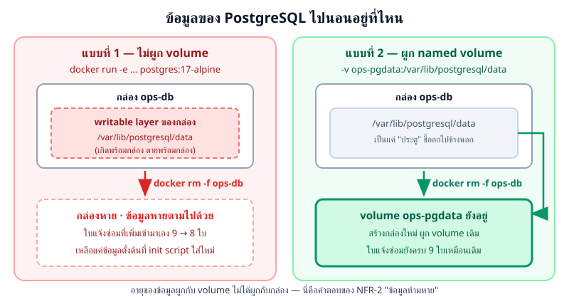
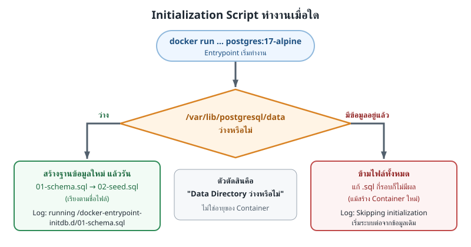
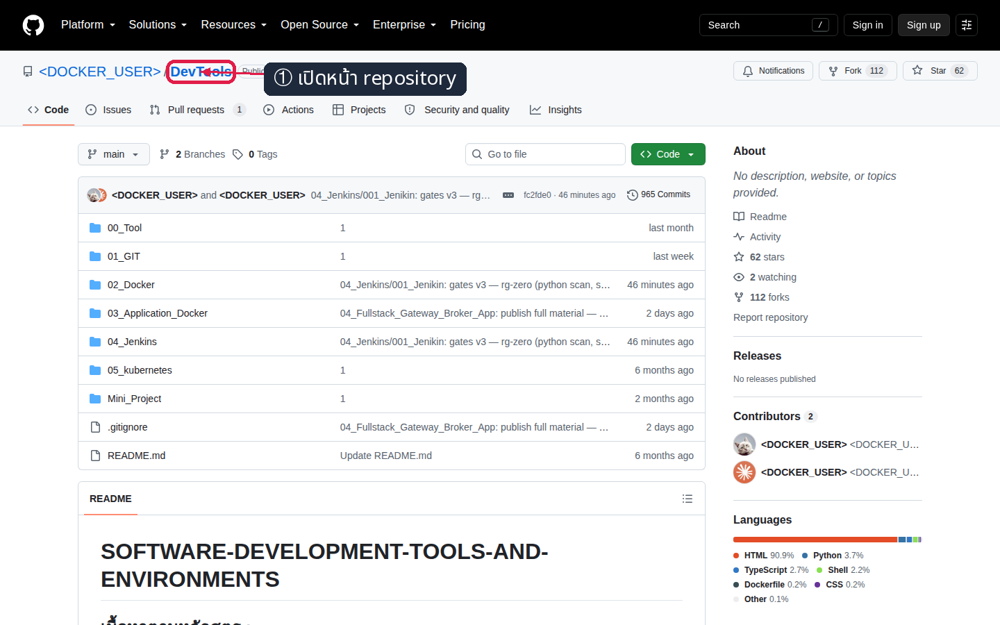
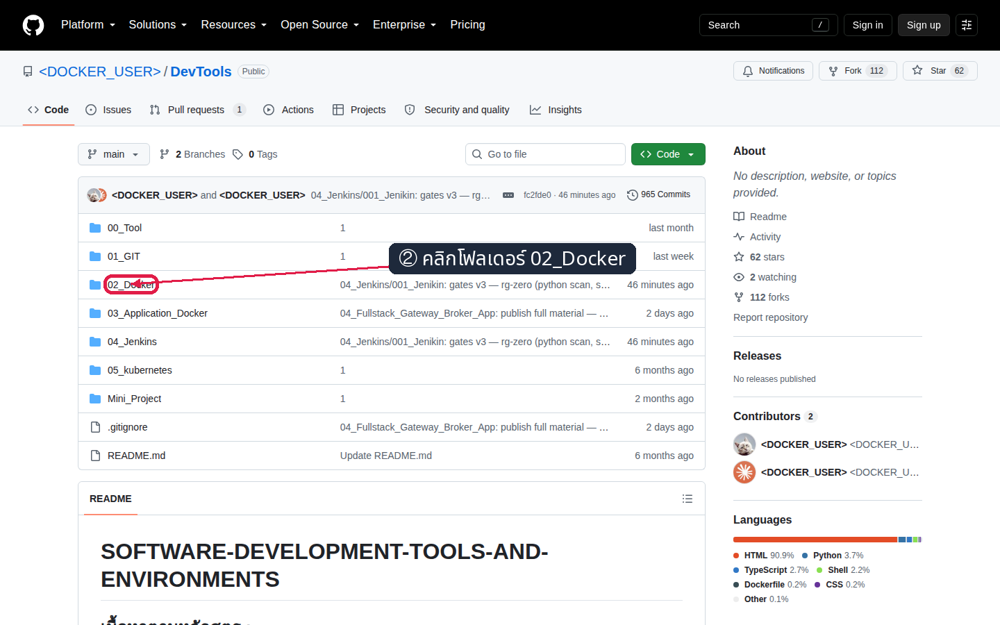
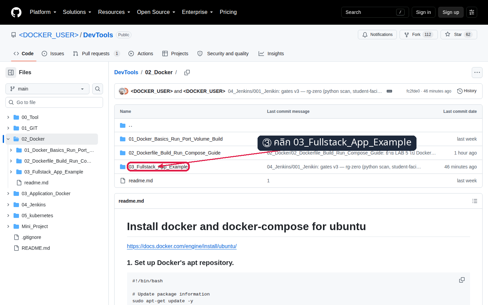
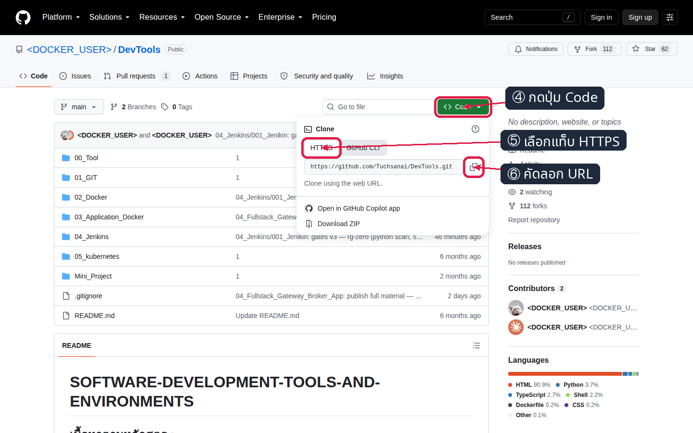

# LAB 1 — ยกฐานข้อมูลของลูกค้าขึ้นมา แล้วทำให้ข้อมูลไม่หาย

> โฟลเดอร์ `001_LAB_Run_The_System` · ไฟล์ของแล็บ : `db/initdb/01-schema.sql` · `db/initdb/02-seed.sql` · `.env.db` · `verify.sh`

### 🎯 แล็บนี้ใน 30 วินาที

| | |
|---|---|
| **คำถามเดียวที่ตอบให้จบ** | ทำอย่างไรให้ฐานข้อมูลของลูกค้าขึ้นมาพร้อมข้อมูลจริง และ **ข้อมูลไม่หาย** แม้ลบกล่องทิ้งแล้วสร้างใหม่ (NFR-2) |
| **ต้องผ่านอะไรมาก่อน** | ชุด `01_Docker_Basics_Run_Port_Volume_Build` — แล็บนี้ใช้ของเดิมล้วน ๆ : `docker run` · `ps` · `logs` · `exec` · `rm` · `-e` · `-v` |
| **เวลา** | ~40 นาที · การทดลอง **9 อัน** อันละ 3–5 นาที |
| **จบแล้วต้องทำได้เอง** | ยก `postgres:17-alpine` ขึ้นพร้อม schema + ข้อมูลตั้งต้น · อ่าน log ตอนบูตเป็น · ชี้ได้ว่าข้อมูลหายตอนไหนและ named volume แก้อย่างไร |
| **แล็บนี้ยัง *ไม่* สอน** | ต่อกล่องเข้าหากันด้วย network → **LAB 4** · `compose.yaml` → **LAB 5** (ดูแผนทั้งชุดที่ [`docs/01_requirements.md`](../docs/01_requirements.md)) · ไม่มี ORM / migration tool · ยังไม่ publish พอร์ตฐานข้อมูลออกเครื่องเลย (NFR-3) |

---

## ทฤษฎีก่อนลงมือ

### ปลายทางของทั้งชุด — จบ LAB 5 จะได้ระบบแบบนี้


> 🖼 **วิธีอ่านรูปนี้:** ตัวเลขบนหน้าเว็บมีที่มาจากข้อมูลของแล็บนี้ · การ์ด "งานที่ยังไม่ปิด 6 ใบ · ทั้งหมด 8 ใบ" กับแถบ `รอรับเรื่อง 3 · มอบหมายแล้ว 2 · กำลังซ่อม 1 · ปิดงานแล้ว 2` มาจากแถวใน `02-seed.sql` ซึ่งจะถูกโหลดเข้า 5 ตารางในการทดลองที่ 5 และตรวจนับด้วย `psql` ในการทดลองที่ 6 · หากฐานข้อมูลว่าง หน้าเว็บจะแสดงค่า 0

### ระบบของลูกค้ามี 3 กล่อง — แล็บนี้ทำกล่องเดียว


> 🖼 **วิธีอ่านรูปนี้:** กล่องขวาสุดที่ตีกรอบหนาคือขอบเขตของแล็บนี้ · กล่อง `web` กับ `api` ยังไม่ต้องมีตัวตนวันนี้ · ลูกศรสีเขียวที่ลงล่างคือที่ที่ข้อมูลไปนอนจริง ซึ่งเป็นหัวใจของ NFR-2

ลูกค้าพูดไว้ในบทสัมภาษณ์ว่า **"ข้อมูลยืม-คืนย้อนหลังห้ามหาย แม้ต้องย้ายเครื่องหรือ restart"** — ประโยคเดียวนี้กลายเป็น `NFR-2`
และเป็นเหตุผลทั้งหมดที่แล็บนี้มีอยู่

### 5 ตารางที่ต้องมี

| ตาราง | เก็บอะไร | รับผิดชอบ REQ |
|---|---|---|
| `assets` | ครุภัณฑ์ 180 ชิ้นของคณะ (แล็บใช้ 12 ชิ้น) | REQ-01, REQ-10, REQ-11 |
| `tickets` | ใบแจ้งซ่อม + สถานะ `NEW → ASSIGNED → IN_PROGRESS → DONE` | REQ-01 … REQ-04, REQ-08 |
| `loans` | สัญญายืม-คืน (`returned_at IS NULL` = ยังไม่คืน) | REQ-10 |
| `parts` | อะไหล่และจุดสั่งซื้อ | REQ-06, REQ-12 |
| `stock_moves` | ประวัติเบิก/รับเข้าอะไหล่ | REQ-05, REQ-07 |

ทั้งหมดอยู่ในไฟล์ `db/initdb/01-schema.sql` และข้อมูลตั้งต้นอยู่ใน `db/initdb/02-seed.sql`
**แล็บนี้ไม่แก้ไขสองไฟล์ดังกล่าว** — เป้าหมายคือทำให้ไฟล์ถูกรันในตำแหน่งและเวลาที่ถูกต้อง

### PostgreSQL จัดเก็บข้อมูลไว้ที่ใด



> 🖼 **วิธีอ่านรูปนี้:** เทียบกล่องสองฝั่งที่ **จุดเดียวกัน** คือบรรทัด `docker rm -f ops-db` · ฝั่งซ้ายกล่องหายแล้วข้อมูลหายด้วยเพราะข้อมูลอยู่ในตัวกล่อง · ฝั่งขวาข้อมูลไม่เคยอยู่ในกล่องตั้งแต่แรก

### init script ทำงานตอนไหน



> 🖼 **วิธีอ่านรูปนี้:** จุดตัดสินอยู่ที่สี่เหลี่ยมข้าวหลามตัดกลางรูป — คำถามคือ *"data directory ว่างหรือไม่"* ไม่ใช่ *"กล่องนี้ใหม่หรือเก่า"* · สองกิ่งให้ข้อความ log ต่างกัน ซึ่งจะปรากฏในการทดลองของแล็บนี้

### สิ่งที่มักเข้าใจผิด

- **ความเข้าใจคลาดเคลื่อน:** image จะกำหนด `POSTGRES_PASSWORD` ให้โดยอัตโนมัติ → **ข้อเท็จจริง:** ต้องกำหนดค่านี้ก่อนเริ่ม container (ดูตารางแก้ปัญหาที่พบบ่อย)
- **ความเข้าใจคลาดเคลื่อน:** ข้อมูลยังอยู่หลังลบ container เพราะ image ยังอยู่ → **ข้อเท็จจริง:** ข้อมูลใน writable layer จะหายไปพร้อม container ส่วน image เป็นแม่แบบ (การทดลองที่ 7)
- **ความเข้าใจคลาดเคลื่อน:** การแก้ไฟล์ใน `db/initdb/` มีผลทุกครั้งที่สร้าง container ใหม่ → **ข้อเท็จจริง:** init script ถูกข้ามเมื่อ volume ไม่ว่าง (การทดลองที่ 10)
- **ความเข้าใจคลาดเคลื่อน:** `--env-file` ให้ผลต่างจาก `-e` → **ข้อเท็จจริง:** ทั้งสองวิธีส่งตัวแปรชุดเดียวกัน แต่จัดเก็บค่าคนละตำแหน่ง (การทดลองที่ 9)

---

## เตรียมเครื่องเรียน

### ขั้นที่ 1 — เปิดกล่องเรียน

รันบน **เครื่องของผู้เรียน** — แล็บนี้ไม่ต้องเปิดพอร์ตแอป เนื่องจากเข้าถึงฐานข้อมูลผ่าน `docker exec` :

```bash
docker rm -f devtools-fs-lab1 2>/dev/null
docker run -dit --name devtools-fs-lab1 --privileged -p 2251:22 tuchsanai/devtools:2569_1
ssh root@localhost -p 2251        # password : passwd
```

ภายในกล่องเรียน เตรียมโฟลเดอร์รับ source code ก่อนเปิด walkthrough:

```bash
mkdir -p ~/labwork
cd ~/labwork
```

---

## การทดลองที่ 1 — จะเปิด repository และคัดลอก URL จาก GitHub อย่างไร

**คำถาม:** จะเข้าถึง source code ชุดเดียวกับเอกสารผ่านหน้า GitHub และคัดลอก URL แบบ HTTPS อย่างไร

### Walkthrough หน้า GitHub

#### ขั้นที่ ① — เปิดหน้า repository

เปิด <https://github.com/Tuchsanai/DevTools> แล้วตรวจว่าชื่อ repository คือ `DevTools`



*ภาพที่ 1 — หน้าแรกของ repository `DevTools` และตำแหน่งชื่อ repository ที่ต้องตรวจสอบ*

#### ขั้นที่ ② — เข้าโฟลเดอร์ `02_Docker`

ในรายการไฟล์หน้าแรกของ repository คลิกแถว `02_Docker`



*ภาพที่ 2 — แถว `02_Docker` ในรายการไฟล์คือเป้าหมายที่ต้องคลิก ไม่ใช่ breadcrumb ของหน้าปลายทาง*

#### ขั้นที่ ③ — เข้าโฟลเดอร์ชุดสอน

ในรายการไฟล์ของ `02_Docker` คลิกแถว `03_Fullstack_App_Example`



*ภาพที่ 3 — แถว `03_Fullstack_App_Example` เป็นขั้นถัดไปก่อนเข้าสู่ไฟล์ของชุดสอน*

#### ขั้นที่ ④–⑥ — คัดลอก URL แบบ HTTPS

คลิก `Code` เลือกแท็บ `HTTPS` แล้วคลิกไอคอนคัดลอก URL



*ภาพที่ 4 — ลำดับเปิดเมนู `Code` เลือก `HTTPS` และคัดลอก URL สำหรับ clone repository*

จากนั้นโหลดโค้ดแล็บด้วย URL ที่คัดลอก โดยรันคำสั่งต่อไปนี้ **ภายในกล่องเรียน**

```bash
git clone https://github.com/Tuchsanai/DevTools.git
cd DevTools/02_Docker/03_Fullstack_App_Example/001_LAB_Run_The_System && ls db/initdb
```

✅ **สิ่งที่ต้องเห็น** — ไฟล์ SQL สองไฟล์ที่จะกลายเป็นฐานข้อมูลของลูกค้า :

```
01-schema.sql  02-seed.sql
```

> 📝 **ชื่อไฟล์ขึ้นต้นด้วยตัวเลขโดยตั้งใจ** — entrypoint ของ PostgreSQL รันไฟล์ตามลำดับชื่อ หาก seed รันก่อน schema การเริ่มต้นฐานข้อมูลจะล้มเหลว

---

## การทดลองที่ 2 — ต้องกำหนดค่าเพื่อยกฐานข้อมูลด้วย `docker run` อย่างไร

**คำถาม:** ต้องบอกอะไร `postgres:17-alpine` บ้าง กล่องถึงจะยอมขึ้น

```bash
docker run -d --name ops-db \
  -e POSTGRES_DB=campusops -e POSTGRES_USER=opsuser -e POSTGRES_PASSWORD=labpass postgres:17-alpine
sleep 8
docker ps
```

✅ **สิ่งที่ต้องเห็น** — กล่องขึ้นแล้ว โดย `STATUS` เป็น `Up ...` และ `PORTS` มีเพียง `5432/tcp` ไม่มีพอร์ตที่ publish ออกสู่เครื่องภายนอกตาม NFR-3 (container ID และเวลาอาจต่างกัน) :

```
5dc9a1257a393844341ed8058d064845569e74c58af0556ebca395fed1115550
CONTAINER ID   IMAGE                COMMAND                  CREATED         STATUS         PORTS      NAMES
5dc9a1257a39   postgres:17-alpine   "docker-entrypoint.s…"   9 seconds ago   Up 8 seconds   5432/tcp   ops-db
```

> 📝 **บทเรียน:** PostgreSQL ต้องได้รับชื่อฐานข้อมูล ชื่อผู้ใช้ และรหัสผ่านผ่าน `-e` ก่อนเริ่มทำงาน ส่วนการไม่ใช้ `-p` ทำให้ฐานข้อมูลไม่เปิดพอร์ตสู่ภายนอก

---

## การทดลองที่ 3 — ระหว่างบูต PostgreSQL ทำอะไร

**คำถาม:** ระหว่างที่เรารอ 8 วินาที postgres ทำอะไรไปบ้าง

```bash
docker logs ops-db 2>&1 | grep -E 'init process complete|ready to accept connections'
```

✅ **สิ่งที่ต้องเห็น** — คำว่า `ready to accept connections` โผล่ **สองครั้ง** โดยมี `init process complete` คั่นกลาง (เวลาและเลข process ของแต่ละคนต่างกัน) :

```
2026-08-20 08:09:35.055 UTC [41] LOG:  database system is ready to accept connections
PostgreSQL init process complete; ready for start up.
2026-08-20 08:09:35.731 UTC [1] LOG:  database system is ready to accept connections
```

> 📝 **บทเรียน:** ครั้งแรกคือเซิร์ฟเวอร์ชั่วคราวสำหรับสร้างฐานข้อมูล ส่วนครั้งที่สองคือเซิร์ฟเวอร์หลัก หากพบเพียงครั้งแรกแสดงว่ากระบวนการ init มีข้อผิดพลาด

---

## การทดลองที่ 4 — ฐานข้อมูลที่เพิ่งสร้างมีตารางอะไร

**คำถาม:** ฐานข้อมูล `campusops` ที่เพิ่งเกิด มีตารางของลูกค้าอยู่แล้วหรือยัง

```bash
docker exec -it ops-db psql -U opsuser -d campusops -c '\dt'
```

✅ **สิ่งที่ต้องเห็น** — ต่อติดแต่ **ว่างเปล่า** :

```
Did not find any relations.
```

> 📝 **บทเรียน:** `-e POSTGRES_DB` สร้างได้เฉพาะฐานข้อมูลเปล่า ส่วนตารางและข้อมูลต้องถูกส่งเข้าไปด้วยกลไกอื่น

---

## การทดลองที่ 5 — จะรัน schema และ seed ตอนเริ่มต้นอย่างไร

**คำถาม:** ทำอย่างไรให้ไฟล์ `.sql` ของเราถูกรันตอนฐานข้อมูลเกิด

```bash
docker rm -f ops-db          # ต้องลบกล่องเก่าก่อน เพราะ initdb รันแค่ตอนฐานข้อมูลเกิดใหม่
docker run -d --name ops-db \
  -e POSTGRES_DB=campusops -e POSTGRES_USER=opsuser -e POSTGRES_PASSWORD=labpass \
  -v "$PWD/db/initdb:/docker-entrypoint-initdb.d:ro" postgres:17-alpine
sleep 10        # รอ init script รันไฟล์ .sql ให้ครบก่อนถาม
```

```bash
docker exec ops-db psql -U opsuser -d campusops -c '\dt'
```

✅ **สิ่งที่ต้องเห็น** — ครบ **5 ตาราง** ตามสัญญาใน [`docs/02_contract.md`](../docs/02_contract.md) และเจ้าของคือ `opsuser` :

```
           List of relations
 Schema |    Name     | Type  |  Owner
--------+-------------+-------+---------
 public | assets      | table | opsuser
 public | loans       | table | opsuser
 public | parts       | table | opsuser
 public | stock_moves | table | opsuser
 public | tickets     | table | opsuser
(5 rows)
```

> 📝 **บทเรียน:** `/docker-entrypoint-initdb.d` คือ "ช่องรับไฟล์" ที่ image ของ postgres เตรียมไว้ให้ · `:ro` ทำให้กล่องเขียนทับไฟล์ต้นฉบับบนเครื่องไม่ได้

---

## การทดลองที่ 6 — จำนวนข้อมูลตั้งต้นตรงกับ requirements ไหม

**คำถาม:** seed ที่เพิ่งถูกรันมีจำนวนตรงกับ [`docs/01_requirements.md`](../docs/01_requirements.md) หรือไม่

คำสั่ง `SELECT` รวมการนับ 4 ตารางไว้ในผลลัพธ์เดียว จึงยาวกว่าคำสั่งตรวจสอบทั่วไป แต่จำเป็นต่อการเปรียบเทียบสัญญาข้อมูลระหว่างแล็บ

```bash
docker exec ops-db psql -U opsuser -d campusops -c \
"SELECT (SELECT count(*) FROM assets) AS assets, (SELECT count(*) FROM tickets) AS tickets, (SELECT count(*) FROM loans) AS loans, (SELECT count(*) FROM parts) AS parts;"
```

✅ **สิ่งที่ต้องเห็น** — ครุภัณฑ์ **12** · ใบแจ้งซ่อม **8** · สัญญายืม **3** · อะไหล่ **6** :

```
 assets | tickets | loans | parts
--------+---------+-------+-------
     12 |       8 |     3 |     6
(1 row)
```

> 📝 **บทเรียน:** ตัวเลขชุดนี้คือสัญญาระหว่างแล็บ และ LAB 2 จะใช้ทดสอบ API ต่อ หากตัวเลขคลาดเคลื่อน แล็บถัดไปจะให้ผลไม่ถูกต้อง

---

## การทดลองที่ 7 — ข้อมูลที่เพิ่มเองรอดจากการสร้างกล่องใหม่ไหม

**คำถาม:** ใบแจ้งซ่อมที่เพิ่มหลังระบบเริ่มทำงานยังคงอยู่หลังสร้าง container ใหม่หรือไม่

```bash
docker exec ops-db psql -U opsuser -d campusops -c \
"INSERT INTO tickets (asset_id, title, detail, priority) VALUES (4, 'ไมโครโฟนห้องประชุมใหญ่เสียงขาด', 'แจ้งเข้ามาหลังระบบขึ้นแล้ว', 'HIGH');"
docker exec ops-db psql -U opsuser -d campusops -c 'SELECT count(*) FROM tickets;'
```

จากนั้นลบ container แล้วสร้างใหม่ด้วยคำสั่งเดิม :

```bash
docker rm -f ops-db
docker run -d --name ops-db \
  -e POSTGRES_DB=campusops -e POSTGRES_USER=opsuser -e POSTGRES_PASSWORD=labpass \
  -v "$PWD/db/initdb:/docker-entrypoint-initdb.d:ro" postgres:17-alpine
sleep 10        # รอกล่องใหม่บูตและรัน init script ให้เสร็จก่อนถาม
```

```bash
docker exec ops-db psql -U opsuser -d campusops -c 'SELECT count(*) FROM tickets;'
```

✅ **สิ่งที่ต้องเห็น** — หลังเพิ่มข้อมูลมี **9 ใบ** แต่หลังสร้าง container ใหม่โดยไม่มี volume จะกลับมาเป็น **8 ใบ** :

```
INSERT 0 1
 count
-------
    9
(1 row)

 count
-------
    8
(1 row)
```

> 📝 **บทเรียน:** นี่คือปัญหาจริงข้อ NFR-2 ของลูกค้า · เลข 8 ที่กลับมาไม่ใช่ข้อมูลเดิม แต่เป็น seed ที่ init script ใส่ให้ใหม่ทั้งชุด

---

## การทดลองที่ 8 — Named volume ทำให้ข้อมูลคงอยู่ไหม

**คำถาม:** การย้ายข้อมูลออกไปไว้นอก container ทำให้ผลลัพธ์ต่างจากเดิมหรือไม่

```bash
docker rm -f ops-db
docker run -d --name ops-db \
  -e POSTGRES_DB=campusops -e POSTGRES_USER=opsuser -e POSTGRES_PASSWORD=labpass \
  -v ops-pgdata:/var/lib/postgresql/data -v "$PWD/db/initdb:/docker-entrypoint-initdb.d:ro" postgres:17-alpine
sleep 10
```

```bash
docker exec ops-db psql -U opsuser -d campusops -c \
"INSERT INTO tickets (asset_id, title, detail, priority) VALUES (4, 'ไมโครโฟนห้องประชุมใหญ่เสียงขาด', 'แจ้งเข้ามาหลังระบบขึ้นแล้ว', 'HIGH');"
```

ลบกล่องแล้วสร้างใหม่ **โดยผูก volume ก้อนเดิม** :

```bash
docker rm -f ops-db
docker run -d --name ops-db \
  -e POSTGRES_DB=campusops -e POSTGRES_USER=opsuser -e POSTGRES_PASSWORD=labpass \
  -v ops-pgdata:/var/lib/postgresql/data -v "$PWD/db/initdb:/docker-entrypoint-initdb.d:ro" postgres:17-alpine
sleep 10
```

```bash
docker exec ops-db psql -U opsuser -d campusops -c 'SELECT id, title, status FROM tickets ORDER BY id DESC LIMIT 1;'
```

✅ **สิ่งที่ต้องเห็น** — ใบที่ 9 ที่เราเพิ่มเอง **ยังอยู่** (คอลัมน์ภาษาไทยจะเยื้องไม่ตรงกรอบ เป็นเรื่องปกติของ `psql`) :

```
 id |           title            | status
----+----------------------------+--------
  9 | ไมโครโฟนห้องประชุมใหญ่เสียงขาด | NEW
(1 row)
```

> 📝 **บทเรียน:** `-v ops-pgdata:/var/lib/postgresql/data` ต่างจากการทดลองที่ 7 เพียงบรรทัดเดียว แต่ทำให้ระบบผ่านข้อกำหนด NFR-2

---

## การทดลองที่ 9 — ไฟล์ env ให้ผลเหมือนการกำหนด `-e` ไหม

**คำถาม:** การย้ายค่า `-e` สามตัวไปไว้ในไฟล์ให้ผลเหมือนเดิมหรือไม่

ไฟล์ `.env.db` ของแล็บมีอยู่แล้ว — ใช้แทน `-e` ทั้งสามตัว :

```bash
docker rm -f ops-db
docker run -d --name ops-db --env-file .env.db \
  -v ops-pgdata:/var/lib/postgresql/data -v "$PWD/db/initdb:/docker-entrypoint-initdb.d:ro" postgres:17-alpine
sleep 10
docker exec ops-db env | grep POSTGRES
```

✅ **สิ่งที่ต้องเห็น** — ตัวแปรครบ 3 ตัวเหมือนตอนพิมพ์ `-e` เอง :

```
POSTGRES_DB=campusops
POSTGRES_USER=opsuser
POSTGRES_PASSWORD=labpass
```

> 📝 **บทเรียน:** บรรทัดที่ขึ้นต้นด้วย `#` ใน `.env.db` ถูกข้าม และ **ห้ามใส่เครื่องหมายคำพูดรอบค่า** เพราะ Docker จะนับเป็นส่วนหนึ่งของค่า · ไฟล์แบบนี้ต้องอยู่ใน `.gitignore` เสมอในงานจริง

---

## การทดลองที่ 10 — เมื่อ volume ไม่ว่าง init script รันซ้ำไหม

**คำถาม:** เมื่อสร้าง container ใหม่โดยใช้ volume เดิม `02-seed.sql` จะถูกรันซ้ำหรือไม่

```bash
docker logs ops-db 2>&1 | grep -E 'Skipping initialization|running /docker-entrypoint-initdb.d'
docker exec ops-db psql -U opsuser -d campusops -c 'SELECT count(*) FROM tickets;'
```

✅ **สิ่งที่ต้องเห็น** — มีแต่บรรทัด `Skipping initialization` · **ไม่มีบรรทัด `running /docker-entrypoint-initdb.d/...` เลย** และจำนวนยังเป็น 9 ใบ ไม่ใช่ 17 ใบ :

```
PostgreSQL Database directory appears to contain a database; Skipping initialization

 count
-------
     9
(1 row)
```

> 📝 **บทเรียน:** ตัวตัดสินคือ **data directory ว่างหรือไม่** ไม่ใช่กล่องใหม่หรือเก่า · แปลว่าแก้ `db/initdb/*.sql` ทีหลังจะไม่มีผล จนกว่าจะลบ volume ทิ้ง (ซึ่งข้อมูลจริงจะหายไปด้วย)

---

## ตรวจงานด้วย `verify.sh`

```bash
bash verify.sh ; echo "exit code = $?"
```

✅ **สิ่งที่ต้องเห็น** — `[PASS]` ทุกบรรทัด ปิดท้ายด้วย `ALL CHECKS PASSED` และ `exit code = 0`

```text
==============================================
 LAB 1 — Run The System (CampusOps db) : verify
==============================================
[PASS] ต่อ Docker daemon ได้
[PASS] ไฟล์ของแล็บครบ (db/initdb/01-schema.sql, db/initdb/02-seed.sql, .env.db, readme.md)
[PASS] ไม่ใส่ POSTGRES_PASSWORD แล้วกล่องหยุดพร้อมข้อความเตือน (state=exited:1)
[PASS] กล่อง vops1-db1 ขึ้นและรับ connection ได้
[PASS] initdb สร้างตารางครบ 5 ตาราง : assets,loans,parts,stock_moves,tickets
[PASS] log บอกว่ารันไฟล์ /docker-entrypoint-initdb.d/01-schema.sql จริง
[PASS] จำนวน seed ตรงตามข้อกำหนด (assets 12 · tickets 8 · loans 3 · parts 6 · stock_moves 6)
[PASS] อะไหล่ต่ำกว่าจุดสั่งซื้อ 2 รายการตามที่ contract ระบุ (REQ-12)
[PASS] เพิ่มใบแจ้งซ่อม 1 ใบแล้วนับได้ 9 ใบ
[PASS] ไม่มี volume : ลบกล่องแล้วสร้างใหม่ ข้อมูลที่เพิ่มเองหายจริง (กลับเป็น 8 ใบตาม seed)
[PASS] กล่องที่ผูก volume vops1-pgdata เพิ่มข้อมูลแล้วนับได้ 9 ใบ
[PASS] ลบกล่องแล้ว volume vops1-pgdata ยังอยู่ (อายุ volume ไม่ผูกกับอายุกล่อง)
[PASS] มี volume : สร้างกล่องใหม่แล้วข้อมูลยังอยู่ครบ 9 ใบ (NFR-2 ผ่าน)
[PASS] volume ไม่ว่าง : log ขึ้น 'Skipping initialization' — init script ถูกข้าม
[PASS] vops1-db4 ไม่ได้รัน 02-seed.sql ซ้ำ ข้อมูลจึงไม่ถูกเติมซ้ำซ้อน
[PASS] --env-file .env.db ส่งค่าเข้ากล่องครบ 3 ตัว และเข้าฐานข้อมูลเดิมได้ (9 ใบ)
----------------------------------------------
ALL CHECKS PASSED
exit code = 0
```

> 📝 สคริปต์สร้าง container ชื่อขึ้นต้น `vops1-` และ volume `vops1-pgdata` แล้วลบเมื่อทำงานเสร็จ โดยไม่แตะต้อง `ops-db` และ `ops-pgdata`

---

## แก้ปัญหาที่พบบ่อย

| อาการ | สาเหตุ | วิธีแก้ |
|---|---|---|
| `Error: Database is uninitialized and superuser password is not specified.` | ไม่ได้ส่ง `POSTGRES_PASSWORD` เข้ากล่อง | เพิ่ม `-e POSTGRES_PASSWORD=labpass` หรือใช้ `--env-file .env.db` |
| ต้องการอ่านข้อความเตือนของกล่องที่หยุดทำงาน | ข้อความเตือนของ PostgreSQL ส่งออกทาง stderr | ใช้ `docker logs <ชื่อกล่อง> 2>&1` เพื่อรวม stdout และ stderr ก่อนอ่านผล |
| `docker: Error response from daemon: Conflict. The container name "/ops-db" is already in use by container ...` | ยังมีกล่องชื่อเดิมค้างอยู่ | `docker rm -f ops-db` ก่อนแล้วค่อย `docker run` ใหม่ |
| `Did not find any relations.` ทั้งที่ผูก initdb แล้ว | ไม่ได้ `cd` อยู่ในโฟลเดอร์แล็บ `$PWD` จึงชี้ผิดที่ | `cd` เข้าโฟลเดอร์ `001_LAB_Run_The_System` แล้วลบกล่อง+`docker volume rm ops-pgdata` ก่อนรันใหม่ |
| `psql: error: connection to server on socket "/var/run/postgresql/.s.PGSQL.5432" failed: FATAL:  role "opsuser" does not exist` | volume เดิมถูกสร้างด้วย `POSTGRES_USER` คนละชื่อ และ init ไม่รันซ้ำ | รัน `docker rm -f ops-db` แล้วรัน `docker volume rm ops-pgdata` ก่อนสร้างใหม่ให้ชื่อ user ตรงกัน |
| `ERROR:  relation "tickets" does not exist` | ต่อผิดฐานข้อมูล (ลืม `-d campusops` จึงไปโดน `postgres`) | ใส่ `-d campusops` ทุกครั้งที่เรียก `psql` |
| `Error response from daemon: container ... is not running` | `docker exec` ใส่กล่องที่หยุดไปแล้ว | `docker ps -a` ดูสถานะ แล้วอ่านเหตุผลจาก `docker logs <ชื่อกล่อง>` |
| `Error response from daemon: remove ops-pgdata: volume is in use - [...]` | ยังมีกล่องผูก volume ก้อนนั้นอยู่ | `docker rm -f ops-db` ก่อน แล้วค่อย `docker volume rm ops-pgdata` |
| `PostgreSQL Database directory appears to contain a database; Skipping initialization` เมื่อต้องการใช้ seed ใหม่ | volume ไม่ว่าง init script จึงถูกข้าม | ลบ volume ด้วย `docker volume rm ops-pgdata` แล้วสร้าง container ใหม่ (**ข้อมูลเดิมหายทั้งหมด**) |

---

## เก็บกวาด

**ในกล่องเรียน:**

```bash
docker rm -f ops-db
docker volume rm ops-pgdata
docker ps -a
docker volume ls --filter name=ops-pgdata
```

> 📝 ต้องลบ container ก่อนเสมอ มิฉะนั้น `docker volume rm` จะแสดง `volume is in use` ส่วน volume ชื่อเป็นรหัสยาวคือ volume นิรนามที่ PostgreSQL สร้างเมื่อไม่ระบุ `-v`

**ออกจากกล่องแล้วลบกล่องบนเครื่องเรา:**

```bash
exit
docker rm -f devtools-fs-lab1
docker ps -a --filter name=devtools-fs-lab1
```

---

## สรุปคำสั่งของแล็บนี้

| คำสั่ง | ความหมาย |
|---|---|
| `docker run -d --name <ชื่อ> -e KEY=value <image>` | สร้างกล่องแบบเบื้องหลัง พร้อมส่งค่าตั้งต้นเข้าไป |
| `docker run --env-file .env.db ...` | ส่งค่าทั้งไฟล์แทนการพิมพ์ `-e` ทีละตัว |
| `docker run -v "$PWD/db/initdb:/docker-entrypoint-initdb.d:ro" ...` | bind mount โฟลเดอร์บนเครื่องเข้าไปแบบอ่านอย่างเดียว |
| `docker run -v ops-pgdata:/var/lib/postgresql/data ...` | ผูก named volume ให้ข้อมูลอยู่นอกกล่อง |
| `docker ps` / `docker ps -a` | ดูกล่องที่รันอยู่ / รวมกล่องที่หยุดแล้ว |
| `docker logs <ชื่อกล่อง>` | อ่านข้อความที่โปรแกรมใน container ส่งออกมา เพื่อหาสาเหตุเมื่อ container หยุดทำงาน |
| `docker exec <ชื่อกล่อง> <คำสั่ง>` | สั่งงานข้างในกล่องที่กำลังรันอยู่ |
| `docker exec -it <ชื่อกล่อง> psql -U opsuser -d campusops` | เปิด psql แบบโต้ตอบ (ออกด้วย `\q`) |
| `docker rm -f <ชื่อกล่อง>` | ลบกล่องทิ้งทันทีแม้ยังรันอยู่ |
| `docker volume ls` / `docker volume rm <ชื่อ>` | ดู / ลบ named volume (ลบแล้วข้อมูลหายถาวร) |

> **จำ 3 อย่าง:** ไม่มี `POSTGRES_PASSWORD` = ไม่ขึ้น · ไม่มี volume = ข้อมูลตายพร้อมกล่อง · volume ไม่ว่าง = init script ถูกข้าม

---

## ✅ เช็กลิสต์ก่อนจบแล็บ

- [ ] `docker ps` เห็น `ops-db` เป็น `Up` และ `PORTS` มีเพียง `5432/tcp`
- [ ] `docker logs ops-db 2>&1` เจอ `ready to accept connections` สองครั้ง โดยมี `init process complete` คั่นกลาง
- [ ] ก่อนผูก initdb : `docker exec -it ops-db psql -U opsuser -d campusops -c '\dt'` ตอบ `Did not find any relations.`
- [ ] หลังผูก `-v "$PWD/db/initdb:/docker-entrypoint-initdb.d:ro"` : `\dt` เห็นครบ **5 ตาราง** เจ้าของ `opsuser`
- [ ] นับ seed ได้ `assets 12 · tickets 8 · loans 3 · parts 6` ตรงกับ [`docs/01_requirements.md`](../docs/01_requirements.md)
- [ ] เพิ่มใบแจ้งซ่อมเป็น 9 → `docker rm -f ops-db` + `docker run` ใหม่ **โดยไม่มี volume** แล้ว `SELECT count(*) FROM tickets;` เหลือ 8
- [ ] ทำซ้ำแบบมี `-v ops-pgdata:/var/lib/postgresql/data` แล้วใบที่ `id = 9` **ยังอยู่**
- [ ] `--env-file .env.db` แล้ว `docker exec ops-db env | grep POSTGRES` ได้ครบ 3 ตัว
- [ ] `docker logs ops-db 2>&1 | grep 'Skipping initialization'` เจอ 1 บรรทัด และ `SELECT count(*) FROM tickets;` ยังเป็น 9 ไม่ใช่ 17
- [ ] `bash verify.sh ; echo "exit code = $?"` ขึ้น `ALL CHECKS PASSED` และ `exit code = 0`

---

*ผลลัพธ์ทั้งหมดในเอกสารนี้มาจากการรันจริงในเครื่องเรียน `tuchsanai/devtools:2569_1`*
