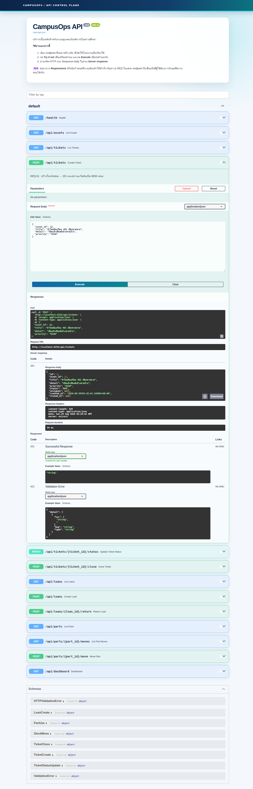

# LAB 2 — สร้าง image ของบริการเบื้องหลัง

> โฟลเดอร์ `002_LAB_Build_The_API` · ไฟล์ของแล็บ : `api/Dockerfile` · `api/Dockerfile.bad` · `api/main.py` · `api/requirements.txt` · `api/.dockerignore` · `api/smoke.sh` · `db/initdb/` · `.env.db` · `verify.sh`

---

### 🎯 แล็บนี้ใน 30 วินาที

| | |
|---|---|
| **คำถามเดียวที่ตอบให้จบ** | โค้ด `api` ที่รันได้บนเครื่องคนเขียน จะกลายเป็น **image ที่ลูกค้าเอาไปรันเองได้** อย่างไร |
| **ต้องผ่านอะไรมาก่อน** | **LAB 1** (ยกฐานข้อมูลขึ้นด้วย `docker run` · `-v` · `-e`) และเรื่อง Dockerfile · layer cache · `.dockerignore` จากชุด `02_Dockerfile_Build_Run_Compose_Guide` |
| **เวลา** | ~75 นาที · การทดลอง **11 อัน** |
| **จบแล้วต้องทำได้เอง** | build image ของ `api` จาก Dockerfile จริง · ชี้จุดที่ cache แตกได้ · หา IP ของกล่องด้วย `docker inspect` · เปิดพอร์ตด้วย `-p` แล้วยิงข้อกำหนดของลูกค้า REQ-01…REQ-12 ผ่าน `curl` และ `api/smoke.sh` |
| **แล็บนี้ยัง *ไม่* สอน** | multi-stage ของ `web` → **LAB 3** · เรียกกันด้วย**ชื่อ**แทน IP → **LAB 4** · `compose.yaml` และการ push ขึ้น registry → **LAB 5** |

---

## ทฤษฎีก่อนลงมือ

### จุด `.` ท้ายคำสั่ง build ไม่ใช่ที่อยู่ของ Dockerfile

`docker build -t ops-api:1.0 .` — จุดตัวนั้นคือ **build context** : โฟลเดอร์ทั้งก้อนที่ถูกมัดส่งข้ามไปให้ dockerd ก่อน build จะเริ่มด้วยซ้ำ


> 🖼 **วิธีอ่านรูปนี้:** กล่องซ้ายคือโฟลเดอร์ `api/` — กรอบเส้นประสีแดงคือไฟล์ที่ `.dockerignore` กันไว้ **ไม่ถูกส่ง** · ลูกศรกลางคือบรรทัด `transferring context` ที่เห็นใน log จริง · กล่องขวาคือ daemon ซึ่ง `COPY` หยิบได้เฉพาะของที่ส่งไปถึงมือแล้วเท่านั้น

### ลำดับบรรทัดใน Dockerfile คือเรื่องของเวลา

ทุกบรรทัดที่เปลี่ยนไฟล์กลายเป็น **layer** หนึ่งชั้น · กฎเดียวที่ต้องจำคือ **ขั้นไหนเปลี่ยน ขั้นนั้นและทุกขั้นใต้ลงไปต้องทำใหม่**


> 🖼 **วิธีอ่านรูปนี้:** หา **แถวสีแรกที่ไม่ใช่ CACHED** ของแต่ละฝั่ง นั่นคือจุดที่ cache แตก · ฝั่งซ้ายจุดแตกอยู่ **ใต้** `RUN pip install` ขั้นแพงจึงรอด · ฝั่งขวาจุดแตกอยู่ **เหนือ** ขั้นนั้น ทุกอย่างใต้ลงไปจึงต้องทำใหม่

### `EXPOSE` เป็นป้าย ไม่ใช่ประตู

`EXPOSE 8000` ใน Dockerfile บอกแค่ว่า "แอปในกล่องนี้ฟังพอร์ต 8000" — คนที่หยิบ image ไปใช้จะได้รู้ว่าต้อง map พอร์ตไหน แต่มัน **ไม่เปิดทางเข้า** ให้เลย


> 🖼 **วิธีอ่านรูปนี้:** สองกรณีนี้ใช้ **image เดียวกันที่มี `EXPOSE 8000` เหมือนกัน** ต่างกันแค่มี `-p` หรือไม่ · แถบล่างสอนวิธีอ่านเลข `-p 8088:8000` : ซ้ายคือพอร์ตฝั่งเครื่องที่รัน ขวาคือพอร์ตในกล่อง

### บน default bridge กล่องเรียกกันด้วยชื่อไม่ได้

กล่องที่สร้างแบบไม่ระบุ network จะไปอยู่บน **default bridge** ซึ่งไม่มี DNS ให้ — `api` จึงหาที่อยู่ของ `db` จากชื่อ `ops-db` ไม่เจอ ต้องอ่าน **IP** ด้วย `docker inspect` มาใส่ `DATABASE_URL` เอง

| สิ่งที่อยากได้ | ทำได้บน default bridge ไหม |
|---|---|
| กล่องคุยกันด้วย IP | ✅ ได้ |
| กล่องคุยกันด้วยชื่อ (`ops-db`) | ❌ ไม่ได้ |
| IP คงเดิมเมื่อสร้างกล่องใหม่ | ❌ เปลี่ยนได้ทุกครั้ง |

### สิ่งที่มักเข้าใจผิด

- **คิดว่า** จุด `.` คือที่อยู่ของ Dockerfile → **จริง ๆ** คือโฟลเดอร์ทั้งก้อนที่ถูกส่งไปให้ daemon (การทดลองที่ 1)
- **คิดว่า** แก้โค้ดทีไรก็ต้อง `pip install` ใหม่ทุกครั้ง → **จริง ๆ** ถ้าเรียงถูก ขั้นนั้นขึ้น `CACHED` (การทดลองที่ 3)
- **คิดว่า** `.dockerignore` มีไว้ลดขนาด image → **จริง ๆ** มันตัดตั้งแต่ก่อนส่ง context ไฟล์ที่ถูกกันจึงไม่ทำให้ cache แตก (การทดลองที่ 5)
- **คิดว่า** `EXPOSE 8000` = เปิดพอร์ต 8000 ให้แล้ว → **จริง ๆ** ต้องใส่ `-p` ตอน `docker run` เท่านั้น (การทดลองที่ 8)

---

## เตรียมเครื่องเรียน

### ขั้นที่ 1 — เปิดกล่องเรียน

รันบน **เครื่องของเราเอง** :

```bash
docker rm -f devtools-fs-lab2 2>/dev/null
docker run -dit --name devtools-fs-lab2 --privileged \
  -p 2252:22 -p 8252:8088 tuchsanai/devtools:2569_1
ssh root@localhost -p 2252        # password : passwd
```

### ขั้นที่ 2 — โหลดโค้ดแล็บ

**คำสั่งทุกอันหลังจากนี้พิมพ์ข้างในกล่องเรียน**

```bash
mkdir -p ~/labwork && cd ~/labwork
git clone --depth 1 https://github.com/Tuchsanai/DevTools.git
cd DevTools/02_Docker/03_Fullstack_App_Example/002_LAB_Build_The_API
```

> `--depth 1` โหลดเฉพาะ commit ล่าสุด ไม่ต้องขนประวัติทั้งหมด · ถึงอย่างนั้นก็ยัง **ใช้เวลา 1–4 นาที** — อย่าปิดหน้าต่างหรือกด `Ctrl-C` ระหว่างโหลด ถ้าโดนตัดกลางคันให้ `rm -rf ~/labwork/DevTools` แล้ว clone ใหม่

---

## การทดลองที่ 1 — จุด `.` ท้ายคำสั่ง build คืออะไร

**คำถาม:** เวลาสั่ง `docker build -t ops-api:1.0 .` เราส่งอะไรไปให้ Docker บ้าง

```bash
cd api
ls -a
```

✅ **สิ่งที่ต้องเห็น** — ทุกไฟล์ในโฟลเดอร์นี้คือ **build context** ที่จะถูกส่งไปให้ daemon (ลำดับการเรียงไฟล์ของแต่ละเครื่องอาจสลับกันได้) :

```
.
..
.dockerignore
Dockerfile
Dockerfile.bad
main.py
requirements.txt
smoke.sh
```

อ่าน Dockerfile ทีละบรรทัด :

```bash
cat Dockerfile
```

✅ **สิ่งที่ต้องเห็น** — **10 คำสั่ง** (ในจำนวนนี้ **6 คำสั่งสร้าง layer** จึงเห็น `[1/6]`–`[6/6]` ตอน build) เรียงจาก "เปลี่ยนน้อย" ไป "เปลี่ยนบ่อย" (ตัดคอมเมนต์กับบรรทัด `# syntax=` ในไฟล์จริงออก) :

```dockerfile
FROM python:3.12-slim
ENV PYTHONDONTWRITEBYTECODE=1 \
    PYTHONUNBUFFERED=1
WORKDIR /app
COPY requirements.txt .
RUN pip install --no-cache-dir -r requirements.txt
COPY main.py .
RUN useradd --create-home --uid 10001 appuser && chown -R appuser:appuser /app
USER appuser
EXPOSE 8000
CMD ["uvicorn", "main:app", "--host", "0.0.0.0", "--port", "8000"]
```

สองบรรทัด `RUN useradd ...` กับ `USER appuser` มีไว้ให้แอปรันด้วยผู้ใช้ธรรมดาแทน root — แล็บนี้ไม่ได้สอนเรื่องนี้ อ่านผ่านไปได้ ขอแค่รู้ว่ามันเป็น **1 layer** ที่จะโผล่เป็น `[6/6]` ตอน build

> 📝 **บทเรียน:** `.` คือโฟลเดอร์ที่ยกให้ daemon ทั้งก้อน ไม่ใช่ที่อยู่ของ Dockerfile · ไฟล์นอกโฟลเดอร์นี้ `COPY` ไม่ได้เลย ต่อให้เขียน `../` ก็ตาม

---

## การทดลองที่ 2 — จะ build image ครั้งแรกทีละขั้นอย่างไร

**คำถาม:** log ที่ขึ้นเป็น `[N/M]` กำลังบอกอะไรเรา

```bash
time docker build -t ops-api:1.0 .
```

✅ **สิ่งที่ต้องเห็น** — 6 ขั้นตามบรรทัดใน Dockerfile ทุกขั้นขึ้น `DONE` ไม่มี `CACHED` เลย (log จริงยาวกว่านี้ ตัดมาเฉพาะบรรทัดที่ต้องมอง · **เลข `#N` กับตัวเลขเวลาของแต่ละคนไม่ตรงกัน** ให้ดูที่ `[N/6]` แทน) :

```
#5 [internal] load .dockerignore
#5 transferring context: 521B done
#7 [internal] load build context
#7 transferring context: 28.54kB done
#6 [1/6] FROM docker.io/library/python:3.12-slim@sha256:2c941e860699f878900b0edc2403613c234d4b32eda3cc9fa7036991a2a63c4a
#6 DONE 3.7s
#8 [2/6] WORKDIR /app
#8 DONE 0.1s
#9 [3/6] COPY requirements.txt .
#9 DONE 0.1s
#10 [4/6] RUN pip install --no-cache-dir -r requirements.txt
#10 DONE 4.3s
#11 [5/6] COPY main.py .
#11 DONE 0.1s
#12 [6/6] RUN useradd --create-home --uid 10001 appuser && chown -R appuser:appuser /app
#12 DONE 0.4s
#13 naming to docker.io/library/ops-api:1.0 done
#13 DONE 1.9s

real	0m14.882s
```

รอบแรกจะมีขั้น `resolve image config for docker-image://docker.io/docker/dockerfile:1` แล้วดาวน์โหลดสิบกว่าบรรทัดโผล่ **ก่อน** ขั้นข้างบน — มาจากบรรทัด `# syntax=docker/dockerfile:1` บรรทัดแรกของไฟล์ ปกติ ไม่ใช่ error และรอบถัดไปจะไม่มีแล้ว

> 📝 **บทเรียน:** `[4/6]` = ขั้นที่ 4 จากทั้งหมด 6 ขั้นที่สร้าง layer · `transferring context: 28.54kB` คือขนาดที่ส่งไปให้ daemon จริง ๆ · รอบแรกไม่มีอะไรให้ใช้ซ้ำ ทุกขั้นจึงต้องทำเอง

---

## การทดลองที่ 3 — เมื่อแก้โค้ดหนึ่งบรรทัด layer cache ทำงานอย่างไร

**คำถาม:** แก้ `main.py` บรรทัดเดียว ต้องติดตั้ง dependency ใหม่ทั้งชุดไหม

```bash
sed -i 's/version="1.0.0"/version="1.0.1"/' main.py
time docker build -t ops-api:1.0 .
```

✅ **สิ่งที่ต้องเห็น** — ขั้น `RUN pip install` ขึ้น **`CACHED`** และมีแค่สองขั้นล่างสุดที่ทำใหม่ (ตัวเลข `real` ของแต่ละเครื่องไม่ตรงกัน ให้ดู **สัดส่วน** ว่าลดลงหลายเท่า) :

```
#8 [2/6] WORKDIR /app
#8 CACHED
#9 [3/6] COPY requirements.txt .
#9 CACHED
#10 [4/6] RUN pip install --no-cache-dir -r requirements.txt
#10 CACHED
#11 [5/6] COPY main.py .
#11 DONE 0.1s
#12 [6/6] RUN useradd --create-home --uid 10001 appuser && chown -R appuser:appuser /app
#12 DONE 0.5s

real	0m2.236s
```

> 📝 **บทเรียน:** จาก **14.882 s เหลือ 2.236 s** เพราะ `requirements.txt` ไม่เปลี่ยน checksum ของขั้น `COPY requirements.txt .` จึงเท่าเดิม ขั้น `pip install` ที่ต่อจากมันจึงใช้ cache ได้

---

## การทดลองที่ 4 — `Dockerfile.bad` ที่เรียงสลับกันทำให้ build ต่างอย่างไร

**คำถาม:** ถ้าย้าย `COPY . .` ขึ้นไปก่อน `pip install` จะเสียเวลาเพิ่มเท่าไร

`Dockerfile.bad` มีคำสั่งชุดเดียวกันเป๊ะ ต่างแค่ลำดับ — build ให้มันมี cache ตั้งต้นก่อน :

```bash
docker build -f Dockerfile.bad -t ops-api-bad:1.0 .
```

✅ **สิ่งที่ต้องเห็น** — build ผ่านและได้ image ชื่อ `ops-api-bad:1.0` (เลข `#N` และเวลาของแต่ละคนไม่ตรงกัน) :

```
#10 [4/5] RUN pip install --no-cache-dir -r requirements.txt
#10 DONE 4.0s
#12 naming to docker.io/library/ops-api-bad:1.0 done
#12 DONE 2.5s
```

ทีนี้แก้ `main.py` อีกบรรทัดเดียว แล้ว build **ไฟล์ bad** :

```bash
sed -i 's/version="1.0.1"/version="1.0.2"/' main.py
time docker build -f Dockerfile.bad -t ops-api-bad:1.0 .
```

✅ **สิ่งที่ต้องเห็น** — cache แตกตั้งแต่ `COPY . .` ทำให้ `RUN pip install` ต้องติดตั้งใหม่ทั้งชุด (ตัวเลขวินาทีของแต่ละเครื่องไม่ตรงกัน) :

```
#9 [3/5] COPY . .
#9 DONE 0.2s
#10 [4/5] RUN pip install --no-cache-dir -r requirements.txt
#10 DONE 4.5s

real	0m9.409s
```

แก้ไฟล์เดียวกันนี้แล้ว build **ไฟล์ที่เรียงถูก** เทียบในนาทีเดียวกัน :

```bash
time docker build -t ops-api:1.0 .
```

✅ **สิ่งที่ต้องเห็น** — ขั้นเดียวกันขึ้น `CACHED` และเวลารวมน้อยกว่าหลายเท่า (ตัวเลขวินาทีของแต่ละเครื่องไม่ตรงกัน) :

```
#10 [4/6] RUN pip install --no-cache-dir -r requirements.txt
#10 CACHED

real	0m2.683s
```

| Dockerfile | ขั้น `pip install` หลังแก้ `main.py` | เวลารวม (`real`) ในรอบที่ใช้เขียนเอกสารนี้ |
|---|---|---|
| `api/Dockerfile` | `CACHED` — ไม่ทำอะไรเลย | **2.683 s** |
| `api/Dockerfile.bad` | ติดตั้งใหม่ 4.5 s | **9.409 s** |

ก่อนไปต่อ คืน `main.py` เป็น `1.0.0` แล้ว **build `ops-api:1.0` ใหม่อีกรอบ** เพื่อให้ image ที่ใช้ในการทดลองที่ 6–11 ตรงกับไฟล์จริง — บรรทัด `grep` ต้องคืน `version="1.0.0"` กลับมา ถ้าทำซ้ำแล้วฝั่ง `bad` ขึ้น `CACHED` แสดงว่า BuildKit เคยเห็นเนื้อไฟล์ชุดนี้แล้ว ให้เปลี่ยนเป็นเลขเวอร์ชันที่ไม่เคยใช้

```bash
sed -i 's/version="1.0.2"/version="1.0.0"/' main.py
docker build -q -t ops-api:1.0 . >/dev/null
grep -n 'app = FastAPI' main.py
```

> 📝 **บทเรียน:** รอบนี้ต่างกันประมาณ 3.5 เท่า เพราะ dependency มีเพียง 4 ตัว ระบบจริงที่มี package ขนาดใหญ่อาจเห็นผลต่างมากกว่านี้ทุกครั้งที่แก้โค้ด

---

## การทดลองที่ 5 — จะกันไฟล์ออกจาก build context ด้วย `.dockerignore` อย่างไร

**คำถาม:** ไฟล์ที่อยู่ในโฟลเดอร์เดียวกันแต่ไม่เกี่ยวกับแอป ถูกส่งไปด้วยไหม

```bash
cat .dockerignore
```

✅ **สิ่งที่ต้องเห็น** — ทั้งไฟล์ 17 บรรทัด ตัดทั้งของที่ Python สร้างเอง ของลับ และสคริปต์ทดสอบ :

```
# ไฟล์ที่ไม่ควรถูกส่งเข้า build context
# ยิ่ง context เล็ก build ยิ่งเร็ว และไม่มีของที่ไม่เกี่ยวหลุดเข้า image
__pycache__/
*.pyc
*.pyo
.pytest_cache/
.venv/
venv/
.env
*.log
.git/
.gitignore
.DS_Store
.ipynb_checkpoints/

# สคริปต์ทดสอบไม่ต้องอยู่ใน image ของ production
smoke.sh
```

ลองสร้างไฟล์ log ขนาด 5MB ในโฟลเดอร์นี้แล้ว build ดู :

```bash
head -c 5000000 /dev/urandom > api-debug.log
du -sh .
docker build -t ops-api:1.0 . 2>&1 | grep -A2 "load build context"
```

✅ **สิ่งที่ต้องเห็น** — โฟลเดอร์โต 4.9M แต่ context ที่ส่งจริงยังเป็นหลัก **B / kB** ไม่ใช่ MB :

```
4.9M	.
#7 [internal] load build context
#7 transferring context: 66B done
#7 DONE 0.0s
```

> ตัวเลขนี้เป็น `66B` เพราะไฟล์ในโฟลเดอร์ไม่ได้เปลี่ยนตั้งแต่ build รอบที่แล้ว BuildKit จึงส่งเฉพาะส่วนต่าง · ถ้าเพิ่งแก้ `main.py` มาจะเห็นราว `28.15kB` แทน — จุดที่ต้องมองคือ **ไม่มีคำว่า MB** ทั้งที่เพิ่งสร้างไฟล์ 5MB ทิ้งไว้

```bash
rm -f api-debug.log
```

> 📝 **บทเรียน:** `.dockerignore` ทำงาน **ก่อน** context ถูกส่ง ไฟล์ที่ถูกกันจึงไม่กินเวลาส่ง ไม่หลุดเข้า image และไม่ทำให้ `COPY` แตก cache ตอนมันเปลี่ยน

---

## การทดลองที่ 6 — จะยกฐานข้อมูลและหา IP ของกล่องอย่างไร

**คำถาม:** `api` จะบอกที่อยู่ของฐานข้อมูลได้อย่างไร ในเมื่อยังไม่มี network ของเราเอง

```bash
cd ~/labwork/DevTools/02_Docker/03_Fullstack_App_Example/002_LAB_Build_The_API
docker run -d --name ops-db --env-file .env.db \
  -v ops-pgdata:/var/lib/postgresql/data \
  -v "$PWD/db/initdb:/docker-entrypoint-initdb.d:ro" \
  postgres:17-alpine
```

✅ **สิ่งที่ต้องเห็น** — id ของกล่องฐานข้อมูล (ครั้งแรกจะมีบรรทัด pull ของ `postgres:17-alpine` นำหน้า · id ของแต่ละคนคนละค่า) :

```
c7a72207b572bcbf39876e28e1edf01bd7bb3b835efc5450f5e1c5942cbb5d8b
```

รอให้ entrypoint รันไฟล์ SQL เสร็จก่อน แล้วถามฐานข้อมูลว่าพร้อมหรือยัง :

```bash
sleep 12 && docker exec ops-db pg_isready -U opsuser -d campusops
```

✅ **สิ่งที่ต้องเห็น** — ฐานข้อมูลพร้อมรับ connection :

```
/var/run/postgresql:5432 - accepting connections
```

อ่าน IP ของฐานข้อมูลเพื่อนำไปสร้าง `DATABASE_URL` ในการทดลองถัดไป :

```bash
docker inspect -f '{{range .NetworkSettings.Networks}}{{.IPAddress}}{{end}}' ops-db
```

✅ **สิ่งที่ต้องเห็น** — `inspect` ให้ IP ของกล่องฐานข้อมูลบน default bridge (ตัวเลข IP ของแต่ละเครื่องไม่ตรงกัน) :

```
172.18.0.2
```

> 📝 **บทเรียน:** แล็บนี้ใช้ default bridge จึงส่ง IP ที่อ่านจาก `docker inspect` เข้า `DATABASE_URL` โดยตรง ส่วน LAB 4 จะสร้าง network ที่เรียกบริการด้วยชื่อได้

---

## การทดลองที่ 7 — จะให้ `api` ต่อฐานข้อมูลได้อย่างไร

**คำถาม:** ใส่ `DATABASE_URL` เป็น IP ที่เพิ่งได้มา แล้ว `/health` จะเขียวไหม

```bash
DB_IP=$(docker inspect -f '{{range .NetworkSettings.Networks}}{{.IPAddress}}{{end}}' ops-db)
docker run -d --name ops-api \
  -e DATABASE_URL="postgresql://opsuser:labpass@${DB_IP}:5432/campusops" ops-api:1.0
```

✅ **สิ่งที่ต้องเห็น** — id ของกล่องที่เพิ่งสร้าง (ของแต่ละคนคนละค่า) :

```
70d266f7af607b3c38794c55a0851b4095b19ba7e722bcefb0e6ddc94ef136b3
```

ยังไม่ได้ใส่ `-p` จึงต้องเรียกผ่าน IP ของกล่อง `api` เอง :

```bash
API_IP=$(docker inspect -f '{{range .NetworkSettings.Networks}}{{.IPAddress}}{{end}}' ops-api)
sleep 6 && curl -s http://$API_IP:8000/health; echo
```

✅ **สิ่งที่ต้องเห็น** — `/health` ยิง `SELECT 1` ไปที่ฐานข้อมูลจริงแล้วตอบกลับมา :

```
{"status":"ok","db":"up"}
```

> 📝 **บทเรียน:** `-e` ตอน `docker run` คือช่องที่ทำให้ image ก้อนเดิมชี้ไปฐานข้อมูลคนละตัวได้ · `db":"up"` แปลว่าต่อฐานข้อมูลติดจริง ไม่ใช่แค่แอปเปิดขึ้น

---

## การทดลองที่ 8 — `EXPOSE` เปิดพอร์ตให้จริงไหม

**คำถาม:** image มี `EXPOSE 8000` อยู่แล้ว ทำไมยังเข้าจาก `localhost` ไม่ได้

```bash
grep '^EXPOSE' api/Dockerfile
docker port ops-api
curl -s -m 3 http://localhost:8088/health; echo "curl exit=$?"
```

✅ **สิ่งที่ต้องเห็น** — Dockerfile ประกาศพอร์ต 8000 แต่ `docker port` ว่างเปล่า และ `curl` ต่อไม่ติด :

```
EXPOSE 8000
curl exit=7
```

สร้างกล่องใหม่โดยเพิ่ม `-p 8088:8000` :

```bash
docker rm -f ops-api
DB_IP=$(docker inspect -f '{{range .NetworkSettings.Networks}}{{.IPAddress}}{{end}}' ops-db)
docker run -d --name ops-api -p 8088:8000 \
  -e DATABASE_URL="postgresql://opsuser:labpass@${DB_IP}:5432/campusops" ops-api:1.0
sleep 6 && docker port ops-api && curl -s http://localhost:8088/health; echo
```

> อ่าน `DB_IP` ซ้ำอีกครั้งเพราะตัวแปรอยู่แค่ใน shell เดิม — ถ้า SSH หลุดหรือเปิดหน้าต่างใหม่ ค่าจะว่างจนกลายเป็น `...@:5432/...` แล้วกล่อง `api` จะวน retry เงียบ ๆ

✅ **สิ่งที่ต้องเห็น** — คราวนี้มีบรรทัด mapping และเข้าถึงได้จาก `localhost` :

```
4350074c476f8025a116048333d33910b8557c4cbcb60026007011901a987224
8000/tcp -> 0.0.0.0:8088
8000/tcp -> [::]:8088
{"status":"ok","db":"up"}
```

> 📝 **บทเรียน:** `EXPOSE` เป็น metadata ใน image ส่วน `-p 8088:8000` สร้างเส้นทางรับส่งจริง เลขซ้ายคือพอร์ตเครื่องและเลขขวาคือพอร์ตในกล่อง

### ภาพรวม Swagger UI

ภาพต่อไปนี้ใช้ดูโครงสร้างทั้งหน้า ไม่ใช่ขั้นปฏิบัติใน walkthrough :



*ภาพรวมรายการ endpoint แยกสีตาม HTTP method; ขั้นปฏิบัติจริงเริ่มจากภาพที่ ① และมี marker กำกับทุกจุดต่อเนื่อง*

---

## การทดลองที่ 9 — จะเรียก API จากหน้าเอกสาร Swagger UI อย่างไร

**คำถาม:** Swagger UI ส่ง `GET /api/dashboard` และ `POST /api/tickets` ไปยัง API ที่กำลังรันและแสดงผลตอบกลับอย่างไร

### Walkthrough หน้า Swagger UI

#### ขั้นที่ ① — เปิดหน้าเอกสาร API

เปิดเบราว์เซอร์บนเครื่องของตนเองที่ `http://localhost:8252/docs`


*ภาพที่ ① — ส่วนหัวยืนยันว่าเป็น CampusOps API 1.0.0 และมีรายการ endpoint จริง*

#### ขั้นที่ ② — กาง `GET /api/dashboard`

เลื่อนถึงแถวสีน้ำเงิน `GET /api/dashboard` แล้วคลิกแถวนั้น


*ภาพที่ ② — รายละเอียดเชื่อม endpoint นี้กับ REQ-08, REQ-09 และ REQ-12 และระบุว่าไม่มีพารามิเตอร์*

#### ขั้นที่ ③ — เปิดโหมดส่งคำขอ GET

คลิก `Try it out` ทางขวาของส่วน Parameters


*ภาพที่ ③ — Swagger เปลี่ยนจากโหมดอ่านเอกสารเป็นโหมดเตรียมส่งคำขอ*

#### ขั้นที่ ④ — ส่งคำขอ GET

คลิกปุ่มสีน้ำเงิน `Execute`


*ภาพที่ ④ — Swagger ส่ง GET จริงและเปิดส่วน Curl, Request URL และ Server response*

#### ขั้นที่ ⑤ — อ่านผลตอบกลับ `200`

เลื่อนลงในส่วน `Server response` แล้วอ่าน `Code` และ `Response body`


*ภาพที่ ⑤ — ได้ `200`; งานตามสถานะเป็น 3/2/1/2 งานเกิน SLA 2 ใบ สัญญายืมค้าง 2 รายการ และอะไหล่ใกล้หมด 2 รายการ*

#### ขั้นที่ ⑥ — กาง `POST /api/tickets`

เลื่อนไปที่แถวสีเขียว `POST /api/tickets` แล้วคลิกแถวนั้น


*ภาพที่ ⑥ — แถว POST กางส่วน Request body ซึ่งเป็นข้อมูลบังคับของ endpoint*

#### ขั้นที่ ⑦ — เปิดโหมดส่งคำขอ POST

คลิก `Try it out` ทางขวาของแถว POST


*ภาพที่ ⑦ — ช่องตัวอย่าง JSON เปลี่ยนเป็นแบบแก้ไขได้และมีปุ่ม Execute*

#### ขั้นที่ ⑧ — กรอก Request body

คลิกช่อง `Request body` กด `Ctrl+A` แล้วแทนที่ด้วย JSON นี้ทั้งก้อน

```json
{
  "asset_id": 12,
  "title": "ลำโพงห้องเรียน 402 เสียงขาดหาย",
  "detail": "เปิดแล้วเสียงดังบ้างหายบ้าง",
  "priority": "HIGH"
}
```


*ภาพที่ ⑧ — กรอก `asset_id`, `title` และ `priority` ซึ่งเป็นฟิลด์บังคับ พร้อม `detail` ให้ข้อมูลสมบูรณ์*

#### ขั้นที่ ⑨ — ส่งคำขอและอ่านผลตอบกลับ `201`

คลิก `Execute` แล้วเลื่อนอ่าน `Code` และ `Response body`


*ภาพที่ ⑨ — ได้ `201`; ticket หมายเลข 9 ผูกกับ asset 12 และเริ่มที่สถานะ `NEW`*

✅ **สิ่งที่ต้องเห็น** — dashboard ตอบ `200` พร้อมค่าจาก seed (`NEW/ASSIGNED/IN_PROGRESS/DONE = 3/2/1/2`) และ POST ตอบ `201` พร้อม `id=9`, `asset_id=12`, `priority=HIGH`, `status=NEW`

> 📝 ค่าชุดนี้มาจากฐานข้อมูล seed ที่ reset ก่อน walkthrough; ถ้าข้อมูลเดิมยังอยู่ เลข `id` และยอดสรุปอาจเปลี่ยน

---

## การทดลองที่ 10 — จะทดสอบข้อกำหนดจริงของลูกค้าด้วย `curl` อย่างไร

**คำถาม:** REQ-01 กับ REQ-02 ที่เขียนไว้ในเอกสาร ทำงานจริงในกล่องนี้ไหม

```bash
curl -s -o /tmp/ticket.json -w 'HTTP %{http_code}\n' -X POST http://localhost:8088/api/tickets \
  -H 'Content-Type: application/json' \
  -d '{"asset_id":12,"title":"ลำโพงห้องเรียน 402 เสียงขาดหาย","detail":"เปิดแล้วเสียงดังบ้างหายบ้าง","priority":"HIGH"}'
python3 -c 'import json,sys; print(json.load(open(sys.argv[1]))["id"])' /tmp/ticket.json > /tmp/tid.txt
read TID < /tmp/tid.txt
cat /tmp/ticket.json
echo "TID=$TID"
```

✅ **สิ่งที่ต้องเห็น** — **REQ-01** : ได้ `201` และใบใหม่มีสถานะ `NEW`; รอบนี้ได้ `id=10` เพราะ walkthrough สร้าง ticket หมายเลข 9 ไปก่อนแล้ว :

```
HTTP 201
{"id":10,"asset_id":12,"title":"ลำโพงห้องเรียน 402 เสียงขาดหาย","detail":"เปิดแล้วเสียงดังบ้างหายบ้าง","priority":"HIGH","status":"NEW","assignee":null,"created_at":"2026-08-20T08:01:09.749983+00:00","closed_at":null}
TID=10
```

> 📝 **ทำไมต้องเป็น `asset_id` 12** — `A-012` (ลำโพงห้องเรียน 402) เป็นครุภัณฑ์ที่ seed **ไม่ได้** ผูกใบซ่อมหรือสัญญายืมค้างไว้
> ถ้าไปแจ้งซ่อมชิ้นที่ถูกยืมค้างอยู่ (เช่น `A-001`) ครุภัณฑ์ชิ้นนั้นจะกลายเป็นทั้ง "ถูกยืม" และ "ซ่อมอยู่" พร้อมกัน
> ทำให้แยกเคส `ASSET_ON_LOAN` (REQ-10) ออกจาก `ASSET_IN_REPAIR` (REQ-11) ไม่ออกในการทดลองถัดไป
> — `db/initdb/02-seed.sql` เขียนคอมเมนต์กำกับเจตนานี้ไว้แล้ว

เก็บเลขใบไว้ในตัวแปร `TID` แล้วจึงสั่งต่อ — ไม่ต้องพิมพ์เลขเอง · ลองข้ามลำดับสถานะจาก `NEW` ไป `DONE` ตรง ๆ :

```bash
curl -s -w '\nHTTP %{http_code}\n' -X PATCH "http://localhost:8088/api/tickets/${TID}/status" \
  -H 'Content-Type: application/json' -d '{"status":"DONE"}'
```

✅ **สิ่งที่ต้องเห็น** — **REQ-02** : ถูกปฏิเสธด้วย `409` และ `code` เป็น `INVALID_TRANSITION` :

```
{"detail":"เปลี่ยนสถานะจาก NEW ไป DONE ไม่ได้","code":"INVALID_TRANSITION"}
HTTP 409
```

ยืนยันว่าใบนั้น **สถานะไม่เปลี่ยน** :

```bash
curl -s "http://localhost:8088/api/tickets?status=NEW" | python3 -c 'import sys,json
for t in json.load(sys.stdin): print(t["id"], t["status"], t["title"])'
```

✅ **สิ่งที่ต้องเห็น** — ใบ 1–3 จาก seed, ใบ 9 จาก Swagger UI และใบ 10 จาก `curl` ยังอยู่ในกลุ่ม `NEW` :

```
1 NEW โปรเจกเตอร์ห้อง 205 ภาพวูบดับ
2 NEW แอร์ห้องแล็บ 2 ไม่เย็น
3 NEW เครื่องพิมพ์ป้อนกระดาษซ้อน
9 NEW ลำโพงห้องเรียน 402 เสียงขาดหาย
10 NEW ลำโพงห้องเรียน 402 เสียงขาดหาย
```

> 📝 **บทเรียน:** กฎธุรกิจของลูกค้าอยู่ใน image ไปแล้ว · แต่ที่อยู่ของฐานข้อมูลยังเป็น IP ที่เราจำเองและ **เปลี่ยนทุกครั้งที่สร้างกล่องใหม่** — **LAB 4** จะเปลี่ยนไปเรียกด้วยชื่อแทน

---

## การทดลองที่ 11 — จะทดสอบข้อกำหนดครบทั้ง 12 ข้อด้วย `api/smoke.sh` อย่างไร

**คำถาม:** การทดลองที่ 10 ยิงมือได้แค่ REQ-01 กับ REQ-02 — แล้วอีก 10 ข้อที่เหลือใน
[`docs/01_requirements.md`](../docs/01_requirements.md) ทำงานจริงในกล่องนี้หรือเปล่า

ไม่ต้องพิมพ์ `curl` ทีละข้อ เพราะแล็บแถม `api/smoke.sh` มาให้แล้ว — มันคือ REQ-01…REQ-12
แปลงเป็น `curl` จริงทั้งชุด ทั้ง **เคสสำเร็จ** และ **เคส error code ตามสัญญาใน**
[`docs/02_contract.md`](../docs/02_contract.md) :

```bash
API=http://localhost:8088 bash api/smoke.sh ; echo "exit code = $?"
```

✅ **สิ่งที่ต้องเห็น** — ทุกข้อขึ้น `[PASS]` และปิดท้ายด้วย `exit code = 0` (ตัวอย่างข้อ REQ-03 ที่การทดลองที่ 10 ยังไม่ได้แตะ) :

```
──────── REQ-03 : เปลี่ยนเป็น ASSIGNED โดยไม่ส่งชื่อช่าง ต้องได้ 400
    ok   HTTP (ไม่ส่ง assignee)           = 400
    ok   code                                         = ASSIGNEE_REQUIRED
    ok   detail เป็นข้อความ ไม่ใช่ array = True
    ok   HTTP (assignee เป็นช่องว่าง) = 400
    ok   HTTP (ส่งชื่อช่างมาด้วย) = 200
    ok   status                                       = ASSIGNED
    ok   assignee                                     = TECH-01
[PASS] REQ-03
```

ข้อที่น่าดูที่สุดคือ REQ-06 — มันเบิกอะไหล่สองรายการในคำขอเดียว โดยจงใจวางตัวที่ **ของพอ** ไว้ก่อนตัวที่ **ของไม่พอ** :

```
──────── REQ-06 : เบิกเกินยอด ต้องได้ 409 และยอดคงเหลือไม่เปลี่ยน
    (ก่อนเบิก: part#1 = 2 · part#5 = 20)
    ok   HTTP                                         = 409
    ok   code                                         = INSUFFICIENT_STOCK
    ok   part#1 ยอดไม่เปลี่ยน = 2
    ok   part#5 ยอดไม่เปลี่ยน (rollback) = 20
[PASS] REQ-06
```

`part#5` ที่ของพอ **ต้องไม่ถูกหัก** ทั้งที่ถูกประมวลผลไปก่อนแล้ว — เพราะทั้งคำขออยู่ใน transaction เดียว
ถ้าฝั่ง `api` เขียนผิดเป็นหักทีละรายการ ยอดจะเพี้ยนโดยไม่มีใครรู้

บรรทัดสุดท้ายของสคริปต์ :

```
=====================================================
SUMMARY: ผ่านครบทุกข้อ REQ-01..REQ-12 (0 FAIL)
exit code = 0
```

> 📝 **บทเรียน:** `smoke.sh` อยู่ใน `.dockerignore` (การทดลองที่ 5) จึง **ไม่เคยถูกส่งเข้า build context และไม่มีอยู่ใน image**
> — สคริปต์ทดสอบยิงระบบ **จากข้างนอก** ผ่านพอร์ตที่ `-p` เปิดไว้ เหมือนที่ผู้ใช้จริงเรียก ไม่ต้องแอบเข้าไปอยู่ในกล่อง

---

## ตรวจงานด้วย `verify.sh`

```bash
cd ~/labwork/DevTools/02_Docker/03_Fullstack_App_Example/002_LAB_Build_The_API
bash verify.sh ; echo "exit code = $?"
```

✅ **สิ่งที่ต้องเห็น** — `[PASS]` ครบ **17 บรรทัด** ปิดท้ายด้วย `ALL CHECKS PASSED` (หมายเลข IP · เลข kB · หมายเลขใบของแต่ละคนไม่ตรงกัน) :

```
==============================================
 LAB 2 — สร้าง image ของบริการเบื้องหลัง : verify
==============================================
[PASS] docker daemon ตอบสนอง
[PASS] ไฟล์ของแล็บครบ (api/ · db/initdb/ · .env.db)
[PASS] api/Dockerfile เรียงถูก : COPY requirements.txt -> RUN pip install -> COPY main.py
[PASS] build image vops2-api:verify จาก api/Dockerfile สำเร็จ
[PASS] image ประกาศ EXPOSE 8000 ไว้ใน metadata
[PASS] api/Dockerfile : แก้ main.py แล้วขั้น RUN pip install ยังเป็น CACHED
[PASS] api/Dockerfile.bad : ขั้น RUN pip install ถูกทำใหม่ (cache แตกจริงเพราะเรียงผิดลำดับ)
[PASS] .dockerignore ระบุ *.log และ smoke.sh ไว้
[PASS] ไฟล์ 3MB ที่ตรงกับ *.log ไม่ถูกส่งเข้า build context (transferring context: 66B done)
[PASS] ฐานข้อมูล vops2-db พร้อมรับ connection
[PASS] docker inspect อ่าน IP ของ vops2-db ได้ : 172.18.0.2
[PASS] รันโดยไม่ใส่ -p แล้ว docker port ไม่มีรายการ — EXPOSE ไม่ได้เปิดพอร์ตให้
[PASS] GET /health ตอบ {"status":"ok","db":"up"} ผ่านพอร์ต 18088
[PASS] หน้า /docs ของ FastAPI เปิดได้ผ่านพอร์ต 18088
[PASS] REQ-01 : POST /api/tickets ได้ 201 และใบใหม่มีสถานะ NEW
[PASS] REQ-02 : สั่ง NEW -> DONE ได้ 409 INVALID_TRANSITION
[PASS] REQ-02 : ใบหมายเลข 9 ยังอยู่ในสถานะ NEW เหมือนเดิม
----------------------------------------------
ALL CHECKS PASSED
exit code = 0
```

สคริปต์สร้างของด้วย prefix `vops2-` และพอร์ต `18088` แล้วลบทิ้งเอง — ของที่ชื่อ `ops-` ไม่ถูกแตะ รันตอนที่ `ops-api` · `ops-db` ยังทำงานอยู่ก็ผ่าน

> 📝 รอบตรวจล่าสุดในกล่องเรียนที่เพิ่งเปิดใหม่ใช้เวลา **54.858 วินาที** รวมการดาวน์โหลด image; รอบที่มี build cache พร้อมแล้วจะเร็วกว่านี้

---

## แก้ปัญหาที่พบบ่อย

| อาการ | สาเหตุ | วิธีแก้ |
|---|---|---|
| `failed to read dockerfile: open Dockerfile: no such file or directory` | สั่ง build จากโฟลเดอร์แล็บ ไม่ใช่จาก `api/` | `cd api` ก่อน แล้วค่อย `docker build -t ops-api:1.0 .` |
| `failed to compute cache key: ... "/db/initdb": not found` | เขียน `COPY ../db/initdb` ซึ่งอยู่ **นอก** build context | ย้ายไฟล์เข้ามาในโฟลเดอร์ context หรือเปลี่ยน context ให้ครอบไฟล์นั้น |
| `Conflict. The container name "/ops-api" is already in use` | กล่องชื่อเดิมยังอยู่ | `docker rm -f ops-api` แล้วรันใหม่ |
| `Bind for 0.0.0.0:8088 failed: port is already allocated` | มีกล่องอื่นจอง 8088 อยู่แล้ว | `docker rm -f ops-api` หรือเปลี่ยนเลขซ้ายของ `-p` |
| `curl: (7) Failed to connect to localhost port 8088` | รันกล่องโดยไม่ใส่ `-p` (มีแต่ `EXPOSE`) | สร้างกล่องใหม่พร้อม `-p 8088:8000` |
| `docker logs ops-api` วน `[api] ฐานข้อมูลยังไม่พร้อม รออีก 2 วินาที...` ไม่หยุด | `DATABASE_URL` ชี้ IP ผิด หรือ `ops-db` ถูกสร้างใหม่จน IP เปลี่ยน | อ่าน IP ใหม่ด้วย `docker inspect` แล้วสร้างกล่อง `api` ใหม่ |
| `{"detail":"ข้อมูลที่ส่งมาไม่ถูกต้อง: ฟิลด์ 'body' ...","code":"VALIDATION_ERROR"}` | ลืม `-H 'Content-Type: application/json'` ตอน `curl` | ใส่ header ให้ครบทุกครั้งที่ส่ง JSON |
| `Error response from daemon: remove ops-pgdata: volume is in use - [...]` | สั่ง `docker volume rm ops-pgdata` ทั้งที่กล่อง `ops-db` ยังใช้ volume นั้นอยู่ | `docker rm -f ops-db` ก่อน แล้วค่อย `docker volume rm ops-pgdata` |

---

## เก็บกวาด

**ในกล่องเรียน:**

```bash
docker rm -f ops-api ops-db
docker volume rm ops-pgdata
docker image rm ops-api:1.0 ops-api-bad:1.0
docker ps -a
```

✅ **สิ่งที่ต้องเห็น** — ไม่เหลือกล่องของแล็บนี้ เหลือแค่หัวตาราง (ค่า `sha256:` ของแต่ละคนคนละค่า) :

```
ops-api
ops-db
ops-pgdata
Untagged: ops-api:1.0
Deleted: sha256:57a01686cc2ff79ba43233eedcb19c15fa64b482113382e0f9e675756f982ad7
Untagged: ops-api-bad:1.0
Deleted: sha256:d9ee551820b16ebceae043f59eb7586030e25c594d569221a5fb135ac0878668
CONTAINER ID   IMAGE     COMMAND   CREATED   STATUS    PORTS     NAMES
```

> 📝 `docker images` จะเหลือ `postgres:17-alpine` — เก็บไว้ใช้ต่อใน LAB ถัดไปได้ ไม่ต้องลบ · ส่วน `python:3.12-slim` จะ **ไม่โผล่ในรายการ** เพราะ BuildKit เก็บ base image ไว้ใน build cache ของตัวเอง ไม่ได้ tag เป็น image ในเครื่อง

**ออกจากกล่องแล้วลบกล่องบนเครื่องเรา:**

```bash
exit
docker rm -f devtools-fs-lab2
docker ps -a --filter "name=devtools-fs-lab2"
```

✅ ตารางสุดท้ายต้องเหลือแค่หัวตาราง

---

## สรุปคำสั่งของแล็บนี้

| คำสั่ง | ความหมาย |
|---|---|
| `docker build -t ops-api:1.0 .` | build image จาก `Dockerfile` โดยใช้โฟลเดอร์ปัจจุบันเป็น build context |
| `docker build -f Dockerfile.bad -t ops-api-bad:1.0 .` | เลือกไฟล์ Dockerfile ด้วย `-f` เมื่อชื่อไฟล์ไม่ใช่ `Dockerfile` |
| `time docker build ...` | จับเวลา build จริง — ดูบรรทัด `real` |
| `cat .dockerignore` | ดูรายการไฟล์ที่จะ **ไม่** ถูกส่งเข้า build context |
| `grep '^EXPOSE' api/Dockerfile` | อ่านพอร์ตที่ Dockerfile ประกาศไว้โดยไม่ต้องจัดรูปผลจาก metadata |
| `docker inspect -f '{{range .NetworkSettings.Networks}}{{.IPAddress}}{{end}}' <กล่อง>` | อ่าน IP ของกล่องบน default bridge |
| `docker run -d --name ops-api -e DATABASE_URL=... ops-api:1.0` | ส่งค่าตั้งค่าตอนรันด้วย `-e` |
| `docker run -d --name ops-api -p 8088:8000 ops-api:1.0` | เปิดประตูจริง : พอร์ต 8088 ของเครื่อง → 8000 ในกล่อง |
| `docker port ops-api` | ดูว่ากล่องนี้ถูก map พอร์ตอะไรไว้บ้าง (ว่าง = ไม่ได้ใส่ `-p`) |
| `curl -s http://localhost:8088/health` | เช็กว่าแอปขึ้นและต่อฐานข้อมูลติดจริง |
| `API=http://localhost:8088 bash api/smoke.sh` | ยิงข้อกำหนดของลูกค้า REQ-01…REQ-12 ทั้งชุดจากนอกกล่อง |
| `docker volume rm ops-pgdata` | ลบ volume ของฐานข้อมูล (ข้อมูลหายถาวร) |

> **จำให้ครบ:** `.` = build context ทั้งก้อน · เรียง Dockerfile จาก **เปลี่ยนน้อย → เปลี่ยนบ่อย** · `.dockerignore` ตัดตั้งแต่ก่อนส่ง · `EXPOSE` เป็นป้าย `-p` เป็นประตู · default bridge เรียกด้วยชื่อไม่ได้

---

## ✅ เช็กลิสต์ก่อนจบแล็บ

- [ ] อธิบายได้ว่าจุด `.` ใน `docker build -t ops-api:1.0 .` คือ build context ไม่ใช่ที่อยู่ของ Dockerfile
- [ ] อ่าน log รอบแรกแล้วชี้ได้ว่า `[4/6]` คือขั้นไหนใน `api/Dockerfile`
- [ ] แก้ `main.py` 1 บรรทัด แล้วเห็นขั้น `RUN pip install` ขึ้น `CACHED` และเวลา `real` ลดลงหลายเท่า
- [ ] build `Dockerfile.bad` หลังแก้ไฟล์เดียวกัน แล้วเห็น `pip install` ทำใหม่ · เวลา `real` แพงกว่าฝั่งที่เรียงถูกหลายเท่า
- [ ] คืน `main.py` กลับเป็น `version="1.0.0"` · build `ops-api:1.0` ใหม่ · `grep -n 'app = FastAPI' main.py` ยืนยันได้
- [ ] สร้างไฟล์ `.log` 5MB แล้ว `transferring context` ยังเป็นหลัก kB
- [ ] ยก `ops-db` ขึ้นได้ · `pg_isready` ตอบ `accepting connections` · อ่าน IP ด้วย `docker inspect` ได้
- [ ] `curl` `/health` ได้ `{"status":"ok","db":"up"}` จาก IP ของกล่อง `api` ตอนที่ยังไม่ใส่ `-p`
- [ ] รันใหม่พร้อม `-p 8088:8000` แล้ว `docker port` มีบรรทัด mapping และเปิด `http://localhost:8088/docs` ได้
- [ ] REQ-01 ได้ `201` · REQ-02 ได้ `409 INVALID_TRANSITION`
- [ ] `API=http://localhost:8088 bash api/smoke.sh` ขึ้น `[PASS]` ครบ REQ-01…REQ-12 และ `exit code = 0`
- [ ] `bash verify.sh` ขึ้น `ALL CHECKS PASSED` และเก็บกวาดจนไม่เหลือกล่องของแล็บ

---

*ผลลัพธ์ทั้งหมดในเอกสารนี้มาจากการรันจริงในเครื่องเรียน `tuchsanai/devtools:2569_1`*
