# LAB 2 — Build the API Image

> โฟลเดอร์ `002_LAB_Build_The_API` · ใช้เวลาโดยประมาณ 60–75 นาที

## คำถามหลักของ LAB

ซอร์สโค้ดของบริการเบื้องหลังจะถูกสร้างเป็น Docker Image ที่ทดสอบซ้ำ แจกจ่ายผ่าน Docker Hub และตรวจสอบย้อนกลับจาก GitHub ได้อย่างไร

เมื่อจบ LAB ผู้เรียนต้องสามารถ build Image, รัน API ร่วมกับ PostgreSQL, เรียก API ผ่าน Swagger UI และยืนยัน Requirement ด้วยผลทดสอบจริงได้

## คำศัพท์ที่ต้องทราบก่อนเริ่ม

| คำศัพท์ | ความหมายใน LAB นี้ |
|---|---|
| **API — Application Programming Interface** | ช่องทางที่โปรแกรมเรียกใช้ความสามารถของอีกโปรแกรมหนึ่งผ่าน URL |
| **Endpoint** | URL หนึ่งจุดของ API เช่น `GET /health` หรือ `POST /api/tickets` |
| **HTTP status code** | รหัสผลของคำขอ เช่น `200` สำเร็จ, `201` สร้างข้อมูลสำเร็จ และ `409` ขัดกับกฎธุรกิจ |
| **Dockerfile** | ไฟล์คำสั่งสำหรับสร้าง Docker Image |
| **Image** | ต้นแบบแบบอ่านอย่างเดียวที่บรรจุโปรแกรม Dependency และคำสั่งเริ่มระบบ |
| **Container** | Instance ที่กำลังรันจาก Image; Image เดียวสร้างได้หลาย Container |
| **Build context** | ชุดไฟล์ที่ส่งให้ Docker daemon เมื่อสั่ง `docker build`; จุด `.` หมายถึงโฟลเดอร์ปัจจุบัน |
| **Layer** | ชั้นผลลัพธ์ของคำสั่งใน Dockerfile; Docker นำชั้นเดิมกลับมาใช้เป็น **cache** ได้ |
| **Port publishing** | การเชื่อมพอร์ตของเครื่องเข้ากับพอร์ตใน Container ด้วย `-p <HOST_PORT>:<CONTAINER_PORT>` |
| **Swagger UI** | หน้าเอกสารแบบโต้ตอบซึ่งส่งคำขอจริงไปยัง API ได้จากเบราว์เซอร์ |
| **REQ — Requirement** | ข้อกำหนดที่ระบบต้องทำ; แต่ละข้อจะต้องมีเกณฑ์การผ่านที่ตรวจสอบได้ |
| **Registry** | บริการเก็บและแจกจ่าย Image; LAB นี้ใช้ Docker Hub |

### จาก Requirement ไปสู่เกณฑ์การผ่าน

ตัวอย่างต่อไปนี้แสดงความสัมพันธ์ระหว่างสิ่งที่ระบบต้องทำกับผลที่ใช้ตัดสินว่าผ่านหรือไม่

| Requirement | ความหมาย | Acceptance Criteria — เกณฑ์การผ่าน |
|---|---|---|
| `REQ-01` | ผู้ใช้สร้างใบแจ้งซ่อมได้ | `POST /api/tickets` ตอบ `201` และข้อมูลใหม่เริ่มด้วย `status: NEW` |
| `REQ-02` | ระบบไม่ยอมให้ข้ามลำดับสถานะ | การเปลี่ยน `NEW` เป็น `DONE` ตรง ๆ ต้องตอบ `409 INVALID_TRANSITION` และสถานะเดิมต้องไม่เปลี่ยน |

Requirement ทั้ง 12 ข้ออยู่ใน [`docs/01_requirements.md`](../docs/01_requirements.md) และสัญญารูปแบบคำขอ–คำตอบอยู่ใน [`docs/02_contract.md`](../docs/02_contract.md)

## ภาพรวมก่อนลงมือ

### จุด `.` คือ build context

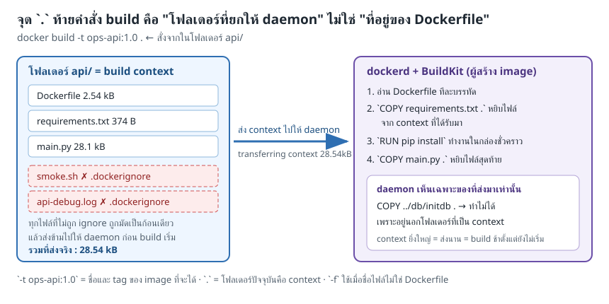

Docker ส่งเฉพาะไฟล์ที่ไม่ตรงกับ `.dockerignore` ไปยัง daemon และคำสั่ง `COPY` อ่านได้เฉพาะไฟล์ใน build context เท่านั้น

### ลำดับ Layer มีผลต่อเวลา build

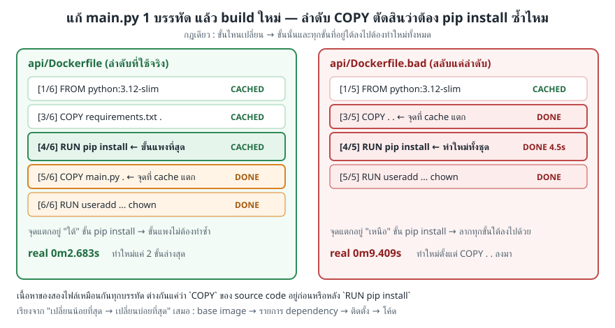

Dockerfile ที่คัดลอก `requirements.txt` และติดตั้ง Dependency ก่อนคัดลอก `main.py` จะยังใช้ cache ของ `pip install` ได้เมื่อแก้เฉพาะซอร์สโค้ด

### `EXPOSE` ไม่เท่ากับ `-p`

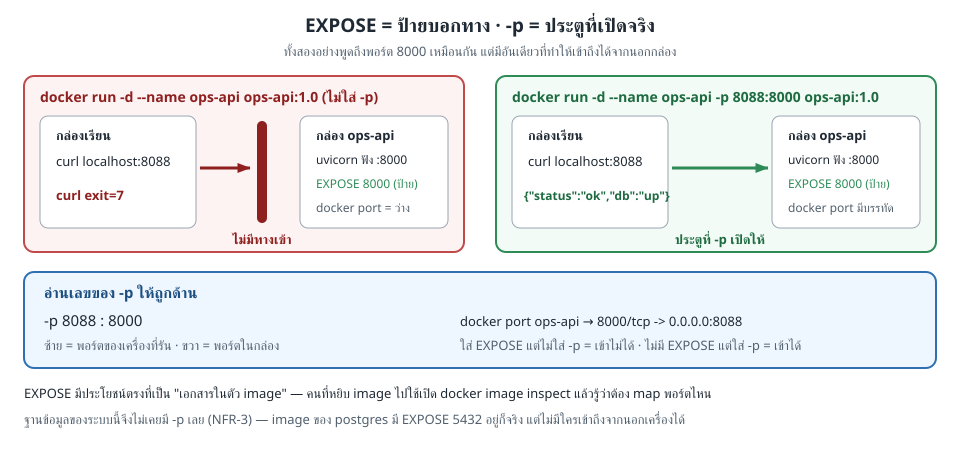

`EXPOSE 8000` เป็น metadata ที่บอกว่าแอปฟังพอร์ต 8000 ภายใน Container ส่วน `-p 8088:8000` สร้างเส้นทางเข้าถึงจริงจากเครื่องที่รัน Docker

## เตรียมสภาพแวดล้อม

เอกสารใช้ placeholder เท่านั้น ให้แทนค่าภายในเครื่องของตนเองและห้ามบันทึก Token ลงไฟล์

บนเครื่องหลัก:

```bash
LAB_IMAGE="<LAB_IMAGE>"
docker run -dit --name devtools-build-api --privileged -p 2223:22 -p 8253:8088 "$LAB_IMAGE"
```

เชื่อมต่อ SSH ด้วยรหัสผ่านที่ผู้สอนกำหนด:

```bash
ssh root@localhost -p 2223
```

ภายใน Container สำหรับการเรียน:

```bash
git clone --depth 1 "https://github.com/<GITHUB_USER>/<REPOSITORY>.git"
cd <REPOSITORY>/02_Docker/03_Fullstack_App_Example/002_LAB_Build_The_API
```

---

## การทดลองที่ 1 — Docker ได้รับไฟล์ใดเป็น build context

**คำถาม:** จุด `.` ใน `docker build ... .` ส่งไฟล์ใดไปยัง Docker daemon

**คำสั่ง — 2 คำสั่ง:**

```bash
cd api
sed -n '/^FROM\|^ENV\|^WORKDIR\|^COPY\|^RUN\|^USER\|^EXPOSE\|^CMD/p' Dockerfile
```

✅ **สิ่งที่ต้องสังเกตเพียงข้อเดียว:** Dockerfile คัดลอก `requirements.txt` ก่อน `main.py`; จึงแยก Dependency ที่เปลี่ยนน้อยออกจากซอร์สโค้ดที่เปลี่ยนบ่อย

---

## การทดลองที่ 2 — Layer cache ลดเวลาการ build ได้หรือไม่

**คำถาม:** เมื่อ build ซ้ำโดยไม่มีไฟล์เปลี่ยน Docker จะทำขั้นเดิมใหม่หรือใช้ cache

**คำสั่ง — 2 คำสั่ง:**

```bash
docker build --progress=plain -t skillspace-api:1.0 .
docker build --progress=plain -t skillspace-api:1.0 .
```

✅ **สิ่งที่ต้องสังเกตเพียงข้อเดียว:** รอบที่สองแสดง `CACHED` ในขั้น `COPY`, `RUN pip install` และ `RUN useradd`; Image ยัง build สำเร็จเหมือนเดิม

ผลรันจริงที่ย่อเฉพาะจุดสำคัญ:

```text
#10 [2/6] WORKDIR /app
#10 CACHED
#11 [3/6] COPY requirements.txt .
#11 CACHED
#12 [4/6] RUN pip install --no-cache-dir -r requirements.txt
#12 CACHED
#13 [5/6] COPY main.py .
#13 CACHED
```

---

## การทดลองที่ 3 — `.dockerignore` กันไฟล์ที่ไม่เกี่ยวข้องได้หรือไม่

**คำถาม:** ไฟล์ log ขนาด 5 MB ในโฟลเดอร์เดียวกันจะถูกส่งไปใน build context หรือไม่

**คำสั่ง — 2 คำสั่ง:**

```bash
truncate -s 5M api-debug.log
docker build --progress=plain -t skillspace-api:1.0 .
```

✅ **สิ่งที่ต้องสังเกตเพียงข้อเดียว:** บรรทัด `transferring context` ยังเป็นหน่วย `B` หรือ `kB` ไม่ใช่ `MB` เพราะ `.dockerignore` มีรูปแบบ `*.log`

---

## การทดลองที่ 4 — API จะเชื่อม PostgreSQL ได้อย่างไร

**คำถาม:** ฐานข้อมูลพร้อมรับ Connection ก่อนเริ่ม API หรือไม่

**คำสั่ง — 2 คำสั่ง:**

```bash
cd .. && docker run -d --name ops-db --env-file .env.db -v ops-pgdata:/var/lib/postgresql/data -v "$PWD/db/initdb:/docker-entrypoint-initdb.d:ro" postgres:17-alpine
until docker exec ops-db pg_isready -U opsuser -d skillspace; do sleep 2; done
```

✅ **สิ่งที่ต้องสังเกตเพียงข้อเดียว:** `pg_isready` ตอบ `/var/run/postgresql:5432 - accepting connections`

> LAB นี้ยังใช้ default bridge จึงอ่าน IP ด้วย `docker inspect`; LAB 4 จะสร้าง user-defined network เพื่อเรียกบริการด้วยชื่อ

---

## การทดลองที่ 5 — `EXPOSE` เปิดทางเข้าจากเครื่องภายนอกหรือไม่

**คำถาม:** Container ที่ Image มี `EXPOSE 8000` แต่ไม่ได้ใส่ `-p` จะมี Port mapping หรือไม่

**คำสั่ง — 2 คำสั่ง:**

```bash
docker run -d --name ops-api -e DATABASE_URL="postgresql://opsuser:labpass@$(docker inspect -f '{{range .NetworkSettings.Networks}}{{.IPAddress}}{{end}}' ops-db):5432/skillspace" skillspace-api:1.0
docker port ops-api
```

✅ **สิ่งที่ต้องสังเกตเพียงข้อเดียว:** `docker port ops-api` ไม่แสดงรายการ; `EXPOSE` เป็น metadata และยังไม่สร้าง Port mapping

---

## การทดลองที่ 6 — Publish Port แล้ว API พร้อมใช้งานหรือไม่

**คำถาม:** เมื่อเพิ่ม `-p 8088:8000` จะเรียก Health endpoint จาก `localhost` ได้หรือไม่

**คำสั่ง — 2 คำสั่ง:**

```bash
docker rm -f ops-api
docker run -d --name ops-api -p 8088:8000 -e DATABASE_URL="postgresql://opsuser:labpass@$(docker inspect -f '{{range .NetworkSettings.Networks}}{{.IPAddress}}{{end}}' ops-db):5432/skillspace" skillspace-api:1.0 && until curl -fsS http://localhost:8088/health; do sleep 1; done
```

✅ **สิ่งที่ต้องสังเกตเพียงข้อเดียว:** API ตอบ `{"status":"ok","db":"up"}`; ค่า `db: up` ยืนยันว่า Health endpoint Query ฐานข้อมูลจริง

---

## การทดลองที่ 7 — เรียก API ผ่าน Swagger UI แบบทีละหน้าจอ

**คำถาม:** ผู้ใช้จะอ่าน Dashboard และสร้าง Ticket โดยไม่พิมพ์ `curl` ได้อย่างไร

**คำสั่ง — 1 URL:** เปิด `http://localhost:8253/docs` บนเครื่องหลัก

### ขั้นที่ ① — เปิดหน้าเอกสาร

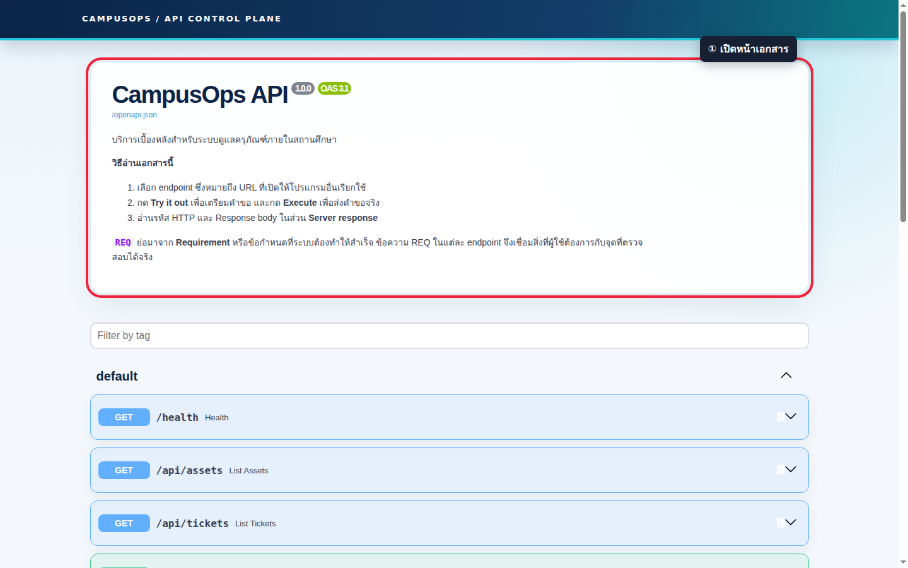

*ภาพที่ ① — ตรวจชื่อ API, เวอร์ชัน, ความหมายของ endpoint และคำอธิบาย `REQ` ก่อนเริ่มใช้*

### ขั้นที่ ② — กาง `GET /api/dashboard`

เลื่อนไปยังแถวสีน้ำเงิน `GET /api/dashboard` แล้วคลิกแถวนั้น

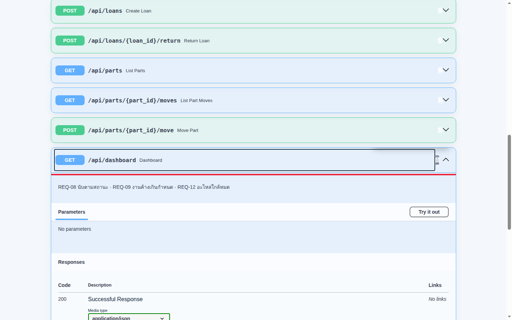

*ภาพที่ ② — รายละเอียดระบุความสัมพันธ์กับ `REQ-08`, `REQ-09` และ `REQ-12`*

### ขั้นที่ ③ — เปิดโหมดส่งคำขอ

คลิก `Try it out`

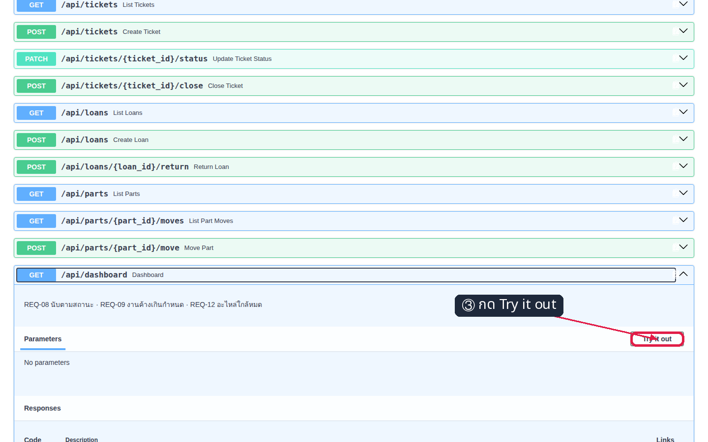

*ภาพที่ ③ — ปุ่ม `Execute` จะปรากฏเมื่อ Swagger UI พร้อมส่งคำขอ*

### ขั้นที่ ④ — ส่งคำขอ Dashboard

คลิก `Execute`

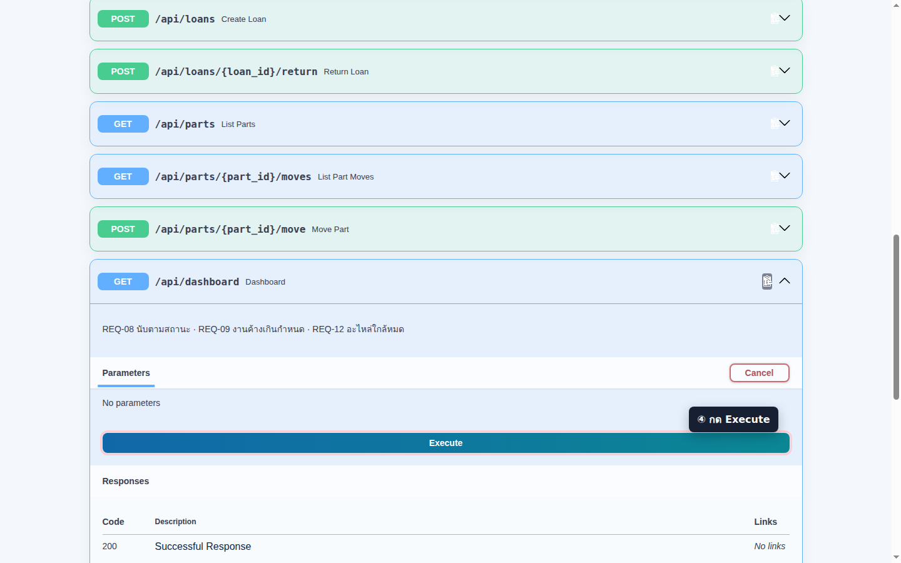

*ภาพที่ ④ — Swagger UI ส่ง `GET /api/dashboard` ไปยัง API ที่กำลังรันจริง*

### ขั้นที่ ⑤ — อ่านผลตอบกลับ

เลื่อนไปที่ `Server response`

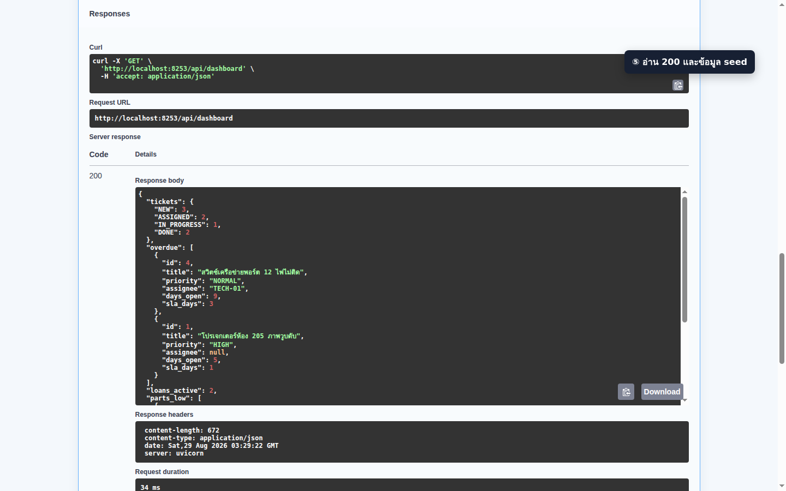

*ภาพที่ ⑤ — รหัส `200` หมายถึงสำเร็จ; Response body มีจำนวน Ticket, งานเกินกำหนด, Loan ที่ยังไม่คืน และอะไหล่ต่ำกว่าจุดสั่งซื้อ*

### ขั้นที่ ⑥ — กาง `POST /api/tickets`

ยุบ Dashboard แล้วคลิกแถวสีเขียว `POST /api/tickets`

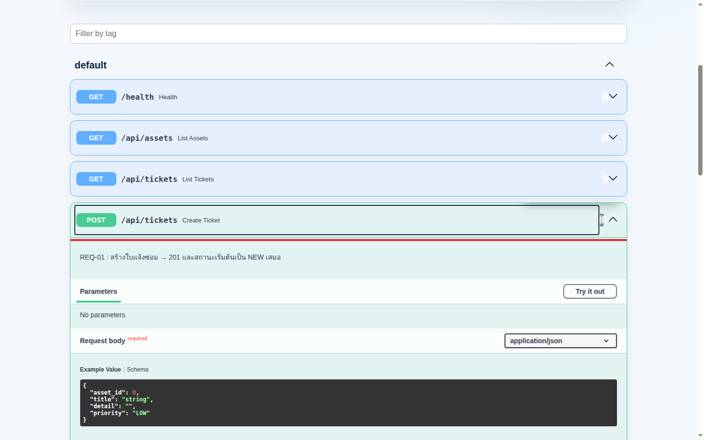

*ภาพที่ ⑥ — Endpoint นี้รับ Request body และใช้ตรวจ `REQ-01`*

### ขั้นที่ ⑦ — เปิดช่องกรอกข้อมูล

คลิก `Try it out`

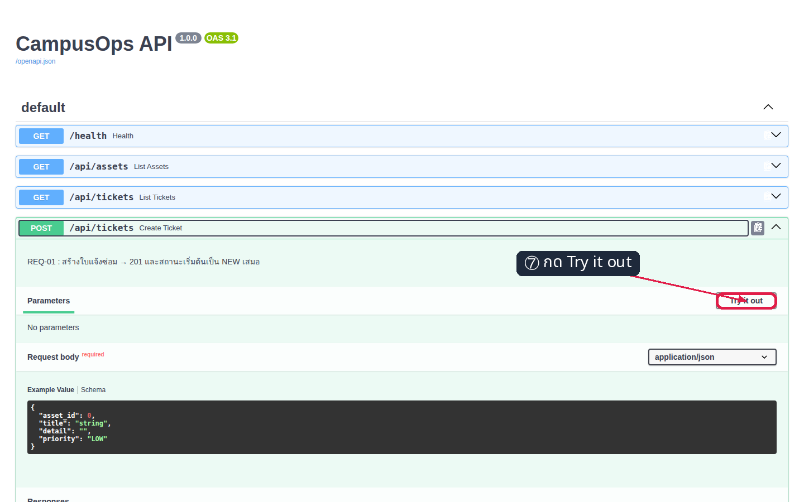

*ภาพที่ ⑦ — ช่อง JSON เปลี่ยนเป็นโหมดแก้ไขได้*

### ขั้นที่ ⑧ — กรอก Request body

แทนที่ JSON เดิมด้วยข้อมูลต่อไปนี้

```json
{
  "asset_id": 12,
  "title": "ลำโพงห้องอบรม 402 เสียงขาดหาย",
  "detail": "เปิดแล้วเสียงดังบ้างหายบ้าง",
  "priority": "HIGH"
}
```

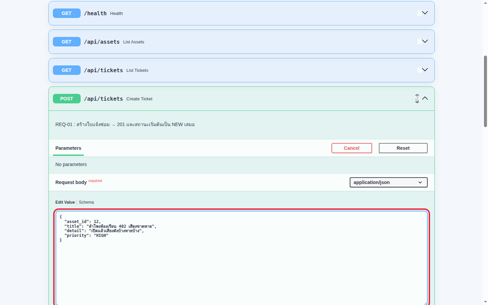

*ภาพที่ ⑧ — `asset_id`, `title` และ `priority` เป็นข้อมูลบังคับ; `detail` ใช้ขยายรายละเอียดอาการ*

### ขั้นที่ ⑨ — สร้าง Ticket และอ่านผล

คลิก `Execute` แล้วเลื่อนไปที่ `Server response`

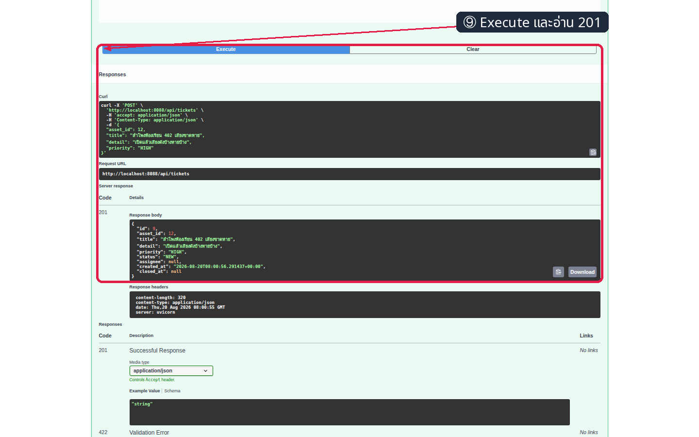

*ภาพที่ ⑨ — รหัส `201` และ `status: NEW` เป็น Acceptance Criteria ของ `REQ-01`; ค่า `id` อาจต่างกันตามข้อมูลในฐานข้อมูล*

✅ **สิ่งที่ต้องสังเกตเพียงข้อเดียว:** คำขอ `GET` ตอบ `200` และคำขอ `POST` ตอบ `201` พร้อม Ticket ใหม่สถานะ `NEW`

---

## การทดลองที่ 8 — Requirement ทั้ง 12 ข้อผ่านเกณฑ์หรือไม่

**คำถาม:** API ผ่านทั้งกรณีสำเร็จและกรณีที่ต้องปฏิเสธตาม `REQ-01` ถึง `REQ-12` หรือไม่

**คำสั่ง — 1 คำสั่ง:**

```bash
API=http://localhost:8088 bash api/smoke.sh
```

✅ **สิ่งที่ต้องสังเกตเพียงข้อเดียว:** บรรทัดสุดท้ายเป็น `SUMMARY: ผ่านครบทุกข้อ REQ-01..REQ-12 (0 FAIL)` และ Process จบด้วย exit code `0`

`smoke.sh` ยิง API ผ่าน Port ที่ Publish ไว้ ไม่ได้เข้าไปเรียกฟังก์ชันภายในโดยตรง จึงตรวจเส้นทางเดียวกับ Client จริง

---

## การทดลองที่ 9 — Apply Image ขึ้น Docker Hub จริง

**คำถาม:** ผู้ใช้อื่นจะดึง Image ที่ทดสอบแล้วจาก Registry ได้หรือไม่

**คำสั่ง — 2 คำสั่ง:**

```bash
docker login -u <DOCKER_USER>
docker tag skillspace-api:1.0 <DOCKER_USER>/skillspace-api:1.0 && docker push <DOCKER_USER>/skillspace-api:1.0
```

เมื่อคำสั่งแรกถาม Password ให้ใช้ Docker access token ที่ป้อนผ่านหน้าจอเท่านั้น ห้ามเขียน Token ลง README, shell script หรือ Screenshot

เปิด `https://hub.docker.com/r/<DOCKER_USER>/skillspace-api/tags` แล้วตรวจ tag `1.0`

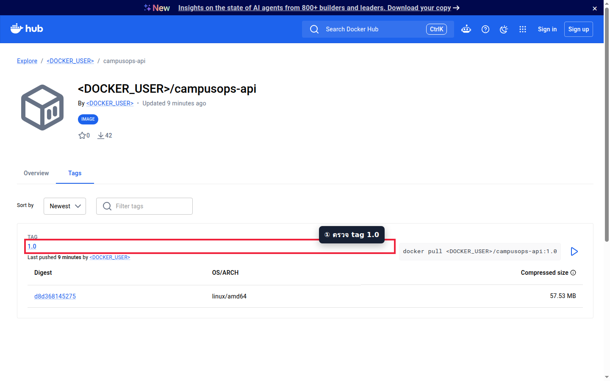

*ภาพหลักฐาน Docker Hub — tag `1.0`, Digest, สถาปัตยกรรม `linux/amd64` และขนาดบีบอัดมาจาก Image ที่ Push จริง; ชื่อบัญชีถูกปกปิดด้วย placeholder*

✅ **สิ่งที่ต้องสังเกตเพียงข้อเดียว:** หน้า Tags แสดง `1.0` และคำสั่ง `docker pull <DOCKER_USER>/skillspace-api:1.0`

---

## การทดลองที่ 10 — Apply ซอร์สโค้ดขึ้น GitHub จริง

**คำถาม:** ผู้ตรวจจะพบ Dockerfile, API, README และหลักฐานของ LAB จาก Revision เดียวกันได้หรือไม่

**คำสั่ง — 2 คำสั่ง:**

```bash
git status --short
git add 002_LAB_Build_The_API && git commit -m "docs(lab-002): verify API image and UI walkthrough" && git push origin <BRANCH>
```

### ขั้น UI ที่ ① — เปิดโฟลเดอร์ LAB

เปิด `https://github.com/<GITHUB_USER>/<REPOSITORY>/tree/<BRANCH>/002_LAB_Build_The_API` แล้วคลิก `readme.md`

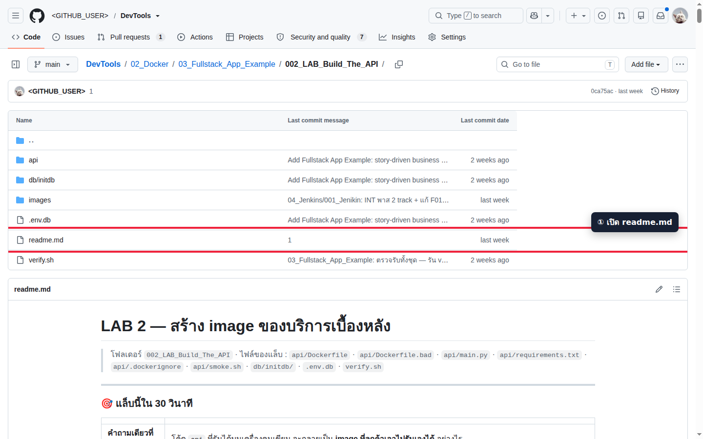

*ภาพที่ ① — โฟลเดอร์เดียวกันมี `api`, `db/initdb`, `images`, `.env.db`, `readme.md` และ `verify.sh`*

### ขั้น UI ที่ ② — ตรวจเนื้อหา README

ตรวจชื่อ LAB และลำดับเนื้อหาที่หน้า Preview

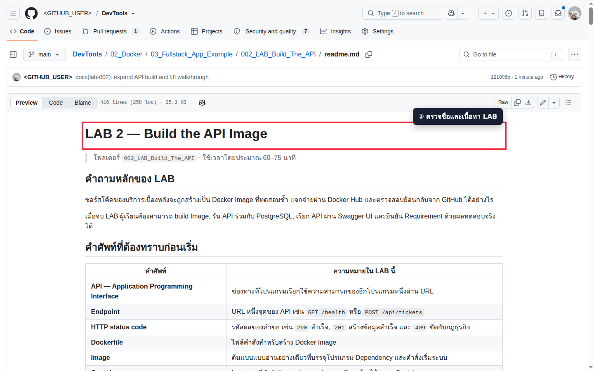

*ภาพที่ ② — Preview ยืนยันว่า Markdown เปิดอ่านได้จาก Revision บน GitHub จริง*

✅ **สิ่งที่ต้องสังเกตเพียงข้อเดียว:** หน้า GitHub แสดงไฟล์ครบและเปิด `readme.md` ได้จาก Branch ที่ Push

---

## การทดลองที่ 11 — ตรวจงานอัตโนมัติ

**คำถาม:** โครงสร้าง Image, cache, `.dockerignore`, Database, Swagger UI และ Requirement ครบชุดยังผ่านพร้อมกันหรือไม่

**คำสั่ง — 1 คำสั่ง:**

```bash
bash verify.sh
```

✅ **สิ่งที่ต้องสังเกตเพียงข้อเดียว:** ทุกบรรทัดขึ้น `[PASS]` และสรุป `ALL CHECKS PASSED`; สคริปต์ลบ Resource ชั่วคราวที่ขึ้นต้นด้วย `vops2-` ให้อัตโนมัติ

ผลตรวจจริงล่าสุด:

```text
[PASS] build image vops2-api:verify จาก api/Dockerfile สำเร็จ
[PASS] api/Dockerfile : แก้ main.py แล้วขั้น RUN pip install ยังเป็น CACHED
[PASS] Swagger UI เปิดได้และมีคำแนะนำการใช้งานผ่านพอร์ต 18088
[PASS] REQ-01 : POST /api/tickets ได้ 201 และใบใหม่มีสถานะ NEW
[PASS] REQ-02 : สั่ง NEW -> DONE ได้ 409 INVALID_TRANSITION
[PASS] smoke.sh ตรวจ Requirement ครบ REQ-01..REQ-12 ผ่าน public API
----------------------------------------------
ALL CHECKS PASSED
```

## แก้ปัญหาที่พบบ่อย

| อาการ | สาเหตุ | วิธีแก้ |
|---|---|---|
| `failed to read dockerfile` | รัน `docker build` ผิดโฟลเดอร์ | เข้า `002_LAB_Build_The_API/api` ก่อน build |
| `Conflict. The container name ... is already in use` | มี Container ชื่อเดิมอยู่ | ตรวจชื่อด้วย `docker ps -a` แล้วลบเฉพาะ Container ของ LAB |
| `port is already allocated` | Host port 8088 ถูกใช้งาน | หยุด Container ที่ใช้พอร์ตนั้น หรือเปลี่ยนเฉพาะเลขด้านซ้ายของ `-p` |
| `curl: (7) Failed to connect` | API ยังไม่พร้อมหรือไม่ได้ Publish Port | ตรวจ `docker logs ops-api` และ `docker port ops-api` |
| Log แสดงว่ารอฐานข้อมูลซ้ำ | `DATABASE_URL` ใช้ IP เก่า หรือ PostgreSQL ยังไม่พร้อม | อ่าน IP ใหม่ด้วย `docker inspect` แล้วสร้าง `ops-api` ใหม่ |
| Swagger UI เปิดได้แต่ไม่มี Endpoint | JavaScript ของ Swagger ยังโหลดไม่เสร็จ | Refresh หน้าและตรวจ Network ของเบราว์เซอร์ |
| `401 Unauthorized` ตอน Push | ไม่ได้ Login หรือ Token ไม่มีสิทธิ์เขียน | Login ใหม่ด้วย `<DOCKER_USER>` และ Access Token ที่มีสิทธิ์ Push |
| `volume is in use` | PostgreSQL Container ยังใช้ Volume | ลบ `ops-db` ก่อนลบ `ops-pgdata` |

## เก็บกวาด

ภายใน Container สำหรับการเรียน:

```bash
docker rm -f ops-api ops-db
docker volume rm ops-pgdata
```

บนเครื่องหลัก:

```bash
docker rm -f devtools-build-api
docker ps -a --filter "name=^devtools-build-api$"
```

✅ ตารางสุดท้ายต้องเหลือเฉพาะหัวตารางและไม่มี Container ของ LAB ค้างอยู่

## เช็กลิสต์ก่อนจบ LAB

- [ ] อธิบายความแตกต่างระหว่าง Image, Container, `EXPOSE` และ `-p` ได้
- [ ] build `skillspace-api:1.0` และเห็น Layer cache ในรอบที่สอง
- [ ] `GET /health` ตอบ `db: up`
- [ ] ทำ Swagger UI ครบภาพที่ ①–⑨ โดยไม่ข้ามขั้น
- [ ] `smoke.sh` ผ่าน `REQ-01` ถึง `REQ-12`
- [ ] ตรวจ tag `1.0` บน Docker Hub และไฟล์ LAB บน GitHub ได้
- [ ] `verify.sh` จบด้วย `ALL CHECKS PASSED`
- [ ] ลบ Container และ Volume ของ LAB แล้ว

> ผลลัพธ์และ Screenshot ในเอกสารนี้ได้จากการรันจริง; ข้อมูลระบุตัวบุคคลและ Credential ถูกแทนด้วย placeholder
