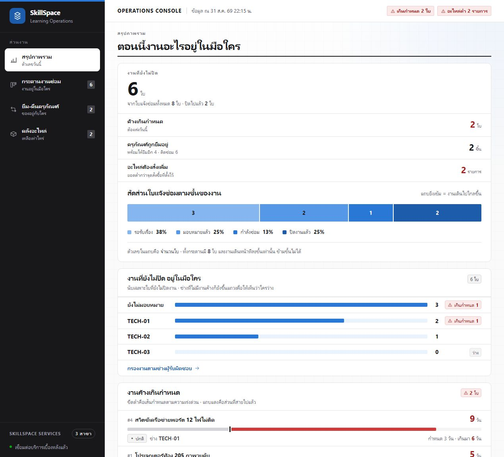
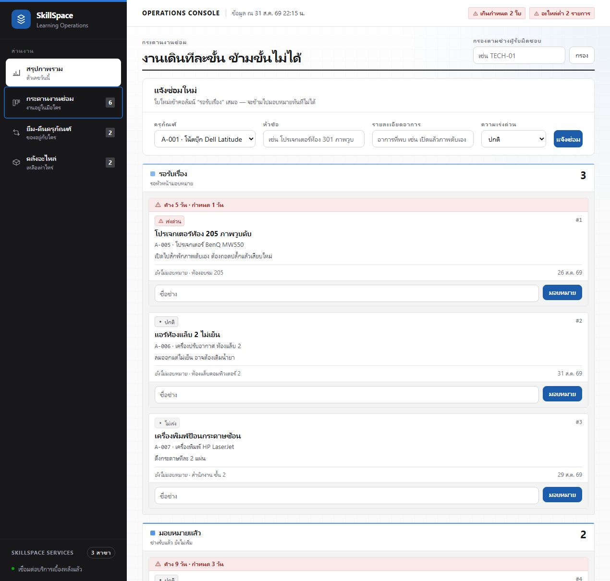
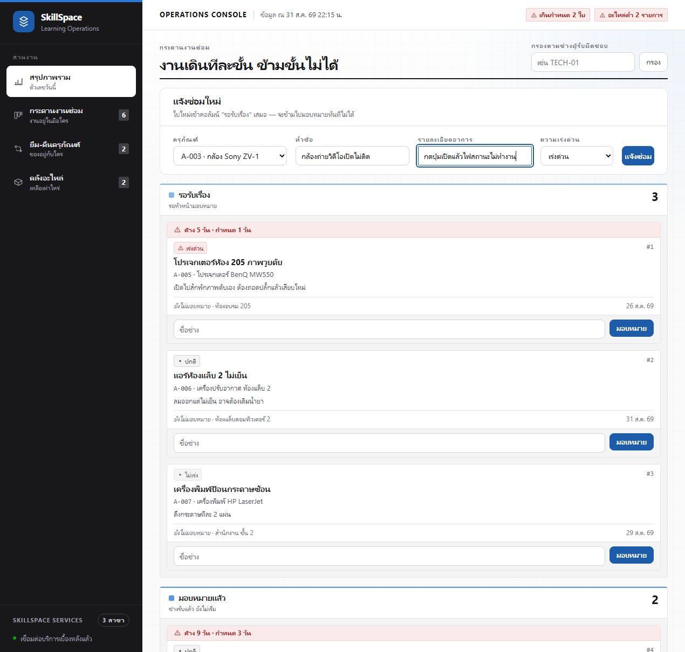
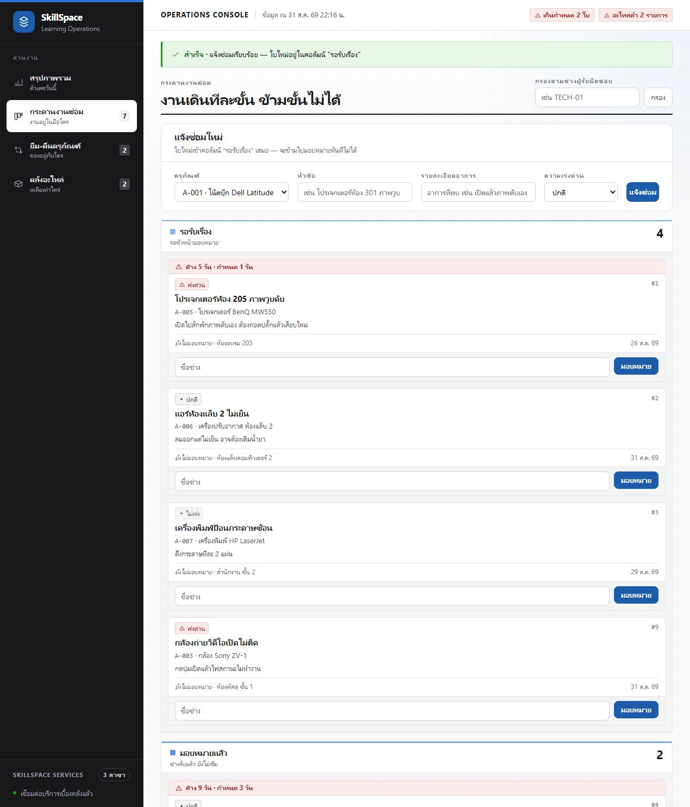
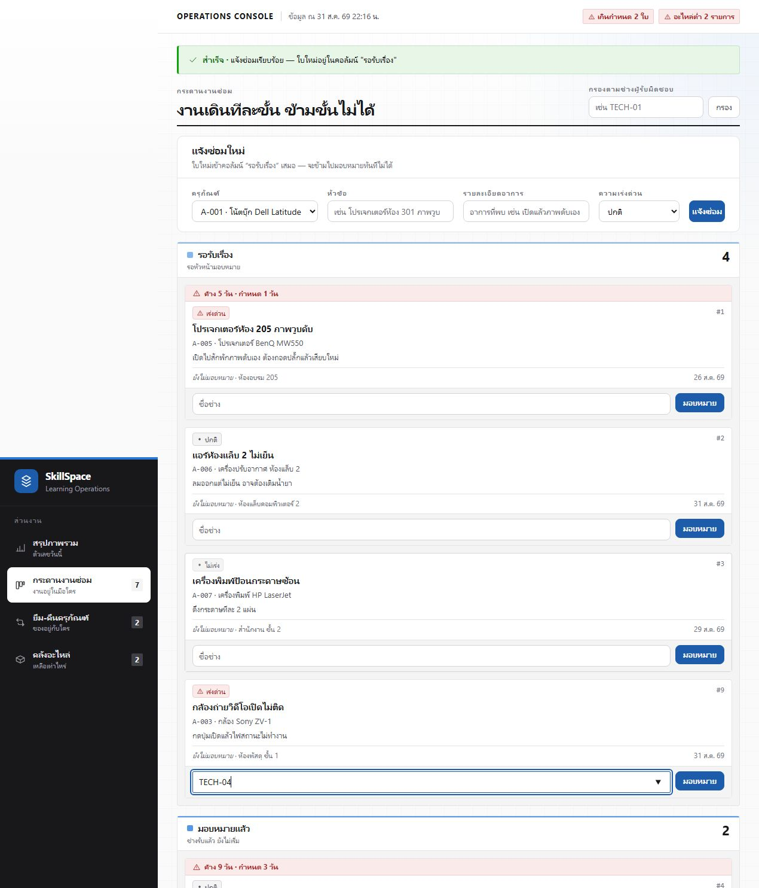
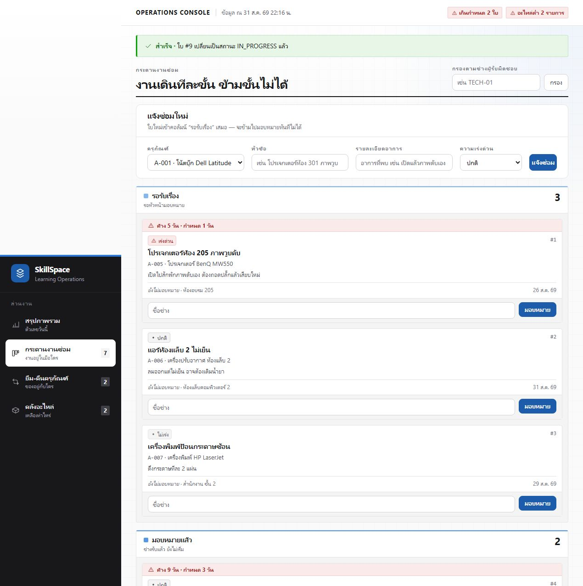
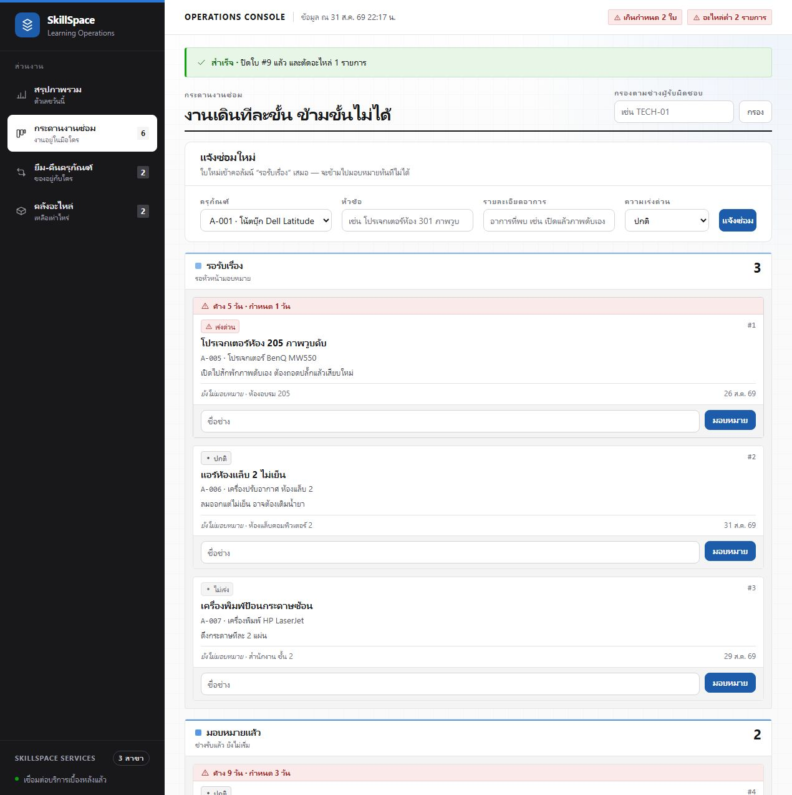
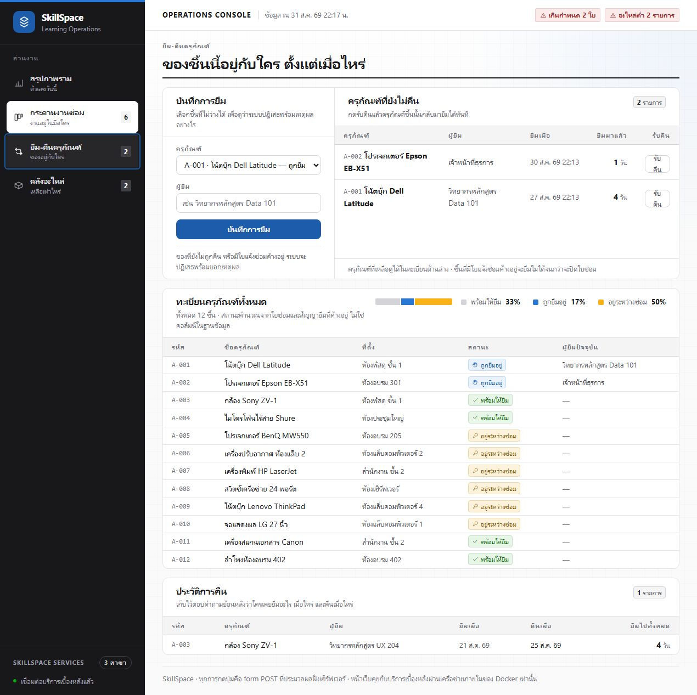
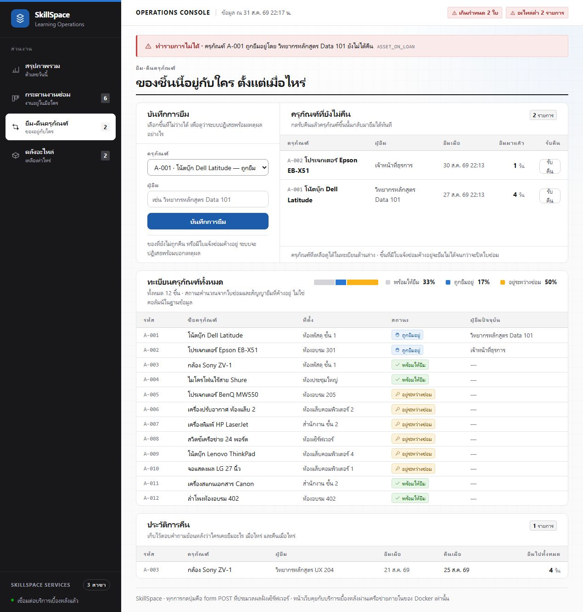
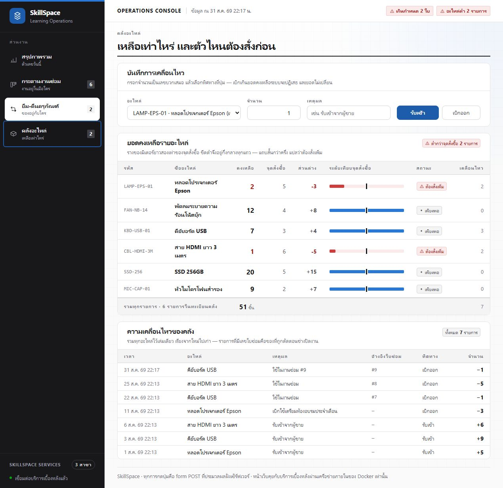

# LAB 002 — Docker Compose: Web · API · Database

แล็บนี้นำระบบ **SkillSpace** ทั้งชุดขึ้นด้วย Docker Compose เพียงคำสั่งเดียว แล้วทดลอง User Flow ของระบบแจ้งซ่อมจากหน้า 20–25 ใน `Fullstack_Slides.html`

## เป้าหมาย

เมื่อจบแล็บ ผู้เรียนจะสามารถ:

1. อธิบายเส้นทาง `browser → web → api → db` ได้
2. อ่าน `compose.yaml` และเข้าใจ `build`, `environment`, `ports`, `volumes`, `healthcheck` และ `depends_on`
3. เปิดระบบ 3 Container ด้วยคำสั่งเดียว
4. ทดลองสร้าง มอบหมาย ดำเนินการ และปิดใบแจ้งซ่อม
5. ตรวจ Flow ยืม–คืนและคลังอะไหล่ รวมทั้งกรณีที่ระบบต้องปฏิเสธ
6. พิสูจน์ว่า database ไม่เปิดพอร์ตออกภายนอก และข้อมูลอยู่รอดเมื่อสร้าง Container ใหม่

## ภาพรวมระบบ

```text
Browser
  │ http://localhost:8252
  ▼
web (Next.js :3000)
  │ http://api:8000
  ▼
api (FastAPI :8000)
  │ postgresql://db:5432/skillspace
  ▼
db (PostgreSQL :5432) ── pgdata volume
```

มีเพียง `web` ที่ publish port ออกมาที่เครื่องผู้เรียน ส่วน `api` และ `db` อยู่ใน Compose network ภายใน

## ไฟล์สำคัญ

```text
002_LAB_Docker_Compose/
├── compose.yaml
├── verify.sh
├── api/
│   ├── Dockerfile
│   ├── main.py
│   ├── requirements.txt
│   └── smoke.sh
├── web/
│   ├── Dockerfile
│   ├── app/
│   └── package.json
└── db/
    ├── Dockerfile
    └── initdb/
        ├── 01-schema.sql
        └── 02-seed.sql
```

## เตรียมเครื่องเรียน

รันคำสั่งนี้จากเครื่องหลักเพื่อสร้าง Container สำหรับทำแล็บ:

```bash
docker rm -f devtools-fs-lab2 2>/dev/null || true
docker run -dit --name devtools-fs-lab2 --privileged \
  -p 2252:22 -p 8252:3000 <LAB_IMAGE>
ssh root@localhost -p 2252
```

ภายในเครื่องเรียน:

```bash
cd ~/labwork/DevTools/02_Docker/03_Fullstack_App_Example/002_LAB_Docker_Compose
docker version
docker compose version
```

> `--privileged` ใช้เฉพาะ Container สำหรับเรียนแบบใช้แล้วทิ้ง เพื่อให้รัน Docker ซ้อนข้างใน ไม่ใช่รูปแบบสำหรับ production

## การทดลองที่ 1 — อ่าน Compose ก่อนรัน

เปิด `compose.yaml` แล้วหาให้ครบ:

- `db` build จาก `postgres:17-alpine`, bake schema/seed เข้า image, มี healthcheck และ volume `pgdata`
- `api` build จาก `./api`, ติดต่อฐานข้อมูลด้วย hostname `db`
- `web` build จาก `./web`, ติดต่อ API ด้วย hostname `api`
- `depends_on: condition: service_healthy` ทำให้ service ถัดไปรอ service ก่อนหน้าพร้อม
- มีเพียง `web` ที่มี `ports`

ตรวจ syntax และค่าที่ Compose จะใช้จริง:

```bash
docker compose config --services
docker compose config
```

ผลที่คาดหวัง: เห็น service `db`, `api`, `web` และไม่มี error

## การทดลองที่ 2 — เปิดระบบด้วยคำสั่งเดียว

```bash
docker compose up -d --build
docker compose ps
```

รอจนทั้งสาม service เป็น `healthy` แล้วเปิด:

```text
http://localhost:8252
```

ถ้าทำแล็บโดยตรงบนเครื่องเดียวกับ Docker ให้ใช้ `http://localhost:3000`

ดูเหตุการณ์เริ่มระบบ:

```bash
docker compose logs --tail=80 db api web
```

สังเกตลำดับ `db → api → web` และแยกให้ออกว่า `running` หมายถึง process ทำงาน ส่วน `healthy` หมายถึงผ่าน healthcheck

## การทดลองที่ 3 — ตรวจขอบเขตเครือข่าย

```bash
docker compose ps
docker compose exec web wget -qO- http://api:8000/health
docker compose exec api python -c "import socket; print(socket.gethostbyname('db'))"
```

ผลที่คาดหวัง:

- web เรียก api ด้วยชื่อ `api`
- api resolve ชื่อ `db` ได้
- หน้าเว็บเปิดจากภายนอกได้ แต่ api และ db ไม่มี published port
- ไม่ต้องหา IP ของ Container และไม่ต้องเขียน `localhost` เพื่อให้ Container คุยกัน

## การทดลองที่ 4 — UI 1/5: สำรวจ Overview ก่อนลงมือ

เปิด `http://localhost:8252` หรือ `http://localhost:3000` ตามวิธีที่ใช้รัน แล้วหยุดอ่านหน้าจอก่อนกดเมนูใด ๆ



ตรวจหลักฐานจากหน้าจอ:

| จุดตรวจ | ผลจากระบบที่ทดลองจริง |
|---|---:|
| ใบแจ้งซ่อมทั้งหมด | 8 ใบ |
| งานที่ยังไม่ปิด | 6 ใบ |
| NEW / ASSIGNED / IN_PROGRESS / DONE | 3 / 2 / 1 / 2 |
| งานของ TECH-04 | 0 ใบ |
| ครุภัณฑ์ที่ถูกยืม | 2 ชิ้น |
| อะไหล่ต่ำกว่าจุดสั่งซื้อ | 2 รายการ |

**เหตุผลที่ต้องเริ่มตรงนี้:** ตัวเลขเหล่านี้คือ baseline สำหรับเทียบก่อน–หลัง หากกดแล้วข้อมูลเปลี่ยนแต่ตัวเลขไม่เปลี่ยน แสดงว่า UI หรือ API มีปัญหา

## การทดลองที่ 5 — UI 2/5: เปิดกระดานงานซ่อม

1. มองเมนูด้านซ้าย
2. คลิก **กระดานงานซ่อม**
3. ตรวจว่าด้านบนเป็นฟอร์ม `แจ้งซ่อมใหม่`
4. ตรวจว่าด้านล่างมีกระดาน 4 คอลัมน์



ผลที่ต้องเห็น:

```text
รอรับเรื่อง (NEW) → มอบหมายแล้ว (ASSIGNED) → กำลังซ่อม (IN_PROGRESS) → ปิดงานแล้ว (DONE)
```

กระดานนี้ยืนยันกฎสำคัญว่า ticket เดินทีละ State และไม่สร้างการ์ดใหม่เมื่อเปลี่ยนสถานะ

## การทดลองที่ 6 — UI 3/5: กรอกใบแจ้งซ่อมทีละช่อง

ใช้ข้อมูลเดียวกับการทดลองจริงรอบนี้:

| ช่อง | ค่าทดลอง |
|---|---|
| ครุภัณฑ์ | `A-003 · กล้อง Sony ZV-1` |
| หัวข้อ | `กล้องถ่ายวิดีโอเปิดไม่ติด` |
| รายละเอียด | `กดปุ่มเปิดแล้วไฟสถานะไม่ทำงาน` |
| ความเร่งด่วน | `เร่งด่วน (HIGH)` |

### 6.1 เลือกครุภัณฑ์

เลือก `A-003` จากรายการ อย่าพิมพ์รหัสเดาเอง เพราะรายการนี้มาจากตาราง `assets`


### 6.2 กรอกหัวข้อและรายละเอียด

หัวข้อควรสั้นพอให้มองบนการ์ดแล้วเข้าใจ ส่วนรายละเอียดต้องบอกอาการที่ตรวจสอบซ้ำได้


### 6.3 เลือกความเร่งด่วน

เลือก `เร่งด่วน` เพื่อให้ระบบใช้ SLA 1 วันในการคำนวณงานเกินกำหนด


### 6.4 ตรวจฟอร์มก่อนส่ง

อ่านครบทั้ง 4 ช่องแล้วจึงกด `แจ้งซ่อม` การตรวจตรงนี้ช่วยแยก input error ออกจาก error ของระบบ



## การทดลองที่ 7 — UI 4/5: ส่งฟอร์มและพิสูจน์ผลลัพธ์

กด **แจ้งซ่อม** หนึ่งครั้ง แล้วตรวจหลักฐาน 4 จุด:

1. แถบสีเขียวแจ้งว่า `แจ้งซ่อมเรียบร้อย`
2. ได้หมายเลขอ้างอิง `#9`
3. การ์ด `#9` อยู่ในคอลัมน์ `รอรับเรื่อง`
4. จำนวน NEW เปลี่ยนจาก 3 เป็น 4 และยอดงานค้างเปลี่ยนจาก 6 เป็น 7



| ค่า | ก่อนกด | หลังกด |
|---|---:|---:|
| ticket ทั้งหมด | 8 | 9 |
| งานที่ยังไม่ปิด | 6 | 7 |
| NEW | 3 | 4 |

หากไม่มีข้อความสำเร็จ ไม่มีการ์ดใหม่ หรือจำนวนไม่เปลี่ยน ให้ตรวจ `docker compose logs web api` ก่อนทำขั้นถัดไป

## การทดลองที่ 8 — UI 5/5: มอบหมาย ดำเนินงาน ปิดงาน และตรวจ Flow ที่เกี่ยวข้อง

### 8.1 ระบุผู้รับผิดชอบ

ที่การ์ด `#9` กรอก `TECH-04` ในช่องชื่อช่าง



กด **มอบหมาย** แล้วตรวจว่าการ์ดเดิมย้ายไปคอลัมน์ `มอบหมายแล้ว`


ผลการทดลองจริง:

- ข้อความสำเร็จระบุ `มอบหมายใบ #9 ให้ TECH-04 แล้ว`
- NEW กลับจาก 4 เป็น 3
- ASSIGNED เพิ่มจาก 2 เป็น 3
- ticket id ยังเป็น `#9` และแสดงชื่อ `TECH-04`

### 8.2 เริ่มลงมือซ่อม

กด **เริ่มลงมือซ่อม** บนการ์ด `#9`


ผลที่ต้องเห็น: การ์ดเดิมย้ายจาก `มอบหมายแล้ว` ไป `กำลังซ่อม` และข้อความสำเร็จระบุสถานะ `IN_PROGRESS`

### 8.3 ปิดงานพร้อมบันทึกอะไหล่

1. เปิดส่วน **ปิดงาน + บันทึกอะไหล่**
2. เลือก `KBD-USB-01 · คีย์บอร์ด USB`
3. กรอกจำนวน `1`
4. กด **ยืนยันปิดงาน**





ผลการทดลองจริง:

| หลักฐาน | ผลที่พบ |
|---|---|
| ticket `#9` | `DONE` |
| assignee | `TECH-04` |
| `closed_at` | มีค่า |
| คีย์บอร์ด USB | ลดจาก 8 เหลือ 7 |
| ประวัติคลัง | มีรายการ `ใช้ในงานซ่อม #9` จำนวน `-1` |

> ระบบไม่อนุญาตให้ข้าม `NEW → DONE` เพราะ State ต้องเดิน `NEW → ASSIGNED → IN_PROGRESS → DONE`

### 8.4 ทดลอง Loans: ของที่ถูกยืมอยู่

เปิดเมนู **ยืม-คืนครุภัณฑ์** จะเห็นรายการที่ยังไม่คืนและสถานะของครุภัณฑ์ทุกชิ้น



เลือก `A-001`, กรอกผู้ยืม `ผู้เรียน LAB 002` แล้วกด **บันทึกการยืม**



ผลที่พบ: ระบบไม่สร้างรายการซ้ำและแสดง `ASSET_ON_LOAN` พร้อมชื่อผู้ยืมปัจจุบัน นี่เป็น business validation ที่ถูกต้อง ไม่ใช่ระบบล่ม

### 8.5 ทดลอง Loans: ของที่กำลังซ่อม

เลือก `A-005` ซึ่งยังมีใบซ่อมค้างอยู่ แล้วส่งฟอร์มอีกครั้ง


ผลที่พบ: ระบบแสดง `ASSET_IN_REPAIR` พร้อมหมายเลขใบซ่อมที่ยังไม่ปิด และไม่มีข้อมูลการยืมใหม่ถูกบันทึก

### 8.6 ตรวจ Parts และหลักฐานการตัดสต็อก

เปิดเมนู **คลังอะไหล่** แล้วตรวจ 3 จุด:

1. `KBD-USB-01` เหลือ 7 จากเดิม 8
2. ประวัติคลังมีรายการอ้างอิง ticket `#9`
3. ยังมีอะไหล่ต่ำกว่าจุดสั่งซื้อ 2 รายการ ตามเงื่อนไข `qty_on_hand < reorder_point`



## การทดลองที่ 9 — พิสูจน์ Persistence

ก่อนหยุดระบบ ให้จำ ticket ที่เพิ่งสร้างไว้ แล้วรัน:

```bash
docker compose down
docker compose up -d
docker compose ps
```

เปิดหน้าเว็บอีกครั้ง: ticket ต้องยังอยู่ เพราะ `docker compose down` ไม่ลบ named volume

จากนั้นทดลอง reset ข้อมูล:

```bash
docker compose down -v
docker compose up -d
```

ข้อมูลต้องกลับเป็น seed เริ่มต้น เพราะ volume ใหม่ทำให้ `db/initdb/` รันอีกครั้ง

## การทดลองที่ 10 — ตรวจงานอัตโนมัติ

```bash
bash verify.sh
echo "exit code = $?"
```

เมื่อผ่านจะเห็น `ALL CHECKS PASSED` และ exit code `0` สคริปต์ใช้ Compose project สำหรับตรวจสอบแยกจากระบบที่ผู้เรียนเปิดอยู่

## แก้ปัญหาที่พบบ่อย

| อาการ | ตรวจ | วิธีแก้ |
|---|---|---|
| service ไม่ healthy | `docker compose ps` | `docker compose logs <service>` |
| web เรียก api ไม่ได้ | `docker compose exec web wget -qO- http://api:8000/health` | ตรวจ `API_BASE_URL` และชื่อ service `api` |
| api ต่อ db ไม่ได้ | `docker compose logs api db` | ตรวจ `DATABASE_URL` และ healthcheck ของ db |
| พอร์ต 3000 ถูกใช้ | `docker compose down` | ปิดระบบเดิมหรือเปลี่ยนพอร์ตด้านซ้ายใน `compose.yaml` |
| ข้อมูลไม่กลับเป็น seed | `docker volume ls` | ใช้ `docker compose down -v` แล้วเปิดใหม่ |

## เก็บกวาด

เก็บข้อมูลไว้ใช้ต่อ:

```bash
docker compose down
```

ลบทั้ง Container, network และข้อมูลของแล็บ:

```bash
docker compose down -v --remove-orphans
```

## สรุป

LAB 001 แยกให้เห็นว่า PostgreSQL เก็บข้อมูลอย่างไร ส่วน LAB 002 นำ `web`, `api` และ `db` มาประกอบเป็นระบบเดียว ทดลอง User Flow จริง และพิสูจน์ NFR ด้วย Docker Compose
