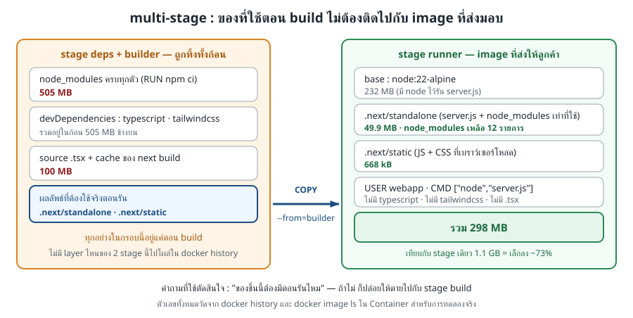

# LAB 3 — สร้าง Docker image สำหรับ Web ด้วย Multi-stage Build

> โฟลเดอร์ `003_LAB_Build_The_Web` · ใช้ไฟล์ `web/Dockerfile`, `web/Dockerfile.single`, `web/Dockerfile.shellform`, `verify.sh` และ source code ใน `web/`, `api/`, `db/`

## ผลลัพธ์การเรียนรู้

LAB นี้ตอบคำถามเดียว: **จะสร้าง Docker image ของ Web ให้มีเฉพาะสิ่งที่จำเป็นต่อการทำงานจริงได้อย่างไร**

เมื่อจบ LAB ผู้เรียนจะสามารถ:

- อธิบายและสร้าง Dockerfile แบบหลาย stage ได้
- แยกค่าที่กำหนดตอน build (`ARG`) ออกจากค่าที่กำหนดตอน run (`ENV`) ได้
- ตรวจว่า image สำหรับส่งมอบไม่มี compiler และ development dependency ที่ไม่จำเป็น
- เริ่มระบบ `web` + `api` + `db` และตรวจผลบน Web UI ได้ด้วยตนเอง

## คำศัพท์ที่ต้องทราบก่อนเริ่ม

| คำศัพท์ | ความหมายใน LAB นี้ |
|---|---|
| **User Story (US)** | ข้อความสั้นจากมุมผู้ใช้ ระบุว่าใครต้องการทำอะไรและเพื่อประโยชน์ใด |
| **Docker image** | ชุดไฟล์และค่ากำหนดแบบอ่านอย่างเดียวที่ใช้สร้าง Container |
| **Container** | process ที่กำลังทำงานจาก Docker image; เอกสารใช้คำมาตรฐาน `Container` อย่างสม่ำเสมอ |
| **Build stage** | ช่วงหนึ่งของ Dockerfile ที่เริ่มด้วย `FROM`; แต่ละ stage มีระบบไฟล์แยกกัน |
| **Build artifact** | ไฟล์ผลลัพธ์จากการ build เช่น `server.js` และ `.next/static` |
| **Toolchain** | เครื่องมือที่ใช้สร้างโปรแกรม เช่น TypeScript compiler และ development dependency |
| **`ARG`** | ค่าที่ใช้ระหว่าง `docker build`; เปลี่ยนแล้วต้อง build image ใหม่ |
| **`ENV`** | ตัวแปรสภาพแวดล้อมที่ process อ่านตอน Container ทำงาน |
| **PID 1** | process หมายเลข 1 ภายใน Container ซึ่งรับสัญญาณจาก `docker stop` โดยตรง |
| **HTTP 200** | รหัสตอบกลับที่หมายถึง Web server ส่งทรัพยากรสำเร็จ |

User Story ของ LAB นี้คือ `US-2`: *“ในฐานะหัวหน้าสำนักงาน ฉันต้องการเห็นงานที่เปิดอยู่และผู้รับผิดชอบ เพื่อจัดลำดับและติดตามงานได้”* งานทางเทคนิคที่สืบเนื่องจาก User Story นี้คือสร้าง Web UI ให้เปิดใช้งานได้จาก image ที่มีขนาดเหมาะสมและกำหนดปลายทาง API ตอนติดตั้งได้

## แนวคิดก่อนลงมือ

### Multi-stage Build

`web/Dockerfile` แบ่งงานเป็น 3 stage:

| Stage | หน้าที่ | สิ่งที่ส่งต่อไปยัง stage สุดท้าย |
|---|---|---|
| `deps` | ติดตั้ง dependency ด้วย `npm ci` | ไม่ส่งระบบไฟล์ทั้ง stage ต่อไป |
| `builder` | build source `.tsx` เป็น build artifact | `.next/standalone` และ `.next/static` |
| `runner` | เริ่ม Web server ด้วยผู้ใช้ที่ไม่ใช่ root | เป็น image สำหรับส่งมอบ |



*ภาพทฤษฎีที่ 1 — `COPY --from=builder` เลือกเฉพาะ build artifact จึงไม่ส่ง toolchain ไปกับ image สำหรับใช้งานจริง*

### `ARG` และ `ENV`


*ภาพทฤษฎีที่ 2 — `NEXT_PUBLIC_SITE_NAME` ถูกฝังตอน build ส่วน `API_BASE_URL` อ่านใหม่เมื่อเริ่ม Container*

### Static asset ของ Next.js

Next.js 16 วางไฟล์ CSS ไว้ใต้ `.next/static/chunks/` ไม่ใช่ `.next/static/css/` ดังนั้น Dockerfile ต้องคัดลอก `.next/static` ทั้ง directory


*ภาพทฤษฎีที่ 3 — การคัดลอก static asset ไม่ครบทำให้ HTML ตอบ HTTP 200 แต่เบราว์เซอร์โหลด CSS ไม่สำเร็จ*

## เตรียมสภาพแวดล้อม

เอกสารใช้ placeholder เพื่อไม่เปิดเผยชื่อผู้ใช้หรือข้อมูลรับรองจริง:

- `<DEVTOOLS_IMAGE>` — image สำหรับห้องปฏิบัติการที่ผู้สอนกำหนด
- `<GITHUB_USER>` และ `<REPOSITORY>` — ตำแหน่ง repository ที่ผู้สอนกำหนด
- `<SSH_PASSWORD>` — รหัสผ่าน SSH ที่แจกให้ผู้เรียน

รันบนเครื่องผู้เรียน:

```bash
docker rm -f devtools-build-web 2>/dev/null
docker run -dit --name devtools-build-web --privileged -p 2224:22 -p 8324:3000 <DEVTOOLS_IMAGE>
```

เชื่อมต่อและโหลด source code:

```bash
ssh root@localhost -p 2224
git clone --depth 1 https://github.com/<GITHUB_USER>/<REPOSITORY>.git && cd <REPOSITORY>/02_Docker/03_Fullstack_App_Example/003_LAB_Build_The_Web
```

> เมื่อ SSH ถามรหัสผ่าน ให้ใช้ `<SSH_PASSWORD>` ที่ผู้สอนแจก พอร์ต `8324` เชื่อมไปยัง Web server พอร์ต `3000` ภายใน Container สำหรับการทดลอง

---

## การทดลองที่ 1 — Dockerfile มีขอบเขตของแต่ละ stage อย่างไร

**คำถาม:** Dockerfile มีทั้งหมดกี่ stage และ stage สุดท้ายรับไฟล์ใดจาก builder

```bash
grep -nE '^FROM|^COPY --from' web/Dockerfile
```

✅ **สิ่งที่ต้องสังเกต:** พบ `FROM` 3 ครั้ง และ `runner` คัดลอก `.next/standalone` กับ `.next/static` จาก `builder`

---

## การทดลองที่ 2 — Multi-stage ลดขนาด image ได้เท่าใด

**คำถาม:** เมื่อใช้ source code เดียวกัน image แบบ multi-stage เล็กกว่า image แบบ stage เดียวหรือไม่

```bash
docker build -f web/Dockerfile.single -t campusops-web:single ./web
docker build -t campusops-web:lab3 ./web && docker images campusops-web
```

✅ **สิ่งที่ต้องสังเกต:** ผลรันจริงได้ content size ประมาณ `322 MB` สำหรับ `:single` และ `73 MB` สำหรับ `:lab3`; multi-stage เล็กกว่ามากกว่า 2 เท่า ตัวเลขอาจต่างเล็กน้อยตามเวอร์ชัน base image

---

## การทดลองที่ 3 — Image สำหรับส่งมอบยังมี toolchain หรือไม่

**คำถาม:** ขั้น `npm ci`, `npm run build` และ TypeScript compiler ติดไปกับ image stage สุดท้ายหรือไม่

```bash
docker history --format '{{.CreatedBy}}' campusops-web:lab3
docker run --rm campusops-web:lab3 sh -c 'test ! -d node_modules/typescript && echo "typescript = not found"'
```

✅ **สิ่งที่ต้องสังเกต:** history ของ stage สุดท้ายไม่มีขั้น `npm ci` หรือ `npm run build` และคำสั่งตรวจภายใน image แสดง `typescript = not found`

---

## การทดลองที่ 4 — ค่า `ARG` ถูกกำหนดเมื่อใด

**คำถาม:** ชื่อระบบที่ส่งด้วย `--build-arg` ถูกบันทึกใน build artifact หรือไม่

```bash
docker build -q --build-arg NEXT_PUBLIC_SITE_NAME='ศูนย์ซ่อมบำรุง' -t campusops-web:rename ./web
docker run --rm --entrypoint sh campusops-web:rename -c "grep -Rao -m1 'ศูนย์ซ่อมบำรุง' .next | head -1"
```

✅ **สิ่งที่ต้องสังเกต:** พบข้อความ `ศูนย์ซ่อมบำรุง` ใน `.next` จึงยืนยันว่าค่า `ARG` ถูกฝังระหว่าง build และต้อง build image ใหม่เมื่อต้องการเปลี่ยนค่า

---

## การทดลองที่ 5 — ค่า `ENV` เปลี่ยนตอน run ได้หรือไม่

**คำถาม:** image เดิมรับ `API_BASE_URL` ใหม่โดยไม่ build ซ้ำได้หรือไม่

```bash
docker run --rm -e API_BASE_URL=http://api.example.invalid:8000 --entrypoint printenv campusops-web:lab3 API_BASE_URL
```

✅ **สิ่งที่ต้องสังเกต:** ผลลัพธ์เป็น `http://api.example.invalid:8000` แสดงว่า process อ่านค่า `ENV` ตอนเริ่ม Container

---

## การทดลองที่ 6 — ระบบสามบริการผ่านเกณฑ์การตรวจรับหรือไม่

**คำถาม:** `db`, `api` และ `web` ทำงานร่วมกันได้ หน้า Web UI ตอบครบ และ CSS โหลดสำเร็จหรือไม่

```bash
KEEP_STACK=1 WEB_PORT=3000 bash verify.sh
```

✅ **สิ่งที่ต้องสังเกต:** ได้ `[PASS]` 22 รายการ ปิดท้าย `ALL CHECKS PASSED` และ `STACK KEPT`; ผลรันจริงวัด image ที่ `73 MB` เทียบกับ `322 MB`, หน้า `/`, `/tickets`, `/loans`, `/parts` ตอบ HTTP 200 และ CSS ตอบ HTTP 200

> `KEEP_STACK=1` ทำให้ `verify.sh` คง Container `vops3-db`, `vops3-api`, `vops3-web` และ volume `vops3-pgdata` ไว้สำหรับ walkthrough ต่อไป โดย `WEB_PORT=3000` publish Web UI ไปยังพอร์ต `8324` ของเครื่องผู้เรียน

### Walkthrough Web UI แบบไม่ข้ามขั้น

ภาพต่อไปนี้เป็น screenshot จากระบบที่รันจริงด้วยข้อมูล seed ชุดเดียวกัน บันทึกที่ viewport `1440 × 900` ด้วย Playwright CLI กรอบแดงระบุตำแหน่งที่ต้องคลิกหรือผลลัพธ์ที่ต้องตรวจ และทุกภาพมี caption อธิบายสถานะหลังขั้นนั้น

ผู้สอนสามารถสร้างภาพทั้ง 10 ภาพซ้ำจากระบบที่คงไว้ในขั้นก่อนหน้า:

```bash
cd web && npm ci && npx playwright install --with-deps chromium
LAB_BASE_URL=http://localhost:3000 npm run capture:walkthrough && cd ..
```

สคริปต์ `web/tests/capture-walkthrough.spec.js` คลิกตามลำดับเดียวกับเอกสาร ตรวจผลด้วย locator ก่อนบันทึกภาพ และเพิ่ม marker หลังหน้า Web UI แสดงสถานะที่ต้องการแล้ว

#### ขั้นที่ ① — เปิดหน้าสรุปภาพรวม

พิมพ์ `http://localhost:8324` ในแถบที่อยู่ แล้วกด Enter ตรวจว่าเมนูหลักมี 4 รายการและหน้าแรกแสดงตัวเลขสรุป


*ภาพที่ 1 — หน้า `/` แสดงใบแจ้งซ่อม 8 ใบ ปิดแล้ว 2 ใบ และงานที่ยังไม่ปิด 6 ใบ*

#### ขั้นที่ ② — เปิดกระดานงานซ่อม

คลิก **กระดานงานซ่อม** ในแถบนำทางด้านซ้าย


*ภาพที่ 2 — หน้า `/tickets` แสดง 4 สถานะ: รอรับเรื่อง 3, มอบหมายแล้ว 2, กำลังซ่อม 1 และปิดงานแล้ว 2 ใบ*

#### ขั้นที่ ③ — เลือกครุภัณฑ์

คลิกช่อง **ครุภัณฑ์** แล้วเลือก `A-003 · กล้อง Sony ZV-1`


*ภาพที่ 3 — ช่องครุภัณฑ์แสดง `A-003 · กล้อง Sony ZV-1` ก่อนกรอกอาการ*

#### ขั้นที่ ④ — กรอกหัวข้อและรายละเอียด

คลิก **หัวข้อ** แล้วพิมพ์ `กล้องถ่ายวิดีโอเปิดไม่ติด` จากนั้นคลิก **รายละเอียดอาการ** แล้วพิมพ์ `กดปุ่มเปิดแล้วไฟสถานะไม่ทำงาน`


*ภาพที่ 4 — ฟอร์มแสดงหัวข้อและรายละเอียดอาการครบก่อนส่งข้อมูล*

#### ขั้นที่ ⑤ — กำหนดความเร่งด่วน

คลิก **ความเร่งด่วน** แล้วเลือก **เร่งด่วน**


*ภาพที่ 5 — ค่าความเร่งด่วนเปลี่ยนจาก “ปกติ” เป็น “เร่งด่วน”*

#### ขั้นที่ ⑥ — ส่งใบแจ้งซ่อม

คลิกปุ่ม **แจ้งซ่อม**


*ภาพที่ 6 — จุดคลิกสุดท้ายของฟอร์มก่อน server action บันทึกใบแจ้งซ่อม*

#### ขั้นที่ ⑦ — ตรวจใบแจ้งซ่อมใหม่

ตรวจคอลัมน์ **รอรับเรื่อง** โดยไม่คลิกส่วนอื่น


*ภาพที่ 7 — จำนวนรอรับเรื่องเพิ่มจาก 3 เป็น 4 และการ์ด `#9` แสดงหัวข้อที่เพิ่งบันทึก*

#### ขั้นที่ ⑧ — ระบุผู้รับผิดชอบ

คลิกช่อง **ชื่อช่าง** บนการ์ด `#9` แล้วพิมพ์ `TECH-04`


*ภาพที่ 8 — ช่องผู้รับผิดชอบของการ์ด `#9` แสดง `TECH-04` ก่อนส่งคำสั่ง*

#### ขั้นที่ ⑨ — มอบหมายงาน

คลิกปุ่ม **มอบหมาย** ข้างช่องชื่อช่าง


*ภาพที่ 9 — ปุ่ม “มอบหมาย” ส่งการ์ด `#9` และชื่อ `TECH-04` ไปยัง server action*

#### ขั้นที่ ⑩ — ตรวจผลหลังมอบหมาย

ตรวจคอลัมน์ **มอบหมายแล้ว** โดยไม่คลิกส่วนอื่น


*ภาพที่ 10 — การ์ด `#9` ย้ายไปคอลัมน์ “มอบหมายแล้ว”; จำนวนรอรับเรื่องกลับเป็น 3 และมอบหมายแล้วเพิ่มเป็น 3*

---

## การทดลองที่ 7 — เบราว์เซอร์ได้รับ CSS จริงหรือไม่

**คำถาม:** HTML อ้างถึงไฟล์ CSS ใด และไฟล์นั้นอยู่ใน image stage สุดท้ายหรือไม่

```bash
curl -s http://localhost:3000/ | grep -o '/_next/static/chunks/[^" ]*\.css' | head -1
docker exec vops3-web sh -c 'ls .next/static/chunks/*.css'
```

✅ **สิ่งที่ต้องสังเกต:** ทั้ง HTML และระบบไฟล์ภายใน Container ชี้ไปยังไฟล์ `.css` ใต้ `.next/static/chunks/`; ผลทดสอบจริงโหลดไฟล์ได้ HTTP 200 และมีขนาดมากกว่า 5,000 ไบต์

---

## ตรวจงานอัตโนมัติ

หากไม่ต้องการคงระบบไว้ ให้รัน:

```bash
KEEP_STACK=0 bash verify.sh; echo "exit code = $?"
```

ผลที่ผ่านต้องลงท้ายดังนี้:

```text
[PASS] ไม่มีโฟลเดอร์ .next/static/css จริง — ยืนยันว่าห้าม COPY เจาะ subfolder
----------------------------------------------
ALL CHECKS PASSED
exit code = 0
```

`verify.sh` ตรวจไฟล์, stage, ขนาด image, toolchain, `CMD` แบบ exec form, ผู้ใช้ที่ไม่ใช่ root, การเชื่อมต่อฐานข้อมูล, endpoint ทั้งสี่หน้า และ static CSS รวม 22 รายการ

## แก้ปัญหาที่พบบ่อย

| อาการ | สาเหตุ | วิธีแก้ |
|---|---|---|
| `Cannot find module '@tailwindcss/postcss'` ระหว่าง build | กำหนด `NODE_ENV=production` ก่อน `npm ci` ทำให้ npm ข้าม development dependency | ย้าย `ENV NODE_ENV=production` ไปหลัง `RUN npm run build` |
| `failed to compute cache key: "/app/.next/static/css": not found` | Dockerfile เจาะ directory ย่อยที่ไม่มีอยู่ใน Next.js 16 | คัดลอก `.next/static` ทั้ง directory |
| หน้า HTML ตอบ `200` แต่ไม่มีรูปแบบ CSS | static asset ไม่ถูกคัดลอกเข้า image | ตรวจ `docker exec <CONTAINER_NAME> ls .next/static/chunks/*.css` และแก้ `COPY --from=builder` |
| API รายงาน `ENOTFOUND <CONTAINER_NAME>` | default bridge ไม่รองรับการค้นหาด้วยชื่อ Container | ใช้ IP จาก `docker inspect` ใน LAB นี้; การค้นหาด้วยชื่อจะเรียนใน LAB 4 |
| `Bind for 0.0.0.0:3000 failed` | มี Container อื่นใช้พอร์ต `3000` | ใช้ `docker ps` ระบุชื่อ แล้วรัน `docker rm -f <CONTAINER_NAME>` |
| `docker stop` ใช้เวลาประมาณ 10 วินาที | `CMD` แบบ shell form ทำให้ `/bin/sh` เป็น PID 1 | ใช้ exec form: `CMD ["node","server.js"]` |
| เปลี่ยน `NEXT_PUBLIC_SITE_NAME` ด้วย `docker run -e` แล้วหน้าเว็บไม่เปลี่ยน | ค่า `NEXT_PUBLIC_*` ถูกฝังตอน build | ใช้ `docker build --build-arg NEXT_PUBLIC_SITE_NAME=...` |

## เก็บกวาด

ภายใน Container สำหรับการทดลอง:

```bash
docker rm -f vops3-web vops3-api vops3-db && docker volume rm vops3-pgdata
docker image rm vops3-web:verify vops3-web:single vops3-api:verify campusops-web:lab3 campusops-web:single campusops-web:rename 2>/dev/null; docker ps -a
```

✅ **สิ่งที่ต้องสังเกต:** ไม่เหลือ Container ชื่อ `vops3-web`, `vops3-api`, `vops3-db` และไม่เหลือ volume `vops3-pgdata`

ออกจาก Container แล้วลบ Container สำหรับการทดลองบนเครื่องผู้เรียน:

```bash
exit
docker rm -f devtools-build-web && docker ps -a --filter 'name=^devtools-build-web$'
```

*ผลลัพธ์และ screenshot ในเอกสารนี้มาจากการรันจริงด้วย `<DEVTOOLS_IMAGE>`; ค่า ID, IP, เวลา และชื่อไฟล์ที่มี hash อาจแตกต่างกันในแต่ละรอบ*
