# LAB 3 — สร้าง image ของหน้าเว็บด้วย multi-stage

> โฟลเดอร์ `003_LAB_Build_The_Web` · ไฟล์ของแล็บ : `web/Dockerfile` · `web/Dockerfile.single` · `web/Dockerfile.shellform` · `web/` (source ของหน้าเว็บ) · `api/` · `db/initdb/` · `verify.sh`

### 🎯 แล็บนี้ใน 30 วินาที

| | |
|---|---|
| **คำถามเดียวที่ตอบให้จบ** | image ของหน้าเว็บที่ส่งให้ลูกค้า ทำอย่างไรให้เหลือ **เฉพาะของที่ต้องใช้ตอนรัน** |
| **ต้องผ่านอะไรมาก่อน** | **LAB 1** (ยกฐานข้อมูล · `-e` · `-v`) · **LAB 2** (Dockerfile · layer cache · `docker history` · `docker inspect` หา IP บน default bridge) |
| **เวลา** | ~45 นาที · การทดลอง **9 อัน** อันละ 3–5 นาที |
| **จบแล้วต้องทำได้เอง** | อ่านและเขียน Dockerfile หลาย stage · บอกได้ว่าค่าไหนต้องมาตอน **build** ค่าไหนอ่านตอน **run** · พิสูจน์ได้ว่า image ที่ส่งมอบไม่ได้แบก toolchain · ตรวจได้ว่า CSS มาถึงเบราว์เซอร์จริง |
| **แล็บนี้ยัง *ไม่* สอน** | เรียกกันด้วย **ชื่อ** บน user-defined network → **LAB 4** (แล็บนี้ยังต่อกันด้วย IP แบบ LAB 2) · `compose.yaml` · `healthcheck` · `tag`/`push` ขึ้น registry → **LAB 5** |

---

## ทฤษฎีก่อนลงมือ

**โจทย์จากลูกค้า** : *"ผมอยากเห็นหน้าจอเดียวที่บอกว่าตอนนี้มีงานอะไรอยู่ในมือใครบ้าง"* (US-2 ใน `../docs/01_requirements.md`)
→ ต้องเอา `web` ใส่**กล่อง** และ image ที่ส่งมอบต้องไม่แบกเครื่องมือ build ไปด้วย

| ข้อจำกัดของงานจริง | เทคนิคที่เลือกใช้ |
|---|---|
| ลูกค้าไม่มีฝ่าย IT · เครื่องปลายทางไม่ควรมี Node ติดตั้ง | ใส่ `web` ลงกล่อง แล้วส่งเป็น image |
| image ที่ส่งมอบต้องเล็กและไม่มีเครื่องมือส่วนเกิน | **multi-stage** — stage build ถูกทิ้ง เหลือแต่ผลลัพธ์ |
| ชื่อระบบบนหัวเว็บเปลี่ยนได้ตอนส่งมอบ | `ARG` → ฝังตอน **build** |
| ที่อยู่ของบริการเบื้องหลังเปลี่ยนตามที่ติดตั้ง | `ENV` → อ่านตอน **run** |
| `docker stop` ต้องปิดงานให้จบ ไม่ใช่ถูกฆ่าทิ้ง | `CMD` **exec form** ให้ node เป็น PID 1 |

### สาม stage ของ `web/Dockerfile`


> 🖼 **วิธีอ่านรูปนี้:** ลูกศร `COPY --from=builder` ตรงกลางขน **เฉพาะผลลัพธ์** ข้ามฝั่ง — ทุกอย่างในกรอบสีส้มฝั่งซ้ายไม่มีอะไรตามไปเลยแม้แต่ layer เดียว

| stage | ทำอะไร | อะไรตามไป stage สุดท้าย |
|---|---|---|
| `deps` | `npm ci` ติดตั้ง dependency ครบทุกตัว | ไม่มีเลย |
| `builder` | `npm run build` แปลง `.tsx` เป็นไฟล์ที่รันได้ | เฉพาะ `.next/standalone` และ `.next/static` |
| `runner` | ตั้งผู้ใช้ธรรมดา · `CMD ["node","server.js"]` | คือ image ที่ส่งมอบ |

> `output: "standalone"` ใน `next.config.ts` คือกุญแจ — Next รวม `server.js` กับ `node_modules` **เท่าที่ใช้จริง** ไว้ให้แล้ว
> stage สุดท้ายจึงหยิบไปวางได้เลยโดยไม่ต้อง `npm install` ซ้ำ

### `ARG` ตอน build กับ `ENV` ตอน run

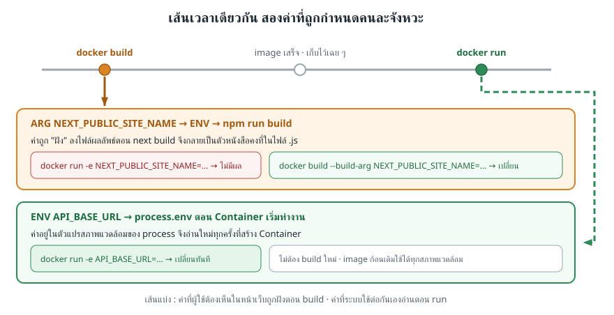

> 🖼 **วิธีอ่านรูปนี้:** สองแถบล่างคือค่าคนละชนิดบนเส้นเวลาเดียวกัน — แถบสีส้มผูกกับจุด `docker build` ส่วนแถบสีเขียวผูกกับจุด `docker run` · ค่าที่ผูกกับ build เปลี่ยนตอน run ไม่ได้

| | `NEXT_PUBLIC_SITE_NAME` | `API_BASE_URL` |
|---|---|---|
| ประกาศไว้ที่ | `ARG` + `ENV` ใน stage `builder` | `-e` ตอน `docker run` |
| ถูกอ่านเมื่อ | ตอน `npm run build` | ตอนกล่องเริ่มทำงาน |
| เปลี่ยนค่าอย่างไร | `docker build --build-arg ...` (ต้อง build ใหม่) | `docker run -e ...` (image ก้อนเดิม) |

### `CMD` exec form กับสัญญาณ `SIGTERM`

`docker stop` ส่ง `SIGTERM` ให้ **process หมายเลข 1** ของกล่องเท่านั้น แล้วรอ 10 วินาที ถ้ายังไม่จบจึงส่ง `SIGKILL`

| รูปแบบ | สิ่งที่เป็น PID 1 | ผลตอน `docker stop` |
|---|---|---|
| `CMD ["node","server.js"]` (exec form) | `node` | ได้รับสัญญาณตรง ๆ จบทันที |
| `CMD node server.js; echo stopped` (shell form) | `/bin/sh` | `sh` รับสัญญาณแล้วไม่ส่งต่อ → รอครบ 10 วินาทีแล้วถูกฆ่า |

### กับดักของ Next.js 16 : `.next/static` ต้องยกมาทั้งก้อน

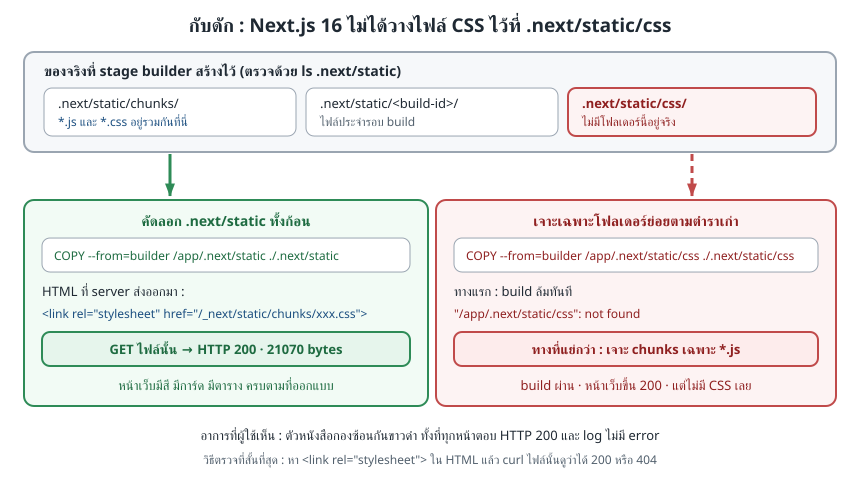

> 🖼 **วิธีอ่านรูปนี้:** กล่องแดงมุมขวาบนคือโฟลเดอร์ที่ตำราส่วนใหญ่บอกให้ copy — แต่ **ไม่มีอยู่จริง** ใน Next.js 16 · ไฟล์ `.css` ถูกวางปนอยู่กับ `.js` ใน `chunks/`

### สิ่งที่มักเข้าใจผิด

- **คิดว่า** ค่า `NEXT_PUBLIC_*` เปลี่ยนได้ด้วย `-e` ตอน `docker run` → **จริง ๆ** ถูกฝังลงไฟล์ไปแล้วตั้งแต่ตอน build (การทดลองที่ 5)
- **คิดว่า** shell form กับ exec form ต่างกันแค่รูปแบบการเขียน → **จริง ๆ** ต่างกันที่ใครเป็น PID 1 และผลคือ `docker stop` ช้าไป 10 วินาที (การทดลองที่ 7)
- **คิดว่า** ไฟล์ CSS ของ Next อยู่ที่ `.next/static/css` → **จริง ๆ** อยู่ที่ `.next/static/chunks` (การทดลองที่ 9)
- **คิดว่า** multi-stage ทำให้ทุกแอปเล็กลงอัตโนมัติ → **จริง ๆ** ต้องเลือกเองว่าจะขน artifact ชิ้นไหนเข้า stage สุดท้าย (การทดลองที่ 3)

---

## เตรียมเครื่องเรียน

### ขั้นที่ 1 — เปิดกล่องเรียน

รันบน **เครื่องของเราเอง** :

```bash
docker rm -f devtools-fs-lab3 2>/dev/null
docker run -dit --name devtools-fs-lab3 --privileged \
  -p 2253:22 -p 8253:3000 tuchsanai/devtools:2569_1
ssh root@localhost -p 2253        # password : passwd
```

> พอร์ต `8253` ของเครื่องเราถูกต่อเข้ากับพอร์ต `3000` ของกล่องเรียน เมื่อถึงการทดลองที่ 8 กล่องหน้าเว็บจะจองพอร์ต `3000` ในกล่องเรียน จึงเปิด `http://localhost:8253` จากเบราว์เซอร์บนเครื่องได้

### ขั้นที่ 2 — โหลดโค้ดแล็บ

**คำสั่งทุกอันหลังจากนี้พิมพ์ข้างในกล่องเรียน**

```bash
mkdir -p ~/labwork && cd ~/labwork
git clone --depth 1 https://github.com/Tuchsanai/DevTools.git
cd DevTools/02_Docker/03_Fullstack_App_Example/003_LAB_Build_The_Web
ls
```

> repo ก้อนนี้ใหญ่หลายร้อยเมกะไบต์ · `--depth 1` โหลดมาแค่ commit ล่าสุด ทำให้เสร็จในไม่กี่สิบวินาทีแทนที่จะเป็นหลายนาที

✅ **สิ่งที่ต้องเห็น** — โฟลเดอร์ของสามกล่อง พร้อมเอกสารและสคริปต์ตรวจงาน รวม 6 รายการ :

```
api
db
images
readme.md
verify.sh
web
```

> 📝 `web/` คือ source ของหน้าเว็บ (Next.js 16.3.1) · `api/` กับ `db/` คือของเดิมจาก LAB 1–2 ที่ยกมาใช้ประกอบในการทดลองที่ 8

---

## การทดลองที่ 1 — โครงสร้าง Dockerfile แบบสาม stage เป็นอย่างไร

**คำถาม:** `web/Dockerfile` แบ่งเป็นกี่ stage และ stage สุดท้ายหยิบอะไรข้ามมาบ้าง

```bash
grep -n '^FROM\|^COPY --from' web/Dockerfile
```

✅ **สิ่งที่ต้องเห็น** — `FROM` **3 ครั้ง** = 3 stage และมี `COPY --from` ขนของข้าม stage 3 บรรทัด (เลขบรรทัดตรงกันทุกคน) :

```
11:FROM node:22-alpine AS deps
21:FROM node:22-alpine AS builder
30:COPY --from=deps /app/node_modules ./node_modules
35:FROM node:22-alpine AS runner
47:COPY --from=builder --chown=webapp:webapp /app/.next/standalone ./
53:COPY --from=builder --chown=webapp:webapp /app/.next/static ./.next/static
```

> 📝 **`FROM` กี่ครั้ง = กี่ stage** · stage ที่ไม่มีใคร `COPY --from` ไปใช้และไม่ใช่ stage สุดท้าย จะถูกทิ้งทั้งก้อน · ชื่อหลัง `AS` มีไว้อ้างถึงเท่านั้น

---

## การทดลองที่ 2 — ขนาดของ image แบบ stage เดียวเป็นอย่างไร

**คำถาม:** ถ้าไม่แยก stage เลย image จะใหญ่แค่ไหน

```bash
time docker build -f web/Dockerfile.single -t campusops-web:single ./web
docker images campusops-web
```

✅ **สิ่งที่ต้องเห็น** — build ผ่าน และ **`DISK USAGE` ทะลุ 1 GB** — ด้านล่างตัดมาเฉพาะ **ท้าย** ผลลัพธ์ ของจริงจะมี log ของทุกขั้นยาวนับร้อยบรรทัดก่อนหน้านี้ (เวลาและ ID ของแต่ละคนไม่ตรงกัน) :

```
#13 naming to docker.io/library/campusops-web:single done
#13 unpacking to docker.io/library/campusops-web:single
#13 unpacking to docker.io/library/campusops-web:single 3.1s done
#13 DONE 12.4s

real	0m41.207s
user	0m0.135s
sys	0m0.142s

IMAGE                  ID             DISK USAGE   CONTENT SIZE   EXTRA
campusops-web:single   6cf455d56831        1.1GB          314MB
```

> 📝 ไฟล์นี้ทำงานได้จริง หน้าเว็บขึ้นครบเหมือนกัน — ปัญหาคือมันแบก `node_modules` เต็มก้อน · `typescript` · `tailwindcss` · source `.tsx` และ cache ของ `next build` ไปด้วยทั้งหมด

---

## การทดลองที่ 3 — multi-stage ลดขนาด image ได้อย่างไร

**คำถาม:** ผลลัพธ์เหมือนกัน แต่ image ต่างกันเท่าไร

```bash
time docker build -t campusops-web:lab3 ./web
docker images campusops-web
```

✅ **สิ่งที่ต้องเห็น** — **1.1GB → 298MB** จากไฟล์ source ชุดเดียวกัน — ด้านล่างตัดมาเฉพาะ **ท้าย** ผลลัพธ์เช่นเดียวกับการทดลองที่ 2 (เวลาและ ID ของแต่ละคนไม่ตรงกัน) :

```
real	0m23.112s
user	0m0.086s
sys	0m0.100s

IMAGE                  ID             DISK USAGE   CONTENT SIZE   EXTRA
campusops-web:lab3     ee2d124d03a1        298MB         73.3MB
campusops-web:single   6cf455d56831        1.1GB          314MB
```

บรรทัด `real` รอบนี้เร็วกว่าการทดลองที่ 2 (23.1 วินาที เทียบกับ 41.2 วินาที) เพราะ base `node:22-alpine` ถูกดึงมาไว้ในเครื่องเรียนตั้งแต่ครั้งก่อนแล้ว ตัวเลขนี้อาจต่างกันตามเครื่อง

> 📝 **เล็กลง ~73%** · Docker 29 แยกสองคอลัมน์ : `DISK USAGE` คือพื้นที่จริงบนดิสก์ (นับ layer ของ base ที่ใช้ร่วมกันด้วย) ส่วน `CONTENT SIZE` คือเนื้อของ image เอง — ดูคอลัมน์ไหนก็ได้ ขอให้เทียบคอลัมน์เดียวกัน

---

## การทดลองที่ 4 — stage สุดท้ายยังมี toolchain ไหม

**คำถาม:** ขั้น `npm ci` กับ `npm run build` ติดมากับ image ที่จะส่งมอบไหม

```bash
docker history campusops-web:lab3
```

✅ **สิ่งที่ต้องเห็น** — **ไม่มีบรรทัด `npm` เลยแม้แต่บรรทัดเดียว** ของเราเองมีแค่ 4 layer (เวลาและ ID ของแต่ละคนไม่ตรงกัน) :

```
IMAGE          CREATED              CREATED BY                                      SIZE      COMMENT
ee2d124d03a1   7 seconds ago        CMD ["node" "server.js"]                        0B        buildkit.dockerfile.v0
<missing>      7 seconds ago        EXPOSE [3000/tcp]                               0B        buildkit.dockerfile.v0
<missing>      7 seconds ago        USER webapp                                     0B        buildkit.dockerfile.v0
<missing>      7 seconds ago        COPY --chown=webapp:webapp /app/.next/static…   668kB     buildkit.dockerfile.v0
<missing>      8 seconds ago        COPY --chown=webapp:webapp /app/.next/standa…   49.9MB    buildkit.dockerfile.v0
<missing>      28 seconds ago       RUN /bin/sh -c addgroup -g 10001 -S webapp &…   41kB      buildkit.dockerfile.v0
<missing>      28 seconds ago       ENV NODE_ENV=production NEXT_TELEMETRY_DISAB…   0B        buildkit.dockerfile.v0
<missing>      About a minute ago   WORKDIR /app                                    8.19kB    buildkit.dockerfile.v0
<missing>      2 weeks ago          CMD ["node"]                                    0B        buildkit.dockerfile.v0
<missing>      2 weeks ago          ENTRYPOINT ["docker-entrypoint.sh"]             0B        buildkit.dockerfile.v0
<missing>      2 weeks ago          COPY docker-entrypoint.sh /usr/local/bin/ # …   20.5kB    buildkit.dockerfile.v0
<missing>      2 weeks ago          RUN /bin/sh -c apk add --no-cache --virtual …   5.48MB    buildkit.dockerfile.v0
<missing>      2 weeks ago          ENV YARN_VERSION=1.22.22                        0B        buildkit.dockerfile.v0
<missing>      2 weeks ago          RUN /bin/sh -c addgroup -g 1000 node     && …   160MB     buildkit.dockerfile.v0
<missing>      2 weeks ago          ENV NODE_VERSION=22.23.2                        0B        buildkit.dockerfile.v0
<missing>      2 months ago         CMD ["/bin/sh"]                                 0B        buildkit.dockerfile.v0
<missing>      2 months ago         ADD alpine-minirootfs-3.24.1-x86_64.tar.gz /…   9.07MB    buildkit.dockerfile.v0
```

เก้าบรรทัดล่างสุดคือ base `node:22-alpine` · แปดบรรทัดบนคือของ `web/Dockerfile` เอง ซึ่ง **มีขนาดจริงแค่ 4 บรรทัด** : `668kB` · `49.9MB` · `41kB` · `8.19kB`

ตรวจการมีอยู่ของ TypeScript โดยไม่ทำให้คำสั่งล้มเหลว :

```bash
docker run --rm campusops-web:lab3 sh -c 'if [ -d node_modules/typescript ]; then echo "typescript = found"; else echo "typescript = not found"; fi'
docker run --rm campusops-web:single sh -c 'if [ -d node_modules/typescript ]; then echo "typescript = found"; else echo "typescript = not found"; fi'
```

✅ **สิ่งที่ต้องเห็น** — image multi-stage ไม่มี TypeScript ส่วน image แบบ stage เดียวมี TypeScript :

```
typescript = not found
typescript = found
```

> 📝 นี่คือคำตอบให้ลูกค้าโดยตรง — **image ที่ส่งมอบไม่มี compiler ไม่มี devDependencies** เหลือแต่ `server.js` กับ dependency ที่ Next รวมมาให้เท่าที่ใช้จริง

---

## การทดลองที่ 5 — ชื่อระบบเปลี่ยนตอน run ได้ไหม

**คำถาม:** ตั้ง `NEXT_PUBLIC_SITE_NAME` ใหม่ตอน `docker run` แล้วหน้าเว็บเปลี่ยนตามไหม

```bash
docker run -d --name ops-web-try -p 3001:3000 -e NEXT_PUBLIC_SITE_NAME='ศูนย์ซ่อมบำรุง' campusops-web:lab3 && sleep 4
curl -s http://localhost:3001/no-such-page | grep -o '<title>[^<]*</title>' | head -1
```

✅ **สิ่งที่ต้องเห็น** — `docker run -d` พิมพ์ ID ของกล่องออกมาก่อน แล้ว `<title>` ยังเป็น `CampusOps` เหมือนเดิม **ไม่สนใจค่าที่เพิ่งส่งเข้าไป** (ID และ IP ของแต่ละคนไม่ตรงกัน) :

```
b585493978d0d2949704d5f4625a8021d484cf9c262cd198b69b03ec35d2f904
<title>CampusOps · ระบบงานซ่อมและครุภัณฑ์</title>
```

ทีนี้ส่งค่าเดียวกันตอน **build** :

```bash
docker build -q --build-arg NEXT_PUBLIC_SITE_NAME='ศูนย์ซ่อมบำรุง' -t campusops-web:rename ./web && docker run -d --name ops-web-try2 -p 3002:3000 campusops-web:rename && sleep 4
curl -s http://localhost:3002/no-such-page | grep -o '<title>[^<]*</title>' | head -1
```

✅ **สิ่งที่ต้องเห็น** — `-q` ทำให้ `docker build` พิมพ์แค่ `sha256:` ของ image ตามด้วย ID ของกล่อง แล้วคราวนี้ `<title>` เปลี่ยนจริง (sha256 และ ID ของแต่ละคนไม่ตรงกัน) :

```
sha256:fd85a9fcb0c2bfe3e95706a1133e95769df3b5aacbf47b6693157d12c8af92ec
26296fd23de25b7803eb4fc2af1f8cae485ae7c8b603cf2bb3b8490f5666d77f
<title>ศูนย์ซ่อมบำรุง · ระบบงานซ่อมและครุภัณฑ์</title>
```

> 📝 ค่า `NEXT_PUBLIC_*` ถูกแปลงเป็น **ตัวหนังสือคงที่ในไฟล์ผลลัพธ์** ตั้งแต่ `npm run build` · เรียกหน้าที่ไม่มีอยู่จริงเพื่อดูเฉพาะ layout โดยไม่ต้องมี `api`

---

## การทดลองที่ 6 — API_BASE_URL เปลี่ยนตอน run ได้ไหม

**คำถาม:** `API_BASE_URL` ต้อง build ใหม่ไหมถ้าอยากเปลี่ยน

```bash
docker run -d --name ops-web-env -e API_BASE_URL=http://api.example.invalid:8000 campusops-web:lab3
docker exec ops-web-env printenv API_BASE_URL
```

✅ **สิ่งที่ต้องเห็น** — image ก้อนเดิมรับค่าใหม่ไว้ใน environment โดยไม่ต้อง build ซ้ำ (ID ของแต่ละคนไม่ตรงกัน) :

```
f3b2153bcedb136cfa175b1ddf7d3779cf9a4b81ce9e04d37212478ea3223b44
http://api.example.invalid:8000
```

> 📝 ค่านี้อยู่ในตัวแปรสภาพแวดล้อมของ process จึงถูกอ่านใหม่ทุกครั้งที่สร้างกล่อง — **image ก้อนเดียวจึงใช้ได้ทั้งเครื่อง dev และเครื่องลูกค้า** เปลี่ยนแค่ `-e` ตอนติดตั้ง

---

## การทดลองที่ 7 — process ที่เป็น PID 1 คืออะไร

**คำถาม:** เขียน `CMD` คนละรูปแบบ แล้วใครได้รับ `SIGTERM` ตอน `docker stop`

ไฟล์ `web/Dockerfile.shellform` มีมาให้แล้วในโฟลเดอร์ — ต่อยอดจาก `campusops-web:lab3` แล้วเปลี่ยนแค่บรรทัด `CMD` ให้เป็น shell form

```bash
docker build -q -f web/Dockerfile.shellform -t campusops-web:shellform ./web && docker run -d --name ops-web-exec campusops-web:lab3 && docker run -d --name ops-web-shell campusops-web:shellform && sleep 4
docker exec ops-web-exec ps -o pid,args; docker exec ops-web-shell ps -o pid,args
```

✅ **สิ่งที่ต้องเห็น** — บรรทัดแรก ๆ คือ `sha256:` ของ image กับ ID ของสองกล่อง แล้วฝั่ง exec form `node` เป็น PID 1 · ฝั่ง shell form มี `/bin/sh` คั่นอยู่ที่ PID 1 แล้ว `node` ไปเป็น PID 8 (sha256 · ID · เลข PID ของ `ps` เองของแต่ละคนไม่ตรงกัน) :

```
sha256:b15aeb15730f51cf7ec5cc888c03440b148fcf5e88d14d81b82a631960b2b8eb
b42b75940bcb81f5215cd19d700677b80956b6c3be4809183d3e8b45983907fe
f7d27c80b8614225dc4fa85640b167e9a2a84bf2378f5037b8e399889a42f5bc
PID   COMMAND
    1 next-server (v
   19 ps -o pid,args
PID   COMMAND
    1 /bin/sh -c node server.js; echo stopped
    8 next-server (v
   20 ps -o pid,args
```

ทีนี้จับเวลาสั่งหยุดทั้งสองกล่อง :

```bash
time docker stop ops-web-exec
time docker stop ops-web-shell
```

✅ **สิ่งที่ต้องเห็น** — **0.3 วินาที กับ 10.3 วินาที** (ทศนิยมอาจต่างกัน แต่ตัวหน้าต้องเป็น 0 กับ 10) :

```
ops-web-exec

real	0m0.307s
user	0m0.004s
sys	0m0.011s

ops-web-shell

real	0m10.317s
user	0m0.005s
sys	0m0.009s
```

> 📝 `/bin/sh` รับ `SIGTERM` แล้วไม่ส่งต่อให้ลูก Docker จึงรอครบ **10 วินาที** แล้ว `SIGKILL` ทิ้ง — แอปไม่ได้ปิดงานให้เรียบร้อย · exec form ตัดปัญหานี้ทั้งหมด

เก็บกล่องทดลองของการทดลองที่ 5–7 ออกก่อนไปต่อ :

```bash
docker rm -f ops-web-try ops-web-try2 ops-web-env ops-web-exec ops-web-shell
```

---

## การทดลองที่ 8 — สามกล่องทำงานร่วมกันได้ไหม

**คำถาม:** ต่อ `web` เข้ากับ `api` และ `db` ด้วย IP แบบ LAB 2 แล้วหน้าเว็บขึ้นจริงไหม

> ครั้งแรกอาจใช้เวลา **1–2 นาที** เพราะต้องดึง `postgres:17-alpine` กับ `python:3.12-slim` และติดตั้ง dependency ตอน build `campusops-api:lab3`

```bash
docker volume rm ops-pgdata 2>/dev/null
docker run -d --name ops-db -e POSTGRES_DB=campusops -e POSTGRES_USER=opsuser -e POSTGRES_PASSWORD=labpass \
  -v ops-pgdata:/var/lib/postgresql/data -v "$PWD/db/initdb:/docker-entrypoint-initdb.d:ro" postgres:17-alpine && sleep 10
DB_IP=$(docker inspect -f '{{.NetworkSettings.Networks.bridge.IPAddress}}' ops-db); echo "DB_IP = $DB_IP"
docker build -q -t campusops-api:lab3 ./api
docker run -d --name ops-api -e DATABASE_URL="postgresql://opsuser:labpass@$DB_IP:5432/campusops" campusops-api:lab3 && sleep 6
```

✅ **สิ่งที่ต้องเห็น** — ท้ายผลการดึง image มี ID ของ `ops-db`, IP บน default bridge, `sha256:` ของ image API และ ID ของ `ops-api` :

```
Status: Downloaded newer image for postgres:17-alpine
64fd9d232b1896e9d4ecce14c9aec309767f33ad8cf4060a3b7d64fa13119171
DB_IP = 172.18.0.2
sha256:61139577519a1af84792e3dd44151a4d0090bb9cd18092eba6f56b48da3e6744
cfa1f50ab31ca271cd3ff0c546c81ce500ecde18c5c992af661d98185629fbff
```

สองกล่องขึ้นแล้ว ถาม `/health` ของ `ops-api` ว่าต่อฐานข้อมูลติดจริงไหม :

```bash
API_IP=$(docker inspect -f '{{.NetworkSettings.Networks.bridge.IPAddress}}' ops-api); echo "API_IP = $API_IP"
curl -s "http://$API_IP:8000/health"; echo
```

✅ **สิ่งที่ต้องเห็น** — `"db":"up"` แปลว่า `ops-api` ต่อ `ops-db` ติดแล้ว :

```
API_IP = 172.18.0.3
{"status":"ok","db":"up"}
```

ทีนี้ยกหน้าเว็บขึ้น แล้วชี้ `API_BASE_URL` ไปที่ IP ของ `ops-api` :

```bash
docker run -d --name ops-web -p 3000:3000 -e API_BASE_URL="http://$API_IP:8000" campusops-web:lab3 && sleep 6
curl -s -o /dev/null -w 'GET / -> HTTP %{http_code}\n' http://localhost:3000/
curl -s -o /dev/null -w 'GET /tickets -> HTTP %{http_code}\n' http://localhost:3000/tickets
curl -s -o /dev/null -w 'GET /loans -> HTTP %{http_code}\n' http://localhost:3000/loans
curl -s -o /dev/null -w 'GET /parts -> HTTP %{http_code}\n' http://localhost:3000/parts
docker ps
```

✅ **สิ่งที่ต้องเห็น** — ID ของ `ops-web`, ทั้งสี่หน้าตอบ `200` และ `docker ps` แสดงสามกล่อง โดยมีเพียง `ops-web` ที่ publish พอร์ต :

```
0fd788687e62ea35cf8ca09c352972a8e37f3cc4f7d62985a9f4bbd0d9d0b4fc
GET / -> HTTP 200
GET /tickets -> HTTP 200
GET /loans -> HTTP 200
GET /parts -> HTTP 200
CONTAINER ID   IMAGE                COMMAND                  CREATED          STATUS          PORTS                                         NAMES
0fd788687e62   campusops-web:lab3   "docker-entrypoint.s…"   7 seconds ago    Up 6 seconds    0.0.0.0:3000->3000/tcp, [::]:3000->3000/tcp   ops-web
cfa1f50ab31c   campusops-api:lab3   "uvicorn main:app --…"   28 seconds ago   Up 27 seconds   8000/tcp                                      ops-api
64fd9d232b18   postgres:17-alpine   "docker-entrypoint.s…"   53 seconds ago   Up 52 seconds   5432/tcp                                      ops-db
```

เปิดในเบราว์เซอร์บนเครื่องที่ **`http://localhost:8253`** พอร์ต `3000` ของกล่องเรียนถูก publish ออกมาตั้งแต่ขั้นเตรียมเครื่อง

> 📝 ตัวแปร `DB_IP` และ `API_IP` จำเป็นใน LAB 3 เพราะ default bridge ยังไม่แปลงชื่อกล่อง; `web` กล่องเดียวที่ publish พอร์ต ส่วน `db` ไม่ publish ตาม NFR-3

### Walkthrough หน้าเว็บ CampusOps

ข้อมูลในภาพเริ่มจาก seed เดียวกันทุกครั้ง: `NEW = 3`, `ASSIGNED = 2`, `IN_PROGRESS = 1`, `DONE = 2` แล้วสร้างใบ `#9` ด้วยข้อความชุดคงที่

#### ขั้นที่ ① — เปิดหน้าสรุปภาพรวม

พิมพ์ `http://localhost:8253` ในแถบที่อยู่ของเบราว์เซอร์ แล้วกด Enter หน้าแรกต้องแสดงเมนูซ้ายครบ 4 รายการและเนื้อหาสรุปภาพรวม

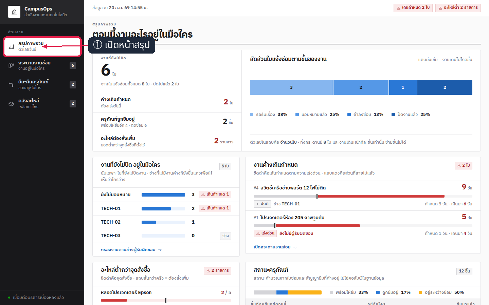

*ภาพที่ 1 — หน้า `/` จากข้อมูล seed โดยเมนู “สรุปภาพรวม” เป็นหน้าปัจจุบัน*

#### ขั้นที่ ② — เปิดกระดานงานซ่อม

คลิกเมนู **กระดานงานซ่อม** ที่แถบด้านซ้าย

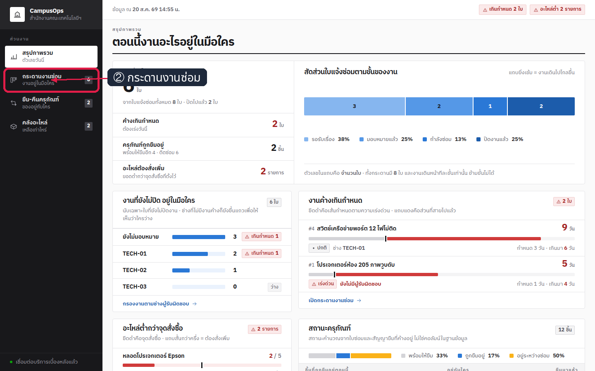

*ภาพที่ 2 — หน้า `/tickets` เริ่มต้นมีรอรับเรื่อง 3, มอบหมายแล้ว 2, กำลังซ่อม 1 และปิดงานแล้ว 2 ใบ*

#### ขั้นที่ ③ — เลือกครุภัณฑ์

คลิกช่อง **ครุภัณฑ์** ในฟอร์มแจ้งซ่อมใหม่ แล้วเลือก `A-003 · กล้อง Sony ZV-1`

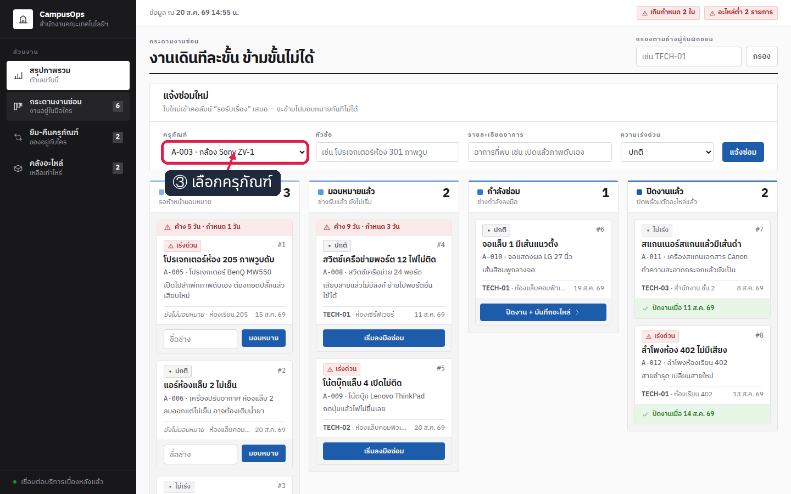

*ภาพที่ 3 — ช่องครุภัณฑ์แสดง `A-003 · กล้อง Sony ZV-1` ตามชุดข้อมูลสำหรับ walkthrough*

#### ขั้นที่ ④ — กรอกหัวข้อและรายละเอียดอาการ

คลิกช่อง **หัวข้อ** แล้วพิมพ์ `กล้องถ่ายวิดีโอเปิดไม่ติด` จากนั้นคลิกช่อง **รายละเอียดอาการ** แล้วพิมพ์ `กดปุ่มเปิดแล้วไฟสถานะไม่ทำงาน`

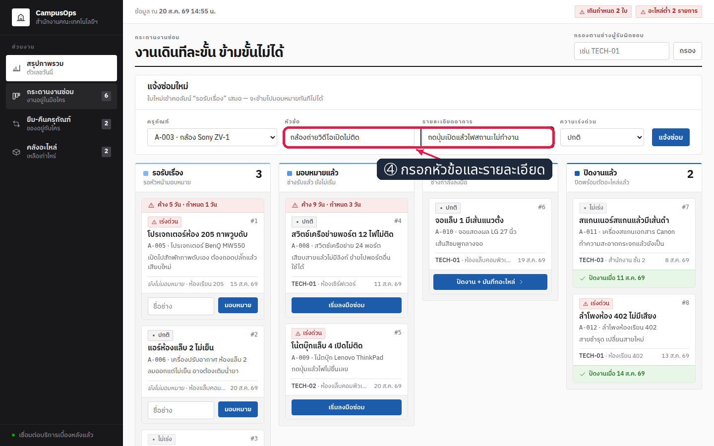

*ภาพที่ 4 — ข้อความทั้งสองช่องเป็นค่าคงที่ เพื่อให้ผลการสร้างการ์ดและ caption ตรวจสอบซ้ำได้*

#### ขั้นที่ ⑤ — กำหนดความเร่งด่วน

คลิกช่อง **ความเร่งด่วน** แล้วเลือก **เร่งด่วน**

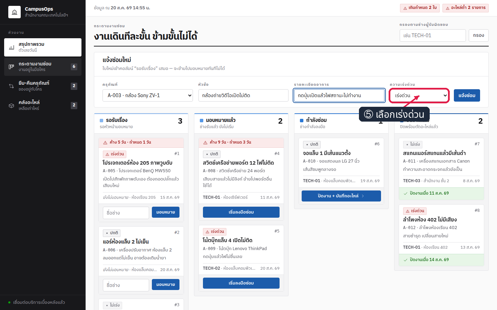

*ภาพที่ 5 — ค่าในช่องความเร่งด่วนเปลี่ยนจาก “ปกติ” เป็น “เร่งด่วน”*

#### ขั้นที่ ⑥ — ส่งฟอร์มแจ้งซ่อม

คลิกปุ่ม **แจ้งซ่อม** ที่ด้านขวาของฟอร์ม

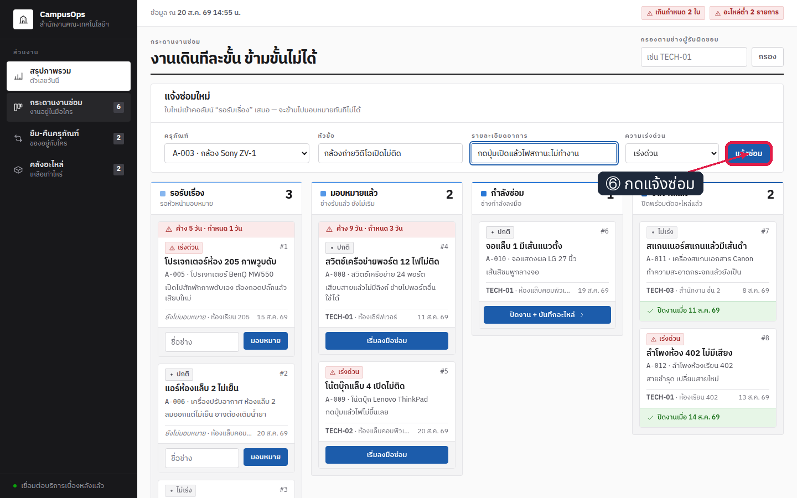

*ภาพที่ 6 — ปุ่ม “แจ้งซ่อม” ส่งข้อมูลทั้งสี่ช่องไปยัง server action*

#### ขั้นที่ ⑦ — ตรวจการ์ดใบใหม่

หลังคลิกปุ่ม ให้ตรวจคอลัมน์ **รอรับเรื่อง** ซึ่งต้องเพิ่มจาก 3 เป็น 4 และมีการ์ด `#9` ชื่อ `กล้องถ่ายวิดีโอเปิดไม่ติด`

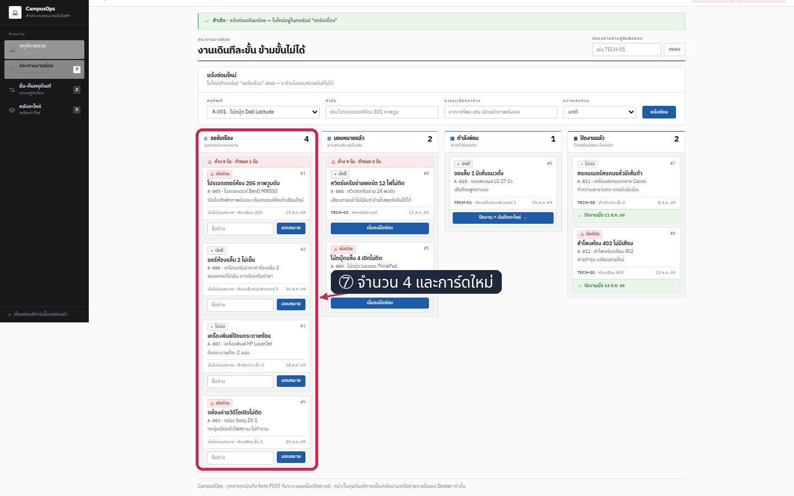

*ภาพที่ 7 — การ์ด `#9` ปรากฏใน “รอรับเรื่อง” และตัวเลขหัวคอลัมน์เพิ่มเป็น 4 ตรงกับข้อมูลจริง*

#### ขั้นที่ ⑧ — ระบุชื่อช่าง

คลิกช่อง **ชื่อช่าง** บนการ์ด `#9` แล้วพิมพ์ `TECH-04`

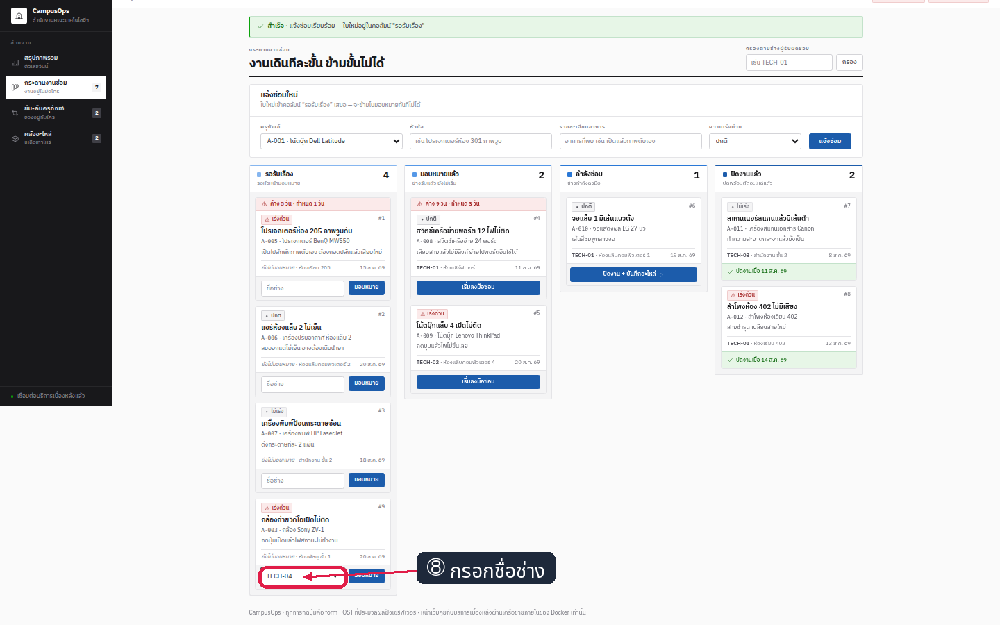

*ภาพที่ 8 — ช่องบนการ์ด `#9` แสดงชื่อช่าง `TECH-04` ก่อนส่งคำสั่งมอบหมาย*

#### ขั้นที่ ⑨ — มอบหมายงาน

คลิกปุ่ม **มอบหมาย** ข้างช่องชื่อช่าง ปุ่มจริงใช้คำว่า “มอบหมาย”; คำว่า “มอบหมายแล้ว” เป็นชื่อสถานะ

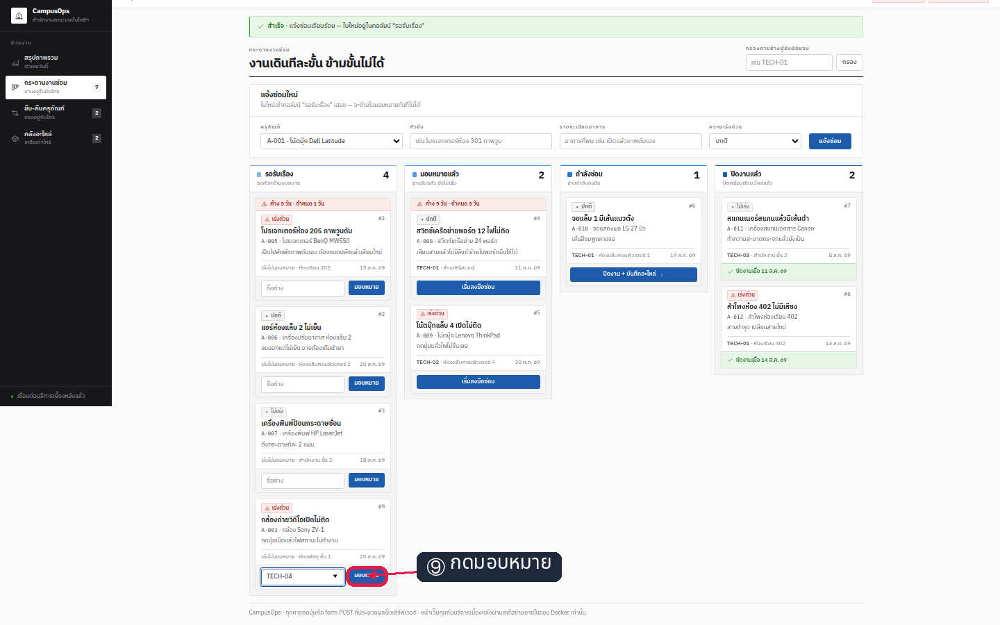

*ภาพที่ 9 — ปุ่ม “มอบหมาย” ส่งใบ `#9` พร้อมชื่อช่างไปยัง server action*

#### ขั้นที่ ⑩ — ตรวจสถานะหลังมอบหมาย

หลังคลิกปุ่ม ให้ตรวจว่าการ์ด `#9` ย้ายไปคอลัมน์ **มอบหมายแล้ว** และแสดงชื่อ `TECH-04`

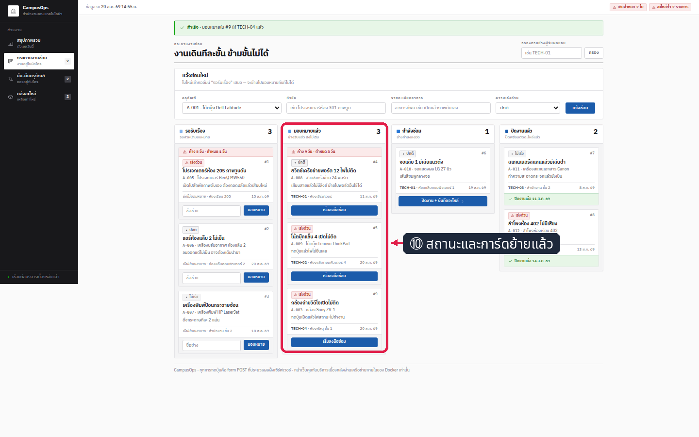

*ภาพที่ 10 — รอรับเรื่องลดเป็น 3, มอบหมายแล้วเพิ่มเป็น 3 และการ์ด `#9` อยู่กับ `TECH-04`*

---

## การทดลองที่ 9 — CSS มาถึงเบราว์เซอร์ครบไหม

**คำถาม:** HTML บอกให้โหลดไฟล์ CSS จากที่ไหน และไฟล์นั้นมีอยู่จริงไหม

```bash
curl -s http://localhost:3000/ | grep -o '/_next/static/chunks/[^"]*\.css' | head -1
docker exec ops-web sh -c 'ls .next/static/chunks/*.css'
```

✅ **สิ่งที่ต้องเห็น** — HTML อ้าง path ใต้ `chunks/` และไฟล์ชื่อเดียวกันอยู่ใน image จริง (ชื่อไฟล์อาจต่างกันเมื่อ source เปลี่ยน) :

```
/_next/static/chunks/1_h8a4gxzvgbi.css
.next/static/chunks/1_h8a4gxzvgbi.css
```

ภาพที่ 2–10 ใน walkthrough แสดงสี การจัดวางสี่คอลัมน์ และปุ่มครบถ้วน จึงเป็นหลักฐานจากเบราว์เซอร์ว่าไฟล์ CSS ถูกโหลดและนำไปใช้จริง

> 📝 HTML และ image ชี้ไฟล์ `.css` ชื่อเดียวกันใต้ `chunks/` จึงยืนยันเหตุผลที่ Dockerfile ต้องคัดลอก `.next/static` ทั้งก้อน โดยไม่ต้องใช้ one-liner แยก path ที่ซับซ้อน

---

## ตรวจงานด้วย `verify.sh`

```bash
bash verify.sh ; echo "exit code = $?"
```

✅ **สิ่งที่ต้องเห็น** — หัวเรื่อง 3 บรรทัด แล้ว `[PASS]` ครบ **22 บรรทัด** ปิดท้าย `ALL CHECKS PASSED` (IP · ชื่อไฟล์ CSS · ขนาดไบต์ ของแต่ละคนไม่ตรงกัน) :

```
==============================================
 LAB 3 — Build The Web (multi-stage) : verify
==============================================
[PASS] ต่อกับ Docker daemon ได้
[PASS] ไฟล์ของแล็บครบ (web/ · api/ · db/initdb/)
[PASS] web/Dockerfile มี FROM 3 ครั้ง = 3 stage (deps · builder · runner)
[PASS] stage runner หยิบเฉพาะ .next/standalone และ .next/static ทั้งก้อน
[PASS] ไม่มีบรรทัดที่เจาะ COPY เฉพาะโฟลเดอร์ย่อยของ .next/static
[PASS] build image multi-stage (vops3-web:verify) สำเร็จ
[PASS] build image stage เดียว (vops3-web:single) สำเร็จ
[PASS] multi-stage เล็กกว่า stage เดียวอย่างน้อย 2 เท่า (content size 73MB vs 314MB)
[PASS] docker history ของ image สุดท้ายไม่มีขั้น npm ci / npm run build เลย
[PASS] image สุดท้ายไม่มี node_modules/typescript — ไม่ได้แบก toolchain ไปด้วย
[PASS] CMD เป็น exec form : ["node","server.js"]
[PASS] image ตั้ง USER เป็น webapp (ไม่ใช่ root)
[PASS] ยกกล่องฐานข้อมูล vops3-db ขึ้นได้
[PASS] ฐานข้อมูลพร้อมรับ connection แล้ว
[PASS] บริการเบื้องหลังตอบ /health ว่า db up (ต่อ db ด้วย IP 172.18.0.5)
[PASS] หน้าเว็บตอบ 200 ที่ http://172.18.0.7:3000/ (ต่อ api ด้วย IP 172.18.0.6)
[PASS] หน้า /tickets · /loans · /parts ตอบ 200 ครบ
[PASS] หน้าแรกมีเนื้อหาจริงจากฐานข้อมูล (บล็อก 'งานค้างเกินกำหนด')
[PASS] HTML ชี้ไฟล์ CSS ไปที่ /_next/static/chunks/1_h8a4gxzvgbi.css (อยู่ใต้ chunks/ ตามที่ Next.js 16 วางจริง)
[PASS] โหลดไฟล์ CSS ได้ HTTP 200 ขนาด 21048 ไบต์
[PASS] ไฟล์ CSS อยู่จริงใน image ที่ .next/static/chunks/
[PASS] ไม่มีโฟลเดอร์ .next/static/css จริง — ยืนยันว่าห้าม COPY เจาะ subfolder
----------------------------------------------
ALL CHECKS PASSED
exit code = 0
```

> 📝 สคริปต์สร้างของของตัวเองด้วย prefix `vops3-` ทั้งหมด (`vops3-db` · `vops3-api` · `vops3-web`) แล้วลบทิ้งเมื่อจบ — **ไม่แตะกล่อง `ops-` ของเรา** และไม่ต้องใช้พอร์ตบนเครื่องเลยเพราะต่อกันด้วย IP

---

## แก้ปัญหาที่พบบ่อย

| อาการ | สาเหตุ | วิธีแก้ |
|---|---|---|
| `Cannot find module '@tailwindcss/postcss'` ตอน `npm run build` | ตั้ง `ENV NODE_ENV=production` ไว้**ก่อน** `npm ci` → npm ข้าม devDependencies | ย้ายบรรทัด `ENV NODE_ENV=production` ไปไว้**หลัง** `RUN npm run build` |
| `failed to compute cache key: "/app/.next/static/css": not found` | `COPY --from=builder` เจาะโฟลเดอร์ย่อยที่ไม่มีอยู่จริง | คัดลอก `.next/static` **ทั้งก้อน** |
| หน้าเว็บทุกหน้าได้ `200` แต่ไม่มีสีเลย · `GET /_next/static/chunks/xxx.css -> HTTP 404` | ไฟล์ CSS ไม่ได้ถูกคัดลอกเข้า image | ตรวจด้วย `docker exec <กล่อง> ls .next/static/chunks/*.css` แล้วแก้บรรทัด `COPY` |
| `template parsing error: ... map has no entry for key "IPAddress"` | Docker 29 ไม่มี `.NetworkSettings.IPAddress` ชั้นบนสุดแล้ว | ใช้ `-f '{{.NetworkSettings.Networks.bridge.IPAddress}}'` |
| `Error: getaddrinfo ENOTFOUND <ชื่อ>` หรือ `EAI_AGAIN` ใน `docker logs` ของ `web` | `API_BASE_URL` ชี้ไปที่ชื่อที่ default bridge แปลงเป็น IP ไม่ได้ | ใช้ IP จาก `docker inspect` (การเรียกด้วย **ชื่อ** เป็นเรื่องของ **LAB 4**) |
| `ps -o pid,args` ขึ้น `1 /bin/sh -c node server.js; echo stopped` แล้ว `docker stop` กิน `real 0m10.2s` ทุกครั้ง | `CMD` เขียนเป็น shell form → `/bin/sh` เป็น PID 1 แทน `node` | เขียน `CMD` เป็น exec form : `CMD ["node","server.js"]` |
| `Bind for 0.0.0.0:3000 failed: port is already allocated` | มีกล่องเก่าจองพอร์ต `3000` ในกล่องเรียนอยู่ | `docker ps` หาว่าใครจอง แล้ว `docker rm -f <ชื่อ>` |
| ใส่ `-e NEXT_PUBLIC_SITE_NAME=...` แล้ว `<title>` ยังเป็น `<title>CampusOps · ระบบงานซ่อมและครุภัณฑ์</title>` เหมือนเดิม | `NEXT_PUBLIC_*` ถูกฝังลงไฟล์ผลลัพธ์ตอน build ไปแล้ว | `docker build --build-arg NEXT_PUBLIC_SITE_NAME=... ` แล้วรัน image ตัวใหม่ |

---

## เก็บกวาด

**ในกล่องเรียน:**

```bash
docker rm -f ops-web ops-api ops-db
docker volume rm ops-pgdata
docker image rm campusops-web:lab3 campusops-web:single campusops-web:rename campusops-web:shellform campusops-api:lab3
docker ps -a
```

✅ **สิ่งที่ต้องเห็น** — ชื่อของที่ถูกลบทีละบรรทัด · คู่ `Untagged:` กับ `Deleted:` อย่างละ **5 บรรทัด** แล้วตารางสุดท้ายเหลือแค่หัวตาราง (sha256 ของแต่ละคนไม่ตรงกัน) :

```
ops-web
ops-api
ops-db
ops-pgdata
Untagged: campusops-web:lab3
Deleted: sha256:ee2d124d03a135abe18d4067b6e415ecf7f5a5ae07fd18c72b52611b0d960222
Untagged: campusops-web:single
Deleted: sha256:6cf455d568319f1817fb73e4c5fb72694c83ac5bd2adb5bd41c776ce2592e15f
Untagged: campusops-web:rename
Deleted: sha256:fd85a9fcb0c2bfe3e95706a1133e95769df3b5aacbf47b6693157d12c8af92ec
Untagged: campusops-web:shellform
Deleted: sha256:b15aeb15730f51cf7ec5cc888c03440b148fcf5e88d14d81b82a631960b2b8eb
Untagged: campusops-api:lab3
Deleted: sha256:61139577519a1af84792e3dd44151a4d0090bb9cd18092eba6f56b48da3e6744
CONTAINER ID   IMAGE     COMMAND   CREATED   STATUS    PORTS     NAMES
```

> 📝 สั่ง `docker images` ต่อจะเหลือ **`postgres:17-alpine` ตัวเดียว** เก็บไว้ใช้ต่อใน LAB 4–5 ได้ · `node:22-alpine` กับ `python:3.12-slim` ไม่โผล่ในตาราง เพราะ Docker 29 เก็บ base ที่ buildkit ดึงมาใช้ไว้ใน build cache แยกต่างหาก

**ออกจากกล่องแล้วลบกล่องบนเครื่องเรา:**

```bash
exit
docker rm -f devtools-fs-lab3
docker ps -a --filter "name=^devtools-fs-lab3$"
```

---

## สรุปคำสั่งของแล็บนี้

| คำสั่ง | ความหมาย |
|---|---|
| `docker build -t <ชื่อ:tag> ./web` | build จาก `Dockerfile` ในโฟลเดอร์ที่เป็น build context |
| `docker build -f web/Dockerfile.single -t <ชื่อ:tag> ./web` | เลือกไฟล์ Dockerfile เองด้วย `-f` โดย context ยังเป็น `./web` |
| `docker build -q -f <ไฟล์> -t <ชื่อ:tag> <context>` | build เงียบ ๆ พิมพ์ออกมาแค่ `sha256:` ของ image ที่ได้ |
| `docker build --build-arg KEY=value ...` | ส่งค่าให้ `ARG` ใช้ **ตอน build** — วิธีเดียวที่เปลี่ยนค่าที่ถูกฝังไปแล้ว |
| `docker images <repo>` | ดู `DISK USAGE` และ `CONTENT SIZE` ของ image |
| `docker history <image>` | ดูทุก layer ของ image พร้อมขนาดที่แต่ละ layer เพิ่มเข้ามา |
| `docker run --rm <image> sh -c '<คำสั่ง>'` | เปิดกล่องชั่วคราวเพื่อส่องข้างใน image แล้วลบทิ้งทันที |
| `docker inspect -f '{{.NetworkSettings.Networks.bridge.IPAddress}}' <กล่อง>` | อ่าน IP ของกล่องบน default bridge |
| `docker run -e KEY=value ...` | ตั้งค่า `ENV` **ตอน run** — ไม่ต้อง build ใหม่ |
| `docker exec <กล่อง> ps -o pid,args` | ดูว่า process ไหนเป็น PID 1 ของกล่องนั้น |
| `time docker stop <กล่อง>` | จับเวลาการหยุดกล่อง — ดูบรรทัด `real` |
| `docker logs <กล่อง>` | อ่าน log ของแอปในกล่อง |

> **จำ 4 อย่าง:** `FROM` กี่ครั้ง = กี่ stage · `ARG` ผูกกับ build / `ENV` ผูกกับ run · `CMD` ต้องเป็น exec form · `.next/static` คัดลอกทั้งก้อนเท่านั้น

---

## ✅ เช็กลิสต์ก่อนจบแล็บ

- [ ] `grep -n '^FROM' web/Dockerfile` แล้วบอกได้ว่าแต่ละ stage ทำอะไรและอะไรตามไป stage สุดท้าย
- [ ] build `campusops-web:single` แล้วเห็น `DISK USAGE` ระดับ **1 GB**
- [ ] build `campusops-web:lab3` แล้วเทียบได้ว่าเหลือ **298MB** จาก source ชุดเดียวกัน
- [ ] `docker history campusops-web:lab3` ไม่มีบรรทัด `npm ci` / `npm run build` เลย
- [ ] image ที่ส่งมอบรายงาน `typescript = not found` แต่ image `:single` รายงาน `typescript = found`
- [ ] `-e NEXT_PUBLIC_SITE_NAME=...` ตอน run **ไม่เปลี่ยน** `<title>` แต่ `--build-arg` **เปลี่ยน**
- [ ] `-e API_BASE_URL=...` ตอน run มีผลทันทีโดยไม่ต้อง build ใหม่ (`printenv` แสดงค่าที่ส่งเข้าไป)
- [ ] `ps -o pid,args` เห็น `node` เป็น PID 1 ฝั่ง exec form และ `time docker stop` ได้ **0.x วิ กับ 10.x วิ**
- [ ] สามกล่องขึ้นครบ ต่อกันด้วย IP · เปิด `http://localhost:8253` เห็นหน้าเว็บจริง · ทั้งสี่หน้าได้ `200`
- [ ] `bash verify.sh` ขึ้น `ALL CHECKS PASSED` และเก็บกวาดจนไม่เหลือกล่อง `ops-` กับ volume `ops-pgdata`

*ผลลัพธ์ทั้งหมดในเอกสารนี้มาจากการรันจริงในเครื่องเรียน `tuchsanai/devtools:2569_1`*
