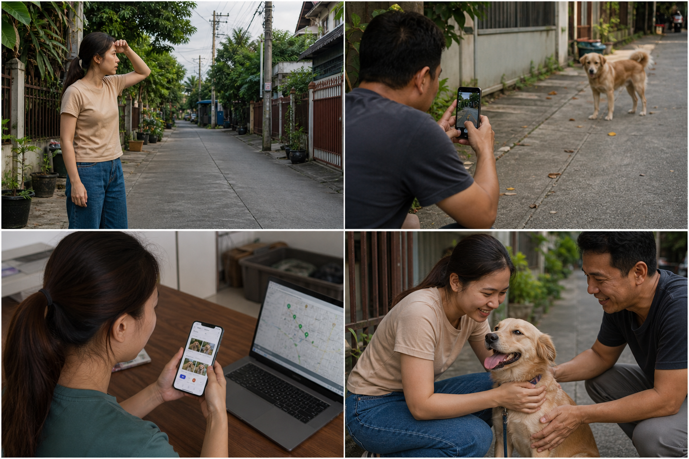
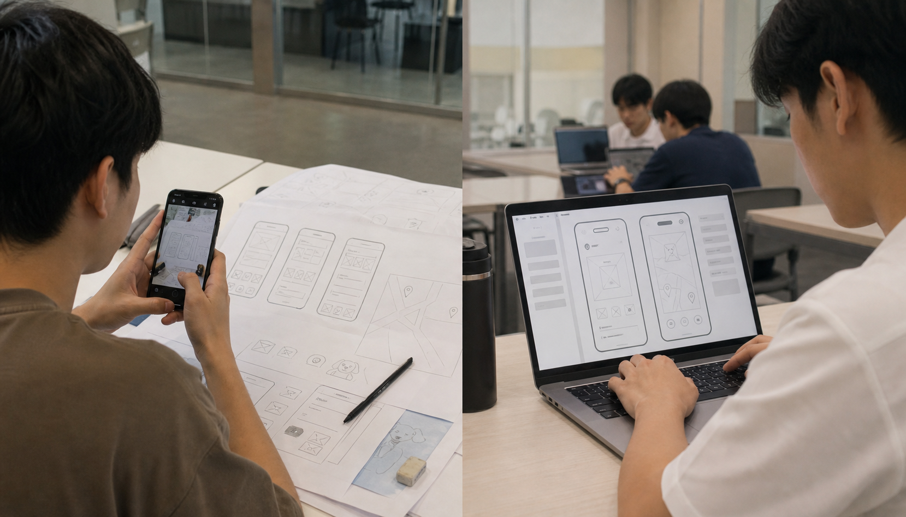

# LAB 003 — Lost Pet Finder Design

## เป้าหมาย

ใช้ Interview Evidence, User Stories และ Requirements ที่ให้มา ออกแบบ **User Flow** และ **Wireframe** สำหรับระบบประกาศและติดตามสัตว์หาย โดยไม่ต้องเขียนโปรแกรมหรือสร้างระบบจริง

อ่าน Worked Example ของ Pet Clinic Booking ก่อนเริ่ม เพื่อดูรูปแบบการคิด แต่ห้ามคัดลอกหน้าจอหรือ Flow มาใช้ตรง ๆ เพราะโจทย์และผู้ใช้ต่างกัน

## ใช้ AI ช่วยได้

นักศึกษาสามารถใช้ **Codex, ChatGPT หรือ AI Tool อื่น** ช่วยระดมความคิด ตรวจ Flow หรือสร้าง Wireframe ได้ แต่ต้องตรวจคำตอบ เลือกแนวทาง และอธิบายเหตุผลของตนเองได้

## สถานการณ์

เมื่อสัตว์เลี้ยงหาย เจ้าของมักประกาศหลายกลุ่มด้วยข้อมูลไม่ครบ ผู้พบเห็นไม่แน่ใจว่าจะติดต่อใคร เบาะแสกระจัดกระจาย และประกาศเก่ายังคงถูกแชร์แม้พบสัตว์แล้ว ทีมต้องออกแบบประสบการณ์ที่ช่วยให้เจ้าของสร้างประกาศ รับเบาะแส และอัปเดตสถานะได้ง่าย โดยคำนึงถึงความเป็นส่วนตัว

## Interview Evidence จำลอง

> ข้อมูลต่อไปนี้เป็นสถานการณ์จำลองเพื่อการเรียน ไม่ใช่งานวิจัยภาคสนาม

### A — เจ้าของสุนัขที่หาย

- ตอนตกใจจำไม่ได้ว่าประกาศต้องใส่ข้อมูลอะไรบ้าง
- ต้องการแนบรูป ลักษณะเด่น และบริเวณที่พบครั้งสุดท้ายให้เร็ว
- ไม่อยากเปิดเผยที่อยู่หรือเบอร์โทรศัพท์ต่อสาธารณะ
- ต้องการรู้ทันทีเมื่อมีเบาะแสใหม่

### B — ผู้พบเห็นสัตว์

- ไม่แน่ใจว่าสัตว์ที่เห็นตรงกับประกาศใด
- อยากส่งรูป เวลา และตำแหน่งโดยไม่ต้องกรอกข้อมูลมาก
- ต้องการติดต่อผ่านระบบแทนการเปิดเผยข้อมูลส่วนตัว

### C — อาสาสมัครในชุมชน

- พบประกาศซ้ำและประกาศเก่าที่ไม่อัปเดตสถานะ
- ต้องการค้นหาจากชนิดสัตว์ พื้นที่ และช่วงเวลา
- อยากเห็นเบาะแสเรียงตามเวลาเพื่อช่วยประเมินทิศทาง

### D — เจ้าหน้าที่ศูนย์พักพิงสัตว์

- ต้องการเปรียบเทียบลักษณะสัตว์กับประกาศใกล้เคียง
- ต้องการสถานะที่ชัดเจนว่า `กำลังตามหา`, `มีเบาะแส` หรือ `พบแล้ว`

## User Stories ตั้งต้น

1. ในฐานะเจ้าของสัตว์ ฉันต้องการสร้างประกาศที่มีข้อมูลครบ เพื่อให้ชุมชนช่วยสังเกตได้
2. ในฐานะผู้พบเห็น ฉันต้องการส่งเบาะแสพร้อมรูป เวลา และตำแหน่ง เพื่อช่วยเจ้าของตรวจสอบ
3. ในฐานะเจ้าของสัตว์ ฉันต้องการดูเบาะแสทั้งหมด เพื่อวางแผนค้นหาต่อ
4. ในฐานะผู้ใช้ในชุมชน ฉันต้องการค้นหาประกาศใกล้พื้นที่ของฉัน เพื่อช่วยตรวจสอบได้รวดเร็ว
5. ในฐานะเจ้าของสัตว์ ฉันต้องการเปลี่ยนสถานะเป็นพบแล้ว เพื่อหยุดการกระจายประกาศเก่า

## Functional Requirements

- **FR-01** สร้างประกาศด้วยรูป ชนิดสัตว์ ลักษณะเด่น วันเวลา และบริเวณที่พบครั้งสุดท้าย
- **FR-02** แสดงประกาศและค้นหาจากชนิดสัตว์ พื้นที่ หรือสถานะ
- **FR-03** เปิดดูรายละเอียดประกาศและข้อมูลที่ช่วยระบุตัวสัตว์
- **FR-04** ส่งเบาะแสด้วยรูป ตำแหน่ง เวลา และข้อความสั้น ๆ
- **FR-05** แสดงเบาะแสของประกาศตามลำดับเวลา
- **FR-06** ให้เจ้าของเปลี่ยนสถานะประกาศเป็น `กำลังตามหา`, `มีเบาะแส` หรือ `พบแล้ว`
- **FR-07** ติดต่อกันผ่านระบบโดยไม่ต้องแสดงเบอร์โทรศัพท์หรือที่อยู่ต่อสาธารณะ

## Non-functional Requirements

- **NFR-01 — Mobile friendly:** หน้าจอต้องใช้งานได้สะดวกบนโทรศัพท์
- **NFR-02 — Privacy:** ไม่เปิดเผยข้อมูลติดต่อและตำแหน่งบ้านโดยไม่จำเป็น
- **NFR-03 — Clarity:** สถานะประกาศและเวลาของเบาะแสต้องเห็นชัดเจน
- **NFR-04 — Accessibility:** ข้อความและปุ่มสำคัญอ่านง่าย และไม่ใช้สีเพียงอย่างเดียวสื่อสถานะ

## งานที่ 1 — User Flow

ออกแบบ Flow ตั้งแต่เจ้าของเริ่มสร้างประกาศ จนชุมชนเห็นประกาศ ส่งเบาะแส และเจ้าของอัปเดตสถานะ โดยระบุ:

- ลำดับหน้าจอ
- ข้อมูลที่ผู้ใช้เห็นหรือกรอกในแต่ละหน้าจอ
- Action ที่ผู้ใช้ทำและทางไปหน้าถัดไป

## งานที่ 2 — Wireframe

วาด Wireframe ของหน้าจอสำคัญใน User Flow ให้เห็นข้อมูล ปุ่มหลัก และทางไปหน้าถัดไป เลือกรูปแบบส่งได้ตามความถนัด:

- วาดด้วยปากกาบนกระดาษแล้วถ่ายรูปส่ง
- ใช้เครื่องมือดิจิทัลหรือ AI สร้างเป็นไฟล์ภาพ
- ใช้ AI ช่วยสร้างเป็นไฟล์ HTML ที่เปิดดูหน้าจอได้

ทุกแบบเป็น Wireframe เพื่อสื่อแนวคิด ไม่ต้องเชื่อมฐานข้อมูลหรือพัฒนาเป็นระบบจริง

## สิ่งที่ต้องส่ง

1. **User Flow** — แสดงลำดับหน้าจอ ข้อมูล และ Action ตลอดเส้นทางหลัก
2. **Wireframe ของหน้าจอใน Flow** — ส่งเป็นภาพถ่าย ภาพดิจิทัล/AI หรือไฟล์ HTML ก็ได้
3. **คำอธิบายแนวคิดสั้น ๆ** — ยกอย่างน้อย 2 ตัวอย่างว่าการออกแบบตอบ Evidence หรือ Requirement ใด
4. **AI Note (เฉพาะผู้ที่ใช้ AI)** — ระบุเครื่องมือ งานที่ให้ช่วย และสิ่งที่ตรวจหรือปรับแก้เอง

## เกณฑ์ตรวจงานแบบย่อ

- **ความครบของ Flow** — ลำดับตั้งแต่สร้างประกาศ รับเบาะแส จนถึงอัปเดตสถานะติดตามได้
- **ความสอดคล้อง** — หน้าจอและ Action ใน Wireframe ตรงกับ User Flow
- **ความชัดเจน** — อ่านข้อมูล ปุ่ม และเส้นทางไปหน้าถัดไปได้
- **การใช้ข้อมูลตั้งต้น** — อธิบายได้ว่าการออกแบบตอบ Pain Point หรือ Requirement ใด
- **การสื่อสารผลงาน** — ไฟล์อ่านได้และนักศึกษาอธิบายเหตุผลของตนเองได้
