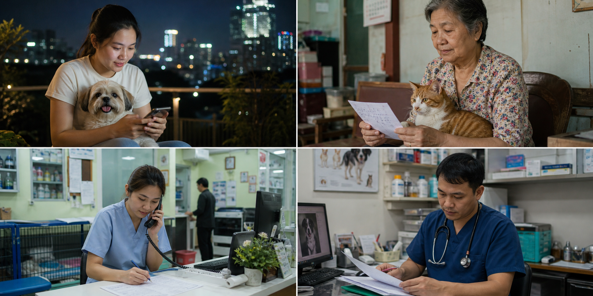
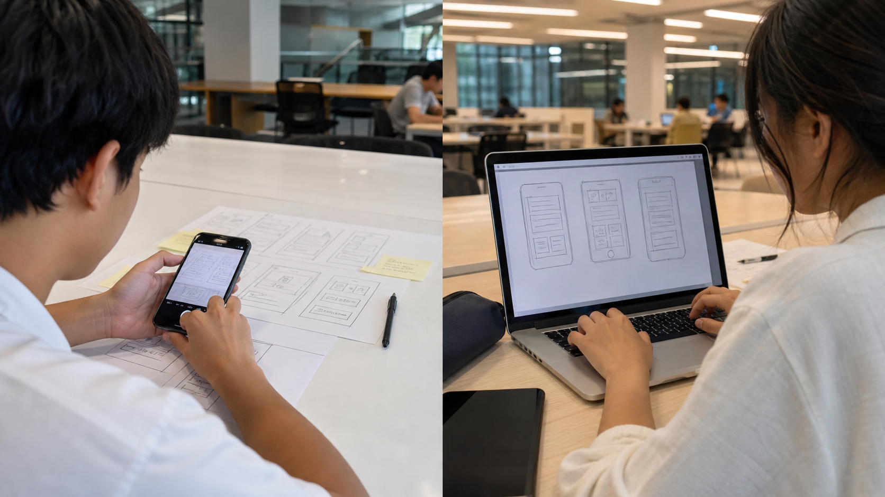

# LAB 003 — Pet Clinic Booking Design

## เป้าหมาย

ออกแบบระบบจองนัดหมายสัตวแพทย์จากข้อมูลตั้งต้นให้เป็นงานที่ตรวจสอบได้ โดยส่งมอบ

1. Insight จากข้อมูลสัมภาษณ์
2. User Story และ Requirements
3. End-to-End User Flow
4. Wireframe ของหน้าจอสำคัญ

**แล็บนี้เป็นแบบทดสอบการวิเคราะห์และออกแบบ ไม่ต้องเขียนโปรแกรมหรือสร้างระบบจริง**

ทำเดี่ยวหรือกลุ่มย่อยตามที่ผู้สอนกำหนด

## ใช้ AI ช่วยได้

นักศึกษาสามารถใช้ **Codex, ChatGPT หรือ AI Tool อื่น** เพื่อช่วยระดมความคิด ตรวจความครบของ Flow หรือสร้างภาพร่าง Wireframe ได้ แต่ต้อง:

- ตรวจและแก้ผลลัพธ์ให้ตรงกับ Evidence และ Requirements ของโจทย์
- ตัดสินใจด้วยตนเองว่าเลือกหน้าจอและขั้นตอนใด พร้อมอธิบายเหตุผลได้
- ระบุสั้น ๆ ว่าใช้เครื่องมือใดช่วยงานส่วนใด
- ไม่ส่งคำตอบจาก AI โดยไม่อ่านหรือไม่สามารถอธิบายได้

> ข้อมูลสัมภาษณ์ด้านล่างเป็น **สถานการณ์จำลองเพื่อการเรียน** ไม่ใช่ผลวิจัยภาคสนาม และห้ามนำไปอ้างว่าเป็นหลักฐานจากผู้ใช้จริง

## สถานการณ์

คลินิกสัตวแพทย์ขนาดเล็กรับจองผ่านโทรศัพท์และแชต เจ้าของสัตว์ไม่เห็นเวลาว่าง ต้องรอพนักงานตอบ และบางครั้งเกิดการจองเวลาซ้ำ ทีมต้องออกแบบระบบที่ช่วยให้เจ้าของสัตว์เลือกสัตว์ บริการ และช่วงเวลาว่างได้ พร้อมให้คลินิกติดตามนัดหมาย

## ชุดข้อมูลสัมภาษณ์จำลอง

### ผู้ให้ข้อมูล A — เจ้าของสุนัข

- มักจองนอกเวลาทำการและไม่อยากรอข้อความตอบกลับ
- ต้องการเห็นช่วงเวลาว่างก่อนเลือก
- กังวลว่ากดจองแล้วคลินิกไม่ได้รับรายการ
- ต้องการยกเลิกหรือเปลี่ยนเวลาจากหน้าเดียวกัน

### ผู้ให้ข้อมูล B — เจ้าของแมวสูงอายุ

- มีสัตว์มากกว่าหนึ่งตัวและจำประวัติการนัดหมายได้ยาก
- ต้องการระบุอาการเบื้องต้นให้สัตวแพทย์เตรียมตัว
- ต้องการข้อความยืนยันที่บอกชื่อสัตว์ บริการ วัน และเวลาอย่างชัดเจน

### ผู้ให้ข้อมูล C — พนักงานหน้าคลินิก

- ต้องเปิดหลายช่องทางเพื่อรวบรวมการจอง
- การตรวจเวลาว่างด้วยมือทำให้เกิดรายการซ้ำ
- ต้องการดูตารางนัดทั้งหมดและเปลี่ยนสถานะได้
- ต้องการค้นหาจากชื่อเจ้าของ ชื่อสัตว์ หรือวันที่

### ผู้ให้ข้อมูล D — สัตวแพทย์

- ต้องการรู้เหตุผลการเข้าพบก่อนเริ่มตรวจ
- ไม่ต้องการให้ผู้ใช้จองช่วงที่ไม่เปิดบริการหรือช่วงที่เต็มแล้ว
- ต้องการเห็นรายการของตนตามลำดับเวลา

## หลักฐานที่ผู้เรียนต้องสกัด

สร้างตารางอย่างน้อย 5 แถว โดยใช้คอลัมน์ต่อไปนี้:

| Interview evidence | Pain point / Need | Insight | Design implication |
|---|---|---|---|
| “ต้องรอข้อความตอบกลับ” | ไม่เห็นเวลาว่างทันที | การจองต้องทำเองได้ | แสดง Available slots แบบเลือกได้ |

ห้ามเพิ่มข้อสรุปที่ไม่มีข้อมูลรองรับ หากจำเป็นต้องตั้งสมมติฐาน ให้ติดป้าย `Assumption` และระบุวิธีตรวจสอบ

## User Stories ตั้งต้น

1. ในฐานะเจ้าของสัตว์ ฉันต้องการดูช่วงเวลาว่าง เพื่อเลือกเวลาที่สะดวกโดยไม่ต้องรอพนักงาน
2. ในฐานะเจ้าของสัตว์ ฉันต้องการจองบริการให้สัตว์ของฉัน เพื่อได้รับรายการยืนยันที่ตรวจสอบได้
3. ในฐานะเจ้าของสัตว์ ฉันต้องการดูและยกเลิกนัด เพื่อจัดการเมื่อแผนเปลี่ยน
4. ในฐานะพนักงานคลินิก ฉันต้องการดูตารางนัดรวม เพื่อจัดการงานประจำวันและหลีกเลี่ยงการจองซ้ำ
5. ในฐานะพนักงานคลินิก ฉันต้องการเปลี่ยนสถานะนัด เพื่อให้ข้อมูลตรงกับการให้บริการจริง

ผู้เรียนต้องปรับถ้อยคำและเขียน Acceptance Criteria ของแต่ละ Story ในรูปแบบ `Given / When / Then`

## Functional Requirements

- **FR-01** ระบบต้องให้เจ้าของสัตว์เลือกสัตว์ บริการ วันที่ และช่วงเวลาว่างก่อนยืนยัน
- **FR-02** ระบบต้องป้องกันการจองช่วงเวลาเดียวกันซ้ำ
- **FR-03** ระบบต้องสร้างเลขอ้างอิงและแสดงรายละเอียดหลังจองสำเร็จ
- **FR-04** ระบบต้องให้ผู้ใช้ดูรายการนัดหมายของตน
- **FR-05** ระบบต้องให้ผู้ใช้ยกเลิกนัดที่ยังไม่เริ่ม พร้อมบันทึกสถานะ
- **FR-06** ระบบต้องให้พนักงานดู ค้นหา และกรองนัดหมาย
- **FR-07** ระบบต้องให้พนักงานเปลี่ยนสถานะ `BOOKED → CONFIRMED → COMPLETED` หรือ `CANCELLED`
- **FR-08** ระบบต้องแจ้ง Error ที่เข้าใจได้เมื่อข้อมูลไม่ครบ ช่วงเวลาเต็ม หรือไม่พบรายการ

## Non-functional Requirements

- **NFR-01 — Usability:** ผู้ใช้ต้องเข้าใจว่าต้องกรอกอะไร อยู่ขั้นตอนไหน และจองสำเร็จหรือไม่
- **NFR-02 — Accessibility:** ข้อความและปุ่มสำคัญต้องอ่านง่าย และห้ามใช้สีเพียงอย่างเดียวเพื่อสื่อสถานะ
- **NFR-03 — Consistency:** คำเรียก สถานะ และรูปแบบการนำทางต้องสอดคล้องกันทุกหน้าจอ
- **NFR-04 — Error clarity:** เมื่อทำรายการไม่ได้ ระบบต้องบอกสาเหตุและทางเลือกถัดไปด้วยภาษาที่ผู้ใช้เข้าใจ

## งานออกแบบของนักศึกษา

### งานที่ 1 — End-to-End User Flow

ออกแบบ Flow หลักตั้งแต่ผู้ใช้เริ่มจองจนเห็นผลยืนยัน พร้อมอย่างน้อย 1 Failure Branch เช่น ช่วงเวลาถูกจองไปแล้ว

Flow ต้องระบุ:

- หน้าจอและ Action ของผู้ใช้
- ข้อมูลที่ Web ส่งให้ API
- Business Rule ที่ API ตรวจ
- ข้อมูลที่อ่านหรือเขียนใน Database

### งานที่ 2 — Screen Inventory

กำหนดหน้าจอขั้นต่ำด้วยตนเอง ตารางส่งงานต้องตอบว่าแต่ละหน้ามีใครใช้ เห็นข้อมูลอะไร ทำ Action ใด และเชื่อมกับ Requirement ข้อใด

| Screen | User | Information shown | Actions | Requirement |
|---|---|---|---|---|
| ตัวอย่าง: เลือกช่วงเวลา | เจ้าของสัตว์ | วันที่และช่วงเวลาว่าง | เลือกเวลา / ย้อนกลับ | FR-01, FR-02 |

นักศึกษาเป็นผู้ตัดสินใจว่าควรมีหน้าใดบ้าง ห้ามคัดลอกตัวอย่างเป็นคำตอบทั้งหมด

### งานที่ 3 — Wireframe

วาด Wireframe แบบ Low Fidelity ของหน้าจอสำคัญใน Flow ไม่เน้นความสวย แต่ต้องเห็น:

- ชื่อหรือวัตถุประสงค์ของหน้าจอ
- ข้อมูลที่ผู้ใช้ต้องเห็นหรือกรอก
- ปุ่มหรือ Action หลัก
- ทางไปหน้าถัดไป ย้อนกลับ และกรณี Error

สามารถวาดด้วยปากกาบนกระดาษแล้วถ่ายรูปส่ง หรือใช้เครื่องมือดิจิทัล/AI ช่วยสร้างภาพร่างได้

## สิ่งที่ต้องส่ง

1. Evidence-to-Insight Table
2. User Stories และ Requirements ที่เลือกใช้
3. User Flow Diagram ทั้ง Happy Path และ Failure Case
4. Screen Inventory
5. Wireframe ของหน้าจอสำคัญ — วาดกระดาษแล้วถ่ายรูปส่งได้
6. AI Note สั้น ๆ หากมีการใช้ AI: ใช้เครื่องมือใด ช่วยส่วนไหน และปรับแก้อะไรเอง

## เกณฑ์ตรวจงานแบบย่อ

- ข้อสรุปสืบกลับไปยังข้อมูลสัมภาษณ์ได้
- User Flow ครบตั้งแต่ Action ถึงผลลัพธ์ ไม่ใช่เพียงรายชื่อหน้าจอ
- หน้าจอและ Feature รองรับ Requirement จริง
- Wireframe สื่อข้อมูล Action และเส้นทางไปหน้าถัดไปได้
- แยก Fact, Assumption และ Design decision อย่างชัดเจน
