# LAB 5 — รวมระบบด้วย Docker Compose และส่งมอบผ่าน Docker Hub

> โฟลเดอร์ `005_LAB_Compose_And_Ship` · ใช้ `compose.yaml`, `api/`, `web/`, `db/initdb/` และ `verify.sh`

แล็บนี้ตรวจสอบ **ข้อกำหนดที่ไม่ใช่หน้าที่โดยตรงของระบบ (Non-Functional Requirement: NFR)** ของ CampusOps ได้แก่ การเริ่มระบบด้วยคำสั่งเดียว (NFR-1), การรักษาข้อมูล (NFR-2) และการไม่เผยแพร่พอร์ตฐานข้อมูล (NFR-3) พร้อมส่ง **อิมเมจ (image)** รุ่น `1.0` ให้เครื่องปลายทางโดยไม่ต้องมีซอร์สโค้ด อิมเมจคือแม่แบบแบบอ่านอย่างเดียว ส่วน **Container** คืออินสแตนซ์ที่สร้างและทำงานจากอิมเมจ Service `db` คือฐานข้อมูล, `api` คือส่วนต่อประสานโปรแกรมประยุกต์ (Application Programming Interface: API) และ `web` คือส่วนติดต่อผู้ใช้ผ่านเว็บ

| ประเด็น | ผลลัพธ์ที่ต้องพิสูจน์ |
|---|---|
| Docker Compose | Service `db` → `api` → `web` เริ่มตามผลตรวจความพร้อม (`healthcheck`) |
| การคงอยู่ของข้อมูล (persistence) | `down` รักษาข้อมูลใน named volume แต่ `down -v` ลบ volume และสร้างข้อมูลตั้งต้น (seed) ใหม่ |
| ความปลอดภัย | มีเพียง `web` ที่เผยแพร่พอร์ต (publish port) ออกสู่โฮสต์ |
| การส่งมอบ | `push`/`pull` อิมเมจสองรายการผ่าน Docker Hub แบบ Public |

### ภาพรวมการเรียนรู้

| | |
|---|---|
| **คำถามเดียวที่ตอบให้จบ** | ระบบ `db` → `api` → `web` จะเริ่มตามลำดับด้วยคำสั่งเดียว รักษาข้อมูล ปิดพอร์ตฐานข้อมูล และส่งมอบให้เครื่องที่ไม่มีซอร์สโค้ดผ่าน Docker Hub แบบ Public ได้อย่างไร |
| **ต้องผ่านอะไรมาก่อน** | **LAB 1–4** ครบ: named volume หรือพื้นที่ข้อมูลที่ Docker จัดการ · init script หรือสคริปต์ตั้งต้น · multi-stage build หรือการสร้างอิมเมจหลายขั้น · user-defined network หรือเครือข่ายที่ผู้ใช้กำหนด |
| **เวลา** | ~50 นาที · ชุดการทดลองหลัก 9 ชุด โดยแต่ละการทดลองย่อยใช้เวลาประมาณ 3–5 นาที |
| **จบแล้วต้องทำได้เอง** | อ่าน `compose.yaml` และยกระบบด้วย `up -d --build` · อธิบาย `healthcheck`/`depends_on` และ `down`/`down -v` · ติด tag, push และ pull อิมเมจสองรายการ แล้วใช้ `up -d --no-build` บนเครื่องปลายทาง |
| **แล็บนี้ยัง *ไม่* สอน** | เครื่องมือจับคู่ออบเจ็กต์กับฐานข้อมูล (Object-Relational Mapping: ORM) · เครื่องมือย้ายโครงสร้างฐานข้อมูล (migration) · การจัดการ secret · การจำกัดหน่วยประมวลผล (CPU) และหน่วยความจำ (RAM) · ระบบควบคุม Container หลายเครื่อง (orchestration) |

---

## ทฤษฎีก่อนลงมือ

### `compose.yaml` แทนคำสั่งที่กระจายอยู่หลายบรรทัด


> 🖼 **วิธีอ่านรูปนี้:** เทียบ flag จาก LAB 1–4 กับ key ใน `compose.yaml` ทีละแถว; หลักฐานสำคัญคือมี `ports: "3000:3000"` เฉพาะ `web`, `db` ไม่มี key นี้ และ `healthcheck` + `condition: service_healthy` เข้ามาแทนการเดา `sleep 10`

Docker Compose คือเครื่องมืออ่านไฟล์ `compose.yaml` เพื่อกำหนดหลาย Service เป็นระบบเดียวกัน โดย Service คือหน่วยงานหนึ่งของระบบ เช่น `db`, `api` หรือ `web` คีย์ `build`, `environment`, `volumes`, `ports` และ `depends_on` ทำให้ข้อกำหนดการติดตั้งอยู่ในไฟล์ที่ตรวจทานและทำซ้ำได้ `healthcheck` คือคำสั่งตรวจความพร้อม และ `depends_on` คือเงื่อนไขการพึ่งพา; ค่า `condition: service_healthy` ทำให้ Service ถัดไปรอจน Service ต้นทางพร้อมใช้งานจริง

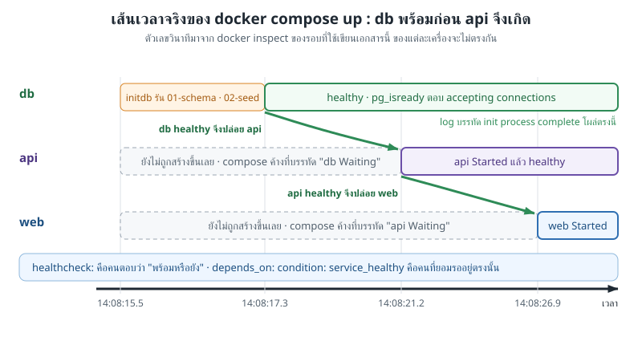

> 🖼 **วิธีอ่านรูปนี้:** รอบที่บันทึกในภาพเริ่ม `db` เวลา 14:08:15.5, `db` healthy เวลา 14:08:17.3, `api` เริ่มเวลา 14:08:21.2 และ `web` เริ่มเวลา 14:08:26.9; กรอบเส้นประยืนยันว่า Service ถัดไปยังไม่ถูกสร้างจน Service ก่อนหน้า healthy

`docker compose down` ลบ Container และ network แต่ไม่ลบ named volume; `docker compose down -v` ลบ volume และข้อมูลอย่างถาวร จึงใช้เฉพาะเมื่อต้องการคืนฐานข้อมูลเป็น seed

### ส่งมอบอิมเมจผ่าน Docker Hub


> 🖼 **วิธีอ่านรูปนี้:** ตามลูกศร 5 ขั้น `build` → `tag` → `push` → `pull` → `run`; ฝั่งลูกค้าใช้ `up -d --no-build` แล้วเริ่ม Container ครบ 3 รายการจาก repository แบบ Public โดยไม่รัน `npm ci` หรือ `pip install`

**Registry** คือบริการจัดเก็บและแจกจ่ายอิมเมจ โดย Docker Hub เป็น registry ที่ใช้ในแล็บนี้ ชื่อ `<DOCKER_USER>/campusops-web:1.0` ประกอบด้วย namespace หรือขอบเขตชื่อเจ้าของ, repository หรือคลังอิมเมจ และ tag หรือป้ายระบุรุ่น การ `push` คือส่งอิมเมจขึ้น registry และการ `pull` คือรับอิมเมจลงเครื่อง Docker Hub สร้าง repository อัตโนมัติเมื่อ push ครั้งแรก แต่ต้องตรวจให้เป็น **Public** เพื่อให้เครื่องลูกค้า pull ได้โดยไม่ต้องรับข้อมูลรับรอง (credential) ของผู้พัฒนา

กำหนด repository ของแล็บทั้งสองเป็น Public เพื่อให้ทดสอบจากเครื่องปลายทางโดยไม่ส่งต่อ credential หากพบ `429 Too Many Requests` ซึ่งเป็นรหัส HTTP ที่หมายถึงเรียกใช้เกินโควตา ให้รอรอบโควตา, login ก่อน pull และหลีกเลี่ยงการ pull ซ้ำโดยไม่จำเป็น อัตราใช้งานอาจเปลี่ยนแปลงได้ จึงควรตรวจเอกสาร Docker Hub ปัจจุบันก่อนใช้งานจริง

### ความเข้าใจคลาดเคลื่อนที่พบบ่อย

- `docker compose down` ไม่ลบข้อมูลในฐานข้อมูล เพราะ named volume ยังอยู่; `down -v` จึงจะลบ volume (ชุดการทดลองที่ 6)
- `depends_on` แบบระบุชื่อ Service เพียงอย่างเดียวไม่รอความพร้อม ต้องใช้ `condition: service_healthy` เพื่อรอผล healthcheck (การทดลองที่ 4)
- `-p campusops` ไม่ได้มีผลเฉพาะรูปแบบชื่อ แต่ตรึง project ที่ทุกคำสั่งต้องอ้างถึงให้เป็นระบบเดียวกัน (การทดลองที่ 2–7 และ 9)
- อิมเมจ `campusops-api:latest` และ `campusops-web:latest` ยัง push ขึ้นบัญชีไม่ได้จนกว่าจะ tag เป็น `<DOCKER_USER>/campusops-api:1.0` และ `<DOCKER_USER>/campusops-web:1.0` (ชุดการทดลองที่ 8)

---

## เตรียมเครื่องเรียน

รันบนเครื่องโฮสต์:

```bash
docker rm -f devtools-compose-ship 2>/dev/null
docker run -dit --name devtools-compose-ship --privileged \
  -p 2226:22 -p 8226:3000 <DEVTOOLS_IMAGE>
ssh root@localhost -p 2226        # password: <SSH_PASSWORD>
```

คำสั่งทั้งหมดหลังจากนี้รันภายใน Container สำหรับเรียน:

```bash
mkdir -p ~/labwork
cd ~/labwork
git clone --depth 1 https://github.com/<GITHUB_USER>/<REPOSITORY>.git
cd DevTools/02_Docker/03_Fullstack_App_Example/005_LAB_Compose_And_Ship
ls
```

ผลรันต้องมีไฟล์และโฟลเดอร์ต่อไปนี้:

```text
api  compose.yaml  db  images  readme.md  verify.sh  web
```

> ทุกคำสั่ง Compose ในแล็บนี้ระบุ `-p campusops` เพื่อให้ชื่อ project คงที่

### Walkthrough เตรียมบัญชี Docker Hub และ Access Token

ใช้รหัสผ่านบัญชีเฉพาะหน้า Sign in ของเว็บ แต่ใช้ **Personal Access Token** แทนรหัสผ่านบัญชีเมื่อคำสั่ง `docker login` ถาม `Password:` ห้ามบันทึก token ลงเอกสารหรือไฟล์สคริปต์

#### ขั้นที่ ①–② — เปิด Docker Hub และเริ่ม Sign in

เปิด `https://hub.docker.com` แล้วคลิก **Sign in**

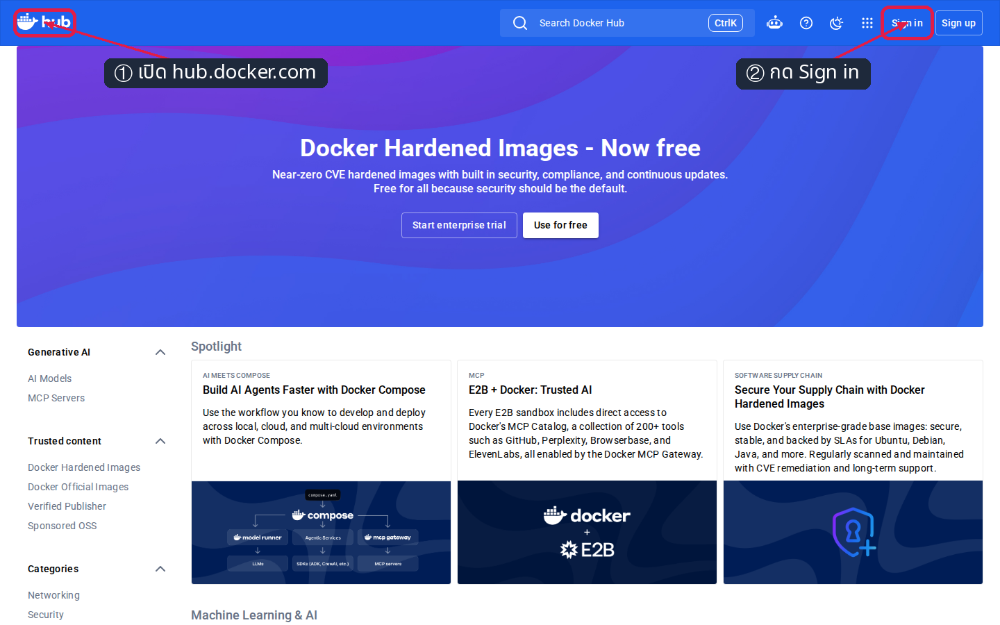

*ภาพที่ 1 — เปิด Docker Hub และเข้าสู่ขั้นตอน Sign in*

#### ขั้นที่ ③–④ — กรอกชื่อบัญชี

คลิกช่องชื่อบัญชี กรอก `<DOCKER_USER>` แล้วคลิก **Continue**

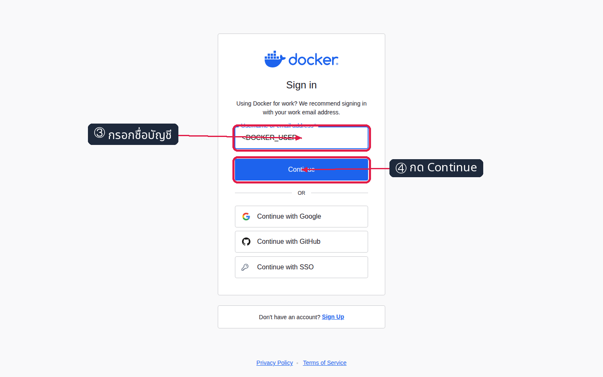

*ภาพที่ 2 — ชื่อบัญชีถูกแทนด้วย `<DOCKER_USER>` ในสื่อการสอน*

#### ขั้นที่ ⑤–⑥ — กรอกรหัสผ่านบัญชี

คลิกช่องรหัสผ่าน กรอกรหัสผ่านบัญชี แล้วคลิก **Continue**

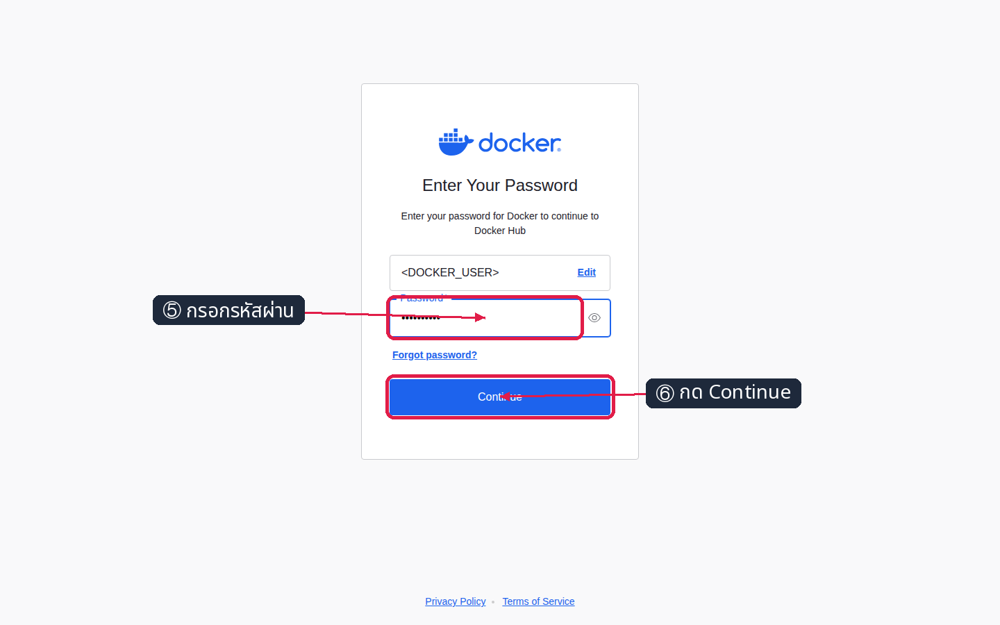

*ภาพที่ 3 — รหัสผ่านใช้สำหรับเว็บเท่านั้น ไม่ใช้กับคำสั่ง docker login*

#### ขั้นที่ ⑦ — เปิดเมนูบัญชี

คลิก avatar มุมขวาบน

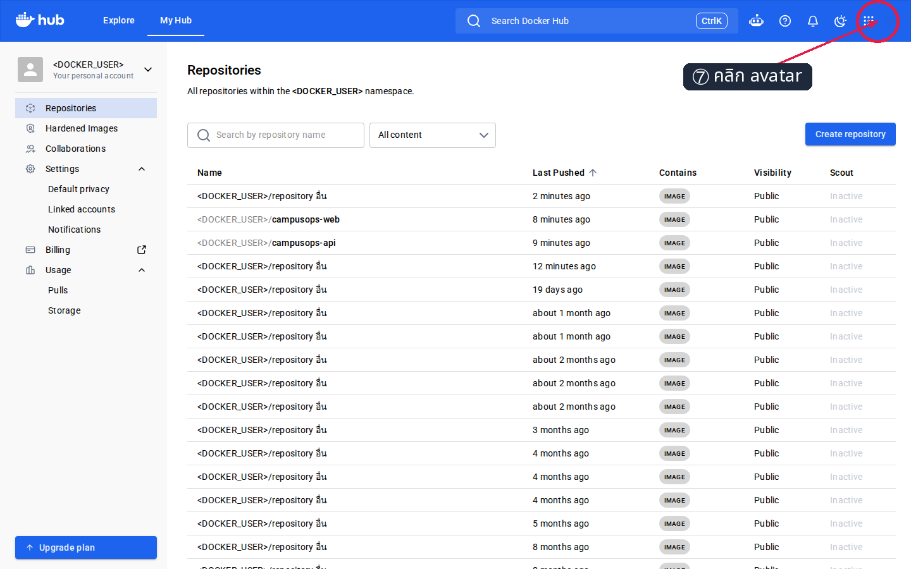

*ภาพที่ 4 — avatar ถูกปิดข้อมูลระบุตัวบัญชี แต่ตำแหน่งคลิกยังชัดเจน*

#### ขั้นที่ ⑧ — เปิด Account settings

คลิก **Account settings**

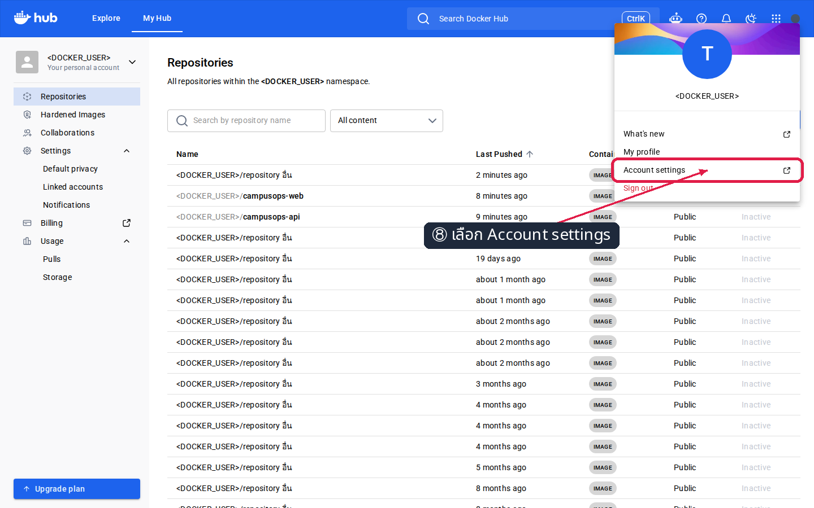

*ภาพที่ 5 — เปิดหน้าตั้งค่าบัญชีจากเมนู avatar*

#### ขั้นที่ ⑨–⑩ — เปิดรายการและเริ่มสร้าง token

คลิก **Personal access tokens** แล้วคลิก **Generate new token**

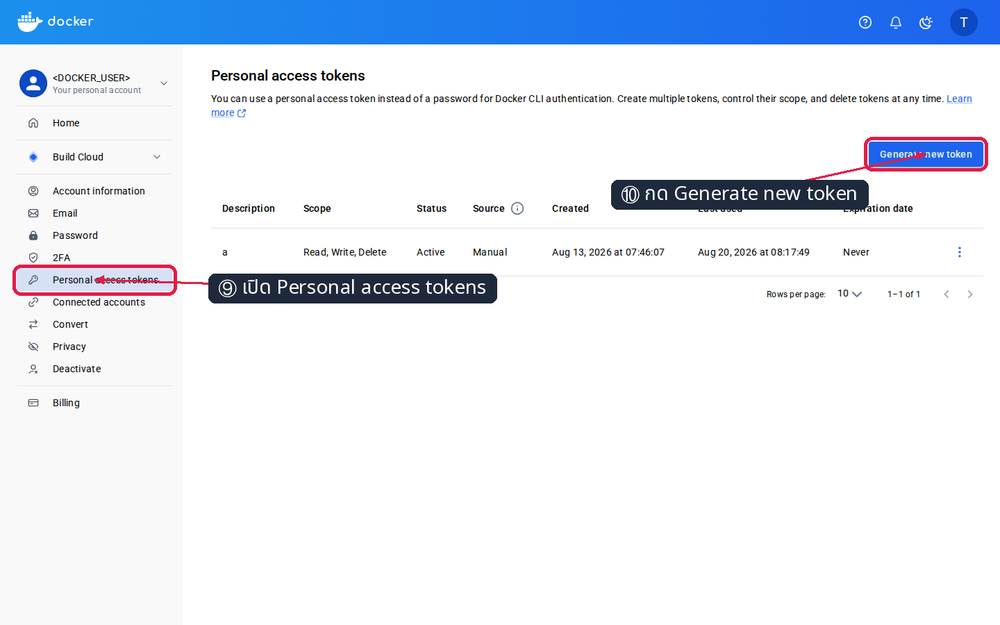

*ภาพที่ 6 — เปิดรายการ token และเริ่มสร้าง token ใหม่*

#### ขั้นที่ ⑪ — กำหนด description

คลิกช่อง description แล้วกรอก `<TOKEN_DESCRIPTION>` เช่นชื่อแล็บและวันที่หมดอายุที่ไม่ระบุตัวบุคคล

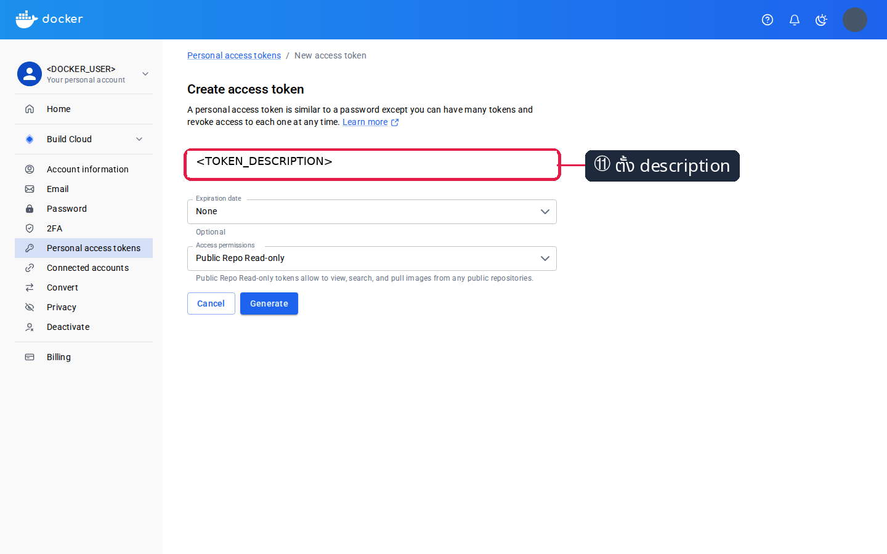

*ภาพที่ 7 — description ช่วยระบุ token ที่ต้อง revoke หลังจบแล็บ*

#### ขั้นที่ ⑫ — กำหนดวันหมดอายุ

คลิกรายการ Expiration แล้วเลือก **30 days**

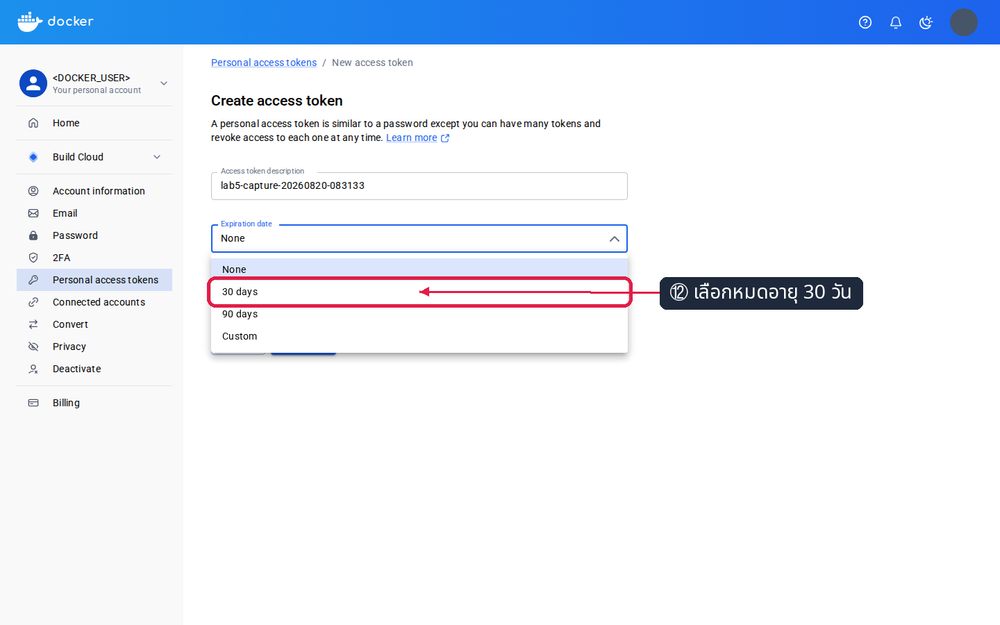

*ภาพที่ 8 — กำหนดอายุ token ให้สั้นตามระยะเวลาการใช้งาน*

#### ขั้นที่ ⑬ — กำหนด permission

คลิกรายการ permission แล้วเลือก **Read & Write**

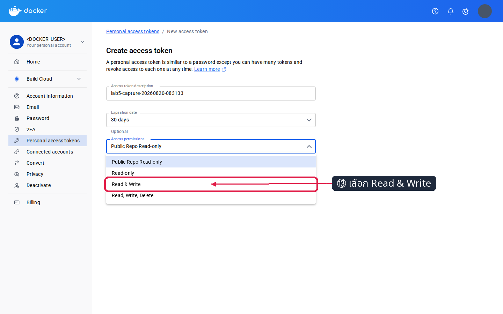

*ภาพที่ 9 — สิทธิ์ Write จำเป็นสำหรับ push และสิทธิ์ Read จำเป็นสำหรับ pull*

#### ขั้นที่ ⑭ — สร้าง token

คลิก **Generate**

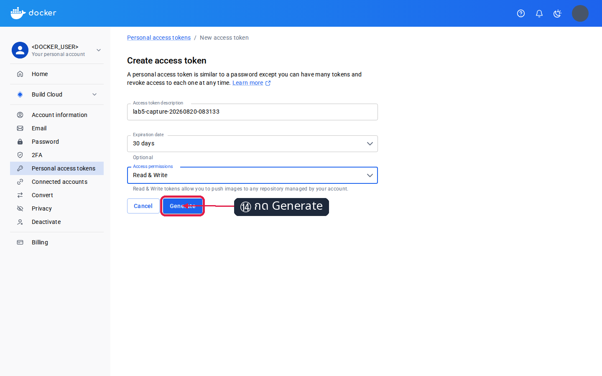

*ภาพที่ 10 — สร้าง token หลังตรวจ description, expiration และ permission*

#### ขั้นที่ ⑮ — คัดลอก token

คลิก **Copy** และเก็บค่าเป็น `<DOCKER_TOKEN>` ใน password manager ชั่วคราว

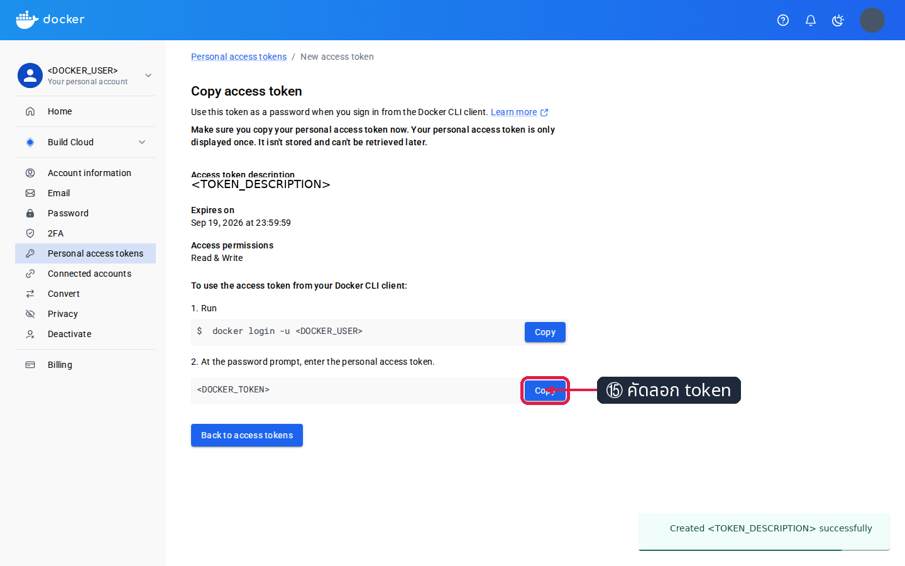

*ภาพที่ 11 — Docker Hub แสดง token ครั้งเดียว สื่อการสอนแทนค่าด้วย `<DOCKER_TOKEN>`*

---

## การทดลองที่ 1 — ตรวจรายการ Service ใน `compose.yaml`

**คำถาม:** `compose.yaml` อ่านได้และประกาศระบบครบสาม Service หรือไม่

```bash
docker compose -p campusops config --services
```

✅ **สิ่งที่ต้องเห็น**

```text
db
api
web
```

> 📝 ผลลัพธ์ยืนยันโครงสร้างไฟล์และชื่อ Service ที่ระบบชื่อโดเมน (Domain Name System: DNS) ของ Compose ใช้ภายใน network เดียวกัน โดยยังไม่สร้าง Container

---

## การทดลองที่ 2 — ตรวจการเริ่มระบบด้วยคำสั่งเดียว

**คำถาม:** Compose สามารถ build อิมเมจและเริ่มระบบตาม NFR-1 ด้วยคำสั่งเดียวหรือไม่

```bash
docker compose -p campusops down -v
docker compose -p campusops up -d --build
```

✅ **สิ่งที่ต้องเห็น**

```text
Image campusops-api Built
Image campusops-web Built
Container campusops-db-1 Started
Container campusops-db-1 Healthy
Container campusops-api-1 Started
Container campusops-api-1 Healthy
Container campusops-web-1 Started
```

> 📝 ลำดับ Started และ Healthy เกิดจาก `healthcheck` กับ `depends_on` ไม่ใช่การกำหนดเวลารอแบบคงที่ จึงรองรับเครื่องที่มีความเร็วต่างกัน

---

## การทดลองที่ 3 — ตรวจขอบเขตการเผยแพร่พอร์ต

**คำถาม:** Service ทั้งสามมีสถานะพร้อมใช้งาน (healthy) และมีเพียง `web` ที่ publish port หรือไม่

```bash
sleep 20
docker compose -p campusops ps
```

✅ **สิ่งที่ต้องเห็น**

```text
NAME              IMAGE                COMMAND                  SERVICE   CREATED          STATUS                    PORTS
campusops-api-1   campusops-api        "uvicorn main:app --…"   api       About a minute ago   Up About a minute (healthy)   8000/tcp
campusops-db-1    postgres:17-alpine   "docker-entrypoint.s…"   db        About a minute ago   Up About a minute (healthy)   5432/tcp
campusops-web-1   campusops-web        "docker-entrypoint.s…"   web       About a minute ago   Up About a minute (healthy)   0.0.0.0:3000->3000/tcp, [::]:3000->3000/tcp
```

> 📝 `5432/tcp` เป็น metadata จาก `EXPOSE` ไม่ใช่ published port หลักฐานของ NFR-3 คือมีการจับคู่พอร์ต (port mapping) `0.0.0.0:3000->3000/tcp` เฉพาะ `web`

---

## การทดลองที่ 4 — ตรวจลำดับเริ่ม Service

**คำถาม:** เวลาเริ่มของ Container เรียงจาก `db` ไป `api` และ `web` หรือไม่

```bash
docker inspect -f '{{.Name}} start={{.State.StartedAt}} health={{.State.Health.Status}}' \
  campusops-db-1 campusops-api-1 campusops-web-1
```

คำสั่งนี้อ่านเวลาและสถานะสุขภาพ (health status) ของ Container ทั้งสามพร้อมกันเพื่อเปรียบเทียบลำดับโดยตรง

✅ **สิ่งที่ต้องเห็น**

```text
/campusops-db-1 start=2026-08-20T09:59:03.174952566Z health=healthy
/campusops-api-1 start=2026-08-20T09:59:08.841823466Z health=healthy
/campusops-web-1 start=2026-08-20T09:59:14.518776291Z health=healthy
```

> 📝 เวลาเวลาสากลเชิงพิกัด (Coordinated Universal Time: UTC) จากรอบทดสอบเรียง `db` < `api` < `web` และทุก Container healthy จึงยืนยันลำดับที่ `compose.yaml` กำหนด

---

## การทดลองที่ 5 — ตรวจรหัสสถานะของเว็บ

**คำถาม:** หน้า overview, tickets, loans และ parts ตอบรหัสสถานะ Hypertext Transfer Protocol (HTTP) `200` ซึ่งหมายถึงคำขอสำเร็จครบหรือไม่

```bash
for path in / /tickets /loans /parts; do curl -s -o /dev/null -w "GET $path -> %{http_code}\n" "http://localhost:3000$path"; done
```

✅ **สิ่งที่ต้องเห็น**

```text
GET / -> 200
GET /tickets -> 200
GET /loans -> 200
GET /parts -> 200
```

> 📝 จุดนี้ต้องตรวจรหัสสถานะจริงจึงคงรูปแบบ curl ที่มี `-w` ไว้ ส่วนการตรวจเนื้อหาและการเชื่อมฐานข้อมูลแสดงผ่าน walkthrough ถัดไป

### Walkthrough หน้า CampusOps ที่ Compose ยกขึ้น

เปิดเบราว์เซอร์บนเครื่องโฮสต์ที่ `http://localhost:8226` แล้วตรวจส่วนติดต่อผู้ใช้ (User Interface: UI) ตามลำดับต่อไปนี้

#### ขั้นที่ ① — เปิดหน้า CampusOps

เปิดหน้า CampusOps ที่พอร์ต 8255

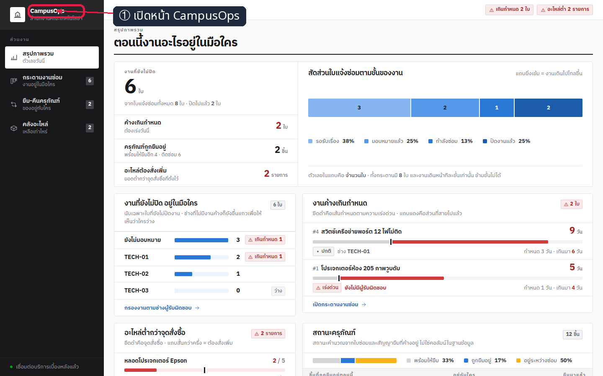

*ภาพที่ 12 — หน้าแรกจากระบบที่ Compose ยกขึ้นจริงด้วยข้อมูล seed 8 ใบ*

#### ขั้นที่ ② — เปิดกระดานงานซ่อม

คลิก **กระดานงานซ่อม** และตรวจงาน seed ในสี่คอลัมน์

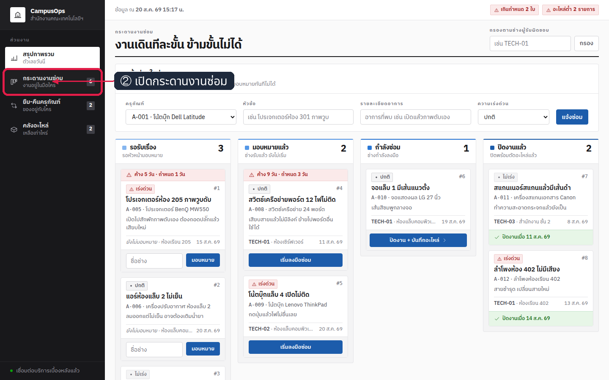

*ภาพที่ 13 — กระดานแสดงรอรับเรื่อง 3, มอบหมายแล้ว 2, กำลังซ่อม 1 และปิดงานแล้ว 2 รวม 8 ใบ*

#### ขั้นที่ ③ — กลับหน้าสรุปภาพรวม

คลิก **สรุปภาพรวม** เพื่อกลับหน้าแรกและตรวจตัวเลข requirements

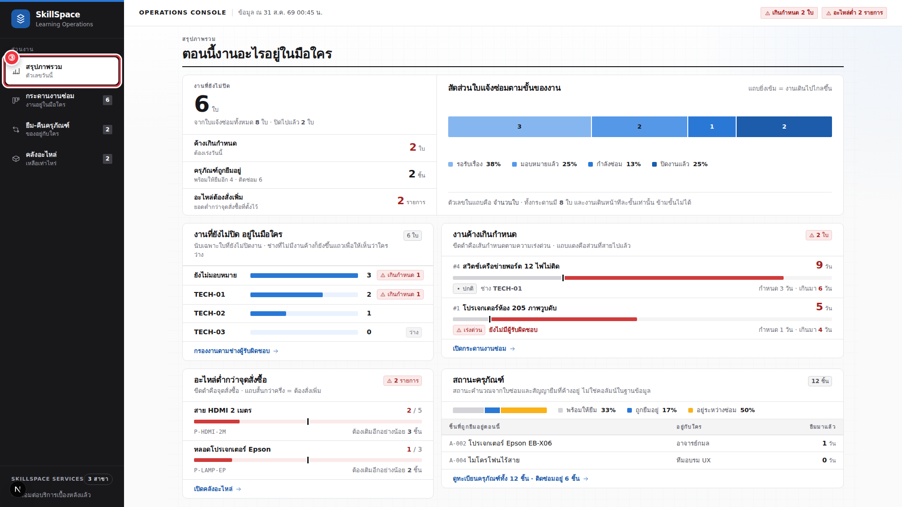

*ภาพที่ 14 — งานที่ยังไม่ปิด 6 ใบ, เกินกำหนด 2 ใบ, ครุภัณฑ์ถูกยืม 2 ชิ้น และอะไหล่ต้องสั่งเพิ่ม 2 รายการ*

---

## ชุดการทดลองที่ 6 — วงจรชีวิตของ named volume

### การทดลองที่ 6.1 — เพิ่มข้อมูลได้หรือไม่

**คำถาม:** เพิ่มใบแจ้งซ่อมหนึ่งรายการและตรวจจำนวนรวมเป็น 9 ได้หรือไม่

```bash
docker compose -p campusops exec -T db psql -U opsuser -d campusops -c "INSERT INTO tickets (asset_id,title,detail,priority) VALUES (4,'ไมโครโฟนห้องประชุมใหญ่เสียงขาด','แจ้งหลังส่งมอบระบบ','HIGH');"
docker compose -p campusops exec -T db psql -U opsuser -d campusops -tAc "SELECT count(*) FROM tickets;"
```

✅ **สิ่งที่ต้องเห็น**

```text
INSERT 0 1
9
```

### การทดลองที่ 6.2 — `down` รักษาข้อมูลหรือไม่

**คำถาม:** ปิดและเปิดระบบโดยไม่ลบ named volume แล้วข้อมูล 9 รายการยังอยู่หรือไม่

```bash
docker compose -p campusops down && docker compose -p campusops up -d --no-build
sleep 20 && docker compose -p campusops exec -T db psql -U opsuser -d campusops -tAc "SELECT count(*) FROM tickets;"
```

✅ **สิ่งที่ต้องเห็น**

```text
9
```

### การทดลองที่ 6.3 — `down -v` คืนข้อมูลตั้งต้นหรือไม่

**คำถาม:** ลบ named volume แล้วเปิดระบบใหม่จะได้ seed 8 รายการหรือไม่

```bash
docker compose -p campusops down -v && docker compose -p campusops up -d --no-build
sleep 20 && docker compose -p campusops exec -T db psql -U opsuser -d campusops -tAc "SELECT count(*) FROM tickets;"
```

✅ **สิ่งที่ต้องเห็น**

```text
8
```

> 📝 จำนวน 9 หลัง `down` พิสูจน์การคงอยู่ของข้อมูล ส่วนจำนวน 8 หลัง `down -v` เป็น seed ชุดใหม่ ไม่ใช่ข้อมูลเดิม จึงต้องระวัง `-v` ในระบบจริง

---

## การทดลองที่ 7 — วิเคราะห์เหตุการณ์ข้าม Service

**คำถาม:** อ่านบันทึกเหตุการณ์ (log) รวมและทดสอบ DNS จาก `web` ไป `api` ได้หรือไม่

```bash
docker compose -p campusops logs --tail=1
docker compose -p campusops exec -T web wget -qO- http://api:8000/health; echo
```

✅ **สิ่งที่ต้องเห็น**

```text
api-1  | INFO:     127.0.0.1:57508 - "GET /health HTTP/1.1" 200 OK
db-1   | 2026-08-20 10:01:16.890 UTC [1] LOG:  database system is ready to accept connections
web-1  | ✓ Running next.config took 0.7ms
{"status":"ok","db":"up"}
```

> 📝 คำนำหน้า Service ช่วยแยกแหล่ง log และชื่อ `api` ถูกแปลงเป็นหมายเลขอินเทอร์เน็ตโพรโทคอล (Internet Protocol: IP) ผ่าน Compose DNS ภายใน จึงไม่ผูกระบบกับ IP ที่เปลี่ยนเมื่อสร้าง Container ใหม่

---

## ชุดการทดลองที่ 8 — ติดเวอร์ชันและส่งขึ้น Docker Hub

### การทดลองที่ 8.1 — Login และติด tag ได้หรือไม่

**คำถาม:** Login ด้วย Personal Access Token และติด tag `1.0` ให้ทั้งสองอิมเมจได้หรือไม่

```bash
docker login -u <DOCKER_USER>            # วาง Access Token ตอนถาม Password
for service in api web; do docker tag "campusops-$service:latest" "<DOCKER_USER>/campusops-$service:1.0"; done
```

แทน `<DOCKER_USER>` ด้วยชื่อบัญชีจริงเฉพาะใน terminal และวาง Access Token เมื่อคำสั่งถาม `Password:`

repository ที่เกิดจาก `docker push` ครั้งแรกจะใช้ค่า **Default privacy** ของบัญชี หากบัญชีตั้งเป็น Private ให้เปลี่ยนที่ **My Hub → Settings → Default privacy** เป็น Public ก่อน push แล้วตรวจ Visibility ของทั้งสองรายการบนหน้า Repositories

✅ **สิ่งที่ต้องเห็น**

```text
Login Succeeded
```

### การทดลองที่ 8.2 — Push ทั้งสองอิมเมจได้หรือไม่

**คำถาม:** ส่งอิมเมจ `api` และ `web` ไปยัง repository แบบ Public ได้สำเร็จหรือไม่

```bash
docker push <DOCKER_USER>/campusops-api:1.0
docker push <DOCKER_USER>/campusops-web:1.0
```

✅ **สิ่งที่ต้องเห็น** — ส่วนท้ายของผลรันจริงรอบนี้

```text
1.0: digest: sha256:ed482a5c9245258b7173a63e669743d570dd9be45ca02344851b8e3d2eee2d24 size: 856
1.0: digest: sha256:9afebca5a220acd0e18dacf627a57ae8dca2d8840e8362b85295e3474e6fa2ef size: 856
```

**Digest** คือค่าแฮชที่ระบุเนื้อหาแบบเปลี่ยนตามข้อมูล `docker push` รายงาน digest ของ **manifest list** ซึ่งรวม platform manifest `linux/amd64` และข้อมูลที่มา (provenance) ส่วนตาราง Tags ของ Hub แสดง digest ของ **platform manifest** แยกตามระบบปฏิบัติการและสถาปัตยกรรม (OS/architecture) จึงเป็นค่าคนละระดับและไม่ควรคาดหวังว่าเท่ากัน

> 📝 tag เพิ่มชื่อให้อิมเมจเดิม ส่วน push ส่ง manifest list ขึ้น Hub และสร้าง repository ตาม Default privacy จึงต้องยืนยันสถานะ Public ของทั้งสอง repository

### Walkthrough ยืนยันอิมเมจบนหน้า Docker Hub

#### ขั้นที่ ①–② — เปิด repository ทั้งสองจาก My Hub

คลิก **My Hub → Repositories** ตรวจค่า **Public** ของทั้งสองรายการ แล้วคลิก `campusops-api` ก่อน `campusops-web` ตาม marker

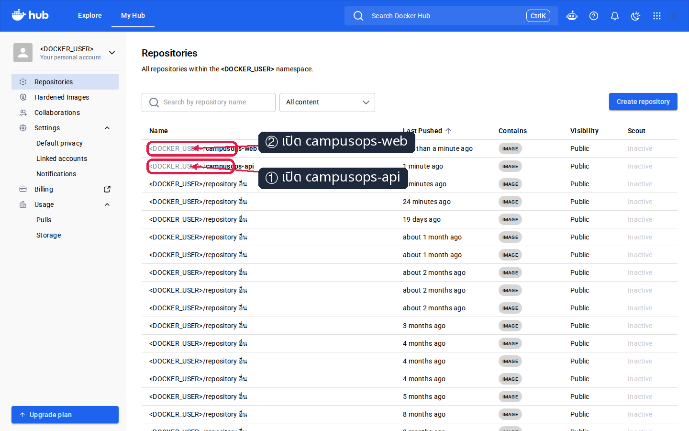

*ภาพที่ 15 — repository ทั้งสองถูกสร้างจาก push และแสดง Visibility เป็น Public*

#### ขั้นที่ ③ — เปิดแท็บ Tags ของ API

ในหน้า `campusops-api` คลิกแท็บ **Tags**

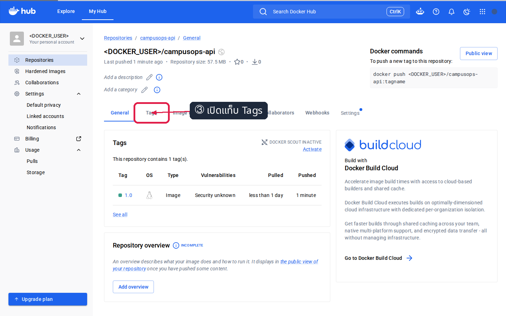

*ภาพที่ 16 — เปิดแท็บ Tags ของ `<DOCKER_USER>/campusops-api`*

#### ขั้นที่ ④–⑤ — อ่าน tag และ digest ของ API

ตรวจ tag `1.0`, digest, เวลาที่ push และขนาด


*ภาพที่ 17 — หลักฐานจาก Playwright CLI หลัง push จริง: API แสดง tag `1.0`, platform digest `363a16126b9c…` และ compressed size 57.53 MB*

#### ขั้นที่ ⑥ — เปิดแท็บ Tags ของ Web

กลับ Repositories คลิก `campusops-web` แล้วคลิกแท็บ **Tags**


*ภาพที่ 18 — เปิดแท็บ Tags ของ `<DOCKER_USER>/campusops-web`*

#### ขั้นที่ ⑦–⑧ — อ่าน tag และ digest ของ Web

ตรวจ tag `1.0`, digest, เวลาที่ push และขนาด

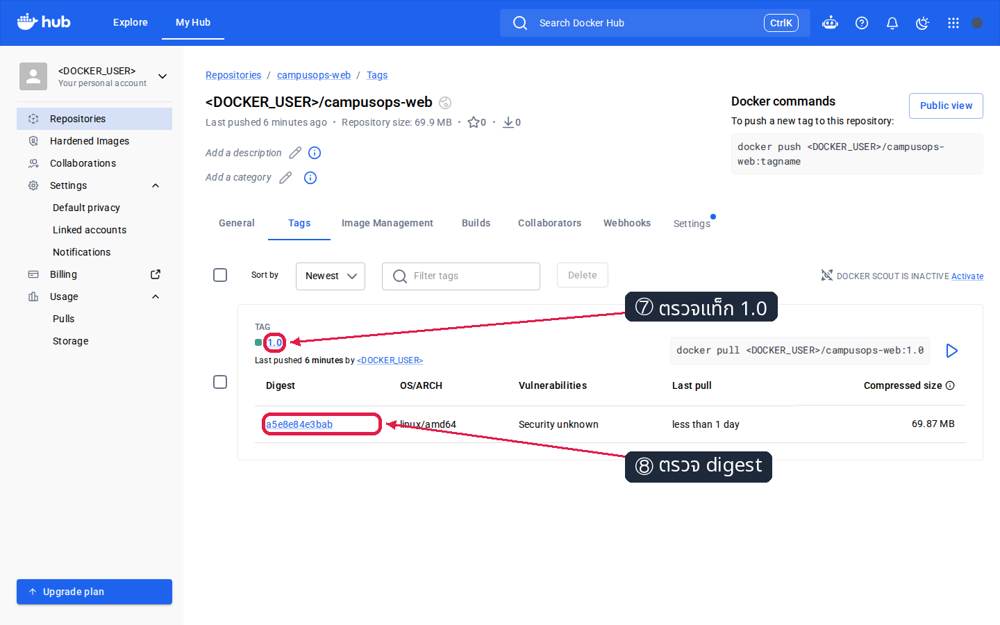

*ภาพที่ 19 — หลักฐานจาก Playwright CLI หลัง push จริง: Web แสดง tag `1.0`, platform digest `25d4630cb30c…` และ compressed size 69.87 MB*

ค่า digest เต็มจากรอบเดียวกับภาพมีดังนี้:

| อิมเมจ | `docker push` — manifest list | Docker Hub Tags — `linux/amd64` platform manifest |
|---|---|---|
| campusops-api | `sha256:ed482a5c9245258b7173a63e669743d570dd9be45ca02344851b8e3d2eee2d24` | `sha256:363a16126b9ce47dbc1fe5516c58f9c7a61b015135d6e33af3ccc3668a39a559` |
| campusops-web | `sha256:9afebca5a220acd0e18dacf627a57ae8dca2d8840e8362b85295e3474e6fa2ef` | `sha256:25d4630cb30ce2e5008e78cbdee4abb2838396c3659be9410c436fe09aff4bbb` |

---

## ชุดการทดลองที่ 9 — จำลองเครื่องปลายทางที่ไม่มีซอร์สโค้ด

### การทดลองที่ 9.1 — ล้างสถานะเครื่องพัฒนาได้หรือไม่

**คำถาม:** Logout, ปิดระบบ และลบอิมเมจแอปออกเพื่อจำลองเครื่องปลายทางได้หรือไม่

```bash
docker logout
docker compose -p campusops down && docker image rm campusops-api:latest campusops-web:latest <DOCKER_USER>/campusops-api:1.0 <DOCKER_USER>/campusops-web:1.0
```

✅ **สิ่งที่ต้องเห็น**

```text
Removing login credentials for https://index.docker.io/v1/
Untagged: campusops-api:latest
Untagged: campusops-web:latest
Untagged: <DOCKER_USER>/campusops-api:1.0
Deleted: sha256:<LOCAL_IMAGE_ID>
Untagged: <DOCKER_USER>/campusops-web:1.0
Deleted: sha256:<LOCAL_IMAGE_ID>
```

### การทดลองที่ 9.2 — Pull แบบไม่ใช้ credential ได้หรือไม่

**คำถาม:** รับอิมเมจ Public ทั้งสองรายการหลัง logout ได้สำเร็จหรือไม่

```bash
docker pull <DOCKER_USER>/campusops-api:1.0
docker pull <DOCKER_USER>/campusops-web:1.0
```

✅ **สิ่งที่ต้องเห็น** — pull สำเร็จทั้งที่ logout แล้ว จึงพิสูจน์ว่า repository ทั้งสองเป็น Public

```text
Digest: sha256:ed482a5c9245258b7173a63e669743d570dd9be45ca02344851b8e3d2eee2d24
Status: Downloaded newer image for <DOCKER_USER>/campusops-api:1.0
Digest: sha256:9afebca5a220acd0e18dacf627a57ae8dca2d8840e8362b85295e3474e6fa2ef
Status: Downloaded newer image for <DOCKER_USER>/campusops-web:1.0
```

### การทดลองที่ 9.3 — เตรียมชื่ออิมเมจให้ Compose ได้หรือไม่

**คำถาม:** ติด tag ชื่อภายในที่ `compose.yaml` อ้างถึงให้ทั้งสองอิมเมจได้หรือไม่

```bash
docker tag <DOCKER_USER>/campusops-api:1.0 campusops-api:latest
docker tag <DOCKER_USER>/campusops-web:1.0 campusops-web:latest
```

✅ **สิ่งที่ต้องเห็น:** ทั้งสองคำสั่งคืน exit code `0` และไม่แสดงข้อผิดพลาด

### การทดลองที่ 9.4 — เริ่มระบบโดยไม่ build ได้หรือไม่

**คำถาม:** `up --no-build` เริ่มระบบจากอิมเมจที่ pull และหน้าแรกตอบ HTTP `200` โดยไม่มีบรรทัด `Building` หรือไม่

```bash
docker compose -p campusops up -d --no-build && sleep 20
docker compose -p campusops ps && curl -s -o /dev/null -w "GET / -> %{http_code}\n" http://localhost:3000/
```

✅ **สิ่งที่ต้องเห็น** — log ของ `up` ไม่มีบรรทัด `Building`

```text
NAME              IMAGE                COMMAND                  SERVICE   CREATED          STATUS                    PORTS
campusops-api-1   campusops-api        "uvicorn main:app --…"   api       18 seconds ago   Up 12 seconds (healthy)   8000/tcp
campusops-db-1    postgres:17-alpine   "docker-entrypoint.s…"   db        18 seconds ago   Up 17 seconds (healthy)   5432/tcp
campusops-web-1   campusops-web        "docker-entrypoint.s…"   web       17 seconds ago   Up 6 seconds (healthy)    0.0.0.0:3000->3000/tcp, [::]:3000->3000/tcp
GET / -> 200
```

> 📝 logout ก่อน pull ตัด credential ออกจากการทดลอง ส่วน pull สำเร็จและ --no-build ไม่มี Building พิสูจน์การส่งมอบผ่าน public repository โดยไม่ build source

---

## ตรวจงานด้วย `verify.sh`

สคริปต์ไม่ push และไม่ลบ repository จริง การส่งมอบส่วนบังคับใช้ namespace ทดสอบในเครื่อง, `docker save`, ลบ image, `docker load` และ `up --no-build`; ส่วน opt-in ใช้ `docker manifest inspect` อ่าน manifest จาก Docker Hub จริงเมื่อกำหนด `HUB_USER` และคืน `[SKIP]` หาก repository ไม่มีหรือเข้าถึงไม่ได้

```bash
bash verify.sh
echo "exit code = $?"
```

✅ **สิ่งที่ต้องเห็น** — `[PASS]` 26 บรรทัด, `[SKIP]` 1 บรรทัด และ exit code 0

```text
==============================================
 LAB 5 — Compose And Ship : verify
==============================================
[PASS] ต่อกับ Docker daemon ได้
[PASS] ไฟล์ของแล็บครบ (compose.yaml · api/ · web/ · db/initdb/)
[PASS] compose.yaml ประกาศครบ 3 service : api db web
[PASS] ไม่มี container_name ในไฟล์ — ปล่อยให้ compose ตั้งชื่อเป็น <project>-<service>-<n>
[PASS] มี healthcheck ครบทั้ง 3 service
[PASS] depends_on ใช้ condition: service_healthy 2 จุด (api รอ db · web รอ api)
[PASS] NFR-3 : service db ไม่มี published port ในไฟล์
[PASS] NFR-2 : ประกาศ named volume ชื่อ pgdata ไว้แล้ว
[PASS] NFR-1 : docker compose up -d --build ขึ้นครบด้วยคำสั่งเดียว
[PASS] ทั้ง 3 service ขึ้นสถานะ healthy
[PASS] ลำดับการสตาร์ตเป็น db -> api -> web ตาม depends_on: service_healthy
[PASS] NFR-3 : Container db ที่รันอยู่ไม่มี port mapping ออกนอกเครื่อง
[PASS] หน้าเว็บตอบ 200 ที่ http://localhost:13191/
[PASS] หน้า /tickets · /loans · /parts ตอบ 200 ครบทั้ง 3 โมดูล
[PASS] web เรียก http://api:8000/health ด้วยชื่อ service แล้วได้ db up
[PASS] NFR-2 : down แล้ว up ข้อมูลยังอยู่ครบ (9 ใบเท่าเดิม)
[PASS] down -v แล้ว up ข้อมูลกลับไปเป็น seed ตั้งต้น (8 ใบ)
[PASS] tag repository ให้ api แล้ว IMAGE ID ยังเป็นอิมเมจเดิม
[PASS] tag repository ให้ web แล้ว IMAGE ID ยังเป็นอิมเมจเดิม
[PASS] docker save รวมอิมเมจทั้งสองรายการเป็นไฟล์ส่งมอบได้
[PASS] ลบ image ต้นทางและชื่อสำหรับส่งมอบออกจากเครื่องแล้ว
[PASS] docker load คืนอิมเมจทั้งสองรายการจากไฟล์ส่งมอบได้
[PASS] docker compose up -d --no-build ขึ้นครบจาก image ที่ load กลับมา
[PASS] ระบบที่ load กลับมามีสถานะ healthy ครบ 3 service
[PASS] ระบบที่ส่งมอบแบบออฟไลน์ตอบ HTTP 200
[PASS] log ของ --no-build ไม่มีบรรทัด Building
[SKIP] ไม่ตรวจ Docker Hub จริง — ตั้ง HUB_USER เพื่อเปิดการตรวจ manifest แบบ read-only
----------------------------------------------
ALL CHECKS PASSED
exit code = 0
```

เมื่อกำหนด `HUB_USER` หลังลบ repository แล้ว สคริปต์ติดต่อ Hub จริงและรายงานผลรันดังนี้โดยยังคืน exit code 0:

```text
[SKIP] ติดต่อ Docker Hub แล้วแต่ไม่พบหรือเข้าถึงไม่ได้: campusops-api:1.0 campusops-web:1.0 — ตรวจชื่อ repository และตั้ง Visibility เป็น Public
ALL CHECKS PASSED
exit code = 0
```

> 📝 verify ใช้ project vops5 และพอร์ต 13191 แยกจากงานผู้เรียน ส่วน opt-in ติดต่อ Hub แบบ read-only โดยไม่ push หรือลบ repository

### ผลตรวจรับจริงของสื่อชุดนี้

วันที่ 29 สิงหาคม 2026 รัน `HUB_USER=<DOCKER_USER> bash verify.sh` ภายใน Container แยกแล้วได้ `[PASS]` 27 รายการ รวมการตรวจ manifest รุ่น `1.0` บน Docker Hub จริง, `ALL CHECKS PASSED` และ exit code `0` จากนั้นทดสอบ logout → pull แบบ Public → `up --no-build` แล้วหน้าแรกตอบ HTTP `200` โดยไม่มีขั้น build

---

## แก้ปัญหาที่พบบ่อย

| ข้อความจริง | สาเหตุ | วิธีแก้ |
|---|---|---|
| `no configuration file provided: not found` | รันจากโฟลเดอร์ที่ไม่มี `compose.yaml` | เข้า `005_LAB_Compose_And_Ship` แล้วสั่งใหม่ |
| `Bind for 0.0.0.0:3000 failed: port is already allocated` | มี project อื่นใช้พอร์ต 3000 | ตรวจด้วย `docker ps` แล้วหยุดเฉพาะ project ที่ตนสร้าง |
| `dependency failed to start: container campusops-db-1 is unhealthy` | healthcheck ของ db ไม่ผ่าน | อ่าน `docker compose -p campusops logs db`; หากเป็น volume ฝึกที่สร้างผิด ให้ reset ด้วย `down -v` |
| `denied: requested access to the resource is denied` | tag ไม่มีชื่อบัญชีนำหน้า หรือยังไม่ได้ login | tag เป็น `<DOCKER_USER>/campusops-api:1.0` และ login ด้วย token |
| `unauthorized: incorrect username or password` | ใช้รหัสผ่านบัญชีแทน Access Token หรือ token หมดอายุ | สร้าง token ใหม่แบบ Read & Write แล้ว login ใหม่ |
| `pull access denied for <DOCKER_USER>/campusops-api, repository does not exist or may require 'docker login'` | repository เป็น Private หรือพิมพ์ชื่อผิด | ตรวจชื่อและ Visibility; login หากตั้งใจใช้ Private |
| `429 Too Many Requests` | เกิน pull rate limit | รอรอบโควตา, login ก่อน pull และใช้ image cache ที่มีอยู่ |
| `Error response from daemon: No such image: campusops-api:latest` | สั่ง `up --no-build` ก่อน pull/tag | pull ให้ครบสองอิมเมจแล้ว tag กลับเป็นชื่อที่ compose.yaml ใช้ |

---

## เก็บกวาด

ภายใน Container สำหรับเรียน ลบ project, volume และอิมเมจของแล็บ; credential ใน `/root/.docker/config.json` ถูกลบด้วย `docker logout` ตั้งแต่ต้นการทดลองที่ 9 แล้ว:

```bash
docker compose -p campusops down -v
docker image rm -f campusops-api:latest campusops-web:latest <DOCKER_USER>/campusops-api:1.0 <DOCKER_USER>/campusops-web:1.0
```

`docker logout` ลบ credential ออกจาก Container สำหรับเรียน แต่ **ไม่ทำให้ Access Token หมดอายุ** จึงต้อง revoke token บน Docker Hub ด้วย หากต้องการเก็บ repository เป็นผลงาน สามารถข้ามเฉพาะขั้นลบ repository แต่ยังต้อง revoke token

### Revoke Personal Access Token

ใช้เส้นทาง avatar → Account settings → Personal access tokens ตามภาพที่ 4–6 แล้วดำเนินการต่อ:

#### ขั้นที่ ⑯ — เปิดเมนูของ token

คลิกเมนูของ token ที่สร้างสำหรับแล็บ

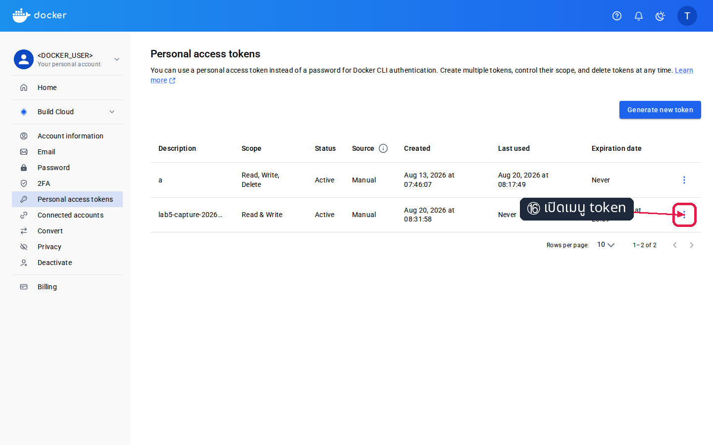

*ภาพที่ 20 — เลือกเฉพาะ token จาก description ของแล็บ*

#### ขั้นที่ ⑰ — เปิดหน้ายืนยันการลบ

คลิก **Delete**

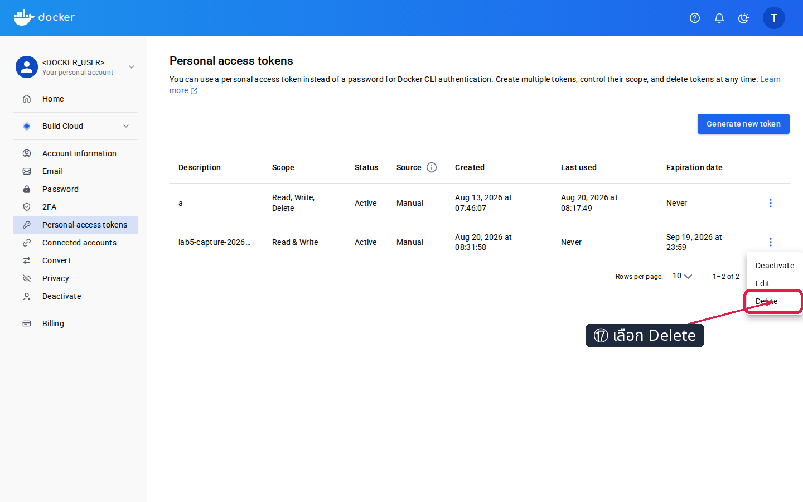

*ภาพที่ 21 — เปิดหน้าลบ token ที่เลือก*

#### ขั้นที่ ⑱ — ยืนยันการลบ token

คลิก **Delete token** เพื่อยืนยัน

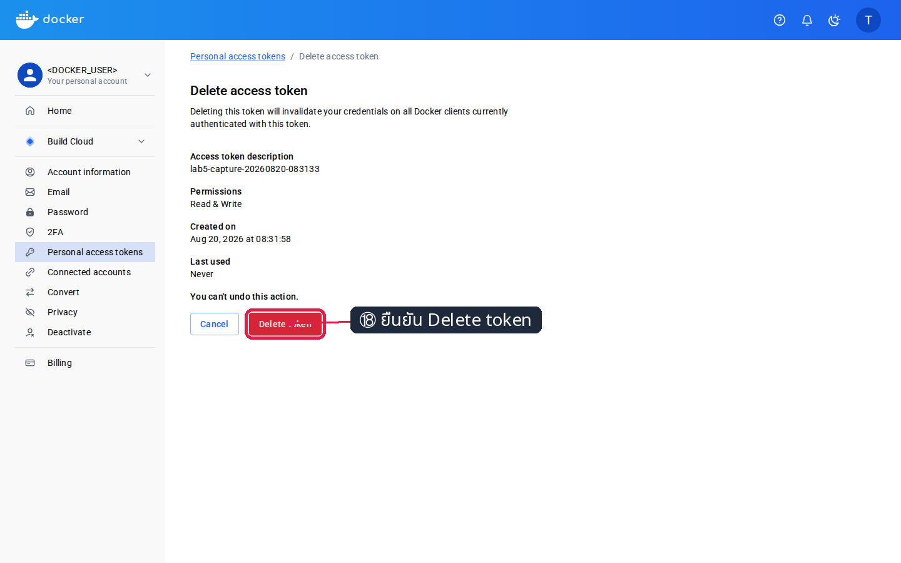

*ภาพที่ 22 — หน้าต่างยืนยันก่อนคลิก Delete token; ภาพถัดไปเป็นหลักฐานผลหลังยืนยัน*

#### ขั้นที่ ⑲ — ตรวจผลหลัง revoke

หลังคลิก **Delete token** ตรวจว่ารายการไม่มี token ที่มี description `<TOKEN_DESCRIPTION>` และมีข้อความ **Token deleted successfully.**

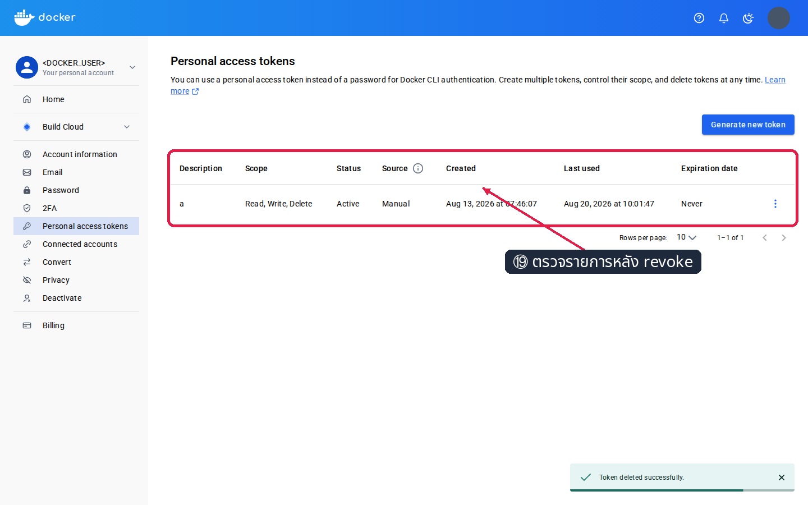

*ภาพที่ 23 — token ชั่วคราวหายจากรายการและ Docker Hub แสดงผลลบสำเร็จ*

### ลบ repository ทั้งสองบน Docker Hub

ทำลำดับต่อไปนี้กับ `campusops-api`:

#### ขั้นที่ ①–③ — เปิด repository API

คลิก **My Hub → Repositories → campusops-api**

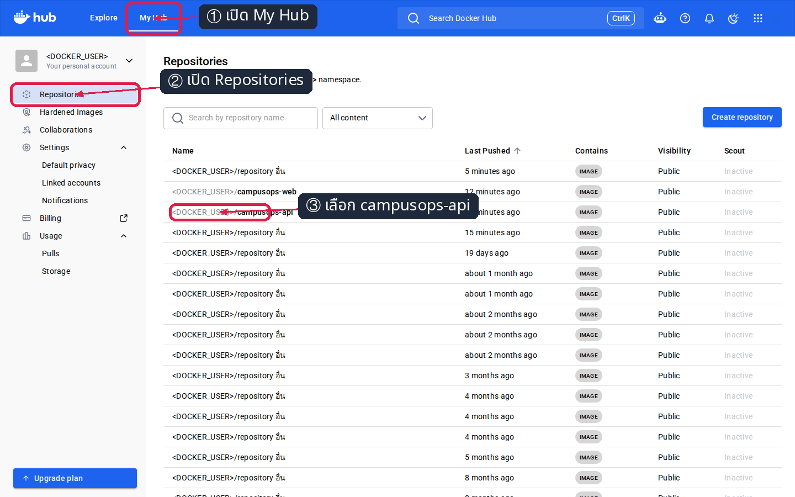

*ภาพที่ 24 — เปิด repository API จาก My Hub ตามลำดับไม่ข้ามขั้น*

#### ขั้นที่ ④ — เปิด Settings ของ API

คลิกแท็บ **Settings**

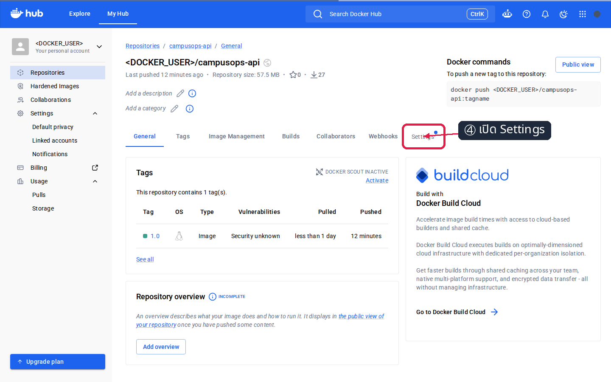

*ภาพที่ 25 — เปิด Settings ของ campusops-api*

#### ขั้นที่ ⑤ — เริ่มลบ repository API

คลิก **Delete repository**

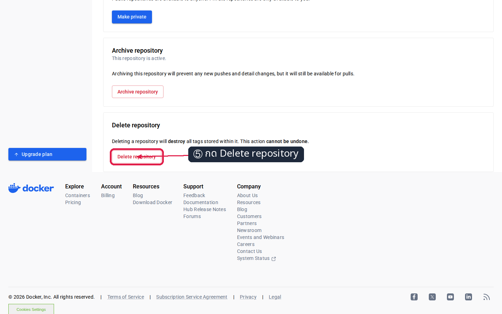

*ภาพที่ 26 — เริ่มขั้นลบ campusops-api*

#### ขั้นที่ ⑥–⑦ — ยืนยันชื่อและลบ repository API

พิมพ์ `campusops-api` แล้วคลิก **Delete repository forever**


*ภาพที่ 27 — ยืนยันชื่อให้ตรงก่อนลบ campusops-api อย่างถาวร*

ทำลำดับเดียวกันกับ `campusops-web`:

#### ขั้นที่ ⑧–⑩ — เปิด repository Web

คลิก **My Hub → Repositories → campusops-web**

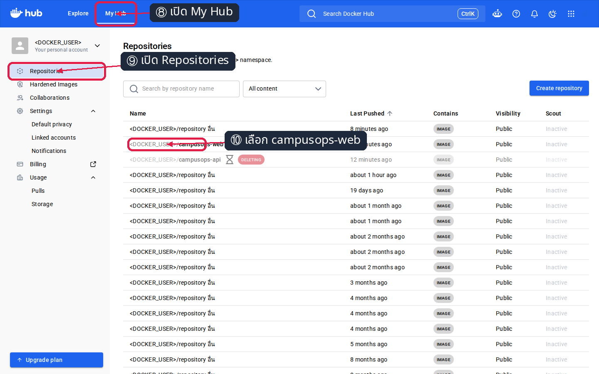

*ภาพที่ 28 — เปิด repository Web จาก My Hub*

#### ขั้นที่ ⑪ — เปิด Settings ของ Web

คลิกแท็บ **Settings**

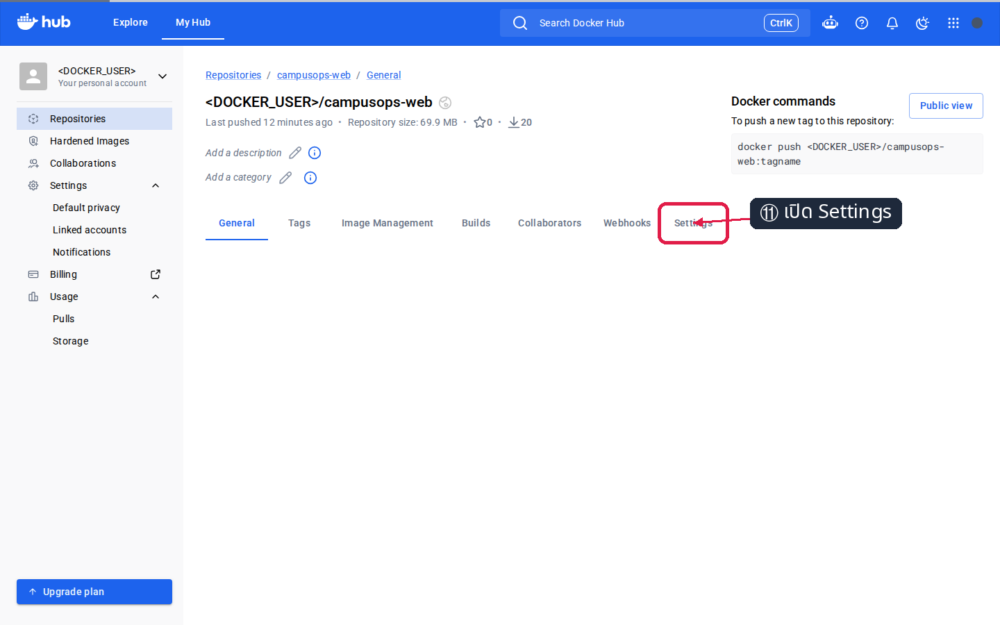

*ภาพที่ 29 — เปิด Settings ของ campusops-web*

#### ขั้นที่ ⑫ — เริ่มลบ repository Web

คลิก **Delete repository**


*ภาพที่ 30 — เริ่มขั้นลบ campusops-web*

#### ขั้นที่ ⑬–⑭ — ยืนยันชื่อและลบ repository Web

พิมพ์ `campusops-web` แล้วคลิก **Delete repository forever**

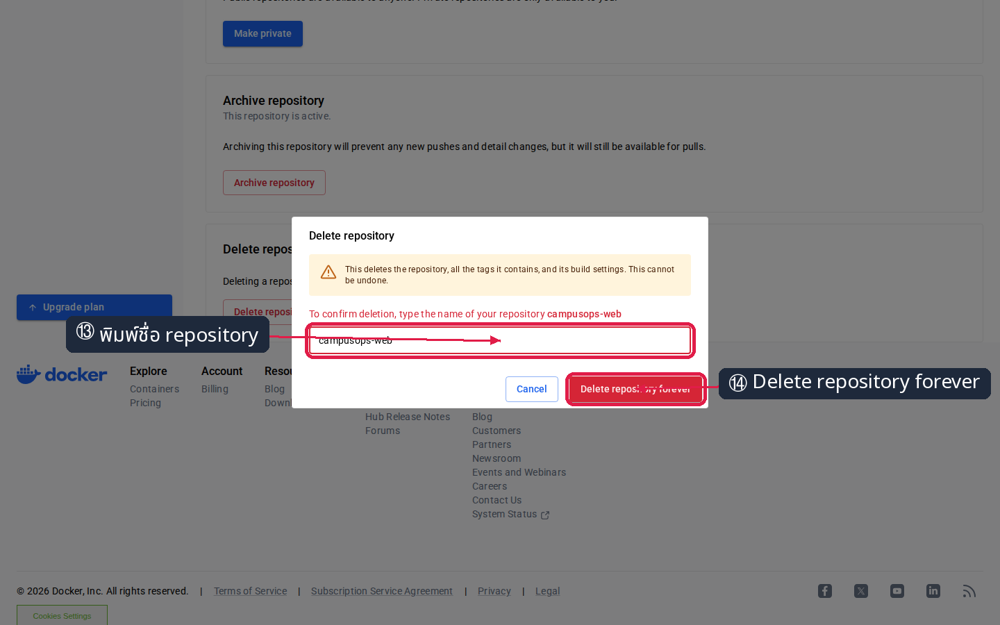

*ภาพที่ 31 — ยืนยันชื่อให้ตรงก่อนลบ campusops-web อย่างถาวร*

ออกจาก Container สำหรับเรียนและลบเฉพาะ Container ของ LAB 5:

```bash
exit
docker rm -f devtools-compose-ship
```

---

## สรุปคำสั่งของแล็บนี้

| คำสั่ง | หน้าที่ |
|---|---|
| `docker compose -p campusops up -d --build` | build และยกระบบจาก source |
| `docker compose -p campusops up -d --no-build` | เริ่มระบบจากอิมเมจที่มีอยู่โดยห้าม build |
| `docker compose -p campusops ps` | แสดงสถานะ health และ port ของทุก Service |
| `docker compose -p campusops down` | ลบ Container กับ network แต่รักษา volume |
| `docker compose -p campusops down -v` | ลบ volume และข้อมูล |
| `docker login -u <DOCKER_USER>` | login ด้วย Access Token |
| `docker tag <image> <DOCKER_USER>/<repository>:1.0` | เพิ่มชื่อสำหรับ Docker Hub ให้อิมเมจเดิม |
| `docker push <DOCKER_USER>/<repository>:1.0` | ส่งอิมเมจไป Docker Hub |
| `docker pull <DOCKER_USER>/<repository>:1.0` | รับอิมเมจลงเครื่องปลายทาง |
| `docker logout` | ลบ credential ใน Container แต่ไม่ revoke token |

---

## ✅ เช็กลิสต์ก่อนจบแล็บ

- [ ] `docker compose -p campusops ps` แสดง healthy ครบ 3 service และ publish port เฉพาะ web
- [ ] หน้า `/`, `/tickets`, `/loans` และ `/parts` ตอบ 200
- [ ] `down` แล้วยังมี 9 ใบ แต่ `down -v` แล้วกลับเป็น seed 8 ใบ
- [ ] push `campusops-api:1.0` และ `campusops-web:1.0` สำเร็จ และทั้งสอง repository เป็น Public
- [ ] ลบ image แล้ว pull แยกสองคำสั่ง ก่อน `up -d --no-build` โดยไม่มี `Building`
- [ ] `verify.sh` แสดง `[PASS]` 26 บรรทัด, `[SKIP]` สำหรับ Hub เมื่อไม่ตั้ง `HUB_USER`, `ALL CHECKS PASSED` และ exit code 0
- [ ] logout ในการทดลองที่ 9, revoke token และตัดสินใจว่าจะเก็บหรือลบ repository เป็นผลงาน

*ผลลัพธ์ในเอกสารนี้มาจากการรันจริงวันที่ 29 สิงหาคม 2026 ภายในอิมเมจ `<DEVTOOLS_IMAGE>` โดยเอกสารแทนชื่อบัญชีและข้อมูลรับรองทั้งหมดด้วย placeholder*
