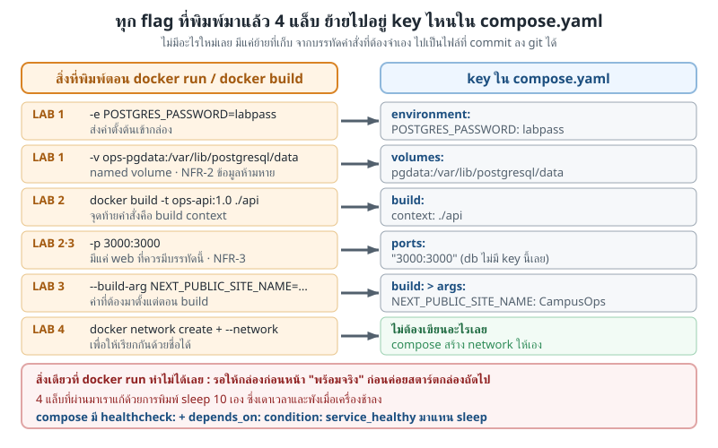
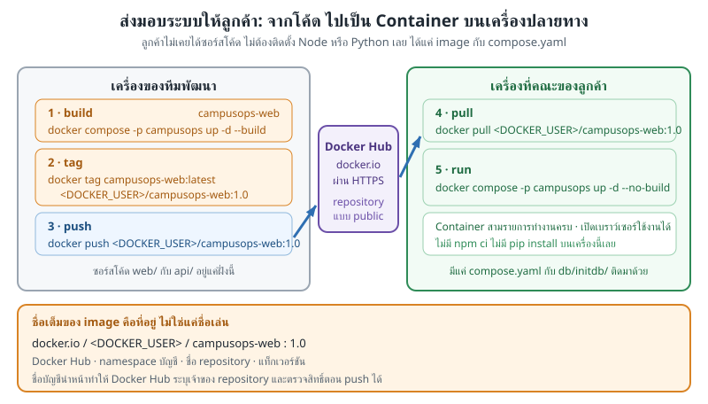
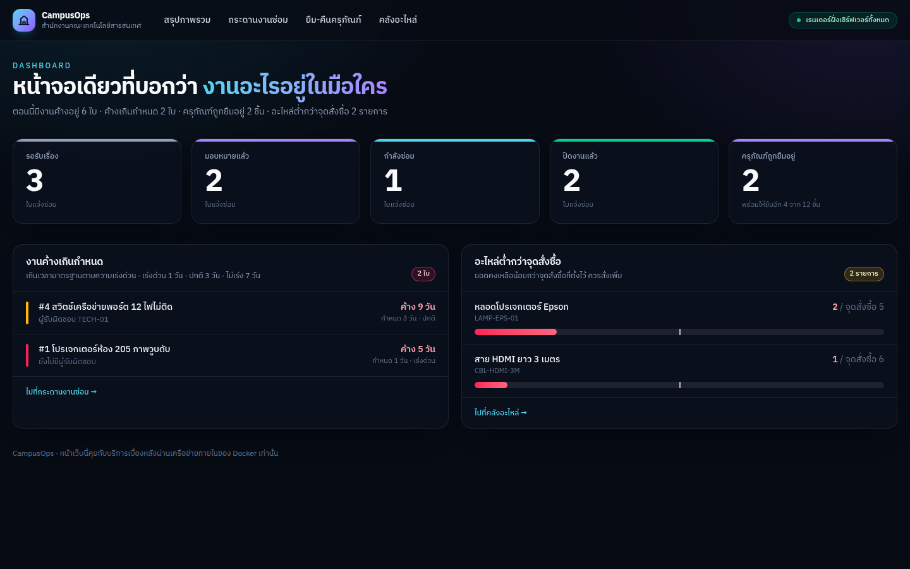

# LAB 5 — ยุบทุกอย่างเป็นไฟล์เดียว แล้วส่งมอบให้ลูกค้า

> โฟลเดอร์ `005_LAB_Compose_And_Ship` · ไฟล์ของแล็บ : `compose.yaml` · `api/` · `web/` · `db/initdb/` · `verify.sh`

---

### 🎯 แล็บนี้ใน 30 วินาที

| | |
|---|---|
| **คำถามเดียวที่ตอบให้จบ** | ระบบสามกล่องที่เราต่อมือมา 4 แล็บ ทำอย่างไรให้ **ขึ้นด้วยคำสั่งเดียว** (NFR-1) และ **ส่งมอบให้ลูกค้าเอาไปรันเองได้** |
| **ต้องผ่านอะไรมาก่อน** | **LAB 1–4** ครบ · แล็บนี้ไม่มีเทคนิคใหม่เลย มีแต่ย้ายทุก flag ที่พิมพ์มาแล้วไปอยู่ในไฟล์เดียว |
| **เวลา** | ~50 นาที · การทดลอง **9 อัน** อันละ 3–5 นาที |
| **จบแล้วต้องทำได้เอง** | อ่าน `compose.yaml` ทีละ key แล้วชี้ได้ว่าแต่ละบรรทัดมาจาก `docker run` ตัวไหน · ใช้ `healthcheck` + `depends_on` ให้ระบบรอกันเอง · บอกได้ว่า `down` กับ `down -v` ต่างกันตรงไหน · `tag`/`push`/`pull` ผ่าน registry ในเครื่อง |
| **แล็บนี้ยัง *ไม่* สอน** | network สร้างมือ → **LAB 4** สอนไปแล้ว (compose สร้างให้เอง) · ORM / migration tool · การเก็บรหัสผ่านแบบ secret · การจำกัด CPU/RAM ของกล่อง — ทั้งหมดอยู่นอกขอบเขตของชุดนี้ |

---

## ทฤษฎีก่อนลงมือ

**โจทย์จากลูกค้า** : *"ไม่มีฝ่าย IT ประจำ — ติดตั้งต้องง่าย ย้ายเครื่องต้องได้"* ([`docs/00_story.md`](../docs/00_story.md) §ข้อจำกัด)
→ กลายเป็น **NFR-1** ใน [`docs/01_requirements.md`](../docs/01_requirements.md) : *"`docker compose up -d` แล้วระบบพร้อมใช้งาน โดยไม่ต้องติดตั้ง Python/Node/Postgres บนเครื่อง"*

### `compose.yaml` คือ `docker run` ที่เขียนเป็นไฟล์



> 🖼 **วิธีอ่านรูปนี้:** อ่านทีละแถวจากซ้ายไปขวา — ฝั่งซ้ายคือสิ่งที่**เราพิมพ์มาแล้วจริง ๆ** ใน 4 แล็บที่ผ่านมา ฝั่งขวาคือที่อยู่ใหม่ของมัน · แถวสุดท้ายฝั่งขวาเป็นสีเขียวเพราะ **ไม่ต้องเขียนอะไรเลย** · กล่องสีแดงล่างสุดคือของชิ้นเดียวที่ compose ให้เพิ่มมาจริง ๆ

| สิ่งที่ทำด้วย `docker run` มาแล้ว | key ใน `compose.yaml` | มาจากแล็บ |
|---|---|---|
| `-e POSTGRES_PASSWORD=labpass` | `environment:` | LAB 1 |
| `-v ops-pgdata:/var/lib/postgresql/data` | `volumes:` + บล็อก `volumes:` ล่างสุดของไฟล์ | LAB 1 |
| `-v "$PWD/db/initdb:/docker-entrypoint-initdb.d:ro"` | `volumes:` แบบ bind mount | LAB 1 |
| `docker build -t ops-api:1.0 ./api` | `build: context: ./api` | LAB 2 |
| `--build-arg NEXT_PUBLIC_SITE_NAME=CampusOps` | `build: args:` | LAB 3 |
| `-p 3000:3000` | `ports:` (มีที่ `web` ที่เดียว) | LAB 2 · LAB 3 |
| `docker network create` + `--network` | *ไม่ต้องเขียน* — compose สร้าง network ชื่อ `<project>_default` ให้เอง | LAB 4 |
| *(`docker run` ทำไม่ได้)* พิมพ์ `sleep 10` เดาเอาเอง | `healthcheck:` + `depends_on: condition: service_healthy` | **02_Dockerfile Guide LAB 7** |

### `healthcheck` คือคนตอบ · `depends_on` คือคนรอ


> 🖼 **วิธีอ่านรูปนี้:** กรอบ**เส้นประ**แปลว่ากล่องนั้น *ยังไม่ถูกสร้างขึ้นเลย* ไม่ใช่สร้างแล้วรออยู่ · ลูกศรสีเขียวสองเส้นคือ "ใบอนุญาตให้เกิด" ที่ออกให้ก็ต่อเมื่อกล่องก่อนหน้าตอบว่า `healthy` แล้วเท่านั้น

| | `depends_on: [db]` แบบสั้น | `depends_on: db: condition: service_healthy` |
|---|---|---|
| รออะไร | รอแค่ "กล่อง `db` ถูกสตาร์ตแล้ว" | รอจน **healthcheck ของ `db` ตอบว่าผ่าน** |
| ตอนที่ `api` เกิด | postgres อาจยังรัน initdb อยู่ | postgres รับ connection ได้จริงแล้ว |
| ใช้ในระบบนี้ | ไม่พอ — `api` จะวน retry ตอนบูต | ✅ ที่เราใช้ |

### `down` กับ `down -v` ต่างกันหนึ่งตัวอักษร แต่ต่างกันทั้ง NFR-2

compose ตั้งชื่อของทุกอย่างด้วย **ชื่อ project** นำหน้า — เราบังคับตั้งเองด้วย `-p campusops` ทุกคำสั่ง
เพราะชื่อโฟลเดอร์ `005_LAB_Compose_And_Ship` ขึ้นต้นด้วยตัวเลข ถ้าปล่อยให้ compose เดาเอง project จะชื่อ `005_lab_compose_and_ship`

| ของที่ compose สร้าง | ชื่อจริง | `down` ลบไหม | `down -v` ลบไหม |
|---|---|---|---|
| กล่อง | `campusops-db-1` · `campusops-api-1` · `campusops-web-1` | ✅ ลบ | ✅ ลบ |
| network | `campusops_default` | ✅ ลบ | ✅ ลบ |
| named volume | `campusops_pgdata` | ❌ **ไม่ลบ** | ✅ ลบ (ข้อมูลหายถาวร) |
| image ที่ build | `campusops-api` · `campusops-web` | ❌ ไม่ลบ | ❌ ไม่ลบ |

### ส่งมอบให้ลูกค้า = ส่ง image ไม่ใช่ส่งซอร์สโค้ด



> 🖼 **วิธีอ่านรูปนี้:** ลูกศรฟ้าสองเส้นวิ่งผ่าน `registry` ตรงกลางเสมอ — ไม่มีเส้นไหนวิ่งตรงจากซ้ายไปขวา นั่นคือเหตุผลที่ต้องมี registry · แถบเหลืองล่างสุดอธิบายว่าทำไมต้อง `docker tag` ก่อน `docker push` ทุกครั้ง

### สิ่งที่มักเข้าใจผิด

- **คิดว่า** `docker compose down` ลบข้อมูลของลูกค้าไปด้วย → **จริง ๆ** ลบแค่กล่องกับ network · volume ยังอยู่ครบ (การทดลองที่ 6)
- **คิดว่า** `depends_on` เฉย ๆ ก็พอแล้ว เพราะมันแปลว่า "รอ" → **จริง ๆ** รอแค่กล่องถูกสตาร์ต ต้องมี `condition: service_healthy` ถึงจะรอจนใช้งานได้จริง (การทดลองที่ 4)
- **คิดว่า** `-p campusops` เป็นแค่ความสวยงาม → **จริง ๆ** ถ้าไม่ใส่ compose จะเดาชื่อ project จากชื่อโฟลเดอร์ แล้วเรากับ compose จะพูดถึงคนละระบบกัน (การทดลองที่ 2)
- **คิดว่า** `docker push` ส่ง image ตามชื่อที่ build มาได้เลย → **จริง ๆ** ชื่อ image ต้องมีโฮสต์ของ registry นำหน้า จึงต้อง `docker tag` ใหม่ก่อนเสมอ (การทดลองที่ 8)

---

## เตรียมเครื่องเรียน

### ขั้นที่ 1 — เปิดกล่องเรียน

รันบน **เครื่องของเราเอง** — นอกจากพอร์ต SSH แล้ว แล็บนี้เปิดพอร์ตของงานอีกสองพอร์ต : `8191` สำหรับหน้าเว็บ และ `5039` สำหรับ registry :

```bash
docker rm -f devtools-ops-lab5 2>/dev/null
docker run -dit --name devtools-ops-lab5 --privileged \
  -p 2242:22 -p 8191:3000 -p 5039:5000 tuchsanai/devtools:2569_1
ssh root@localhost -p 2242        # password : passwd
```

### ขั้นที่ 2 — โหลดโค้ดแล็บ

**คำสั่งทุกอันหลังจากนี้พิมพ์ข้างในกล่องเรียน**

```bash
mkdir -p ~/labwork && cd ~/labwork
git clone --depth 1 https://github.com/Tuchsanai/DevTools.git
cd DevTools/02_Docker/03_Fullstack_App_Example/005_LAB_Compose_And_Ship
ls
```

✅ **สิ่งที่ต้องเห็น** — ซอร์สของทั้งสามกล่องมาครบในโฟลเดอร์เดียว พร้อม `compose.yaml` ที่จะสั่งงานมันทั้งหมด :

```
api
compose.yaml
db
images
readme.md
verify.sh
web
```

> 📝 **ทุกคำสั่ง compose ในแล็บนี้ต้องมี `-p campusops`** — พิมพ์ตกเมื่อไร compose จะไปคุยกับ project อีกอันทันที ซึ่งเป็นสาเหตุของปัญหาที่พบบ่อยที่สุดในแล็บนี้

---

## การทดลองที่ 1 — อ่าน `compose.yaml` ทีละ key

**คำถาม:** ไฟล์นี้พูดอะไรบ้าง ที่เราไม่เคยพิมพ์ด้วยมือมาก่อน

```bash
docker compose -p campusops config --services
grep -nE "^ {4}(image|build|environment|volumes|ports|depends_on|healthcheck|restart):" compose.yaml
```

✅ **สิ่งที่ต้องเห็น** — สาม service และแผนที่ของ key ทั้งไฟล์ · สังเกตว่า **`ports:` มีบรรทัดเดียวคือบรรทัด 82 ของ `web`** และ `db` ไม่มีเลย (เลขบรรทัดตรงกันทุกเครื่องเพราะเป็นไฟล์เดียวกัน · ลำดับชื่อ service ออกตามลำดับที่เขียนในไฟล์ ไม่ใช่เรียงตัวอักษร) :

```
db
api
web
20:    image: postgres:17-alpine
21:    environment:
25:    volumes:
33:    healthcheck:
42:    restart: unless-stopped
49:    build:
51:    environment:
55:    depends_on:
60:    healthcheck:
68:    restart: unless-stopped
74:    build:
80:    environment:
82:    ports:
85:    depends_on:
88:    healthcheck:
95:    restart: unless-stopped
```

เทียบกับตารางในหัวข้อทฤษฎีข้างบน จะเห็นว่าทุก key มีต้นทางเป็น flag ที่เราพิมพ์มาแล้วใน LAB 1–4 ส่วน `healthcheck:` กับ `depends_on:` เคยเขียนแล้วที่ **02_Dockerfile Guide LAB 7**

> 📝 **บทเรียน:** `db` เป็น service เดียวที่ไม่มี `ports:` เลย นั่นคือ NFR-3 ที่เขียนเป็นไฟล์ · `build:` แทน `docker build` ส่วน `image:` แทนการหยิบ image สำเร็จรูปมาใช้

---

## การทดลองที่ 2 — คำสั่งเดียวจบ (NFR-1)

**คำถาม:** จาก 4 แล็บที่พิมพ์กันหลายสิบบรรทัด เหลือกี่คำสั่ง และใช้เวลาเท่าไร

```bash
time docker compose -p campusops up -d --build
```

✅ **สิ่งที่ต้องเห็น** — บรรทัดท้ายสุดของ log ที่เดินเป็นลำดับ `Started → Waiting → Healthy` แล้วปิดด้วยเวลารวม (log จริงยาวหลายร้อยบรรทัดเพราะต้อง pull และ build ตัดมาเฉพาะช่วงท้าย · **ตัวเลข `real` ของแต่ละเครื่องไม่ตรงกัน** ขึ้นกับความเร็วเน็ต) :

```
 Container campusops-db-1 Starting
 Container campusops-db-1 Started
 Container campusops-db-1 Waiting
 Container campusops-db-1 Healthy
 Container campusops-api-1 Starting
 Container campusops-api-1 Started
 Container campusops-api-1 Waiting
 Container campusops-api-1 Healthy
 Container campusops-web-1 Starting
 Container campusops-web-1 Started

real	1m10.147s
```

> 📝 **บทเรียน:** **1 คำสั่ง · 1 นาทีเศษ** จากเครื่องเปล่าถึงระบบพร้อมใช้ — นี่คือคำตอบของ NFR-1 · เวลาส่วนใหญ่หมดไปกับ pull `postgres:17-alpine` และ `npm ci` ครั้งแรกเท่านั้น

---

## การทดลองที่ 3 — สามกล่องขึ้นครบและไม่มีพอร์ตของฐานข้อมูลหลุด

**คำถาม:** ทั้งสามกล่องอยู่ในสถานะไหน และมีใครเปิดประตูออกนอกเครื่องบ้าง

```bash
sleep 20
docker compose -p campusops ps
```

✅ **สิ่งที่ต้องเห็น** — ทั้งสามขึ้น `(healthy)` และคอลัมน์ `PORTS` มีบรรทัด `0.0.0.0:...->` **แค่ `web` เท่านั้น** (เวลาใน `STATUS` ของแต่ละคนต่างกัน · ที่ต้อง `sleep 20` ก่อนเพราะ `web` เป็นตัวสุดท้ายที่ไม่มีใครรอ `up -d` จึงคืน prompt ตั้งแต่ `web Started` ทั้งที่ `start_period: 20s` ยังไม่หมด ถามเร็วกว่านี้จะเห็น `health: starting`) :

```
NAME              IMAGE                COMMAND                  SERVICE   CREATED          STATUS                    PORTS
campusops-api-1   campusops-api        "uvicorn main:app --…"   api       36 seconds ago   Up 29 seconds (healthy)   8000/tcp
campusops-db-1    postgres:17-alpine   "docker-entrypoint.s…"   db        36 seconds ago   Up 35 seconds (healthy)   5432/tcp
campusops-web-1   campusops-web        "docker-entrypoint.s…"   web       36 seconds ago   Up 24 seconds (healthy)   0.0.0.0:3000->3000/tcp, [::]:3000->3000/tcp
```

> 📝 **บทเรียน:** `5432/tcp` เฉย ๆ คือ `EXPOSE` ของ image (LAB 2) ไม่ใช่ประตู · **NFR-3 ผ่านเพราะเราไม่เขียน `ports:` ให้ `db`** ไม่ใช่เพราะตั้งค่าอะไรเพิ่ม

---

## การทดลองที่ 4 — `api` รอ `db` จริงไหม

**คำถาม:** สามกล่องเกิดพร้อมกัน หรือเกิดทีละกล่องตามลำดับที่เราสั่ง

```bash
docker inspect -f '{{.Name}} start={{.State.StartedAt}} health={{.State.Health.Status}}' \
  campusops-db-1 campusops-api-1 campusops-web-1
docker compose -p campusops logs db 2>&1 | grep -E 'init process complete|ready to accept connections'
```

✅ **สิ่งที่ต้องเห็น** — เวลาสตาร์ตเรียงกัน `db` → `api` → `web` โดย `api` เกิด **หลัง** บรรทัด `ready to accept connections` ของ `db` (นาฬิกาและระยะห่างของแต่ละเครื่องต่างกัน ให้ดูที่**ลำดับ** ไม่ใช่ตัวเลข) :

```
/campusops-db-1 start=2026-08-17T14:08:15.569729292Z health=healthy
/campusops-api-1 start=2026-08-17T14:08:21.243317855Z health=healthy
/campusops-web-1 start=2026-08-17T14:08:26.927619109Z health=healthy
db-1  | 2026-08-17 14:08:16.846 UTC [41] LOG:  database system is ready to accept connections
db-1  | PostgreSQL init process complete; ready for start up.
db-1  | 2026-08-17 14:08:17.345 UTC [1] LOG:  database system is ready to accept connections
```

> 📝 **บทเรียน:** `api` เกิดตอน `14:08:21.2` ซึ่งช้ากว่าบรรทัด `ready to accept connections` ของจริงที่ `14:08:17.3` — compose หยุดรอให้เอง เราจึงลบ `sleep 10` ที่พิมพ์มาตลอด 4 แล็บทิ้งได้

---

## การทดลองที่ 5 — เปิดหน้าเว็บของลูกค้า

**คำถาม:** ระบบที่ขึ้นด้วยคำสั่งเดียว ครบทั้งสามส่วนงานตาม requirements หรือยัง

```bash
for p in / /tickets /loans /parts; do
  curl -s -o /dev/null -w "GET $p -> %{http_code}\n" http://localhost:3000$p
done
```

✅ **สิ่งที่ต้องเห็น** — ทั้ง 4 หน้าตอบ `200` ครบ ตามตารางหน้าเว็บใน [`docs/02_contract.md`](../docs/02_contract.md) :

```
GET / -> 200
GET /tickets -> 200
GET /loans -> 200
GET /parts -> 200
```

พอร์ต 3000 ในกล่องเรียนถูกต่อทะลุถึงเครื่องเราตั้งแต่ตอนสร้างกล่อง (`-p 8191:3000`) — **เปิดเบราว์เซอร์บนเครื่องเรา** ที่ `http://localhost:8191` จะได้หน้านี้ :



> 🖼 **วิธีอ่านรูปนี้:** แถบเมนูบนสุดคือ **สามส่วนงาน** ที่ [`docs/01_requirements.md`](../docs/01_requirements.md) §4 กำหนดไว้ — กระดานงานซ่อม · ยืม-คืนครุภัณฑ์ · คลังอะไหล่ · การ์ดห้าใบกลางหน้าคือ REQ-08 · บล็อกซ้ายล่างคือ REQ-09 · บล็อกขวาล่างคือ REQ-12 · ตัวเลขทั้งหมดมาจาก seed ใน `db/initdb/02-seed.sql` จึงตรงกันทุกเครื่อง

> 📝 **บทเรียน:** ระบบเดียวกับที่ค่อย ๆ ต่อมือมา 4 แล็บ ตอนนี้ขึ้นได้จาก `compose.yaml` ไฟล์เดียว · เบราว์เซอร์คุยกับ `web` เท่านั้น ส่วน `api` กับ `db` ไม่มีประตูออกนอกเครื่องเลย

---

## การทดลองที่ 6 — ข้อมูลของลูกค้ารอด `down` ไหม (NFR-2)

**คำถาม:** ปิดระบบแล้วเปิดใหม่ ใบแจ้งซ่อมที่รับเข้ามาหลังส่งมอบยังอยู่หรือเปล่า

```bash
docker compose -p campusops exec -T db psql -U opsuser -d campusops -c \
"INSERT INTO tickets (asset_id,title,detail,priority) VALUES (4,'ไมโครโฟนห้องประชุมใหญ่เสียงขาด','แจ้งหลังส่งมอบระบบ','HIGH');"
docker compose -p campusops exec -T db psql -U opsuser -d campusops -tAc "SELECT count(*) FROM tickets;"
```

✅ **สิ่งที่ต้องเห็น** — จาก 8 ใบตาม seed เพิ่มเป็น **9 ใบ** :

```
INSERT 0 1
9
```

ปิดระบบด้วย `down` เฉย ๆ แล้วเปิดใหม่ :

```bash
docker compose -p campusops down
docker volume ls --filter name=campusops
docker compose -p campusops up -d
sleep 12
docker compose -p campusops exec -T db psql -U opsuser -d campusops -tAc "SELECT count(*) FROM tickets;"
```

✅ **สิ่งที่ต้องเห็น** — volume `campusops_pgdata` **ไม่ถูกลบ** ตอน `down` และข้อมูลกลับมาครบ **9 ใบ** (ตัดบรรทัด `Stopping` / `Removing` / `Starting` ของ compose ออก เหลือเฉพาะจุดที่ต้องมอง) :

```
DRIVER    VOLUME NAME
local     campusops_pgdata
9
```

ทีนี้ล้างทิ้งจริง ๆ ด้วย `-v` แล้วเปิดใหม่ด้วยคำสั่งเดิม :

```bash
docker compose -p campusops down -v
docker volume ls --filter name=campusops
docker compose -p campusops up -d
sleep 20
docker compose -p campusops exec -T db psql -U opsuser -d campusops -tAc "SELECT count(*) FROM tickets;"
```

✅ **สิ่งที่ต้องเห็น** — รายการ volume ว่างเปล่าเหลือแต่หัวตาราง และจำนวนกลับไปเป็น **8 ใบ** ของ seed (ตัดบรรทัดของ compose ออกเช่นเดิม · จะมีบรรทัด `Volume campusops_pgdata Removed` เพิ่มมาให้เห็นด้วย) :

```
DRIVER    VOLUME NAME
8
```

> 📝 **บทเรียน:** เลข 8 ที่กลับมาไม่ใช่ข้อมูลเดิม แต่เป็น seed ที่ `db/initdb/` ใส่ให้ใหม่เพราะ volume ว่าง (กฎเดียวกับ LAB 1) · `-v` คือคำสั่งเดียวในแล็บนี้ที่ลบข้อมูลลูกค้าได้จริง

---

## การทดลองที่ 7 — หาปัญหาเมื่อมีหลายกล่องพร้อมกัน

**คำถาม:** ระบบไม่ตอบสนอง จะรู้ได้อย่างไรว่ากล่องไหนเป็นต้นเหตุ

```bash
docker compose -p campusops logs --tail=1
docker compose -p campusops exec -T web wget -qO- http://api:8000/health; echo
```

✅ **สิ่งที่ต้องเห็น** — `--tail=1` คืน **บรรทัดล่าสุดของทุก service กล่องละ 1 บรรทัด** โดยมี **ชื่อ service นำหน้า** และ `exec` ทำให้เรายิงจากในกล่องหนึ่งไปอีกกล่องได้ (ข้อความและเวลาของแต่ละคนต่างกัน · ลำดับสามบรรทัดก็ต่างกันได้เพราะเรียงตามเวลาที่ log ออก) :

```
api-1  | INFO:     172.19.0.4:57704 - "GET /api/dashboard HTTP/1.1" 200 OK
db-1   | 2026-08-17 14:09:57.553 UTC [1] LOG:  database system is ready to accept connections
web-1  | ✓ Running next.config took 0.7ms
{"status":"ok","db":"up"}
```

> 📝 **บทเรียน:** คำนำหน้า `db-1 |` · `api-1 |` คือสิ่งที่ `docker logs` ธรรมดาให้ไม่ได้ · `exec` ยิงจาก `web` ไปที่ **ชื่อ** `api:8000` ได้ เพราะ compose วางทุกกล่องไว้บน network เดียวกันให้แล้ว (LAB 4)

---

## การทดลองที่ 8 — ติดเวอร์ชันแล้วส่งขึ้น registry

**คำถาม:** image ที่ build อยู่ในเครื่องเรา จะย้ายไปเครื่องลูกค้าได้อย่างไร

```bash
docker run -d --name ops-registry -p 5000:5000 registry:2 >/dev/null
sleep 3 && curl -s http://localhost:5000/v2/_catalog
docker tag campusops-api:latest localhost:5000/campusops-api:1.0
docker tag campusops-web:latest localhost:5000/campusops-web:1.0
docker images --filter reference="localhost:5000/*" --format "table {{.Repository}}\t{{.Tag}}\t{{.ID}}"
```

✅ **สิ่งที่ต้องเห็น** — registry เปล่า ๆ ขึ้นมาแล้ว และ image เดิมได้ **ชื่อใหม่ที่มีโฮสต์นำหน้า** โดย `IMAGE ID` เท่าเดิม (รอบแรกจะมีบรรทัด pull ของ `registry:2` สิบกว่าบรรทัดโผล่ก่อน ปกติ · ค่า `IMAGE ID` ของแต่ละคนคนละค่า) :

```
{"repositories":[]}
REPOSITORY                     TAG       IMAGE ID
localhost:5000/campusops-web   1.0       a9189f2357b5
localhost:5000/campusops-api   1.0       108314af56b0
```

ส่งขึ้น registry แล้วถามคลังว่ามีอะไรอยู่บ้าง :

```bash
docker push localhost:5000/campusops-api:1.0 | tail -2
docker push localhost:5000/campusops-web:1.0 | tail -2
curl -s http://localhost:5000/v2/_catalog
curl -s http://localhost:5000/v2/campusops-web/tags/list
```

✅ **สิ่งที่ต้องเห็น** — บรรทัด `Pushed` ตามด้วย digest และคลังมี repository ครบสองก้อนพร้อมแท็ก `1.0` (ค่า `digest` ของแต่ละคนคนละค่า · บน Docker 29 ที่เก็บ image ด้วย containerd ตัว `IMAGE ID` **คือ** manifest digest ก้อนเดียวกัน 12 ตัวแรกจึงตรงกับตารางข้างบน) :

```
aa8b3e865ce3: Pushed
1.0: digest: sha256:108314af56b0704f91416acbdec3fb76217c6b9d54dc3a1e5f4b6f2cf67503ca size: 856
16da5a640377: Pushed
1.0: digest: sha256:a9189f2357b588924c9a8a338068e319429e01e2cbba013243c812708b297fa9 size: 856
{"repositories":["campusops-api","campusops-web"]}
{"name":"campusops-web","tags":["1.0"]}
```

> 📝 **บทเรียน:** `docker tag` ไม่ได้ copy image — มันแค่ตั้งชื่อใหม่ให้ก้อนเดิม (`IMAGE ID` เท่ากัน) · ชื่อที่ไม่มีโฮสต์นำหน้า docker จะเดาว่าเป็น Docker Hub เสมอ จึง push ขึ้น registry ในเครื่องไม่ได้

---

## การทดลองที่ 9 — เครื่องลูกค้าที่ไม่มีซอร์สโค้ด

**คำถาม:** ถ้าเครื่องปลายทางมีแค่ `compose.yaml` กับ image จาก registry ระบบขึ้นได้ไหม

```bash
docker compose -p campusops down
docker image rm campusops-api:latest campusops-web:latest \
  localhost:5000/campusops-api:1.0 localhost:5000/campusops-web:1.0
docker images --filter reference="*campusops-*"
```

✅ **สิ่งที่ต้องเห็น** — image ทั้งหมดหายจากเครื่องแล้ว เหลือแต่หัวตาราง (ค่า `sha256:` ของแต่ละคนคนละค่า) :

```
Untagged: campusops-api:latest
Untagged: campusops-web:latest
Untagged: localhost:5000/campusops-api:1.0
Deleted: sha256:108314af56b0704f91416acbdec3fb76217c6b9d54dc3a1e5f4b6f2cf67503ca
Untagged: localhost:5000/campusops-web:1.0
Deleted: sha256:a9189f2357b588924c9a8a338068e319429e01e2cbba013243c812708b297fa9
IMAGE   ID             DISK USAGE   CONTENT SIZE   EXTRA
```

ทีนี้ทำตัวเป็นเครื่องลูกค้า : ดึง image จาก registry มาแล้วสั่งขึ้นโดย **ห้าม build** :

```bash
docker pull -q localhost:5000/campusops-api:1.0
docker pull -q localhost:5000/campusops-web:1.0
docker tag localhost:5000/campusops-api:1.0 campusops-api:latest
docker tag localhost:5000/campusops-web:1.0 campusops-web:latest
docker compose -p campusops up -d --no-build
```

log ของคำสั่งข้างบนต้องไม่มีบรรทัด `Building` เลย · ถามสถานะและยิงหน้าเว็บซ้ำ :

```bash
docker compose -p campusops ps --format "table {{.Service}}\t{{.Image}}\t{{.Status}}"
curl -s -o /dev/null -w "GET / -> %{http_code}\n" http://localhost:3000/
```

✅ **สิ่งที่ต้องเห็น** — ระบบขึ้นครบโดย **ไม่มีขั้น build เลย** และหน้าเว็บตอบ `200` (แถว `web` อาจยังเป็น `health: starting` ถ้าถามเร็วเกินไป รออีก 10 วินาทีแล้วถามใหม่) :

```
SERVICE   IMAGE                STATUS
api       campusops-api        Up 10 seconds (healthy)
db        postgres:17-alpine   Up 15 seconds (healthy)
web       campusops-web        Up 4 seconds (health: starting)
GET / -> 200
```

> 📝 **บทเรียน:** `--no-build` พิสูจน์ว่าเครื่องนี้ไม่ได้แตะซอร์สโค้ดเลย · สิ่งที่ลูกค้าต้องได้จริง ๆ มีแค่ **image ใน registry** + `compose.yaml` + `db/initdb/` — ไม่ต้องมี Node หรือ Python บนเครื่อง

---

## ตรวจงานด้วย `verify.sh`

```bash
bash verify.sh ; echo "exit code = $?"
```

✅ **สิ่งที่ต้องเห็น** — `[PASS]` ครบทั้ง **22 บรรทัด** ปิดท้ายด้วย `ALL CHECKS PASSED` และ `exit code = 0` (ผลเต็มไม่ตัดทอน) :

```
==============================================
 LAB 5 — Compose And Ship : verify
==============================================
[PASS] ต่อกับ Docker daemon ได้
[PASS] ไฟล์ของแล็บครบ (compose.yaml · api/ · web/ · db/initdb/)
[PASS] compose.yaml ประกาศครบ 3 service : api db web
[PASS] ไม่มี container_name ในไฟล์ — ปล่อยให้ compose ตั้งชื่อเป็น <project>-<service>-<n>
[PASS] มี healthcheck ครบทั้ง 3 service
[PASS] depends_on ใช้ condition: service_healthy 2 จุด (api รอ db · web รอ api)
[PASS] NFR-3 : service db ไม่มี published port ในไฟล์
[PASS] NFR-2 : ประกาศ named volume ชื่อ pgdata ไว้แล้ว
[PASS] NFR-1 : docker compose up -d --build ขึ้นครบด้วยคำสั่งเดียว
[PASS] ทั้ง 3 service ขึ้นสถานะ healthy
[PASS] ลำดับการสตาร์ตเป็น db -> api -> web ตาม depends_on: service_healthy
[PASS] NFR-3 : กล่อง db ที่รันอยู่ไม่มี port mapping ออกนอกเครื่อง
[PASS] หน้าเว็บตอบ 200 ที่ http://localhost:13191/
[PASS] หน้า /tickets · /loans · /parts ตอบ 200 ครบทั้ง 3 โมดูล
[PASS] web เรียก http://api:8000/health ด้วยชื่อ service แล้วได้ db up
[PASS] NFR-2 : down แล้ว up ข้อมูลยังอยู่ครบ (9 ใบเท่าเดิม)
[PASS] down -v แล้ว up ข้อมูลกลับไปเป็น seed ตั้งต้น (8 ใบ)
[PASS] ยก registry ในเครื่อง (registry:2) ขึ้นที่พอร์ต 15000 ได้
[PASS] docker push image ทั้งสองก้อนขึ้น registry สำเร็จ
[PASS] registry มี repository ครบสองก้อน : {"repositories":["vops5-api","vops5-web"]}
[PASS] ลบ image ในเครื่องแล้ว docker pull กลับมาจาก registry ได้
[PASS] image ที่ pull กลับมารันได้จริง (เห็นไฟล์ผลลัพธ์ของหน้าเว็บใน image)
----------------------------------------------
ALL CHECKS PASSED
exit code = 0
```

> 📝 ใช้เวลาราว 1 นาที เพราะ BuildKit ใช้ cache จากตอนการทดลองที่ 2 ต่อ (ถ้ายังไม่เคย build จะนานกว่านี้) · สคริปต์ใช้ project ชื่อ `vops5` · กล่อง `vops5-registry` · พอร์ต `13191` และ `15000` แล้วลบทิ้งเองเมื่อจบ — project `campusops` กับกล่อง `ops-registry` ของเราไม่ถูกแตะ

---

## แก้ปัญหาที่พบบ่อย

| อาการ | สาเหตุ | วิธีแก้ |
|---|---|---|
| `no configuration file provided: not found` | สั่ง compose จากโฟลเดอร์ที่ไม่มี `compose.yaml` | `cd` กลับเข้าโฟลเดอร์ `005_LAB_Compose_And_Ship` ก่อน |
| `failed to parse /root/labwork/.../compose.yaml: go-yaml load error in parser (while parsing a block mapping) at L19.C3-L21.C4: did not find expected key` | เยื้องช่องว่างใน YAML ผิด (บรรทัด 21 เหลือ 3 ช่องแทน 4) | เปิดบรรทัดที่ข้อความบอก แล้วนับช่องว่างให้เท่าบรรทัดพี่น้องในบล็อกเดียวกัน · ห้ามใช้ Tab |
| `Bind for 0.0.0.0:3000 failed: port is already allocated` | ลืม `-p campusops` compose จึงสร้าง project ซ้อนขึ้นมาแย่งพอร์ต 3000 | `docker compose -p 005_lab_compose_and_ship down -v` แล้วสั่งใหม่โดยใส่ `-p campusops` ให้ครบ |
| `dependency failed to start: container campusops-db-1 is unhealthy` | healthcheck ของ `db` ไม่ผ่านภายในจำนวน `retries` ที่ตั้งไว้ | `docker compose -p campusops logs db` อ่านสาเหตุ · ถ้า volume เก่าสร้างด้วย user คนละชื่อ ให้ `down -v` แล้ว `up` ใหม่ |
| `service "db" is not running` | สั่ง `exec` ตอน project นั้นยังไม่ขึ้น หรือพิมพ์ `-p` ผิดชื่อ | `docker compose -p campusops ps` ดูก่อนว่าขึ้นอยู่จริงไหม แล้วค่อย `exec` |
| `docker compose ps` ขึ้นแต่หัวตาราง `NAME IMAGE COMMAND SERVICE CREATED STATUS PORTS` ทั้งที่ระบบรันอยู่ | ลืม `-p campusops` compose จึงไปดู project ชื่อตามโฟลเดอร์ | ใส่ `-p campusops` ทุกคำสั่ง ไม่มียกเว้น |
| `failed to do request: Head "https://localhost:5000/v2/campusops-api/blobs/sha256:d563aa9edc73...": dial tcp [::1]:5000: connect: connection refused` | `docker push` ตอนกล่อง `ops-registry` ไม่ได้รันอยู่ | `docker ps --filter name=ops-registry` เช็กก่อน · ถ้ายังไม่ขึ้นให้ `docker run -d --name ops-registry -p 5000:5000 registry:2` |
| `Error response from daemon: No such image: campusops-api:latest` | สั่ง `up -d --no-build` ทั้งที่ image ยังไม่ได้ pull ลงเครื่อง | `docker pull` ให้ครบทั้งสองก้อนก่อน แล้ว `docker tag` เป็นชื่อที่ compose มองหา |

---

## เก็บกวาด

**ในกล่องเรียน:**

```bash
docker compose -p campusops down -v
docker rm -f -v ops-registry
docker image rm -f campusops-api:latest campusops-web:latest \
  localhost:5000/campusops-api:1.0 localhost:5000/campusops-web:1.0
```

✅ **สิ่งที่ต้องเห็น** — `down -v` เก็บทั้งกล่อง · network และ volume ในคำสั่งเดียว แล้วชื่อ image ทั้งสี่ถูกถอดออกหมด (ค่า `sha256:` ของแต่ละคนคนละค่า · `docker rm -f -v` ต้องมี `-v` เพราะ `registry:2` ประกาศ `VOLUME` ไว้ ไม่งั้นจะเหลือ anonymous volume ค้าง) :

```
 Volume campusops_pgdata Removed
 Network campusops_default Removed
ops-registry
Untagged: campusops-api:latest
Untagged: campusops-web:latest
Untagged: localhost:5000/campusops-api:1.0
Deleted: sha256:108314af56b0704f91416acbdec3fb76217c6b9d54dc3a1e5f4b6f2cf67503ca
Untagged: localhost:5000/campusops-web:1.0
Deleted: sha256:a9189f2357b588924c9a8a338068e319429e01e2cbba013243c812708b297fa9
```

ยืนยันว่าเครื่องกลับไปสะอาดจริง :

```bash
docker ps -a
docker volume ls
```

✅ **สิ่งที่ต้องเห็น** — ทั้งสองตารางเหลือแค่หัวตาราง ไม่มีกล่องและไม่มี volume ค้างเลยแม้แต่ก้อนเดียว :

```
CONTAINER ID   IMAGE     COMMAND   CREATED   STATUS    PORTS     NAMES
DRIVER    VOLUME NAME
```

> 📝 `docker volume ls` แบบไม่กรองคือคำสั่งที่บอกความจริง — ถ้าลืม `-v` ตอนลบ `ops-registry` จะเห็น volume ชื่อยาว ๆ ที่ไม่มีใครใช้ค้างอยู่

**ออกจากกล่องแล้วลบกล่องบนเครื่องเรา:**

```bash
exit
docker rm -f devtools-ops-lab5
docker ps -a --filter "name=^devtools-"
```

---

## สรุปคำสั่งของแล็บนี้

| คำสั่ง | ความหมาย |
|---|---|
| `docker compose -p campusops config --services` | อ่านไฟล์แล้วบอกว่ามี service อะไรบ้าง (ใช้เช็กว่าไฟล์ไม่พัง) |
| `docker compose -p campusops up -d --build` | build ทุก image ที่มี `build:` แล้วยกทั้งระบบขึ้นเบื้องหลัง |
| `docker compose -p campusops up -d --no-build` | ยกระบบขึ้นจาก image ที่มีอยู่แล้ว ห้าม build ใหม่ (แบบเครื่องลูกค้า) |
| `docker compose -p campusops ps` | ดูสถานะ · สุขภาพ · พอร์ตของทุก service ในตารางเดียว |
| `docker compose -p campusops logs --tail=1` | อ่าน log บรรทัดล่าสุดของทุกกล่องพร้อมกัน โดยมีชื่อ service นำหน้า |
| `docker compose -p campusops exec -T <service> <คำสั่ง>` | สั่งงานข้างในกล่องของ service นั้น (`-T` เมื่อไม่ต้องการ terminal) |
| `docker compose -p campusops down` | ลบกล่องกับ network · **ข้อมูลใน volume ยังอยู่** |
| `docker compose -p campusops down -v` | ลบ volume ไปด้วย · **ข้อมูลหายถาวร** |
| `docker run -d --name ops-registry -p 5000:5000 registry:2` | ยก registry ส่วนตัวขึ้นในเครื่อง ใช้เป็นคลัง image |
| `docker tag <image> localhost:5000/<ชื่อ>:1.0` | ตั้งชื่อใหม่ให้ image ก้อนเดิม โดยมีโฮสต์ของ registry นำหน้า |
| `docker push localhost:5000/<ชื่อ>:1.0` | ส่ง image ขึ้น registry |
| `docker pull localhost:5000/<ชื่อ>:1.0` | ดึง image จาก registry ลงเครื่องปลายทาง |
| `curl -s http://localhost:5000/v2/_catalog` | ถาม registry ว่ามี repository อะไรอยู่บ้าง |

> **จำ 3 อย่าง:** `-p campusops` ทุกคำสั่งไม่มียกเว้น · `down` ไม่ลบข้อมูล `down -v` ลบ · ไม่มีโฮสต์นำหน้าชื่อ image = push ขึ้น registry ในเครื่องไม่ได้

**และย้อนกลับไปที่โจทย์ตั้งต้น** — ข้อจำกัดของลูกค้าข้อไหน ทำให้ต้องเลือกคำสั่งข้างบนตัวไหน :

| ข้อจำกัดที่ลูกค้าพูดเอง | กลายเป็น | เทคนิค Docker ที่ใช้แก้ | สอน/พิสูจน์ที่ไหน |
|---|---|---|---|
| "ไม่มีฝ่าย IT ประจำ ติดตั้งต้องง่าย ย้ายเครื่องต้องได้" | **NFR-1** | `compose.yaml` ไฟล์เดียว + `docker compose up -d --build` · `healthcheck` + `depends_on: service_healthy` แทนการเดาเวลาเอง | **LAB 5** การทดลองที่ 2 · 4 |
| "ไม่มีฝ่าย IT ประจำ" (ต่อ) — เครื่องปลายทางห้ามต้องติดตั้ง Node/Python | **NFR-1** | Dockerfile + multi-stage ทำ image ให้จบตั้งแต่ต้นทาง แล้วส่งด้วย `tag` → `push` → `pull` | สร้างที่ **LAB 2 · LAB 3** · ส่งมอบที่ **LAB 5** การทดลองที่ 8 · 9 |
| "ข้อมูลยืม-คืนย้อนหลังห้ามหาย แม้ต้อง restart" | **NFR-2** | named volume ผูกกับ `/var/lib/postgresql/data` · `down` ไม่แตะ volume | เจอปัญหาและแก้ครั้งแรกที่ **LAB 1** · ยืนยันในระดับระบบที่ **LAB 5** การทดลองที่ 6 |
| "ฐานข้อมูลต้องเข้าถึงจากภายนอกไม่ได้" | **NFR-3** | ไม่เขียน `ports:` ให้ `db` · ให้กล่องคุยกันด้วย **ชื่อ service** บน network ภายในแทน IP | ต่อกล่องด้วยชื่อที่ **LAB 4** · ยืนยันทั้งไฟล์และของจริงที่ **LAB 5** การทดลองที่ 1 · 3 |

> 🎯 นี่คือคำตอบของทั้งชุดแล็บ — **ข้อจำกัดทางธุรกิจข้อไหน ทำให้ต้องเลือกเทคนิค Docker ตัวไหน** ซึ่งเป็นคนละเรื่องกับการท่องคำสั่ง เพราะข้อจำกัดของลูกค้ารายถัดไปจะไม่เหมือนเดิม

---

## ✅ เช็กลิสต์ก่อนจบแล็บ

- [ ] `grep -nE "^ {4}(image|build|...)" compose.yaml` แล้วชี้ได้ว่าบรรทัด `82:    ports:` เป็นของ `web` และ `db` ไม่มี `ports:` เลย
- [ ] `time docker compose -p campusops up -d --build` จบด้วยบรรทัด `campusops-web-1 Started` และมีเวลา `real` ของตัวเอง
- [ ] `sleep 20` แล้ว `docker compose -p campusops ps` เห็น `(healthy)` ครบ 3 แถว และมี `0.0.0.0:3000->3000/tcp` แถวเดียวคือ `web`
- [ ] `docker inspect -f '{{.State.StartedAt}}' ...` แล้วเวลาเรียง `db` < `api` < `web` และ `api` เกิดหลัง `ready to accept connections` ของ `db`
- [ ] `curl` ได้ `200` ครบทั้ง `/` · `/tickets` · `/loans` · `/parts` และเปิด `http://localhost:8191` บนเครื่องเราเห็นหน้าสรุปจริง
- [ ] เพิ่มใบแจ้งซ่อมเป็น 9 → `down` → `up -d` แล้ว `SELECT count(*) FROM tickets;` ยังได้ **9**
- [ ] `down -v` → `up -d` แล้วนับได้ **8** และ `docker volume ls --filter name=campusops` เคยว่างจริงตอนหลัง `down -v`
- [ ] `docker compose -p campusops logs --tail=1` ได้ 3 บรรทัดพร้อมคำนำหน้า `db-1 |` · `api-1 |` · `web-1 |` และ `exec -T web wget ... http://api:8000/health` ได้ `{"status":"ok","db":"up"}`
- [ ] `docker push` สำเร็จ และ `curl -s http://localhost:5000/v2/_catalog` คืน `{"repositories":["campusops-api","campusops-web"]}`
- [ ] ลบ image ทิ้ง → `docker pull` → `up -d --no-build` แล้วหน้าเว็บยังตอบ `200` · `bash verify.sh ; echo "exit code = $?"` ขึ้น `[PASS]` ครบ 22 บรรทัด · `ALL CHECKS PASSED` และ `exit code = 0`

---

*ผลลัพธ์ทั้งหมดในเอกสารนี้มาจากการรันจริงในเครื่องเรียน `tuchsanai/devtools:2569_1`*
