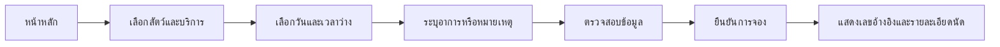
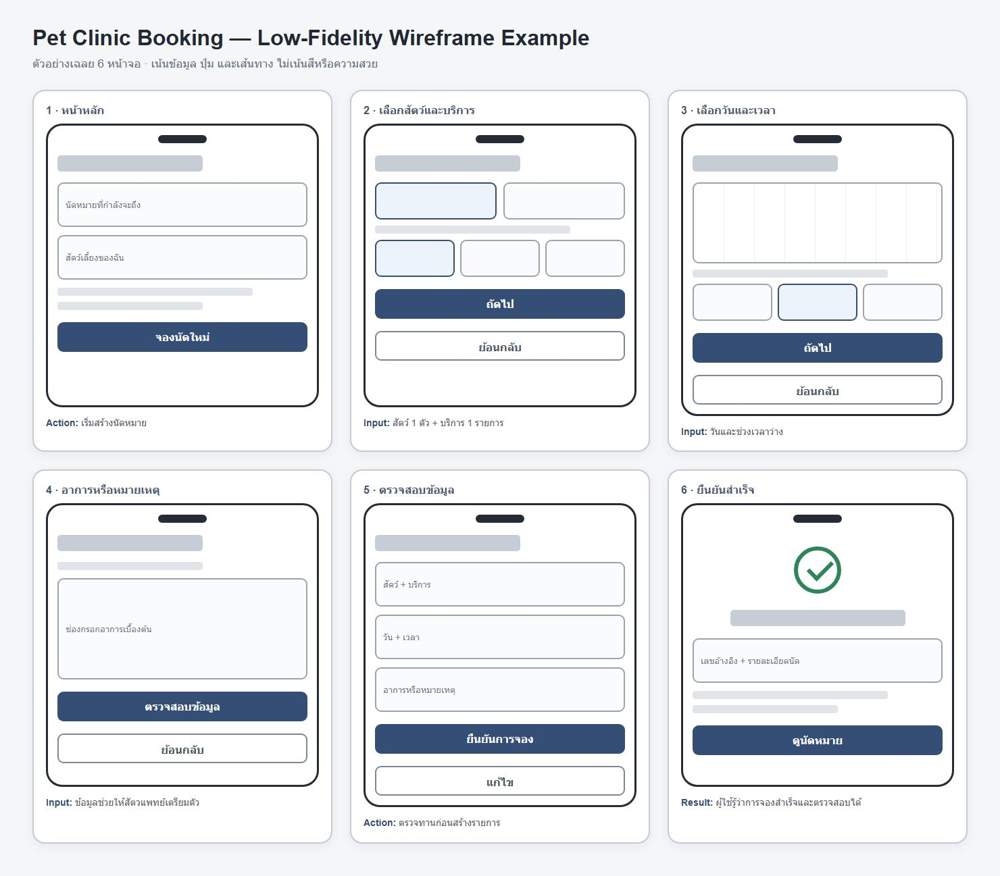

# Worked Example — Pet Clinic Booking Design

## เป้าหมาย

เอกสารนี้เป็น **ตัวอย่างเฉลยสำหรับผู้สอนใช้สาธิต** ว่าจะเปลี่ยน Interview Evidence และ Requirements ให้เป็น User Flow กับ Wireframe ได้อย่างไร นักศึกษาอ่านตัวอย่างนี้ก่อนเริ่ม LAB 003 แต่ไม่ต้องส่งงานจากระบบ Pet Clinic Booking

## การใช้ AI ในตัวอย่าง

สามารถใช้ **Codex, ChatGPT หรือ AI Tool อื่น** ช่วยระดมความคิด ตรวจความครบของ Flow หรือสร้างภาพร่าง Wireframe ได้ แต่ผู้เรียนต้อง:

- ตรวจและแก้ผลลัพธ์ให้ตรงกับ Evidence และ Requirements ของโจทย์
- ตัดสินใจด้วยตนเองว่าเลือกหน้าจอและขั้นตอนใด พร้อมอธิบายเหตุผลได้
- ระบุสั้น ๆ ว่าใช้เครื่องมือใดช่วยงานส่วนใด
- ไม่ส่งคำตอบจาก AI โดยไม่อ่านหรือไม่สามารถอธิบายได้

> ข้อมูลสัมภาษณ์ด้านล่างเป็น **สถานการณ์จำลองเพื่อการเรียน** ไม่ใช่ผลวิจัยภาคสนาม และห้ามนำไปอ้างว่าเป็นหลักฐานจากผู้ใช้จริง

## สถานการณ์

คลินิกสัตวแพทย์ขนาดเล็กรับจองผ่านโทรศัพท์และแชต เจ้าของสัตว์ไม่เห็นเวลาว่าง ต้องรอพนักงานตอบ และบางครั้งเกิดการจองเวลาซ้ำ ทีมต้องออกแบบระบบที่ช่วยให้เจ้าของสัตว์เลือกสัตว์ บริการ และช่วงเวลาว่างได้ พร้อมให้คลินิกติดตามนัดหมาย

## ชุดข้อมูลสัมภาษณ์จำลอง

### ผู้ให้ข้อมูล A — เจ้าของสุนัข

- มักจองนอกเวลาทำการและไม่อยากรอข้อความตอบกลับ
- ต้องการเห็นช่วงเวลาว่างก่อนเลือก
- กังวลว่ากดจองแล้วคลินิกไม่ได้รับรายการ
- ต้องการยกเลิกหรือเปลี่ยนเวลาจากหน้าเดียวกัน

### ผู้ให้ข้อมูล B — เจ้าของแมวสูงอายุ

- มีสัตว์มากกว่าหนึ่งตัวและจำประวัติการนัดหมายได้ยาก
- ต้องการระบุอาการเบื้องต้นให้สัตวแพทย์เตรียมตัว
- ต้องการข้อความยืนยันที่บอกชื่อสัตว์ บริการ วัน และเวลาอย่างชัดเจน

### ผู้ให้ข้อมูล C — พนักงานหน้าคลินิก

- ต้องเปิดหลายช่องทางเพื่อรวบรวมการจอง
- การตรวจเวลาว่างด้วยมือทำให้เกิดรายการซ้ำ
- ต้องการดูตารางนัดทั้งหมดและเปลี่ยนสถานะได้
- ต้องการค้นหาจากชื่อเจ้าของ ชื่อสัตว์ หรือวันที่

### ผู้ให้ข้อมูล D — สัตวแพทย์

- ต้องการรู้เหตุผลการเข้าพบก่อนเริ่มตรวจ
- ไม่ต้องการให้ผู้ใช้จองช่วงที่ไม่เปิดบริการหรือช่วงที่เต็มแล้ว
- ต้องการเห็นรายการของตนตามลำดับเวลา

## หลักฐานที่ผู้เรียนต้องสกัด

สร้างตารางอย่างน้อย 5 แถว โดยใช้คอลัมน์ต่อไปนี้:

| Interview evidence | Pain point / Need | Insight | Design implication |
|---|---|---|---|
| “ต้องรอข้อความตอบกลับ” | ไม่เห็นเวลาว่างทันที | การจองต้องทำเองได้ | แสดง Available slots แบบเลือกได้ |

ห้ามเพิ่มข้อสรุปที่ไม่มีข้อมูลรองรับ หากจำเป็นต้องตั้งสมมติฐาน ให้ติดป้าย `Assumption` และระบุวิธีตรวจสอบ

## User Stories ตั้งต้น

1. ในฐานะเจ้าของสัตว์ ฉันต้องการดูช่วงเวลาว่าง เพื่อเลือกเวลาที่สะดวกโดยไม่ต้องรอพนักงาน
2. ในฐานะเจ้าของสัตว์ ฉันต้องการจองบริการให้สัตว์ของฉัน เพื่อได้รับรายการยืนยันที่ตรวจสอบได้
3. ในฐานะเจ้าของสัตว์ ฉันต้องการดูและยกเลิกนัด เพื่อจัดการเมื่อแผนเปลี่ยน
4. ในฐานะพนักงานคลินิก ฉันต้องการดูตารางนัดรวม เพื่อจัดการงานประจำวันและหลีกเลี่ยงการจองซ้ำ
5. ในฐานะพนักงานคลินิก ฉันต้องการเปลี่ยนสถานะนัด เพื่อให้ข้อมูลตรงกับการให้บริการจริง

ผู้เรียนต้องปรับถ้อยคำและเขียน Acceptance Criteria ของแต่ละ Story ในรูปแบบ `Given / When / Then`

## Functional Requirements

- **FR-01** ระบบต้องให้เจ้าของสัตว์เลือกสัตว์ บริการ วันที่ และช่วงเวลาว่างก่อนยืนยัน
- **FR-02** ระบบต้องป้องกันการจองช่วงเวลาเดียวกันซ้ำ
- **FR-03** ระบบต้องสร้างเลขอ้างอิงและแสดงรายละเอียดหลังจองสำเร็จ
- **FR-04** ระบบต้องให้ผู้ใช้ดูรายการนัดหมายของตน
- **FR-05** ระบบต้องให้ผู้ใช้ยกเลิกนัดที่ยังไม่เริ่ม พร้อมบันทึกสถานะ
- **FR-06** ระบบต้องให้พนักงานดู ค้นหา และกรองนัดหมาย
- **FR-07** ระบบต้องให้พนักงานเปลี่ยนสถานะ `BOOKED → CONFIRMED → COMPLETED` หรือ `CANCELLED`
- **FR-08** ระบบต้องแจ้ง Error ที่เข้าใจได้เมื่อข้อมูลไม่ครบ ช่วงเวลาเต็ม หรือไม่พบรายการ

## Non-functional Requirements

- **NFR-01 — Usability:** ผู้ใช้ต้องเข้าใจว่าต้องกรอกอะไร อยู่ขั้นตอนไหน และจองสำเร็จหรือไม่
- **NFR-02 — Accessibility:** ข้อความและปุ่มสำคัญต้องอ่านง่าย และห้ามใช้สีเพียงอย่างเดียวเพื่อสื่อสถานะ
- **NFR-03 — Consistency:** คำเรียก สถานะ และรูปแบบการนำทางต้องสอดคล้องกันทุกหน้าจอ
- **NFR-04 — Error clarity:** เมื่อทำรายการไม่ได้ ระบบต้องบอกสาเหตุและทางเลือกถัดไปด้วยภาษาที่ผู้ใช้เข้าใจ

## ตัวอย่างเฉลย

### 1. Evidence → Design Decision

| Evidence | สิ่งที่พบ | การตัดสินใจออกแบบ |
|---|---|---|
| เจ้าของสัตว์ไม่อยากรอข้อความตอบกลับ | ต้องเห็นเวลาว่างด้วยตนเอง | แสดงช่วงเวลาว่างก่อนเข้าสู่หน้ายืนยัน |
| เจ้าของมีสัตว์มากกว่าหนึ่งตัว | ต้องระบุว่านัดนี้เป็นของสัตว์ตัวใด | มีขั้นเลือกสัตว์ก่อนเลือกบริการ |
| พนักงานพบรายการจองซ้ำ | ต้องทบทวนข้อมูลก่อนสร้างนัด | มีหน้า Review แสดงสัตว์ บริการ วัน และเวลา |
| สัตวแพทย์ต้องรู้เหตุผลการเข้าพบ | ต้องส่งข้อมูลเตรียมการล่วงหน้า | เพิ่มช่องอาการหรือหมายเหตุใน Flow |

### 2. User Flow ตัวอย่าง

| Step | Screen | สิ่งที่ผู้ใช้เห็น | Action | หน้าถัดไป |
|---:|---|---|---|---|
| 1 | หน้าหลัก | นัดหมายที่กำลังจะถึง | กดจองนัดใหม่ | เลือกสัตว์และบริการ |
| 2 | เลือกสัตว์และบริการ | รายชื่อสัตว์และประเภทบริการ | เลือกสัตว์ 1 ตัวและบริการ 1 รายการ | เลือกวันและเวลา |
| 3 | เลือกวันและเวลา | ปฏิทินและช่วงเวลาว่าง | เลือกวันกับเวลา | อาการหรือหมายเหตุ |
| 4 | อาการหรือหมายเหตุ | ช่องกรอกอาการเบื้องต้น | กรอกข้อมูลและกดตรวจสอบ | ตรวจสอบข้อมูล |
| 5 | ตรวจสอบข้อมูล | สัตว์ บริการ วัน เวลา และหมายเหตุ | แก้ไขหรือยืนยัน | ยืนยันสำเร็จ |
| 6 | ยืนยันสำเร็จ | เลขอ้างอิงและรายละเอียดนัด | ดูรายการนัดหมาย | หน้ารายการนัด |

### 3. Wireframe ตัวอย่าง

[เปิดตัวอย่าง Wireframe แบบ HTML](pet-clinic-wireframe-example.html)

ตัวอย่างกำหนดหน้าจอ 6 หน้า โดยทุกหน้าต้องตรงกับ User Flow:

| หน้าจอ | ข้อมูลสำคัญ | Action หลัก |
|---|---|---|
| หน้าหลัก | นัดหมายที่กำลังจะถึง | เริ่มจองนัดใหม่ |
| เลือกสัตว์และบริการ | รายชื่อสัตว์ ประเภทบริการ | เลือกและไปต่อ |
| เลือกวันและเวลา | ปฏิทิน ช่วงเวลาว่าง | เลือกเวลา |
| รายละเอียด | อาการเบื้องต้น หมายเหตุ | กรอกข้อมูล |
| ตรวจสอบข้อมูล | สัตว์ บริการ วัน เวลา | ย้อนกลับหรือยืนยัน |
| ยืนยันสำเร็จ | เลขอ้างอิงและสรุปนัด | ดูนัดหมาย |

Wireframe ไม่ต้องสวยหรือทำงานจริง สิ่งสำคัญคือเห็นข้อมูล ปุ่ม และทางไปหน้าถัดไปอย่างชัดเจน

### 4. สิ่งที่ควรเรียนรู้จากตัวอย่าง

- Evidence แต่ละข้อควรนำไปสู่การตัดสินใจออกแบบที่อธิบายได้
- User Flow แสดงลำดับการทำงาน ไม่ใช่เพียงรายชื่อ Feature
- Wireframe ต้องตรงกับ Flow และช่วยให้เห็นว่าผู้ใช้ทำอะไรในแต่ละหน้า
- LAB 003 จะเปลี่ยนเป็นโจทย์ Lost Pet Finder ซึ่งนักศึกษาต้องออกแบบคำตอบด้วยตนเอง
