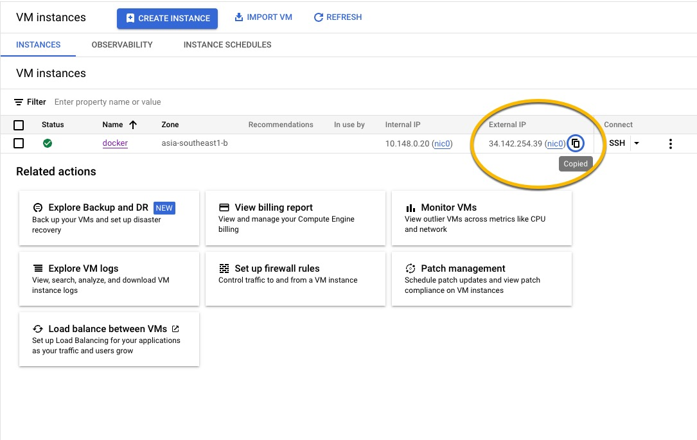
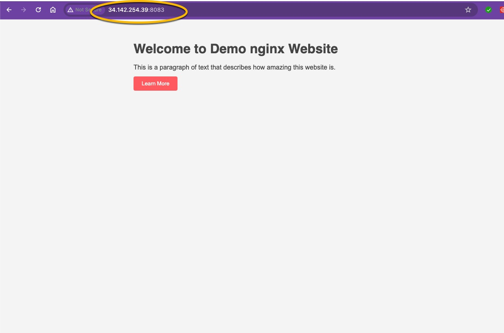

|  |  |
|:---:|:---:|


## create directory

   
    mkdir LAB4_Nginx_Volume_Port_Mapping
    cd    LAB4_Nginx_Volume_Port_Mapping


## git clone branch dev
    
    
   
    git clone -b dev https://github.com/Tuchsanai/DevTools.git

   
    cd DevTools/02_Docker/Week08/LAB4_Nginx_Volume_Port_Mapping


## 2 Run Nginx with port mapping and volume mapping

```

docker run -d -p 8083:80 -v ${PWD}/web_demo:/usr/share/nginx/html:ro  nginx

```


