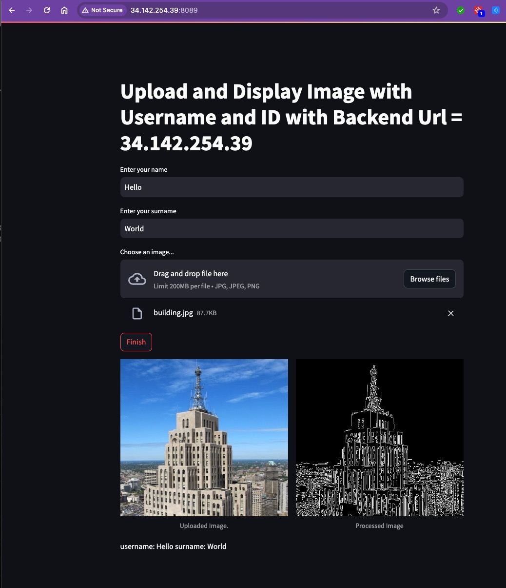

# Build and run the container as before:

## create directory

   
    mkdir LAB4_Week9_Frontend
    cd    LAB4_Week9_Frontend
    

## git clone branch dev
    
    
   ```
    git clone -b dev https://github.com/Tuchsanai/DevTools.git
   ```
   
   ```   
    cd DevTools/02_Docker/Week09/Lab4/frontend
   ```


1. **Build the Docker Image**:
   ```bash
   docker build -t streamlit-app_lab5  .
   ```

2. **Run the Docker Container**:
   ```bash
   docker run -d --rm -p 8089:8501 -v  ./:/app -e BACKEND_URL=34.142.254.39  streamlit-app_lab5 
   ```





