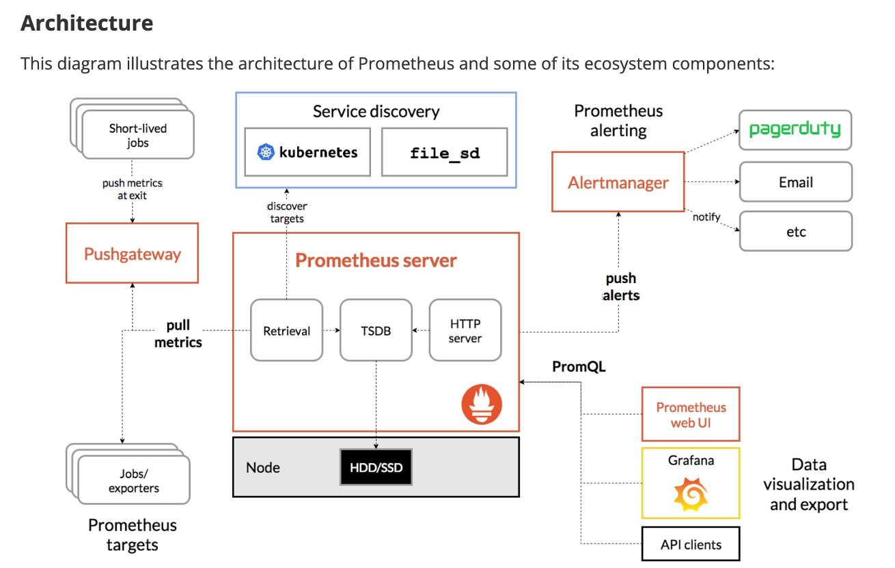
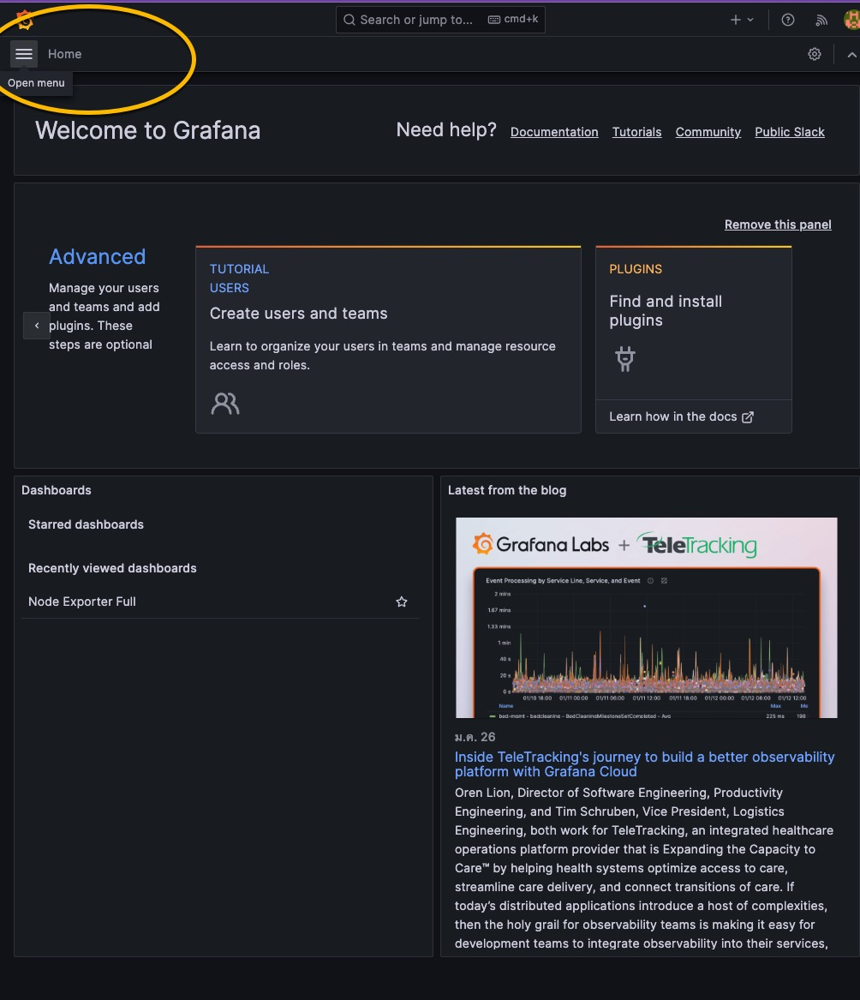

| Column 1 | Column 2 |
|----------|----------|
|     |     |


To set up monitoring for server performance using Prometheus, Grafana, and Node Exporter in Docker containers, follow these steps.


## create directory

   
    mkdir LAB3_CPU_Week10
    cd    LAB3_CPU_Week10
    

## git clone branch dev
    
    
   ```
    git clone -b dev https://github.com/Tuchsanai/DevTools.git
   ```
   
   ```   
    cd DevTools/02_Docker/Week10/03_Mornitoring/
   ```


### Step 1: Create a Docker Network
First, create a Docker network to connect the containers:
```bash
docker network create monitoring
```

### Step 2: Run Node Exporter abd Prometheus
Run Node Exporter in a Docker container:
```bash
docker run -d --name=node-exporter --net=monitoring prom/node-exporter
```


Run Prometheus in a Docker container, mounting the configuration file:
```bash
docker run -d --name=prometheus --net=monitoring -p 9090:9090 -v $(pwd)/prometheus.yml:/etc/prometheus/prometheus.yml prom/prometheus
```


### Step 4: Grafana Configuration

Run Grafana, mounting the configuration files and dashboard directory:

```bash
docker run -d --name=grafana --net=monitoring -p 3000:3000 -v $(pwd)/datasources.yaml:/etc/grafana/provisioning/datasources/datasources.yaml -v $(pwd)/dashboards.yaml:/etc/grafana/provisioning/dashboards/dashboards.yaml -v $(pwd)/grafana-dashboards:/var/lib/grafana/dashboards grafana/grafana
```
### Test Monitoring
- Grafana will be available at `http://localhost:3000` (default login is `admin`/`admin`, which you'll be prompted to change). 

| Step 1 | Step 2 | Step  3 |
|-----------|-----------|-----------|
|  |  | |
| Step 4 | Step 5 | end |
|  |  |   | 


### Accessing the Services
- **Prometheus:** Access Prometheus at `http://localhost:9090`
- **Grafana:** Access Grafana at `http://localhost:3000` (default login is `admin`/`admin`, which you'll be prompted to change)

This setup will get you started with monitoring server performance using Docker containers for Prometheus, Grafana, and Node Exporter. Remember, you might need to adjust firewall rules or Docker settings depending on your server configuration.


# Delete all containers

```
docker stop $(docker ps -a -q)  
docker rm $(docker ps -a -q) 
docker rmi $(docker images -q) 
docker volume rm $(docker volume ls -q)  
docker network prune -f
```
