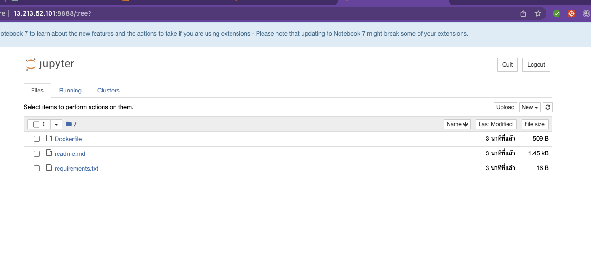

# LAB Basic example of a Dockerfile for creating a lab environment with Python, Jupyter, and some essential data science libraries:


### A Dockerfile is a script that contains instructions to build a Docker image. Here's a basic example of a Dockerfile for creating a lab environment with Python, Jupyter, and some essential data science libraries:




```
FROM python:3.9-slim

# Set the working directory
WORKDIR /app
COPY requirements.txt . 

# Install system dependencies
RUN apt-get update

# Install Python dependencies

RUN pip install  -r requirements.txt

# Set environment variables
ENV LANG=C.UTF-8 \
    LC_ALL=C.UTF-8 \
    JUPYTER_TOKEN=my_token \
    JUPYTER_PORT=8888

# Expose the Jupyter port
EXPOSE ${JUPYTER_PORT}

# Start Jupyter Notebook
CMD ["jupyter", "notebook", "--ip=0.0.0.0", "--port=${JUPYTER_PORT}", "--no-browser", "--allow-root", "--NotebookApp.token=${JUPYTER_TOKEN}"]


```


### Step 1:

#### Clone

```
git clone https://github.com/Tuchsanai/devopt_week10.git
```

#### go to Directory
```
cd devopt_week10/1_Lab_Dockerfile/
```

### Step 2:

###  To build the Docker image, save the Dockerfile and the requirements.txt file in the same directory, navigate to that directory in the terminal, and run:

```
docker build -t my_lab .

```

### Step 3:

###  After the image has been built, you can run a Docker container using the following command:

```
docker run -it --rm -p 8888:8888 -v "$(pwd)":/app my_lab

```