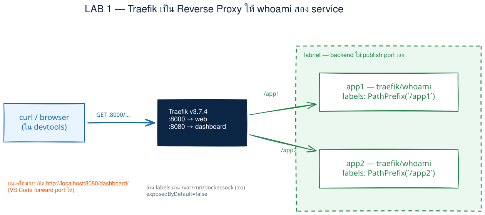
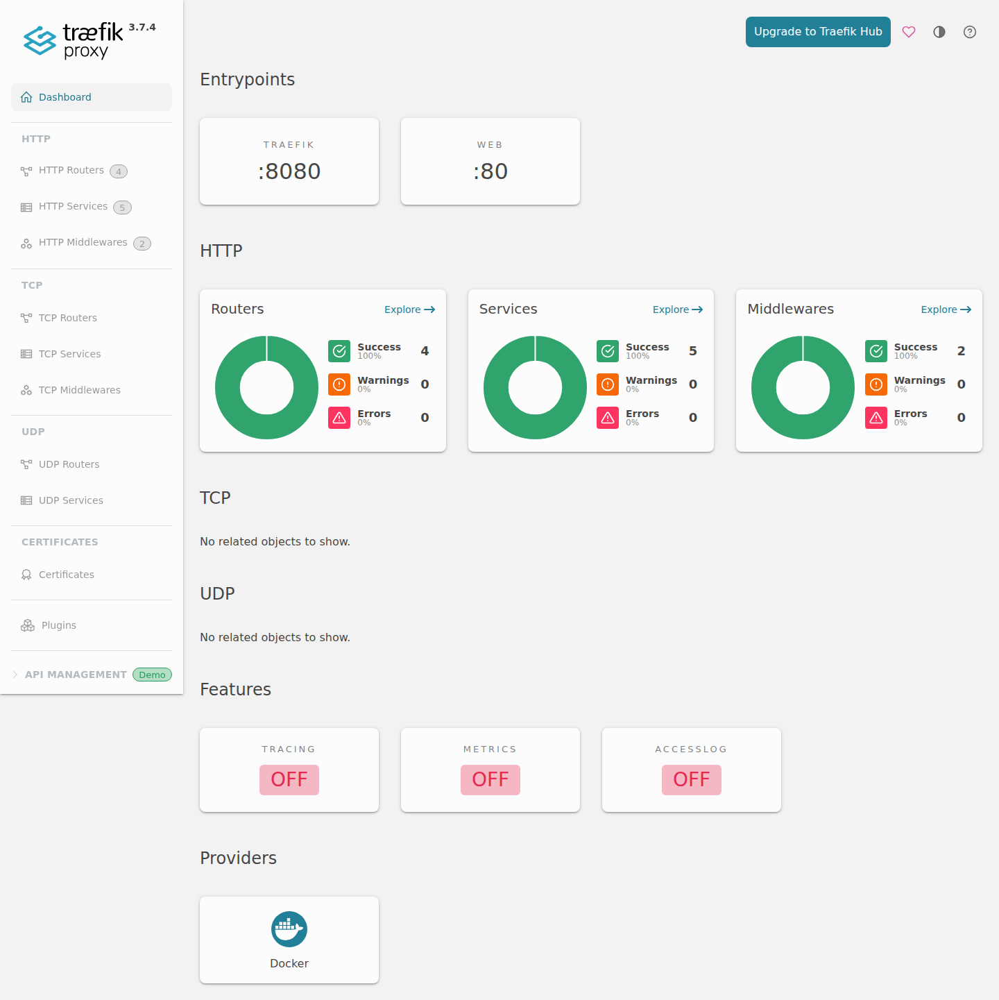
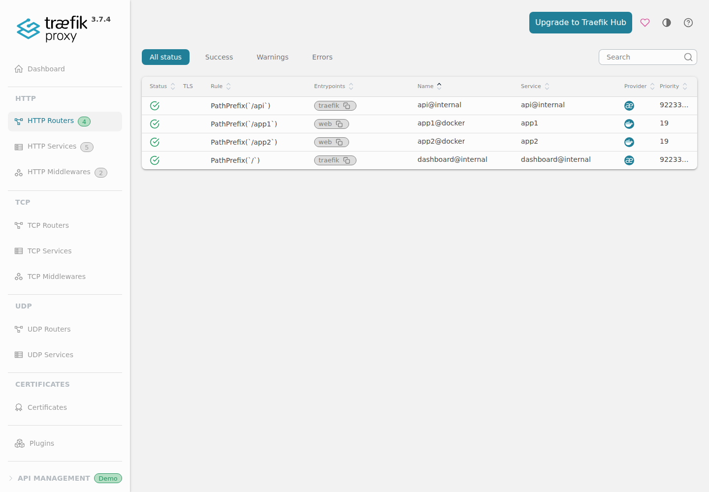

# LAB 1 — Traefik Reverse Proxy พื้นฐาน: ประตูหน้าบ้านของหลาย Backend

> โฟลเดอร์ `001_LAB_Traefik_Reverse_Proxy` = **LAB 1** ของชุด Traefik
> (ไฟล์ของแล็บนี้: `docker-compose.direct.yml` · `docker-compose.yml` · `docker-compose.host.yml` · `docker-compose.disabled.yml`)

## สิ่งที่จะได้เรียนรู้

- เห็น pain point ของการเปิด backend ตรง ๆ: มี 2 service ก็ต้องจำ 2 port และจำนวน port โตตามจำนวน service
- ใช้ Traefik เป็น **Reverse Proxy** — รับ request ที่ประตูหน้า port `8000` แล้วส่งต่อไป backend ที่ถูกต้อง
- route ด้วย `PathPrefix`: `/app1` ไป `app1` และ `/app2` ไป `app2`
- พิสูจน์ว่า backend ไม่ต้อง publish port ออกมาที่เครื่องเรียนเลย แต่ยังเข้าถึงผ่าน Traefik ได้
- อ่าน `Hostname`, `X-Forwarded-For`, `X-Forwarded-Host` และ `X-Real-Ip` จากคำตอบของ `whoami`
- อ่าน Dashboard: Routers · Services · Provider `docker`
- ทดลอง Host-based routing ด้วย `Host: app1.lab` และเข้าใจว่า TCP port forwarding ไม่แก้ HTTP Host header
- ทดลองปิด `traefik.enable` เพื่อเห็นผลของ `exposedByDefault=false` แบบจับต้องได้

## ภาพรวมของแล็บนี้

1. **เริ่มโดยไม่มี proxy** — เปิด `app1` ที่ port `8001` และ `app2` ที่ `8002`
2. **ชี้ pain point** — ผู้ใช้ต้องรู้ว่า service ไหนอยู่ port ไหน และทุก backend ต้องเปิด port เพิ่ม
3. **เปลี่ยนมาใช้ Traefik** — เปิดประตูหน้าเดียวที่ port `8000` แล้วเลือก backend จาก path
4. **ตรวจ port และ proxy headers** — backend เหลือเพียง port ภายใน แต่รับข้อมูลต้นทางที่ proxy แนบมาให้
5. **เปิด Dashboard** — ดูความสัมพันธ์ Router → Service และยืนยันว่า config มาจาก Docker provider
6. **เพิ่ม Host router** — `Host: app1.lab` เข้า `app1` ได้ แต่ request ที่ Host ไม่ตรงได้ 404
7. **ทดลองให้พังแล้วแก้** — ปิด `traefik.enable` ของ `app2` จน router หาย แล้วเปิดกลับ
8. **เก็บกวาดและรันซ้ำ** — `down → up` เพื่อพิสูจน์ว่าเริ่มใหม่สะอาดได้ ก่อน `down` ปิดท้าย



> **คำถามก่อนเริ่ม:** ถ้ามี backend 20 ตัว เราควรให้ผู้ใช้จำ 20 port หรือให้ผู้ใช้เข้าประตูหน้าเดียวแล้วให้ระบบเลือกปลายทาง? แล็บนี้จะพิสูจน์คำตอบด้วย container จริง

แล็บนี้ใช้ terminal เดียว ทุกคำสั่งตั้งแต่ข้อ 1 เป็นต้นไปให้รัน **ข้างในเครื่องเรียน** ผ่าน VS Code Remote-SSH

---

## 0. เตรียมเครื่องเรียน

ทำบนเครื่องของเราเอง — เปิด classroom container ที่มี Docker พร้อมใช้ แล้ว SSH เข้าไป:

```bash
docker start devtools 2>/dev/null || \
  docker run -dit --name devtools --privileged -p 2222:22 tuchsanai/devtools:2569_1
ssh root@localhost -p 2222        # password : passwd
```

> 📝 **คำอธิบาย:** `docker start ... || docker run ...` ใช้เครื่องเรียนเดิมถ้ามี และสร้างใหม่เฉพาะเมื่อยังไม่มี · `-dit` รันเบื้องหลังพร้อม terminal · `--name devtools` ตั้งชื่อคงที่ · `--privileged` จำเป็นสำหรับรัน Docker ซ้อนข้างใน classroom container · `-p 2222:22` ส่ง port SSH จากเครื่องเราเข้า port 22 ของกล่อง · หลัง SSH แล้ว prompt จะเป็นฝั่งเครื่องเรียน ซึ่งเป็นที่รันคำสั่ง Docker ทั้งหมดของ LAB
>
> ⚠️ `--privileged` ให้สิทธิ์สูงมาก ใช้เฉพาะ disposable classroom container นี้ ห้ามนำรูปแบบนี้ไปใช้กับ production workload

ใน VS Code แนะนำให้ใช้ **Remote-SSH** ต่อ `root@localhost:2222` แล้วเปิดโฟลเดอร์ `~/labwork/DevTools` เพื่อแก้ไฟล์และเปิด terminal ในเครื่องเรียนโดยตรง

ตรวจว่า Docker CLI คุยกับ daemon ชั้นในได้:

```bash
docker --version
docker info --format 'Docker daemon: {{.ServerVersion}}'
```

> 📝 **คำอธิบาย:** บรรทัดแรกดูเวอร์ชัน CLI ส่วน `docker info` ถาม daemon จริง จึงแยกได้ระหว่าง “ติดตั้งคำสั่ง Docker แล้ว” กับ “daemon พร้อมรับคำสั่งแล้ว” · ถ้าพบ `Cannot connect to the Docker daemon` ให้รอสักครู่แล้วลองใหม่ หรือย้อนตรวจว่า SSH เข้ามาในเครื่องเรียนแล้ว

✅ **Expected output** — ต้องมีเลขเวอร์ชันครบสองบรรทัด (เลขเวอร์ชันและ build อาจเปลี่ยนตาม image ห้องเรียน):

```text
Docker version 29.6.2, build dfc4efb
Docker daemon: 29.6.2
```

---

## 1. Clone โค้ดแล็บ

```bash
mkdir -p ~/labwork && cd ~/labwork
git clone https://github.com/Tuchsanai/DevTools.git
cd DevTools/03_Application_Docker/01_Traefik_Reverse_Proxy_Gateway_LB/001_LAB_Traefik_Reverse_Proxy
```

> 📝 **คำอธิบาย:** `mkdir -p` สร้างพื้นที่ทำงานโดยไม่ error ถ้ามีอยู่แล้ว · `git clone` ดึงไฟล์ของหลักสูตร · `cd` เข้า LAB นี้ให้ถูกโฟลเดอร์ก่อนใช้ Compose · ถ้าเคย clone repository ไว้แล้ว ให้ข้าม `git clone` แล้ว `cd` เข้า path เดิมได้เลย

ดึง image ที่ pin เวอร์ชันไว้ก่อนเริ่ม เพื่อแยกขั้น download ออกจากขั้นสร้าง container:

```bash
docker compose -f docker-compose.direct.yml pull --quiet
docker compose pull --quiet
```

> 📝 **คำอธิบาย:** ไฟล์แรกต้องใช้ `traefik/whoami:v1.11` ส่วน compose หลักใช้ทั้ง `traefik/whoami:v1.11` และ `traefik:v3.7.4` · `--quiet` ลดรายละเอียดแต่ Compose รุ่นนี้ยังรายงานสถานะ Pulling/Pulled · การ pin tag ทำให้ทั้งห้องใช้เวอร์ชันเดียวกัน

✅ **Expected output** — รอบทดสอบจริงได้สถานะต่อไปนี้; ถ้ามี image อยู่แล้วอาจจบเร็วกว่า:

```text
 Image traefik/whoami:v1.11 Pulling
 Image traefik/whoami:v1.11 Pulled
 Image traefik:v3.7.4 Pulling
 Image traefik/whoami:v1.11 Pulling
 Image traefik/whoami:v1.11 Pulled
 Image traefik:v3.7.4 Pulled
```

---

## 2. ก่อนมี Proxy — สอง Backend ต้องเปิดคนละ Port

เปิด `app1` และ `app2` ตรง ๆ ด้วยไฟล์ `docker-compose.direct.yml`:

```bash
docker compose -f docker-compose.direct.yml up -d
```

> 📝 **คำอธิบาย:** `-f` เลือก compose สำหรับสถานการณ์ “ยังไม่มี proxy” · `up` สร้าง network และ container · `-d` รันเบื้องหลังเพื่อให้ terminal ใช้ต่อได้ · ไฟล์นี้ map `8001:80` ให้ `app1` และ `8002:80` ให้ `app2` ดังนั้น backend ทุกตัวเปิดประตูถึง host โดยตรง

✅ **Expected output** — Compose สร้าง network `labnet` และ backend สองตัว (ลำดับบรรทัดอาจสลับกัน):

```text
 Network labnet Creating
 Network labnet Created
 Container 001_lab_traefik_reverse_proxy-app2-1 Creating
 Container 001_lab_traefik_reverse_proxy-app1-1 Creating
 Container 001_lab_traefik_reverse_proxy-app2-1 Created
 Container 001_lab_traefik_reverse_proxy-app1-1 Created
 Container 001_lab_traefik_reverse_proxy-app2-1 Starting
 Container 001_lab_traefik_reverse_proxy-app1-1 Starting
 Container 001_lab_traefik_reverse_proxy-app1-1 Started
 Container 001_lab_traefik_reverse_proxy-app2-1 Started
```

ดู port ที่ต้องเปิด แล้วเรียก backend ทั้งสอง:

```bash
docker compose -f docker-compose.direct.yml ps
curl -s http://localhost:8001/
curl -s http://localhost:8002/
```

> 📝 **คำอธิบาย:** `docker compose ps` แสดง container ของ compose ชุดนี้พร้อม port mapping · ลูกศร `8001->80` และ `8002->80` หมายถึง client เข้าถึง backend โดยตรงคนละ port · `curl -s` ปิด progress meter เพื่อเหลือคำตอบจาก `whoami` ล้วน ๆ · `Hostname` ต่างกันยืนยันว่าเป็นคนละ container

✅ **Expected output** — ต้องเห็น mapping สอง port และ Hostname สองค่า (container ID, Hostname, IP, RemoteAddr และเวลาไม่ตรงกันได้):

```text
NAME                                   IMAGE                  COMMAND     SERVICE   CREATED                  STATUS                  PORTS
001_lab_traefik_reverse_proxy-app1-1   traefik/whoami:v1.11   "/whoami"   app1      Less than a second ago   Up Less than a second   0.0.0.0:8001->80/tcp, [::]:8001->80/tcp
001_lab_traefik_reverse_proxy-app2-1   traefik/whoami:v1.11   "/whoami"   app2      Less than a second ago   Up Less than a second   0.0.0.0:8002->80/tcp, [::]:8002->80/tcp
Hostname: e41318304c7e
IP: 127.0.0.1
IP: ::1
IP: 172.19.0.2
RemoteAddr: 172.19.0.1:60218
GET / HTTP/1.1
Host: localhost:8001
User-Agent: curl/8.5.0
Accept: */*

Hostname: 3aa88e33e09c
IP: 127.0.0.1
IP: ::1
IP: 172.19.0.3
RemoteAddr: 172.19.0.1:35980
GET / HTTP/1.1
Host: localhost:8002
User-Agent: curl/8.5.0
Accept: */*
```

> **Pain point ที่พิสูจน์แล้ว:** แค่ 2 backend ก็ต้องเปิดและจำ 2 port ถ้ามี 20 backend ปัญหาจะโตเป็น 20 port และยังไม่มีจุดกลางสำหรับ routing, logging หรือ policy

ปิดรูปแบบ direct ก่อนเปลี่ยนสถาปัตยกรรม เพื่อคืน port และ network ให้ compose หลัก:

```bash
docker compose -f docker-compose.direct.yml down
```

> 📝 **คำอธิบาย:** `down` หยุดและลบ container พร้อม network ที่ compose สร้าง จึงไม่ทิ้ง resource ชุด direct ไว้ชนกับชุด reverse proxy · image ยังอยู่และนำกลับมาใช้ได้ ไม่ต้อง pull ซ้ำ

✅ **Expected output** — backend ทั้งสองและ `labnet` ถูกลบ (ลำดับหยุดอาจต่างกัน):

```text
 Container 001_lab_traefik_reverse_proxy-app2-1 Stopping
 Container 001_lab_traefik_reverse_proxy-app1-1 Stopping
 Container 001_lab_traefik_reverse_proxy-app1-1 Stopped
 Container 001_lab_traefik_reverse_proxy-app1-1 Removing
 Container 001_lab_traefik_reverse_proxy-app1-1 Removed
 Container 001_lab_traefik_reverse_proxy-app2-1 Stopped
 Container 001_lab_traefik_reverse_proxy-app2-1 Removing
 Container 001_lab_traefik_reverse_proxy-app2-1 Removed
 Network labnet Removing
 Network labnet Removed
```

---

## 3. เพิ่ม Traefik — ประตูหน้าเดียว Route ด้วย Path

ส่วนสำคัญของ `docker-compose.yml` เป็นดังนี้:

```yaml
services:
  traefik:
    image: traefik:v3.7.4
    command:
      - --providers.docker=true
      - --providers.docker.exposedByDefault=false
      - --api.insecure=true
      - --entrypoints.web.address=:80
    ports:
      - "8000:80"
      - "8080:8080"
    volumes:
      - /var/run/docker.sock:/var/run/docker.sock:ro
    networks:
      - labnet

  app1:
    image: traefik/whoami:v1.11
    labels:
      traefik.enable: "true"
      traefik.docker.network: labnet
      traefik.http.routers.app1.entrypoints: web
      traefik.http.routers.app1.rule: PathPrefix(`/app1`)
      traefik.http.routers.app1.service: app1
      traefik.http.services.app1.loadbalancer.server.port: "80"
    networks:
      - labnet
```

> 📝 **คำอธิบาย:** `providers.docker=true` ให้ Traefik อ่าน labels จาก Docker · `exposedByDefault=false` ใช้หลัก deny by default: container จะไม่ถูก route จนมี `traefik.enable=true` · entrypoint `web` ฟัง port 80 ภายในและ publish เป็น `8000` · Dashboard ใช้ `8080` · `PathPrefix(`/app1`)` จับทั้ง `/app1` และ path ที่ต่อท้าย · เราไม่ใช้ stripPrefix เพราะ `whoami` ตอบได้ทุก path และการเห็น `GET /app1` ที่ backend ช่วยพิสูจน์ว่า proxy ส่ง path เดิมต่อไป
>
> `traefik.http.services.app1.loadbalancer.server.port=80` บอก port ภายในของ backend อย่างชัดเจน แม้ image จะประกาศ port ไว้แล้ว · `traefik.docker.network=labnet` กัน Traefik เลือก network ผิดเมื่อ container มีหลาย network · `labnet` ใช้ `name: labnet` ให้ชื่อคงที่และทุก service อยู่ network เดียวกัน
>
> ⚠️ `--api.insecure=true` เปิด Dashboard โดยไม่มีการยืนยันตัวตน ใช้เฉพาะ LAB; production ต้อง route dashboard อย่างปลอดภัยและใส่ auth/TLS · การ mount `/var/run/docker.sock:ro` ทำให้ไฟล์ mount เป็น read-only แต่ **ไม่ได้ทำให้ Docker API เป็น read-only** — ผู้ที่เข้าถึง socket ยังมีอำนาจควบคุม daemon ได้ จึงไม่ควร mount ตรงแบบนี้ใน production โดยไม่มีมาตรการแยกสิทธิ์

เปิด reverse proxy และรอจน route แรกพร้อม:

```bash
docker compose up -d
for i in $(seq 1 60); do
  curl -fsS http://localhost:8000/app1 >/dev/null 2>&1 && break
  sleep 1
done
```

> 📝 **คำอธิบาย:** `docker compose up -d` เปิด Traefik, `app1`, `app2` พร้อม network · loop ใช้ `curl -f` ซึ่งคืน error เมื่อ HTTP ไม่ใช่ 2xx/3xx แล้วลองซ้ำทุก 1 วินาที ป้องกัน race ที่ container ขึ้นแล้วแต่ Traefik ยังโหลด config ไม่เสร็จ · เพดาน 60 รอบ (~1 นาที) กัน loop ค้างไม่รู้จบเมื่อระบบผิดจริง — ถ้าครบแล้วยังไม่ได้ 200 ให้ไปดู `docker compose logs traefik` · redirect ทั้ง stdout/stderr ไป `/dev/null` เพราะใช้เป็น readiness check ไม่ใช่ผลทดลอง

✅ **Expected output** — คำสั่ง `up` สร้าง 3 container ส่วน readiness loop สำเร็จแบบเงียบ ๆ (ลำดับ container อาจสลับกัน):

```text
 Network labnet Creating
 Network labnet Created
 Container 001_lab_traefik_reverse_proxy-traefik-1 Creating
 Container 001_lab_traefik_reverse_proxy-app2-1 Creating
 Container 001_lab_traefik_reverse_proxy-app1-1 Creating
 Container 001_lab_traefik_reverse_proxy-app1-1 Created
 Container 001_lab_traefik_reverse_proxy-traefik-1 Created
 Container 001_lab_traefik_reverse_proxy-app2-1 Created
 Container 001_lab_traefik_reverse_proxy-traefik-1 Starting
 Container 001_lab_traefik_reverse_proxy-app2-1 Starting
 Container 001_lab_traefik_reverse_proxy-app1-1 Starting
 Container 001_lab_traefik_reverse_proxy-app1-1 Started
 Container 001_lab_traefik_reverse_proxy-traefik-1 Started
 Container 001_lab_traefik_reverse_proxy-app2-1 Started
```

พิสูจน์ว่าเปิด host port เฉพาะ Traefik ส่วน backend ไม่มีลูกศร port mapping:

```bash
docker compose ps
docker compose ps app1 app2
```

> 📝 **คำอธิบาย:** แถว Traefik มี `8000->80` กับ `8080->8080` เพราะเป็นประตูหน้าและ Dashboard · `app1`/`app2` แสดงเพียง `80/tcp` ไม่มี `HOST:PORT->CONTAINER:PORT` จึงเข้าจาก host โดยตรงไม่ได้ · Traefik เข้าหา port 80 ของ backend ผ่าน `labnet` ภายในแทน

✅ **Expected output** — backend ไม่มีลูกศร mapping แต่ Traefik มีสอง mapping (เวลาอาจต่างกัน):

```text
NAME                                      IMAGE                  COMMAND                  SERVICE   CREATED         STATUS        PORTS
001_lab_traefik_reverse_proxy-app1-1      traefik/whoami:v1.11   "/whoami"                app1      2 seconds ago   Up 1 second   80/tcp
001_lab_traefik_reverse_proxy-app2-1      traefik/whoami:v1.11   "/whoami"                app2      2 seconds ago   Up 1 second   80/tcp
001_lab_traefik_reverse_proxy-traefik-1   traefik:v3.7.4         "/entrypoint.sh --pr…"   traefik   2 seconds ago   Up 1 second   0.0.0.0:8080->8080/tcp, [::]:8080->8080/tcp, 0.0.0.0:8000->80/tcp, [::]:8000->80/tcp
NAME                                   IMAGE                  COMMAND     SERVICE   CREATED          STATUS          PORTS
001_lab_traefik_reverse_proxy-app1-1   traefik/whoami:v1.11   "/whoami"   app1      15 seconds ago   Up 14 seconds   80/tcp
001_lab_traefik_reverse_proxy-app2-1   traefik/whoami:v1.11   "/whoami"   app2      15 seconds ago   Up 13 seconds   80/tcp
```

---

## 4. เรียกผ่าน Proxy และอ่าน Forwarded Headers

ใช้ port เดียวกัน แต่เปลี่ยน path เพื่อเลือกคนละ backend:

```bash
curl -s http://localhost:8000/app1
curl -s http://localhost:8000/app2
curl -s -o /dev/null -w 'HTTP %{http_code}\n' http://localhost:8000/
```

> 📝 **คำอธิบาย:** request แรกตรง router `PathPrefix(`/app1`)` จึงไป service `app1`; request ที่สองตรง `/app2` จึงไป `app2` · root `/` ไม่ตรง router ของเราเลย Traefik จึงตอบ 404 · Hostname สองค่าพิสูจน์ว่าประตูหน้าเดียวส่งไปคนละ container
>
> `X-Forwarded-For` เก็บ IP ต้นทางที่ proxy เห็น · `X-Forwarded-Host` เก็บ Host เดิมที่ client ส่ง · `X-Real-Ip` บอก IP client แบบค่าเดียวที่ backend อ่านง่าย · `RemoteAddr` กลายเป็น IP ของ Traefik เพราะ TCP connection สุดท้ายมาจาก proxy ไม่ใช่ client · backend ใช้ headers เหล่านี้ทำ access log, สร้าง absolute URL, audit หรือ policy แต่ production ต้องกำหนด trusted proxies เพื่อไม่เชื่อ header ปลอมจาก client โดยตรง

✅ **Expected output** — Hostname/IP/port ชั่วคราวจะต่างกัน แต่ต้องมี proxy headers และ root ได้ 404:

```text
Hostname: dec634697ee5
IP: 127.0.0.1
IP: ::1
IP: 172.19.0.2
RemoteAddr: 172.19.0.3:49358
GET /app1 HTTP/1.1
Host: localhost:8000
User-Agent: curl/8.5.0
Accept: */*
Accept-Encoding: gzip
X-Forwarded-For: 172.19.0.1
X-Forwarded-Host: localhost:8000
X-Forwarded-Port: 8000
X-Forwarded-Proto: http
X-Forwarded-Server: 9517184b4214
X-Real-Ip: 172.19.0.1

Hostname: c1a74c4d8eb8
IP: 127.0.0.1
IP: ::1
IP: 172.19.0.4
RemoteAddr: 172.19.0.3:34390
GET /app2 HTTP/1.1
Host: localhost:8000
User-Agent: curl/8.5.0
Accept: */*
Accept-Encoding: gzip
X-Forwarded-For: 172.19.0.1
X-Forwarded-Host: localhost:8000
X-Forwarded-Port: 8000
X-Forwarded-Proto: http
X-Forwarded-Server: 9517184b4214
X-Real-Ip: 172.19.0.1

HTTP 404
```

ถาม Dashboard API เพื่อยืนยัน Router → Rule → Service → Provider แบบข้อความ:

```bash
curl -s http://localhost:8080/api/http/routers/app1@docker | \
  python3 -m json.tool | grep -E '"(name|provider|rule|service)":'
curl -s http://localhost:8080/api/http/routers/app2@docker | \
  python3 -m json.tool | grep -E '"(name|provider|rule|service)":'
```

> 📝 **คำอธิบาย:** endpoint `/api/http/routers/<name>@docker` อ่าน router รายตัว · `python3 -m json.tool` จัด JSON ให้อ่านง่ายโดยใช้ Python ที่มีในเครื่องอยู่แล้ว · `grep -E` เหลือ 4 field ที่อธิบายสายงานได้ครบ: ชื่อ router, rule, service ปลายทาง และ provider ที่สร้าง config

✅ **Expected output** — ต้องเห็น `app1 → /app1 → app1` และ `app2 → /app2 → app2` โดย provider เป็น `docker`:

```text
    "service": "app1",
    "rule": "PathPrefix(`/app1`)",
    "name": "app1@docker",
    "provider": "docker",
    "service": "app2",
    "rule": "PathPrefix(`/app2`)",
    "name": "app2@docker",
    "provider": "docker",
```

> **บทบาทที่กำลังเห็นคือ Reverse Proxy:** client รู้จัก endpoint กลางเพียงตัวเดียว และ Traefik ซ่อน topology ของ backend ไว้ข้างหลัง · ตอนนี้แต่ละ service มี backend ตัวเดียว จึงยังไม่ได้สาธิตการกระจายโหลดหลาย replica · และยังไม่มี auth/rate limit/transformation จึงยังไม่ใช่บทเรียน API Gateway — Traefik ตัวเดิมเล่นบทบาทเหล่านั้นได้เมื่อเราเพิ่ม config ใน LAB ต่อไป

---

## 5. เปิด Traefik Dashboard

Dashboard อยู่ port `8080` ข้างในเครื่องเรียน ให้ forward port `8080` ด้วย VS Code:

1. เปิดแท็บ **PORTS** ข้าง TERMINAL
2. กด **Forward a Port** แล้วกรอก `8080`
3. เปิด `http://localhost:8080/dashboard/`

> ⚠️ URL ต้องลงท้ายด้วย `/dashboard/` — **trailing slash ตัวสุดท้ายห้ามหาย**



> 📝 **คำอธิบาย:** หน้า overview แสดง entrypoint `web :80` และ `traefik :8080` · แผง HTTP แสดงสถานะ router/service · ส่วน Providers ด้านล่างเห็น `Docker` ยืนยันว่า labels ใน compose ถูกแปลงเป็น dynamic config

คลิก **HTTP Routers** ทางซ้าย หรือเปิด `http://localhost:8080/dashboard/#/http/routers`:



> 📝 **คำอธิบาย:** ตารางต้องเห็น `app1@docker` rule `PathPrefix(`/app1`)` service `app1` และ `app2@docker` rule `PathPrefix(`/app2`)` service `app2` · router `api@internal` และ `dashboard@internal` เป็นของ Dashboard เอง ไม่ใช่ backend ของเรา

#### ทางเลือก: forward ด้วยคำสั่ง `ssh -L`

ถ้าไม่ใช้ VS Code ให้เปิด terminal ใหม่บนเครื่องเราและปล่อย session นี้ค้างไว้:

```bash
ssh -L 8080:localhost:8080 root@localhost -p 2222        # password : passwd
```

> 📝 **คำอธิบาย:** `-L 8080:localhost:8080` สร้าง tunnel จาก port 8080 ของเครื่องเราไป port 8080 ในเครื่องเรียน · `-p 2222` ตรงนี้เลือก port SSH ไม่ใช่ port ของ Dashboard · ปิด session เมื่อจบเพื่อปิด tunnel

---

## 6. Exercise — Host-based Routing

ไฟล์ `docker-compose.host.yml` เพิ่ม router ให้ `app1` โดยไม่แก้ router แบบ path เดิม:

```yaml
services:
  app1:
    labels:
      traefik.http.routers.app1-host.entrypoints: web
      traefik.http.routers.app1-host.rule: Host(`app1.lab`)
      traefik.http.routers.app1-host.service: app1
```

รวม compose หลักกับ override แล้วรอให้ router ใหม่ปรากฏ:

```bash
docker compose -f docker-compose.yml -f docker-compose.host.yml up -d
for i in $(seq 1 60); do
  curl -s http://localhost:8080/api/http/routers/app1-host@docker | \
    grep -q 'Host(`app1.lab`)' && break
  sleep 1
done
```

> 📝 **คำอธิบาย:** Compose merge labels จากสองไฟล์และ recreate เฉพาะ `app1` ที่ config เปลี่ยน · loop ถาม API ทุกวินาทีจน Traefik โหลด `Host(`app1.lab`)` แล้ว จึงไม่ยิงทดสอบเร็วเกินไป (เพดาน 60 วินาที) · router ใหม่นี้ใช้ service `app1` ตัวเดิม

✅ **Expected output** — `app1` ถูก recreate ส่วน service อื่นยัง Running; readiness loop สำเร็จแบบเงียบ ๆ:

```text
 Container 001_lab_traefik_reverse_proxy-app2-1 Running
 Container 001_lab_traefik_reverse_proxy-traefik-1 Running
 Container 001_lab_traefik_reverse_proxy-app1-1 Recreate
 Container 001_lab_traefik_reverse_proxy-app1-1 Recreated
 Container 001_lab_traefik_reverse_proxy-app1-1 Starting
 Container 001_lab_traefik_reverse_proxy-app1-1 Started
```

เทียบ request ที่กำหนด Host header กับ request ปกติ:

```bash
curl -s -H 'Host: app1.lab' http://localhost:8000/
curl -s -o /dev/null -w 'HTTP %{http_code}\n' http://localhost:8000/
```

> 📝 **คำอธิบาย:** `-H 'Host: app1.lab'` จำลอง DNS name โดยไม่ต้องแก้ `/etc/hosts` และตรง rule ของ router ใหม่ จึงเข้า `app1` ที่ root `/` ได้ · request ที่ไม่ใส่ `-H` ส่ง Host จริงเป็น `localhost:8000` ซึ่งไม่ตรง `app1.lab`; root `/` ก็ไม่ตรง PathPrefix `/app1` หรือ `/app2` จึงได้ 404 · TCP port forwarding ส่ง byte ไปยังปลายทางเท่านั้น มันไม่เข้าใจ HTTP และ **ไม่แก้ Host header** ให้เรา

✅ **Expected output** — request แรกถึง `app1` และ backend เห็น Host/Forwarded Host เป็น `app1.lab`; request ที่สองได้ 404 (ID/IP/port ต่างกันได้):

```text
Hostname: 6246b92d345b
IP: 127.0.0.1
IP: ::1
IP: 172.19.0.2
RemoteAddr: 172.19.0.3:53858
GET / HTTP/1.1
Host: app1.lab
User-Agent: curl/8.5.0
Accept: */*
Accept-Encoding: gzip
X-Forwarded-For: 172.19.0.1
X-Forwarded-Host: app1.lab
X-Forwarded-Port: 80
X-Forwarded-Proto: http
X-Forwarded-Server: 9517184b4214
X-Real-Ip: 172.19.0.1

HTTP 404
```

ตรวจ router Host จาก API:

```bash
curl -s http://localhost:8080/api/http/routers/app1-host@docker | \
  python3 -m json.tool | grep -E '"(name|provider|rule|service)":'
```

> 📝 **คำอธิบาย:** ใช้วิธีเดียวกับข้อ 4 แต่เลือก `app1-host@docker` เพื่อยืนยันว่า router ใช้ rule แบบ Host และยังชี้ไป service `app1`

✅ **Expected output** — rule เป็น `Host(`app1.lab`)` และ provider เป็น Docker:

```text
    "service": "app1",
    "rule": "Host(`app1.lab`)",
    "name": "app1-host@docker",
    "provider": "docker",
```

---

## 7. ทดลองให้พัง — ปิด `traefik.enable` ของ app2

ไฟล์ `docker-compose.disabled.yml` ตั้งค่าเพียงจุดเดียว:

```yaml
services:
  app2:
    labels:
      traefik.enable: "false"
```

นำ override นี้มาทับ compose หลัก แล้วรอจน state ตรงตามที่ต้องการ:

```bash
docker compose -f docker-compose.yml -f docker-compose.disabled.yml up -d
for attempt in $(seq 1 30); do
  app1_code=$(curl -s -o /dev/null -w '%{http_code}' http://localhost:8000/app1)
  app2_code=$(curl -s -o /dev/null -w '%{http_code}' http://localhost:8000/app2)
  router_code=$(curl -s -o /dev/null -w '%{http_code}' http://localhost:8080/api/http/routers/app2@docker)
  [ "$app1_code/$app2_code/$router_code" = "200/404/404" ] && break
  sleep 1
done
```

> 📝 **คำอธิบาย:** override เปลี่ยน `traefik.enable` ของ `app2` เป็น false โดย container ยังรันอยู่ · คำสั่งนี้ไม่ได้รวม `docker-compose.host.yml` จากข้อ 6 จึง recreate `app1` เพื่อถอด Host router พร้อมกับ recreate `app2` เพื่อใช้ label ใหม่ · เพราะ Traefik ใช้ `exposedByDefault=false` จึงไม่สร้าง router/service ให้ container ที่ไม่ได้ opt in · loop รอพร้อมกัน 3 เงื่อนไขเพื่อกันช่วงสั้น ๆ ที่ container `Started` แล้วแต่ dynamic config ยังอัปเดตไม่ครบ

✅ **Expected output** — ผลรันจริงรอบนี้ต่อจากข้อ 6 recreate ทั้ง `app1` และ `app2`; loop สำเร็จแบบเงียบ ๆ (ลำดับ container อาจสลับกัน):

```text
 Container 001_lab_traefik_reverse_proxy-traefik-1 Running
 Container 001_lab_traefik_reverse_proxy-app2-1 Recreate
 Container 001_lab_traefik_reverse_proxy-app1-1 Recreate
 Container 001_lab_traefik_reverse_proxy-app1-1 Recreated
 Container 001_lab_traefik_reverse_proxy-app2-1 Recreated
 Container 001_lab_traefik_reverse_proxy-app2-1 Starting
 Container 001_lab_traefik_reverse_proxy-app1-1 Starting
 Container 001_lab_traefik_reverse_proxy-app2-1 Started
 Container 001_lab_traefik_reverse_proxy-app1-1 Started
```

พิสูจน์ว่า `app1` ยังปกติ แต่ route ของ `app2` หาย:

```bash
curl -s -o /dev/null -w '/app1 -> HTTP %{http_code}\n' http://localhost:8000/app1
curl -s -o /dev/null -w '/app2 -> HTTP %{http_code}\n' http://localhost:8000/app2
curl -s -o /dev/null -w 'app2@docker -> HTTP %{http_code}\n' \
  http://localhost:8080/api/http/routers/app2@docker
```

> 📝 **คำอธิบาย:** 404 ของ `/app2` ไม่ได้เกิดจาก backend ดับ แต่เกิดจาก **ไม่มี router รับ request** · API ตอบ 404 สำหรับ `app2@docker` ยืนยันว่า router หายจริง ขณะที่ `/app1` ยัง 200 จึงแยกได้ว่า Traefik และ entrypoint ยังทำงาน

✅ **Expected output** — เฉพาะ `app2` และ router ของมันเป็น 404:

```text
/app1 -> HTTP 200
/app2 -> HTTP 404
app2@docker -> HTTP 404
```

แก้โดยกลับมาใช้ compose หลัก แล้วรอ `/app2` พร้อม:

```bash
docker compose up -d
for i in $(seq 1 60); do
  [ "$(curl -s -o /dev/null -w '%{http_code}' http://localhost:8000/app2)" = "200" ] && break
  sleep 1
done
```

> 📝 **คำอธิบาย:** การรัน compose หลักคืน `traefik.enable=true` ให้ `app2` จึง recreate ตัวนั้นและให้ Docker provider สร้าง router กลับมา · readiness loop รอ HTTP 200 ก่อนตรวจผล (เพดาน 60 วินาที)

✅ **Expected output** — `app2` ถูก recreate และ loop จบเงียบ ๆ:

```text
 Container 001_lab_traefik_reverse_proxy-app1-1 Running
 Container 001_lab_traefik_reverse_proxy-traefik-1 Running
 Container 001_lab_traefik_reverse_proxy-app2-1 Recreate
 Container 001_lab_traefik_reverse_proxy-app2-1 Recreated
 Container 001_lab_traefik_reverse_proxy-app2-1 Starting
 Container 001_lab_traefik_reverse_proxy-app2-1 Started
```

ตรวจว่าแก้สำเร็จครบทั้ง route และ API:

```bash
curl -s -o /dev/null -w '/app1 -> HTTP %{http_code}\n' http://localhost:8000/app1
curl -s -o /dev/null -w '/app2 -> HTTP %{http_code}\n' http://localhost:8000/app2
curl -s -o /dev/null -w 'app2@docker -> HTTP %{http_code}\n' \
  http://localhost:8080/api/http/routers/app2@docker
```

> 📝 **คำอธิบาย:** ตรวจทั้ง data path (`/app1`, `/app2`) และ control-plane view (Dashboard API) เพื่อไม่สรุปจากสัญญาณเพียงด้านเดียว

✅ **Expected output** — ทั้งสามจุดกลับมา 200:

```text
/app1 -> HTTP 200
/app2 -> HTTP 200
app2@docker -> HTTP 200
```

> **บทเรียนจาก break & fix:** `exposedByDefault=false` ลดโอกาสเปิด service โดยไม่ตั้งใจ แต่แลกกับการต้อง opt in ทุก backend ด้วย `traefik.enable=true` และระบุ internal port ให้ชัดเจน

---

## แก้ปัญหาที่พบบ่อย

| อาการ | สาเหตุ | วิธีแก้ |
|---|---|---|
| `curl: (7) Failed to connect` ที่ port 8000 | Traefik ยังไม่ขึ้นหรือรันอยู่ผิดโฟลเดอร์ | รัน `docker compose ps`; ถ้าไม่มี service ให้ `cd` เข้า LAB แล้ว `docker compose up -d` |
| `/app1` หรือ `/app2` ได้ 404 ทันทีหลัง `up` | Traefik ยังโหลด Docker config ไม่ครบ | ใช้ readiness loop ในข้อ 3 แทนการเดาเวลาหรือ `sleep` ค่าตายตัว |
| `/app2` 404 แต่ container ยัง Up | ใช้ override disabled ค้างอยู่ หรือ label ไม่เป็น true | รัน `docker compose up -d` ด้วยไฟล์หลักและตรวจ `traefik.enable: "true"` |
| Dashboard เปิดไม่ได้ | ยังไม่ forward port 8080 หรือ URL ขาด trailing slash | forward `8080` ใหม่ แล้วเปิด `http://localhost:8080/dashboard/` |
| Host exercise ได้ 404 | ไม่ได้ส่ง Host header หรือยังไม่ merge `docker-compose.host.yml` | รันคำสั่ง `up` ในข้อ 6 แล้วใช้ `curl -H 'Host: app1.lab' ...` |
| Traefik log บอกต่อ backend ไม่ได้ | Traefik/backend ไม่อยู่ network เดียวกัน หรือเลือก network ผิด | ตรวจว่าทุก service อยู่ `labnet` และมี `traefik.docker.network: labnet` |

---

## เก็บกวาด (Cleanup) และพิสูจน์ Clean Re-run

ปิดทั้งหมดแล้วตรวจว่าตารางว่าง:

```bash
docker compose down
docker compose ps -a
```

> 📝 **คำอธิบาย:** `down` หยุดและลบ container กับ network ของ LAB แต่เก็บ image ไว้ · `ps -a` รวม container ที่หยุดแล้ว จึงใช้ยืนยันว่าไม่มีของ Compose ค้าง · การ cleanup สำคัญเพราะ LAB ถัดไปใช้ port `8000` และ `8080` เหมือนกัน

✅ **Expected output** — ลบสาม container กับ `labnet` แล้วเหลือหัวตาราง (ลำดับหยุดอาจต่างกัน):

```text
 Container 001_lab_traefik_reverse_proxy-app2-1 Stopping
 Container 001_lab_traefik_reverse_proxy-app1-1 Stopping
 Container 001_lab_traefik_reverse_proxy-traefik-1 Stopping
 Container 001_lab_traefik_reverse_proxy-app1-1 Stopped
 Container 001_lab_traefik_reverse_proxy-app1-1 Removing
 Container 001_lab_traefik_reverse_proxy-app1-1 Removed
 Container 001_lab_traefik_reverse_proxy-app2-1 Stopped
 Container 001_lab_traefik_reverse_proxy-app2-1 Removing
 Container 001_lab_traefik_reverse_proxy-app2-1 Removed
 Container 001_lab_traefik_reverse_proxy-traefik-1 Stopped
 Container 001_lab_traefik_reverse_proxy-traefik-1 Removing
 Container 001_lab_traefik_reverse_proxy-traefik-1 Removed
 Network labnet Removing
 Network labnet Removed
NAME      IMAGE     COMMAND   SERVICE   CREATED   STATUS    PORTS
```

เปิดจากสภาพสะอาดอีกหนึ่งรอบและทดสอบทั้งสอง route:

```bash
docker compose up -d
for i in $(seq 1 60); do
  [ "$(curl -s -o /dev/null -w '%{http_code}' http://localhost:8000/app1)" = "200" ] && \
  [ "$(curl -s -o /dev/null -w '%{http_code}' http://localhost:8000/app2)" = "200" ] && break
  sleep 1
done
curl -s -o /dev/null -w '/app1 -> HTTP %{http_code}\n' http://localhost:8000/app1
curl -s -o /dev/null -w '/app2 -> HTTP %{http_code}\n' http://localhost:8000/app2
```

> 📝 **คำอธิบาย:** รอบนี้ Compose ต้องสร้าง network/container ใหม่ทั้งหมด ไม่ได้พึ่งของที่ค้างจากรอบก่อน · loop รอทั้งสอง route พร้อม แล้ว `curl` ยืนยันผลด้วย status code

✅ **Expected output** — resource ถูกสร้างใหม่และทั้งสอง route ได้ 200:

```text
 Network labnet Creating
 Network labnet Created
 Container 001_lab_traefik_reverse_proxy-traefik-1 Creating
 Container 001_lab_traefik_reverse_proxy-app2-1 Creating
 Container 001_lab_traefik_reverse_proxy-app1-1 Creating
 Container 001_lab_traefik_reverse_proxy-app2-1 Created
 Container 001_lab_traefik_reverse_proxy-app1-1 Created
 Container 001_lab_traefik_reverse_proxy-traefik-1 Created
 Container 001_lab_traefik_reverse_proxy-app2-1 Starting
 Container 001_lab_traefik_reverse_proxy-traefik-1 Starting
 Container 001_lab_traefik_reverse_proxy-app1-1 Starting
 Container 001_lab_traefik_reverse_proxy-traefik-1 Started
 Container 001_lab_traefik_reverse_proxy-app2-1 Started
 Container 001_lab_traefik_reverse_proxy-app1-1 Started
/app1 -> HTTP 200
/app2 -> HTTP 200
```

ปิดท้ายจริงและตรวจซ้ำ:

```bash
docker compose down
docker compose ps -a
```

> 📝 **คำอธิบาย:** ต้อง `down` อีกครั้งเพราะคำสั่ง clean re-run เพิ่งเปิด stack กลับมา · ตารางที่เหลือแต่หัวคือหลักฐานว่าไม่ทิ้ง container/network ของ LAB ไว้ชนแล็บถัดไป · ปิด port forwarding `8080` ใน VS Code หรือออกจาก session `ssh -L` ด้วย

✅ **Expected output** — resource ถูกลบและไม่เหลือ service ในโปรเจกต์:

```text
 Container 001_lab_traefik_reverse_proxy-traefik-1 Stopping
 Container 001_lab_traefik_reverse_proxy-app2-1 Stopping
 Container 001_lab_traefik_reverse_proxy-app1-1 Stopping
 Container 001_lab_traefik_reverse_proxy-app2-1 Stopped
 Container 001_lab_traefik_reverse_proxy-app2-1 Removing
 Container 001_lab_traefik_reverse_proxy-app2-1 Removed
 Container 001_lab_traefik_reverse_proxy-app1-1 Stopped
 Container 001_lab_traefik_reverse_proxy-app1-1 Removing
 Container 001_lab_traefik_reverse_proxy-app1-1 Removed
 Container 001_lab_traefik_reverse_proxy-traefik-1 Stopped
 Container 001_lab_traefik_reverse_proxy-traefik-1 Removing
 Container 001_lab_traefik_reverse_proxy-traefik-1 Removed
 Network labnet Removing
 Network labnet Removed
NAME      IMAGE     COMMAND   SERVICE   CREATED   STATUS    PORTS
```

---

## สรุปคำสั่งของแล็บนี้

| คำสั่ง | ความหมาย |
|---|---|
| `docker compose -f docker-compose.direct.yml up -d` | เปิด backend ตรง ๆ ที่ 8001/8002 เพื่อเห็น pain point |
| `docker compose up -d` | เปิด Traefik + app1 + app2 แบบ PathPrefix |
| `curl http://localhost:8000/app1` | เข้า app1 ผ่านประตูหน้า Traefik |
| `curl http://localhost:8000/app2` | เข้า app2 ผ่านประตูหน้า Traefik |
| `docker compose ps app1 app2` | พิสูจน์ว่า backend ไม่มี host port mapping |
| `curl http://localhost:8080/api/http/routers/app1@docker` | อ่าน router จาก Dashboard API |
| `docker compose -f docker-compose.yml -f docker-compose.host.yml up -d` | เพิ่ม Host-based router ให้ app1 |
| `curl -H 'Host: app1.lab' http://localhost:8000/` | พิสูจน์ Host routing โดยไม่แก้ DNS |
| `docker compose -f docker-compose.yml -f docker-compose.disabled.yml up -d` | ปิดการ expose app2 เพื่อทดลอง 404 |
| `docker compose down` | หยุดและลบ stack พร้อมคืน port/network |

## ✅ เช็กลิสต์ก่อนจบแล็บ

- [ ] อธิบายได้ว่าทำไมการเปิด backend ตรง ๆ ทำให้จำนวน port โตตามจำนวน service
- [ ] `docker compose ps` เห็น Traefik มี `8000->80`, `8080->8080` แต่ `app1`/`app2` ไม่มีลูกศร port mapping
- [ ] `/app1` และ `/app2` ผ่าน port `8000` ได้ Hostname คนละค่า
- [ ] ชี้ความหมายของ `X-Forwarded-For`, `X-Forwarded-Host`, `X-Real-Ip` และความต่างจาก `RemoteAddr` ได้
- [ ] Dashboard overview เห็น Docker provider และหน้า HTTP Routers เห็น rules ของ app1/app2
- [ ] `curl -H 'Host: app1.lab' http://localhost:8000/` ได้ 200 แต่ไม่ใส่ header ที่ root ได้ 404
- [ ] ปิด `traefik.enable` ของ app2 แล้ว `/app2` และ `app2@docker` ได้ 404 ขณะที่ `/app1` ยัง 200
- [ ] เปิด label กลับแล้วทั้ง route และ Dashboard API ได้ 200
- [ ] ทำ clean `down → up` แล้วทั้งสอง route ยังผ่าน
- [ ] `docker compose down` ปิดท้าย และ `docker compose ps -a` เหลือเพียงหัวตาราง
- [ ] ปิด port forwarding ของ Dashboard แล้ว

> **จำภาพเดียวให้ได้:** client → `Traefik:8000` → Router เลือก rule → Service ส่งเข้า backend บน `labnet` — backend ไม่ต้องเปิด host port ของตัวเอง

*Expected output และ screenshot ในเอกสารนี้มาจากการรันจริงในเครื่องเรียน `tuchsanai/devtools:2569_1` เมื่อ 14 ส.ค. 2026*
