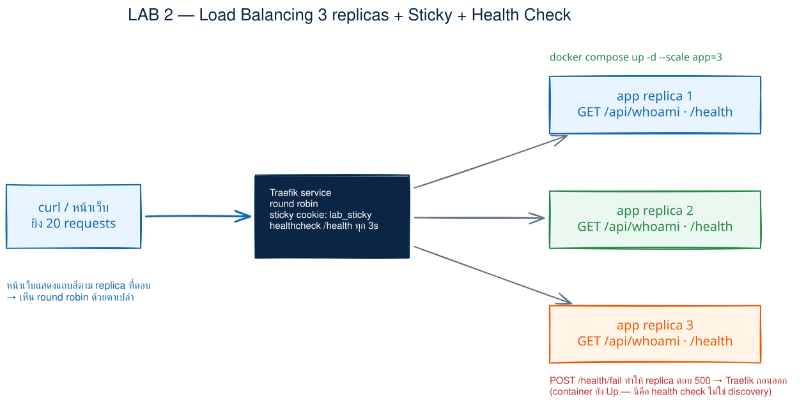
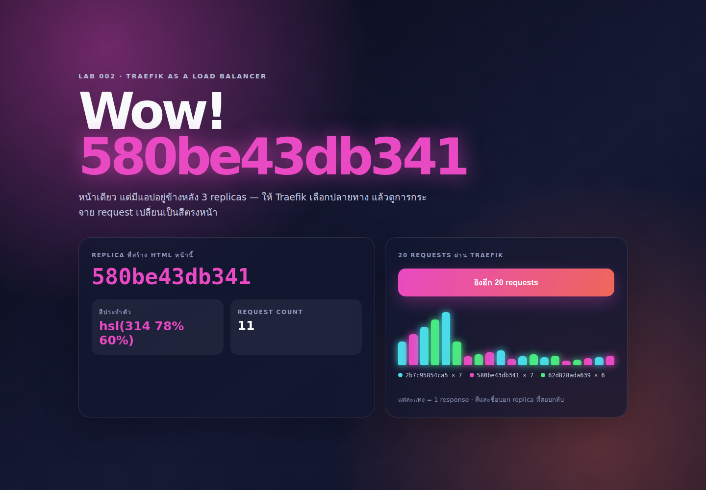
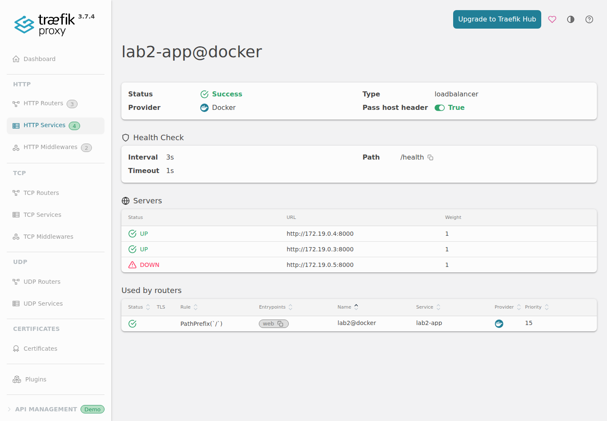

# LAB 2 — Load Balancing + Sticky Session + Health Check ด้วย Traefik

> โฟลเดอร์ `002_LAB_Load_Balancing` = **LAB 2** ของชุด Traefik Reverse Proxy / API Gateway / Load Balancer
> (ไฟล์ของแล็บนี้: `docker-compose.yml` · `docker-compose.sticky.yml` · `app/Dockerfile` · `app/server.py`)

## สิ่งที่จะได้เรียนรู้

- ให้ **Traefik ทำหน้าที่ Load Balancer** กระจาย request ไปยังแอป service เดียวกัน 3 replicas
- แยกคำว่า **service** ออกจาก **replica**: ผู้ใช้เรียก URL เดียว แต่ปลายทางจริงมีหลาย container
- เห็น weighted round-robin (WRR) ด้วย hostname และแถบสีจาก response จริง ไม่ใช่ภาพจำลอง
- เปิด **sticky session** ด้วย cookie แล้วพิสูจน์ว่าลูกค้าคนเดิมกลับไป replica เดิม
- ใช้ **active health check** ถอน replica ที่แอปตอบว่าไม่พร้อม แม้ container ยัง `Up`
- เปรียบเทียบ health check กับ **Docker discovery** เมื่อ container ถูกหยุดจริง
- อ่าน Traefik Dashboard เพื่อเชื่อมภาพ router → service → servers

## ภาพรวมของแล็บนี้

1. เปิดเครื่องเรียนและตรวจว่า Docker ด้านในพร้อม
2. clone repository แล้วอ่าน Compose ซึ่งมี Traefik กับแอป Python stdlib
3. build แอปหนึ่งครั้งและ scale service `app` เป็น 3 replicas
4. ยิง 9 requests ผ่าน URL เดียว แล้วนับ hostname ที่ Traefik เลือก
5. เปิดหน้า Wow กด **ยิง 20 requests** และดูแท่งสีของทั้ง 3 replicas
6. เปิด sticky cookie ด้วย Compose overlay แล้วพิสูจน์ด้วย cookie jar
7. ทำให้ `/health` ของ replica หนึ่งตอบ 500 โดยไม่หยุด container แล้วดู Traefik ถอดมันออก
8. ทำ health ให้กลับมา `OK` แล้วทดลองหยุด container เพื่อเทียบ active health check กับ discovery
9. ปิดและลบ resource ทั้งหมดด้วย `docker compose down`



> **คำถามก่อนเริ่ม:** ถ้า container ยังทำงานอยู่ แต่ endpoint `/health` ตอบ 500, Traefik ควรส่งผู้ใช้ไปหา container นั้นต่อหรือไม่? แล้วเหตุการณ์นี้ต่างจากการหยุด container อย่างไร? ข้อ 7–8 จะพิสูจน์ทั้งสองกรณี

### Terminal Map

| หน้าต่าง | หน้าที่ | เปิดเมื่อใด |
|---|---|---|
| **T1** | รัน Docker Compose, curl และคำสั่งทดลองทั้งหมด | ใช้ตลอด LAB |
| **Browser** | หน้า Wow ที่ port 8000 และ Dashboard ที่ port 8080 | เริ่มใช้ในข้อ 5 |

แล็บนี้ไม่ต้องเปิด terminal หลายหน้าต่าง แต่ให้คงการเชื่อมต่อ Remote-SSH ไว้ เพราะ browser จะอาศัย port forwarding ของ session นี้

---

## 0. เตรียมเครื่องเรียน

ทำบนเครื่องของเราเอง — เปิด classroom container ที่มี Docker เตรียมไว้ให้:

```bash
docker start devtools 2>/dev/null || \
  docker run -dit --name devtools --privileged -p 2222:22 tuchsanai/devtools:2569_1
ssh root@localhost -p 2222        # password : passwd
```

> 📝 **คำอธิบาย:** `docker start ... || docker run ...` ใช้เครื่องเรียนเดิมถ้ามี และสร้างใหม่เฉพาะเมื่อยังไม่มี · `-dit` เปิด container เบื้องหลังพร้อม terminal · `--name devtools` ตั้งชื่อคงที่ · `--privileged` ให้รัน Docker ซ้อนอยู่ข้างในได้ · `-p 2222:22` ส่ง SSH port จากเครื่องเราเข้า port 22 ของเครื่องเรียน · เมื่อ SSH ถามรหัสผ่านให้ใช้รหัส classroom ที่อยู่ใน comment

> ⚠️ `--privileged` ให้สิทธิ์สูงมาก ใช้เฉพาะ disposable classroom container นี้เท่านั้น ไม่ใช้กับ production workload

✅ **Expected output** — ถ้ามีเครื่องเดิมจะเห็นชื่อ `devtools`; ถ้าสร้างใหม่จะได้ container ID แล้วเข้าสู่ prompt ของ root (container ID ของแต่ละคนไม่ตรงกัน):

```text
devtools
root@<container-id>:~#
```

ใน VS Code แนะนำให้ใช้ **Remote-SSH** ต่อ `root@localhost:2222` แล้วเปิดโฟลเดอร์แล็บจากฝั่งเครื่องเรียน

ตรวจว่า Docker CLI ติดต่อ daemon ด้านในได้จริง:

```bash
docker --version
docker info --format 'Docker daemon: {{.ServerVersion}}'
```

> 📝 **คำอธิบาย:** คำสั่งแรกอ่านเวอร์ชัน CLI ส่วน `docker info` ต้องคุยกับ daemon จริง จึงช่วยแยกกรณี “ติดตั้ง CLI แล้ว” ออกจาก “daemon พร้อมทำงานแล้ว” · ถ้าพบบรรทัด `Cannot connect to the Docker daemon` ให้รอสักครู่แล้วลองใหม่

✅ **Expected output** — ผลรันจริงรอบตรวจรับนี้เป็นดังนี้ (เลขเวอร์ชันของผู้เรียนอาจต่างได้):

```text
Docker version 29.6.2, build dfc4efb
Docker daemon: 29.6.2
```

---

## 1. Clone โค้ดแล็บ

```bash
mkdir -p ~/labwork && cd ~/labwork
git clone https://github.com/Tuchsanai/DevTools.git
cd DevTools/03_Application_Docker/01_Traefik_Reverse_Proxy_Gateway_LB/002_LAB_Load_Balancing
```

> 📝 **คำอธิบาย:** `mkdir -p` สร้างพื้นที่ทำงานโดยไม่ error ถ้ามีอยู่แล้ว · `git clone` ดึง public course repository · `cd` เข้า LAB 2 ให้ถูกโฟลเดอร์ก่อนสั่ง Compose · ถ้าเคย clone แล้วและ Git แจ้งว่าโฟลเดอร์มีอยู่ ให้ข้ามบรรทัด clone แล้ว `cd` เข้า repository เดิม

✅ **Expected output** — ครั้งแรก Git รายงานชื่อโฟลเดอร์ที่กำลัง clone; จำนวน object และความเร็วขึ้นกับ revision/network จึงไม่ตรงกัน:

```text
Cloning into 'DevTools'...
remote: Enumerating objects: ...
Receiving objects: 100% (...), done.
```

ดูว่า Compose เห็นสอง service ตามที่ออกแบบไว้:

```bash
docker compose config --services
```

> 📝 **คำอธิบาย:** `docker compose config` parse และรวมค่าใน `docker-compose.yml`; `--services` ตัดผลให้เหลือรายชื่อ service จึงเป็น syntax check ที่เร็วกว่าการเริ่ม container · `traefik` คือทางเข้า ส่วน `app` คือ service ที่จะ scale

✅ **Expected output** — ต้องมีสองบรรทัดนี้:

```text
traefik
app
```

### อ่าน Compose ก่อนรัน

- Traefik pin ที่ `traefik:v3.7.4` และรับ static config ผ่าน command flags
- `--providers.docker.exposedByDefault=false` หมายความว่า container จะไม่ถูกเปิดออกเอง ต้องมี `traefik.enable=true`
- router หลักใช้ ``PathPrefix(`/`)`` บน entrypoint `web`; TCP forward ไม่แก้ HTTP `Host` header
- router เสริม ``Host(`app.lab`)`` ตั้ง `priority: 100` และติด header `X-Served-Via` — จะพิสูจน์ในข้อ 8
- service label ระบุ port `8000` เสมอ เพราะ Traefik ต้องรู้ container port ที่แอปรอฟัง
- Traefik และ app อยู่บน user-defined network ชื่อคงที่ `labnet`
- service `app` ไม่มี `container_name` เพราะชื่อคงที่ชื่อเดียวจะทำให้ scale หลายตัวไม่ได้
- health check เรียก `/health` ทุก `3s` และรอไม่เกิน `1s`
- `/var/run/docker.sock` ถูก mount เป็น `:ro` เพื่อให้ Docker provider ค้นพบ replicas

> ⚠️ แม้ mount Docker socket ด้วย `:ro` แต่ API ของ socket ยังควบคุม Docker daemon ได้กว้างมาก ไม่ได้กลายเป็น “Docker API แบบอ่านอย่างเดียว” งานจริงควรใช้ socket proxy/สิทธิ์ที่จำกัดกว่า

> ⚠️ `--api.insecure=true` เปิด Dashboard โดยไม่ยืนยันตัวตน ใช้เพื่อการเรียนใน LAB เท่านั้น; production ต้องปิดและวาง router พร้อม TLS/auth ที่เหมาะสม

---

## 2. เปิด Traefik และ scale แอปเป็น 3 replicas

```bash
docker compose up -d --build --scale app=3
```

> 📝 **คำอธิบาย:** `up` สร้าง network และ containers ตาม Compose · `-d` รันเบื้องหลัง · `--build` สร้าง app image จาก `python:3.12-slim` กับ `app/server.py` · `--scale app=3` สร้าง 3 containers จาก service เดียวกัน · ครั้งแรก Docker จะ pull base images จึงใช้เวลานานกว่ารอบถัดไป

✅ **Expected output** — ผลรันจริงครั้งแรกมีการ pull/build ก่อน แล้วลงท้ายด้วย 3 app containers และ Traefik ที่ `Started` (layer digest และลำดับหมายเลขอาจต่างกัน):

```text
Image traefik:v3.7.4 Pulled
Image 002_lab_load_balancing-app Built
Network labnet Created
Container 002_lab_load_balancing-traefik-1 Started
Container 002_lab_load_balancing-app-1 Started
Container 002_lab_load_balancing-app-2 Started
Container 002_lab_load_balancing-app-3 Started
```

รอจน Traefik เห็น server ครบ **3 ตัวและเป็น UP ทั้งหมด** แล้วดูสถานะ:

```bash
for i in $(seq 1 60); do
  [ "$(curl -s http://localhost:8080/api/http/services/lab2-app@docker \
      | grep -o '"UP"' | wc -l)" -eq 3 ] && break
  sleep 1
done
docker compose ps
```

> 📝 **คำอธิบาย:** การรอแค่ `/health` ตอบ 200 หนึ่งครั้งพิสูจน์ได้เพียงว่า *อย่างน้อยหนึ่ง* replica พร้อม — replica ที่เหลืออาจยังไม่เข้า pool แล้วทำให้รอบยิง 9 ครั้งถัดไปเห็น hostname ไม่ครบ · loop นี้จึงถาม Dashboard API ของ service `lab2-app@docker` แล้วนับข้อความ `"UP"` (สถานะรายตัวใน `serverStatus`) จนได้ 3 (เท่าจำนวน replicas) · เพดาน 60 รอบ (~1 นาที) กัน loop ค้าง — ถ้าครบแล้วยังไม่ผ่าน ดู `docker compose ps` และ `docker compose logs traefik` · `docker compose ps` ตรวจว่ามี app 3 แถวและ Traefik 1 แถว

✅ **Expected output** — ทั้ง 4 containers เป็น `Up`; ID และเวลาจะไม่ตรงกับเอกสาร:

```text
NAME                               IMAGE                        COMMAND                  SERVICE   CREATED         STATUS         PORTS
002_lab_load_balancing-app-1       002_lab_load_balancing-app   "python -u server.py"    app       8 seconds ago   Up 7 seconds   8000/tcp
002_lab_load_balancing-app-2       002_lab_load_balancing-app   "python -u server.py"    app       8 seconds ago   Up 7 seconds   8000/tcp
002_lab_load_balancing-app-3       002_lab_load_balancing-app   "python -u server.py"    app       8 seconds ago   Up 6 seconds   8000/tcp
002_lab_load_balancing-traefik-1   traefik:v3.7.4               "/entrypoint.sh --pr…"   traefik   8 seconds ago   Up 7 seconds   0.0.0.0:8080->8080/tcp, [::]:8080->8080/tcp, 0.0.0.0:8000->80/tcp, [::]:8000->80/tcp
```

> **ภาพบทบาทตอนนี้:** client รู้จักเพียง `localhost:8000` → Traefik router จับ path → service `lab2-app` เลือกหนึ่งใน 3 servers นี่คือ Traefik ตัวเดียวกันที่รับหน้าแทน backend (Reverse Proxy) และกระจายไปหลาย replicas (Load Balancer) โดย LAB นี้โฟกัสบทบาทหลัง

---

## 3. พิสูจน์การกระจายโหลดด้วย 9 requests

```bash
for i in $(seq 1 9); do
  curl -s http://localhost:8000/api/whoami
  echo
done
```

> 📝 **คำอธิบาย:** `seq 1 9` สร้างเลข 1–9 ให้ loop ยิง URL เดิม 9 ครั้ง · `curl -s` ซ่อน progress bar แต่พิมพ์ JSON · `echo` แยก response คนละบรรทัด · `hostname` คือ replica ที่ตอบ, `color` เป็นสีคงที่ซึ่ง derive จาก hostname ของ process นั้น, `served_count` เป็นตัวนับของ replica นั้นเอง

✅ **Expected output** — ผลจริงรอบนี้มี hostname 3 ค่าและแต่ละตัวตอบ 3 ครั้ง; ลำดับอาจไม่เป็น `A-B-C` ตายตัวเพราะรายชื่อ servers/discovery timing ต่างกัน และ hostname, สี, counter ของผู้เรียนจะไม่ตรงเอกสาร:

```json
{"hostname":"580be43db341","color":"hsl(314 78% 60%)","served_count":1}
{"hostname":"2b7c95854ca5","color":"hsl(185 78% 60%)","served_count":1}
{"hostname":"580be43db341","color":"hsl(314 78% 60%)","served_count":2}
{"hostname":"2b7c95854ca5","color":"hsl(185 78% 60%)","served_count":2}
{"hostname":"62d828ada639","color":"hsl(141 78% 60%)","served_count":1}
{"hostname":"2b7c95854ca5","color":"hsl(185 78% 60%)","served_count":3}
{"hostname":"62d828ada639","color":"hsl(141 78% 60%)","served_count":2}
{"hostname":"580be43db341","color":"hsl(314 78% 60%)","served_count":3}
{"hostname":"62d828ada639","color":"hsl(141 78% 60%)","served_count":3}
```

Traefik v3 รายงาน strategy นี้ว่า `wrr` (weighted round-robin); ทุก server มี weight 1 จึงกระจายเท่า ๆ กันในช่วง requests ต่อเนื่อง ไม่ได้รับประกันว่าลำดับแรกต้องเริ่มที่ replica หมายเลขใด

---

## 4. เปิดหน้า Wow และ Dashboard

ใน VS Code Remote-SSH:

1. เปิดแท็บ **PORTS**
2. กด **Forward a Port** แล้วเพิ่ม `8000`
3. เพิ่มอีก port คือ `8080`
4. เปิด `http://localhost:8000/` แล้วกด **ยิง 20 requests**
5. เปิด `http://localhost:8080/dashboard/` เพื่อดู Traefik Dashboard

> ต้องมี `/` ท้าย `dashboard/` เสมอ; URL `http://localhost:8080/dashboard` ไม่มี trailing slash อาจไม่เปิด SPA ถูกหน้า

หน้า Wow จากการรันจริงรอบนี้ — 20 แท่งมาจาก 20 responses และ legend แสดงครบ 3 hostnames:



ใน Dashboard เลือก **HTTP → HTTP Services → `lab2-app@docker`** จะเห็น Health Check `/health`, interval `3s` และ servers สถานะ `UP` 3 ตัว:


> 📝 **คำอธิบาย:** สีของหน้าใหญ่บอก replica ที่สร้าง HTML แรกเพียงตัวเดียว ส่วนแท่งด้านขวาเกิดจาก `fetch('/api/whoami')` ใหม่ 20 ครั้ง จึงเห็นหลายสี · Dashboard แสดง IP ภายใน `labnet`; IP เหล่านี้เปลี่ยนได้เมื่อ recreate และ client ไม่ควรผูกกับมันโดยตรง

#### ทางเลือก: forward ด้วย SSH โดยไม่ใช้ VS Code

```bash
ssh -L 8000:localhost:8000 -L 8080:localhost:8080 root@localhost -p 2222
```

> 📝 **คำอธิบาย:** `-L` แต่ละชุดเปิด local port แล้วส่งผ่าน SSH ไป port ชื่อเดียวกันในเครื่องเรียน · ต้องเปิด session นี้ค้างไว้ระหว่างใช้ browser และพิมพ์ `exit` หลังทดลองเสร็จ

✅ **Expected output** — SSH สำเร็จแล้วได้ prompt ใหม่; tunnel ทำงานเงียบ ๆ ไม่มี success message แยก:

```text
root@<container-id>:~#
```

---

## 5. เปิด Sticky Session ด้วย cookie

ไฟล์ `docker-compose.sticky.yml` เป็น overlay ที่เพิ่มเฉพาะสอง labels: เปิด sticky cookie และตั้งชื่อ `lab_sticky` โดยไม่ทำสำเนา config หลัก

```bash
docker compose -f docker-compose.yml -f docker-compose.sticky.yml up -d --scale app=3
for i in $(seq 1 60); do
  [ "$(curl -s http://localhost:8080/api/http/services/lab2-app@docker \
      | grep -o '"UP"' | wc -l)" -eq 3 ] && break
  sleep 1
done
```

> 📝 **คำอธิบาย:** `-f` เรียงจาก base ไป overlay ดังนั้น labels sticky ถูก merge เข้า service `app` · `up -d` recreate เฉพาะ containers ที่ config เปลี่ยน · ยังคง `--scale app=3` ชัดเจนเพื่อไม่ให้จำนวน replicas ขึ้นกับ state เก่า · loop รอจนทั้ง 3 replicas กลับมาเป็น `UP` ใน pool (ไม่ใช่แค่ตัวเดียวตอบ) เพราะช่วง recreate สั้น ๆ อาจได้ 404 หรือ pool ไม่ครบ · เพดาน 60 วินาที

✅ **Expected output** — ผลรันจริงรอบนี้ Traefik ยัง `Running` ส่วน app ทั้งสามผ่าน `Recreate` → `Recreated` → `Starting` → `Started` (ลำดับของแต่ละ replica อาจต่างกัน):

```text
Container 002_lab_load_balancing-traefik-1 Running
Container 002_lab_load_balancing-app-1 Recreate
Container 002_lab_load_balancing-app-2 Recreate
Container 002_lab_load_balancing-app-3 Recreate
Container 002_lab_load_balancing-app-1 Recreated
Container 002_lab_load_balancing-app-2 Recreated
Container 002_lab_load_balancing-app-3 Recreated
Container 002_lab_load_balancing-app-1 Starting
Container 002_lab_load_balancing-app-1 Started
Container 002_lab_load_balancing-app-2 Starting
Container 002_lab_load_balancing-app-2 Started
Container 002_lab_load_balancing-app-3 Starting
Container 002_lab_load_balancing-app-3 Started
```

สร้าง cookie jar ว่าง แล้วให้ curl อ่านและเขียน jar เดิมทุกครั้ง:

```bash
: > cookies.txt
for i in $(seq 1 6); do
  curl -s -c cookies.txt -b cookies.txt http://localhost:8000/api/whoami
  echo
done
grep lab_sticky cookies.txt
```

> 📝 **คำอธิบาย:** `: > cookies.txt` ล้าง cookie เก่าก่อนพิสูจน์ · `-c cookies.txt` เก็บ `Set-Cookie` จาก Traefik และ `-b cookies.txt` ส่ง cookie เดิมกลับใน request ถัดไป · sticky session จึง map client นี้ไป replica เดิม · `grep` พิสูจน์ว่ามี cookie ชื่อที่กำหนดจริง

✅ **Expected output** — hostname เดิมครบ 6 ครั้ง และมี `lab_sticky` ใน jar; hostname, hash cookie และ counter จะต่างกัน:

```text
{"hostname":"591d85fd0496","color":"hsl(274 78% 60%)","served_count":1}
{"hostname":"591d85fd0496","color":"hsl(274 78% 60%)","served_count":2}
{"hostname":"591d85fd0496","color":"hsl(274 78% 60%)","served_count":3}
{"hostname":"591d85fd0496","color":"hsl(274 78% 60%)","served_count":4}
{"hostname":"591d85fd0496","color":"hsl(274 78% 60%)","served_count":5}
{"hostname":"591d85fd0496","color":"hsl(274 78% 60%)","served_count":6}
localhost	FALSE	/	FALSE	0	lab_sticky	6215547f5b161641
```

> ถ้าใช้แค่ `curl http://localhost:8000/...` โดยไม่มี `-c`/`-b`, curl process แต่ละครั้งไม่จำ cookie ผลจะยังกระจายหลาย hostname และดูเหมือน sticky ไม่ทำงาน · LAB นี้เป็น HTTP จึงตั้งใจ **ไม่ใช้** `secure=true`; ถ้าตั้ง Secure cookie ผ่าน HTTP browser/curl จะไม่ส่ง cookie กลับ

Sticky session ไม่ได้แปลว่า replica นั้นอยู่ตลอดไป ถ้าปลายทาง unhealthy หรือถูกหยุด Traefik ต้องเลือกตัวที่ยังใช้ได้และออก cookie ค่าใหม่

---

## 6. Active Health Check — container ยัง Up แต่ถูกถอนจาก load balancing

เลือก replica แรก หา IP ภายใน แล้วสั่งให้ endpoint `/health` เปลี่ยนจาก 200 เป็น 500:

```bash
BAD_ID=$(docker compose ps -q app | head -1)
BAD_NAME=$(docker inspect -f '{{.Name}}' "$BAD_ID" | sed 's#^/##')
BAD_IP=$(docker inspect -f '{{range .NetworkSettings.Networks}}{{.IPAddress}}{{end}}' "$BAD_ID")
BAD_HOST=$(docker inspect -f '{{.Config.Hostname}}' "$BAD_ID")
printf 'Target: %s hostname=%s ip=%s\n' "$BAD_NAME" "$BAD_HOST" "$BAD_IP"
curl -s -X POST "http://$BAD_IP:8000/health/fail"
sleep 4
docker compose ps app
```

> 📝 **คำอธิบาย:** `docker compose ps -q app` คืน container IDs ของ service app และ `head -1` เลือกเพียงตัวเดียว · `docker inspect` อ่านชื่อ, hostname และ IP ใน `labnet` · POST ยิง **ตรงเข้า replica** เพื่อ toggle state โดยไม่ผ่าน load balancer · `sleep 4` มากกว่า interval 3 วินาทีหนึ่งรอบ ให้ Traefik ตรวจพบ 500 · `docker compose ps app` ยืนยันว่าไม่ได้หยุด process

✅ **Expected output** — target ตอบ `health=FAILED` แต่ตารางยังเห็น app ทั้ง 3 เป็น `Up`; ชื่อ/IP/เวลาจะต่างกัน:

```text
Target: 002_lab_load_balancing-app-1 hostname=e43d690d52dd ip=172.19.0.5
health=FAILED
NAME                           IMAGE                        COMMAND                 SERVICE   CREATED          STATUS          PORTS
002_lab_load_balancing-app-1   002_lab_load_balancing-app   "python -u server.py"   app       37 seconds ago   Up 25 seconds   8000/tcp
002_lab_load_balancing-app-2   002_lab_load_balancing-app   "python -u server.py"   app       37 seconds ago   Up 25 seconds   8000/tcp
002_lab_load_balancing-app-3   002_lab_load_balancing-app   "python -u server.py"   app       37 seconds ago   Up 25 seconds   8000/tcp
```

ยิงผ่าน Traefik อีก 8 ครั้ง:

```bash
for i in $(seq 1 8); do
  curl -s http://localhost:8000/api/whoami
  echo
done
```

> 📝 **คำอธิบาย:** ไม่ใช้ cookie jar เพื่อดู pool ปัจจุบันทั้งหมด · hostname ของตัวที่ fail จะไม่ปรากฏ เพราะ Traefik active health check กันออกจากตัวเลือก แม้ Docker provider ยังพบ container นั้น

✅ **Expected output** — เหลือเพียง 2 hostnames; hostname, สี และ counter จะต่างกัน:

```text
{"hostname":"591d85fd0496","color":"hsl(274 78% 60%)","served_count":7}
{"hostname":"7424e55bccaa","color":"hsl(235 78% 60%)","served_count":1}
{"hostname":"7424e55bccaa","color":"hsl(235 78% 60%)","served_count":2}
{"hostname":"591d85fd0496","color":"hsl(274 78% 60%)","served_count":8}
{"hostname":"7424e55bccaa","color":"hsl(235 78% 60%)","served_count":3}
{"hostname":"591d85fd0496","color":"hsl(274 78% 60%)","served_count":9}
{"hostname":"591d85fd0496","color":"hsl(274 78% 60%)","served_count":10}
{"hostname":"7424e55bccaa","color":"hsl(235 78% 60%)","served_count":4}
```

รีเฟรชหน้า `http://localhost:8080/dashboard/` แล้วเปิด `lab2-app@docker` อีกครั้ง จะเห็น 2 servers เป็น `UP` และ target เป็น `DOWN`:



> **หลักฐานสำคัญ:** Dashboard แสดง `DOWN` จาก `/health` ขณะที่ `docker compose ps` แสดง container เดิมเป็น `Up` — นี่คือ **Traefik health check** ไม่ใช่ Docker discovery ถอน container

ทำให้ replica กลับมา healthy และรอให้ Traefik ใส่กลับเข้ากลุ่ม:

```bash
BAD_ID=$(docker compose ps -q app | head -1)
BAD_IP=$(docker inspect -f '{{range .NetworkSettings.Networks}}{{.IPAddress}}{{end}}' "$BAD_ID")
curl -s -X POST "http://$BAD_IP:8000/health/ok"
sleep 4
for i in $(seq 1 9); do
  curl -s http://localhost:8000/api/whoami
  echo
done
```

> 📝 **คำอธิบาย:** หา IP ใหม่ทุกครั้งแทนการจำเลขที่เปลี่ยนได้ · `/health/ok` toggle กลับให้ GET `/health` ตอบ 200 · รอเกิน interval แล้วใช้ 9 requests ยืนยันว่า hostname ที่หายกลับมาใน pool

✅ **Expected output** — `health=OK` แล้วกลับมาเห็น 3 hostnames; ค่า runtime จะต่างกัน:

```text
health=OK
{"hostname":"e43d690d52dd","color":"hsl(204 78% 60%)","served_count":1}
{"hostname":"7424e55bccaa","color":"hsl(235 78% 60%)","served_count":5}
{"hostname":"591d85fd0496","color":"hsl(274 78% 60%)","served_count":11}
{"hostname":"7424e55bccaa","color":"hsl(235 78% 60%)","served_count":6}
{"hostname":"591d85fd0496","color":"hsl(274 78% 60%)","served_count":12}
{"hostname":"e43d690d52dd","color":"hsl(204 78% 60%)","served_count":2}
{"hostname":"591d85fd0496","color":"hsl(274 78% 60%)","served_count":13}
{"hostname":"e43d690d52dd","color":"hsl(204 78% 60%)","served_count":3}
{"hostname":"7424e55bccaa","color":"hsl(235 78% 60%)","served_count":7}
```

---

## 7. ทดลองให้พัง — หยุด replica เพื่อเทียบ Docker Discovery

กรณีนี้หยุด process จริงหนึ่งตัว:

```bash
STOP_ID=$(docker compose ps -q app | head -1)
STOP_NAME=$(docker inspect -f '{{.Name}}' "$STOP_ID" | sed 's#^/##')
echo "Stopping $STOP_NAME"
docker stop -t 2 "$STOP_ID"
sleep 2
docker compose ps -a app
```

> 📝 **คำอธิบาย:** `docker compose ps -q app` ใช้ Compose หา replicas แต่ `docker compose stop app` จะหยุด **ทุก replica ของ service** จึงใช้ `docker stop` กับ ID ที่เลือกเพื่อหยุดเพียงหนึ่งตัว · `-t 2` ให้เวลาปิด 2 วินาทีก่อน force · `ps -a` แสดงทั้งตัวที่รันและตัวที่หยุด · เมื่อ Docker ส่ง stop event, Traefik Docker provider จะลบ server นั้นจาก dynamic config โดยไม่ต้องรอ health endpoint

✅ **Expected output** — ผลรันจริงรอบนี้บรรทัดที่สองเป็น full container ID เพราะส่ง `$STOP_ID` ให้ `docker stop`; จากนั้นมีหนึ่งแถว `Exited` และอีกสองแถว `Up` (ID, เวลา และ exit code อาจต่างกันตามจังหวะปิด):

```text
Stopping 002_lab_load_balancing-app-1
e43d690d52ddf8135b0fb4cb8b62fa761b13e15811d17e9433147780ecebc0fe
NAME                           IMAGE                        COMMAND                 SERVICE   CREATED              STATUS                       PORTS
002_lab_load_balancing-app-1   002_lab_load_balancing-app   "python -u server.py"   app       About a minute ago   Exited (137) 8 seconds ago
002_lab_load_balancing-app-2   002_lab_load_balancing-app   "python -u server.py"   app       About a minute ago   Up About a minute            8000/tcp
002_lab_load_balancing-app-3   002_lab_load_balancing-app   "python -u server.py"   app       About a minute ago   Up About a minute            8000/tcp
```

> **ต่างกันตรงไหน:** health check = Docker ยังรายงาน replica อยู่ แต่ Traefik mark server `DOWN`; stop = Docker provider ได้ lifecycle event แล้ว server ถูก **ถอนออกจากรายการ** เหลือเพียง 2 URLs ทั้งคู่ `UP`

แก้กลับด้วยการ start container เดิม แล้วรอจน active health check เห็น `UP` ครบ 3:

```bash
STOP_ID=$(docker compose ps -aq app | head -1)
docker start "$STOP_ID"
for i in $(seq 1 60); do
  [ "$(curl -s http://localhost:8080/api/http/services/lab2-app@docker \
      | grep -o '"UP"' | wc -l)" -eq 3 ] && break
  sleep 1
done
docker compose ps app
```

> 📝 **คำอธิบาย:** `-a` ทำให้ `ps -q` คืน ID ของตัวที่หยุดด้วย · `docker start` เปิด container เดิม · loop อ่าน Traefik API แล้วนับข้อความ `"UP"` (สถานะรายตัวใน `serverStatus`) จนครบ 3 จึงไม่ต้องเดาเวลา (เพดาน 60 วินาที) · ปิดท้ายด้วย Compose status

✅ **Expected output** — บรรทัดแรกเป็น full container ID แล้ว app ทั้ง 3 กลับมา `Up`; ID/เวลาจะต่างกัน:

```text
e43d690d52ddf8135b0fb4cb8b62fa761b13e15811d17e9433147780ecebc0fe
NAME                           IMAGE                        COMMAND                 SERVICE   CREATED              STATUS              PORTS
002_lab_load_balancing-app-1   002_lab_load_balancing-app   "python -u server.py"   app       About a minute ago   Up 1 second         8000/tcp
002_lab_load_balancing-app-2   002_lab_load_balancing-app   "python -u server.py"   app       About a minute ago   Up About a minute   8000/tcp
002_lab_load_balancing-app-3   002_lab_load_balancing-app   "python -u server.py"   app       About a minute ago   Up About a minute   8000/tcp
```

---

## 8. แบบฝึกสั้น: Host rule กับ TCP port forwarding

Compose มี router เสริม ``Host(`app.lab`)`` ให้ลองส่ง Host header โดยไม่แก้ DNS — แต่มีปัญหาคลาสสิกซ่อนอยู่: request ที่ส่ง `Host: app.lab` เข้ามานั้น **match ทั้งสอง router** (``Host(`app.lab`)`` และ ``PathPrefix(`/`)``) แล้ว Traefik จะเลือกตัวไหน?

Traefik v3 จัดลำดับด้วย **priority** ซึ่งค่า default = ความยาวของ rule — บังเอิญ ``Host(`app.lab`)`` และ ``PathPrefix(`/`)`` ยาว 15 ตัวอักษรเท่ากันพอดี ผลเสมอกันทำให้เลือกไม่แน่นอน แล็บนี้จึงประกาศ `priority: 100` ให้ router เสริมชนะอย่างชัดเจน และติด middleware `headers` ที่เพิ่ม response header `X-Served-Via: host-router` ไว้เป็น "ลายนิ้วมือ" เฉพาะเส้นทางนี้ (สอง router ชี้ service เดียวกัน — ถ้าไม่มี header ก็แยกไม่ออกว่าใคร match)

```bash
curl -si -H 'Host: app.lab' http://localhost:8000/api/whoami | sed -n '1p;/^X-Served-Via/Ip'
curl -si http://localhost:8000/api/whoami | sed -n '1p;/^X-Served-Via/Ip'
```

> 📝 **คำอธิบาย:** `-H` เปลี่ยน HTTP `Host` header ให้ตรง rule ของ router เสริม · `-i` ขอ response headers มาดูด้วย และ `sed` กรองเฉพาะบรรทัด status กับ `X-Served-Via` · คำสั่งแรกต้องเห็น `X-Served-Via: host-router` = พิสูจน์ว่า router ``Host(`app.lab`)`` (priority 100) เป็นผู้ match · คำสั่งที่สองไม่ส่ง `-H` — TCP port forwarding ของ Docker/SSH ส่ง byte ไปอีก port แต่ **ไม่แก้ Host header ให้** Host จึงเป็น `localhost:8000` ไม่ตรง rule → ตกไปที่ ``PathPrefix(`/`)`` และไม่มี header พิเศษ · ดู priority ของทั้งสอง router ได้ที่ `curl -s http://localhost:8080/api/http/routers | python3 -m json.tool | grep -A2 rule`

✅ **Expected output** — คำสั่งแรกมีบรรทัด `X-Served-Via` คำสั่งที่สองไม่มี:

```text
HTTP/1.1 200 OK
X-Served-Via: host-router
HTTP/1.1 200 OK
```

---

## แก้ปัญหาที่พบบ่อย

| อาการ | สาเหตุ | วิธีแก้ |
|---|---|---|
| `404 page not found` ทันทีหลัง `up` | Docker provider กำลังรับ event ของ containers ที่ recreate | รัน readiness loop ของข้อ 3 (นับ `"UP"` ครบ 3 จาก Dashboard API) ก่อนทดลอง |
| เห็น hostname เดียวตั้งแต่ก่อนเปิด sticky | curl ส่ง cookie เก่าหรือ scale ไม่ครบ | ล้าง `cookies.txt`, ใช้ curl โดยไม่ `-b`, และตรวจ `docker compose ps` ให้ app ครบ 3 |
| เปิด sticky แล้ว curl ยังกระจาย | curl ไม่ได้เก็บ/ส่ง cookie กลับ | ใช้ `-c cookies.txt -b cookies.txt` ในทุก request หลังบรรทัดแรก |
| เปิด `secure=true` แล้ว sticky ไม่ทำงาน | Secure cookie ไม่ถูกส่งผ่าน HTTP | LAB นี้ห้ามตั้ง secure; production ควรใช้ HTTPS แล้วค่อยเปิด Secure |
| fail แล้ว target ยังได้รับ request | ยังไม่ครบ health-check interval หรือยิง fail ผ่าน Traefik จนไปผิด replica | ยิงตรง `BAD_IP:8000`, ตรวจว่าได้ `health=FAILED`, แล้วรออย่างน้อย 4 วินาที |
| Dashboard เปิดไม่ได้ | ยังไม่ forward port หรือ URL ขาด slash ท้าย | forward `8080` และเปิด `http://localhost:8080/dashboard/` |
| port 8000/8080 ถูกใช้อยู่ | LAB ก่อนหน้ายังไม่ `docker compose down` | กลับไปโฟลเดอร์ LAB ที่ค้างแล้วสั่ง `docker compose down` |

---

## เก็บกวาด (Cleanup)

```bash
docker compose down
docker compose ps -a
```

> 📝 **คำอธิบาย:** `down` หยุดและลบ containers ของ project พร้อม network `labnet` เพื่อไม่ให้ชื่อ network กับ port 8000/8080 ชน LAB ถัดไป · image ที่ build และ base images ยังเก็บเป็น cache จึงเปิดใหม่เร็ว · `ps -a` ตรวจว่า project ไม่มี container ค้าง · ปิด port forwarding 8000/8080 ใน VS Code หรือ `exit` จาก SSH tunnel ด้วย

✅ **Expected output** — ผลรันจริงรอบนี้ Compose รายงานแต่ละช่วงตั้งแต่ `Stopping` ถึง `Removed` แล้วตารางสุดท้ายเหลือแต่หัว (ลำดับของ containers อาจต่างกัน):

```text
Container 002_lab_load_balancing-traefik-1 Stopping
Container 002_lab_load_balancing-app-1 Stopping
Container 002_lab_load_balancing-app-2 Stopping
Container 002_lab_load_balancing-app-3 Stopping
Container 002_lab_load_balancing-traefik-1 Stopped
Container 002_lab_load_balancing-traefik-1 Removing
Container 002_lab_load_balancing-traefik-1 Removed
Container 002_lab_load_balancing-app-1 Stopped
Container 002_lab_load_balancing-app-1 Removing
Container 002_lab_load_balancing-app-1 Removed
Container 002_lab_load_balancing-app-2 Stopped
Container 002_lab_load_balancing-app-2 Removing
Container 002_lab_load_balancing-app-2 Removed
Container 002_lab_load_balancing-app-3 Stopped
Container 002_lab_load_balancing-app-3 Removing
Container 002_lab_load_balancing-app-3 Removed
Network labnet Removing
Network labnet Removed
NAME      IMAGE     COMMAND   SERVICE   CREATED   STATUS    PORTS
```

---

## สรุปคำสั่งของแล็บนี้

| คำสั่ง | ความหมาย |
|---|---|
| `docker compose up -d --build --scale app=3` | build และเปิด Traefik + app 3 replicas |
| `curl http://localhost:8000/api/whoami` | ส่ง request ผ่าน Load Balancer แล้วดู replica ที่ตอบ |
| `docker compose -f docker-compose.yml -f docker-compose.sticky.yml up ...` | merge overlay เพื่อเปิด sticky cookie |
| `curl -c cookies.txt -b cookies.txt ...` | รักษา cookie jar ข้าม requests เพื่อพิสูจน์ sticky |
| `POST /health/fail` / `POST /health/ok` | toggle application health โดย process ยังรัน |
| `docker stop <replica-id>` | หยุดหนึ่ง replica เพื่อให้ Docker discovery ถอน server |
| `docker compose down` | ลบ containers/network และคืน ports ให้ LAB ถัดไป |

## ✅ เช็กลิสต์ก่อนจบแล็บ

- [ ] Docker CLI และ daemon ตอบเลขเวอร์ชันครบ
- [ ] `docker compose ps` เห็น app 3 replicas และ Traefik 1 ตัว
- [ ] 9 requests แสดง hostname ครบ 3 ค่า
- [ ] หน้า Wow แสดงแถบ 20 แท่งและ legend ครบ 3 replicas
- [ ] Dashboard ที่ URL ลงท้าย `/dashboard/` แสดง servers `UP` 3 ตัว
- [ ] sticky test ใช้ `-c` และ `-b` แล้วได้ hostname เดิม 6 ครั้ง
- [ ] หลัง `/health/fail` container ทั้ง 3 ยัง `Up` แต่ traffic เหลือ 2 hostnames และ Dashboard มี `DOWN` 1 ตัว
- [ ] หลัง `/health/ok` กลับมาเห็นครบ 3 hostnames
- [ ] อธิบายได้ว่า health check mark `DOWN` ต่างจาก Docker discovery ถอน server อย่างไร
- [ ] ทดสอบ `Host: app.lab` และอธิบายได้ว่า TCP forwarding ไม่แก้ Host header
- [ ] `docker compose down` แล้ว `docker compose ps -a` ไม่เหลือ resource

*Expected output และ screenshots ในเอกสารนี้มาจากการรันจริงในเครื่องเรียน `tuchsanai/devtools:2569_1` เมื่อ 14 ส.ค. 2026*
