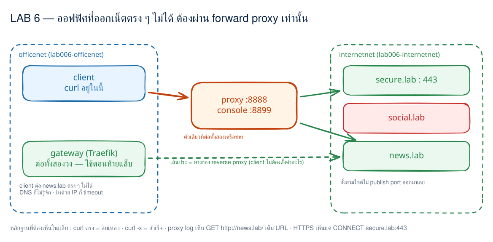
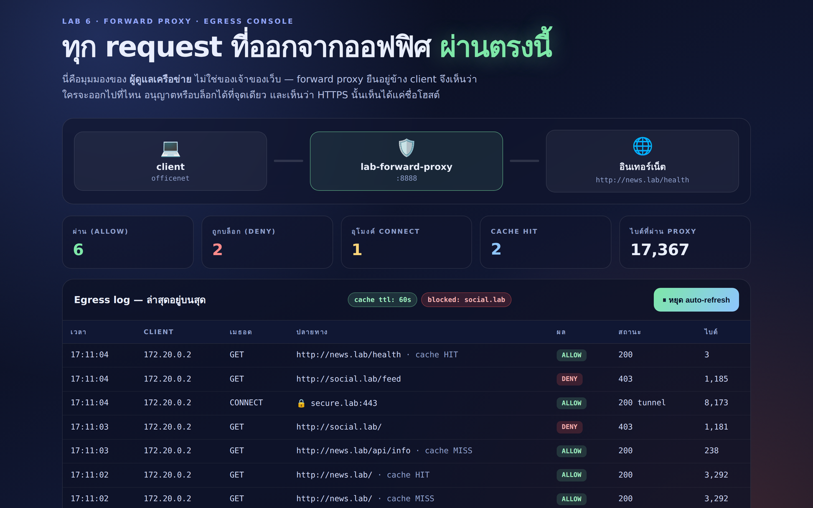
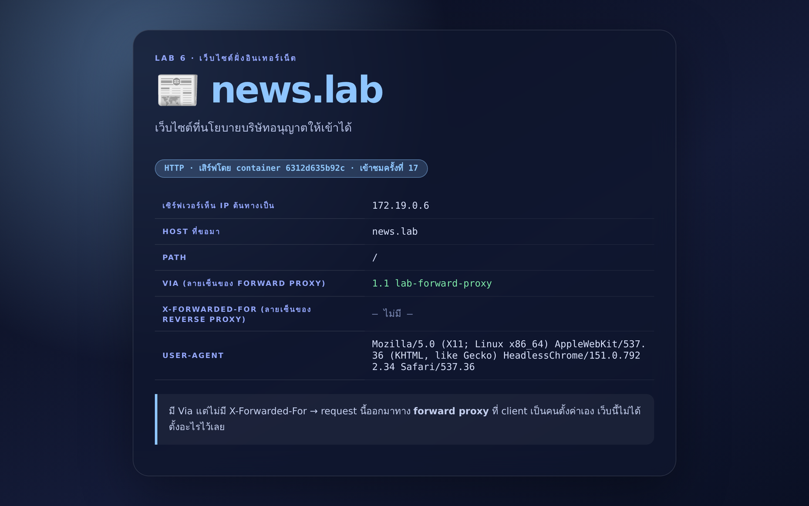
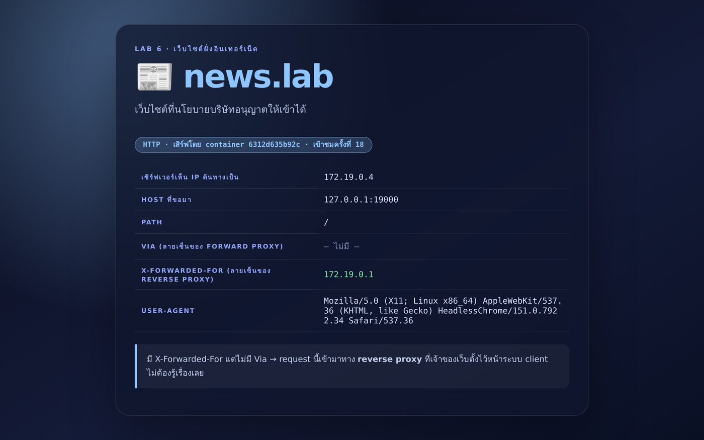

# LAB 6 — Forward Proxy: ตัวกลางที่ยืนอยู่ "ข้าง client"

> โฟลเดอร์ `006_LAB_Forward_Proxy` = **LAB 6** ของชุด Traefik
> (ไฟล์ของแล็บนี้: `docker-compose.yml` · `docker-compose.policy.yml` · `docker-compose.cache.yml`
> · `proxy/forward_proxy.py` · `sites/origin.py` · `client/Dockerfile`)

ห้าแล็บแรกเราอยู่ "ฝั่งเซิร์ฟเวอร์" มาตลอด — Traefik รับ request แทน backend
แล็บนี้ย้ายไปยืน **อีกฝั่งหนึ่งของโลก**: ตัวกลางที่ *ผู้ใช้* เป็นคนตั้งค่าเอง
เพื่อออกไปหาเว็บข้างนอก นั่นคือ **Forward Proxy**

## สิ่งที่จะได้เรียนรู้

- แยกให้ขาดว่า **forward proxy** กับ **reverse proxy** ต่างกันที่ "ใครเป็นคนตั้งค่า" ไม่ใช่ทิศทางของลูกศร
- เห็นด้วยตาว่า client ที่ออกเน็ตตรง ๆ ไม่ได้ จะ **ทำงานต่อได้ทันทีเมื่อชี้ผ่าน proxy**
- อ่าน request แบบ **absolute-URI** (`GET http://news.lab/ HTTP/1.1`) ที่ client ใช้เมื่อถูกตั้งให้ออกทาง forward proxy
  (ส่วน HTTPS ใช้เมธอด `CONNECT` แทน — คนละรูปแบบกัน)
- ตั้ง proxy ได้สามทาง: `curl -x` · ตัวแปร `http_proxy` · ตั้งในเบราว์เซอร์ — พร้อมกับดักตัวพิมพ์เล็ก/ใหญ่และ `no_proxy`
- ใช้ proxy เป็น **จุดควบคุมขาออก**: บล็อกปลายทาง (403) และเก็บ audit log ว่าใครไปที่ไหน
- เข้าใจ **CONNECT**: ทำไม HTTPS ผ่าน proxy แล้ว proxy เห็นแค่ `host:443` (พร้อมเวลาและปริมาณไบต์) แต่ไม่เห็น path/เนื้อหา
- เห็นผลของ **cache ที่ proxy** — client ได้คำตอบแต่เว็บปลายทางไม่ได้รับ request
- เทียบ header ที่ตัวกลางแต่ละแบบ*มักจะ*ประทับไว้: `Via` (forward) กับ `X-Forwarded-*` (reverse)
  — เป็นธรรมเนียมปฏิบัติ ไม่ใช่ลายนิ้วมือที่เชื่อได้ 100% เพราะ client ปลอมเองก็ได้

## ภาพรวมของแล็บนี้

เราจำลอง "ออฟฟิศที่ออกอินเทอร์เน็ตตรง ๆ ไม่ได้" ด้วย Docker network สองวง

1. **`officenet`** — เครือข่ายในองค์กร มี `client` (เครื่องพนักงาน) อยู่วงนี้วงเดียวเท่านั้น
2. **`internetnet`** — "อินเทอร์เน็ต" มีเว็บสามไซต์: `news.lab` · `social.lab` · `secure.lab` (HTTPS)
3. **`proxy`** ต่อ **ทั้งสองวง** จึงเป็นทางออกทางเดียวของ `client`
   (ส่วน `gateway` ก็ต่อสองวงเหมือนกัน แต่เป็น **reverse proxy ของฝั่งเว็บ** ไว้เทียบกันในข้อ 10)
4. ไล่จาก "ต่อตรงแล้วพัง" → "ผ่าน proxy แล้วได้" → "ตั้งนโยบายบล็อก" → "HTTPS" → "cache"
5. ปิดท้ายด้วยการเทียบกับ **reverse proxy** (Traefik) ที่รันอยู่ในแล็บเดียวกัน



> **คำถามก่อนเริ่ม:** เวลาบริษัทบล็อกเว็บบางเว็บ เขาบล็อกที่ไหน? แล้วถ้าเว็บนั้นเป็น HTTPS
> คนที่บล็อกเห็นอะไรบ้าง — เห็นแค่ชื่อเว็บ หรือเห็นทุกอย่างที่เราพิมพ์?

แล็บนี้ใช้ terminal เดียว ทุกคำสั่งตั้งแต่ข้อ 1 เป็นต้นไปให้รัน **ข้างในเครื่องเรียน** ผ่าน VS Code Remote-SSH

> ⚠️ แล็บนี้ใช้ port `8000`, `8080`, `8888`, `8899` ของเครื่องเรียน — ถ้ายังเปิดแล็บก่อนหน้าค้างไว้
> ให้ `docker compose down` ในโฟลเดอร์นั้นก่อน ไม่งั้นจะเจอ `port is already allocated`

---

## 0. เตรียมเครื่องเรียน

ทำบนเครื่องของเราเอง — เปิด classroom container ที่มี Docker พร้อมใช้ แล้ว SSH เข้าไป:

```bash
docker start devtools 2>/dev/null || \
  docker run -dit --name devtools --privileged -p 2222:22 tuchsanai/devtools:2569_1
ssh root@localhost -p 2222        # password : passwd
```

> 📝 **คำอธิบาย:** `docker start ... || docker run ...` ใช้เครื่องเรียนเดิมถ้ามี และสร้างใหม่เฉพาะเมื่อยังไม่มี · `--privileged` จำเป็นสำหรับรัน Docker ซ้อนข้างใน classroom container · `-p 2222:22` ส่ง port SSH จากเครื่องเราเข้า port 22 ของกล่อง
>
> ⚠️ `--privileged` ให้สิทธิ์สูงมาก ใช้เฉพาะ disposable classroom container นี้ ห้ามนำรูปแบบนี้ไปใช้กับ production workload

ตรวจว่า Docker CLI คุยกับ daemon ชั้นในได้:

```bash
docker --version
docker info --format 'Docker daemon: {{.ServerVersion}}'
```

✅ **Expected output** — ต้องมีเลขเวอร์ชันครบสองบรรทัด (เลขอาจต่างตาม image ห้องเรียน):

```text
Docker version 29.6.2, build dfc4efb
Docker daemon: 29.6.2
```

---

## 1. Clone โค้ดแล็บและ build image

```bash
mkdir -p ~/labwork && cd ~/labwork
git clone https://github.com/Tuchsanai/DevTools.git
cd DevTools/03_Application_Docker/01_Traefik_Reverse_Proxy_Gateway_LB/006_LAB_Forward_Proxy
```

> 📝 **คำอธิบาย:** ถ้าเคย clone จากแล็บก่อนหน้าแล้ว ให้ข้าม `git clone` แล้ว `cd` เข้า path นี้ได้เลย

แล็บนี้ build image เองสามตัว (client / proxy / sites) จาก `python:3.12-slim`:

```bash
docker compose build
```

> 📝 **คำอธิบาย:** `client` ติดตั้ง `curl` เพิ่มเพื่อใช้ยิงทดสอบ · `proxy` คือ forward proxy ที่เขียนด้วย standard library ล้วน (เปิดอ่านได้ที่ `proxy/forward_proxy.py` — ตรรกะของ proxy จริง ๆ ประมาณ 300 บรรทัด ที่เหลือเป็นหน้า console) · `sites` คือเว็บไซต์จำลองที่ใช้ซ้ำสามบทบาทโดยเปลี่ยนแค่ environment variable · ทั้งหมด pin ที่ `python:3.12-slim` เหมือนแล็บอื่นในชุด

✅ **Expected output** — จบด้วย `Built` ครบห้าบรรทัด (ลำดับสลับได้ และรอบแรกจะช้ากว่าเพราะต้อง pull base image):

```text
 Image lab006-proxy Built
 Image lab006-site-news Built
 Image lab006-site-secure Built
 Image lab006-site-social Built
 Image lab006-client Built
```

> 📝 ชื่อขึ้นต้นด้วย `lab006-` เพราะไฟล์ compose กำหนด `name: lab006` ไว้ — ชื่อ container จึงคงที่
> ไม่ผูกกับชื่อโฟลเดอร์ (ถ้าไม่กำหนด Compose จะใช้ชื่อโฟลเดอร์ยาว ๆ เป็น prefix แทน)

---

## 2. เปิดสนามทดลอง

```bash
docker compose up -d
docker compose ps --format "table {{.Service}}\t{{.Status}}\t{{.Ports}}"
```

> 📝 **คำอธิบาย:** `up -d` สร้างทั้งสอง network และ container ทั้งหกตัว · `docker compose ps` แบบระบุคอลัมน์ช่วยให้เห็นชัดว่า **ใครเปิด port ออกมาที่เครื่องเรียนบ้าง**

✅ **Expected output** — สังเกตว่าเว็บทั้งสามไซต์ **ไม่มี port mapping เลย** และ `client` ก็ไม่มี:

```text
SERVICE       STATUS                  PORTS
client        Up Less than a second
gateway       Up Less than a second   0.0.0.0:8080->8080/tcp, [::]:8080->8080/tcp, 0.0.0.0:8000->80/tcp, [::]:8000->80/tcp
proxy         Up Less than a second   0.0.0.0:8888->8888/tcp, [::]:8888->8888/tcp, 0.0.0.0:8899->8899/tcp, [::]:8899->8899/tcp
site-news     Up Less than a second
site-secure   Up Less than a second
site-social   Up Less than a second
```

รอจนเส้นทางผ่าน proxy พร้อมใช้งาน:

```bash
for i in $(seq 1 60); do
  docker compose exec -T client curl -fsS -m 3 -x http://proxy:8888 http://news.lab/health >/dev/null 2>&1 && break
  sleep 1
done
docker compose exec -T client curl -fsS -m 3 -x http://proxy:8888 http://news.lab/health >/dev/null 2>&1 \
  && echo "พร้อมแล้ว (รอบที่ $i)" || echo "ยังไม่พร้อม — ไปดู docker compose logs proxy"
```

> 📝 **คำอธิบาย:** loop นี้ยิง `/health` ผ่าน proxy ทุก 1 วินาทีจนกว่าจะได้ 2xx เพื่อกันจังหวะที่ container ขึ้นแล้วแต่ python ยังไม่เปิด socket · เพดาน 60 รอบกัน loop ค้าง — ถ้าครบแล้วยังไม่ผ่านให้ดู `docker compose logs proxy`

> 📝 **คำอธิบาย:** loop จะหยุดทันทีที่สำเร็จ แต่ **ต้องยิงยืนยันอีกครั้งหลัง loop** เสมอ ไม่งั้นถ้าครบ 60 รอบแล้วยังพัง
> เราจะเข้าใจผิดว่า “พร้อมแล้ว” · รูปแบบนี้ใช้ซ้ำได้ทุกจุดในแล็บ

✅ **Expected output:**

```text
พร้อมแล้ว (รอบที่ 1)
```

---

## 3. พิสูจน์ว่า "ออกตรง ๆ ไม่ได้" ก่อน

นี่คือหัวใจของเรื่อง — ถ้า client ออกเน็ตเองได้อยู่แล้ว forward proxy ก็ไม่มีเหตุผลจะมีอยู่

```bash
docker compose exec client curl -sS -m 5 http://news.lab/
```

> 📝 **คำอธิบาย:** `docker compose exec client` = ยืนอยู่ **บนเครื่องพนักงาน** ไม่ใช่บนเครื่องเรียน (สำคัญมาก เพราะเครื่องเรียนเป็น Docker host จึงเห็นทุก network) · `-m 5` จำกัดเวลา 5 วินาที · `-sS` เงียบ progress แต่ยังแสดง error

✅ **Expected output** — ล้มเหลวตั้งแต่ขั้น DNS เพราะ `client` ไม่ได้อยู่ใน `internetnet`:

```text
curl: (6) Could not resolve host: news.lab
```

ลองข้าม DNS ไปเลยด้วย IP ตรง ๆ:

```bash
docker inspect -f '{{range .NetworkSettings.Networks}}{{.IPAddress}}{{end}}' lab006-site-news-1
docker compose exec client curl -sS -m 5 http://<IP ที่ได้>/
```

> 📝 **คำอธิบาย:** คำสั่งแรกอ่าน IP จริงของ `site-news` · ต่อให้รู้ IP แล้ว client ก็ยังไปไม่ถึง เพราะ Docker แยก bridge network ออกจากกัน (ไม่มี route ระหว่างสอง network) จึงได้ **timeout ไม่ใช่ connection refused** — อาการนี้คือ "ไม่มีทางไป" ต่างจาก "ไปถึงแต่ไม่มีคนรับ"

✅ **Expected output** (IP เปลี่ยนไปตามรอบที่รัน):

```text
172.20.0.6
curl: (28) Connection timed out after 5002 milliseconds
```

---

## 4. ยิงผ่าน proxy — สิ่งเดียวที่เปลี่ยนคือ `-x`

```bash
docker compose exec client curl -sS -m 10 -x http://proxy:8888 http://news.lab/api/info
```

> 📝 **คำอธิบาย:** `-x http://proxy:8888` บอก curl ว่า "อย่าต่อไปที่ปลายทางเอง ให้ส่ง request ไปที่ proxy แล้วบอกมันว่าเราจะไปไหน" · client ไม่ต้อง resolve `news.lab` เองเลย — **proxy เป็นคน resolve ให้** จึงใช้ได้แม้ DNS ฝั่ง client จะไม่รู้จักชื่อนี้

✅ **Expected output** — สังเกตสามค่านี้ให้ดี (ค่า `hostname` และเลข IP ต่างกันได้ทุกรอบที่ `up` ใหม่):

```text
{"site": "news.lab", "hostname": "a685e6a095ec", "scheme": "http", "path": "/api/info", "host_header": "news.lab", "remote_addr": "172.19.0.6", "via": "1.1 lab-forward-proxy", "x_forwarded_for": "", "x_forwarded_host": "", "user_agent": "curl/8.14.1", "hits": 3}
```

| ค่าที่เห็น | แปลว่า |
|---|---|
| `remote_addr: 172.19.0.6` | เว็บเห็น IP ของ **proxy** (ขา `internetnet`) ไม่ใช่ IP ของพนักงาน |
| `via: 1.1 lab-forward-proxy` | ลายเซ็นของ forward proxy — บอกว่า request นี้ผ่านตัวกลางมา |
| `x_forwarded_for: ""` | ว่าง เพราะ **ไม่มี reverse proxy** อยู่ในเส้นทางนี้ |

ดู log สองฝั่งคู่กัน:

```bash
docker compose logs proxy --no-log-prefix | tail -3
docker compose logs site-news --no-log-prefix | tail -3
```

> 📝 **คำอธิบาย:** `--no-log-prefix` ตัดชื่อ service ออกให้อ่านง่าย · log ของ proxy คือ "สมุดบัญชีขาออก" ขององค์กร ส่วน log ของเว็บคือมุมของเจ้าของเว็บ

✅ **Expected output** — จุดสำคัญคือ **proxy เห็น URL เต็ม** (`http://news.lab/api/info`) ไม่ใช่แค่ path
(เวลาและเลข IP ในบรรทัด log ต่างกันได้):

```text
[lab-forward-proxy] forward proxy listening on :8888 · egress console on :8899 · deny=- allow=- cache_ttl=0s
2026-08-15 16:12:07 client=172.19.0.2      ALLOW GET     http://news.lab/health                     -> 200 (3 bytes)
2026-08-15 16:12:13 client=172.19.0.2      ALLOW GET     http://news.lab/api/info                   -> 200 (238 bytes)
[news.lab] serving http on :80 (container a91a5c2c40c0, started 16:12:07)
[news.lab] GET /health from=172.20.0.5 host=news.lab via=1.1 lab-forward-proxy xff=- ua=curl/8.14.1
[news.lab] GET /api/info from=172.20.0.5 host=news.lab via=1.1 lab-forward-proxy xff=- ua=curl/8.14.1
```

> **ทำไม proxy ถึงเห็น URL เต็ม?** เพราะ request ที่ส่งหา forward proxy ใช้รูปแบบ **absolute-URI**
> ตาม RFC 9112 คือขึ้นต้นบรรทัดแรกว่า `GET http://news.lab/api/info HTTP/1.1`
> ต่างจาก request ปกติที่เป็น origin-form `GET /api/info HTTP/1.1` + header `Host:`
> — proxy จำเป็นต้องรู้ทั้ง "โฮสต์ปลายทาง" และ "path" ในบรรทัดเดียว เพราะมันต้องเป็นคนไปต่อให้

---

## 5. ตั้ง proxy ด้วยตัวแปรสภาพแวดล้อม (และกับดักสองข้อ)

เครื่องมือสาย CLI จำนวนมาก (curl, pip, apt, git) และไลบรารีหลายตัวอ่านค่า proxy จาก environment variable
จึงไม่ต้องแก้โค้ดทีละที่ — แต่ **ไม่ใช่ทุกตัว** (เช่น Node.js ไม่ได้อ่านให้อัตโนมัติ ต้องตั้งที่ไลบรารีเอง):

```bash
docker compose exec -e http_proxy=http://proxy:8888 client \
  curl -sS -m 10 -o /dev/null -w 'http_proxy  -> HTTP %{http_code}\n' http://news.lab/
```

> 📝 **คำอธิบาย:** `-e` ของ `docker compose exec` ตั้งตัวแปรเฉพาะคำสั่งนั้น · `-o /dev/null -w '%{http_code}'` ทิ้ง body แล้วพิมพ์เฉพาะสถานะ ทำให้ผลอ่านง่ายและเทียบกันได้

✅ **Expected output:**

```text
http_proxy  -> HTTP 200
```

**กับดักที่ 1 — ตัวพิมพ์ใหญ่ใช้ไม่ได้กับ `http_proxy`:**

```bash
docker compose exec -e HTTP_PROXY=http://proxy:8888 client \
  curl -sS -m 10 -o /dev/null -w 'HTTP_PROXY  -> HTTP %{http_code}\n' http://news.lab/
```

> 📝 **คำอธิบาย:** curl **จงใจ** ไม่อ่าน `HTTP_PROXY` ตัวใหญ่ เพราะสมัย CGI ตัวแปรชื่อนี้อาจถูกยัดมาจาก header `Proxy:` ของผู้ใช้ภายนอก (ช่องโหว่ httpoxy) · แต่ `HTTPS_PROXY` ตัวใหญ่ใช้ได้ปกติ · สรุปให้จำง่าย: **ตั้งตัวเล็กไว้ก่อนเสมอ**

✅ **Expected output** — เหมือนไม่ได้ตั้ง proxy เลย:

```text
curl: (6) Could not resolve host: news.lab
HTTP_PROXY  -> HTTP 000
```

**กับดักที่ 2 — `no_proxy` ชนะแม้ใส่ `-x`:**

```bash
docker compose exec -e no_proxy=news.lab client \
  curl -sS -m 10 -x http://proxy:8888 -o /dev/null -w 'no_proxy    -> HTTP %{http_code}\n' http://news.lab/
```

> 📝 **คำอธิบาย:** `no_proxy` คือรายการปลายทางที่ "ห้ามใช้ proxy" และมีอำนาจเหนือกว่า `-x` ที่พิมพ์มากับคำสั่ง · เวลาแก้ปัญหา "ตั้ง proxy แล้วไม่ทำงาน" ให้ตรวจตัวแปรนี้เสมอ (`env | grep -i proxy`) · ถ้าต้องการบังคับใช้ proxy จริง ๆ ให้ใส่ `--noproxy ""`

✅ **Expected output:**

```text
curl: (6) Could not resolve host: news.lab
no_proxy    -> HTTP 000
```

---

## 6. ใช้ proxy เป็น "ประตูขาออก" — บล็อกปลายทางที่จุดเดียว

ก่อนตั้งนโยบาย ทุกเว็บผ่านได้หมด:

```bash
docker compose exec client curl -sS -m 10 -x http://proxy:8888 \
  -o /dev/null -w 'social.lab  -> HTTP %{http_code}\n' http://social.lab/
```

✅ **Expected output:**

```text
social.lab  -> HTTP 200
```

ทีนี้สวมบท "ฝ่าย IT" ประกาศนโยบายด้วยไฟล์ override:

```bash
cat docker-compose.policy.yml
docker compose -f docker-compose.yml -f docker-compose.policy.yml up -d proxy
for i in $(seq 1 30); do
  docker compose exec -T client curl -fsS -m 2 -x http://proxy:8888 http://news.lab/health >/dev/null 2>&1 && break
  sleep 1
done
docker compose exec -T client curl -fsS -m 2 -x http://proxy:8888 http://news.lab/health >/dev/null 2>&1 \
  && echo "proxy ใหม่พร้อมใช้งาน" || echo "proxy ยังไม่พร้อม — ดู docker compose logs proxy"
```

> 📝 **คำอธิบาย:** ไฟล์ override เพิ่มแค่ `PROXY_DENY: "social.lab"` ให้ service `proxy` · การใส่ `-f` สองไฟล์คือรูปแบบ **compose override** — Compose รวมสองไฟล์เข้าด้วยกันโดยไฟล์หลังชนะ · ระบุ `proxy` ต่อท้ายเพื่อสร้างใหม่เฉพาะ container นั้น (เพราะ environment เปลี่ยน ต้อง recreate ไม่ใช่ restart) · loop รอให้ proxy ตัวใหม่พร้อมก่อน ไม่งั้น request แรกจะเจอ `curl: (7) Failed to connect to proxy`

✅ **Expected output:**

```text
 Container lab006-proxy-1 Recreated
 Container lab006-proxy-1 Starting
 Container lab006-proxy-1 Started
proxy ใหม่พร้อมใช้งาน
```

ทดสอบทั้งเว็บที่ถูกบล็อกและเว็บที่ยังผ่านได้:

```bash
docker compose exec client curl -sS -m 10 -x http://proxy:8888 -o /dev/null -w 'social.lab  -> HTTP %{http_code}\n' http://social.lab/
docker compose exec client curl -sS -m 10 -x http://proxy:8888 -o /dev/null -w 'news.lab    -> HTTP %{http_code}\n' http://news.lab/
docker compose exec client curl -s -m 10 -x http://proxy:8888 -D - -o /dev/null http://social.lab/ | head -7
```

> 📝 **คำอธิบาย:** `-D -` พิมพ์ response header ออกมาดู · header `X-Lab-Proxy-Reason` เป็นของ proxy ตัวนี้เอง (ไม่ใช่มาตรฐาน) ใส่ไว้ให้เห็นว่า "ใครเป็นคนตอบ 403" — ในของจริง Squid ก็ตอบหน้า error ของตัวเองคล้ายกัน

✅ **Expected output** — `403` มาจาก **proxy** ไม่ใช่จากเว็บปลายทาง:

```text
social.lab  -> HTTP 403
news.lab    -> HTTP 200
HTTP/1.1 403 Forbidden
Server: LabForwardProxy/1.0
Date: Sat, 15 Aug 2026 16:12:28 GMT
Content-Type: text/html; charset=utf-8
Content-Length: 1181
X-Lab-Proxy: lab-forward-proxy
X-Lab-Proxy-Reason: denylist: social.lab
```

พิสูจน์สองอย่างจาก log:

```bash
docker compose logs proxy --no-log-prefix | grep DENY | tail -2
docker compose logs site-social --no-log-prefix | tail -2
```

> 📝 **คำอธิบาย:** ฝั่ง proxy มีบรรทัด `DENY` พร้อมเหตุผล = **audit trail** ที่องค์กรต้องการ · ฝั่ง `social.lab` **ไม่มี request ใหม่เข้ามาเลย** หลังตั้งนโยบาย — แปลว่า traffic ถูกตัดจบที่ประตู ไม่ได้ออกไปถึงปลายทาง

✅ **Expected output** — บรรทัดสุดท้ายของ `social.lab` ยังเป็นของรอบก่อนตั้งนโยบาย (เวลา/IP ต่างกันได้):

```text
2026-08-15 16:12:28 client=172.19.0.2      DENY  GET     http://social.lab/                         -> 403 (1181 bytes)  [denylist: social.lab]
2026-08-15 16:12:28 client=172.19.0.2      DENY  GET     http://social.lab/                         -> 403 (1181 bytes)  [denylist: social.lab]
[social.lab] serving http on :80 (container 01cbe646fa32, started 16:12:07)
[social.lab] GET / from=172.20.0.5 host=social.lab via=1.1 lab-forward-proxy xff=- ua=curl/8.14.1
```

> **ต่างจาก reverse proxy ตรงไหน:** reverse proxy บล็อกได้เฉพาะ request ที่วิ่งเข้า *เว็บของตัวเอง*
> ส่วน forward proxy บล็อกได้ *ทุกเว็บ* ให้กับ *ทุกเครื่อง* — **เท่าที่ traffic ถูกบังคับให้ผ่าน proxy จริง ๆ**
> (ถ้าเครื่องยังออกเน็ตทางอื่นได้ นโยบายนี้ก็ถูกเลี่ยงได้ — ในแล็บเราปิดทางอื่นด้วย network จึงเลี่ยงไม่ได้)

---

## 7. HTTPS ผ่าน proxy — เมธอด CONNECT และสิ่งที่ proxy "ไม่" เห็น

`secure.lab` เป็นเว็บ HTTPS ที่สร้าง self-signed certificate ของตัวเองตอนสตาร์ท:

```bash
docker compose exec client curl -sS -m 10 -x http://proxy:8888 \
  -o /dev/null -w 'no -k   -> HTTP %{http_code}\n' "https://secure.lab/secret/path?token=abc123"
```

> 📝 **คำอธิบาย:** ครั้งแรกต้อง **ล้มเหลว** เพราะ certificate เซ็นเอง ไม่ได้อยู่ใน trust store ของ client · จำให้แม่น: การที่ certificate ไม่น่าเชื่อถือ **ไม่ได้แปลว่าไม่ได้เข้ารหัส** — TLS ยังเข้ารหัสอยู่ สิ่งที่พังคือ "การพิสูจน์ตัวตน" ของเซิร์ฟเวอร์

✅ **Expected output:**

```text
curl: (60) SSL certificate problem: self-signed certificate
More details here: https://curl.se/docs/sslcerts.html

curl failed to verify the legitimacy of the server and therefore could not
establish a secure connection to it. To learn more about this situation and
how to fix it, please visit the webpage mentioned above.
no -k   -> HTTP 000
```

ผ่านแบบเร็ว (ปิดการตรวจ certificate) แล้วเทียบ log สองฝั่ง:

```bash
docker compose exec client curl -sS -m 10 -k -x http://proxy:8888 \
  -o /dev/null -w '-k      -> HTTP %{http_code}\n' "https://secure.lab/secret/path?token=abc123"
docker compose logs proxy --no-log-prefix | grep CONNECT | tail -1
docker compose logs site-secure --no-log-prefix | tail -1
```

> 📝 **คำอธิบาย:** `-k` ปิดการ verify certificate **ของปลายทาง** (ไม่ใช่ของ proxy — อันนั้นคือ `--proxy-insecure` และใช้เมื่อ proxy เองเป็น HTTPS) · เมื่อปลายทางเป็น `https://` curl จะส่ง `CONNECT secure.lab:443` ให้ proxy เปิดท่อ TCP ให้ก่อน แล้วทำ TLS handshake **ทะลุท่อ** ไปถึงเซิร์ฟเวอร์โดยตรง

✅ **Expected output** — บรรทัดที่ต้องเอาไปเทียบกัน (เวลา/IP/จำนวนไบต์ต่างกันได้):

```text
-k      -> HTTP 200
2026-08-15 16:12:28 client=172.19.0.2      ALLOW CONNECT secure.lab:443                             -> 200 tunnel (8173 bytes)  (encrypted tunnel — proxy sees host:port only)
[secure.lab] GET /secret/path?token=abc123 from=172.20.0.5 host=secure.lab via=- xff=- ua=curl/8.14.1
```

> **นี่คือบทเรียนสำคัญที่สุดของแล็บนี้:**
> proxy บันทึกได้แค่ `CONNECT secure.lab:443` + จำนวนไบต์ + เวลา
> แต่เซิร์ฟเวอร์ปลายทางเห็น `/secret/path?token=abc123` ครบถ้วน
> → forward proxy **บล็อกตามชื่อโฮสต์ได้** แต่ **อ่านเนื้อหา HTTPS ไม่ได้** ถ้าไม่ทำ TLS interception
> (ซึ่งต้องติดตั้ง CA ขององค์กรลงในทุกเครื่อง — นั่นคือเหตุผลที่บางบริษัทมี "root CA ของบริษัท")
> สังเกตอีกอย่าง: ฝั่ง `secure.lab` เห็น `via=-` เพราะ proxy แทรก header อะไรไม่ได้เลยในโหมดนี้

วิธีที่ถูกต้องกว่า `-k` คือบอก client ว่าจะเชื่อ certificate ใบนี้:

```bash
docker compose exec -T site-secure cat /tmp/site.crt > /tmp/secure-lab.crt
docker cp /tmp/secure-lab.crt "$(docker compose ps -q client)":/tmp/secure-lab.crt
docker compose exec client curl -sS -m 10 --cacert /tmp/secure-lab.crt -x http://proxy:8888 \
  -o /dev/null -w '--cacert -> HTTP %{http_code}\n' https://secure.lab/
```

> 📝 **คำอธิบาย:** คัดลอก certificate ของเว็บออกมาแล้วส่งเข้าเครื่อง client · `--cacert` บอก curl ว่า "ให้เชื่อใบนี้เป็นต้นทาง" จึง verify ผ่านโดย **ยังตรวจ certificate อยู่** · ในงานจริงนี่คือรูปแบบเดียวกับการติดตั้ง internal CA ให้เครื่องพนักงาน

✅ **Expected output:**

```text
--cacert -> HTTP 200
```

---

## 8. Cache ที่ proxy — client ได้คำตอบ แต่เว็บไม่ได้รับ request

```bash
docker compose -f docker-compose.yml -f docker-compose.policy.yml -f docker-compose.cache.yml up -d proxy
sleep 3
docker compose logs site-news --no-log-prefix | grep -c "GET /api/info"
for i in 1 2 3; do
  docker compose exec -T client curl -sS -m 10 -x http://proxy:8888 -D - -o /dev/null http://news.lab/api/info | grep -i "^x-lab-cache"
done
docker compose logs site-news --no-log-prefix | grep -c "GET /api/info"
```

> 📝 **คำอธิบาย:** ซ้อน override สามไฟล์ (หลัก + นโยบาย + cache) — ค่า `PROXY_CACHE_TTL=60` ทำให้ proxy เก็บคำตอบของ `GET` ไว้ 60 วินาที · `grep -c` นับจำนวน request ที่ **เว็บจริง** ได้รับ ก่อนและหลังยิงสามครั้ง

✅ **Expected output** — ยิงสามครั้งแต่เว็บถูกรบกวนแค่ครั้งเดียว:

```text
1
X-Lab-Cache: MISS
X-Lab-Cache: HIT
X-Lab-Cache: HIT
2
```

> **ข้อควรระวังที่ต้องเห็นด้วยตา:** ลอง `curl` ผ่าน proxy ซ้ำแล้วดูค่า `hits` ใน JSON — มันจะ **ไม่ขยับ**
> เพราะเป็นสำเนาเก่า นี่คือด้านมืดของ cache (ข้อมูลค้าง) ที่ทำให้ของจริงต้องดู header `Cache-Control`
> ประกอบเสมอ — proxy ในแล็บนี้จงใจทำง่าย ๆ ไม่สนใจ `Cache-Control` เพื่อให้เห็นผลชัด

---

## 9. หน้า Wow — Egress Console ของผู้ดูแลเครือข่าย

proxy เปิดหน้าเว็บสรุป log ขาออกแบบ real-time ไว้ที่ port `8899`

ใน VS Code (Remote-SSH เข้าเครื่องเรียนอยู่แล้ว) เปิดแท็บ **PORTS → Forward a Port** แล้วใส่ `8899`
จากนั้นเปิด `http://localhost:8899/` บนเบราว์เซอร์ของเรา

> 📝 **คำอธิบาย:** เครื่องเรียนอยู่ใน container จึงต้อง forward port ออกมาก่อน · ถ้าไม่ใช้ VS Code ใช้ `ssh -L 8899:localhost:8899 root@localhost -p 2222` ก็ได้ผลเหมือนกัน

ยิง traffic ให้หน้าเว็บมีอะไรดู:

```bash
docker compose exec client sh -lc '
  curl -s -x http://proxy:8888 -o /dev/null http://news.lab/
  curl -s -x http://proxy:8888 -o /dev/null http://news.lab/
  curl -s -x http://proxy:8888 -o /dev/null http://news.lab/api/info
  curl -s -x http://proxy:8888 -o /dev/null http://social.lab/
  curl -s -k -x http://proxy:8888 -o /dev/null "https://secure.lab/secret/path?token=abc123"
  curl -s -x http://proxy:8888 -o /dev/null http://social.lab/feed
  curl -s -x http://proxy:8888 -o /dev/null http://news.lab/health
'
```

> 📝 **คำอธิบาย:** ยิง `news.lab/` สองครั้งเพื่อให้เห็นแถว `cache HIT` · `social.lab` สองครั้งเพื่อให้เห็นแถว `DENY`
> · และ `secure.lab` หนึ่งครั้งเพื่อให้เห็นแถว `CONNECT` — ครบทั้งสามชนิดในตารางเดียว



> 📝 **คำอธิบาย:** ภาพนี้มาจากการรันชุดคำสั่งด้านบนจริง (ALLOW 6 · DENY 2 · CONNECT 1 · cache HIT 2) · ตารางเรียงล่าสุดไว้บน · แถว `DENY` สีแดงคือปลายทางที่นโยบายห้าม · แถว `CONNECT` มีกุญแจ 🔒 และแสดงแค่ `host:443` ตามที่พิสูจน์ไว้ในข้อ 7 · ตัวเลขด้านบนเป็นสถิติสะสมตั้งแต่ proxy สตาร์ท จึงต่างจากของเราได้ถ้ายิงมาก่อนหน้านี้

ถ้าไม่ได้เปิดเบราว์เซอร์ ก็อ่านข้อมูลชุดเดียวกันแบบ JSON ได้:

```bash
docker compose exec client curl -sS -m 5 http://proxy:8899/api/log | head -c 220; echo
```

✅ **Expected output** — ตัวเลขไม่จำเป็นต้องตรงกับของเราเป๊ะ (มันสะสมตั้งแต่ proxy สตาร์ท)
สิ่งที่ต้องเป็นจริงคือ **`deny` ≥ 2 และ `connect` ≥ 1** หลังรันชุดคำสั่งด้านบน:

```text
{"policy": {"name": "lab-forward-proxy", "deny": ["social.lab"], "allow": [], "cache_ttl": 60, "uptime": 2}, "stats": {"allow": 6, "deny": 2, "connect": 1, "error": 0, "cache_hit": 2, "bytes": 17367}, "events": [{"client
```

### ตั้ง proxy ในเบราว์เซอร์จริง (ทางเลือก)

forward port `8888` เพิ่มอีกหนึ่ง port แล้วตั้งค่า proxy ในเบราว์เซอร์เป็น `127.0.0.1:8888`
จากนั้นพิมพ์ `http://news.lab/` — จะเข้าได้ทั้งที่เครื่องเราไม่รู้จักชื่อนี้เลย



> 📝 **คำอธิบาย:** นี่คือภาพจากการเปิดจริงผ่าน proxy — บรรทัด **Via** มีค่า ส่วน **X-Forwarded-For** ว่าง
> · ปิดค่า proxy ในเบราว์เซอร์เมื่อทดลองเสร็จ ไม่งั้นจะเข้าเว็บอื่นไม่ได้

---

## 10. เทียบกับ reverse proxy ในระบบเดียวกัน

ในแล็บนี้มี Traefik รันอยู่ด้วยชื่อ service `gateway` โดยเป็น reverse proxy ของ `news.lab`
(สังเกต label ของ `site-news` ในไฟล์ compose — เจ้าของเว็บเป็นคนใส่เอง)

```bash
for i in $(seq 1 60); do
  docker compose exec -T client curl -fsS -m 3 http://gateway/health >/dev/null 2>&1 && break
  sleep 1
done
echo '-- ผ่าน forward proxy --'
docker compose exec client curl -sS -m 10 -x http://proxy:8888 http://news.lab/api/info; echo
echo '-- ผ่าน reverse proxy --'
docker compose exec client curl -sS -m 10 http://gateway/api/info; echo
```

> 📝 **คำอธิบาย:** คำสั่งที่สองไม่มี `-x` เลย — client ไม่ต้องตั้งค่าอะไรทั้งนั้น แค่ยิงไปที่ชื่อ/ที่อยู่ของ gateway ตามปกติ · **นี่คือความต่างที่แท้จริง**: forward proxy ต้องให้ client ยอมใช้ ส่วน reverse proxy ถูกวางไว้บนเส้นทางโดยเจ้าของระบบอยู่แล้ว

✅ **Expected output** — เทียบสามค่าในบรรทัดทั้งสอง:

```text
-- ผ่าน forward proxy --
{"site": "news.lab", ..., "host_header": "news.lab", "remote_addr": "172.19.0.6", "via": "1.1 lab-forward-proxy", "x_forwarded_for": "", ...}
-- ผ่าน reverse proxy --
{"site": "news.lab", ..., "host_header": "gateway", "remote_addr": "172.19.0.3", "via": "", "x_forwarded_for": "172.20.0.3", "x_forwarded_host": "gateway", ...}
```

| มุมที่ดู | ผ่าน forward proxy | ผ่าน reverse proxy (Traefik) |
|---|---|---|
| ใครตั้งค่า | client (`-x`, `http_proxy`, เบราว์เซอร์) | เจ้าของเว็บ (labels ใน compose) |
| client ต้องรู้ตัวไหม | ต้องรู้ ต้องตั้งเอง | ไม่ต้องรู้เลย |
| `Host` ที่เว็บเห็น | ชื่อจริงของเว็บ (`news.lab`) | ชื่อที่ client ยิงเข้า gateway |
| ลายเซ็นใน header | `Via` | `X-Forwarded-For` / `X-Forwarded-Host` |
| ปลายทางเป็นใครได้บ้าง | เว็บอะไรก็ได้ที่ client ขอ | เฉพาะ backend ที่ประกาศไว้ |
| ใช้แก้ปัญหาอะไร | คุมขาออก · เก็บ log · cache · ข้ามข้อจำกัดเครือข่าย | ซ่อน backend · TLS · load balance · นโยบาย API |



> 📝 **คำอธิบาย:** หน้าเดียวกัน เว็บเดียวกัน แต่ "ตัวกลาง" คนละตัว จึงเหลือร่องรอยคนละแบบ
> (ภาพนี้เปิดจากเบราว์เซอร์ผ่าน port forward จึงเห็น `X-Forwarded-For` เป็น IP ของ **docker bridge gateway**
> ซึ่งเป็นคนละอย่างกับ service ชื่อ `gateway` ในแล็บ — ถ้ายิงจาก container `client` จะเห็น IP ของ client ตรง ๆ)

---

## 11. ทดลองให้พัง — สามอาการที่เจอบ่อยที่สุด

```bash
docker compose exec client curl -sS -m 5 -x http://proxy:9999 -o /dev/null -w 'wrong port -> %{http_code}\n' http://news.lab/
docker compose exec client curl -sS -m 5 -o /dev/null -w 'origin-form -> HTTP %{http_code}\n' http://proxy:8888/
docker compose exec client curl -sS -m 5 -o /dev/null -w 'no proxy    -> HTTP %{http_code}\n' http://news.lab/
```

> 📝 **คำอธิบาย:** สามคำสั่งนี้ทำให้จำ "อาการ → สาเหตุ" ได้เร็วขึ้นมาก
> · อันแรกชี้ port ผิด → ต่อ proxy ไม่ติดเลย
> · อันที่สองเปิด port ของ proxy ตรง ๆ เหมือนเปิดเว็บ → proxy ได้ request แบบ origin-form ที่ไม่มีปลายทาง จึงตอบ 400 พร้อมคำอธิบาย
> · อันที่สามลืมตั้ง proxy → กลับไปที่อาการเดิมของข้อ 3

✅ **Expected output:**

```text
curl: (7) Failed to connect to proxy port 9999 after 0 ms: Could not connect to server
wrong port -> 000
origin-form -> HTTP 400
curl: (6) Could not resolve host: news.lab
no proxy    -> HTTP 000
```

| อาการ | แปลว่า | ที่ต้องไปดู |
|---|---|---|
| `curl: (6) Could not resolve host` | ไม่ได้ผ่าน proxy เลย (ลืมตั้ง / `no_proxy` ตัดออก) | ตัวแปร `env \| grep -i proxy` |
| `curl: (7) Failed to connect to proxy` | ชี้ proxy ผิด host/port หรือ proxy ยังไม่ขึ้น | `docker compose ps` · `logs proxy` |
| `HTTP 400` จาก proxy | ยิงเข้า port proxy โดยไม่ได้ตั้งเป็น proxy | ใช้ `-x` แทนการเปิด URL ตรง |
| `HTTP 403` + `X-Lab-Proxy-Reason` | นโยบายบล็อกปลายทางนั้น | `docker compose logs proxy \| grep DENY` |
| `curl: (60) SSL certificate problem` | ปลายทางใช้ cert ที่ client ไม่เชื่อถือ | ใช้ `--cacert` (หรือ `-k` เฉพาะในแล็บ) |

---

## แก้ปัญหาที่พบบ่อย

| ปัญหา | สาเหตุที่พบบ่อย | วิธีแก้ |
|---|---|---|
| `port is already allocated` ตอน `up` | แล็บก่อนหน้ายังรันอยู่ (ใช้ 8000/8080 เหมือนกัน) | `cd` ไปโฟลเดอร์แล็บนั้นแล้ว `docker compose down` |
| ยิงจากเครื่องเรียนแล้ว "ต่อตรงก็ได้" | เครื่องเรียนคือ Docker host จึงเห็นทุก network | ต้องยิงจากใน container: `docker compose exec client ...` |
| ตั้ง `http_proxy` แล้วไม่มีผล | ใช้ตัวพิมพ์ใหญ่ หรือมี `no_proxy` อยู่ | ใช้ตัวพิมพ์เล็ก · `--noproxy ""` เพื่อบังคับ |
| หน้า console ที่ `8899` เปิดไม่ขึ้น | ยังไม่ได้ forward port ใน VS Code | เพิ่ม port `8899` ในแท็บ PORTS |
| แก้ค่า `PROXY_DENY` แล้วไม่เปลี่ยน | สั่ง `restart` ซึ่งไม่อ่าน environment ใหม่ | ใช้ `docker compose ... up -d proxy` ให้ recreate |
| `curl: (56) CONNECT tunnel failed, response 403` | ปลายทาง HTTPS ติด denylist | ตรวจ `PROXY_DENY` — บล็อกได้แม้เป็น HTTPS เพราะเห็นชื่อโฮสต์ |

---

## เก็บกวาด (Cleanup) และพิสูจน์ Clean Re-run

พิสูจน์ว่าเริ่มใหม่ได้สะอาดก่อนปิดจริง:

```bash
docker compose -f docker-compose.yml -f docker-compose.policy.yml -f docker-compose.cache.yml down
docker compose up -d
for i in $(seq 1 60); do
  docker compose exec -T client curl -fsS -m 3 -x http://proxy:8888 http://news.lab/health >/dev/null 2>&1 && break
  sleep 1
done
docker compose exec client curl -sS -m 10 -x http://proxy:8888 -o /dev/null -w 'clean re-run -> HTTP %{http_code}\n' http://social.lab/
```

> 📝 **คำอธิบาย:** override สองไฟล์ของแล็บนี้เปลี่ยนแค่ `environment` จึงใช้ `docker compose down` เฉย ๆ ก็ได้ — แต่การใส่ `-f` ให้ครบชุดเดิมเป็นนิสัยที่ดี เพราะถ้า override ไปเพิ่ม service/volume/network เมื่อไหร่ การ `down` โดยไม่ใส่จะทิ้งของค้างไว้ · หลัง `up` ใหม่โดยไม่มี override นโยบายบล็อกจะหายไป → `social.lab` กลับมาได้ `200` ซึ่งยืนยันว่า state เดิมไม่ค้าง

✅ **Expected output:**

```text
clean re-run -> HTTP 200
```

ปิดท้ายให้เรียบร้อยก่อนไปแล็บถัดไป:

```bash
docker compose -f docker-compose.yml -f docker-compose.policy.yml -f docker-compose.cache.yml down
docker compose ps -a
```

✅ **Expected output** — ตัวอย่างท้าย ๆ ของผลลัพธ์ (ของจริงจะมีทุก service ครบทั้งหก แล้วปิดท้ายด้วย network สองวง)
และ `docker compose ps -a` ต้องเหลือแค่หัวตาราง:

```text
 Container lab006-site-social-1 Removing
 Container lab006-site-social-1 Removed
 Container lab006-site-news-1 Stopped
 Container lab006-site-news-1 Removing
 Container lab006-site-news-1 Removed
 Container lab006-proxy-1 Stopped
 Container lab006-proxy-1 Removing
 Container lab006-proxy-1 Removed
 Network lab006-officenet Removing
 Network lab006-internetnet Removing
 Network lab006-officenet Removed
 Network lab006-internetnet Removed
```

---

## สรุปคำสั่งของแล็บนี้

```bash
docker compose build                                   # สร้าง client / proxy / sites
docker compose up -d                                   # เปิดสองเครือข่าย + หกคอนเทนเนอร์
docker compose exec client curl -sS http://news.lab/   # ต่อตรง → ล้มเหลว (นี่คือของจริงที่ต้องเห็น)
docker compose exec client curl -sS -x http://proxy:8888 http://news.lab/   # ผ่าน proxy → สำเร็จ
docker compose exec -e http_proxy=http://proxy:8888 client curl -sS http://news.lab/
docker compose -f docker-compose.yml -f docker-compose.policy.yml up -d proxy   # เปิดนโยบายบล็อก
docker compose exec client curl -k -x http://proxy:8888 https://secure.lab/     # HTTPS ผ่าน CONNECT
docker compose logs proxy --no-log-prefix              # สมุดบัญชีขาออก
docker compose down                                    # เก็บกวาด (ใส่ -f ชุดเดิมด้วยก็ได้ ปลอดภัยกว่า)
```

---

## ✅ เช็กลิสต์ก่อนจบแล็บ

- [ ] อธิบายได้ว่า forward proxy ต่างจาก reverse proxy ที่ **"ใครเป็นคนตั้งค่า"** ไม่ใช่ทิศทาง
- [ ] เห็นด้วยตาว่า client ต่อ `news.lab` ตรง ๆ ไม่ได้ (DNS ไม่รู้จัก · IP ก็ timeout) แต่ `-x` แล้วได้ 200
- [ ] ชี้ได้ว่า log ของ proxy เห็น **URL เต็ม** เพราะ request เป็น absolute-URI
- [ ] ตั้ง proxy ด้วย `http_proxy` ได้ และรู้ว่า `HTTP_PROXY` ตัวใหญ่กับ `no_proxy` มีกับดักอะไร
- [ ] ทำให้ `social.lab` ได้ `403` จาก proxy และยืนยันว่าเว็บปลายทางไม่เคยได้รับ request นั้น
- [ ] อธิบายได้ว่าทำไม log ของ proxy เห็นแค่ `CONNECT secure.lab:443` แต่เซิร์ฟเวอร์เห็น path เต็ม
- [ ] เห็น `X-Lab-Cache: MISS → HIT` และเข้าใจว่าทำไม origin ถูกยิงแค่ครั้งเดียว
- [ ] เปิดหน้า Egress Console ที่ `8899` และอ่านแถว ALLOW / DENY / CONNECT ได้
- [ ] เทียบ `Via` กับ `X-Forwarded-For` จาก JSON ของเว็บเดียวกันได้
- [ ] `docker compose down` จนไม่เหลือ container ของแล็บนี้

---

> **หมายเหตุความปลอดภัยและข้อจำกัดของโค้ดในแล็บ:**
> `proxy/forward_proxy.py` เขียนไว้เพื่อ **การเรียนการสอน** ให้อ่านง่ายที่สุด แม้จะใส่การป้องกันพื้นฐานไว้แล้ว
> (ปฏิเสธ `Transfer-Encoding`, จำกัดขนาด body, ตัด hop-by-hop header ตามที่ระบุใน `Connection:`,
> ต่อท้าย `Via` แทนการเขียนทับ, จำกัด port ของ `CONNECT`, escape ค่าที่มาจาก request ก่อนแสดงผล,
> cache เฉพาะคำตอบที่ไม่ผูกกับผู้ใช้ และ publish เฉพาะ `127.0.0.1` ของเครื่องเรียน) แต่ยัง **ไม่ใช่ของ production**:
>
> - ไม่รองรับ chunked body · WebSocket/upgrade · IPv6 ใน `CONNECT` · half-close ของ tunnel
> - buffer response ทั้งก้อนในหน่วยความจำ และ `HEAD` จะได้ `Content-Length: 0` แทนค่าจริงของ representation
> - ไม่มี proxy authentication (ของจริงจะตอบ **407 Proxy Authentication Required** พร้อม `Proxy-Authenticate` — ไม่ใช่ 401)
> - นโยบายเทียบ **ชื่อโฮสต์แบบตรงตัว** จึงเลี่ยงได้ด้วย IP หรือชื่ออื่นที่ชี้ไปที่เดียวกัน — เป็น demo ของแนวคิด ไม่ใช่ระบบบังคับใช้จริง
> - cache ในแล็บไม่สนใจ `Cache-Control`/`Vary` อย่างครบถ้วน จึงใช้ได้เฉพาะกับเนื้อหาสาธิต
>
> งานจริงให้ใช้ Squid หรือ tinyproxy ที่ผ่านการดูแลด้านความปลอดภัยมาแล้ว และอย่าเปิด proxy ออกสู่เครือข่ายสาธารณะ
