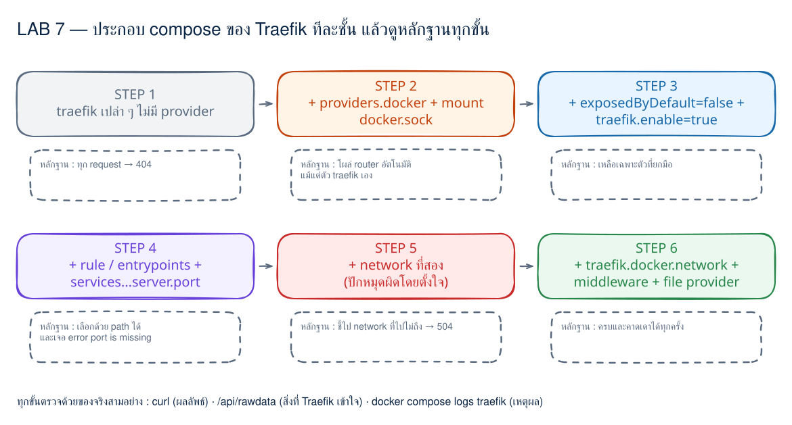
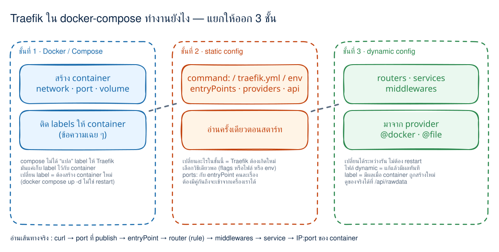
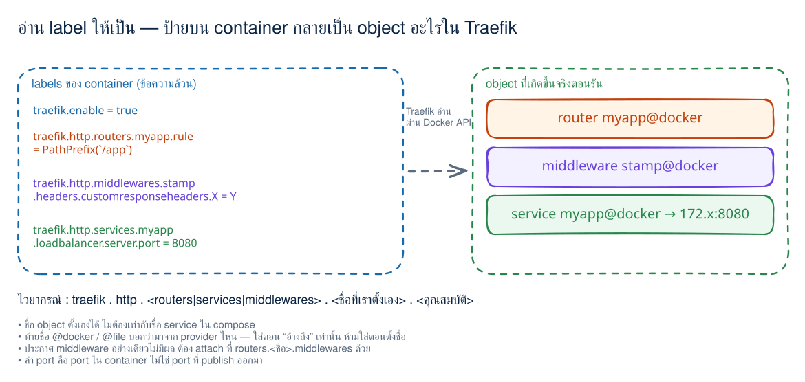
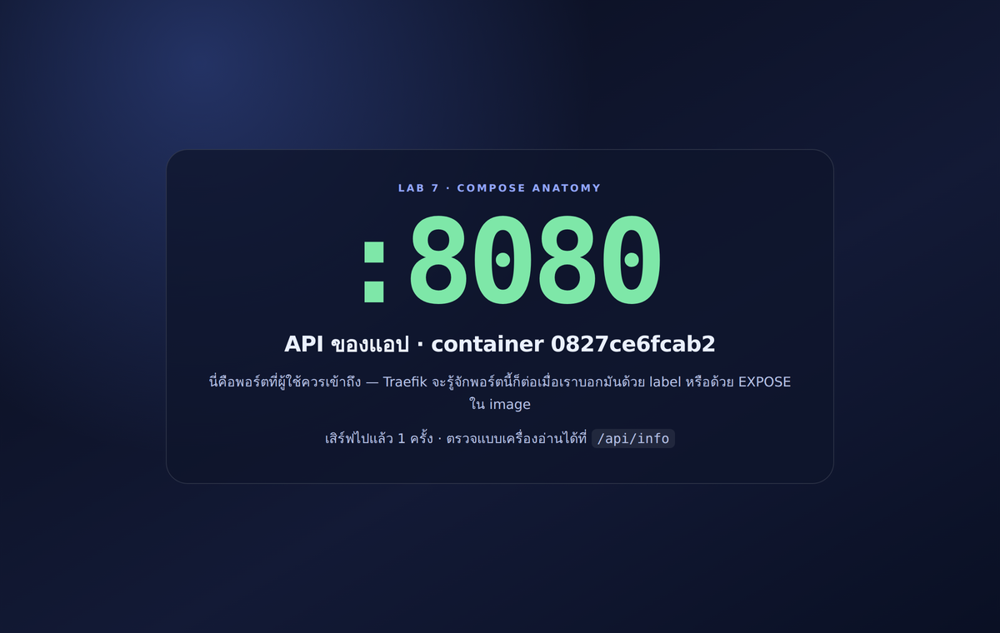
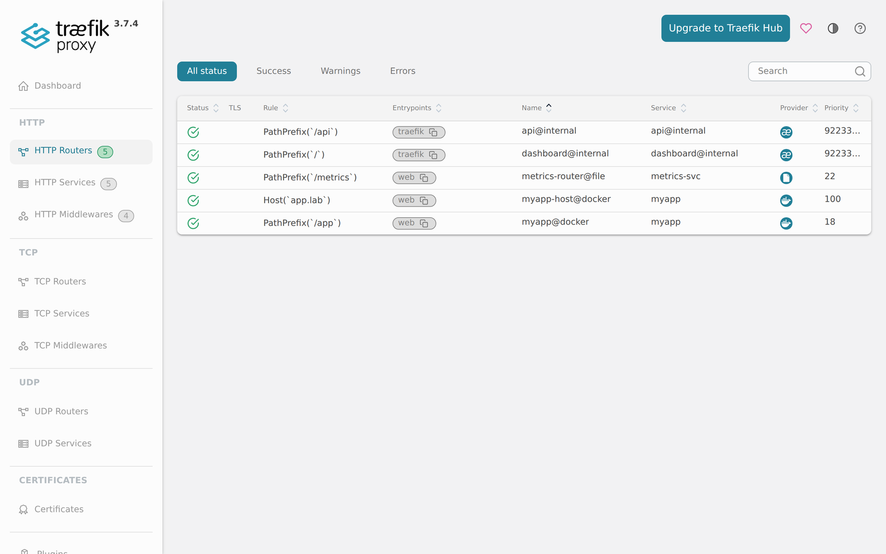

# LAB 7 — ผ่า Traefik ใน docker-compose ทีละชั้น

> โฟลเดอร์ `007_LAB_Compose_Anatomy` = **LAB 7** ของชุด Traefik
> (ไฟล์ของแล็บนี้: `compose.step1-bare.yml` … `compose.step5-network.yml` · `docker-compose.yml`
> · `compose.static-file.yml` · `compose.static-env.yml` · `traefik.yml` · `dynamic/extra.yml` · `app/`)

ห้าแล็บแรกเราคัดลอก compose ไปใช้แล้วมันก็ทำงาน — แล็บนี้ตอบคำถามที่ค้างอยู่ว่า
**“ไฟล์ compose นี้ทำงานยังไง บรรทัดไหนทำอะไร และถ้าลืมบรรทัดนั้นจะพังแบบไหน”**
เราจะเริ่มจาก Traefik เปล่า ๆ ที่ทำอะไรไม่ได้เลย แล้วเติมทีละชั้นจนครบ โดยทุกขั้น **ต้องมีหลักฐาน**

## สิ่งที่จะได้เรียนรู้

- แยกให้ขาดว่า compose ของ Traefik มี **3 ชั้น**: Docker/Compose · static config · dynamic config
- เข้าใจว่า `ports:` กับ `entryPoints` **คนละเรื่องกัน** และทำไมต้องมีคู่กัน
- เห็นว่า `--providers.docker=true` + mount `docker.sock` คือ “ตา” ที่ทำให้ Traefik เห็น container
- เห็นผลของ `exposedByDefault` (ค่าปริยาย **true**) และ `defaultRule` ที่สร้าง router ให้เองแม้ไม่มี label
- อ่านไวยากรณ์ label ออกทุกส่วน: `traefik.http.<routers|services|middlewares>.<ชื่อ>.<คุณสมบัติ>`
- รู้ว่า Traefik เลือก port ปลายทางอย่างไร และข้อความ `port is missing` เกิดจากอะไร
- เจอบั๊ก “container อยู่หลาย network” ด้วยตัวเอง แล้วแก้ด้วย `traefik.docker.network`
- พิสูจน์ความต่างของ **แก้ไฟล์ dynamic (hot reload)** กับ **แก้ label (ต้อง recreate container)**
- ตั้ง static config ได้สามแบบ (flags · `traefik.yml` · env `TRAEFIK_*`) และรู้ว่าทำไมไม่ควรผสมกัน

## ภาพรวมของแล็บนี้



| ขั้น | ไฟล์ | เพิ่มอะไร | หลักฐานที่ต้องเห็น |
|---|---|---|---|
| 1 | `compose.step1-bare.yml` | Traefik เปล่า ไม่มี provider | ทุก request ได้ `404` · ไม่มี router จาก Docker |
| 2 | `compose.step2-provider.yml` | `--providers.docker=true` + mount socket | โผล่ router อัตโนมัติ **รวมของ Traefik เอง** |
| 3 | `compose.step3-optin.yml` | `exposedByDefault=false` + `traefik.enable` | เหลือเฉพาะ container ที่ยกมือขอ |
| 4 | `compose.step4-labels.yml` | rule / entrypoints / service / `server.port` | เลือกด้วย path ได้ · เจอ error `port is missing` |
| 5 | `compose.step5-network.yml` | ต่อ app เข้า network ที่สอง | Traefik เลือก IP ผิด → `504` |
| 6 | `docker-compose.yml` | `traefik.docker.network` · middleware · file provider | ครบ ถูกต้อง และคาดเดาได้ทุกครั้ง |

แอปตัวอย่างในแล็บนี้ **ฟังสอง port พร้อมกัน** คือ `8080` (API ของแอป) และ `9090` (metrics ภายใน)
เพื่อให้เห็นชัดว่า “Traefik ส่งไป port ไหน” เป็นเรื่องที่เราต้องกำหนดเอง

> **คำถามก่อนเริ่ม:** ถ้าลบบรรทัด `- /var/run/docker.sock:/var/run/docker.sock:ro` ออกจาก compose
> ระบบจะพังแบบไหน — 404, 502 หรือ Traefik ไม่ยอมสตาร์ท? แล็บนี้จะทำให้ตอบได้จากของจริง

แล็บนี้ใช้ terminal เดียว ทุกคำสั่งตั้งแต่ข้อ 1 ให้รัน **ข้างในเครื่องเรียน**

> ⚠️ ใช้ port `8000` และ `8080` เหมือนแล็บอื่น — ปิดแล็บก่อนหน้าด้วย `docker compose down` ก่อนเริ่ม

---

## 0. เตรียมเครื่องเรียน

```bash
docker start devtools 2>/dev/null || \
  docker run -dit --name devtools --privileged -p 2222:22 tuchsanai/devtools:2569_1
ssh root@localhost -p 2222        # password : passwd
```

> 📝 **คำอธิบาย:** ใช้เครื่องเรียนเดิมถ้ามี · `--privileged` จำเป็นสำหรับ Docker-in-Docker และใช้เฉพาะกล่องเรียนนี้เท่านั้น

```bash
docker --version
docker info --format 'Docker daemon: {{.ServerVersion}}'
```

✅ **Expected output:**

```text
Docker version 29.6.2, build dfc4efb
Docker daemon: 29.6.2
```

---

## 1. Clone และทำความเข้าใจ “สามชั้น” ก่อนลงมือ

```bash
mkdir -p ~/labwork && cd ~/labwork
git clone https://github.com/Tuchsanai/DevTools.git
cd DevTools/03_Application_Docker/01_Traefik_Reverse_Proxy_Gateway_LB/007_LAB_Compose_Anatomy
ls
```

> 📝 **คำอธิบาย:** ถ้าเคย clone แล้วให้ข้าม `git clone` · ไฟล์ `compose.stepN-*.yml` แต่ละไฟล์เป็น compose **ฉบับเต็ม** ที่ยืนได้ด้วยตัวเอง จึงเทียบกันด้วย `diff` ได้ตรง ๆ



สิ่งที่ต้องแยกให้ออกตลอดทั้งแล็บ:

| ชั้น | อยู่ตรงไหนใน compose | เปลี่ยนแล้วต้องทำอะไร |
|---|---|---|
| **Docker / Compose** | `image` · `ports` · `volumes` · `networks` · `labels` | สร้าง container ใหม่ (`docker compose up -d`) |
| **static config** | `command:` ของ Traefik (หรือ `traefik.yml` / env `TRAEFIK_*`) | Traefik ต้องเกิดใหม่ |
| **dynamic config** | routers · services · middlewares ที่มาจาก provider | เปลี่ยนได้ระหว่างรัน (ไฟล์ = ทันที, label = เมื่อ container เกิดใหม่) |

> **สำคัญ:** Compose **ไม่ได้แปล** label ให้ Traefik — มันแค่แปะ label ไว้กับ container
> คนที่อ่าน label แล้วสร้าง router จริง ๆ คือ Traefik ผ่าน Docker API

ดูความต่างของแต่ละขั้นแบบเร็ว ๆ ก่อน:

```bash
diff compose.step1-bare.yml compose.step2-provider.yml
```

> 📝 **คำอธิบาย:** `diff` ทำให้เห็นว่า “ขั้นนี้เพิ่มอะไรมาบ้าง” โดยไม่ต้องอ่านทั้งไฟล์ · เทคนิคนี้ใช้ได้กับทุกคู่ในแล็บ
>
> ⏱️ **เรื่องเวลา:** ทุกขั้นในแล็บนี้มี `sleep` สั้น ๆ หลัง `up -d` เพื่อรอให้ Traefik อ่าน config ใหม่ ·
> ถ้าเครื่องช้ากว่านั้น ผลอาจยังไม่ตรง — **คำสั่งตรวจทุกคำสั่งรันซ้ำได้อย่างปลอดภัย** ให้รอสัก 2–3 วินาทีแล้วรันซ้ำ
> ก่อนจะสรุปว่าเป็นผลของบทเรียน

---

## 2. STEP 1 — Traefik เปล่า ๆ : ยังไม่มีตาไว้มองหา backend

```bash
docker compose -f compose.step1-bare.yml up -d --build
sleep 5
curl -s -o /dev/null -w 'GET /        -> HTTP %{http_code}\n' http://localhost:8000/
curl -s -o /dev/null -w 'GET /app     -> HTTP %{http_code}\n' http://localhost:8000/app
```

> 📝 **คำอธิบาย:** compose ไฟล์นี้มี Traefik + app ครบ ทั้งคู่อยู่ network เดียวกัน และ app ก็ทำงานปกติ — แต่ Traefik ยังไม่รู้จัก app เพราะ **ไม่มี provider** · `--build` สร้าง image ของ app ในรอบแรก

✅ **Expected output** — ตอบได้ แต่ตอบว่า “ไม่รู้จักเส้นทางนี้”:

```text
GET /        -> HTTP 404
GET /app     -> HTTP 404
```

> **404 ตรงนี้แปลว่าอะไร:** แปลว่า **Traefik ยังมีชีวิตและรับ request อยู่** (ถ้าไม่มีใครฟัง port
> เราจะได้ `curl: (7) Failed to connect` ไม่ใช่ 404) เพียงแต่ไม่มี router ตัวไหน match เลย

ตรวจว่า entryPoint ถูกสร้างจริงไหม:

```bash
curl -s http://localhost:8080/api/entrypoints | python3 -m json.tool | grep -E '"(name|address)"'
```

> 📝 **คำอธิบาย:** `api.insecure=true` เปิด REST API ไว้ที่ port `8080` เราจึงถาม Traefik ตรง ๆ ได้ว่า “ตอนนี้เข้าใจอะไรอยู่บ้าง” · `python3 -m json.tool` จัดรูป JSON ให้อ่านง่าย (เครื่องเรียนไม่มี `jq`)

✅ **Expected output** — entryPoint ชื่อ `web` ที่ `:80` มาจาก flag `--entrypoints.web.address=:80`
ส่วน `traefik` ที่ `:8080` คือ port ของ API/dashboard ที่เกิดจาก `--api.insecure=true`:

```text
        "address": ":8080",
        "name": "traefik"
        "address": ":80",
        "name": "web"
```

```bash
curl -s http://localhost:8080/api/http/routers | python3 -m json.tool | grep -E '"(name|rule|status)"'
```

✅ **Expected output** — มีแต่ router ภายในของ Traefik เอง ไม่มีอะไรจาก Docker เลย:

```text
        "rule": "PathPrefix(`/api`)",
        "status": "enabled",
        "name": "api@internal",
        "rule": "PathPrefix(`/`)",
        "status": "enabled",
        "name": "dashboard@internal",
```

> **บทเรียนบรรทัดเดียว:** `ports: "8000:80"` ทำให้ *เข้าถึง* Traefik ได้
> `--entrypoints.web.address=:80` ทำให้ Traefik *ฟัง* — ขาดอย่างใดอย่างหนึ่งก็ใช้งานไม่ได้
> และทั้งสองอย่างรวมกัน **ยังไม่ทำให้เกิด route** ต้องมี provider ก่อน
>
> อาการที่ต่างกันชัดเจน (ทดสอบจริงบน v3.7.4):
> · ไม่ publish port → `curl: (7) Failed to connect`
> · publish ไป port ที่ไม่มีใครฟังใน container → `curl: (56) Recv failure: Connection reset by peer`
> · มีครบทั้งคู่แต่ไม่มี router → `HTTP 404`
>
> 🔎 **เกร็ดที่หลายคนไม่รู้:** ถ้า **ไม่ประกาศ `entryPoints` เลยสักตัว** Traefik v3 จะสร้างให้เองหนึ่งตัว
> ชื่อ `http` ที่ `:80` (ลองได้ด้วย `docker run -d -p 8000:80 traefik:v3.7.4 --api.insecure=true`
> แล้ว `curl localhost:8000` จะได้ 404 ไม่ใช่ connection reset) · แต่พอเราประกาศ `web` เอง
> ตัว `http` จะไม่ถูกสร้าง — ตรวจได้จาก `/api/entrypoints` ที่แสดงเฉพาะ `web` กับ `traefik`

---

## 3. STEP 2 — เปิด Docker provider : Traefik เห็นทุก container ทันที

```bash
diff compose.step1-bare.yml compose.step2-provider.yml
docker compose -f compose.step2-provider.yml up -d
sleep 6
curl -s http://localhost:8080/api/http/routers | python3 -m json.tool | grep -E '"(name|rule|status)"'
```

> 📝 **คำอธิบาย:** เพิ่มมาสองอย่างเท่านั้น — flag `--providers.docker=true` และ mount `/var/run/docker.sock` · flag บอกว่า “ให้ไปอ่าน Docker API” ส่วน socket คือช่องทางที่จะไปอ่าน · ขาดอย่างใดอย่างหนึ่งก็ไม่เกิด router (ถ้าไม่ mount socket จะเห็น error ใน `docker compose logs traefik`)

✅ **Expected output** — มี router โผล่มาเองสองตัวทั้งที่ยัง **ไม่มี label ใด ๆ**:

```text
        "rule": "PathPrefix(`/api`)",
        "status": "enabled",
        "name": "api@internal",
        "rule": "Host(`app-lab007`)",
        "status": "enabled",
        "name": "app-lab007@docker",
        "rule": "PathPrefix(`/`)",
        "status": "enabled",
        "name": "dashboard@internal",
        "rule": "Host(`traefik-lab007`)",
        "status": "enabled",
        "name": "traefik-lab007@docker",
```

> 📝 **เกิดอะไรขึ้น:** `exposedByDefault` มีค่าปริยายเป็น **true** → ทุก container ที่ Traefik มองเห็นจะถูก
> route โดยอัตโนมัติ และเมื่อไม่มี label `rule` Traefik จะใช้ **defaultRule** คือ ``Host(`{{ normalize .Name }}`)``
> จึงได้ชื่อโฮสต์แปลก ๆ อย่าง `app-lab007` · สังเกตว่า **Traefik สร้าง router ให้ตัวเองด้วย** (`traefik-lab007@docker`)

พิสูจน์ว่า router อัตโนมัติใช้ได้จริง:

```bash
curl -s -o /dev/null -w 'ไม่ใส่ Host           -> HTTP %{http_code}\n' http://localhost:8000/
curl -s -o /dev/null -w 'Host: app-lab007      -> HTTP %{http_code}\n' -H 'Host: app-lab007' http://localhost:8000/
curl -s -H 'Host: app-lab007' http://localhost:8000/api/info; echo
curl -s -o /dev/null -w 'Host: traefik-lab007  -> HTTP %{http_code}\n' -H 'Host: traefik-lab007' http://localhost:8000/
```

> 📝 **คำอธิบาย:** `-H 'Host: ...'` ปลอม header `Host` เพื่อให้ตรง rule (ชื่อนี้ไม่มีใน DNS — และ defaultRule **ไม่ได้สร้าง DNS ให้**) · บรรทัดสุดท้ายยิงไป router ของ **Traefik เอง** ซึ่ง service ของมันชี้กลับมาที่ `http://<ip ของ traefik>:80` — request จึงวนกลับเข้า entryPoint เดิมและ match router เดิมอีกครั้ง Traefik มี middleware ภายในชื่อ `DenyRouterRecursion` คอยตัดวงจรนี้ จึงตอบ `400` (body ว่าง)

✅ **Expected output:**

```text
ไม่ใส่ Host           -> HTTP 404
Host: app-lab007      -> HTTP 200
{"role": "app", "port": 8080, "hostname": "c84fca18a17f", "path": "/api/info", "host_header": "app-lab007", "served": 2}
Host: traefik-lab007  -> HTTP 400
```

อยากเห็นเหตุผลของ `400` ให้เปิด log ระดับ DEBUG ชั่วคราวแล้วยิงซ้ำ:

```bash
docker compose -f compose.step2-provider.yml logs traefik --no-log-prefix | grep -i recursion | tail -1
```

✅ **Expected output** — บรรทัดนี้จะโผล่เมื่อรันด้วย `--log.level=DEBUG` (ไฟล์ขั้นนี้ตั้ง `INFO` ไว้
ถ้าอยากลองให้แก้เป็น `DEBUG` แล้ว `up -d` ใหม่):

```text
DBG .../middlewares/denyrouterrecursion/deny_router_recursion.go:47 > Rejecting request in provenance of the same router ("traefik-lab007@docker") to stop potential infinite loop. middlewareType=DenyRouterRecursion
```

> 📝 สังเกต `"port": 8080` — แอปฟังสอง port (8080, 9090) แต่ Traefik **เลือก port ต่ำสุด** ที่ image ประกาศ `EXPOSE` ไว้
> นี่คือการ “เดา” ที่บังเอิญถูกในกรณีนี้ ข้อ 5 จะแสดงว่าถ้าเดาผิดหรือเดาไม่ได้จะเป็นอย่างไร

ดูฝั่ง service ว่า Traefik คุยกับ container ที่ IP อะไร:

```bash
curl -s http://localhost:8080/api/http/services | python3 -m json.tool | grep -E '"(name|url)"'
```

✅ **Expected output** — `noop@internal` เป็นของภายใน ส่วนอีกสองตัวคือ container จริง
(เลข IP ต่างกันได้ทุกรอบที่ `up` ใหม่ · บรรทัด `url` จะอยู่**เหนือ**ชื่อ service ของตัวเองเพราะ JSON เรียงคีย์แบบนั้น):

```text
        "name": "api@internal",
                    "url": "http://172.19.0.3:8080"
        "name": "app-lab007@docker",
        "name": "dashboard@internal",
        "name": "noop@internal",
                    "url": "http://172.19.0.2:80"
        "name": "traefik-lab007@docker",
```

> ⚠️ **นี่คือเหตุผลที่ทุกแล็บในชุดนี้ตั้ง `exposedByDefault=false`** — ไม่งั้น container ทุกตัวบนเครื่อง
> (รวม container ของแล็บอื่นที่รันค้างอยู่) จะถูกเปิดออกทางประตูหน้าโดยไม่ตั้งใจ

---

## 4. STEP 3 — deny by default : ต้องยกมือขอถึงจะได้ route

```bash
diff compose.step2-provider.yml compose.step3-optin.yml
docker compose -f compose.step3-optin.yml up -d
sleep 6
curl -s http://localhost:8080/api/http/routers | python3 -m json.tool | grep -E '"(name|rule|status)"'
```

> 📝 **คำอธิบาย:** เพิ่ม flag `--providers.docker.exposedByDefault=false` (ฝั่ง Traefik) และ label `traefik.enable: "true"` (ฝั่ง app) · ตอนนี้ **ต้องประกาศตัวเอง** ถึงจะถูก route — Traefik ที่ไม่มี label จึงหายไปจากตาราง

✅ **Expected output** — เหลือ `app-lab007@docker` ตัวเดียว (ยังใช้ defaultRule อยู่):

```text
        "rule": "PathPrefix(`/api`)",
        "status": "enabled",
        "name": "api@internal",
        "rule": "Host(`app-lab007`)",
        "status": "enabled",
        "name": "app-lab007@docker",
        "rule": "PathPrefix(`/`)",
        "status": "enabled",
        "name": "dashboard@internal",
```

```bash
curl -s -o /dev/null -w 'Host: app-lab007      -> HTTP %{http_code}\n' -H 'Host: app-lab007' http://localhost:8000/
curl -s -o /dev/null -w 'Host: traefik-lab007  -> HTTP %{http_code}\n' -H 'Host: traefik-lab007' http://localhost:8000/
```

✅ **Expected output** — router ของ Traefik หายไปแล้ว จึงกลายเป็น 404:

```text
Host: app-lab007      -> HTTP 200
Host: traefik-lab007  -> HTTP 404
```

---

## 5. STEP 4 — ไวยากรณ์ของ label และการเลือก port



อ่านชื่อ label ให้เป็นก่อน:

```text
traefik . http . routers  . myapp . rule          = PathPrefix(`/app`)
   │       │        │         │       └── คุณสมบัติของ object
   │       │        │         └────────── ชื่อ object ที่ "เราตั้งเอง"
   │       │        └──────────────────── ชนิด : routers | services | middlewares
   │       └───────────────────────────── โปรโตคอล : http | tcp | udp
   └───────────────────────────────────── ขึ้นต้นด้วย traefik เสมอ
```

```bash
diff compose.step3-optin.yml compose.step4-labels.yml
docker compose -f compose.step4-labels.yml up -d --build --remove-orphans
sleep 7
curl -s http://localhost:8080/api/http/routers | python3 -m json.tool | grep -E '"(name|rule|status)"'
```

> 📝 **คำอธิบาย:** ขั้นนี้เพิ่ม router ชื่อ `myapp` พร้อม `rule`/`entrypoints`/`service` และ service `myapp` ที่ระบุ `loadbalancer.server.port: "8080"` · เพิ่ม service ใหม่ชื่อ `bare` ที่ build จาก `Dockerfile.noexpose` (image เดียวกันแต่ **ไม่มี `EXPOSE`**) · `--remove-orphans` ลบ container ของขั้นก่อนที่ไม่มีในไฟล์นี้

✅ **Expected output** — มี `myapp@docker` ตามที่ตั้งชื่อเอง แต่ **ไม่มี `bare@docker` เลย**:

```text
        "rule": "PathPrefix(`/api`)",
        "status": "enabled",
        "name": "api@internal",
        "rule": "PathPrefix(`/`)",
        "status": "enabled",
        "name": "dashboard@internal",
        "rule": "PathPrefix(`/app`)",
        "status": "enabled",
        "name": "myapp@docker",
```

```bash
curl -s http://localhost:8000/app/api/info; echo
curl -s -o /dev/null -w '/bare  -> HTTP %{http_code}\n' http://localhost:8000/bare
docker compose -f compose.step4-labels.yml logs traefik --no-log-prefix | grep "port is missing" | tail -1
```

> 📝 **คำอธิบาย:** `/app` ใช้ได้แล้วโดยไม่ต้องปลอม Host เพราะ rule เป็น `PathPrefix` · ส่วน `/bare` ได้ 404 เพราะ router ของมันถูก **ทิ้งทั้งตัว** — เหตุผลอยู่ใน log

✅ **Expected output:**

```text
{"role": "app", "port": 8080, "hostname": "b1e60c313249", "path": "/app/api/info", "host_header": "localhost:8000", "served": 1}
/bare  -> HTTP 404
2026-08-15T16:19:52Z ERR error="service \"bare-lab007\" error: port is missing" container=bare-lab007-e1adba2e... providerName=docker
```

เปิด `http://localhost:8000/app/` ในเบราว์เซอร์ (ผ่าน port forward) จะเห็นหน้าที่บอก port ตัวใหญ่ ๆ:



> 📝 **คำอธิบาย:** หน้านี้มีไว้เพื่ออ่าน “Traefik ส่งมาที่ port ไหน” ได้ในพริบตา — ถ้าเปลี่ยน label เป็น `9090`
> หน้าตาจะเปลี่ยนเป็นสีส้มและเขียนว่า metrics ทันที

> **กติกาการเลือก port ของ Traefik v3 (จำสั้น ๆ):**
> 1. มี label `services.<ชื่อ>.loadbalancer.server.port` → ใช้ค่านั้น (ชัดเจนที่สุด — ควรใส่เสมอ)
> 2. ไม่มี label แต่ image `EXPOSE` ไว้ port เดียว → ใช้ port นั้น
> 3. `EXPOSE` หลาย port → เอกสารระบุว่าใช้ “port แรกที่ expose” — ในการทดสอบบน `v3.7.4` ได้**ตัวเลขน้อยที่สุด**
>    (อย่าไปพึ่งลำดับนี้ ให้ใส่ label เสมอ)
> 4. ไม่มีทั้งสองอย่าง → `port is missing` และ router ตัวนั้นหายไปจากระบบ
>
> **ค่านี้คือ port ภายใน container เสมอ** ไม่ใช่ port ที่ publish และ backend **ไม่ต้องมี `ports:`**

ลองพิสูจน์ข้อ 1 ด้วยตัวเอง — แก้ label เป็น `9090` แล้ว `up -d` ใหม่ จะเห็นหน้า metrics แทน API
(รายละเอียดเรื่อง “ทำไมต้อง `up -d` ไม่ใช่ `restart`” อยู่ในข้อ 8)

---

## 6. STEP 5 — บั๊กที่ตามยากที่สุด : container อยู่หลาย network

```bash
diff compose.step4-labels.yml compose.step5-network.yml
docker compose -f compose.step5-network.yml up -d --remove-orphans
sleep 7
docker inspect -f '{{range $k,$v := .NetworkSettings.Networks}}{{$k}}={{$v.IPAddress}} {{end}}' lab007-app-1
curl -s http://localhost:8080/api/http/services/myapp@docker | python3 -m json.tool | grep -E '"(url|status)"'
```

> 📝 **คำอธิบาย:** ขั้นนี้ต่อ `app` เข้า network ที่สอง (`lab007-backoffice`) ซึ่ง Traefik **ไม่ได้อยู่ด้วย** และไฟล์นี้ **จงใจปักหมุดผิด** ด้วย `traefik.docker.network: lab007-backoffice` เพื่อให้ทุกคนเห็นอาการเดียวกันทุกครั้ง · คำสั่งที่สองพิมพ์ IP ของ app ทุก network · คำสั่งที่สามถาม Traefik ว่ามันใช้ IP ไหน

✅ **Expected output** — Traefik ใช้ IP ของ network ที่มันไปไม่ถึง (`172.20.x` = backoffice; เลข IP เปลี่ยนได้):

```text
lab007-backoffice=172.20.0.2 lab007net=172.19.0.3
                "url": "http://172.20.0.2:8080"
    "status": "enabled",
```

> ⚠️ **ของจริงร้ายกว่านี้:** เคสที่เจอบ่อยไม่ใช่ “ปักหมุดผิด” แต่คือ **ไม่ใส่ label เลย** แล้วปล่อยให้ Traefik เลือกเอง
> ซึ่งเอกสารของ Traefik ระบุว่า**เลือกแบบไม่แน่นอน**เมื่อ container อยู่หลาย network — บางรอบถูก บางรอบผิด
>
> อยากเห็นด้วยตา ให้ลบบรรทัด `traefik.docker.network: lab007-backoffice` ออกจาก `compose.step5-network.yml`
> แล้วรัน `docker compose -f compose.step5-network.yml up -d --force-recreate app` ซ้ำ 3–4 รอบ พร้อมอ่านค่า `url`
> ทุกรอบ — จะเห็นว่ามันสลับไปมา **ความไม่แน่นอนนี่แหละคืออาการของบั๊กที่ตามยากที่สุด** (อย่าลืมใส่บรรทัดเดิมกลับ)

ดูอาการฝั่งผู้ใช้:

```bash
curl -s -o /dev/null -m 5 -w '/app (จำกัด 5 วิ) -> %{http_code}\n' http://localhost:8000/app/
time curl -s -o /dev/null -m 45 -w '/app (รอเต็ม)     -> HTTP %{http_code}\n' http://localhost:8000/app/
```

> 📝 **คำอธิบาย:** `%{http_code}` เป็น `000` แปลว่า **curl ยอมแพ้ก่อน** ไม่ได้แปลว่าเซิร์ฟเวอร์ตอบอะไร · ถ้ารอจนสุด Traefik จะตอบ `504 Gateway Timeout` เองที่ประมาณ 30 วินาที (ค่า dial timeout ปริยาย) · สังเกตว่า **dashboard ยังเขียวหมด** เพราะ config ถูกต้องทุกอย่าง ผิดแค่ “IP ที่ไปไม่ถึง”

✅ **Expected output:**

```text
/app (จำกัด 5 วิ) -> 000
/app (รอเต็ม)     -> HTTP 504

real	0m30.009s
```

> **วิธีแก้:** ใส่ label `traefik.docker.network: lab007net` เพื่อบอกให้ชัดว่าจะคุยผ่าน network ไหน
> (ทำแล้วในไฟล์ฉบับสมบูรณ์ข้อถัดไป) · label นี้ **ไม่ได้** ต่อ Traefik เข้า network ให้ — Traefik ต้องอยู่ใน
> network นั้นเองอยู่แล้ว · และค่าที่ใส่คือ **ชื่อ network จริง** จึงควรตั้ง `networks.<x>.name:` ให้คงที่

---

## 7. ฉบับสมบูรณ์ — ครบทุกชั้นและคาดเดาได้

```bash
diff compose.step5-network.yml docker-compose.yml
docker compose up -d --remove-orphans
sleep 7
curl -s http://localhost:8080/api/http/routers | python3 -m json.tool | grep -E '"(name|rule|priority|status)"' | grep -v priorityStr
```

> 📝 **คำอธิบาย:** ไฟล์นี้เพิ่มสี่อย่าง — `traefik.docker.network` (แก้บั๊กข้อ 6) · middleware ที่ประกาศ **และ attach** · router ที่สองแบบ Host พร้อม `priority` · และ **file provider** (`--providers.file.directory`) ที่อ่านไฟล์ใน `dynamic/`

✅ **Expected output** — สังเกตคอลัมน์ `priority` และนามสกุลของ provider:

```text
        "rule": "PathPrefix(`/api`)",
        "priority": 9223372036854775806,
        "status": "enabled",
        "name": "api@internal",
        "rule": "PathPrefix(`/`)",
        "priority": 9223372036854775805,
        "status": "enabled",
        "name": "dashboard@internal",
        "rule": "PathPrefix(`/metrics`)",
        "priority": 22,
        "status": "enabled",
        "name": "metrics-router@file",
        "rule": "Host(`app.lab`)",
        "priority": 100,
        "status": "enabled",
        "name": "myapp-host@docker",
        "rule": "PathPrefix(`/app`)",
        "priority": 18,
        "status": "enabled",
        "name": "myapp@docker",
```

> **เรื่อง priority ที่คนเข้าใจผิดบ่อย:** ค่าปริยายคำนวณจาก **ความยาวของข้อความ rule** ไม่ใช่ความเฉพาะเจาะจงเชิงความหมาย
> — ``PathPrefix(`/app`)`` ยาว 18 ตัวอักษรจึงได้ 18 ส่วน ``PathPrefix(`/metrics`)`` ได้ 22 · ตัวเลขสูงกว่าชนะ
> ถ้าสอง rule ยาวเท่ากันก็จะได้ค่าเท่ากัน — กรณีเสมอ**ข้าม provider** v3 จะตัดสินด้วย `providers.precedence` ส่วนเสมอกันเองใน provider เดียวกันอย่าไปเดาว่าตัวไหนชนะ · เวลาต้องการลำดับที่แน่นอนให้ **ใส่ `priority` เอง**

```bash
curl -s http://localhost:8080/api/http/services | python3 -m json.tool | grep -E '"(name|url)"'
curl -s http://localhost:8080/api/http/middlewares | python3 -m json.tool | grep -E '"(name|provider)"'
```

✅ **Expected output** — เห็น object จากสอง provider ปนกันในระบบเดียว:

```text
        "name": "api@internal",
        "name": "dashboard@internal",
                    "url": "http://app:9090"
        "name": "metrics-svc@file",
                    "url": "http://172.19.0.3:8080"
        "name": "myapp@docker",
        "name": "noop@internal",
        "name": "dashboard_redirect@internal",
        "provider": "internal",
        "name": "dashboard_stripprefix@internal",
        "provider": "internal",
        "name": "file-stamp@file",
        "provider": "file",
        "name": "stamp@docker",
        "provider": "docker",
```

> 📝 `metrics-svc@file` ชี้ไปที่ `http://app:9090` — file provider ชี้ไปที่ **URL อะไรก็ได้** ไม่จำเป็นต้องเป็น
> container ที่มี label (ที่นี่ใช้ชื่อ service ของ Compose เป็นชื่อโฮสต์ได้เพราะอยู่ network เดียวกัน)

ทดสอบทั้งสามเส้นทาง:

```bash
curl -s -D - -o /dev/null http://localhost:8000/app/ | grep -iE '^HTTP/|^x-config-source'
curl -s -D - -o /dev/null -H 'Host: app.lab' http://localhost:8000/ | grep -iE '^HTTP/|^x-config-source'
curl -s http://localhost:8000/metrics
```

> 📝 **คำอธิบาย:** router `myapp` ผูก middleware สองตัวจากคนละ provider (`stamp@docker,file-stamp@file`) จึงได้ header สองบรรทัด · router `myapp-host` ผูกแค่ตัวเดียวจึงได้บรรทัดเดียว — **การอ้างข้าม provider ต้องใส่ `@docker` / `@file` เสมอ**

✅ **Expected output:**

```text
HTTP/1.1 200 OK
X-Config-Source: docker-labels
X-Config-Source-File: file-provider
HTTP/1.1 200 OK
X-Config-Source: docker-labels
# HELP lab7_requests_total requests served on the internal metrics port
lab7_requests_total{port="9090"} 1
```

เปิด Dashboard ดูภาพรวม (forward port `8080` ใน VS Code แล้วเปิด `http://localhost:8080/dashboard/` — **ต้องมี `/` ปิดท้าย**):



> 📝 **คำอธิบาย:** ไอคอนคอลัมน์ Provider แยกให้เห็นว่า router ตัวไหนมาจาก Docker (โลโก้ปลาวาฬ) จากไฟล์ หรือเป็นของภายใน · คอลัมน์ Priority ตรงกับที่อ่านจาก API เป๊ะ

---

## 8. static · dynamic · label : อะไรเปลี่ยนแล้วต้องทำอะไร

### 8.1 แก้ไฟล์ dynamic → มีผลทันที ไม่ต้อง restart

```bash
docker inspect -f '{{.Id}}' lab007-traefik-1 | cut -c1-12
sed -i 's/X-Config-Source-File: "file-provider"/X-Config-Source-File: "file-provider-v2"/' dynamic/extra.yml
sleep 3
curl -s -D - -o /dev/null http://localhost:8000/app/ | grep -i '^x-config-source-file'
docker inspect -f '{{.Id}}' lab007-traefik-1 | cut -c1-12
```

> 📝 **คำอธิบาย:** `--providers.file.watch=true` ทำให้ Traefik เฝ้าดูไฟล์ในโฟลเดอร์ `dynamic/` · เทียบ container id ก่อน/หลังเพื่อยืนยันว่า **ไม่ได้ restart** อะไรเลย

✅ **Expected output** — ค่า header เปลี่ยน แต่ container id เท่าเดิม:

```text
3220d032e15e
X-Config-Source-File: file-provider-v2
3220d032e15e
```

คืนค่าเดิมก่อนไปต่อ:

```bash
sed -i 's/file-provider-v2/file-provider/' dynamic/extra.yml
```

### 8.2 แก้ label → `restart` ไม่พอ ต้อง `up -d`

```bash
sed -i 's/server.port: "8080"/server.port: "9090"/' docker-compose.yml
docker compose restart app
sleep 4
curl -s -D - -o /dev/null http://localhost:8000/app/ | grep -i '^x-lab-role'
curl -s http://localhost:8080/api/http/services/myapp@docker | python3 -m json.tool | grep '"url"'
```

> 📝 **คำอธิบาย:** `docker compose restart` แค่ **หยุดแล้วสตาร์ท container เดิม** — label เป็นคุณสมบัติที่ฝังตอน *สร้าง* container จึงยังเป็นค่าเก่า

✅ **Expected output** — ยังเป็น port เดิมทุกอย่าง:

```text
X-Lab-Role: app
                    "url": "http://172.19.0.3:8080"
```

```bash
docker compose up -d
sleep 5
curl -s -D - -o /dev/null http://localhost:8000/app/ | grep -i '^x-lab-role'
curl -s http://localhost:8080/api/http/services/myapp@docker | python3 -m json.tool | grep '"url"'
```

> 📝 **คำอธิบาย:** `up -d` เห็นว่า config ของ container ไม่ตรงกับไฟล์แล้ว จึง **สร้าง container ใหม่** (Recreated) → Traefik ได้รับ event → อ่าน label ใหม่ → เปลี่ยนปลายทางเป็น 9090 ซึ่งคือหน้า metrics

✅ **Expected output** — เปลี่ยนแล้ว และ container id ของ app เป็นตัวใหม่:

```text
X-Lab-Role: metrics
                    "url": "http://172.19.0.3:9090"
```

คืนค่าเดิม:

```bash
sed -i 's/server.port: "9090"/server.port: "8080"/' docker-compose.yml
docker compose up -d
```

| เปลี่ยนอะไร | ต้องทำอะไร | container id ที่เปลี่ยน |
|---|---|---|
| ไฟล์ใน `dynamic/` | ไม่ต้องทำอะไร (watch อยู่) | ไม่มี |
| label ของ backend | `docker compose up -d` | ของ backend |
| `command:` / `traefik.yml` / env ของ Traefik | `docker compose up -d` | ของ Traefik |
| `ports:` / `networks:` | `docker compose up -d` | ของ service ที่แก้ |

---

## 9. static config เขียนได้สามแบบ — และควรเลือกแบบเดียว

ไฟล์ `compose.static-file.yml` และ `compose.static-env.yml` มีส่วนของ `app` **เหมือนไฟล์ฉบับสมบูรณ์ทุกบรรทัด**
ต่างกันแค่วิธีเขียน static config ของ Traefik เท่านั้น — เราจึงเทียบผลได้ตรง ๆ

```bash
cat traefik.yml
```

> 📝 **คำอธิบาย:** สังเกตว่าไฟล์ `compose.static-file.yml` ไม่มี `command:` เลย — Traefik อ่าน `/etc/traefik/traefik.yml`
> เป็น static config ให้เองโดยอัตโนมัติ ส่วน `compose.static-env.yml` ใช้ตัวแปร `TRAEFIK_*` แทน
> (กติกาแปลงชื่อ: `--entrypoints.web.address` → `TRAEFIK_ENTRYPOINTS_WEB_ADDRESS` — ตัดขีดนำหน้า · ตัวใหญ่ · จุดเป็นขีดล่าง · เติม `TRAEFIK_`)

สร้างฟังก์ชันเล็ก ๆ ไว้ถ่ายภาพสถานะ แล้วสลับทั้งสามแบบ (ต้อง **recreate ทั้ง stack** ไม่ใช่แค่ traefik
เพราะ label ของ `app` ฝังอยู่กับ container):

```bash
snapshot() {
  for i in $(seq 1 30); do curl -fsS -m 2 http://localhost:8080/api/overview >/dev/null 2>&1 && break; sleep 1; done
  curl -s http://localhost:8080/api/entrypoints | python3 -m json.tool | grep -E '"(name|address)"'
  curl -s http://localhost:8080/api/http/routers  | python3 -m json.tool | grep '"name"'
}

echo '== A) command: flags =='
docker compose up -d --force-recreate >/dev/null 2>&1; snapshot

echo '== B) traefik.yml =='
docker compose -f compose.static-file.yml up -d --force-recreate >/dev/null 2>&1; snapshot

echo '== C) environment TRAEFIK_* =='
docker compose -f compose.static-env.yml up -d --force-recreate >/dev/null 2>&1; snapshot

docker compose up -d --force-recreate >/dev/null 2>&1   # กลับมาที่ฉบับ flags
```

> 📝 **คำอธิบาย:** `snapshot` รอให้ API พร้อมก่อน แล้วพิมพ์สองอย่าง — entryPoints (มาจาก static config) และรายชื่อ router
> (มาจาก provider) · ทั้งสามรอบต้องได้ผลชุดเดียวกันเป๊ะ ถ้าต่างแปลว่า static config สามแบบนี้ไม่เท่ากันจริง

✅ **Expected output** — เนื้อหาเหมือนกันทั้งสามบล็อก (ตัดมาแสดงบล็อกเดียว):

```text
        "address": ":8080",
        "name": "traefik"
        "address": ":80",
        "name": "web"
        "name": "api@internal",
        "name": "dashboard@internal",
        "name": "metrics-router@file",
        "name": "myapp-host@docker",
        "name": "myapp@docker",
```

> ⚠️ **อย่าผสมกัน:** เอกสารของ Traefik v3 ระบุว่าการใช้ static config หลายวิธีพร้อมกัน **ไม่รองรับ**
> และอาจให้ผลที่คาดเดาไม่ได้ — ไม่ใช่แค่ “ไล่ยากว่าอันไหนชนะ” · เลือกวิธีเดียวต่อหนึ่งระบบเสมอ

---

## 10. อ่าน `/api/rawdata` ให้เป็น

```bash
curl -s http://localhost:8080/api/rawdata | python3 -m json.tool | head -40
```

> 📝 **คำอธิบาย:** `/api/rawdata` คือ **dynamic config ทั้งก้อนที่ Traefik เข้าใจอยู่ตอนนี้** พร้อม error/สถานะ — Dashboard เองก็อ่านจาก API ชุดนี้ · ไม่ใช่ dump ของ static flags ทั้งหมด (อยากดู entryPoints/providers ให้ใช้ `/api/entrypoints` และ `/api/overview`)

สูตร debug ที่ใช้ได้ทุกครั้ง:

| อาการ | ตรวจอะไรก่อน |
|---|---|
| `404` | มี router ที่ rule ตรงไหม → `/api/http/routers` (อาจไม่มี หรือ rule ผิด) |
| `404` ทั้งที่มั่นใจว่าใส่ label แล้ว | `traefik.enable=true` ครบไหม · container ถูก recreate หลังแก้ label หรือยัง |
| `502` / `504` | router มี แต่ service ชี้ผิด → `/api/http/services` ดู `url` แล้วเทียบ `docker inspect` |
| middleware ไม่มีผล | ประกาศแล้วแต่ลืม attach → ดู `middlewares` ในหน้า router detail |
| router หายไปเฉย ๆ | ดู `docker compose logs traefik` — มักเป็น `port is missing` หรือ rule ผิดไวยากรณ์ |

---

## 11. สิบกับดักใน compose ที่เจอบ่อยที่สุด

| # | กับดัก | อาการ | ทางแก้ |
|---|---|---|---|
| 1 | ลืม `traefik.enable=true` (ขณะ `exposedByDefault=false`) | 404 เงียบ ๆ | ใส่ label ให้ backend ที่ต้องการ |
| 2 | ปล่อย `exposedByDefault` เป็น true | container ที่ไม่ตั้งใจถูกเปิดออกหมด | ตั้ง `false` เสมอ |
| 3 | ไม่ระบุ `loadbalancer.server.port` | `port is missing` หรือไปผิด port | ระบุ port ของ container ให้ชัด |
| 4 | สับสน host port กับ container port | 502/504 | ค่าใน label คือ **port ใน container** |
| 5 | container อยู่หลาย network | บางครั้งได้ บางครั้ง 504 | ใส่ `traefik.docker.network` |
| 6 | Traefik กับ backend คนละ network | 502 ตลอด | ต่อทั้งคู่เข้า network เดียวกัน |
| 7 | ประกาศ middleware แล้วไม่ attach | ไม่มี 401/429 อะไรเลย | ใส่ `routers.<ชื่อ>.middlewares` ด้วย |
| 8 | อ้าง middleware ข้าม provider โดยไม่ใส่ `@file` / `@docker` | router error | ใส่นามสกุล provider เมื่ออ้างถึง |
| 9 | แก้ label แล้ว `restart` | ค่าเดิมยังอยู่ | ใช้ `docker compose up -d` |
| 10 | `$` ในค่า label (เช่น hash ของ basicAuth) | auth ไม่ผ่าน | escape เป็น `$$` ในไฟล์ compose |

> เพิ่มอีกข้อที่ไม่ได้อยู่ในตาราง: **Docker provider เห็น container ทั้ง daemon ไม่ใช่แค่ project ของตัวเอง**
> ถ้ามีแล็บอื่นรันค้างอยู่ Traefik ตัวนี้ก็จะเห็นด้วย — เป็นเหตุผลที่ต้อง `docker compose down` ทุกครั้งก่อนเปลี่ยนแล็บ
> (ถ้าจำเป็นต้องรันหลายชุดพร้อมกันจริง ๆ ใช้ `--providers.docker.constraints` กรองด้วย label ได้)

---

## แก้ปัญหาที่พบบ่อย

| ปัญหา | สาเหตุ | วิธีแก้ |
|---|---|---|
| `port is already allocated` | แล็บอื่นยังรัน (8000/8080) | `docker compose down` ในโฟลเดอร์นั้น |
| `/api/...` ตอบไม่ได้ | ยังไม่เปิด `--api.insecure=true` หรือไม่ได้ publish 8080 | ตรวจ compose ที่กำลังใช้อยู่ |
| dashboard 404 | ลืม `/` ปิดท้าย | ใช้ `http://localhost:8080/dashboard/` |
| router ไม่โผล่หลังแก้ไฟล์ | ยังไม่ recreate container | `docker compose -f <ไฟล์> up -d` |
| `curl: (7)` | ไม่มีใครฟัง port นั้น | `docker compose ps` ดูว่า Traefik ขึ้นไหม |
| ผล step 5 ไม่เหมือนใน readme | Traefik สุ่มเลือก network | รัน `--force-recreate app` ซ้ำ แล้วอ่านค่า `url` ที่ได้จริง |

---

## เก็บกวาด (Cleanup) และ Clean Re-run

```bash
docker compose down --remove-orphans
docker compose up -d
sleep 7
curl -s -o /dev/null -w 'clean re-run /app -> HTTP %{http_code}\n' http://localhost:8000/app/
docker compose down --remove-orphans
docker compose ps -a
```

> 📝 **คำอธิบาย:** `--remove-orphans` เก็บ container ที่เหลือจากไฟล์ขั้นก่อน ๆ (เช่น `bare`) ด้วย · หลัง `down` ครั้งสุดท้ายต้องไม่เหลือ container ของแล็บนี้

✅ **Expected output:**

```text
clean re-run /app -> HTTP 200
 Container lab007-traefik-1 Removed
 Container lab007-app-1 Stopped
 Container lab007-app-1 Removing
 Container lab007-app-1 Removed
 Network lab007-backoffice Removing
 Network lab007net Removing
 Network lab007-backoffice Removed
 Network lab007net Removed
```

---

## สรุปคำสั่งของแล็บนี้

```bash
docker compose -f compose.step1-bare.yml up -d --build      # ขั้น 1 : Traefik เปล่า → 404
docker compose -f compose.step2-provider.yml up -d          # ขั้น 2 : เปิด docker provider
docker compose -f compose.step3-optin.yml up -d             # ขั้น 3 : deny by default
docker compose -f compose.step4-labels.yml up -d --build --remove-orphans  # ขั้น 4 : label + port
docker compose -f compose.step5-network.yml up -d --remove-orphans   # ขั้น 5 : บั๊กหลาย network
docker compose up -d --remove-orphans                       # ฉบับสมบูรณ์

curl -s http://localhost:8080/api/http/routers     | python3 -m json.tool | grep -E '"(name|rule|status)"'
curl -s http://localhost:8080/api/http/services    | python3 -m json.tool | grep -E '"(name|url)"'
curl -s http://localhost:8080/api/http/middlewares | python3 -m json.tool | grep -E '"(name|provider)"'
curl -s http://localhost:8080/api/overview         | python3 -m json.tool | head -12
docker compose logs traefik | grep -i err

docker compose down --remove-orphans
```

---

## ✅ เช็กลิสต์ก่อนจบแล็บ

- [ ] อธิบายได้ว่า `ports:` กับ `entryPoints` ต่างกันอย่างไร และทำไมต้องมีทั้งคู่
- [ ] บอกได้ว่าถ้าไม่มี provider แล้ว Traefik จะตอบอะไร (และทำไมถึงเป็น 404 ไม่ใช่ connection refused)
- [ ] เห็นกับตาว่า `exposedByDefault` ปริยาย = true ทำให้เกิด router อัตโนมัติ **รวมของ Traefik เอง**
- [ ] อ่าน label `traefik.http.routers.myapp.rule` ออกทีละส่วนได้
- [ ] อธิบายกติกาการเลือก port ทั้งสี่ข้อ และเคยเห็นข้อความ `port is missing` จริง
- [ ] ทำให้เกิด `504` จากบั๊กหลาย network ได้ และแก้ด้วย `traefik.docker.network` ได้
- [ ] แยกได้ว่าอะไรคือ static / dynamic / label และแต่ละอย่างเปลี่ยนแล้วต้องทำอะไร
- [ ] พิสูจน์ได้ว่าแก้ไฟล์ `dynamic/` แล้ว container id ของ Traefik ไม่เปลี่ยน
- [ ] พิสูจน์ได้ว่า `docker compose restart` ไม่ทำให้ label ใหม่มีผล แต่ `up -d` ทำให้มีผล
- [ ] ตั้ง static config ได้ทั้งสามแบบ และรู้ว่าทำไมไม่ควรผสมกัน
- [ ] `docker compose down --remove-orphans` จนไม่เหลือ container ของแล็บนี้
