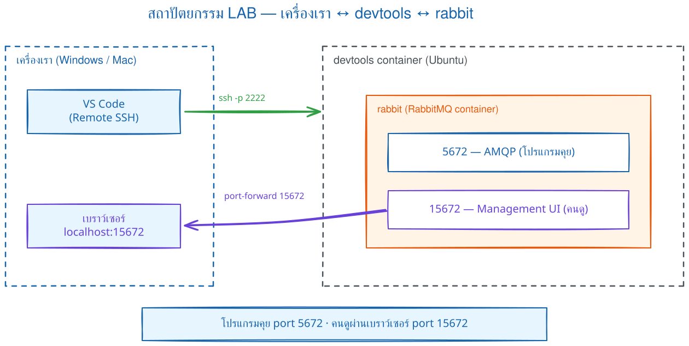
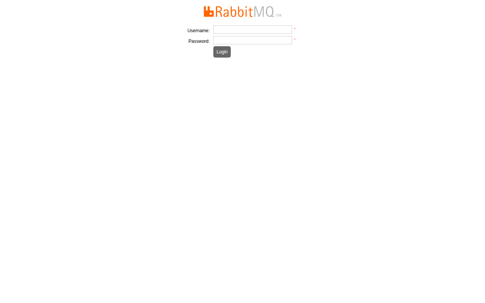
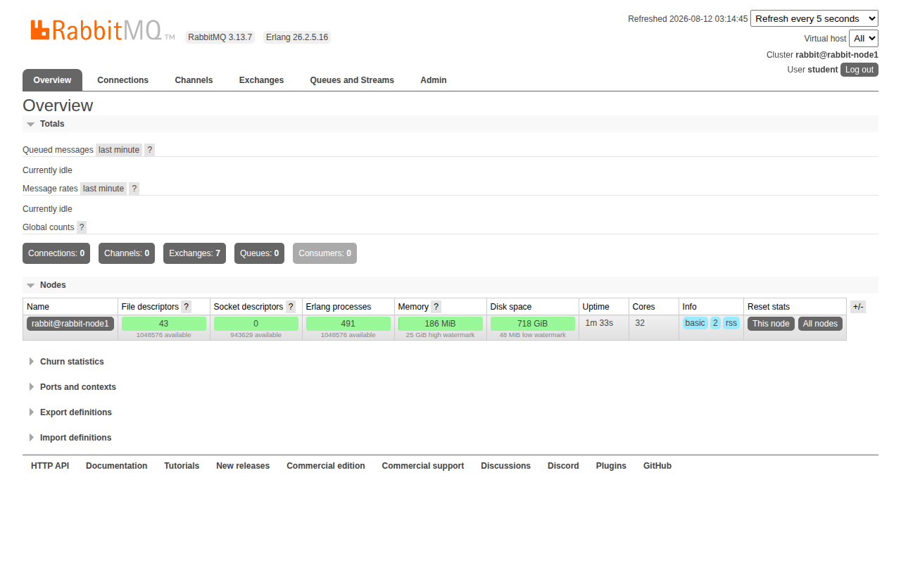
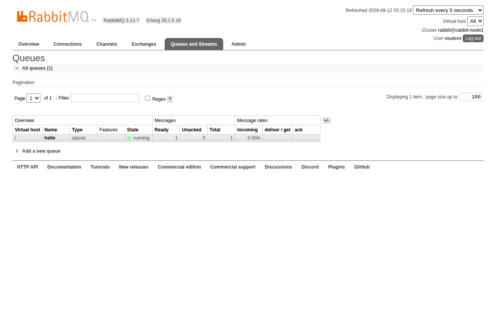

# LAB 1 — ติดตั้ง RabbitMQ Broker + Management UI + Hello World

> โฟลเดอร์ `001_LAB_RabbitMQ_Setup` = **LAB 1** ในสไลด์ `RabbitMQ_Slides.html`
> (ไฟล์โค้ดของแล็บนี้ : `send.py` · `receive.py` · `requirements.txt`)

## สิ่งที่จะได้เรียนรู้

- เปิด **RabbitMQ broker** ด้วย Docker คำสั่งเดียว โดยไม่ต้องติดตั้งอะไรบนเครื่องเลย
- broker เปิด **2 port** — `5672` (AMQP ให้โปรแกรมคุย) กับ `15672` (Management UI ให้คนดู)
- ใช้ **`rabbitmqctl`** สำรวจข้างใน broker : ดู status · ดู user · ดู queue
- เปิด **Management UI** ผ่าน port forwarding แล้วอ่านแท็บสำคัญให้เป็น
- เขียนโปรแกรม Python ด้วย **pika** : `send.py` ส่งข้อความเข้า queue · `receive.py` รอรับข้อความ
- หัวใจของ Message Queue : **ข้อความรออยู่ใน queue ได้ แม้ยังไม่มีผู้รับ**

## ภาพรวมของแล็บนี้

1. **เปิดเครื่องเรียนแล้วเช็กว่า Docker พร้อม** — พิสูจน์ว่าเราสั่ง Docker จากข้างในกล่องเรียนได้จริง
2. **รัน RabbitMQ broker ด้วย `docker run`** — Docker จะ pull image ให้เอง แล้วเปิด broker พร้อม user `student` ที่เราตั้ง
3. **รอ broker พร้อมด้วย readiness check** — ใช้ `check_running` เป็นตัวตัดสินว่าแอป boot ครบ แล้วใช้ `docker logs` อ่านลำดับการเริ่มทำงาน
4. **สำรวจข้างใน broker ด้วย `rabbitmqctl`** — ดูเวอร์ชัน ดู user และเห็นว่าตอนนี้ **ยังไม่มี queue เลย**
5. **เปิด Management UI ในเบราว์เซอร์** — forward port `15672` แล้ว login ด้วย `student`/`student123`
6. **เตรียม Python ด้วย venv** — ติดตั้ง `pika` ไลบรารีที่ใช้คุยกับ RabbitMQ
7. **รัน `send.py` ตอนที่ยังไม่มีผู้รับ** — `list_queues` เห็น `hello 1` พิสูจน์ว่า **queue เก็บข้อความรอไว้ให้**
8. **รัน `receive.py` สองหน้าต่าง** — ของค้างเด้งมาทันทีที่ผู้รับออนไลน์ พิสูจน์ว่า broker ส่งต่อแบบ realtime



> **คำถามก่อนเริ่ม:** ถ้า Producer ส่งข้อความแล้วปิดโปรแกรม ก่อนที่ Consumer จะเปิด ข้อความจะหายหรือรออยู่? ข้อ 7–8 จะใช้ CLI และ UI พิสูจน์คำตอบ

### Terminal Map

| หน้าต่าง | หน้าที่ | เปิดเมื่อใด |
|---|---|---|
| **T1** | setup, CLI และ `receive.py` | ใช้ตั้งแต่เริ่ม LAB |
| **T2** | `send.py` ขณะ T1 กำลังรอรับ | เปิดในข้อ 8 |

คำสั่ง consumer เป็น blocking: เมื่อเห็น `Waiting...` ให้ **ปล่อยหน้าต่างนั้นค้างไว้** แล้วไปพิมพ์คำสั่งส่งในอีกหน้าต่าง

---

## 0. เตรียมเครื่องเรียน

ทำบนเครื่องของเราเอง (ไม่ใช้ cloud) — เปิด container ที่ติดตั้ง Docker มาให้แล้ว

```bash
docker start devtools 2>/dev/null || \
  docker run -dit --name devtools --privileged -p 2222:22 tuchsanai/devtools:2569_1
ssh root@localhost -p 2222        # password : passwd
```

> 📝 **คำอธิบาย:** `docker start ... || docker run ...` เปิดเครื่องเรียนเดิมถ้ามี และสร้างใหม่เฉพาะเมื่อยังไม่มี จึงไม่ลบ clone/venv จาก LAB ก่อนหน้า ·
> `-dit` คือ `-d` รันเบื้องหลัง + `-i` เปิด stdin ค้างไว้ + `-t` ให้มี terminal กล่องจะได้ไม่ดับทันที · `--privileged` ให้สิทธิ์เต็มเพื่อรัน **Docker ซ้อนข้างในกล่อง** (จำเป็น — broker ของแล็บนี้เป็น container ที่รันอยู่ข้างในเครื่องเรียนอีกที) ·
> `-p 2222:22` ส่ง port 2222 ของเครื่องเรา เข้า port 22 (SSH) ของกล่อง

> ⚠️ `--privileged` ใช้เฉพาะ disposable classroom container นี้ ไม่ใช่ค่าที่ควรใช้กับ production workload

> ใน VS Code ใช้ **Remote-SSH** ต่อไปที่ `root@localhost:2222` แล้วทำแล็บทั้งหมดข้างใน

ตรวจว่าพร้อมใช้งาน :

```bash
docker --version
docker info --format 'Docker daemon: {{.ServerVersion}}'
```

> 📝 **คำอธิบาย:** บรรทัดแรกเช็ก Docker CLI และบรรทัดที่สองถาม daemon โดยตรง จึงยืนยันได้ว่าคำสั่ง `docker` วิ่งถึง daemon ก่อนเริ่มแล็บ · สิ่งที่ต้องดูคือ "มีเลขเวอร์ชันขึ้นมาไหม" ไม่ใช่ "เลขตรงกับเอกสารไหม" ·
> ถ้าขึ้น `Cannot connect to the Docker daemon` แปลว่ายังอยู่นอกกล่องเรียนหรือ daemon ยังไม่ขึ้น ให้ย้อนทำข้อ 0 ใหม่

✅ **Expected output** — ขอแค่มี **เลขเวอร์ชัน** ขึ้นครบสองบรรทัด ไม่ใช่ error (เลขเวอร์ชันของแต่ละคนอาจไม่ตรงกับเอกสารนี้):

```
Docker version 29.6.2, build dfc4efb
Docker daemon: 29.6.2
```

---

## 1. Clone โค้ดแล็บ

```bash
mkdir -p ~/labwork && cd ~/labwork
git clone https://github.com/Tuchsanai/DevTools.git
cd DevTools/test/02_RabbitMQxx/001_LAB_RabbitMQ_Setup
```

> 📝 **คำอธิบาย:** `mkdir -p ~/labwork` สร้างโฟลเดอร์เก็บงาน (`-p` = มีอยู่แล้วก็ไม่ error) · `git clone` ดึงรีโพของวิชาลงมา ทำครั้งเดียวใช้ได้ทุกแล็บของชุดนี้ · แล้ว `cd` เข้าโฟลเดอร์แล็บ ซึ่งมี `send.py` · `receive.py` · `requirements.txt` รออยู่แล้ว ·
> ถ้าเคย clone ไว้ git จะบอกว่าโฟลเดอร์ไม่ว่าง — ข้ามไป `cd` ได้เลย

---

## 2. รัน RabbitMQ Broker

```bash
docker rm -f rabbit 2>/dev/null || true
docker run -d --name rabbit --hostname rabbit-node1 \
  -p 5672:5672 -p 15672:15672 \
  -e RABBITMQ_DEFAULT_USER=student \
  -e RABBITMQ_DEFAULT_PASS=student123 \
  rabbitmq:4.3.4-management
```

> 📝 **คำอธิบาย:** `docker rm -f rabbit 2>/dev/null` ลบ broker ตัวเก่ากันชื่อซ้ำ (`2>/dev/null` โยน error ทิ้งถ้าไม่มีตัวเก่า) · `-d` รันเบื้องหลัง · `--name rabbit` ตั้งชื่อไว้เรียกสั้น ๆ ·
> `--hostname rabbit-node1` ทำให้ชื่อ node ใน CLI/UI คงที่เป็น `rabbit@rabbit-node1` เพื่ออ่านผลได้ง่าย แต่ **ไม่ได้รักษาข้อมูลหลัง `docker rm`**; งานจริงต้องมี volume/replication เพิ่ม ·
> `-p 5672:5672` เปิด port **AMQP** ให้ "โปรแกรม" คุยกับ broker · `-p 15672:15672` เปิด port **Management UI** ให้ "คน" เปิดเบราว์เซอร์ดู ·
> `-e RABBITMQ_DEFAULT_USER/PASS` สร้าง user `student` รหัส `student123` ตอน boot — ไม่ใช้ `guest` เพราะ guest ถูกล็อกให้ login ได้เฉพาะจาก localhost ของตัว broker เอง · `rabbitmq:4.3.4-management` pin เวอร์ชันที่เปิด Management UI มาแล้ว ทำให้ทั้งห้องได้ผลซ้ำกัน
> บัญชี administrator และรหัสผ่านนี้ใช้เฉพาะ LAB; งานจริงต้องใช้ secret และสิทธิ์เท่าที่จำเป็น

ครั้งแรกยังไม่มี image ในเครื่อง Docker จึง **pull ให้อัตโนมัติ** แล้วค่อยรัน :

✅ **Expected output** — ดูบรรทัด `Status: Downloaded newer image ...` แล้วปิดท้ายด้วย **container ID ยาว 64 ตัวอักษร** = broker เริ่มรันแล้ว (layer ID · digest ของแต่ละคนจะไม่ตรงกับเอกสารนี้):

```
Unable to find image 'rabbitmq:4.3.4-management' locally
4.3.4-management: Pulling from library/rabbitmq
        ... (รวม 10 layer · Pulling fs layer → Download complete → Pull complete ทีละ layer) ...
Digest: sha256:e582c0bc7766f3342496d8485efb5a1df782b5ce3886ad017e2eaae442311f69
Status: Downloaded newer image for rabbitmq:4.3.4-management
c4f1c3fdb0132883b4dd19cd3429f12e6bb5233fb24268840586f3639ffe1d38
```

ดูว่า broker ขึ้นมาแล้วจริง :

```bash
docker ps
```

> 📝 **คำอธิบาย:** จุดที่ต้องดูคือ STATUS เป็น `Up ...` และคอลัมน์ PORTS มี **ลูกศรสองเส้น** คือ `0.0.0.0:5672->5672/tcp` กับ `0.0.0.0:15672->15672/tcp` ตามที่เราสั่ง ·
> port อื่น ๆ (4369, 5671, 25672, …) คือ port ภายในที่ image ประกาศไว้ใช้เรื่อง cluster/TLS แต่เรา **ไม่ได้ map ออกมา** (ไม่มีลูกศร) — ไม่ต้องสนใจในแล็บนี้

✅ **Expected output** — STATUS เป็น `Up` และมี mapping ครบสอง port (ID · เวลาของแต่ละคนจะไม่ตรงกับเอกสารนี้):

```
CONTAINER ID   IMAGE                   COMMAND                  CREATED         STATUS         PORTS                                                                                                                                                     NAMES
c4f1c3fdb013   rabbitmq:4.3.4-management   "docker-entrypoint.s…"   6 seconds ago   Up 5 seconds   4369/tcp, 5671/tcp, 0.0.0.0:5672->5672/tcp, [::]:5672->5672/tcp, 15671/tcp, 15691-15692/tcp, 25672/tcp, 0.0.0.0:15672->15672/tcp, [::]:15672->15672/tcp   rabbit
```

---

## 3. รอ Broker พร้อม — health check + `docker logs`

`docker ps` ขึ้น `Up` ไม่ได้แปลว่า broker **พร้อมรับงาน** — RabbitMQ ใช้เวลาสตาร์ตราว 10–15 วินาที ถ้าใจร้อนต่อเข้าไปตอนนี้จะเจอ `Connection refused`

```bash
until docker exec --user rabbitmq rabbit rabbitmq-diagnostics -q check_running; do sleep 2; done
docker logs rabbit --tail 10
```

> 📝 **คำอธิบาย:** ลูปแรกถาม RabbitMQ ทุก 2 วินาทีว่าตัวแอปพลิเคชัน boot ครบและกำลังรันหรือยัง จึงแม่นกว่า `ping` ที่ตรวจเพียง Erlang runtime · `--user rabbitmq` ป้องกัน CLI สร้าง Erlang cookie ด้วย owner ผิดคนขณะ broker กำลัง boot · `docker logs` ใช้อ่านลำดับการ boot; สังเกต `rabbitmq_management` ในรายการปลั๊กอิน

✅ **Expected output** — จุดชี้ขาดคือข้อความ `fully booted and running`; log ใช้ช่วยอธิบายลำดับการ boot:

```
RabbitMQ on node rabbit@rabbit-node1 is fully booted and running

 completed with 4 plugins.
2026-08-12 07:02:57.797406+00:00 [info] <0.947.0> Server startup complete; 4 plugins started.
2026-08-12 07:02:57.797406+00:00 [info] <0.947.0>  * rabbitmq_prometheus
        ... (ปลั๊กอินอีก 3 บรรทัด — มี rabbitmq_management อยู่ในนั้น) ...
2026-08-12 07:02:57.985007+00:00 [info] <0.10.0> Time to start RabbitMQ: 4512 ms
```

> **บทเรียนสำคัญ :** container `Up` ≠ โปรแกรมข้างในพร้อม — `Up` บอกแค่ว่า process หลักยังไม่ตาย ส่วน "พร้อมรับ connection หรือยัง" ให้ยืนยันด้วย health check

---

## 4. สำรวจข้างใน Broker ด้วย `rabbitmqctl`

`rabbitmqctl` คือ CLI ประจำตัวของ RabbitMQ — มันติดตั้งอยู่ **ข้างใน container `rabbit`** จึงต้องสั่งผ่าน `docker exec` เสมอ

```bash
docker exec rabbit rabbitmqctl status | head -10
```

> 📝 **คำอธิบาย:** `docker exec rabbit <คำสั่ง>` สั่งให้คำสั่งไปรัน **ข้างใน container `rabbit`** · `rabbitmqctl status` รายงานสุขภาพ node ยาวหลายจอ จึงต่อ `| head -10` ตัดมาเฉพาะช่วงต้นที่อ่านรู้เรื่องที่สุด ·
> จุดที่ต้องดู: `Status of node rabbit@rabbit-node1` — ชื่อ node มาจาก `--hostname` ที่เราตั้ง · `OS PID: 1` คือ RabbitMQ เป็น process หมายเลข 1 ของ container · `RabbitMQ version` บอกเวอร์ชันจริงที่รัน

✅ **Expected output** — บรรทัดแรกต้องเป็น `Status of node rabbit@rabbit-node1 ...` (Uptime · เวอร์ชัน · ตัวเลขต่าง ๆ ของแต่ละคนจะไม่ตรงกับเอกสารนี้):

```
Status of node rabbit@rabbit-node1 ...
Runtime

OS PID: 1
OS: Linux
Uptime (seconds): 47
Is under maintenance?: false
RabbitMQ version: 4.3.4
RabbitMQ release series support status: see https://www.rabbitmq.com/release-information
Node name: rabbit@rabbit-node1
```

ดูรายชื่อ user ต่อด้วยรายชื่อ queue :

```bash
docker exec rabbit rabbitmqctl list_users
docker exec rabbit rabbitmqctl list_queues
```

> 📝 **คำอธิบาย:** `list_users` ต้องเห็น `student` ที่ตั้งผ่าน `-e RABBITMQ_DEFAULT_USER` พร้อม tag `administrator` (สิทธิ์สูงสุด เข้าได้ทุกหน้าใน UI) · สังเกตว่า **ไม่มี `guest`** — เมื่อตั้ง default user เอง image จะสร้างเฉพาะ user ของเรา ·
> `list_queues` ถาม broker ว่ามี queue อะไรบ้าง พร้อมจำนวนข้อความค้าง — broker เพิ่งเกิดใหม่ ยังไม่มีใครประกาศ queue ผลจึงมีแต่หัวรายงาน **ไม่มีแถวข้อมูลสักแถว** — จำภาพนี้ไว้เทียบกับหลังรัน `send.py` ในข้อ 7

✅ **Expected output** — `list_users` มี `student` พร้อม tag `[administrator]` · `list_queues` มีแค่สองบรรทัดหัวรายงาน ไม่มีชื่อ queue ตามมา:

```
Listing users ...
user	tags
student	[administrator]
Timeout: 60.0 seconds ...
Listing queues for vhost / ...
```

---

## 5. เปิด Management UI ในเบราว์เซอร์

หน้าเว็บ UI เปิดอยู่ที่ port `15672` **ข้างในเครื่องเรียน** ไม่ใช่บนเครื่องเราโดยตรง — ต้องให้ VS Code forward port ออกมาก่อน (VS Code จะสร้าง **SSH tunnel** ให้อัตโนมัติ) :

1. เปิดแท็บ **PORTS** (แถวเดียวกับ TERMINAL)
2. กดปุ่ม **Forward a Port**
3. พิมพ์ `15672` แล้วกด **Enter**
4. เปิด `http://localhost:15672` ในเบราว์เซอร์ (หรือคลิกไอคอนลูกโลกในแถวของ port)


จะเจอหน้า login ของ RabbitMQ — กรอก Username `student` · Password `student123` แล้วกด **Login** :



เข้ามาแล้วเจอหน้า **Overview** — แผงควบคุมหลักของ broker :



> 📝 **คำอธิบาย:** มุมขวาบน **Cluster rabbit@rabbit-node1** คือชื่อ node จาก `--hostname` และ **User student** คือคนที่ login อยู่ · แถวปุ่มตรงกลางตอนนี้ **Connections: 0 · Channels: 0 · Queues: 0** เพราะยังไม่มีโปรแกรมต่อเข้ามา (Exchanges มี 7 ตัวเป็น default ของ broker) ·
> แท็บบนสุดที่จะใช้ตลอดชุดแล็บ: **Overview** ภาพรวม+กราฟ · **Connections** ใครต่อ TCP เข้ามา · **Channels** ช่องย่อยในแต่ละ connection · **Exchanges** จุดรับข้อความจากผู้ส่ง (LAB 3–4 ใช้หนัก) ·
> **Queues and Streams** รายชื่อ queue กับจำนวนข้อความค้าง — แท็บที่กลับมาดูบ่อยที่สุด

#### ทางเลือก : forward ด้วยคำสั่ง `ssh -L` (ไม่ใช้ VS Code)

เปิด terminal ใหม่บนเครื่องเรา แล้ว ssh พร้อมพ่วง tunnel :

```bash
ssh -L 15672:localhost:15672 root@localhost -p 2222        # password : passwd
```

> 📝 **คำอธิบาย:** ทำ SSH tunnel ด้วยมือ แทนการกดปุ่มในแท็บ PORTS · `-L 15672:localhost:15672` เปิด port 15672 บนเครื่องเรา แล้วส่งทุก connection ผ่านท่อ ssh ไปโผล่ที่ `localhost:15672` ฝั่งเครื่องเรียน ·
> `-p 2222` ตรงนี้คือ port ของ SSH (คนละความหมายกับ `-p` ของ `docker run`) · หน้าต่างนี้ต้องเปิดค้างไว้ — ปิดเมื่อไหร่ tunnel หายทันที และเบราว์เซอร์จะเปิดหน้า UI ไม่ได้อีก

#### ทดลองเสร็จแล้ว — ลบ tunnel ทุกครั้ง

- แบบ `ssh -L` : พิมพ์ `exit` (หรือกด `Ctrl+D`) ใน session นั้น — tunnel ปิดทันที
- แบบ VS Code : แท็บ **PORTS** → คลิกขวาที่ port `15672` → **Stop Forwarding Port**

> ยังไม่ต้องปิดตอนนี้ก็ได้ — ข้อ 7 จะกลับมาดูหน้า Queues อีกครั้ง แต่**จบแล็บแล้วต้องปิดเสมอ**

---

## 6. เตรียม Python — venv + pika

เครื่องเรียนมี Python 3 แล้ว แต่ระบบสมัยใหม่ (PEP 668) **ไม่ยอมให้ `pip install` ลงเครื่องตรง ๆ** ต้องสร้าง **virtual environment** ก่อน :

```bash
python3 -m venv ~/venv-mq
source ~/venv-mq/bin/activate
pip install pika==1.3.2
```

> 📝 **คำอธิบาย:** `python3 -m venv ~/venv-mq` สร้างสภาพแวดล้อม Python แยกส่วนตัวที่ `~/venv-mq` — ติดตั้งอะไรในนี้ไม่กระทบ Python ของระบบ · `source ~/venv-mq/bin/activate` เปิดใช้งาน สังเกต prompt ขึ้นคำนำหน้า `(venv-mq)` = ตอนนี้ `python`/`pip` ชี้เข้า venv แล้ว ·
> `pip install pika==1.3.2` ติดตั้ง **pika** ไลบรารี AMQP ของ Python โดยล็อกเวอร์ชันให้ตรงกับเอกสาร (ตรงกับ `requirements.txt` ของแล็บ — จะใช้ `pip install -r requirements.txt` แทนก็ได้)

✅ **Expected output** — บรรทัดสุดท้ายต้องเป็น `Successfully installed pika-1.3.2` (ความเร็วดาวน์โหลดของแต่ละคนจะไม่ตรงกับเอกสารนี้):

```
Collecting pika==1.3.2
  Downloading pika-1.3.2-py3-none-any.whl.metadata (13 kB)
Downloading pika-1.3.2-py3-none-any.whl (155 kB)
Installing collected packages: pika
Successfully installed pika-1.3.2
```

ตรวจว่า import ได้จริง :

```bash
python -c "import pika; print(pika.__version__)"
```

> 📝 **คำอธิบาย:** `python -c "..."` รันโค้ด Python สั้น ๆ จากบรรทัดคำสั่ง · import สำเร็จและพิมพ์เลขเวอร์ชัน = venv พร้อมใช้

✅ **Expected output** — ได้เลขเวอร์ชันตรงกับที่ติดตั้ง:

```
1.3.2
```

> **⚠️ กติกาสำคัญ :** ทุกครั้งที่เปิด **terminal ใหม่** (รวมถึงหน้าต่างที่ 2 ในข้อ 8) ต้องพิมพ์ `source ~/venv-mq/bin/activate` ก่อนเสมอ — ดูว่า prompt มี `(venv-mq)` นำหน้าหรือยัง ·
> ถ้าลืม จะเจอ `ModuleNotFoundError: No module named 'pika'` ทันทีที่รันโปรแกรม

---

## 7. ส่งข้อความแรก — `send.py`

ดูโค้ดกันก่อน (ไฟล์อยู่ในโฟลเดอร์แล็บแล้ว ไม่ต้องพิมพ์เอง) :

```python
import os

import pika

# 1) ข้อมูลล็อกอิน — ใช้ค่า LAB เป็น default และ override password เพื่อทดลอง error ได้
password = os.getenv('RABBITMQ_PASSWORD', 'student123')
credentials = pika.PlainCredentials('student', password)

# 2) เปิด connection (ท่อ TCP) ไปหา broker ที่ localhost port 5672 (AMQP)
connection = pika.BlockingConnection(
    pika.ConnectionParameters(host='localhost', port=5672, credentials=credentials))

# 3) เปิด channel — ช่องสื่อสารย่อยภายใน connection ใช้ส่งคำสั่งทุกอย่าง
channel = connection.channel()

# 4) RabbitMQ 4.x ใช้ durable queue แทน transient non-exclusive queue รุ่นเก่า
channel.queue_declare(queue='hello', durable=True)

# 5) ส่งข้อความผ่าน default exchange ("") — routing_key = ชื่อ queue ปลายทาง
channel.basic_publish(exchange='', routing_key='hello', body='Hello RabbitMQ!')
print(" [x] Sent 'Hello RabbitMQ!'")

# 6) ปิด connection ให้เรียบร้อย (pika จะส่งข้อมูลที่ค้างอยู่ออกให้หมดก่อน)
connection.close()
```

> 📝 **คำอธิบาย:** ไล่ตามเลขในคอมเมนต์ · **(1)** user/password ชุดเดียวกับตอน `docker run`; `os.getenv` เปิดให้ทดลอง password ผิดผ่าน environment โดยไม่แก้ไฟล์ และถ้าไม่กำหนดจะใช้ค่า LAB `student123` · **(2)** `BlockingConnection` เปิดท่อ TCP ไป `localhost:5672` port AMQP ที่ map ไว้ (แบบ blocking รอผลทีละคำสั่ง เหมาะกับการเรียน) ·
> **(3)** งานทุกอย่างใน AMQP ทำผ่าน **channel** ช่องย่อยที่ซ้อนใน connection — เปิด channel ถูกกว่าเปิด connection ใหม่มาก · **(4)** `queue_declare` ประกาศ queue `hello` แบบ durable ตามข้อกำหนดของ RabbitMQ 4.x — ยังไม่มี broker จะสร้างให้ ถ้ามีและ attributes ตรงกันจะใช้ตัวเดิม; ถ้าต่างกัน RabbitMQ ปิด channel ด้วย `PRECONDITION_FAILED` · LAB 2 จะทดลอง durability อย่างเป็นระบบพร้อม persistent message และ volume
> **(5)** `basic_publish` ส่งจริง — `exchange=''` คือ **default exchange** กติกาพิเศษ: ส่งไป queue ที่ชื่อตรงกับ `routing_key` เป๊ะ ๆ ดังนั้น `routing_key='hello'` = เข้า queue `hello` · **(6)** `close()` ปิดท่อ — pika ดันข้อมูลค้างออกให้หมดก่อน

รัน (อย่าลืมว่าต้องมี `(venv-mq)` นำหน้า prompt) :

```bash
python send.py
```

> 📝 **คำอธิบาย:** รันด้วย `python` ของ venv จากในโฟลเดอร์แล็บ · โปรแกรมต่อ broker → ส่ง 1 ข้อความ → `close()` แล้ว **จบตัวเองทันที** ไม่รอผู้รับใด ๆ ทั้งสิ้น

✅ **Expected output** — พิมพ์บรรทัดเดียวแล้วจบ ได้ prompt คืนทันที:

```
 [x] Sent 'Hello RabbitMQ!'
```

โปรแกรมจบไปแล้ว แต่ข้อความไปไหน? — ถาม broker ดู :

```bash
docker exec rabbit rabbitmqctl list_queues
```

> 📝 **คำอธิบาย:** คำสั่งเดิมจากข้อ 4 แต่สถานการณ์เปลี่ยน — `send.py` เพิ่งประกาศ queue `hello` และส่งเข้าไป
> 1 ข้อความ · จุดที่ต้องดูคือแถว `hello	1` : มีข้อความค้าง **1 ข้อความ** ทั้งที่ผู้ส่งจบโปรแกรมไปแล้ว และยังไม่มีผู้รับสักคน

✅ **Expected output** — มีแถว `hello` โผล่มา พร้อมตัวเลข `1`:

```
Timeout: 60.0 seconds ...
Listing queues for vhost / ...
name	messages
hello	1
```

กลับไปดูใน Management UI — แท็บ **Queues and Streams** เห็น queue `hello` สถานะ running พร้อม **Ready = 1** :



> **หัวใจของ Message Queue อยู่ตรงนี้ :** ผู้ส่งกับผู้รับ **ไม่ต้องออนไลน์พร้อมกัน** — `send.py` ส่งเสร็จก็จบตัวเองไปเลย ข้อความ **นอนรออยู่ใน queue** จนกว่าจะมีผู้รับมาเอา ·
> การเรียก service แบบ synchronous ต้องรับมือกับปลายทางที่ไม่พร้อมในจังหวะนั้นเอง ส่วน queue ช่วยคั่นเวลาให้ producer กับ consumer ทำงานคนละช่วงได้ ภายใต้การทดลองนี้ queue และ broker ยังไม่ถูกลบหรือ crash

---

## 8. รับข้อความ — `receive.py` (ใช้ 2 หน้าต่าง)

ดูโค้ดฝั่งผู้รับ :

```python
import pika
import sys

def main():
    # ต่อ broker ด้วยวิธีเดียวกับ send.py
    credentials = pika.PlainCredentials('student', 'student123')
    connection = pika.BlockingConnection(
        pika.ConnectionParameters(host='localhost', port=5672, credentials=credentials))
    channel = connection.channel()

    # ประกาศ attributes ให้ตรงฝั่งส่ง — จะรัน send หรือ receive ก่อนก็ได้
    channel.queue_declare(queue='hello', durable=True)

    # callback: ถูกเรียกอัตโนมัติทุกครั้งที่มีข้อความส่งมาถึง queue นี้
    def callback(ch, method, properties, body):
        print(f" [x] Received {body.decode()}")

    # auto_ack=True: broker ถือว่าส่งสำเร็จทันที (ไม่มี ACK frame จาก consumer)
    channel.basic_consume(queue='hello', on_message_callback=callback, auto_ack=True)

    print(' [*] Waiting for messages. To exit press CTRL+C')
    channel.start_consuming()   # วนรอรับข้อความไปเรื่อย ๆ จนกด Ctrl+C

if __name__ == '__main__':
    try:
        main()
    except KeyboardInterrupt:
        print('Interrupted')
        sys.exit(0)
```

> 📝 **คำอธิบาย:** ครึ่งแรก (ต่อ broker · เปิด channel · ประกาศ queue) เหมือน `send.py` ทุกบรรทัด — สังเกตว่า `queue_declare(..., durable=True)` โผล่ทั้งสองฝั่งด้วย attributes เดียวกัน เพื่อให้ **รันฝั่งไหนก่อนก็ได้** ·
> ที่ต่างคือครึ่งหลัง: `callback(...)` คือฟังก์ชันที่ pika **เรียกให้อัตโนมัติ** ทุกครั้งที่มีข้อความมาถึง — `body` เป็น bytes ต้อง `.decode()` ก่อนพิมพ์ · `basic_consume(...)` ลงทะเบียน "queue `hello` มีอะไรมาให้เรียก `callback`" ส่วน `auto_ack=True` หมายถึง broker ถือว่า delivery เสร็จทันทีที่ส่ง (consumer ไม่ส่ง ACK frame) — ง่ายแต่ถ้าโปรแกรมตายก่อน callback ทำงานจบ ข้อความอาจหาย; LAB 2 จะใช้ manual ack ·
> `start_consuming()` เข้า **loop รอรับตลอดไป** โปรแกรมไม่จบเอง ต้องกด Ctrl+C · `try/except KeyboardInterrupt` ดัก Ctrl+C ให้จบสวย ๆ พร้อมพิมพ์ `Interrupted`

**หน้าต่างที่ 1** — รันผู้รับ :

```bash
python receive.py
```

> 📝 **คำอธิบาย:** สิ่งที่ต้องเห็นคือ **สองบรรทัดติดกัน**: `Waiting for messages` = เข้า loop รอรับสำเร็จ แล้ว `Received Hello RabbitMQ!` ตามมา **ทันที** — ข้อความที่ค้างในคิวตั้งแต่ข้อ 7 ถูกส่งมาทันทีที่ผู้รับออนไลน์ ·
> โปรแกรม **ไม่จบ** terminal ค้างรออยู่ — ถูกต้องแล้ว ปล่อยค้างไว้ อย่าเพิ่งกด Ctrl+C

✅ **Expected output** — ข้อความที่ค้างในคิวเด้งมาทันที แล้ว terminal ค้างรอต่อ:

```
 [*] Waiting for messages. To exit press CTRL+C
 [x] Received Hello RabbitMQ!
        ^ ค้างอยู่ตรงนี้ — โปรแกรมยังรอรับข้อความถัดไป
```

**หน้าต่างที่ 2** — เปิด terminal ใหม่ (ssh `root@localhost -p 2222` อีก session) แล้วส่งเพิ่ม 3 ครั้ง :

```bash
source ~/venv-mq/bin/activate && cd ~/labwork/DevTools/test/02_RabbitMQxx/001_LAB_RabbitMQ_Setup
python send.py
python send.py
python send.py
```

> 📝 **คำอธิบาย:** หน้าต่างใหม่ = shell ใหม่ ต้อง activate venv ก่อนเสมอ (กติกาข้อ 6) แล้ว `cd` เข้าโฟลเดอร์แล็บ ·
> ยิง `send.py` ติดกัน 3 ครั้ง — ระหว่างรันแต่ละครั้ง **ชำเลืองดูหน้าต่างที่ 1 ไปด้วย** จะเห็น `Received` เด้งเพิ่มแทบจะพร้อมกับที่ฝั่งนี้ขึ้น `Sent`

✅ **Expected output** — ฝั่งหน้าต่างที่ 2 ขึ้น `Sent` ครบ 3 ครั้ง:

```
 [x] Sent 'Hello RabbitMQ!'
 [x] Sent 'Hello RabbitMQ!'
 [x] Sent 'Hello RabbitMQ!'
```

กลับมาดู **หน้าต่างที่ 1** — ได้ครบ 4 ข้อความ (1 ค้างจากข้อ 7 + 3 สด) เสร็จแล้วกด **Ctrl+C** :

✅ **Expected output** — `Received` เพิ่มเป็น 4 บรรทัด และเมื่อกด Ctrl+C จะพิมพ์ `Interrupted` แล้วคืน prompt:

```
 [*] Waiting for messages. To exit press CTRL+C
 [x] Received Hello RabbitMQ!
        ... ( [x] Received ... รวม 4 บรรทัด) ...
Interrupted
```

ตรวจว่าคิวว่างแล้วจริง :

```bash
docker exec rabbit rabbitmqctl list_queues
```

> 📝 **คำอธิบาย:** ทุกข้อความถูกส่งให้ผู้รับหมด และเพราะ `auto_ack=True` broker ถือว่าแต่ละ delivery เสร็จตั้งแต่ส่งออก จึงลบออก
> จากคิวทันที) · queue `hello` ยังอยู่ แต่ตัวเลขต้องกลับมาเป็น **0**

✅ **Expected output** — `hello` เหลือ `0` ข้อความ:

```
Timeout: 60.0 seconds ...
Listing queues for vhost / ...
name	messages
hello	0
```

> **สรุปภาพที่เพิ่งเห็น :** ข้อความเดินทาง `send.py` → default exchange → queue `hello` → `receive.py` · ไม่มีผู้รับ = ข้อความ **รอ** ในคิว · ผู้รับออนไลน์ = ของค้างถูกส่งให้ **ทันที** ·
> ผู้รับออนไลน์อยู่แล้ว = ข้อความใหม่วิ่งถึงแบบ **realtime** — ทั้งหมดโดยที่สองโปรแกรมไม่เคยเห็นหน้ากันเลย

---

## ทดลองเพิ่มเติม

### ก. พิสูจน์ว่า queue เป็น buffer จริง — ส่งรัว 5 ข้อความโดยไม่มีผู้รับ

ปิด `receive.py` ให้เรียบร้อยก่อน (Ctrl+C) แล้วส่งรัว ๆ :

```bash
for i in 1 2 3 4 5; do python send.py; done
docker exec rabbit rabbitmqctl list_queues
```

> 📝 **คำอธิบาย:** `for i in 1 2 3 4 5; do ...; done` คือ loop ของ shell รัน `python send.py` ซ้ำ 5 รอบ · ไม่มีผู้รับออนไลน์เลย — ข้อความทั้ง 5 ต้องไปกองรออยู่ในคิว · `list_queues` ปิดท้ายเพื่อนับของค้างด้วยตัวเลขจริง ·
> ถ้าเปิดหน้า Queues and Streams ใน UI ค้างไว้ จะเห็น Ready ขยับเป็น 5 และกราฟ Queued messages กระโดดขึ้น

✅ **Expected output** — `Sent` ครบ 5 บรรทัด และคิวค้าง `5` ข้อความ:

```
 [x] Sent 'Hello RabbitMQ!'
        ... ( [x] Sent ... รวม 5 บรรทัด) ...
 [x] Sent 'Hello RabbitMQ!'
Timeout: 60.0 seconds ...
Listing queues for vhost / ...
name	messages
hello	5
```

เปิดผู้รับ — ของค้างทั้ง 5 โดนดูดหมดแทบจะทันที :

```bash
python receive.py
```

> 📝 **คำอธิบาย:** ผู้รับตัวเดิม ไม่ต้องแก้อะไร — ทันทีที่ต่อ broker ติด ของค้างทั้ง 5 จะถูกส่งมารัวติดกันเร็วจนตาแทบตามไม่ทัน · ดูครบแล้วกด Ctrl+C จบได้เลย

✅ **Expected output** — ทั้ง 5 ข้อความไหลมาติดกันในพริบตาเดียว (ดูเสร็จกด Ctrl+C ได้เลย):

```
 [*] Waiting for messages. To exit press CTRL+C
 [x] Received Hello RabbitMQ!
        ... ( [x] Received ... รวม 5 บรรทัด) ...
 [x] Received Hello RabbitMQ!
Interrupted
```

ตรวจซ้ำด้วย `docker exec rabbit rabbitmqctl list_queues` — ต้องกลับมาเป็น `hello	0`
**พิสูจน์แล้วในขอบเขตนี้ :** queue เป็น buffer — เก็บข้อความไว้ระหว่างที่ broker/queue ยังอยู่ และส่งต่อเมื่อมีผู้รับ; เรื่อง restart, ack และ failure จะพิสูจน์ต่อใน LAB 2

### ข. หัดอ่าน error — ลองใช้ password ผิดโดยไม่แก้ไฟล์

ส่ง environment variable ให้โปรแกรมเฉพาะคำสั่งนี้ ค่าไม่ค้างและ source code ไม่เปลี่ยน:

```bash
RABBITMQ_PASSWORD=wrongpass python send.py
```

✅ **Expected output** — โปรแกรมล้มพร้อม traceback ยาว ให้อ่าน **บรรทัดสุดท้าย** เป็นหลัก (เลขบรรทัด · path ของแต่ละคนอาจไม่ตรงกับเอกสารนี้):

```
Traceback (most recent call last):
  File "/root/labwork/DevTools/test/02_RabbitMQxx/001_LAB_RabbitMQ_Setup/send.py", line 10, in <module>
    connection = pika.BlockingConnection(
        ... (ตัดท่อนกลาง — ไล่ผ่านไฟล์ข้างในของ pika) ...
pika.exceptions.ProbableAuthenticationError: ConnectionClosedByBroker: (403) 'ACCESS_REFUSED - Login was refused using authentication mechanism PLAIN. For details see the broker logfile.'
```

> 📝 **คำอธิบาย:** วิธีอ่าน traceback ของ Python คือ **อ่านจากล่างขึ้นบน** · บรรทัดสุดท้ายบอกชนิด error `ProbableAuthenticationError` พร้อม `(403) ACCESS_REFUSED` = **ต่อติดแต่ broker ปฏิเสธการ login** (คนละอาการกับ `Connection refused` ที่แปลว่าต่อไม่ติดตั้งแต่แรก) ·
> ไล่ขึ้นบนเห็นว่า error เกิดตอนเรียก `pika.BlockingConnection(` ใน `send.py` · ตัวแปรมีผลเฉพาะคำสั่งเดียว จึงไม่ต้อง restore ไฟล์; รัน `python send.py` ปกติอีกครั้งต้องกลับมา `Sent`

---

## แก้ปัญหาที่พบบ่อย

| อาการ | สาเหตุ | วิธีแก้ |
|---|---|---|
| `pika.exceptions.AMQPConnectionError` / `Connection refused` | broker ยังบูตไม่เสร็จ (หรือยังไม่ได้รันเลย) | รัน `until docker exec --user rabbitmq rabbit rabbitmq-diagnostics -q check_running; do sleep 2; done` ให้ผ่าน · ถ้าไม่มี container ให้ย้อนทำข้อ 2 |
| `ModuleNotFoundError: No module named 'pika'` | ลืม activate venv ใน terminal นี้ | `source ~/venv-mq/bin/activate` — ดูให้ prompt มี `(venv-mq)` นำหน้า |
| `INTERNAL_ERROR - Feature transient_nonexcl_queues is deprecated` | ใช้โค้ด Hello World เก่าที่ประกาศ queue แบบ non-durable/non-exclusive กับ RabbitMQ 4.x | ใช้ไฟล์ LAB รุ่นนี้ซึ่งประกาศ `queue_declare(queue='hello', durable=True)` ทั้ง sender และ receiver |
| `ProbableAuthenticationError: ... ACCESS_REFUSED` | user/password ในโค้ด (หรือหน้า login UI) ไม่ตรงกับที่ตั้งไว้ | ใช้ `student` / `student123` ให้ตรงทุกตัวอักษร — ไม่ใช่ `guest` (ถูกปิดไว้) |
| เปิด `http://localhost:15672` ไม่ขึ้น | ยังไม่ได้ forward port หรือ tunnel ถูกปิดไปแล้ว | forward port `15672` ใหม่ในแท็บ PORTS (หรือเปิด `ssh -L` ค้างไว้) ตามข้อ 5 |
| `docker run` ฟ้องชื่อ `rabbit` ซ้ำ (`already in use`) | มี broker ตัวเก่าจองชื่ออยู่ | `docker rm -f rabbit` แล้วรัน `docker run` ใหม่ |

---

## เก็บกวาด (Cleanup)

```bash
docker rm -f rabbit
docker ps -a
```

> 📝 **คำอธิบาย:** ลบ broker ทิ้ง (`-f` บังคับหยุดก่อนลบ เพราะ `rabbit` ยังรันอยู่) · ข้อความในคิวหายไปพร้อม container — ไม่เป็นไร แล็บหน้าเริ่มใหม่ · แล้ว `docker ps -a` ตรวจซ้ำครั้งสุดท้ายว่าไม่เหลือ container ค้างจริง ๆ (`-a` เอาตัวที่หยุดแล้วด้วย) — ถ้ายังมีแถวเหลือ ให้ลบด้วย `docker rm -f <ชื่อ>` ก่อนไปแล็บถัดไป ·
> ที่ **ไม่ต้องลบ** มีสองอย่าง: image `rabbitmq:4.3.4-management` (แล็บถัดไปจะได้ไม่ต้อง pull ใหม่) กับ venv `~/venv-mq` (ใช้ต่อได้ทุกแล็บของชุดนี้) · ถ้ายังเปิด tunnel ของ UI ค้างอยู่ อย่าลืมปิดตามท้ายข้อ 5 ด้วย

✅ **Expected output** — Docker พิมพ์ชื่อที่ลบสำเร็จกลับมา แล้วตารางเหลือแค่หัว ไม่มีแถวข้อมูล:

```
rabbit
CONTAINER ID   IMAGE     COMMAND   CREATED   STATUS    PORTS     NAMES
```

---

## สรุปคำสั่งของแล็บนี้

| คำสั่ง | ความหมาย |
|---|---|
| `docker run -d --name rabbit --hostname rabbit-node1 -p 5672:5672 -p 15672:15672 -e ... rabbitmq:4.3.4-management` | เปิด broker พร้อม Management UI และ user สำหรับ LAB |
| `docker exec --user rabbitmq rabbit rabbitmq-diagnostics -q check_running` | readiness check — ต้องขึ้น `fully booted and running` ก่อนใช้งาน |
| `docker logs rabbit --tail 8` | อ่านลำดับการ boot และดู `Server startup complete` เพื่อประกอบการอธิบาย |
| `docker exec rabbit rabbitmqctl status` / `list_users` / `list_queues` | สำรวจข้างใน broker (`rabbitmqctl` อยู่ในกล่อง จึงต้องผ่าน `docker exec`) |
| `python3 -m venv ~/venv-mq` + `source ~/venv-mq/bin/activate` | สร้าง/เปิดใช้ venv (ทุก terminal ใหม่ต้อง activate) |
| `pip install pika==1.3.2` | ติดตั้งไลบรารี pika สำหรับคุยกับ RabbitMQ |
| `python send.py` | ส่งข้อความเข้า queue `hello` แล้วจบทันที |
| `python receive.py` | รอรับข้อความจาก queue `hello` จนกด Ctrl+C |
| `docker rm -f rabbit` | ลบ broker เมื่อจบแล็บ |

> **จำสอง port ให้ขึ้นใจ :** `5672` = AMQP ให้ **โปรแกรม** คุย · `15672` = Management UI ให้ **คน** ดู

## ✅ เช็กลิสต์ก่อนจบแล็บ

- [ ] `docker --version` และ `docker info --format ...` ขึ้นเลขเวอร์ชันทั้งคู่ ไม่มี error
- [ ] `docker ps` เห็น `rabbit` สถานะ `Up` พร้อม mapping `5672->5672` และ `15672->15672`
- [ ] `docker logs rabbit --tail 8` เห็นบรรทัด `Server startup complete` และรายชื่อปลั๊กอิน
- [ ] `rabbitmqctl list_users` เห็น `student [administrator]` และไม่มี `guest` · `list_queues` ครั้งแรก **ว่างเปล่า**
- [ ] เปิด Management UI ผ่าน port forward แล้ว login ด้วย `student`/`student123` เห็นหน้า Overview
- [ ] `python send.py` ขึ้น `Sent` แล้ว `list_queues` เห็น `hello 1` **ทั้งที่ยังไม่มีผู้รับ** (UI เห็น Ready = 1)
- [ ] `python receive.py` เด้งข้อความค้างมาทันที และรับข้อความใหม่จากหน้าต่างที่ 2 แบบ realtime
- [ ] กด Ctrl+C แล้วเห็น `Interrupted` และ `list_queues` กลับเป็น `hello 0`
- [ ] ส่งรัว 5 ข้อความไม่มีผู้รับ → `hello 5` → เปิดผู้รับ → โดนดูดหมด → `hello 0`
- [ ] เห็น `ProbableAuthenticationError ... ACCESS_REFUSED` จาก `RABBITMQ_PASSWORD=wrongpass` และอธิบายได้ว่าต่างจาก `Connection refused` อย่างไร
- [ ] ปิด tunnel ของ UI แล้ว (Stop Forwarding Port หรือ `exit` ใน session ของ `ssh -L`)
- [ ] `docker rm -f rabbit` แล้ว `docker ps -a` เหลือแค่หัวตาราง

*ผลลัพธ์ทั้งหมดในเอกสารนี้มาจากการรันจริงในเครื่องเรียน `tuchsanai/devtools:2569_1` เมื่อ 12 ส.ค. 2026*
