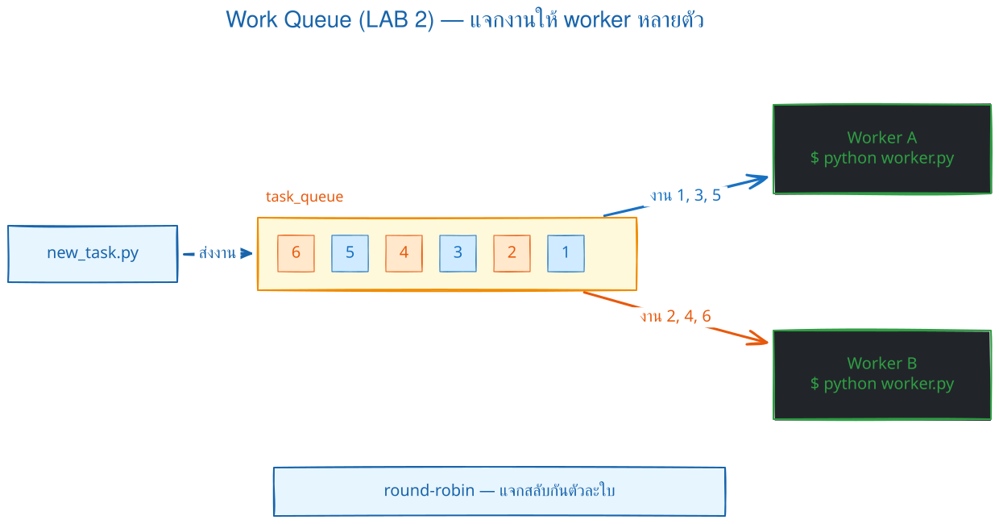
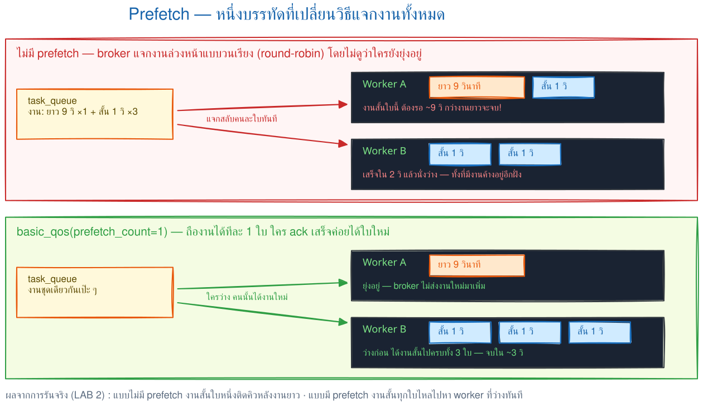
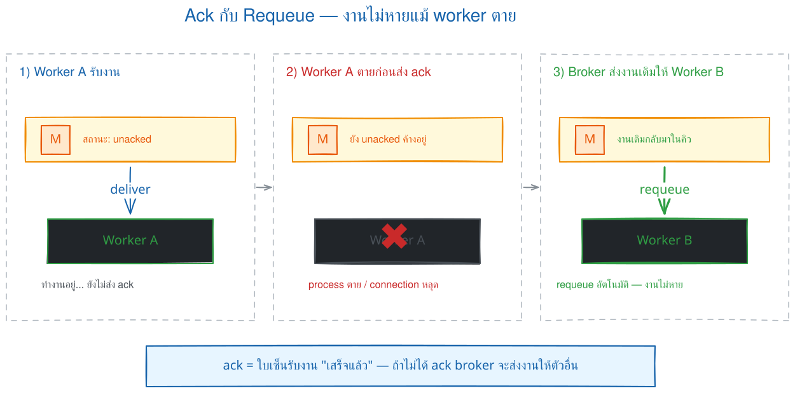
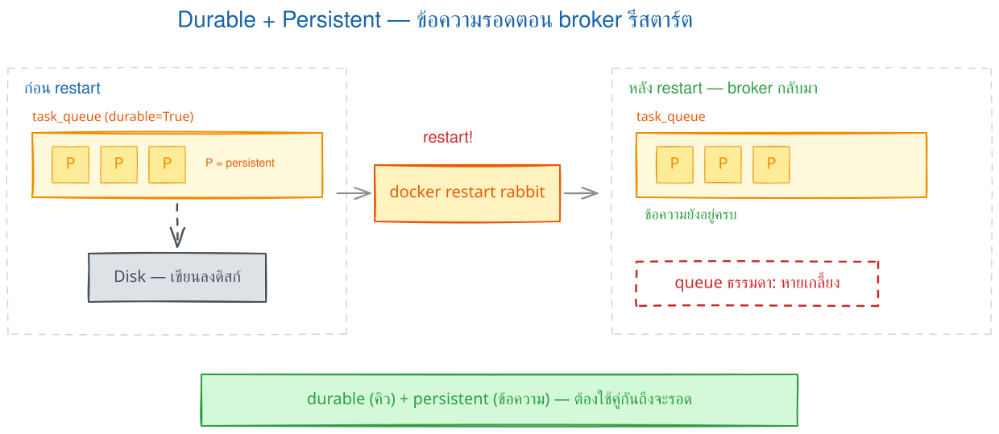
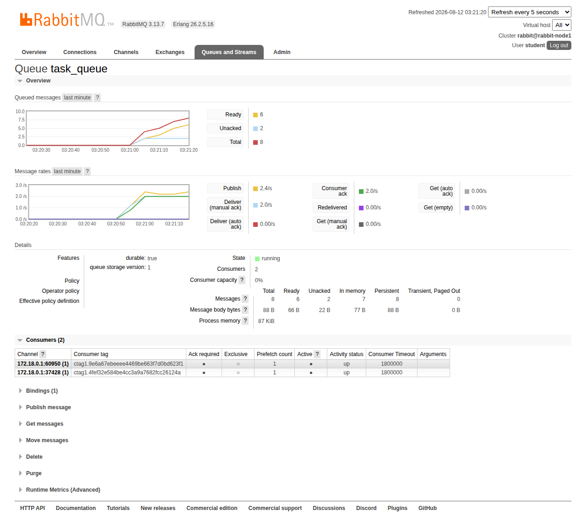
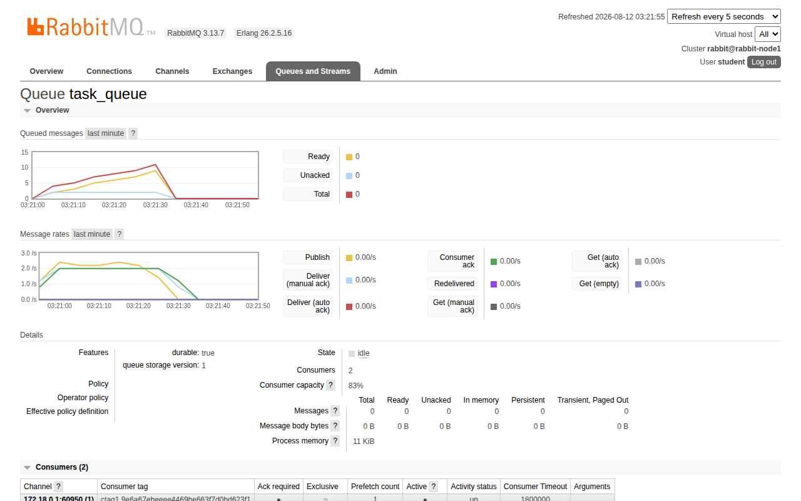

# LAB 2 — Work Queue : กระจายงานให้ worker หลายตัว

> โฟลเดอร์ `002_LAB_Work_Queue` = **LAB 2** ในสไลด์ `RabbitMQ_Slides.html` (ต่อจาก LAB 1 ที่ส่งข้อความผ่าน queue `hello` แบบตัวส่งหนึ่ง–ตัวรับหนึ่ง)

## สิ่งที่จะได้เรียนรู้

- **Work Queue pattern** : งานหนักไม่ควรให้ผู้ใช้รอ — โยนงานเข้า queue แล้วให้ **worker หลายตัวช่วยกันทำ**
- **Round-robin dispatching** : broker แจกงานให้ worker สลับกันตัวละงานโดยอัตโนมัติ
- **Fair dispatch** ด้วย `basic_qos(prefetch_count=1)` — งานสั้นไม่ต้องต่อคิวหลังงานยาว
- **Manual ack + Requeue** : worker ตายก่อน ack ข้อความกลับเข้าคิว (at-least-once จึงอาจได้รับซ้ำ)
- **Durable queue + Persistent message + named volume** : งานอยู่รอดจาก restart และ recreate ที่กลับมาใช้ storage เดิม
- อ่านค่า `messages_ready` / `messages_unacknowledged` ด้วย `rabbitmqctl list_queues` และดูใน **Management UI**

## ภาพรวมของแล็บนี้

1. **เตรียมเครื่องเรียน + เปิด broker + venv แล้วอ่านโค้ดทีละบรรทัด** — ของใหม่จาก LAB 1 คือ `durable=True` · `DeliveryMode.Persistent` · `basic_qos(prefetch_count=1)` · `basic_ack` ซึ่งเป็นหัวใจของแล็บนี้ทั้งหมด
2. **เปิด worker 2 ตัวแล้วส่งงานสั้น 6 งาน** — งานหนึ่งไปหา worker เพียงตัวเดียวและถูกแจกวนแบบ **round-robin**; ตัวที่ต่อก่อนอาจได้เลขคี่หรือคู่ก็ได้
3. **ส่งงานยาว 9 วินาทีตามด้วยงานสั้น 3 งาน** — งานสั้นทั้งสามไปเข้า worker ตัวที่ว่าง ไม่ต่อคิวหลังงานยาว พิสูจน์ว่า `prefetch_count=1` ทำให้เกิด **fair dispatch** และดูค่า unacked จริงด้วย `rabbitmqctl`
4. **ฆ่า worker กลางงานด้วย Ctrl+C** — ข้อความที่ยังไม่ถูก ack ถูก **requeue** แล้วส่งให้ worker อีกตัว และมีธง `redelivered`
5. **ปิด worker ทุกตัว ส่งงานค้าง 3 งาน แล้ว restart/recreate broker** — งานยังอยู่ครบเมื่อ broker กลับมาใช้ named volume เดิม; จากนั้นแยกสิ่งที่ LAB นี้ยังไม่รับประกัน
6. **เปิด Management UI ดู queue `task_queue`** — เห็น Consumers = 2, prefetch = 1 และกราฟ message rates ขณะส่งงานจริง



> **ทายก่อนรัน:** ถ้า worker A ทำงานเสร็จแล้ว แต่ตายก่อนส่ง ack งานเดิมจะถูกทำซ้ำหรือไม่? คำตอบนี้สำคัญต่อการออกแบบ worker ให้ idempotent

### Terminal Map

| หน้าต่าง | หน้าที่ |
|---|---|
| **T1** | producer, `rabbitmqctl`, restart/recreate broker และ UI |
| **T2** | worker A |
| **T3** | worker B |

`python worker.py` เป็นคำสั่ง blocking: ต้องเห็น `Waiting...` ใน T2/T3 แล้วกลับไปส่งงานจาก T1 อย่าวางคำสั่งถัดจาก worker ใน code block เดียวกัน

---

## 0. เตรียมเครื่องเรียน

ทำบนเครื่องของเราเอง (ไม่ใช้ cloud) — เปิด container ที่ติดตั้ง Docker มาให้แล้ว :

```bash
docker start devtools 2>/dev/null || \
  docker run -dit --name devtools --privileged -p 2222:22 tuchsanai/devtools:2569_1
ssh root@localhost -p 2222        # password : passwd
```

> 📝 **คำอธิบาย:** เปิด container เดิมถ้ามี และสร้างใหม่เฉพาะเมื่อยังไม่มี จึงรักษา clone/venv จาก LAB 1 · `--privileged` ใช้เฉพาะ disposable classroom container เพื่อรัน Docker-in-Docker ไม่ใช่ค่า production · คำสั่งที่เหลือพิมพ์ **ข้างในเครื่องเรียน**

ใน VS Code ใช้ **Remote-SSH** ต่อไปที่ `root@localhost:2222` แล้วทำแล็บทั้งหมดข้างใน — ตรวจว่าพร้อมใช้งาน :

```bash
docker --version
docker info --format 'Docker daemon: {{.ServerVersion}}'
```

> 📝 **คำอธิบาย:** ยืนยันว่าคำสั่ง `docker` ข้างในเครื่องเรียนวิ่งถึง daemon ได้จริงก่อนเริ่ม สิ่งที่ต้องดูคือ "มีเลขเวอร์ชันขึ้นไหม" ไม่ใช่ "เลขตรงกับเอกสารไหม" · ถ้าขึ้น `Cannot connect to the Docker daemon` แปลว่า daemon ข้างในยังตื่นไม่เสร็จ รอสักครู่แล้วลองใหม่

✅ **Expected output** — ขอแค่มีเลขเวอร์ชันครบสองบรรทัด ไม่ใช่ error (เลขเวอร์ชันของแต่ละคนอาจไม่ตรงกับเอกสารนี้):

```
Docker version 29.6.2, build dfc4efb
Docker daemon: 29.6.2
```

---

## 1. Clone โค้ดแล็บ

```bash
mkdir -p ~/labwork && cd ~/labwork
git clone https://github.com/Tuchsanai/DevTools.git
cd DevTools/test/02_RabbitMQxx/002_LAB_Work_Queue
```

> 📝 **คำอธิบาย:** สร้างโฟลเดอร์เก็บงานแล้วดึงรีโพของวิชาลงมา (ถ้าเคย clone ไว้แล้วจาก LAB 1 ให้ข้ามบรรทัด clone แล้ว `cd` เข้าโฟลเดอร์ได้เลย — git จะฟ้องว่าโฟลเดอร์ปลายทางไม่ว่างถ้าสั่งซ้ำ) · โฟลเดอร์ของแล็บนี้มีไฟล์ `new_task.py` (ตัวส่งงาน) · `worker.py` (ตัวทำงาน) · `requirements.txt` ครบแล้ว

---

## 2. เปิด RabbitMQ broker

```bash
docker rm -f rabbit 2>/dev/null || true
docker volume rm rabbitmq-lab2-data 2>/dev/null || true
docker volume create rabbitmq-lab2-data
docker run -d --name rabbit --hostname rabbit-node1 \
  -p 5672:5672 -p 15672:15672 \
  -e RABBITMQ_DEFAULT_USER=student \
  -e RABBITMQ_DEFAULT_PASS=student123 \
  -v rabbitmq-lab2-data:/var/lib/rabbitmq \
  rabbitmq:4.3.4-management
```

> 📝 **คำอธิบาย:** reset เฉพาะ container `rabbit` และ volume ชื่อเฉพาะของ LAB 2 เพื่อเริ่มจากศูนย์ · `-v rabbitmq-lab2-data:/var/lib/rabbitmq` แยก storage ออกจากอายุของ container ทำให้เราทดสอบ recreate ได้จริง · `--hostname` ทำให้ node name คงที่แต่ไม่ใช่ตัวเก็บข้อมูล · image ถูก pin เพื่อให้ผลซ้ำกันทั้งห้อง · user/password นี้ใช้เฉพาะ LAB

✅ **Expected output** — ครั้งแรกไม่มี image ในเครื่อง Docker จะ pull ให้อัตโนมัติแล้วจบด้วย container ID ยาว ๆ (layer ID · digest · container ID ของแต่ละคนจะไม่ตรงกับเอกสารนี้ · ถ้าเคย pull แล้วจะไม่เห็นบรรทัด layer เลย):

```
rabbitmq-lab2-data
Unable to find image 'rabbitmq:4.3.4-management' locally
4.3.4-management: Pulling from library/rabbitmq
20043066d3d5: Pulling fs layer
        ... (รวม 10 layer ทยอย Download / Pull complete) ...
d686b50ce172: Pull complete
Digest: sha256:e582c0bc7766f3342496d8485efb5a1df782b5ce3886ad017e2eaae442311f69
Status: Downloaded newer image for rabbitmq:4.3.4-management
9f561ebc03922f43577c281a76ada1b43854229696a069e932f7123a5189a014
```

RabbitMQ ใช้เวลา boot ราว 10–15 วินาที — **อย่าเพิ่งรันโค้ด Python** เช็กก่อนว่าพร้อม :

```bash
until docker exec --user rabbitmq rabbit rabbitmq-diagnostics -q check_running; do sleep 2; done
docker logs rabbit --tail 10
```

> 📝 **คำอธิบาย:** `check_running` จบเมื่อแอป RabbitMQ boot ครบ; แม่นกว่า `ping` ที่อาจผ่านตั้งแต่ Erlang runtime ตื่น · `--user rabbitmq` สำคัญเมื่อใช้ volume เพราะป้องกัน CLI แย่งสร้าง Erlang cookie ด้วย owner ผิดคนระหว่าง boot · log 10 บรรทัดท้ายใช้ดูเส้นเวลาและควรเห็น `Server startup complete` ถ้ารัน Python เร็วไปจะเจอ `Connection refused`

✅ **Expected output** — จุดที่ตัดสินว่าพร้อมคือ `fully booted and running`; ใน log จะเห็น `Server startup complete`:

```
2026-08-12 03:14:04.202305+00:00 [info] <0.736.0> Ready to start client connection listeners
2026-08-12 03:14:04.204748+00:00 [info] <0.894.0> started TCP listener on [::]:5672
RabbitMQ on node rabbit@rabbit-node1 is fully booted and running
2026-08-12 07:02:57.797406+00:00 [info] <0.947.0> Server startup complete; 4 plugins started.
        ... (รายชื่อ plugin ทั้ง 4 ตัว) ...
2026-08-12 07:02:57.985007+00:00 [info] <0.10.0> Time to start RabbitMQ: 4512 ms
```

---

## 3. เตรียม Python (venv + pika)

```bash
python3 -m venv ~/venv-mq
source ~/venv-mq/bin/activate
pip install pika==1.3.2
```

> 📝 **คำอธิบาย:** Python ในเครื่องเรียนเปิดกฎ PEP 668 ไว้ — สั่ง `pip install` ตรง ๆ นอก venv จะโดนปฏิเสธ (`externally-managed-environment`) จึงต้องสร้าง **virtual environment** ก่อน · `python3 -m venv ~/venv-mq` สร้าง venv ไว้ที่ home ใช้ร่วมกันได้ทุกแล็บ RabbitMQ (ถ้าสร้างไว้แล้วจาก LAB 1 ข้ามบรรทัดแรกได้) · `source ~/venv-mq/bin/activate` เปิดใช้ — สังเกต prompt เปลี่ยนเป็น `(venv-mq)` นำหน้า · `pip install pika==1.3.2` ติดตั้ง client library ของ RabbitMQ ล็อกเวอร์ชันให้ตรงกันทั้งห้อง

✅ **Expected output** — บรรทัดสุดท้ายต้องเป็น `Successfully installed pika-1.3.2` (ความเร็วดาวน์โหลดของแต่ละคนจะไม่ตรงกับเอกสารนี้ · ถ้าติดตั้งไว้แล้วจะขึ้น `Requirement already satisfied` แทน — ใช้ได้เหมือนกัน):

```
Collecting pika==1.3.2
        ... (ดาวน์โหลด pika-1.3.2-py3-none-any.whl 155 kB) ...
Installing collected packages: pika
Successfully installed pika-1.3.2
```

> **สำคัญมาก :** แล็บนี้ต้องเปิด **หลาย terminal พร้อมกัน** — terminal ใหม่ทุกหน้าต่างต้องสั่ง `source ~/venv-mq/bin/activate` ก่อนเสมอ (ดูว่า prompt มี `(venv-mq)` แล้วค่อยรันโค้ด) ลืมเมื่อไหร่จะเจอ `ModuleNotFoundError: No module named 'pika'` ทันที

---

## 4. รู้จักโค้ดของแล็บนี้

แนวคิด : ข้อความ 1 ตัว = งาน 1 งาน และ **จำนวนจุด `.` ท้ายข้อความ = จำนวนวินาทีที่งานนั้นใช้** (`worker.py` แกล้งทำงานหนักด้วย `time.sleep`) — `Quick job.` ใช้ 1 วินาที ส่วน `Heavy job.........` ใช้ 9 วินาที

### `new_task.py` — ตัวส่งงาน (producer)

```python
import pika
import sys

credentials = pika.PlainCredentials('student', 'student123')
connection = pika.BlockingConnection(
    pika.ConnectionParameters(host='localhost', port=5672, credentials=credentials))
channel = connection.channel()

# durable=True: นิยาม queue อยู่รอดเมื่อ broker restart โดยยังใช้ storage เดิม
channel.queue_declare(queue='task_queue', durable=True)

# ข้อความ = argument ทั้งหมดต่อกัน (จำนวนจุด . ท้ายข้อความ = วินาทีที่งานนี้ใช้)
message = ' '.join(sys.argv[1:]) or "Hello World!"

channel.basic_publish(
    exchange='',
    routing_key='task_queue',
    body=message,
    properties=pika.BasicProperties(
        delivery_mode=pika.DeliveryMode.Persistent,  # ขอให้ broker เก็บข้อความแบบ persistent
    ))
print(f" [x] Sent {message}")
connection.close()
```

> 📝 **คำอธิบาย:** โครงเหมือน `send.py` ของ LAB 1 แต่มีของใหม่ 3 จุด · `queue_declare(queue='task_queue', durable=True)` ประกาศ queue แบบ **durable** จึงสร้างนิยาม queue กลับมาเมื่อ broker boot จาก storage เดิม (ประกาศซ้ำได้เมื่อ attributes **เหมือนเดิมทุกครั้ง**) · `message = ' '.join(sys.argv[1:])` เอา argument ทุกตัวมาต่อกัน เราจึงกำหนด "ความหนักของงาน" จากจำนวนจุดท้ายข้อความ · `basic_publish` ส่งผ่าน **default exchange** (`exchange=''`) โดย `routing_key='task_queue'` · `DeliveryMode.Persistent` ขอให้ broker เก็บตัวข้อความแบบ persistent ด้วย ต้องจับคู่กับ durable queue และ storage ที่ยังอยู่; publisher confirms เป็นอีกกลไกที่บอก producer ว่า broker รับผิดชอบ message แล้ว

### `worker.py` — ตัวทำงาน (consumer)

```python
import pika
import sys
import time

def main():
    credentials = pika.PlainCredentials('student', 'student123')
    connection = pika.BlockingConnection(
        pika.ConnectionParameters(host='localhost', port=5672, credentials=credentials))
    channel = connection.channel()

    # ประกาศแบบ durable ให้ตรงกับฝั่งผู้ส่ง (ประกาศไม่ตรงกันจะ error ทันที)
    channel.queue_declare(queue='task_queue', durable=True)

    def callback(ch, method, properties, body):
        message = body.decode()
        redelivered = " [redelivered]" if method.redelivered else ""
        print(f" [x] Received {message}{redelivered}")
        duration = len(message) - len(message.rstrip('.'))
        time.sleep(duration)                # นับเฉพาะจุดที่ต่อท้ายข้อความ
        print(" [x] Done")
        # ตอบรับด้วยมือว่า "งานนี้เสร็จแล้ว" — broker เพิ่งลบข้อความทิ้งตรงนี้
        ch.basic_ack(delivery_tag=method.delivery_tag)

    # แจกงานทีละ 1: อย่าส่งงานใหม่มาจนกว่าฉันจะ ack งานเดิม (fair dispatch)
    channel.basic_qos(prefetch_count=1)
    channel.basic_consume(queue='task_queue', on_message_callback=callback)

    print(' [*] Waiting for messages. To exit press CTRL+C')
    channel.start_consuming()

if __name__ == '__main__':
    try:
        main()
    except KeyboardInterrupt:
        print('Interrupted')
        sys.exit(0)
```

> 📝 **คำอธิบาย:** `queue_declare(..., durable=True)` ต้องประกาศ attributes ตรงกับฝั่งส่ง ไม่เช่นนั้นจะได้ `PRECONDITION_FAILED` · `duration` นับเฉพาะจุดท้ายข้อความ · `method.redelivered` เป็น hint ว่างานเคยถูกส่งมาแล้ว · `basic_ack` เรียก **หลังทำงานเสร็จ**; ถ้า worker ตายก่อน ack broker จะ requeue · `prefetch_count=1` ไม่ส่งงานชิ้นใหม่จนกว่าจะ ack ชิ้นเดิม จึงเกิด fair dispatch

---

## 5. Round-robin — worker สลับกันรับงาน

แล็บนี้ใช้ **3 หน้าต่าง terminal** พร้อมกัน (แต่ละหน้าต่างคือ `ssh root@localhost -p 2222` เข้าเครื่องเรียนอีก session) : **หน้าต่างที่ 1** ไว้ส่งงาน + สั่ง `rabbitmqctl` ส่วน **หน้าต่างที่ 2 และ 3** เป็น worker คนละตัว

เปิด **หน้าต่างที่ 2** และ **หน้าต่างที่ 3** แล้วรันเหมือนกันทั้งคู่ (อย่าลืม activate venv ก่อน!):

```bash
source ~/venv-mq/bin/activate
cd ~/labwork/DevTools/test/02_RabbitMQxx/002_LAB_Work_Queue
python worker.py
```

> 📝 **คำอธิบาย:** สตาร์ต worker สองตัวจากโค้ดเดียวกัน ทั้งคู่ `basic_consume` เข้า queue `task_queue` เดียวกัน — ตอนนี้ queue นี้มี **consumer 2 ตัว** เกาะอยู่พร้อมกัน · ทั้งสองหน้าต่างจะขึ้น ` [*] Waiting for messages. To exit press CTRL+C` แล้ว **ค้างรอ** ซึ่งคือพฤติกรรมปกติของ consumer (บล็อกรอข้อความ) ไม่ใช่ค้างเพราะพัง · ถ้าขึ้น `ModuleNotFoundError` แปลว่าลืม activate venv ในหน้าต่างนั้น

กลับมาที่ **หน้าต่างที่ 1** ส่งงานสั้น ๆ (1 จุด = 1 วินาที) 6 งานติดกัน :

```bash
source ~/venv-mq/bin/activate
cd ~/labwork/DevTools/test/02_RabbitMQxx/002_LAB_Work_Queue
python new_task.py First message.
python new_task.py Second message.
python new_task.py Third message.
python new_task.py Fourth message.
python new_task.py Fifth message.
python new_task.py Sixth message.
```

> 📝 **คำอธิบาย:** ส่งงาน 6 งานขนาดเท่ากันหมด (จุดเดียว = งาน 1 วินาที) เข้า `task_queue` · ทุกอย่างหลังชื่อไฟล์คือ argument ที่จะกลายเป็นเนื้อข้อความ เช่น `First message.` · ระหว่างส่ง ให้ **มองหน้าต่างที่ 2 กับ 3 ไปด้วย** — จะเห็นงานเด้งสลับหน้าต่างกันแบบเรียลไทม์

✅ **Expected output** — หน้าต่างที่ 1 ยืนยันการส่งครบ 6 บรรทัด:

```
 [x] Sent First message.
 [x] Sent Second message.
        ... (ครบทั้ง 6 งาน) ...
 [x] Sent Sixth message.
```

✅ **Expected output** — งานหนึ่งไปเพียงหนึ่ง worker และสลับกันเป็นสองชุด; worker ที่ต่อก่อนอาจได้ชุดคี่หรือชุดคู่:

```
──── หน้าต่างที่ 2 ────
 [*] Waiting for messages. To exit press CTRL+C
 [x] Received First message.
 [x] Done
 [x] Received Third message.
 [x] Done
 [x] Received Fifth message.
 [x] Done
──── หน้าต่างที่ 3 ────
 [*] Waiting for messages. To exit press CTRL+C
 [x] Received Second message.
 [x] Done
 [x] Received Fourth message.
 [x] Done
 [x] Received Sixth message.
 [x] Done
```

> **นี่คือ round-robin** — broker แจกงานวนไปทีละตัว ตัวละงาน โดยเราไม่ต้องเขียนโค้ดแบ่งงานเองแม้แต่บรรทัดเดียว (หน้าต่างไหนได้ชุดคี่/ชุดคู่ ขึ้นกับว่า worker ตัวไหนต่อเข้า queue ก่อน — สลับกันได้ ไม่ผิด) อยากได้แรงทำงานเพิ่ม ก็แค่เปิด `python worker.py` เพิ่มอีกหน้าต่าง — **scale แนวนอนได้ทันที**

---

## 6. Fair dispatch — งานสั้นไม่ต้องรองานยาว



ถ้าไม่มี `prefetch_count=1` broker จะแจกงานวนตาบอด ๆ — งานสั้นอาจไปต่อคิวหลังงานยาวทั้งที่มี worker ว่างอยู่ ลองพิสูจน์ว่าโค้ดของเราไม่เป็นแบบนั้น : **หน้าต่างที่ 1** ส่งงานยาว 9 วินาที ตามด้วยงานสั้น 1 วินาทีอีก 3 งาน :

```bash
python new_task.py Heavy job.........
python new_task.py Quick job.
python new_task.py Quick job.
python new_task.py Quick job.
```

> 📝 **คำอธิบาย:** `Heavy job.........` มี 9 จุด = ทำงาน 9 วินาที ส่วน `Quick job.` มีจุดเดียว = 1 วินาที · ตามรอบ round-robin งานยาวจะตกที่ worker ตัวหนึ่ง — จุดที่ต้องจับตาคือ **งานสั้นทั้งสามไปที่ไหน** : เพราะ worker ที่กำลังเคี้ยวงานยาวยังไม่ ack broker จึง **ไม่ส่งงานใหม่ให้มัน** (`prefetch_count=1`) งานสั้นทั้งสามเลยไหลไปเข้า worker ตัวที่ว่างแทน ทีละงาน

✅ **Expected output** — หน้าต่างที่รับ **งานยาว** (ในการรันของเอกสารนี้คือหน้าต่างที่ 3 — ของแต่ละคนอาจสลับหน้าต่างกัน) ค้างอยู่กับงานเดียว ~9 วินาทีแล้วค่อยขึ้น `Done` ส่วนหน้าต่างอีกตัวเก็บงานสั้น **ครบทั้ง 3 งาน** ไม่ต้องรองานยาวเลย (บรรทัดต่อจากผลของข้อ 5):

```
──── หน้าต่างที่ 3 ────
 [x] Received Heavy job.........
 [x] Done
──── หน้าต่างที่ 2 ────
 [x] Received Quick job.
 [x] Done
 [x] Received Quick job.
 [x] Done
 [x] Received Quick job.
 [x] Done
```

ระหว่างที่งานยาวยังไม่จบ (รีบหน่อย มีเวลา 9 วินาที!) ให้ **หน้าต่างที่ 1** แอบดูสถานะ queue :

```bash
docker exec rabbit rabbitmqctl list_queues name messages_ready messages_unacknowledged
```

> 📝 **คำอธิบาย:** `docker exec rabbit ...` สั่งคำสั่งข้างใน container ชื่อ `rabbit` · `rabbitmqctl list_queues` คือเครื่องมือแอดมินของ RabbitMQ ขอดูรายชื่อ queue พร้อมคอลัมน์ที่เราเลือก : `messages_ready` = ข้อความที่ **รอแจก** ยังไม่มี worker รับ · `messages_unacknowledged` = ข้อความที่ worker **รับไปแล้วแต่ยังไม่ ack** (กำลังทำอยู่) · ค่า unacked ≥ 1 ที่เห็นคืองานยาวที่ยังค้างอยู่กับ worker

✅ **Expected output** — จุดที่ต้องดูคือ `messages_unacknowledged` เป็น `1` = งานยาวยังค้างไม่ถูก ack (ถ้ารันเร็วกว่านี้อาจเห็น ready 1–2 และ unacked 2 เพราะงานสั้นยังทำไม่หมด — ตัวเลขขึ้นกับจังหวะกด):

```
Timeout: 60.0 seconds ...
Listing queues for vhost / ...
name	messages_ready	messages_unacknowledged
task_queue	0	1
```

> **อ่านให้เป็น :** งานสั้นทั้งสามถูก worker ตัวว่างเก็บเรียบไปแล้ว (`ready 0`) เหลือแต่งานยาวที่ยังเคี้ยวอยู่ (`unacked 1`) — นี่แหละหลักฐานของ **fair dispatch** : งานสั้นไม่เคยไปต่อแถวหลังงานยาวเลย

---

## 7. Ack + Requeue — worker ตายก่อน ack งานกลับเข้าคิว

ถึงไฮไลต์ของแล็บ : ส่งงานยาว 10 วินาที แล้ว **ฆ่า worker ทิ้งกลางงาน** ดูว่างานหายไหม — **หน้าต่างที่ 1** ส่งงานแล้วเช็กสถานะทันที :

```bash
python new_task.py Very long job..........
docker exec rabbit rabbitmqctl list_queues name messages_ready messages_unacknowledged
```

> 📝 **คำอธิบาย:** งานนี้ 10 จุด = 10 วินาที — พอกดส่งปุ๊บ ให้ชำเลืองดูว่างานตกที่หน้าต่างไหน (ขึ้นบรรทัด `Received Very long job` — ในการรันของเอกสารนี้คือ **หน้าต่างที่ 2**) · `list_queues` ที่รันต่อทันทีคือการเช็ก **ก่อนฆ่า** : ข้อความอยู่ในสถานะ unacked (worker รับไปแล้ว ยังไม่ ack) broker ยังไม่กล้าลบทิ้ง ตราบใดที่ไม่ได้รับ ack มันถือว่างานนี้ "ยังไม่จบ"

✅ **Expected output** — `unacked = 1` คืองานยาวที่อยู่ในมือหน้าต่างที่ 2:

```
 [x] Sent Very long job..........
Timeout: 60.0 seconds ...
Listing queues for vhost / ...
name	messages_ready	messages_unacknowledged
task_queue	0	1
```

ตอนนี้ไปที่หน้าต่างที่รับงาน (**หน้าต่างที่ 2**) แล้วกด **Ctrl+C ทันที ก่อนงานครบ 10 วินาที** :

✅ **Expected output** — worker ตายไปพร้อมงานที่ทำค้าง **โดยไม่ทัน ack** (บนจออาจเห็น `^C` แทรกตรงที่กด):

```
 [x] Received Very long job..........
Interrupted
```

> 📝 **คำอธิบาย:** Ctrl+C ทำให้ Python โยน `KeyboardInterrupt` — โค้ดเราดักไว้ พิมพ์ `Interrupted` แล้วจบ process · จุดสำคัญคือ **ยังไม่ถึงบรรทัด `basic_ack`** เพราะงานยังไม่เสร็จ → connection ขาด → broker รู้ทันทีว่า "worker ตัวนี้ตายทั้งที่งานยังคาราคาซัง" จึง **requeue** ข้อความ แล้วส่งให้ consumer ตัวถัดไปที่ยังมีชีวิต

หันไปดู **หน้าต่างที่ 3** — ไม่ต้องทำอะไรเลย งานเด้งมาเอง :

✅ **Expected output** — ข้อความ **ตัวเดิมเป๊ะ ๆ** โผล่มาให้หน้าต่างที่ 3 ทำใหม่ตั้งแต่ต้นจนจบ:

```
 [x] Received Very long job.......... [redelivered]
 [x] Done
```

> `[redelivered]` มาจาก `method.redelivered=True` เป็นหลักฐานว่า broker ส่งใบเดิมซ้ำ แต่อย่าใช้ flag นี้แทน idempotency เพราะ worker อาจเคยทำ side effect ไปแล้วก่อน connection ขาด

ระหว่างหน้าต่างที่ 3 กำลังทำ ให้ **หน้าต่างที่ 1** เช็กสถานะซ้ำ :

```bash
docker exec rabbit rabbitmqctl list_queues name messages_ready messages_unacknowledged
```

> 📝 **คำอธิบาย:** คำสั่งเดิมจากข้อ 6 เป๊ะ ๆ — รันซ้ำเพื่อดูสถานะ "หลัง requeue" · จุดที่ให้สังเกต : ค่า unacked ไม่ได้หายไปไหน แค่เปลี่ยนมือ — งานชิ้นเดิมย้ายจากหน้าต่างที่ 2 (ที่ตายไปแล้ว) มาอยู่ในมือหน้าต่างที่ 3 แทน

✅ **Expected output** — `unacked` ยังเป็น `1` เหมือนเดิม แต่ตอนนี้งานอยู่ในมือหน้าต่างที่ 3 แล้ว (พองานเสร็จและ ack ค่าจะกลายเป็น `0	0`):

```
Timeout: 60.0 seconds ...
Listing queues for vhost / ...
name	messages_ready	messages_unacknowledged
task_queue	0	1
```

> **บทเรียนสำคัญ :** manual ack ให้ **at-least-once** — broker ลบข้อความเมื่อ worker ยืนยันว่าเสร็จ ถ้าตายก่อน ack งานจะกลับเข้าคิว แต่ถ้าทำ side effect เสร็จแล้วตายก่อน ack งานเดิมอาจถูกทำซ้ำ ดังนั้นงานจริงต้องใช้ `message_id` และออกแบบ worker ให้ **idempotent**



---

## 8. Durable + Persistent — รอด restart และ recreate บน volume เดิม

ack ช่วยตอน **worker ตาย** — แล้วถ้า process ของ broker ถูก restart แต่ยังใช้ storage เดิมล่ะ? พิสูจน์กัน:

ปิด worker ให้หมดก่อน — ไปที่ **หน้าต่างที่ 3** (ตัวเดียวที่ยังรันอยู่) กด **Ctrl+C** จนขึ้น `Interrupted` แล้วคืน prompt

**หน้าต่างที่ 1** ส่งงาน 3 งานทิ้งไว้ **โดยไม่มี worker รับ** :

```bash
python new_task.py Restart test 1.
python new_task.py Restart test 2.
python new_task.py Restart test 3.
docker exec rabbit rabbitmqctl list_queues
```

> 📝 **คำอธิบาย:** ตอนนี้ไม่มี consumer เกาะ queue อยู่เลย งานทั้งสามจึงนอนรออยู่ใน `task_queue` · `rabbitmqctl list_queues` แบบไม่ระบุคอลัมน์ จะแสดงชื่อ queue กับจำนวนข้อความรวม (`messages`) — พอสำหรับการนับว่ามีงานค้าง 3 งานจริง

✅ **Expected output** — `task_queue` มีข้อความค้าง `3`:

```
 [x] Sent Restart test 1.
 [x] Sent Restart test 2.
 [x] Sent Restart test 3.
Timeout: 60.0 seconds ...
Listing queues for vhost / ...
name	messages
task_queue	3
```

ทีนี้ **restart broker container เดิม** :

```bash
docker restart rabbit
until docker exec --user rabbitmq rabbit rabbitmq-diagnostics -q check_running; do sleep 2; done
```

> 📝 **คำอธิบาย:** `docker restart` หยุดแล้วเปิด **container เดิม** ที่ mount volume เดิม การทดลองนี้ตรวจ `durable=True` + `DeliveryMode.Persistent` บน storage เดิม · health check กันการถามคิวก่อน broker พร้อม

รอ broker พร้อม แล้วนับงานอีกครั้ง :

```bash
docker exec rabbit rabbitmqctl list_queues
```

> 📝 **คำอธิบาย:** นับข้อความเดิมก่อน/หลัง restart แบบตรง ๆ; ตัวเลขครบไม่ได้แปลว่า publish ทุกครั้งมี zero-loss guarantee เพราะ producer ยังไม่ได้ใช้ publisher confirms

✅ **Expected output** — จุดพิสูจน์ของข้อนี้: หลัง restart ของ container เดิมยังเห็น `task_queue` และงานครบ 3 งาน (ถ้าคิวไม่ durable นิยามของคิวจะไม่รอด restart):

```
Timeout: 60.0 seconds ...
Listing queues for vhost / ...
name	messages
task_queue	3
```

พิสูจน์อีกชั้นว่า durability ไม่ได้ผูกกับตัว container: ลบแล้วสร้าง broker ใหม่โดย mount volume **ชื่อเดิม**

```bash
docker rm -f rabbit
docker run -d --name rabbit --hostname rabbit-node1 \
  -p 5672:5672 -p 15672:15672 \
  -e RABBITMQ_DEFAULT_USER=student \
  -e RABBITMQ_DEFAULT_PASS=student123 \
  -v rabbitmq-lab2-data:/var/lib/rabbitmq \
  rabbitmq:4.3.4-management
until docker exec --user rabbitmq rabbit rabbitmq-diagnostics -q check_running; do sleep 2; done
docker exec rabbit rabbitmqctl list_queues name messages
```

✅ container เป็นตัวใหม่ แต่ `task_queue` ยังมี `3` เพราะ storage ชื่อเดิมถูกนำกลับมาใช้:

```text
name        messages
task_queue  3
```

> **ขอบเขตสำคัญ:** การทดลองนี้พิสูจน์ restart/recreate บน **storage เดิม** ไม่ได้พิสูจน์ zero-loss หรือทน disk/node failure; producer ต้องใช้ publisher confirms และงานจริงที่ต้องทน node failure ควรใช้ replicated queue เช่น quorum queue พร้อมนโยบาย backup/monitoring



เก็บงานทั้งสามให้จบ — เปิด worker ที่ **หน้าต่างที่ 2** (terminal ใหม่อย่าลืม activate venv):

```bash
python worker.py
```

> 📝 **คำอธิบาย:** คำสั่งเดิมจากข้อ 5 — เปิด worker ต่อเข้า queue อีกครั้ง งานทั้งสามที่นอนรออยู่จะถูกทยอยส่งมาให้ทันทีโดยไม่ต้องสั่งอะไรเพิ่ม

✅ **Expected output** — งานทั้ง 3 ที่รอดจาก restart ถูกทยอยเก็บครบ (รับ→ทำ→ack→ค่อยรับตัวใหม่ ตาม `prefetch_count=1`):

```
 [*] Waiting for messages. To exit press CTRL+C
 [x] Received Restart test 1.
 [x] Done
 [x] Received Restart test 2.
 [x] Done
 [x] Received Restart test 3.
 [x] Done
```

---

## 9. ดูคิวใน Management UI

เปิด worker ตัวที่สองกลับมาด้วย — ไปที่ **หน้าต่างที่ 3** รัน `python worker.py` (activate venv ก่อน) ตอนนี้ `task_queue` มี **consumer 2 ตัว** เหมือนช่วงกลางแล็บ · Management UI อยู่ที่ port `15672` **ข้างในเครื่องเรียน** — forward ออกมาเหมือนที่ทำใน LAB 1 : ใน VS Code เปิดแท็บ **PORTS** (แถวเดียวกับ TERMINAL) → **Forward a Port** → พิมพ์ `15672` → Enter แล้วเปิด `http://localhost:15672` ในเบราว์เซอร์ → login ด้วย `student` / `student123`


หรือถ้าไม่ใช้ VS Code ก็ forward ด้วยมือจาก terminal ใหม่บนเครื่องเรา :

```bash
ssh -L 15672:localhost:15672 root@localhost -p 2222        # password : passwd
```

> 📝 **คำอธิบาย:** `-L 15672:localhost:15672` เปิด port 15672 บนเครื่องเรา แล้วส่งทุก connection ผ่านท่อ ssh ไปโผล่ที่ port 15672 ข้างในเครื่องเรียน (ที่ map ไว้กับ container `rabbit` อีกที) · หน้าต่างนี้ต้องเปิดค้างไว้ตลอดที่ใช้ UI — ปิดเมื่อไหร่ tunnel หายทันที

ไปที่แท็บ **Queues and Streams** → คลิก `task_queue` :



> 📝 **จุดที่ต้องดูในหน้านี้:** ส่วน **Details** — `Features: durable: true` ยืนยันว่า queue เป็น durable จริง · `Consumers: 2` คือ worker สองหน้าต่างของเรา · ตาราง **Consumers (2)** ด้านล่าง — คอลัมน์ **Prefetch count = 1** ทั้งสองแถว (มาจาก `basic_qos` ในโค้ด) และ **Ack required = ●** แปลว่าใช้ manual ack · คอลัมน์ Channel บอกว่า connection มาจากไหน — สองแถวคือสอง terminal ของเราเอง · ส่วนตัวเลขใน **Queued messages** ของภาพ (Ready 6 / Unacked 2) มาจากงานที่กำลังไหลอยู่พอดีตอนกดถ่ายภาพ — ถ้าเปิดดูตอนคิวว่างจะเห็น 0 ทั้งคู่ ซึ่งถูกต้องเหมือนกัน

อยากเห็นกราฟขยับ ให้ **หน้าต่างที่ 1** ยิงงานรัว ๆ ทิ้งไว้ :

```bash
for i in $(seq 1 70); do python new_task.py Graph test.; sleep 0.4; done
```

> 📝 **คำอธิบาย:** ลูป shell ธรรมดา — ส่งงาน 1 จุด (1 วินาที) ทั้งหมด 70 งาน เว้นจังหวะงานละ 0.4 วินาที · อัตราส่งจึงเร็วกว่าอัตราที่ worker 2 ตัวเคลียร์ได้นิดหน่อย ทำให้เห็นทั้งเส้น **Publish** ทั้งเส้น **Deliver/Ack** และเห็นคิวสะสมขึ้นแล้วค่อย ๆ ระบาย · ระหว่างลูปวิ่ง (~1 นาที) ให้ดูกราฟในหน้า `task_queue` — UI refresh ทุก 5 วินาที

✅ **Expected output** — หน้าต่างที่ 1 พิมพ์ยืนยันไปเรื่อย ๆ จนครบ:

```
 [x] Sent Graph test.
 [x] Sent Graph test.
        ... (รวม 70 บรรทัด) ...
```



#### ทดลองเสร็จแล้ว — ลบ tunnel ทุกครั้ง

- แบบ VS Code : แท็บ **PORTS** → คลิกขวาที่ `15672` → **Stop Forwarding Port**
- แบบ `ssh -L` : พิมพ์ `exit` (หรือ `Ctrl+D`) ใน session นั้น — tunnel ปิดทันที

---

## ทดลองเพิ่มเติม

### ปิด fair dispatch แล้วดูความต่าง

อยากรู้ว่า `basic_qos(prefetch_count=1)` สำคัญแค่ไหน — ลองปิดมันดู : ปิด worker ทั้งสองหน้าต่าง (Ctrl+C) แล้ว comment บรรทัดนั้นใน `worker.py` (แก้ในไฟล์เองด้วย editor หรือใช้ sed บรรทัดเดียวจากโฟลเดอร์แล็บ):

```bash
sed -i 's|^    channel.basic_qos(prefetch_count=1)|    # channel.basic_qos(prefetch_count=1)|' worker.py
grep -n 'basic_qos' worker.py
```

> 📝 **คำอธิบาย:** `sed -i` แก้ไฟล์ตรงที่ (in-place) — จับบรรทัด `channel.basic_qos(prefetch_count=1)` แล้วเติม `# ` ข้างหน้าให้กลายเป็น comment (คงย่อหน้าเดิมไว้ครบ ไฟล์ยังรันได้) · `grep -n` พิมพ์บรรทัดที่เจอพร้อมเลขบรรทัด ไว้เช็กว่าแก้ถูกจุดจริงก่อนรันรอบใหม่

✅ **Expected output** — `grep` ยืนยันว่าบรรทัด `basic_qos` ถูก comment แล้ว (เลขบรรทัดอาจต่างได้):

```
26:    # channel.basic_qos(prefetch_count=1)
```

เปิด worker ใหม่ทั้งหน้าต่างที่ 2 และ 3 แล้วส่งชุดงานเดิมของข้อ 6 จาก **หน้าต่างที่ 1** (`Heavy job.........` แล้วตาม `Quick job.` สามครั้ง):

✅ **Expected output** — คราวนี้ round-robin ตาบอด : หน้าต่างที่รับงานยาว **โดนยัดงานสั้นต่อคิว** — `Quick job` งานหนึ่งต้องรอ ~9 วินาทีกว่างานยาวจะจบ ทั้งที่อีกหน้าต่างว่างงานอยู่ (อีกหน้าต่างได้งานสั้นไปแค่ 2 งานแล้วนั่งว่าง):

```
 [*] Waiting for messages. To exit press CTRL+C
 [x] Received Heavy job.........
 [x] Done
 [x] Received Quick job.
 [x] Done
```

> 📝 **คำอธิบาย:** พอไม่มี `prefetch_count=1` broker แจกงานล่วงหน้าโดยไม่สนว่าใครยังไม่ว่าง งานสั้นจึงไปจมหลังงานยาว · ทดลองเสร็จแล้วต้อง restore ด้วยคำสั่งด้านล่างและตรวจว่าไม่มี `#` นำหน้า

```bash
sed -i 's|^    # channel.basic_qos(prefetch_count=1)|    channel.basic_qos(prefetch_count=1)|' worker.py
grep -n 'basic_qos' worker.py
```

### ถ้าลบ `basic_ack` ทิ้งล่ะ? (อ่านอย่างเดียว อย่าทำจริง)

ถ้า worker รับงานแต่ไม่เคย ack เลย — ข้อความจะค้างสถานะ **unacked ตลอดไป** จนกว่า connection นั้นจะปิด (แล้วค่อยถูก requeue วนกลับมาใหม่ ให้ตัวอื่นรับแล้วก็ค้างต่อ … วนไม่รู้จบ) ยิ่งรันนานคิว unacked ยิ่งบวม กิน memory ของ broker ไปเรื่อย ๆ — บั๊กยอดฮิตของ RabbitMQ มือใหม่ · วิธีสังเกต : คอลัมน์ **Unacked** ในหน้า Queues ของ Management UI (หรือ `messages_unacknowledged` จาก `rabbitmqctl`) โตขึ้นเรื่อย ๆ ไม่ยอมลง

---

## แก้ปัญหาที่พบบ่อย

| อาการ | สาเหตุ | วิธีแก้ |
|---|---|---|
| `ModuleNotFoundError: No module named 'pika'` | ลืม `source ~/venv-mq/bin/activate` ในหน้าต่างนั้น (ทุกหน้าต่างต้องทำของตัวเอง) | activate ก่อน ให้ prompt ขึ้น `(venv-mq)` แล้วรันใหม่ |
| `pika.exceptions.AMQPConnectionError` / `Connection refused` | broker ยังไม่พร้อม (เพิ่ง start/restart) หรือลืมรัน `docker run ... rabbit` | รัน `until docker exec --user rabbitmq rabbit rabbitmq-diagnostics -q check_running; do sleep 2; done` ให้ผ่าน · ถ้าไม่มี container เลย กลับไปข้อ 2 |
| `ACCESS_REFUSED - Login was refused using authentication mechanism PLAIN` | user/password ในโค้ดไม่ตรงกับที่ตั้งตอน `docker run` | ใช้ `student` / `student123` ให้ตรงกันทั้งสองฝั่ง |
| `PRECONDITION_FAILED - inequivalent arg 'durable' for queue 'task_queue' ... received 'false' but current is 'true'` (หรือกลับกัน) | เครื่องเคยประกาศ `task_queue` ไว้ด้วยค่า durable อีกแบบ — RabbitMQ ไม่ยอมให้ประกาศชนกัน | ลบ queue เดิมทิ้ง : `docker exec rabbit rabbitmqctl delete_queue task_queue` (หรือปุ่ม Delete ในหน้า queue ของ UI) แล้วรันใหม่ |
| worker เปิดอยู่แต่ไม่ได้งานเลย | ลืม activate venv (โปรแกรมตายตั้งแต่ import) หรือ broker ไม่ได้รัน | ไล่เช็ก : prompt มี `(venv-mq)`? → `docker ps` มี `rabbit`? → หน้า UI เห็น Consumers เพิ่มไหม? |
| ส่งงานแล้วงานหายเงียบ ๆ ทั้งที่ worker ตาย | รัน worker เวอร์ชันเก่าที่ใช้ `auto_ack=True` — broker ลบข้อความตั้งแต่ตอนส่งให้ | ใช้ `worker.py` ของแล็บนี้ (manual ack) แล้วทำข้อ 7 ซ้ำเพื่อยืนยัน · ถ้ากลับกันคือค่า `unacked` ค้างไม่ลง = มี worker รับงานแล้วไม่ ack ให้ปิด worker ตัวนั้น (ข้อความจะถูก requeue เอง) |

---

## เก็บกวาด (Cleanup)

ปิด worker ทุกหน้าต่างด้วย **Ctrl+C** (เห็น `Interrupted` ครบทุกตัว) แล้วลบ broker พร้อมตรวจซ้ำ :

```bash
docker rm -f rabbit
docker volume rm rabbitmq-lab2-data
docker ps -a
```

> 📝 **คำอธิบาย:** ลบ broker แล้วลบ volume **ชื่อเฉพาะของ LAB 2** หลังเก็บกวาดนี้ข้อมูลจึงหายโดยตั้งใจ; image, outer container `devtools` และ venv ยังอยู่ใช้ต่อได้

✅ **Expected output** — ได้ชื่อ container ที่ลบสำเร็จ แล้วตาราง `docker ps -a` เหลือแค่หัวตาราง ไม่มีแถวข้อมูล:

```
rabbit
rabbitmq-lab2-data
CONTAINER ID   IMAGE     COMMAND   CREATED   STATUS    PORTS     NAMES
```

---

## สรุปคำสั่งของแล็บนี้

| คำสั่ง | ความหมาย |
|---|---|
| `python new_task.py <ข้อความ>` | ส่งงาน 1 งานเข้า `task_queue` (จำนวนจุด `.` = วินาทีของงาน) |
| `python worker.py` | เปิด worker รับงาน — เปิดกี่หน้าต่างก็ได้ scale แนวนอนทันที |
| `channel.queue_declare(..., durable=True)` + `pika.DeliveryMode.Persistent` | queue และ message รอด restart/recreate เมื่อกลับมาใช้ storage เดิม; ไม่แทน publisher confirms/replication |
| `channel.basic_qos(prefetch_count=1)` | fair dispatch — ไม่รับงานใหม่จนกว่าจะ ack งานเดิม |
| `ch.basic_ack(delivery_tag=...)` | ยืนยันงานเสร็จ — broker เพิ่งกล้าลบข้อความ |
| `docker exec rabbit rabbitmqctl list_queues name messages_ready messages_unacknowledged` | ดูจำนวนงานรอแจก / งานที่ยังไม่ ack |
| `docker restart rabbit` / recreate พร้อม `-v rabbitmq-lab2-data:...` | พิสูจน์ restart และ container ใหม่ที่ใช้ storage เดิม |

> **จำให้ครบ:** manual **ack** ทำให้ส่งอย่างน้อยหนึ่งครั้ง (จึงต้อง idempotent) · **durable + persistent + storage เดิม** ช่วยรอด restart/recreate · **prefetch = 1** ช่วยกระจายตามความว่าง · **publisher confirms** เป็นกลไกอีกฝั่งที่ producer ใช้ยืนยันกับ broker

## ✅ เช็กลิสต์ก่อนจบแล็บ

- [ ] broker ขึ้น `Server startup complete` ก่อนรันโค้ด Python ทุกครั้ง
- [ ] เปิด worker 2 หน้าต่าง ส่ง 6 งานแล้วเห็นว่างานหนึ่งไปเพียงหนึ่ง worker และแจกสลับกัน (ไม่ยึดว่าจอใดต้องได้เลขคี่)
- [ ] ส่ง `Heavy job.........` + `Quick job.` ×3 แล้วงานสั้นทั้งสามไปเข้า worker ตัวว่าง ไม่รองานยาว
- [ ] `rabbitmqctl list_queues ... messages_unacknowledged` เห็นค่า unacked ≥ 1 ระหว่างงานยาวยังไม่จบ
- [ ] กด Ctrl+C ฆ่า worker กลางงาน `Very long job..........` แล้วเห็นข้อความเดิมเด้งไปหน้าต่างอีกตัวจนขึ้น `Done`
- [ ] ปิด worker หมด ส่ง 3 งาน → หลัง `docker restart rabbit` และหลัง recreate ด้วย volume เดิม **ยังเห็น 3 งานครบ**
- [ ] เปิดหน้า `task_queue` ใน Management UI เห็น `Consumers: 2` ตาราง Consumers มี `Prefetch count = 1` และกราฟขยับระหว่างยิงงาน 70 งาน
- [ ] ปิด tunnel เรียบร้อย (Stop Forwarding Port หรือ `exit` ใน session `ssh -L`)
- [ ] ทดลอง comment `basic_qos` แล้วเห็นงานสั้นไปจมหลังงานยาว จากนั้น **แก้กลับแล้ว**
- [ ] จบแล็บด้วยการลบ `rabbit` และ volume `rabbitmq-lab2-data`; `docker ps -a` ไม่เหลือ broker
- [ ] อธิบายได้ว่า ack / durable+persistent / prefetch / publisher confirm ป้องกันความเสียหายคนละจุด และเหตุใด at-least-once ต้อง idempotent

*ผลลัพธ์ทั้งหมดในเอกสารนี้มาจากการรันจริงในเครื่องเรียน `tuchsanai/devtools:2569_1` เมื่อ 12 ส.ค. 2026*
