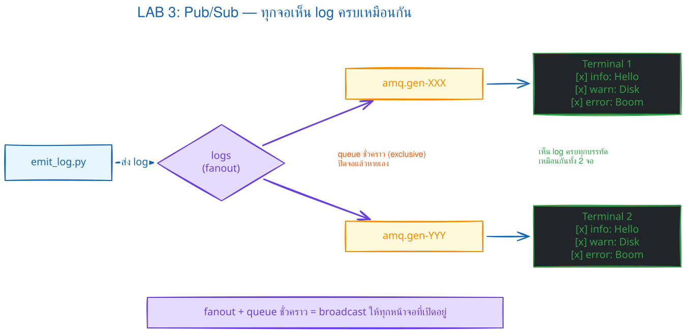
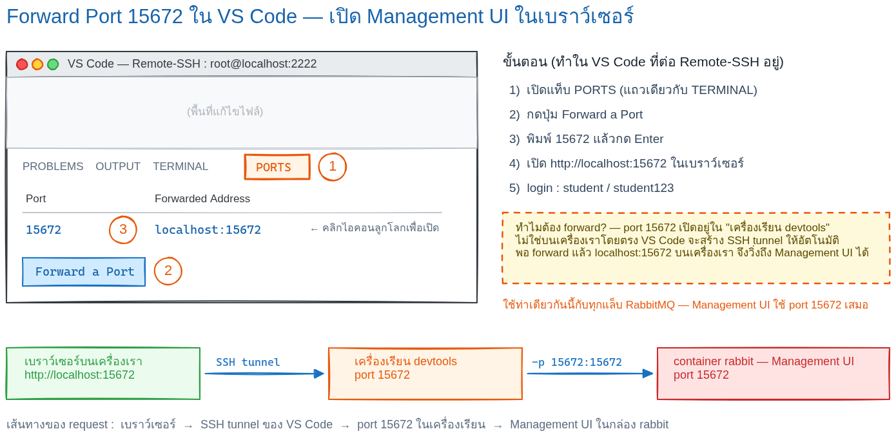
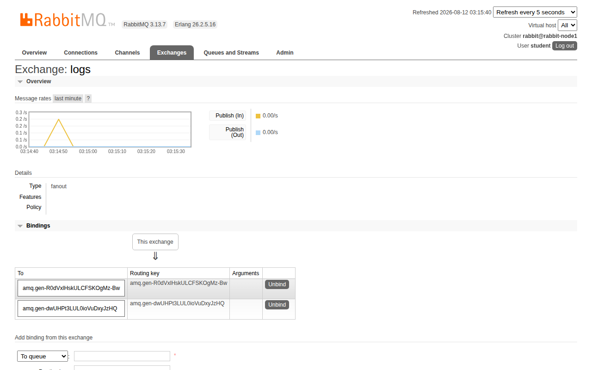
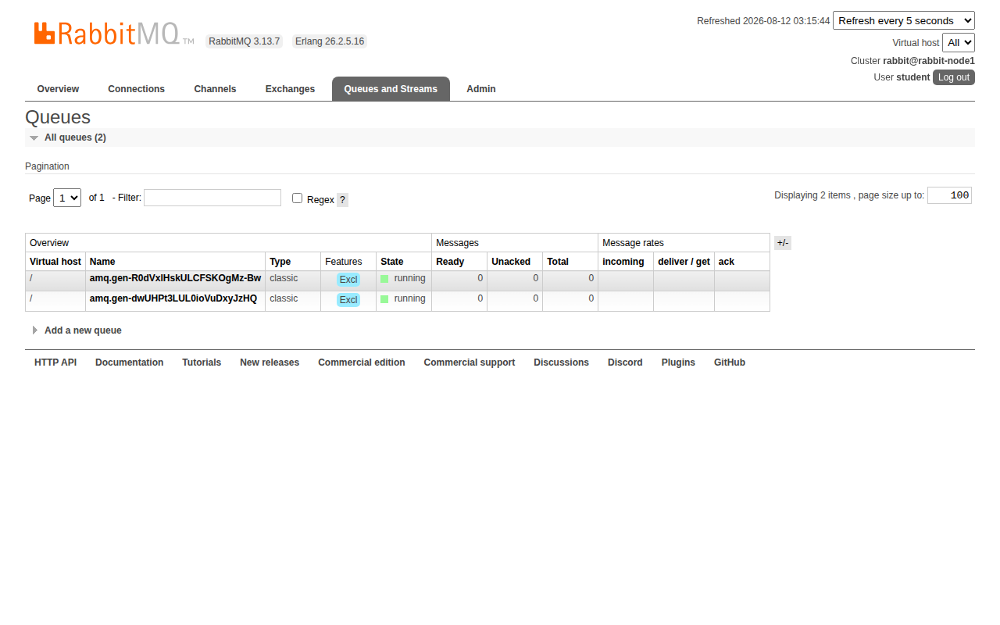

# LAB 3 — Publish/Subscribe (fanout exchange)

> โฟลเดอร์ `003_LAB_Publish_Subscribe` = **LAB 3** ในสไลด์ `RabbitMQ_Slides.html`
> (ต่อจาก LAB 2 — คราวนี้ข้อความ 1 ฉบับไม่ได้ถึง worker **คนเดียว** แต่ **กระจายถึงทุกคนที่สมัครรับ**)
> ไฟล์หลัก: `emit_log.py` / `receive_logs.py` · Bonus reliability: `emit_log_durable.py` / `receive_logs_durable.py`

## สิ่งที่จะได้เรียนรู้

- **exchange** คืออะไร — producer ไม่ส่งเข้า queue ตรง ๆ แต่ส่งผ่าน "ตัวกระจาย" ตรงกลาง
- exchange ชนิด **fanout** : copy ข้อความให้ **ทุก queue ที่ bind ไว้** = broadcast
- **temporary queue** : `queue=''` ให้ broker ตั้งชื่อให้ (`amq.gen-…`) และ `exclusive=True` ปิดโปรแกรมแล้ว queue หายเอง
- `queue_bind` : การ "สมัครรับ" ข้อความจาก exchange
- คำสั่งส่องข้างใน broker : `rabbitmqctl list_queues` · `list_bindings` · `list_exchanges`
- จุดต่างสำคัญจาก LAB 1/2 : ในแล็บหลัก subscriber ใช้ queue ชั่วคราว จึงไม่มี queue/binding เหลือไว้รับข้อความตอนปิดทุกจอ
- Bonus เปรียบเทียบกับ **named durable subscription + publisher confirms** ที่เก็บ event ไว้ให้ subscriber กลับมารับภายหลัง

## ภาพรวมของแล็บนี้

โจทย์ของแล็บนี้คือ **ระบบกระจาย log** — มีจอแสดงผลหลายจอ ทุกจออยากเห็น log **ทุกบรรทัดเหมือนกันหมด** (ต่างจาก LAB 2 ที่งานหนึ่งชิ้นถูกส่งให้ worker แค่คนเดียว)
1. **เปิดเครื่องเรียน + broker + venv** — ทบทวนขั้นตอนเดิมจากแล็บก่อนแบบเร็ว ๆ ให้พร้อมทำงาน
2. **ทำความเข้าใจ fanout + temporary queue** — producer ส่งเข้า exchange ไม่ใช่ queue และ subscriber แต่ละคนถือ queue ส่วนตัว
3. **เปิด subscriber 2 จอ** — แต่ละจอพิมพ์ชื่อ queue ของตัวเอง (`amq.gen-…` คนละชื่อ) พิสูจน์ว่า **แต่ละ connection ได้ queue ชั่วคราวของตัวเอง**
4. **ส่อง queue และ binding ใน broker** — เห็น `amq.gen` 2 ตัว และเส้น bind จาก `logs` ไปหาทั้งสอง พิสูจน์ว่าการสมัครรับเกิดขึ้นจริง
5. **ประกาศ 3 ข้อความจากจอเดียว** — ทั้งสองจอเห็น **ครบทุกข้อความเหมือนกัน** พิสูจน์ว่า fanout copy ให้ทุกคน ไม่ได้แบ่งกันแบบ LAB 2
6. **ปิด subscriber 1 จอ** — queue ของจอนั้น **หายไปเอง** พิสูจน์ว่า `exclusive=True` ลบ queue ทันทีที่ connection ปิด
7. **ส่งตอนไม่มีใครฟัง** — ข้อความ **หายไปเลย** ไม่ค้างที่ไหน พิสูจน์ว่า exchange ไม่ใช่ที่เก็บของ



> **ทายก่อนรัน:** จอที่เปิดหลัง publisher ส่งไปแล้วจะเห็นข้อความเก่าหรือไม่? คำตอบขึ้นกับว่า queue/binding ของ subscriber มีอยู่ในเวลาที่ส่ง ไม่ได้ขึ้นกับคำว่า fanout เพียงอย่างเดียว
8. **เปิด Management UI** — ดู exchange `logs` กับ binding 2 เส้น และ queue `amq.gen-…` ด้วยตาตัวเอง

### Terminal Map

| หน้าต่าง | หน้าที่ |
|---|---|
| **T1** | publisher, `rabbitmqctl` และ UI |
| **T2** | subscriber A (และ durable subscriber ใน Bonus) |
| **T3** | subscriber B |
| **T4** | subscriber ตัวที่สาม เฉพาะการทดลองเพิ่มเติม |

`receive_logs*.py` เป็นคำสั่ง blocking: ต้องเปิด receiver ให้เห็น `Waiting...` ก่อน แล้วจึง publish จาก T1

---

## 0. เตรียมเครื่องเรียน

ทำบนเครื่องของเราเอง (ไม่ใช้ cloud) — เปิด container ที่ติดตั้ง Docker มาให้แล้ว

```bash
docker start devtools 2>/dev/null || \
  docker run -dit --name devtools --privileged -p 2222:22 tuchsanai/devtools:2569_1
ssh root@localhost -p 2222        # password : passwd
```

> 📝 **คำอธิบาย:** เปิดเครื่องเรียนเดิมถ้ามี และสร้างใหม่เฉพาะเมื่อยังไม่มี จึงไม่ลบ clone/venv ของ LAB ก่อนหน้า · `--privileged` ใช้เฉพาะ disposable classroom container สำหรับ Docker-in-Docker
> `-dit` คือ `-d` รันเบื้องหลัง + `-i` เปิด stdin ค้างไว้ + `-t` ให้มี terminal
> รวมกันแล้วกล่องไม่ดับทันที · `--privileged` ให้สิทธิ์เต็มเพื่อรัน **Docker ซ้อนข้างในกล่อง** (Docker-in-Docker) — RabbitMQ ของแล็บนี้จะรันเป็น
> container ข้างในเครื่องเรียนอีกชั้น · `-p 2222:22` ส่ง port 2222 ของเครื่องเรา เข้า port 22 (SSH) ของกล่อง · บรรทัดสาม ssh เข้าไปทำงานข้างใน
> (พิมพ์ `passwd` แล้ว prompt เปลี่ยนเป็นของเครื่องเรียน) — คำสั่งทั้งหมดในแล็บนี้ **สั่งข้างในเครื่องเรียน** ทั้งสิ้น
> ใน VS Code ใช้ **Remote-SSH** ต่อไปที่ `root@localhost:2222` แล้วทำแล็บทั้งหมดข้างใน

ตรวจว่าพร้อมใช้งาน :

```bash
docker --version
docker info --format 'Docker daemon: {{.ServerVersion}}'
```

> 📝 **คำอธิบาย:** บรรทัดแรกเช็ก Docker CLI และบรรทัดที่สองถาม daemon โดยตรง เพื่อยืนยันว่าเราอยู่ "ในเครื่องเรียน" และ daemon ทำงานก่อนเริ่มแล็บ ·
> สิ่งที่ต้องดูคือ "มีเลขเวอร์ชันขึ้นไหม" ไม่ใช่ "เลขตรงกับเอกสารไหม" · ถ้าขึ้น `Cannot connect to the Docker daemon` แปลว่า daemon ข้างใน
> ยังไม่ตื่น รอสักครู่แล้วลองใหม่

✅ **Expected output** — ขอแค่ทั้งสองบรรทัดขึ้น **เลขเวอร์ชัน** ไม่ใช่ error (เลขเวอร์ชันของแต่ละคนอาจไม่ตรงกับเอกสารนี้):

```
Docker version 29.6.2, build dfc4efb
Docker daemon: 29.6.2
```

---

## 1. Clone โค้ดแล็บ

```bash
mkdir -p ~/labwork && cd ~/labwork
git clone https://github.com/Tuchsanai/DevTools.git
cd DevTools/test/02_RabbitMQxx/003_LAB_Publish_Subscribe
```

> 📝 **คำอธิบาย:** `mkdir -p ~/labwork` สร้างโฟลเดอร์เก็บงาน (`-p` = มีอยู่แล้วก็ไม่ error) · `git clone` ดึงรีโพของวิชาลงมาไว้ในเครื่องเรียน (ถ้าเคย clone
> จากแล็บก่อนแล้ว git จะบอกว่าโฟลเดอร์ไม่ว่าง — ข้ามไป `cd` ได้เลย) · เสร็จแล้วเข้าโฟลเดอร์ของแล็บนี้ ซึ่งมีไฟล์ `emit_log.py` · `receive_logs.py` · `requirements.txt` รออยู่

---

## 2. เปิด RabbitMQ broker

ขั้นตอนเดียวกับแล็บก่อนเป๊ะ — ทุกแล็บของสัปดาห์นี้เริ่มจาก broker ตัวเดียวกันเสมอ :

```bash
docker rm -f rabbit 2>/dev/null || true
docker run -d --name rabbit --hostname rabbit-node1 \
  -p 5672:5672 -p 15672:15672 \
  -e RABBITMQ_DEFAULT_USER=student \
  -e RABBITMQ_DEFAULT_PASS=student123 \
  rabbitmq:4.3.4-management
```

> 📝 **คำอธิบาย:** บรรทัดแรกลบ broker ตัวเก่าทิ้งก่อนถ้ามี (`2>/dev/null` ซ่อนข้อความถ้าไม่มี) · `docker run -d` รันเบื้องหลัง · `--name rabbit`
> ตั้งชื่อไว้เรียกสั้น ๆ · `--hostname rabbit-node1` ทำให้ node name ใน CLI/UI คงที่เพื่ออ่านผลได้ง่าย แต่ **ไม่ได้รักษาข้อมูลหลังลบ container** · `-p 5672:5672` คือ
> port **AMQP** ที่โปรแกรม Python ต่อเข้า · `-p 15672:15672` คือ port ของ **Management UI** ที่จะเปิดในเบราว์เซอร์ตอนท้ายแล็บ ·
> `-e RABBITMQ_DEFAULT_USER/PASS` สร้างบัญชี LAB `student` / `student123` แทน guest · image `rabbitmq:4.3.4-management` pin เวอร์ชันที่มีหน้าเว็บ UI เพื่อให้ผลทำซ้ำได้

✅ **Expected output** — ครั้งแรกจะเห็นการ pull ทีละ layer แล้วปิดท้ายด้วย **container ID ยาว ๆ** (layer ID · digest ของแต่ละคนจะไม่ตรงกับเอกสารนี้ · ถ้าเคย pull แล้วจะเห็นแค่ ID บรรทัดเดียว):

```
Unable to find image 'rabbitmq:4.3.4-management' locally
4.3.4-management: Pulling from library/rabbitmq
d686b50ce172: Pulling fs layer
14e6209d5fa8: Pulling fs layer
        ... (รวม 10 layer ทยอย Download complete / Pull complete) ...
d686b50ce172: Pull complete
Digest: sha256:e582c0bc7766f3342496d8485efb5a1df782b5ce3886ad017e2eaae442311f69
Status: Downloaded newer image for rabbitmq:4.3.4-management
eeaf8efbdd6b974f53f985ef32274b8e81f72bbc237ac9395c18c21d76db50a9
```

broker ใช้เวลาสตาร์ตราว 10–20 วินาที — **อย่าเพิ่งรีบต่อ** รอ readiness check ผ่านก่อน:

```bash
until docker exec --user rabbitmq rabbit rabbitmq-diagnostics -q check_running; do sleep 2; done
docker logs rabbit --tail 10
```

> 📝 **คำอธิบาย:** `check_running` จบเมื่อแอป RabbitMQ boot ครบ; แม่นกว่า `ping` ที่อาจผ่านตั้งแต่ Erlang runtime ตื่น · `--user rabbitmq` ป้องกัน CLI แย่งสร้าง Erlang cookie ด้วย owner ผิดคนระหว่าง boot · `docker logs --tail 10` ใช้อ่านเส้นเวลาและควรเห็น `Server startup complete`; ถ้ารัน Python เร็วไปจะเจอ `Connection refused`

✅ **Expected output** — จุดชี้ขาดคือ `fully booted and running`; log จะมี `Server startup complete`:

```
2026-08-12 03:13:23.455753+00:00 [info] <0.736.0> Ready to start client connection listeners
2026-08-12 03:13:23.457855+00:00 [info] <0.894.0> started TCP listener on [::]:5672
RabbitMQ on node rabbit@rabbit-node1 is fully booted and running
2026-08-12 07:02:57.797406+00:00 [info] <0.947.0> Server startup complete; 4 plugins started.
        ... (รายชื่อ plugin 4 ตัว) ...
2026-08-12 07:02:57.985007+00:00 [info] <0.10.0> Time to start RabbitMQ: 4512 ms
```

---

## 3. เตรียม Python (venv + pika)

เครื่องเรียนกันไม่ให้ `pip install` ลงระบบตรง ๆ (PEP 668) — ต้องสร้าง **virtual environment** ก่อน :

```bash
python3 -m venv ~/venv-mq
source ~/venv-mq/bin/activate
pip install pika==1.3.2
```

> 📝 **คำอธิบาย:** `python3 -m venv ~/venv-mq` สร้าง Python environment แยกไว้ที่ `~/venv-mq` (ทำครั้งเดียวใช้ได้ทุกแล็บ RabbitMQ —
> ถ้าสร้างไว้แล้วจากแล็บก่อน ข้ามบรรทัดแรกได้) · `source ~/venv-mq/bin/activate` เปิดใช้ venv — สังเกต prompt จะขึ้น `(venv-mq)` นำหน้า ·
> `pip install pika==1.3.2` ติดตั้ง **pika** ไลบรารี AMQP ของ Python ที่ใช้คุยกับ RabbitMQ (ล็อกเวอร์ชันให้ตรงกันทั้งห้อง)

✅ **Expected output** — บรรทัดสุดท้ายต้องเป็น `Successfully installed pika-1.3.2` (ถ้าติดตั้งไว้แล้วจะขึ้น `Requirement already satisfied` แทน ก็ถือว่าผ่าน):

```
Collecting pika==1.3.2
  Downloading pika-1.3.2-py3-none-any.whl.metadata (13 kB)
Downloading pika-1.3.2-py3-none-any.whl (155 kB)
   ━━━━━━━━━━━━━━━━━━━━━━━━━━━━━━━━━━━━━━━━ 155.4/155.4 kB 4.6 MB/s eta 0:00:00
Installing collected packages: pika
Successfully installed pika-1.3.2
```

> **สำคัญมาก :** แล็บนี้ใช้ **หลาย terminal พร้อมกัน** — ทุกหน้าต่างใหม่ (ssh เข้ามาใหม่) ต้องสั่ง `source ~/venv-mq/bin/activate` ก่อนเสมอ
> ไม่งั้นจะเจอ `ModuleNotFoundError: No module named 'pika'` (ดูว่า activate แล้วหรือยังจาก `(venv-mq)` หน้า prompt)

---

## 4. แนวคิด : fanout exchange + temporary queue

ใน LAB 1/2 เราส่งข้อความ **เข้า queue ตรง ๆ** — จริง ๆ แล้วเบื้องหลัง producer ของ RabbitMQ **ไม่เคยส่งเข้า queue เอง** แต่ส่งเข้า **exchange** แล้ว exchange เป็นคนตัดสินใจว่าข้อความจะไปลง queue ไหนบ้าง

- exchange ชนิด **fanout** ตัดสินใจแบบง่ายที่สุด : **copy ข้อความให้ทุก queue ที่ bind ไว้** ไม่สน routing key ใด ๆ
- subscriber แต่ละคน **ไม่ใช้ queue ร่วมกัน** — ต่างคนต่างสร้าง **queue ชั่วคราว** ของตัวเอง : `queue_declare(queue='')` = ให้ broker ตั้งชื่อสุ่มให้
  เช่น `amq.gen-p9i5N4…` · `exclusive=True` = queue เป็นของ connection นี้คนเดียว **ปิดโปรแกรมเมื่อไร queue หายทันที**
- `queue_bind(exchange='logs', queue=queue_name)` = การ "สมัครรับ" — บอก exchange ว่าขอสำเนาทุกข้อความ

เทียบกับแล็บก่อนให้เห็นภาพ :

| | LAB 2 (Work Queue) | LAB 3 (Publish/Subscribe) |
|---|---|---|
| ผู้ส่งส่งเข้า | queue `task_queue` ตรง ๆ | exchange `logs` (ชนิด fanout) |
| ผู้รับหลายคน | **แบ่งงานกัน** คนละชิ้น | **ได้ครบทุกข้อความเหมือนกันทุกคน** |
| queue | ชื่อตายตัว อยู่ถาวร | ชั่วคราว `amq.gen-…` ปิดโปรแกรมแล้วหายเอง |
| ส่งตอนไม่มีผู้รับ | งานค้างรออยู่ใน queue | ข้อความ **หายไปเลย** |

---

## 5. โค้ดของแล็บนี้

### `emit_log.py` — ผู้ประกาศ (publisher)

```python
import pika
import sys

credentials = pika.PlainCredentials('student', 'student123')
connection = pika.BlockingConnection(
    pika.ConnectionParameters(host='localhost', port=5672, credentials=credentials))
channel = connection.channel()

# ประกาศ exchange ชนิด fanout ชื่อ logs — ตัวกระจายข้อความให้ทุกคนที่ bind ไว้
channel.exchange_declare(exchange='logs', exchange_type='fanout')

message = ' '.join(sys.argv[1:]) or "info: Hello subscribers!"

# ส่งเข้า exchange ตรง ๆ — fanout ไม่สน routing_key จึงปล่อยเป็นค่าว่าง
channel.basic_publish(exchange='logs', routing_key='', body=message)
print(f" [x] Sent {message}")
connection.close()
```

> 📝 **คำอธิบาย:** สามบรรทัดแรกต่อเข้า broker ด้วยบัญชี `student` / `student123` เหมือนทุกแล็บ · `exchange_declare(exchange='logs', exchange_type='fanout')`
> สร้าง exchange ชื่อ `logs` ชนิด fanout (ไม่มีก็สร้าง; มีแล้วและ attributes ตรงกันจึงใช้ตัวเดิม มิฉะนั้นได้ `PRECONDITION_FAILED`) · `message = ' '.join(sys.argv[1:])` เอาคำที่พิมพ์ต่อท้าย
> คำสั่งมารวมเป็นข้อความ ถ้าไม่พิมพ์อะไรเลยใช้ `"info: Hello subscribers!"` แทน · จุดต่างสำคัญจากแล็บก่อนอยู่ที่ `basic_publish` : คราวนี้ `exchange='logs'`
> (ไม่ใช่ค่าว่าง) และ `routing_key=''` (ไม่ระบุ queue ปลายทางเลย!) — **ผู้ส่งไม่รู้ด้วยซ้ำว่ามีผู้รับกี่คน** ใครอยากได้ก็มา bind เอาเอง · ปิดท้าย `connection.close()` ส่งเสร็จแล้วจบโปรแกรม

### `receive_logs.py` — ผู้สมัครรับ (subscriber)

```python
import pika
import sys

def main():
    credentials = pika.PlainCredentials('student', 'student123')
    connection = pika.BlockingConnection(
        pika.ConnectionParameters(host='localhost', port=5672, credentials=credentials))
    channel = connection.channel()

    # ประกาศ exchange ให้ตรงกับฝั่งผู้ส่ง (ฝั่งไหนรันก่อนก็ได้)
    channel.exchange_declare(exchange='logs', exchange_type='fanout')

    # queue ชั่วคราว: queue='' ให้ broker ตั้งชื่อให้ (amq.gen-…)
    # exclusive=True = เป็นของ connection นี้คนเดียว ปิดโปรแกรมปุ๊บ queue หายปั๊บ
    result = channel.queue_declare(queue='', exclusive=True)
    queue_name = result.method.queue
    print(f" [*] My queue is {queue_name}")

    # bind: บอก exchange logs ว่า "ขอสำเนาทุกข้อความมาเข้า queue ของฉันด้วย"
    channel.queue_bind(exchange='logs', queue=queue_name)

    print(' [*] Waiting for logs. To exit press CTRL+C')

    def callback(ch, method, properties, body):
        print(f" [x] {body.decode()}")

    channel.basic_consume(queue=queue_name, on_message_callback=callback, auto_ack=True)
    channel.start_consuming()

if __name__ == '__main__':
    try:
        main()
    except KeyboardInterrupt:
        print('Interrupted')
        sys.exit(0)
```

> 📝 **คำอธิบาย:** เปิด connection แล้ว `exchange_declare` ประกาศ `logs` ซ้ำอีกครั้ง — ประกาศทั้งสองฝั่งเพื่อให้ **ฝั่งไหนรันก่อนก็ได้** ไม่ต้องกลัว exchange ยังไม่มี ·
> `queue_declare(queue='', exclusive=True)` คือหัวใจของแล็บ : ชื่อว่าง = ให้ broker ตั้งชื่อสุ่ม แล้วอ่านชื่อจริงจาก `result.method.queue` มาพิมพ์ให้ดู ·
> `exclusive=True` ผูก queue กับ connection นี้ — ปิดโปรแกรมเมื่อไร broker ลบ queue ทิ้งให้เอง ไม่มีขยะค้าง · `queue_bind` จับ queue ของเราไปเสียบกับ
> exchange `logs` = สมัครรับตั้งแต่บรรทัดนี้เป็นต้นไป · `basic_consume(..., auto_ack=True)` ทำให้ broker ถือว่า delivery เสร็จทันทีที่ส่ง (ไม่มี ACK frame จาก consumer) เหมาะกับจอ log demo ที่ยอมเสียข้อความได้ · `start_consuming()` วนรอจนกด Ctrl+C

---

## 6. เปิด subscriber สองจอ

เปิด terminal เพิ่มอีก **2 หน้าต่าง** (แต่ละหน้าต่างคือ ssh เข้าเครื่องเรียนใหม่อีกรอบ : `ssh root@localhost -p 2222`)

**หน้าต่างที่ 2** :

```bash
source ~/venv-mq/bin/activate
cd ~/labwork/DevTools/test/02_RabbitMQxx/003_LAB_Publish_Subscribe
python receive_logs.py
```

> 📝 **คำอธิบาย:** หน้าต่างใหม่ = shell ใหม่ ต้อง `source ~/venv-mq/bin/activate` ก่อนเสมอ (prompt ต้องขึ้น `(venv-mq)`) · `cd` เข้าโฟลเดอร์
> แล็บ แล้วรัน subscriber — โปรแกรมจะพิมพ์ **ชื่อ queue ชั่วคราวของตัวเอง** แล้วค้างรอข้อความ (ไม่ได้แฮงก์ มันตั้งใจรอ) · จดชื่อ `amq.gen-…`
> ของจอนี้ไว้เทียบกับจอถัดไป

✅ **Expected output** — ได้ชื่อ queue `amq.gen-…` ของตัวเองแล้วค้างรอ (ชื่อสุ่มของแต่ละคนจะไม่ตรงกับเอกสารนี้):

```
 [*] My queue is amq.gen-p9i5N4qqFpHaqFFoz9rMgg
 [*] Waiting for logs. To exit press CTRL+C
```

**หน้าต่างที่ 3** — สามคำสั่งเดียวกันเป๊ะ (activate venv → `cd` → `python receive_logs.py`) :

> 📝 **คำอธิบาย:** รัน subscriber ตัวที่สองแบบเดียวกันทุกอย่าง — จุดที่ต้องดูคือชื่อ queue ที่ได้ **ไม่ซ้ำกับหน้าต่างที่ 2** เพราะ `queue=''`
> ทำให้ broker สุ่มชื่อใหม่ให้ทุก connection · ตอนนี้เรามี queue ชั่วคราว 2 ตัว bind อยู่กับ exchange `logs` ตัวเดียวกัน

✅ **Expected output** — ชื่อ `amq.gen-…` **คนละชื่อ** กับหน้าต่างที่ 2 (ชื่อสุ่มของแต่ละคนจะไม่ตรงกับเอกสารนี้):

```
 [*] My queue is amq.gen-E2WeVfZuVDMXI8k5rcJtDA
 [*] Waiting for logs. To exit press CTRL+C
```

---

## 7. ส่องดู queue และ binding ใน broker

กลับมาที่ **หน้าต่างที่ 1** (ปล่อยสองจอนั้นรอไว้อย่างนั้น) :

```bash
docker exec rabbit rabbitmqctl list_queues
```

> 📝 **คำอธิบาย:** `docker exec rabbit <คำสั่ง>` สั่งคำสั่งเข้าไป **ข้างใน container ของ broker** · `rabbitmqctl list_queues` คือเครื่องมือ
> แอดมินของ RabbitMQ ไว้ดูว่าตอนนี้มี queue อะไรอยู่บ้าง พร้อมจำนวนข้อความค้าง · ที่ต้องเห็นคือ queue ชั่วคราว **2 ตัว** ชื่อตรงกับที่สองจอ
> พิมพ์ไว้เป๊ะ ๆ และ `messages` เป็น 0 เพราะยังไม่มีใครส่งอะไรมา

✅ **Expected output** — เห็น `amq.gen-…` 2 แถว ชื่อตรงกับหน้าต่างที่ 2 และ 3 (ชื่อสุ่มของแต่ละคนจะไม่ตรงกับเอกสารนี้):

```
Timeout: 60.0 seconds ...
Listing queues for vhost / ...
name	messages
amq.gen-E2WeVfZuVDMXI8k5rcJtDA	0
amq.gen-p9i5N4qqFpHaqFFoz9rMgg	0
```

```bash
docker exec rabbit rabbitmqctl list_bindings
```

> 📝 **คำอธิบาย:** `list_bindings` แสดง **เส้นเชื่อม** ทั้งหมดว่า exchange ไหนส่งเข้า queue ไหน · สองแถวแรกที่ `source_name` ว่าง คือ binding
> อัตโนมัติของ **default exchange** ที่ทุก queue ได้มาแต่เกิด (routing key = ชื่อ queue ตัวเอง — นี่คือกลไกที่ทำให้ LAB 1/2 ส่งเข้า queue
> "ตรง ๆ" ได้) · สองแถวหลังคือของจริงของแล็บนี้ : `logs exchange → amq.gen-… queue` ทั้งสองตัว = ประกาศหนึ่งครั้งถูก copy ไปทั้งสอง queue

✅ **Expected output** — ต้องมีแถว `logs exchange → amq.gen-…` ครบ **ทั้งสอง queue** (ชื่อสุ่มของแต่ละคนจะไม่ตรงกับเอกสารนี้):

```
Listing bindings for vhost /...
source_name	source_kind	destination_name	destination_kind	routing_key	arguments
	exchange	amq.gen-E2WeVfZuVDMXI8k5rcJtDA	queue	amq.gen-E2WeVfZuVDMXI8k5rcJtDA	[]
	exchange	amq.gen-p9i5N4qqFpHaqFFoz9rMgg	queue	amq.gen-p9i5N4qqFpHaqFFoz9rMgg	[]
logs	exchange	amq.gen-E2WeVfZuVDMXI8k5rcJtDA	queue	amq.gen-E2WeVfZuVDMXI8k5rcJtDA	[]
logs	exchange	amq.gen-p9i5N4qqFpHaqFFoz9rMgg	queue	amq.gen-p9i5N4qqFpHaqFFoz9rMgg	[]
```

---

## 8. ประกาศ! — ส่ง 3 ข้อความจากหน้าต่างที่ 1

```bash
python emit_log.py "Server CPU 90%"
python emit_log.py "Deploy finished"
python emit_log.py "Backup completed"
```

> 📝 **คำอธิบาย:** รัน publisher สามครั้ง ข้อความคนละแบบ (ข้อความคือทุกคำที่ต่อท้ายชื่อไฟล์) · แต่ละครั้งโปรแกรมต่อเข้า broker → ส่งเข้า
> exchange `logs` → พิมพ์ยืนยัน → จบทันที ไม่ค้างรอ · สังเกตว่าคำสั่ง **ไม่ได้บอกเลยว่าส่งให้ใคร** — ฝั่งผู้ส่งรู้จักแค่ exchange ·
> อย่าลืมว่าหน้าต่างนี้ต้อง activate venv อยู่แล้วจากขั้นตอนที่ 3

✅ **Expected output** — ยืนยันการส่งครบสามบรรทัด:

```
 [x] Sent Server CPU 90%
 [x] Sent Deploy finished
 [x] Sent Backup completed
```

✅ **Expected output — หน้าต่างที่ 2** (หันไปดูทันทีหลังส่ง) : ได้ **ครบทั้ง 3 ข้อความ** เรียงตามลำดับที่ส่ง:

```
 [*] My queue is amq.gen-p9i5N4qqFpHaqFFoz9rMgg
 [*] Waiting for logs. To exit press CTRL+C
 [x] Server CPU 90%
 [x] Deploy finished
 [x] Backup completed
```

✅ **Expected output — หน้าต่างที่ 3** : ได้ **ครบทั้ง 3 ข้อความเหมือนกันเป๊ะ**:

```
 [*] My queue is amq.gen-E2WeVfZuVDMXI8k5rcJtDA
 [*] Waiting for logs. To exit press CTRL+C
 [x] Server CPU 90%
        ... (ครบทั้ง 3 ข้อความ เหมือนหน้าต่างที่ 2) ...
```

> **นี่คือหัวใจของแล็บ :** LAB 2 ส่ง 3 งานให้ worker 2 คน = **แบ่งกัน** คนละชิ้นสองชิ้น แต่ LAB 3 ส่ง 3 ข้อความให้ subscriber 2 คน =
> **ทุกคนได้ครบ 3** เพราะ fanout **copy** ข้อความให้ทุก queue ที่ bind ไม่ใช่แจกจ่ายสลับกัน

---

## 9. ปิด subscriber หนึ่งจอ — queue หายเอง

ไปที่ **หน้าต่างที่ 2** แล้วกด **Ctrl+C** :

✅ **Expected output** — โปรแกรมพิมพ์ `Interrupted` (มาจาก `KeyboardInterrupt` handler ในโค้ด) แล้วคืน prompt:

```
 [x] Backup completed
Interrupted
```

กลับมา **หน้าต่างที่ 1** เช็ก queue ทันที :

```bash
docker exec rabbit rabbitmqctl list_queues
```

> 📝 **คำอธิบาย:** เมื่อกด Ctrl+C โปรแกรมจบ → connection ปิด → broker เห็นว่า queue นี้เป็น `exclusive` ของ connection ที่ตายไปแล้ว
> จึง **ลบ queue ทิ้งให้เองทันที** ไม่ต้องมีใครสั่ง · ที่ต้องเห็นคือเหลือ `amq.gen-…` **ตัวเดียว** — ตัวของหน้าต่างที่ 3 ที่ยังเปิดอยู่

✅ **Expected output** — เหลือ queue เดียว ชื่อตรงกับหน้าต่างที่ 3 (ชื่อสุ่มของแต่ละคนจะไม่ตรงกับเอกสารนี้):

```
Timeout: 60.0 seconds ...
Listing queues for vhost / ...
name	messages
amq.gen-E2WeVfZuVDMXI8k5rcJtDA	0
```

---

## 10. ส่งตอนไม่มี temporary subscription — ไม่มีที่เก็บข้อความ

ไปที่ **หน้าต่างที่ 3** กด **Ctrl+C** ปิด subscriber ตัวสุดท้าย (เห็น `Interrupted` เหมือนกัน) — ตอนนี้ **ไม่มีใครฟังแล้ว** กลับมา **หน้าต่างที่ 1** ลองประกาศ :

```bash
python emit_log.py "Nobody hears this"
docker exec rabbit rabbitmqctl list_queues
```

> 📝 **คำอธิบาย:** หลังปิด subscriber ทั้งหมด queue แบบ exclusive และ binding ถูกลบ จึงไม่มี queue ใดรับสำเนาจาก `logs` · ผู้ส่งเดิมไม่ได้ใช้ `mandatory`/publisher confirm จึงไม่รู้ว่า route ไม่ถึง queue · `list_queues` ยืนยันว่าไม่มีที่เก็บ ไม่ใช่ว่า fanout มีความสามารถเก็บของแล้วเลือกไม่เก็บ
> = ข้อความไม่ได้ค้างที่ไหนทั้งสิ้น

✅ **Expected output** — ส่งสำเร็จ แต่รายการ queue **ว่างเปล่า** ไม่มีแม้แต่หัวคอลัมน์ `name`:

```
 [x] Sent Nobody hears this
Timeout: 60.0 seconds ...
Listing queues for vhost / ...
```

> **จุดต่างสำคัญจาก LAB 1/2 :** queue แบบเดิมเก็บข้อความรอไว้ได้แม้ยังไม่มีผู้รับ แต่ **exchange ไม่ใช่ที่เก็บของ** — fanout แจกได้เฉพาะ
> queue ที่ bind อยู่ **ณ วินาทีที่ส่ง** เท่านั้น ใครมาสมัครทีหลังจะไม่เห็นข้อความเก่าเลย ดังนั้นระบบ broadcast ต้อง **เปิดผู้รับก่อน แล้วค่อยประกาศ**

---

## 11. ดูใน Management UI

ก่อนเปิด UI ให้เปิด subscriber กลับมา 2 จอก่อน (ทำซ้ำขั้นตอนที่ 6 ใน **หน้าต่างที่ 2 และ 3**) เพื่อให้มีของให้ดู — สังเกตว่าได้ queue **ชื่อใหม่** ไม่ซ้ำรอบแรก เพราะ queue ชั่วคราวเกิดใหม่ทุกครั้งที่รันโปรแกรม :

✅ **Expected output** — เช่นหน้าต่างที่ 2 ได้ชื่อชุดใหม่ (หน้าต่างที่ 3 ก็เช่นกัน — รอบทดสอบนี้ได้ `amq.gen-dwUHPt3LUL0ioVuDxyJzHQ` · ชื่อสุ่มของแต่ละคนจะไม่ตรงกับเอกสารนี้):

```
 [*] My queue is amq.gen-R0dVxlHskULCFSKOgMz-Bw
 [*] Waiting for logs. To exit press CTRL+C
```

port `15672` เปิดอยู่ **ข้างในเครื่องเรียน** — ต้อง forward ออกมาก่อนเหมือนที่ทำกับ nginx ใน Docker LAB 2 :

1. เปิดแท็บ **PORTS** ใน VS Code (แถวเดียวกับ TERMINAL)
2. กดปุ่ม **Forward a Port**
3. พิมพ์ `15672` แล้วกด **Enter**
4. เปิด `http://localhost:15672` ในเบราว์เซอร์ → login ด้วย `student` / `student123`



#### ทางเลือก : forward ด้วยคำสั่ง `ssh -L` (ไม่ใช้ VS Code) — เปิด terminal ใหม่บนเครื่องเรา :

```bash
ssh -L 15672:localhost:15672 root@localhost -p 2222        # password : passwd
```

> 📝 **คำอธิบาย:** `-L 15672:localhost:15672` เปิด port 15672 บนเครื่องเรา แล้วส่งทุก connection ผ่านท่อ ssh ไปโผล่ที่ `localhost:15672`
> ฝั่งเครื่องเรียน (ที่ Management UI ฟังอยู่) · `-p 2222` คือ port SSH ของเครื่องเรียนตามเดิม · หน้าต่างนี้ต้องเปิดค้างไว้ — ปิดเมื่อไร tunnel หายทันที

**แท็บ Exchanges** → คลิก `logs` — เห็น Type เป็น **fanout** และตาราง **Bindings** มี `amq.gen-…` **2 แถว** ตรงกับ subscriber สองจอที่เปิดไว้ :



**แท็บ Queues and Streams** — เห็น queue ชั่วคราว 2 ตัว Features เป็น **Excl** (exclusive) และ State เป็น running :



#### ทดลองเสร็จแล้ว — ลบ tunnel ทุกครั้ง

- แบบ VS Code : แท็บ **PORTS** → คลิกขวาที่ `15672` → **Stop Forwarding Port**
- แบบ `ssh -L` : พิมพ์ `exit` (หรือกด `Ctrl+D`) ใน session นั้น — tunnel ปิดทันที

---

## ทดลองเพิ่มเติม

### 1. เปิดจอที่สาม — broadcast ถึงสามจอพร้อมกัน

เปิด **หน้าต่างที่ 4** รัน subscriber ตัวที่สาม (activate venv + `cd` + `python receive_logs.py` เหมือนเดิม) แล้วประกาศจาก **หน้าต่างที่ 1** :

```bash
python emit_log.py "Broadcast to three screens"
```

> 📝 **คำอธิบาย:** ประกาศ 1 ครั้งเหมือนเดิมทุกอย่าง — ฝั่งผู้ส่งไม่รู้ด้วยซ้ำว่าตอนนี้มีผู้ฟังกี่จอ · exchange ชนิด fanout
> เป็นคนคูณสำเนาให้เท่าจำนวน queue ที่ bind อยู่ ณ วินาทีนั้นเอง สิ่งที่ต้องดูคือจอที่เพิ่งเปิดใหม่ก็ได้รับเท่าเทียมกับจอเก่าทันที

✅ **Expected output** — **ทั้งสามจอ** ขึ้นข้อความเดียวกันพร้อมกัน (ตัวอย่างจากจอที่เปิดใหม่ — ชื่อ queue ของแต่ละคนจะไม่ตรงกับเอกสารนี้):

```
 [*] My queue is amq.gen-bzp8a5CLYynZWkZ-yPEGXg
 [*] Waiting for logs. To exit press CTRL+C
 [x] Broadcast to three screens
```

> เพิ่มผู้รับกี่คนก็ได้โดย **ไม่ต้องแก้โค้ดผู้ส่งแม้แต่ตัวอักษรเดียว** — นี่คือพลังของการแยก exchange ออกจาก queue

### 2. exchange ไม่ได้มีแค่ของเรา

```bash
docker exec rabbit rabbitmqctl list_exchanges
```

> 📝 **คำอธิบาย:** ดู exchange ทั้งหมดใน broker · แถวที่ `name` ว่างคือ **default exchange** (ชนิด direct) ที่ LAB 1/2 ใช้ส่งเข้า queue ตรง ๆ
> โดยไม่รู้ตัว · `amq.fanout` `amq.topic` `amq.direct` ฯลฯ คือ exchange มาตรฐานที่ RabbitMQ เตรียมไว้ให้ทุกเครื่อง (ชื่อขึ้นต้น `amq.`
> สงวนไว้ ห้ามตั้งเอง) · ส่วน `logs` ชนิด fanout คือของที่แล็บนี้สร้าง — ชนิด **topic** จะได้ใช้จริงใน LAB 4

✅ **Expected output** — ต้องเห็น `logs fanout` ปนอยู่กับ exchange มาตรฐาน (ลำดับแถวของแต่ละคนอาจสลับกัน):

```
Listing exchanges for vhost / ...
name	type
	direct
amq.fanout	fanout
amq.topic	topic
amq.rabbitmq.trace	topic
logs	fanout
amq.match	headers
amq.direct	direct
amq.headers	headers
```

### 3. เปรียบเทียบ temporary กับ durable subscription

แล็บหลักเหมาะกับ live dashboard: ปิดจอแล้ว queue หาย ส่วน audit/billing ต้องมี subscription ที่ยังอยู่แม้ consumer offline ทดลองด้วย exchange/queue คนละชื่อเพื่อไม่ให้ attributes ชนของเดิม

**Terminal 2 — สร้าง durable subscription หนึ่งครั้ง แล้วกด Ctrl+C:**

```bash
python receive_logs_durable.py
# รอข้อความ "Durable subscription audit_logs is ready" แล้วกด Ctrl+C
```

**Terminal 1 — ส่งขณะที่ไม่มี consumer ออนไลน์:**

```bash
python emit_log_durable.py "audit: user-created"
python emit_log_durable.py "audit: role-changed"
docker exec rabbit rabbitmqctl list_queues name durable messages_ready consumers
```

✅ Publisher รอ confirm จาก broker และ queue มี `Ready=2`, `Consumers=0`:

```text
 [x] Broker confirmed: audit: user-created
 [x] Broker confirmed: audit: role-changed
name        durable  messages_ready  consumers
audit_logs  true     2               0
```

เปิด Terminal 2 อีกครั้ง:

```bash
python receive_logs_durable.py
```

✅ ได้ event ที่ส่งตอนไม่มี consumer ครบสองรายการ เพราะ named queue และ binding ยังมีอยู่:

```text
 [*] Durable subscription audit_logs is ready. Press CTRL+C to exit
 [x] audit: user-created
 [x] audit: role-changed
```

| แบบ | Queue | ตอน consumer ปิด | Ack/Publish |
|---|---|---|---|
| Live demo | ชื่อสุ่ม + exclusive | queue/binding หาย ของใหม่ไม่มีที่เก็บ | `auto_ack=True`, ไม่มี confirm |
| Durable subscription | `audit_logs`, durable | queue/binding ยังอยู่ ของใหม่รอใน Ready | manual ack + persistent + confirm + `mandatory` |

> นี่ยังเป็น single-node LAB; production ที่ต้องทน node failure ต้องใช้ replicated queue เช่น quorum queue รวมถึง TLS, secret, retry/DLQ และ monitoring

---

## แก้ปัญหาที่พบบ่อย

| อาการ | สาเหตุ / ทางแก้ |
|---|---|
| เปิด subscriber ทีหลัง แล้วไม่เห็นข้อความที่ส่งไปก่อนหน้า | **ไม่ใช่ bug — by design** : queue ของเราเพิ่งเกิดตอนรันโปรแกรม fanout copy ให้เฉพาะ queue ที่ bind อยู่ ณ วินาทีที่ส่ง (ขั้นตอนที่ 10) → เปิดผู้รับก่อน แล้วค่อยประกาศ |
| `pika.exceptions.ChannelClosedByBroker: (403, "ACCESS_REFUSED - queue name 'amq.test' contains reserved prefix 'amq.*'")` | ตั้งชื่อ queue ขึ้นต้น `amq.` เอง — ชื่อนี้ **สงวนให้ broker** ตั้งชื่อของระบบ · อยากตั้งเองใช้ชื่ออื่น อยากได้ queue ชั่วคราวใช้ `queue=''` |
| `ModuleNotFoundError: No module named 'pika'` | หน้าต่างนั้นลืม `source ~/venv-mq/bin/activate` (prompt ไม่มี `(venv-mq)` นำหน้า) — activate แล้วรันใหม่ |
| `pika.exceptions.AMQPConnectionError` (Connection refused) | broker ยังไม่พร้อมหรือไม่ได้รัน — เช็ก `docker ps` แล้วรัน `until docker exec --user rabbitmq rabbit rabbitmq-diagnostics -q check_running; do sleep 2; done` ให้ผ่านก่อน |
| `pika.exceptions.ProbableAuthenticationError: ... ACCESS_REFUSED - Login was refused using authentication mechanism PLAIN ...` | username/password ไม่ตรงกับที่ตั้งตอนรัน broker — แล็บนี้ต้องเป็น `student` / `student123` ทุกไฟล์ |

> ข้อความ error ในตารางมาจากการทำผิดจริงบนเครื่องเรียน (บรรทัดยาวตัดให้สั้นด้วย `...`)

---

## เก็บกวาด (Cleanup)

ปิด subscriber ทุกจอด้วย **Ctrl+C** ก่อน (queue ชั่วคราวจะหายเองหมด) แล้วลบ broker :

```bash
docker rm -f rabbit
docker ps -a
```

> 📝 **คำอธิบาย:** `docker rm -f rabbit` หยุดแล้วลบ broker ในคำสั่งเดียว (`-f` เพราะยังรันอยู่) — queue ชั่วคราวและ exchange `logs`
> หายไปพร้อม container · `docker ps -a` ตรวจซ้ำว่าไม่เหลือ container ค้าง · **image `rabbitmq:4.3.4-management` และ venv `~/venv-mq`
> เก็บไว้ได้** ไม่ต้องลบ — LAB 4 ใช้ต่อทันที ไม่ต้อง pull / pip install ใหม่

✅ **Expected output** — ได้ชื่อ `rabbit` คืนมา แล้วตารางเหลือแต่หัว ไม่มีแถวข้อมูล:

```
rabbit
CONTAINER ID   IMAGE     COMMAND   CREATED   STATUS    PORTS     NAMES
```

---

## สรุปคำสั่งของแล็บนี้

| คำสั่ง | ความหมาย |
|---|---|
| `docker run -d --name rabbit ... rabbitmq:4.3.4-management` | เปิด broker พร้อม Management UI ด้วยเวอร์ชันที่ pin |
| `docker exec --user rabbitmq rabbit rabbitmq-diagnostics -q check_running` | readiness check; รอจนแอป RabbitMQ boot ครบจึงเริ่มต่อ |
| `python receive_logs.py` | เปิด subscriber — สร้าง queue ชั่วคราว + bind กับ `logs` แล้วรอฟัง |
| `python emit_log.py "ข้อความ"` | ประกาศเข้า exchange `logs` — ถึงทุกจอที่เปิดอยู่ |
| `docker exec rabbit rabbitmqctl list_queues` | ดู queue ทั้งหมด + จำนวนข้อความค้าง |
| `docker exec rabbit rabbitmqctl list_bindings` | ดูว่า exchange ไหนต่อเข้า queue ไหน |
| `docker exec rabbit rabbitmqctl list_exchanges` | ดู exchange ทั้งหมด (default + `amq.*` + ของเรา) |
| `docker rm -f rabbit` | ลบ broker เมื่อจบแล็บ |

> **producer → exchange → (binding) → queue → consumer** — fanout copy ให้ทุก queue ที่ bind; การเก็บตอน consumer offline ขึ้นกับว่า queue/binding ยังอยู่หรือไม่

## ✅ เช็กลิสต์ก่อนจบแล็บ

- [ ] `docker exec --user rabbitmq rabbit rabbitmq-diagnostics -q check_running` ขึ้น `fully booted and running` ก่อนเริ่มต่อ
- [ ] subscriber สองจอพิมพ์ชื่อ queue `amq.gen-…` **คนละชื่อกัน**
- [ ] `rabbitmqctl list_queues` เห็น `amq.gen-…` ครบ 2 ตัว และ `list_bindings` มีแถว `logs exchange → amq.gen-…` ทั้งสอง queue
- [ ] ประกาศ 3 ข้อความแล้ว **ทั้งสองจอเห็นครบทั้ง 3 เหมือนกัน** (ไม่ใช่แบ่งกันแบบ LAB 2)
- [ ] กด Ctrl+C จอหนึ่ง เห็น `Interrupted` แล้ว `list_queues` เหลือ `amq.gen-…` ตัวเดียว
- [ ] ปิดหมดทุกจอแล้วส่ง `"Nobody hears this"` — ส่งสำเร็จแต่ `list_queues` ว่างเปล่า = ข้อความหายไปเลย และอธิบายได้ว่าทำไมคนมาทีหลังไม่เห็นข้อความเก่า
- [ ] เปิด Management UI ผ่าน port `15672` แล้ว login ด้วย `student` / `student123` ได้
- [ ] หน้า Exchange `logs` เห็น Type **fanout** และ Bindings 2 แถว · หน้า Queues เห็น `amq.gen-…` 2 ตัว Features **Excl**
- [ ] ปิด tunnel เรียบร้อยแล้ว (Stop Forwarding Port หรือ `exit` ใน session ของ `ssh -L`)
- [ ] เปิดจอที่สามแล้วประกาศ 1 ครั้ง — เห็นครบ **ทั้งสามจอ**
- [ ] `rabbitmqctl list_exchanges` เห็น `logs fanout` ปนกับ exchange มาตรฐาน `amq.*`
- [ ] Bonus: ปิด durable consumer แล้ว publish 2 event เห็น `audit_logs Ready=2`, เปิดใหม่แล้วรับครบ และอธิบาย confirm/`mandatory` ได้
- [ ] จบด้วย `docker rm -f rabbit` แล้ว `docker ps -a` เหลือแค่หัวตาราง

*ผลลัพธ์ทั้งหมดในเอกสารนี้มาจากการรันจริงในเครื่องเรียน `tuchsanai/devtools:2569_1` เมื่อ 12 ส.ค. 2026*
