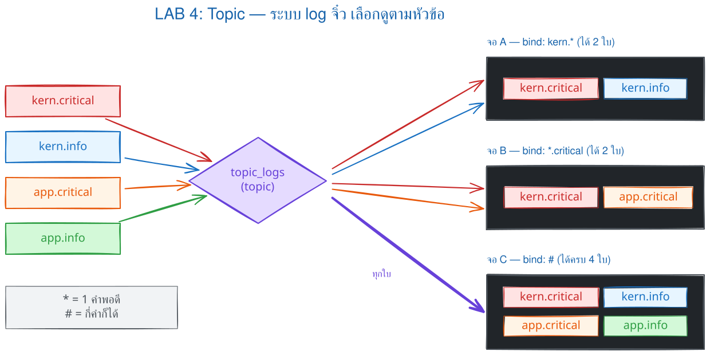
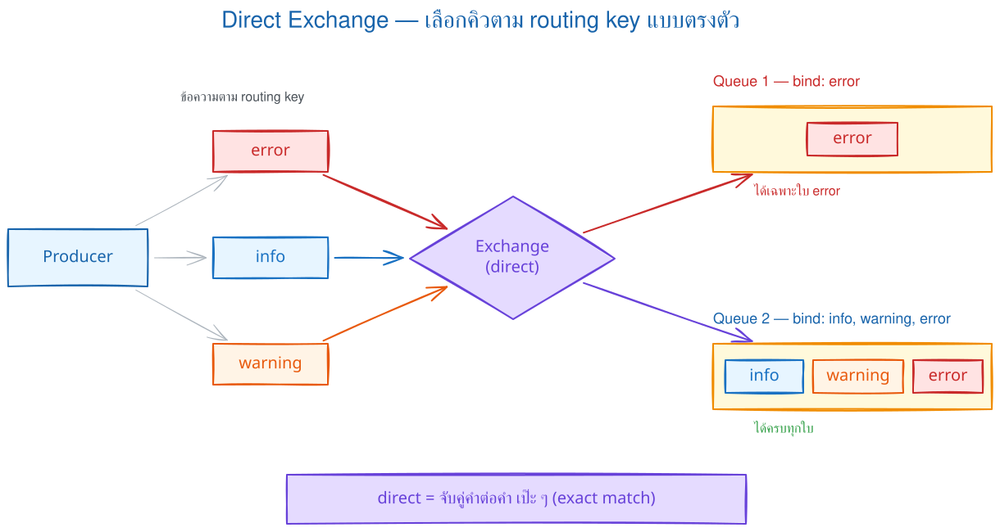
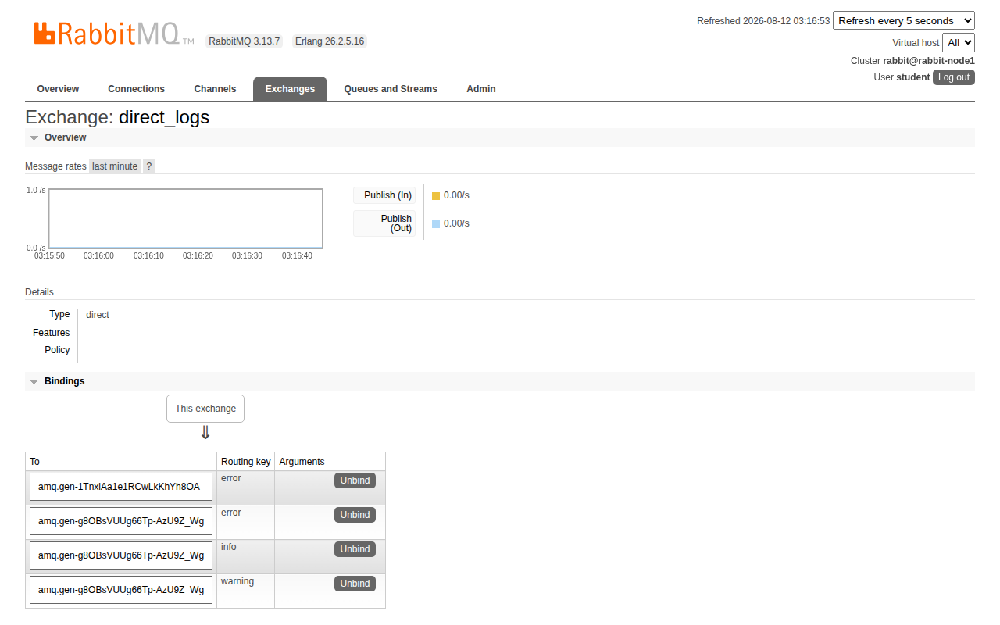
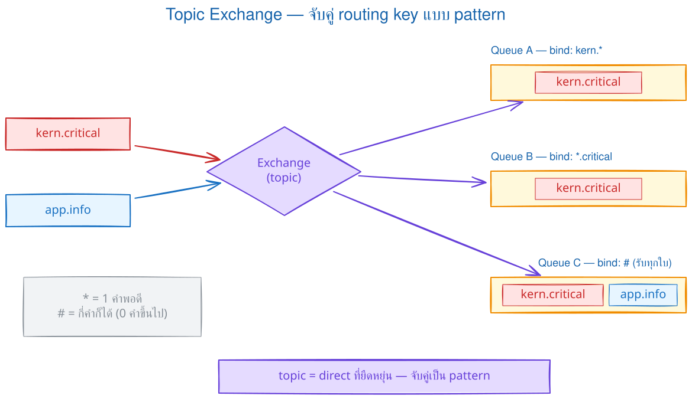
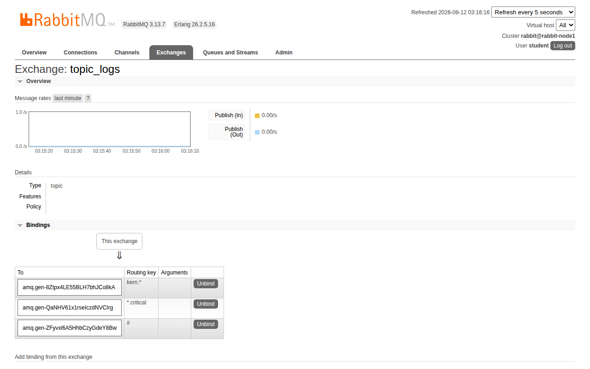

# LAB 4 — Direct & Topic Exchange : เลือกรับข้อความด้วย Routing Key

> โฟลเดอร์ `004_LAB_Topic_Routing` = **LAB 4** ในสไลด์ `RabbitMQ_Slides.html`
> ไฟล์หลัก 4 ไฟล์: `emit_log_direct.py` · `receive_logs_direct.py` · `emit_log_topic.py` · `receive_logs_topic.py` และ Bonus `unroutable_demo.py`
## สิ่งที่จะได้เรียนรู้

- LAB 3 กระจายข้อความให้ **ทุกคน** — แล็บนี้จะ **เลือกรับ** : จอนี้เอาเฉพาะ `error` · มือถือรับเฉพาะเรื่องด่วน
- **direct exchange** : ส่งให้เฉพาะ queue ที่ **binding key ตรงเป๊ะ** กับ routing key · queue เดียว bind ได้ **หลาย key**
- **topic exchange** : routing key หลายส่วนคั่นด้วยจุด (`kern.critical`) แล้วเลือกรับด้วย **pattern** — `*` แทน **1 คำเป๊ะ ๆ** · `#` แทน **กี่คำก็ได้** (รวมศูนย์คำ)
- ตรวจ binding จริงด้วย `rabbitmqctl list_bindings` และดูผ่าน **Management UI**
- โยงกลับ LAB 1/2 : default exchange (`""`) ที่ใช้มาตลอด จริง ๆ ก็คือ direct exchange ตัวหนึ่ง
## ภาพรวมของแล็บนี้

1. **เตรียมเครื่องเรียน เปิด broker และ venv** — เหมือนทุกแล็บ ยืนยันว่า RabbitMQ ขึ้นครบก่อนเริ่ม
2. **Part A : เปิดจอ consumer สองจอบน direct exchange** — จอหนึ่งรับเฉพาะ `error` อีกจอรับ `info` `warning` `error` พิสูจน์ว่า **binding key เป็นตัวคัดข้อความ** ไม่ใช่ตัวโค้ด (ไฟล์เดียวกันเป๊ะ ต่างแค่ argument)
3. **ส่ง log 4 ข้อความ severity ต่างกัน** — จอแรกได้แค่ 2 จอหลังได้ครบ 4 พิสูจน์ว่า direct ส่งให้เฉพาะ queue ที่ key **ตรงเป๊ะ**
4. **ตรวจ binding ด้วย `rabbitmqctl list_bindings`** — เห็นด้วยตาว่า queue ของจอไหน ผูกกับ key อะไรบ้าง
5. **Part B : topic exchange + wildcard** — เปิด 3 จอด้วย pattern `kern.*` · `*.critical` · `#` แล้วส่ง 4 ข้อความ พิสูจน์ว่า `*` แทนได้ 1 คำเป๊ะ ๆ ส่วน `#` รับได้หมดเหมือน fanout
6. **เปิด Management UI ดู exchange ทั้งสองตัว** — เห็น Type และตาราง Bindings ตรงกับที่สั่งในโค้ด
7. **ทดลองเพิ่มเติมกับ routing key 3 ส่วน** (`app.email.critical`) — ทำให้ท้ายคำตรงกับ `*.critical` แต่ยังไม่ match เพราะ `*` แทนได้คำเดียว
8. **ตรวจ unroutable message** ด้วย publisher confirm + `mandatory=True` แทนการปล่อยให้หายเงียบ



> **กติกาก่อนทุกการส่ง:** temporary queue ถูกสร้างตอน receiver เริ่มรัน จึงต้องเปิดทุก receiver ให้เห็น `Waiting...` ก่อนค่อย emit มิฉะนั้นข้อความจะไม่มีทางย้อนกลับมา

### Terminal Map — ใช้พร้อมกันสูงสุด 4 หน้าต่าง

| Terminal | หน้าที่และการนำกลับมาใช้ |
|---|---|
| **T1** | publisher, `rabbitmqctl` และ Management UI |
| **T2** | direct จอ error → topic จอ A → ทดลอง `app.#` |
| **T3** | direct จอทุกระดับ → topic จอ B `*.critical` |
| **T4** | topic จอ C `#` |

ทุก consumer เป็น blocking process: รอ `Waiting...` แล้วกลับไปส่งจาก T1; เมื่อจบ Part ให้กด Ctrl+C ก่อน reuse terminal

## 0. เตรียมเครื่องเรียน

ทำบนเครื่องของเราเอง (ไม่ใช้ cloud) — เปิด container ที่ติดตั้ง Docker มาให้แล้ว
```bash
docker start devtools 2>/dev/null || \
  docker run -dit --name devtools --privileged -p 2222:22 tuchsanai/devtools:2569_1
ssh root@localhost -p 2222        # password : passwd
```
> 📝 **คำอธิบาย:** เปิดเครื่องเรียนเดิมถ้ามี และสร้างใหม่เฉพาะเมื่อยังไม่มี จึงไม่ลบ clone/venv ของ LAB ก่อนหน้า ·
> `-dit` คือ `-d` รันเบื้องหลัง + `-i` เปิด stdin ค้างไว้ + `-t` ให้มี terminal กล่องจะได้ไม่ดับทันที · `--privileged` ให้สิทธิ์เต็มเพื่อรัน **Docker ซ้อนข้างในกล่อง** (broker RabbitMQ ของแล็บนี้รันข้างในนั้น) ·
> `-p 2222:22` ส่ง port 2222 ของเครื่องเราเข้า port 22 (SSH) ของกล่อง · บรรทัดสุดท้าย ssh เข้าไปข้างใน (รหัสผ่าน `passwd`) — คำสั่งทั้งหมดจากนี้ **พิมพ์ข้างในเครื่องเรียน** · `--privileged` ใช้เฉพาะ disposable classroom container ไม่ใช่ production

> ใน VS Code ใช้ **Remote-SSH** ต่อไปที่ `root@localhost:2222` แล้วทำแล็บทั้งหมดข้างใน

ตรวจว่าพร้อมใช้งาน :
```bash
docker --version
docker info --format 'Docker daemon: {{.ServerVersion}}'
```
> 📝 **คำอธิบาย:** บรรทัดแรกตรวจ Docker CLI ส่วนบรรทัดที่สองต้องคุยกับ Docker daemon ได้จริง จึงยืนยันทั้งเวอร์ชันและความพร้อมของ daemon โดยไม่ตรวจ Compose ซึ่งแล็บนี้ไม่ได้ใช้ · สิ่งที่ต้องดูคือ "มีเลขเวอร์ชันขึ้นครบไหม" ไม่ใช่ "เลขตรงกับเอกสารไหม" · ถ้าขึ้น `Cannot connect to the Docker daemon` ให้รอสักครู่แล้วลองใหม่

✅ **Expected output** — ขอแค่มีเลขเวอร์ชันขึ้นครบสองบรรทัด ไม่ใช่ error (เลขเวอร์ชันของแต่ละคนอาจไม่ตรงกับเอกสารนี้):
```
Docker version 29.6.2, build dfc4efb
Docker daemon: 29.6.2
```
## 1. Clone โค้ดแล็บ
```bash
mkdir -p ~/labwork && cd ~/labwork
git clone https://github.com/Tuchsanai/DevTools.git
cd DevTools/test/02_RabbitMQxx/004_LAB_Topic_Routing
```
> 📝 **คำอธิบาย:** `mkdir -p ~/labwork` สร้างโฟลเดอร์เก็บงาน (`-p` = มีอยู่แล้วก็ไม่ error) · `git clone` ดึงรีโพของวิชาลงมาไว้ในเครื่องเรียน แล้ว `cd` เข้าโฟลเดอร์ของแล็บนี้ —
> ถ้าเคย clone ตอนทำ LAB 1–3 แล้ว git จะบอกว่าโฟลเดอร์ปลายทางไม่ว่าง ข้ามไป `cd` ได้เลย · ในโฟลเดอร์นี้มีไฟล์ Python หลัก 4 ไฟล์ (คู่ direct และคู่ topic), Bonus `unroutable_demo.py` และ `requirements.txt`
## 2. เปิด RabbitMQ broker
```bash
docker rm -f rabbit 2>/dev/null || true
docker run -d --name rabbit --hostname rabbit-node1 \
  -p 5672:5672 -p 15672:15672 \
  -e RABBITMQ_DEFAULT_USER=student \
  -e RABBITMQ_DEFAULT_PASS=student123 \
  rabbitmq:4.3.4-management
```
> 📝 **คำอธิบาย:** บรรทัดแรกลบ broker เก่าทิ้งก่อนถ้ามีค้างจากแล็บที่แล้ว (`2>/dev/null` ซ่อน error กรณีไม่มีตัวเก่า) · `docker run -d` รัน broker เบื้องหลัง · `--name rabbit`
> ตั้งชื่อไว้เรียกใช้กับ `docker logs` / `docker exec` · `--hostname rabbit-node1` ตั้งชื่อ node ข้างใน (RabbitMQ ผูกข้อมูลกับ hostname — ตั้งไว้ให้นิ่งจะได้ไม่งงเวลาดูใน UI) ·
> `-p 5672:5672` คือ port โปรโตคอล **AMQP** ที่โค้ด Python ต่อเข้า · `-p 15672:15672` คือ port ของ **Management UI** (หน้าเว็บ) · `-e RABBITMQ_DEFAULT_USER/PASS`
> ตั้ง user แรกชื่อ `student` รหัส `student123` สำหรับ LAB · image `rabbitmq:4.3.4-management` pin เวอร์ชันที่เปิดหน้าเว็บมาแล้วเพื่อให้ผลซ้ำกันทั้งห้อง · `--hostname` ทำให้ชื่อ node คงที่ใน CLI/UI แต่ไม่รักษาข้อมูลหลังลบ container

✅ **Expected output** — ครั้งแรกยังไม่มี image ในเครื่อง Docker จึง **pull ให้อัตโนมัติ** แล้วค่อยรัน · จุดที่ต้องดูคือบรรทัด `Status: Downloaded newer image ...` และ **container ID ยาว ๆ บรรทัดสุดท้าย** (layer ID · digest ของแต่ละคนจะไม่ตรงกับเอกสารนี้ · ถ้าเคยทำแล็บ RabbitMQ ก่อนหน้า image อยู่แล้ว จะไม่มีบรรทัด pull เลย เหลือแค่ container ID):
```
Unable to find image 'rabbitmq:4.3.4-management' locally
4.3.4-management: Pulling from library/rabbitmq
        ... (แต่ละ layer จะทยอย Download complete → Pull complete) ...
Status: Downloaded newer image for rabbitmq:4.3.4-management
<container-id>
```
broker ใช้เวลาสตาร์ตราว 10 วินาที — **รอให้พร้อมก่อน** แล้วค่อยรัน Python :
```bash
until docker exec --user rabbitmq rabbit rabbitmq-diagnostics -q check_running; do sleep 2; done
docker logs rabbit --tail 10
```
> 📝 **คำอธิบาย:** `check_running` จบเมื่อแอป RabbitMQ boot ครบ; แม่นกว่า `ping` ที่อาจผ่านตั้งแต่ Erlang runtime ตื่น · `--user rabbitmq` ป้องกัน CLI แย่งสร้าง Erlang cookie ด้วย owner ผิดคนระหว่าง boot · log ใช้อ่านลำดับการเริ่มทำงาน ถ้ารัน Python เร็วไปจะได้ `Connection refused`

✅ **Expected output** — จุดชี้ขาดคือ `fully booted and running`; log จะมี `Server startup complete`:
```
RabbitMQ on node rabbit@rabbit-node1 is fully booted and running
2026-08-12 03:13:43.399016+00:00 [info] <0.736.0> Ready to start client connection listeners
2026-08-12 03:13:43.400910+00:00 [info] <0.894.0> started TCP listener on [::]:5672
2026-08-12 07:02:57.797406+00:00 [info] <0.947.0> Server startup complete; 4 plugins started.
        ... (รายชื่อ plugin; จำนวนอาจเปลี่ยนได้ใน patch release) ...
2026-08-12 07:02:57.985007+00:00 [info] <0.10.0> Time to start RabbitMQ: 4512 ms
```
## 3. เตรียม Python : venv + pika
```bash
python3 -m venv ~/venv-mq
source ~/venv-mq/bin/activate
pip install pika==1.3.2
```
> 📝 **คำอธิบาย:** image เครื่องเรียนบล็อก `pip install` ตรง ๆ ตามกติกา **PEP 668** (externally-managed-environment — กัน pip ไปเหยียบ package ของระบบ) จึงต้องสร้าง
> **virtual environment** ก่อน · `python3 -m venv ~/venv-mq` สร้าง venv ไว้ที่ home (ถ้าเคยสร้างตอน LAB 1–3 แล้ว รันซ้ำได้ ไม่พัง) · `source ~/venv-mq/bin/activate` เปิดใช้ —
> สังเกต prompt จะขึ้น `(venv-mq)` นำหน้า · `pip install pika==1.3.2` ติดตั้ง client library ของ RabbitMQ โดยล็อกเวอร์ชันให้ตรงกันทั้งห้อง (ถ้าติดตั้งไว้แล้วจะขึ้น `Requirement already satisfied` แทน — ใช้ต่อได้เลย)

✅ **Expected output** — บรรทัดสุดท้ายต้องเป็น `Successfully installed pika-1.3.2` (ความเร็วดาวน์โหลดของแต่ละคนจะไม่ตรงกับเอกสารนี้):
```
Collecting pika==1.3.2
  Downloading pika-1.3.2-py3-none-any.whl.metadata (13 kB)
Downloading pika-1.3.2-py3-none-any.whl (155 kB)
   ━━━━━━━━━━━━━━━━━━━━━━━━━━━━━━━━━━━━━━━━ 155.4/155.4 kB 6.2 MB/s eta 0:00:00
Installing collected packages: pika
Successfully installed pika-1.3.2
```
> **สำคัญมาก :** แล็บนี้ใช้ **หลายหน้าต่าง terminal พร้อมกัน** — ทุกหน้าต่างใหม่ (ssh เข้ามาอีกรอบ) ต้องสั่ง `source ~/venv-mq/bin/activate` ก่อนเสมอ
> ไม่งั้นจะเจอ `ModuleNotFoundError: No module named 'pika'` · เช็กง่าย ๆ : ถ้า prompt มี `(venv-mq)` นำหน้า = พร้อมใช้
## Part A — Direct Exchange : เลือกรับด้วยคำเป๊ะ ๆ



## 4. แนวคิด direct exchange + โค้ดของแล็บ

ใน LAB 3 exchange ชนิด **fanout** สำเนาข้อความให้ **ทุก queue** ที่ bind ไว้ — แต่ระบบ log จริงเราอยากเลือก : จอนี้เอาเฉพาะ `error` · จออีกตัวขอดูทุกระดับ
**direct exchange** แก้โจทย์นี้ด้วยกติกาเดียว : ส่งข้อความให้ queue ที่ **binding key ตรงเป๊ะ** กับ **routing key** ของข้อความ — ตรงเป๊ะเท่านั้น และ queue เดียว bind หลาย key ได้

ดูไฟล์ฝั่งส่งก่อน — `emit_log_direct.py` :
```python
import pika
import sys

credentials = pika.PlainCredentials('student', 'student123')
connection = pika.BlockingConnection(
    pika.ConnectionParameters(host='localhost', port=5672, credentials=credentials))
channel = connection.channel()

channel.exchange_declare(exchange='direct_logs', exchange_type='direct')

# argument แรก = severity (ใช้เป็น routing key) · ที่เหลือ = ตัวข้อความ
severity = sys.argv[1] if len(sys.argv) > 1 else 'info'
message = ' '.join(sys.argv[2:]) or 'Hello World!'

channel.basic_publish(exchange='direct_logs', routing_key=severity, body=message)
print(f" [x] Sent {severity}: {message}")
connection.close()
```
> 📝 **คำอธิบาย:** สามบรรทัดแรกต่อเข้า broker ที่ `localhost:5672` ด้วย user `student` เหมือนทุกแล็บ · `exchange_declare(exchange='direct_logs', exchange_type='direct')`
> สร้าง exchange ชื่อ `direct_logs` ชนิด **direct** (ต่างจาก LAB 3 แค่คำว่า `fanout` → `direct`) · `sys.argv[1]` คือ argument แรกจาก command line เอามาเป็น **severity**
> แล้วใช้เป็น `routing_key` ตอน publish — หัวใจของแล็บ : **ผู้ส่งแปะป้าย severity ไปกับข้อความ** · `' '.join(sys.argv[2:])` รวม argument ที่เหลือเป็นตัวข้อความ ·
> `basic_publish` ส่งเข้า `direct_logs` — ไม่ได้ส่งตรงถึง queue ไหนเลย ให้ exchange เป็นคนคัดตาม key

ฝั่งรับ — `receive_logs_direct.py` :
```python
import pika
import sys

def main():
    severities = sys.argv[1:]
    if not severities:
        sys.stderr.write(f"Usage: {sys.argv[0]} [info] [warning] [error]\n")
        sys.exit(1)

    credentials = pika.PlainCredentials('student', 'student123')
    connection = pika.BlockingConnection(
        pika.ConnectionParameters(host='localhost', port=5672, credentials=credentials))
    channel = connection.channel()

    channel.exchange_declare(exchange='direct_logs', exchange_type='direct')

    result = channel.queue_declare(queue='', exclusive=True)
    queue_name = result.method.queue
    print(f" [*] My queue is {queue_name}")

    # bind ทีละ severity — queue เดียว bind หลาย key ได้
    for severity in severities:
        channel.queue_bind(exchange='direct_logs', queue=queue_name,
                           routing_key=severity)

    print(f" [*] Waiting for {severities}. To exit press CTRL+C")

    def callback(ch, method, properties, body):
        # method.routing_key = severity ของข้อความที่เข้ามา
        print(f" [x] {method.routing_key}: {body.decode()}")

    # live log demo: broker ถือว่า delivery เสร็จทันทีที่ส่ง (ไม่มี ACK frame)
    channel.basic_consume(queue=queue_name, on_message_callback=callback, auto_ack=True)
    channel.start_consuming()

if __name__ == '__main__':
    try:
        main()
    except KeyboardInterrupt:
        print('Interrupted')
        sys.exit(0)
```
> 📝 **คำอธิบาย:** `severities = sys.argv[1:]` รับรายการ severity ที่อยากฟังจาก command line — ถ้าไม่ใส่เลย พิมพ์วิธีใช้แล้วจบ · `queue_declare(queue='', exclusive=True)`
> ขอ **queue ชั่วคราวชื่อสุ่ม** (`amq.gen-...`) เหมือน LAB 3 — ตายพร้อมกับจอที่เปิด เพราะจอ log ไม่ต้องเก็บข้อความเก่า · จุดสำคัญคือ **ลูป `queue_bind`** : bind queue เดิม
> **ทีละ key** เรียกกี่ครั้งก็ได้ — นี่คือเหตุผลที่จอเดียวรับได้หลาย severity · ใน `callback` พิมพ์ `method.routing_key` ด้วย จะได้เห็นว่าข้อความที่เข้ามาแปะป้ายอะไร ·
> `auto_ack=True` ทำให้ broker ถือว่า delivery เสร็จทันทีที่ส่ง (ไม่มี ACK frame จาก consumer) จึงใช้เฉพาะจอ live log ที่ยอมเสียข้อความได้ · บรรทัด `My queue` ช่วยเทียบจอจริงกับ binding ใน CLI/UI
## 5. เปิดจอ consumer สองจอ

แต่ละ consumer เป็น blocking process จึงต้องรัน **คนละ terminal** และรอให้ทั้งสองจอขึ้น `Waiting` ก่อนส่ง

**Terminal 2 — Error only:**

```bash
cd ~/labwork/DevTools/test/02_RabbitMQxx/004_LAB_Topic_Routing
source ~/venv-mq/bin/activate
python receive_logs_direct.py error
```

**Terminal 3 — All severities:**

```bash
cd ~/labwork/DevTools/test/02_RabbitMQxx/004_LAB_Topic_Routing
source ~/venv-mq/bin/activate
python receive_logs_direct.py info warning error
```

> 📝 **คำอธิบาย:** Terminal 2 bind key เดียว ส่วน Terminal 3 รันไฟล์เดียวกันแต่ลูป bind 3 key พฤติกรรมจึงต่างจาก argument ล้วน ๆ ห้ามวางสองคำสั่ง consumer ต่อกันใน terminal เดียว เพราะคำสั่งแรกจะค้างรอและคำสั่งสองยังไม่เริ่ม

✅ **Expected output** — แต่ละจอค้างรอ โดยโชว์รายการ severity ที่ตัวเองฟัง (หน้าต่างที่ 2 บรรทัดแรก · หน้าต่างที่ 3 บรรทัดหลัง):
```
 [*] My queue is amq.gen-...      # แต่ละจอได้คนละชื่อ
 [*] Waiting for ['error']. To exit press CTRL+C
 [*] My queue is amq.gen-...
 [*] Waiting for ['info', 'warning', 'error']. To exit press CTRL+C
```
## 6. ส่ง log 4 ข้อความ แล้วดูการคัดแยก

กลับมาที่ **หน้าต่างที่ 1** (อยู่ในโฟลเดอร์แล็บ + venv เปิดอยู่แล้วจากข้อ 3) ส่ง log 4 ข้อความที่ severity ต่างกัน :
```bash
python emit_log_direct.py error "Disk is full"
python emit_log_direct.py info "User logged in"
python emit_log_direct.py warning "Memory 80%"
python emit_log_direct.py error "DB connection lost"
```
> 📝 **คำอธิบาย:** ส่งทีละข้อความ — argument แรกคือ severity (กลายเป็น routing key) ที่เหลือคือตัวข้อความ · ชุดนี้จงใจให้มี `error` 2 ตัว `info` 1 ตัว `warning` 1 ตัว
> เพื่อให้ผลสองจอไม่เท่ากันชัด ๆ · สังเกตว่าเราไม่เคยบอกผู้ส่งเลยว่ามี queue อะไรอยู่บ้าง — ผู้ส่งรู้จักแค่ exchange `direct_logs` กับป้าย severity

✅ **Expected output** — ขึ้น ` [x] Sent <severity>: <ข้อความ>` ครบทั้ง 4 บรรทัด:
```
 [x] Sent error: Disk is full
 [x] Sent info: User logged in
 [x] Sent warning: Memory 80%
 [x] Sent error: DB connection lost
```
✅ **Expected output** — **หน้าต่างที่ 2** (bind เฉพาะ `error`) ได้ **เฉพาะ 2 ข้อความ error** — `info` กับ `warning` ไม่โผล่เลย:
```
 [*] Waiting for ['error']. To exit press CTRL+C
 [x] error: Disk is full
 [x] error: DB connection lost
```
✅ **Expected output** — **หน้าต่างที่ 3** (bind ครบสาม key) ได้ **ครบทั้ง 4 ข้อความ** เรียงตามลำดับที่ส่ง พร้อมป้าย severity หน้าแต่ละบรรทัด:
```
 [*] Waiting for ['info', 'warning', 'error']. To exit press CTRL+C
 [x] error: Disk is full
 [x] info: User logged in
 [x] warning: Memory 80%
 [x] error: DB connection lost
```
> **บทเรียนสำคัญ :** ข้อความเดียวกัน (`error`) เข้า **ทั้งสองจอ** — direct exchange ไม่ได้ "เลือกจอเดียว" แต่ส่งให้ **ทุก queue ที่ key ตรง** ·
> ส่วน `info` / `warning` เข้าจอ 3 จอเดียว เพราะจอ 2 ไม่ได้ bind key นั้นไว้
## 7. ตรวจ binding ด้วย `rabbitmqctl`

จอทั้งสองยังเปิดค้างอยู่ — ที่หน้าต่างที่ 1 ลองส่องดูว่า broker ผูกอะไรไว้บ้าง :
```bash
docker exec rabbit rabbitmqctl list_bindings
```
> 📝 **คำอธิบาย:** `docker exec rabbit` สั่งคำสั่งข้างใน container ของ broker · `rabbitmqctl list_bindings` แสดง binding ทั้งหมดของ vhost `/` — อ่านทีละคอลัมน์ :
> ต้นทาง (exchange) → ปลายทาง (queue) → `routing_key` · แถวที่ source ว่าง ๆ คือ binding อัตโนมัติของ **default exchange** (เดี๋ยวเจออีกทีในทดลองเพิ่มเติม) ·
> จุดที่ต้องดูคือแถวของ `direct_logs` : queue ตัวหนึ่ง (จอ 2) ผูกกับ `error` อย่างเดียว อีกตัว (จอ 3) ผูก 3 แถวคือ `error` `info` `warning` — ตรงกับ argument ที่พิมพ์เป๊ะ

✅ **Expected output** — `direct_logs` มี 4 แถว : queue แรก 1 key · queue ที่สอง 3 key (ชื่อ `amq.gen-...` ของแต่ละคนจะไม่ตรงกับเอกสารนี้):
```
Listing bindings for vhost /...
source_name	source_kind	destination_name	destination_kind	routing_key	arguments
	exchange	amq.gen-1TnxlAa1e1RCwLkKhYh8OA	queue	amq.gen-1TnxlAa1e1RCwLkKhYh8OA	[]
	exchange	amq.gen-g8OBsVUUg66Tp-AzU9Z_Wg	queue	amq.gen-g8OBsVUUg66Tp-AzU9Z_Wg	[]
direct_logs	exchange	amq.gen-1TnxlAa1e1RCwLkKhYh8OA	queue	error	[]
direct_logs	exchange	amq.gen-g8OBsVUUg66Tp-AzU9Z_Wg	queue	error	[]
direct_logs	exchange	amq.gen-g8OBsVUUg66Tp-AzU9Z_Wg	queue	info	[]
direct_logs	exchange	amq.gen-g8OBsVUUg66Tp-AzU9Z_Wg	queue	warning	[]
```

### 7.1 ดู `direct_logs` ใน UI แล้วคืน T2/T3

ขณะที่ direct consumer ทั้งสองยังเปิดอยู่ ให้ VS Code เปิดแท็บ **PORTS** → **Forward a Port** → `15672` แล้วเปิด `http://localhost:15672` ด้วย `student` / `student123` จากนั้นไปที่ **Exchanges → direct_logs → Bindings**

> ภาพ UI ถ่ายจาก RabbitMQ รุ่นก่อนหน้าเพื่อชี้ตำแหน่งเมนู ส่วน LAB pin ที่ 4.3.4 ให้ตรวจ **Type** และ routing key เป็นหลัก



✅ ต้องเห็น **Type = direct** และ 4 binding: queue จอ error มี 1 key; queue อีกจอมี `error` `info` `warning` รวม 3 key

ดูเสร็จแล้วกด **Ctrl+C ปิด direct consumer ทั้ง T2/T3** ให้ขึ้น `Interrupted` ตอนนี้ temporary queue/binding ของ Part A จะหาย และสอง terminal พร้อม reuse ใน Part B ส่วน port forward เปิดค้างไว้ก่อนได้

## Part B — Topic Exchange : เลือกรับด้วย Pattern



## 8. แนวคิด topic exchange + wildcard

direct เลือกด้วย **คำเดียวเป๊ะ ๆ** — แต่ log จริงมักมีหลายมิติ : **มาจากไหน** (facility) และ **ร้ายแรงแค่ไหน** (severity) ·
**topic exchange** ให้ routing key เป็น **หลายคำคั่นด้วยจุด** เช่น `kern.critical` = จาก kernel + ระดับ critical แล้วฝั่งรับเลือกด้วย **binding pattern** :

| pattern | ความหมาย | ตัวอย่างที่ match |
|---|---|---|
| `kern.*` | `*` แทน **1 คำเป๊ะ ๆ** — อะไรก็ได้จาก kern | `kern.critical` · `kern.info` แต่ **ไม่ใช่** `kern.disk.error` |
| `*.critical` | เรื่อง critical จากที่ไหนก็ได้ (1 คำ) | `kern.critical` · `app.critical` |
| `#` | `#` แทน **กี่คำก็ได้** (รวมศูนย์คำ) = รับหมด | ทุกข้อความ |

> 📝 **คำอธิบาย:** กติกาจำง่าย ๆ สองข้อ : `*` (star) = **หนึ่งคำพอดี** · `#` (hash) = **ศูนย์คำขึ้นไปกี่คำก็ได้** · ผลพลอยได้สองข้อที่ควรรู้ : ถ้า binding key **ไม่มี wildcard เลย**
> topic จะทำตัว **เหมือน direct** (ต้องตรงเป๊ะ) · และถ้า bind ด้วย `#` เฉย ๆ จะทำตัว **เหมือน fanout** (รับทุกข้อความ) — topic จึงเป็นชนิดที่ยืดหยุ่นที่สุด ครอบคลุมทั้งสองแบบที่เรียนมา
## 9. โค้ดฝั่ง topic

`emit_log_topic.py` — ต่างจากตัว direct แค่ชื่อ/ชนิด exchange กับความหมายของ argument แรก :
```python
import pika
import sys

credentials = pika.PlainCredentials('student', 'student123')
connection = pika.BlockingConnection(
    pika.ConnectionParameters(host='localhost', port=5672, credentials=credentials))
channel = connection.channel()

channel.exchange_declare(exchange='topic_logs', exchange_type='topic')

# argument แรก = routing key รูปแบบ <facility>.<severity> เช่น kern.critical
routing_key = sys.argv[1] if len(sys.argv) > 1 else 'anonymous.info'
message = ' '.join(sys.argv[2:]) or 'Hello World!'

channel.basic_publish(exchange='topic_logs', routing_key=routing_key, body=message)
print(f" [x] Sent {routing_key}: {message}")
connection.close()
```
> 📝 **คำอธิบาย:** `exchange_declare(..., exchange_type='topic')` สร้าง exchange ชื่อ `topic_logs` ชนิด **topic** · argument แรกคราวนี้ไม่ใช่คำเดียว แต่เป็น routing key แบบ
> **`<facility>.<severity>`** เช่น `kern.critical` — ผู้ส่งเป็นคนตั้งโครงสร้างป้ายเอง RabbitMQ ไม่ได้บังคับรูปแบบ (ขอแค่คั่นด้วยจุด ยาวไม่เกิน 255 byte) ·
> ถ้าไม่ใส่ argument จะ default เป็น `anonymous.info` · ที่เหลือเหมือนตัว direct ทุกบรรทัด

`receive_logs_topic.py` — เปลี่ยนจาก severity เป็น **binding pattern** :
```python
import pika
import sys

def main():
    binding_keys = sys.argv[1:]
    if not binding_keys:
        sys.stderr.write(f"Usage: {sys.argv[0]} [binding_key]...\n")
        sys.exit(1)

    credentials = pika.PlainCredentials('student', 'student123')
    connection = pika.BlockingConnection(
        pika.ConnectionParameters(host='localhost', port=5672, credentials=credentials))
    channel = connection.channel()

    channel.exchange_declare(exchange='topic_logs', exchange_type='topic')

    result = channel.queue_declare(queue='', exclusive=True)
    queue_name = result.method.queue
    print(f" [*] My queue is {queue_name}")

    # bind ทีละ pattern — queue เดียว bind หลาย pattern ได้
    for binding_key in binding_keys:
        channel.queue_bind(exchange='topic_logs', queue=queue_name,
                           routing_key=binding_key)

    print(f" [*] Waiting for {binding_keys}. To exit press CTRL+C")

    def callback(ch, method, properties, body):
        # method.routing_key = routing key ของข้อความที่เข้ามา
        print(f" [x] {method.routing_key}: {body.decode()}")

    # live log demo: broker ถือว่า delivery เสร็จทันทีที่ส่ง (ไม่มี ACK frame)
    channel.basic_consume(queue=queue_name, on_message_callback=callback, auto_ack=True)
    channel.start_consuming()

if __name__ == '__main__':
    try:
        main()
    except KeyboardInterrupt:
        print('Interrupted')
        sys.exit(0)
```
> 📝 **คำอธิบาย:** โครงเดียวกับ `receive_logs_direct.py` ทั้งไฟล์ — queue ชั่วคราว `exclusive=True` + ลูป bind + callback พิมพ์ routing key · ที่เปลี่ยนคือ exchange เป็น
> `topic_logs` ชนิด `topic` และ argument กลายเป็น **pattern** (`kern.*` · `*.critical` · `#`) แทนคำตรง ๆ · การ match เกิดที่ **ตัว exchange ใน broker** ไม่ใช่ในโค้ด Python —
> โค้ดแค่ประกาศ pattern ตอน bind แล้วรอรับ · `auto_ack=True` หมายถึง broker ถือว่า delivery เสร็จทันทีที่ส่งให้ consumer โดย **ไม่มี ACK frame** จึงเหมาะกับ live log demo ที่ยอมเสียข้อความได้ ไม่ใช่งานที่ต้องรับประกันการประมวลผล
## 10. Reuse T2/T3 แล้วเปิด 3 จอ Topic

Part A ปิดแล้ว จึง reuse T2/T3 และเพิ่ม T4 เพียงหน้าต่างเดียว แต่ละ consumer เป็น blocking process ต้องรันคนละ terminal

**Terminal 2 / จอ A — ทุกอย่างจาก kernel:**

```bash
cd ~/labwork/DevTools/test/02_RabbitMQxx/004_LAB_Topic_Routing
source ~/venv-mq/bin/activate
python receive_logs_topic.py "kern.*"
```

**Terminal 3 / จอ B — critical จากทุก facility:**

```bash
cd ~/labwork/DevTools/test/02_RabbitMQxx/004_LAB_Topic_Routing
source ~/venv-mq/bin/activate
python receive_logs_topic.py "*.critical"
```

**Terminal 4 / จอ C — รับทุก routing key:**

```bash
cd ~/labwork/DevTools/test/02_RabbitMQxx/004_LAB_Topic_Routing
source ~/venv-mq/bin/activate
python receive_logs_topic.py "#"
```

> 📝 **คำอธิบาย:** สามจอรันไฟล์เดียวกัน ต่างแค่ pattern · **ต้องใส่ quote รอบ pattern เสมอ** (`"kern.*"`) — ถ้าไม่ใส่ shell จะเห็น `*` แล้วพยายามขยายเป็นชื่อไฟล์ในโฟลเดอร์
> ให้ก่อนที่ Python จะได้เห็น argument · จอ A ใช้ `kern.*` = จาก kern ตามด้วยอีก **1 คำ** อะไรก็ได้ · จอ B ใช้ `*.critical` = **1 คำ** อะไรก็ได้ ตามด้วย critical ·
> จอ C ใช้ `#` = เอาหมด (จอนี้พิสูจน์ว่า `#` ทำตัวเหมือน fanout) · รอให้ **ทั้งสามจอ** ขึ้น `Waiting` ก่อนส่ง

✅ **Expected output** — แต่ละจอค้างรอ โดยโชว์ pattern ของตัวเอง (จอละบรรทัด เรียงตามลำดับจอ):
```
 [*] My queue is amq.gen-...
 [*] Waiting for ['kern.*']. To exit press CTRL+C
 [*] My queue is amq.gen-...
 [*] Waiting for ['*.critical']. To exit press CTRL+C
 [*] My queue is amq.gen-...
 [*] Waiting for ['#']. To exit press CTRL+C
```
กลับมา **หน้าต่างที่ 1** ส่ง log 4 ข้อความ — facility 2 แบบ × severity 2 แบบ :
```bash
python emit_log_topic.py kern.critical "Kernel panic!"
python emit_log_topic.py kern.info "USB connected"
python emit_log_topic.py app.critical "Payment service down"
python emit_log_topic.py app.info "Cache refreshed"
```
> 📝 **คำอธิบาย:** จงใจออกแบบให้ครบทั้ง 4 ช่องของตาราง (kern/app × critical/info) เพื่อให้เห็นว่า pattern แต่ละแบบตัดเค้กคนละมุม · ตอนส่ง **ไม่ต้อง quote** ก็ได้
> เพราะ routing key จริง ๆ (`kern.critical`) ไม่มี wildcard — จุดธรรมดาไม่มีความหมายพิเศษกับ shell

✅ **Expected output** — ฝั่งส่งขึ้นครบ 4 · แล้วไล่ดูทีละจอ : **จอ A** (`kern.*`) ได้เฉพาะสองข้อความจาก kernel · **จอ B** (`*.critical`) ได้เฉพาะเรื่อง critical จากทั้งสอง facility · **จอ C** (`#`) ได้ครบทั้ง 4:
```
 [x] Sent kern.critical: Kernel panic!
 [x] Sent kern.info: USB connected
 [x] Sent app.critical: Payment service down
 [x] Sent app.info: Cache refreshed
```
```
 [*] Waiting for ['kern.*']. To exit press CTRL+C
 [x] kern.critical: Kernel panic!
 [x] kern.info: USB connected
```
```
 [*] Waiting for ['*.critical']. To exit press CTRL+C
 [x] kern.critical: Kernel panic!
 [x] app.critical: Payment service down
```
```
 [*] Waiting for ['#']. To exit press CTRL+C
 [x] kern.critical: Kernel panic!
 [x] kern.info: USB connected
 [x] app.critical: Payment service down
 [x] app.info: Cache refreshed
```
สรุปเป็นตาราง (ตรงกับผลรันจริงข้างบนทุกช่อง) :

| ข้อความ (routing key) | จอ A `kern.*` | จอ B `*.critical` | จอ C `#` |
|---|:---:|:---:|:---:|
| `kern.critical` — Kernel panic! | ✅ | ✅ | ✅ |
| `kern.info` — USB connected | ✅ | — | ✅ |
| `app.critical` — Payment service down | — | ✅ | ✅ |
| `app.info` — Cache refreshed | — | — | ✅ |

> **สังเกต :** `kern.critical` เข้า **ทั้งสามจอ** — ข้อความหนึ่งไป match กี่ pattern ก็ได้ ได้สำเนาไปทุก queue ที่ match
> (แต่ต่อให้ queue เดียว bind หลาย pattern ที่ match ซ้ำกัน ก็ยังได้ **สำเนาเดียว**)
## 11. ดูผ่าน Management UI

ตอนนี้มี topic consumer **3 จอ** ใน T2–T4 — ปิดจอไหน queue ชั่วคราวและ binding ของจอนั้นจะหายตาม จึงเปิดไว้ก่อน หาก port forward จากข้อ 7.1 ยังอยู่ให้ข้ามสองขั้นตอนนี้:

1. เปิดแท็บ **PORTS** (แถวเดียวกับ TERMINAL) → กดปุ่ม **Forward a Port** → พิมพ์ `15672` แล้วกด **Enter**
2. เปิด `http://localhost:15672` ในเบราว์เซอร์ → login ด้วย `student` / `student123`


#### ทางเลือก : forward ด้วยคำสั่ง `ssh -L` (ไม่ใช้ VS Code)

เปิด terminal ใหม่บนเครื่องเรา (นอกเครื่องเรียน) :
```bash
ssh -L 15672:localhost:15672 root@localhost -p 2222        # password : passwd
```
> 📝 **คำอธิบาย:** `-L 15672:localhost:15672` เปิด port 15672 บนเครื่องเรา แล้วส่งทุก connection ผ่านท่อ ssh ไปโผล่ที่ `localhost:15672` ฝั่งเครื่องเรียน (ที่ Management UI ฟังอยู่) ·
> `-p 2222` คือ port SSH ของเครื่องเรียน (คนละความหมายกับ `-p` ของ docker) · หน้าต่างนี้ต้องเปิดค้างไว้ — ปิดเมื่อไหร่ tunnel หายทันที

ไปที่แท็บ **Exchanges** คลิก `topic_logs` แล้วกางหัวข้อ **Bindings** :

> ภาพ UI ด้านล่างถ่ายจาก RabbitMQ รุ่นก่อนหน้าเพื่อชี้ตำแหน่งเมนู ส่วนคำสั่งของแล็บ pin ที่ RabbitMQ 4.3.4 หน้าตาอาจต่างเล็กน้อย ให้ตรวจ **Type**, routing key และจำนวน binding เป็นหลัก ไม่ต้องเทียบเลขเวอร์ชันในหัวภาพ



> 📝 **สิ่งที่ต้องดู:** ช่อง **Type = topic** ตรงกับที่ `exchange_declare` สั่ง · ตาราง Bindings มี **3 แถว** คือ `kern.*` · `*.critical` · `#` — จอละแถว ชี้ไปยัง queue ชั่วคราว
> `amq.gen-...` คนละตัว · ปิดจอไหนแล้ว refresh แถวนั้นจะหาย เพราะ queue `exclusive` ตายพร้อม connection

ดูเสร็จแล้วกด **Ctrl+C ปิดเฉพาะจอ A (`kern.*`) ใน T2** เพื่อคืน T2 ให้การทดลองถัดไป ส่วนจอ B (`*.critical`) ใน T3 และ C (`#`) ใน T4 เปิดไว้เพื่อเทียบ routing key 3 คำ
#### ทดลองเสร็จแล้ว — ลบ tunnel ทุกครั้ง

- แบบ VS Code : แท็บ **PORTS** → คลิกขวาที่ port `15672` → **Stop Forwarding Port**
- แบบ `ssh -L` : พิมพ์ `exit` (หรือกด `Ctrl+D`) ใน session นั้น — tunnel ปิดทันที
## ทดลองเพิ่มเติม

### 1) routing key 3 ส่วน — พิสูจน์ `*` เทียบกับ `#`

T3/T4 ยังรันจอ B/C อยู่ เปิด consumer เพิ่มโดย reuse T2:

**Terminal 2 / จอ E — ทุกอย่างใต้ app:**

```bash
cd ~/labwork/DevTools/test/02_RabbitMQxx/004_LAB_Topic_Routing
source ~/venv-mq/bin/activate
python receive_logs_topic.py "app.#"
```

> 📝 **คำอธิบาย:** จอ E ใช้ `app.#` = ขึ้นต้นด้วย `app` แล้วต่อได้กี่คำก็ได้ ต่างจาก `app.*` ที่รับต่อท้ายได้คำเดียว · รอให้จอ E ขึ้น `Waiting` ก่อนส่ง ตอนนี้มี consumer 3 แบบคือ `*.critical`, `#`, `app.#`

แล้วส่ง routing key แบบ **3 ส่วน** จากหน้าต่างที่ 1 :
```bash
python emit_log_topic.py app.email.critical "SMTP connection timeout"
```
> 📝 **คำอธิบาย:** routing key มีกี่ส่วนก็ได้ ไม่จำกัดแค่สอง — `app.email.critical` = แอป > ระบบเมล > ระดับ critical · เราจงใจให้คำสุดท้ายเป็น `critical` เหมือน pattern `*.critical` เพื่อแยกสาเหตุให้ชัด: ถ้าจอ B ไม่ได้ข้อความ เป็นเพราะ routing key มี **3 คำ** แต่ pattern นี้รับเพียง **2 คำ** ไม่ใช่เพราะ severity ต่างกัน · ทายก่อนดูเฉลยว่า `*.critical` · `#` · `app.#` จอไหนจะได้บ้าง

✅ **Expected output** — ฝั่งส่ง:
```
 [x] Sent app.email.critical: SMTP connection timeout
```
ผลที่แต่ละจอ (รันจริง) :

| จอ | pattern | ได้รับ? | เพราะ |
|---|---|:---:|---|
| C | `#` | ✅ | `#` แทนกี่คำก็ได้ — 3 คำก็รับ |
| E | `app.#` | ✅ | ขึ้นต้น `app` แล้วต่อด้วยกี่คำก็ได้ |
| B | `*.critical` | — | แม้ท้ายเป็น `critical` แต่ `*` แทนได้ **1 คำเดียว** — `app.email` มี 2 คำ |

จอ C (`#`) เห็นบรรทัดใหม่ ` [x] app.email.critical: SMTP connection timeout` เพิ่มต่อท้าย · จอ E (`app.#`) ได้ข้อความแรกของมัน :
```
 [*] My queue is amq.gen-...
 [*] Waiting for ['app.#']. To exit press CTRL+C
 [x] app.email.critical: SMTP connection timeout
```
ส่วนจอ B (`*.critical`) ยังค้างโดยไม่มีข้อความใหม่ — หลักฐานว่า `*` จับหนึ่งคำ ไม่ใช่ `app.email` สองคำ

### 2) default exchange ที่ใช้มาตลอด แท้จริงคือ direct

LAB 1/2 เรา `basic_publish(exchange='', routing_key='<ชื่อ queue>')` โดยไม่เคยประกาศ exchange เลย — ลองดูชนิดของมัน :
```bash
docker exec rabbit rabbitmqctl list_exchanges
```
> 📝 **คำอธิบาย:** แสดง exchange ทุกตัวใน vhost `/` พร้อม **ชนิด** · แถวที่ **ชื่อว่าง ๆ** คือ **default exchange** (`""`) — ชนิด `direct` · ความลับคือ RabbitMQ แอบ bind
> **ทุก queue** เข้า default exchange ด้วย binding key = **ชื่อ queue ตัวเอง** โดยอัตโนมัติ (แถว source ว่างใน `list_bindings` ข้อ 7 คือตัวนี้) · การส่ง "ตรงถึง queue"
> ใน LAB 1/2 จึงเป็น direct routing ธรรมดานี่เอง — ไม่มีเวทมนตร์ · `amq.*` ที่เหลือคือ exchange มาตรฐานที่ broker เตรียมไว้ให้ครบทุกชนิด (`fanout` · `topic` · `headers`)

✅ **Expected output** — เห็น `topic_logs` (topic) กับ `direct_logs` (direct) ที่เราสร้าง และแถวชื่อว่างชนิด `direct` คือ default exchange (ลำดับแถวของแต่ละคนอาจไม่ตรงกับเอกสารนี้):
```
Listing exchanges for vhost / ...
name	type
topic_logs	topic
	direct
direct_logs	direct
amq.fanout	fanout
amq.topic	topic
amq.rabbitmq.trace	topic
amq.match	headers
amq.direct	direct
amq.headers	headers
```
ปิดจอทดลองทั้งหมดด้วย **Ctrl+C** (แต่ละจอพิมพ์ `Interrupted` แล้วคืน prompt)

### 3) Bonus — จับข้อความที่ route ไม่ได้ด้วย `mandatory=True`

การ publish ปกติบอกเพียงว่า broker รับคำสั่งแล้ว ไม่ได้ยืนยันว่ามี queue ปลายทางจริง ตัวอย่าง `unroutable_demo.py` จึงเปิด **publisher confirms** ด้วย `channel.confirm_delivery()` และส่งด้วย `mandatory=True` ไปที่ routing key `debug` ซึ่งไม่มี queue ใด bind อยู่:

```bash
python unroutable_demo.py
```

✅ **Expected output** — Pika เปลี่ยนข้อความที่ broker ส่งคืนให้เป็น `UnroutableError` แล้วโค้ดจับมาแสดงเป็นบรรทัดอ่านง่าย:

```
 [!] Unroutable: no queue is bound with routing key 'debug'
```

> 📝 **คำอธิบาย:** `mandatory=True` สั่งให้ broker **ส่งข้อความกลับหา publisher** เมื่อ route เข้า queue ไม่ได้ แทนการทิ้งเงียบ ๆ · `confirm_delivery()` เปิด publisher confirms ทำให้ `BlockingChannel` รายงานผลผ่าน `pika.exceptions.UnroutableError` · นี่เป็นการยืนยันฝั่ง **publisher → broker/exchange** เท่านั้น ไม่ได้ยืนยันว่า consumer ประมวลผลข้อความสำเร็จ · ถ้ามี queue bind key `debug` อยู่จริง โปรแกรมจะพิมพ์ `Routed and confirmed by RabbitMQ` แทน
## แก้ปัญหาที่พบบ่อย

| อาการ | สาเหตุ | ทางแก้ |
|---|---|---|
| จอไม่ได้รับอะไรเลย ทั้งที่ส่งแล้ว — **ไม่มี error ด้วย** | binding key ไม่ตรง เช่น พิมพ์ `eror` / `Kern.*` (ตัวใหญ่เล็กนับคนละคำ) — RabbitMQ แค่ทิ้งข้อความเงียบ ๆ | เช็ก pattern จริงด้วย `docker exec rabbit rabbitmqctl list_bindings` เทียบกับ routing key ที่ส่ง |
| จอเปิดอยู่แต่ไม่เห็นข้อความ **ที่ส่งไปก่อนหน้า** | เปิดจอ **หลัง** ส่ง — queue ชั่วคราวเพิ่งเกิด ข้อความที่ส่งก่อนหน้าไม่มีทางย้อนมา (เหมือน LAB 3) | ส่งข้อความใหม่หลังจอขึ้น `Waiting for ...` แล้วเท่านั้น |
| `kern.*` กลายเป็นชื่อไฟล์แปลก ๆ / error `unbind` ไม่รู้เรื่อง | ลืมใส่ quote — shell ขยาย `*` เป็นชื่อไฟล์ก่อนถึง Python | ใส่ quote เสมอ : `python receive_logs_topic.py "kern.*"` |
| `ModuleNotFoundError: No module named 'pika'` | หน้าต่างใหม่ยังไม่ activate venv | `source ~/venv-mq/bin/activate` (ดู `(venv-mq)` หน้า prompt) |
| `pika.exceptions.AMQPConnectionError` / `Connection refused` | broker ยังสตาร์ตไม่เสร็จ หรือ `rabbit` ไม่ได้รัน | `until docker exec --user rabbitmq rabbit rabbitmq-diagnostics -q check_running; do sleep 2; done` แล้วรอ `fully booted and running` · เช็ก `docker ps` |
| `ACCESS_REFUSED - Login was refused` | user/password ไม่ตรงกับที่ตั้งตอน `docker run` | ใช้ `student` / `student123` ให้ตรงทั้งฝั่ง broker และโค้ด |
| ใน UI ไม่เห็น binding ของจอไหนเลย | จอถูกปิดไปแล้ว — queue `exclusive` ตายพร้อม connection | เปิด consumer ใหม่ค้างไว้ แล้วกด refresh หน้า exchange |
| consumer ปิดกลาง callback แล้วข้อความ live log ไม่กลับมา | แล็บใช้ `auto_ack=True`: broker ถือว่า delivery เสร็จตั้งแต่ส่งและไม่มี ACK frame | เป็นพฤติกรรมที่ตั้งใจใน demo นี้; งานที่หายไม่ได้ต้องใช้ manual ack หลังประมวลผลสำเร็จแบบ LAB 2 |
| Bonus แสดง `Unroutable...` | routing key `debug` ไม่มี queue ที่ bind — นี่คือผลที่ตั้งใจพิสูจน์ | ไม่ต้องแก้; `mandatory=True` ทำให้เห็นข้อความที่ปกติจะถูกทิ้งเงียบ ๆ |
| Bonus แสดง `Routed and confirmed...` แทน | มี queue บางตัว bind `debug` อยู่จริง | ใช้ `docker exec rabbit rabbitmqctl list_bindings` หา binding นั้น แล้วปิด consumer/ลบ queue ก่อนทดลองใหม่ |
## เก็บกวาด (Cleanup)

ยืนยันว่า consumer ทุกจอถูกปิดด้วย **Ctrl+C**, ปิด VS Code port forward หรือออกจาก session `ssh -L` แล้วจึงลบ broker :
```bash
docker rm -f rabbit
```
> 📝 **คำอธิบาย:** ลบ container ของ broker ทิ้ง (`-f` บังคับหยุดก่อนลบ เพราะยังรันอยู่) · queue ชั่วคราวและ exchange ที่สร้างไว้หายไปพร้อมกัน · ส่วน **image**
> `rabbitmq:4.3.4-management`, **venv** `~/venv-mq` และไฟล์ LAB ยังอยู่ในเครื่องเรียน — เก็บไว้ได้เลย แล็บถัดไปจะได้ไม่ต้องโหลด/ติดตั้งใหม่ · การ cleanup นี้ลบเฉพาะ inner container `rabbit` ไม่ได้ลบ outer container `devtools`

✅ **Expected output** — ได้ชื่อ `rabbit` กลับมา = ลบสำเร็จ:
```
rabbit
```
ตรวจซ้ำว่าเกลี้ยงจริง :
```bash
docker ps -a
```
> 📝 **คำอธิบาย:** ตรวจซ้ำครั้งสุดท้ายว่าไม่เหลือ container ค้างจริง ๆ (`-a` ให้เห็นตัวที่หยุดแล้วด้วย ไม่งั้นอาจมีตัวที่ `Exited` ซ่อนอยู่โดยไม่รู้ตัว) ·
> ถ้ายังมีแถวเหลือ ให้ลบชื่อนั้นด้วย `docker rm -f <ชื่อ>` ก่อนไปแล็บถัดไป

✅ **Expected output** — เหลือแค่หัวตาราง ไม่มีแถวข้อมูล:
```
CONTAINER ID   IMAGE     COMMAND   CREATED   STATUS    PORTS     NAMES
```
## สรุปคำสั่งของแล็บนี้

| คำสั่ง | ความหมาย |
|---|---|
| `docker run -d --name rabbit ... rabbitmq:4.3.4-management` | เปิด broker + Management UI ด้วย image ที่ pin เวอร์ชัน (user `student`) |
| `until docker exec --user rabbitmq rabbit rabbitmq-diagnostics -q check_running; do sleep 2; done` | รอ readiness check ด้วย user ของ broker จนแอป RabbitMQ boot ครบ |
| `python receive_logs_direct.py error` | จอ direct — รับเฉพาะ severity `error` |
| `python receive_logs_direct.py info warning error` | จอ direct — queue เดียว bind 3 key |
| `python emit_log_direct.py <severity> "<msg>"` | ส่ง log เข้า `direct_logs` โดยใช้ severity เป็น routing key |
| `python receive_logs_topic.py "kern.*"` | จอ topic — `*` แทน 1 คำเป๊ะ ๆ (ต้องใส่ quote) |
| `python receive_logs_topic.py "#"` | จอ topic — `#` รับทุกข้อความ (เหมือน fanout) |
| `python emit_log_topic.py kern.critical "<msg>"` | ส่ง log แบบ `<facility>.<severity>` เข้า `topic_logs` |
| `python unroutable_demo.py` | ใช้ publisher confirms + `mandatory=True` เปิดเผยข้อความที่ route เข้า queue ไม่ได้ |
| `docker exec rabbit rabbitmqctl list_bindings` | ดูว่า queue ไหนผูกกับ exchange ไหนด้วย key อะไร |
| `docker exec rabbit rabbitmqctl list_exchanges` | ดู exchange ทั้งหมดพร้อมชนิด (แถวชื่อว่าง = default) |
| `docker rm -f rabbit` | จบแล็บ — ลบ broker ทิ้ง |

> จำสั้น ๆ : **direct = ตรงเป๊ะ** · **topic = pattern** (`*` หนึ่งคำ · `#` กี่คำก็ได้) · binding key ไม่มี wildcard → เหมือน direct · `#` เฉย ๆ → เหมือน fanout · `mandatory=True` ทำให้ publisher มองเห็นข้อความที่ route ไม่ได้
## ✅ เช็กลิสต์ก่อนจบแล็บ

- [ ] ใช้ image `rabbitmq:4.3.4-management` และ readiness check ขึ้น `fully booted and running` ก่อนรัน Python
- [ ] prompt ทุกหน้าต่างที่รัน Python มี `(venv-mq)` นำหน้า
- [ ] consumer แต่ละตัวรันคนละ terminal และขึ้น `My queue is amq.gen-...` ตามด้วย `Waiting...` ก่อนเริ่มส่ง
- [ ] จอ `error` อย่างเดียว ได้ **2 ข้อความ** (`Disk is full` · `DB connection lost`) — ไม่มี info/warning ปน
- [ ] จอ `info warning error` ได้ **ครบ 4 ข้อความ** พร้อมป้าย severity หน้าบรรทัด
- [ ] `rabbitmqctl list_bindings` มีแถว `direct_logs` 4 แถว : queue หนึ่ง 1 key · อีก queue 3 key
- [ ] จอ `kern.*` ได้ 2 · จอ `*.critical` ได้ 2 · จอ `#` ได้ 4 — ตรงตารางในข้อ 10 ทุกช่อง
- [ ] ใน Management UI : หน้า `topic_logs` เห็น **Type = topic** + Bindings 3 แถว และหน้า `direct_logs` เห็น Bindings 4 แถว
- [ ] ปิด tunnel หลังดูเสร็จ (Stop Forwarding Port หรือ `exit` ใน session `ssh -L`)
- [ ] ส่ง `app.email.critical` แล้ว : จอ `#` กับ `app.#` ได้ · จอ `*.critical` ไม่ได้ และอธิบายได้ว่าไม่ match เพราะจำนวนคำ
- [ ] `rabbitmqctl list_exchanges` เห็นแถวชื่อว่างชนิด `direct` และอธิบายได้ว่า default exchange ทำงานอย่างไร
- [ ] หลังปิด consumer แล้ว `python unroutable_demo.py` แสดง `Unroutable: no queue is bound with routing key 'debug'`
- [ ] อธิบายได้ว่า `auto_ack=True`, publisher confirm และ consumer manual ack รับประกันคนละช่วงกัน
- [ ] `docker rm -f rabbit` แล้ว `docker ps -a` เหลือแค่หัวตาราง

*ผลลัพธ์ทั้งหมดในเอกสารนี้มาจากการรันจริงในเครื่องเรียน `tuchsanai/devtools:2569_1` เมื่อ 12 ส.ค. 2026*
