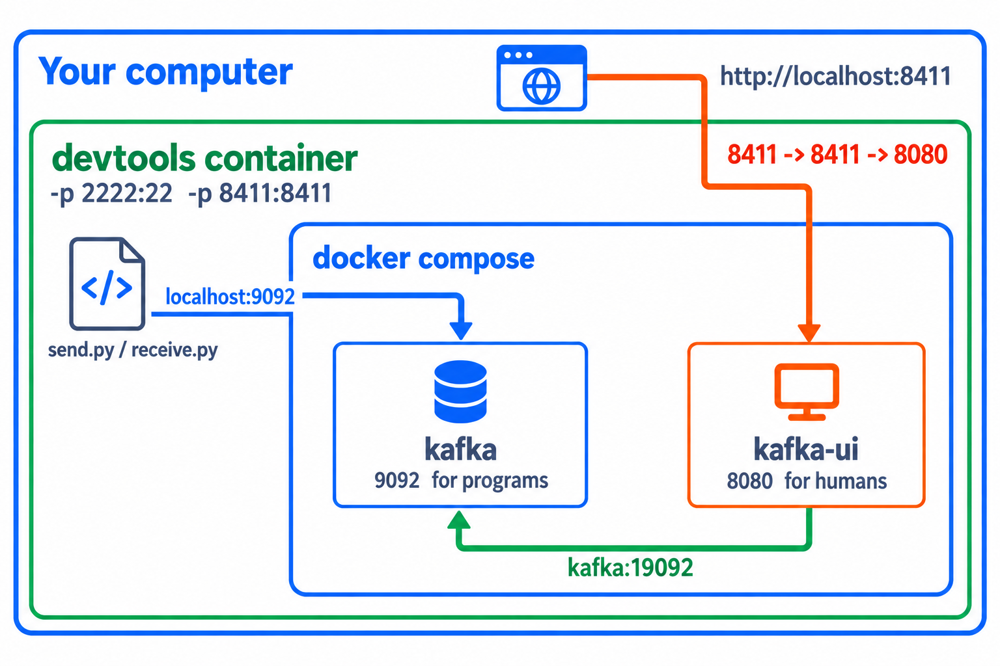
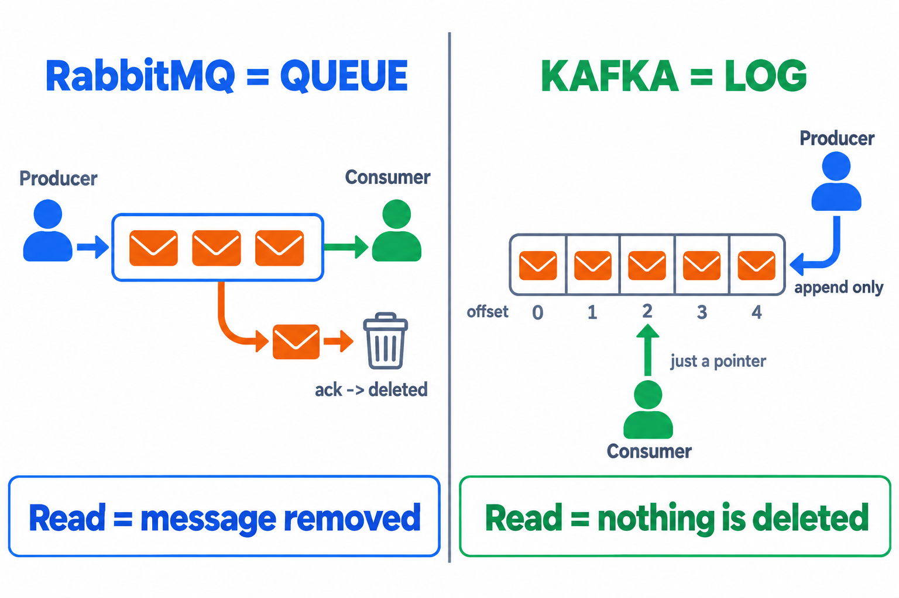
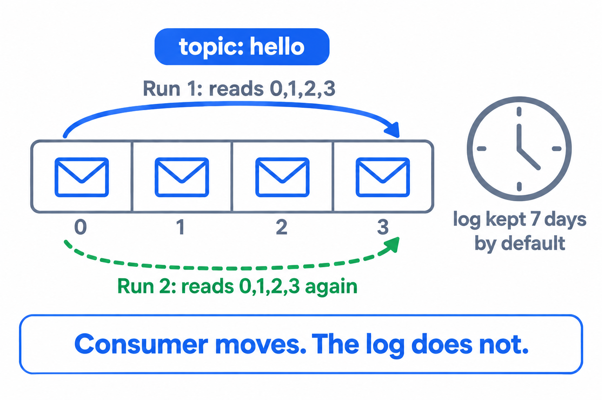

# LAB 1 — เปิด Kafka + Kafka UI ด้วย Docker Compose แล้วส่ง–รับข้อความแรก

> โฟลเดอร์ `001_LAB_Kafka_Setup` = **LAB 1** ในสไลด์ `Kafka_Slides.html`
> (ไฟล์ของแล็บนี้ : `docker-compose.yml` · `send.py` · `receive.py` · `requirements.txt`)

## สิ่งที่จะได้เรียนรู้

- เปิด **Kafka broker + Kafka UI** พร้อมกันด้วย **`docker compose up -d`** คำสั่งเดียว — image รุ่นใหม่ใช้ **KRaft** จึงมี broker ตัวเดียวจบ ไม่ต้องติดตั้ง ZooKeeper
- อ่าน `docker-compose.yml` ให้เป็น : **healthcheck** + **depends_on** ทำให้ compose **รอจน broker พร้อมจริง** ก่อนเปิด UI (บทเรียน "Up ≠ พร้อม" ถูกเขียนลงไฟล์แล้ว)
- เข้าใจ **เส้นทาง port** : `9092` ให้ **โปรแกรม** คุย · หน้าเว็บ UI ฟังที่ `8080` ข้างใน แต่ถูก map ออกมาให้เราเปิดที่ **`http://localhost:8411`** บนเครื่องตัวเอง
- ใช้ **`kafka-topics.sh`** สำรวจข้างใน broker : ดูเวอร์ชัน · ดูรายชื่อ topic · ดูรายละเอียด partition
- เขียนโปรแกรม Python ด้วย **kafka-python** : `send.py` ส่งข้อความเข้า topic · `receive.py` วนอ่านข้อความ
- หัวใจของ Kafka : ข้อความถูก **จดลง log ถาวร** — มี "ที่อยู่" เป็น offset · **อ่านแล้วไม่หาย อ่านซ้ำได้** (RabbitMQ พอ ack แล้วข้อความถูกลบ — Kafka ไม่ลบ)

## ภาพรวมของแล็บนี้

1. **เปิดเครื่องเรียน** — คราวนี้เปิด port `8411` ออกมาด้วย เพื่อให้เบราว์เซอร์บนเครื่องเราเห็นหน้าเว็บ Kafka UI
2. **อ่าน `docker-compose.yml`** — ไฟล์เดียวคุมสองบริการ (`kafka` + `kafka-ui`) พร้อมลำดับการบูต
3. **`docker compose up -d`** — เปิดทั้งชุด แล้วยืนยันความพร้อมด้วย `docker compose ps` และ log
4. **สำรวจด้วย `kafka-topics.sh`** — เห็นว่าตอนนี้ **ยังไม่มี topic เลยสักตัว**
5. **เปิด Kafka UI ที่ `http://localhost:8411`** — อ่านหน้า Dashboard · Brokers ให้เป็น
6. **เตรียม Python ด้วย venv** แล้ว **รัน `send.py`** ตอนยังไม่มีผู้อ่าน — broker **สร้าง topic ให้อัตโนมัติ** และให้ใบเสร็จ `offset=0`
7. **รัน `receive.py` สองหน้าต่าง** แล้ว **รันซ้ำอีกรอบ** — ทุกข้อความกลับมาครบ! **อ่านแล้วไม่หาย** — จุดที่ Kafka ต่างจาก RabbitMQ ที่สุด

---

## 0. เตรียมเครื่องเรียน

ทำบนเครื่องของเราเอง (ไม่ใช้ cloud) — เปิด container ที่ติดตั้ง Docker มาให้แล้ว

```bash
docker rm -f devtools
docker run -dit --name devtools --privileged -p 2222:22 -p 8411:8411 tuchsanai/devtools:2569_1
ssh root@localhost -p 2222        # password : passwd
```

> 📝 **คำอธิบาย:** สามบรรทัดนี้คือการ "เปิดเครื่องเรียน" ให้ทุกคนได้สภาพแวดล้อมเหมือนกันเป๊ะ · `docker rm -f devtools` ลบกล่องเรียนตัวเก่าทิ้งก่อนกันชื่อซ้ำ (`-f` = force ลบได้แม้ยังทำงานอยู่) ·
> `-dit` คือ `-d` รันเบื้องหลัง + `-i` เปิด stdin ค้างไว้ + `-t` ให้มี terminal กล่องจะได้ไม่ดับทันที · `--privileged` ให้สิทธิ์เต็มเพื่อรัน **Docker ซ้อนข้างในกล่อง** (จำเป็น — Kafka ของแล็บนี้เป็น container ที่รันอยู่ข้างในเครื่องเรียนอีกที) ·
> `-p 2222:22` ส่ง port 2222 ของเครื่องเรา เข้า port 22 (SSH) ของกล่อง · **`-p 8411:8411` คือของใหม่ของแล็บนี้** — เปิดทางให้หน้าเว็บ Kafka UI ทะลุออกมาถึงเบราว์เซอร์บนเครื่องเรา โดยไม่ต้องทำ port forwarding ทีหลัง

> ใน VS Code ใช้ **Remote-SSH** ต่อไปที่ `root@localhost:2222` แล้วทำแล็บทั้งหมดข้างใน

port ของแล็บนี้ซ้อนกันสามชั้น — ดูภาพนี้ให้เข้าใจก่อน แล้วจะไม่งงตลอดทั้งชุดแล็บ :



> 📝 **คำอธิบาย:** พิมพ์ `localhost:8411` ในเบราว์เซอร์ → ทะลุ `-p 8411:8411` ของกล่อง `devtools` → ทะลุ `8411:8080` ของ compose → ถึงหน้าเว็บ Kafka UI ที่ฟังอยู่ port `8080` ข้างในกล่องของมันเอง ·
> ส่วน `send.py` / `receive.py` รันอยู่**ข้างในเครื่องเรียน** จึงคุย broker ที่ `localhost:9092` ตรง ๆ ไม่ต้องผ่านชั้นนอก · ตัว UI คุย broker ด้วยชื่อ `kafka:19092` เพราะอยู่ใน network เดียวกันของ compose
>
> **ทำไมต้อง `8411` ไม่ใช้ `8080`?** — `8080` · `80` · `8888` เป็น port ยอดนิยม เครื่องของเรามักมีโปรแกรมอื่นจองอยู่แล้ว (`Bind for 0.0.0.0:8080 failed: port is already allocated`) การเลือกเลขที่ไม่ค่อยมีใครใช้จึงลดปัญหาไปได้ทั้งชุดแล็บ

ตรวจว่าพร้อมใช้งาน (คำสั่งทั้งหมดต่อจากนี้พิมพ์**ข้างในเครื่องเรียน**) :

```bash
docker --version
docker compose version
```

✅ **Expected output** — ขอแค่มี **เลขเวอร์ชัน** ขึ้นครบสองบรรทัด ไม่ใช่ error (เลขเวอร์ชันของแต่ละคนอาจไม่ตรงกับเอกสารนี้):

```
Docker version 29.6.2, build dfc4efb
Docker Compose version v5.3.1
```

> ถ้าขึ้น `Cannot connect to the Docker daemon` แปลว่ายังอยู่นอกกล่องเรียน หรือ daemon ข้างในยังตื่นไม่เสร็จ — รอสักครู่แล้วลองใหม่

---

## 1. Clone โค้ดแล็บ

```bash
mkdir -p ~/labwork && cd ~/labwork
git clone https://github.com/Tuchsanai/DevTools.git
cd DevTools/03_Application_Docker/02_Message_Brokers/02_Kafka/001_LAB_Kafka_Setup
```

> 📝 **คำอธิบาย:** `mkdir -p ~/labwork` สร้างโฟลเดอร์เก็บงาน (`-p` = มีอยู่แล้วก็ไม่ error) · `git clone` ดึงรีโพของวิชาลงมา ทำครั้งเดียวใช้ได้ทุกแล็บของชุดนี้ · แล้ว `cd` เข้าโฟลเดอร์แล็บ ซึ่งมี `docker-compose.yml` · `send.py` · `receive.py` · `requirements.txt` รออยู่แล้ว ·
> ถ้าเคย clone ไว้ git จะบอกว่าโฟลเดอร์ไม่ว่าง — ข้ามไป `cd` ได้เลย

---

## 2. อ่าน `docker-compose.yml` — ไฟล์เดียวคุมสองบริการ

แล็บนี้ต้องเปิดสอง container (broker + หน้าเว็บ) ที่ต้องคุยกันและต้องบูต**ตามลำดับ** — งานแบบนี้คือสิ่งที่ **Docker Compose** เกิดมาเพื่อทำ : เขียนทุกอย่างลงไฟล์เดียว แล้วสั่งครั้งเดียวจบ

```bash
cat docker-compose.yml
```

```yaml
name: kafka-lab1

services:
  kafka:
    image: apache/kafka:4.1.0
    container_name: kafka
    ports:
      - "9092:9092"          # ประตูของโปรแกรม : send.py / receive.py ต่อที่ localhost:9092
    environment:
      KAFKA_NODE_ID: 1
      KAFKA_PROCESS_ROLES: broker,controller
      KAFKA_CONTROLLER_LISTENER_NAMES: CONTROLLER
      KAFKA_CONTROLLER_QUORUM_VOTERS: 1@kafka:9093
      KAFKA_LISTENERS: HOST://0.0.0.0:9092,DOCKER://0.0.0.0:19092,CONTROLLER://0.0.0.0:9093
      KAFKA_ADVERTISED_LISTENERS: HOST://localhost:9092,DOCKER://kafka:19092
      KAFKA_LISTENER_SECURITY_PROTOCOL_MAP: HOST:PLAINTEXT,DOCKER:PLAINTEXT,CONTROLLER:PLAINTEXT
      KAFKA_INTER_BROKER_LISTENER_NAME: DOCKER
      KAFKA_OFFSETS_TOPIC_REPLICATION_FACTOR: 1
      KAFKA_TRANSACTION_STATE_LOG_REPLICATION_FACTOR: 1
      KAFKA_TRANSACTION_STATE_LOG_MIN_ISR: 1
      KAFKA_GROUP_INITIAL_REBALANCE_DELAY_MS: 0
    healthcheck:
      test: ["CMD-SHELL", "/opt/kafka/bin/kafka-broker-api-versions.sh --bootstrap-server localhost:9092 >/dev/null 2>&1"]
      interval: 5s
      timeout: 10s
      retries: 20

  kafka-ui:
    image: kafbat/kafka-ui:latest
    container_name: kafka-ui
    ports:
      - "8411:8080"          # หน้าเว็บ : เครื่องเรา 8411 -> ในกล่อง UI 8080
    environment:
      KAFKA_CLUSTERS_0_NAME: local
      KAFKA_CLUSTERS_0_BOOTSTRAPSERVERS: kafka:19092
      DYNAMIC_CONFIG_ENABLED: "true"
    depends_on:
      kafka:
        condition: service_healthy   # รอจน broker ตอบได้จริง ค่อยเปิด UI
```

> 📝 **คำอธิบาย — 5 จุดที่ต้องอ่านให้ออก :**
> **(1) `services`** มีสองบริการคือ `kafka` (broker) กับ `kafka-ui` (หน้าเว็บ) · compose สร้าง **network ส่วนตัว** ให้อัตโนมัติ ทั้งคู่จึงเรียกหากันด้วย**ชื่อบริการ** ได้เลย — นี่คือที่มาของ `kafka:19092` ·
> **(2) โหมด KRaft** : `KAFKA_PROCESS_ROLES: broker,controller` บอกว่า broker ตัวนี้เป็น controller ในตัว **ไม่ต้องมี ZooKeeper** อีกต่อไป ·
> **(3) สองประตูคนละบาน** : `KAFKA_ADVERTISED_LISTENERS` ประกาศที่อยู่ 2 ชุด — `HOST://localhost:9092` สำหรับโปรแกรมที่รันนอก compose (คือ `send.py` ของเรา) และ `DOCKER://kafka:19092` สำหรับเพื่อน container ใน network เดียวกัน (คือ UI) · จำเป็นเพราะคำว่า "localhost" ของแต่ละ container หมายถึงตัวมันเอง ถ้าประกาศแค่ชุดเดียวจะมีฝั่งหนึ่งต่อไม่ติดเสมอ ·
> **(4) `healthcheck`** : compose เคาะถาม broker ทุก 5 วินาทีด้วย `kafka-broker-api-versions.sh` จนกว่าจะตอบ — **นี่คือบทเรียน "Up ≠ พร้อม" ที่ถูกเขียนลงไฟล์** ·
> **(5) `depends_on: condition: service_healthy`** : UI จะยังไม่ถูกเปิดจนกว่า broker จะ **healthy** จริง — ปัญหา "UI ขึ้น cluster offline ค้าง" ที่ต้องมานั่ง restart เองจึงหมดไป

---

## 3. เปิดทั้งชุดด้วยคำสั่งเดียว

```bash
docker compose up -d
```

> 📝 **คำอธิบาย:** `up` = สร้างและเริ่มทุกบริการในไฟล์ · `-d` (detached) = รันเบื้องหลัง แล้วคืน prompt ให้เรา · ครั้งแรก Docker จะ **pull image ทั้งสองตัวให้เอง** (ใช้เวลาสักครู่) แล้วจึงเริ่ม container ·
> ดูบรรทัดของ `kafka` ให้ดี — มันขึ้นคำว่า **`Healthy`** ไม่ใช่แค่ `Started` แปลว่า compose ยืนรอจน broker ตอบได้จริงแล้วค่อยไปเปิด `kafka-ui` ต่อ (ผลของ healthcheck + depends_on ในข้อ 2)

✅ **Expected output** — ปิดท้ายด้วย `[+] up 3/3` ครบสามบรรทัด (ก่อนหน้านี้จะมี log การ pull image ยาว ๆ · เวลาของแต่ละคนจะไม่ตรงกับเอกสารนี้):

```
[+] up 3/3
 ✔ Network kafka-lab1_default  Created           0.0s
 ✔ Container kafka             Healthy           6.9s
 ✔ Container kafka-ui          Started           7.0s
```

ตรวจสถานะของทั้งชุด :

```bash
docker compose ps
```

> 📝 **คำอธิบาย:** `docker compose ps` แสดงเฉพาะ container ของโปรเจกต์นี้ (ต่างจาก `docker ps` ที่แสดงทุกตัวในเครื่อง) · จุดที่ต้องดู : `kafka` เป็น **`Up ... (healthy)`** — คำว่า healthy มาจาก healthcheck ของเรา · และคอลัมน์ PORTS ของ `kafka-ui` ต้องเป็น **`0.0.0.0:8411->8080/tcp`** คือเลข `8411` ที่เราจะพิมพ์ในเบราว์เซอร์ ชี้เข้า `8080` ข้างในกล่อง

✅ **Expected output** — สองแถว สถานะ `Up` ทั้งคู่ (ID · เวลาของแต่ละคนจะไม่ตรงกับเอกสารนี้):

```
NAME       IMAGE                    COMMAND                  SERVICE    CREATED          STATUS                    PORTS
kafka      apache/kafka:4.1.0       "/__cacert_entrypoin…"   kafka      13 seconds ago   Up 13 seconds (healthy)   0.0.0.0:9092->9092/tcp, [::]:9092->9092/tcp
kafka-ui   kafbat/kafka-ui:latest   "/bin/sh -c 'java --…"   kafka-ui   13 seconds ago   Up 6 seconds              0.0.0.0:8411->8080/tcp, [::]:8411->8080/tcp
```

ดู log ของ broker เพื่อยืนยันด้วยตาอีกชั้น :

```bash
docker compose logs kafka --tail 5
```

> 📝 **คำอธิบาย:** `docker compose logs <service>` ดึง log ของบริการที่ระบุ (`--tail 5` เอา 5 บรรทัดท้าย) · บรรทัดชี้ขาดคือ **`Kafka Server started`** — ถ้า healthcheck ผ่านแล้ว บรรทัดนี้ต้องมีแน่นอน · แถมได้เห็นเวอร์ชันจริงที่รัน (`Kafka version: 4.1.0`) ในบรรทัดใกล้ ๆ กันด้วย · Kafka บูตไวราว 5 วินาที (RabbitMQ ใช้เกือบ 13 วินาที)

✅ **Expected output** — บรรทัดสุดท้ายคือ `Kafka Server started` (วันเวลา · commitId ของแต่ละคนจะไม่ตรงกับเอกสารนี้):

```
kafka  | [2026-09-21 06:16:13,740] INFO [BrokerServer id=1] Transition from STARTING to STARTED (kafka.server.BrokerServer)
kafka  | [2026-09-21 06:16:13,740] INFO Kafka version: 4.1.0 (org.apache.kafka.common.utils.AppInfoParser)
        ... (บรรทัด Kafka commitId · Kafka startTimeMs) ...
kafka  | [2026-09-21 06:16:13,741] INFO [KafkaRaftServer nodeId=1] Kafka Server started (kafka.server.KafkaRaftServer)
```

> **บทเรียนสำคัญ :** container `Up` ≠ โปรแกรมข้างในพร้อม — `Up` บอกแค่ว่า process หลักยังไม่ตาย · สมัยสั่ง `docker run` ทีละตัว เราต้องมานั่ง `docker logs` รอเอง แต่ compose ให้เรา**ประกาศเงื่อนไขความพร้อมไว้ล่วงหน้า** แล้วมันรอให้ — นิสัย "รอให้พร้อมก่อนใช้" ยังอยู่ครบ เพียงแต่ย้ายจากมือคนไปอยู่ในไฟล์

---

## 4. สำรวจข้างใน Broker ด้วย `kafka-topics.sh`

เครื่องมือ CLI ของ Kafka เป็นสคริปต์ในโฟลเดอร์ `/opt/kafka/bin` **ข้างใน container `kafka`** จึงต้องสั่งผ่าน `docker compose exec` เสมอ

```bash
docker compose exec kafka /opt/kafka/bin/kafka-topics.sh --bootstrap-server localhost:9092 --version
docker compose exec kafka /opt/kafka/bin/kafka-topics.sh --bootstrap-server localhost:9092 --list
```

> 📝 **คำอธิบาย:** `docker compose exec kafka <คำสั่ง>` สั่งให้คำสั่งไปรัน **ข้างใน container ของบริการ `kafka`** (จะใช้ `docker exec kafka ...` ก็ได้ผลเหมือนกัน เพราะเราตั้ง `container_name: kafka` ไว้) · ทุกคำสั่ง CLI ของ Kafka ต้องมี `--bootstrap-server localhost:9092` บอกว่า "ประตูแรก" ที่ใช้ต่อเข้า cluster อยู่ไหน (localhost ตรงนี้คือ localhost ของตัว container `kafka` เอง) ·
> `--list` ขอรายชื่อ **topic** ทั้งหมด — broker เพิ่งเกิดใหม่ ยังไม่มีใครสร้าง topic ผลจึง **ว่างเปล่า ไม่พิมพ์อะไรออกมาเลยสักบรรทัด** (RabbitMQ ยังพิมพ์หัวรายงานให้ แต่ Kafka เงียบสนิท) — จำภาพนี้ไว้เทียบกับหลังรัน `send.py` ในข้อ 7

✅ **Expected output** — `--version` ตอบเลขเวอร์ชันมาบรรทัดเดียว ส่วน `--list` **ไม่มี output เลย** ได้ prompt คืนทันที:

```
4.1.0
```

---

## 5. เปิด Kafka UI ในเบราว์เซอร์

Kafka ไม่มีหน้าเว็บติดมากับ broker — หน้าเว็บคือ container ตัวที่สอง (`kafbat/kafka-ui`) ที่ compose เปิดให้แล้ว เช็กว่ามันบูตเสร็จหรือยัง :

```bash
docker compose logs kafka-ui | grep "Started KafkaUiApplication"
```

> 📝 **คำอธิบาย:** UI ตัวนี้เป็นเว็บแอป Java พิมพ์ log ยาวและมีบรรทัดใหม่เพิ่มตลอดเวลา `--tail` จึงเล็งพลาดง่าย — ใช้ `grep` หาบรรทัดประกาศความพร้อมตรง ๆ แทน · เจอบรรทัดนี้เมื่อไหร่ = หน้าเว็บเปิดรับแล้ว (ถ้ายังไม่เจอ รอ 5–10 วินาทีแล้ว grep ซ้ำ)

✅ **Expected output** — มีบรรทัด `Started KafkaUiApplication` (ตัวเลขวินาทีของแต่ละคนจะไม่ตรงกับเอกสารนี้):

```
kafka-ui  | 2026-09-21T06:16:22.482Z  INFO 1 --- [main] io.kafbat.ui.KafkaUiApplication : Started KafkaUiApplication in 3.535 seconds (process running for 3.984)
```

**เปิดเบราว์เซอร์บนเครื่องเราแล้วไปที่ `http://localhost:8411`** ได้เลย — ไม่ต้อง forward port ใด ๆ เพิ่ม เพราะเราเปิดทางไว้ครบตั้งแต่ข้อ 0 แล้ว (`-p 8411:8411` ของกล่องเรียน + `8411:8080` ของ compose)

เปิดมาเจอหน้า **Dashboard** ทันที — ไม่มีหน้า login เพราะ UI ตัวนี้ปิดระบบ authentication ไว้เป็นค่า default :


> 📝 **คำอธิบาย:** แถบบน **Online 1 clusters** = UI ต่อ broker ติดแล้ว · ตารางข้างล่างคือ cluster `local` (ชื่อจาก `KAFKA_CLUSTERS_0_NAME`) : **Version 4.1-IV1 · Brokers count 1 · Partitions 0 · Topics 0** — ยังว่างเปล่าตรงกับที่ `--list` บอกในข้อ 4 ·
> เมนูซ้ายคือแท็บที่จะใช้ตลอดชุดแล็บ : **Brokers** สุขภาพของ broker · **Topics** รายชื่อ topic กับจำนวนข้อความ — แท็บที่กลับมาดูบ่อยที่สุด · **Consumers** กลุ่มผู้อ่าน (จะสำคัญมากตั้งแต่ LAB 3)

คลิกเมนู **Brokers** ดูสุขภาพของ broker ตัวเดียวของเรา :


> 📝 **คำอธิบาย:** **Broker Count 1 · Active Controller 1** — broker ตัวเดียวนี้เป็นทั้งคนเก็บข้อมูลและ controller ของ cluster · ช่อง **Controller Type: KRaft** คือคำยืนยันว่ารุ่นนี้ไม่ใช้ ZooKeeper แล้ว · ในตาราง Broker ID `1` มีเครื่องหมายถูกสีเขียว (online)

---

## 6. เตรียม Python — venv + kafka-python

เครื่องเรียนมี Python 3 แล้ว แต่ระบบสมัยใหม่ (PEP 668) **ไม่ยอมให้ `pip install` ลงเครื่องตรง ๆ** ต้องสร้าง **virtual environment** ก่อน :

```bash
python3 -m venv ~/venv-kafka
source ~/venv-kafka/bin/activate
pip install -r requirements.txt
python -c "import kafka; print(kafka.__version__)"
```

> 📝 **คำอธิบาย:** `python3 -m venv ~/venv-kafka` สร้างสภาพแวดล้อม Python แยกส่วนตัว — ติดตั้งอะไรในนี้ไม่กระทบ Python ของระบบ · `source ~/venv-kafka/bin/activate` เปิดใช้งาน สังเกต prompt ขึ้นคำนำหน้า `(venv-kafka)` ·
> `pip install -r requirements.txt` ติดตั้งตามรายการในไฟล์ ซึ่งมีบรรทัดเดียวคือ `kafka-python==3.0.10` — ไลบรารีฝั่ง Python สำหรับคุยกับ Kafka (ล็อกเวอร์ชันไว้ให้ตรงกับเอกสาร) · บรรทัดสุดท้าย import ทดสอบ สังเกตว่าชื่อตอนติดตั้งคือ `kafka-python` แต่ตอน import ใช้ชื่อ `kafka` เฉย ๆ

✅ **Expected output** — จบด้วย `Successfully installed kafka-python-3.0.10` แล้วได้เลขเวอร์ชันจากบรรทัดสุดท้าย:

```
Successfully installed kafka-python-3.0.10
3.0.10
```

> **⚠️ กติกาสำคัญ :** ทุกครั้งที่เปิด **terminal ใหม่** (รวมถึงหน้าต่างที่ 2 ในข้อ 8) ต้องพิมพ์ `source ~/venv-kafka/bin/activate` ก่อนเสมอ — ดูว่า prompt มี `(venv-kafka)` นำหน้าหรือยัง ·
> ถ้าลืม จะเจอ `ModuleNotFoundError: No module named 'kafka'` ทันทีที่รันโปรแกรม

---

## 7. ส่งข้อความแรก — `send.py`

ดูโค้ดกันก่อน (ไฟล์อยู่ในโฟลเดอร์แล็บแล้ว ไม่ต้องพิมพ์เอง) :

```python
from kafka import KafkaProducer

# 1) ต่อไปหา broker ที่ localhost port 9092 (port ที่ compose map ไว้)
producer = KafkaProducer(bootstrap_servers='localhost:9092')

# 2) ส่งข้อความเข้า topic 'hello' — Kafka รับ-ส่งเป็น bytes เสมอ จึงต้อง .encode()
#    (ไม่ต้องสร้าง topic ก่อน — ส่งครั้งแรก broker จะสร้าง topic ให้อัตโนมัติ)
future = producer.send('hello', 'Hello Kafka!'.encode())

# 3) .get() รอจน broker ตอบรับ แล้วคืน "ใบเสร็จ" ว่าข้อความไปลงตรงไหนของ log
metadata = future.get(timeout=10)
print(f" [x] Sent 'Hello Kafka!'  ->  topic={metadata.topic} "
      f"partition={metadata.partition} offset={metadata.offset}")

# 4) ปิด connection ให้เรียบร้อย (producer จะส่งข้อมูลที่ค้างอยู่ออกให้หมดก่อน)
producer.close()
```

> 📝 **คำอธิบาย:** ไล่ตามเลขในคอมเมนต์ · **(1)** `KafkaProducer` เปิด connection ไป `localhost:9092` — ไม่มี user/password เพราะ broker ของแล็บเป็น PLAINTEXT (ห้ามใช้แบบนี้บน production) · **(2)** `producer.send('hello', ...)` ส่งเข้า **topic** ชื่อ `hello` — Kafka รับเป็น bytes เสมอจึงต้อง `.encode()` และ **ไม่ต้องประกาศ topic ล่วงหน้า** broker ตั้งค่า auto-create ไว้ให้ ·
> **(3)** ความจริง `send()` เป็นแบบ **async** — มันคืน `future` มาก่อน แล้ว `.get(timeout=10)` คือการยืนรอ "ใบเสร็จ" (`RecordMetadata`) จาก broker ว่าข้อความถูกจดลง log แล้วที่ **topic ไหน · partition ไหน · ตำแหน่ง (offset) ที่เท่าไร** — RabbitMQ ไม่มีใบเสร็จแบบนี้ เพราะข้อความเข้าคิวแล้วรอถูกลบ แต่ของ Kafka ทุกข้อความมี "ที่อยู่ถาวร" ใน log ·
> **(4)** `close()` ปิด producer — ดันข้อมูลที่ค้างใน buffer ออกให้หมดก่อน

รัน (อย่าลืมว่าต้องมี `(venv-kafka)` นำหน้า prompt และยัง**ไม่มีผู้อ่านสักคน**) :

```bash
python send.py
```

✅ **Expected output** — พิมพ์บรรทัดเดียวพร้อมใบเสร็จ แล้วได้ prompt คืนทันที:

```
 [x] Sent 'Hello Kafka!'  ->  topic=hello partition=0 offset=0
```

> 📝 **คำอธิบาย:** โปรแกรมต่อ broker → ส่ง 1 ข้อความ → รอใบเสร็จ → พิมพ์ → จบตัวเองทันที ไม่รอผู้อ่านใด ๆ · จุดที่ต้องดู : `partition=0` (topic นี้มี partition เดียว) และ `offset=0` — ข้อความ **แรกสุด** ของ log ได้ตำแหน่งหมายเลข 0

โปรแกรมจบไปแล้ว แต่ข้อความไปไหน? — ถาม broker ดู :

```bash
docker compose exec kafka /opt/kafka/bin/kafka-topics.sh --bootstrap-server localhost:9092 --list
docker compose exec kafka /opt/kafka/bin/kafka-topics.sh --bootstrap-server localhost:9092 --describe --topic hello
```

> 📝 **คำอธิบาย:** คำสั่งแรกคือคำสั่งเดิมจากข้อ 4 แต่สถานการณ์เปลี่ยน — ตอนนั้นว่างเปล่า ตอนนี้มี `hello` โผล่มา **ทั้งที่เราไม่เคยสั่งสร้าง topic เลย** (auto-create ตอน `send.py` ส่งครั้งแรก) ·
> คำสั่งที่สอง `--describe` ขอ "บัตรประชาชน" ของ topic · จุดที่ต้องดู : **`PartitionCount: 1`** — topic ที่เกิดจาก auto-create ได้ partition เดียว ข้อความทุกตัวจึงเข้าแถวเดียวกันเรียง offset 0, 1, 2, … · **`ReplicationFactor: 1`** — สำเนาเดียวเพราะมี broker ตัวเดียว · บรรทัดล่าง `Leader: 1` คือ broker ID 1 เป็นเจ้าของ partition นี้ (เรื่อง partition หลายตัวเป็นพระเอกของ LAB 2)

✅ **Expected output** — มี topic `hello` แล้วตามด้วยรายละเอียด (TopicId ของแต่ละคนจะไม่ตรงกับเอกสารนี้):

```
hello
Topic: hello	TopicId: NMLBPciRSU6dE_xBfYmj4Q	PartitionCount: 1	ReplicationFactor: 1	Configs: min.insync.replicas=1
	Topic: hello	Partition: 0	Leader: 1	Replicas: 1	Isr: 1	Elr: 	LastKnownElr:
```

กลับไปที่ `http://localhost:8411` เข้าแท็บ **Topics** — เห็น `hello` พร้อม **Number of messages = 1** ทั้งที่ยังไม่มีผู้อ่านสักคน :


คลิกที่ชื่อ topic `hello` แล้วเข้าแท็บ **Messages** — เห็นตัวข้อความจริง ๆ พร้อมที่อยู่ของมัน :


> 📝 **คำอธิบาย:** แถวเดียวในตารางคือข้อความของเรา : **Offset 0 · Partition 0 · Timestamp · Value `Hello Kafka!`** — ตรงกับใบเสร็จของ `send.py` ทุกช่อง ·
> UI อ่านข้อความจาก log มาโชว์ได้เรื่อย ๆ โดยข้อความ **ไม่หายไปไหน** — นี่คือความต่างตัวแรกจาก RabbitMQ ที่เห็นด้วยตา (Management UI ของ RabbitMQ ทำได้แค่ "Get Message" แบบระวัง ๆ เพราะการอ่านมีผลกับคิว)

**หัวใจของ Kafka อยู่ตรงนี้** — ผู้ส่งกับผู้อ่านไม่ต้องออนไลน์พร้อมกัน เพราะข้อความถูกจดลง log ถาวร ไม่ใช่วางไว้ในคิวรอถูกดูดออก :



> 📝 **คำอธิบาย:** ฝั่งซ้าย **RabbitMQ = คิว** ผู้อ่านหยิบงานไปทำ พอ ack ข้อความก็ถูก **ลบทิ้ง** คิวสั้นลง · ฝั่งขวา **Kafka = สมุดบันทึก (log)** ผู้ส่งเขียน **ต่อท้ายอย่างเดียว** (append-only) แต่ละช่องมีเลขที่อยู่ประจำตัวคือ **offset** ส่วนผู้อ่านเป็นเพียง "สายตา" ที่เลื่อนไปตามหน้าสมุด — อ่านแล้วข้อความยังอยู่ครบ ข้อ 9 จะพิสูจน์ให้เห็นกับตา

---

## 8. อ่านข้อความ — `receive.py` (ใช้ 2 หน้าต่าง)

ดูโค้ดฝั่งผู้อ่าน :

```python
import sys
from kafka import KafkaConsumer

def main():
    # 1) สมัครเป็นผู้อ่าน topic 'hello'
    #    - auto_offset_reset='earliest' : เริ่มอ่านจากข้อความ "แรกสุด" ที่อยู่ใน log
    #    - ยังไม่ใส่ group_id : Kafka จะไม่จดว่าเราอ่านถึงไหน → รันใหม่ก็อ่านซ้ำได้ทั้งหมด
    consumer = KafkaConsumer('hello',
                             bootstrap_servers='localhost:9092',
                             auto_offset_reset='earliest')

    print(' [*] Waiting for messages. To exit press CTRL+C')

    # 2) วนรออ่านไปเรื่อย ๆ — มีข้อความใหม่เข้ามาเมื่อไหร่ loop ก็เดินต่อทันที
    for message in consumer:
        # 3) ทุกข้อความมี "ที่อยู่" ติดมาด้วยเสมอ : อยู่ partition ไหน ตำแหน่ง (offset) ที่เท่าไร
        #    ตัวเนื้อข้อความเป็น bytes ต้อง .decode() ก่อนพิมพ์
        print(f" [x] Received partition={message.partition} "
              f"offset={message.offset} value={message.value.decode()}")

if __name__ == '__main__':
    try:
        main()
    except KeyboardInterrupt:
        print('Interrupted')
        sys.exit(0)
```

> 📝 **คำอธิบาย:** **(1)** `auto_offset_reset='earliest'` = ถ้ายังไม่เคยมีตำแหน่งอ่านมาก่อน ให้เริ่มจาก **ต้น log** (ค่า default คือ `latest` ที่จะรออ่านเฉพาะของใหม่) · **ตั้งใจไม่ใส่ `group_id`** — Kafka จะไม่จดตำแหน่งอ่านของเราไว้เลย รันใหม่เมื่อไหร่ก็เริ่มจากต้น log ใหม่หมด (ข้อ 9 จะใช้จุดนี้โชว์ของ · เรื่อง group จริงจังยกไป LAB 3) ·
> **(2)** `for message in consumer:` คือ loop รอรับ **ตลอดไป** โปรแกรมไม่จบเอง ต้องกด Ctrl+C · **(3)** ทุกข้อความมาพร้อมที่อยู่ `partition` + `offset` ส่วนเนื้อข้อความเป็น bytes ต้อง `.decode()`

**หน้าต่างที่ 1** — รันผู้อ่าน :

```bash
python receive.py
```

✅ **Expected output** — ข้อความที่ค้างใน log ตั้งแต่ข้อ 7 เด้งมา **ทันที** แล้ว terminal ค้างรอต่อ (ยังไม่ต้องกด Ctrl+C):

```
 [*] Waiting for messages. To exit press CTRL+C
 [x] Received partition=0 offset=0 value=Hello Kafka!
        ^ ค้างอยู่ตรงนี้ — โปรแกรมยังรออ่านข้อความถัดไป
```

**หน้าต่างที่ 2** — เปิด terminal ใหม่ (ssh `root@localhost -p 2222` อีก session) แล้วส่งเพิ่ม 3 ครั้ง :

```bash
source ~/venv-kafka/bin/activate
cd ~/labwork/DevTools/03_Application_Docker/02_Message_Brokers/02_Kafka/001_LAB_Kafka_Setup
python send.py ; python send.py ; python send.py
```

> 📝 **คำอธิบาย:** หน้าต่างใหม่ = shell ใหม่ ต้อง activate venv ก่อนเสมอ (กติกาข้อ 6) · ยิง `send.py` ติดกัน 3 ครั้ง — ดูใบเสร็จฝั่งนี้ให้ดี : **offset ขยับ 1 → 2 → 3 เอง** เพราะ log ต่อท้ายเสมอ · ระหว่างรัน **ชำเลืองดูหน้าต่างที่ 1** จะเห็น `Received` เด้งเพิ่มแทบจะพร้อมกับที่ฝั่งนี้ขึ้น `Sent`

✅ **Expected output** — ฝั่งหน้าต่างที่ 2 ได้ใบเสร็จ 3 ใบ offset ต่อเนื่อง · ฝั่งหน้าต่างที่ 1 มี `Received` เพิ่มครบ 4 บรรทัด (offset 0–3) เสร็จแล้วกด **Ctrl+C** ที่หน้าต่างที่ 1 จะได้คำว่า `Interrupted`:

```
 [x] Sent 'Hello Kafka!'  ->  topic=hello partition=0 offset=1
 [x] Sent 'Hello Kafka!'  ->  topic=hello partition=0 offset=2
 [x] Sent 'Hello Kafka!'  ->  topic=hello partition=0 offset=3
```

> **สรุปภาพที่เพิ่งเห็น :** ไม่มีผู้อ่าน = ข้อความ **นอนอยู่ใน log** · ผู้อ่านออนไลน์ = ของเก่าถูกอ่าน **ทันที** · ผู้อ่านออนไลน์อยู่แล้ว = ข้อความใหม่วิ่งถึงแบบ **realtime** — เหมือนชุด RabbitMQ ทุกประการ … จนถึงข้อ 9

---

## 9. จุดที่ Kafka ต่างจาก RabbitMQ ที่สุด — อ่านแล้วไม่หาย

ตอนจบข้อ 8 ของชุด RabbitMQ คิวกลับเป็น `hello 0` — ข้อความที่ ack แล้ว **ถูกลบทิ้งถาวร** รันผู้รับใหม่ก็ไม่มีอะไรให้อ่าน · ลองทำแบบเดียวกันกับ Kafka : รัน `receive.py` **ซ้ำอีกรอบ** ทั้งที่เพิ่งอ่านครบ 4 ข้อความไปหยก ๆ

```bash
python receive.py
```

✅ **Expected output** — ข้อความเดิมทั้ง 4 กลับมาครบทุกตัว (ดูจบแล้วกด Ctrl+C):

```
 [*] Waiting for messages. To exit press CTRL+C
 [x] Received partition=0 offset=0 value=Hello Kafka!
 [x] Received partition=0 offset=1 value=Hello Kafka!
 [x] Received partition=0 offset=2 value=Hello Kafka!
 [x] Received partition=0 offset=3 value=Hello Kafka!
Interrupted
```



> 📝 **คำอธิบาย:** โปรแกรมเดิม ไม่แก้อะไรสักตัวอักษร แต่ได้ของครบเหมือนเดิม เพราะ Kafka **ไม่ลบข้อความเมื่อถูกอ่าน** — การอ่านเป็นแค่การ "เลื่อนสายตา" ไปตาม log ส่วนตัวใครตัวมัน และ `receive.py` ไม่ใส่ `group_id` broker จึงไม่จดด้วยซ้ำว่าเราเคยอ่านถึงไหน — เปิดสมุดใหม่ก็เริ่มอ่านหน้าแรกทุกครั้ง ·
> ข้อความใน log ถูกลบตาม **อายุที่ตั้งไว้** เท่านั้น (ค่า default คือเก็บ **7 วัน**) ไม่เกี่ยวกับว่ามีใครอ่านหรือยัง

Kafka มี CLI ผู้อ่านสำเร็จรูปให้ด้วย — อ่านซ้ำอีกรอบโดยไม่ง้อ Python เลย :

```bash
docker compose exec kafka /opt/kafka/bin/kafka-console-consumer.sh --bootstrap-server localhost:9092 --topic hello --from-beginning --max-messages 4
```

> 📝 **คำอธิบาย:** `--from-beginning` = อ่านตั้งแต่ต้น log (ความหมายเดียวกับ `auto_offset_reset='earliest'` ในโค้ด) · `--max-messages 4` อ่านครบ 4 ข้อความแล้วจบตัวเอง ถ้าไม่ใส่มันจะค้างรอเหมือน `receive.py` · นี่คือการอ่าน log เดิม **รอบที่สาม** แล้ว (Python 2 รอบ + CLI 1 รอบ) — ข้อความก็ยังอยู่ครบ

✅ **Expected output** — เนื้อข้อความ 4 บรรทัด ปิดท้ายด้วยบรรทัดสรุปของ CLI:

```
Hello Kafka!
        ... (Hello Kafka! รวม 4 บรรทัด) ...
Processed a total of 4 messages
```

> **บทเรียนหัวใจของ Kafka :** log เป็นแบบ **append-only** — เขียนต่อท้ายอย่างเดียว อ่านกี่รอบก็ไม่กระทบข้อมูล · **RabbitMQ = คิวงาน** (ส่งงาน → ทำเสร็จ → ack → งานหายไป) ส่วน **Kafka = สมุดบันทึกเหตุการณ์** (จดทุกอย่างตามลำดับ → ใครอยากรู้อะไรมาเปิดอ่านเอง อ่านซ้ำได้ ย้อนอดีตได้) ·
> ผู้อ่านหน้าใหม่ที่เพิ่งเข้าทีมวันนี้ ก็ยังไล่อ่านเหตุการณ์ทั้งหมดตั้งแต่ต้นได้ — ทำแบบนี้กับ RabbitMQ ไม่ได้เลย

---

## ทดลองเพิ่มเติม

### ก. ดู log โตต่อหน้า — ส่งรัว 5 ข้อความ

ปิด `receive.py` ให้เรียบร้อยก่อน (Ctrl+C) แล้วส่งรัว ๆ :

```bash
for i in 1 2 3 4 5; do python send.py; done
docker compose exec kafka /opt/kafka/bin/kafka-get-offsets.sh --bootstrap-server localhost:9092 --topic hello
```

> 📝 **คำอธิบาย:** loop ของ shell รัน `send.py` ซ้ำ 5 รอบ ไม่มีผู้อ่านออนไลน์เลย แต่ Kafka ไม่แคร์ — ข้อความถูกจดต่อท้าย log ไปเรื่อย ๆ offset วิ่ง **4 → 8 ไม่มีเว้น ไม่มีถอยหลัง** ·
> `kafka-get-offsets.sh` ถามว่าแต่ละ partition เขียนไปถึงไหนแล้ว รูปแบบคำตอบคือ `topic:partition:end-offset` — `hello:0:9` อ่านว่า **ตำแหน่งถัดไปที่จะเขียนคือ 9** แปลว่าตอนนี้มีข้อความ 9 ตัว (offset 0–8) · ถ้าเปิดหน้า Topics ใน UI ค้างไว้จะเห็น **Number of messages** ขยับตาม — log มีแต่โตขึ้น ไม่มีหด

✅ **Expected output** — ใบเสร็จ 5 ใบ offset 4–8 แล้วปิดท้ายด้วยยอดสะสม:

```
 [x] Sent 'Hello Kafka!'  ->  topic=hello partition=0 offset=4
        ... ( [x] Sent ... offset 5 → 7 อีก 3 บรรทัด) ...
 [x] Sent 'Hello Kafka!'  ->  topic=hello partition=0 offset=8
hello:0:9
```

### ข. หัดอ่าน error — ส่งตอน broker หยุดทำงาน

```bash
docker compose stop kafka
python send.py
```

> 📝 **คำอธิบาย:** `docker compose stop kafka` หยุดเฉพาะบริการ `kafka` (container ยังอยู่ ไม่ได้ลบ — เดี๋ยวปลุกกลับได้ · UI ยังรันอยู่แต่จะฟ้องว่า cluster offline) · แล้วรัน `send.py` ทั้งที่รู้ว่าปลายทางไม่มีใครรับสาย

✅ **Expected output** — โปรแกรมล้มพร้อม traceback ยาว ให้อ่าน **บรรทัดสุดท้าย** เป็นหลัก:

```
Traceback (most recent call last):
  File "/root/labwork/.../send.py", line 4, in <module>
    producer = KafkaProducer(bootstrap_servers='localhost:9092')
        ... (ตัดท่อนกลาง — ไล่ผ่านไฟล์ข้างในของ kafka-python) ...
kafka.errors.KafkaTimeoutError: KafkaTimeoutError: Unable to bootstrap from localhost:9092
```

> 📝 **คำอธิบาย:** traceback ของ Python ต้อง **อ่านจากล่างขึ้นบน** · บรรทัดสุดท้ายบอกชนิด error : ไปเคาะประตู `localhost:9092` แล้ว **ไม่มีใครตอบจนหมดเวลา** — broker ไม่ได้รันอยู่ หรือยังบูตไม่เสร็จ · ไล่ขึ้นบนเห็นว่าล้มตั้งแต่บรรทัด `KafkaProducer(...)` คือยังไม่ทันได้ส่งด้วยซ้ำ · ในไลบรารีบางเวอร์ชัน error นี้ชื่อ `NoBrokersAvailable` — ความหมายเดียวกัน : **หา broker ไม่เจอ**

ปลุก broker กลับมา รอให้พร้อม แล้วส่งซ้ำ :

```bash
docker compose start kafka
docker compose logs kafka | grep -c "Kafka Server started"
python send.py
```

> 📝 **คำอธิบาย:** `docker compose start kafka` ปลุกบริการเดิมกลับมา · `grep -c` นับว่าเจอบรรทัด `Kafka Server started` กี่ครั้ง — ต้องได้ **2** (ครั้งแรกตอนบูต + ครั้งนี้ตอน restart) ถ้ายังได้ `1` ให้รอ 2–3 วินาทีแล้วนับใหม่ ·
> แล้วดู offset ให้ดี : **`offset=9` ต่อจาก 8 เป๊ะ** ข้อความเก่าทั้ง 9 ตัวรอดข้าม restart มาครบ ไม่เริ่มนับใหม่ (log เขียนลง disk — broker ดับแล้วฟื้น ข้อมูลไม่หาย)

✅ **Expected output**:

```
2
 [x] Sent 'Hello Kafka!'  ->  topic=hello partition=0 offset=9
```

---

## แก้ปัญหาที่พบบ่อย

| อาการ | สาเหตุ | วิธีแก้ |
|---|---|---|
| `KafkaTimeoutError: Unable to bootstrap from localhost:9092` (หรือ `NoBrokersAvailable`) | broker ยังไม่รัน หรือยังบูตไม่เสร็จ | `docker compose ps` — ต้องเห็น `kafka` เป็น `Up (healthy)` · ถ้าไม่มีแถวเลย ย้อนทำข้อ 3 |
| `ModuleNotFoundError: No module named 'kafka'` | ลืม activate venv ใน terminal นี้ | `source ~/venv-kafka/bin/activate` — ดูให้ prompt มี `(venv-kafka)` นำหน้า |
| เปิด `http://localhost:8411` ไม่ขึ้น | ลืมใส่ `-p 8411:8411` ตอนสร้างกล่องเรียน หรือ UI ยังบูตไม่เสร็จ | `docker ps` บนเครื่องเรา ดูว่ากล่อง `devtools` มี `8411` · ถ้าไม่มีต้องสร้างกล่องใหม่ตามข้อ 0 · ถ้ามีแล้วให้รอ UI บูตตามข้อ 5 |
| `Bind for 0.0.0.0:8411 failed: port is already allocated` | มีโปรแกรมอื่นจอง `8411` อยู่ | เปลี่ยนเลขซ้ายใน `docker-compose.yml` (เช่น `"8412:8080"`) และเลขของ `-p` ตอนสร้างกล่องเรียนให้ตรงกัน |
| Kafka UI ขึ้น cluster `local` เป็น **offline** | broker ถูก `stop` ไว้ (เช่นหลังทดลอง ข. ) | `docker compose start kafka` แล้วรีเฟรชหน้าเว็บ |
| `docker compose up` ฟ้องชื่อ container ซ้ำ | มี `kafka` / `kafka-ui` ตัวเก่าค้างจาก `docker run` | `docker rm -f kafka kafka-ui` แล้ว `docker compose up -d` ใหม่ |

---

## เก็บกวาด (Cleanup)

```bash
docker compose down -v
docker ps -a
```

> 📝 **คำอธิบาย:** `docker compose down` หยุดและลบ container ทั้งชุดพร้อม network ที่ compose สร้างไว้ — ครบในคำสั่งเดียว ไม่ต้องไล่ลบทีละตัว · `-v` ลบ volume ของโปรเจกต์ด้วย = ข้อมูลใน log หายเกลี้ยง (ตั้งใจ — แล็บหน้าเริ่มใหม่) ·
> แล้ว `docker ps -a` ตรวจซ้ำว่าไม่เหลือ container ค้าง (`-a` เอาตัวที่หยุดแล้วด้วย) · ที่ **ไม่ต้องลบ** คือ image ทั้งสองตัว (แล็บถัดไปจะได้ไม่ต้อง pull ใหม่) และ venv `~/venv-kafka` (ใช้ต่อได้ทุกแล็บของชุดนี้)

✅ **Expected output** — ลบครบ 3 รายการ แล้วตารางเหลือแค่หัว ไม่มีแถวข้อมูล:

```
[+] down 3/3
 ✔ Container kafka-ui          Removed           2.4s
 ✔ Container kafka             Removed           1.2s
 ✔ Network kafka-lab1_default  Removed           0.2s
CONTAINER ID   IMAGE     COMMAND   CREATED   STATUS    PORTS     NAMES
```

---

## สรุปคำสั่งของแล็บนี้

| คำสั่ง | ความหมาย |
|---|---|
| `docker compose up -d` | เปิด broker + UI ทั้งชุดจาก `docker-compose.yml` (รอ broker healthy ให้เอง) |
| `docker compose ps` | ดูสถานะเฉพาะ container ของโปรเจกต์นี้ — `kafka` ต้องเป็น `Up (healthy)` |
| `docker compose logs kafka --tail 5` | ดู log ของ broker — ต้องเห็น `Kafka Server started` |
| `docker compose exec kafka /opt/kafka/bin/kafka-topics.sh --bootstrap-server localhost:9092 --list` / `--describe --topic hello` | สำรวจ topic ใน broker (CLI อยู่ในกล่อง จึงต้องสั่งผ่าน `exec`) |
| `docker compose stop kafka` / `start kafka` | หยุด/ปลุกเฉพาะ broker โดยไม่แตะบริการอื่น |
| `python3 -m venv ~/venv-kafka` + `source ~/venv-kafka/bin/activate` | สร้าง/เปิดใช้ venv (ทุก terminal ใหม่ต้อง activate) |
| `pip install -r requirements.txt` | ติดตั้ง `kafka-python==3.0.10` สำหรับคุยกับ Kafka |
| `python send.py` | ส่งข้อความเข้า topic `hello` แล้วพิมพ์ใบเสร็จ partition/offset |
| `python receive.py` | อ่านข้อความจาก topic `hello` ตั้งแต่ต้น log จนกด Ctrl+C |
| `docker compose down -v` | ลบ container + network + volume ของแล็บทั้งชุด |

> **จำสองเลขให้ขึ้นใจ :** `9092` = Kafka ให้ **โปรแกรม** คุย · `8411` = หน้าเว็บ Kafka UI ให้ **คน** ดู (ข้างในกล่อง UI ฟังที่ `8080` แต่เรา map ออกมาเป็น `8411` เพื่อเลี่ยง port ยอดนิยม)

## ✅ เช็กลิสต์ก่อนจบแล็บ

- [ ] สร้างกล่องเรียนด้วย `-p 2222:22 -p 8411:8411` และ `docker --version` · `docker compose version` ขึ้นเลขครบ
- [ ] อ่าน `docker-compose.yml` ออก — ชี้ได้ว่า `healthcheck` + `depends_on` ทำหน้าที่อะไร และทำไมต้องมี advertised listener สองชุด
- [ ] `docker compose up -d` เห็น `kafka  Healthy` แล้วตามด้วย `kafka-ui  Started`
- [ ] `docker compose ps` เห็น `Up (healthy)` และ mapping `0.0.0.0:8411->8080/tcp`
- [ ] `kafka-topics.sh --version` ตอบ `4.1.0` · `--list` ครั้งแรก **เงียบสนิท ไม่มี topic**
- [ ] เปิด `http://localhost:8411` เห็น Dashboard cluster `local` **Online** (Topics 0) โดยไม่ต้อง forward port เพิ่ม
- [ ] `python send.py` ได้ใบเสร็จ `partition=0 offset=0` แล้ว `--list` เห็น `hello` **ทั้งที่ไม่เคยสั่งสร้าง topic**
- [ ] `--describe --topic hello` เห็น `PartitionCount: 1` · แท็บ Messages ใน UI เห็น `Hello Kafka!` ที่ Offset 0
- [ ] `python receive.py` เด้งข้อความค้างมาทันที และรับของใหม่จากหน้าต่างที่ 2 แบบ realtime (offset 1–3)
- [ ] รัน `receive.py` **ซ้ำ** แล้วข้อความเดิมทั้ง 4 **กลับมาครบ** — อธิบายได้ว่าต่างจาก RabbitMQ อย่างไร
- [ ] ส่งรัว 5 ครั้ง offset ต่อเนื่อง 4–8 · `kafka-get-offsets.sh` ตอบ `hello:0:9`
- [ ] เห็น `KafkaTimeoutError: Unable to bootstrap` ตอน broker หยุด และหลัง `docker compose start kafka` ส่งได้ `offset=9` ต่อจากเดิม
- [ ] `docker compose down -v` แล้ว `docker ps -a` เหลือแค่หัวตาราง

*ผลลัพธ์ทั้งหมดในเอกสารนี้มาจากการรันจริงในเครื่องเรียน `tuchsanai/devtools:2569_1` เมื่อ 21 ก.ย. 2026*
