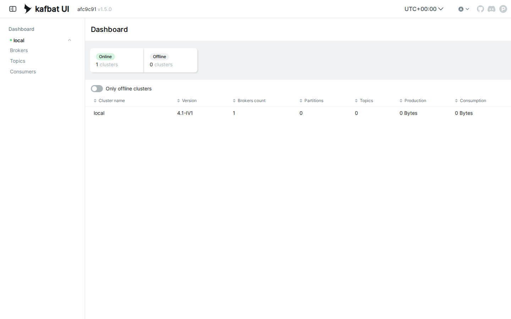
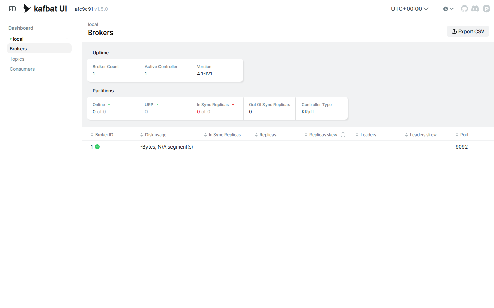
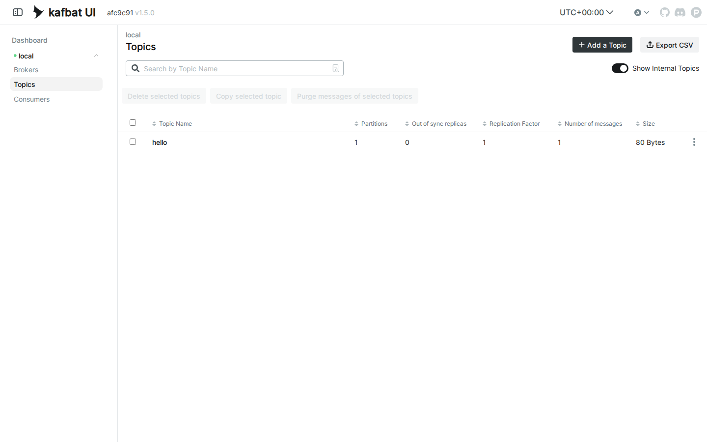
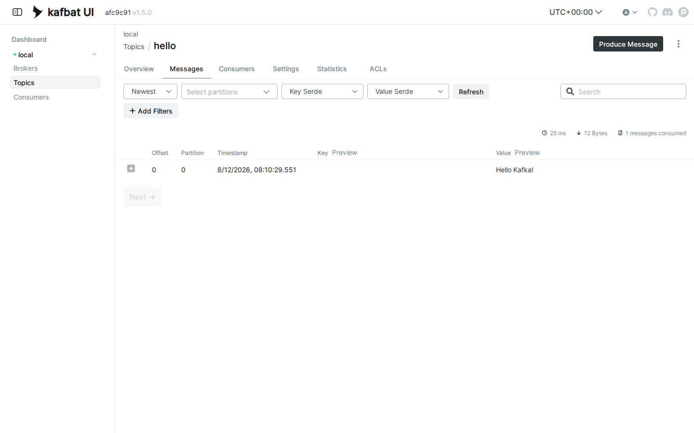

# LAB 1 — ติดตั้ง Kafka Broker + Kafka UI + Hello World

> โฟลเดอร์ `001_LAB_Kafka_Setup` = **LAB 1** ในสไลด์ `Kafka_Slides.html`
> (ไฟล์โค้ดของแล็บนี้ : `send.py` · `receive.py` · `requirements.txt`)

## สิ่งที่จะได้เรียนรู้

- เปิด **Kafka broker** ด้วย Docker คำสั่งเดียว — image รุ่นใหม่ใช้ **KRaft** จึงมี broker ตัวเดียวจบ ไม่ต้องติดตั้ง ZooKeeper
- broker เปิด **port เดียว** คือ `9092` ให้โปรแกรมคุย — ส่วนหน้าเว็บ **Kafka UI** เป็น container แยกอีกตัวที่ port `8080` (ต่างจาก RabbitMQ ที่ฝังหน้าเว็บมากับ broker)
- ใช้ **`kafka-topics.sh`** สำรวจข้างใน broker : ดูรายชื่อ topic · ดูเวอร์ชัน · ดูรายละเอียด partition
- เปิด **Kafka UI** ผ่าน port forwarding แล้วอ่านหน้า Dashboard · Brokers · Topics ให้เป็น
- เขียนโปรแกรม Python ด้วย **kafka-python** : `send.py` ส่งข้อความเข้า topic · `receive.py` วนอ่านข้อความ
- หัวใจของ Kafka : ข้อความถูก **จดลง log ถาวร** — มี "ที่อยู่" เป็น offset · **อ่านแล้วไม่หาย อ่านซ้ำได้** (RabbitMQ พอ ack แล้วข้อความถูกลบ — Kafka ไม่ลบ)

## ภาพรวมของแล็บนี้

1. **เปิดเครื่องเรียนแล้วเช็กว่า Docker พร้อม** — พิสูจน์ว่าเราสั่ง Docker จากข้างในกล่องเรียนได้จริง
2. **รัน Kafka broker ด้วย `docker run`** — Docker จะ pull image `apache/kafka:4.1.0` ให้เอง แล้วเปิด broker แบบ KRaft
3. **รอ broker พร้อมด้วย `docker logs`** — ต้องเห็น `Kafka Server started` ก่อน (Kafka บูตไวกว่า RabbitMQ มาก แต่บทเรียน "Up ≠ พร้อม" ยังจริงเสมอ)
4. **สำรวจด้วย `kafka-topics.sh`** — ดูเวอร์ชัน และเห็นว่าตอนนี้ **ยังไม่มี topic เลยสักตัว**
5. **เปิด Kafka UI ในเบราว์เซอร์** — รัน container ตัวที่สอง แล้ว forward port `8080`
6. **เตรียม Python ด้วย venv** — ติดตั้ง `kafka-python` ไลบรารีที่ใช้คุยกับ Kafka
7. **รัน `send.py` ตอนที่ยังไม่มีผู้อ่าน** — broker **สร้าง topic ให้อัตโนมัติ** และข้อความถูกจดลง log รอไว้พร้อมใบเสร็จ `offset=0`
8. **รัน `receive.py` สองหน้าต่าง** — ของค้างเด้งมาทันทีที่ผู้อ่านออนไลน์ + ข้อความใหม่วิ่งมาแบบ realtime
9. **รัน `receive.py` ซ้ำอีกรอบ** — ทุกข้อความกลับมาครบ! **อ่านแล้วไม่หาย** — จุดที่ Kafka ต่างจาก RabbitMQ ที่สุด

---

## 0. เตรียมเครื่องเรียน

ทำบนเครื่องของเราเอง (ไม่ใช้ cloud) — เปิด container ที่ติดตั้ง Docker มาให้แล้ว

```bash
docker rm -f devtools
docker run -dit --name devtools --privileged -p 2222:22 tuchsanai/devtools:2569_1
ssh root@localhost -p 2222        # password : passwd
```

> 📝 **คำอธิบาย:** สามบรรทัดนี้คือการ "เปิดเครื่องเรียน" ให้ทุกคนได้สภาพแวดล้อมเหมือนกันเป๊ะ · `docker rm -f devtools` ลบกล่องเรียนตัวเก่าทิ้งก่อนกันชื่อซ้ำ (`-f` = force ลบได้แม้ยังทำงานอยู่) ·
> `-dit` คือ `-d` รันเบื้องหลัง + `-i` เปิด stdin ค้างไว้ + `-t` ให้มี terminal กล่องจะได้ไม่ดับทันที · `--privileged` ให้สิทธิ์เต็มเพื่อรัน **Docker ซ้อนข้างในกล่อง** (จำเป็น — broker ของแล็บนี้เป็น container ที่รันอยู่ข้างในเครื่องเรียนอีกที) ·
> `-p 2222:22` ส่ง port 2222 ของเครื่องเรา เข้า port 22 (SSH) ของกล่อง

> ใน VS Code ใช้ **Remote-SSH** ต่อไปที่ `root@localhost:2222` แล้วทำแล็บทั้งหมดข้างใน

ตรวจว่าพร้อมใช้งาน :

```bash
docker --version
docker compose version
```

> 📝 **คำอธิบาย:** ถามเวอร์ชันของ Docker Engine และ Compose เพื่อ **ยืนยันว่าคำสั่ง `docker` วิ่งถึง daemon ได้จริง** ก่อนเริ่มแล็บ · สิ่งที่ต้องดูคือ "มีเลขเวอร์ชันขึ้นมาไหม" ไม่ใช่ "เลขตรงกับเอกสารไหม" ·
> ถ้าขึ้น `Cannot connect to the Docker daemon` แปลว่ายังอยู่นอกกล่องเรียนหรือ daemon ยังไม่ขึ้น ให้ย้อนทำข้อ 0 ใหม่

✅ **Expected output** — ขอแค่มี **เลขเวอร์ชัน** ขึ้นครบสองบรรทัด ไม่ใช่ error (เลขเวอร์ชันของแต่ละคนอาจไม่ตรงกับเอกสารนี้):

```
Docker version 29.6.2, build dfc4efb
Docker Compose version v5.3.1
```

---

## 1. Clone โค้ดแล็บ

```bash
mkdir -p ~/labwork && cd ~/labwork
git clone https://github.com/Tuchsanai/DevTools.git
cd DevTools/07_Kafka/001_LAB_Kafka_Setup
```

> 📝 **คำอธิบาย:** `mkdir -p ~/labwork` สร้างโฟลเดอร์เก็บงาน (`-p` = มีอยู่แล้วก็ไม่ error) · `git clone` ดึงรีโพของวิชาลงมา ทำครั้งเดียวใช้ได้ทุกแล็บของชุดนี้ · แล้ว `cd` เข้าโฟลเดอร์แล็บ ซึ่งมี `send.py` · `receive.py` · `requirements.txt` รออยู่แล้ว ·
> ถ้าเคย clone ไว้ git จะบอกว่าโฟลเดอร์ไม่ว่าง — ข้ามไป `cd` ได้เลย

---

## 2. รัน Kafka Broker

```bash
docker rm -f kafka kafka-ui 2>/dev/null
docker run -d --name kafka -p 9092:9092 apache/kafka:4.1.0
```

> 📝 **คำอธิบาย:** `docker rm -f kafka kafka-ui 2>/dev/null` ลบ broker กับ UI ตัวเก่ากันชื่อซ้ำ (`2>/dev/null` โยน error ทิ้งถ้าไม่มีตัวเก่า) · `-d` รันเบื้องหลัง · `--name kafka` ตั้งชื่อไว้เรียกสั้น ๆ ·
> `-p 9092:9092` เปิด port เดียวพอ — Kafka ใช้ `9092` ทั้งรับ-ส่งข้อความและคำสั่งดูแลระบบ (สังเกตความต่างจาก RabbitMQ ที่ต้องเปิดสอง port แยกโปรแกรม/คน — หน้าเว็บของ Kafka เป็น container แยกในข้อ 5) ·
> `apache/kafka:4.1.0` คือ image ทางการรุ่น **KRaft** : broker ทำหน้าที่ controller เองในตัว **ไม่ต้องมี ZooKeeper** อีกต่อไป — ค่า default ของ image ประกาศตัวเองที่ `localhost:9092` พอดีกับแล็บนี้เป๊ะ และไม่มีระบบ user/password (PLAINTEXT) เหมาะกับการเรียน แต่ห้ามใช้แบบนี้บน production

ครั้งแรกยังไม่มี image ในเครื่อง Docker จึง **pull ให้อัตโนมัติ** แล้วค่อยรัน :

✅ **Expected output** — ดูบรรทัด `Status: Downloaded newer image ...` แล้วปิดท้ายด้วย **container ID ยาว 64 ตัวอักษร** = broker เริ่มรันแล้ว (layer ID · digest ของแต่ละคนจะไม่ตรงกับเอกสารนี้):

```
Unable to find image 'apache/kafka:4.1.0' locally
4.1.0: Pulling from apache/kafka
1e7ff3c422db: Pulling fs layer
        ... (รวม 11 layer · Pulling fs layer → Download complete → Pull complete ทีละ layer) ...
Digest: sha256:bff074a5d0051dbc0bbbcd25b045bb1fe84833ec0d3c7c965d1797dd289ec88f
Status: Downloaded newer image for apache/kafka:4.1.0
780653d617525f7ee202fb79c20b3dcfd6063cdeee2ebb34713841a804f33df4
```

ดูว่า broker ขึ้นมาแล้วจริง :

```bash
docker ps
```

> 📝 **คำอธิบาย:** จุดที่ต้องดูคือ STATUS เป็น `Up ...` และคอลัมน์ PORTS มี **ลูกศร** `0.0.0.0:9092->9092/tcp` ตามที่เราสั่ง · สังเกตว่า image นี้สะอาดมาก — ประกาศ port เดียวจบ ไม่มี port ภายในโผล่มาให้งงเหมือนตอน RabbitMQ

✅ **Expected output** — STATUS เป็น `Up` และมี mapping port `9092` (ID · เวลาของแต่ละคนจะไม่ตรงกับเอกสารนี้):

```
CONTAINER ID   IMAGE                COMMAND                  CREATED         STATUS         PORTS                                         NAMES
780653d61752   apache/kafka:4.1.0   "/__cacert_entrypoin…"   8 seconds ago   Up 6 seconds   0.0.0.0:9092->9092/tcp, [::]:9092->9092/tcp   kafka
```

---

## 3. รอ Broker พร้อม — `docker logs`

บทเรียนเดิมจากชุด RabbitMQ ยังจริงเสมอ : `docker ps` ขึ้น `Up` ไม่ได้แปลว่า broker **พร้อมรับงาน** — ต้องดู log จนเห็นบรรทัดประกาศความพร้อมก่อน

```bash
docker logs kafka --tail 8
```

> 📝 **คำอธิบาย:** `docker logs kafka` ดึงสิ่งที่ broker พิมพ์ออกทาง stdout มาดูโดยไม่ต้องเข้าไปในกล่อง · `--tail 8` เอาเฉพาะ 8 บรรทัดท้ายสุด · บรรทัดที่ต้องรอคือ **`Kafka Server started`** — ถ้ายังไม่เห็น รอ 2–3 วินาทีแล้วรันซ้ำ · แถมได้เห็นเวอร์ชันจริงที่รัน (`Kafka version: 4.1.0`) ในบรรทัดใกล้ ๆ กันด้วย

✅ **Expected output** — จุดชี้ขาดคือบรรทัดสุดท้าย `Kafka Server started` (วันเวลา · commitId ของแต่ละคนจะไม่ตรงกับเอกสารนี้):

```
[2026-08-12 08:06:17,150] INFO [BrokerServer id=1] Finished waiting for all of the authorizer futures to be completed (kafka.server.BrokerServer)
        ... (บรรทัด Waiting / Finished waiting อีก 2 บรรทัด) ...
[2026-08-12 08:06:17,150] INFO [BrokerServer id=1] Transition from STARTING to STARTED (kafka.server.BrokerServer)
[2026-08-12 08:06:17,151] INFO Kafka version: 4.1.0 (org.apache.kafka.common.utils.AppInfoParser)
        ... (บรรทัด Kafka commitId · Kafka startTimeMs) ...
[2026-08-12 08:06:17,152] INFO [KafkaRaftServer nodeId=1] Kafka Server started (kafka.server.KafkaRaftServer)
```

> **บทเรียนสำคัญ :** container `Up` ≠ โปรแกรมข้างในพร้อม — `Up` บอกแค่ว่า process หลักยังไม่ตาย ส่วน "พร้อมรับ connection หรือยัง" ต้องดูจาก log ·
> Kafka บูตไวราว **5 วินาที** (RabbitMQ ใช้เกือบ 13 วินาที) — เร็วจนแทบไม่ทันเจอปัญหา แต่พอขึ้นเครื่องจริงที่ข้อมูลเยอะ การบูตอาจกินเวลานาน นิสัย "รอ log ก่อนใช้" จะช่วยชีวิตเสมอ

---

## 4. สำรวจข้างใน Broker ด้วย `kafka-topics.sh`

เครื่องมือ CLI ของ Kafka เป็นสคริปต์ในโฟลเดอร์ `/opt/kafka/bin` **ข้างใน container `kafka`** จึงต้องสั่งผ่าน `docker exec` เสมอ

```bash
docker exec kafka /opt/kafka/bin/kafka-topics.sh --bootstrap-server localhost:9092 --version
docker exec kafka /opt/kafka/bin/kafka-topics.sh --bootstrap-server localhost:9092 --list
```

> 📝 **คำอธิบาย:** `docker exec kafka <คำสั่ง>` สั่งให้คำสั่งไปรัน **ข้างใน container `kafka`** · ทุกคำสั่ง CLI ของ Kafka ต้องมี `--bootstrap-server localhost:9092` บอกว่า "ประตูแรก" ที่ใช้ต่อเข้า cluster อยู่ที่ไหน (localhost ตรงนี้คือ localhost ของตัว container `kafka` เอง) ·
> `--version` ถามเวอร์ชันของ broker · `--list` ขอรายชื่อ **topic** ทั้งหมด — broker เพิ่งเกิดใหม่ ยังไม่มีใครสร้าง topic ผลจึง **ว่างเปล่า ไม่พิมพ์อะไรออกมาเลยสักบรรทัด** (RabbitMQ ยังพิมพ์หัวรายงานให้ แต่ Kafka เงียบสนิท) — จำภาพนี้ไว้เทียบกับหลังรัน `send.py` ในข้อ 7

✅ **Expected output** — `--version` ตอบเลขเวอร์ชันมาบรรทัดเดียว ส่วน `--list` **ไม่มี output เลย** ได้ prompt คืนทันที:

```
4.1.0
```

---

## 5. เปิด Kafka UI ในเบราว์เซอร์

Kafka ไม่มีหน้าเว็บติดมากับ broker — เราจึงรัน **Kafka UI** (โปรเจกต์ `kafbat/kafka-ui`) เป็น container ตัวที่สอง แล้วชี้ให้มันไปเฝ้า broker ของเรา :

```bash
docker run -d --name kafka-ui --network host \
  -e KAFKA_CLUSTERS_0_NAME=local \
  -e KAFKA_CLUSTERS_0_BOOTSTRAPSERVERS=localhost:9092 \
  kafbat/kafka-ui:latest
```

> 📝 **คำอธิบาย:** `--network host` ให้ container นี้ใช้ network ของเครื่องเรียนตรง ๆ — มันจึงเห็น broker ที่ `localhost:9092` และเปิดหน้าเว็บที่ port `8080` ได้โดยไม่ต้อง `-p` (ผลพลอยได้ : `docker ps` จะไม่มีคอลัมน์ PORTS ของตัว UI — ปกติ ไม่ต้องตกใจ) ·
> `-e KAFKA_CLUSTERS_0_NAME=local` ตั้งชื่อ cluster ที่จะโชว์ใน UI · `-e KAFKA_CLUSTERS_0_BOOTSTRAPSERVERS=localhost:9092` บอก UI ว่า broker อยู่ที่ไหน — ชุดเดียวกับที่ CLI ใช้เป๊ะ ·
> **ลำดับสำคัญ :** ต้องรัน UI **หลังจาก broker พร้อมแล้ว** (ผ่านข้อ 3 มาแล้ว) — ถ้าเปิด UI ก่อน broker พร้อม หน้าเว็บจะจำสถานะ offline ค้างไว้

✅ **Expected output** — ครั้งแรก Docker pull image ของ UI ให้ก่อน แล้วปิดท้ายด้วย container ID (layer ID · digest ของแต่ละคนจะไม่ตรงกับเอกสารนี้):

```
Unable to find image 'kafbat/kafka-ui:latest' locally
latest: Pulling from kafbat/kafka-ui
5b9ab419b7b2: Pulling fs layer
        ... (รวม 7 layer · Pulling fs layer → Download complete → Pull complete ทีละ layer) ...
Digest: sha256:7cda86a33344160309fdb65146332e4da65db81a945614f2fe32e210803f6fd1
Status: Downloaded newer image for kafbat/kafka-ui:latest
5e32c63f92fe9899404f2faf71bd143d3e69fe7a0464696b549d46b57142761c
```

UI ก็ต้องรอบูตเหมือนกัน (เป็นเว็บแอป Java) — เช็กด้วย log ว่าพร้อมหรือยัง :

```bash
docker logs kafka-ui 2>&1 | grep Started
```

> 📝 **คำอธิบาย:** UI ตัวนี้พิมพ์ log ยาวและมีบรรทัดใหม่เพิ่มตลอดเวลา `--tail` จึงเล็งพลาดง่าย — ใช้ `grep Started` กรองหาบรรทัดประกาศความพร้อมตรง ๆ แทน (`2>&1` รวม stderr เข้ามาให้ grep เห็นด้วย) · เจอบรรทัด `Started KafkaUiApplication` เมื่อไหร่ = หน้าเว็บที่ port `8080` เปิดแล้ว

✅ **Expected output** — มีบรรทัด `Started KafkaUiApplication` (ตัวเลขวินาทีของแต่ละคนจะไม่ตรงกับเอกสารนี้):

```
2026-08-12T08:07:05.078Z  INFO 1 --- [           main] io.kafbat.ui.KafkaUiApplication          : Started KafkaUiApplication in 4.212 seconds (process running for 4.731)
```

หน้าเว็บเปิดอยู่ที่ port `8080` **ข้างในเครื่องเรียน** ไม่ใช่บนเครื่องเราโดยตรง — ต้องให้ VS Code forward port ออกมาก่อน (VS Code จะสร้าง **SSH tunnel** ให้อัตโนมัติ) :

1. เปิดแท็บ **PORTS** (แถวเดียวกับ TERMINAL)
2. กดปุ่ม **Forward a Port**
3. พิมพ์ `8080` แล้วกด **Enter**
4. เปิด `http://localhost:8080` ในเบราว์เซอร์ (หรือคลิกไอคอนลูกโลกในแถวของ port)


เปิดมาเจอหน้า **Dashboard** ทันที — ไม่มีหน้า login เพราะ UI ตัวนี้ปิดระบบ authentication ไว้เป็นค่า default :



> 📝 **คำอธิบาย:** แถบบน **Online 1 clusters** = UI ต่อ broker ติดแล้ว · ตารางข้างล่างคือ cluster `local` (ชื่อจาก `-e KAFKA_CLUSTERS_0_NAME`) : **Version 4.1-IV1 · Brokers count 1 · Partitions 0 · Topics 0** — ยังว่างเปล่าตรงกับที่ `--list` บอกในข้อ 4 ·
> เมนูซ้ายคือแท็บที่จะใช้ตลอดชุดแล็บ : **Brokers** สุขภาพของ broker · **Topics** รายชื่อ topic กับจำนวนข้อความ — แท็บที่กลับมาดูบ่อยที่สุด · **Consumers** กลุ่มผู้อ่าน (จะสำคัญมากตั้งแต่ LAB 3)

คลิกเมนู **Brokers** ดูสุขภาพของ broker ตัวเดียวของเรา :



> 📝 **คำอธิบาย:** **Broker Count 1 · Active Controller 1** — broker ตัวเดียวนี้เป็นทั้งคนเก็บข้อมูลและ controller ของ cluster · ช่อง **Controller Type: KRaft** คือคำยืนยันว่ารุ่นนี้ไม่ใช้ ZooKeeper แล้ว · ในตาราง Broker ID `1` มีเครื่องหมายถูกสีเขียว (online) และคอลัมน์ **Port** คือ `9092` ที่เรา map ไว้

#### ทางเลือก : forward ด้วยคำสั่ง `ssh -L` (ไม่ใช้ VS Code)

เปิด terminal ใหม่บนเครื่องเรา แล้ว ssh พร้อมพ่วง tunnel :

```bash
ssh -L 8080:localhost:8080 root@localhost -p 2222        # password : passwd
```

> 📝 **คำอธิบาย:** ทำ SSH tunnel ด้วยมือ แทนการกดปุ่มในแท็บ PORTS · `-L 8080:localhost:8080` เปิด port 8080 บนเครื่องเรา แล้วส่งทุก connection ผ่านท่อ ssh ไปโผล่ที่ `localhost:8080` ฝั่งเครื่องเรียน · `-p 2222` ตรงนี้คือ port ของ SSH (คนละความหมายกับ `-p` ของ `docker run`) · หน้าต่างนี้ต้องเปิดค้างไว้ — ปิดเมื่อไหร่ tunnel หายทันที และเบราว์เซอร์จะเปิดหน้า UI ไม่ได้อีก

#### ทดลองเสร็จแล้ว — ลบ tunnel ทุกครั้ง

- แบบ `ssh -L` : พิมพ์ `exit` (หรือกด `Ctrl+D`) ใน session นั้น — tunnel ปิดทันที
- แบบ VS Code : แท็บ **PORTS** → คลิกขวาที่ port `8080` → **Stop Forwarding Port**

> ยังไม่ต้องปิดตอนนี้ก็ได้ — ข้อ 7 จะกลับมาดูหน้า Topics อีกครั้ง แต่**จบแล็บแล้วต้องปิดเสมอ**

---

## 6. เตรียม Python — venv + kafka-python

เครื่องเรียนมี Python 3 แล้ว แต่ระบบสมัยใหม่ (PEP 668) **ไม่ยอมให้ `pip install` ลงเครื่องตรง ๆ** ต้องสร้าง **virtual environment** ก่อน :

```bash
python3 -m venv ~/venv-kafka
source ~/venv-kafka/bin/activate
pip install kafka-python==3.0.10
```

> 📝 **คำอธิบาย:** `python3 -m venv ~/venv-kafka` สร้างสภาพแวดล้อม Python แยกส่วนตัวที่ `~/venv-kafka` — ติดตั้งอะไรในนี้ไม่กระทบ Python ของระบบ · `source ~/venv-kafka/bin/activate` เปิดใช้งาน สังเกต prompt ขึ้นคำนำหน้า `(venv-kafka)` = ตอนนี้ `python`/`pip` ชี้เข้า venv แล้ว ·
> `pip install kafka-python==3.0.10` ติดตั้ง **kafka-python** ไลบรารีฝั่ง Python สำหรับคุยกับ Kafka โดยล็อกเวอร์ชันให้ตรงกับเอกสาร (ตรงกับ `requirements.txt` ของแล็บ — จะใช้ `pip install -r requirements.txt` แทนก็ได้)

✅ **Expected output** — บรรทัดสุดท้ายต้องเป็น `Successfully installed kafka-python-3.0.10` (ความเร็วดาวน์โหลดของแต่ละคนจะไม่ตรงกับเอกสารนี้):

```
Collecting kafka-python==3.0.10
  Downloading kafka_python-3.0.10-py3-none-any.whl.metadata (11 kB)
Downloading kafka_python-3.0.10-py3-none-any.whl (614 kB)
   ━━━━━━━━━━━━━━━━━━━━━━━━━━━━━━━━━━━━━━━━ 614.2/614.2 kB 10.6 MB/s eta 0:00:00
Installing collected packages: kafka-python
Successfully installed kafka-python-3.0.10
```

ตรวจว่า import ได้จริง :

```bash
python -c "import kafka; print(kafka.__version__)"
```

> 📝 **คำอธิบาย:** `python -c "..."` รันโค้ด Python สั้น ๆ จากบรรทัดคำสั่ง · import สำเร็จและพิมพ์เลขเวอร์ชัน = venv พร้อมใช้ · สังเกตว่าชื่อแพ็กเกจตอนติดตั้งคือ `kafka-python` แต่ตอน import ใช้ชื่อ `kafka` เฉย ๆ

✅ **Expected output** — ได้เลขเวอร์ชันตรงกับที่ติดตั้ง:

```
3.0.10
```

> **⚠️ กติกาสำคัญ :** ทุกครั้งที่เปิด **terminal ใหม่** (รวมถึงหน้าต่างที่ 2 ในข้อ 8) ต้องพิมพ์ `source ~/venv-kafka/bin/activate` ก่อนเสมอ — ดูว่า prompt มี `(venv-kafka)` นำหน้าหรือยัง ·
> ถ้าลืม จะเจอ `ModuleNotFoundError: No module named 'kafka'` ทันทีที่รันโปรแกรม

---

## 7. ส่งข้อความแรก — `send.py`

ดูโค้ดกันก่อน (ไฟล์อยู่ในโฟลเดอร์แล็บแล้ว ไม่ต้องพิมพ์เอง) :

```python
from kafka import KafkaProducer

# 1) ต่อไปหา broker ที่ localhost port 9092 (port ที่ map ไว้ตอน docker run)
producer = KafkaProducer(bootstrap_servers='localhost:9092')

# 2) ส่งข้อความเข้า topic 'hello' — Kafka รับ-ส่งเป็น bytes เสมอ จึงต้อง .encode()
#    (ไม่ต้องสร้าง topic ก่อน — ส่งครั้งแรก broker จะสร้าง topic ให้อัตโนมัติ)
future = producer.send('hello', 'Hello Kafka!'.encode())

# 3) .get() รอจน broker ตอบรับ แล้วคืน "ใบเสร็จ" ว่าข้อความไปลงตรงไหนของ log
metadata = future.get(timeout=10)
print(f" [x] Sent 'Hello Kafka!'  ->  topic={metadata.topic} "
      f"partition={metadata.partition} offset={metadata.offset}")

# 4) ปิด connection ให้เรียบร้อย (producer จะส่งข้อมูลที่ค้างอยู่ออกให้หมดก่อน)
producer.close()
```

> 📝 **คำอธิบาย:** ไล่ตามเลขในคอมเมนต์ · **(1)** `KafkaProducer` เปิด connection ไป `localhost:9092` — ไม่มี user/password เพราะ broker ของแล็บเป็น PLAINTEXT · **(2)** `producer.send('hello', ...)` ส่งเข้า **topic** ชื่อ `hello` — Kafka รับเป็น bytes เสมอจึงต้อง `.encode()` และ**ไม่ต้องประกาศ topic ล่วงหน้า** broker ตั้งค่า auto-create ไว้ให้ ·
> **(3)** ความจริง `send()` เป็นแบบ **async** — มันคืน `future` มาก่อน แล้ว `.get(timeout=10)` คือการยืนรอ "ใบเสร็จ" (`RecordMetadata`) จาก broker ว่าข้อความถูกจดลง log แล้วที่ **topic ไหน · partition ไหน · ตำแหน่ง (offset) ที่เท่าไร** — RabbitMQ ไม่มีใบเสร็จแบบนี้ เพราะข้อความเข้าคิวแล้วรอถูกลบ แต่ของ Kafka ทุกข้อความมี "ที่อยู่ถาวร" ใน log ·
> **(4)** `close()` ปิด producer — ดันข้อมูลที่ค้างใน buffer ออกให้หมดก่อน

รัน (อย่าลืมว่าต้องมี `(venv-kafka)` นำหน้า prompt และยัง**ไม่มีผู้อ่านสักคน**) :

```bash
python send.py
```

> 📝 **คำอธิบาย:** โปรแกรมต่อ broker → ส่ง 1 ข้อความ → รอใบเสร็จ → พิมพ์ → จบตัวเองทันที ไม่รอผู้อ่านใด ๆ ทั้งสิ้น · จุดที่ต้องดูในใบเสร็จ : `partition=0` (topic นี้มี partition เดียว) และ `offset=0` — ข้อความ**แรกสุด**ของ log ได้ตำแหน่งหมายเลข 0

✅ **Expected output** — พิมพ์บรรทัดเดียวพร้อมใบเสร็จ แล้วได้ prompt คืนทันที:

```
 [x] Sent 'Hello Kafka!'  ->  topic=hello partition=0 offset=0
```

โปรแกรมจบไปแล้ว แต่ข้อความไปไหน? — ถาม broker ดู :

```bash
docker exec kafka /opt/kafka/bin/kafka-topics.sh --bootstrap-server localhost:9092 --list
```

> 📝 **คำอธิบาย:** คำสั่งเดิมจากข้อ 4 แต่สถานการณ์เปลี่ยน — ตอนนั้นว่างเปล่า ตอนนี้มี `hello` โผล่มา **ทั้งที่เราไม่เคยสั่งสร้าง topic เลย** : broker สร้างให้อัตโนมัติตอน `send.py` ส่งครั้งแรก (auto-create)

✅ **Expected output** — มี topic `hello` โผล่มาหนึ่งบรรทัด:

```
hello
```

ถ้าเปิดหน้า **Topics** ใน UI จะเห็น `hello` พร้อมตัวเลข **Number of messages = 1** — ข้อความนอนรออยู่ใน log ทั้งที่ไม่มีผู้อ่านสักคน :



ขอดูรายละเอียดของ topic นี้หน่อย :

```bash
docker exec kafka /opt/kafka/bin/kafka-topics.sh --bootstrap-server localhost:9092 --describe --topic hello
```

> 📝 **คำอธิบาย:** `--describe --topic hello` ขอ "บัตรประชาชน" ของ topic · จุดที่ต้องดู : **`PartitionCount: 1`** — topic ที่เกิดจาก auto-create ได้ partition เดียว (ค่า default) ข้อความทุกตัวจึงเข้าแถวเดียวกันเรียง offset 0, 1, 2, … · **`ReplicationFactor: 1`** — สำเนาเดียวเพราะมี broker ตัวเดียว ·
> บรรทัดล่างไล่รายตัว partition : `Leader: 1` คือ broker ID 1 เป็นเจ้าของ partition นี้ — เรื่อง partition หลายตัวและการกระจายข้อความ เป็นพระเอกของ LAB ถัด ๆ ไป

✅ **Expected output** — `PartitionCount: 1` และมีบรรทัดรายละเอียด Partition: 0 (TopicId ของแต่ละคนจะไม่ตรงกับเอกสารนี้):

```
Topic: hello	TopicId: Ewd4tlCWT7mvAAvoYnJddg	PartitionCount: 1	ReplicationFactor: 1	Configs: min.insync.replicas=1,segment.bytes=1073741824
	Topic: hello	Partition: 0	Leader: 1	Replicas: 1	Isr: 1	Elr: 	LastKnownElr:
```

ใน UI คลิกที่ชื่อ topic `hello` แล้วเข้าแท็บ **Messages** — เห็นตัวข้อความจริง ๆ พร้อมที่อยู่ของมัน :



> 📝 **คำอธิบาย:** แถวเดียวในตารางคือข้อความของเรา : **Offset 0 · Partition 0 · Timestamp · Value `Hello Kafka!`** — ตรงกับใบเสร็จของ `send.py` ทุกช่อง ·
> UI อ่านข้อความจาก log มาโชว์ได้เรื่อย ๆ โดยข้อความ**ไม่หายไปไหน** — นี่คือความต่างตัวแรกจาก RabbitMQ ที่เห็นด้วยตา (Management UI ของ RabbitMQ ทำได้แค่ "Get Message" แบบระวัง ๆ เพราะการอ่านมีผลกับคิว)

> **หัวใจของ Kafka อยู่ตรงนี้ :** ผู้ส่งกับผู้อ่าน **ไม่ต้องออนไลน์พร้อมกัน** — `send.py` ส่งเสร็จก็จบตัวเองไปเลย ข้อความถูก **จดลง log ถาวร** ที่ตำแหน่ง `offset=0` รอได้เสมอแม้ไม่มีผู้อ่านสักคน ·
> เหมือน RabbitMQ ตรง "ข้อความรอได้" แต่ต่างกันที่วิธีเก็บ : RabbitMQ เก็บใน**คิว**รอถูกดูดออก ส่วน Kafka **จดลงสมุด** — ใครจะมาอ่านหน้าไหน เมื่อไหร่ กี่รอบ ก็ได้

---

## 8. อ่านข้อความ — `receive.py` (ใช้ 2 หน้าต่าง)

ดูโค้ดฝั่งผู้อ่าน :

```python
import sys
from kafka import KafkaConsumer

def main():
    # 1) สมัครเป็นผู้อ่าน topic 'hello'
    #    - auto_offset_reset='earliest' : เริ่มอ่านจากข้อความ "แรกสุด" ที่อยู่ใน log
    #    - ยังไม่ใส่ group_id : Kafka จะไม่จดว่าเราอ่านถึงไหน → รันใหม่ก็อ่านซ้ำได้ทั้งหมด
    consumer = KafkaConsumer('hello',
                             bootstrap_servers='localhost:9092',
                             auto_offset_reset='earliest')

    print(' [*] Waiting for messages. To exit press CTRL+C')

    # 2) วนรออ่านไปเรื่อย ๆ — มีข้อความใหม่เข้ามาเมื่อไหร่ loop ก็เดินต่อทันที
    for message in consumer:
        # 3) ทุกข้อความมี "ที่อยู่" ติดมาด้วยเสมอ : อยู่ partition ไหน ตำแหน่ง (offset) ที่เท่าไร
        #    ตัวเนื้อข้อความเป็น bytes ต้อง .decode() ก่อนพิมพ์
        print(f" [x] Received partition={message.partition} "
              f"offset={message.offset} value={message.value.decode()}")

if __name__ == '__main__':
    try:
        main()
    except KeyboardInterrupt:
        print('Interrupted')
        sys.exit(0)
```

> 📝 **คำอธิบาย:** ไล่ตามเลขในคอมเมนต์ · **(1)** `KafkaConsumer('hello', ...)` สมัครเป็นผู้อ่าน topic `hello` · `auto_offset_reset='earliest'` = ถ้ายังไม่เคยมีตำแหน่งอ่านมาก่อน ให้เริ่มจาก**ต้น log** (ค่า default คือ `latest` ที่จะรออ่านเฉพาะของใหม่) · **ตั้งใจไม่ใส่ `group_id`** — Kafka จะไม่จดตำแหน่งอ่านของเราไว้เลย รันใหม่เมื่อไหร่ก็เริ่มอ่านจากต้น log ใหม่หมด (ข้อ 9 จะใช้จุดนี้โชว์ของ · เรื่อง group จริงจังยกไป LAB 3) ·
> **(2)** `for message in consumer:` คือ loop รอรับ**ตลอดไป** โปรแกรมไม่จบเอง ต้องกด Ctrl+C · **(3)** ทุกข้อความมาพร้อมที่อยู่ `partition` + `offset` เสมอ ส่วนเนื้อข้อความ `message.value` เป็น bytes ต้อง `.decode()` ·
> `try/except KeyboardInterrupt` ดัก Ctrl+C ให้จบสวย ๆ พร้อมพิมพ์ `Interrupted`

**หน้าต่างที่ 1** — รันผู้อ่าน :

```bash
python receive.py
```

> 📝 **คำอธิบาย:** สิ่งที่ต้องเห็นคือ **สองบรรทัดติดกัน** : `Waiting for messages` = เข้า loop สำเร็จ แล้ว `Received ... offset=0` ตามมา **ทันที** — ข้อความที่จดไว้ใน log ตั้งแต่ข้อ 7 ถูกอ่านทันทีที่ผู้อ่านออนไลน์ (ฤทธิ์ของ `earliest`) · โปรแกรม **ไม่จบ** terminal ค้างรออยู่ — ถูกต้องแล้ว ปล่อยค้างไว้ อย่าเพิ่งกด Ctrl+C

✅ **Expected output** — ข้อความค้างใน log เด้งมาทันที แล้ว terminal ค้างรอต่อ:

```
 [*] Waiting for messages. To exit press CTRL+C
 [x] Received partition=0 offset=0 value=Hello Kafka!
        ^ ค้างอยู่ตรงนี้ — โปรแกรมยังรออ่านข้อความถัดไป
```

**หน้าต่างที่ 2** — เปิด terminal ใหม่ (ssh `root@localhost -p 2222` อีก session) แล้วส่งเพิ่ม 3 ครั้ง :

```bash
source ~/venv-kafka/bin/activate && cd ~/labwork/DevTools/07_Kafka/001_LAB_Kafka_Setup
python send.py
python send.py
python send.py
```

> 📝 **คำอธิบาย:** หน้าต่างใหม่ = shell ใหม่ ต้อง activate venv ก่อนเสมอ (กติกาข้อ 6) แล้ว `cd` เข้าโฟลเดอร์แล็บ · ยิง `send.py` ติดกัน 3 ครั้ง — ดูใบเสร็จฝั่งนี้ให้ดี : **offset ขยับ 1 → 2 → 3 เอง** เพราะ log ต่อท้ายเสมอ (append-only) · ระหว่างรันแต่ละครั้ง **ชำเลืองดูหน้าต่างที่ 1 ไปด้วย** จะเห็น `Received` เด้งเพิ่มแทบจะพร้อมกับที่ฝั่งนี้ขึ้น `Sent`

✅ **Expected output** — ฝั่งหน้าต่างที่ 2 ได้ใบเสร็จ 3 ใบ offset ต่อเนื่องกัน:

```
 [x] Sent 'Hello Kafka!'  ->  topic=hello partition=0 offset=1
 [x] Sent 'Hello Kafka!'  ->  topic=hello partition=0 offset=2
 [x] Sent 'Hello Kafka!'  ->  topic=hello partition=0 offset=3
```

กลับมาดู **หน้าต่างที่ 1** — ได้ครบ 4 ข้อความ (1 ค้างจากข้อ 7 + 3 สด) เสร็จแล้วกด **Ctrl+C** :

✅ **Expected output** — `Received` ครบ 4 บรรทัด offset 0–3 และเมื่อกด Ctrl+C จะพิมพ์ `Interrupted` แล้วคืน prompt:

```
 [*] Waiting for messages. To exit press CTRL+C
 [x] Received partition=0 offset=0 value=Hello Kafka!
        ... ( [x] Received ... offset 1 → 3 อีก 3 บรรทัด) ...
Interrupted
```

> **สรุปภาพที่เพิ่งเห็น :** ข้อความเดินทาง `send.py` → topic `hello` (partition 0) → `receive.py` · ไม่มีผู้อ่าน = ข้อความ **นอนอยู่ใน log** · ผู้อ่านออนไลน์ = ของเก่าถูกอ่าน **ทันที** · ผู้อ่านออนไลน์อยู่แล้ว = ข้อความใหม่วิ่งถึงแบบ **realtime** — เหมือนชุด RabbitMQ ทุกประการ … จนถึงข้อ 9

---

## 9. จุดที่ Kafka ต่างจาก RabbitMQ ที่สุด — อ่านแล้วไม่หาย

ตอนจบข้อ 8 ของชุด RabbitMQ คิวกลับเป็น `hello 0` — ข้อความที่ ack แล้ว**ถูกลบทิ้งถาวร** รันผู้รับใหม่ก็ไม่มีอะไรให้อ่าน · ลองทำแบบเดียวกันกับ Kafka ดู : รัน `receive.py` **ซ้ำอีกรอบ** ทั้งที่เพิ่งอ่านครบ 4 ข้อความไปหยก ๆ

```bash
python receive.py
```

> 📝 **คำอธิบาย:** โปรแกรมเดิม ไม่แก้อะไรสักตัวอักษร — แต่ผลลัพธ์คือ **ทั้ง 4 ข้อความกลับมาครบ** offset 0 → 3 เหมือนเดิมเป๊ะ ·
> เพราะ Kafka **ไม่ลบข้อความเมื่อถูกอ่าน** — การอ่านเป็นแค่การ "เลื่อนสายตา" ไปตาม log ส่วนตัวใครตัวมัน และ `receive.py` ไม่ใส่ `group_id` broker จึงไม่จดด้วยซ้ำว่าเราเคยอ่านถึงไหน — เปิดสมุดใหม่ก็เริ่มอ่านหน้าแรกใหม่ทุกครั้ง · (ข้อความใน log ถูกลบตามอายุที่ตั้งไว้เท่านั้น — ค่า default คือเก็บ **7 วัน** ไม่เกี่ยวกับว่ามีใครอ่านหรือยัง) · ดูครบแล้วกด Ctrl+C ได้เลย

✅ **Expected output** — ข้อความเดิมทั้ง 4 กลับมาครบทุกตัว ทั้งที่เคยถูกอ่านไปแล้ว:

```
 [*] Waiting for messages. To exit press CTRL+C
 [x] Received partition=0 offset=0 value=Hello Kafka!
 [x] Received partition=0 offset=1 value=Hello Kafka!
 [x] Received partition=0 offset=2 value=Hello Kafka!
 [x] Received partition=0 offset=3 value=Hello Kafka!
Interrupted
```

Kafka มี CLI ผู้อ่านสำเร็จรูปให้ด้วย — ลองอ่านซ้ำอีกรอบโดยไม่ง้อ Python เลย :

```bash
docker exec kafka /opt/kafka/bin/kafka-console-consumer.sh --bootstrap-server localhost:9092 --topic hello --from-beginning --max-messages 4
```

> 📝 **คำอธิบาย:** `kafka-console-consumer.sh` คือผู้อ่านฉบับ CLI · `--from-beginning` = อ่านตั้งแต่ต้น log (ความหมายเดียวกับ `auto_offset_reset='earliest'` ในโค้ด) · `--max-messages 4` อ่านครบ 4 ข้อความแล้วจบตัวเอง — ถ้าไม่ใส่ มันจะค้างรอเหมือน `receive.py` ·
> นี่คือการอ่าน log เดิม **รอบที่สาม**แล้ว (Python 2 รอบ + CLI 1 รอบ) — ข้อความก็ยังอยู่ครบ

✅ **Expected output** — เนื้อข้อความ 4 บรรทัด ปิดท้ายด้วยบรรทัดสรุปของ CLI:

```
Hello Kafka!
        ... (Hello Kafka! รวม 4 บรรทัด) ...
Processed a total of 4 messages
```

> **บทเรียนหัวใจของ Kafka :** log เป็นแบบ **append-only** — เขียนต่อท้ายอย่างเดียว อ่านกี่รอบก็ไม่กระทบข้อมูล · **RabbitMQ = คิวงาน** (ส่งงาน → ทำเสร็จ → ack → งานหายไป) ส่วน **Kafka = สมุดบันทึกเหตุการณ์** (จดทุกอย่างตามลำดับ → ใครอยากรู้อะไรมาเปิดอ่านเอง อ่านซ้ำได้ ย้อนอดีตได้) ·
> ผู้อ่านหน้าใหม่ที่เพิ่งเข้าทีมวันนี้ ก็ยังไล่อ่านเหตุการณ์ทั้งหมดตั้งแต่ต้นได้ — ทำแบบนี้กับ RabbitMQ ไม่ได้เลย เพราะข้อความถูกลบไปนานแล้ว

---

## ทดลองเพิ่มเติม

### ก. ดู log โตต่อหน้า — ส่งรัว 5 ข้อความด้วย loop

ปิด `receive.py` ให้เรียบร้อยก่อน (Ctrl+C) แล้วส่งรัว ๆ :

```bash
for i in 1 2 3 4 5; do python send.py; done
```

> 📝 **คำอธิบาย:** `for i in 1 2 3 4 5; do ...; done` คือ loop ของ shell รัน `python send.py` ซ้ำ 5 รอบ · ไม่มีผู้อ่านออนไลน์เลย — แต่ Kafka ไม่แคร์ ข้อความถูกจดต่อท้าย log ไปเรื่อย ๆ · ดูใบเสร็จให้ดี : offset วิ่งต่อจากของเดิม **4 → 5 → 6 → 7 → 8 ไม่มีเว้น ไม่มีถอยหลัง** — offset คือเลขลำดับถาวรของ log ต่อให้ข้อความเก่าถูกอ่านไปกี่รอบ เลขก็ไม่ถูกนำกลับมาใช้ใหม่

✅ **Expected output** — ใบเสร็จ 5 ใบ offset ต่อเนื่องจากข้อ 8:

```
 [x] Sent 'Hello Kafka!'  ->  topic=hello partition=0 offset=4
        ... ( [x] Sent ... offset 5 → 7 อีก 3 บรรทัด) ...
 [x] Sent 'Hello Kafka!'  ->  topic=hello partition=0 offset=8
```

นับของใน log ด้วย CLI :

```bash
docker exec kafka /opt/kafka/bin/kafka-get-offsets.sh --bootstrap-server localhost:9092 --topic hello
```

> 📝 **คำอธิบาย:** `kafka-get-offsets.sh` ถามว่าแต่ละ partition ของ topic เขียนไปถึงไหนแล้ว · รูปแบบคำตอบคือ `topic:partition:end-offset` — `hello:0:9` อ่านว่า partition 0 มี end offset = 9 คือ **ตำแหน่งถัดไปที่จะเขียน** แปลว่าตอนนี้มีข้อความ 9 ตัว (offset 0–8) ครบทั้งของเก่า 4 + ของใหม่ 5 · ถ้าเปิดหน้า Topics ใน UI ค้างไว้ จะเห็น **Number of messages** ขยับตามทุกครั้งที่ส่ง — log มีแต่โตขึ้น ไม่มีหด (เทียบกับชุด RabbitMQ ที่ตัวเลขในคิวเด้งขึ้น ๆ ลง ๆ ตามการ ack)

✅ **Expected output** — log มีข้อความสะสม 9 ตัว:

```
hello:0:9
```

### ข. หัดอ่าน error — ส่งตอน broker หยุดทำงาน

แกล้งปิด broker แล้วลองส่งดู — จะได้รู้จัก error ตัวจริงก่อนไปเจอในสนาม :

```bash
docker stop kafka
python send.py
```

> 📝 **คำอธิบาย:** `docker stop kafka` หยุด broker แบบสุภาพ (container ยังอยู่ ไม่ได้ลบ — เดี๋ยวปลุกกลับได้) · แล้วรัน `send.py` ทั้งที่รู้ว่าปลายทางไม่มีใครรับสาย — โปรแกรมจะพยายามต่ออยู่ครู่หนึ่งก่อนยอมแพ้พร้อม traceback ยาว

✅ **Expected output** — โปรแกรมล้มพร้อม traceback ยาว ให้อ่าน **บรรทัดสุดท้าย** เป็นหลัก (เลขบรรทัด · path ของแต่ละคนอาจไม่ตรงกับเอกสารนี้):

```
Traceback (most recent call last):
  File "/root/labwork/DevTools/07_Kafka/001_LAB_Kafka_Setup/send.py", line 4, in <module>
    producer = KafkaProducer(bootstrap_servers='localhost:9092')
        ... (ตัดท่อนกลาง — ไล่ผ่านไฟล์ข้างในของ kafka-python) ...
kafka.errors.KafkaTimeoutError: KafkaTimeoutError: Unable to bootstrap from localhost:9092
```

> 📝 **คำอธิบาย:** วิธีอ่าน traceback ของ Python คือ **อ่านจากล่างขึ้นบน** · บรรทัดสุดท้ายบอกชนิด error `KafkaTimeoutError: Unable to bootstrap from localhost:9092` = ไปเคาะประตู `localhost:9092` แล้ว**ไม่มีใครตอบจนหมดเวลา** — broker ไม่ได้รันอยู่ หรือยังบูตไม่เสร็จ (คนละอาการกับรหัสผ่านผิดของชุด RabbitMQ — Kafka ของแล็บนี้ไม่มีระบบ login ให้ผิดตั้งแต่แรก) ·
> ไล่ขึ้นบนเห็นว่า error เกิดตั้งแต่บรรทัด `KafkaProducer(...)` ใน `send.py` — ล้มตั้งแต่ยังไม่ทันได้ส่ง · ในไลบรารีบางเวอร์ชัน error หน้าตานี้ใช้ชื่อ `NoBrokersAvailable` — ความหมายเดียวกัน : **หา broker ไม่เจอ**

ปลุก broker กลับมา รอให้พร้อม แล้วส่งซ้ำ :

```bash
docker start kafka
docker logs kafka 2>&1 | grep "Kafka Server started"
python send.py
```

> 📝 **คำอธิบาย:** `docker start kafka` ปลุก container เดิมกลับมา (ข้อมูลใน log ยังอยู่ครบ — ไม่ได้ลบ container) · `grep "Kafka Server started"` เช็กความพร้อมแบบข้อ 3 — รอบนี้ต้องเห็น **2 บรรทัด** : ของตอนบูตครั้งแรก และของรอบ restart เมื่อกี้ ถ้ายังมีบรรทัดเดียว รอ 2–3 วินาทีแล้ว grep ซ้ำ ·
> แล้ว `send.py` ต้องกลับมาได้ใบเสร็จเหมือนเดิม — และดู offset ดี ๆ : **`offset=9` ต่อจาก 8 เป๊ะ** ข้อความเก่าทั้ง 9 ตัวรอดข้าม restart มาครบ ไม่เริ่มนับใหม่ (log เขียนลง disk — broker ดับแล้วฟื้น ข้อมูลไม่หาย)

✅ **Expected output** — เห็นบรรทัด started 2 รอบ แล้วส่งสำเร็จได้ offset ต่อจากเดิม:

```
[2026-08-12 08:06:17,152] INFO [KafkaRaftServer nodeId=1] Kafka Server started (kafka.server.KafkaRaftServer)
[2026-08-12 08:16:31,540] INFO [KafkaRaftServer nodeId=1] Kafka Server started (kafka.server.KafkaRaftServer)
 [x] Sent 'Hello Kafka!'  ->  topic=hello partition=0 offset=9
```

---

## แก้ปัญหาที่พบบ่อย

| อาการ | สาเหตุ | วิธีแก้ |
|---|---|---|
| `KafkaTimeoutError: Unable to bootstrap from localhost:9092` (หรือ `NoBrokersAvailable`) | broker ยังไม่รัน หรือยังบูตไม่เสร็จ | `docker logs kafka 2>&1 \| grep "Kafka Server started"` — ถ้าไม่เจอบรรทัดนี้ให้รอ · ถ้าไม่มี container เลย ย้อนทำข้อ 2 |
| `ModuleNotFoundError: No module named 'kafka'` | ลืม activate venv ใน terminal นี้ | `source ~/venv-kafka/bin/activate` — ดูให้ prompt มี `(venv-kafka)` นำหน้า |
| เปิด `http://localhost:8080` ไม่ขึ้น | ยังไม่ได้ forward port หรือ tunnel ถูกปิดไปแล้ว | forward port `8080` ใหม่ในแท็บ PORTS (หรือเปิด `ssh -L` ค้างไว้) ตามข้อ 5 |
| Kafka UI ขึ้น cluster `local` เป็น **offline** | เปิด UI ก่อน broker พร้อม — UI จำสถานะค้างไว้ | รอ broker พร้อม (ข้อ 3) แล้ว `docker restart kafka-ui` |
| `docker run` ฟ้องชื่อ `kafka` ซ้ำ (`already in use`) | มี broker ตัวเก่าจองชื่ออยู่ | `docker rm -f kafka` แล้วรัน `docker run` ใหม่ |

---

## เก็บกวาด (Cleanup)

```bash
docker rm -f kafka kafka-ui
docker ps -a
```

> 📝 **คำอธิบาย:** ลบทั้ง broker และ UI ทิ้ง (`-f` บังคับหยุดก่อนลบ เพราะทั้งคู่ยังรันอยู่) · ข้อความใน log หายไปพร้อม container — ไม่เป็นไร แล็บหน้าเริ่มใหม่ · แล้ว `docker ps -a` ตรวจซ้ำครั้งสุดท้ายว่าไม่เหลือ container ค้างจริง ๆ (`-a` เอาตัวที่หยุดแล้วด้วย) — ถ้ายังมีแถวเหลือ ให้ลบด้วย `docker rm -f <ชื่อ>` ก่อนไปแล็บถัดไป ·
> ที่ **ไม่ต้องลบ** มีสองอย่าง : image `apache/kafka:4.1.0` กับ `kafbat/kafka-ui:latest` (แล็บถัดไปจะได้ไม่ต้อง pull ใหม่) และ venv `~/venv-kafka` (ใช้ต่อได้ทุกแล็บของชุดนี้) · ถ้ายังเปิด tunnel ของ UI ค้างอยู่ อย่าลืมปิดตามท้ายข้อ 5 ด้วย

✅ **Expected output** — Docker พิมพ์ชื่อที่ลบสำเร็จกลับมา แล้วตารางเหลือแค่หัว ไม่มีแถวข้อมูล:

```
kafka
kafka-ui
CONTAINER ID   IMAGE     COMMAND   CREATED   STATUS    PORTS     NAMES
```

---

## สรุปคำสั่งของแล็บนี้

| คำสั่ง | ความหมาย |
|---|---|
| `docker run -d --name kafka -p 9092:9092 apache/kafka:4.1.0` | เปิด Kafka broker (KRaft — ไม่ต้องมี ZooKeeper) |
| `docker logs kafka --tail 8` | ดูสถานะบูต — ต้องเห็น `Kafka Server started` ก่อนใช้งาน |
| `docker run -d --name kafka-ui --network host -e ... kafbat/kafka-ui:latest` | เปิดหน้าเว็บ Kafka UI ที่ port `8080` (รันหลัง broker พร้อม) |
| `docker exec kafka /opt/kafka/bin/kafka-topics.sh --bootstrap-server localhost:9092 --list` / `--describe --topic hello` | สำรวจ topic ใน broker (CLI อยู่ในกล่อง จึงต้องผ่าน `docker exec`) |
| `python3 -m venv ~/venv-kafka` + `source ~/venv-kafka/bin/activate` | สร้าง/เปิดใช้ venv (ทุก terminal ใหม่ต้อง activate) |
| `pip install kafka-python==3.0.10` | ติดตั้งไลบรารี kafka-python สำหรับคุยกับ Kafka |
| `python send.py` | ส่งข้อความเข้า topic `hello` แล้วพิมพ์ใบเสร็จ partition/offset |
| `python receive.py` | อ่านข้อความจาก topic `hello` ตั้งแต่ต้น log จนกด Ctrl+C |
| `docker rm -f kafka kafka-ui` | ลบ broker และ UI เมื่อจบแล็บ |

> **จำสอง port ให้ขึ้นใจ :** `9092` = Kafka ให้ **โปรแกรม** คุย · `8080` = Kafka UI ให้ **คน** ดู

## ✅ เช็กลิสต์ก่อนจบแล็บ

- [ ] `docker --version` และ `docker compose version` ขึ้นเลขเวอร์ชันทั้งคู่ ไม่มี error
- [ ] `docker ps` เห็น `kafka` สถานะ `Up` พร้อม mapping `9092->9092`
- [ ] `docker logs kafka` เห็นบรรทัด `Kafka Server started` (และอธิบายได้ว่าทำไม `Up` ≠ พร้อม)
- [ ] `kafka-topics.sh --version` ตอบ `4.1.0` · `--list` ครั้งแรก **เงียบสนิท ไม่มี topic**
- [ ] `docker logs kafka-ui` เห็น `Started KafkaUiApplication` แล้วเปิด Dashboard ผ่าน port `8080` เห็น cluster `local` **Online** (Topics 0)
- [ ] `python send.py` ได้ใบเสร็จ `partition=0 offset=0` แล้ว `--list` เห็น `hello` **ทั้งที่ไม่เคยสั่งสร้าง topic**
- [ ] `--describe --topic hello` เห็น `PartitionCount: 1` · แท็บ Messages ใน UI เห็นข้อความ `Hello Kafka!` ที่ Offset 0
- [ ] `python receive.py` เด้งข้อความค้างมาทันที และรับข้อความใหม่จากหน้าต่างที่ 2 แบบ realtime (offset 1–3)
- [ ] กด Ctrl+C เห็น `Interrupted` · รัน `receive.py` **ซ้ำ** แล้วข้อความเดิมทั้ง 4 **กลับมาครบ** — อธิบายได้ว่าต่างจาก RabbitMQ อย่างไร
- [ ] ส่งรัว 5 ครั้ง offset ต่อเนื่อง 4–8 · `kafka-get-offsets.sh` ตอบ `hello:0:9`
- [ ] เห็น `KafkaTimeoutError: Unable to bootstrap` ตอน broker หยุด และหลัง `docker start kafka` ส่งได้ `offset=9` ต่อจากเดิม
- [ ] ปิด tunnel ของ UI แล้ว (Stop Forwarding Port หรือ `exit` ใน session ของ `ssh -L`) · `docker rm -f kafka kafka-ui` แล้ว `docker ps -a` เหลือแค่หัวตาราง

*ผลลัพธ์ทั้งหมดในเอกสารนี้มาจากการรันจริงในเครื่องเรียน `tuchsanai/devtools:2569_1` เมื่อ 12 ส.ค. 2026*
