# LAB 2 — Partitions & Keys : ใครเป็นคนเลือกว่าข้อความลง partition ไหน

> โฟลเดอร์ `002_LAB_Partitions_Keys` = **LAB 2** ในสไลด์ `Kafka_Slides.html` (ต่อจาก LAB 1 ที่เปิด broker แล้วส่ง–รับข้อความแรกผ่าน topic เดียวแบบยังไม่ต้องสน partition)
> (ไฟล์โค้ดของแล็บนี้ : `producer_no_key.py` · `producer_with_key.py` · `consumer_partitions.py` · `hash_key.py` · `requirements.txt`)

## สิ่งที่จะได้เรียนรู้

- topic ของ Kafka ไม่ใช่ท่อเดี่ยว ๆ — มันถูกผ่าเป็นหลาย **partition** แต่ละอันคือ **append-only log** แยกเล่ม มี **offset** ของตัวเอง
- สร้าง topic เองด้วย `kafka-topics.sh --create --partitions 3` แล้วอ่านตาราง `--describe` ให้เป็น (Leader · Replicas · Isr)
- **กฎการเลือก partition 3 ชั้น** : ระบุ partition ตรง ๆ > hash ของ key > producer เลือกเอง — และพิสูจน์ครบทั้งสามชั้นด้วยมือ
- คำนวณ **murmur2(key) % จำนวน partition** เองด้วย `hash_key.py` แล้วทำนายล่วงหน้าว่า key ไหนจะลงเล่มไหน **ก่อน** ส่งจริง
- ที่อยู่เต็ม ๆ ของทุกข้อความคือ **(topic, partition, offset)** — และอ่านแล้ว **ไม่หาย** อ่านซ้ำได้เรื่อย ๆ ต่างจาก RabbitMQ ที่ ack แล้วข้อความถูกลบทิ้ง
- ใช้ **Kafka UI** เป็นเครื่องมือสืบสวนจริงจัง : Overview · Messages · กรองรายพาร์ทิชัน · ค้นด้วย key · Statistics · Consumers · Produce Message
- เห็นกับตาว่า **เพิ่มจำนวน partition แล้ว mapping พังยกแผง** — เหตุผลที่ของจริงต้องวางแผนจำนวน partition ตั้งแต่วันแรก
- เครื่องมือใหม่ : `kafka-console-producer.sh` แบบพ่วง key · `kafka-console-consumer.sh` เจาะอ่าน partition เดียว · `kafka-topics.sh --alter`

## ภาพรวมของแล็บนี้

1. **เตรียมเครื่องเรียน + เปิด broker + Kafka UI + venv** — สูตรเดิมจาก LAB 1 ฉบับเร่งรัด
2. **สร้าง topic `orders` แบบตั้งใจ — 3 partitions** — คราวนี้ไม่พึ่ง auto-create แล้วอ่านตาราง `--describe` ให้เป็น
3. **รัน `producer_no_key.py` สองรอบ** — พิสูจน์ว่าไม่มี key = partition **คุมไม่ได้** แต่ละรอบ (และแต่ละคน) ได้ไม่เหมือนกัน
4. **รัน `producer_with_key.py` สองรอบ** — พิสูจน์ว่า key เดิม → partition เดิม **เป๊ะทุกครั้ง ไม่มีข้อยกเว้น**
5. **เจาะทฤษฎี Partitions & Keys** — กฎ 3 ชั้น · สูตร hash จริง · ขอบเขตของ "ลำดับการันตี" · hot partition
6. **รัน `consumer_partitions.py` อ่านทั้ง topic** — เห็น "ที่อยู่" ของทุกข้อความ และลำดับที่การันตีภายในแต่ละ partition
7. **สืบสวนใน Kafka UI แบบละเอียด** — 8 หน้าจอ ตั้งแต่ Overview ยัน Produce Message
8. **เจาะอ่าน partition เดียวด้วย console consumer** — เห็นเฉพาะของที่ hash ตกลงเล่มนั้นจริง ๆ
9. **ทดลองเพิ่มเติม 4 ข้อ** — key หน้าใหม่ · ส่งจาก UI แล้ว key ถูกมองข้าม · เพิ่ม partition แล้ว mapping พัง · หัดอ่าน error

---

## 0. เตรียมเครื่องเรียน

ทำบนเครื่องของเราเอง (ไม่ใช้ cloud) — เปิด container ที่ติดตั้ง Docker มาให้แล้ว :

```bash
docker rm -f devtools
docker run -dit --name devtools --privileged -p 2222:22 tuchsanai/devtools:2569_1
ssh root@localhost -p 2222        # password : passwd
```

> 📝 **คำอธิบาย:** สามบรรทัดนี้คือการ "เปิดเครื่องเรียน" เหมือนทุกแล็บ · `docker rm -f devtools` ลบเครื่องเรียนตัวเดิมทิ้งก่อนกันชื่อซ้ำ (`-f` = force ลบได้แม้ยังรันอยู่ ถ้าไม่เคยสร้างมาก่อนบรรทัดนี้จะเงียบ ๆ ไม่ใช่ error) · `-dit` ให้กล่องรันเบื้องหลังและไม่ดับทันที · `--privileged` ให้สิทธิ์เต็มเพื่อรัน **Docker ซ้อนข้างในกล่อง** — จำเป็น เพราะ Kafka ของแล็บนี้ก็รันเป็น container อยู่ข้างในเครื่องเรียนอีกที · `-p 2222:22` ส่ง port 2222 ของเครื่องเรา เข้า port 22 (SSH) ของกล่อง · บรรทัดสุดท้าย ssh เข้าไปข้างใน (รหัสผ่าน `passwd`) — คำสั่งทั้งหมดที่เหลือของแล็บนี้ **พิมพ์ข้างในเครื่องเรียน** ทั้งหมด

ใน VS Code ใช้ **Remote-SSH** ต่อไปที่ `root@localhost:2222` แล้วทำแล็บทั้งหมดข้างใน — ตรวจว่าพร้อมใช้งาน :

```bash
docker --version
docker compose version
```

> 📝 **คำอธิบาย:** ยืนยันว่าคำสั่ง `docker` ข้างในเครื่องเรียนวิ่งถึง daemon ได้จริงก่อนเริ่ม สิ่งที่ต้องดูคือ "มีเลขเวอร์ชันขึ้นไหม" ไม่ใช่ "เลขตรงกับเอกสารไหม" · ถ้าขึ้น `Cannot connect to the Docker daemon` แปลว่า daemon ข้างในยังตื่นไม่เสร็จ รอสักครู่แล้วลองใหม่

✅ **Expected output** — ขอแค่มีเลขเวอร์ชันครบสองบรรทัด ไม่ใช่ error (เลขเวอร์ชันของแต่ละคนอาจไม่ตรงกับเอกสารนี้):

```
Docker version 29.6.2, build dfc4efb
Docker Compose version v5.3.1
```

---

## 1. Clone โค้ดแล็บ

```bash
mkdir -p ~/labwork && cd ~/labwork
git clone https://github.com/Tuchsanai/DevTools.git
cd DevTools/03_Application_Docker/02_Message_Brokers/02_Kafka/002_LAB_Partitions_Keys
```

> 📝 **คำอธิบาย:** สร้างโฟลเดอร์เก็บงานแล้วดึงรีโพของวิชาลงมา (ถ้าเคย clone ไว้แล้วจาก LAB 1 ให้ข้ามบรรทัด clone แล้ว `cd` เข้าโฟลเดอร์ได้เลย — git จะฟ้องว่าโฟลเดอร์ปลายทางไม่ว่างถ้าสั่งซ้ำ) · โฟลเดอร์ของแล็บนี้มีไฟล์ `producer_no_key.py` (ผู้ส่งแบบไม่มี key) · `producer_with_key.py` (ผู้ส่งแบบมี key) · `consumer_partitions.py` (ผู้อ่านที่พิมพ์ที่อยู่ของทุกข้อความ) · `hash_key.py` (เครื่องคิดเลข hash ของ key) · `requirements.txt` ครบแล้ว

---

## 2. เปิด Kafka broker + Kafka UI (สูตรเดิมจาก LAB 1)

```bash
docker rm -f kafka kafka-ui 2>/dev/null
docker run -d --name kafka -p 9092:9092 apache/kafka:4.1.0
```

> 📝 **คำอธิบาย:** คำสั่งเดียวกับ LAB 1 เป๊ะ ๆ · ลบตัวเก่าทิ้งก่อนกันชื่อซ้ำ แล้วเปิด broker จาก image ทางการ `apache/kafka:4.1.0` (รุ่น **KRaft** — ไม่ต้องมี ZooKeeper) · `-p 9092:9092` คือ port เดียวที่โปรแกรมใช้คุยกับ Kafka · สังเกตความต่างจาก RabbitMQ : Kafka broker **ไม่มีหน้าเว็บในตัว** — "หน้าเว็บให้คนดู" แยกไปอยู่กับ container `kafka-ui` ที่กำลังจะเปิดถัดไป

✅ **Expected output** — เครื่องเรียนเพิ่งเกิดใหม่ยังไม่มี image Docker จะ pull ให้อัตโนมัติแล้วจบด้วย container ID ยาว ๆ (layer ID · digest · container ID ของแต่ละคนจะไม่ตรงกับเอกสารนี้):

```
Unable to find image 'apache/kafka:4.1.0' locally
4.1.0: Pulling from apache/kafka
fb760d495f93: Pulling fs layer
        ... (รวม 11 layer · ทยอย Download complete → Pull complete) ...
1e7ff3c422db: Pull complete
Digest: sha256:bff074a5d0051dbc0bbbcd25b045bb1fe84833ec0d3c7c965d1797dd289ec88f
Status: Downloaded newer image for apache/kafka:4.1.0
9b7db859c1ec419511c11503729178e1ffbfbaf286cd43603a3fd0d127afb383
```

รอ broker พร้อมก่อน (บทเรียนเดิมจากชุด RabbitMQ : `Up` ≠ พร้อม):

```bash
docker logs kafka --tail 5
```

> 📝 **คำอธิบาย:** บรรทัดชี้ขาดคือ **`Kafka Server started (kafka.server.KafkaRaftServer)`** — Kafka บูตไวกว่า RabbitMQ มาก (ราว 5 วินาที เทียบกับ ~13 วินาที) แต่หลักคิดเดียวกัน : ถ้ายังไม่เห็นบรรทัดนี้ รอ 2–3 วินาทีแล้วรันซ้ำ อย่าเพิ่งต่อเข้าไป

✅ **Expected output** — บรรทัดสุดท้ายคือ `Kafka Server started` (วันเวลา · commitId ของแต่ละคนจะไม่ตรงกับเอกสารนี้):

```
[2026-09-21 05:33:54,248] INFO [BrokerServer id=1] Transition from STARTING to STARTED (kafka.server.BrokerServer)
[2026-09-21 05:33:54,249] INFO Kafka version: 4.1.0 (org.apache.kafka.common.utils.AppInfoParser)
[2026-09-21 05:33:54,249] INFO Kafka commitId: 13f70256db3c994c (org.apache.kafka.common.utils.AppInfoParser)
[2026-09-21 05:33:54,249] INFO Kafka startTimeMs: 1789968834248 (org.apache.kafka.common.utils.AppInfoParser)
[2026-09-21 05:33:54,249] INFO [KafkaRaftServer nodeId=1] Kafka Server started (kafka.server.KafkaRaftServer)
```

broker พร้อมแล้ว ค่อยเปิด **Kafka UI** (หน้าเว็บให้คนดู — เทียบชั้นกับ Management UI ของ RabbitMQ):

```bash
docker run -d --name kafka-ui --network host \
  -e KAFKA_CLUSTERS_0_NAME=local \
  -e KAFKA_CLUSTERS_0_BOOTSTRAPSERVERS=localhost:9092 \
  kafbat/kafka-ui:latest
```

> 📝 **คำอธิบาย:** `--network host` ให้ container นี้ใช้ network ของเครื่องเรียนตรง ๆ — มันจึงเห็น broker ที่ `localhost:9092` และเปิดหน้าเว็บที่ port `8080` ได้โดยไม่ต้อง `-p` · สอง `-e` บอก UI ว่า cluster ที่จะเฝ้าชื่อ `local` อยู่ที่ไหน · **ลำดับสำคัญ** : ต้องเปิดหลังจาก broker ขึ้น `Kafka Server started` แล้ว ไม่งั้นหน้าเว็บจะฟ้องว่า cluster offline

✅ **Expected output** — ครั้งแรก Docker pull image ให้ก่อนแล้วจบด้วย container ID (digest · ID ของแต่ละคนจะไม่ตรงกับเอกสารนี้):

```
        ... (pull image kafbat/kafka-ui — layer ทยอย Download / Pull complete) ...
Digest: sha256:7cda86a33344160309fdb65146332e4da65db81a945614f2fe32e210803f6fd1
Status: Downloaded newer image for kafbat/kafka-ui:latest
c58385f310598506222f30cb7479e96dd943707bf3c50f46e485467dc0af5702
```

เช็กว่าขึ้นครบทั้งคู่ :

```bash
docker ps
```

> 📝 **คำอธิบาย:** ต้องเห็น 2 แถว STATUS เป็น `Up` ทั้งคู่ · `kafka` มี mapping `0.0.0.0:9092->9092/tcp` ตามที่สั่ง ส่วน `kafka-ui` คอลัมน์ PORTS **ว่าง** — ไม่ได้แปลว่าพัง แต่เพราะ `--network host` ไม่ต้อง map port (หน้าเว็บอยู่ที่ 8080 ของเครื่องเรียนโดยตรง)

✅ **Expected output** — สองแถว `Up` (ID · เวลา CREATED ของแต่ละคนจะไม่ตรงกับเอกสารนี้):

```
CONTAINER ID   IMAGE                    COMMAND                  CREATED          STATUS          PORTS                                         NAMES
c58385f31059   kafbat/kafka-ui:latest   "/bin/sh -c 'java --…"   10 seconds ago   Up 10 seconds                                                 kafka-ui
9b7db859c1ec   apache/kafka:4.1.0       "/__cacert_entrypoin…"   35 seconds ago   Up 34 seconds   0.0.0.0:9092->9092/tcp, [::]:9092->9092/tcp   kafka
```

---

## 3. เตรียม Python (venv + kafka-python)

```bash
python3 -m venv ~/venv-kafka
source ~/venv-kafka/bin/activate
pip install kafka-python==3.0.10
```

> 📝 **คำอธิบาย:** Python ในเครื่องเรียนเปิดกฎ PEP 668 ไว้ — `pip install` ตรง ๆ นอก venv จะโดนปฏิเสธ จึงต้องผ่าน **virtual environment** เสมอ · `~/venv-kafka` ใช้ร่วมกันได้ทุกแล็บของชุด Kafka (ถ้าสร้างไว้แล้วจาก LAB 1 ข้ามบรรทัดแรกได้) · `source ~/venv-kafka/bin/activate` เปิดใช้ — สังเกต prompt ขึ้นคำนำหน้า `(venv-kafka)` · `pip install kafka-python==3.0.10` ล็อกเวอร์ชันให้ตรงกันทั้งห้อง (ตรงกับ `requirements.txt` — จะใช้ `pip install -r requirements.txt` แทนก็ได้)

✅ **Expected output** — บรรทัดสุดท้ายต้องเป็น `Successfully installed kafka-python-3.0.10` (ความเร็วดาวน์โหลดของแต่ละคนจะไม่ตรงกับเอกสารนี้ · ถ้าติดตั้งไว้แล้วจะขึ้น `Requirement already satisfied` แทน — ใช้ได้เหมือนกัน):

```
Collecting kafka-python==3.0.10
  Downloading kafka_python-3.0.10-py3-none-any.whl.metadata (11 kB)
Downloading kafka_python-3.0.10-py3-none-any.whl (614 kB)
   ━━━━━━━━━━━━━━━━━━━━━━━━━━━━━━━━━━━━━━━━ 614.2/614.2 kB 23.8 kB/s eta 0:00:00
Installing collected packages: kafka-python
Successfully installed kafka-python-3.0.10
```

> **⚠️ กติกาเดิมจาก LAB 1 :** ทุกครั้งที่เปิด **terminal ใหม่** ต้อง `source ~/venv-kafka/bin/activate` ก่อนเสมอ — ลืมเมื่อไหร่เจอ `ModuleNotFoundError: No module named 'kafka'` ทันที

---

## 4. สร้าง topic `orders` แบบตั้งใจ — 3 partitions

LAB 1 เราปล่อยให้ broker สร้าง topic ให้เอง (auto-create) ซึ่งได้แค่ **1 partition** — คราวนี้จะสั่งสร้างเองพร้อมกำหนดจำนวน partition เพราะทั้งแล็บนี้ต้องการเห็นข้อความ **กระจายลง 3 เล่ม** :

```bash
docker exec kafka /opt/kafka/bin/kafka-topics.sh --bootstrap-server localhost:9092 \
  --create --topic orders --partitions 3 --replication-factor 1
```

> 📝 **คำอธิบาย:** `kafka-topics.sh` คือ CLI จัดการ topic — ติดตั้งอยู่ **ข้างใน container `kafka`** จึงสั่งผ่าน `docker exec` เสมอ (เหมือนที่เคยเรียก `rabbitmqctl` ผ่าน `docker exec rabbit`) · `--bootstrap-server localhost:9092` บอกว่า broker อยู่ไหน — ทุกคำสั่ง CLI ของ Kafka ต้องมี flag นี้ · `--create --topic orders` สร้าง topic ชื่อ `orders` · `--partitions 3` ผ่า topic เป็น **3 partition** (log ย่อย 3 เล่ม เขียน–อ่านแยกกัน) · `--replication-factor 1` เก็บสำเนาเดียว — เรามี broker ตัวเดียว ขอมากกว่านี้จะ error เพราะไม่มีเครื่องให้วางสำเนา

✅ **Expected output** — สั้น ๆ บรรทัดเดียว:

```
Created topic orders.
```

ดูหน้าตา topic ที่เพิ่งสร้าง :

```bash
docker exec kafka /opt/kafka/bin/kafka-topics.sh --bootstrap-server localhost:9092 \
  --describe --topic orders
```

> 📝 **คำอธิบาย:** `--describe` พิมพ์ตาราง 1 บรรทัดหัว + 1 บรรทัดต่อ partition · จุดที่ต้องดู : `PartitionCount: 3` ตามที่ขอ · คอลัมน์ **Leader: 1** = partition นี้อยู่ในมือ broker หมายเลข 1 (เรามี broker เดียว id = 1 มันจึงเป็นเจ้าของทุกเล่ม — ใน cluster จริง Leader จะกระจายกันคนละเครื่อง) · **Replicas / Isr** = รายชื่อสำเนา / สำเนาที่ข้อมูลตามทัน — มีเลข `1` ตัวเดียวตาม `--replication-factor 1` · คอลัมน์ `Elr` / `LastKnownElr` เป็นของใหม่ใน Kafka 4.x ว่างไว้แบบนี้ถูกต้อง ไม่ต้องสนใจในแล็บนี้

✅ **Expected output** — 3 partition ครบ (TopicId ของแต่ละคนจะไม่ตรงกับเอกสารนี้):

```
Topic: orders	TopicId: h0BBYWQDSH-wWbc7eLmMNA	PartitionCount: 3	ReplicationFactor: 1	Configs: min.insync.replicas=1,segment.bytes=1073741824
	Topic: orders	Partition: 0	Leader: 1	Replicas: 1	Isr: 1	Elr: 	LastKnownElr:
	Topic: orders	Partition: 1	Leader: 1	Replicas: 1	Isr: 1	Elr: 	LastKnownElr:
	Topic: orders	Partition: 2	Leader: 1	Replicas: 1	Isr: 1	Elr: 	LastKnownElr:
```

> **ภาพในหัวที่ต้องมี :** ตอนนี้ `orders` คือสมุดบันทึก 3 เล่ม (p0 · p1 · p2) แต่ละเล่มเขียนได้แบบ **ต่อท้ายอย่างเดียว** และมีเลขบรรทัดของตัวเองเรียก **offset** เริ่มที่ 0 — คำถามของทั้งแล็บคือ *ข้อความหนึ่ง ๆ จะถูกจดลงเล่มไหน?*

---

## 5. ส่งแบบไม่มี key — `producer_no_key.py`

ดูโค้ดกันก่อน (ไฟล์อยู่ในโฟลเดอร์แล็บแล้ว ไม่ต้องพิมพ์เอง) :

```python
from kafka import KafkaProducer

# 1) ต่อ broker เหมือนแล็บก่อน
producer = KafkaProducer(bootstrap_servers='localhost:9092')

# 2) ส่ง 6 ข้อความ "โดยไม่ใส่ key" — ให้ Kafka เลือก partition ให้เอง
for i in range(1, 7):
    message = f'order {i}'
    metadata = producer.send('orders', message.encode()).get(timeout=10)
    # 3) ดูใบเสร็จ : แต่ละข้อความไปลง partition ไหน — สังเกตว่า "เดาไม่ได้"
    print(f" [x] Sent '{message}'  ->  partition={metadata.partition} offset={metadata.offset}")

producer.close()
```

> 📝 **คำอธิบาย:** ไล่ตามเลขในคอมเมนต์ · **(1)** `KafkaProducer(bootstrap_servers='localhost:9092')` ต่อ broker — สังเกตว่า **ไม่มี user/password** เพราะ broker ตัวเรียนเปิดแบบ PLAINTEXT (ต่างจาก RabbitMQ ที่ต้อง `student`/`student123`) · **(2)** `producer.send('orders', message.encode())` ส่งเข้า topic `orders` — Kafka รับเป็น bytes จึงต้อง `.encode()` และเมื่อ **ไม่ใส่ key** ไลบรารีฝั่งผู้ส่งจะเลือก partition ให้เอง · **(3)** `send()` คืน future — `.get(timeout=10)` รอ "ใบเสร็จ" (`RecordMetadata`) ที่บอกว่าข้อความไปลง **partition ไหน · offset เท่าไร** ซึ่งเป็นพระเอกของแล็บนี้

รัน (อย่าลืมว่าต้องมี `(venv-kafka)` นำหน้า prompt) :

```bash
python producer_no_key.py
```

✅ **Expected output** — ส่งครบ 6 ใบ แต่ละใบมี partition/offset แนบมา (**partition ของแต่ละคนจะไม่ตรงกับเอกสารนี้** — นั่นแหละประเด็น):

```
 [x] Sent 'order 1'  ->  partition=1 offset=0
 [x] Sent 'order 2'  ->  partition=1 offset=1
 [x] Sent 'order 3'  ->  partition=1 offset=2
 [x] Sent 'order 4'  ->  partition=1 offset=3
 [x] Sent 'order 5'  ->  partition=1 offset=4
 [x] Sent 'order 6'  ->  partition=1 offset=5
```

> **⚠️ อ่านผลรอบนี้ให้ดี :** รอบที่เอกสารนี้เก็บภาพ ทั้ง 6 ใบ **บังเอิญตกเล่มเดียวกันหมด** (p1) — ไม่ใช่บั๊ก และไม่ใช่กฎ · `kafka-python 3.0.10` เมื่อไม่มี key จะ **สุ่มเลือก partition ใหม่ทุกใบ** โอกาสที่ 6 ใบตกเล่มเดียวกันคือ 1/3⁵ ≈ **0.4%** — เราดันเจอพอดี · บทเรียนคือ "ไม่มี key = **คุมไม่ได้**" ไม่ใช่ "ต้องกระจายเท่า ๆ กัน" · ของเราจะออกมาแบบไหนก็ถูกทั้งนั้น

รันซ้ำอีกรอบทันที — คำสั่งเดิมเป๊ะ ๆ :

```bash
python producer_no_key.py
```

✅ **Expected output** — ข้อความชุดเดิม แต่ partition **คนละแบบกับรอบแรก** (ของแต่ละคนก็ต่างกันไปอีก):

```
 [x] Sent 'order 1'  ->  partition=2 offset=0
 [x] Sent 'order 2'  ->  partition=0 offset=0
 [x] Sent 'order 3'  ->  partition=0 offset=1
 [x] Sent 'order 4'  ->  partition=2 offset=1
 [x] Sent 'order 5'  ->  partition=1 offset=6
 [x] Sent 'order 6'  ->  partition=0 offset=2
```

> **จุดสอนของข้อนี้ :** เทียบสองรอบดู — `order 1` รอบแรกลง p1 รอบสองลง p2 · **ไม่มี key = เดาไม่ได้** ว่าจะตกเล่มไหน และลำดับ "รวมทั้ง topic" ก็ไม่การันตี (order 1 อาจถูกอ่านหลัง order 3 ถ้าอยู่คนละ partition) ·
> แต่สังเกต **offset ไม่เคยเริ่มใหม่** — p1 นับต่อเป็น 6 จากที่รอบแรกจดค้างไว้ที่ 5 เพราะแต่ละ partition คือ **log ที่เขียนต่อท้ายอย่างเดียว** ข้อความเก่าไม่หายไปไหน (ต่างจาก RabbitMQ ที่คิวจะสั้นลงเมื่อมีคนอ่าน) ·
> ตอนนี้ topic มี **12 ข้อความ** แล้ว (6 + 6)

---

## 6. ส่งแบบมี key — `producer_with_key.py`

ดูโค้ดฝั่งที่ใส่ key :

```python
from kafka import KafkaProducer

# 1) ต่อ broker เหมือนเดิม
producer = KafkaProducer(bootstrap_servers='localhost:9092')

# 2) คราวนี้ทุกข้อความมี key = ชื่อสาขาของร้าน (bangkok / chiangmai / hatyai)
#    Kafka จะเอา key ไป hash → ได้เลข partition เดิมเสมอสำหรับ key เดิม
branches = ['bangkok', 'chiangmai', 'hatyai']

# 3) ส่งสาขาละ 3 ออเดอร์ (รวม 9 ข้อความ) — key ต้องเป็น bytes เช่นกัน
for round_no in range(1, 4):
    for branch in branches:
        message = f'{branch} order #{round_no}'
        metadata = producer.send('orders',
                                 key=branch.encode(),
                                 value=message.encode()).get(timeout=10)
        # 4) สังเกตใบเสร็จ : key เดียวกัน → partition เดิม ทุกครั้ง ไม่มีข้อยกเว้น
        print(f" [x] key={branch:9s} -> partition={metadata.partition} "
              f"offset={metadata.offset}  ('{message}')")

producer.close()
```

> 📝 **คำอธิบาย:** โครงเดียวกับไฟล์ก่อน ต่างตรงเดียวแต่เปลี่ยนทุกอย่าง : **(2–3)** `producer.send(..., key=branch.encode(), value=...)` — คราวนี้แนบ **key** (bytes เช่นกัน) ไปกับทุกข้อความ · กติกาของ Kafka : เอา key ไปเข้าสูตร hash (murmur2) แล้วหารเอาเศษด้วยจำนวน partition → **key เดิมได้เลขเดิมเสมอ** ไม่มีการสุ่มเข้ามาเกี่ยว · โจทย์สมมุติคือร้านมี 3 สาขา ใช้ชื่อสาขาเป็น key เพื่อให้ **ออเดอร์ของสาขาเดียวกันเรียงลำดับกันเสมอ** · **(4)** ใบเสร็จเดิม — คราวนี้ให้จ้องคอลัมน์ partition ว่านิ่งแค่ไหน

รัน :

```bash
python producer_with_key.py
```

✅ **Expected output** — 9 ใบ : `bangkok` ลง p2 · `chiangmai` ลง p1 · `hatyai` ลง p0 ทุกใบ (offset ของแต่ละคนจะไม่ตรงกับเอกสารนี้ เพราะขึ้นกับว่าข้อ 5 สุ่มอะไรลงเล่มไหนไปแล้วบ้าง — แต่ **mapping สาขา→partition ต้องตรงกัน** ถ้า topic มี 3 partitions):

```
 [x] key=bangkok   -> partition=2 offset=2  ('bangkok order #1')
 [x] key=chiangmai -> partition=1 offset=7  ('chiangmai order #1')
 [x] key=hatyai    -> partition=0 offset=3  ('hatyai order #1')
 [x] key=bangkok   -> partition=2 offset=3  ('bangkok order #2')
 [x] key=chiangmai -> partition=1 offset=8  ('chiangmai order #2')
 [x] key=hatyai    -> partition=0 offset=4  ('hatyai order #2')
 [x] key=bangkok   -> partition=2 offset=4  ('bangkok order #3')
 [x] key=chiangmai -> partition=1 offset=9  ('chiangmai order #3')
 [x] key=hatyai    -> partition=0 offset=5  ('hatyai order #3')
```

รันซ้ำอีกรอบ — เหมือนข้อ 5 เราเคยเห็นว่ารอบใหม่ = สุ่มใหม่ แล้วคราวนี้ล่ะ :

```bash
python producer_with_key.py
```

✅ **Expected output** — mapping **เหมือนรอบแรกทุกใบ** ขยับแค่ offset ที่นับต่อ:

```
 [x] key=bangkok   -> partition=2 offset=5  ('bangkok order #1')
 [x] key=chiangmai -> partition=1 offset=10  ('chiangmai order #1')
 [x] key=hatyai    -> partition=0 offset=6  ('hatyai order #1')
 [x] key=bangkok   -> partition=2 offset=6  ('bangkok order #2')
 [x] key=chiangmai -> partition=1 offset=11  ('chiangmai order #2')
 [x] key=hatyai    -> partition=0 offset=7  ('hatyai order #2')
 [x] key=bangkok   -> partition=2 offset=7  ('bangkok order #3')
 [x] key=chiangmai -> partition=1 offset=12  ('chiangmai order #3')
 [x] key=hatyai    -> partition=0 offset=8  ('hatyai order #3')
```

> **จุดสอนของข้อนี้ (หัวใจของแล็บ) :** `bangkok → 2` · `chiangmai → 1` · `hatyai → 0` — สองรอบ สิบแปดใบ ไม่มีพลาดสักใบ และเพื่อนทั้งห้องที่สร้าง topic 3 partitions เหมือนกันก็จะได้ mapping ชุดนี้เป๊ะ เพราะสูตร hash ตายตัว ไม่ใช่การจับฉลาก ·
> ตอนนี้ topic มี **30 ข้อความ** แล้ว (12 ไม่มี key + 18 มี key) ·
> *ทำไมถึงเป็น 2 · 1 · 0 และไม่ใช่เลขอื่น?* — ข้อ 7 จะคำนวณให้ดูด้วยมือ

---

## 7. เจาะทฤษฎี : Partitions & Keys ทำงานยังไงกันแน่

ข้อนี้ไม่มีคำสั่งให้พิมพ์เยอะ แต่เป็นข้อที่ทำให้ทุกอย่างในแล็บ "เข้าที่" — อ่านให้จบก่อนไปต่อ

### 7.1 partition คืออะไรกันแน่

`topic` เป็นแค่ **ชื่อ** ของกลุ่มข้อมูล — ของจริงที่เก็บข้อมูลคือ **partition** :

```
topic "orders"  (3 partitions)
├── partition 0 : [off0][off1][off2][off3] ...  ←── เขียนต่อท้ายได้ทางนี้ทางเดียว
├── partition 1 : [off0][off1][off2] ...        ←──
└── partition 2 : [off0][off1] ...              ←──
```

- แต่ละ partition = **ไฟล์ log ที่เขียนต่อท้ายอย่างเดียว (append-only)** เก็บลงดิสก์จริง ไม่ได้อยู่แค่ใน RAM
- **offset** = เลขบรรทัดในเล่มนั้น เริ่มที่ 0 นับขึ้นเรื่อย ๆ **ไม่เคยถอยหลัง ไม่เคยรีไซเคิล** แม้จะลบข้อความเก่าทิ้งตามอายุแล้วก็ตาม
- offset ของ p0 กับ p1 **ไม่เกี่ยวกันเลย** — "offset 5" ไม่มีความหมายถ้าไม่บอกว่าเล่มไหน
- ที่อยู่ที่ระบุข้อความได้ไม่ซ้ำใครในทั้งคลัสเตอร์จึงต้องครบสามส่วน : **(topic, partition, offset)**
- การอ่าน **ไม่ลบข้อความ** — consumer แค่เลื่อน "ที่คั่นหนังสือ" ของตัวเอง ใครจะย้อนกลับไปอ่านใหม่ก็ได้ (ตรงนี้คือความต่างใหญ่ที่สุดจาก RabbitMQ)

**แล้วทำไมต้องผ่าเป็นหลายเล่ม?** เพราะ log เล่มเดียวถูกจำกัดด้วยดิสก์และซีพียูของเครื่องเดียว การผ่าเป็น N เล่มทำให้ (ก) กระจายไปเก็บคนละ broker ได้ (ข) ให้ consumer หลายตัวช่วยกันอ่านคนละเล่มพร้อมกันได้ — **จำนวน partition คือเพดานของความขนานฝั่งผู้อ่าน** (เรื่องเต็ม ๆ อยู่ LAB 3)

### 7.2 กฎการเลือก partition — 3 ชั้น เรียงตามลำดับความสำคัญ

ทุกครั้งที่ producer จะส่งข้อความ มันไล่ถามตามลำดับนี้ **หยุดที่ข้อแรกที่ตอบได้** :

| ลำดับ | เงื่อนไข | ผลลัพธ์ | เจอที่ไหนในแล็บนี้ |
|---|---|---|---|
| **1** | โปรแกรม **ระบุเลข partition มาตรง ๆ** | ใช้เลขนั้น — **key ถูกมองข้ามทั้งใบ** | ทดลองเพิ่มเติม ข. (ส่งจาก Kafka UI) |
| **2** | ไม่ระบุ partition แต่ **มี key** | `(murmur2(key) & 0x7fffffff) % จำนวน partition` | ข้อ 6 · `producer_with_key.py` |
| **3** | ไม่ระบุทั้ง partition และ key | producer เลือกเอง — **คุมไม่ได้** | ข้อ 5 · `producer_no_key.py` |

> **จุดที่คนพลาดบ่อยที่สุด:** ชั้น 1 ชนะชั้น 2 เสมอ — ใส่ key มาสวยงามแค่ไหน ถ้าโค้ดเผลอระบุ `partition=0` ไปด้วย key จะกลายเป็นแค่ป้ายที่ติดไปกับข้อความ ไม่มีผลต่อการเลือกเล่มเลย · เราจะเห็นของจริงในทดลองเพิ่มเติม ข.

**เกร็ดของชั้น 3 :** "producer เลือกเอง" แต่ละไลบรารีไม่เหมือนกัน — `kafka-python 3.0.10` ที่เราใช้ **สุ่มใหม่ทุกใบ** (`random.choice`) ส่วน Java client รุ่นใหม่ใช้ **sticky partitioner** คือเกาะเล่มเดิมไปจนกว่า batch จะเต็มแล้วค่อยย้าย (เพื่อให้ batch ใหญ่ขึ้น ส่งคุ้มขึ้น) · ผลที่เห็นจึงต่างกัน แต่ข้อสรุปเดียวกัน : **ไม่มี key = แอปพลิเคชันคุมไม่ได้ว่าข้อความจะไปอยู่เล่มไหน**

### 7.3 คำนวณ hash ด้วยมือ — `hash_key.py`

ชั้นที่ 2 เป็นคณิตศาสตร์ล้วน ไม่มีการสุ่ม เราจึง **ทำนายล่วงหน้าได้** ว่า key ไหนจะลงเล่มไหน ลองเองด้วยไฟล์ `hash_key.py` ที่อยู่ในโฟลเดอร์แล็บ :

```python
from kafka.partitioner.default import murmur2

# สูตรเดียวกับที่ producer ใช้ : murmur2(key) -> ตัดเครื่องหมายลบ -> หารเอาเศษด้วยจำนวน partition
for key in ['bangkok', 'chiangmai', 'hatyai', 'korat']:
    h = murmur2(key.encode()) & 0x7fffffff
    print(f'{key:10s} hash={h:>10d}   %3 -> p{h % 3}   %4 -> p{h % 4}')
```

> 📝 **คำอธิบาย:** `murmur2` คือฟังก์ชัน hash เดียวกับที่ Java client ของ Kafka ใช้ (kafka-python ลอกสูตรมาแบบบรรทัดต่อบรรทัด) — นี่คือเหตุผลที่ข้อความจาก Python, Java, Go หรือหน้าเว็บ ที่ใช้ key เดียวกันจะ **ลงเล่มเดียวกัน** ข้ามภาษาได้ · `& 0x7fffffff` = ตัด bit บนสุดทิ้งเพื่อบังคับให้เป็นเลขบวก (ใน Java client ค่า hash เป็น int แบบมีเครื่องหมาย ถ้าไม่ตัด เศษจากการหารอาจติดลบแล้วกลายเป็นเลข partition ที่ไม่มีอยู่จริง) · `% 3` คือหารเอาเศษด้วย **จำนวน partition ปัจจุบัน** — คอลัมน์ `%4` ใส่มาให้เทียบไว้ก่อน เดี๋ยวได้ใช้ในทดลองเพิ่มเติม ค.

```bash
python hash_key.py
```

✅ **Expected output** — ตัวเลขชุดนี้ **ทุกคนต้องได้เหมือนกันเป๊ะ** เพราะเป็นคณิตศาสตร์ ไม่ใช่การสุ่ม:

```
bangkok    hash= 365349053   %3 -> p2   %4 -> p1
chiangmai  hash=  34321306   %3 -> p1   %4 -> p2
hatyai     hash= 431853363   %3 -> p0   %4 -> p3
korat      hash=1798336970   %3 -> p2   %4 -> p2
```

> **เอาไปเทียบกับใบเสร็จข้อ 6 :** คอลัมน์ `%3` บอก `bangkok→p2` · `chiangmai→p1` · `hatyai→p0` — **ตรงกับผลจริงทั้ง 18 ใบ** · ถึงตรงนี้ควรพูดได้เต็มปากว่า "ที่ bangkok ลง p2 ไม่ใช่เรื่องบังเอิญ มันคือเศษของการหาร 365349053 ด้วย 3"
> สังเกตคอลัมน์ `%4` ไว้ด้วย — พอเปลี่ยนตัวหาร **คำตอบเปลี่ยนหมดทุก key** และไม่มี key ไหนอยู่เล่มเดิมเลย จำภาพนี้ไว้ก่อน

### 7.4 "ลำดับการันตี" การันตีแค่ไหน

ประโยคที่ต้องท่องให้แม่น : **Kafka การันตีลำดับ "ภายใน partition เดียว" เท่านั้น — ไม่เคยการันตีลำดับข้าม partition**

| สถานการณ์ | ลำดับการันตีไหม | เพราะอะไร |
|---|---|---|
| `bangkok order #1 → #2 → #3` (key เดียวกัน) | ✅ การันตี | key เดียวกัน → เล่มเดียวกัน → offset ไล่กัน |
| `bangkok order #1` เทียบกับ `hatyai order #1` | ❌ ไม่การันตี | คนละเล่ม (p2 vs p0) — consumer อ่านเล่มไหนก่อนก็ได้ |
| `order 1 → order 6` (ไม่มี key) | ❌ ไม่การันตี | สุ่มกระจายหลายเล่ม |
| ทุกข้อความใน topic ที่มี **1 partition** | ✅ การันตี | มีเล่มเดียว ทุกอย่างเรียงกันหมด — แต่ขยายไม่ได้เลย |

> **นี่คือดีลที่ Kafka เสนอ :** ยอมสละ "ลำดับรวมทั้ง topic" (ซึ่งบังคับให้มีเล่มเดียว = ขยายไม่ได้) เพื่อแลกกับการกระจายโหลด แล้วคืน "ลำดับเฉพาะกลุ่มที่เราสนใจจริง ๆ" กลับมาให้ผ่าน key ·
> **วิธีเลือก key ในงานจริง จึงคือการตอบคำถามว่า "ลำดับของอะไรที่ห้ามสลับ"** — ออเดอร์ของลูกค้าคนเดียวกัน? ใช้ `customer_id` · เหตุการณ์ของอุปกรณ์ตัวเดียวกัน? ใช้ `device_id` · ยอดเงินของบัญชีเดียวกัน? ใช้ `account_id`

### 7.5 ราคาที่ต้องจ่าย — hot partition

key ตายตัวแปลว่า **ถ้า key กระจุก งานก็กระจุก** :

- ร้านมี 3 สาขา แต่ 90% ของออเดอร์มาจาก bangkok → p2 บวมคนเดียว ส่วน p0/p1 ว่าง
- consumer ที่รับผิดชอบ p2 ทำงานหนักกว่าเพื่อน เพิ่มเครื่องก็ไม่ช่วย เพราะหนึ่ง partition มีผู้อ่านได้ทีละตัวใน group เดียวกัน
- เรียกอาการนี้ว่า **hot partition / key skew**

**ทางออกที่ใช้กันจริง :** เลือก key ที่มี cardinality สูงและกระจายดี (เช่น `order_id` แทน `branch`) · หรือถ้าจำเป็นต้องใช้ key ที่กระจุกจริง ๆ ก็ทำ **salting** เช่น `bangkok-0`, `bangkok-1`, `bangkok-2` — แลกมาด้วยการที่ลำดับการันตีแค่ภายในแต่ละ salt

### 7.6 key ≠ อย่างอื่นที่คนมักเข้าใจผิด

| key **ไม่ใช่** | ความจริง |
|---|---|
| ตัวกรองข้อความ | consumer ไม่สามารถ "subscribe เฉพาะ key นี้" ได้ — ต้องอ่านมาทั้งเล่มแล้วกรองเอง |
| กุญแจเอกลักษณ์ (unique key) | key ซ้ำได้ไม่จำกัด — ในแล็บนี้ `bangkok` ซ้ำ 6 ใบ |
| ของที่ต้องมี | ปล่อยเป็น `None` ได้ (ข้อ 5) และเป็นค่า default ด้วยซ้ำ |
| สิ่งที่รับประกันว่าข้อความไม่ซ้ำ | คนละเรื่องกับ idempotent producer / compaction |

*(หมายเหตุ: key **มี** ความหมายพิเศษเพิ่มถ้า topic ตั้ง `cleanup.policy=compact` — Kafka จะเก็บเฉพาะข้อความล่าสุดของแต่ละ key ไว้ แต่ topic ในแล็บนี้เป็น `DELETE` ตามค่าปกติ ยังไม่ต้องสนใจ)*

---

## 8. อ่านทั้ง topic — `consumer_partitions.py`

ดูโค้ดฝั่งผู้อ่าน :

```python
import sys
from kafka import KafkaConsumer

def main():
    # 1) อ่าน topic 'orders' จากข้อความแรกสุด (ยังไม่ใช้ group — อ่านซ้ำได้เรื่อย ๆ)
    consumer = KafkaConsumer('orders',
                             bootstrap_servers='localhost:9092',
                             auto_offset_reset='earliest')

    print(' [*] Waiting for messages. To exit press CTRL+C')

    # 2) พิมพ์ "ที่อยู่" ของทุกข้อความ : partition / offset / key / เนื้อข้อความ
    #    (key ของข้อความที่ส่งแบบไม่ใส่ key จะเป็น None)
    for message in consumer:
        key = message.key.decode() if message.key else None
        print(f" [x] partition={message.partition} offset={message.offset} "
              f"key={key}  value={message.value.decode()}")

if __name__ == '__main__':
    try:
        main()
    except KeyboardInterrupt:
        print('Interrupted')
        sys.exit(0)
```

> 📝 **คำอธิบาย:** **(1)** `KafkaConsumer('orders', ..., auto_offset_reset='earliest')` = เกาะ topic `orders` แล้วเริ่มอ่านจาก **offset แรกสุดของทุก partition** · เรายังไม่ใส่ `group_id` (เรื่องของ LAB 3) — consumer แบบไร้ group จะไม่จดว่าอ่านถึงไหน รันกี่รอบก็อ่านซ้ำตั้งแต่ต้นได้เสมอ เพราะ **การอ่านของ Kafka ไม่ลบข้อความ** (RabbitMQ ทำแบบนี้ไม่ได้ — ack แล้วข้อความหายจากคิวเลย) · **(2)** วน `for message in consumer` แล้วพิมพ์ที่อยู่เต็ม ๆ ของแต่ละข้อความ : `partition` / `offset` / `key` / เนื้อความ — ข้อความจากข้อ 5 จะโชว์ `key=None` · โปรแกรมรอของใหม่ไปเรื่อย ๆ ต้องกด **Ctrl+C** เอง (`KeyboardInterrupt` ถูกดักให้จบสวย ๆ พร้อมพิมพ์ `Interrupted`)

รัน :

```bash
python consumer_partitions.py
```

✅ **Expected output** — ครบ **30 ข้อความ** (12 ไม่มี key + 18 มี key) ไหลมาเป็น **ชุด ๆ ทีละ partition** · ดูครบแล้วกด **Ctrl+C** (ลำดับชุด · การกระจายของแถว `key=None` ของแต่ละคนจะไม่ตรงกับเอกสารนี้):

```
 [*] Waiting for messages. To exit press CTRL+C
 [x] partition=0 offset=0 key=None  value=order 2
 [x] partition=0 offset=1 key=None  value=order 3
 [x] partition=0 offset=2 key=None  value=order 6
 [x] partition=0 offset=3 key=hatyai  value=hatyai order #1
 [x] partition=0 offset=4 key=hatyai  value=hatyai order #2
 [x] partition=0 offset=5 key=hatyai  value=hatyai order #3
 [x] partition=0 offset=6 key=hatyai  value=hatyai order #1
 [x] partition=0 offset=7 key=hatyai  value=hatyai order #2
 [x] partition=0 offset=8 key=hatyai  value=hatyai order #3
 [x] partition=2 offset=0 key=None  value=order 1
 [x] partition=2 offset=1 key=None  value=order 4
 [x] partition=2 offset=2 key=bangkok  value=bangkok order #1
 [x] partition=2 offset=3 key=bangkok  value=bangkok order #2
 [x] partition=2 offset=4 key=bangkok  value=bangkok order #3
 [x] partition=2 offset=5 key=bangkok  value=bangkok order #1
 [x] partition=2 offset=6 key=bangkok  value=bangkok order #2
 [x] partition=2 offset=7 key=bangkok  value=bangkok order #3
 [x] partition=1 offset=0 key=None  value=order 1
 [x] partition=1 offset=1 key=None  value=order 2
 [x] partition=1 offset=2 key=None  value=order 3
 [x] partition=1 offset=3 key=None  value=order 4
 [x] partition=1 offset=4 key=None  value=order 5
 [x] partition=1 offset=5 key=None  value=order 6
 [x] partition=1 offset=6 key=None  value=order 5
 [x] partition=1 offset=7 key=chiangmai  value=chiangmai order #1
 [x] partition=1 offset=8 key=chiangmai  value=chiangmai order #2
 [x] partition=1 offset=9 key=chiangmai  value=chiangmai order #3
 [x] partition=1 offset=10 key=chiangmai  value=chiangmai order #1
 [x] partition=1 offset=11 key=chiangmai  value=chiangmai order #2
 [x] partition=1 offset=12 key=chiangmai  value=chiangmai order #3
Interrupted
```

> **อ่านผลให้เป็น :** Kafka ส่งข้อความมาเป็นชุดต่อ partition — เห็นชัดว่า topic คือ **สมุด 3 เล่มจริง ๆ** และลำดับที่เห็นบนจอ **ไม่ใช่ลำดับเวลาที่ส่ง** ·
> **ในเล่มเดียวกัน** offset เรียง 0, 1, 2, … เป๊ะ และออเดอร์ของสาขาเรียง `#1 → #2 → #3` เสมอ (ลำดับการันตีตามข้อ 7.4) — แต่ **ข้ามเล่ม** ลำดับไม่เกี่ยวกับเวลาส่งเลย ·
> แถว `key=None` คือของข้อ 5 ที่สุ่มตกเล่มไหนก็ได้ ส่วนแถวมี key เกาะเล่มประจำของตัวเองทุกใบ ·
> นับหัวจริง : p0 = 9 ใบ · p1 = 13 ใบ · p2 = 8 ใบ รวม 30 — เดี๋ยวเอาไปเทียบกับ Kafka UI ในข้อถัดไป ·
> อยากพิสูจน์ว่า "อ่านแล้วไม่หาย" — รัน `python consumer_partitions.py` ซ้ำอีกรอบ จะได้ครบ 30 บรรทัดเท่าเดิมทุกครั้ง เพราะ log ยังอยู่ครบ (นี่คือสิ่งที่ทำไม่ได้ใน RabbitMQ)

---

## 9. สืบสวน partition และ key ใน Kafka UI

หน้าเว็บ UI เปิดอยู่ที่ port `8080` **ข้างในเครื่องเรียน** — forward ออกมาเหมือนที่ทำใน LAB 1 :

1. เปิดแท็บ **PORTS** (แถวเดียวกับ TERMINAL)
2. กดปุ่ม **Forward a Port**
3. พิมพ์ `8080` แล้วกด **Enter**
4. เปิด `http://localhost:8080` ในเบราว์เซอร์ (หรือคลิกไอคอนลูกโลกในแถวของ port)


หรือถ้าไม่ใช้ VS Code ก็ forward ด้วยมือจาก terminal ใหม่บนเครื่องเรา (เปิดค้างไว้ตลอดที่ใช้ UI):

```bash
ssh -L 8080:localhost:8080 root@localhost -p 2222        # password : passwd
```

Kafka UI ไม่มีหน้า login — เข้ามาเจอ Dashboard เลย · ไปที่เมนู **Topics** ด้านซ้าย แล้วคลิกชื่อ `orders`
ข้อนี้จะไล่ดู **8 หน้าจอ** ทีละหน้า — ทุกภาพเก็บจากสถานะ "หลังจบข้อ 8" คือ topic มี 30 ข้อความพอดี

### 9.1 แท็บ Overview — นับหัวรายเล่ม


> 📝 **จุดที่ต้องดูในหน้านี้ (ไล่ทีละการ์ด):**
> - **Partitions: 3** — ตรงกับ `--partitions 3` ที่สั่งในข้อ 4 และตรงกับ `PartitionCount: 3` ของ `--describe`
> - **Replication Factor: 1** · **In Sync Replicas: 3 of 3** — สำเนาเดียวต่อเล่ม และทั้ง 3 เล่ม "ตามทัน" ครบ (ในคลัสเตอร์เครื่องเดียวมันย่อมตามทันตัวเอง)
> - **URP: 0** = Under-Replicated Partitions ศูนย์เล่ม — ไม่มีเล่มไหนสำเนาขาด · ในระบบจริงตัวเลขนี้คือสัญญาณเตือนอันดับแรกเวลา broker ล่ม
> - **Type: External** = topic ที่คนสร้าง ไม่ใช่ topic ภายในของ Kafka เอง (พวกที่ขึ้นต้นด้วย `__`)
> - **Clean Up Policy: DELETE** = ลบตามอายุ/ขนาด ไม่ใช่ `COMPACT` — สำคัญกับเรื่อง key ตามที่คุยไว้ในข้อ 7.6
> - **Message Count: 30** = 12 (ไม่มี key) + 18 (มี key) ตรงกับที่นับได้จาก `consumer_partitions.py`
>
> **ตารางล่างคือหัวใจของข้อนี้** — ไล่รายเล่ม :
>
> | Partition ID | First Offset | Next Offset | Message Count |
> |---|---|---|---|
> | 0 | 0 | 9 | 9 |
> | 1 | 0 | 13 | 13 |
> | 2 | 0 | 8 | 8 |
>
> - **First Offset = 0 ทุกเล่ม** → ยังไม่มีข้อความเก่าถูกลบทิ้งเลย (ถ้า retention เตะข้อความเก่าไปแล้ว เลขนี้จะขยับขึ้น)
> - **Next Offset = เลขที่ข้อความใบถัดไปจะได้** — ไม่ใช่ offset ของใบสุดท้าย (ใบสุดท้ายของ p0 คือ offset 8 ไม่ใช่ 9) นี่คือจุดที่คนอ่านผิดบ่อยที่สุดในหน้านี้
> - **Message Count = Next Offset − First Offset** ในกรณีที่ยังไม่มีการลบ
> - 9 + 13 + 8 = **30** ✔ ตรงกับการ์ดด้านบน และตรงกับที่ `consumer_partitions.py` พิมพ์ออกมา
> - **ตัวเลขรายเล่มของแต่ละคนจะไม่ตรงกับเอกสารนี้** เพราะฝั่งไม่มี key สุ่ม (ของเอกสารนี้ตกเล่ม p1 เยอะเป็นพิเศษ) แต่ฝั่งมี key ต้องคงที่แน่นอนคือ hatyai 6 ใบใน p0 · chiangmai 6 ใบใน p1 · bangkok 6 ใบใน p2 — และผลรวมต้องได้ 30 เท่ากันทุกคน

### 9.2 แท็บ Messages (โหมด Newest) — คอลัมน์ Key คู่กับ Partition

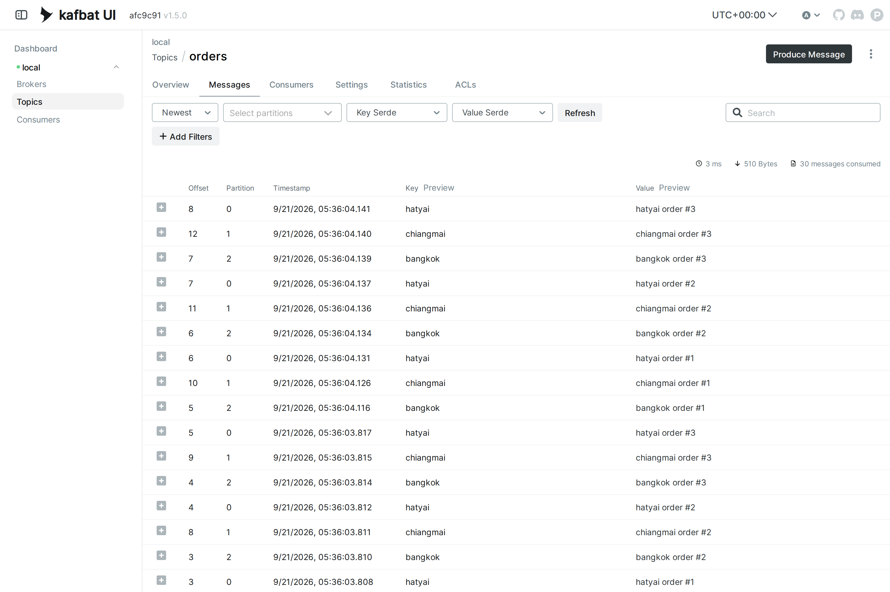

> 📝 **จุดที่ต้องดูในหน้านี้:**
> - แถบบนซ้ายคือ **โหมดอ่าน** : `Newest` (ใหม่สุดขึ้นก่อน — ค่าเริ่มต้น) · `Oldest` (เก่าสุดขึ้นก่อน) · ยังมี `Live Mode`, `From offset`, `From timestamp` ให้เลือกด้วย
> - มุมขวาบนของตารางรายงานผลการดึงข้อมูล : **`30 messages consumed`** · `510 Bytes` · เวลาที่ใช้ — ตัวเลข 30 นี้ต้องตรงกับ Overview
> - **ไล่ทีละแถวเทียบคอลัมน์ Key กับ Partition** : `hatyai → 0` · `chiangmai → 1` · `bangkok → 2` **ทุกแถวไม่มีข้อยกเว้น** ตรงกับใบเสร็จข้อ 6 และตรงกับ `hash_key.py` ข้อ 7.3
> - สังเกตว่า **คอลัมน์ Offset ไม่เรียงจากบนลงล่าง** (8, 12, 7, 7, 11, 6, …) — เพราะ UI เรียงตาม **timestamp** ข้ามทุกเล่ม ไม่ได้เรียงตาม offset · offset จะเรียงสวยก็ต่อเมื่อเราล็อกดูเล่มเดียว (ข้อ 9.4)
> - แถวของข้อ 5 จะมี **คอลัมน์ Key ว่างเปล่า** — นั่นคือ `key = null` (ไม่ใช่ string ว่าง) เลื่อนลงไปดูท้ายตารางจะเจอ
> - Timestamp เกาะกลุ่มกันเป็นชุด ๆ ห่างกันหลักมิลลิวินาที เพราะเราส่งรัวจาก loop

### 9.3 กดดูรายละเอียดรายข้อความ

กดปุ่ม **`+`** หน้าแถวไหนก็ได้ แถวจะกางออก :

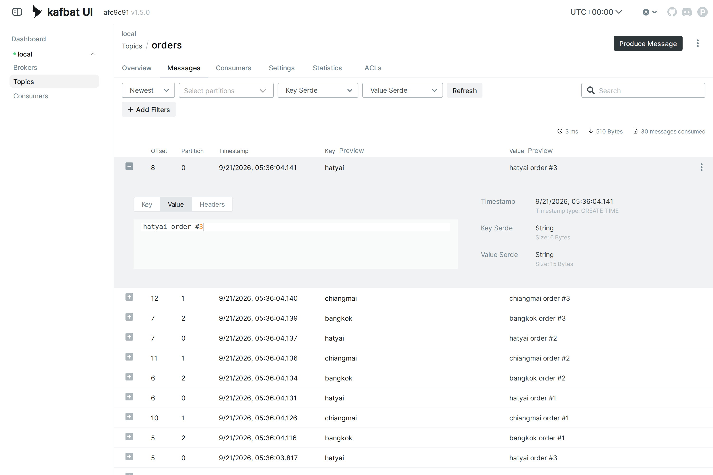

> 📝 **จุดที่ต้องดูในหน้านี้:**
> - ฝั่งซ้ายมีสามแท็บ **Key · Value · Headers** — กดสลับดูได้ทีละส่วน (ภาพนี้เปิดแท็บ Value อยู่ เห็นเนื้อความ `hatyai order #3`)
> - **Headers** ของเราว่าง `{}` เพราะยังไม่ได้ใช้ — header คือ metadata คู่ key–value ที่แนบไปกับข้อความได้ (เช่น trace id) แยกคนละเรื่องกับ message key ที่ใช้เลือก partition
> - ฝั่งขวาบอก **Timestamp** พร้อม **Timestamp type: CREATE_TIME** = เวลาที่ **ผู้ส่ง** ประทับ (อีกแบบคือ `LOG_APPEND_TIME` = เวลาที่ broker เขียนลง log)
> - **Key Serde: String · Size: 6 Bytes** = คำว่า `hatyai` 6 ตัวอักษร · **Value Serde: String · Size: 15 Bytes** = `hatyai order #3` 15 ตัวอักษร — ยืนยันว่าสิ่งที่วิ่งในสายจริง ๆ คือ **bytes** ส่วน "String" เป็นแค่แว่นที่ UI ใส่ให้เราอ่านออก (ถ้าข้อมูลเป็น JSON/Avro ก็เปลี่ยน Serde ที่ช่องด้านบนได้)
> - หัวแถวยังคงบอก **Offset 8 · Partition 0** — ที่อยู่เต็ม ๆ ของข้อความใบนี้คือ `(orders, 0, 8)`

### 9.4 กรองดูทีละ partition — พิสูจน์ว่าเป็น "สมุดแยกเล่ม" จริง

คลิกช่อง **Select partitions** จะได้รายการ checkbox ตามจำนวน partition ของ topic :

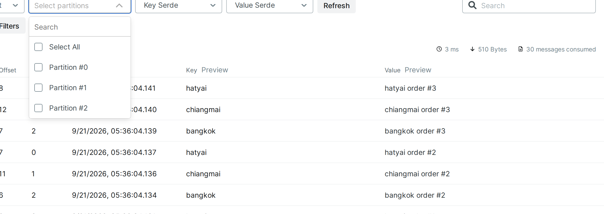

ติ๊กเฉพาะ **Partition #2** แล้วสลับโหมดซ้ายสุดเป็น **Oldest** จากนั้นกด **Refresh** :

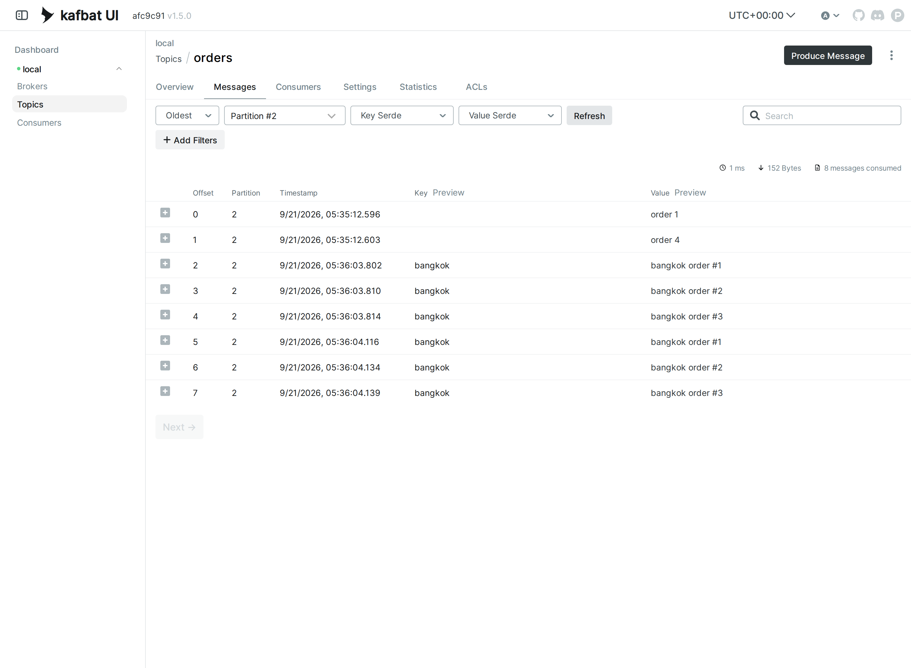

> 📝 **จุดที่ต้องดูในหน้านี้ (ภาพนี้คือหัวใจของทั้งแล็บ):**
> - มุมขวาบนเปลี่ยนเป็น **`8 messages consumed`** — จาก 30 เหลือ 8 ตรงกับ Message Count ของ p2 ใน Overview เป๊ะ
> - **คอลัมน์ Offset เรียง 0 → 7 เป็นระเบียบ** และคอลัมน์ Partition เป็น `2` ทุกแถว — นี่แหละ "หน้าตาของ log หนึ่งเล่ม" ที่วาดไว้ในข้อ 7.1
> - สองแถวแรก key ว่าง (`order 1`, `order 4` จากข้อ 5 ที่สุ่มตกเล่มนี้) ตามด้วย **bangkok 6 ใบเรียง #1 → #2 → #3 → #1 → #2 → #3**
> - **ไม่มี chiangmai หรือ hatyai โผล่มาแม้แต่ใบเดียว** — เพราะ hash พาไปคนละเล่มตั้งแต่ตอนส่งแล้ว
> - อยากพิสูจน์ต่อ : ติ๊ก **Partition #0** ดูบ้าง จะเจอแต่ `hatyai` + null · ติ๊ก **#1** จะเจอแต่ `chiangmai` + null
> - สังเกต URL ด้านบนเบราว์เซอร์เปลี่ยนเป็น `...?limit=100&mode=EARLIEST&partitions=2` — ทุกตัวกรองในหน้านี้ผูกกับ URL แชร์ลิงก์ให้เพื่อนเปิดหน้าเดียวกันได้

### 9.5 ค้นด้วย key — ตามรอยสาขาเดียวข้ามทั้ง topic

ล้างตัวกรอง partition ออกก่อน แล้วพิมพ์ `bangkok` ในช่อง **Search** มุมขวาบน กด Enter :

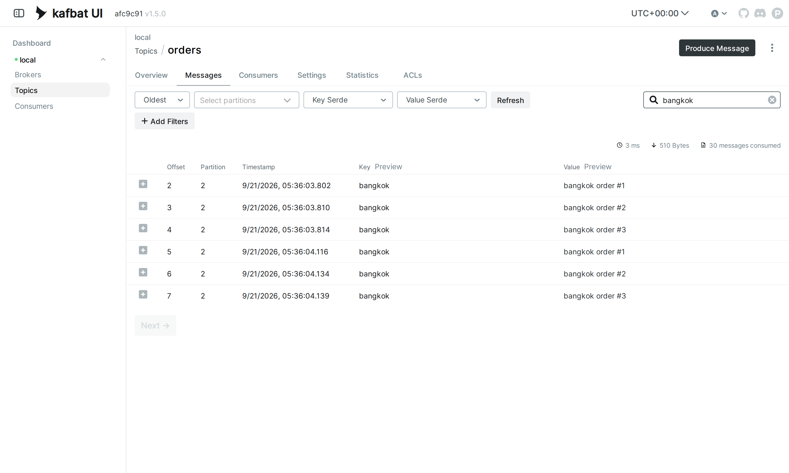

> 📝 **จุดที่ต้องดูในหน้านี้:**
> - ได้ **6 แถว** และคอลัมน์ Partition เป็น **2 ทั้ง 6 แถว** — นี่คือคำตอบของคำถาม "ออเดอร์สาขา bangkok กระจายไปทั่ว topic ไหม?" คำตอบคือ **ไม่ มันกองอยู่เล่มเดียว**
> - offset ไล่ 2 → 3 → 4 → 5 → 6 → 7 และเนื้อความเรียง `#1 #2 #3 #1 #2 #3` = สองรอบที่รันในข้อ 6 **ต่อคิวกันสวยงามไม่มีอะไรแทรก** ← นี่คือ "ลำดับการันตีต่อ key" ที่พูดถึงในข้อ 7.4 เห็นเป็นภาพ
> - ช่อง Search นี้ค้นแบบ **substring ทั้ง key และ value** (สังเกต URL ได้พารามิเตอร์ `stringFilter=bangkok`) — สะดวกสำหรับห้องเรียน แต่ของจริงมันดึงข้อความมากรองฝั่ง UI ไม่ใช่ index อย่าคาดหวังความเร็วกับ topic ใหญ่ ๆ
> - ถ้าอยากกรองแบบเงื่อนไขจริงจัง ปุ่ม **+ Add Filters** เปิดช่องเขียนโค้ดเงื่อนไขได้ เช่น `keyAsText == "bangkok" && partition == 2`

### 9.6 แท็บ Statistics — สแกนทั้ง topic แล้วสรุปสถิติ

คลิกแท็บ **Statistics** แล้วกดปุ่ม **Start Analysis** (UI จะอ่านทั้ง topic แล้วสรุปให้ ใช้เวลาไม่กี่วินาทีกับข้อมูลขนาดนี้) :

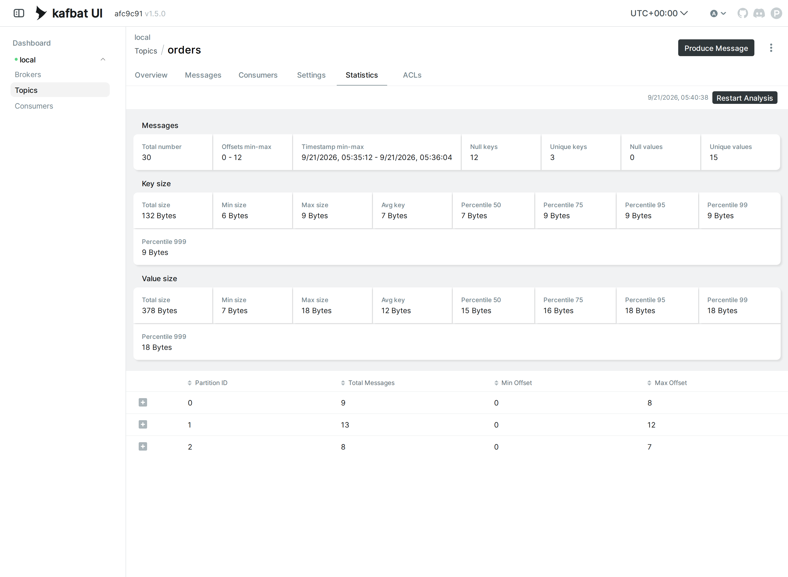

> 📝 **จุดที่ต้องดูในหน้านี้ (หน้านี้ตอบโจทย์แล็บนี้ตรง ๆ ที่สุด):**
> - **Total number: 30** — ยืนยันอีกทาง
> - **Null keys: 12** ← จำนวนข้อความจาก `producer_no_key.py` สองรอบพอดี (6 + 6)
> - **Unique keys: 3** ← `bangkok`, `chiangmai`, `hatyai` — จำนวน key ที่ไม่ซ้ำ **ไม่ใช่** จำนวนข้อความที่มี key (ซึ่งคือ 18)
> - **Unique values: 15** — เพราะ `order 1`–`order 6` ซ้ำสองรอบ และ `<สาขา> order #N` ก็ซ้ำสองรอบ เหลือเนื้อความไม่ซ้ำ 6 + 9 = 15
> - **Offsets min-max: 0 - 12** = offset ต่ำสุด/สูงสุดที่เจอข้ามทุกเล่ม (12 มาจาก p1 ซึ่งเป็นเล่มที่ยาวที่สุด)
> - กล่อง **Key size** : Min 6 (`hatyai`) · Max 9 (`chiangmai`) · Total 132 Bytes = 6×6 + 9×6 + 7×6 (bangkok 7 ตัวอักษร) ✔ คำนวณตามได้
> - **ตารางล่างสุด** สรุปรายเล่มอีกครั้งในรูป Min/Max Offset : p0 → 0-8 (9 ใบ) · p1 → 0-12 (13 ใบ) · p2 → 0-7 (8 ใบ)
> - **ใช้หน้านี้ตรวจ key skew ในงานจริง** : ถ้า Unique keys น้อยแต่ Total number มหาศาล แปลว่า key กระจุก → เสี่ยง hot partition ตามข้อ 7.5

### 9.7 แท็บ Consumers — ทำไมถึงว่างเปล่า

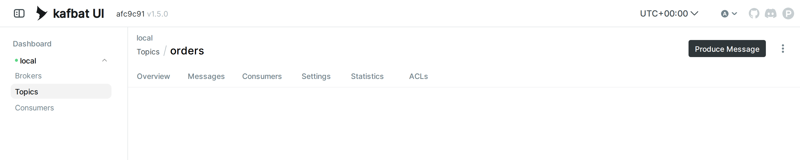

> 📝 **จุดที่ต้องดูในหน้านี้:** **ว่างเปล่าคือคำตอบที่ถูกต้อง** ไม่ใช่หน้าเสีย · `consumer_partitions.py` ของเราสร้าง `KafkaConsumer` โดย **ไม่ใส่ `group_id`** — consumer แบบไร้ group จะไม่ลงทะเบียนเป็น consumer group และ **ไม่จดตำแหน่งที่อ่านถึง (offset commit)** ไว้ที่ broker เลย · นี่คือเหตุผลที่รันซ้ำกี่รอบก็ได้ข้อความครบ 30 ใบเหมือนเดิมทุกครั้ง ·
> พอเข้า **LAB 3** เราจะใส่ `group_id` แล้วหน้านี้จะมีชีวิตขึ้นมาทันที — โชว์ว่ามีสมาชิกกี่ตัว ใครถือ partition ไหน และ **Lag** (ตามหลังปลายทางอยู่กี่ข้อความ) ซึ่งเป็นตัวเลขที่ทีม production จ้องมากที่สุดในชีวิตประจำวัน

### 9.8 ปุ่ม Produce Message — ส่งข้อความจากหน้าเว็บ

มุมขวาบนของหน้า topic มีปุ่ม **Produce Message** กดแล้วจะได้ฟอร์มนี้ (ยัง **อย่าเพิ่งกดส่ง** — เดี๋ยวได้ใช้จริงในทดลองเพิ่มเติม ข.) :

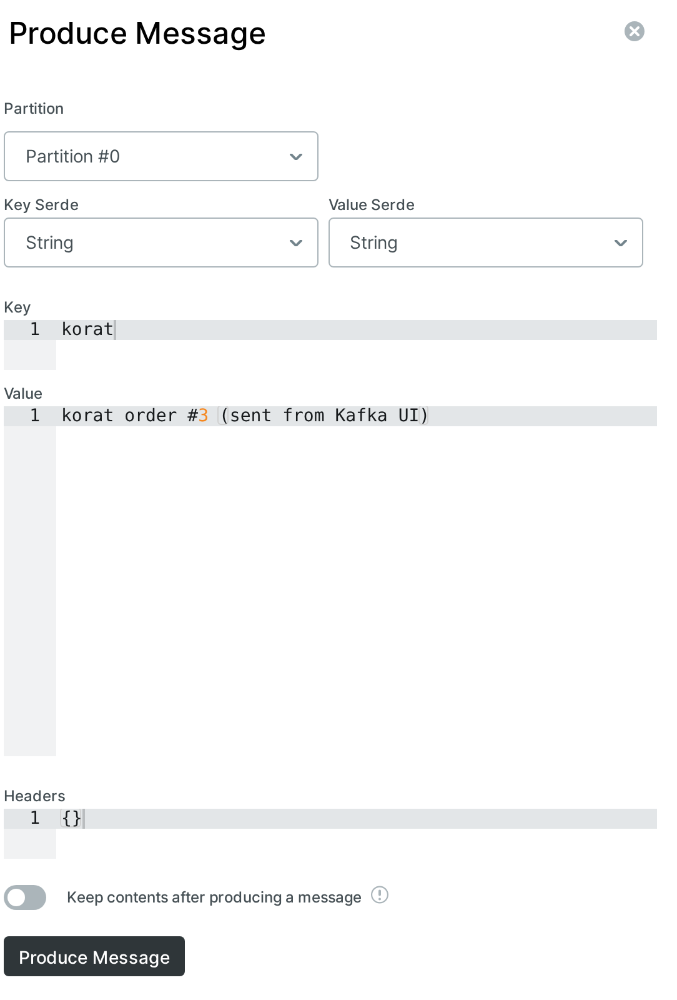

> 📝 **จุดที่ต้องดูในฟอร์มนี้ — และเป็นกับดักที่ต้องรู้:**
> - ช่องบนสุดคือ **Partition** และค่าเริ่มต้นคือ **`Partition #0`** — ไม่ใช่ "อัตโนมัติ"
> - กดเปิด dropdown ดูจะเห็นแค่ `Partition #0` / `#1` / `#2` — **ไม่มีตัวเลือก "ให้ hash เลือกให้"**
> - แปลว่าทุกข้อความที่ส่งจากหน้าเว็บนี้ **เข้ากฎชั้นที่ 1** ของข้อ 7.2 คือระบุ partition ตรง ๆ → **key ที่เราพิมพ์จะถูกมองข้ามในการเลือกเล่ม** (แต่ยังติดไปกับข้อความในฐานะข้อมูล)
> - ช่อง **Key Serde / Value Serde** ตั้งเป็น `String` = พิมพ์อะไรลงไปก็ถูกแปลงเป็น bytes ตรงตัว
> - ทดลองเพิ่มเติม ข. จะใช้กับดักนี้เป็นบทเรียน

#### ทดลองเสร็จแล้ว — ลบ tunnel ทุกครั้ง

- แบบ VS Code : แท็บ **PORTS** → คลิกขวาที่ `8080` → **Stop Forwarding Port**
- แบบ `ssh -L` : พิมพ์ `exit` (หรือ `Ctrl+D`) ใน session นั้น — tunnel ปิดทันที

> ยังไม่ต้องปิดตอนนี้ก็ได้ — ทดลองเพิ่มเติมทั้ง 4 ข้อยังต้องกลับมาดู UI อีก แต่**จบแล็บแล้วต้องปิดเสมอ**

---

## 10. เจาะอ่าน partition เดียว — console consumer

ในเมื่อแต่ละ partition คือ log แยกเล่ม — Kafka ก็ยอมให้เรา **เปิดอ่านเฉพาะเล่มเดียว** ได้ตรง ๆ (แบบเดียวกับที่ทำผ่านหน้าเว็บในข้อ 9.4 แต่คราวนี้ทำจาก CLI) ลองเจาะ p2 (เล่มของ bangkok):

```bash
docker exec kafka /opt/kafka/bin/kafka-console-consumer.sh --bootstrap-server localhost:9092 \
  --topic orders --partition 2 --from-beginning --max-messages 8 \
  --property print.key=true
```

> 📝 **คำอธิบาย:** `kafka-console-consumer.sh` คือ consumer สำเร็จรูปในกล่อง `kafka` ไว้แอบดูข้อมูลโดยไม่ต้องเขียนโค้ด · `--partition 2` = อ่านเฉพาะเล่ม p2 เล่มเดียว ไม่แตะเล่มอื่น · `--from-beginning` = เริ่มจาก offset 0 (ค่าปกติจะรอเฉพาะของใหม่) · `--max-messages 8` = อ่านครบ 8 ใบแล้วจบตัวเอง ไม่ต้องกด Ctrl+C — เลข 8 มาจาก **Message Count ของ p2 ใน UI ข้อ 9.1** (ของแต่ละคนอาจไม่ใช่ 8 — ดูตัวเลขของตัวเอง ถ้าใส่เกินจำนวนที่มี คำสั่งจะค้างรอข้อความใหม่จนกว่าจะกด Ctrl+C) · `--property print.key=true` = พิมพ์ key นำหน้าเนื้อความ (ไม่มี key จะขึ้น `null`)

✅ **Expected output** — เห็น **เฉพาะของที่อยู่ใน p2** : bangkok ครบ 6 ใบเรียงลำดับ + ของไม่มี key ที่บังเอิญตกเล่มนี้ · ไม่มี chiangmai / hatyai ปนมาแม้แต่ใบเดียว (แถว `null` ของแต่ละคนจะไม่ตรงกับเอกสารนี้):

```
null	order 1
null	order 4
bangkok	bangkok order #1
bangkok	bangkok order #2
bangkok	bangkok order #3
bangkok	bangkok order #1
bangkok	bangkok order #2
bangkok	bangkok order #3
Processed a total of 8 messages
```

อยากเห็นที่อยู่เต็ม ๆ เหมือนใน UI ก็เติม property อีกสองตัว :

```bash
docker exec kafka /opt/kafka/bin/kafka-console-consumer.sh --bootstrap-server localhost:9092 \
  --topic orders --partition 2 --from-beginning --max-messages 8 \
  --property print.key=true --property print.offset=true --property print.partition=true
```

✅ **Expected output** — คราวนี้ครบทั้ง (partition, offset, key, value) เทียบกับภาพในข้อ 9.4 ได้บรรทัดต่อบรรทัด:

```
Partition:2	Offset:0	null	order 1
Partition:2	Offset:1	null	order 4
Partition:2	Offset:2	bangkok	bangkok order #1
Partition:2	Offset:3	bangkok	bangkok order #2
Partition:2	Offset:4	bangkok	bangkok order #3
Partition:2	Offset:5	bangkok	bangkok order #1
Partition:2	Offset:6	bangkok	bangkok order #2
Partition:2	Offset:7	bangkok	bangkok order #3
Processed a total of 8 messages
```

> **สังเกต :** ลำดับที่เห็นคือลำดับใน log ของ p2 เป๊ะ ๆ (offset 0 → 7) — `bangkok order #1 → #2 → #3` ไม่มีวันสลับ · บรรทัดปิดท้าย `Processed a total of 8 messages` คือ console consumer รายงานว่าครบโควตา `--max-messages` แล้ว · **CLI กับ UI ให้ผลตรงกันเป๊ะ** เพราะทั้งคู่อ่าน log เล่มเดียวกัน — ใช้อันไหนก็ได้ตามถนัด

---

## ทดลองเพิ่มเติม

### ก. key หน้าใหม่จะตกเล่มไหน? — ทำนายก่อน แล้วค่อยส่ง `korat`

คราวนี้เรามีเครื่องมือทำนายแล้ว — ย้อนดูผล `hash_key.py` จากข้อ 7.3 :

```
korat      hash=1798336970   %3 -> p2   %4 -> p2
```

**ทำนายไว้ก่อน : `korat` ต้องลง p2** (เล่มเดียวกับ bangkok — คนละ key แต่เศษหารตรงกันได้ ไม่ใช่เรื่องแปลก) · ทีนี้ส่งของจริงด้วย console producer โดยไม่ต้องเขียนโค้ดสักบรรทัด :

```bash
docker exec -it kafka /opt/kafka/bin/kafka-console-producer.sh --bootstrap-server localhost:9092 \
  --topic orders --property parse.key=true --property key.separator=:
```

> 📝 **คำอธิบาย:** คราวนี้ต้องใส่ `-it` เพราะจะพิมพ์สด ๆ · `parse.key=true` สั่งให้ตีความบรรทัดที่พิมพ์เป็น `key<ตัวคั่น>value` · `key.separator=:` ใช้ `:` เป็นตัวคั่น — ทุกอย่างหน้า `:` แรกคือ key ที่เหลือคือเนื้อความ · **ไม่ได้ระบุ `--partition`** จึงเข้ากฎชั้นที่ 2 ของข้อ 7.2 คือให้ hash ตัดสิน · จะได้ prompt `>` มา พิมพ์สองบรรทัดนี้ (Enter ปิดท้ายทีละบรรทัด) แล้วกด **Ctrl+C** เพื่อออก:

```
>korat:korat order #1
>korat:korat order #2
>
```

แล้ว `korat` ลงเล่มไหนจริง? — อ่านทั้ง topic พร้อมให้พิมพ์ partition กำกับ แล้ว grep เอา :

```bash
docker exec kafka /opt/kafka/bin/kafka-console-consumer.sh --bootstrap-server localhost:9092 \
  --topic orders --from-beginning --max-messages 32 \
  --property print.key=true --property print.partition=true | grep korat
```

> 📝 **คำอธิบาย:** ตอนนี้ topic มี 30 + 2 = **32 ข้อความ** จึงใช้ `--max-messages 32` ให้จบเอง · `print.partition=true` เติมคอลัมน์ `Partition:N` นำหน้า · `| grep korat` กรองเฉพาะแถวของเรา (บรรทัดสรุป `Processed ...` พิมพ์ทาง stderr เลยรอด grep มาด้วย)

✅ **Expected output** — สองใบลง **p2 ตามที่ทำนายไว้เป๊ะ**:

```
Processed a total of 32 messages
Partition:2	korat	korat order #1
Partition:2	korat	korat order #2
```

> **ย้ำบทเรียน :** เราทำนายถูกเพราะ **มันเป็นคณิตศาสตร์ ไม่ใช่การจับฉลาก** · จากวินาทีนี้ `korat` จะลง p2 **ตลอดไป** — ตราบใดที่ topic ยังมี 3 partitions (คำว่า "ตราบใดที่" นี่แหละคือประเด็นของทดลอง ค.)

### ข. ส่งจาก Kafka UI — ทำไม `korat` ใบนี้ถึงไม่ไป p2?

กลับไปที่หน้าเว็บ กดปุ่ม **Produce Message** (ฟอร์มเดียวกับข้อ 9.8) แล้วกรอก :

| ช่อง | ค่าที่กรอก |
|---|---|
| Partition | **ปล่อยไว้ตามค่าเริ่มต้น = `Partition #0`** |
| Key | `korat` |
| Value | `korat order #3 (sent from Kafka UI)` |

แล้วกดปุ่ม **Produce Message** ด้านล่างฟอร์ม · จากนั้นพิมพ์ `korat` ในช่อง **Search** ของแท็บ Messages :

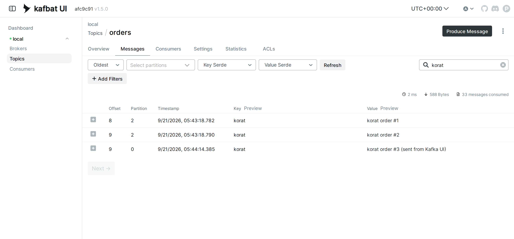

✅ **Expected output** — สามแถว แต่ **ไม่ได้อยู่เล่มเดียวกัน**:

| Offset | Partition | Key | Value |
|---|---|---|---|
| 8 | **2** | korat | korat order #1 |
| 9 | **2** | korat | korat order #2 |
| 9 | **0** | korat | korat order #3 (sent from Kafka UI) |

> 📝 **เกิดอะไรขึ้น:** key เป็น `korat` เหมือนกันทั้งสามใบ แต่ใบที่สามไป **p0** เพราะฟอร์มของ UI **ระบุ partition มาให้แล้ว** (`Partition #0`) → เข้ากฎ **ชั้นที่ 1** ของข้อ 7.2 ซึ่งชนะ hash ของ key เสมอ ·
> **นี่คือบั๊กคลาสสิกในงานจริง** : โค้ดที่เผลอส่ง `partition=` ไปด้วย ทำให้การรับประกันลำดับต่อ key พังเงียบ ๆ โดยไม่มี error สักบรรทัด — ข้อความยังเข้า Kafka ได้ปกติ key ยังติดไปครบ แต่ `korat` แตกเป็นสองเล่ม ลำดับข้าม `#2 → #3` ไม่การันตีอีกต่อไป ·
> **อยากให้มันไป p2 ต้องทำยังไง?** ในฟอร์มนี้ก็แค่เลือก `Partition #2` เอง — แต่นั่นคือการที่ *เรา* คำนวณ hash แทน Kafka ซึ่งจะพังทันทีที่จำนวน partition เปลี่ยน · ในโค้ดจริงวิธีที่ถูกคือ **อย่าใส่ `partition=` เลย** แล้วปล่อยให้ hash ทำงาน
>
> ตอนนี้ topic มี **33 ข้อความ** (p0 = 10 · p1 = 13 · p2 = 10)

### ค. เพิ่มจำนวน partition แล้วเกิดอะไรขึ้น — บทเรียนที่แพงที่สุดของ Kafka

จำคอลัมน์ `%4` ใน `hash_key.py` ได้ไหม — ถึงเวลาใช้แล้ว **ทำนายก่อนอีกครั้ง** :

```
bangkok    %3 -> p2   %4 -> p1
chiangmai  %3 -> p1   %4 -> p2
hatyai     %3 -> p0   %4 -> p3
```

**ทำนายไว้ : ถ้าเพิ่ม partition เป็น 4 แล้วส่งใหม่ ทั้งสามสาขาจะย้ายเล่มกันหมด ไม่มีใครอยู่ที่เดิมเลย**

เพิ่ม partition ของ topic ที่มีอยู่แล้ว :

```bash
docker exec kafka /opt/kafka/bin/kafka-topics.sh --bootstrap-server localhost:9092 \
  --alter --topic orders --partitions 4
```

> 📝 **คำอธิบาย:** `--alter --partitions 4` = ขยายจาก 3 เป็น 4 เล่ม · **เพิ่มได้อย่างเดียว ลดไม่ได้** (Kafka ไม่มีคำสั่งลดจำนวน partition เพราะจะต้องตัดสินใจว่าข้อมูลในเล่มที่หายไปจะไปไหน) · คำสั่งนี้ **ไม่ย้ายข้อมูลเก่า** แม้แต่ใบเดียว — มันแค่สร้างเล่มที่ 4 ว่าง ๆ เพิ่มเข้ามา · สำเร็จแล้วจะ **ไม่พิมพ์อะไรเลย** (เงียบ = สำเร็จ)

ตรวจด้วย `--describe` :

```bash
docker exec kafka /opt/kafka/bin/kafka-topics.sh --bootstrap-server localhost:9092 \
  --describe --topic orders
```

✅ **Expected output** — `PartitionCount: 4` และมีแถว Partition 3 โผล่มาใหม่:

```
Topic: orders	TopicId: h0BBYWQDSH-wWbc7eLmMNA	PartitionCount: 4	ReplicationFactor: 1	Configs: min.insync.replicas=1,segment.bytes=1073741824
	Topic: orders	Partition: 0	Leader: 1	Replicas: 1	Isr: 1	Elr: 	LastKnownElr:
	Topic: orders	Partition: 1	Leader: 1	Replicas: 1	Isr: 1	Elr: 	LastKnownElr:
	Topic: orders	Partition: 2	Leader: 1	Replicas: 1	Isr: 1	Elr: 	LastKnownElr:
	Topic: orders	Partition: 3	Leader: 1	Replicas: 1	Isr: 1	Elr: 	LastKnownElr:
```

ทีนี้รัน producer ตัวเดิม **ที่ไม่ได้แก้โค้ดสักตัวอักษร** อีกรอบ :

```bash
python producer_with_key.py
```

✅ **Expected output** — mapping **เปลี่ยนยกแผงตรงตามคอลัมน์ `%4` ที่ทำนายไว้** : `bangkok → 1` · `chiangmai → 2` · `hatyai → 3`:

```
 [x] key=bangkok   -> partition=1 offset=13  ('bangkok order #1')
 [x] key=chiangmai -> partition=2 offset=10  ('chiangmai order #1')
 [x] key=hatyai    -> partition=3 offset=0  ('hatyai order #1')
 [x] key=bangkok   -> partition=1 offset=14  ('bangkok order #2')
 [x] key=chiangmai -> partition=2 offset=11  ('chiangmai order #2')
 [x] key=hatyai    -> partition=3 offset=1  ('hatyai order #2')
 [x] key=bangkok   -> partition=1 offset=15  ('bangkok order #3')
 [x] key=chiangmai -> partition=2 offset=12  ('chiangmai order #3')
 [x] key=hatyai    -> partition=3 offset=2  ('hatyai order #3')
```

> 📝 **สังเกต `hatyai` เริ่มที่ offset 0** — เพราะ p3 เป็นเล่มที่เพิ่งเกิด ยังไม่เคยมีใครเขียนลงไป

ไปดูผลกระทบใน UI — ค้น `bangkok` อีกครั้ง :

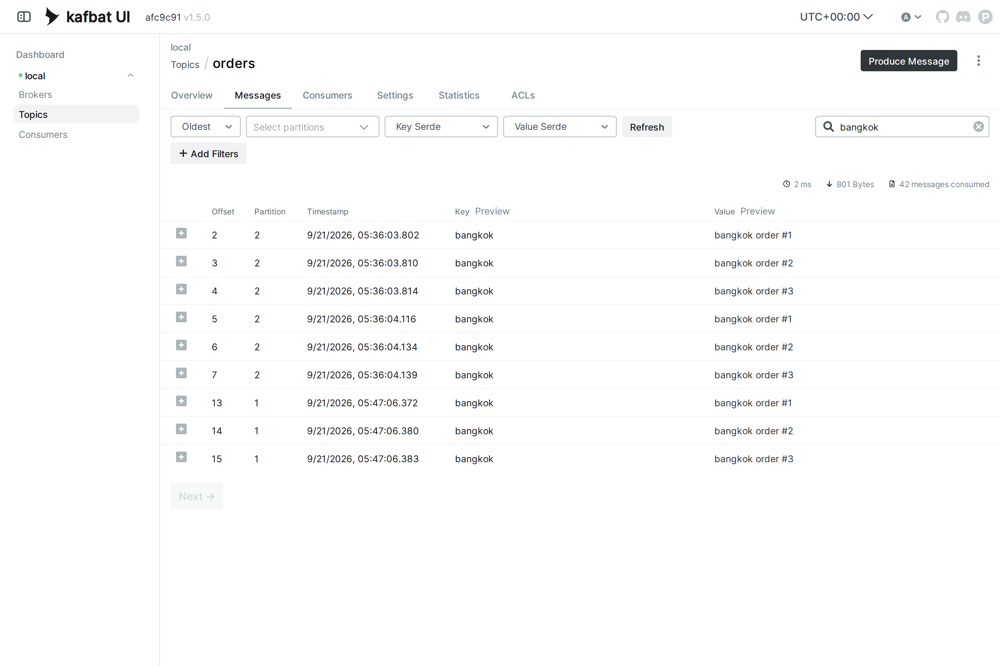

✅ **Expected output** — **key เดียว แต่แตกเป็นสองเล่ม**:

| Offset | Partition | Value | มาจาก |
|---|---|---|---|
| 2 – 7 | **2** | bangkok order #1–#3 (สองรอบ) | ตอน topic มี 3 partitions |
| 13 – 15 | **1** | bangkok order #1–#3 | ตอน topic มี 4 partitions |

> **บทเรียนของข้อนี้ (สำคัญที่สุดในทดลองเพิ่มเติม) :**
> - สูตรคือ `hash % จำนวน partition` — **เปลี่ยนตัวหาร = เปลี่ยนคำตอบแทบทุก key** (ไม่ใช่แค่ key ใหม่ ๆ แต่ key เดิมทั้งหมดด้วย)
> - ข้อความเก่า **ไม่ถูกย้ายตาม** — Kafka ไม่มีการ rebalance ข้อมูลข้าม partition
> - ผลลัพธ์คือ **การรับประกันลำดับต่อ key ขาดตอนตรงรอยต่อ** : ใครอ่าน p1 จะเห็นออเดอร์ bangkok ชุดใหม่โดยไม่รู้ว่ามีชุดเก่าค้างอยู่ใน p2 · ถ้านี่คือระบบตัดยอดเงินจริง ๆ ก็คือคิดเงินผิดลำดับได้เลย
> - นี่คือเหตุผลที่ทีมจริง ๆ **วางแผนจำนวน partition ให้เผื่อโตตั้งแต่วันแรก** และถือว่าการเพิ่ม partition ของ topic ที่ใช้ key เป็น **operation ที่ต้องวางแผน** (เช่น หยุด producer → ระบายของเก่าให้หมด → ค่อยขยาย) ไม่ใช่คำสั่งที่เคาะเล่น ๆ ตอนบ่ายวันศุกร์
> - ทางเลือกที่เจ็บน้อยกว่าคือ **สร้าง topic ใหม่ที่มีจำนวน partition ที่ต้องการ แล้วย้าย producer/consumer ไปทีละฝั่ง**
>
> ตอนนี้ topic มี **42 ข้อความ** — ตรวจได้ที่หน้า Overview ซึ่งตอนนี้แสดง 4 แถว:
>
> 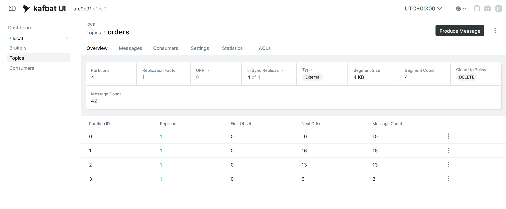
>
> p0 = 10 · p1 = 16 · p2 = 13 · p3 = 3 รวม **42** ✔ และสังเกตว่า **p3 มี First Offset = 0 / Next Offset = 3** คือเล่มใหม่ที่เพิ่งเริ่มนับ

### ง. หัดอ่าน error — `--describe` topic ที่ไม่มีอยู่

ลองสะกดชื่อผิดดูซักครั้ง จะได้รู้จักหน้าตา error ของฝั่ง Java :

```bash
docker exec kafka /opt/kafka/bin/kafka-topics.sh --bootstrap-server localhost:9092 \
  --describe --topic ordersss
```

✅ **Expected output** — ล้มพร้อม stack trace ของ Java (เวลา · เลขบรรทัดของแต่ละคนอาจไม่ตรงกับเอกสารนี้):

```
Error while executing topic command : Topic 'ordersss' does not exist as expected
[2026-09-21 05:46:55,929] ERROR java.lang.IllegalArgumentException: Topic 'ordersss' does not exist as expected
	at org.apache.kafka.tools.TopicCommand.ensureTopicExists(TopicCommand.java:211)
	at org.apache.kafka.tools.TopicCommand$TopicService.describeTopic(TopicCommand.java:571)
	at org.apache.kafka.tools.TopicCommand.execute(TopicCommand.java:109)
	at org.apache.kafka.tools.TopicCommand.mainNoExit(TopicCommand.java:88)
	at org.apache.kafka.tools.TopicCommand.main(TopicCommand.java:83)
 (org.apache.kafka.tools.TopicCommand)
```

> 📝 **คำอธิบาย:** วิธีอ่านกลับหัวกับ Python — traceback ของ Java ให้อ่าน **บรรทัดบนสุด** ก่อน : `Topic 'ordersss' does not exist as expected` ชัดเจนว่าสะกดผิด ส่วนบรรทัด `at org.apache...` ข้างล่างคือเส้นทางในโค้ดของเครื่องมือเอง ไม่ต้องตามไป · เกร็ดที่ควรรู้ : `--describe` แค่ฟ้องแล้วจบ แต่ **producer** ที่เผลอส่งไป topic ชื่อผิดอาจไม่ฟ้องเลย — ถ้า broker เปิด auto-create (ค่า default ของ Kafka) มันจะ **สร้าง topic ใหม่ให้เงียบ ๆ** แบบ 1 partition แล้ว typo ของเราก็กลายเป็น topic ผีทันที · แถมพอเป็น topic 1 partition ทุก key ก็ตกเล่มเดียวกันหมด — mapping ที่อุตส่าห์ออกแบบไว้ไม่มีความหมายเลย · เช็กเป็นระยะด้วย `kafka-topics.sh --list` ว่าไม่มีชื่อแปลกปลอมโผล่มา

---

## แก้ปัญหาที่พบบ่อย

| อาการ | สาเหตุ | วิธีแก้ |
|---|---|---|
| `TopicExistsException: Topic 'orders' already exists.` ตอน `--create` | เคยสร้าง `orders` ไปแล้ว (หรือเผลอรันข้อ 4 ซ้ำ) | ใช้ topic เดิมต่อได้เลย — ถ้าอยากเริ่มจากศูนย์จริง ๆ : `--delete --topic orders` แล้วค่อย `--create` ใหม่ |
| `UnknownTopicOrPartitionError` | ชื่อ topic สะกดผิด · topic ยังไม่ถูกสร้าง · หรือชี้ `--partition` เกินช่วง (เรามีแค่ 0–2) | เช็กของจริงด้วย `--list` / `--describe` ก่อน แล้วแก้ชื่อ/เลขให้ตรง |
| `ModuleNotFoundError: No module named 'kafka'` | ลืม activate venv ใน terminal นั้น (หรือตั้งชื่อไฟล์ตัวเองว่า `kafka.py` จนบังไลบรารี) | `source ~/venv-kafka/bin/activate` ให้ prompt ขึ้น `(venv-kafka)` · อย่ามีไฟล์ชื่อ `kafka.py` ในโฟลเดอร์ |
| `kafka.errors.NoBrokersAvailable` | broker ยังบูตไม่เสร็จ หรือยังไม่ได้ `docker run` เลย | `docker logs kafka --tail 5` รอบรรทัด `Kafka Server started` · ไม่มี container ให้ย้อนข้อ 2 |
| เปิด `http://localhost:8080` ไม่ขึ้น / UI บอก cluster offline | ยังไม่ได้ forward port 8080 · tunnel ถูกปิด · หรือเปิด `kafka-ui` ก่อน broker พร้อม | forward `8080` ใหม่ตามข้อ 9 · ถ้า cluster offline ให้ `docker restart kafka-ui` หลัง broker พร้อมแล้ว |
| console consumer ค้างไม่ยอมจบ | ใส่ `--max-messages` มากกว่าจำนวนข้อความที่มีจริงในเล่มนั้น | กด **Ctrl+C** ออก แล้วดู Message Count รายเล่มจาก Overview (ข้อ 9.1) ก่อนใส่เลขใหม่ |
| mapping key→partition ของเราไม่ตรงกับเอกสาร | จำนวน partition ของ topic ไม่ใช่ 3 (เช่นเผลอให้ auto-create ไปก่อน จึงได้ 1 partition) | `--describe --topic orders` ดู `PartitionCount` · ถ้าไม่ใช่ 3 ให้ `--delete` แล้ว `--create --partitions 3` ใหม่ |
| ใส่ key แล้วแต่ข้อความยังกระจายมั่ว | โค้ด (หรือฟอร์ม UI) ระบุ `partition=` ไปด้วย → เข้ากฎชั้น 1 ที่ชนะ key | เอา argument `partition=` ออก ให้เหลือแค่ `key=` — ดูทดลองเพิ่มเติม ข. |

---

## เก็บกวาด (Cleanup)

```bash
docker rm -f kafka kafka-ui
docker ps -a
```

> 📝 **คำอธิบาย:** ลบทั้ง broker และหน้าเว็บ UI ในคำสั่งเดียว (`-f` = หยุดแล้วลบรวดเดียวแม้กำลังรัน) · ข้อความทั้ง 42 ใบใน topic `orders` หายไปพร้อม container — ไม่เป็นไร แล็บหน้าเริ่มสร้างใหม่ · แล้ว `docker ps -a` ตรวจซ้ำว่าไม่เหลือ container ค้าง (`-a` เอาตัวที่หยุดแล้วด้วย) · ที่ **ไม่ต้องลบ** : image `apache/kafka:4.1.0` กับ `kafbat/kafka-ui:latest` (แล็บถัดไปไม่ต้อง pull ใหม่) และ venv `~/venv-kafka` (ใช้ต่อได้ทุกแล็บของชุดนี้) · ถ้ายังเปิด tunnel ของ UI ค้างอยู่ อย่าลืมปิดตามท้ายข้อ 9 ด้วย

✅ **Expected output** — Docker พิมพ์ชื่อที่ลบสำเร็จทั้งสองตัว แล้วตารางเหลือแค่หัว ไม่มีแถวข้อมูล:

```
kafka
kafka-ui
CONTAINER ID   IMAGE     COMMAND   CREATED   STATUS    PORTS     NAMES
```

---

## สรุปคำสั่งของแล็บนี้

| คำสั่ง | ความหมาย |
|---|---|
| `kafka-topics.sh --create --topic orders --partitions 3 --replication-factor 1` | สร้าง topic เอง กำหนดจำนวน partition เอง (ผ่าน `docker exec kafka ...` เสมอ) |
| `kafka-topics.sh --describe --topic orders` | ดูตาราง partition : PartitionCount · Leader · Replicas · Isr |
| `kafka-topics.sh --alter --topic orders --partitions 4` | เพิ่มจำนวน partition (เพิ่มได้ ลดไม่ได้ · mapping ของ key เปลี่ยนยกแผง) |
| `kafka-topics.sh --list` | ดูรายชื่อ topic ทั้งหมด — ใช้จับ topic ผีที่เกิดจาก typo |
| `python producer_no_key.py` | ส่ง 6 ข้อความไม่มี key — partition คุมไม่ได้ เปลี่ยนทุกรอบ |
| `python producer_with_key.py` | ส่ง 9 ข้อความมี key — key เดิมลง partition เดิมเสมอ |
| `python hash_key.py` | คำนวณ `murmur2(key) % N` เอง — ทำนาย partition ล่วงหน้าได้ |
| `python consumer_partitions.py` | อ่านทั้ง topic ตั้งแต่ต้น พิมพ์ (partition · offset · key) ของทุกข้อความ — รันซ้ำได้เรื่อย ๆ |
| `kafka-console-consumer.sh --partition 2 --from-beginning --max-messages N --property print.key=true` | เจาะอ่าน log ของ partition เดียว |
| `... --property print.offset=true --property print.partition=true` | ให้ console consumer พิมพ์ที่อยู่เต็ม (partition · offset) ด้วย |
| `kafka-console-producer.sh --property parse.key=true --property key.separator=:` | ส่งข้อความมี key จากคีย์บอร์ด (พิมพ์ `key:value`) |
| `docker rm -f kafka kafka-ui` | ลบ broker + UI เมื่อจบแล็บ |

> **จำหลักเดียวให้ขึ้นใจ :** **ระบุ partition ชนะทุกอย่าง → ไม่ระบุแต่มี key ใช้ `murmur2(key) % N` → ไม่มีทั้งคู่ producer เลือกเอง** ·
> key เดิม + จำนวน partition เท่าเดิม = เล่มเดิมเสมอ → **ลำดับการันตีเฉพาะภายใน partition** — และทุกอย่างถูกจดต่อท้าย log อ่านกี่รอบก็ไม่หาย

## ✅ เช็กลิสต์ก่อนจบแล็บ

- [ ] `docker --version` และ `docker compose version` ขึ้นเลขเวอร์ชันทั้งคู่ ไม่มี error
- [ ] `docker logs kafka --tail 5` เห็น `Kafka Server started` ก่อนเริ่มทุกอย่าง · `docker ps` เห็น `kafka` และ `kafka-ui` Up ทั้งคู่
- [ ] สร้าง topic `orders` สำเร็จ (`Created topic orders.`) และ `--describe` เห็น `PartitionCount: 3` · Leader = 1 ทุกแถว
- [ ] รัน `producer_no_key.py` 2 รอบ — partition สองรอบ **ไม่เหมือนกัน** แต่ offset วิ่งต่อจากเดิม ไม่รีเซ็ต
- [ ] รัน `producer_with_key.py` 2 รอบ — `bangkok→2` · `chiangmai→1` · `hatyai→0` **เหมือนกันทั้ง 18 ใบ**
- [ ] อธิบาย **กฎ 3 ชั้น** ได้ : ระบุ partition > hash(key) > producer เลือกเอง
- [ ] รัน `hash_key.py` แล้ว **เลข `%3` ตรงกับ partition จริง** ของทั้งสามสาขา
- [ ] `consumer_partitions.py` เห็นครบ 30 ข้อความ จัดกลุ่มตาม partition และ offset เรียงในเล่ม · กด Ctrl+C แล้วขึ้น `Interrupted`
- [ ] เข้าใจและอธิบายได้ : ทำไมออเดอร์ `bangkok` เรียง #1→#3 เสมอ แต่ `order 1`–`order 6` สลับกันได้
- [ ] Kafka UI ครบ 8 หน้าจอ : Overview (Partitions 3 · Message Count 30 · Next Offset อ่านเป็น) · Messages · กางรายละเอียดข้อความ · กรอง Partition #2 แล้วได้ 8 ใบ · Search `bangkok` แล้ว Partition เป็น 2 ทุกแถว · Statistics (Null keys 12 · Unique keys 3) · Consumers ว่าง · ฟอร์ม Produce Message
- [ ] console consumer `--partition 2` เห็นเฉพาะ bangkok + `null` — ไม่มีสาขาอื่นปนแม้แต่ใบเดียว และตรงกับที่เห็นใน UI
- [ ] **ทำนายก่อนส่ง** ว่า `korat` จะลง p2 แล้วส่งจริงผ่าน console producer ได้ผลตรงตามทำนาย
- [ ] ส่ง `korat` จาก Kafka UI แล้ว**อธิบายได้ว่าทำไมไปลง p0** (ฟอร์มระบุ partition = กฎชั้น 1 ชนะ key)
- [ ] `--alter --partitions 4` แล้วรัน producer เดิมซ้ำ — mapping เปลี่ยนเป็น `bangkok→1` · `chiangmai→2` · `hatyai→3` ตรงกับคอลัมน์ `%4` และเห็นใน UI ว่า `bangkok` แตกอยู่สองเล่ม
- [ ] อ่าน error ของ `--describe` topic ที่สะกดผิดเป็น และรู้ว่า typo ฝั่ง producer อันตรายกว่าเพราะ auto-create
- [ ] ปิด tunnel ของ UI แล้ว · `docker rm -f kafka kafka-ui` แล้ว `docker ps -a` เหลือแค่หัวตาราง

*ผลลัพธ์และภาพหน้าจอทั้งหมดในเอกสารนี้มาจากการรันจริงในเครื่องเรียน `tuchsanai/devtools:2569_1` (Kafka 4.1.0 · kafbat/kafka-ui v1.5.0 · kafka-python 3.0.10) เมื่อ 21 ก.ย. 2026*
