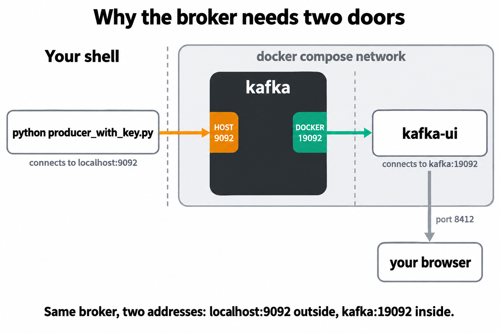
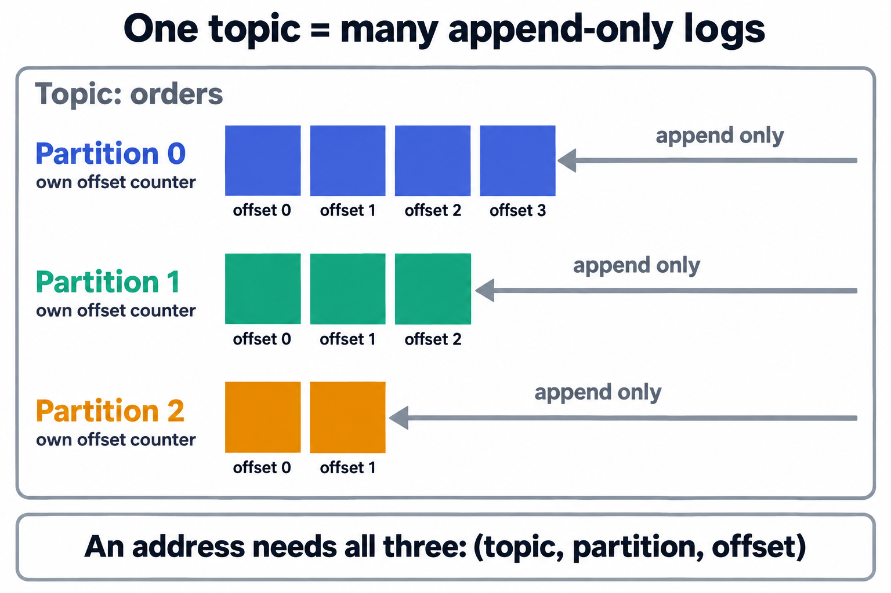
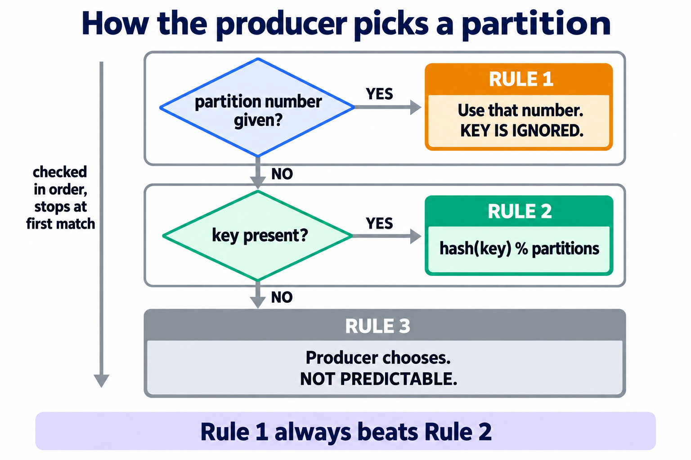
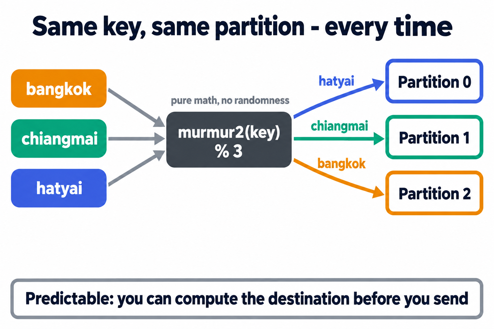
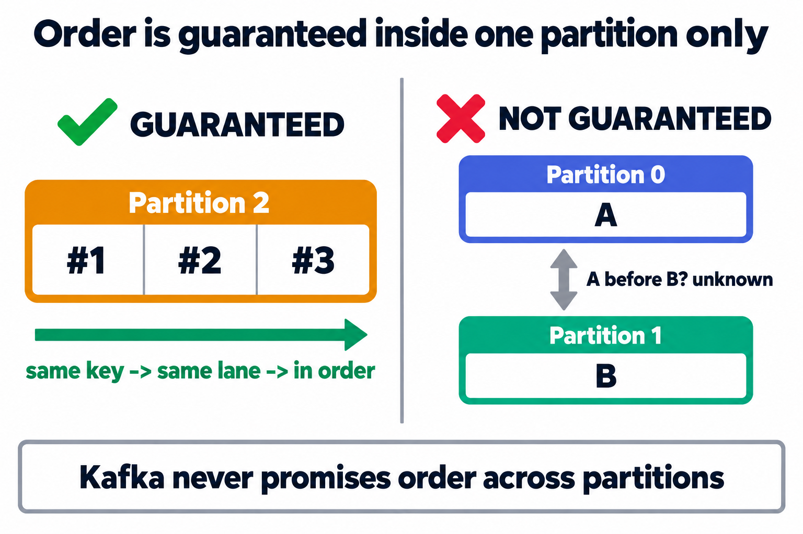
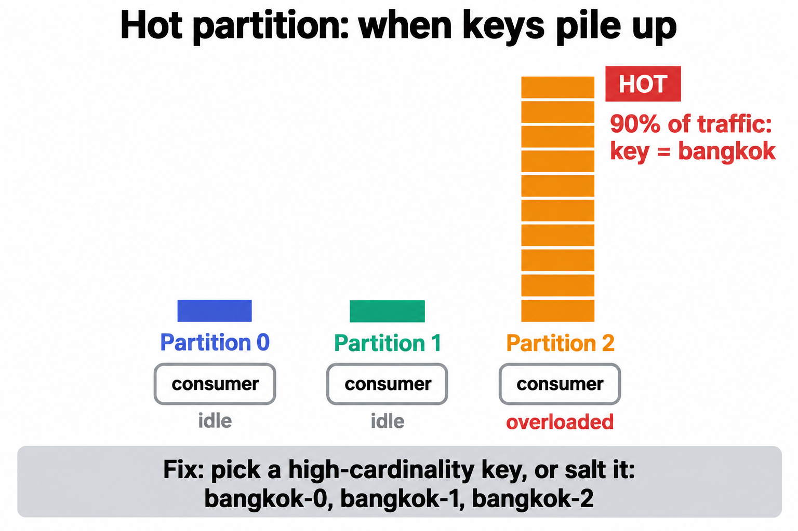
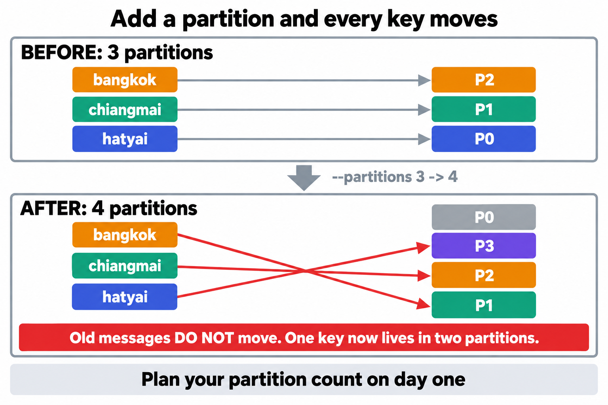

# LAB 2 — Partitions & Keys : ใครเป็นคนเลือกว่าข้อความลง partition ไหน

> โฟลเดอร์ `002_LAB_Partitions_Keys` = **LAB 2** ในสไลด์ `Kafka_Slides.html` (ต่อจาก LAB 1 ที่เปิด broker แล้วส่ง–รับข้อความแรกผ่าน topic เดียวแบบยังไม่ต้องสน partition)
> ไฟล์ในโฟลเดอร์นี้ : `docker-compose.yml` · `producer_no_key.py` · `producer_with_key.py` · `consumer_partitions.py` · `hash_key.py` · `requirements.txt`

## สิ่งที่จะได้เรียนรู้

- topic ไม่ใช่ท่อเดี่ยว ๆ — มันถูกผ่าเป็นหลาย **partition** แต่ละอันคือ **append-only log** แยกเล่ม มี **offset** ของตัวเอง · ที่อยู่เต็มของทุกข้อความคือ **(topic, partition, offset)** และอ่านแล้ว **ไม่หาย** ต่างจาก RabbitMQ ที่ ack แล้วข้อความถูกลบ
- เปิด Kafka + Kafka UI + สร้าง topic ทั้งชุดด้วย **`docker compose up -d`** ไฟล์เดียว — พร้อมเข้าใจเรื่อง **listener สองบาน** · **healthcheck** ที่บังคับลำดับการบูตให้เอง · และ **init container** ที่รันครั้งเดียวแล้วจบ
- **กฎการเลือก partition 3 ชั้น** : ระบุ partition ตรง ๆ > hash ของ key > producer เลือกเอง — พิสูจน์ครบทั้งสามชั้นด้วยมือ
- คำนวณ **murmur2(key) % จำนวน partition** เองด้วย `hash_key.py` แล้ว **ทำนายล่วงหน้า** ว่า key ไหนลงเล่มไหน *ก่อน* ส่งจริง
- ขอบเขตของ **"ลำดับการันตี"** และราคาที่ต้องจ่ายเมื่อ key กระจุก (**hot partition**)
- ใช้ **Kafka UI** สืบสวนจริงจัง : Overview · Messages · กรองรายพาร์ทิชัน · ค้นด้วย key · Statistics · Produce Message
- เห็นกับตาว่า **เพิ่มจำนวน partition แล้ว mapping พังยกแผง** — เหตุผลที่ของจริงต้องวางแผนจำนวน partition ตั้งแต่วันแรก

## ลำดับการทำแล็บ

เตรียมเครื่องเรียน → `docker compose up -d` → เตรียม venv → ตรวจ topic `orders` **3 partitions** ที่ `kafka-init` สร้างให้ → รัน `producer_no_key.py` 2 รอบ (คุมไม่ได้) → รัน `producer_with_key.py` 2 รอบ (คงที่เสมอ) → **เจาะทฤษฎี** → อ่านทั้ง topic → สืบสวนใน Kafka UI → เจาะอ่าน partition เดียว → **ทดลองเพิ่มเติม 4 ข้อ**

---

## 1. เตรียมเครื่องเรียน + โค้ดแล็บ

เปิด container ที่ติดตั้ง Docker มาให้แล้ว (บนเครื่องของเราเอง ไม่ใช้ cloud) :

```bash
docker rm -f devtools
docker run -dit --name devtools --privileged -p 2222:22 tuchsanai/devtools:2569_1
ssh root@localhost -p 2222        # password : passwd
```

> 📝 **คำอธิบาย:** `docker rm -f devtools` ลบเครื่องเรียนตัวเดิมทิ้งกันชื่อซ้ำ (ถ้าไม่เคยสร้างจะเงียบ ๆ ไม่ใช่ error) · `--privileged` จำเป็นเพราะเราจะรัน **Docker ซ้อนข้างในกล่อง** — Kafka ของแล็บนี้ก็เป็น container อยู่ข้างในอีกที · `-p 2222:22` ส่ง port 2222 ของเครื่องเราเข้า SSH ของกล่อง · **คำสั่งที่เหลือทั้งหมดพิมพ์ข้างในเครื่องเรียน**

ใน VS Code ใช้ **Remote-SSH** ต่อไปที่ `root@localhost:2222` แล้วดึงโค้ดแล็บ :

```bash
docker compose version
mkdir -p ~/labwork && cd ~/labwork
git clone https://github.com/Tuchsanai/DevTools.git
cd DevTools/03_Application_Docker/02_Message_Brokers/02_Kafka/002_LAB_Partitions_Keys
ls
```

> 📝 **คำอธิบาย:** `docker compose version` ยืนยันก่อนว่าคำสั่ง compose ใช้ได้ — แล็บนี้พึ่งมันทั้งหมด (ถ้าขึ้น `Cannot connect to the Docker daemon` แปลว่า daemon ข้างในยังตื่นไม่เสร็จ รอสักครู่แล้วลองใหม่) · ถ้าเคย clone ไว้แล้วจาก LAB 1 ข้ามบรรทัด `git clone` ได้เลย

✅ **Expected output** — เห็นเลขเวอร์ชัน แล้ว `ls` เห็นไฟล์ครบ (เลขเวอร์ชันของแต่ละคนอาจไม่ตรงกับเอกสารนี้):

```
Docker Compose version v5.3.1
consumer_partitions.py  docker-compose.yml  hash_key.py  images
producer_no_key.py  producer_with_key.py  readme.md  requirements.txt
```

---

## 2. เปิด Kafka broker + Kafka UI ด้วย `docker compose`

LAB 1 เราเปิดสองบริการด้วย `docker run` สองคำสั่ง แล้วต้อง **นั่งเฝ้า log เอง** ว่า broker พร้อมหรือยังก่อนเปิด UI · แล็บนี้ย้ายทั้งชุดมาอยู่ในไฟล์เดียว และเพิ่ม **service ตัวที่สาม** ที่สร้าง topic `orders` ให้อัตโนมัติ — เปิดไฟล์ `docker-compose.yml` ที่อยู่ในโฟลเดอร์แล็บดูก่อน :

```yaml
services:
  kafka:
    image: apache/kafka:4.1.0
    container_name: kafka
    ports:
      - "9092:9092"          # ประตูที่โปรแกรม Python ใช้ (localhost:9092)
    environment:
      # --- โหมด KRaft : broker เป็น controller ในตัว ไม่ต้องมี ZooKeeper ---
      KAFKA_NODE_ID: 1
      KAFKA_PROCESS_ROLES: broker,controller
      KAFKA_CONTROLLER_LISTENER_NAMES: CONTROLLER
      KAFKA_CONTROLLER_QUORUM_VOTERS: 1@kafka:9093

      # --- สองประตูคนละบาน : HOST ให้คนนอก · DOCKER ให้เพื่อนใน compose ---
      KAFKA_LISTENERS: HOST://0.0.0.0:9092,DOCKER://0.0.0.0:19092,CONTROLLER://0.0.0.0:9093
      KAFKA_ADVERTISED_LISTENERS: HOST://localhost:9092,DOCKER://kafka:19092
      KAFKA_LISTENER_SECURITY_PROTOCOL_MAP: HOST:PLAINTEXT,DOCKER:PLAINTEXT,CONTROLLER:PLAINTEXT
      KAFKA_INTER_BROKER_LISTENER_NAME: DOCKER

      # --- broker เดียว จึงตั้งสำเนาของ topic ภายในเป็น 1 ทั้งหมด ---
      KAFKA_OFFSETS_TOPIC_REPLICATION_FACTOR: 1
      KAFKA_TRANSACTION_STATE_LOG_REPLICATION_FACTOR: 1
      KAFKA_TRANSACTION_STATE_LOG_MIN_ISR: 1
      KAFKA_GROUP_INITIAL_REBALANCE_DELAY_MS: 0
    healthcheck:
      test: ["CMD-SHELL", "/opt/kafka/bin/kafka-broker-api-versions.sh --bootstrap-server localhost:9092 >/dev/null 2>&1"]
      interval: 5s
      timeout: 10s
      retries: 20

  # --- รันครั้งเดียวแล้วจบ : สร้าง topic orders 3 partitions ให้อัตโนมัติ ---
  kafka-init:
    image: apache/kafka:4.1.0
    container_name: kafka-init
    depends_on:
      kafka:
        condition: service_healthy   # รอจน broker ตอบได้จริง ค่อยสั่งสร้าง topic
    entrypoint: ["/bin/sh", "-c"]
    command:
      - |
        /opt/kafka/bin/kafka-topics.sh --bootstrap-server kafka:19092 \
          --create --if-not-exists --topic orders --partitions 3 --replication-factor 1
        /opt/kafka/bin/kafka-topics.sh --bootstrap-server kafka:19092 \
          --describe --topic orders
    restart: "no"                    # ทำเสร็จแล้วหยุด (Exited 0) ไม่ต้องเปิดใหม่

  kafka-ui:
    image: kafbat/kafka-ui:latest
    container_name: kafka-ui
    ports:
      - "8412:8080"          # หน้าเว็บ : เครื่องเรา 8412 -> ในกล่อง 8080
    environment:
      KAFKA_CLUSTERS_0_NAME: local
      KAFKA_CLUSTERS_0_BOOTSTRAPSERVERS: kafka:19092
      DYNAMIC_CONFIG_ENABLED: "true"
    depends_on:
      kafka:
        condition: service_healthy   # รอจน broker ตอบได้จริง ค่อยเปิด UI
```

### 2.1 สี่จุดในไฟล์นี้ที่ต้องเข้าใจ

**(ก) ทำไม broker ต้องมีประตูสองบาน**



ปัญหาคือ **มีคนสองกลุ่มที่ต้องต่อเข้า broker เดียวกัน แต่เรียกชื่อมันคนละชื่อ** :

- โปรแกรม Python ของเรา รัน **นอก** compose จึงเรียก broker ว่า `localhost:9092`
- `kafka-ui` รัน **ใน** compose เดียวกัน มันเรียกเพื่อนด้วย **ชื่อ service** คือ `kafka` — และคำว่า `localhost` ของมันหมายถึงตัวมันเอง ไม่ใช่ broker

Kafka แก้ด้วยการเปิด **listener หลายบาน** พร้อมกัน : บาน `HOST` นั่งที่ port `9092` และ **ประกาศตัวเอง** (`ADVERTISED`) ว่า `localhost:9092` · บาน `DOCKER` นั่งที่ port `19092` และประกาศตัวว่า `kafka:19092` · ใครเข้าประตูไหน Kafka ก็ตอบกลับด้วยที่อยู่ของประตูนั้น ทั้งคู่จึงต่อติดพร้อมกัน

> **`ADVERTISED_LISTENERS` คือจุดที่คนพลาดบ่อยที่สุดเวลาเอา Kafka ลง Docker** — ถ้าประกาศผิด client จะ **ต่อติดครั้งแรกแล้วค้าง** เพราะ broker ตอบกลับมาว่า "จริง ๆ ให้ไปคุยที่ที่อยู่นี้" แล้ว client วิ่งตามไปไม่เจอ

**(ข) `healthcheck` + `depends_on: condition: service_healthy`** — นี่คือคำตอบของบทเรียนเดิมจากชุด RabbitMQ ที่ว่า **`Up` ≠ พร้อม** · `healthcheck` ให้ Docker ยิง `kafka-broker-api-versions.sh` ถามตัว broker ทุก 5 วินาที ถ้าตอบได้แปลว่าพร้อมจริง · `depends_on` แบบ `service_healthy` สั่งให้ compose **กั้น `kafka-ui` ไว้จนกว่า broker จะ healthy** — เราไม่ต้องนั่ง `docker logs` เฝ้าเองอีกต่อไป

**(ค) `ports: "8412:8080"`** — หน้าเว็บ Kafka UI ฟังที่ port `8080` ข้างในกล่องเสมอ แต่เรา map ออกมาเป็น **`8412`** บนเครื่องเรียน · จงใจเลี่ยง `8080`/`80`/`8888` เพราะเป็น port ยอดนิยมที่ชนกับของอื่นได้ง่าย (แล็บอื่นในวิชานี้ก็ใช้ `8080` อยู่)

**(ง) `kafka-init` — container ที่เกิดมาเพื่อทำงานเดียวแล้วจบ** — LAB 1 เราปล่อยให้ broker สร้าง topic ให้เอง (auto-create) ซึ่งได้แค่ **1 partition** · แล็บนี้ต้องการ `orders` แบบ **3 partitions** ตั้งแต่ต้น จึงใส่ service ตัวที่สามที่ใช้ image เดียวกับ broker (เพราะมี `kafka-topics.sh` อยู่ข้างใน) แต่ **ทับ `entrypoint`** ให้รันคำสั่งสร้าง + describe topic แทนการเปิด broker · สี่จุดที่ต้องสังเกต :

- `depends_on: service_healthy` ตัวเดียวกับ `kafka-ui` — ถ้าไม่รอ healthy คำสั่ง `--create` จะยิงไปตอน broker ยังไม่ตื่นแล้วล้ม
- `--bootstrap-server kafka:19092` **ไม่ใช่ `localhost:9092`** — เพราะคำสั่งนี้รันในกล่อง `kafka-init` ไม่ใช่ในกล่อง `kafka` · `localhost` ของมันคือตัวมันเองซึ่งไม่มี broker อยู่ จึงต้องเข้าประตู `DOCKER` ด้วยชื่อ service เหมือน `kafka-ui` ทุกประการ — นี่คือบทเรียนข้อ (ก) ในรูปแบบที่จับต้องได้
- `--if-not-exists` — สั่ง `docker compose up -d` ซ้ำเมื่อไร `kafka-init` จะถูกรันใหม่ทุกครั้ง ถ้าไม่มี flag นี้รอบสองจะล้มด้วย `TopicExistsException` · มีแล้วมันจะเงียบ ๆ ข้ามไป (ไม่พิมพ์ `Created topic`) แล้ว describe ต่อตามปกติ
- `restart: "no"` — container นี้ **ตั้งใจให้จบ** พอคำสั่งเสร็จมันจะอยู่สถานะ `Exited (0)` ซึ่งถูกต้องแล้ว ไม่ใช่พัง (ดู 2.2)

> **ของจริงใช้ท่านี้กันทั่วไป** เรียกว่า *init container* — งานเตรียมสภาพแวดล้อม (สร้าง topic · สร้างตาราง DB · ใส่ seed data) ควรถูกเขียนไว้ในไฟล์ประกาศระบบ ไม่ใช่ให้คนมานั่งพิมพ์คำสั่งเองหลัง `up` ทุกครั้ง · แต่เราจะยังฝึกสั่ง `kafka-topics.sh` ด้วยมือในข้อ 4 และทดลองเพิ่มเติม ค.–ง. อยู่ดี เพราะต้องใช้ตอน alter / list / สืบสวน topic ผี

### 2.2 เปิดทั้งชุด

```bash
docker compose up -d
```

> 📝 **คำอธิบาย:** `docker compose up` อ่าน `docker-compose.yml` ใน **โฟลเดอร์ปัจจุบัน** แล้วสร้าง network + container ให้ครบตามไฟล์ · `-d` = ปล่อยรันเบื้องหลัง · ครั้งแรกจะ pull image ทั้งสองตัวก่อน (ใช้เวลาสักพัก · `kafka-init` ใช้ image เดียวกับ `kafka` จึงไม่ต้อง pull เพิ่ม) · บรรทัดที่ต้องมองหาคือ **`Container kafka Healthy`** แล้วตามด้วย `Container kafka-ui Started` และ `Container kafka-init Started` — นั่นคือ `depends_on` กั้นทั้งสองตัวไว้จน broker พร้อมจริง

✅ **Expected output** — ท้าย log ต้องเห็นลำดับนี้ (ครั้งแรกจะมีบรรทัด pull image นำหน้าอีกยาว):

```
 Image apache/kafka:4.1.0 Pulled
 Image kafbat/kafka-ui:latest Pulled
 Network 002_lab_partitions_keys_default  Created
 Container kafka  Created
 Container kafka-ui  Created
 Container kafka-init  Created
 Container kafka  Started
 Container kafka  Waiting
 Container kafka  Waiting
 Container kafka  Healthy
 Container kafka  Healthy
 Container kafka-ui  Started
 Container kafka-init  Started
```

> **สังเกต :** `Waiting` / `Healthy` ขึ้น **สองครั้ง** — เพราะมีคนรอ `kafka` อยู่สองคน (`kafka-ui` และ `kafka-init`) compose จึงรายงานแยกกัน

เช็กสถานะ :

```bash
docker compose ps
```

> 📝 **คำอธิบาย:** `docker compose ps` ต่างจาก `docker ps` ตรงที่มันโชว์เฉพาะ container ของ compose ในโฟลเดอร์นี้ และเพิ่มคอลัมน์ **SERVICE** ให้ · จุดที่ต้องดู : `kafka` ต้องขึ้น **`Up (healthy)`** ไม่ใช่แค่ `Up` · และ `kafka-ui` ต้องมี mapping `0.0.0.0:8412->8080/tcp` · **`kafka-init` จะไม่โผล่** ในตารางนี้ เพราะ `compose ps` โชว์เฉพาะตัวที่ยังรันอยู่ — มันทำงานเสร็จและจบไปแล้ว

✅ **Expected output** — สองแถว `Up` และ `kafka` ต้องเป็น `(healthy)` (เวลา CREATED ของแต่ละคนจะไม่ตรงกับเอกสารนี้):

```
NAME       IMAGE                    COMMAND                  SERVICE    CREATED          STATUS                    PORTS
kafka      apache/kafka:4.1.0       "/__cacert_entrypoin…"   kafka      13 seconds ago   Up 12 seconds (healthy)   0.0.0.0:9092->9092/tcp, [::]:9092->9092/tcp
kafka-ui   kafbat/kafka-ui:latest   "/bin/sh -c 'java --…"   kafka-ui   13 seconds ago   Up 5 seconds              0.0.0.0:8412->8080/tcp, [::]:8412->8080/tcp
```

อยากเห็น `kafka-init` ด้วยต้องเติม `-a` (all) :

```bash
docker compose ps -a
```

✅ **Expected output** — สามแถว · `kafka-init` เป็น **`Exited (0)`** = ทำงานสำเร็จแล้วจบ (เลข 0 คือ exit code ที่แปลว่าไม่มี error):

```
NAME         IMAGE                    COMMAND                  SERVICE      CREATED          STATUS                     PORTS
kafka        apache/kafka:4.1.0       "/__cacert_entrypoin…"   kafka        20 seconds ago   Up 18 seconds (healthy)    0.0.0.0:9092->9092/tcp, [::]:9092->9092/tcp
kafka-init   apache/kafka:4.1.0       "/bin/sh -c '/opt/ka…"   kafka-init   20 seconds ago   Exited (0) 9 seconds ago
kafka-ui     kafbat/kafka-ui:latest   "/bin/sh -c 'java --…"   kafka-ui     20 seconds ago   Up 12 seconds              0.0.0.0:8412->8080/tcp, [::]:8412->8080/tcp
```

> ถ้าเห็น `Exited (1)` แทน แปลว่าคำสั่งสร้าง topic ล้ม — ดูสาเหตุด้วย `docker logs kafka-init` (ข้อ 4 จะอ่าน log นี้กันอยู่แล้ว)

> **เกร็ด :** เราตั้ง `container_name: kafka` ไว้ในไฟล์ compose ด้วย ชื่อ container จึงเป็น `kafka` สั้น ๆ ไม่ใช่ `002_lab_partitions_keys-kafka-1` ตามสูตร default ของ compose — ทำให้คำสั่ง `docker exec kafka ...` ที่ใช้ทั้งแล็บสั้นและตรงกับ LAB 1

---

## 3. เตรียม Python (venv + kafka-python)

```bash
python3 -m venv ~/venv-kafka
source ~/venv-kafka/bin/activate
pip install -r requirements.txt
```

> 📝 **คำอธิบาย:** Python ในเครื่องเรียนเปิดกฎ PEP 668 ไว้ — `pip install` ตรง ๆ นอก venv จะโดนปฏิเสธ จึงต้องผ่าน **virtual environment** เสมอ · `~/venv-kafka` ใช้ร่วมกันได้ทุกแล็บของชุด Kafka (ถ้าสร้างไว้แล้วจาก LAB 1 ข้ามบรรทัดแรกได้) · `requirements.txt` ล็อก `kafka-python==3.0.10` ให้ตรงกันทั้งห้อง

✅ **Expected output** — บรรทัดสุดท้ายต้องเป็น `Successfully installed kafka-python-3.0.10` (ถ้าติดตั้งไว้แล้วจะขึ้น `Requirement already satisfied` แทน — ใช้ได้เหมือนกัน)

> **⚠️ กติกาเดิมจาก LAB 1 :** ทุกครั้งที่เปิด **terminal ใหม่** ต้อง `source ~/venv-kafka/bin/activate` ก่อนเสมอ — ลืมเมื่อไหร่เจอ `ModuleNotFoundError: No module named 'kafka'` ทันที

---

## 4. ตรวจ topic `orders` ที่ `kafka-init` สร้างให้ — 3 partitions

LAB 1 เราปล่อยให้ broker สร้าง topic ให้เอง (auto-create) ซึ่งได้แค่ **1 partition** — คราวนี้ `kafka-init` ในไฟล์ compose สร้าง `orders` แบบ **3 partitions** ให้แล้วตั้งแต่ตอน `up` (ข้อ 2.1 ง) เพราะทั้งแล็บนี้ต้องการเห็นข้อความ **กระจายลง 3 เล่ม** · เริ่มจากอ่านสิ่งที่มันทำไว้ :

```bash
docker logs kafka-init
```

> 📝 **คำอธิบาย:** `docker logs` ใช้กับ container ที่จบไปแล้วได้ — output ของคำสั่งที่รันข้างในถูกเก็บไว้จนกว่า container จะถูกลบ · บรรทัดแรก `Created topic orders.` มาจาก `--create` · ตารางที่ตามมาคือผลของ `--describe` ที่เราสั่งต่อกันในบล็อก `command`

✅ **Expected output** — `Created topic orders.` แล้วตามด้วย `PartitionCount: 3` ครบ 3 แถว (TopicId ของแต่ละคนจะไม่ตรงกับเอกสารนี้):

```
Created topic orders.
Topic: orders	TopicId: xmHGmKHmS3elrE9vSN6dtw	PartitionCount: 3	ReplicationFactor: 1	Configs: min.insync.replicas=1
	Topic: orders	Partition: 0	Leader: 1	Replicas: 1	Isr: 1	Elr: 	LastKnownElr:
	Topic: orders	Partition: 1	Leader: 1	Replicas: 1	Isr: 1	Elr: 	LastKnownElr:
	Topic: orders	Partition: 2	Leader: 1	Replicas: 1	Isr: 1	Elr: 	LastKnownElr:
```

ทีนี้สั่ง `kafka-topics.sh` **ด้วยมือ** บ้าง — เครื่องมือตัวเดียวกัน แต่คราวนี้เข้าไปสั่งในกล่อง `kafka` โดยตรง :

```bash
docker exec kafka /opt/kafka/bin/kafka-topics.sh --bootstrap-server localhost:9092 \
  --describe --topic orders
```

> 📝 **คำอธิบาย:** `kafka-topics.sh` คือ CLI จัดการ topic — ติดตั้งอยู่ **ข้างใน image `apache/kafka`** จึงสั่งผ่าน `docker exec kafka ...` ได้ตลอดแล็บ · สังเกตว่า `--bootstrap-server` คราวนี้เป็น **`localhost:9092`** ไม่ใช่ `kafka:19092` แบบใน `kafka-init` — เพราะตอนนี้เรายืนอยู่ **ใน container `kafka` เอง** `localhost` จึงหมายถึง broker ตัวจริง เข้าประตู `HOST` ได้ปกติ · ที่อยู่เดียวกัน (broker เดียวกัน) แต่เรียกคนละชื่อตามว่า "ใครเป็นคนเรียก" — คือหัวใจของข้อ 2.1 (ก) ·
> ในตาราง `--describe` : **Leader: 1** = partition นี้อยู่ในมือ broker id 1 (เรามีตัวเดียวจึงเป็นเจ้าของทุกเล่ม) · **Replicas / Isr** = รายชื่อสำเนา / สำเนาที่ตามทัน · คอลัมน์ `Elr` / `LastKnownElr` เป็นของใหม่ใน Kafka 4.x ว่างแบบนี้ถูกต้อง

✅ **Expected output** — ตารางเดียวกับใน log ของ `kafka-init` ทุกตัวอักษร (TopicId ตรงกันด้วย เพราะเป็น topic ตัวเดียวกัน):

```
Topic: orders	TopicId: xmHGmKHmS3elrE9vSN6dtw	PartitionCount: 3	ReplicationFactor: 1	Configs: min.insync.replicas=1
	Topic: orders	Partition: 0	Leader: 1	Replicas: 1	Isr: 1	Elr: 	LastKnownElr:
	Topic: orders	Partition: 1	Leader: 1	Replicas: 1	Isr: 1	Elr: 	LastKnownElr:
	Topic: orders	Partition: 2	Leader: 1	Replicas: 1	Isr: 1	Elr: 	LastKnownElr:
```

ลองสั่ง **สร้างซ้ำด้วยมือ** ดูสักครั้ง — แบบเดียวกับที่ `kafka-init` ทำ แต่จงใจ **ไม่ใส่** `--if-not-exists` :

```bash
docker exec kafka /opt/kafka/bin/kafka-topics.sh --bootstrap-server localhost:9092 \
  --create --topic orders --partitions 3 --replication-factor 1
```

✅ **Expected output** — ล้มทันที เพราะ topic มีอยู่แล้ว:

```
Error while executing topic command : Topic 'orders' already exists.
[2026-09-21 07:37:23,794] ERROR org.apache.kafka.common.errors.TopicExistsException: Topic 'orders' already exists.
 (org.apache.kafka.tools.TopicCommand)
```

> 📝 **คำอธิบาย:** นี่คือเหตุผลที่ `kafka-init` ต้องมี `--if-not-exists` — container นั้นถูกรันใหม่ทุกครั้งที่สั่ง `docker compose up -d` ถ้าล้มแบบนี้ `compose ps -a` จะโชว์ `Exited (1)` ทุกรอบหลังรอบแรก · `--partitions 3` ผ่า topic เป็น 3 log แยกเล่ม · `--replication-factor 1` เก็บสำเนาเดียว — เรามี broker ตัวเดียว ขอมากกว่านี้จะ error เช่นกัน · ถ้าอยากสร้าง topic ใหม่ด้วยมือจริง ๆ ก็ใช้คำสั่งนี้แหละ แค่เปลี่ยนชื่อ topic (ทดลองเพิ่มเติม ค. จะได้ใช้ `--alter` กับเครื่องมือตัวนี้ต่อ)

> **ภาพในหัวที่ต้องมี :** ตอนนี้ `orders` คือสมุด 3 เล่ม (p0 · p1 · p2) แต่ละเล่มเขียนได้แบบ **ต่อท้ายอย่างเดียว** และมีเลขบรรทัดของตัวเองเรียก **offset** เริ่มที่ 0 — คำถามของทั้งแล็บคือ *ข้อความหนึ่ง ๆ จะถูกจดลงเล่มไหน?*

---

## 5. ส่งแบบไม่มี key — `producer_no_key.py`

```python
from kafka import KafkaProducer

# 1) ต่อ broker เหมือนแล็บก่อน
producer = KafkaProducer(bootstrap_servers='localhost:9092')

# 2) ส่ง 6 ข้อความ "โดยไม่ใส่ key" — ให้ Kafka เลือก partition ให้เอง
for i in range(1, 7):
    message = f'order {i}'
    metadata = producer.send('orders', message.encode()).get(timeout=10)
    # 3) ดูใบเสร็จ : แต่ละข้อความไปลง partition ไหน — สังเกตว่า "เดาไม่ได้"
    print(f" [x] Sent '{message}'  ->  partition={metadata.partition} offset={metadata.offset}")

producer.close()
```

> 📝 **คำอธิบาย:** **(1)** ต่อ broker ที่ `localhost:9092` — ไม่มี user/password เพราะ broker ของแล็บเปิดแบบ PLAINTEXT · **(2)** Kafka รับเป็น bytes จึงต้อง `.encode()` และเมื่อ **ไม่ใส่ key** ไลบรารีฝั่งผู้ส่งจะเลือก partition ให้เอง · **(3)** `send()` คืน future — `.get(timeout=10)` รอ "ใบเสร็จ" (`RecordMetadata`) ที่บอกว่าไปลง **partition ไหน · offset เท่าไร** ซึ่งเป็นพระเอกของแล็บนี้

รัน **สองรอบ** (อย่าลืมว่าต้องมี `(venv-kafka)` นำหน้า prompt) :

```bash
python producer_no_key.py
python producer_no_key.py
```

✅ **Expected output** (รอบแรก) — **partition ของแต่ละคนจะไม่ตรงกับเอกสารนี้ นั่นแหละคือประเด็น**:

```
 [x] Sent 'order 1'  ->  partition=2 offset=0
 [x] Sent 'order 2'  ->  partition=1 offset=0
 [x] Sent 'order 3'  ->  partition=1 offset=1
 [x] Sent 'order 4'  ->  partition=2 offset=1
 [x] Sent 'order 5'  ->  partition=0 offset=0
 [x] Sent 'order 6'  ->  partition=1 offset=2
```

> **อ่านผลสองรอบเทียบกัน :**
> - **คอลัมน์ partition ของรอบ 2 จะไม่เหมือนรอบ 1** — `kafka-python 3.0.10` เมื่อไม่มี key จะ **สุ่มเลือก partition ใหม่ทุกใบ** · บางรอบอาจบังเอิญตกเล่มเดียวกันหมดก็ได้ (โอกาส 1/3⁵ ≈ 0.4%) ไม่ใช่บั๊ก
> - **offset ไม่รีเซ็ต** — มันวิ่งต่อจากของเดิมในแต่ละเล่ม เพราะ log เขียนต่อท้ายอย่างเดียว
> - บทเรียนคือ "ไม่มี key = **คุมไม่ได้**" ไม่ใช่ "ต้องกระจายเท่า ๆ กัน" · ของเราจะออกมาแบบไหนก็ถูกทั้งนั้น
>
> **เกร็ด :** "producer เลือกเอง" แต่ละไลบรารีไม่เหมือนกัน — `kafka-python` สุ่มใหม่ทุกใบ ส่วน Java client รุ่นใหม่ใช้ **sticky partitioner** คือเกาะเล่มเดิมจนกว่า batch จะเต็มแล้วค่อยย้าย · ผลที่เห็นต่างกัน แต่ข้อสรุปเดียวกัน

---

## 6. ส่งแบบมี key — `producer_with_key.py`

```python
from kafka import KafkaProducer

# 1) ต่อ broker เหมือนเดิม
producer = KafkaProducer(bootstrap_servers='localhost:9092')

# 2) คราวนี้ทุกข้อความมี key = ชื่อสาขาของร้าน (bangkok / chiangmai / hatyai)
#    Kafka จะเอา key ไป hash → ได้เลข partition เดิมเสมอสำหรับ key เดิม
branches = ['bangkok', 'chiangmai', 'hatyai']

# 3) ส่งสาขาละ 3 ออเดอร์ (รวม 9 ข้อความ) — key ต้องเป็น bytes เช่นกัน
for round_no in range(1, 4):
    for branch in branches:
        message = f'{branch} order #{round_no}'
        metadata = producer.send('orders',
                                 key=branch.encode(),
                                 value=message.encode()).get(timeout=10)
        # 4) สังเกตใบเสร็จ : key เดียวกัน → partition เดิม ทุกครั้ง ไม่มีข้อยกเว้น
        print(f" [x] key={branch:9s} -> partition={metadata.partition} "
              f"offset={metadata.offset}  ('{message}')")

producer.close()
```

> 📝 **คำอธิบาย:** ต่างจากข้อ 5 แค่จุดเดียวคือเพิ่ม `key=branch.encode()` เข้าไปใน `send()` · key ต้องเป็น **bytes** เหมือน value · นอกนั้นเหมือนกันทุกบรรทัด

รัน **สองรอบ** :

```bash
python producer_with_key.py
python producer_with_key.py
```

✅ **Expected output** (รอบแรก) — **ตัวเลข partition ชุดนี้ทุกคนต้องได้เหมือนกันเป๊ะ**:

```
 [x] key=bangkok   -> partition=2 offset=2  ('bangkok order #1')
 [x] key=chiangmai -> partition=1 offset=7  ('chiangmai order #1')
 [x] key=hatyai    -> partition=0 offset=3  ('hatyai order #1')
 [x] key=bangkok   -> partition=2 offset=3  ('bangkok order #2')
 [x] key=chiangmai -> partition=1 offset=8  ('chiangmai order #2')
 [x] key=hatyai    -> partition=0 offset=4  ('hatyai order #2')
 [x] key=bangkok   -> partition=2 offset=4  ('bangkok order #3')
 [x] key=chiangmai -> partition=1 offset=9  ('chiangmai order #3')
 [x] key=hatyai    -> partition=0 offset=5  ('hatyai order #3')
```

> **นี่คือหัวใจของแล็บ — เทียบกับข้อ 5 ให้ชัด :**
> - `bangkok → p2` · `chiangmai → p1` · `hatyai → p0` **ทั้ง 18 ใบจากสองรอบ ไม่มีข้อยกเว้นสักใบ**
> - คอลัมน์ offset ต่างหากที่วิ่งขึ้น — เพราะเป็นเล่มเดิม จดต่อท้ายไปเรื่อย ๆ
> - ตัวเลข offset ของเราอาจไม่ตรงกับเอกสาร (ขึ้นกับว่าข้อ 5 สุ่มลงเล่มไหนไปกี่ใบ) แต่ **คอลัมน์ partition ต้องตรงเป๊ะ** เพราะมันไม่ใช่การสุ่ม — ข้อ 7.3 จะพิสูจน์ให้ดูด้วยเครื่องคิดเลข

ตอนนี้ topic `orders` มี **30 ข้อความ** = 12 (ไม่มี key) + 18 (มี key)

---

## 7. เจาะทฤษฎี : Partitions & Keys ทำงานยังไงกันแน่

ข้อนี้ไม่มีคำสั่งให้พิมพ์เยอะ แต่เป็นข้อที่ทำให้ทุกอย่างในแล็บ "เข้าที่" — อ่านให้จบก่อนไปต่อ

### 7.1 partition คืออะไรกันแน่

`topic` เป็นแค่ **ชื่อ** ของกลุ่มข้อมูล — ของจริงที่เก็บข้อมูลคือ **partition** :



- แต่ละ partition = **ไฟล์ log ที่เขียนต่อท้ายอย่างเดียว (append-only)** เก็บลงดิสก์จริง ไม่ได้อยู่แค่ใน RAM
- **offset** = เลขบรรทัดในเล่มนั้น เริ่มที่ 0 นับขึ้นเรื่อย ๆ **ไม่เคยถอยหลัง ไม่เคยรีไซเคิล** แม้จะลบข้อความเก่าทิ้งตามอายุแล้วก็ตาม
- offset ของ p0 กับ p1 **ไม่เกี่ยวกันเลย** — "offset 5" ไม่มีความหมายถ้าไม่บอกว่าเล่มไหน · ที่อยู่ที่ระบุข้อความได้ไม่ซ้ำใครจึงต้องครบสามส่วน : **(topic, partition, offset)**
- การอ่าน **ไม่ลบข้อความ** — consumer แค่เลื่อน "ที่คั่นหนังสือ" ของตัวเอง ใครจะย้อนกลับไปอ่านใหม่ก็ได้ (ความต่างใหญ่ที่สุดจาก RabbitMQ)

**แล้วทำไมต้องผ่าเป็นหลายเล่ม?** เพราะ log เล่มเดียวถูกจำกัดด้วยดิสก์และซีพียูของเครื่องเดียว การผ่าเป็น N เล่มทำให้ (ก) กระจายไปเก็บคนละ broker ได้ (ข) ให้ consumer หลายตัวช่วยกันอ่านคนละเล่มพร้อมกันได้ — **จำนวน partition คือเพดานของความขนานฝั่งผู้อ่าน** (เรื่องเต็ม ๆ อยู่ LAB 3)

### 7.2 กฎการเลือก partition — 3 ชั้น เรียงตามลำดับความสำคัญ

ทุกครั้งที่ producer จะส่งข้อความ มันไล่ถามตามลำดับนี้ **หยุดที่ข้อแรกที่ตอบได้** :



| ลำดับ | เงื่อนไข | ผลลัพธ์ | เจอที่ไหนในแล็บนี้ |
|---|---|---|---|
| **1** | โปรแกรม **ระบุเลข partition มาตรง ๆ** | ใช้เลขนั้น — **key ถูกมองข้ามทั้งใบ** | ทดลองเพิ่มเติม ข. (ส่งจาก Kafka UI) |
| **2** | ไม่ระบุ partition แต่ **มี key** | `(murmur2(key) & 0x7fffffff) % จำนวน partition` | ข้อ 6 · `producer_with_key.py` |
| **3** | ไม่ระบุทั้ง partition และ key | producer เลือกเอง — **คุมไม่ได้** | ข้อ 5 · `producer_no_key.py` |

> **จุดที่คนพลาดบ่อยที่สุด:** ชั้น 1 ชนะชั้น 2 เสมอ — ใส่ key มาสวยงามแค่ไหน ถ้าโค้ดเผลอระบุ `partition=0` ไปด้วย key จะกลายเป็นแค่ป้ายที่ติดไปกับข้อความ ไม่มีผลต่อการเลือกเล่มเลย · จะเห็นของจริงในทดลองเพิ่มเติม ข.

### 7.3 คำนวณ hash ด้วยมือ — `hash_key.py`

ชั้นที่ 2 เป็นคณิตศาสตร์ล้วน ไม่มีการสุ่ม เราจึง **ทำนายล่วงหน้าได้** ว่า key ไหนจะลงเล่มไหน :



```python
from kafka.partitioner.default import murmur2

# สูตรเดียวกับที่ producer ใช้ : murmur2(key) -> ตัดเครื่องหมายลบ -> หารเอาเศษด้วยจำนวน partition
for key in ['bangkok', 'chiangmai', 'hatyai', 'korat']:
    h = murmur2(key.encode()) & 0x7fffffff
    print(f'{key:10s} hash={h:>10d}   %3 -> p{h % 3}   %4 -> p{h % 4}')
```

> 📝 **คำอธิบาย:** `murmur2` คือฟังก์ชัน hash เดียวกับที่ Java client ของ Kafka ใช้ (kafka-python ลอกสูตรมาแบบบรรทัดต่อบรรทัด) — นี่คือเหตุผลที่ข้อความจาก Python, Java, Go หรือหน้าเว็บ ที่ใช้ key เดียวกันจะ **ลงเล่มเดียวกัน** ข้ามภาษาได้ · `& 0x7fffffff` = ตัด bit บนสุดทิ้งเพื่อบังคับให้เป็นเลขบวก (ใน Java ค่า hash เป็น int แบบมีเครื่องหมาย ถ้าไม่ตัด เศษอาจติดลบแล้วกลายเป็นเลข partition ที่ไม่มีอยู่จริง) · `% 3` คือหารเอาเศษด้วย **จำนวน partition ปัจจุบัน** — คอลัมน์ `%4` ใส่มาเทียบไว้ก่อน เดี๋ยวได้ใช้ในทดลองเพิ่มเติม ค.

```bash
python hash_key.py
```

✅ **Expected output** — ตัวเลขชุดนี้ **ทุกคนต้องได้เหมือนกันเป๊ะ** เพราะเป็นคณิตศาสตร์ ไม่ใช่การสุ่ม:

```
bangkok    hash= 365349053   %3 -> p2   %4 -> p1
chiangmai  hash=  34321306   %3 -> p1   %4 -> p2
hatyai     hash= 431853363   %3 -> p0   %4 -> p3
korat      hash=1798336970   %3 -> p2   %4 -> p2
```

> **เอาไปเทียบกับใบเสร็จข้อ 6 :** คอลัมน์ `%3` บอก `bangkok→p2` · `chiangmai→p1` · `hatyai→p0` — **ตรงกับผลจริงทั้ง 18 ใบ** · ถึงตรงนี้ควรพูดได้เต็มปากว่า "ที่ bangkok ลง p2 ไม่ใช่เรื่องบังเอิญ มันคือเศษของการหาร 365349053 ด้วย 3"
> สังเกตคอลัมน์ `%4` ไว้ด้วย — พอเปลี่ยนตัวหาร **คำตอบเปลี่ยนหมดทุก key** และไม่มี key ไหนอยู่เล่มเดิมเลย จำภาพนี้ไว้ก่อน

### 7.4 "ลำดับการันตี" การันตีแค่ไหน

ประโยคที่ต้องท่องให้แม่น : **Kafka การันตีลำดับ "ภายใน partition เดียว" เท่านั้น — ไม่เคยการันตีลำดับข้าม partition**



| สถานการณ์ | ลำดับการันตีไหม | เพราะอะไร |
|---|---|---|
| `bangkok order #1 → #2 → #3` (key เดียวกัน) | ✅ การันตี | key เดียวกัน → เล่มเดียวกัน → offset ไล่กัน |
| `bangkok order #1` เทียบกับ `hatyai order #1` | ❌ ไม่การันตี | คนละเล่ม (p2 vs p0) — consumer อ่านเล่มไหนก่อนก็ได้ |
| `order 1 → order 6` (ไม่มี key) | ❌ ไม่การันตี | สุ่มกระจายหลายเล่ม |
| ทุกข้อความใน topic ที่มี **1 partition** | ✅ การันตี | มีเล่มเดียว ทุกอย่างเรียงกันหมด — แต่ขยายไม่ได้เลย |

> **นี่คือดีลที่ Kafka เสนอ :** ยอมสละ "ลำดับรวมทั้ง topic" (ซึ่งบังคับให้มีเล่มเดียว = ขยายไม่ได้) เพื่อแลกกับการกระจายโหลด แล้วคืน "ลำดับเฉพาะกลุ่มที่เราสนใจจริง ๆ" กลับมาให้ผ่าน key ·
> **วิธีเลือก key ในงานจริง จึงคือการตอบคำถามว่า "ลำดับของอะไรที่ห้ามสลับ"** — ออเดอร์ของลูกค้าคนเดียวกัน? ใช้ `customer_id` · เหตุการณ์ของอุปกรณ์ตัวเดียวกัน? ใช้ `device_id` · ยอดเงินของบัญชีเดียวกัน? ใช้ `account_id`

### 7.5 ราคาที่ต้องจ่าย — hot partition

key ตายตัวแปลว่า **ถ้า key กระจุก งานก็กระจุก** :



- ร้านมี 3 สาขา แต่ 90% ของออเดอร์มาจาก bangkok → p2 บวมคนเดียว ส่วน p0/p1 ว่าง
- consumer ที่รับผิดชอบ p2 ทำงานหนักกว่าเพื่อน **เพิ่มเครื่องก็ไม่ช่วย** เพราะหนึ่ง partition มีผู้อ่านได้ทีละตัวใน group เดียวกัน (LAB 3)
- เรียกอาการนี้ว่า **hot partition / key skew**
- **ทางออกที่ใช้กันจริง :** เลือก key ที่มี cardinality สูงและกระจายดี (เช่น `order_id` แทน `branch`) · หรือถ้าจำเป็นต้องใช้ key ที่กระจุกจริง ๆ ก็ทำ **salting** เช่น `bangkok-0`, `bangkok-1`, `bangkok-2` — แลกมาด้วยการที่ลำดับการันตีแค่ภายในแต่ละ salt

### 7.6 key ≠ อย่างอื่นที่คนมักเข้าใจผิด

| key **ไม่ใช่** | ความจริง |
|---|---|
| ตัวกรองข้อความ | consumer ไม่สามารถ "subscribe เฉพาะ key นี้" ได้ — ต้องอ่านมาทั้งเล่มแล้วกรองเอง |
| กุญแจเอกลักษณ์ (unique key) | key ซ้ำได้ไม่จำกัด — ในแล็บนี้ `bangkok` ซ้ำ 6 ใบ |
| ของที่ต้องมี | ปล่อยเป็น `None` ได้ (ข้อ 5) และเป็นค่า default ด้วยซ้ำ |
| สิ่งที่รับประกันว่าข้อความไม่ซ้ำ | คนละเรื่องกับ idempotent producer / compaction |

*(หมายเหตุ: key **มี** ความหมายพิเศษเพิ่มถ้า topic ตั้ง `cleanup.policy=compact` — Kafka จะเก็บเฉพาะข้อความล่าสุดของแต่ละ key ไว้ แต่ topic ในแล็บนี้เป็น `DELETE` ตามค่าปกติ ยังไม่ต้องสนใจ)*

---

## 8. อ่านทั้ง topic — `consumer_partitions.py`

```python
import sys
from kafka import KafkaConsumer

def main():
    # 1) อ่าน topic 'orders' จากข้อความแรกสุด (ยังไม่ใช้ group — อ่านซ้ำได้เรื่อย ๆ)
    consumer = KafkaConsumer('orders',
                             bootstrap_servers='localhost:9092',
                             auto_offset_reset='earliest')

    print(' [*] Waiting for messages. To exit press CTRL+C')

    # 2) พิมพ์ "ที่อยู่" ของทุกข้อความ : partition / offset / key / เนื้อข้อความ
    #    (key ของข้อความที่ส่งแบบไม่ใส่ key จะเป็น None)
    for message in consumer:
        key = message.key.decode() if message.key else None
        print(f" [x] partition={message.partition} offset={message.offset} "
              f"key={key}  value={message.value.decode()}")

if __name__ == '__main__':
    try:
        main()
    except KeyboardInterrupt:
        print('Interrupted')
        sys.exit(0)
```

> 📝 **คำอธิบาย:** **(1)** `auto_offset_reset='earliest'` = เริ่มอ่านจากข้อความแรกสุดของทุกเล่ม (ค่า default คือ `latest` = รอเฉพาะของใหม่ จะเห็นหน้าจอว่างเปล่า) · **ไม่ได้ใส่ `group_id`** — consumer แบบไร้ group จะไม่จดตำแหน่งที่อ่านถึงไว้ที่ broker เลย จึง **รันซ้ำกี่รอบก็ได้ข้อความครบเหมือนเดิม** (เรื่อง group เต็ม ๆ อยู่ LAB 3) · **(2)** `for message in consumer` วนไม่รู้จบ — อ่านหมดแล้วมันจะ "ค้าง" รอข้อความใหม่ ต้องกด **Ctrl+C** เอง

```bash
python consumer_partitions.py
```

✅ **Expected output** — ครบ 30 ข้อความ (ตัวอย่างนี้ตัดมาให้ดูโครงสร้าง — **จำนวนและลำดับของแต่ละคนจะต่างกันตรงข้อความที่ไม่มี key**):

```
 [*] Waiting for messages. To exit press CTRL+C
 [x] partition=0 offset=0 key=None  value=order 5
 [x] partition=0 offset=3 key=hatyai  value=hatyai order #1
 [x] partition=0 offset=4 key=hatyai  value=hatyai order #2
 [x] partition=1 offset=0 key=None  value=order 2
 [x] partition=1 offset=7 key=chiangmai  value=chiangmai order #1
 [x] partition=1 offset=8 key=chiangmai  value=chiangmai order #2
 [x] partition=2 offset=0 key=None  value=order 1
 [x] partition=2 offset=1 key=None  value=order 4
 [x] partition=2 offset=2 key=bangkok  value=bangkok order #1
        ... (รวม 30 บรรทัด) ...
^CInterrupted
```

> **จุดที่ต้องสังเกต :**
> - ข้อความมาเป็น **ก้อนตาม partition** ไม่ได้เรียงตามเวลาที่ส่ง — consumer ดึงมาทีละเล่ม
> - **ภายในเล่มเดียวกัน offset เรียง 0, 1, 2, ... เสมอ** ← นี่คือ "ลำดับการันตี" ของข้อ 7.4 ที่เห็นเป็นตัวเลขจริง
> - ทุกใบของ `hatyai` อยู่ p0 · `chiangmai` อยู่ p1 · `bangkok` อยู่ p2 ไม่มีปน
> - `key=None` คือของจากข้อ 5 — กระจัดกระจายอยู่หลายเล่ม
> - **ลอง Ctrl+C แล้วรันใหม่อีกรอบ** — ได้ครบ 30 ใบเหมือนเดิม เพราะการอ่านไม่ลบข้อความ (RabbitMQ ทำแบบนี้ไม่ได้)

---

## 9. สืบสวน partition และ key ใน Kafka UI

หน้าเว็บ UI เปิดอยู่ที่ port **`8412`** ของเครื่องเรียน (ตาม `ports: "8412:8080"` ในไฟล์ compose) — forward ออกมาก่อน :

1. เปิดแท็บ **PORTS** (แถวเดียวกับ TERMINAL)
2. กดปุ่ม **Forward a Port** → พิมพ์ `8412` → **Enter**
3. เปิด `http://localhost:8412` ในเบราว์เซอร์ (หรือคลิกไอคอนลูกโลกในแถวของ port)


*(ภาพนี้เก็บจากตอนที่แล็บยังใช้ port 8080 — ขั้นตอนเหมือนกันทุกอย่าง แค่พิมพ์ `8412` แทน)*

หรือ forward ด้วยมือจาก terminal ใหม่บนเครื่องเรา (เปิดค้างไว้ตลอดที่ใช้ UI):

```bash
ssh -L 8412:localhost:8412 root@localhost -p 2222        # password : passwd
```

Kafka UI ไม่มีหน้า login — เข้ามาเจอ Dashboard เลย · ไปที่เมนู **Topics** ด้านซ้าย แล้วคลิกชื่อ `orders`
ทุกภาพข้างล่างเก็บจากสถานะ "หลังจบข้อ 8" คือ topic มี **30 ข้อความ** พอดี

### 9.1 แท็บ Overview — นับหัวรายเล่ม


> 📝 **จุดที่ต้องดู:**
> - **Partitions: 3** ตรงกับ `--partitions 3` ข้อ 4 · **In Sync Replicas: 3 of 3** · **URP: 0** = ไม่มีเล่มไหนสำเนาขาด (ในระบบจริงตัวเลขนี้คือสัญญาณเตือนอันดับแรกเวลา broker ล่ม)
> - **Clean Up Policy: DELETE** = ลบตามอายุ/ขนาด ไม่ใช่ `COMPACT` — สำคัญกับเรื่อง key ตามข้อ 7.6
> - **Message Count: 30** = 12 (ไม่มี key) + 18 (มี key)
> - **ตารางล่างคือหัวใจของข้อนี้** — p0 = 9 ใบ · p1 = 13 ใบ · p2 = 8 ใบ รวม **30** ✔
> - **Next Offset = เลขที่ข้อความใบถัดไปจะได้** ไม่ใช่ offset ของใบสุดท้าย (ใบสุดท้ายของ p0 คือ offset 8 ไม่ใช่ 9) ← จุดที่คนอ่านผิดบ่อยที่สุดในหน้านี้
> - **First Offset = 0 ทุกเล่ม** → ยังไม่มีข้อความเก่าถูกลบทิ้ง (ถ้า retention เตะของเก่าไปแล้ว เลขนี้จะขยับขึ้น)
> - **ตัวเลขรายเล่มของแต่ละคนจะไม่ตรงกับเอกสาร** เพราะฝั่งไม่มี key สุ่ม แต่ฝั่งมี key ต้องคงที่ : hatyai 6 ใบใน p0 · chiangmai 6 ใบใน p1 · bangkok 6 ใบใน p2 และผลรวมต้องได้ 30 เท่ากันทุกคน

### 9.2 แท็บ Messages — คอลัมน์ Key คู่กับ Partition


> 📝 **จุดที่ต้องดู:**
> - แถบบนซ้ายคือ **โหมดอ่าน** : `Newest` (ค่าเริ่มต้น) · `Oldest` · `Live Mode` · `From offset` · `From timestamp`
> - มุมขวาบนรายงาน **`30 messages consumed`** — ต้องตรงกับ Overview
> - **ไล่ทีละแถวเทียบ Key กับ Partition** : `hatyai → 0` · `chiangmai → 1` · `bangkok → 2` **ทุกแถวไม่มีข้อยกเว้น** ตรงกับใบเสร็จข้อ 6 และ `hash_key.py` ข้อ 7.3
> - **คอลัมน์ Offset ไม่เรียงจากบนลงล่าง** (8, 12, 7, 7, 11, 6, …) เพราะ UI เรียงตาม **timestamp** ข้ามทุกเล่ม — offset จะเรียงสวยก็ต่อเมื่อล็อกดูเล่มเดียว (ข้อ 9.4)
> - แถวของข้อ 5 จะมี **คอลัมน์ Key ว่างเปล่า** — นั่นคือ `key = null` (ไม่ใช่ string ว่าง)

กดปุ่ม **`+`** หน้าแถวไหนก็ได้ แถวจะกางออกเป็นรายละเอียดรายใบ :


> 📝 **จุดที่ต้องดู:** สามแท็บ **Key · Value · Headers** กดสลับได้ · **Headers** ของเราว่าง `{}` — header คือ metadata คู่ key–value ที่แนบไปกับข้อความได้ (เช่น trace id) **คนละเรื่องกับ message key ที่ใช้เลือก partition** · **Timestamp type: CREATE_TIME** = เวลาที่ *ผู้ส่ง* ประทับ (อีกแบบคือ `LOG_APPEND_TIME` = เวลาที่ broker เขียนลง log) · **Key Serde: String · Size: 6 Bytes** = คำว่า `hatyai` 6 ตัวอักษร — ยืนยันว่าสิ่งที่วิ่งในสายจริง ๆ คือ **bytes** ส่วน "String" เป็นแค่แว่นที่ UI ใส่ให้เราอ่านออก · หัวแถวบอก **Offset 8 · Partition 0** = ที่อยู่เต็มของใบนี้คือ `(orders, 0, 8)`

### 9.3 กรองดูทีละ partition — พิสูจน์ว่าเป็น "สมุดแยกเล่ม" จริง

คลิกช่อง **Select partitions** จะได้ checkbox ตามจำนวน partition :


ติ๊กเฉพาะ **Partition #2** แล้วสลับโหมดซ้ายสุดเป็น **Oldest** จากนั้นกด **Refresh** :


> 📝 **ภาพนี้คือหัวใจของทั้งแล็บ:**
> - มุมขวาบนเปลี่ยนเป็น **`8 messages consumed`** — จาก 30 เหลือ 8 ตรงกับ Message Count ของ p2 ใน Overview เป๊ะ
> - **คอลัมน์ Offset เรียง 0 → 7 เป็นระเบียบ** และ Partition เป็น `2` ทุกแถว — นี่แหละ "หน้าตาของ log หนึ่งเล่ม" ที่วาดไว้ในข้อ 7.1
> - สองแถวแรก key ว่าง (`order 1`, `order 4` จากข้อ 5 ที่สุ่มตกเล่มนี้) ตามด้วย **bangkok 6 ใบเรียง #1 → #2 → #3 → #1 → #2 → #3**
> - **ไม่มี chiangmai หรือ hatyai โผล่มาแม้แต่ใบเดียว** — เพราะ hash พาไปคนละเล่มตั้งแต่ตอนส่งแล้ว
> - อยากพิสูจน์ต่อ : ติ๊ก **#0** จะเจอแต่ `hatyai` + null · ติ๊ก **#1** จะเจอแต่ `chiangmai` + null
> - สังเกต URL เปลี่ยนเป็น `...?limit=100&mode=EARLIEST&partitions=2` — ทุกตัวกรองผูกกับ URL แชร์ลิงก์ให้เพื่อนเปิดหน้าเดียวกันได้

### 9.4 ค้นด้วย key — ตามรอยสาขาเดียวข้ามทั้ง topic

ล้างตัวกรอง partition ออก แล้วพิมพ์ `bangkok` ในช่อง **Search** มุมขวาบน กด Enter :


> 📝 **จุดที่ต้องดู:**
> - ได้ **6 แถว** และคอลัมน์ Partition เป็น **2 ทั้ง 6 แถว** — คำตอบของคำถาม "ออเดอร์สาขา bangkok กระจายไปทั่ว topic ไหม?" คือ **ไม่ มันกองอยู่เล่มเดียว**
> - offset ไล่ 2 → 7 และเนื้อความเรียง `#1 #2 #3 #1 #2 #3` = สองรอบที่รันในข้อ 6 **ต่อคิวกันสวยงามไม่มีอะไรแทรก** ← "ลำดับการันตีต่อ key" ของข้อ 7.4 ที่เห็นเป็นภาพ
> - ช่อง Search นี้ค้นแบบ **substring ทั้ง key และ value** — สะดวกสำหรับห้องเรียน แต่ของจริงมันดึงข้อความมากรองฝั่ง UI ไม่ใช่ index อย่าคาดหวังความเร็วกับ topic ใหญ่ ๆ
> - อยากกรองแบบเงื่อนไขจริงจัง ปุ่ม **+ Add Filters** เขียนได้ เช่น `keyAsText == "bangkok" && partition == 2`

### 9.5 แท็บ Statistics — สแกนทั้ง topic แล้วสรุปสถิติ

คลิกแท็บ **Statistics** แล้วกดปุ่ม **Start Analysis** :


> 📝 **หน้านี้ตอบโจทย์แล็บนี้ตรง ๆ ที่สุด:**
> - **Total number: 30** — ยืนยันอีกทาง
> - **Null keys: 12** ← จำนวนข้อความจาก `producer_no_key.py` สองรอบพอดี (6 + 6)
> - **Unique keys: 3** ← `bangkok`, `chiangmai`, `hatyai` — จำนวน key ที่ **ไม่ซ้ำ** ไม่ใช่จำนวนข้อความที่มี key (ซึ่งคือ 18)
> - **Unique values: 15** — `order 1`–`order 6` ซ้ำสองรอบ และ `<สาขา> order #N` ซ้ำสองรอบ เหลือเนื้อความไม่ซ้ำ 6 + 9 = 15
> - **Key size** : Min 6 (`hatyai`) · Max 9 (`chiangmai`) · Total 132 Bytes = 6×6 + 9×6 + 7×6 (bangkok 7 ตัวอักษร) ✔ คำนวณตามได้
> - **ใช้หน้านี้ตรวจ key skew ในงานจริง** : ถ้า Unique keys น้อยแต่ Total number มหาศาล แปลว่า key กระจุก → เสี่ยง hot partition ตามข้อ 7.5

### 9.6 แท็บ Consumers — ทำไมถึงว่างเปล่า


> 📝 **ว่างเปล่าคือคำตอบที่ถูกต้อง** ไม่ใช่หน้าเสีย · `consumer_partitions.py` สร้าง `KafkaConsumer` โดย **ไม่ใส่ `group_id`** — consumer แบบไร้ group จะไม่ลงทะเบียนเป็น consumer group และ **ไม่จดตำแหน่งที่อ่านถึง (offset commit)** ไว้ที่ broker เลย นี่คือเหตุผลที่รันซ้ำกี่รอบก็ได้ 30 ใบเหมือนเดิม ·
> พอเข้า **LAB 3** เราจะใส่ `group_id` แล้วหน้านี้จะมีชีวิตขึ้นมาทันที — โชว์ว่ามีสมาชิกกี่ตัว ใครถือ partition ไหน และ **Lag** (ตามหลังปลายทางอยู่กี่ข้อความ) ซึ่งเป็นตัวเลขที่ทีม production จ้องมากที่สุดในชีวิตประจำวัน

### 9.7 ปุ่ม Produce Message — กับดักที่ต้องรู้

มุมขวาบนของหน้า topic มีปุ่ม **Produce Message** กดแล้วได้ฟอร์มนี้ (ยัง **อย่าเพิ่งกดส่ง** — เดี๋ยวได้ใช้จริงในทดลองเพิ่มเติม ข.) :


> 📝 **นี่คือกับดัก:**
> - ช่องบนสุดคือ **Partition** และค่าเริ่มต้นคือ **`Partition #0`** — ไม่ใช่ "อัตโนมัติ"
> - กดเปิด dropdown จะเห็นแค่ `#0` / `#1` / `#2` — **ไม่มีตัวเลือก "ให้ hash เลือกให้"**
> - แปลว่าทุกข้อความที่ส่งจากหน้าเว็บนี้ **เข้ากฎชั้นที่ 1** ของข้อ 7.2 → **key ที่เราพิมพ์จะถูกมองข้ามในการเลือกเล่ม** (แต่ยังติดไปกับข้อความในฐานะข้อมูล)

> 💡 **ทดลองเสร็จแล้วอย่าลืมปิด tunnel** — VS Code : แท็บ **PORTS** → คลิกขวาที่ `8412` → **Stop Forwarding Port** · แบบ `ssh -L` : พิมพ์ `exit` ใน session นั้น · (ยังไม่ต้องปิดตอนนี้ ทดลองเพิ่มเติมยังต้องกลับมาดู UI อีก แต่**จบแล็บแล้วต้องปิดเสมอ**)

---

## 10. เจาะอ่าน partition เดียว — console consumer

ในเมื่อแต่ละ partition คือ log แยกเล่ม — Kafka ก็ยอมให้เรา **เปิดอ่านเฉพาะเล่มเดียว** ได้ตรง ๆ จาก CLI (แบบเดียวกับที่ทำผ่านหน้าเว็บในข้อ 9.3) ลองเจาะ p2 (เล่มของ bangkok):

```bash
docker exec kafka /opt/kafka/bin/kafka-console-consumer.sh --bootstrap-server localhost:9092 \
  --topic orders --partition 2 --from-beginning --max-messages 8 \
  --property print.key=true
```

> 📝 **คำอธิบาย:** `kafka-console-consumer.sh` คือ consumer สำเร็จรูปในกล่อง `kafka` ไว้แอบดูข้อมูลโดยไม่ต้องเขียนโค้ด · `--partition 2` = อ่านเฉพาะเล่ม p2 ไม่แตะเล่มอื่น · `--from-beginning` = เริ่มจาก offset 0 (ค่าปกติจะรอเฉพาะของใหม่) · `--max-messages 8` = อ่านครบ 8 ใบแล้วจบตัวเอง ไม่ต้องกด Ctrl+C — **เลข 8 มาจาก Message Count ของ p2 ใน UI ข้อ 9.1 ของเราอาจไม่ใช่ 8** ถ้าใส่เกินจำนวนที่มี คำสั่งจะค้างรอข้อความใหม่จนกว่าจะกด Ctrl+C · `--property print.key=true` = พิมพ์ key นำหน้าเนื้อความ (ไม่มี key จะขึ้น `null`)

✅ **Expected output** — เห็นแต่ `bangkok` กับ `null` ไม่มีสาขาอื่นปน:

```
null	order 1
null	order 4
bangkok	bangkok order #1
bangkok	bangkok order #2
bangkok	bangkok order #3
bangkok	bangkok order #1
bangkok	bangkok order #2
bangkok	bangkok order #3
Processed a total of 8 messages
```

> **ตรงกับข้อ 9.3 ทุกบรรทัด** — เครื่องมือคนละตัว (CLI vs หน้าเว็บ) แต่มองเห็น log เล่มเดียวกัน · อยากเห็นที่อยู่เต็ม ๆ ด้วยก็เติม `--property print.offset=true --property print.partition=true`

---

## ทดลองเพิ่มเติม

### ก. ทำนายก่อน แล้วค่อยส่ง — key หน้าใหม่ `korat`

ย้อนดูผล `hash_key.py` จากข้อ 7.3 : `korat  hash=1798336970  %3 -> p2` → **ทำนายไว้ก่อน : `korat` ต้องลง p2** (เล่มเดียวกับ bangkok — คนละ key แต่เศษหารตรงกันได้ ไม่ใช่เรื่องแปลก)

ส่งของจริงด้วย console producer โดยไม่ต้องเขียนโค้ดสักบรรทัด :

```bash
docker exec -it kafka /opt/kafka/bin/kafka-console-producer.sh --bootstrap-server localhost:9092 \
  --topic orders --property parse.key=true --property key.separator=:
```

> 📝 **คำอธิบาย:** ต้องใส่ `-it` เพราะจะพิมพ์สด ๆ · `parse.key=true` สั่งให้ตีความบรรทัดที่พิมพ์เป็น `key<ตัวคั่น>value` · `key.separator=:` ใช้ `:` เป็นตัวคั่น · **ไม่ได้ระบุ `--partition`** จึงเข้ากฎชั้นที่ 2 คือให้ hash ตัดสิน · จะได้ prompt `>` มา พิมพ์สองบรรทัดนี้แล้วกด **Ctrl+C** เพื่อออก:

```
>korat:korat order #1
>korat:korat order #2
```

แล้ว `korat` ลงเล่มไหนจริง? :

```bash
docker exec kafka /opt/kafka/bin/kafka-console-consumer.sh --bootstrap-server localhost:9092 \
  --topic orders --from-beginning --max-messages 32 \
  --property print.key=true --property print.partition=true | grep korat
```

> 📝 **คำอธิบาย:** ตอนนี้ topic มี 30 + 2 = **32 ข้อความ** จึงใช้ `--max-messages 32` ให้จบเอง · `print.partition=true` เติมคอลัมน์ `Partition:N` นำหน้า · `| grep korat` กรองเฉพาะแถวของเรา

✅ **Expected output** — สองใบลง **p2 ตามที่ทำนายไว้เป๊ะ**:

```
Processed a total of 32 messages
Partition:2	korat	korat order #1
Partition:2	korat	korat order #2
```

> **ย้ำบทเรียน :** เราทำนายถูกเพราะ **มันเป็นคณิตศาสตร์ ไม่ใช่การจับฉลาก** · จากวินาทีนี้ `korat` จะลง p2 **ตลอดไป** — ตราบใดที่ topic ยังมี 3 partitions (คำว่า "ตราบใดที่" นี่แหละคือประเด็นของทดลอง ค.)

### ข. ส่งจาก Kafka UI — ทำไม `korat` ใบนี้ถึงไม่ไป p2?

กลับไปที่หน้าเว็บ กดปุ่ม **Produce Message** (ฟอร์มเดียวกับข้อ 9.7) แล้วกรอก :

| ช่อง | ค่าที่กรอก |
|---|---|
| Partition | **ปล่อยไว้ตามค่าเริ่มต้น = `Partition #0`** |
| Key | `korat` |
| Value | `korat order #3 (sent from Kafka UI)` |

กด **Produce Message** ด้านล่างฟอร์ม · จากนั้นพิมพ์ `korat` ในช่อง **Search** ของแท็บ Messages :


✅ **Expected output** — สามแถว แต่ **ไม่ได้อยู่เล่มเดียวกัน**:

| Offset | Partition | Value |
|---|---|---|
| 8 | **2** | korat order #1 |
| 9 | **2** | korat order #2 |
| 9 | **0** | korat order #3 (sent from Kafka UI) |

> 📝 **เกิดอะไรขึ้น:** key เป็น `korat` เหมือนกันทั้งสามใบ แต่ใบที่สามไป **p0** เพราะฟอร์มของ UI **ระบุ partition มาให้แล้ว** (`Partition #0`) → เข้ากฎ **ชั้นที่ 1** ซึ่งชนะ hash ของ key เสมอ ·
> **นี่คือบั๊กคลาสสิกในงานจริง** : โค้ดที่เผลอส่ง `partition=` ไปด้วย ทำให้การรับประกันลำดับต่อ key พังเงียบ ๆ **โดยไม่มี error สักบรรทัด** — ข้อความยังเข้า Kafka ได้ปกติ key ยังติดไปครบ แต่ `korat` แตกเป็นสองเล่ม ลำดับข้าม `#2 → #3` ไม่การันตีอีกต่อไป ·
> **วิธีที่ถูกในโค้ดจริงคือ อย่าใส่ `partition=` เลย** แล้วปล่อยให้ hash ทำงาน (เลือก `Partition #2` เองในฟอร์มก็ได้ผลถูก แต่นั่นคือการที่ *เรา* คำนวณ hash แทน Kafka ซึ่งจะพังทันทีที่จำนวน partition เปลี่ยน)
>
> ตอนนี้ topic มี **33 ข้อความ**

### ค. เพิ่มจำนวน partition แล้วเกิดอะไรขึ้น — บทเรียนที่แพงที่สุดของ Kafka

จำคอลัมน์ `%4` ใน `hash_key.py` ได้ไหม — ถึงเวลาใช้แล้ว **ทำนายก่อนอีกครั้ง** :

```
bangkok    %3 -> p2   %4 -> p1
chiangmai  %3 -> p1   %4 -> p2
hatyai     %3 -> p0   %4 -> p3
```

**ทำนายไว้ : ถ้าเพิ่ม partition เป็น 4 แล้วส่งใหม่ ทั้งสามสาขาจะย้ายเล่มกันหมด ไม่มีใครอยู่ที่เดิมเลย**



```bash
docker exec kafka /opt/kafka/bin/kafka-topics.sh --bootstrap-server localhost:9092 \
  --alter --topic orders --partitions 4

python producer_with_key.py
```

> 📝 **คำอธิบาย:** `--alter --partitions 4` = ขยายจาก 3 เป็น 4 เล่ม · **เพิ่มได้อย่างเดียว ลดไม่ได้** (Kafka ไม่มีคำสั่งลดจำนวน partition เพราะจะต้องตัดสินใจว่าข้อมูลในเล่มที่หายไปจะไปไหน) · คำสั่งนี้ **ไม่ย้ายข้อมูลเก่าแม้แต่ใบเดียว** — แค่สร้างเล่มที่ 4 ว่าง ๆ เพิ่มเข้ามา · สำเร็จแล้วจะ **ไม่พิมพ์อะไรเลย** (เงียบ = สำเร็จ) · จากนั้นรัน producer ตัวเดิม **ที่ไม่ได้แก้โค้ดสักตัวอักษร**

✅ **Expected output** — mapping **เปลี่ยนยกแผงตรงตามคอลัมน์ `%4` ที่ทำนายไว้**:

```
 [x] key=bangkok   -> partition=1 offset=13  ('bangkok order #1')
 [x] key=chiangmai -> partition=2 offset=10  ('chiangmai order #1')
 [x] key=hatyai    -> partition=3 offset=0  ('hatyai order #1')
 [x] key=bangkok   -> partition=1 offset=14  ('bangkok order #2')
 [x] key=chiangmai -> partition=2 offset=11  ('chiangmai order #2')
 [x] key=hatyai    -> partition=3 offset=1  ('hatyai order #2')
 [x] key=bangkok   -> partition=1 offset=15  ('bangkok order #3')
 [x] key=chiangmai -> partition=2 offset=12  ('chiangmai order #3')
 [x] key=hatyai    -> partition=3 offset=2  ('hatyai order #3')
```

> 📝 **สังเกต `hatyai` เริ่มที่ offset 0** — เพราะ p3 เป็นเล่มที่เพิ่งเกิด ยังไม่เคยมีใครเขียนลงไป

ไปดูผลกระทบใน UI — ค้น `bangkok` อีกครั้ง จะเห็น **key เดียว แต่แตกเป็นสองเล่ม** :


| Offset | Partition | Value | มาจาก |
|---|---|---|---|
| 2 – 7 | **2** | bangkok order #1–#3 (สองรอบ) | ตอน topic มี 3 partitions |
| 13 – 15 | **1** | bangkok order #1–#3 | ตอน topic มี 4 partitions |

> **บทเรียนของข้อนี้ (สำคัญที่สุดในทดลองเพิ่มเติม) :**
> - สูตรคือ `hash % จำนวน partition` — **เปลี่ยนตัวหาร = เปลี่ยนคำตอบแทบทุก key** (ไม่ใช่แค่ key ใหม่ ๆ แต่ key เดิมทั้งหมดด้วย)
> - ข้อความเก่า **ไม่ถูกย้ายตาม** — Kafka ไม่มีการ rebalance ข้อมูลข้าม partition
> - ผลคือ **การรับประกันลำดับต่อ key ขาดตอนตรงรอยต่อ** : ใครอ่าน p1 จะเห็นออเดอร์ bangkok ชุดใหม่โดยไม่รู้ว่ามีชุดเก่าค้างอยู่ใน p2 · ถ้านี่คือระบบตัดยอดเงินจริง ๆ ก็คือคิดเงินผิดลำดับได้เลย
> - นี่คือเหตุผลที่ทีมจริง **วางแผนจำนวน partition ให้เผื่อโตตั้งแต่วันแรก** และถือว่าการเพิ่ม partition ของ topic ที่ใช้ key เป็น **operation ที่ต้องวางแผน** (หยุด producer → ระบายของเก่าให้หมด → ค่อยขยาย) ไม่ใช่คำสั่งที่เคาะเล่น ๆ ตอนบ่ายวันศุกร์
> - ทางเลือกที่เจ็บน้อยกว่าคือ **สร้าง topic ใหม่ที่มีจำนวน partition ที่ต้องการ แล้วย้าย producer/consumer ไปทีละฝั่ง**
>
> ตอนนี้ topic มี **42 ข้อความ** — หน้า Overview แสดง 4 แถวแล้ว : p0 = 10 · p1 = 16 · p2 = 13 · p3 = 3 รวม **42** ✔ และ **p3 มี First Offset = 0 / Next Offset = 3** คือเล่มใหม่ที่เพิ่งเริ่มนับ
>
> 

### ง. หัดอ่าน error — typo ที่อันตรายกว่าที่คิด

ลองสะกดชื่อ topic ผิดดูสักครั้ง :

```bash
docker exec kafka /opt/kafka/bin/kafka-topics.sh --bootstrap-server localhost:9092 \
  --describe --topic ordersss
```

✅ **Expected output** — ล้มพร้อม stack trace ของ Java:

```
Error while executing topic command : Topic 'ordersss' does not exist as expected
[2026-09-21 05:46:55,929] ERROR java.lang.IllegalArgumentException: Topic 'ordersss' does not exist as expected
	at org.apache.kafka.tools.TopicCommand.ensureTopicExists(TopicCommand.java:211)
	... (บรรทัด at org.apache... อีกหลายบรรทัด) ...
```

> 📝 **คำอธิบาย:** traceback ของ Java อ่าน **บรรทัดบนสุด** ก่อน (กลับหัวกับ Python) : `Topic 'ordersss' does not exist as expected` ชัดเจนว่าสะกดผิด ส่วน `at org.apache...` คือเส้นทางในโค้ดของเครื่องมือเอง ไม่ต้องตามไป ·
> **แต่ที่อันตรายกว่าคือฝั่ง producer** : ถ้าเผลอส่งไป topic ชื่อผิด broker ที่เปิด auto-create (ค่า default) จะ **สร้าง topic ใหม่ให้เงียบ ๆ แบบ 1 partition ไม่มี error สักบรรทัด** — typo กลายเป็น topic ผี และพอมีเล่มเดียว **ทุก key ก็ตกเล่มเดียวกันหมด** mapping ที่อุตส่าห์ออกแบบไว้ไม่มีความหมายเลย · เช็กเป็นระยะด้วย `kafka-topics.sh --list`

---

## แก้ปัญหาที่พบบ่อย

| อาการ | สาเหตุ | วิธีแก้ |
|---|---|---|
| `docker compose up` ฟ้อง `no configuration file provided` | ยืนอยู่ผิดโฟลเดอร์ | `cd` เข้าโฟลเดอร์แล็บที่มี `docker-compose.yml` แล้วสั่งใหม่ (`ls` เช็กก่อน) |
| `kafka-ui` ไม่ยอมขึ้น ค้างที่ `Waiting` นาน | broker ยัง healthy ไม่ผ่าน | `docker compose ps` ดูสถานะ `kafka` · `docker compose logs kafka --tail 20` หาสาเหตุ · healthcheck ให้เวลาสูงสุด 20 ครั้ง × 5 วินาที |
| `Bind for 0.0.0.0:9092 failed: port is already allocated` | มี Kafka ตัวเก่าจาก LAB 1 (หรือ compose รอบก่อน) ค้างอยู่ | `docker rm -f kafka kafka-ui` แล้ว `docker compose up -d` ใหม่ · ถ้าไม่แน่ใจว่าใครจอง : `docker ps` |
| UI บอก **cluster offline** | `KAFKA_CLUSTERS_0_BOOTSTRAPSERVERS` ชี้ผิด (เช่นแก้เป็น `localhost:9092`) | ต้องเป็น `kafka:19092` — UI อยู่คนละ container จึงต้องเรียกด้วย **ชื่อ service** ตามข้อ 2.1 (ก) |
| `kafka.errors.NoBrokersAvailable` ฝั่ง Python | broker ยังบูตไม่เสร็จ หรือ compose ยังไม่ได้ขึ้น | `docker compose ps` ต้องเห็น `Up (healthy)` ก่อน |
| `ModuleNotFoundError: No module named 'kafka'` | ลืม activate venv ใน terminal นั้น (หรือตั้งชื่อไฟล์ตัวเองว่า `kafka.py` จนบังไลบรารี) | `source ~/venv-kafka/bin/activate` ให้ prompt ขึ้น `(venv-kafka)` |
| เปิด `http://localhost:8412` ไม่ขึ้น | ยังไม่ได้ forward port `8412` หรือ tunnel ถูกปิด | forward `8412` ใหม่ตามข้อ 9 (ระวังอย่าพิมพ์ `8080` — นั่นคือ port **ข้างในกล่อง** ไม่ใช่ของเครื่องเรียน) |
| `TopicExistsException` ตอน `--create` ด้วยมือ | `kafka-init` สร้าง `orders` ให้ไปแล้วตอน `up` (ข้อ 4 จงใจให้เห็น) | ใช้ topic เดิมต่อได้ — ถ้าอยากเริ่มจากศูนย์ : `docker compose down -v` แล้ว `up -d` ใหม่ (`kafka-init` สร้างให้อีกรอบ) หรือ `--delete --topic orders` แล้ว `--create` เอง |
| `docker compose ps -a` เห็น `kafka-init` เป็น `Exited (0)` | **ไม่ใช่ปัญหา** — init container ทำงานเสร็จแล้วจบตามออกแบบ | ไม่ต้องทำอะไร · ดูผลงานด้วย `docker logs kafka-init` |
| `kafka-init` เป็น `Exited (1)` | คำสั่งสร้าง topic ล้ม (broker ยังไม่พร้อม / แก้ `--bootstrap-server` เป็น `localhost:9092` ผิดที่) | `docker logs kafka-init` อ่านบรรทัด Error · ต้องเป็น `kafka:19092` ตามข้อ 2.1 (ง) · แก้แล้ว `docker compose up -d` ซ้ำ มันจะรันใหม่ให้เอง |
| console consumer ค้างไม่ยอมจบ | ใส่ `--max-messages` มากกว่าจำนวนข้อความที่มีจริงในเล่มนั้น | **Ctrl+C** ออก แล้วดู Message Count รายเล่มจาก Overview (ข้อ 9.1) ก่อนใส่เลขใหม่ |
| mapping key→partition ไม่ตรงกับเอกสาร | จำนวน partition ของ topic ไม่ใช่ 3 (เช่น producer ยิงก่อน `kafka-init` ทัน จน auto-create เป็น 1 เล่ม หรือทำทดลอง ค. ไปแล้ว) | `--describe --topic orders` ดู `PartitionCount` · ถ้าไม่ใช่ 3 ให้ `docker compose down -v` แล้ว `up -d` ใหม่ หรือ `--delete` แล้ว `--create --partitions 3` เอง |
| ใส่ key แล้วแต่ข้อความยังกระจายมั่ว | โค้ด (หรือฟอร์ม UI) ระบุ `partition=` ไปด้วย → เข้ากฎชั้น 1 ที่ชนะ key | เอา argument `partition=` ออก ให้เหลือแค่ `key=` — ดูทดลองเพิ่มเติม ข. |

---

## เก็บกวาด (Cleanup)

```bash
docker compose down -v
docker ps -a
```

> 📝 **คำอธิบาย:** `docker compose down` หยุดและลบ **ทั้ง container และ network** ที่ compose สร้างไว้ในคำสั่งเดียว — ไม่ต้องไล่ `docker rm -f` ทีละตัวเหมือน LAB 1 · `-v` ลบ volume ที่ผูกกับ compose ด้วย ทำให้ข้อความทั้ง 42 ใบใน topic `orders` หายไปหมด (ไม่เป็นไร แล็บหน้าเริ่มสร้างใหม่) · `docker ps -a` ตรวจซ้ำว่าไม่เหลือ container ค้าง ·
> ที่ **ไม่ต้องลบ** : image `apache/kafka:4.1.0` กับ `kafbat/kafka-ui:latest` (แล็บถัดไปไม่ต้อง pull ใหม่) และ venv `~/venv-kafka` · และอย่าลืม**ปิด tunnel ของ port 8412** ตามท้ายข้อ 9

✅ **Expected output** — compose ลบให้ครบทั้งชุด แล้วตารางเหลือแค่หัว:

```
 Container kafka-ui  Removed
 Container kafka  Removed
 Network 002_lab_partitions_keys_default  Removed
CONTAINER ID   IMAGE     COMMAND   CREATED   STATUS    PORTS     NAMES
```

---

## สรุปคำสั่งของแล็บนี้

| คำสั่ง | ความหมาย |
|---|---|
| `docker compose up -d` | เปิด broker + Kafka UI + รัน `kafka-init` สร้าง topic `orders` จากไฟล์เดียว (healthcheck คุมลำดับบูตให้) |
| `docker compose ps` / `ps -a` | ดูสถานะเฉพาะ container ของ compose ในโฟลเดอร์นี้ — `kafka` ต้องเป็น `Up (healthy)` · ใส่ `-a` ถึงจะเห็น `kafka-init` ที่ `Exited (0)` |
| `docker logs kafka-init` | อ่านผลงานของ init container : `Created topic orders.` + ตาราง describe |
| `docker compose logs kafka --tail 20` | ดู log ของ service เดียวเวลาหาสาเหตุที่ healthcheck ไม่ผ่าน |
| `docker compose down -v` | ลบ container + network + volume ของแล็บทั้งชุด |
| `kafka-topics.sh --create --if-not-exists --topic orders --partitions 3 --replication-factor 1` | สร้าง topic กำหนดจำนวน partition เอง — `kafka-init` สั่งให้ตอน `up` · สั่งด้วยมือผ่าน `docker exec kafka ...` ก็ได้ (ไม่มี `--if-not-exists` แล้วมีอยู่แล้วจะ `TopicExistsException`) |
| `kafka-topics.sh --describe --topic orders` | ดูตาราง partition : PartitionCount · Leader · Replicas · Isr |
| `kafka-topics.sh --alter --topic orders --partitions 4` | เพิ่มจำนวน partition (เพิ่มได้ ลดไม่ได้ · mapping ของ key เปลี่ยนยกแผง) |
| `kafka-topics.sh --list` | ดูรายชื่อ topic ทั้งหมด — ใช้จับ topic ผีที่เกิดจาก typo |
| `python producer_no_key.py` | ส่ง 6 ข้อความไม่มี key — partition คุมไม่ได้ เปลี่ยนทุกรอบ |
| `python producer_with_key.py` | ส่ง 9 ข้อความมี key — key เดิมลง partition เดิมเสมอ |
| `python hash_key.py` | คำนวณ `murmur2(key) % N` เอง — ทำนาย partition ล่วงหน้าได้ |
| `python consumer_partitions.py` | อ่านทั้ง topic ตั้งแต่ต้น พิมพ์ (partition · offset · key) ของทุกข้อความ |
| `kafka-console-consumer.sh --partition 2 --from-beginning --max-messages N --property print.key=true` | เจาะอ่าน log ของ partition เดียว |
| `kafka-console-producer.sh --property parse.key=true --property key.separator=:` | ส่งข้อความมี key จากคีย์บอร์ด (พิมพ์ `key:value`) |

> **จำหลักเดียวให้ขึ้นใจ :** **ระบุ partition ชนะทุกอย่าง → ไม่ระบุแต่มี key ใช้ `murmur2(key) % N` → ไม่มีทั้งคู่ producer เลือกเอง** ·
> key เดิม + จำนวน partition เท่าเดิม = เล่มเดิมเสมอ → **ลำดับการันตีเฉพาะภายใน partition** — และทุกอย่างถูกจดต่อท้าย log อ่านกี่รอบก็ไม่หาย

## ✅ เช็กลิสต์ก่อนจบแล็บ

- [ ] `docker compose up -d` ขึ้นครบ · `docker compose ps` เห็น `kafka` เป็น **`Up (healthy)`** และ `kafka-ui` map `8412->8080` · `docker compose ps -a` เห็น `kafka-init` เป็น **`Exited (0)`**
- [ ] อธิบายได้ว่าทำไม broker ต้องมี **listener สองบาน** (`localhost:9092` ให้ Python · `kafka:19092` ให้ kafka-ui **และ** kafka-init) และ `depends_on: service_healthy` แก้ปัญหาอะไร · ทำไม `kafka-init` ต้องมี `--if-not-exists`
- [ ] `docker logs kafka-init` เห็น `Created topic orders.` และ `--describe` ด้วยมือเห็น `PartitionCount: 3` · Leader = 1 ทุกแถว · สั่ง `--create` ซ้ำแล้วเจอ `TopicExistsException`
- [ ] รัน `producer_no_key.py` 2 รอบ — partition สองรอบ **ไม่เหมือนกัน** แต่ offset วิ่งต่อจากเดิม ไม่รีเซ็ต
- [ ] รัน `producer_with_key.py` 2 รอบ — `bangkok→2` · `chiangmai→1` · `hatyai→0` **เหมือนกันทั้ง 18 ใบ**
- [ ] อธิบาย **กฎ 3 ชั้น** ได้ : ระบุ partition > hash(key) > producer เลือกเอง
- [ ] รัน `hash_key.py` แล้ว **เลข `%3` ตรงกับ partition จริง** ของทั้งสามสาขา
- [ ] `consumer_partitions.py` เห็นครบ 30 ข้อความ · offset เรียงภายในแต่ละเล่ม · รันซ้ำแล้วได้ครบ 30 เหมือนเดิม
- [ ] อธิบายได้ : ทำไมออเดอร์ `bangkok` เรียง #1→#3 เสมอ แต่ `order 1`–`order 6` สลับกันได้
- [ ] Kafka UI : Overview (Partitions 3 · Message Count 30 · อ่าน Next Offset เป็น) · Messages · กรอง Partition #2 แล้วได้ 8 ใบ · Search `bangkok` แล้ว Partition เป็น 2 ทุกแถว · Statistics (Null keys 12 · Unique keys 3) · Consumers ว่าง · ฟอร์ม Produce Message
- [ ] console consumer `--partition 2` เห็นเฉพาะ bangkok + `null` — ตรงกับที่เห็นใน UI
- [ ] **ทำนายก่อนส่ง** ว่า `korat` จะลง p2 แล้วส่งจริงได้ผลตรงตามทำนาย
- [ ] ส่ง `korat` จาก Kafka UI แล้ว**อธิบายได้ว่าทำไมไปลง p0** (ฟอร์มระบุ partition = กฎชั้น 1 ชนะ key)
- [ ] `--alter --partitions 4` แล้วรัน producer เดิมซ้ำ — mapping เปลี่ยนเป็น `bangkok→1` · `chiangmai→2` · `hatyai→3` ตรงกับคอลัมน์ `%4` และเห็นใน UI ว่า `bangkok` แตกอยู่สองเล่ม
- [ ] รู้ว่า typo ฝั่ง producer อันตรายกว่าฝั่ง `--describe` เพราะ auto-create
- [ ] ปิด tunnel ของ port `8412` แล้ว · `docker compose down -v` แล้ว `docker ps -a` เหลือแค่หัวตาราง

*ผลลัพธ์และภาพหน้าจอทั้งหมดในเอกสารนี้มาจากการรันจริงในเครื่องเรียน `tuchsanai/devtools:2569_1` (Kafka 4.1.0 · kafbat/kafka-ui v1.5.0 · kafka-python 3.0.10) · ตัวเลข offset ทุกจุดมาจากเซสชันเดียวกัน ซึ่งข้อความ 12 ใบที่ไม่มี key จากข้อ 5 สุ่มตกเป็น p0=3 · p1=7 · p2=2 — ของเราจะได้สัดส่วนอื่น offset จึงเลื่อนตามไปด้วย แต่คอลัมน์ partition ของข้อความที่มี key ต้องตรงกับเอกสารเสมอ*
