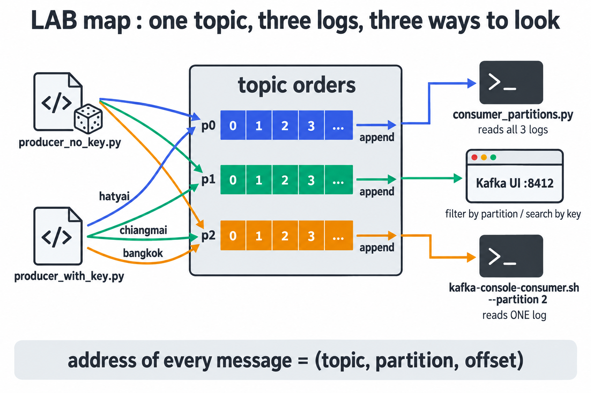
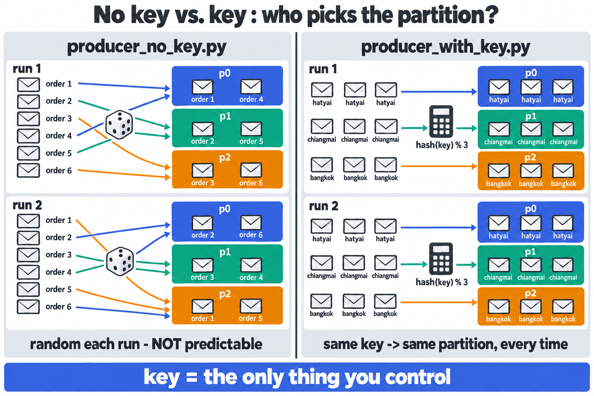

# LAB 2 — Partitions & Keys : ใครเป็นคนเลือกว่าข้อความลง partition ไหน

> โฟลเดอร์ `002_LAB_Partitions_Keys` = **LAB 2** ในสไลด์ `Kafka_Slides.html` (ต่อจาก LAB 1 ที่ส่ง–รับข้อความแรกผ่าน topic เดียวแบบยังไม่สน partition)
> ไฟล์ในโฟลเดอร์นี้ : `docker-compose.yml` · `producer_no_key.py` · `producer_with_key.py` · `consumer_partitions.py` · `hash_key.py` · `requirements.txt`

> 🖥️ **แล็บนี้ใช้ terminal หน้าต่างเดียวตลอดทั้งแล็บ** — ไม่มีคำสั่งไหนค้างรอ (consumer จบเองใน 5 วินาที · console producer ส่งผ่าน pipe) และหน้าเว็บ Kafka UI เปิดจากเบราว์เซอร์ของเราได้ตรง ๆ ที่ `http://localhost:8412` ไม่ต้อง forward port

## สิ่งที่จะได้เรียนรู้

- topic ถูกผ่าเป็นหลาย **partition** แต่ละอันคือ **append-only log** แยกเล่ม มี **offset** ของตัวเอง — ที่อยู่เต็มของทุกข้อความคือ **(topic, partition, offset)**
- **กฎเลือก partition 3 ชั้น** : ระบุ partition ตรง ๆ > `hash(key) % N` > producer เลือกเอง — พิสูจน์ครบทั้งสามชั้นด้วยมือ
- **ทำนายล่วงหน้า** ได้ว่า key ไหนลงเล่มไหนด้วย `hash_key.py` ก่อนส่งจริง
- **ลำดับการันตีเฉพาะภายใน partition เดียว** — และเหตุผลที่การเพิ่มจำนวน partition ทำให้ mapping พังยกแผง
- ใช้ **Kafka UI** สืบสวน : นับข้อความรายเล่ม · กรองทีละ partition · ค้นด้วย key · Statistics

## ลำดับการทำแล็บ

เตรียมเครื่องเรียน → `docker compose up -d` (ได้ topic `orders` 3 partitions มาเลย) → venv → ส่ง **ไม่มี key** 2 รอบ → ส่ง **มี key** 2 รอบ → **เจาะทฤษฎี** → อ่านทั้ง topic → สืบสวนใน Kafka UI → เจาะอ่าน partition เดียว → **ทดลองเพิ่มเติม 3 ข้อ**



---

## 1. เตรียมเครื่องเรียน + โค้ดแล็บ

เปิด container ที่ติดตั้ง Docker มาให้แล้ว (บนเครื่องของเราเอง ไม่ใช้ cloud) — **แล็บนี้เปิด port `8412` เพิ่ม** ให้หน้าเว็บ Kafka UI ทะลุออกมาถึงเบราว์เซอร์ของเรา :

```bash
docker rm -f devtools
docker run -dit --name devtools --privileged -p 2222:22 -p 8412:8412 tuchsanai/devtools:2569_1
ssh root@localhost -p 2222        # password : passwd
```

> 📝 **คำอธิบาย:** `docker rm -f devtools` ลบเครื่องเรียนตัวเดิมกันชื่อซ้ำ · `--privileged` จำเป็นเพราะ Kafka ของแล็บนี้เป็น container ที่รัน **ซ้อนอยู่ข้างในเครื่องเรียน** · `-p 2222:22` คือ SSH · **`-p 8412:8412`** เปิดทางให้เบราว์เซอร์เห็น Kafka UI โดยไม่ต้อง forward port — เลขต้องตรงกับฝั่งซ้ายของ `ports:` ใน `docker-compose.yml` (LAB 1 ใช้ `8411` · แล็บนี้ `8412` · เลี่ยง `8080`/`80`/`8888` ที่ชนกับโปรแกรมอื่นง่าย)

ใน VS Code ใช้ **Remote-SSH** ต่อไปที่ `root@localhost:2222` · **คำสั่งที่เหลือทั้งหมดพิมพ์ข้างในเครื่องเรียน** :

```bash
docker compose version
mkdir -p ~/labwork && cd ~/labwork
git clone https://github.com/Tuchsanai/DevTools.git
cd DevTools/03_Application_Docker/02_Message_Brokers/02_Kafka/002_LAB_Partitions_Keys
ls
```

> 📝 **คำอธิบาย:** `docker compose version` ยืนยันว่า Docker ข้างในตื่นแล้ว (ถ้าขึ้น `Cannot connect to the Docker daemon` รอสักครู่แล้วลองใหม่) · เคย clone จาก LAB 1 แล้วข้าม `git clone` ได้

✅ **Expected output** — เห็นเลขเวอร์ชัน แล้ว `ls` เห็นไฟล์ครบ:

```
Docker Compose version v5.3.1
consumer_partitions.py  docker-compose.yml  hash_key.py  images
producer_no_key.py  producer_with_key.py  readme.md  requirements.txt
```

---

## 2. เปิด Kafka broker + Kafka UI ด้วย `docker compose`

แล็บนี้มี **service ตัวที่สาม** เพิ่มจาก LAB 1 คือ `kafka-init` ที่สร้าง topic `orders` แบบ **3 partitions** ให้อัตโนมัติ — เปิด `docker-compose.yml` ดูก่อน :

```yaml
services:
  kafka:
    image: apache/kafka:4.1.0
    container_name: kafka
    ports:
      - "9092:9092"          # ประตูที่โปรแกรม Python ใช้ (localhost:9092)
    environment:
      # --- โหมด KRaft : broker เป็น controller ในตัว ไม่ต้องมี ZooKeeper ---
      KAFKA_NODE_ID: 1
      KAFKA_PROCESS_ROLES: broker,controller
      KAFKA_CONTROLLER_LISTENER_NAMES: CONTROLLER
      KAFKA_CONTROLLER_QUORUM_VOTERS: 1@kafka:9093

      # --- สองประตูคนละบาน : HOST ให้คนนอก · DOCKER ให้เพื่อนใน compose ---
      KAFKA_LISTENERS: HOST://0.0.0.0:9092,DOCKER://0.0.0.0:19092,CONTROLLER://0.0.0.0:9093
      KAFKA_ADVERTISED_LISTENERS: HOST://localhost:9092,DOCKER://kafka:19092
      KAFKA_LISTENER_SECURITY_PROTOCOL_MAP: HOST:PLAINTEXT,DOCKER:PLAINTEXT,CONTROLLER:PLAINTEXT
      KAFKA_INTER_BROKER_LISTENER_NAME: DOCKER

      # --- broker เดียว จึงตั้งสำเนาของ topic ภายในเป็น 1 ทั้งหมด ---
      KAFKA_OFFSETS_TOPIC_REPLICATION_FACTOR: 1
      KAFKA_TRANSACTION_STATE_LOG_REPLICATION_FACTOR: 1
      KAFKA_TRANSACTION_STATE_LOG_MIN_ISR: 1
      KAFKA_GROUP_INITIAL_REBALANCE_DELAY_MS: 0
    healthcheck:
      test: ["CMD-SHELL", "/opt/kafka/bin/kafka-broker-api-versions.sh --bootstrap-server localhost:9092 >/dev/null 2>&1"]
      interval: 5s
      timeout: 10s
      retries: 20

  # --- รันครั้งเดียวแล้วจบ : สร้าง topic orders 3 partitions ให้อัตโนมัติ ---
  kafka-init:
    image: apache/kafka:4.1.0
    container_name: kafka-init
    depends_on:
      kafka:
        condition: service_healthy   # รอจน broker ตอบได้จริง ค่อยสั่งสร้าง topic
    entrypoint: ["/bin/sh", "-c"]
    command:
      - |
        /opt/kafka/bin/kafka-topics.sh --bootstrap-server kafka:19092 \
          --create --if-not-exists --topic orders --partitions 3 --replication-factor 1
        /opt/kafka/bin/kafka-topics.sh --bootstrap-server kafka:19092 \
          --describe --topic orders
    restart: "no"                    # ทำเสร็จแล้วหยุด (Exited 0) ไม่ต้องเปิดใหม่

  kafka-ui:
    image: kafbat/kafka-ui:latest
    container_name: kafka-ui
    ports:
      - "8412:8080"          # หน้าเว็บ : เครื่องเรา 8412 -> ในกล่อง 8080
    environment:
      KAFKA_CLUSTERS_0_NAME: local
      KAFKA_CLUSTERS_0_BOOTSTRAPSERVERS: kafka:19092
      DYNAMIC_CONFIG_ENABLED: "true"
    depends_on:
      kafka:
        condition: service_healthy   # รอจน broker ตอบได้จริง ค่อยเปิด UI
```

### 2.1 สามจุดที่ต้องเข้าใจ

**(ก) broker มีประตูสองบาน** — โปรแกรม Python รัน *นอก* compose เรียก broker ว่า `localhost:9092` · ส่วน `kafka-ui` กับ `kafka-init` รัน *ใน* compose เรียกด้วยชื่อ service `kafka:19092` (คำว่า `localhost` ของมันคือตัวมันเอง) · Kafka จึงเปิด **listener สองบาน** และ `ADVERTISED_LISTENERS` บอกว่าใครเข้าประตูไหนให้ตอบกลับด้วยที่อยู่ไหน — จุดนี้ผิดเมื่อไร client จะ "ต่อติดแล้วค้าง"


**(ข) `healthcheck` + `depends_on: condition: service_healthy`** — `Up` ≠ พร้อม · Docker ยิง `kafka-broker-api-versions.sh` ถาม broker ทุก 5 วินาที และ compose **กั้น `kafka-ui` / `kafka-init` ไว้จนกว่า broker จะ healthy** เราไม่ต้องนั่ง `docker logs` เฝ้าเอง

**(ค) `kafka-init` = init container** — ใช้ image เดียวกับ broker (เพราะมี `kafka-topics.sh` อยู่ข้างใน) แต่ **ทับ `entrypoint`** ให้รันคำสั่งสร้าง topic แล้วจบ → สถานะ `Exited (0)` คือ **ถูกต้อง** ไม่ใช่พัง · `--if-not-exists` ทำให้สั่ง `up -d` ซ้ำได้โดยไม่ล้มด้วย `TopicExistsException` · ของจริงใช้ท่านี้กับงานเตรียมระบบทุกชนิด (สร้าง topic · สร้างตาราง · seed data)

### 2.2 เปิดทั้งชุด

```bash
docker compose up -d
```

> 📝 **คำอธิบาย:** อ่าน `docker-compose.yml` ใน **โฟลเดอร์ปัจจุบัน** แล้วสร้าง network + container ให้ครบ · `-d` = รันเบื้องหลัง · ครั้งแรกจะ pull image ก่อน (ใช้เวลาสักพัก) · บรรทัดที่ต้องมองหาคือ **`Container kafka Healthy`** แล้วค่อยตามด้วย `kafka-init Started` และ `kafka-ui Started`

✅ **Expected output** — ท้าย log ต้องเห็นลำดับนี้ (`Waiting` / `Healthy` ขึ้นสองครั้งเพราะมีคนรอ `kafka` อยู่สองคน):

```
 Container kafka  Started
 Container kafka  Waiting
 Container kafka  Waiting
 Container kafka  Healthy
 Container kafka-init  Starting
 Container kafka  Healthy
 Container kafka-ui  Starting
 Container kafka-init  Started
 Container kafka-ui  Started
```

เช็กสถานะ (ใส่ `-a` ถึงจะเห็น `kafka-init` ที่จบไปแล้ว) :

```bash
docker compose ps -a
```

✅ **Expected output** — `kafka` ต้องเป็น **`Up (healthy)`** · `kafka-init` เป็น **`Exited (0)`** · `kafka-ui` map `8412->8080` (ถ้า `kafka-init` ยังเป็น `Up` รอ 5 วินาทีแล้วสั่งซ้ำ):

```
NAME         IMAGE                    COMMAND                  SERVICE      CREATED          STATUS                     PORTS
kafka        apache/kafka:4.1.0       "/__cacert_entrypoin…"   kafka        16 seconds ago   Up 14 seconds (healthy)    0.0.0.0:9092->9092/tcp, [::]:9092->9092/tcp
kafka-init   apache/kafka:4.1.0       "/bin/sh -c '/opt/ka…"   kafka-init   16 seconds ago   Exited (0) 5 seconds ago
kafka-ui     kafbat/kafka-ui:latest   "/bin/sh -c 'java --…"   kafka-ui     16 seconds ago   Up 8 seconds               0.0.0.0:8412->8080/tcp, [::]:8412->8080/tcp
```

เปิดเบราว์เซอร์บนเครื่องเราไปที่ **`http://localhost:8412`** — ต้องเห็น Dashboard cluster `local` Online (UI อุ่นเครื่องราว 10 วินาที ถ้ายังไม่ขึ้นรีเฟรชอีกครั้ง)

---

## 3. เตรียม Python (venv + kafka-python)

```bash
python3 -m venv ~/venv-kafka
source ~/venv-kafka/bin/activate
pip install -r requirements.txt
```

> 📝 **คำอธิบาย:** Python ในเครื่องเรียนเปิดกฎ PEP 668 — `pip install` นอก venv จะโดนปฏิเสธ · `~/venv-kafka` ใช้ร่วมกันได้ทุกแล็บของชุด Kafka (สร้างไว้แล้วจาก LAB 1 ข้ามบรรทัดแรกได้) · `requirements.txt` ล็อก `kafka-python==3.0.10`

✅ **Expected output** — บรรทัดสุดท้าย `Successfully installed kafka-python-3.0.10` (ถ้ามีแล้วจะขึ้น `Requirement already satisfied` — ใช้ได้เหมือนกัน) และ prompt ต้องขึ้น **`(venv-kafka)`** นำหน้าตลอดแล็บ

---

## 4. ตรวจ topic `orders` ที่ `kafka-init` สร้างให้ — 3 partitions

```bash
docker exec kafka /opt/kafka/bin/kafka-topics.sh --bootstrap-server localhost:9092 \
  --describe --topic orders
```

> 📝 **คำอธิบาย:** `kafka-topics.sh` คือ CLI จัดการ topic — อยู่ **ข้างใน image `apache/kafka`** จึงสั่งผ่าน `docker exec kafka ...` · คราวนี้ `--bootstrap-server` เป็น `localhost:9092` เพราะเรายืนอยู่ **ใน container `kafka` เอง** (ต่างจาก `kafka-init` ที่ต้องใช้ `kafka:19092` — คือข้อ 2.1 (ก) ในรูปแบบจับต้องได้) · **Leader: 1** = partition นี้อยู่ในมือ broker id 1 · **Replicas / Isr** = สำเนา / สำเนาที่ตามทัน · `Elr` ว่างแบบนี้ถูกต้องใน Kafka 4.x

✅ **Expected output** — `PartitionCount: 3` ครบ 3 แถว (TopicId ของแต่ละคนจะไม่ตรงกับเอกสารนี้):

```
Topic: orders	TopicId: uUHOLEZdR3-Rf9f0FhuHVQ	PartitionCount: 3	ReplicationFactor: 1	Configs: min.insync.replicas=1
	Topic: orders	Partition: 0	Leader: 1	Replicas: 1	Isr: 1	Elr: 	LastKnownElr:
	Topic: orders	Partition: 1	Leader: 1	Replicas: 1	Isr: 1	Elr: 	LastKnownElr:
	Topic: orders	Partition: 2	Leader: 1	Replicas: 1	Isr: 1	Elr: 	LastKnownElr:
```

> อยากดูว่า `kafka-init` ทำอะไรไป : `docker logs kafka-init` จะเห็น `Created topic orders.` ตามด้วยตารางเดียวกันนี้ทุกตัวอักษร

> **ภาพในหัวที่ต้องมี :** `orders` คือสมุด 3 เล่ม (p0 · p1 · p2) แต่ละเล่มเขียนได้แบบ **ต่อท้ายอย่างเดียว** มีเลขบรรทัดของตัวเองเรียก **offset** เริ่มที่ 0 — คำถามของทั้งแล็บคือ *ข้อความหนึ่ง ๆ จะถูกจดลงเล่มไหน?*

---

## 5. ส่งแบบไม่มี key — `producer_no_key.py`

```python
from kafka import KafkaProducer

# 1) ต่อ broker เหมือนแล็บก่อน
producer = KafkaProducer(bootstrap_servers='localhost:9092')

# 2) ส่ง 6 ข้อความ "โดยไม่ใส่ key" — ให้ Kafka เลือก partition ให้เอง
for i in range(1, 7):
    message = f'order {i}'
    metadata = producer.send('orders', message.encode()).get(timeout=10)
    # 3) ดูใบเสร็จ : แต่ละข้อความไปลง partition ไหน — สังเกตว่า "เดาไม่ได้"
    print(f" [x] Sent '{message}'  ->  partition={metadata.partition} offset={metadata.offset}")

producer.close()
```

> 📝 **คำอธิบาย:** **(2)** Kafka รับเป็น bytes จึงต้อง `.encode()` และเมื่อ **ไม่ใส่ key** ไลบรารีฝั่งผู้ส่งจะเลือก partition ให้เอง · **(3)** `send()` คืน future — `.get(timeout=10)` รอ "ใบเสร็จ" (`RecordMetadata`) ที่บอกว่าไปลง **partition ไหน · offset เท่าไร** — พระเอกของแล็บนี้

รัน **สองรอบ** :

```bash
python producer_no_key.py
python producer_no_key.py
```

✅ **Expected output** — **partition ของแต่ละคนจะไม่ตรงกับเอกสารนี้ นั่นแหละคือประเด็น** (รอบ 1 แล้วรอบ 2):

```
 [x] Sent 'order 1'  ->  partition=0 offset=0
 [x] Sent 'order 2'  ->  partition=1 offset=0
 [x] Sent 'order 3'  ->  partition=1 offset=1
 [x] Sent 'order 4'  ->  partition=1 offset=2
 [x] Sent 'order 5'  ->  partition=1 offset=3
 [x] Sent 'order 6'  ->  partition=1 offset=4
```
```
 [x] Sent 'order 1'  ->  partition=2 offset=0
 [x] Sent 'order 2'  ->  partition=1 offset=5
 [x] Sent 'order 3'  ->  partition=1 offset=6
 [x] Sent 'order 4'  ->  partition=0 offset=1
 [x] Sent 'order 5'  ->  partition=0 offset=2
 [x] Sent 'order 6'  ->  partition=2 offset=1
```

> **อ่านผลสองรอบเทียบกัน :**
> - **คอลัมน์ partition ของรอบ 2 ไม่เหมือนรอบ 1** — `kafka-python` เมื่อไม่มี key จะ **สุ่มเล่มใหม่ทุกใบ** (บางรอบอาจบังเอิญตกเล่มเดียวกันหลายใบ ไม่ใช่บั๊ก)
> - **offset ไม่รีเซ็ต** — วิ่งต่อจากของเดิมในแต่ละเล่ม เพราะ log เขียนต่อท้ายอย่างเดียว
> - บทเรียนคือ "ไม่มี key = **คุมไม่ได้**" ไม่ใช่ "ต้องกระจายเท่ากัน"

---

## 6. ส่งแบบมี key — `producer_with_key.py`

```python
from kafka import KafkaProducer

# 1) ต่อ broker เหมือนเดิม
producer = KafkaProducer(bootstrap_servers='localhost:9092')

# 2) คราวนี้ทุกข้อความมี key = ชื่อสาขาของร้าน (bangkok / chiangmai / hatyai)
#    Kafka จะเอา key ไป hash → ได้เลข partition เดิมเสมอสำหรับ key เดิม
branches = ['bangkok', 'chiangmai', 'hatyai']

# 3) ส่งสาขาละ 3 ออเดอร์ (รวม 9 ข้อความ) — key ต้องเป็น bytes เช่นกัน
for round_no in range(1, 4):
    for branch in branches:
        message = f'{branch} order #{round_no}'
        metadata = producer.send('orders',
                                 key=branch.encode(),
                                 value=message.encode()).get(timeout=10)
        # 4) สังเกตใบเสร็จ : key เดียวกัน → partition เดิม ทุกครั้ง ไม่มีข้อยกเว้น
        print(f" [x] key={branch:9s} -> partition={metadata.partition} "
              f"offset={metadata.offset}  ('{message}')")

producer.close()
```

> 📝 **คำอธิบาย:** ต่างจากข้อ 5 แค่จุดเดียวคือเพิ่ม `key=branch.encode()` เข้าไปใน `send()` · key ต้องเป็น **bytes** เหมือน value

รัน **สองรอบ** :

```bash
python producer_with_key.py
python producer_with_key.py
```

✅ **Expected output** (รอบแรก) — **คอลัมน์ partition ชุดนี้ทุกคนต้องได้เหมือนกันเป๊ะ**:

```
 [x] key=bangkok   -> partition=2 offset=2  ('bangkok order #1')
 [x] key=chiangmai -> partition=1 offset=7  ('chiangmai order #1')
 [x] key=hatyai    -> partition=0 offset=3  ('hatyai order #1')
 [x] key=bangkok   -> partition=2 offset=3  ('bangkok order #2')
 [x] key=chiangmai -> partition=1 offset=8  ('chiangmai order #2')
 [x] key=hatyai    -> partition=0 offset=4  ('hatyai order #2')
 [x] key=bangkok   -> partition=2 offset=4  ('bangkok order #3')
 [x] key=chiangmai -> partition=1 offset=9  ('chiangmai order #3')
 [x] key=hatyai    -> partition=0 offset=5  ('hatyai order #3')
```



> **นี่คือหัวใจของแล็บ — เทียบกับข้อ 5 :**
> - `bangkok → p2` · `chiangmai → p1` · `hatyai → p0` **ทั้ง 18 ใบจากสองรอบ ไม่มีข้อยกเว้น** (รอบ 2 ได้เล่มเดิม offset วิ่งต่อเป็น 5–7 · 10–12 · 6–8)
> - offset ของเราอาจไม่ตรงเอกสาร (ขึ้นกับว่าข้อ 5 สุ่มลงเล่มไหนไปกี่ใบ) แต่ **คอลัมน์ partition ต้องตรงเป๊ะ** — ข้อ 7.3 จะพิสูจน์ด้วยเครื่องคิดเลข

ตอนนี้ topic `orders` มี **30 ข้อความ** = 12 (ไม่มี key) + 18 (มี key)

---

## 7. เจาะทฤษฎี : Partitions & Keys ทำงานยังไงกันแน่

### 7.1 partition คืออะไรกันแน่


- `topic` เป็นแค่ **ชื่อ** — ของจริงที่เก็บข้อมูลคือ **partition** = ไฟล์ log ที่เขียนต่อท้ายอย่างเดียว ลงดิสก์จริง
- **offset** = เลขบรรทัดในเล่มนั้น เริ่มที่ 0 นับขึ้นเรื่อย ๆ **ไม่เคยถอยหลัง** · offset ของ p0 กับ p1 **ไม่เกี่ยวกัน** — ที่อยู่ที่ไม่ซ้ำใครจึงต้องครบ **(topic, partition, offset)**
- การอ่าน **ไม่ลบข้อความ** — consumer แค่เลื่อน "ที่คั่นหนังสือ" ของตัวเอง (ต่างจาก RabbitMQ ที่ ack แล้วหาย)
- ผ่าเป็นหลายเล่มเพื่อกระจายไปหลาย broker และให้ consumer หลายตัวช่วยกันอ่านคนละเล่ม — **จำนวน partition คือเพดานของความขนานฝั่งผู้อ่าน** (LAB 3)

### 7.2 กฎการเลือก partition — 3 ชั้น

producer ไล่ถามตามลำดับนี้ **หยุดที่ข้อแรกที่ตอบได้** :


| ลำดับ | เงื่อนไข | ผลลัพธ์ | เจอที่ไหนในแล็บนี้ |
|---|---|---|---|
| **1** | โปรแกรม **ระบุเลข partition ตรง ๆ** | ใช้เลขนั้น — **key ถูกมองข้าม** | ทดลองเพิ่มเติม ข. (ส่งจาก Kafka UI) |
| **2** | ไม่ระบุ partition แต่ **มี key** | `(murmur2(key) & 0x7fffffff) % จำนวน partition` | ข้อ 6 |
| **3** | ไม่ระบุทั้งคู่ | producer เลือกเอง — **คุมไม่ได้** | ข้อ 5 |

> **จุดที่คนพลาดบ่อยที่สุด :** ชั้น 1 ชนะชั้น 2 เสมอ — ใส่ key มาสวยแค่ไหน ถ้าโค้ดเผลอระบุ `partition=0` ไปด้วย key ก็เป็นแค่ป้ายที่ติดไปกับข้อความ

### 7.3 คำนวณ hash ด้วยมือ — `hash_key.py`

ชั้นที่ 2 เป็นคณิตศาสตร์ล้วน ไม่มีการสุ่ม เราจึง **ทำนายล่วงหน้าได้** :


```python
from kafka.partitioner.default import murmur2

# สูตรเดียวกับที่ producer ใช้ : murmur2(key) -> ตัดเครื่องหมายลบ -> หารเอาเศษด้วยจำนวน partition
for key in ['bangkok', 'chiangmai', 'hatyai', 'korat']:
    h = murmur2(key.encode()) & 0x7fffffff
    print(f'{key:10s} hash={h:>10d}   %3 -> p{h % 3}   %4 -> p{h % 4}')
```

> 📝 **คำอธิบาย:** `murmur2` คือ hash ตัวเดียวกับ Java client ของ Kafka — ข้อความจาก Python, Java, Go หรือหน้าเว็บที่ใช้ key เดียวกันจึง **ลงเล่มเดียวกันข้ามภาษา** · `& 0x7fffffff` บังคับให้เป็นเลขบวก · `% 3` = หารเอาเศษด้วย **จำนวน partition ปัจจุบัน** — คอลัมน์ `%4` ใส่เทียบไว้ก่อน เดี๋ยวได้ใช้ในทดลองเพิ่มเติม ค.

```bash
python hash_key.py
```

✅ **Expected output** — **ทุกคนต้องได้เหมือนกันเป๊ะ** เพราะเป็นคณิตศาสตร์:

```
bangkok    hash= 365349053   %3 -> p2   %4 -> p1
chiangmai  hash=  34321306   %3 -> p1   %4 -> p2
hatyai     hash= 431853363   %3 -> p0   %4 -> p3
korat      hash=1798336970   %3 -> p2   %4 -> p2
```

> **เทียบกับใบเสร็จข้อ 6 :** คอลัมน์ `%3` บอก `bangkok→p2` · `chiangmai→p1` · `hatyai→p0` — **ตรงกับผลจริงทั้ง 18 ใบ** · "ที่ bangkok ลง p2 ไม่ใช่เรื่องบังเอิญ มันคือเศษของ 365349053 หาร 3" · สังเกตคอลัมน์ `%4` ไว้ด้วย — เปลี่ยนตัวหาร **คำตอบเปลี่ยนหมดทุก key**

### 7.4 "ลำดับการันตี" การันตีแค่ไหน

**Kafka การันตีลำดับ "ภายใน partition เดียว" เท่านั้น — ไม่การันตีข้าม partition**


| สถานการณ์ | การันตีไหม | เพราะอะไร |
|---|---|---|
| `bangkok order #1 → #2 → #3` (key เดียวกัน) | ✅ | key เดียวกัน → เล่มเดียวกัน → offset ไล่กัน |
| `bangkok order #1` เทียบกับ `hatyai order #1` | ❌ | คนละเล่ม (p2 vs p0) — consumer อ่านเล่มไหนก่อนก็ได้ |
| `order 1 → order 6` (ไม่มี key) | ❌ | สุ่มกระจายหลายเล่ม |

> **วิธีเลือก key ในงานจริงคือตอบคำถามว่า "ลำดับของอะไรที่ห้ามสลับ"** — ออเดอร์ของลูกค้าคนเดียวกัน → `customer_id` · เหตุการณ์ของอุปกรณ์เดียวกัน → `device_id`
> **ราคาที่ต้องจ่าย :** key ตายตัวแปลว่าถ้า key กระจุก งานก็กระจุก (90% ออเดอร์มาจาก bangkok → p2 บวมคนเดียว เพิ่มเครื่องก็ไม่ช่วย) เรียกว่า **hot partition** — แก้ด้วย key ที่กระจายดีกว่า (เช่น `order_id`) หรือ salting (`bangkok-0`, `bangkok-1`, …)


---

## 8. อ่านทั้ง topic — `consumer_partitions.py`

```python
from kafka import KafkaConsumer

# 1) อ่าน topic 'orders' ตั้งแต่ข้อความแรกสุด (ไม่ใส่ group_id -> รันซ้ำกี่รอบก็ได้ครบเหมือนเดิม)
#    consumer_timeout_ms=5000 : ถ้าไม่มีข้อความใหม่มา 5 วินาที ให้จบเอง ไม่ต้องกด Ctrl+C
consumer = KafkaConsumer('orders',
                         bootstrap_servers='localhost:9092',
                         auto_offset_reset='earliest',
                         consumer_timeout_ms=5000)

count = 0
try:
    # 2) พิมพ์ "ที่อยู่" ของทุกข้อความ : partition / offset / key / เนื้อข้อความ
    #    (key ของข้อความที่ส่งแบบไม่ใส่ key จะเป็น None)
    for message in consumer:
        key = message.key.decode() if message.key else None
        print(f" [x] partition={message.partition} offset={message.offset} "
              f"key={key}  value={message.value.decode()}")
        count += 1
finally:
    consumer.close()

print(f" [*] Done - read {count} messages")
```

> 📝 **คำอธิบาย:** **(1)** `auto_offset_reset='earliest'` = เริ่มอ่านจากข้อความแรกสุดของทุกเล่ม (default คือ `latest` = รอเฉพาะของใหม่ หน้าจอจะว่าง) · **ไม่ใส่ `group_id`** → ไม่จดตำแหน่งที่อ่านไว้ที่ broker จึง **รันซ้ำกี่รอบก็ได้ครบเหมือนเดิม** (เรื่อง group อยู่ LAB 3) · `consumer_timeout_ms=5000` ทำให้โปรแกรม **จบเอง** หลังอ่านหมดแล้วเงียบ 5 วินาที — prompt กลับมาโดยไม่ต้องกด Ctrl+C · **(2)** `finally: consumer.close()` ปิดการเชื่อมต่อให้เรียบร้อยเสมอ

```bash
python consumer_partitions.py
```

✅ **Expected output** — ครบ 30 ข้อความ แล้วจบเองใน ~5 วินาที (**บรรทัด `key=None` ของแต่ละคนจะอยู่คนละเล่มกับเอกสาร**):

```
 [x] partition=2 offset=0 key=None  value=order 1
 [x] partition=2 offset=1 key=None  value=order 6
 [x] partition=2 offset=2 key=bangkok  value=bangkok order #1
 [x] partition=2 offset=3 key=bangkok  value=bangkok order #2
 [x] partition=2 offset=4 key=bangkok  value=bangkok order #3
 [x] partition=2 offset=5 key=bangkok  value=bangkok order #1
 [x] partition=2 offset=6 key=bangkok  value=bangkok order #2
 [x] partition=2 offset=7 key=bangkok  value=bangkok order #3
 [x] partition=1 offset=0 key=None  value=order 2
 [x] partition=1 offset=1 key=None  value=order 3
 [x] partition=1 offset=2 key=None  value=order 4
 [x] partition=1 offset=3 key=None  value=order 5
 [x] partition=1 offset=4 key=None  value=order 6
 [x] partition=1 offset=5 key=None  value=order 2
 [x] partition=1 offset=6 key=None  value=order 3
 [x] partition=1 offset=7 key=chiangmai  value=chiangmai order #1
 [x] partition=1 offset=8 key=chiangmai  value=chiangmai order #2
 [x] partition=1 offset=9 key=chiangmai  value=chiangmai order #3
 [x] partition=1 offset=10 key=chiangmai  value=chiangmai order #1
 [x] partition=1 offset=11 key=chiangmai  value=chiangmai order #2
 [x] partition=1 offset=12 key=chiangmai  value=chiangmai order #3
 [x] partition=0 offset=0 key=None  value=order 1
 [x] partition=0 offset=1 key=None  value=order 4
 [x] partition=0 offset=2 key=None  value=order 5
 [x] partition=0 offset=3 key=hatyai  value=hatyai order #1
 [x] partition=0 offset=4 key=hatyai  value=hatyai order #2
 [x] partition=0 offset=5 key=hatyai  value=hatyai order #3
 [x] partition=0 offset=6 key=hatyai  value=hatyai order #1
 [x] partition=0 offset=7 key=hatyai  value=hatyai order #2
 [x] partition=0 offset=8 key=hatyai  value=hatyai order #3
 [*] Done - read 30 messages
```

> **จุดที่ต้องสังเกต :**
> - ข้อความมาเป็น **ก้อนตาม partition** ไม่ได้เรียงตามเวลาที่ส่ง — consumer ดึงมาทีละเล่ม
> - **ภายในเล่มเดียวกัน offset เรียง 0, 1, 2, … เสมอ** ← "ลำดับการันตี" ของข้อ 7.4 ที่เห็นเป็นตัวเลขจริง
> - ทุกใบของ `hatyai` อยู่ p0 · `chiangmai` อยู่ p1 · `bangkok` อยู่ p2 ไม่มีปน · `key=None` กระจัดกระจาย
> - **รันซ้ำอีกรอบ** ได้ครบ 30 เหมือนเดิม เพราะการอ่านไม่ลบข้อความ

---

## 9. สืบสวน partition และ key ใน Kafka UI

เปิด **`http://localhost:8412`** → เมนู **Topics** ด้านซ้าย → คลิก `orders` · ทุกภาพข้างล่างเก็บจากสถานะ "หลังจบข้อ 8" คือ topic มี **30 ข้อความ**

### 9.1 แท็บ Overview — นับหัวรายเล่ม


> 📝 **จุดที่ต้องดู:** **Partitions: 3** · **Message Count: 30** = 12 + 18 · ตารางล่าง p0 = 9 · p1 = 13 · p2 = 8 (**ตัวเลขรายเล่มของเราจะไม่ตรงเอกสาร** เพราะฝั่งไม่มี key สุ่ม แต่รวมต้องได้ 30) · **Next Offset = เลขที่ใบถัดไปจะได้** ไม่ใช่ offset ของใบสุดท้าย (ใบสุดท้ายของ p0 คือ 8 ไม่ใช่ 9) ← จุดที่คนอ่านผิดบ่อยที่สุด · **Clean Up Policy: DELETE** = ลบตามอายุ ไม่ใช่ compact

### 9.2 แท็บ Messages — กรองดูทีละ partition

คลิกแท็บ **Messages** → ช่อง **Select partitions** ติ๊กเฉพาะ **Partition #2** → สลับโหมดซ้ายสุดเป็น **Oldest** → กด **Refresh** :


> 📝 **ภาพนี้คือหน้าตาของ log หนึ่งเล่ม:** มุมขวาบน **`8 messages consumed`** ตรงกับ Message Count ของ p2 ใน Overview · **Offset เรียง 0 → 7** · สองแถวแรก Key ว่าง = `null` จากข้อ 5 ที่สุ่มตกเล่มนี้ ตามด้วย **bangkok 6 ใบเรียง #1 #2 #3 #1 #2 #3** · **ไม่มี chiangmai / hatyai โผล่แม้แต่ใบเดียว** · ติ๊ก #0 จะเจอแต่ `hatyai` + null · #1 เจอแต่ `chiangmai` + null

### 9.3 ค้นด้วย key — ตามรอยสาขาเดียวข้ามทั้ง topic

ล้างตัวกรอง partition ออก แล้วพิมพ์ `bangkok` ในช่อง **Search** มุมขวาบน กด Enter :


> 📝 **จุดที่ต้องดู:** ได้ **6 แถว** และ Partition เป็น **2 ทั้ง 6 แถว** · offset ไล่ 2 → 7 เนื้อความเรียง `#1 #2 #3 #1 #2 #3` = สองรอบของข้อ 6 **ต่อคิวกันไม่มีอะไรแทรก** ← "ลำดับการันตีต่อ key" ที่เห็นเป็นภาพ · ช่อง Search ค้นแบบ substring ทั้ง key และ value ฝั่ง UI ไม่ใช่ index — สะดวกในห้องเรียน แต่อย่าคาดหวังความเร็วกับ topic ใหญ่

### 9.4 แท็บ Statistics — สรุปสถิติทั้ง topic

คลิกแท็บ **Statistics** → ปุ่ม **Start Analysis** :


> 📝 **จุดที่ต้องดู:** **Total number: 30** · **Null keys: 12** = `producer_no_key.py` สองรอบ · **Unique keys: 3** = `bangkok` `chiangmai` `hatyai` (จำนวน key ที่ *ไม่ซ้ำ* ไม่ใช่จำนวนข้อความที่มี key) · **Key size Total 132 Bytes** = 6×7 + 6×9 + 6×6 ✔ · **ใช้หน้านี้ตรวจ key skew ในงานจริง** : Unique keys น้อยแต่ Total มหาศาล = เสี่ยง hot partition

### 9.5 ปุ่ม Produce Message — กับดักที่ต้องรู้

มุมขวาบนมีปุ่ม **Produce Message** กดแล้วได้ฟอร์มนี้ (ยัง **อย่าเพิ่งกดส่ง** — เดี๋ยวใช้จริงในทดลองเพิ่มเติม ข.) :


> 📝 **นี่คือกับดัก:** ช่องบนสุดคือ **Partition** ค่าเริ่มต้น **`Partition #0`** และ dropdown มีแค่ `#0` / `#1` / `#2` — **ไม่มีตัวเลือก "ให้ hash เลือกให้"** · ทุกข้อความจากฟอร์มนี้จึงเข้า **กฎชั้นที่ 1** ของข้อ 7.2 → key ที่พิมพ์จะถูกมองข้ามในการเลือกเล่ม

---

## 10. เจาะอ่าน partition เดียว — console consumer

Kafka ยอมให้เรา **เปิดอ่านเฉพาะเล่มเดียว** จาก CLI ได้ตรง ๆ (แบบเดียวกับข้อ 9.2 แต่ไม่ต้องใช้หน้าเว็บ) — เจาะ p2 :

```bash
docker exec kafka /opt/kafka/bin/kafka-console-consumer.sh --bootstrap-server localhost:9092 \
  --topic orders --partition 2 --from-beginning --max-messages 8 \
  --property print.key=true
```

> 📝 **คำอธิบาย:** `--partition 2` = อ่านเฉพาะเล่ม p2 · `--from-beginning` = เริ่มจาก offset 0 · `--max-messages 8` = อ่านครบ 8 ใบแล้ว **จบเอง** ไม่ต้องกด Ctrl+C — **เลข 8 คือ Message Count ของ p2 จากข้อ 9.1 ของเราอาจไม่ใช่ 8** (ใส่เกินจำนวนที่มี คำสั่งจะค้างรอข้อความใหม่ — กด Ctrl+C ออก) · `print.key=true` = พิมพ์ key นำหน้า (ไม่มี key ขึ้น `null`)

✅ **Expected output** — เห็นแต่ `bangkok` กับ `null` ไม่มีสาขาอื่นปน — ตรงกับข้อ 9.2 ทุกบรรทัด:

```
null	order 1
null	order 6
bangkok	bangkok order #1
bangkok	bangkok order #2
bangkok	bangkok order #3
bangkok	bangkok order #1
bangkok	bangkok order #2
bangkok	bangkok order #3
Processed a total of 8 messages
```

---

## ทดลองเพิ่มเติม

### ก. ทำนายก่อน แล้วค่อยส่ง — key หน้าใหม่ `korat`

ย้อนดู `hash_key.py` ข้อ 7.3 : `korat  hash=1798336970  %3 -> p2` → **ทำนาย : `korat` ต้องลง p2** (เล่มเดียวกับ bangkok — คนละ key แต่เศษหารตรงกันได้ ไม่แปลก)

ส่งของจริงด้วย console producer โดยไม่ต้องเขียนโค้ด — ป้อนสองบรรทัดผ่าน pipe ในหน้าต่างเดิม :

```bash
printf 'korat:korat order #1\nkorat:korat order #2\n' | docker exec -i kafka \
  /opt/kafka/bin/kafka-console-producer.sh --bootstrap-server localhost:9092 \
  --topic orders --property parse.key=true --property key.separator=:
```

> 📝 **คำอธิบาย:** `printf` พิมพ์สองบรรทัด `key:value` ส่งเข้า stdin ของ `docker exec -i` (ตัว `-i` ส่ง stdin เข้าไป ไม่ต้อง `-t` เพราะไม่ได้พิมพ์สด) · `parse.key=true` + `key.separator=:` สั่งให้ตีความส่วนหน้า `:` เป็น key · **ไม่ได้ระบุ `--partition`** จึงเข้ากฎชั้นที่ 2 ให้ hash ตัดสิน · สำเร็จแล้ว **ไม่พิมพ์อะไร** prompt กลับมาเฉย ๆ

แล้ว `korat` ลงเล่มไหนจริง? :

```bash
docker exec kafka /opt/kafka/bin/kafka-console-consumer.sh --bootstrap-server localhost:9092 \
  --topic orders --from-beginning --max-messages 32 \
  --property print.key=true --property print.partition=true --property print.offset=true | grep korat
```

> 📝 **คำอธิบาย:** ตอนนี้ topic มี 30 + 2 = **32 ข้อความ** จึง `--max-messages 32` ให้จบเอง · `print.partition` / `print.offset` เติมคอลัมน์ที่อยู่นำหน้า · `| grep korat` กรองเฉพาะแถวของเรา

✅ **Expected output** — สองใบลง **p2 ตามที่ทำนายไว้เป๊ะ**:

```
Processed a total of 32 messages
Partition:2	Offset:8	korat	korat order #1
Partition:2	Offset:9	korat	korat order #2
```

> **ย้ำบทเรียน :** ทำนายถูกเพราะ **มันเป็นคณิตศาสตร์ ไม่ใช่การจับฉลาก** · `korat` จะลง p2 **ตลอดไป** — ตราบใดที่ topic ยังมี 3 partitions (คำว่า "ตราบใดที่" คือประเด็นของทดลอง ค.)

### ข. ส่งจาก Kafka UI — ทำไม `korat` ใบนี้ถึงไม่ไป p2?

กลับไปหน้าเว็บ กดปุ่ม **Produce Message** (ฟอร์มข้อ 9.5) แล้วกรอก :

| ช่อง | ค่าที่กรอก |
|---|---|
| Partition | **ปล่อยไว้ตามค่าเริ่มต้น = `Partition #0`** |
| Key | `korat` |
| Value | `korat order #3 (sent from Kafka UI)` |

กด **Produce Message** ท้ายฟอร์ม · แล้วพิมพ์ `korat` ในช่อง **Search** ของแท็บ Messages :


✅ **Expected output** — สามแถว แต่ **ไม่ได้อยู่เล่มเดียวกัน**:

| Offset | Partition | Value |
|---|---|---|
| 8 | **2** | korat order #1 |
| 9 | **2** | korat order #2 |
| 9 | **0** | korat order #3 (sent from Kafka UI) |

> 📝 **เกิดอะไรขึ้น:** key เป็น `korat` เหมือนกันทั้งสามใบ แต่ใบที่สามไป **p0** เพราะฟอร์ม **ระบุ partition มาให้แล้ว** → กฎ **ชั้นที่ 1** ชนะ hash ของ key เสมอ ·
> **นี่คือบั๊กคลาสสิกในงานจริง** : โค้ดที่เผลอส่ง `partition=` ไปด้วย ทำให้ลำดับต่อ key พังเงียบ ๆ **โดยไม่มี error สักบรรทัด** · วิธีที่ถูกคือ **อย่าใส่ `partition=` เลย** ปล่อยให้ hash ทำงาน
>
> ตอนนี้ topic มี **33 ข้อความ**

### ค. เพิ่มจำนวน partition แล้วเกิดอะไรขึ้น — บทเรียนที่แพงที่สุดของ Kafka

จำคอลัมน์ `%4` ใน `hash_key.py` ได้ไหม — **ทำนายก่อน :** ถ้าเพิ่ม partition เป็น 4 แล้วส่งใหม่ `bangkok→p1` · `chiangmai→p2` · `hatyai→p3` — **ทั้งสามสาขาย้ายเล่มหมด ไม่มีใครอยู่ที่เดิม**


```bash
docker exec kafka /opt/kafka/bin/kafka-topics.sh --bootstrap-server localhost:9092 \
  --alter --topic orders --partitions 4

python producer_with_key.py
```

> 📝 **คำอธิบาย:** `--alter --partitions 4` ขยายจาก 3 เป็น 4 เล่ม — **เพิ่มได้อย่างเดียว ลดไม่ได้** และ **ไม่ย้ายข้อมูลเก่าแม้แต่ใบเดียว** แค่สร้างเล่มที่ 4 ว่าง ๆ เพิ่ม · สำเร็จแล้ว **ไม่พิมพ์อะไรเลย** · จากนั้นรัน producer ตัวเดิม **ที่ไม่ได้แก้โค้ดสักตัวอักษร**

✅ **Expected output** — mapping **เปลี่ยนยกแผงตรงตามคอลัมน์ `%4`**:

```
 [x] key=bangkok   -> partition=1 offset=13  ('bangkok order #1')
 [x] key=chiangmai -> partition=2 offset=10  ('chiangmai order #1')
 [x] key=hatyai    -> partition=3 offset=0  ('hatyai order #1')
 [x] key=bangkok   -> partition=1 offset=14  ('bangkok order #2')
 [x] key=chiangmai -> partition=2 offset=11  ('chiangmai order #2')
 [x] key=hatyai    -> partition=3 offset=1  ('hatyai order #2')
 [x] key=bangkok   -> partition=1 offset=15  ('bangkok order #3')
 [x] key=chiangmai -> partition=2 offset=12  ('chiangmai order #3')
 [x] key=hatyai    -> partition=3 offset=2  ('hatyai order #3')
```

> 📝 `hatyai` เริ่มที่ offset 0 — เพราะ p3 เป็นเล่มที่เพิ่งเกิด ยังไม่เคยมีใครเขียน

ดูผลกระทบใน UI — ค้น `bangkok` อีกครั้ง จะเห็น **key เดียว แต่แตกเป็นสองเล่ม** :


> **บทเรียนของข้อนี้ :**
> - สูตรคือ `hash % จำนวน partition` — **เปลี่ยนตัวหาร = เปลี่ยนคำตอบแทบทุก key** และข้อความเก่า **ไม่ถูกย้ายตาม**
> - ผลคือ **ลำดับต่อ key ขาดตอนตรงรอยต่อ** : ใครอ่าน p1 จะเห็น bangkok ชุดใหม่โดยไม่รู้ว่ามีชุดเก่าค้างใน p2 — ถ้าเป็นระบบตัดยอดเงินก็คิดเงินผิดลำดับได้เลย
> - ของจริงจึง **วางแผนจำนวน partition ให้เผื่อโตตั้งแต่วันแรก** และถือว่าการเพิ่ม partition ของ topic ที่ใช้ key เป็น operation ที่ต้องวางแผน (หยุด producer → ระบายของเก่า → ค่อยขยาย) หรือสร้าง topic ใหม่แล้วย้ายทีละฝั่ง
>
> ตอนนี้ topic มี **42 ข้อความ** — หน้า Overview แสดง 4 แถว : p0 = 10 · p1 = 16 · p2 = 13 · p3 = 3 และ p3 มี First Offset 0 / Next Offset 3 คือเล่มใหม่ที่เพิ่งเริ่มนับ
>
> 

---

## แก้ปัญหาที่พบบ่อย

| อาการ | สาเหตุ | วิธีแก้ |
|---|---|---|
| `docker compose up` ฟ้อง `no configuration file provided` | ยืนอยู่ผิดโฟลเดอร์ | `cd` เข้าโฟลเดอร์แล็บที่มี `docker-compose.yml` แล้วสั่งใหม่ |
| `Bind for 0.0.0.0:9092 failed: port is already allocated` | มี Kafka ตัวเก่าจาก LAB 1 ค้างอยู่ | `docker rm -f kafka kafka-ui` แล้ว `docker compose up -d` ใหม่ |
| `kafka-init` เป็น `Exited (1)` | คำสั่งสร้าง topic ล้ม (แก้ `--bootstrap-server` เป็น `localhost:9092` ผิดที่) | `docker logs kafka-init` อ่าน Error · ต้องเป็น `kafka:19092` ตามข้อ 2.1 (ก) · แก้แล้ว `docker compose up -d` ซ้ำ |
| `kafka.errors.NoBrokersAvailable` ฝั่ง Python | broker ยังไม่ healthy หรือ compose ยังไม่ขึ้น | `docker compose ps` ต้องเห็น `Up (healthy)` ก่อน |
| `ModuleNotFoundError: No module named 'kafka'` | ลืม activate venv | `source ~/venv-kafka/bin/activate` ให้ prompt ขึ้น `(venv-kafka)` |
| เปิด `http://localhost:8412` ไม่ขึ้น | ลืม `-p 8412:8412` ตอนสร้างเครื่องเรียน · UI ยังบูตไม่เสร็จ | `docker ps` บนเครื่องเรา ดูว่า `devtools` มี `8412` — ไม่มีต้องสร้างใหม่ตามข้อ 1 · มีแล้วรอ 10 วินาทีแล้วรีเฟรช |
| console consumer ค้างไม่ยอมจบ | `--max-messages` มากกว่าจำนวนข้อความที่มีจริง | **Ctrl+C** ออก แล้วดู Message Count จาก Overview (ข้อ 9.1) ก่อนใส่เลขใหม่ |
| mapping key→partition ไม่ตรงเอกสาร | จำนวน partition ไม่ใช่ 3 (producer ยิงก่อน `kafka-init` จน auto-create เป็น 1 เล่ม · หรือทำทดลอง ค. ไปแล้ว) | `--describe --topic orders` ดู `PartitionCount` · ถ้าไม่ใช่ 3 ให้ `docker compose down -v` แล้ว `up -d` ใหม่ |
| ใส่ key แล้วแต่ข้อความยังกระจายมั่ว | โค้ด (หรือฟอร์ม UI) ระบุ `partition=` ไปด้วย → กฎชั้น 1 ชนะ key | เอา `partition=` ออก ให้เหลือแค่ `key=` — ดูทดลองเพิ่มเติม ข. |

---

## เก็บกวาด (Cleanup)

```bash
docker compose down -v
docker ps -a
```

> 📝 **คำอธิบาย:** `docker compose down` หยุดและลบ **ทั้ง container และ network** ในคำสั่งเดียว · `-v` ลบ volume ด้วย ข้อความทั้ง 42 ใบใน `orders` หายหมด (แล็บหน้าเริ่มใหม่) · ที่ **ไม่ต้องลบ** : image ทั้งสองตัว และ venv `~/venv-kafka`

✅ **Expected output** — compose ลบให้ครบทั้งชุด แล้วตารางเหลือแค่หัว:

```
 Container kafka-init  Removed
 Container kafka-ui  Removed
 Container kafka  Removed
 Network 002_lab_partitions_keys_default  Removed
CONTAINER ID   IMAGE     COMMAND   CREATED   STATUS    PORTS     NAMES
```

---

## สรุปคำสั่งของแล็บนี้

| คำสั่ง | ความหมาย |
|---|---|
| `docker run ... -p 2222:22 -p 8412:8412 tuchsanai/devtools:2569_1` | เปิดเครื่องเรียนพร้อมเปิดทางให้ Kafka UI (`8412`) ทะลุถึงเบราว์เซอร์ |
| `docker compose up -d` | เปิด broker + Kafka UI + รัน `kafka-init` สร้าง topic `orders` 3 partitions |
| `docker compose ps -a` | ดูสถานะ — `kafka` ต้อง `Up (healthy)` · `kafka-init` ต้อง `Exited (0)` |
| `docker compose down -v` | ลบ container + network + volume ของแล็บทั้งชุด |
| `kafka-topics.sh --describe --topic orders` | ดูตาราง partition : PartitionCount · Leader · Replicas · Isr |
| `kafka-topics.sh --alter --topic orders --partitions 4` | เพิ่มจำนวน partition (เพิ่มได้ ลดไม่ได้ · mapping ของ key เปลี่ยนยกแผง) |
| `python producer_no_key.py` | ส่ง 6 ข้อความไม่มี key — partition คุมไม่ได้ |
| `python producer_with_key.py` | ส่ง 9 ข้อความมี key — key เดิมลง partition เดิมเสมอ |
| `python hash_key.py` | คำนวณ `murmur2(key) % N` เอง — ทำนาย partition ล่วงหน้า |
| `python consumer_partitions.py` | อ่านทั้ง topic พิมพ์ (partition · offset · key) แล้วจบเองใน 5 วินาที |
| `kafka-console-consumer.sh --partition 2 --from-beginning --max-messages N --property print.key=true` | เจาะอ่าน log ของ partition เดียว |
| `printf 'k:v\n' \| docker exec -i kafka kafka-console-producer.sh --property parse.key=true --property key.separator=:` | ส่งข้อความมี key จาก CLI ผ่าน pipe ไม่ต้องพิมพ์สด |

> **จำหลักเดียวให้ขึ้นใจ :** **ระบุ partition ชนะทุกอย่าง → ไม่ระบุแต่มี key ใช้ `murmur2(key) % N` → ไม่มีทั้งคู่ producer เลือกเอง** · key เดิม + N เท่าเดิม = เล่มเดิมเสมอ → **ลำดับการันตีเฉพาะภายใน partition**

## ✅ เช็กลิสต์ก่อนจบแล็บ

- [ ] `docker compose ps -a` เห็น `kafka` เป็น **`Up (healthy)`** · `kafka-init` เป็น **`Exited (0)`** · เปิด `http://localhost:8412` ได้
- [ ] อธิบายได้ว่าทำไม broker ต้องมี **listener สองบาน** และ `kafka-init` คืออะไร ทำไม `Exited (0)` ถึงถูกต้อง
- [ ] `--describe --topic orders` เห็น `PartitionCount: 3`
- [ ] `producer_no_key.py` 2 รอบ — partition สองรอบ **ไม่เหมือนกัน** แต่ offset วิ่งต่อ
- [ ] `producer_with_key.py` 2 รอบ — `bangkok→2` · `chiangmai→1` · `hatyai→0` **เหมือนกันทั้ง 18 ใบ**
- [ ] อธิบาย **กฎ 3 ชั้น** ได้ และ `hash_key.py` คอลัมน์ `%3` ตรงกับ partition จริง
- [ ] `consumer_partitions.py` เห็นครบ 30 · offset เรียงภายในแต่ละเล่ม · จบเองไม่ต้อง Ctrl+C
- [ ] Kafka UI : Overview รวม 30 · กรอง Partition #2 เห็นแต่ bangkok + null · Search `bangkok` Partition เป็น 2 ทุกแถว · Statistics Null keys 12 / Unique keys 3
- [ ] console consumer `--partition 2` ตรงกับ UI
- [ ] **ทำนายก่อนส่ง** ว่า `korat` ลง p2 แล้วส่งจริงได้ตามทำนาย · ส่งจาก UI แล้ว**อธิบายได้ว่าทำไมไป p0**
- [ ] `--alter --partitions 4` แล้ว mapping เปลี่ยนเป็น `1 · 2 · 3` ตรงคอลัมน์ `%4` และเห็น `bangkok` แตกสองเล่มใน UI
- [ ] `docker compose down -v` แล้ว `docker ps -a` เหลือแค่หัวตาราง

*ผลลัพธ์และภาพหน้าจอทั้งหมดมาจากการรันจริงในเครื่องเรียน `tuchsanai/devtools:2569_1` (Kafka 4.1.0 · kafbat/kafka-ui v1.5.0 · kafka-python 3.0.10) ในเซสชันเดียวกัน ซึ่งข้อความ 12 ใบที่ไม่มี key สุ่มตกเป็น p0=3 · p1=7 · p2=2 — ของเราจะได้สัดส่วนอื่น offset จึงเลื่อนตาม แต่คอลัมน์ partition ของข้อความที่มี key ต้องตรงกับเอกสารเสมอ*
