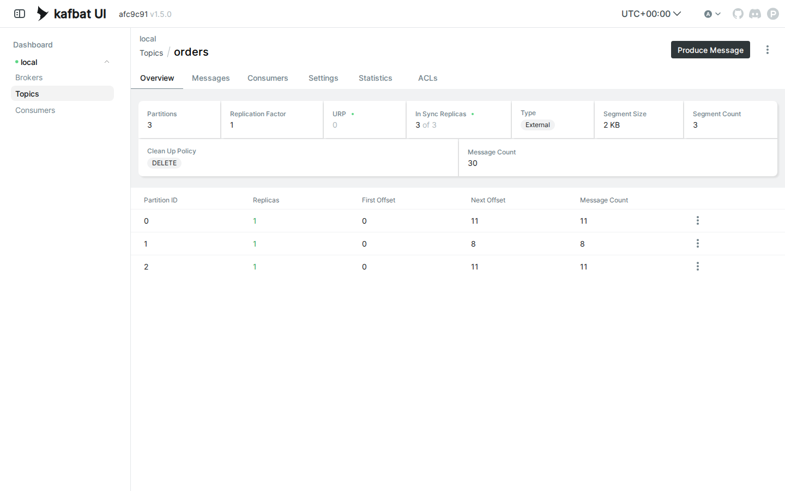
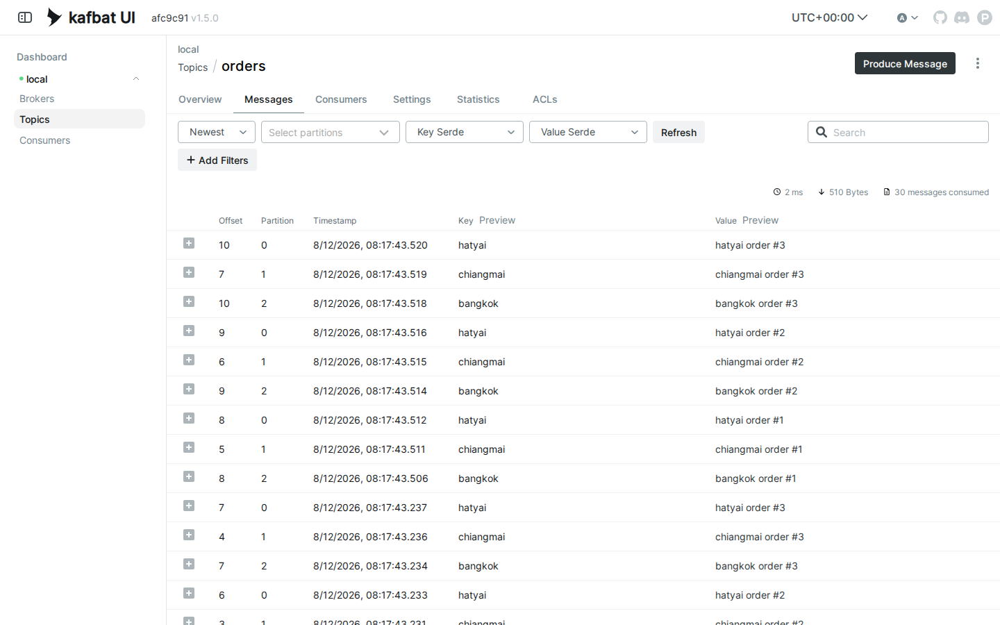

# LAB 2 — Partitions & Keys : ใครเป็นคนเลือกว่าข้อความลง partition ไหน

> โฟลเดอร์ `002_LAB_Partitions_Keys` = **LAB 2** ในสไลด์ `Kafka_Slides.html` (ต่อจาก LAB 1 ที่เปิด broker แล้วส่ง–รับข้อความแรกผ่าน topic เดียวแบบยังไม่ต้องสน partition)
> (ไฟล์โค้ดของแล็บนี้ : `producer_no_key.py` · `producer_with_key.py` · `consumer_partitions.py` · `requirements.txt`)

## สิ่งที่จะได้เรียนรู้

- topic ของ Kafka ไม่ใช่ท่อเดี่ยว ๆ — มันถูกผ่าเป็นหลาย **partition** แต่ละอันคือ **append-only log** แยกเล่ม มี **offset** ของตัวเอง
- สร้าง topic เองด้วย `kafka-topics.sh --create --partitions 3` แล้วอ่านตาราง `--describe` ให้เป็น (Leader · Replicas · Isr)
- ส่งแบบ **ไม่ใส่ key** → Kafka เลือก partition ให้แบบเดาไม่ได้ — **ลำดับรวมทั้ง topic ไม่การันตี**
- ส่งแบบ **ใส่ key** → hash(key) ชี้ partition เดิมเสมอ — **ลำดับของ key เดิมการันตี** (หัวใจของแล็บนี้)
- ที่อยู่เต็ม ๆ ของทุกข้อความคือ **(topic, partition, offset)** — และอ่านแล้ว **ไม่หาย** อ่านซ้ำได้เรื่อย ๆ ต่างจาก RabbitMQ ที่ ack แล้วข้อความถูกลบทิ้ง
- เครื่องมือใหม่ : `kafka-console-producer.sh` แบบพ่วง key · `kafka-console-consumer.sh` เจาะอ่าน partition เดียว · หน้า topic ใน Kafka UI

## ภาพรวมของแล็บนี้

1. **เตรียมเครื่องเรียน + เปิด broker + Kafka UI + venv** — สูตรเดิมจาก LAB 1 ฉบับเร่งรัด
2. **สร้าง topic `orders` แบบตั้งใจ — 3 partitions** — คราวนี้ไม่พึ่ง auto-create แล้วอ่านตาราง `--describe` ให้เป็น
3. **รัน `producer_no_key.py` สองรอบ** — พิสูจน์ว่าไม่มี key = partition **เดาไม่ได้** แต่ละรอบ (และแต่ละคน) ได้ไม่เหมือนกัน
4. **รัน `producer_with_key.py` สองรอบ** — พิสูจน์ว่า key เดิม → partition เดิม **เป๊ะทุกครั้ง ไม่มีข้อยกเว้น**
5. **รัน `consumer_partitions.py` อ่านทั้ง topic** — เห็น "ที่อยู่" ของทุกข้อความ และลำดับที่การันตีภายในแต่ละ partition
6. **เปิด Kafka UI** — ดูจำนวนข้อความรายพาร์ทิชัน และคอลัมน์ Key ในแท็บ Messages
7. **เจาะอ่าน partition เดียวด้วย console consumer** — เห็นเฉพาะของที่ hash ตกลงเล่มนั้นจริง ๆ

---

## 0. เตรียมเครื่องเรียน

ทำบนเครื่องของเราเอง (ไม่ใช้ cloud) — เปิด container ที่ติดตั้ง Docker มาให้แล้ว :

```bash
docker rm -f devtools
docker run -dit --name devtools --privileged -p 2222:22 tuchsanai/devtools:2569_1
ssh root@localhost -p 2222        # password : passwd
```

> 📝 **คำอธิบาย:** สามบรรทัดนี้คือการ "เปิดเครื่องเรียน" เหมือนทุกแล็บ · `docker rm -f devtools` ลบเครื่องเรียนตัวเดิมทิ้งก่อนกันชื่อซ้ำ (`-f` = force ลบได้แม้ยังรันอยู่ ถ้าไม่เคยสร้างมาก่อนบรรทัดนี้จะเงียบ ๆ ไม่ใช่ error) · `-dit` ให้กล่องรันเบื้องหลังและไม่ดับทันที · `--privileged` ให้สิทธิ์เต็มเพื่อรัน **Docker ซ้อนข้างในกล่อง** — จำเป็น เพราะ Kafka ของแล็บนี้ก็รันเป็น container อยู่ข้างในเครื่องเรียนอีกที · `-p 2222:22` ส่ง port 2222 ของเครื่องเรา เข้า port 22 (SSH) ของกล่อง · บรรทัดสุดท้าย ssh เข้าไปข้างใน (รหัสผ่าน `passwd`) — คำสั่งทั้งหมดที่เหลือของแล็บนี้ **พิมพ์ข้างในเครื่องเรียน** ทั้งหมด

ใน VS Code ใช้ **Remote-SSH** ต่อไปที่ `root@localhost:2222` แล้วทำแล็บทั้งหมดข้างใน — ตรวจว่าพร้อมใช้งาน :

```bash
docker --version
docker compose version
```

> 📝 **คำอธิบาย:** ยืนยันว่าคำสั่ง `docker` ข้างในเครื่องเรียนวิ่งถึง daemon ได้จริงก่อนเริ่ม สิ่งที่ต้องดูคือ "มีเลขเวอร์ชันขึ้นไหม" ไม่ใช่ "เลขตรงกับเอกสารไหม" · ถ้าขึ้น `Cannot connect to the Docker daemon` แปลว่า daemon ข้างในยังตื่นไม่เสร็จ รอสักครู่แล้วลองใหม่

✅ **Expected output** — ขอแค่มีเลขเวอร์ชันครบสองบรรทัด ไม่ใช่ error (เลขเวอร์ชันของแต่ละคนอาจไม่ตรงกับเอกสารนี้):

```
Docker version 29.6.2, build dfc4efb
Docker Compose version v5.3.1
```

---

## 1. Clone โค้ดแล็บ

```bash
mkdir -p ~/labwork && cd ~/labwork
git clone https://github.com/Tuchsanai/DevTools.git
cd DevTools/07_Kafka/002_LAB_Partitions_Keys
```

> 📝 **คำอธิบาย:** สร้างโฟลเดอร์เก็บงานแล้วดึงรีโพของวิชาลงมา (ถ้าเคย clone ไว้แล้วจาก LAB 1 ให้ข้ามบรรทัด clone แล้ว `cd` เข้าโฟลเดอร์ได้เลย — git จะฟ้องว่าโฟลเดอร์ปลายทางไม่ว่างถ้าสั่งซ้ำ) · โฟลเดอร์ของแล็บนี้มีไฟล์ `producer_no_key.py` (ผู้ส่งแบบไม่มี key) · `producer_with_key.py` (ผู้ส่งแบบมี key) · `consumer_partitions.py` (ผู้อ่านที่พิมพ์ที่อยู่ของทุกข้อความ) · `requirements.txt` ครบแล้ว

---

## 2. เปิด Kafka broker + Kafka UI (สูตรเดิมจาก LAB 1)

```bash
docker rm -f kafka kafka-ui 2>/dev/null
docker run -d --name kafka -p 9092:9092 apache/kafka:4.1.0
```

> 📝 **คำอธิบาย:** คำสั่งเดียวกับ LAB 1 เป๊ะ ๆ · ลบตัวเก่าทิ้งก่อนกันชื่อซ้ำ แล้วเปิด broker จาก image ทางการ `apache/kafka:4.1.0` (รุ่น **KRaft** — ไม่ต้องมี ZooKeeper) · `-p 9092:9092` คือ port เดียวที่โปรแกรมใช้คุยกับ Kafka · สังเกตความต่างจาก RabbitMQ : Kafka broker **ไม่มีหน้าเว็บในตัว** — "หน้าเว็บให้คนดู" แยกไปอยู่กับ container `kafka-ui` ที่กำลังจะเปิดถัดไป

✅ **Expected output** — เครื่องเรียนเพิ่งเกิดใหม่ยังไม่มี image Docker จะ pull ให้อัตโนมัติแล้วจบด้วย container ID ยาว ๆ (layer ID · digest · container ID ของแต่ละคนจะไม่ตรงกับเอกสารนี้):

```
Unable to find image 'apache/kafka:4.1.0' locally
4.1.0: Pulling from apache/kafka
fb760d495f93: Pulling fs layer
        ... (รวม 11 layer · ทยอย Download complete → Pull complete) ...
1e7ff3c422db: Pull complete
Digest: sha256:bff074a5d0051dbc0bbbcd25b045bb1fe84833ec0d3c7c965d1797dd289ec88f
Status: Downloaded newer image for apache/kafka:4.1.0
f4e1a0b26f57b132c7bea8d1b4996a60701631717c67b4d08ec164116bc441d2
```

รอ broker พร้อมก่อน (บทเรียนเดิมจากชุด RabbitMQ : `Up` ≠ พร้อม):

```bash
docker logs kafka --tail 5
```

> 📝 **คำอธิบาย:** บรรทัดชี้ขาดคือ **`Kafka Server started (kafka.server.KafkaRaftServer)`** — Kafka บูตไวกว่า RabbitMQ มาก (ราว 5 วินาที เทียบกับ ~13 วินาที) แต่หลักคิดเดียวกัน : ถ้ายังไม่เห็นบรรทัดนี้ รอ 2–3 วินาทีแล้วรันซ้ำ อย่าเพิ่งต่อเข้าไป

✅ **Expected output** — บรรทัดสุดท้ายคือ `Kafka Server started` (วันเวลา · commitId ของแต่ละคนจะไม่ตรงกับเอกสารนี้):

```
[2026-08-12 08:06:20,404] INFO [BrokerServer id=1] Transition from STARTING to STARTED (kafka.server.BrokerServer)
[2026-08-12 08:06:20,404] INFO Kafka version: 4.1.0 (org.apache.kafka.common.utils.AppInfoParser)
[2026-08-12 08:06:20,404] INFO Kafka commitId: 13f70256db3c994c (org.apache.kafka.common.utils.AppInfoParser)
[2026-08-12 08:06:20,404] INFO Kafka startTimeMs: 1786521980404 (org.apache.kafka.common.utils.AppInfoParser)
[2026-08-12 08:06:20,405] INFO [KafkaRaftServer nodeId=1] Kafka Server started (kafka.server.KafkaRaftServer)
```

broker พร้อมแล้ว ค่อยเปิด **Kafka UI** (หน้าเว็บให้คนดู — เทียบชั้นกับ Management UI ของ RabbitMQ):

```bash
docker run -d --name kafka-ui --network host \
  -e KAFKA_CLUSTERS_0_NAME=local \
  -e KAFKA_CLUSTERS_0_BOOTSTRAPSERVERS=localhost:9092 \
  kafbat/kafka-ui:latest
```

> 📝 **คำอธิบาย:** `--network host` ให้ container นี้ใช้ network ของเครื่องเรียนตรง ๆ — มันจึงเห็น broker ที่ `localhost:9092` และเปิดหน้าเว็บที่ port `8080` ได้โดยไม่ต้อง `-p` · สอง `-e` บอก UI ว่า cluster ที่จะเฝ้าชื่อ `local` อยู่ที่ไหน · **ลำดับสำคัญ** : ต้องเปิดหลังจาก broker ขึ้น `Kafka Server started` แล้ว ไม่งั้นหน้าเว็บจะฟ้องว่า cluster offline

✅ **Expected output** — ครั้งแรก Docker pull image ให้ก่อนแล้วจบด้วย container ID (digest · ID ของแต่ละคนจะไม่ตรงกับเอกสารนี้):

```
        ... (pull image kafbat/kafka-ui — layer ทยอย Download / Pull complete) ...
Digest: sha256:7cda86a33344160309fdb65146332e4da65db81a945614f2fe32e210803f6fd1
Status: Downloaded newer image for kafbat/kafka-ui:latest
3e6bb0b7a34ac8acd9d6f359c3511d106f1d3c263650c41e577046dadbef52d1
```

เช็กว่าขึ้นครบทั้งคู่ :

```bash
docker ps
```

> 📝 **คำอธิบาย:** ต้องเห็น 2 แถว STATUS เป็น `Up` ทั้งคู่ · `kafka` มี mapping `0.0.0.0:9092->9092/tcp` ตามที่สั่ง ส่วน `kafka-ui` คอลัมน์ PORTS **ว่าง** — ไม่ได้แปลว่าพัง แต่เพราะ `--network host` ไม่ต้อง map port (หน้าเว็บอยู่ที่ 8080 ของเครื่องเรียนโดยตรง)

✅ **Expected output** — สองแถว `Up` (ID · เวลา CREATED ของแต่ละคนจะไม่ตรงกับเอกสารนี้ — ภาพนี้เก็บหลังเปิดทิ้งไว้พักใหญ่):

```
CONTAINER ID   IMAGE                    COMMAND                  CREATED          STATUS          PORTS                                         NAMES
3e6bb0b7a34a   kafbat/kafka-ui:latest   "/bin/sh -c 'java --…"   13 minutes ago   Up 13 minutes                                                 kafka-ui
f4e1a0b26f57   apache/kafka:4.1.0       "/__cacert_entrypoin…"   14 minutes ago   Up 14 minutes   0.0.0.0:9092->9092/tcp, [::]:9092->9092/tcp   kafka
```

---

## 3. เตรียม Python (venv + kafka-python)

```bash
python3 -m venv ~/venv-kafka
source ~/venv-kafka/bin/activate
pip install kafka-python==3.0.10
```

> 📝 **คำอธิบาย:** Python ในเครื่องเรียนเปิดกฎ PEP 668 ไว้ — `pip install` ตรง ๆ นอก venv จะโดนปฏิเสธ จึงต้องผ่าน **virtual environment** เสมอ · `~/venv-kafka` ใช้ร่วมกันได้ทุกแล็บของชุด Kafka (ถ้าสร้างไว้แล้วจาก LAB 1 ข้ามบรรทัดแรกได้) · `source ~/venv-kafka/bin/activate` เปิดใช้ — สังเกต prompt ขึ้นคำนำหน้า `(venv-kafka)` · `pip install kafka-python==3.0.10` ล็อกเวอร์ชันให้ตรงกันทั้งห้อง (ตรงกับ `requirements.txt` — จะใช้ `pip install -r requirements.txt` แทนก็ได้)

✅ **Expected output** — บรรทัดสุดท้ายต้องเป็น `Successfully installed kafka-python-3.0.10` (ความเร็วดาวน์โหลดของแต่ละคนจะไม่ตรงกับเอกสารนี้ · ถ้าติดตั้งไว้แล้วจะขึ้น `Requirement already satisfied` แทน — ใช้ได้เหมือนกัน):

```
Collecting kafka-python==3.0.10
  Downloading kafka_python-3.0.10-py3-none-any.whl.metadata (11 kB)
Downloading kafka_python-3.0.10-py3-none-any.whl (614 kB)
   ━━━━━━━━━━━━━━━━━━━━━━━━━━━━━━━━━━━━━━━━ 614.2/614.2 kB 3.7 MB/s eta 0:00:00
Installing collected packages: kafka-python
Successfully installed kafka-python-3.0.10
```

> **⚠️ กติกาเดิมจาก LAB 1 :** ทุกครั้งที่เปิด **terminal ใหม่** ต้อง `source ~/venv-kafka/bin/activate` ก่อนเสมอ — ลืมเมื่อไหร่เจอ `ModuleNotFoundError: No module named 'kafka'` ทันที

---

## 4. สร้าง topic `orders` แบบตั้งใจ — 3 partitions

LAB 1 เราปล่อยให้ broker สร้าง topic ให้เอง (auto-create) ซึ่งได้แค่ **1 partition** — คราวนี้จะสั่งสร้างเองพร้อมกำหนดจำนวน partition เพราะทั้งแล็บนี้ต้องการเห็นข้อความ **กระจายลง 3 เล่ม** :

```bash
docker exec kafka /opt/kafka/bin/kafka-topics.sh --bootstrap-server localhost:9092 \
  --create --topic orders --partitions 3 --replication-factor 1
```

> 📝 **คำอธิบาย:** `kafka-topics.sh` คือ CLI จัดการ topic — ติดตั้งอยู่ **ข้างใน container `kafka`** จึงสั่งผ่าน `docker exec` เสมอ (เหมือนที่เคยเรียก `rabbitmqctl` ผ่าน `docker exec rabbit`) · `--bootstrap-server localhost:9092` บอกว่า broker อยู่ไหน — ทุกคำสั่ง CLI ของ Kafka ต้องมี flag นี้ · `--create --topic orders` สร้าง topic ชื่อ `orders` · `--partitions 3` ผ่า topic เป็น **3 partition** (log ย่อย 3 เล่ม เขียน–อ่านแยกกัน) · `--replication-factor 1` เก็บสำเนาเดียว — เรามี broker ตัวเดียว ขอมากกว่านี้จะ error เพราะไม่มีเครื่องให้วางสำเนา

✅ **Expected output** — สั้น ๆ บรรทัดเดียว:

```
Created topic orders.
```

ดูหน้าตา topic ที่เพิ่งสร้าง :

```bash
docker exec kafka /opt/kafka/bin/kafka-topics.sh --bootstrap-server localhost:9092 \
  --describe --topic orders
```

> 📝 **คำอธิบาย:** `--describe` พิมพ์ตาราง 1 บรรทัดหัว + 1 บรรทัดต่อ partition · จุดที่ต้องดู : `PartitionCount: 3` ตามที่ขอ · คอลัมน์ **Leader: 1** = partition นี้อยู่ในมือ broker หมายเลข 1 (เรามี broker เดียว id = 1 มันจึงเป็นเจ้าของทุกเล่ม — ใน cluster จริง Leader จะกระจายกันคนละเครื่อง) · **Replicas / Isr** = รายชื่อสำเนา / สำเนาที่ข้อมูลตามทัน — มีเลข `1` ตัวเดียวตาม `--replication-factor 1` · คอลัมน์ `Elr` / `LastKnownElr` เป็นของใหม่ใน Kafka 4.x ว่างไว้แบบนี้ถูกต้อง ไม่ต้องสนใจในแล็บนี้

✅ **Expected output** — 3 partition ครบ (TopicId ของแต่ละคนจะไม่ตรงกับเอกสารนี้):

```
Topic: orders	TopicId: 8FKCaD3lQBuuhOoebKwM1g	PartitionCount: 3	ReplicationFactor: 1	Configs: min.insync.replicas=1,segment.bytes=1073741824
	Topic: orders	Partition: 0	Leader: 1	Replicas: 1	Isr: 1	Elr: 	LastKnownElr:
	Topic: orders	Partition: 1	Leader: 1	Replicas: 1	Isr: 1	Elr: 	LastKnownElr:
	Topic: orders	Partition: 2	Leader: 1	Replicas: 1	Isr: 1	Elr: 	LastKnownElr:
```

> **ภาพในหัวที่ต้องมี :** ตอนนี้ `orders` คือสมุดบันทึก 3 เล่ม (p0 · p1 · p2) แต่ละเล่มเขียนได้แบบ **ต่อท้ายอย่างเดียว** และมีเลขบรรทัดของตัวเองเรียก **offset** เริ่มที่ 0 — คำถามของทั้งแล็บคือ *ข้อความหนึ่ง ๆ จะถูกจดลงเล่มไหน?*

---

## 5. ส่งแบบไม่มี key — `producer_no_key.py`

ดูโค้ดกันก่อน (ไฟล์อยู่ในโฟลเดอร์แล็บแล้ว ไม่ต้องพิมพ์เอง) :

```python
from kafka import KafkaProducer

# 1) ต่อ broker เหมือนแล็บก่อน
producer = KafkaProducer(bootstrap_servers='localhost:9092')

# 2) ส่ง 6 ข้อความ "โดยไม่ใส่ key" — ให้ Kafka เลือก partition ให้เอง
for i in range(1, 7):
    message = f'order {i}'
    metadata = producer.send('orders', message.encode()).get(timeout=10)
    # 3) ดูใบเสร็จ : แต่ละข้อความไปลง partition ไหน — สังเกตว่า "เดาไม่ได้"
    print(f" [x] Sent '{message}'  ->  partition={metadata.partition} offset={metadata.offset}")

producer.close()
```

> 📝 **คำอธิบาย:** ไล่ตามเลขในคอมเมนต์ · **(1)** `KafkaProducer(bootstrap_servers='localhost:9092')` ต่อ broker — สังเกตว่า **ไม่มี user/password** เพราะ broker ตัวเรียนเปิดแบบ PLAINTEXT (ต่างจาก RabbitMQ ที่ต้อง `student`/`student123`) · **(2)** `producer.send('orders', message.encode())` ส่งเข้า topic `orders` — Kafka รับเป็น bytes จึงต้อง `.encode()` และเมื่อ **ไม่ใส่ key** ไลบรารีฝั่งผู้ส่งจะเลือก partition ให้เองแบบกระจาย ๆ · **(3)** `send()` คืน future — `.get(timeout=10)` รอ "ใบเสร็จ" (`RecordMetadata`) ที่บอกว่าข้อความไปลง **partition ไหน · offset เท่าไร** ซึ่งเป็นพระเอกของแล็บนี้

รัน (อย่าลืมว่าต้องมี `(venv-kafka)` นำหน้า prompt) :

```bash
python producer_no_key.py
```

✅ **Expected output** — ส่งครบ 6 ใบ แต่ละใบมี partition/offset แนบมา (**partition ของแต่ละคนจะไม่ตรงกับเอกสารนี้** — นั่นแหละประเด็น):

```
 [x] Sent 'order 1'  ->  partition=1 offset=0
 [x] Sent 'order 2'  ->  partition=2 offset=0
 [x] Sent 'order 3'  ->  partition=0 offset=0
 [x] Sent 'order 4'  ->  partition=2 offset=1
 [x] Sent 'order 5'  ->  partition=0 offset=1
 [x] Sent 'order 6'  ->  partition=0 offset=2
```

รันซ้ำอีกรอบทันที — คำสั่งเดิมเป๊ะ ๆ :

```bash
python producer_no_key.py
```

✅ **Expected output** — ข้อความชุดเดิม แต่ partition **คนละแบบกับรอบแรก** (ของแต่ละคนก็ต่างกันไปอีก):

```
 [x] Sent 'order 1'  ->  partition=2 offset=2
 [x] Sent 'order 2'  ->  partition=0 offset=3
 [x] Sent 'order 3'  ->  partition=2 offset=3
 [x] Sent 'order 4'  ->  partition=2 offset=4
 [x] Sent 'order 5'  ->  partition=1 offset=1
 [x] Sent 'order 6'  ->  partition=0 offset=4
```

> **จุดสอนของข้อนี้ :** เทียบสองรอบดู — `order 1` รอบแรกลง p1 รอบสองลง p2 · **ไม่มี key = เดาไม่ได้** ว่าจะตกเล่มไหน และลำดับ "รวมทั้ง topic" ก็ไม่การันตี (order 1 อาจถูกอ่านหลัง order 3 ถ้าอยู่คนละ partition) ·
> แต่สังเกต **offset ไม่เคยเริ่มใหม่** — p2 นับต่อ 2, 3, 4 จากที่รอบแรกจดค้างไว้ เพราะแต่ละ partition คือ **log ที่เขียนต่อท้ายอย่างเดียว** ข้อความเก่าไม่หายไปไหน (ต่างจาก RabbitMQ ที่คิวจะสั้นลงเมื่อมีคนอ่าน)

*หมายเหตุ: ผลข้างบนคือการรันจริงสองรอบติดกันในเครื่องเดียว — ถ้าของเราสองรอบดันเหมือนกันเป๊ะก็แค่บังเอิญ ลองรอบสามได้*

---

## 6. ส่งแบบมี key — `producer_with_key.py`

ดูโค้ดฝั่งที่ใส่ key :

```python
from kafka import KafkaProducer

# 1) ต่อ broker เหมือนเดิม
producer = KafkaProducer(bootstrap_servers='localhost:9092')

# 2) คราวนี้ทุกข้อความมี key = ชื่อสาขาของร้าน (bangkok / chiangmai / hatyai)
#    Kafka จะเอา key ไป hash → ได้เลข partition เดิมเสมอสำหรับ key เดิม
branches = ['bangkok', 'chiangmai', 'hatyai']

# 3) ส่งสาขาละ 3 ออเดอร์ (รวม 9 ข้อความ) — key ต้องเป็น bytes เช่นกัน
for round_no in range(1, 4):
    for branch in branches:
        message = f'{branch} order #{round_no}'
        metadata = producer.send('orders',
                                 key=branch.encode(),
                                 value=message.encode()).get(timeout=10)
        # 4) สังเกตใบเสร็จ : key เดียวกัน → partition เดิม ทุกครั้ง ไม่มีข้อยกเว้น
        print(f" [x] key={branch:9s} -> partition={metadata.partition} "
              f"offset={metadata.offset}  ('{message}')")

producer.close()
```

> 📝 **คำอธิบาย:** โครงเดียวกับไฟล์ก่อน ต่างตรงเดียวแต่เปลี่ยนทุกอย่าง : **(2–3)** `producer.send(..., key=branch.encode(), value=...)` — คราวนี้แนบ **key** (bytes เช่นกัน) ไปกับทุกข้อความ · กติกาของ Kafka : เอา key ไปเข้าสูตร hash (murmur2) แล้วหารเอาเศษด้วยจำนวน partition → **key เดิมได้เลขเดิมเสมอ** ไม่มีการสุ่มเข้ามาเกี่ยว · โจทย์สมมุติคือร้านมี 3 สาขา ใช้ชื่อสาขาเป็น key เพื่อให้ **ออเดอร์ของสาขาเดียวกันเรียงลำดับกันเสมอ** · **(4)** ใบเสร็จเดิม — คราวนี้ให้จ้องคอลัมน์ partition ว่านิ่งแค่ไหน

รัน :

```bash
python producer_with_key.py
```

✅ **Expected output** — 9 ใบ : `bangkok` ลง p2 · `chiangmai` ลง p1 · `hatyai` ลง p0 ทุกใบ (offset ของแต่ละคนจะไม่ตรงกับเอกสารนี้ เพราะขึ้นกับว่าข้อ 5 สุ่มอะไรลงเล่มไหนไปแล้วบ้าง — แต่ **mapping สาขา→partition ต้องตรงกัน** ถ้า topic มี 3 partitions):

```
 [x] key=bangkok   -> partition=2 offset=5  ('bangkok order #1')
 [x] key=chiangmai -> partition=1 offset=2  ('chiangmai order #1')
 [x] key=hatyai    -> partition=0 offset=5  ('hatyai order #1')
 [x] key=bangkok   -> partition=2 offset=6  ('bangkok order #2')
 [x] key=chiangmai -> partition=1 offset=3  ('chiangmai order #2')
 [x] key=hatyai    -> partition=0 offset=6  ('hatyai order #2')
 [x] key=bangkok   -> partition=2 offset=7  ('bangkok order #3')
 [x] key=chiangmai -> partition=1 offset=4  ('chiangmai order #3')
 [x] key=hatyai    -> partition=0 offset=7  ('hatyai order #3')
```

รันซ้ำอีกรอบ — เหมือนข้อ 5 เราเคยเห็นว่ารอบใหม่ = สุ่มใหม่ แล้วคราวนี้ล่ะ :

```bash
python producer_with_key.py
```

✅ **Expected output** — mapping **เหมือนรอบแรกทุกใบ** ขยับแค่ offset ที่นับต่อ:

```
 [x] key=bangkok   -> partition=2 offset=8  ('bangkok order #1')
 [x] key=chiangmai -> partition=1 offset=5  ('chiangmai order #1')
 [x] key=hatyai    -> partition=0 offset=8  ('hatyai order #1')
 [x] key=bangkok   -> partition=2 offset=9  ('bangkok order #2')
 [x] key=chiangmai -> partition=1 offset=6  ('chiangmai order #2')
 [x] key=hatyai    -> partition=0 offset=9  ('hatyai order #2')
 [x] key=bangkok   -> partition=2 offset=10  ('bangkok order #3')
 [x] key=chiangmai -> partition=1 offset=7  ('chiangmai order #3')
 [x] key=hatyai    -> partition=0 offset=10  ('hatyai order #3')
```

> **จุดสอนของข้อนี้ (หัวใจของแล็บ) :** `bangkok → 2` · `chiangmai → 1` · `hatyai → 0` — สองรอบ สิบแปดใบ ไม่มีพลาดสักใบ และเพื่อนทั้งห้องที่สร้าง topic 3 partitions เหมือนกันก็จะได้ mapping ชุดนี้เป๊ะ เพราะสูตร hash ตายตัว ไม่ใช่การจับฉลาก ·
> ผลที่ตามมา : ใน log ของ p2 ออเดอร์ bangkok เรียง `#1 → #2 → #3` เสมอ — **key เดิม → partition เดิม → ลำดับของ key เดิมการันตี** · นี่คือวิธีที่ Kafka ให้ทั้ง "กระจายงานหลายเล่ม" และ "ลำดับต่อลูกค้า/ต่อสาขาไม่มั่ว" พร้อมกัน ·
> ข้อแลกเปลี่ยน : ถ้า key กระจุก (เช่น ออเดอร์ 90% มาจาก bangkok) เล่ม p2 จะบวมกว่าเพื่อน — เรียกว่า **hot partition** เลือก key ให้กระจายจึงเป็นศิลปะอย่างหนึ่ง

---

## 7. อ่านทั้ง topic — `consumer_partitions.py`

ดูโค้ดฝั่งผู้อ่าน :

```python
import sys
from kafka import KafkaConsumer

def main():
    # 1) อ่าน topic 'orders' จากข้อความแรกสุด (ยังไม่ใช้ group — อ่านซ้ำได้เรื่อย ๆ)
    consumer = KafkaConsumer('orders',
                             bootstrap_servers='localhost:9092',
                             auto_offset_reset='earliest')

    print(' [*] Waiting for messages. To exit press CTRL+C')

    # 2) พิมพ์ "ที่อยู่" ของทุกข้อความ : partition / offset / key / เนื้อข้อความ
    #    (key ของข้อความที่ส่งแบบไม่ใส่ key จะเป็น None)
    for message in consumer:
        key = message.key.decode() if message.key else None
        print(f" [x] partition={message.partition} offset={message.offset} "
              f"key={key}  value={message.value.decode()}")

if __name__ == '__main__':
    try:
        main()
    except KeyboardInterrupt:
        print('Interrupted')
        sys.exit(0)
```

> 📝 **คำอธิบาย:** **(1)** `KafkaConsumer('orders', ..., auto_offset_reset='earliest')` = เกาะ topic `orders` แล้วเริ่มอ่านจาก **offset แรกสุดของทุก partition** · เรายังไม่ใส่ `group_id` (เรื่องของ LAB 3) — consumer แบบไร้ group จะไม่จดว่าอ่านถึงไหน รันกี่รอบก็อ่านซ้ำตั้งแต่ต้นได้เสมอ เพราะ **การอ่านของ Kafka ไม่ลบข้อความ** (RabbitMQ ทำแบบนี้ไม่ได้ — ack แล้วข้อความหายจากคิวเลย) · **(2)** วน `for message in consumer` แล้วพิมพ์ที่อยู่เต็ม ๆ ของแต่ละข้อความ : `partition` / `offset` / `key` / เนื้อความ — ข้อความจากข้อ 5 จะโชว์ `key=None` · โปรแกรมรอของใหม่ไปเรื่อย ๆ ต้องกด **Ctrl+C** เอง (`KeyboardInterrupt` ถูกดักให้จบสวย ๆ พร้อมพิมพ์ `Interrupted`)

รัน :

```bash
python consumer_partitions.py
```

✅ **Expected output** — ครบ **30 ข้อความ** (12 ไม่มี key + 18 มี key) ไหลมาเป็น **ชุด ๆ ทีละ partition** · ดูครบแล้วกด **Ctrl+C** (ลำดับชุด · การกระจายของแถว `key=None` ของแต่ละคนจะไม่ตรงกับเอกสารนี้):

```
 [*] Waiting for messages. To exit press CTRL+C
 [x] partition=2 offset=0 key=None  value=order 2
 [x] partition=2 offset=1 key=None  value=order 4
 [x] partition=2 offset=2 key=None  value=order 1
 [x] partition=2 offset=3 key=None  value=order 3
 [x] partition=2 offset=4 key=None  value=order 4
 [x] partition=2 offset=5 key=bangkok  value=bangkok order #1
 [x] partition=2 offset=6 key=bangkok  value=bangkok order #2
 [x] partition=2 offset=7 key=bangkok  value=bangkok order #3
 [x] partition=2 offset=8 key=bangkok  value=bangkok order #1
 [x] partition=2 offset=9 key=bangkok  value=bangkok order #2
 [x] partition=2 offset=10 key=bangkok  value=bangkok order #3
 [x] partition=0 offset=0 key=None  value=order 3
 [x] partition=0 offset=1 key=None  value=order 5
 [x] partition=0 offset=2 key=None  value=order 6
 [x] partition=0 offset=3 key=None  value=order 2
 [x] partition=0 offset=4 key=None  value=order 6
 [x] partition=0 offset=5 key=hatyai  value=hatyai order #1
 [x] partition=0 offset=6 key=hatyai  value=hatyai order #2
 [x] partition=0 offset=7 key=hatyai  value=hatyai order #3
 [x] partition=0 offset=8 key=hatyai  value=hatyai order #1
 [x] partition=0 offset=9 key=hatyai  value=hatyai order #2
 [x] partition=0 offset=10 key=hatyai  value=hatyai order #3
 [x] partition=1 offset=0 key=None  value=order 1
 [x] partition=1 offset=1 key=None  value=order 5
 [x] partition=1 offset=2 key=chiangmai  value=chiangmai order #1
 [x] partition=1 offset=3 key=chiangmai  value=chiangmai order #2
 [x] partition=1 offset=4 key=chiangmai  value=chiangmai order #3
 [x] partition=1 offset=5 key=chiangmai  value=chiangmai order #1
 [x] partition=1 offset=6 key=chiangmai  value=chiangmai order #2
 [x] partition=1 offset=7 key=chiangmai  value=chiangmai order #3
Interrupted
```

> **อ่านผลให้เป็น :** Kafka ส่งข้อความมาเป็นชุดต่อ partition — เห็นชัดว่า topic คือ **สมุด 3 เล่มจริง ๆ** ·
> **ในเล่มเดียวกัน** offset เรียง 0, 1, 2, … เป๊ะ และออเดอร์ของสาขาเรียง `#1 → #2 → #3` เสมอ (ลำดับการันตี) — แต่ **ข้ามเล่ม** ลำดับไม่เกี่ยวกับเวลาส่งเลย ·
> แถว `key=None` คือของข้อ 5 ที่สุ่มตกเล่มไหนก็ได้ ส่วนแถวมี key เกาะเล่มประจำของตัวเองทุกใบ ·
> อยากพิสูจน์ว่า "อ่านแล้วไม่หาย" — รัน `python consumer_partitions.py` ซ้ำอีกรอบ จะได้ครบ 30 บรรทัดเท่าเดิมทุกครั้ง เพราะ log ยังอยู่ครบ (นี่คือสิ่งที่ทำไม่ได้ใน RabbitMQ)

---

## 8. ดู partition และ key ใน Kafka UI

หน้าเว็บ UI เปิดอยู่ที่ port `8080` **ข้างในเครื่องเรียน** — forward ออกมาเหมือนที่ทำใน LAB 1 :

1. เปิดแท็บ **PORTS** (แถวเดียวกับ TERMINAL)
2. กดปุ่ม **Forward a Port**
3. พิมพ์ `8080` แล้วกด **Enter**
4. เปิด `http://localhost:8080` ในเบราว์เซอร์ (หรือคลิกไอคอนลูกโลกในแถวของ port)


หรือถ้าไม่ใช้ VS Code ก็ forward ด้วยมือจาก terminal ใหม่บนเครื่องเรา (เปิดค้างไว้ตลอดที่ใช้ UI):

```bash
ssh -L 8080:localhost:8080 root@localhost -p 2222        # password : passwd
```

Kafka UI ไม่มีหน้า login — เข้ามาเจอ Dashboard เลย · ไปที่เมนู **Topics** ด้านซ้าย แล้วคลิกชื่อ `orders` :



> 📝 **จุดที่ต้องดูในหน้านี้:** การ์ดแถวบน **Partitions: 3** ตามที่สร้าง · **Message Count: 30** = 12 (ไม่มี key) + 18 (มี key) · ตารางล่างไล่รายเล่ม — ในการรันของเอกสารนี้ p0 = 11 · p1 = 8 · p2 = 11 : ฝั่งมี key คงที่แน่นอน (hatyai 6 · chiangmai 6 · bangkok 6) ส่วนของไม่มี key กระจายไม่เท่ากัน (5 · 2 · 5) — **ตัวเลขรายเล่มของแต่ละคนจะไม่ตรงกับเอกสารนี้ แต่รวมกันต้องได้ 30 เท่ากัน** ·
> คอลัมน์ **First Offset = 0** และ **Next Offset = จำนวนข้อความ** ทุกเล่ม — log เริ่มที่ 0 และยังไม่มีอะไรถูกลบ

คลิกแท็บ **Messages** ของ topic `orders` :



> 📝 **จุดที่ต้องดูในหน้านี้:** โหมด **Newest** = ข้อความล่าสุดขึ้นก่อน · ไล่ทีละแถวเทียบคอลัมน์ **Key** กับ **Partition** — `hatyai → 0` · `chiangmai → 1` · `bangkok → 2` ทุกแถวไม่มีข้อยกเว้น ตรงกับใบเสร็จในข้อ 6 เป๊ะ · มุมขวาบนของตารางบอก `30 messages consumed` · Timestamp เกาะกลุ่มกันเป็นชุด ๆ เพราะเราส่งรัวจาก loop · กดปุ่ม `+` หน้าแถวไหนก็ได้เพื่อดูรายละเอียดเต็มของข้อความนั้น

#### ทดลองเสร็จแล้ว — ลบ tunnel ทุกครั้ง

- แบบ VS Code : แท็บ **PORTS** → คลิกขวาที่ `8080` → **Stop Forwarding Port**
- แบบ `ssh -L` : พิมพ์ `exit` (หรือ `Ctrl+D`) ใน session นั้น — tunnel ปิดทันที

> ยังไม่ต้องปิดตอนนี้ก็ได้ — เดี๋ยว "ทดลองเพิ่มเติม ก." จะกลับมาดูอีกรอบ แต่**จบแล็บแล้วต้องปิดเสมอ**

---

## 9. เจาะอ่าน partition เดียว — console consumer

ในเมื่อแต่ละ partition คือ log แยกเล่ม — Kafka ก็ยอมให้เรา **เปิดอ่านเฉพาะเล่มเดียว** ได้ตรง ๆ ลองเจาะ p2 (เล่มของ bangkok):

```bash
docker exec kafka /opt/kafka/bin/kafka-console-consumer.sh --bootstrap-server localhost:9092 \
  --topic orders --partition 2 --from-beginning --max-messages 11 \
  --property print.key=true
```

> 📝 **คำอธิบาย:** `kafka-console-consumer.sh` คือ consumer สำเร็จรูปในกล่อง `kafka` ไว้แอบดูข้อมูลโดยไม่ต้องเขียนโค้ด · `--partition 2` = อ่านเฉพาะเล่ม p2 เล่มเดียว ไม่แตะเล่มอื่น · `--from-beginning` = เริ่มจาก offset 0 (ค่าปกติจะรอเฉพาะของใหม่) · `--max-messages 11` = อ่านครบ 11 ใบแล้วจบตัวเอง ไม่ต้องกด Ctrl+C — เลข 11 มาจาก **Message Count ของ p2 ใน UI** เมื่อกี้ (ของแต่ละคนอาจไม่ใช่ 11 — ดูตัวเลขของตัวเอง) · `--property print.key=true` = พิมพ์ key นำหน้าเนื้อความ (ไม่มี key จะขึ้น `null`)

✅ **Expected output** — เห็น **เฉพาะของที่อยู่ใน p2** : bangkok ครบ 6 ใบเรียงลำดับ + ของไม่มี key ที่บังเอิญตกเล่มนี้ · ไม่มี chiangmai / hatyai ปนมาแม้แต่ใบเดียว (แถว `null` ของแต่ละคนจะไม่ตรงกับเอกสารนี้):

```
null	order 2
null	order 4
null	order 1
null	order 3
null	order 4
bangkok	bangkok order #1
bangkok	bangkok order #2
bangkok	bangkok order #3
bangkok	bangkok order #1
bangkok	bangkok order #2
bangkok	bangkok order #3
Processed a total of 11 messages
```

> **สังเกต :** ลำดับที่เห็นคือลำดับใน log ของ p2 เป๊ะ ๆ (offset 0 → 10) — `bangkok order #1 → #2 → #3` ไม่มีวันสลับ · บรรทัดปิดท้าย `Processed a total of 11 messages` คือ console consumer รายงานว่าครบโควตา `--max-messages` แล้ว

---

## ทดลองเพิ่มเติม

### ก. key หน้าใหม่จะตกเล่มไหน? — ส่ง `korat` จากคีย์บอร์ด

สูตร hash ตายตัวก็จริง แต่คำตอบว่า key ใหม่ลง partition ไหน **ต้องลองถึงรู้** — ใช้ console producer ส่งแบบมี key โดยไม่ต้องเขียนโค้ดสักบรรทัด :

```bash
docker exec -it kafka /opt/kafka/bin/kafka-console-producer.sh --bootstrap-server localhost:9092 \
  --topic orders --property parse.key=true --property key.separator=:
```

> 📝 **คำอธิบาย:** คราวนี้ต้องใส่ `-it` เพราะจะพิมพ์สด ๆ · `parse.key=true` สั่งให้ตีความบรรทัดที่พิมพ์เป็น `key<ตัวคั่น>value` · `key.separator=:` ใช้ `:` เป็นตัวคั่น — ทุกอย่างหน้า `:` แรกคือ key ที่เหลือคือเนื้อความ · จะได้ prompt `>` มา พิมพ์สองบรรทัดนี้ (Enter ปิดท้ายทีละบรรทัด) แล้วกด **Ctrl+C** เพื่อออก:

```
>korat:korat order #1
>korat:korat order #2
>
```

แล้ว `korat` ลงเล่มไหน? — อ่านทั้ง topic พร้อมให้พิมพ์ partition กำกับ แล้ว grep เอา :

```bash
docker exec kafka /opt/kafka/bin/kafka-console-consumer.sh --bootstrap-server localhost:9092 \
  --topic orders --from-beginning --max-messages 32 \
  --property print.key=true --property print.partition=true | grep korat
```

> 📝 **คำอธิบาย:** ตอนนี้ topic มี 30 + 2 = **32 ข้อความ** จึงใช้ `--max-messages 32` ให้จบเอง · `print.partition=true` เติมคอลัมน์ `Partition:N` นำหน้า · `| grep korat` กรองเฉพาะแถวของเรา (บรรทัดสรุป `Processed ...` พิมพ์ทาง stderr เลยรอด grep มาด้วย)

✅ **Expected output** — สองใบลง **เล่มเดียวกัน** (ในการรันนี้คือ p2 — hash ตายตัว แต่ก่อนลองเราไม่มีทางเดาจากชื่อได้):

```
Partition:2	korat	korat order #1
Partition:2	korat	korat order #2
Processed a total of 32 messages
```

> **ย้ำบทเรียน :** จากวินาทีนี้ `korat` จะลง partition เดิมนี้ **ตลอดไป** — ตราบใดที่ topic ยังมี 3 partitions · แต่ถ้าวันหนึ่งไปเพิ่มจำนวน partition สูตร `hash % จำนวน` เปลี่ยนตัวหาร mapping จะเปลี่ยนยกแผง (ข้อความเก่าไม่ย้ายตาม) — นี่คือเหตุผลที่ของจริงเขา **วางแผนจำนวน partition ตั้งแต่วันแรก**

### ข. หัดอ่าน error — `--describe` topic ที่ไม่มีอยู่

ลองสะกดชื่อผิดดูซักครั้ง จะได้รู้จักหน้าตา error ของฝั่ง Java :

```bash
docker exec kafka /opt/kafka/bin/kafka-topics.sh --bootstrap-server localhost:9092 \
  --describe --topic ordersss
```

✅ **Expected output** — ล้มพร้อม stack trace ของ Java (เวลา · เลขบรรทัดของแต่ละคนอาจไม่ตรงกับเอกสารนี้):

```
Error while executing topic command : Topic 'ordersss' does not exist as expected
[2026-08-12 08:13:50,376] ERROR java.lang.IllegalArgumentException: Topic 'ordersss' does not exist as expected
	at org.apache.kafka.tools.TopicCommand.ensureTopicExists(TopicCommand.java:211)
	at org.apache.kafka.tools.TopicCommand$TopicService.describeTopic(TopicCommand.java:571)
	at org.apache.kafka.tools.TopicCommand.execute(TopicCommand.java:109)
	at org.apache.kafka.tools.TopicCommand.mainNoExit(TopicCommand.java:88)
	at org.apache.kafka.tools.TopicCommand.main(TopicCommand.java:83)
 (org.apache.kafka.tools.TopicCommand)
```

> 📝 **คำอธิบาย:** วิธีอ่านกลับหัวกับ Python — traceback ของ Java ให้อ่าน **บรรทัดบนสุด** ก่อน : `Topic 'ordersss' does not exist as expected` ชัดเจนว่าสะกดผิด ส่วนบรรทัด `at org.apache...` ข้างล่างคือเส้นทางในโค้ดของเครื่องมือเอง ไม่ต้องตามไป · เกร็ดที่ควรรู้ : `--describe` แค่ฟ้องแล้วจบ แต่ **producer** ที่เผลอส่งไป topic ชื่อผิดอาจไม่ฟ้องเลย — ถ้า broker เปิด auto-create (ค่า default ของ Kafka) มันจะ **สร้าง topic ใหม่ให้เงียบ ๆ** แบบ 1 partition แล้ว typo ของเราก็กลายเป็น topic ผีทันที · เช็กเป็นระยะด้วย `kafka-topics.sh --list` ว่าไม่มีชื่อแปลกปลอมโผล่มา

---

## แก้ปัญหาที่พบบ่อย

| อาการ | สาเหตุ | วิธีแก้ |
|---|---|---|
| `TopicExistsException: Topic 'orders' already exists.` ตอน `--create` | เคยสร้าง `orders` ไปแล้ว (หรือเผลอรันข้อ 4 ซ้ำ) | ใช้ topic เดิมต่อได้เลย — ถ้าอยากเริ่มจากศูนย์จริง ๆ : `--delete --topic orders` แล้วค่อย `--create` ใหม่ |
| `UnknownTopicOrPartitionError` | ชื่อ topic สะกดผิด · topic ยังไม่ถูกสร้าง · หรือชี้ `--partition` เกินช่วง (เรามีแค่ 0–2) | เช็กของจริงด้วย `--list` / `--describe` ก่อน แล้วแก้ชื่อ/เลขให้ตรง |
| `ModuleNotFoundError: No module named 'kafka'` | ลืม activate venv ใน terminal นั้น (หรือตั้งชื่อไฟล์ตัวเองว่า `kafka.py` จนบังไลบรารี) | `source ~/venv-kafka/bin/activate` ให้ prompt ขึ้น `(venv-kafka)` · อย่ามีไฟล์ชื่อ `kafka.py` ในโฟลเดอร์ |
| `kafka.errors.NoBrokersAvailable` | broker ยังบูตไม่เสร็จ หรือยังไม่ได้ `docker run` เลย | `docker logs kafka --tail 5` รอบรรทัด `Kafka Server started` · ไม่มี container ให้ย้อนข้อ 2 |
| เปิด `http://localhost:8080` ไม่ขึ้น / UI บอก cluster offline | ยังไม่ได้ forward port 8080 · tunnel ถูกปิด · หรือเปิด `kafka-ui` ก่อน broker พร้อม | forward `8080` ใหม่ตามข้อ 8 · ถ้า cluster offline ให้ `docker restart kafka-ui` หลัง broker พร้อมแล้ว |

---

## เก็บกวาด (Cleanup)

```bash
docker rm -f kafka kafka-ui
docker ps -a
```

> 📝 **คำอธิบาย:** ลบทั้ง broker และหน้าเว็บ UI ในคำสั่งเดียว (`-f` = หยุดแล้วลบรวดเดียวแม้กำลังรัน) · ข้อความทั้ง 32 ใบใน topic `orders` หายไปพร้อม container — ไม่เป็นไร แล็บหน้าเริ่มสร้างใหม่ · แล้ว `docker ps -a` ตรวจซ้ำว่าไม่เหลือ container ค้าง (`-a` เอาตัวที่หยุดแล้วด้วย) · ที่ **ไม่ต้องลบ** : image `apache/kafka:4.1.0` กับ `kafbat/kafka-ui:latest` (แล็บถัดไปไม่ต้อง pull ใหม่) และ venv `~/venv-kafka` (ใช้ต่อได้ทุกแล็บของชุดนี้) · ถ้ายังเปิด tunnel ของ UI ค้างอยู่ อย่าลืมปิดตามท้ายข้อ 8 ด้วย

✅ **Expected output** — Docker พิมพ์ชื่อที่ลบสำเร็จทั้งสองตัว แล้วตารางเหลือแค่หัว ไม่มีแถวข้อมูล:

```
kafka
kafka-ui
CONTAINER ID   IMAGE     COMMAND   CREATED   STATUS    PORTS     NAMES
```

---

## สรุปคำสั่งของแล็บนี้

| คำสั่ง | ความหมาย |
|---|---|
| `kafka-topics.sh --create --topic orders --partitions 3 --replication-factor 1` | สร้าง topic เอง กำหนดจำนวน partition เอง (ผ่าน `docker exec kafka ...` เสมอ) |
| `kafka-topics.sh --describe --topic orders` | ดูตาราง partition : PartitionCount · Leader · Replicas · Isr |
| `python producer_no_key.py` | ส่ง 6 ข้อความไม่มี key — partition เดาไม่ได้ เปลี่ยนทุกรอบ |
| `python producer_with_key.py` | ส่ง 9 ข้อความมี key — key เดิมลง partition เดิมเสมอ |
| `python consumer_partitions.py` | อ่านทั้ง topic ตั้งแต่ต้น พิมพ์ (partition · offset · key) ของทุกข้อความ — รันซ้ำได้เรื่อย ๆ |
| `kafka-console-consumer.sh --partition 2 --from-beginning --max-messages N --property print.key=true` | เจาะอ่าน log ของ partition เดียว |
| `kafka-console-producer.sh --property parse.key=true --property key.separator=:` | ส่งข้อความมี key จากคีย์บอร์ด (พิมพ์ `key:value`) |
| `docker rm -f kafka kafka-ui` | ลบ broker + UI เมื่อจบแล็บ |

> **จำหลักเดียวให้ขึ้นใจ :** ไม่มี key = กระจายแบบเดาไม่ได้ · มี key = hash ตายตัว → key เดิมลง partition เดิม → **ลำดับการันตีเฉพาะภายใน partition** — และทุกอย่างถูกจดต่อท้าย log อ่านกี่รอบก็ไม่หาย

## ✅ เช็กลิสต์ก่อนจบแล็บ

- [ ] `docker --version` และ `docker compose version` ขึ้นเลขเวอร์ชันทั้งคู่ ไม่มี error
- [ ] `docker logs kafka --tail 5` เห็น `Kafka Server started` ก่อนเริ่มทุกอย่าง · `docker ps` เห็น `kafka` และ `kafka-ui` Up ทั้งคู่
- [ ] สร้าง topic `orders` สำเร็จ (`Created topic orders.`) และ `--describe` เห็น `PartitionCount: 3` · Leader = 1 ทุกแถว
- [ ] รัน `producer_no_key.py` 2 รอบ — partition สองรอบ **ไม่เหมือนกัน** แต่ offset วิ่งต่อจากเดิม ไม่รีเซ็ต
- [ ] รัน `producer_with_key.py` 2 รอบ — `bangkok→2` · `chiangmai→1` · `hatyai→0` **เหมือนกันทั้ง 18 ใบ**
- [ ] `consumer_partitions.py` เห็นครบ 30 ข้อความ จัดกลุ่มตาม partition และ offset เรียงในเล่ม · กด Ctrl+C แล้วขึ้น `Interrupted`
- [ ] เข้าใจและอธิบายได้ : ทำไมออเดอร์ `bangkok` เรียง #1→#3 เสมอ แต่ `order 1`–`order 6` สลับกันได้
- [ ] Kafka UI : หน้า topic `orders` เห็น Partitions 3 · Message Count 30 · แท็บ Messages เห็นคอลัมน์ Key กับ Partition ตรงกับใบเสร็จฝั่ง Python
- [ ] console consumer `--partition 2` เห็นเฉพาะ bangkok + `null` — ไม่มีสาขาอื่นปนแม้แต่ใบเดียว
- [ ] ส่ง key ใหม่ `korat` ผ่าน console producer แล้วตามหาเจอว่าลง partition ไหน
- [ ] อ่าน error ของ `--describe` topic ที่สะกดผิดเป็น และรู้ว่า typo ฝั่ง producer อันตรายกว่าเพราะ auto-create
- [ ] ปิด tunnel ของ UI แล้ว · `docker rm -f kafka kafka-ui` แล้ว `docker ps -a` เหลือแค่หัวตาราง

*ผลลัพธ์ทั้งหมดในเอกสารนี้มาจากการรันจริงในเครื่องเรียน `tuchsanai/devtools:2569_1` เมื่อ 12 ส.ค. 2026*
