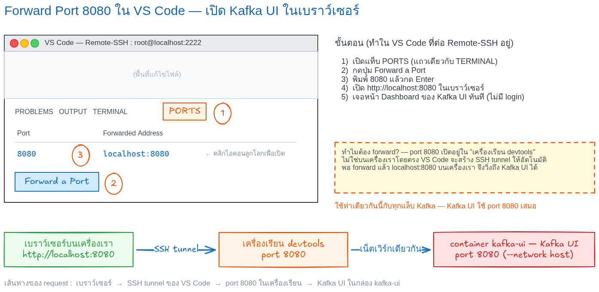
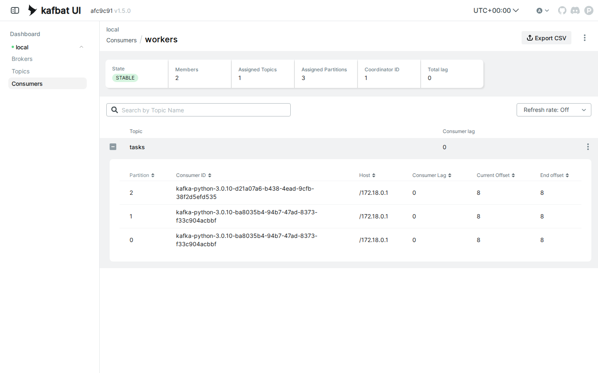

# LAB 3 — Consumer Groups : แบ่งงานกันในทีม + Rebalance

> โฟลเดอร์ `003_LAB_Consumer_Groups` = **LAB 3** ในสไลด์ `Kafka_Slides.html`
> (ไฟล์โค้ดของแล็บนี้ : `new_task.py` · `worker.py` · `requirements.txt`)

## สิ่งที่จะได้เรียนรู้

- **Consumer group** : consumer หลายตัวที่ใช้ `group_id` เดียวกัน = **ทีมเดียวกัน** — Kafka แบ่ง partition ให้ช่วยกันอ่านโดยอัตโนมัติ
- **Rebalance** : สมาชิกเข้า/ออกจากทีมเมื่อไหร่ Kafka **แจก partition ใหม่** ให้ทันที — เปิด worker เพิ่ม = scale แนวนอนได้เลย
- Kafka แบ่งงานแบบ **"เป็นเจ้าของ partition"** — ต่างจาก RabbitMQ work queue (LAB 2 ชุดที่แล้ว) ที่ broker แจก **round-robin ทีละข้อความ** · ผลพลอยได้คือ **key เดิม → partition เดิม → worker เดิมเสมอ** งานของสาขาเดียวกันจึงเรียงลำดับถูกต้องโดยไม่ต้องเขียนโค้ดจัดคิวเอง
- อ่านตาราง **`kafka-consumer-groups.sh --describe`** ให้เป็น : `CURRENT-OFFSET` · `LOG-END-OFFSET` · **`LAG` = งานค้าง** ที่มองเห็นเป็นตัวเลข
- **partitions = เพดานของ parallelism** : worker เกินจำนวน partition เมื่อไหร่ ตัวที่เกินจะ **ว่างงาน**

## ภาพรวมของแล็บนี้

1. **เปิดเครื่องเรียน + เปิด Kafka broker** — broker เดียวกับ LAB 1–2 : container เดียว port `9092` พร้อมใน ~5 วินาที
2. **สร้าง topic `tasks` แบบ 3 partitions** — 3 ช่องใน log = เปิดโอกาสให้ทีมมี worker ช่วยกันอ่านได้สูงสุด 3 ตัว
3. **อ่านโค้ด `new_task.py` / `worker.py`** — ของใหม่จาก LAB 2 คือ `group_id='workers'` บรรทัดเดียวที่เปลี่ยนทุกอย่าง
4. **Worker A ตัวเดียว** — ทีมมีคนเดียว เป็นเจ้าของครบทั้ง `[0, 1, 2]` แล้วเก็บงาน 12 งานคนเดียว
5. **เปิด Worker B ระหว่าง A ยังทำงาน** — เกิด **rebalance** : Kafka แบ่ง partition ใหม่ต่อหน้าต่อตา แล้วส่งงานอีก 12 งานดูการแบ่ง
6. **ส่องทีมด้วย CLI + Kafka UI** — ตาราง `--describe --group workers` และหน้าเว็บ Consumers เห็นว่าใครถือ partition ไหน ค้างเท่าไร
7. **ปิด Worker B แล้วทดลองเพิ่มเติม** — rebalance ขากลับ (A ได้ `[0, 1, 2]` คืน) · ปิดทีมทั้งหมดให้ **LAG สะสม 12** แล้วดูมันไหลลง 0 · เปิด worker 4 ตัวบน 3 partitions ดูตัวที่ **ว่างงาน**

---

## 0. เตรียมเครื่องเรียน

ทำบนเครื่องของเราเอง (ไม่ใช้ cloud) — เปิด container ที่ติดตั้ง Docker มาให้แล้ว

```bash
docker rm -f devtools
docker run -dit --name devtools --privileged -p 2222:22 tuchsanai/devtools:2569_1
ssh root@localhost -p 2222        # password : passwd
```

> 📝 **คำอธิบาย:** สามบรรทัดนี้คือการ "เปิดเครื่องเรียน" ให้ทุกคนได้สภาพแวดล้อมเหมือนกันเป๊ะ · `docker rm -f devtools` ลบกล่องเรียนตัวเก่าทิ้งก่อนกันชื่อซ้ำ (`-f` = force ลบได้แม้ยังทำงานอยู่) ·
> `-dit` คือ `-d` รันเบื้องหลัง + `-i` เปิด stdin ค้างไว้ + `-t` ให้มี terminal กล่องจะได้ไม่ดับทันที · `--privileged` ให้สิทธิ์เต็มเพื่อรัน **Docker ซ้อนข้างในกล่อง** (จำเป็น — broker ของแล็บนี้เป็น container ที่รันอยู่ข้างในเครื่องเรียนอีกที) ·
> `-p 2222:22` ส่ง port 2222 ของเครื่องเรา เข้า port 22 (SSH) ของกล่อง

ใน VS Code ใช้ **Remote-SSH** ต่อไปที่ `root@localhost:2222` แล้วทำแล็บทั้งหมดข้างใน (ข้อ 8 จะ forward port `8080` ที่แท็บ PORTS ของ VS Code — หน้าเว็บ Kafka UI) — ตรวจว่าพร้อมใช้งาน :

```bash
docker --version
docker compose version
```

> 📝 **คำอธิบาย:** ถามเวอร์ชันของ Docker Engine และ Compose เพื่อ **ยืนยันว่าคำสั่ง `docker` วิ่งถึง daemon ได้จริง** ก่อนเริ่มแล็บ · สิ่งที่ต้องดูคือ "มีเลขเวอร์ชันขึ้นมาไหม" ไม่ใช่ "เลขตรงกับเอกสารไหม" ·
> ถ้าขึ้น `Cannot connect to the Docker daemon` แปลว่ายังอยู่นอกกล่องเรียนหรือ daemon ยังไม่ขึ้น ให้ย้อนทำข้อ 0 ใหม่

✅ **Expected output** — ขอแค่มี **เลขเวอร์ชัน** ขึ้นครบสองบรรทัด ไม่ใช่ error (เลขเวอร์ชันของแต่ละคนอาจไม่ตรงกับเอกสารนี้):

```
Docker version 29.6.2, build dfc4efb
Docker Compose version v5.3.1
```

---

## 1. Clone โค้ดแล็บ

```bash
mkdir -p ~/labwork && cd ~/labwork
git clone https://github.com/Tuchsanai/DevTools.git
cd DevTools/07_Kafka/003_LAB_Consumer_Groups
```

> 📝 **คำอธิบาย:** `mkdir -p ~/labwork` สร้างโฟลเดอร์เก็บงาน (`-p` = มีอยู่แล้วก็ไม่ error) · `git clone` ดึงรีโพของวิชาลงมา ทำครั้งเดียวใช้ได้ทุกแล็บของชุดนี้ · แล้ว `cd` เข้าโฟลเดอร์แล็บ ซึ่งมี `new_task.py` (ตัวส่งงาน) · `worker.py` (ตัวทำงาน) · `requirements.txt` รออยู่แล้ว · ถ้าเคย clone ไว้จากแล็บก่อน git จะบอกว่าโฟลเดอร์ไม่ว่าง — ข้ามไป `cd` ได้เลย

---

## 2. เปิด Kafka Broker

```bash
docker rm -f kafka 2>/dev/null
docker run -d --name kafka -p 9092:9092 apache/kafka:4.1.0
```

> 📝 **คำอธิบาย:** คำสั่งเดียวกับ LAB 1–2 เป๊ะ ๆ · `docker rm -f kafka 2>/dev/null` ลบ broker ตัวเก่ากันชื่อซ้ำ (โยน error ทิ้งถ้าไม่มีตัวเก่า) · `-d` รันเบื้องหลัง · `--name kafka` ตั้งชื่อไว้เรียกกับ `docker exec`/`docker logs` ·
> `-p 9092:9092` เปิด port เดียวพอ — Kafka ใช้ `9092` ทั้งส่งทั้งรับ (ไม่เหมือน RabbitMQ ที่แยก 5672 กับ 15672 เพราะหน้าเว็บ UI ของ Kafka เป็น **container แยกต่างหาก** — เจอกันข้อ 8) · `apache/kafka:4.1.0` คือ image ทางการรุ่น 4.1.0 ที่รันโหมด **KRaft** — broker จัดการตัวเองได้ในกล่องเดียว ไม่ต้องมี ZooKeeper

✅ **Expected output** — ครั้งแรกยังไม่มี image ในเครื่อง Docker จึง **pull ให้อัตโนมัติ** แล้วจบด้วย **container ID ยาว 64 ตัวอักษร** = broker เริ่มรันแล้ว (layer ID · digest · container ID ของแต่ละคนจะไม่ตรงกับเอกสารนี้ · ถ้าเคย pull แล้วจะเห็นแค่บรรทัด ID บรรทัดเดียว):

```
Unable to find image 'apache/kafka:4.1.0' locally
4.1.0: Pulling from apache/kafka
1e7ff3c422db: Pulling fs layer
        ... (รวม 11 layer ทยอย Download complete → Pull complete) ...
5621607a4a73: Pull complete
Digest: sha256:bff074a5d0051dbc0bbbcd25b045bb1fe84833ec0d3c7c965d1797dd289ec88f
Status: Downloaded newer image for apache/kafka:4.1.0
43c8fd37babe8c861a033a19914d7b638b3da5cd63073f76d3d7bca24f1c1a35
```

รอบรรทัด "พร้อมรับงาน" ก่อนไปต่อ :

```bash
docker logs kafka | grep "Kafka Server started"
```

> 📝 **คำอธิบาย:** บทเรียนเดิมจากชุด RabbitMQ ยังใช้ได้เสมอ — **`Up` ≠ พร้อมรับงาน** ต้องกรอง log หาบรรทัด **`Kafka Server started`** ก่อน · ข่าวดีคือ Kafka บูตไวมาก (~5 วินาที ต่างจาก RabbitMQ ที่กว่า 13 วินาที) ถ้ายังไม่เจอ รอ 2–3 วินาทีแล้วรันซ้ำ

✅ **Expected output** — เจอหนึ่งบรรทัดคือใช้ได้ (วันเวลาของแต่ละคนจะไม่ตรงกับเอกสารนี้):

```
[2026-08-12 08:21:05,055] INFO [KafkaRaftServer nodeId=1] Kafka Server started (kafka.server.KafkaRaftServer)
```

---

## 3. สร้าง topic `tasks` แบบ 3 partitions

หัวใจของแล็บนี้เริ่มตรงนี้ — **จำนวน partition คือจำนวนมือที่ทีมจะช่วยกันอ่านได้สูงสุด** เราจงใจสร้าง 3 ช่องไว้ก่อน :

```bash
docker exec kafka /opt/kafka/bin/kafka-topics.sh --bootstrap-server localhost:9092 \
  --create --topic tasks --partitions 3
```

> 📝 **คำอธิบาย:** เครื่องมือ CLI ของ Kafka อยู่ **ข้างใน container `kafka`** ที่ `/opt/kafka/bin/` จึงสั่งผ่าน `docker exec` เสมอ (แบบเดียวกับ `rabbitmqctl` ของชุดที่แล้ว) · `--bootstrap-server localhost:9092` บอกว่าให้คุยกับ broker ตัวไหน ·
> `--create --topic tasks` สร้าง topic ชื่อ `tasks` · `--partitions 3` แบ่ง log ของ topic เป็น **3 ช่อง** (partition 0, 1, 2) — แต่ละช่องคือ log ย่อยที่เรียงลำดับของตัวเอง · ตัวเลขนี้คือ **เพดานของ parallelism** ที่จะพิสูจน์กันท้ายแล็บ

✅ **Expected output** — บรรทัดเดียวสั้น ๆ :

```
Created topic tasks.
```

ตรวจโครงสร้างของ topic ที่เพิ่งสร้าง :

```bash
docker exec kafka /opt/kafka/bin/kafka-topics.sh --bootstrap-server localhost:9092 \
  --describe --topic tasks
```

> 📝 **คำอธิบาย:** `--describe` ขอดูรายละเอียด topic · บรรทัดแรกคือภาพรวม — จุดที่ต้องดูคือ **`PartitionCount: 3`** · สามบรรทัดถัดมาคือ partition ทีละช่อง (`Partition: 0/1/2`) — `Leader: 1` แปลว่า broker หมายเลข 1 (ตัวเดียวที่เรามี) เป็นเจ้าของทุกช่อง · `ReplicationFactor: 1` คือไม่มีสำเนาสำรอง (เครื่องเรียนมี broker เดียว — ของจริง production ใช้ 3)

✅ **Expected output** — `PartitionCount: 3` และมีแถว partition ครบ 3 แถว (TopicId ของแต่ละคนจะไม่ตรงกับเอกสารนี้):

```
Topic: tasks	TopicId: 7tCY721sSymdVO6FGp60Lg	PartitionCount: 3	ReplicationFactor: 1	Configs: min.insync.replicas=1,segment.bytes=1073741824
	Topic: tasks	Partition: 0	Leader: 1	Replicas: 1	Isr: 1	Elr: 	LastKnownElr:
	Topic: tasks	Partition: 1	Leader: 1	Replicas: 1	Isr: 1	Elr: 	LastKnownElr:
	Topic: tasks	Partition: 2	Leader: 1	Replicas: 1	Isr: 1	Elr: 	LastKnownElr:
```

---

## 4. เตรียม Python — venv + kafka-python

เครื่องเรียนมี Python 3 แล้ว แต่ระบบสมัยใหม่ (PEP 668) **ไม่ยอมให้ `pip install` ลงเครื่องตรง ๆ** ต้องผ่าน **virtual environment** (ถ้าสร้าง `~/venv-kafka` ไว้แล้วจากแล็บก่อน ข้ามบรรทัดแรกได้) :

```bash
python3 -m venv ~/venv-kafka
source ~/venv-kafka/bin/activate
pip install kafka-python==3.0.10
```

> 📝 **คำอธิบาย:** `python3 -m venv ~/venv-kafka` สร้างสภาพแวดล้อม Python แยกส่วนตัวไว้ที่ home ใช้ร่วมกันได้ทุกแล็บ Kafka · `source ~/venv-kafka/bin/activate` เปิดใช้งาน — สังเกต prompt ขึ้นคำนำหน้า `(venv-kafka)` = ตอนนี้ `python`/`pip` ชี้เข้า venv แล้ว ·
> `pip install kafka-python==3.0.10` ติดตั้ง **kafka-python** ไลบรารีฝั่ง client ล็อกเวอร์ชันให้ตรงทั้งห้อง (ตรงกับ `requirements.txt` ของแล็บ — จะใช้ `pip install -r requirements.txt` แทนก็ได้)

✅ **Expected output** — บรรทัดสุดท้ายต้องเป็น `Successfully installed kafka-python-3.0.10` (ความเร็วดาวน์โหลดของแต่ละคนจะไม่ตรงกับเอกสารนี้ · ถ้าติดตั้งไว้แล้วจะขึ้น `Requirement already satisfied` แทน — ใช้ได้เหมือนกัน):

```
Collecting kafka-python==3.0.10
  Downloading kafka_python-3.0.10-py3-none-any.whl.metadata (11 kB)
Downloading kafka_python-3.0.10-py3-none-any.whl (614 kB)
   ━━━━━━━━━━━━━━━━━━━━━━━━━━━━━━━━━━━━━━━━ 614.2/614.2 kB 12.8 MB/s eta 0:00:00
Installing collected packages: kafka-python
Successfully installed kafka-python-3.0.10
```

> **⚠️ กติกาสำคัญ :** แล็บนี้ใช้ **หลาย terminal พร้อมกัน** (สูงสุด 5 หน้าต่างในทดลองเพิ่มเติม ข) — terminal ใหม่ทุกหน้าต่างต้อง `source ~/venv-kafka/bin/activate` ก่อนเสมอ ลืมเมื่อไหร่เจอ `ModuleNotFoundError: No module named 'kafka'` ทันที

---

## 5. รู้จักโค้ดของแล็บนี้

โจทย์สมมุติ : ระบบร้านสาขา — งานแต่ละชิ้นมาจากสาขา `bangkok` / `chiangmai` / `hatyai` และ**งานของสาขาเดียวกันต้องทำเรียงลำดับ** (สั่งของก่อนจ่ายเงิน!) ส่วน worker แต่ละตัวใช้เวลา 1 วินาทีต่องาน

### `new_task.py` — ตัวส่งงาน (producer)

```python
import sys
from kafka import KafkaProducer

# 1) ต่อ broker
producer = KafkaProducer(bootstrap_servers='localhost:9092')

# 2) จำนวนงานที่จะส่ง — ใส่เป็น argument ได้ เช่น `python new_task.py 12` (ไม่ใส่ = 12)
count = int(sys.argv[1]) if len(sys.argv) > 1 else 12

# 3) ส่งงานเข้า topic 'tasks' โดยใช้ key = ชื่อสาขา (วนครบ 3 สาขา)
#    key เดิม → partition เดิมเสมอ (บทเรียนจาก LAB 2) — งานจึงกระจายครบทุก partition
branches = ['bangkok', 'chiangmai', 'hatyai']
for i in range(1, count + 1):
    branch = branches[(i - 1) % 3]
    message = f'task-{i} ({branch})'
    metadata = producer.send('tasks',
                             key=branch.encode(),
                             value=message.encode()).get(timeout=10)
    print(f" [x] Sent '{message}' -> partition={metadata.partition}")

producer.close()
```

> 📝 **คำอธิบาย:** ไล่ตามเลขในคอมเมนต์ · **(1)** `KafkaProducer` ต่อ broker ที่ `localhost:9092` — ไม่ต้องมี user/password เพราะ broker ตั้งต้นของแล็บเปิดแบบ PLAINTEXT · **(2)** จำนวนงานรับจาก argument — เดี๋ยวเราจะสั่ง `python new_task.py 12` ·
> **(3)** จุดสำคัญคือ `key=branch.encode()` — บทเรียนจาก LAB 2 : Kafka เอา key ไป hash เลือก partition ดังนั้น **key เดิมลงช่องเดิมเสมอ** งานของสาขาเดียวกันจึงเรียงอยู่ในช่องเดียวกันเป็นแถวเดียว · `.get(timeout=10)` รอผลยืนยันจาก broker แล้วคืน `metadata` ที่บอกว่า **ข้อความลง partition ไหน** เอามาพิมพ์โชว์ · สังเกตว่าโค้ดฝั่งส่ง **ไม่รู้จัก worker เลย** — มันแค่เขียนลง log

### `worker.py` — ตัวทำงาน (consumer ในทีม `workers`)

```python
import sys
import time
from kafka import KafkaConsumer

def main():
    # ตั้งชื่อ worker ผ่าน argument เช่น `python worker.py A` (ไว้ดูว่าใครได้งานไหน)
    name = sys.argv[1] if len(sys.argv) > 1 else 'worker'

    # 1) จุดเปลี่ยนสำคัญของแล็บนี้ : ใส่ group_id='workers'
    #    ทุก worker ที่ใช้ group_id เดียวกัน = ทีมเดียวกัน → Kafka "แบ่ง partition" ให้ช่วยกันอ่าน
    #    และจดไว้ด้วยว่าทีมนี้อ่านถึง offset ไหนแล้ว (รันใหม่จะไม่อ่านซ้ำ)
    consumer = KafkaConsumer('tasks',
                             bootstrap_servers='localhost:9092',
                             group_id='workers',
                             auto_offset_reset='earliest')

    print(f' [*] Worker {name} waiting for tasks. To exit press CTRL+C')

    assignment = None
    while True:
        # 2) poll ดึงงานชุดถัดไป (รอไม่เกิน 1 วินาทีต่อรอบ)
        batch = consumer.poll(timeout_ms=1000)

        # 3) เช็กว่าโดน "แบ่ง partition" ใหม่หรือยัง — พิมพ์ทุกครั้งที่มีการเปลี่ยน (rebalance)
        current = sorted(tp.partition for tp in consumer.assignment())
        if current and current != assignment:
            print(f' [*] Worker {name} ได้รับมอบหมาย partitions: {current}')
            assignment = current

        # 4) ทำงานทีละข้อความ — sleep 1 วินาที = แกล้งทำเป็นงานที่ใช้เวลา
        for tp, messages in batch.items():
            for message in messages:
                print(f' [x] Worker {name} got p{message.partition} '
                      f'offset={message.offset} {message.value.decode()}')
                time.sleep(1)

if __name__ == '__main__':
    try:
        main()
    except KeyboardInterrupt:
        print('Interrupted')
        sys.exit(0)
```

> 📝 **คำอธิบาย:** **(1)** คือพระเอกของแล็บ — `group_id='workers'` : LAB ก่อน ๆ consumer ไม่มี group ต่างคนต่างอ่าน แต่พอใส่ `group_id` เดียวกัน consumer ทุกตัวกลายเป็น **ทีมเดียวกัน** Kafka จะ (ก) **แบ่ง partition** ให้สมาชิกช่วยกันอ่านคนละช่อง ไม่ซ้ำกัน และ (ข) **จด offset ของทีม** ไว้ที่ broker — ปิดแล้วเปิดใหม่จะอ่านต่อจากที่ค้าง ไม่อ่านซ้ำ · `auto_offset_reset='earliest'` ใช้เฉพาะครั้งแรกสุดที่ทีมยังไม่เคยจด offset — ให้เริ่มอ่านจากต้น log ·
> **(2)** `poll(timeout_ms=1000)` ดึงข้อความชุดถัดไปแบบ batch (ต่างจาก pika ที่ broker ยัด callback ให้ — Kafka ฝั่ง consumer เป็นคน **ดึงเอง**) · **(3)** `consumer.assignment()` ถามว่าตอนนี้ฉันถือ partition ไหนอยู่ — เราพิมพ์ทุกครั้งที่ค่าเปลี่ยน เพื่อ **มองเห็น rebalance ด้วยตาเปล่า** · **(4)** `sleep 1` วินาทีต่องาน = งานปลอมที่ใช้เวลา · สังเกตว่า **ไม่มี ack ให้เขียนเอง** — ทีมจด offset ให้อัตโนมัติเบื้องหลัง และข้อความ **ไม่ถูกลบออกจาก log** ไม่ว่าอ่านไปแล้วกี่รอบ (ต่างจาก RabbitMQ ที่ ack แล้วข้อความหายจากคิวทันที)

---

## 6. Worker A ตัวเดียว — เป็นเจ้าของครบทั้ง 3 partitions

แล็บนี้ใช้ **3 หน้าต่าง terminal** เป็นหลัก (แต่ละหน้าต่างคือ `ssh root@localhost -p 2222` เข้าเครื่องเรียนอีก session) : **หน้าต่างที่ 1** ไว้ส่งงาน + สั่ง `docker exec` ส่วน **หน้าต่างที่ 2 และ 3** เป็น worker คนละตัว — เปิด **หน้าต่างที่ 2** สตาร์ต Worker A (อย่าลืม activate venv!) :

```bash
source ~/venv-kafka/bin/activate
cd ~/labwork/DevTools/07_Kafka/003_LAB_Consumer_Groups
python worker.py A
```

> 📝 **คำอธิบาย:** เปิด worker ตัวแรกของทีม `workers` ตั้งชื่อ `A` · ตอนนี้ทีมมีสมาชิกคนเดียว — Kafka เลยยกให้ **ทั้ง 3 partitions** · โปรแกรม **ไม่จบเอง** ค้างรออยู่ = ถูกต้องแล้ว ปล่อยไว้ · บรรทัด "ได้รับมอบหมาย" อาจโผล่ช้ากว่าบรรทัดแรก 2–3 วินาที (กำลังเจรจาเข้าทีมกับ broker)

✅ **Expected output** — ทีมคนเดียว ได้ครบทุกช่อง :

```
 [*] Worker A waiting for tasks. To exit press CTRL+C
 [*] Worker A ได้รับมอบหมาย partitions: [0, 1, 2]
        ^ ค้างอยู่ตรงนี้ — รองานที่จะส่งมา
```

ไปที่ **หน้าต่างที่ 1** ส่งงาน 12 งาน :

```bash
source ~/venv-kafka/bin/activate
cd ~/labwork/DevTools/07_Kafka/003_LAB_Consumer_Groups
python new_task.py 12
```

> 📝 **คำอธิบาย:** ส่ง `task-1` ถึง `task-12` โดย key วนสามสาขา — สังเกตคอลัมน์ `partition=` ท้ายบรรทัด : **bangkok ลงช่อง 2 · chiangmai ลงช่อง 1 · hatyai ลงช่อง 0 ทุกครั้ง** ไม่มีสุ่ม (ผล hash ของ key สามคำนี้บนเครื่องไหนก็ได้ค่านี้ — ของทุกคนตรงกับเอกสารนี้ด้วย!) · ระหว่างส่ง ชำเลืองดูหน้าต่างที่ 2 ไปด้วย — งานเริ่มไหลทันที

✅ **Expected output** — ครบ 12 งาน แต่ละสาขาลงช่องประจำของตัวเอง :

```
 [x] Sent 'task-1 (bangkok)' -> partition=2
 [x] Sent 'task-2 (chiangmai)' -> partition=1
 [x] Sent 'task-3 (hatyai)' -> partition=0
 [x] Sent 'task-4 (bangkok)' -> partition=2
        ... (วนสามสาขาแบบเดียวกันจนครบ — bangkok→2 · chiangmai→1 · hatyai→0 ทุกรอบ) ...
 [x] Sent 'task-12 (hatyai)' -> partition=0
```

✅ **Expected output** — กลับมาดู **หน้าต่างที่ 2** : Worker A เก็บครบทั้ง 12 งานคนเดียว (งานละ 1 วินาที ≈ 12 วินาที) · จุดที่ต้องดูคือ **offset ของแต่ละช่องไล่ 0 → 3 เป๊ะ** ส่วนลำดับข้ามช่องสลับกันได้ (ของแต่ละคนอาจไม่เรียงเหมือนเอกสารนี้):

```
 [*] Worker A waiting for tasks. To exit press CTRL+C
 [*] Worker A ได้รับมอบหมาย partitions: [0, 1, 2]
 [x] Worker A got p2 offset=0 task-1 (bangkok)
 [x] Worker A got p0 offset=0 task-3 (hatyai)
 [x] Worker A got p0 offset=1 task-6 (hatyai)
 [x] Worker A got p0 offset=2 task-9 (hatyai)
 [x] Worker A got p0 offset=3 task-12 (hatyai)
        ... (p1 chiangmai อีก 4 บรรทัด offset=0→3 แบบเดียวกัน) ...
 [x] Worker A got p2 offset=1 task-4 (bangkok)
 [x] Worker A got p2 offset=2 task-7 (bangkok)
 [x] Worker A got p2 offset=3 task-10 (bangkok)
```

> **อ่านผลให้เป็น :** `poll` ดึงงานมาเป็น **ชุดต่อ partition** — จึงเห็นงาน hatyai (p0) มาติดกันสี่งาน แล้วค่อย chiangmai (p1) สี่งาน · Kafka **การันตีลำดับเฉพาะภายใน partition เดียวกัน** (ดู offset 0→1→2→3 ของแต่ละช่อง — เรียงเป๊ะ) ส่วนลำดับ **ข้าม** partition ไม่การันตี — และไม่จำเป็น เพราะงานต่างสาขาไม่เกี่ยวกัน

---

## 7. เปิด Worker B — Rebalance ต่อหน้าต่อตา

เปิด **หน้าต่างที่ 3** แล้วสตาร์ต Worker B **โดยไม่ต้องปิด A** :

```bash
source ~/venv-kafka/bin/activate
cd ~/labwork/DevTools/07_Kafka/003_LAB_Consumer_Groups
python worker.py B
```

> 📝 **คำอธิบาย:** โค้ดตัวเดิม แค่เปลี่ยนชื่อเป็น `B` — พอ B ขอเข้าทีม `workers` Kafka จะประกาศ **rebalance** : เรียกทุกคนในทีมมาแบ่ง partition กันใหม่ · ใช้เวลาไม่กี่วินาที ระหว่างนั้นทั้งทีมหยุดอ่านชั่วคราว — ปกติ ไม่ใช่พัง · จับตา **ทั้งสองหน้าต่าง** : ทั้ง A และ B จะพิมพ์บรรทัด "ได้รับมอบหมาย" ใหม่พร้อม ๆ กัน

✅ **Expected output** — ทีม 2 คนแบ่ง 3 ช่อง : ตัวหนึ่งได้ 2 ช่อง อีกตัวได้ 1 ช่อง (ใครได้ชุดไหนสลับกันได้ — ของแต่ละคนอาจไม่ตรงกับเอกสารนี้):

```
──── หน้าต่างที่ 3 (Worker B — สมาชิกใหม่) ────
 [*] Worker B waiting for tasks. To exit press CTRL+C
 [*] Worker B ได้รับมอบหมาย partitions: [0, 1]
──── หน้าต่างที่ 2 (Worker A — พิมพ์เพิ่มเอง ไม่ต้องทำอะไร) ────
 [*] Worker A ได้รับมอบหมาย partitions: [2]
```

> **นี่คือ rebalance :** A เคยถือ `[0, 1, 2]` — พอ B เข้าทีม Kafka **ริบช่อง 0 กับ 1 ไปให้ B** เหลือช่อง 2 ให้ A · เราไม่ได้แตะโค้ดแม้แต่บรรทัดเดียว — อยากได้แรงเพิ่มก็แค่เปิด worker เพิ่ม

**หน้าต่างที่ 1** ส่งงานชุดใหม่อีก 12 งาน แล้วดูการแบ่งงาน :

```bash
python new_task.py 12
```

> 📝 **คำอธิบาย:** งานชุดเดิม key วนสามสาขาเหมือนข้อ 6 (ฝั่งส่งพิมพ์ 12 บรรทัดเหมือนเดิมเป๊ะ — `bangkok→2 · chiangmai→1 · hatyai→0`) · แต่คราวนี้ปลายทางมี worker สองตัวถือช่องคนละชุด — **งานจะวิ่งหาเจ้าของช่อง** : bangkok (p2) ไปหา A · chiangmai (p1) กับ hatyai (p0) ไปหา B

✅ **Expected output** — งานแยกไปตาม **เจ้าของ partition** ไม่ใช่สลับตัวละงาน (สังเกต offset ต่อจากรอบแรก 4→7 เพราะ log เดิมยาวขึ้น):

```
──── หน้าต่างที่ 2 (Worker A ถือ p2) — ได้เฉพาะ bangkok ────
 [x] Worker A got p2 offset=4 task-1 (bangkok)
 [x] Worker A got p2 offset=5 task-4 (bangkok)
 [x] Worker A got p2 offset=6 task-7 (bangkok)
 [x] Worker A got p2 offset=7 task-10 (bangkok)
──── หน้าต่างที่ 3 (Worker B ถือ p0, p1) — ได้ chiangmai + hatyai ────
 [x] Worker B got p1 offset=4 task-2 (chiangmai)
 [x] Worker B got p0 offset=4 task-3 (hatyai)
 [x] Worker B got p0 offset=5 task-6 (hatyai)
 [x] Worker B got p0 offset=6 task-9 (hatyai)
 [x] Worker B got p0 offset=7 task-12 (hatyai)
 [x] Worker B got p1 offset=5 task-5 (chiangmai)
        ... (p1 chiangmai อีก 2 บรรทัด offset=6→7) ...
```

> **เทียบกับ RabbitMQ ให้ชัด :** LAB 2 ของชุดที่แล้ว broker แจกงาน **round-robin ทีละข้อความ** — งานที่ 1 ให้ตัวหนึ่ง งานที่ 2 ให้อีกตัว สลับไปเรื่อย ๆ ไม่สนว่างานไหนเป็นเรื่องเดียวกัน · Kafka แบ่งแบบ **"เป็นเจ้าของ partition"** — งานสาขาเดิม **ไปหา worker ตัวเดิมเสมอ** ตราบใดที่ไม่มี rebalance ·
> ราคาที่ได้คือของฟรีชิ้นใหญ่ : **ลำดับงานต่อสาขาไม่มีวันสลับ** (task-3 → task-6 → task-9 → task-12 ของ hatyai เรียงเป๊ะในมือ B คนเดียว) — ใน RabbitMQ ถ้าอยากได้แบบนี้ต้องออกแบบคิวแยกต่อสาขาเอง

---

## 8. ส่องทีม — `kafka-consumer-groups.sh` + Kafka UI

ระหว่าง worker ทั้งสองยังรันอยู่ ไปที่ **หน้าต่างที่ 1** ถาม broker ว่าทีม `workers` เป็นยังไงบ้าง :

```bash
docker exec kafka /opt/kafka/bin/kafka-consumer-groups.sh --bootstrap-server localhost:9092 \
  --describe --group workers
```

> 📝 **คำอธิบาย:** เครื่องมือประจำตัวของหัวหน้าทีม — หนึ่งแถวต่อหนึ่ง partition · คอลัมน์ที่ต้องอ่านให้เป็น : **`CURRENT-OFFSET`** ทีมอ่าน+จดถึงไหนแล้ว · **`LOG-END-OFFSET`** ปลาย log อยู่ที่ไหน · **`LAG` = ส่วนต่าง = จำนวนงานค้าง** ของช่องนั้น · **`CONSUMER-ID`** ใครเป็นเจ้าของช่องนี้ตอนนี้ ·
> จุดที่ต้องดูในผลข้างล่าง : ทั้งสามช่องอ่านครบ (`8/8` → LAG `0`) และ CONSUMER-ID มี **สองค่าไม่ซ้ำกัน** — `...d21a07a6...` ถือช่อง 2 (คือ Worker A) ส่วน `...ba8035b4...` ถือช่อง 0 กับ 1 (คือ Worker B) ตรงกับบรรทัด "ได้รับมอบหมาย" ในข้อ 7 เป๊ะ

✅ **Expected output** — LAG เป็น 0 ทุกช่อง (งาน 24 งานถูกเก็บหมดแล้ว) และเห็นเจ้าของ 2 คน (ID · ลำดับแถวของแต่ละคนจะไม่ตรงกับเอกสารนี้):

```
GROUP           TOPIC           PARTITION  CURRENT-OFFSET  LOG-END-OFFSET  LAG             CONSUMER-ID                                              HOST            CLIENT-ID
workers         tasks           1          8               8               0               kafka-python-3.0.10-ba8035b4-94b7-47ad-8373-f33c904acbbf /172.18.0.1     kafka-python-3.0.10
workers         tasks           0          8               8               0               kafka-python-3.0.10-ba8035b4-94b7-47ad-8373-f33c904acbbf /172.18.0.1     kafka-python-3.0.10
workers         tasks           2          8               8               0               kafka-python-3.0.10-d21a07a6-b438-4ead-9cfb-38f2d5efd535 /172.18.0.1     kafka-python-3.0.10
```

### เปิด Kafka UI ดูทีมแบบหน้าเว็บ

Kafka ไม่มีหน้าเว็บในตัว — เปิด **Kafbat UI** เป็น container อีกใบ (หน้าต่างที่ 1) :

```bash
docker run -d --name kafka-ui --network host \
  -e KAFKA_CLUSTERS_0_NAME=local \
  -e KAFKA_CLUSTERS_0_BOOTSTRAPSERVERS=localhost:9092 \
  kafbat/kafka-ui:latest
```

> 📝 **คำอธิบาย:** `--network host` ให้ UI ใช้ network เดียวกับเครื่องเรียนตรง ๆ — มันจะเสิร์ฟหน้าเว็บที่ port `8080` และต่อ broker ที่ `localhost:9092` ได้เลย · `KAFKA_CLUSTERS_0_NAME=local` ตั้งชื่อ cluster ที่จะโชว์ในหน้าเว็บ · `KAFKA_CLUSTERS_0_BOOTSTRAPSERVERS` บอกว่า broker อยู่ไหน · UI ใช้เวลาอุ่นเครื่องราวครึ่งนาทีหลังรัน

✅ **Expected output** — ครั้งแรก pull image ให้อัตโนมัติแล้วจบด้วย container ID (layer ID · digest · ID ของแต่ละคนจะไม่ตรงกับเอกสารนี้):

```
Unable to find image 'kafbat/kafka-ui:latest' locally
latest: Pulling from kafbat/kafka-ui
        ... (ทยอย Download complete → Pull complete จนครบทุก layer) ...
Digest: sha256:7cda86a33344160309fdb65146332e4da65db81a945614f2fe32e210803f6fd1
Status: Downloaded newer image for kafbat/kafka-ui:latest
87a1d3b49d73bcb12bbb5000c11e2fa9f46ceb620217ffcea5e825a9d63ec970
```

หน้าเว็บเปิดอยู่ที่ port `8080` **ข้างในเครื่องเรียน** — ต้องให้ VS Code forward ออกมาก่อน : เปิดแท็บ **PORTS** (แถวเดียวกับ TERMINAL) → กดปุ่ม **Forward a Port** → พิมพ์ `8080` → **Enter** แล้วเปิด `http://localhost:8080` ในเบราว์เซอร์ (หรือคลิกไอคอนลูกโลกในแถวของ port)



หรือถ้าไม่ใช้ VS Code ก็ forward ด้วยมือจาก terminal ใหม่บนเครื่องเรา :

```bash
ssh -L 8080:localhost:8080 root@localhost -p 2222        # password : passwd
```

> 📝 **คำอธิบาย:** `-L 8080:localhost:8080` เปิด port 8080 บนเครื่องเรา แล้วส่งทุก connection ผ่านท่อ ssh ไปโผล่ที่ port 8080 ข้างในเครื่องเรียน · หน้าต่างนี้ต้องเปิดค้างไว้ตลอดที่ใช้ UI — ปิดเมื่อไหร่ tunnel หายทันที

ไปที่เมนู **Consumers** → คลิกกลุ่ม `workers` (ถ้าตารางว่าง กดปุ่ม `+` หน้าแถว `tasks` เพื่อกางรายละเอียด) :



> 📝 **จุดที่ต้องดูในหน้านี้:** แถบบน — **State: STABLE** (rebalance จบแล้ว ทีมนิ่ง) · **Members: 2** คือ Worker A กับ B ของเรา · **Assigned Partitions: 3** · **Total lag: 0** ไม่มีงานค้าง · ตารางล่างกางแถว `tasks` ออกมา — เห็นทีละ partition ว่า **Consumer ID ไหนถือช่องไหน** : ช่อง 2 เป็นของ `...d21a07a6...` (Worker A) ช่อง 1 กับ 0 เป็นของ `...ba8035b4...` (Worker B) — **ตรงกับตาราง CLI ข้างบนทุกตัวอักษร** เพราะมันคือข้อมูลก้อนเดียวกัน คนละมุมมอง

ไปที่เมนู **Topics** → คลิก `tasks` :


> 📝 **จุดที่ต้องดูในหน้านี้:** **Partitions: 3** ตามที่สร้าง · **Message Count: 24** = งาน 2 รอบ × 12 งาน — สังเกตว่า **งานที่ worker อ่านไปหมดแล้วยังอยู่ครบ** ไม่หายไปไหน! นี่คือหัวใจของ Kafka : topic เป็น **append-only log** อ่านแล้วไม่ลบ (ถ้าเป็น RabbitMQ ป่านนี้คิวว่างเปล่าเพราะ ack แล้วข้อความถูกลบ) · ตารางล่าง — แต่ละ partition มี First Offset `0` ถึง Next Offset `8` คือช่องละ 8 ข้อความเป๊ะ ๆ ตามที่ key แบ่งไว้

> **ทดลองเสร็จแล้ว — ลบ tunnel ทุกครั้ง :** แบบ VS Code ไปที่แท็บ **PORTS** → คลิกขวาที่ `8080` → **Stop Forwarding Port** · แบบ `ssh -L` พิมพ์ `exit` (หรือ `Ctrl+D`) ใน session นั้น — tunnel ปิดทันที (ยังไม่ต้องปิดตอนนี้ก็ได้ แต่**จบแล็บแล้วต้องปิดเสมอ**)

---

## 9. ปิด Worker B — Rebalance ขากลับ

ไปที่ **หน้าต่างที่ 3** (Worker B) แล้วกด **Ctrl+C** — B พิมพ์ `Interrupted` แล้วคืน prompt (บนจออาจเห็น `^C` แทรกตรงที่กด) · แล้วหันมาดู **หน้าต่างที่ 2** (Worker A) — ไม่ต้องทำอะไร รอสักครู่ (ราว 10–30 วินาที) :

✅ **Expected output** — Kafka รู้ว่า B หายไป จึงคืนทุกช่องให้ A :

```
 [*] Worker A ได้รับมอบหมาย partitions: [0, 1, 2]
```

> 📝 **คำอธิบาย:** rebalance ขากลับ — broker เฝ้าจับชีพจร (heartbeat) ของสมาชิกทุกตัว พอ B เงียบหายเกิน **session timeout** (ราว 10 วินาที) ก็ประกาศแบ่งช่องใหม่ ยกทั้งสามช่องคืนให้ A · ระบบจึง **ซ่อมตัวเอง** ได้ : worker ตายไม่ใช่เหตุการณ์พิเศษ แค่ rebalance รอบหนึ่งเท่านั้น — ไม่ต้องมีใครมากดปุ่มอะไร

พิสูจน์ว่า A รับงานแทนทั้งหมดจริง — **หน้าต่างที่ 1** ส่งอีก 6 งาน :

```bash
python new_task.py 6
```

> 📝 **คำอธิบาย:** `6` คือ argument จำนวนงาน — ได้ `task-1` ถึง `task-6` key วนสามสาขาเหมือนเดิม (ฝั่งส่งขึ้น `Sent` 6 บรรทัด) · คราวนี้ทุกช่องเป็นของ A หมดแล้ว งานทุกสาขาจึงไหลไปหน้าต่างที่ 2 ทั้งหมด

✅ **Expected output** — **หน้าต่างที่ 2** เก็บครบทั้ง 6 งานคนเดียว ทุก partition :

```
 [x] Worker A got p2 offset=8 task-1 (bangkok)
 [x] Worker A got p0 offset=8 task-3 (hatyai)
 [x] Worker A got p0 offset=9 task-6 (hatyai)
 [x] Worker A got p1 offset=8 task-2 (chiangmai)
 [x] Worker A got p1 offset=9 task-5 (chiangmai)
 [x] Worker A got p2 offset=9 task-4 (bangkok)
```

> **ครบวงจรแล้ว :** สมาชิกเข้า → แบ่งช่องใหม่ · สมาชิกออก → คืนช่องให้คนที่เหลือ · ทั้งหมดอัตโนมัติ และ **ไม่มีข้อความหล่นหาย** เพราะข้อความอยู่ใน log ตลอด — เปลี่ยนแค่ว่า "ใครถือตำแหน่งอ่านของช่องไหน"

---

## ทดลองเพิ่มเติม

### ก. LAG มองเห็นได้ — งานค้างเป็นตัวเลข ไม่ต้องเดา

ปิด worker ให้หมดทีม : ไปที่ **หน้าต่างที่ 2** (Worker A ตัวสุดท้ายที่ยังรัน) กด **Ctrl+C** จนขึ้น `Interrupted` — ตอนนี้ **ทีมไม่มีสมาชิกเลย** แล้วส่งงาน 12 งานทิ้งไว้จาก **หน้าต่างที่ 1** พร้อมถามสถานะทีม :

```bash
python new_task.py 12
docker exec kafka /opt/kafka/bin/kafka-consumer-groups.sh --bootstrap-server localhost:9092 \
  --describe --group workers
```

> 📝 **คำอธิบาย:** ส่งงานทั้งที่ไม่มีใครรับ — ใน RabbitMQ เราเช็กงานค้างด้วย `list_queues` ใน Kafka ใช้ตาราง describe ตัวเดิม : `LOG-END-OFFSET` ขยับไปข้างหน้า (ของใหม่เข้ามา) แต่ `CURRENT-OFFSET` หยุดนิ่ง (ไม่มีใครอ่าน) — **ส่วนต่างคือ LAG ช่องละ 4 รวม 12 งานค้าง** พอดีกับที่เพิ่งส่ง · (ถ้ารัน describe ภายใน ~10 วินาทีหลังปิด A อาจยังเห็น CONSUMER-ID ของ A ค้างอยู่ — broker ยังรอ session timeout รอครู่แล้วรันซ้ำ)

✅ **Expected output** — ฝั่งส่งขึ้น `Sent` 12 บรรทัดเหมือนเดิม แล้วตาราง describe บอกว่าทีมร้าง + งานค้างครบ (สังเกต CONSUMER-ID เป็น `-` ทุกแถว):

```
Consumer group 'workers' has no active members.

GROUP           TOPIC           PARTITION  CURRENT-OFFSET  LOG-END-OFFSET  LAG             CONSUMER-ID     HOST            CLIENT-ID
workers         tasks           2          10              14              4               -               -               -
workers         tasks           1          10              14              4               -               -               -
workers         tasks           0          10              14              4               -               -               -
```

เปิด Worker A กลับมา (**หน้าต่างที่ 2**) — `python worker.py A` แล้วดูของค้างโดนเก็บเรียบ :

✅ **Expected output** — งานค้างทั้ง 12 ไหลมาทันที และ **เริ่มอ่านต่อจาก offset ที่ทีมจดไว้** (offset 10 เป็นต้นไป — งานเก่า 30 งานแรกไม่ถูกอ่านซ้ำ!):

```
 [*] Worker A waiting for tasks. To exit press CTRL+C
 [*] Worker A ได้รับมอบหมาย partitions: [0, 1, 2]
 [x] Worker A got p1 offset=10 task-2 (chiangmai)
 [x] Worker A got p1 offset=11 task-5 (chiangmai)
        ... ( [x] Worker A got ... รวม 12 บรรทัด — ทุกช่อง offset วิ่ง 10→13) ...
 [x] Worker A got p2 offset=13 task-10 (bangkok)
```

✅ **Expected output** — รอ ~12 วินาทีให้เก็บครบ แล้ว **หน้าต่างที่ 1** รัน describe ซ้ำ : LAG ไหลลงเหลือ `0` ทุกช่อง และ CONSUMER-ID กลับมามีเจ้าของ (ID ของแต่ละคนจะไม่ตรงกับเอกสารนี้):

```
GROUP           TOPIC           PARTITION  CURRENT-OFFSET  LOG-END-OFFSET  LAG             CONSUMER-ID                                              HOST            CLIENT-ID
workers         tasks           2          14              14              0               kafka-python-3.0.10-13cba210-4c02-43a1-ab17-fecaefa59353 /172.18.0.1     kafka-python-3.0.10
workers         tasks           1          14              14              0               kafka-python-3.0.10-13cba210-4c02-43a1-ab17-fecaefa59353 /172.18.0.1     kafka-python-3.0.10
workers         tasks           0          14              14              0               kafka-python-3.0.10-13cba210-4c02-43a1-ab17-fecaefa59353 /172.18.0.1     kafka-python-3.0.10
```

> **บทเรียน :** **LAG คือมิเตอร์สุขภาพของระบบ** — LAG โตขึ้นเรื่อย ๆ = ผู้บริโภคตามผู้ผลิตไม่ทัน (ต้องเพิ่ม worker หรือเพิ่ม partition) · LAG นิ่งที่ 0 = ทีมตามทัน · ของจริงเขาตั้ง alert ไว้ที่ตัวเลขนี้กันทั้งนั้น — และมันดูได้ทั้งจาก CLI ตารางนี้ และคอลัมน์ **Consumer lag** ในหน้า Consumers ของ Kafka UI

### ข. Worker เกินจำนวน partition — ตัวที่เกินจะว่างงาน

Worker A ยังรันอยู่จากข้อ ก. — เปิด Worker B กลับมาที่ **หน้าต่างที่ 3** แล้วเปิด **หน้าต่างที่ 4 และ 5** เพิ่ม รัน Worker C และ D (ทุกหน้าต่างอย่าลืม activate venv + `cd` เข้าโฟลเดอร์แล็บ):

```bash
python worker.py B        # หน้าต่างที่ 3
python worker.py C        # หน้าต่างที่ 4
python worker.py D        # หน้าต่างที่ 5
```

> 📝 **คำอธิบาย:** ตอนนี้ทีม `workers` มีสมาชิก **4 ตัว** แต่ topic มีแค่ **3 partitions** — Kafka แบ่งได้มากสุดช่องละหนึ่งเจ้าของ ตัวที่สี่จึง **ไม่ได้รับมอบหมายอะไรเลย** · วิธีดูหลักฐาน : ตัวที่ว่างงานจะขึ้นแค่บรรทัด `waiting for tasks` แล้วเงียบ — **ไม่มีบรรทัด "ได้รับมอบหมาย" ตามมา** (โค้ดเราพิมพ์เฉพาะตอน assignment ไม่ว่าง) · ใครเป็นตัวว่างงานสุ่มได้ทุกตัว — ของแต่ละคนอาจไม่ใช่ D แบบเอกสารนี้

✅ **Expected output** — สามตัวได้ช่องคนละช่อง ตัวที่สี่เงียบ (การจับคู่ของแต่ละคนจะไม่ตรงกับเอกสารนี้):

```
──── หน้าต่างที่ 2 (Worker A — พิมพ์เพิ่มเอง) ────
 [*] Worker A ได้รับมอบหมาย partitions: [0]
──── หน้าต่างที่ 3 (Worker B) ────
 [*] Worker B waiting for tasks. To exit press CTRL+C
 [*] Worker B ได้รับมอบหมาย partitions: [2]
──── หน้าต่างที่ 4 (Worker C) ────
 [*] Worker C waiting for tasks. To exit press CTRL+C
 [*] Worker C ได้รับมอบหมาย partitions: [1]
──── หน้าต่างที่ 5 (Worker D — ว่างงาน!) ────
 [*] Worker D waiting for tasks. To exit press CTRL+C
        ^ ไม่มีบรรทัด "ได้รับมอบหมาย" — นี่แหละหลักฐานว่า D ไม่ได้ถือ partition ใดเลย
```

ยืนยันด้วยมุมมองสมาชิกของทีม (**หน้าต่างที่ 1**) :

```bash
docker exec kafka /opt/kafka/bin/kafka-consumer-groups.sh --bootstrap-server localhost:9092 \
  --describe --group workers --members
```

> 📝 **คำอธิบาย:** เพิ่ม `--members` เปลี่ยนมุมมองจาก "หนึ่งแถวต่อ partition" เป็น **"หนึ่งแถวต่อสมาชิก"** · คอลัมน์ `#PARTITIONS` บอกว่าแต่ละตัวถือกี่ช่อง — ต้องเห็น **4 แถว** เป็น `1, 1, 1, 0` : สมาชิกมี 4 แต่ช่องมีแค่ 3 ตัวหนึ่งจึงถือ **ศูนย์**

✅ **Expected output** — สมาชิก 4 ตัว ตัวหนึ่งได้ 0 partition (ID · ลำดับแถวของแต่ละคนจะไม่ตรงกับเอกสารนี้):

```
GROUP           CONSUMER-ID                                              HOST            CLIENT-ID           #PARTITIONS
workers         kafka-python-3.0.10-234d9c6f-94a9-4971-bb0e-e41e3c69a67e /172.18.0.1     kafka-python-3.0.10 1
workers         kafka-python-3.0.10-30ef100c-8311-4e8f-b50e-8a02dc388856 /172.18.0.1     kafka-python-3.0.10 1
workers         kafka-python-3.0.10-13cba210-4c02-43a1-ab17-fecaefa59353 /172.18.0.1     kafka-python-3.0.10 1
workers         kafka-python-3.0.10-cab2d151-45ab-40a8-b6b1-1491f8c88341 /172.18.0.1     kafka-python-3.0.10 0
```

> **บทเรียนสำคัญที่สุดของแล็บ :** **partitions = เพดานของ parallelism** — เปิด worker เกินจำนวน partition ไปก็ไม่ช่วย ตัวเกินได้แต่นั่งสำรอง (ถ้าตัวอื่นตายมันจะถูก rebalance เข้ามาแทน) · topic ของจริงจึงตั้งจำนวน partition **เผื่อโต** ตั้งแต่แรก — เพิ่มทีหลังได้แต่ key จะย้ายช่อง ลำดับต่อ key สะดุดช่วงเปลี่ยน · ดูเสร็จแล้วปิด worker ทุกหน้าต่าง (Ctrl+C จนขึ้น `Interrupted` ครบทุกตัว)

---

## แก้ปัญหาที่พบบ่อย

| อาการ | สาเหตุ | วิธีแก้ |
|---|---|---|
| `kafka.errors.NoBrokersAvailable` | broker ยังบูตไม่เสร็จ หรือยังไม่ได้รันเลย | `docker logs kafka \| grep "Kafka Server started"` — ไม่เจอให้รอ 2–3 วินาที · ไม่มี container เลยให้ย้อนข้อ 2 |
| `ModuleNotFoundError: No module named 'kafka'` | ลืม activate venv ใน terminal นั้น (ทุกหน้าต่างต้องทำของตัวเอง) | `source ~/venv-kafka/bin/activate` — ดูให้ prompt มี `(venv-kafka)` นำหน้า |
| worker เปิดอยู่แต่งานไม่มาเลย | ยังไม่ได้ส่งงาน หรือ **ทีมอ่านไปหมดแล้ว** (group จำ offset ไว้ — รันใหม่ไม่อ่านซ้ำ) | เช็ก `--describe --group workers` : LAG `0` = ไม่มีของค้าง ส่งงานใหม่ด้วย `python new_task.py 12` |
| เปิด worker แล้วไม่เห็นบรรทัด "ได้รับมอบหมาย" | rebalance กำลังเจรจา (ไม่กี่วินาที) หรือ worker **เกินจำนวน partition** — ตัวเกินว่างงานตามทดลอง ข. | รอสักครู่ · นับสมาชิกด้วย `--describe --group workers --members` ว่าเกิน 3 หรือยัง |
| เปิด/ปิด worker แล้วงานหยุดไหลไปหลายวินาที | ช่วง rebalance ทั้งทีมหยุดอ่านชั่วคราว — เป็นพฤติกรรมปกติ ไม่ใช่พัง (ฝั่งปิดแบบไม่บอกลา broker ต้องรอ session timeout ~10 วินาทีก่อนแจกช่องใหม่) | รอไม่กี่วินาทีถึงราวครึ่งนาที งานจะไหลต่อเอง |
| `--describe --topic tasks` เห็น `PartitionCount: 1` | เผลอรัน worker/producer **ก่อน**สร้าง topic — broker สร้างให้อัตโนมัติแบบ 1 partition | ลบแล้วสร้างใหม่ : `kafka-topics.sh ... --delete --topic tasks` ตามด้วย `--create --topic tasks --partitions 3` (ปิด worker ทุกตัวก่อนลบ) |
| เปิด `http://localhost:8080` ไม่ขึ้น | ยังไม่ได้ forward port · tunnel ถูกปิด · หรือ UI ยังอุ่นเครื่อง | forward `8080` ใหม่ตามข้อ 8 · `docker ps` ต้องเห็น `kafka-ui` แล้วรอราวครึ่งนาที |

---

## เก็บกวาด (Cleanup)

ปิด worker ทุกหน้าต่างด้วย **Ctrl+C** (เห็น `Interrupted` ครบทุกตัว) แล้วลบ broker กับ UI พร้อมตรวจซ้ำ :

```bash
docker rm -f kafka kafka-ui
docker ps -a
```

> 📝 **คำอธิบาย:** ลบทั้ง broker และหน้าเว็บ UI รวดเดียว (`-f` = หยุดแล้วลบแม้กำลังรัน) · ข้อความใน topic `tasks` กับ offset ของทีม `workers` หายไปพร้อม container — ไม่เป็นไร แล็บหน้าเริ่มใหม่ · แล้ว `docker ps -a` ตรวจซ้ำครั้งสุดท้ายว่าไม่เหลือ container ค้างจริง ๆ (`-a` เอาตัวที่หยุดแล้วด้วย) ·
> ที่ **ไม่ต้องลบ** มีสองอย่าง : image `apache/kafka:4.1.0` กับ `kafbat/kafka-ui:latest` (แล็บถัดไปจะได้ไม่ต้อง pull ใหม่) และ venv `~/venv-kafka` (ใช้ต่อได้ทุกแล็บของชุดนี้) · ถ้ายังเปิด tunnel ของ UI ค้างอยู่ อย่าลืมปิดตามท้ายข้อ 8 ด้วย

✅ **Expected output** — Docker พิมพ์ชื่อที่ลบสำเร็จกลับมา แล้วตารางเหลือแค่หัว ไม่มีแถวข้อมูล:

```
kafka
kafka-ui
CONTAINER ID   IMAGE     COMMAND   CREATED   STATUS    PORTS     NAMES
```

---

## สรุปคำสั่งของแล็บนี้

| คำสั่ง | ความหมาย |
|---|---|
| `docker run -d --name kafka -p 9092:9092 apache/kafka:4.1.0` | เปิด Kafka broker (KRaft — กล่องเดียวจบ) |
| `kafka-topics.sh --create --topic tasks --partitions 3` | สร้าง topic 3 ช่อง = ทีมช่วยกันอ่านได้สูงสุด 3 ตัว |
| `python worker.py <ชื่อ>` | เปิด worker เข้าทีม `workers` — เปิดเพิ่ม/ปิดออกได้ตลอด Kafka จัด rebalance ให้เอง |
| `python new_task.py <จำนวน>` | ส่งงาน key วน 3 สาขา — key เดิมลงช่องเดิม งานสาขาเดิมไปหา worker เดิม |
| `kafka-consumer-groups.sh --describe --group workers` (เติม `--members` ได้) | หนึ่งแถวต่อ partition : ใครถือช่องไหน อ่านถึงไหน **LAG ค้างเท่าไร** (`--members` = หนึ่งแถวต่อสมาชิก นับหัวทีม + `#PARTITIONS`) |
| `docker run -d --name kafka-ui --network host -e ... kafbat/kafka-ui:latest` | เปิดหน้าเว็บ Kafka UI ที่ port `8080` (forward ก่อนเปิดเบราว์เซอร์) |
| `docker rm -f kafka kafka-ui` | ลบ broker + UI เมื่อจบแล็บ |

> **เทียบชุดที่แล้วให้ขึ้นใจ :** RabbitMQ work queue แจก **round-robin ทีละข้อความ** แล้วลบเมื่อ ack · Kafka แบ่ง **partition ให้เป็นเจ้าของ** — งาน key เดิมไปคนเดิม ลำดับต่อ key ไม่สลับ ข้อความอยู่ใน log ต่อแม้อ่านแล้ว และตำแหน่งอ่านของทีมคือ **offset** ที่วัดงานค้างเป็น **LAG** ได้ตลอดเวลา

## ✅ เช็กลิสต์ก่อนจบแล็บ

- [ ] `docker logs kafka | grep "Kafka Server started"` เจอบรรทัดพร้อมรับงานก่อนรันโค้ด Python
- [ ] สร้าง topic `tasks` แล้ว `--describe` เห็น `PartitionCount: 3` ครบ 3 แถว
- [ ] Worker A ตัวเดียวขึ้น `ได้รับมอบหมาย partitions: [0, 1, 2]` เก็บ 12 งานครบ และฝั่งส่งเห็น `bangkok→2 · chiangmai→1 · hatyai→0` คงที่ทุกครั้ง
- [ ] เปิด Worker B แล้ว **ทั้งสองหน้าต่าง** พิมพ์ assignment ใหม่ (rebalance) โดยไม่ต้องแตะโค้ด
- [ ] ส่ง 12 งานตอนมี 2 worker — งานแยกตามเจ้าของ partition ไม่ใช่สลับตัวละงาน และ offset ต่อช่องเรียงเป๊ะ
- [ ] อ่านตาราง `--describe --group workers` เป็น : ชี้ได้ว่า CONSUMER-ID ไหนคือ A/B และ LAG แปลว่าอะไร
- [ ] เปิด Kafka UI ผ่าน port forward `8080` — หน้า `workers` เห็น Members: 2 · หน้า `tasks` เห็น Message Count สะสม (อ่านแล้วไม่หาย!)
- [ ] ปิด B แล้ว A ได้ `[0, 1, 2]` คืนเอง และรับ 6 งานถัดไปครบคนเดียว
- [ ] ปิดทีมทั้งหมด ส่ง 12 งาน → describe เห็น `no active members` + LAG รวม 12 → เปิด worker → LAG ไหลลง `0`
- [ ] เปิด 4 worker บน 3 partitions → มีตัวหนึ่งไม่มีบรรทัด assignment และ `--members` เห็น `#PARTITIONS` เป็น `1,1,1,0`
- [ ] ปิด tunnel ของ UI แล้ว (Stop Forwarding Port หรือ `exit` ใน session ของ `ssh -L`)
- [ ] `docker rm -f kafka kafka-ui` แล้ว `docker ps -a` เหลือแค่หัวตาราง

*ผลลัพธ์ทั้งหมดในเอกสารนี้มาจากการรันจริงในเครื่องเรียน `tuchsanai/devtools:2569_1` เมื่อ 12 ส.ค. 2026*
