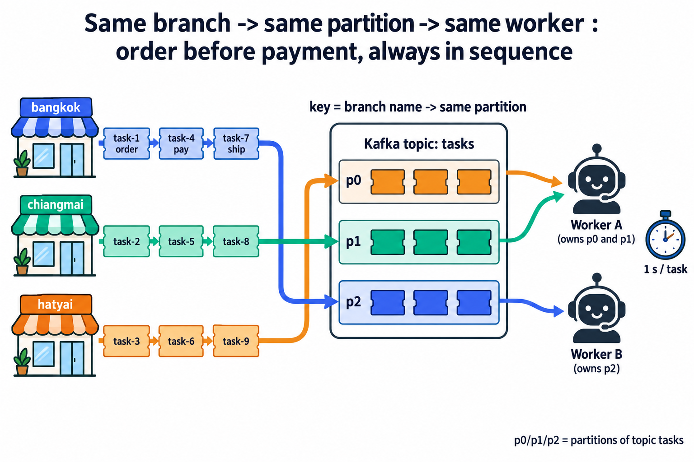
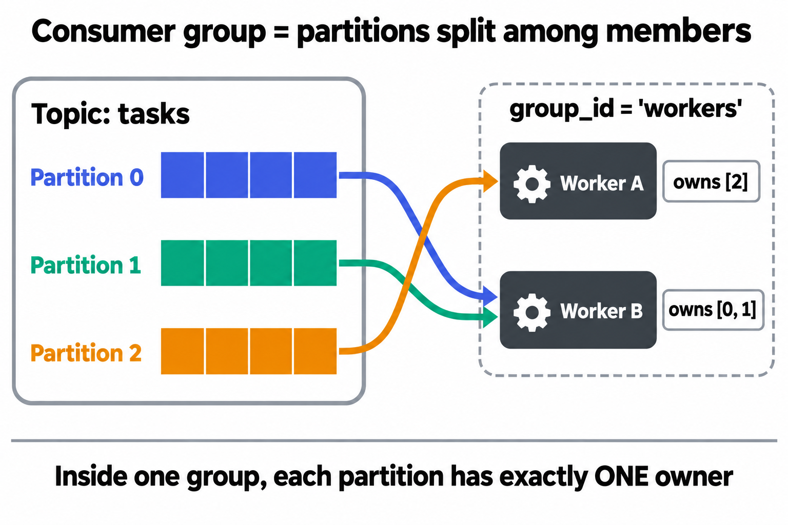
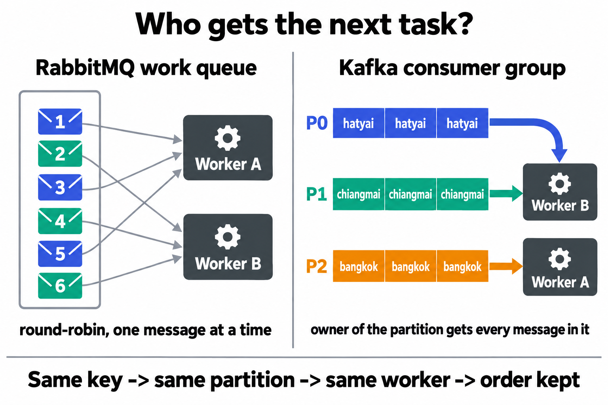
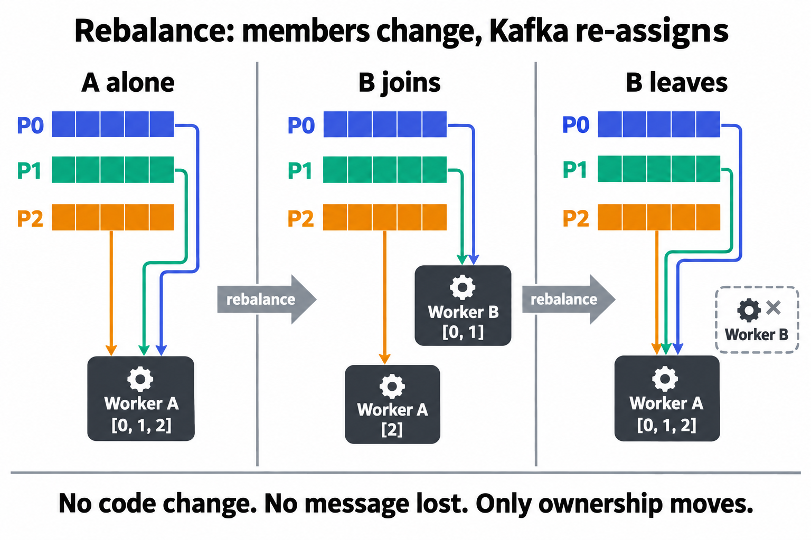
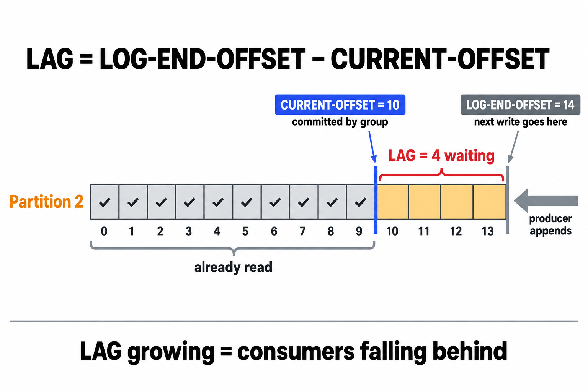
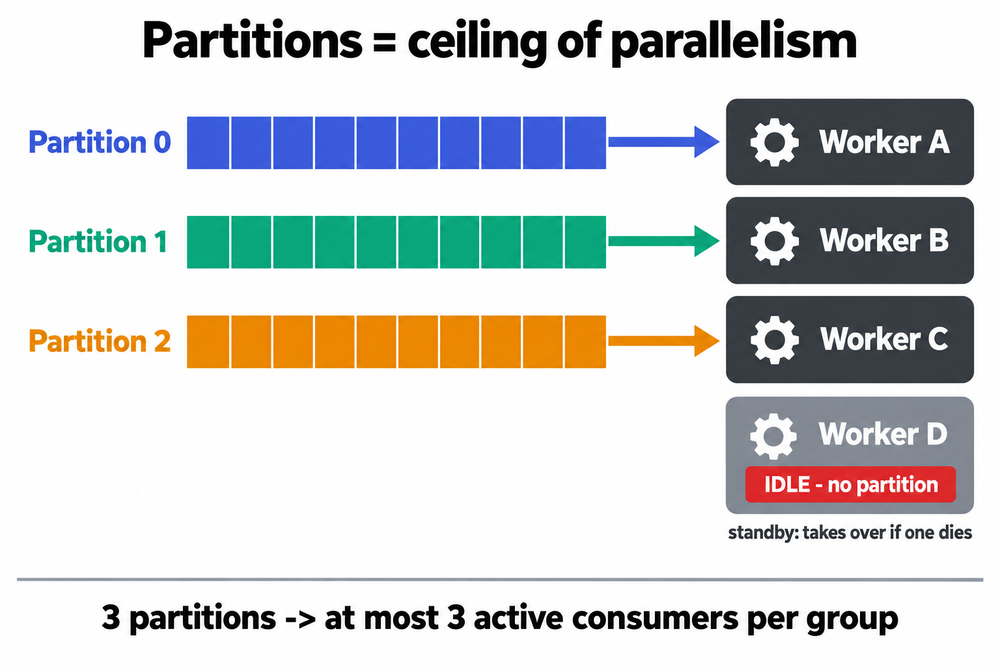
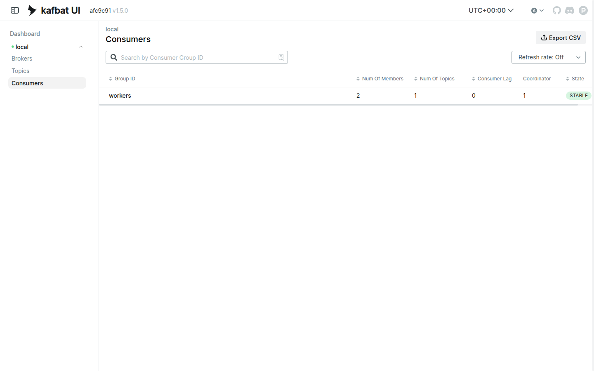
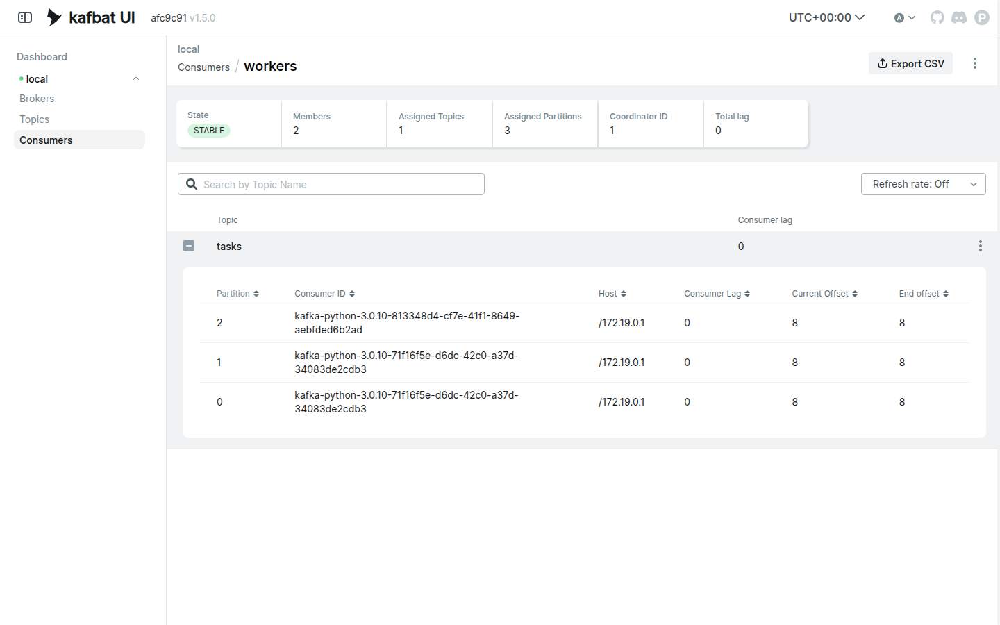
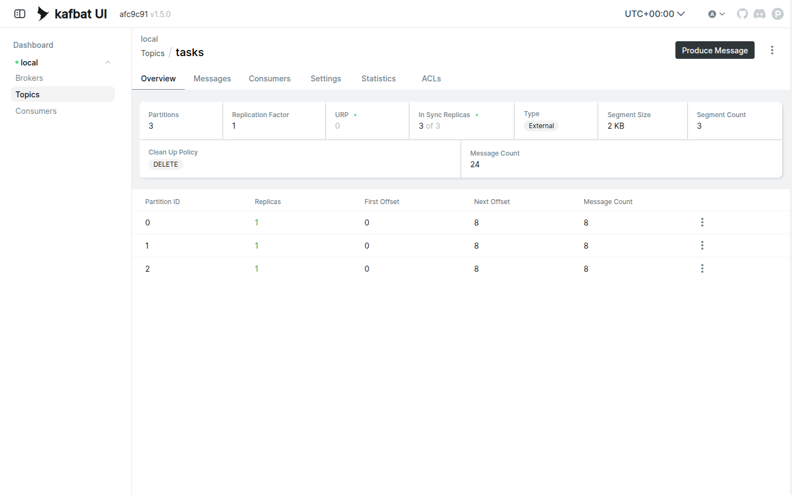
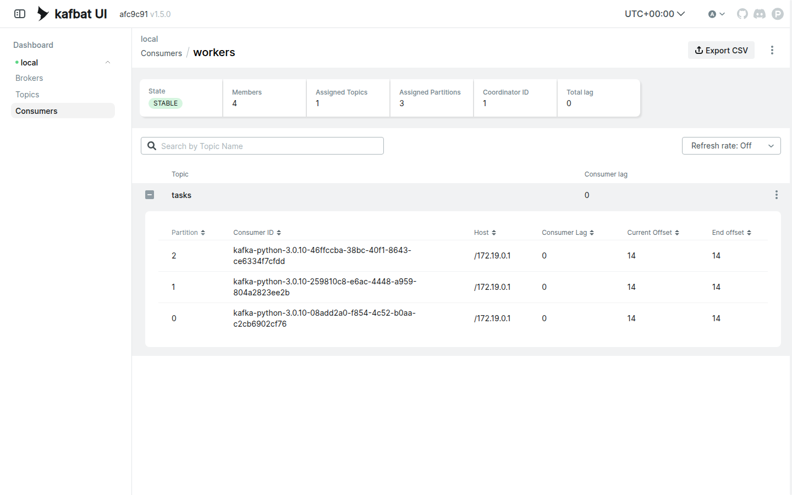

# LAB 3 — Consumer Groups : แบ่งงานกันในทีม · Rebalance · LAG

> โฟลเดอร์ `003_LAB_Consumer_Groups` = **LAB 3** ในสไลด์ `Kafka_Slides.html` (ต่อจาก LAB 2 ที่รู้แล้วว่า key เดิม → partition เดิมเสมอ)
> ไฟล์ในโฟลเดอร์นี้ : `docker-compose.yml` · `new_task.py` · `worker.py` · `requirements.txt`

## สิ่งที่จะได้เรียนรู้

- **Consumer group** : consumer หลายตัวที่ใช้ `group_id` เดียวกัน = **ทีมเดียวกัน** — Kafka แบ่ง partition ให้ช่วยกันอ่าน **เล่มละหนึ่งเจ้าของ** และจดตำแหน่งอ่านของทีมไว้ที่ broker
- **Rebalance** : สมาชิกเข้า/ออกเมื่อไหร่ Kafka **แจก partition ใหม่ทันที** — scale แนวนอนด้วยการเปิด worker เพิ่ม โดยไม่แก้โค้ดสักบรรทัด
- Kafka แบ่งงานแบบ **"เป็นเจ้าของ partition"** ไม่ใช่ round-robin ทีละข้อความแบบ RabbitMQ → **key เดิม → partition เดิม → worker เดิม** ลำดับงานต่อสาขาจึงไม่มีวันสลับ
- อ่านตาราง **`kafka-consumer-groups.sh --describe`** ให้เป็น : `CURRENT-OFFSET` · `LOG-END-OFFSET` · **`LAG` = งานค้างที่มองเห็นเป็นตัวเลข** ทั้งใน CLI และ Kafka UI
- **partitions = เพดานของ parallelism** : worker เกินจำนวน partition → ตัวที่เกิน **ว่างงาน** (แต่เป็นตัวสำรอง)
- ปิด consumer ให้ถูกวิธี (`consumer.close()`) แล้ว rebalance เกิดทันที — ต่างจากตายกลางทางที่ทีมต้องรอ **session timeout 45 วินาที**

## ลำดับการทำแล็บ

เตรียมเครื่องเรียน (เปิด port `8413`) → `docker compose up -d` → สร้าง topic `tasks` **3 partitions** + venv → อ่านโค้ด → **เจาะทฤษฎี** → Worker A คนเดียว → เปิด Worker B ดู **rebalance** → ส่องทีมด้วย CLI + Kafka UI → ปิด B ดู rebalance ขากลับ → **ทดลองเพิ่มเติม 3 ข้อ** (LAG · worker เกิน partition · ตายไม่บอกลา)

> 🖥️ **แล็บนี้ใช้ terminal หน้าต่างเดียว** — worker ทุกตัวรันเป็น **background job** (`python worker.py A &`) ในหน้าต่างเดิม prompt กลับมาทันที ไม่ต้องเปิด ssh หลาย session ส่วน output ของ worker จะ **พิมพ์แทรกเข้ามาในหน้าต่างเดียวกัน** ให้เห็นทุกตัวพร้อมกัน (ดูวิธีอ่านในข้อ 3)

---

## 1. เตรียมเครื่องเรียน + โค้ดแล็บ

เปิด container ที่ติดตั้ง Docker มาให้แล้ว (บนเครื่องของเราเอง ไม่ใช้ cloud) — **แล็บนี้เปิด port `8413` เพิ่ม** ให้หน้าเว็บ Kafka UI ทะลุออกมาถึงเบราว์เซอร์ของเราได้เลย :

```bash
docker rm -f devtools
docker run -dit --name devtools --privileged -p 2222:22 -p 8413:8413 tuchsanai/devtools:2569_1
ssh root@localhost -p 2222        # password : passwd
```

> 📝 **คำอธิบาย:** `docker rm -f devtools` ลบเครื่องเรียนตัวเดิมกันชื่อซ้ำ · `--privileged` จำเป็นเพราะ Kafka ของแล็บนี้เป็น container ที่รัน **ซ้อนอยู่ข้างในเครื่องเรียน** อีกที · `-p 2222:22` คือ SSH · **`-p 8413:8413`** เปิดทางให้เบราว์เซอร์บนเครื่องเราเห็น Kafka UI โดยไม่ต้อง forward port ทีหลัง — เลข `8413` ต้องตรงกับฝั่งซ้ายของ `ports:` ใน `docker-compose.yml` (ข้อ 2) · เลี่ยง `8080` / `80` / `8888` เพราะเป็น port ยอดนิยมที่ชนกับโปรแกรมอื่นง่าย · LAB 1 ใช้ `8411` · LAB 2 ใช้ `8412` · แล็บนี้ `8413` — เลขต่างกันจะได้รู้ว่ากำลังดู UI ของแล็บไหน

ใน VS Code ใช้ **Remote-SSH** ต่อไปที่ `root@localhost:2222` · **คำสั่งที่เหลือทั้งหมดพิมพ์ข้างในเครื่องเรียน** :

```bash
docker compose version
mkdir -p ~/labwork && cd ~/labwork
git clone https://github.com/Tuchsanai/DevTools.git
cd DevTools/03_Application_Docker/02_Message_Brokers/02_Kafka/003_LAB_Consumer_Groups
ls
```

> 📝 **คำอธิบาย:** `docker compose version` ยืนยันว่า Docker ข้างในตื่นแล้ว (ถ้าขึ้น `Cannot connect to the Docker daemon` รอสักครู่แล้วลองใหม่) · เคย clone จากแล็บก่อนแล้วข้าม `git clone` ได้

✅ **Expected output** — เห็นเลขเวอร์ชัน แล้ว `ls` เห็นไฟล์ครบ:

```
Docker Compose version v5.3.1
docker-compose.yml  images  new_task.py  readme.md  requirements.txt  worker.py
```

---

## 2. เปิด Kafka broker + Kafka UI ด้วย `docker compose`

ไฟล์ `docker-compose.yml` ของแล็บนี้เกือบเหมือน LAB 1–2 ทุกบรรทัด — ต่างกันแค่ **port ของ UI** และมีตัวแปรหนึ่งตัวที่เกี่ยวกับแล็บนี้โดยตรง :

```yaml
name: kafka-lab3

services:
  kafka:
    image: apache/kafka:4.1.0
    container_name: kafka
    ports:
      - "9092:9092"          # ประตูของโปรแกรม : worker.py / new_task.py ต่อที่ localhost:9092
    environment:
      KAFKA_NODE_ID: 1
      KAFKA_PROCESS_ROLES: broker,controller
      KAFKA_CONTROLLER_LISTENER_NAMES: CONTROLLER
      KAFKA_CONTROLLER_QUORUM_VOTERS: 1@kafka:9093
      KAFKA_LISTENERS: HOST://0.0.0.0:9092,DOCKER://0.0.0.0:19092,CONTROLLER://0.0.0.0:9093
      KAFKA_ADVERTISED_LISTENERS: HOST://localhost:9092,DOCKER://kafka:19092
      KAFKA_LISTENER_SECURITY_PROTOCOL_MAP: HOST:PLAINTEXT,DOCKER:PLAINTEXT,CONTROLLER:PLAINTEXT
      KAFKA_INTER_BROKER_LISTENER_NAME: DOCKER
      KAFKA_OFFSETS_TOPIC_REPLICATION_FACTOR: 1
      KAFKA_TRANSACTION_STATE_LOG_REPLICATION_FACTOR: 1
      KAFKA_TRANSACTION_STATE_LOG_MIN_ISR: 1
      # --- แล็บ consumer group : ไม่ต้องหน่วงเวลาก่อน rebalance รอบแรก ---
      KAFKA_GROUP_INITIAL_REBALANCE_DELAY_MS: 0
    healthcheck:
      test: ["CMD-SHELL", "/opt/kafka/bin/kafka-broker-api-versions.sh --bootstrap-server localhost:9092 >/dev/null 2>&1"]
      interval: 5s
      timeout: 10s
      retries: 20

  kafka-ui:
    image: kafbat/kafka-ui:latest
    container_name: kafka-ui
    ports:
      - "8413:8080"          # หน้าเว็บ : เครื่องเรา 8413 -> ในกล่อง UI 8080 (เลี่ยง 8080/80/8888)
    environment:
      KAFKA_CLUSTERS_0_NAME: local
      KAFKA_CLUSTERS_0_BOOTSTRAPSERVERS: kafka:19092
      DYNAMIC_CONFIG_ENABLED: "true"
    depends_on:
      kafka:
        condition: service_healthy   # รอจน broker ตอบได้จริง ค่อยเปิด UI
```

> 📝 **คำอธิบาย — 3 จุดที่ต้องดู :**
> **(1) `"8413:8080"`** — UI ฟังที่ `8080` ข้างในกล่องเสมอ เรา map ออกมาเป็น `8413` ให้ตรงกับ `-p 8413:8413` ของเครื่องเรียน (ข้อ 1) เส้นทางคือ เบราว์เซอร์ `localhost:8413` → กล่อง `devtools` → compose → UI ·
> **(2) `KAFKA_GROUP_INITIAL_REBALANCE_DELAY_MS: 0`** — ปกติ broker จะ **หน่วง 3 วินาที** ก่อนแจก partition ให้ทีมที่เพิ่งเกิด เพื่อรอสมาชิกคนอื่นมาพร้อมกัน (ลด rebalance ซ้ำซ้อนใน production) · ห้องเรียนอยากเห็นผลทันทีจึงตั้งเป็น 0 — นี่คือตัวแปรที่เกี่ยวกับ **consumer group** โดยตรง ·
> **(3) ที่เหลือเหมือน LAB 1–2** : KRaft ไม่มี ZooKeeper · listener สองบาน (`localhost:9092` ให้ Python · `kafka:19092` ให้ UI) · `healthcheck` + `depends_on: service_healthy` กั้น UI ไว้จน broker พร้อมจริง

เปิดทั้งชุดแล้วเช็กสถานะ :

```bash
docker compose up -d
docker compose ps
```

✅ **Expected output** — `kafka` ต้องขึ้น **`Healthy`** ก่อน `kafka-ui` จึง `Started` · ใน `ps` ต้องเห็น `Up (healthy)` และ mapping `8413->8080` (ครั้งแรกมี log pull image นำหน้า · เวลาของแต่ละคนจะไม่ตรงกับเอกสารนี้):

```
[+] up 3/3
 ✔ Network kafka-lab3_default  Created           0.0s
 ✔ Container kafka             Healthy           6.9s
 ✔ Container kafka-ui          Started           7.0s
NAME       IMAGE                    COMMAND                  SERVICE    CREATED         STATUS                   PORTS
kafka      apache/kafka:4.1.0       "/__cacert_entrypoin…"   kafka      8 seconds ago   Up 6 seconds (healthy)   0.0.0.0:9092->9092/tcp, [::]:9092->9092/tcp
kafka-ui   kafbat/kafka-ui:latest   "/bin/sh -c 'java --…"   kafka-ui   7 seconds ago   Up 1 second              0.0.0.0:8413->8080/tcp, [::]:8413->8080/tcp
```

เปิดเบราว์เซอร์บนเครื่องเราไปที่ **`http://localhost:8413`** — ต้องเห็น Dashboard cluster `local` Online (UI ใช้เวลาอุ่นเครื่องราว 10 วินาที ถ้ายังไม่ขึ้นรีเฟรชอีกครั้ง) · เมนู **Consumers** ตอนนี้ **ว่างเปล่า** — จำภาพนี้ไว้ เดี๋ยวมันจะมีชีวิต

---

## 3. สร้าง topic `tasks` 3 partitions + เตรียม Python

```bash
docker compose exec kafka /opt/kafka/bin/kafka-topics.sh --bootstrap-server localhost:9092 \
  --create --topic tasks --partitions 3 --replication-factor 1
docker compose exec kafka /opt/kafka/bin/kafka-topics.sh --bootstrap-server localhost:9092 \
  --describe --topic tasks
```

> 📝 **คำอธิบาย:** หัวใจของแล็บเริ่มตรงนี้ — **จำนวน partition = จำนวนมือที่ทีมช่วยกันอ่านได้สูงสุด** เราจงใจสร้าง 3 เล่มไว้ก่อน · **ต้องสร้างเองก่อนรันโค้ด** ถ้าเผลอให้ broker auto-create จะได้ 1 partition แล้วทั้งแล็บจะเหลือ worker ที่ทำงานได้แค่ตัวเดียว · CLI อยู่ข้างใน container จึงสั่งผ่าน `docker compose exec kafka ...` (ใช้ `docker exec kafka ...` ก็ได้ เพราะตั้ง `container_name: kafka`)

✅ **Expected output** — `PartitionCount: 3` ครบ 3 แถว (TopicId ของแต่ละคนจะไม่ตรงกับเอกสารนี้):

```
Created topic tasks.
Topic: tasks	TopicId: 0NQ5ihPDQPeSxImVe6CD0A	PartitionCount: 3	ReplicationFactor: 1	Configs: min.insync.replicas=1
	Topic: tasks	Partition: 0	Leader: 1	Replicas: 1	Isr: 1	Elr: 	LastKnownElr:
	Topic: tasks	Partition: 1	Leader: 1	Replicas: 1	Isr: 1	Elr: 	LastKnownElr:
	Topic: tasks	Partition: 2	Leader: 1	Replicas: 1	Isr: 1	Elr: 	LastKnownElr:
```

เตรียม venv (ถ้ามี `~/venv-kafka` จากแล็บก่อนแล้ว ข้ามบรรทัดแรกได้) :

```bash
python3 -m venv ~/venv-kafka
source ~/venv-kafka/bin/activate
pip install -r requirements.txt
```

✅ **Expected output** — จบด้วย `Successfully installed kafka-python-3.0.10` (หรือ `Requirement already satisfied`)

> **⚠️ กติกาสำคัญของแล็บนี้ — ทำทั้งหมดใน terminal หน้าต่างเดียว :**
> - **เปิด worker ด้วย `&` ต่อท้ายเสมอ** เช่น `python worker.py A &` → bash พิมพ์ `[1] 5602` (เลข job + PID) แล้ว **คืน prompt ทันที** worker ทำงานต่อเบื้องหลัง ถ้าลืม `&` หน้าต่างจะค้างรอ (กด Ctrl+C ออกแล้วสั่งใหม่พร้อม `&`)
> - **output ของ worker ทุกตัวพิมพ์แทรกเข้ามาในหน้าต่างนี้** ปนกับ prompt — บางบรรทัดจะโผล่ต่อท้าย `(venv-kafka) $` หรือขึ้นหลังจากที่เราพิมพ์คำสั่งถัดไปแล้ว **เป็นเรื่องปกติ** ดูที่คำว่า `Worker A` / `Worker B` ในบรรทัดเป็นหลักว่าใครพิมพ์ · prompt ดูรก ๆ กด **Enter เปล่า ๆ** ให้ขึ้น prompt ใหม่ได้
> - **ปิด worker ด้วย `kill $(pgrep -f "worker.py B")`** (ส่ง SIGTERM) แทนการกด Ctrl+C ในหน้าต่างอื่น — `worker.py` ของแล็บนี้รับสัญญาณแล้วเรียก `consumer.close()` ให้เหมือน Ctrl+C ทุกประการ (ดูข้อ 4) · เช็กว่ามี worker ตัวไหนรันอยู่ด้วย `jobs`
> - activate venv (`source ~/venv-kafka/bin/activate`) แค่ **ครั้งเดียว** ในหน้าต่างนี้ — ถ้าเจอ `ModuleNotFoundError: No module named 'kafka'` แปลว่ายังไม่ได้ activate

---

## 4. รู้จักโค้ดของแล็บนี้

โจทย์สมมุติ : ระบบร้านสาขา — งานแต่ละชิ้นมาจากสาขา `bangkok` / `chiangmai` / `hatyai` และ **งานของสาขาเดียวกันต้องทำเรียงลำดับ** (สั่งของก่อนจ่ายเงิน!) worker แต่ละตัวใช้เวลา 1 วินาทีต่องาน



> **อ่านภาพ :** ร้านแต่ละสาขาส่งงานเป็นชุด (สั่งของ → จ่ายเงิน → ส่งของ) โดยใช้ **ชื่อสาขาเป็น key** · `bangkok→p2 · chiangmai→p1 · hatyai→p0` งานของสาขาเดียวกันจึงต่อคิวอยู่เล่มเดียวกันเสมอ · ฝั่ง worker แต่ละตัว **เป็นเจ้าของเล่ม** (ในภาพ A ถือ p0+p1 · B ถือ p2 — ตรงกับที่จะเห็นจริงในข้อ 7) และใช้เวลา 1 วินาทีต่องาน → ลำดับ `task-1 → task-4 → task-7` ของ bangkok ไม่มีทางสลับ เพราะอยู่ในมือคนเดียว

### `new_task.py` — ตัวส่งงาน

```python
import sys
from kafka import KafkaProducer

# 1) ต่อ broker
producer = KafkaProducer(bootstrap_servers='localhost:9092')

# 2) จำนวนงานที่จะส่ง — ใส่เป็น argument ได้ เช่น `python new_task.py 12` (ไม่ใส่ = 12)
count = int(sys.argv[1]) if len(sys.argv) > 1 else 12

# 3) ส่งงานเข้า topic 'tasks' โดยใช้ key = ชื่อสาขา (วนครบ 3 สาขา)
#    key เดิม → partition เดิมเสมอ (บทเรียนจาก LAB 2) — งานจึงกระจายครบทุก partition
branches = ['bangkok', 'chiangmai', 'hatyai']
for i in range(1, count + 1):
    branch = branches[(i - 1) % 3]
    message = f'task-{i} ({branch})'
    metadata = producer.send('tasks',
                             key=branch.encode(),
                             value=message.encode()).get(timeout=10)
    print(f" [x] Sent '{message}' -> partition={metadata.partition}")

producer.close()
```

> 📝 **คำอธิบาย:** โค้ดฝั่งส่งเหมือน `producer_with_key.py` ของ LAB 2 แทบทุกบรรทัด — จุดสำคัญคือ **(3)** `key=branch.encode()` : จาก `hash_key.py` เรารู้แล้วว่า `bangkok→p2 · chiangmai→p1 · hatyai→p0` งานของสาขาเดียวกันจึงเรียงอยู่เล่มเดียวกันเสมอ · สังเกตว่าฝั่งส่ง **ไม่รู้จัก worker เลย** มันแค่เขียนต่อท้าย log

### `worker.py` — ตัวทำงาน (consumer ในทีม `workers`)

```python
import signal
import sys
import time
from kafka import KafkaConsumer

def main():
    # ตั้งชื่อ worker ผ่าน argument เช่น `python worker.py A` (ไว้ดูว่าใครได้งานไหน)
    name = sys.argv[1] if len(sys.argv) > 1 else 'worker'

    # 0) แล็บนี้รัน worker เป็น background job (`python worker.py A &`) ในหน้าต่างเดียว
    #    จึงปิดด้วย `kill <pid>` (SIGTERM) แทน Ctrl+C — แปลงสัญญาณทั้งสองให้เป็น KeyboardInterrupt
    #    เพื่อให้ไปเข้า except/finally ด้านล่างเหมือนกัน (ส่วน `kill -9` จะไม่ผ่านตรงนี้เลย)
    def graceful_exit(signum, frame):
        raise KeyboardInterrupt
    signal.signal(signal.SIGTERM, graceful_exit)
    signal.signal(signal.SIGINT, graceful_exit)

    # 1) จุดเปลี่ยนสำคัญของแล็บนี้ : ใส่ group_id='workers'
    #    ทุก worker ที่ใช้ group_id เดียวกัน = ทีมเดียวกัน → Kafka "แบ่ง partition" ให้ช่วยกันอ่าน
    #    และจดไว้ด้วยว่าทีมนี้อ่านถึง offset ไหนแล้ว (รันใหม่จะไม่อ่านซ้ำ)
    consumer = KafkaConsumer('tasks',
                             bootstrap_servers='localhost:9092',
                             group_id='workers',
                             auto_offset_reset='earliest')

    print(f' [*] Worker {name} waiting for tasks. To exit: kill <pid>', flush=True)

    assignment = None
    try:
        while True:
            # 2) poll ดึงงานชุดถัดไป (รอไม่เกิน 1 วินาทีต่อรอบ)
            batch = consumer.poll(timeout_ms=1000)

            # 3) เช็กว่าโดน "แบ่ง partition" ใหม่หรือยัง — พิมพ์ทุกครั้งที่มีการเปลี่ยน (rebalance)
            #    (ข้ามเฉพาะตอนเริ่มโปรแกรมที่ยังไม่ได้เล่มเลย · ถ้าเคยถือแล้วถูกริบจนเหลือ [] ก็พิมพ์ = ว่างงาน)
            current = sorted(tp.partition for tp in consumer.assignment())
            if current != assignment and (current or assignment):
                print(f' [*] Worker {name} ได้รับมอบหมาย partitions: {current}', flush=True)
                assignment = current

            # 4) ทำงานทีละข้อความ — sleep 1 วินาที = แกล้งทำเป็นงานที่ใช้เวลา
            for tp, messages in batch.items():
                for message in messages:
                    print(f' [x] Worker {name} got p{message.partition} '
                          f'offset={message.offset} {message.value.decode()}', flush=True)
                    time.sleep(1)
    except KeyboardInterrupt:
        print(f' [*] Worker {name} leaving the group...', flush=True)
    finally:
        # 5) ปิดให้เรียบร้อย : commit offset ล่าสุด + บอกลา broker (LeaveGroup)
        #    ทีมที่เหลือจะได้ rebalance ทันที ไม่ต้องรอ session timeout (45 วินาที)
        consumer.close()

if __name__ == '__main__':
    main()
```

> 📝 **คำอธิบาย:** **(0)** ของใหม่สำหรับแล็บหน้าต่างเดียว — worker รันเป็น background job เราจึงส่งสัญญาณไปปิดด้วย `kill <pid>` (SIGTERM) แทนกด Ctrl+C (SIGINT) · `signal.signal(...)` จับทั้งสองสัญญาณแล้ว **โยน `KeyboardInterrupt`** ให้ไหลเข้า `except` / `finally` ด้านล่างเหมือนกันเป๊ะ — นี่คือ "signal handler" ที่โค้ด consumer ของจริงต้องมี · ส่วน `kill -9` (SIGKILL) ระบบปฏิบัติการฆ่าทันที Python ไม่มีโอกาสรันอะไรเลย (ทดลอง ค.) · `flush=True` บังคับพิมพ์ทันทีไม่ค้างใน buffer เพราะ output ของ background job ต้องแทรกเข้าหน้าต่างเราแบบเรียลไทม์ ·
> **(1)** พระเอกของแล็บ — `group_id='workers'` : LAB 1–2 consumer ไม่มี group ต่างคนต่างอ่านทั้ง topic แต่พอใส่ `group_id` เดียวกัน ทุกตัวกลายเป็น **ทีมเดียวกัน** Kafka จะ (ก) **แบ่ง partition** ให้คนละเล่มไม่ซ้ำกัน และ (ข) **จด offset ของทีม** ไว้ที่ broker — ปิดแล้วเปิดใหม่อ่านต่อจากที่ค้าง · `auto_offset_reset='earliest'` มีผลเฉพาะครั้งแรกสุดที่ทีมยังไม่เคยจด offset ·
> **(2)** `poll()` ดึงงานเป็น batch — ฝั่ง consumer ของ Kafka **ดึงเอง** ไม่ใช่ broker ยัด callback มาให้แบบ pika · **(3)** `consumer.assignment()` ถามว่าตอนนี้ฉันถือเล่มไหน — พิมพ์ทุกครั้งที่เปลี่ยน เพื่อ **เห็น rebalance ด้วยตาเปล่า** (รวมถึงตอนถูกริบจนเหลือ `[]` = ว่างงาน ในทดลอง ข. — ข้ามแค่ตอนเริ่มโปรแกรมที่ยังไม่ทันได้เล่ม) · **(4)** ไม่มี ack ให้เขียนเอง — ทีม commit offset ให้อัตโนมัติทุก 5 วินาที และข้อความ **ไม่ถูกลบจาก log** ·
> **(5)** `consumer.close()` ใน `finally` — บอกลา broker อย่างสุภาพ (`LeaveGroup`) ทีมที่เหลือจึง rebalance **ทันที** ไม่ว่าจะออกด้วย Ctrl+C หรือ `kill` · ถ้าโปรแกรมตายโดยไม่ได้ close broker จะรอจนขาด heartbeat ครบ **45 วินาที** (`session_timeout_ms` ของ kafka-python 3.0.10) ค่อยรู้ว่าหายไป — ทดลองเพิ่มเติม ค. จะโชว์ความต่างนี้

---

## 5. เจาะทฤษฎี : Consumer Group ทำงานยังไงกันแน่

อ่านข้อนี้ให้จบก่อนลงมือ แล้วทุก output ในข้อ 6–9 จะ "อ่านออก" ทันที

### 5.1 ทีมเดียวกัน = แบ่ง partition กันเป็นเจ้าของ



- **group** คือชื่อทีม (`group_id`) — consumer ทุกตัวที่ใช้ชื่อเดียวกันเป็นสมาชิกทีมเดียวกัน
- broker ที่เป็น **group coordinator** จะแบ่ง partition ของ topic ให้สมาชิก โดยกฎเดียวคือ **ภายในทีม หนึ่ง partition มีเจ้าของได้แค่หนึ่งคน** (คนหนึ่งถือหลายเล่มได้ แต่เล่มหนึ่งห้ามมีสองคน)
- ทีมจด **offset ที่อ่านถึง** ของแต่ละเล่มไว้ที่ broker (ใน topic ภายในชื่อ `__consumer_offsets`) — เจ้าของเล่มเปลี่ยนคน คนใหม่ก็อ่านต่อจากตำแหน่งเดิมได้
- ในภาพ A ถือ `[2]` B ถือ `[0, 1]` — **ใครได้ชุดไหนสลับกันได้** ของจริงในเอกสารนี้ A ได้ `[0, 1]` B ได้ `[2]` ถูกทั้งคู่

| | consumer **ไม่มี** group (LAB 1–2) | consumer **มี** group (แล็บนี้) |
|---|---|---|
| อ่านเล่มไหน | ทุกเล่มของ topic | เฉพาะเล่มที่ถูกมอบหมาย |
| เปิดหลายตัว | ทุกตัวได้ข้อความ **ครบทุกใบซ้ำกัน** | ช่วยกันอ่าน **ไม่ซ้ำกัน** |
| จด offset ไว้ที่ broker | ไม่ — รันใหม่อ่านตั้งแต่ต้นทุกครั้ง | จด — รันใหม่อ่านต่อจากที่ค้าง |
| เมนู Consumers ใน UI | ว่าง | โชว์ทีม สมาชิก และ LAG |

### 5.2 ต่างจาก RabbitMQ work queue ตรงไหน



RabbitMQ (LAB 2 ชุดที่แล้ว) แจกงาน **round-robin ทีละข้อความ** — งานที่ 1 ให้ A งานที่ 2 ให้ B สลับไปเรื่อย ๆ ไม่สนว่างานไหนเป็นเรื่องเดียวกัน · Kafka แจก **ทั้งเล่ม** — ใครถือ p2 ก็ได้ทุกข้อความใน p2 · ผลพลอยได้ชิ้นใหญ่คือ **key เดิม → partition เดิม → worker เดิม** งานของ `bangkok` จึงไล่ #1 → #4 → #7 ในมือคนเดียวเสมอ ใน RabbitMQ ถ้าอยากได้แบบนี้ต้องออกแบบคิวแยกต่อสาขาเอง

### 5.3 Rebalance : สมาชิกเปลี่ยน → แจกใหม่



- **มีคนเข้าทีม / ออกจากทีม / ตาย** → coordinator สั่ง **rebalance** : เรียกทุกคนคืนเล่ม แล้วแจกใหม่
- ระหว่าง rebalance **ทั้งทีมหยุดอ่านชั่วคราว** ไม่กี่วินาที — ปกติ ไม่ใช่พัง
- **ไม่มีข้อความหล่นหาย** เพราะข้อความอยู่ใน log ตลอด เปลี่ยนแค่ว่า "ใครถือตำแหน่งอ่านของเล่มไหน"
- broker รู้ว่าสมาชิกยังอยู่จาก **heartbeat** ทุก 3 วินาที · ออกแบบสุภาพ (`close()`) → rebalance ทันที · ตายเงียบ → รอ **45 วินาที** (session timeout) ค่อย rebalance

### 5.4 LAG : งานค้างที่มองเห็นเป็นตัวเลข



| คอลัมน์ใน `--describe` | ความหมาย |
|---|---|
| `CURRENT-OFFSET` | ตำแหน่งที่ทีม **commit** ไว้แล้ว = อ่านถึงไหน |
| `LOG-END-OFFSET` | ปลาย log = ตำแหน่งที่ข้อความใบถัดไปจะได้ (producer เขียนถึงไหน) |
| **`LAG`** | ส่วนต่าง = **จำนวนข้อความที่รออยู่ยังไม่ได้อ่าน** |
| `CONSUMER-ID` | ใครถือเล่มนี้ตอนนี้ (`-` = ไม่มีเจ้าของ) |

**LAG คือมิเตอร์สุขภาพของระบบ** — LAG โตขึ้นเรื่อย ๆ = ผู้อ่านตามผู้เขียนไม่ทัน ต้องเพิ่ม worker (หรือเพิ่ม partition) · LAG นิ่งที่ 0 = ตามทัน · ทีม production ตั้ง alert ที่ตัวเลขนี้กันทั้งนั้น

### 5.5 เพดานของ parallelism



จากกฎ "เล่มละหนึ่งเจ้าของ" — ทีมมี **worker ที่ทำงานได้จริงสูงสุดเท่ากับจำนวน partition** ตัวที่เกินจะได้ 0 เล่ม นั่งเป็น **ตัวสำรอง** รอ rebalance เข้ามาแทนเมื่อมีคนตาย · จึงต้องตั้งจำนวน partition **เผื่อโต** ตั้งแต่วันแรก (เพิ่มทีหลังได้ แต่ mapping ของ key เปลี่ยนยกแผงตามบทเรียน LAB 2 ทดลอง ค.)

---

## 6. Worker A ตัวเดียว — เป็นเจ้าของครบทั้ง 3 partitions

แล็บนี้ใช้ **3 หน้าต่าง terminal** : **หน้าต่างที่ 1** ไว้ส่งงาน + สั่ง `docker compose exec` · **หน้าต่างที่ 2 และ 3** เป็น worker คนละตัว · เปิด **หน้าต่างที่ 2** (ssh เข้าเครื่องเรียนอีก session) สตาร์ต Worker A :

```bash
source ~/venv-kafka/bin/activate
cd ~/labwork/DevTools/03_Application_Docker/02_Message_Brokers/02_Kafka/003_LAB_Consumer_Groups
python worker.py A
```

✅ **Expected output** — ทีมมีคนเดียว จึงได้ครบทุกเล่ม · โปรแกรม **ไม่จบเอง** ค้างรอ = ถูกต้อง ปล่อยไว้:

```
 [*] Worker A waiting for tasks. To exit press CTRL+C
 [*] Worker A ได้รับมอบหมาย partitions: [0, 1, 2]
```

**หน้าต่างที่ 1** ส่งงาน 12 งาน :

```bash
python new_task.py 12
```

✅ **Expected output** — ฝั่งส่ง : `bangkok→2 · chiangmai→1 · hatyai→0` ทุกครั้ง ไม่มีสุ่ม (ทุกคนได้เลขนี้เหมือนกัน เพราะเป็น hash ของ key จาก LAB 2):

```
 [x] Sent 'task-1 (bangkok)' -> partition=2
 [x] Sent 'task-2 (chiangmai)' -> partition=1
 [x] Sent 'task-3 (hatyai)' -> partition=0
        ... (วนสามสาขาแบบเดียวกันจนครบ 12) ...
 [x] Sent 'task-12 (hatyai)' -> partition=0
```

✅ **Expected output** — **หน้าต่างที่ 2** : A เก็บครบ 12 งานคนเดียว (≈ 12 วินาที) · จุดที่ต้องดู : **offset ของแต่ละเล่มไล่ 0 → 3 เป๊ะ** ส่วนลำดับข้ามเล่มสลับกันได้ (ของแต่ละคนอาจไม่เรียงเหมือนเอกสารนี้):

```
 [x] Worker A got p2 offset=0 task-1 (bangkok)
 [x] Worker A got p1 offset=0 task-2 (chiangmai)
 [x] Worker A got p1 offset=1 task-5 (chiangmai)
 [x] Worker A got p1 offset=2 task-8 (chiangmai)
 [x] Worker A got p1 offset=3 task-11 (chiangmai)
 [x] Worker A got p0 offset=0 task-3 (hatyai)
        ... (p0 hatyai offset 1→3 · p2 bangkok offset 1→3) ...
 [x] Worker A got p2 offset=3 task-10 (bangkok)
```

> **อ่านผลให้เป็น :** `poll` ดึงงานมาเป็น **ชุดต่อ partition** จึงเห็น chiangmai (p1) ติดกันสี่งาน แล้วค่อย hatyai (p0) · Kafka **การันตีลำดับเฉพาะภายใน partition** (offset 0→1→2→3 เรียงเป๊ะทุกเล่ม) ส่วนลำดับ **ข้าม** เล่มไม่การันตี — และไม่จำเป็น เพราะงานต่างสาขาไม่เกี่ยวกัน

---

## 7. เปิด Worker B — Rebalance ต่อหน้าต่อตา

เปิด **หน้าต่างที่ 3** สตาร์ต Worker B **โดยไม่ต้องปิด A** (activate venv + `cd` ก่อนเหมือนข้อ 6) :

```bash
python worker.py B
```

✅ **Expected output** — ทีม 2 คนแบ่ง 3 เล่ม : ตัวหนึ่งได้ 2 อีกตัวได้ 1 · **ทั้งสองหน้าต่าง** พิมพ์บรรทัด "ได้รับมอบหมาย" ใหม่พร้อมกัน (ใครได้ชุดไหนสลับกันได้ — ของแต่ละคนอาจไม่ตรงกับเอกสารนี้):

```
──── หน้าต่างที่ 3 (Worker B — สมาชิกใหม่) ────
 [*] Worker B waiting for tasks. To exit press CTRL+C
 [*] Worker B ได้รับมอบหมาย partitions: [2]
──── หน้าต่างที่ 2 (Worker A — พิมพ์เพิ่มเอง ไม่ต้องทำอะไร) ────
 [*] Worker A ได้รับมอบหมาย partitions: [0, 1]
```

> **นี่คือ rebalance :** A เคยถือ `[0, 1, 2]` — พอ B เข้าทีม Kafka **ริบเล่ม 2 ไปให้ B** เหลือ `[0, 1]` ให้ A · เราไม่ได้แตะโค้ดแม้แต่บรรทัดเดียว — อยากได้แรงเพิ่มก็แค่เปิด worker เพิ่ม

**หน้าต่างที่ 1** ส่งอีก 12 งาน แล้วดูการแบ่ง :

```bash
python new_task.py 12
```

✅ **Expected output** — งานวิ่งหา **เจ้าของเล่ม** ไม่ใช่สลับตัวละงาน (offset ต่อจากรอบแรก 4→7 เพราะ log ยาวขึ้น):

```
──── หน้าต่างที่ 3 (Worker B ถือ p2) — ได้เฉพาะ bangkok ────
 [x] Worker B got p2 offset=4 task-1 (bangkok)
 [x] Worker B got p2 offset=5 task-4 (bangkok)
 [x] Worker B got p2 offset=6 task-7 (bangkok)
 [x] Worker B got p2 offset=7 task-10 (bangkok)
──── หน้าต่างที่ 2 (Worker A ถือ p0, p1) — ได้ chiangmai + hatyai ────
 [x] Worker A got p1 offset=4 task-2 (chiangmai)
 [x] Worker A got p0 offset=4 task-3 (hatyai)
 [x] Worker A got p0 offset=5 task-6 (hatyai)
        ... (p0 offset 6→7 · p1 offset 5→7 รวม 8 บรรทัด) ...
 [x] Worker A got p1 offset=7 task-11 (chiangmai)
```

> **เทียบภาพ 5.2 ให้ชัด :** bangkok ทั้ง 4 งาน `#1 → #4 → #7 → #10` เรียงเป๊ะในมือ B คนเดียว · ถ้าเป็น RabbitMQ round-robin task-1 ไป A task-4 ไป B ลำดับของสาขาเดียวกันก็แตกทันที

---

## 8. ส่องทีม — `kafka-consumer-groups.sh` + Kafka UI

ระหว่างทั้งสอง worker ยังรันอยู่ **หน้าต่างที่ 1** ถาม broker :

```bash
docker compose exec kafka /opt/kafka/bin/kafka-consumer-groups.sh --bootstrap-server localhost:9092 \
  --describe --group workers
```

✅ **Expected output** — หนึ่งแถวต่อ partition · LAG `0` ทุกเล่ม (24 งานถูกเก็บหมด) · CONSUMER-ID มี **สองค่า** : `...71f16f5e...` ถือเล่ม 0 กับ 1 (= A) · `...813348d4...` ถือเล่ม 2 (= B) ตรงกับข้อ 7 (ID · ลำดับแถวของแต่ละคนจะไม่ตรงกับเอกสารนี้):

```
GROUP           TOPIC           PARTITION  CURRENT-OFFSET  LOG-END-OFFSET  LAG             CONSUMER-ID                                              HOST            CLIENT-ID
workers         tasks           1          8               8               0               kafka-python-3.0.10-71f16f5e-d6dc-42c0-a37d-34083de2cdb3 /172.19.0.1     kafka-python-3.0.10
workers         tasks           0          8               8               0               kafka-python-3.0.10-71f16f5e-d6dc-42c0-a37d-34083de2cdb3 /172.19.0.1     kafka-python-3.0.10
workers         tasks           2          8               8               0               kafka-python-3.0.10-813348d4-cf7e-41f1-8649-aebfded6b2ad /172.19.0.1     kafka-python-3.0.10
```

> 📝 **คำอธิบาย:** อ่านตามตาราง 5.4 — `CURRENT-OFFSET 8` = ทีม commit ถึง 8 · `LOG-END-OFFSET 8` = log ยาว 8 · ส่วนต่าง **LAG 0** = ไม่มีงานค้าง · `HOST /172.19.0.1` คือ IP ของเครื่องเรียนมองจากใน network ของ compose

เปิดหน้าเว็บ **`http://localhost:8413`** → เมนู **Consumers** ทางซ้าย — จากที่ว่างเปล่าตอนข้อ 2 ตอนนี้มีทีม `workers` โผล่มาแล้ว :



> 📝 **จุดที่ต้องดู:** **Num Of Members 2** = A กับ B · **Consumer Lag 0** · **Coordinator 1** = broker id 1 เป็นคนคุมทีมนี้ · **State STABLE** = rebalance จบแล้ว ทีมนิ่ง (ระหว่าง rebalance จะเห็น `PREPARING_REBALANCE` / `COMPLETING_REBALANCE` แวบหนึ่ง)

คลิก `workers` แล้วกดปุ่ม **`+`** หน้าแถว `tasks` :



> 📝 **จุดที่ต้องดู:** แถบบน **Members 2 · Assigned Partitions 3 · Total lag 0** · ตารางล่าง **ตรงกับ CLI ทุกตัวอักษร** — Partition 2 เป็นของ `...813348d4` (B) · 1 กับ 0 เป็นของ `...71f16f5e` (A) · Current Offset / End offset = `CURRENT-OFFSET` / `LOG-END-OFFSET` ของ CLI ในชื่อใหม่ · ข้อมูลก้อนเดียวกัน คนละมุมมอง

เมนู **Topics** → `tasks` :



> 📝 **จุดที่ต้องดู:** **Message Count 24** = 2 รอบ × 12 งาน — **งานที่ worker อ่านไปหมดแล้วยังอยู่ครบ** ไม่หายไปไหน (RabbitMQ ป่านนี้คิวว่างเปล่า) · ตารางล่าง Next Offset `8` ทุกเล่ม = เล่มละ 8 ข้อความเป๊ะตามที่ key แบ่งไว้ · แท็บ **Consumers** ของหน้านี้ก็พาไปดูทีม `workers` ได้อีกทาง

---

## 9. ปิด Worker B — Rebalance ขากลับ

ไปที่ **หน้าต่างที่ 3** กด **Ctrl+C** แล้วหันมาดู **หน้าต่างที่ 2** ทันที :

✅ **Expected output** — B บอกลาแล้วจบ · A ได้ทุกเล่มคืน **ภายในไม่กี่วินาที**:

```
──── หน้าต่างที่ 3 (Worker B) ────
^C [*] Worker B leaving the group...
──── หน้าต่างที่ 2 (Worker A — พิมพ์เพิ่มเอง) ────
 [*] Worker A ได้รับมอบหมาย partitions: [0, 1, 2]
```

> 📝 **คำอธิบาย:** Ctrl+C → `KeyboardInterrupt` → `finally: consumer.close()` — B ส่ง `LeaveGroup` ให้ coordinator ก่อนตาย coordinator จึงสั่ง rebalance **ทันที** ยกทั้งสามเล่มคืน A · ระบบ **ซ่อมตัวเอง** worker ออกไม่ใช่เหตุการณ์พิเศษ แค่ rebalance รอบหนึ่ง

พิสูจน์ว่า A รับงานแทนทั้งหมด — **หน้าต่างที่ 1** ส่งอีก 6 งาน :

```bash
python new_task.py 6
```

✅ **Expected output** — **หน้าต่างที่ 2** เก็บครบ 6 งานคนเดียวจากทุกเล่ม (offset 8–9 ต่อจากเดิม):

```
 [x] Worker A got p1 offset=8 task-2 (chiangmai)
 [x] Worker A got p0 offset=8 task-3 (hatyai)
 [x] Worker A got p0 offset=9 task-6 (hatyai)
 [x] Worker A got p1 offset=9 task-5 (chiangmai)
 [x] Worker A got p2 offset=8 task-1 (bangkok)
 [x] Worker A got p2 offset=9 task-4 (bangkok)
```

> **ครบวงจรแล้ว :** สมาชิกเข้า → แจกใหม่ · สมาชิกออก → คืนเล่มให้คนที่เหลือ · อัตโนมัติทั้งหมด และ **ไม่มีข้อความหล่นหาย** — ตอนนี้ topic มี **30 ข้อความ** (12 + 12 + 6)

---

## ทดลองเพิ่มเติม

### ก. LAG มองเห็นได้ — งานค้างเป็นตัวเลข

ปิด Worker A (**หน้าต่างที่ 2** กด Ctrl+C) — ตอนนี้ **ทีมไม่มีสมาชิกเลย** · **หน้าต่างที่ 1** ส่ง 12 งานทิ้งไว้แล้วถามสถานะทีม :

```bash
python new_task.py 12
docker compose exec kafka /opt/kafka/bin/kafka-consumer-groups.sh --bootstrap-server localhost:9092 \
  --describe --group workers
```

✅ **Expected output** — ทีมร้าง (`no active members` · CONSUMER-ID เป็น `-`) แต่ broker ยังจำ offset ของทีมไว้ : `CURRENT-OFFSET` หยุดที่ 10 ส่วน `LOG-END-OFFSET` ขยับไป 14 → **LAG เล่มละ 4 รวม 12** พอดีกับที่เพิ่งส่ง:

```
Consumer group 'workers' has no active members.

GROUP           TOPIC           PARTITION  CURRENT-OFFSET  LOG-END-OFFSET  LAG             CONSUMER-ID     HOST            CLIENT-ID
workers         tasks           2          10              14              4               -               -               -
workers         tasks           1          10              14              4               -               -               -
workers         tasks           0          10              14              4               -               -               -
```

เปิด Worker A กลับมา (**หน้าต่างที่ 2** : `python worker.py A`) :

✅ **Expected output** — งานค้างทั้ง 12 ไหลมาทันที และ **เริ่มจาก offset 10 ที่ทีมจดไว้** — งาน 30 ชิ้นก่อนหน้าไม่ถูกอ่านซ้ำ:

```
 [*] Worker A waiting for tasks. To exit press CTRL+C
 [*] Worker A ได้รับมอบหมาย partitions: [0, 1, 2]
 [x] Worker A got p1 offset=10 task-2 (chiangmai)
 [x] Worker A got p1 offset=11 task-5 (chiangmai)
        ... (รวม 12 บรรทัด — ทุกเล่ม offset วิ่ง 10→13) ...
 [x] Worker A got p2 offset=13 task-10 (bangkok)
```

รอ ~12 วินาที แล้ว **หน้าต่างที่ 1** รัน `--describe` ซ้ำ :

✅ **Expected output** — LAG ไหลลง `0` ทุกเล่ม และ CONSUMER-ID กลับมามีเจ้าของ (คนเดียวถือทั้งสามเล่ม):

```
GROUP           TOPIC           PARTITION  CURRENT-OFFSET  LOG-END-OFFSET  LAG             CONSUMER-ID                                              HOST            CLIENT-ID
workers         tasks           2          14              14              0               kafka-python-3.0.10-08add2a0-f854-4c52-b0aa-c2cb6902cf76 /172.19.0.1     kafka-python-3.0.10
workers         tasks           1          14              14              0               kafka-python-3.0.10-08add2a0-f854-4c52-b0aa-c2cb6902cf76 /172.19.0.1     kafka-python-3.0.10
workers         tasks           0          14              14              0               kafka-python-3.0.10-08add2a0-f854-4c52-b0aa-c2cb6902cf76 /172.19.0.1     kafka-python-3.0.10
```

> **บทเรียน :** ตัวเลขนี้แหละที่ภาพ 5.4 วาดไว้ — และดูได้จากคอลัมน์ **Consumer lag** ในหน้า Consumers ของ Kafka UI เช่นกัน (ลองเปิดดูตอน LAG ยังเป็น 12) · ใน RabbitMQ เราดูงานค้างด้วย `list_queues` ใน Kafka ดูจาก LAG ของทีม

### ข. Worker เกินจำนวน partition — ตัวที่เกินว่างงาน

Worker A ยังรันอยู่จากข้อ ก. — เปิด **หน้าต่างที่ 3, 4, 5** รัน B, C, D (ทุกหน้าต่าง activate venv + `cd` ก่อน) :

```bash
python worker.py B        # หน้าต่างที่ 3
python worker.py C        # หน้าต่างที่ 4
python worker.py D        # หน้าต่างที่ 5
```

✅ **Expected output** — ทีม 4 คน แต่มี 3 เล่ม : สามตัวได้คนละเล่ม **ตัวที่สี่เงียบ** ไม่มีบรรทัด "ได้รับมอบหมาย" เลย (โค้ดพิมพ์เฉพาะตอน assignment ไม่ว่าง) · ระหว่างเปิดทีละตัวจะเห็น A/B ถูกริบเล่มทีละรอบ · ใครเป็นตัวว่างงานสุ่มได้ทุกตัว:

```
──── หน้าต่างที่ 2 (Worker A) ────
 [*] Worker A ได้รับมอบหมาย partitions: [0, 1]
 [*] Worker A ได้รับมอบหมาย partitions: [0]
──── หน้าต่างที่ 3 (Worker B) ────
 [*] Worker B ได้รับมอบหมาย partitions: [2]
 [*] Worker B ได้รับมอบหมาย partitions: [1]
──── หน้าต่างที่ 4 (Worker C) ────
 [*] Worker C ได้รับมอบหมาย partitions: [2]
──── หน้าต่างที่ 5 (Worker D — ว่างงาน!) ────
 [*] Worker D waiting for tasks. To exit press CTRL+C
        ^ ไม่มีบรรทัด "ได้รับมอบหมาย" — หลักฐานว่า D ไม่ได้ถือเล่มใดเลย
```

ยืนยันด้วยมุมมอง "หนึ่งแถวต่อสมาชิก" (**หน้าต่างที่ 1**) :

```bash
docker compose exec kafka /opt/kafka/bin/kafka-consumer-groups.sh --bootstrap-server localhost:9092 \
  --describe --group workers --members
```

✅ **Expected output** — 4 แถว คอลัมน์ `#PARTITIONS` เป็น `1, 1, 1` และ **`0`** หนึ่งตัว:

```
GROUP           CONSUMER-ID                                              HOST            CLIENT-ID           #PARTITIONS
workers         kafka-python-3.0.10-08add2a0-f854-4c52-b0aa-c2cb6902cf76 /172.19.0.1     kafka-python-3.0.10 1
workers         kafka-python-3.0.10-62365e07-1df8-4db7-854b-dabe501fcf9a /172.19.0.1     kafka-python-3.0.10 0
workers         kafka-python-3.0.10-46ffccba-38bc-40f1-8643-ce6334f7cfdd /172.19.0.1     kafka-python-3.0.10 1
workers         kafka-python-3.0.10-259810c8-e6ac-4448-a959-804a2823ee2b /172.19.0.1     kafka-python-3.0.10 1
```

ใน Kafka UI หน้า `workers` ก็ฟ้องแบบเดียวกัน — **Members 4** แต่ **Assigned Partitions 3** และตารางมีแค่ 3 แถว :



**แล้วตัวสำรองมีค่าไหม?** — ลองปิด Worker C (**หน้าต่างที่ 4** Ctrl+C) แล้วดูหน้าต่างที่ 5 :

✅ **Expected output** — D ที่นั่งว่างอยู่ **ถูกดึงเข้ามาแทนภายในไม่กี่วินาที**:

```
──── หน้าต่างที่ 4 (Worker C) ────
^C [*] Worker C leaving the group...
──── หน้าต่างที่ 5 (Worker D) ────
 [*] Worker D ได้รับมอบหมาย partitions: [2]
```

> **บทเรียนสำคัญที่สุดของแล็บ :** **partitions = เพดานของ parallelism** — worker เกินจำนวน partition ไม่ช่วยให้เร็วขึ้น แต่เป็น **hot standby** ที่เข้าแทนทันทีเมื่อมีคนตาย · topic ของจริงจึงตั้งจำนวน partition **เผื่อโต** ตั้งแต่แรก

### ค. ตายแบบไม่บอกลา — ทำไมต้องรอ 45 วินาที

ข้อ 9 กับ ข. rebalance เกิดทันทีเพราะ `consumer.close()` ส่ง `LeaveGroup` · คราวนี้ฆ่า worker แบบไม่ให้โอกาสบอกลา — **หน้าต่างที่ 1** :

```bash
kill -9 $(pgrep -f "worker.py B")
date
```

> 📝 **คำอธิบาย:** `kill -9` (SIGKILL) ฆ่า process ทันที Python ไม่มีโอกาสรัน `finally` · เล่มที่ B ถืออยู่จึง **ไม่มีใครอ่าน** จนกว่า broker จะรู้ว่า B หายไป — broker รู้จากการที่ **heartbeat ขาดหายครบ `session_timeout_ms` = 45 วินาที** · `date` จดเวลาไว้เทียบ

✅ **Expected output** — หน้าต่างที่ 3 ดับไปเฉย ๆ (ขึ้น `Killed`) · หน้าต่างของ worker ที่เหลือ **เงียบไปราว 45 วินาที** แล้วค่อยพิมพ์ assignment ใหม่ที่รวมเล่มของ B เข้าไป · ระหว่างนั้นถ้าส่งงานเข้าเล่มของ B งานจะ **ค้างเป็น LAG** จนกว่าจะ rebalance

> **บทเรียน :** นี่คือเหตุผลที่โค้ด consumer ของจริงต้อง **`close()` เสมอ** ตอนปิดโปรแกรม (ใน `finally` หรือ signal handler) · และเป็นเหตุผลที่ production มักปรับ `session_timeout_ms` / `heartbeat_interval_ms` ให้เหมาะกับงาน — สั้นไปทีม rebalance บ่อยเพราะแค่ GC pause ยาวไปงานค้างนานเวลามีคนตายจริง · ดูเสร็จแล้วปิด worker ทุกหน้าต่างด้วย Ctrl+C (เห็น `leaving the group...` ครบทุกตัว)

---

## แก้ปัญหาที่พบบ่อย

| อาการ | สาเหตุ | วิธีแก้ |
|---|---|---|
| `KafkaTimeoutError: Unable to bootstrap` / `NoBrokersAvailable` | broker ยังไม่พร้อม หรือ compose ยังไม่ขึ้น | `docker compose ps` ต้องเห็น `kafka` เป็น `Up (healthy)` · ถ้าไม่มีแถวเลย ย้อนข้อ 2 |
| `ModuleNotFoundError: No module named 'kafka'` | ลืม activate venv ใน terminal นั้น (ทุกหน้าต่างต้องทำเอง) | `source ~/venv-kafka/bin/activate` — ดูให้ prompt มี `(venv-kafka)` |
| worker เปิดอยู่แต่งานไม่มาเลย | ยังไม่ได้ส่งงาน หรือ **ทีมอ่านไปหมดแล้ว** (group จำ offset — รันใหม่ไม่อ่านซ้ำ) | `--describe --group workers` : LAG `0` = ไม่มีของค้าง ส่งใหม่ด้วย `python new_task.py 12` |
| เปิด worker แล้วไม่เห็นบรรทัด "ได้รับมอบหมาย" | rebalance กำลังเจรจา (ไม่กี่วินาที) หรือ worker **เกินจำนวน partition** | รอสักครู่ · `--describe --group workers --members` ดูว่าสมาชิกเกิน 3 หรือยัง |
| ปิด worker แล้วอีกตัวเงียบไปนาน ~45 วินาที | worker ตายโดยไม่ได้ `close()` (kill -9 · ปิดหน้าต่างทิ้ง · โค้ดเวอร์ชันเก่าไม่มี `finally`) → รอ session timeout | ปกติของ Kafka — ปิดด้วย Ctrl+C ให้ `close()` ทำงาน rebalance จะเกิดทันที |
| `--describe --topic tasks` เห็น `PartitionCount: 1` | รัน worker/producer **ก่อน**สร้าง topic → auto-create แบบ 1 partition | ปิด worker ทุกตัว → `kafka-topics.sh ... --delete --topic tasks` → `--create --topic tasks --partitions 3` ใหม่ |
| เปิด `http://localhost:8413` ไม่ขึ้น | ลืม `-p 8413:8413` ตอนสร้างเครื่องเรียน · UI ยังบูตไม่เสร็จ | `docker ps` บนเครื่องเรา ดูว่า `devtools` มี `8413` — ไม่มีต้องสร้างใหม่ตามข้อ 1 · มีแล้วรอ 10 วินาทีแล้วรีเฟรช |
| `Bind for 0.0.0.0:8413 failed: port is already allocated` | มีโปรแกรมอื่นจอง `8413` | เปลี่ยนเลขซ้ายทั้งใน `docker-compose.yml` และ `-p` ของเครื่องเรียนให้ตรงกัน (เช่น `8414`) |
| `docker compose up` ฟ้องชื่อ container ซ้ำ | มี `kafka` / `kafka-ui` ค้างจากแล็บก่อนที่ยังไม่ `down` | `docker rm -f kafka kafka-ui` แล้ว `docker compose up -d` ใหม่ |

---

## เก็บกวาด (Cleanup)

ปิด worker ทุกหน้าต่างด้วย **Ctrl+C** ให้ครบก่อน แล้ว :

```bash
docker compose down -v
docker ps -a
```

> 📝 **คำอธิบาย:** `down` ลบ container + network ของแล็บทั้งชุดในคำสั่งเดียว · `-v` ลบ volume ด้วย — ข้อความใน `tasks` และ offset ของทีม `workers` หายหมด (ตั้งใจ แล็บหน้าเริ่มใหม่) · ที่ **ไม่ต้องลบ** : image ทั้งสองตัว และ venv `~/venv-kafka`

✅ **Expected output** — ลบครบ 3 รายการ แล้วตารางเหลือแค่หัว:

```
[+] down 3/3
 ✔ Container kafka-ui          Removed
 ✔ Container kafka             Removed
 ✔ Network kafka-lab3_default  Removed
CONTAINER ID   IMAGE     COMMAND   CREATED   STATUS    PORTS     NAMES
```

---

## สรุปคำสั่งของแล็บนี้

| คำสั่ง | ความหมาย |
|---|---|
| `docker run ... -p 2222:22 -p 8413:8413 tuchsanai/devtools:2569_1` | เปิดเครื่องเรียนพร้อมเปิดทางให้ Kafka UI (`8413`) ทะลุถึงเบราว์เซอร์ |
| `docker compose up -d` / `ps` / `down -v` | เปิด broker + UI ทั้งชุด · ดูสถานะ (`kafka` ต้อง `healthy`) · ลบทั้งชุด |
| `kafka-topics.sh --create --topic tasks --partitions 3 --replication-factor 1` | สร้าง topic 3 เล่ม = ทีมช่วยกันอ่านได้สูงสุด 3 ตัว |
| `python worker.py <ชื่อ>` | เปิด worker เข้าทีม `workers` — เปิดเพิ่ม/ปิดออกได้ตลอด Kafka rebalance ให้เอง |
| `python new_task.py <จำนวน>` | ส่งงาน key วน 3 สาขา — key เดิมลงเล่มเดิม งานสาขาเดิมไปหา worker เดิม |
| `kafka-consumer-groups.sh --describe --group workers` | หนึ่งแถวต่อ partition : ใครถือเล่มไหน · CURRENT / LOG-END · **LAG** |
| `kafka-consumer-groups.sh --describe --group workers --members` | หนึ่งแถวต่อสมาชิก : นับหัวทีม + `#PARTITIONS` (จับตัวว่างงาน) |
| `kill -9 $(pgrep -f "worker.py B")` | ฆ่า worker แบบไม่บอกลา — ดู session timeout 45 วินาทีทำงาน |

> **จำหลักเดียวให้ขึ้นใจ :** **group เดียวกัน → แบ่ง partition กันเป็นเจ้าของ เล่มละคน** · สมาชิกเปลี่ยน → rebalance อัตโนมัติ ข้อความไม่หาย · **LAG = งานค้าง** · **partitions = เพดานของ parallelism** · และ **`close()` เสมอ** ก่อนปิดโปรแกรม

## ✅ เช็กลิสต์ก่อนจบแล็บ

- [ ] สร้างเครื่องเรียนด้วย `-p 2222:22 -p 8413:8413` · `docker compose up -d` เห็น `kafka Healthy` → `kafka-ui Started` · `ps` เห็น `8413->8080`
- [ ] อธิบายได้ว่า `KAFKA_GROUP_INITIAL_REBALANCE_DELAY_MS: 0` ทำอะไร และทำไมห้องเรียนตั้ง 0
- [ ] สร้าง topic `tasks` แล้ว `--describe` เห็น `PartitionCount: 3` · เมนู Consumers ใน UI ยัง **ว่าง**
- [ ] Worker A คนเดียวได้ `[0, 1, 2]` เก็บ 12 งานครบ · ฝั่งส่ง `bangkok→2 · chiangmai→1 · hatyai→0` คงที่
- [ ] เปิด B แล้ว **ทั้งสองหน้าต่าง** พิมพ์ assignment ใหม่ (rebalance) โดยไม่แตะโค้ด · ส่ง 12 งานแล้วงานแยกตาม **เจ้าของเล่ม** ไม่ใช่สลับตัวละงาน
- [ ] อ่านตาราง `--describe --group workers` เป็น : ชี้ได้ว่า CONSUMER-ID ไหนคือ A/B และ LAG มาจากไหน
- [ ] Kafka UI ที่ `localhost:8413` : Consumers เห็น `workers` Members 2 · หน้า group เห็นเจ้าของรายเล่มตรงกับ CLI · หน้า `tasks` Message Count 24 (อ่านแล้วไม่หาย)
- [ ] Ctrl+C ที่ B เห็น `leaving the group...` และ A ได้ `[0, 1, 2]` คืน **ทันที** · รับ 6 งานถัดไปครบคนเดียว
- [ ] ปิดทีมทั้งหมด ส่ง 12 งาน → `no active members` + LAG เล่มละ 4 → เปิด A → อ่านต่อจาก offset 10 → LAG `0`
- [ ] เปิด 4 worker บน 3 partitions → มีตัวหนึ่งไม่มี assignment · `--members` เห็น `#PARTITIONS` มี `0` · ปิด C แล้ว D เข้าแทนทันที
- [ ] `kill -9` worker แล้วอธิบายได้ว่าทำไม rebalance ช้าไป ~45 วินาที และ `close()` แก้ปัญหานี้อย่างไร
- [ ] `docker compose down -v` แล้ว `docker ps -a` เหลือแค่หัวตาราง

*ผลลัพธ์และภาพหน้าจอทั้งหมดในเอกสารนี้มาจากการรันจริงในเครื่องเรียน `tuchsanai/devtools:2569_1` (Kafka 4.1.0 · kafbat/kafka-ui v1.5.0 · kafka-python 3.0.10) เมื่อ 21 ก.ย. 2026 · การแบ่ง partition ระหว่าง A/B และตัวที่ว่างงานในทดลอง ข. ของแต่ละคนอาจสลับกันได้ แต่ตัวเลข offset · LAG และ mapping ของ key ต้องตรงกับเอกสาร*
