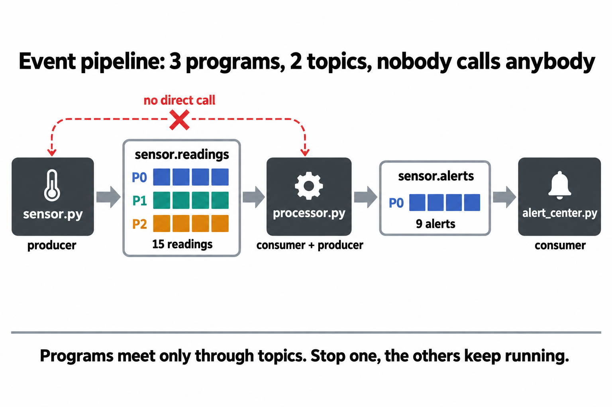
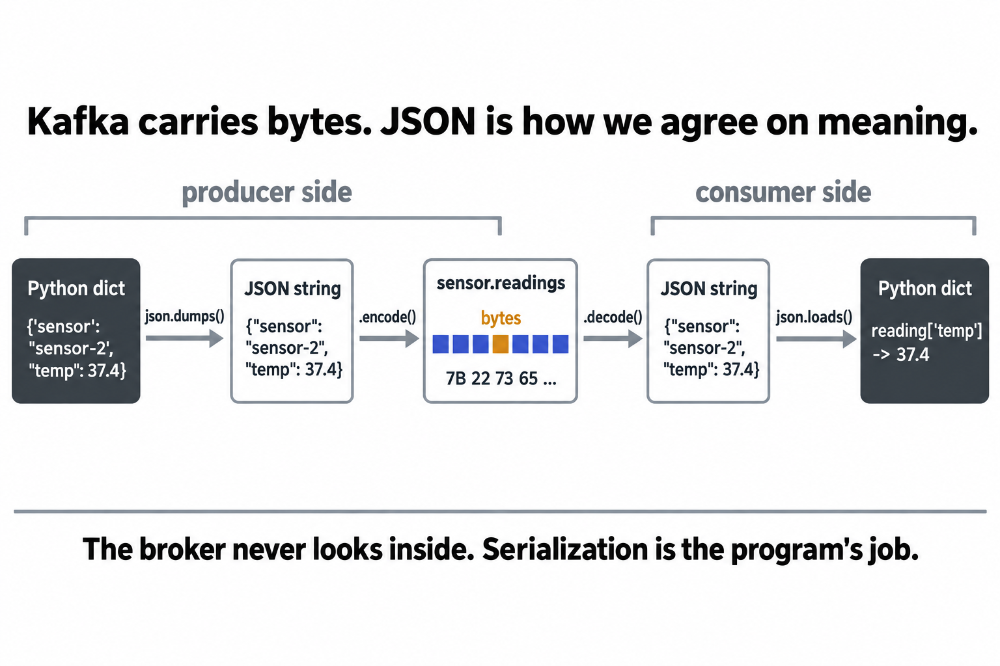
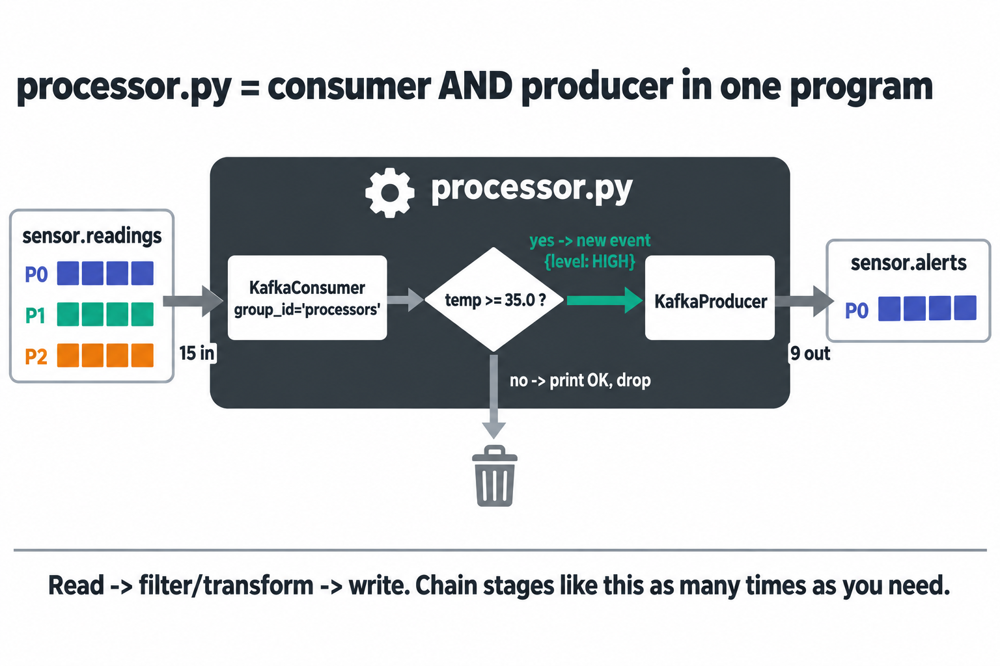
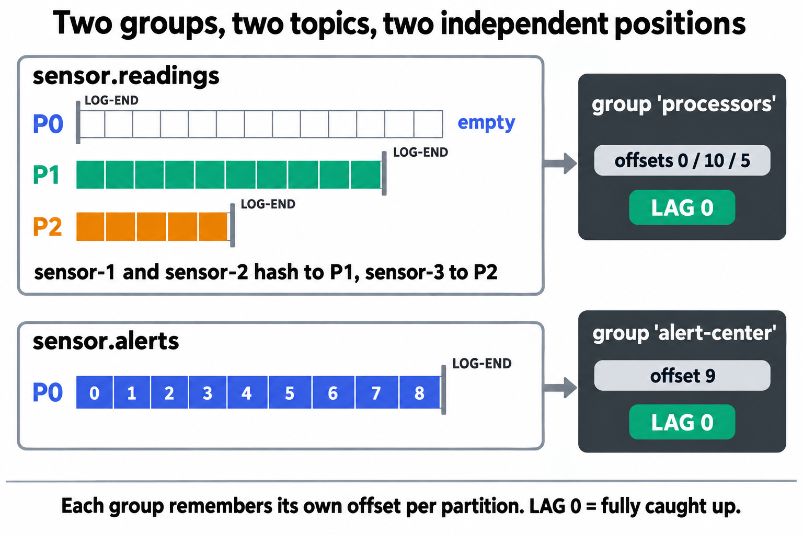
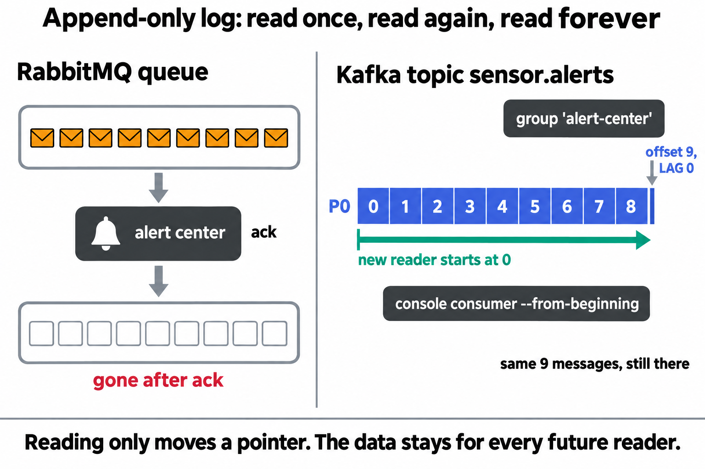
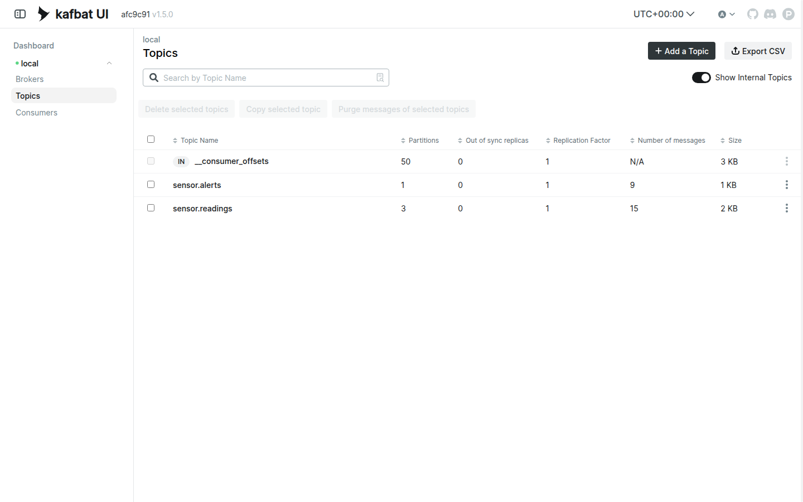
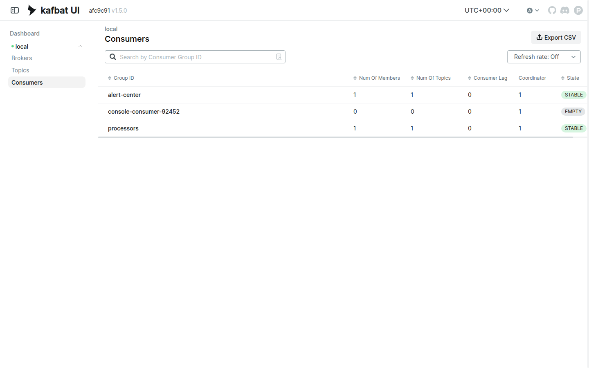
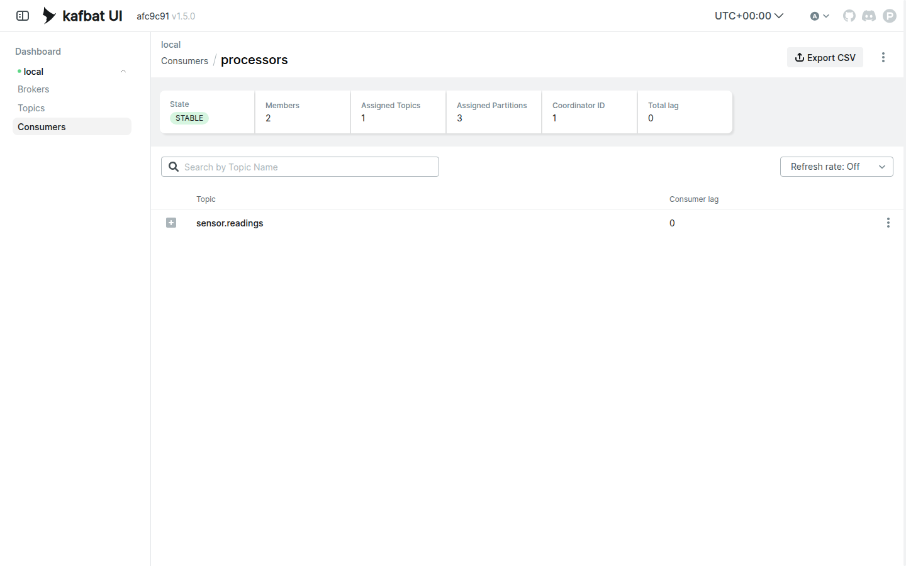

# LAB 4 — Mini Event Pipeline (JSON) : sensor → processor → alert center

> โฟลเดอร์ `004_LAB_Event_Pipeline` = **LAB 4** แล็บปิดท้ายของชุด Kafka (ในสไลด์ `Kafka_Slides.html` = section 05 "หลายทีม สมุดเล่มเดียว") · ต่อจาก LAB 3 ที่รู้แล้วว่า consumer group แบ่ง partition กันอย่างไร
> ไฟล์ในโฟลเดอร์นี้ : `docker-compose.yml` · `sensor.py` · `processor.py` · `alert_center.py` · `requirements.txt`

## สิ่งที่จะได้เรียนรู้

- ต่อโปรแกรม 3 ตัวเป็น **pipeline** ผ่าน topic 2 ตัว — `sensor.py` → `sensor.readings` → `processor.py` → `sensor.alerts` → `alert_center.py` — โดยที่ **ไม่มีโปรแกรมไหนเรียกหากันตรง ๆ เลย**
- ส่งข้อมูลเป็น **JSON** : Kafka เก็บแค่ bytes — ฝั่งส่ง `dict → json.dumps → encode` · ฝั่งรับ `decode → json.loads → dict`
- โปรแกรมเดียวเป็น **ทั้ง consumer และ producer** (`processor.py`) = หน่วยพื้นฐานของ microservice / stream processing
- สอง consumer group **คนละ topic** ต่างคนต่างจด offset ของตัวเอง · อ่าน `--all-groups --describe` ให้เป็นในครั้งเดียว
- **Replay** : alert ที่อ่านไปแล้ว **ไม่หาย** — ผู้อ่านหน้าใหม่ (group ใหม่) อ่านซ้ำตั้งแต่ offset 0 ได้เสมอ (ต่างจาก RabbitMQ ที่ ack แล้วข้อความหายจาก queue)
- **scale ตัวประมวลผล** ด้วยการเปิด `processor.py` เพิ่มใน group เดิม — Kafka rebalance ให้เอง ปลายทางไม่รู้ด้วยซ้ำ

## ลำดับการทำแล็บ

เตรียมเครื่องเรียน (เปิด port `8414`) → `docker compose up -d` → สร้าง topic 2 ตัว + venv → อ่านโค้ด 3 ไฟล์ → **เจาะทฤษฎี** → เปิด pipeline **จากปลายน้ำย้อนขึ้นต้นน้ำ** (3 หน้าต่าง) → ส่องทุก group ด้วย CLI + Kafka UI → **replay** → **ทดลองเพิ่มเติม 3 ข้อ** (scale processor · group ใหม่อ่านซ้ำ · ลบ seed)

---

## 1. เตรียมเครื่องเรียน + โค้ดแล็บ

เปิด container ที่ติดตั้ง Docker มาให้แล้ว (บนเครื่องของเราเอง ไม่ใช้ cloud) — **แล็บนี้เปิด port `8414` เพิ่ม** ให้หน้าเว็บ Kafka UI ทะลุออกมาถึงเบราว์เซอร์ของเราได้เลย :

```bash
docker rm -f devtools
docker run -dit --name devtools --privileged -p 2222:22 -p 8414:8414 tuchsanai/devtools:2569_1
ssh root@localhost -p 2222        # password : passwd
```

> 📝 **คำอธิบาย:** `docker rm -f devtools` ลบเครื่องเรียนตัวเดิมกันชื่อซ้ำ · `--privileged` จำเป็นเพราะ Kafka ของแล็บนี้เป็น container ที่รัน **ซ้อนอยู่ข้างในเครื่องเรียน** อีกที · `-p 2222:22` คือ SSH · **`-p 8414:8414`** เปิดทางให้เบราว์เซอร์บนเครื่องเราเห็น Kafka UI โดยไม่ต้อง forward port ทีหลัง — เลข `8414` ต้องตรงกับฝั่งซ้ายของ `ports:` ใน `docker-compose.yml` (ข้อ 2) · เลี่ยง `8080` / `80` / `8888` เพราะเป็น port ยอดนิยมที่ชนกับโปรแกรมอื่นง่าย · LAB 1–3 ใช้ `8411`–`8413` แล็บนี้ `8414` — เลขต่างกันจะได้รู้ว่ากำลังดู UI ของแล็บไหน

ใน VS Code ใช้ **Remote-SSH** ต่อไปที่ `root@localhost:2222` · **คำสั่งที่เหลือทั้งหมดพิมพ์ข้างในเครื่องเรียน** :

```bash
docker compose version
mkdir -p ~/labwork && cd ~/labwork
git clone https://github.com/Tuchsanai/DevTools.git
cd DevTools/03_Application_Docker/02_Message_Brokers/02_Kafka/004_LAB_Event_Pipeline
ls
```

> 📝 **คำอธิบาย:** `docker compose version` ยืนยันว่า Docker ข้างในตื่นแล้ว (ถ้าขึ้น `Cannot connect to the Docker daemon` รอสักครู่แล้วลองใหม่) · เคย clone จากแล็บก่อนแล้วข้าม `git clone` ได้

✅ **Expected output** — เห็นเลขเวอร์ชัน แล้ว `ls` เห็นไฟล์ครบ:

```
Docker Compose version v5.3.1
alert_center.py  docker-compose.yml  images  processor.py  readme.md  requirements.txt  sensor.py
```

---

## 2. เปิด Kafka broker + Kafka UI ด้วย `docker compose`

ไฟล์ `docker-compose.yml` ของแล็บนี้ **เหมือน LAB 3 ทุกบรรทัด** ยกเว้นชื่อโปรเจกต์กับ port ของ UI :

```yaml
name: kafka-lab4

services:
  kafka:
    image: apache/kafka:4.1.0
    container_name: kafka
    ports:
      - "9092:9092"          # ประตูของโปรแกรม : sensor.py / processor.py / alert_center.py ต่อที่ localhost:9092
    environment:
      KAFKA_NODE_ID: 1
      KAFKA_PROCESS_ROLES: broker,controller
      KAFKA_CONTROLLER_LISTENER_NAMES: CONTROLLER
      KAFKA_CONTROLLER_QUORUM_VOTERS: 1@kafka:9093
      KAFKA_LISTENERS: HOST://0.0.0.0:9092,DOCKER://0.0.0.0:19092,CONTROLLER://0.0.0.0:9093
      KAFKA_ADVERTISED_LISTENERS: HOST://localhost:9092,DOCKER://kafka:19092
      KAFKA_LISTENER_SECURITY_PROTOCOL_MAP: HOST:PLAINTEXT,DOCKER:PLAINTEXT,CONTROLLER:PLAINTEXT
      KAFKA_INTER_BROKER_LISTENER_NAME: DOCKER
      KAFKA_OFFSETS_TOPIC_REPLICATION_FACTOR: 1
      KAFKA_TRANSACTION_STATE_LOG_REPLICATION_FACTOR: 1
      KAFKA_TRANSACTION_STATE_LOG_MIN_ISR: 1
      # --- แล็บ pipeline : เปิด processor ตัวที่สองแล้วอยากเห็น rebalance ทันที ---
      KAFKA_GROUP_INITIAL_REBALANCE_DELAY_MS: 0
    healthcheck:
      test: ["CMD-SHELL", "/opt/kafka/bin/kafka-broker-api-versions.sh --bootstrap-server localhost:9092 >/dev/null 2>&1"]
      interval: 5s
      timeout: 10s
      retries: 20

  kafka-ui:
    image: kafbat/kafka-ui:latest
    container_name: kafka-ui
    ports:
      - "8414:8080"          # หน้าเว็บ : เครื่องเรา 8414 -> ในกล่อง UI 8080 (เลี่ยง 8080/80/8888)
    environment:
      KAFKA_CLUSTERS_0_NAME: local
      KAFKA_CLUSTERS_0_BOOTSTRAPSERVERS: kafka:19092
      DYNAMIC_CONFIG_ENABLED: "true"
    depends_on:
      kafka:
        condition: service_healthy   # รอจน broker ตอบได้จริง ค่อยเปิด UI
```

> 📝 **คำอธิบาย — 2 จุดที่ต้องดู :**
> **(1) `"8414:8080"`** — UI ฟังที่ `8080` ข้างในกล่องเสมอ เรา map ออกมาเป็น `8414` ให้ตรงกับ `-p 8414:8414` ของเครื่องเรียน (ข้อ 1) เส้นทางคือ เบราว์เซอร์ `localhost:8414` → กล่อง `devtools` → compose → UI ·
> **(2) ที่เหลือคือของเดิมจาก LAB 1–3** : KRaft ไม่มี ZooKeeper · listener สองบาน (`localhost:9092` ให้ Python · `kafka:19092` ให้ UI) · `healthcheck` + `depends_on: service_healthy` กั้น UI ไว้จน broker พร้อม · `KAFKA_GROUP_INITIAL_REBALANCE_DELAY_MS: 0` ให้ทดลองเพิ่มเติม ก. เห็น rebalance ทันทีไม่ต้องรอ 3 วินาที

เปิดทั้งชุดแล้วเช็กสถานะ :

```bash
docker compose up -d
docker compose ps
```

✅ **Expected output** — `kafka` ต้องขึ้น **`Healthy`** ก่อน `kafka-ui` จึง `Started` · ใน `ps` เห็น `Up (healthy)` และ mapping `8414->8080` (ครั้งแรกมี log pull image นำหน้า · เวลาของแต่ละคนจะไม่ตรงกับเอกสารนี้):

```
[+] up 3/3
 ✔ Network kafka-lab4_default  Created
 ✔ Container kafka             Healthy
 ✔ Container kafka-ui          Started
NAME       IMAGE                    COMMAND                  SERVICE    CREATED         STATUS                   PORTS
kafka      apache/kafka:4.1.0       "/__cacert_entrypoin…"   kafka      8 seconds ago   Up 6 seconds (healthy)   0.0.0.0:9092->9092/tcp, [::]:9092->9092/tcp
kafka-ui   kafbat/kafka-ui:latest   "/bin/sh -c 'java --…"   kafka-ui   8 seconds ago   Up 1 second              0.0.0.0:8414->8080/tcp, [::]:8414->8080/tcp
```

เปิดเบราว์เซอร์บนเครื่องเราไปที่ **`http://localhost:8414`** — ต้องเห็น Dashboard cluster `local` Online (UI อุ่นเครื่องราว 10 วินาที ถ้ายังไม่ขึ้นรีเฟรช) · เมนู **Topics** ตอนนี้มีแค่ `__consumer_offsets` · **Consumers** ว่างเปล่า

---

## 3. สร้าง topic 2 เส้นทาง + เตรียม Python

```bash
docker compose exec kafka /opt/kafka/bin/kafka-topics.sh --bootstrap-server localhost:9092 \
  --create --topic sensor.readings --partitions 3 --replication-factor 1
docker compose exec kafka /opt/kafka/bin/kafka-topics.sh --bootstrap-server localhost:9092 \
  --create --topic sensor.alerts --partitions 1 --replication-factor 1
docker compose exec kafka /opt/kafka/bin/kafka-topics.sh --bootstrap-server localhost:9092 --describe
```

> 📝 **คำอธิบาย:** pipeline นี้มีท่อสองเส้น · **`sensor.readings` 3 partitions** รับค่าดิบจาก sensor 3 ตัว (key = ชื่อ sensor → ค่าของตัวเดิมเรียงลำดับเสมอ — LAB 2) · **`sensor.alerts` 1 partition** รับเฉพาะเรื่องด่วน — ของน้อยและอยากได้ **ลำดับรวมเส้นเดียว** ให้ศูนย์เตือนภัย · ชื่อ topic แบบ **มีจุดคั่น** `<ของอะไร>.<เหตุการณ์อะไร>` เป็น convention ที่ใช้กันจริง (`orders.created` · `payments.failed`) — ใน Kafka จุดเป็นแค่ตัวอักษร **ไม่มี wildcard** แบบ RabbitMQ · `--describe` ไม่ใส่ `--topic` = โชว์ทุก topic ในคำสั่งเดียว · **ต้องสร้างเองก่อนรันโค้ด** ไม่งั้น broker auto-create ให้แบบ 1 partition

✅ **Expected output** — WARNING เป็นคำเตือนมาตรฐาน "อย่าใช้ `.` ปนกับ `_`" (เราใช้จุดล้วนจึงไม่มีปัญหา) · `PartitionCount` ต้องเป็น **1** กับ **3** (TopicId ของแต่ละคนจะไม่ตรงกับเอกสารนี้):

```
WARNING: Due to limitations in metric names, topics with a period ('.') or underscore ('_') could collide. To avoid issues it is best to use either, but not both.
Created topic sensor.readings.
WARNING: Due to limitations in metric names, topics with a period ('.') or underscore ('_') could collide. To avoid issues it is best to use either, but not both.
Created topic sensor.alerts.
Topic: sensor.alerts	TopicId: 7RYZE6oRQWeb9D9HJrkJ-A	PartitionCount: 1	ReplicationFactor: 1	Configs: min.insync.replicas=1
	Topic: sensor.alerts	Partition: 0	Leader: 1	Replicas: 1	Isr: 1	Elr: 	LastKnownElr:
Topic: sensor.readings	TopicId: Lxf2wS_HREOiKW6Kc9Tn8Q	PartitionCount: 3	ReplicationFactor: 1	Configs: min.insync.replicas=1
	Topic: sensor.readings	Partition: 0	Leader: 1	Replicas: 1	Isr: 1	Elr: 	LastKnownElr:
	Topic: sensor.readings	Partition: 1	Leader: 1	Replicas: 1	Isr: 1	Elr: 	LastKnownElr:
	Topic: sensor.readings	Partition: 2	Leader: 1	Replicas: 1	Isr: 1	Elr: 	LastKnownElr:
```

เตรียม venv (มี `~/venv-kafka` จากแล็บก่อนแล้ว ข้ามบรรทัดแรกได้) :

```bash
python3 -m venv ~/venv-kafka
source ~/venv-kafka/bin/activate
pip install -r requirements.txt
```

✅ **Expected output** — จบด้วย `Successfully installed kafka-python-3.0.10` (หรือ `Requirement already satisfied`)

> **⚠️ กติกาสำคัญของแล็บนี้ :** ใช้ **3 หน้าต่าง terminal พร้อมกัน** (+1 ในทดลองเพิ่มเติม ก.) — **ทุกหน้าต่างใหม่** ต้อง `source ~/venv-kafka/bin/activate` แล้ว `cd` เข้าโฟลเดอร์แล็บก่อนเสมอ ลืมเมื่อไหร่เจอ `ModuleNotFoundError: No module named 'kafka'`

---

## 4. รู้จักโค้ด 3 ไฟล์ของ pipeline

โจทย์สมมุติ : sensor วัดอุณหภูมิ 3 ตัวส่งค่าเข้ามาเรื่อย ๆ · ตัวประมวลผลคัดเฉพาะค่าที่ **≥ 35.0 °C** ส่งต่อเป็น alert · ศูนย์เตือนภัยรับเฉพาะ alert

### `sensor.py` — ต้นน้ำ (producer)

```python
import json
import random
import sys
import time
from kafka import KafkaProducer

# ล็อกผลการสุ่มให้ตรงกับเอกสารแล็บ — อยากได้ค่าสุ่มจริง ให้ลบบรรทัดนี้ทิ้ง
random.seed(2569)

# 1) ต่อ broker
producer = KafkaProducer(bootstrap_servers='localhost:9092')

# 2) จำนวนรอบที่จะวัด — ใส่เป็น argument ได้ เช่น `python sensor.py 15` (ไม่ใส่ = 15)
rounds = int(sys.argv[1]) if len(sys.argv) > 1 else 15

# 3) จำลอง sensor วัดอุณหภูมิ 3 ตัว ส่งค่าเป็น JSON เข้า topic 'sensor.readings'
#    ใช้ key = ชื่อ sensor → ค่าของ sensor ตัวเดิมเรียงลำดับกันเสมอ (บทเรียน LAB 2)
sensors = ['sensor-1', 'sensor-2', 'sensor-3']
for i in range(rounds):
    sensor = sensors[i % 3]
    reading = {
        'sensor': sensor,
        'temp': round(random.uniform(20.0, 45.0), 1),   # อุณหภูมิ 20.0–45.0 °C
        'round': i // 3 + 1,
    }
    # 4) dict → ข้อความ JSON → bytes แล้วค่อยส่ง (ผู้รับจะแปลงกลับด้วย json.loads)
    producer.send('sensor.readings',
                  key=sensor.encode(),
                  value=json.dumps(reading).encode()).get(timeout=10)
    print(f" [x] Sent {reading}")
    time.sleep(0.5)   # เว้นจังหวะเหมือน sensor วัดค่าเป็นระยะ

producer.close()
```

> 📝 **คำอธิบาย:** **`random.seed(2569)`** ล็อกลำดับเลขสุ่มให้ **เหมือนกันทุกเครื่องทุกครั้ง** — 15 ค่าที่เห็นในข้อ 6 ของทุกคนจะตรงกับเอกสารเป๊ะ (ทดลอง ค. จะพาไปดูว่าถ้าลบทิ้งเกิดอะไร) · **(3)** วน `sensor-1 → 2 → 3` ใช้ **key = ชื่อ sensor** · **(4)** ท่าส่ง JSON มาตรฐาน : `dict → json.dumps → encode()` ได้ bytes แล้วยัดใส่ `send` — ฝั่งส่ง **ไม่รู้จัก processor เลย** มันแค่เขียนต่อท้าย log

### `processor.py` — ตัวกลาง (consumer **และ** producer) — จุดสอนหลักของแล็บ

```python
import json
import sys
from kafka import KafkaConsumer, KafkaProducer

# เกณฑ์แจ้งเตือน : อุณหภูมิตั้งแต่ 35.0 °C ขึ้นไปถือว่า "ร้อนผิดปกติ"
THRESHOLD = 35.0

def main():
    # ตั้งชื่อ processor ผ่าน argument เช่น `python processor.py P2` (ไม่ใส่ = P1)
    name = sys.argv[1] if len(sys.argv) > 1 else 'P1'

    # 1) โปรแกรมนี้เป็น "ทั้งผู้อ่านและผู้ส่ง" ในตัวเดียว — ท่ามาตรฐานของ microservice
    #    ฝั่งอ่าน : สมัครอ่าน topic 'sensor.readings' ในนาม group 'processors'
    consumer = KafkaConsumer('sensor.readings',
                             bootstrap_servers='localhost:9092',
                             group_id='processors',
                             auto_offset_reset='earliest')
    #    ฝั่งส่ง : เตรียม producer ไว้ส่งผลไป topic 'sensor.alerts'
    producer = KafkaProducer(bootstrap_servers='localhost:9092')

    print(f' [*] Processor {name} waiting (alert เมื่อ temp >= {THRESHOLD}). To exit press CTRL+C')

    assignment = None
    try:
        while True:
            # 2) poll ดึงค่าดิบชุดถัดไป (รอไม่เกิน 1 วินาทีต่อรอบ)
            batch = consumer.poll(timeout_ms=1000)

            #    พิมพ์ทุกครั้งที่ถูก "แบ่ง partition" ใหม่ — ไว้ดู rebalance ตอนเปิด processor เพิ่ม
            current = sorted(tp.partition for tp in consumer.assignment())
            if current and current != assignment:
                print(f' [*] Processor {name} ได้รับมอบหมาย partitions: {current}')
                assignment = current

            for tp, messages in batch.items():
                for message in messages:
                    # 3) bytes → JSON → dict แล้วตรวจค่า
                    reading = json.loads(message.value.decode())
                    temp = reading['temp']

                    if temp >= THRESHOLD:
                        # 4) ร้อนเกินเกณฑ์ → สร้าง event ใหม่ ส่งต่อเข้า topic 'sensor.alerts'
                        alert = {'sensor': reading['sensor'], 'temp': temp, 'level': 'HIGH'}
                        producer.send('sensor.alerts',
                                      key=reading['sensor'].encode(),
                                      value=json.dumps(alert).encode()).get(timeout=10)
                        print(f" [!] {name} ALERT {reading['sensor']} temp={temp} -> sensor.alerts")
                    else:
                        # 5) ค่าปกติ → แค่รับทราบ ไม่ส่งต่อ
                        print(f" [x] {name} OK    {reading['sensor']} temp={temp}")
    except KeyboardInterrupt:
        print(f' [*] Processor {name} leaving the group...')
    finally:
        # 6) ปิดให้เรียบร้อยทั้งสองฝั่ง : consumer บอกลา group (rebalance ทันที) · producer ส่งของค้างให้หมด
        consumer.close()
        producer.close()

if __name__ == '__main__':
    main()
```

> 📝 **คำอธิบาย:** **(1)** บรรทัดเปิดมีทั้ง `KafkaConsumer` **และ** `KafkaProducer` — โปรแกรมที่ "อ่านจาก topic หนึ่ง แปลงร่าง แล้วเขียนลงอีก topic" คือหน่วยพื้นฐานของ **microservice chain** ต่อกันกี่ทอดก็ได้โดยแต่ละทอดไม่รู้จักกัน · **(2)** `poll` + พิมพ์ `assignment` = ท่าเดียวกับ `worker.py` ของ LAB 3 เอาไว้ **เห็น rebalance ด้วยตาเปล่า** ในทดลอง ก. · **(3)** แกะ bytes → dict แล้วหยิบ `temp` เทียบ `THRESHOLD` · **(4)** ถ้าร้อนเกิน — **สร้าง event ใหม่** ไม่ใช่ส่งต่อก้อนเดิม (เพิ่ม `level` ตัด `round` ทิ้ง เหลือเฉพาะที่ปลายทางต้องใช้) ใช้ key ชื่อ sensor เหมือนเดิม · **(5)** ค่าปกติแค่พิมพ์ `OK` **ไม่ส่งต่อ** — ตัวกรองแบบนี้ทำให้ topic ปลายทางเหลือแต่เรื่องสำคัญ · **(6)** `close()` ทั้งคู่ใน `finally` — บทเรียน LAB 3 : ไม่บอกลา ทีมต้องรอ session timeout 45 วินาที

### `alert_center.py` — ปลายน้ำ (consumer)

```python
import json
from kafka import KafkaConsumer

def main():
    # 1) ปลายทางของ pipeline : อ่านเฉพาะ topic 'sensor.alerts'
    #    ไม่ต้องรู้เลยว่าต้นทางมีกี่ sensor หรือ processor คิดยังไง — decoupling เต็มรูปแบบ
    consumer = KafkaConsumer('sensor.alerts',
                             bootstrap_servers='localhost:9092',
                             group_id='alert-center',
                             auto_offset_reset='earliest')

    print(' [*] Alert center waiting. To exit press CTRL+C')

    try:
        for message in consumer:
            # 2) bytes → JSON → dict แล้วประกาศเตือน
            alert = json.loads(message.value.decode())
            print(f" [!] 🚨 {alert['sensor']} ร้อนผิดปกติ! temp={alert['temp']} "
                  f"(level={alert['level']}) offset={message.offset}")
    except KeyboardInterrupt:
        print(' [*] Alert center leaving the group...')
    finally:
        # 3) commit offset ล่าสุด + บอกลา broker ให้เรียบร้อย
        consumer.close()

if __name__ == '__main__':
    main()
```

> 📝 **คำอธิบาย:** ไฟล์สั้นที่สุด — และนั่นคือประเด็น · **(1)** รู้จักแค่ **ชื่อ topic เดียว** กับชื่อ group ของตัวเอง — จะเปลี่ยนทั้งครึ่งบนของ pipeline (เพิ่ม sensor · เปลี่ยนเกณฑ์ · เปิด processor 5 ตัว) ไฟล์นี้ **ไม่ต้องแก้สักบรรทัด** · **(2)** `decode` → `json.loads` แล้วหยิบ field ใช้ · พิมพ์ `offset` ด้วย จะได้เทียบกับ Kafka UI และ replay ในข้อ 9 ได้ตัวต่อตัว

---

## 5. เจาะทฤษฎี : Pipeline บน Kafka ทำงานยังไงกันแน่

อ่านข้อนี้ให้จบก่อนลงมือ แล้วทุก output ในข้อ 6–9 จะ "อ่านออก" ทันที

### 5.1 สามโปรแกรม สองท่อ ไม่มีใครเรียกใคร



- แต่ละโปรแกรมรู้จักแค่ **ชื่อ topic** ที่ตัวเองอ่าน/เขียน — ไม่มี URL ไม่มี IP ของโปรแกรมอื่น
- **ปิดตัวไหน ตัวอื่นก็ยังอยู่** : ปิด `processor.py` แล้ว `sensor.py` ยังส่งได้ (ค่าไปกองรอใน `sensor.readings` เป็น LAG) พอเปิดกลับมาก็ไล่ของค้างต่อ
- นี่คือ **decoupling** ที่ทำให้ระบบ event-driven เปลี่ยนชิ้นส่วนทีละชิ้นได้โดยไม่หยุดทั้งระบบ

### 5.2 Kafka เก็บแค่ bytes — JSON คือข้อตกลงเรื่อง "ความหมาย"



| ฝั่ง | ขั้น | โค้ด |
|---|---|---|
| producer | dict → JSON string | `json.dumps(reading)` |
| producer | string → bytes | `.encode()` |
| broker | เก็บ bytes เฉย ๆ ไม่เปิดดูข้างใน | — |
| consumer | bytes → string | `message.value.decode()` |
| consumer | string → dict | `json.loads(...)` |

broker **ไม่รู้และไม่สน** ว่าข้างในเป็น JSON · ทั้งผู้ส่งผู้รับต้อง **ตกลง format กันเอง** — งานจริงจึงมีเรื่อง schema (Avro · Protobuf · Schema Registry) ตามมา แต่หลักการเดียวกัน

### 5.3 processor = consumer + producer ในโปรแกรมเดียว



- **อ่าน → กรอง/แปลง → เขียน** = หนึ่ง **stage** ของ stream processing · ต่อ stage แบบนี้กี่ทอดก็ได้
- 15 ค่าเข้า → **9 alert** ออก : ตัวกรองทำให้ topic ปลายทางเหลือแต่ของสำคัญ และ event ที่ออกไป **เป็นก้อนใหม่** (schema ต่างจากต้นทางได้)
- processor อยู่ใน group `processors` → เปิดหลายตัวช่วยกันอ่านได้ (LAB 3) — ทดลอง ก. จะทำจริง

### 5.4 สอง group สอง topic — ต่างคนต่างจดตำแหน่ง



- `processors` เกาะ `sensor.readings` · `alert-center` เกาะ `sensor.alerts` — offset ของสอง group **ไม่เกี่ยวกันเลย**
- `--all-groups --describe` โชว์ทุก group ในคำสั่งเดียว : `CURRENT-OFFSET` = อ่านถึงไหน · `LOG-END-OFFSET` = ปลาย log · **`LAG` = ค้างอ่าน** (LAB 3)
- ค่าดิบ 15 ตัวจะกระจาย **10 / 5 / 0** ไม่เท่ากัน — เพราะ `sensor-1` กับ `sensor-2` hash ลง partition 1 คู่กัน `sensor-3` ลง partition 2 ส่วน partition 0 **ว่าง** · Kafka สัญญา "key เดิมช่องเดิม" ไม่ใช่ "แบ่งเท่ากัน" (LAB 2)

### 5.5 Append-only log : อ่านแล้วอ่านอีกได้เสมอ



- การ "อ่าน" ใน Kafka คือแค่ **เลื่อน offset ของ group ตัวเอง** ตัวข้อมูล **ไม่ถูกลบ**
- ผู้อ่านหน้าใหม่ (group ใหม่ หรือ console consumer `--from-beginning`) เริ่มจาก **offset 0** ได้ทันที **ไม่กระทบ** offset ของ `alert-center`
- RabbitMQ (ชุดที่แล้ว) พอ ack แล้วข้อความ **หายจาก queue** อยากได้อีกต้องขอให้ส่งซ้ำ · นี่คือเหตุผลที่ระบบวิเคราะห์ย้อนหลังสร้างบน Kafka

---

## 6. เปิด pipeline จากปลายน้ำย้อนขึ้นต้นน้ำ (3 หน้าต่าง)

หลักการต่อ pipeline : **ผู้รับพร้อมก่อน แล้วค่อยปล่อยของไหลมา** · **หน้าต่างที่ 1** ไว้ส่งค่า + สั่ง `docker compose exec` · **หน้าต่างที่ 2** = alert center · **หน้าต่างที่ 3** = processor

**หน้าต่างที่ 2** (ssh เข้าเครื่องเรียนอีก session) เปิดปลายทาง :

```bash
source ~/venv-kafka/bin/activate
cd ~/labwork/DevTools/03_Application_Docker/02_Message_Brokers/02_Kafka/004_LAB_Event_Pipeline
python alert_center.py
```

✅ **Expected output** — ค้างรอ = ถูกต้อง ทั้งระบบยังไม่มีใครส่งอะไร ปล่อยหน้าต่างนี้ทิ้งไว้ตลอดแล็บ:

```
 [*] Alert center waiting. To exit press CTRL+C
```

**หน้าต่างที่ 3** เปิดตัวกลาง (activate venv + `cd` ก่อนเหมือนกัน) :

```bash
python processor.py
```

✅ **Expected output** — ทีม `processors` มีคนเดียว จึงได้ครบทั้ง 3 partitions ของ `sensor.readings`:

```
 [*] Processor P1 waiting (alert เมื่อ temp >= 35.0). To exit press CTRL+C
 [*] Processor P1 ได้รับมอบหมาย partitions: [0, 1, 2]
```

**หน้าต่างที่ 1** — **จัดหน้าจอให้เห็นทั้ง 3 หน้าต่างพร้อมกัน** แล้วเปิดก๊อกต้นน้ำ :

```bash
python sensor.py
```

> 📝 **คำอธิบาย:** ใช้เวลาราว 8 วินาที (15 × 0.5 s) — มองสามหน้าต่างไล่ตาม : หน้าต่างนี้ `Sent` → หน้าต่างที่ 3 `OK`/`ALERT` แทบพร้อมกัน → **เฉพาะตัวที่ ALERT** เด้งไปโผล่เป็น 🚨 ที่หน้าต่างที่ 2 · จบแล้วโปรแกรมปิดตัวเอง

✅ **Expected output** — **หน้าต่างที่ 1** : 15 ค่า **ตรงกับเอกสารนี้เป๊ะทุกตัว** (ฝีมือ `random.seed(2569)`):

```
 [x] Sent {'sensor': 'sensor-1', 'temp': 41.8, 'round': 1}
 [x] Sent {'sensor': 'sensor-2', 'temp': 37.4, 'round': 1}
 [x] Sent {'sensor': 'sensor-3', 'temp': 33.4, 'round': 1}
 [x] Sent {'sensor': 'sensor-1', 'temp': 21.8, 'round': 2}
 [x] Sent {'sensor': 'sensor-2', 'temp': 44.9, 'round': 2}
 [x] Sent {'sensor': 'sensor-3', 'temp': 20.2, 'round': 2}
 [x] Sent {'sensor': 'sensor-1', 'temp': 28.0, 'round': 3}
 [x] Sent {'sensor': 'sensor-2', 'temp': 38.4, 'round': 3}
 [x] Sent {'sensor': 'sensor-3', 'temp': 35.7, 'round': 3}
 [x] Sent {'sensor': 'sensor-1', 'temp': 41.6, 'round': 4}
 [x] Sent {'sensor': 'sensor-2', 'temp': 35.4, 'round': 4}
 [x] Sent {'sensor': 'sensor-3', 'temp': 34.7, 'round': 4}
 [x] Sent {'sensor': 'sensor-1', 'temp': 21.5, 'round': 5}
 [x] Sent {'sensor': 'sensor-2', 'temp': 42.7, 'round': 5}
 [x] Sent {'sensor': 'sensor-3', 'temp': 37.9, 'round': 5}
```

✅ **Expected output** — **หน้าต่างที่ 3** (`processor.py`) ตัดสินครบ 15 ค่า : **9 ALERT + 6 OK** — ค่าที่ ≥ 35.0 ถูกส่งต่อทุกตัว:

```
 [!] P1 ALERT sensor-1 temp=41.8 -> sensor.alerts
 [!] P1 ALERT sensor-2 temp=37.4 -> sensor.alerts
 [x] P1 OK    sensor-3 temp=33.4
 [x] P1 OK    sensor-1 temp=21.8
 [!] P1 ALERT sensor-2 temp=44.9 -> sensor.alerts
 [x] P1 OK    sensor-3 temp=20.2
 [x] P1 OK    sensor-1 temp=28.0
 [!] P1 ALERT sensor-2 temp=38.4 -> sensor.alerts
 [!] P1 ALERT sensor-3 temp=35.7 -> sensor.alerts
 [!] P1 ALERT sensor-1 temp=41.6 -> sensor.alerts
 [!] P1 ALERT sensor-2 temp=35.4 -> sensor.alerts
 [x] P1 OK    sensor-3 temp=34.7
 [x] P1 OK    sensor-1 temp=21.5
 [!] P1 ALERT sensor-2 temp=42.7 -> sensor.alerts
 [!] P1 ALERT sensor-3 temp=37.9 -> sensor.alerts
```

✅ **Expected output** — **หน้าต่างที่ 2** (`alert_center.py`) ได้ **เฉพาะ 9 เรื่องด่วน** offset 0–8 — ค่า OK ทั้ง 6 ไม่มีทางโผล่ที่นี่:

```
 [!] 🚨 sensor-1 ร้อนผิดปกติ! temp=41.8 (level=HIGH) offset=0
 [!] 🚨 sensor-2 ร้อนผิดปกติ! temp=37.4 (level=HIGH) offset=1
 [!] 🚨 sensor-2 ร้อนผิดปกติ! temp=44.9 (level=HIGH) offset=2
 [!] 🚨 sensor-2 ร้อนผิดปกติ! temp=38.4 (level=HIGH) offset=3
 [!] 🚨 sensor-3 ร้อนผิดปกติ! temp=35.7 (level=HIGH) offset=4
 [!] 🚨 sensor-1 ร้อนผิดปกติ! temp=41.6 (level=HIGH) offset=5
 [!] 🚨 sensor-2 ร้อนผิดปกติ! temp=35.4 (level=HIGH) offset=6
 [!] 🚨 sensor-2 ร้อนผิดปกติ! temp=42.7 (level=HIGH) offset=7
 [!] 🚨 sensor-3 ร้อนผิดปกติ! temp=37.9 (level=HIGH) offset=8
```

> **ตามรอย 1 ข้อความให้สุดทาง (ภาพ 5.2 + 5.3) :** `sensor-2 · 37.4` — ① `sensor.py` ห่อ `{'sensor': 'sensor-2', 'temp': 37.4, 'round': 1}` เป็น bytes ส่งเข้า `sensor.readings` (key `sensor-2` → partition 1) → ② `processor.py` แกะออก เห็น `37.4 >= 35.0` **สร้าง event ใหม่** `{'sensor': 'sensor-2', 'temp': 37.4, 'level': 'HIGH'}` (มี `level` ไม่มี `round`) เขียนลง `sensor.alerts` ได้ **offset 1** → ③ `alert_center.py` อ่าน offset 1 มาประกาศ 🚨 · ทั้งทางไม่มีใครเรียกใครตรง ๆ เลย

---

## 7. ส่องกลุ่มผู้อ่านทั้งระบบ — `--all-groups`

จอ 2–3 ยังเปิดค้าง — **หน้าต่างที่ 1** ถาม broker ว่าใครอ่านอะไรถึงไหน :

```bash
docker compose exec kafka /opt/kafka/bin/kafka-consumer-groups.sh --bootstrap-server localhost:9092 \
  --all-groups --describe
```

✅ **Expected output** — **สอง group สองตาราง คนละ topic** · LAG `0` ทุกแถว = ทั้งระบบอ่านทันหมด (CONSUMER-ID · ลำดับแถวของแต่ละคนจะไม่ตรงกับเอกสารนี้):

```
GROUP           TOPIC           PARTITION  CURRENT-OFFSET  LOG-END-OFFSET  LAG             CONSUMER-ID                                              HOST            CLIENT-ID
alert-center    sensor.alerts   0          9               9               0               kafka-python-3.0.10-175b762a-a218-483a-9f9d-7e6849e4504b /172.19.0.1     kafka-python-3.0.10

GROUP           TOPIC           PARTITION  CURRENT-OFFSET  LOG-END-OFFSET  LAG             CONSUMER-ID                                              HOST            CLIENT-ID
processors      sensor.readings 1          10              10              0               kafka-python-3.0.10-a95e22ba-867d-4bd4-b845-a83f8e5ac6ff /172.19.0.1     kafka-python-3.0.10
processors      sensor.readings 2          5               5               0               kafka-python-3.0.10-a95e22ba-867d-4bd4-b845-a83f8e5ac6ff /172.19.0.1     kafka-python-3.0.10
processors      sensor.readings 0          0               0               0               kafka-python-3.0.10-a95e22ba-867d-4bd4-b845-a83f8e5ac6ff /172.19.0.1     kafka-python-3.0.10
```

> 📝 **อ่านตัวเลขให้เป็น (ภาพ 5.4) :** `sensor.alerts` partition 0 ยาว **9** = จำนวน 🚨 พอดี · `sensor.readings` รวม 10 + 5 + 0 = **15** ครบตามที่ส่ง แต่กระจาย **ไม่เท่ากัน** — `sensor-1` กับ `sensor-2` hash ลง partition 1 คู่กัน `sensor-3` ลง partition 2 ส่วน partition 0 **ว่าง** · CONSUMER-ID ของ `processors` เป็นค่าเดียวทั้ง 3 แถว = P1 ถือทุกเล่ม · จำภาพ 10/5/0 นี้ไว้ ทดลอง ก. จะใช้เฉลยว่าใครได้งานเท่าไหร่

---

## 8. ดูทั้ง pipeline ใน Kafka UI

เปิด **`http://localhost:8414`** → เมนู **Topics** :



> 📝 **จุดที่ต้องดู:** `sensor.readings` : Partitions **3** · Number of messages **15** · `sensor.alerts` : Partitions **1** · Number of messages **9** — สองแถวนี้คือ **ภาพสรุปของ pipeline ทั้งเส้น** : เข้า 15 ผ่านตัวกรองเหลือ 9 · `__consumer_offsets` (IN = internal) คือ topic ที่ broker ใช้จำ offset ของทุก group (LAB 3)

คลิก `sensor.alerts` → แท็บ **Messages** :


> 📝 **จุดที่ต้องดู:** เรียง **ใหม่ → เก่า** offset 8 (`sensor-3 · 37.9`) บนสุด ไล่ถึง offset 0 (`sensor-1 · 41.8`) ตรงกับหน้าต่างที่ 2 ทุกบรรทัด · คอลัมน์ **Key** = ชื่อ sensor ที่ processor ใส่มา · **Value** เห็น JSON `{"sensor": ..., "temp": ..., "level": "HIGH"}` — **ไม่มี field `round`** เพราะ processor สร้าง event ใหม่ · ที่เปิดดูได้ทั้งที่ `alert-center` อ่านครบแล้ว (LAG 0) เพราะ **log ไม่ลบของ**

เมนู **Consumers** :



> 📝 **จุดที่ต้องดู:** สอง group **Num Of Members 1 · Num Of Topics 1 · Consumer Lag 0 · STABLE** ทั้งคู่ — ข้อมูลก้อนเดียวกับ CLI ข้อ 7 คนละมุมมอง · (ถ้าทำข้อ 9 ก่อนแล้วกลับมาดู จะเห็นแถว `console-consumer-XXXXX` สถานะ **EMPTY** เพิ่มมา — นั่นคือ group ชั่วคราวที่ console consumer ตั้งให้ตัวเอง)

---

## 9. Replay ปิดท้าย — alert ไม่หายไปไหน

`alert-center` อ่านครบ 9 แล้ว (LAG 0) — ใน RabbitMQ นาทีนี้ queue ว่างเปล่า · แต่ Kafka ล่ะ? **หน้าต่างที่ 1** :

```bash
docker compose exec kafka /opt/kafka/bin/kafka-console-consumer.sh --bootstrap-server localhost:9092 \
  --topic sensor.alerts --from-beginning
```

> 📝 **คำอธิบาย:** console consumer คือผู้อ่านสำเร็จรูปใน CLI · `--from-beginning` = เริ่มที่ **offset 0** · ไม่ได้ใส่ `--group` มันจึงตั้ง group ชั่วคราวชื่อ `console-consumer-<เลขสุ่ม>` ให้ตัวเอง — **ไม่กระทบ offset ของ `alert-center` เลย** · อ่านครบแล้วโปรแกรมค้างรอข้อความถัดไป (ปกติของ consumer) — กด **Ctrl+C** จบ

✅ **Expected output** — ทั้ง **9 ข้อความยังอยู่ครบ** เรียง offset 0 → 8 · กด Ctrl+C ได้บรรทัดสรุป:

```
{"sensor": "sensor-1", "temp": 41.8, "level": "HIGH"}
{"sensor": "sensor-2", "temp": 37.4, "level": "HIGH"}
{"sensor": "sensor-2", "temp": 44.9, "level": "HIGH"}
{"sensor": "sensor-2", "temp": 38.4, "level": "HIGH"}
{"sensor": "sensor-3", "temp": 35.7, "level": "HIGH"}
{"sensor": "sensor-1", "temp": 41.6, "level": "HIGH"}
{"sensor": "sensor-2", "temp": 35.4, "level": "HIGH"}
{"sensor": "sensor-2", "temp": 42.7, "level": "HIGH"}
{"sensor": "sensor-3", "temp": 37.9, "level": "HIGH"}
^CProcessed a total of 9 messages
```

> **บทเรียนปิดชุด Kafka (ภาพ 5.5) :** topic เป็น **append-only log** — การอ่านเป็นแค่การเลื่อน offset ของผู้อ่านแต่ละคน **ตัวข้อมูลไม่ถูกลบ** · วันหลังอยากเพิ่มระบบเก็บสถิติ alert ย้อนหลัง ก็เขียน consumer ใหม่ใส่ group ใหม่มาอ่าน `sensor.alerts` ตั้งแต่ offset 0 — **ไม่ต้องแตะโค้ดเดิม ไม่ต้องขอให้ใครส่งซ้ำ** (ทดลอง ข. ทำให้ดู)

---

## ทดลองเพิ่มเติม

### ก. Scale ตัวประมวลผล — เปิด `processor.py` ตัวที่สอง

ถ้าค่าดิบไหลมาเร็วกว่าที่ processor ตัวเดียวย่อยไหว? — คำตอบของ Kafka : **เปิดตัวที่สองใน group เดิม** (LAB 3 แต่คราวนี้เป็น microservice จริง) · ทุกจอเดิมเปิดค้างไว้ เปิด **หน้าต่างที่ 4** (activate venv + `cd`) :

```bash
python processor.py P2
```

✅ **Expected output** — rebalance ทันที : **ทั้งสองจอ processor** พิมพ์ assignment ใหม่ (ใครได้ชุดไหนสลับกันได้):

```
──── หน้าต่างที่ 4 (P2 — สมาชิกใหม่) ────
 [*] Processor P2 waiting (alert เมื่อ temp >= 35.0). To exit press CTRL+C
 [*] Processor P2 ได้รับมอบหมาย partitions: [2]
──── หน้าต่างที่ 3 (P1 — พิมพ์เพิ่มเอง) ────
 [*] Processor P1 ได้รับมอบหมาย partitions: [0, 1]
```

**หน้าต่างที่ 1** ยิงค่าชุดใหม่ : `python sensor.py` — อุณหภูมิ **ซ้ำชุดเดิมเป๊ะ** (seed ถูกตั้งใหม่ทุกครั้งที่รัน — ตั้งใจ จะได้เทียบตัวต่อตัว)

✅ **Expected output** — **ข้อความไม่ถูกประมวลผลซ้ำสองจอ** แต่ละค่าไปจอเดียวตาม partition ที่จอนั้นถือ : P1 (p0+p1) ได้ `sensor-1` + `sensor-2` = 10 ค่า (7 ALERT + 3 OK) · P2 (p2) ได้เฉพาะ `sensor-3` = 5 ค่า (2 ALERT + 3 OK):

```
──── หน้าต่างที่ 3 (P1 ถือ p0, p1) ────
 [!] P1 ALERT sensor-1 temp=41.8 -> sensor.alerts
 [!] P1 ALERT sensor-2 temp=37.4 -> sensor.alerts
 [x] P1 OK    sensor-1 temp=21.8
        ... (สาย sensor-1 กับ sensor-2 สลับกันมา รวม 10 บรรทัด) ...
 [!] P1 ALERT sensor-2 temp=42.7 -> sensor.alerts
──── หน้าต่างที่ 4 (P2 ถือ p2) ────
 [x] P2 OK    sensor-3 temp=33.4
 [x] P2 OK    sensor-3 temp=20.2
 [!] P2 ALERT sensor-3 temp=35.7 -> sensor.alerts
 [x] P2 OK    sensor-3 temp=34.7
 [!] P2 ALERT sensor-3 temp=37.9 -> sensor.alerts
```

ส่วน **หน้าต่างที่ 2** ได้ 🚨 เพิ่มอีก 9 ตัว (offset 9–17) เหมือนรอบแรกทุกประการ — ปลายทาง **ไม่รู้ด้วยซ้ำ** ว่าตอนนี้ตัวประมวลผลมีสองตัว · ดูใน Kafka UI → Consumers → `processors` กดปุ่ม `+` หน้าแถว `sensor.readings` :



> 📝 **จุดที่ต้องดู:** **Members 2 · Assigned Partitions 3** · ตารางล่าง partition 2 เป็นของ CONSUMER-ID หนึ่ง (P2) · partition 1 กับ 0 เป็นของอีกตัว (P1) · End offset 10 / 20 / 0 — `sensor-1`+`sensor-2` อยู่เล่มเดียวกันจึงย้ายไปไหนก็ไปด้วยกันทั้งสาย ลำดับต่อ sensor ยังศักดิ์สิทธิ์ · (ค่า Consumer Lag ใน UI อาจค้างไม่กี่วินาทีหลังส่ง — กด **Refresh** ให้กลับเป็น 0)

เสร็จแล้วกด **Ctrl+C ที่หน้าต่างที่ 4** :

✅ **Expected output** — P2 บอกลา (`close()` ใน `finally`) → P1 ได้ทุกเล่มคืน **ทันที**:

```
──── หน้าต่างที่ 4 (P2) ────
^C [*] Processor P2 leaving the group...
──── หน้าต่างที่ 3 (P1) ────
 [*] Processor P1 ได้รับมอบหมาย partitions: [0, 1, 2]
```

> **บทเรียน :** scale โดย **ไม่แก้โค้ด ไม่แก้ config** — แค่เปิด process เพิ่มใน group เดิม · เปิดตัวที่ 4 ก็ได้แต่จะ **ว่างงาน** (partition มี 3 — LAB 3) · ถ้าปิด P2 ด้วย `kill -9` แทน Ctrl+C P1 จะเงียบไป **45 วินาที** ก่อนได้เล่มคืน (session timeout — LAB 3 ทดลอง ค.)

### ข. Pub/Sub — group ใหม่อ่าน alert ทั้งหมดซ้ำ โดย `alert-center` ไม่รู้เรื่อง

สมมุติทีมใหม่อยากได้ **สถิติ alert ย้อนหลังทั้งหมด** — ไม่ต้องแก้ processor ไม่ต้องแก้ alert center แค่เป็นผู้อ่านหน้าใหม่ · **หน้าต่างที่ 1** :

```bash
docker compose exec kafka /opt/kafka/bin/kafka-console-consumer.sh --bootstrap-server localhost:9092 \
  --topic sensor.alerts --group alert-stats --from-beginning \
  --property print.offset=true --property print.key=true
```

✅ **Expected output** — group `alert-stats` ที่เพิ่งเกิด อ่านได้ **ครบทั้ง 18 alert** (9 จากข้อ 6 + 9 จากทดลอง ก.) ตั้งแต่ offset 0 · กด Ctrl+C จบ:

```
Offset:0	sensor-1	{"sensor": "sensor-1", "temp": 41.8, "level": "HIGH"}
Offset:1	sensor-2	{"sensor": "sensor-2", "temp": 37.4, "level": "HIGH"}
        ... (offset 2–16) ...
Offset:17	sensor-3	{"sensor": "sensor-3", "temp": 37.9, "level": "HIGH"}
^CProcessed a total of 18 messages
```

แล้วดูว่า broker จำอะไรไว้บ้าง :

```bash
docker compose exec kafka /opt/kafka/bin/kafka-consumer-groups.sh --bootstrap-server localhost:9092 \
  --all-groups --describe
```

✅ **Expected output** — ตอนนี้ `sensor.alerts` มี **สอง group** อ่านอยู่ : `alert-center` (ยังรัน · มี CONSUMER-ID) กับ `alert-stats` (`no active members` — ปิดไปแล้ว แต่ broker **ยังจด offset 18 ไว้**) · ทั้งคู่ CURRENT 18 = LOG-END 18 LAG 0 · ต่างคนต่างเดิน:

```
GROUP           TOPIC           PARTITION  CURRENT-OFFSET  LOG-END-OFFSET  LAG             CONSUMER-ID                                              HOST            CLIENT-ID
alert-center    sensor.alerts   0          18              18              0               kafka-python-3.0.10-175b762a-a218-483a-9f9d-7e6849e4504b /172.19.0.1     kafka-python-3.0.10

Consumer group 'alert-stats' has no active members.

GROUP           TOPIC           PARTITION  CURRENT-OFFSET  LOG-END-OFFSET  LAG             CONSUMER-ID     HOST            CLIENT-ID
alert-stats     sensor.alerts   0          18              18              0               -               -               -

Consumer group 'console-consumer-92452' has no active members.
        ... (group ชั่วคราวจากข้อ 9 ไม่มี offset เพราะไม่ได้ commit) ...

GROUP           TOPIC           PARTITION  CURRENT-OFFSET  LOG-END-OFFSET  LAG             CONSUMER-ID                                              HOST            CLIENT-ID
processors      sensor.readings 1          20              20              0               kafka-python-3.0.10-a95e22ba-867d-4bd4-b845-a83f8e5ac6ff /172.19.0.1     kafka-python-3.0.10
processors      sensor.readings 0          0               0               0               kafka-python-3.0.10-a95e22ba-867d-4bd4-b845-a83f8e5ac6ff /172.19.0.1     kafka-python-3.0.10
processors      sensor.readings 2          10              10              0               kafka-python-3.0.10-a95e22ba-867d-4bd4-b845-a83f8e5ac6ff /172.19.0.1     kafka-python-3.0.10
```

> **บทเรียน :** นี่คือ **pub/sub แบบ Kafka** — topic เดียว **กี่ group ก็อ่านได้ครบทุกใบ** โดยแค่ตั้งชื่อ group ไม่ซ้ำกัน (RabbitMQ ต้องผูก queue แยกต่อผู้รับกับ exchange fanout) · และ group ใหม่ **ย้อนอดีตได้** เพราะ log ยังอยู่ · ถ้ารันคำสั่งเดิมซ้ำอีกครั้ง `alert-stats` จะ **ไม่ได้อะไรเลย** — เพราะ group นี้จด offset 18 ไว้แล้ว `--from-beginning` มีผลเฉพาะ group ที่ยังไม่มี offset

### ค. ลบ `random.seed(2569)` — ทำไมแล็บถึงล็อกเลขสุ่ม?

เปิด `sensor.py` **ลบ (หรือ comment) บรรทัด `random.seed(2569)`** แล้ว **หน้าต่างที่ 1** ส่ง 6 ค่า :

```bash
python sensor.py 6
```

✅ **Expected output** — คราวนี้เป็น **เลขสุ่มจริง** : ค่าของแต่ละคน (และแต่ละรอบ) **ไม่ตรงกับเอกสารอีกแล้ว** — รอบของเราออกมาแบบนี้ (5 ค่าเกิน 35.0 → P1 ส่งต่อ 5 · หน้าต่างที่ 2 ได้ 🚨 5 ตัว):

```
 [x] Sent {'sensor': 'sensor-1', 'temp': 38.5, 'round': 1}
 [x] Sent {'sensor': 'sensor-2', 'temp': 40.0, 'round': 1}
 [x] Sent {'sensor': 'sensor-3', 'temp': 36.6, 'round': 1}
 [x] Sent {'sensor': 'sensor-1', 'temp': 21.0, 'round': 2}
 [x] Sent {'sensor': 'sensor-2', 'temp': 43.0, 'round': 2}
 [x] Sent {'sensor': 'sensor-3', 'temp': 38.9, 'round': 2}
```

> 📝 **คำอธิบาย:** `random.seed(ค่าคงที่)` ทำให้ลำดับ "สุ่ม" **กำหนดผลล่วงหน้าได้ (deterministic)** — เอกสารถึงกล้าพิมพ์ expected output ตัวต่อตัว และผู้สอนเช็กงานทั้งห้องได้ด้วยตาเปล่า · เทคนิคเดียวกันใช้จริงจังใน **การทดสอบซอฟต์แวร์และงาน ML** (reproducibility) · มุมกลับ : ถ้าสุ่มแล้ว **ไม่มีค่าไหนถึง 35.0** pipeline จะเงียบทั้งเส้นแบบไม่มี error — ไม่ใช่พัง แค่ไม่มีเรื่องด่วน · **เสร็จแล้วใส่บรรทัด seed กลับที่เดิม** ให้ไฟล์ตรงกับเอกสาร

---

## แก้ปัญหาที่พบบ่อย

| อาการ | สาเหตุ | วิธีแก้ |
|---|---|---|
| `alert_center` เงียบสนิท ทั้งที่ `sensor.py` ขึ้น `Sent` ครบ | ห่วงโซ่ขาดตรงกลาง — ส่วนใหญ่คือ **ลืมเปิด `processor.py`** (หรือมันตายไปแล้ว) | ① จอ processor ยังขึ้น `OK`/`ALERT` ไหม ② `--all-groups --describe` : group `processors` มี LAG ค้างไหม ③ เปิด processor ใหม่ มันจะไล่ของค้างเอง |
| ทั้งระบบเดินปกติ แต่ **ไม่มี ALERT สักตัว** | ลบ seed แล้วชุดที่สุ่มได้ต่ำกว่า 35.0 หมด — ไม่ใช่ bug | รัน `python sensor.py` ซ้ำ หรือใส่ `random.seed(2569)` กลับ (ชุด seed มี 9 alert แน่นอน) |
| ค่าอุณหภูมิไม่ตรงเอกสาร | บรรทัด `random.seed(2569)` ถูกลบ/แก้ | ใส่กลับตามโค้ดต้นฉบับ |
| `KafkaTimeoutError` / `NoBrokersAvailable` | broker ยังไม่พร้อม หรือ compose ยังไม่ขึ้น | `docker compose ps` ต้องเห็น `kafka` เป็น `Up (healthy)` · ไม่มีแถวเลย ย้อนข้อ 2 |
| `ModuleNotFoundError: No module named 'kafka'` | ลืม activate venv ในหน้าต่างนั้น | `source ~/venv-kafka/bin/activate` — prompt ต้องมี `(venv-kafka)` |
| `--describe` เห็น `sensor.readings` มี `PartitionCount: 1` | รันโค้ด **ก่อน** สร้าง topic → auto-create 1 partition | ปิดทุกจอ → `kafka-topics.sh ... --delete --topic sensor.readings` → สร้างใหม่ตามข้อ 3 |
| processor สองตัวได้งานไม่เท่ากัน (10 ต่อ 5) | ปกติ — `sensor-1` กับ `sensor-2` hash ลง partition เดียวกัน | ไม่ต้องแก้ : Kafka สัญญา "key เดิมช่องเดิม" ไม่ใช่ "แบ่งเท่ากัน" |
| รัน `--group alert-stats --from-beginning` รอบสองแล้วไม่ได้อะไร | group นี้จด offset ไว้แล้ว `--from-beginning` มีผลเฉพาะ group ใหม่ | ใช้ชื่อ group ใหม่ หรือ `kafka-consumer-groups.sh --group alert-stats --reset-offsets --to-earliest --topic sensor.alerts --execute` (ต้องไม่มีสมาชิกรันอยู่) |
| เปิด `http://localhost:8414` ไม่ขึ้น | ลืม `-p 8414:8414` ตอนสร้างเครื่องเรียน · UI ยังบูตไม่เสร็จ | `docker ps` บนเครื่องเรา ดูว่า `devtools` มี `8414` — ไม่มีต้องสร้างใหม่ตามข้อ 1 · มีแล้วรอ 10 วินาทีแล้วรีเฟรช |
| `Bind for 0.0.0.0:8414 failed: port is already allocated` | มีโปรแกรมอื่นจอง `8414` | เปลี่ยนเลขซ้ายทั้งใน `docker-compose.yml` และ `-p` ของเครื่องเรียนให้ตรงกัน (เช่น `8415`) |
| `docker compose up` ฟ้องชื่อ container ซ้ำ | มี `kafka` / `kafka-ui` ค้างจากแล็บก่อนที่ยังไม่ `down` | `docker rm -f kafka kafka-ui` แล้ว `docker compose up -d` ใหม่ |

---

## เก็บกวาด (Cleanup)

ปิดทุกจอที่ยังค้างด้วย **Ctrl+C** ก่อน (`alert_center` · `processor` ทุกตัว — แต่ละจอพิมพ์ `leaving the group...` แล้วคืน prompt) แล้ว :

```bash
docker compose down -v
docker ps -a
```

> 📝 **คำอธิบาย:** `down` ลบ container + network ของแล็บทั้งชุดในคำสั่งเดียว · `-v` ลบ volume ด้วย — ข้อความทั้งสอง topic และ offset ของทุก group หายหมด (ตั้งใจ จบชุดแล็บแล้ว) · ที่ **ไม่ต้องลบ** : image ทั้งสองตัว และ venv `~/venv-kafka`

✅ **Expected output** — ลบครบ 3 รายการ แล้วตารางเหลือแค่หัว:

```
[+] down 3/3
 ✔ Container kafka-ui          Removed
 ✔ Container kafka             Removed
 ✔ Network kafka-lab4_default  Removed
CONTAINER ID   IMAGE     COMMAND   CREATED   STATUS    PORTS     NAMES
```

---

## สรุปคำสั่งของแล็บนี้

| คำสั่ง | ความหมาย |
|---|---|
| `docker run ... -p 2222:22 -p 8414:8414 tuchsanai/devtools:2569_1` | เปิดเครื่องเรียนพร้อมเปิดทางให้ Kafka UI (`8414`) ทะลุถึงเบราว์เซอร์ |
| `docker compose up -d` / `ps` / `down -v` | เปิด broker + UI ทั้งชุด · ดูสถานะ (`kafka` ต้อง `healthy`) · ลบทั้งชุด |
| `kafka-topics.sh --create --topic sensor.readings --partitions 3` | topic ค่าดิบ 3 เล่ม (key = ชื่อ sensor) |
| `kafka-topics.sh --create --topic sensor.alerts --partitions 1` | topic เรื่องด่วน 1 เล่ม — ลำดับรวมเส้นเดียว |
| `python alert_center.py` | ปลายน้ำ : รอ 🚨 จาก `sensor.alerts` (group `alert-center`) |
| `python processor.py <ชื่อ>` | ตัวกลาง : อ่าน `sensor.readings` → คัด ≥ 35.0 → เขียน `sensor.alerts` (เปิดกี่ตัวก็ได้ใน group `processors`) |
| `python sensor.py <จำนวน>` | ต้นน้ำ : ยิงค่า JSON (ไม่ใส่ = 15 · seed ล็อกให้ตรงเอกสาร) แล้วจบตัวเอง |
| `kafka-consumer-groups.sh --all-groups --describe` | ทุก group ในคำสั่งเดียว : ใครอ่าน topic ไหน ถึง offset ไหน ค้างเท่าไหร่ (LAG) |
| `kafka-console-consumer.sh --topic sensor.alerts --from-beginning` | replay อ่าน alert ทั้งหมดซ้ำจาก offset 0 โดยไม่แก้โค้ด |
| `kafka-console-consumer.sh ... --group alert-stats --from-beginning` | ผู้อ่านหน้าใหม่ที่ **จด offset** ไว้ — pub/sub แบบ Kafka |

> **จำหลักเดียวให้ขึ้นใจ :** **pipeline = producer → topic → (consumer+producer) → topic → consumer** · Kafka เก็บ bytes เรา **ตกลง JSON กันเอง** · ตัวกลางเป็นได้ทั้งสองบทบาทในโปรแกรมเดียว · scale ด้วยการเพิ่มสมาชิก group · **log ไม่ลบของ** — group ใหม่ replay ได้เสมอ

## ✅ เช็กลิสต์ก่อนจบแล็บ

- [ ] สร้างเครื่องเรียนด้วย `-p 2222:22 -p 8414:8414` · `docker compose up -d` เห็น `kafka Healthy` → `kafka-ui Started` · `ps` เห็น `8414->8080`
- [ ] `--describe` เห็น `sensor.readings` **3 partitions** · `sensor.alerts` **1 partition** · อธิบายได้ว่าทำไมชื่อ topic ใช้จุดคั่น และทำไม alerts ใช้เล่มเดียว
- [ ] อธิบายภาพ 5.2 ได้ : `json.dumps`/`encode` อยู่ฝั่งไหน `decode`/`json.loads` อยู่ฝั่งไหน และ broker เห็นอะไร
- [ ] เปิดครบสามหน้าต่างจาก **ปลายน้ำก่อน** : `alert_center.py` → `processor.py` ขึ้น `[0, 1, 2]` → แล้วค่อย `sensor.py`
- [ ] อุณหภูมิ 15 ค่า **ตรงกับเอกสารเป๊ะ** (เริ่ม 41.8 · จบ 37.9) · processor **9 ALERT + 6 OK** · alert center 🚨 **9 ตัว offset 0–8**
- [ ] ตามรอย `sensor-2 · 37.4` ได้ครบสามด่าน และบอกได้ว่า field `round` หายไปตรงไหน เพราะอะไร
- [ ] `--all-groups --describe` : สอง group คนละ topic · LAG 0 ทุกแถว · อธิบายได้ว่าทำไม `sensor.readings` กระจาย 10 / 5 / 0
- [ ] Kafka UI ที่ `localhost:8414` : Topics เห็น **15 / 9** · Messages ของ `sensor.alerts` เห็น JSON 9 แถวไม่มี `round` · Consumers เห็นสอง group
- [ ] console consumer `--from-beginning` อ่าน alert ทั้ง 9 ซ้ำได้ครบ และ offset ของ `alert-center` ไม่เปลี่ยน
- [ ] ทดลอง ก. : เปิด P2 แล้ว **ทั้งสองจอ** พิมพ์ assignment ใหม่ · ส่ง 15 ค่าแล้วแบ่ง 10 ต่อ 5 ไม่ซ้ำกัน · Ctrl+C P2 แล้ว P1 ได้ `[0, 1, 2]` คืนทันที
- [ ] ทดลอง ข. : group `alert-stats` อ่านได้ 18 ใบตั้งแต่ offset 0 · `--all-groups` เห็นสอง group บน `sensor.alerts` ต่างคนต่างจด offset
- [ ] ทดลอง ค. : ลบ seed แล้วค่าไม่ตรงเอกสาร → อธิบายได้ว่า seed มีไว้ทำไม → **ใส่บรรทัด seed กลับแล้ว**
- [ ] `docker compose down -v` แล้ว `docker ps -a` เหลือแค่หัวตาราง

*ผลลัพธ์และภาพหน้าจอทั้งหมดในเอกสารนี้มาจากการรันจริงในเครื่องเรียน `tuchsanai/devtools:2569_1` (Kafka 4.1.0 · kafbat/kafka-ui v1.5.0 · kafka-python 3.0.10) เมื่อ 21 ก.ย. 2026 · CONSUMER-ID · TopicId และการจับคู่ partition↔processor ในทดลอง ก. ของแต่ละคนอาจต่างกัน แต่ค่าอุณหภูมิ · จำนวน alert · offset และการกระจาย 10/5/0 ต้องตรงกับเอกสาร*
