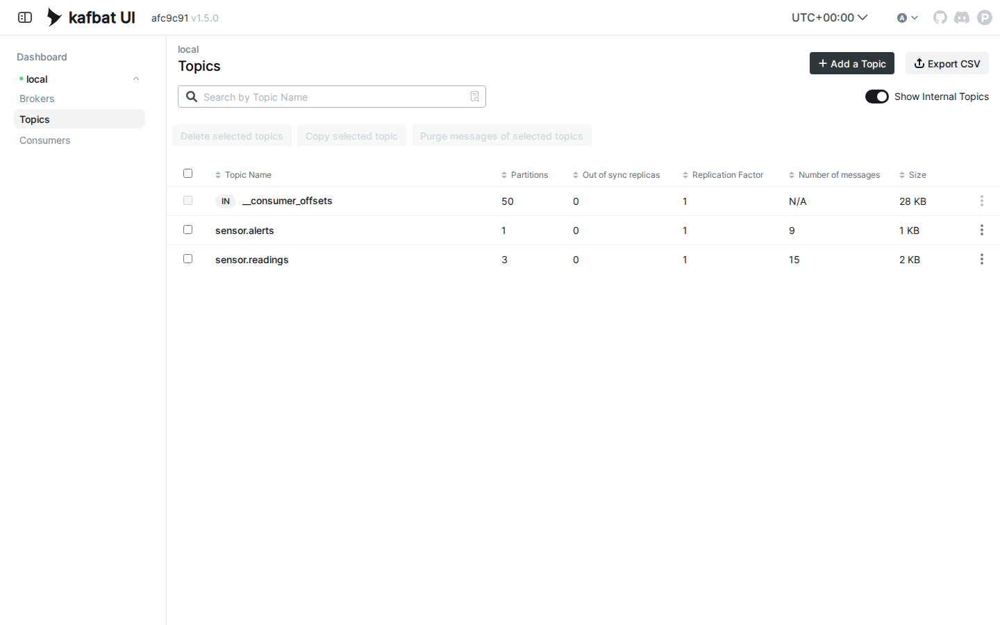
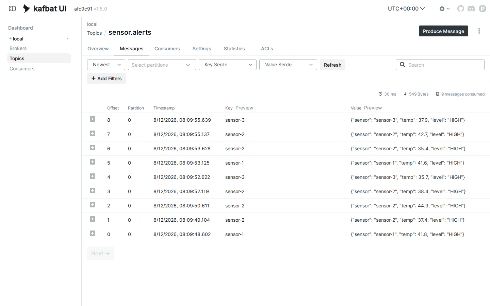

# LAB 5 — Mini Event Pipeline (JSON) : sensor → processor → alert center

> โฟลเดอร์ `005_LAB_Event_Pipeline` = **LAB 5** ในสไลด์ `Kafka_Slides.html`
> (แล็บนี้มีไฟล์โค้ด 3 ไฟล์ : `sensor.py` · `processor.py` · `alert_center.py` + `requirements.txt`)

## สิ่งที่จะได้เรียนรู้
- แล็บปิดท้ายของชุด Kafka : ต่อโปรแกรม 3 ตัวเป็น **pipeline** ผ่าน topic 2 ตัว — `sensor.py` → `sensor.readings` → `processor.py` → `sensor.alerts` → `alert_center.py` — โดยที่ **ไม่มีโปรแกรมไหนรู้จักกันเลย**
- ส่งข้อมูลเป็น **JSON** : ฝั่งส่ง `dict → json.dumps → bytes` · ฝั่งรับ `bytes → json.loads → dict`
- โปรแกรมเดียวเป็น **ทั้ง consumer และ producer** (`processor.py`) — ท่ามาตรฐานของ microservice / stream processing
- convention ตั้งชื่อ topic **แบบมีจุดคั่น** (`sensor.readings` = ของอะไร.เหตุการณ์อะไร) ที่ใช้กันในงานจริง
- อ่าน `kafka-consumer-groups.sh` ให้เป็น : สอง group **คนละ topic** ต่างคนต่างเดิน · LAG = 0 คืออ่านทันหมดแล้ว
- ย้ำหัวใจของ Kafka รอบสุดท้าย : topic เป็น **append-only log** — alert ที่อ่านไปแล้ว **ไม่หาย** ใครมา replay ซ้ำก็ได้ (ต่างจาก RabbitMQ ที่ ack แล้วข้อความถูกลบออกจาก queue)
- **scale ตัวประมวลผล** ด้วยการเปิด `processor.py` เพิ่มอีกตัวใน group เดิม — Kafka แบ่ง partition ให้เองอัตโนมัติ

## ภาพรวมของแล็บนี้
1. **เปิดเครื่องเรียน + Kafka broker + Kafka UI** — เหมือนทุกแล็บ รอบรรทัด `Kafka Server started` ก่อน
2. **สร้าง topic 2 เส้นทาง** — `sensor.readings` (3 partitions) รับค่าดิบ · `sensor.alerts` (1 partition) รับเฉพาะเรื่องด่วน
3. **เปิดปลายทางก่อน** — `alert_center.py` นั่งรอเงียบ ๆ ทั้งที่ต้นทางยังไม่มีอะไรเลย
4. **เปิดตัวประมวลผล** — `processor.py` อ่านค่าดิบ + ส่งต่อ alert : เป็นทั้งผู้อ่านและผู้ส่งในตัวเดียว
5. **รัน `sensor.py` ยิงค่า 15 ค่า** — เห็น event ไหลผ่านครบสามด่านสด ๆ : 15 readings → **9 alerts**
6. **ส่อง consumer groups** — `processors` กับ `alert-center` อยู่คนละ topic · LAG = 0 ทั้งคู่
7. **ดูทั้ง pipeline ใน Kafka UI** — จำนวนข้อความของสอง topic + เปิดอ่าน JSON ใน `sensor.alerts`
8. **Replay ปิดท้าย** — console consumer อ่าน alert ทั้ง 9 ซ้ำจาก offset 0 โดยไม่แก้โค้ดสักบรรทัด

```
sensor.py ──▶ [ sensor.readings · 3 partitions ] ──▶ processor.py ──▶ [ sensor.alerts · 1 partition ] ──▶ alert_center.py
  (ผู้ส่ง)              topic ค่าดิบทุกค่า          (คัดเฉพาะ temp ≥ 35.0)      topic เฉพาะเรื่องด่วน          (ผู้รับปลายทาง)
```
---

## 0. เตรียมเครื่องเรียน
ทำบนเครื่องของเราเอง (ไม่ใช้ cloud) — เปิด container ที่ติดตั้ง Docker มาให้แล้ว

```bash
docker rm -f devtools
docker run -dit --name devtools --privileged -p 2222:22 tuchsanai/devtools:2569_1
ssh root@localhost -p 2222        # password : passwd
```
> 📝 **คำอธิบาย:** สามบรรทัดนี้คือการ "เปิดเครื่องเรียน" ให้ทุกคนได้สภาพแวดล้อมเหมือนกันเป๊ะ · `docker rm -f devtools` ลบกล่องเรียนตัวเก่าทิ้งก่อนกันชื่อซ้ำ (`-f` = force ลบได้แม้ยังทำงานอยู่) ·
> `-dit` คือ `-d` รันเบื้องหลัง + `-i` เปิด stdin ค้างไว้ + `-t` ให้มี terminal กล่องจะได้ไม่ดับทันที · `--privileged` ให้สิทธิ์เต็มเพื่อรัน **Docker ซ้อนข้างในกล่อง** (จำเป็น — broker Kafka ของแล็บนี้เป็น container ที่รันอยู่ข้างในเครื่องเรียนอีกที) ·
> `-p 2222:22` ส่ง port 2222 ของเครื่องเรา เข้า port 22 (SSH) ของกล่อง

> ใน VS Code ใช้ **Remote-SSH** ต่อไปที่ `root@localhost:2222` แล้วทำแล็บทั้งหมดข้างใน — หน้าเว็บ Kafka UI ของแล็บนี้จะ forward port `8080` ที่แท็บ PORTS ของ VS Code (ทำในข้อ 9)

ตรวจว่าพร้อมใช้งาน :

```bash
docker --version
docker compose version
```
> 📝 **คำอธิบาย:** ถามเวอร์ชันของ Docker Engine และ Compose เพื่อ **ยืนยันว่าคำสั่ง `docker` วิ่งถึง daemon ได้จริง** ก่อนเริ่มแล็บ · สิ่งที่ต้องดูคือ "มีเลขเวอร์ชันขึ้นมาไหม" ไม่ใช่ "เลขตรงกับเอกสารไหม" ·
> ถ้าขึ้น `Cannot connect to the Docker daemon` แปลว่ายังอยู่นอกกล่องเรียนหรือ daemon ยังไม่ขึ้น ให้ย้อนทำข้อ 0 ใหม่

✅ **Expected output** — ขอแค่มี **เลขเวอร์ชัน** ขึ้นครบสองบรรทัด ไม่ใช่ error (เลขเวอร์ชันของแต่ละคนอาจไม่ตรงกับเอกสารนี้):
```
Docker version 29.6.2, build dfc4efb
Docker Compose version v5.3.1
```

---

## 1. Clone โค้ดแล็บ
```bash
mkdir -p ~/labwork && cd ~/labwork
git clone https://github.com/Tuchsanai/DevTools.git
cd DevTools/07_Kafka/005_LAB_Event_Pipeline
```
> 📝 **คำอธิบาย:** `mkdir -p ~/labwork` สร้างโฟลเดอร์เก็บงาน (`-p` = มีอยู่แล้วก็ไม่ error) · `git clone` ดึงรีโพของวิชาลงมา — ถ้าเคย clone ตอนทำ LAB 1–4 แล้ว git จะบอกว่าโฟลเดอร์ไม่ว่าง ข้ามไป `cd` ได้เลย ·
> ในโฟลเดอร์นี้มีตัวละครทั้งสามของ pipeline รออยู่แล้ว : `sensor.py` (ผู้ส่ง) · `processor.py` (ตัวกลาง) · `alert_center.py` (ปลายทาง) กับ `requirements.txt`

---

## 2. เปิด Kafka Broker + Kafka UI
```bash
docker rm -f kafka kafka-ui 2>/dev/null
docker run -d --name kafka -p 9092:9092 apache/kafka:4.1.0
```
> 📝 **คำอธิบาย:** บรรทัดแรกลบ broker กับหน้าเว็บตัวเก่าทิ้งก่อนกันชื่อซ้ำ (`2>/dev/null` โยน error ทิ้งถ้าไม่มีตัวเก่า) · `docker run -d` รัน broker เบื้องหลัง · `--name kafka` ตั้งชื่อไว้เรียกกับ `docker logs` / `docker exec` ·
> `-p 9092:9092` เปิด port **Kafka protocol** ให้โปรแกรม Python ต่อเข้า (ค่า default ของ image ประกาศตัวเองเป็น `localhost:9092` — ตรงกับที่โค้ดของเราใช้พอดี) · `apache/kafka:4.1.0` คือ image ทางการของ Apache ล็อกเวอร์ชันให้ตรงกันทั้งห้อง — Kafka รุ่น 4.x ใช้โหมด **KRaft** จึงจบใน container เดียว ไม่ต้องมี ZooKeeper

✅ **Expected output** — ถ้าเคยทำ LAB 1–4 แล้ว image อยู่ในเครื่อง จะเหลือแค่ **container ID บรรทัดสุดท้าย** · ถ้ารันครั้งแรก Docker จะ pull ให้ก่อน (layer ID · digest ของแต่ละคนจะไม่ตรงกับเอกสารนี้):
```
Unable to find image 'apache/kafka:4.1.0' locally
4.1.0: Pulling from apache/kafka
1e7ff3c422db: Pulling fs layer
        ... (รวม 11 layer · Pulling fs layer → Download complete → Pull complete ทีละ layer) ...
Digest: sha256:bff074a5d0051dbc0bbbcd25b045bb1fe84833ec0d3c7c965d1797dd289ec88f
Status: Downloaded newer image for apache/kafka:4.1.0
995e1545cd615abf48721c132eae5bb0ba61f76ae3339a8e0b9ca00c62108962
```

ดูว่า broker ขึ้นมาแล้วจริง แล้วรอให้ **พร้อมรับงาน** :

```bash
docker ps
docker logs kafka --tail 6
```
> 📝 **คำอธิบาย:** `docker ps` ต้องเห็น STATUS เป็น `Up ...` พร้อม mapping `0.0.0.0:9092->9092/tcp` · แต่ `Up` ไม่ได้แปลว่าพร้อม — ต้องดู log จนเจอบรรทัด **`Kafka Server started`** (Kafka บูตเร็วกว่า RabbitMQ มาก ราว 5 วินาทีก็มา) ·
> ถ้ายังไม่เห็น รอ 2–3 วินาทีแล้วรันซ้ำ · แถม log ยังบอก `Kafka version: 4.1.0` ยืนยันเวอร์ชันจริงที่รันอยู่

✅ **Expected output** — จุดชี้ขาดคือบรรทัดสุดท้าย `Kafka Server started` (ID · วันเวลา · ตัวเลขของแต่ละคนจะไม่ตรงกับเอกสารนี้):
```
CONTAINER ID   IMAGE                COMMAND                  CREATED          STATUS          PORTS                                         NAMES
995e1545cd61   apache/kafka:4.1.0   "/__cacert_entrypoin…"   24 seconds ago   Up 23 seconds   0.0.0.0:9092->9092/tcp, [::]:9092->9092/tcp   kafka
```

```
[2026-08-12 08:06:19,262] INFO [BrokerServer id=1] Finished waiting for all of the SocketServer Acceptors to be started (kafka.server.BrokerServer)
[2026-08-12 08:06:19,262] INFO [BrokerServer id=1] Transition from STARTING to STARTED (kafka.server.BrokerServer)
[2026-08-12 08:06:19,262] INFO Kafka version: 4.1.0 (org.apache.kafka.common.utils.AppInfoParser)
[2026-08-12 08:06:19,262] INFO Kafka commitId: 13f70256db3c994c (org.apache.kafka.common.utils.AppInfoParser)
[2026-08-12 08:06:19,262] INFO Kafka startTimeMs: 1786521979262 (org.apache.kafka.common.utils.AppInfoParser)
[2026-08-12 08:06:19,263] INFO [KafkaRaftServer nodeId=1] Kafka Server started (kafka.server.KafkaRaftServer)
```

broker พร้อมแล้ว — เปิด **Kafka UI** (หน้าเว็บให้คนดู) ต่อเลย :

```bash
docker run -d --name kafka-ui --network host \
  -e KAFKA_CLUSTERS_0_NAME=local \
  -e KAFKA_CLUSTERS_0_BOOTSTRAPSERVERS=localhost:9092 \
  kafbat/kafka-ui:latest
```
> 📝 **คำอธิบาย:** Kafka ไม่มีหน้าเว็บฝังมากับ broker แบบ RabbitMQ — ใช้ **Kafbat UI** เป็น container แยกอีกใบ · `--network host` ให้ UI ใช้ network เดียวกับเครื่องเรียนตรง ๆ มันเลยต่อ `localhost:9092` ถึง broker ได้ และหน้าเว็บโผล่ที่ port `8080` โดยไม่ต้อง `-p` ·
> `-e KAFKA_CLUSTERS_0_NAME=local` ตั้งชื่อ cluster ที่จะโชว์ในหน้าเว็บ · `-e KAFKA_CLUSTERS_0_BOOTSTRAPSERVERS=localhost:9092` บอกว่า broker อยู่ที่ไหน · เดี๋ยวข้อ 9 ค่อยเปิดดู — ตอนนี้ปล่อยให้มันบูตไปเงียบ ๆ ก่อน

✅ **Expected output** — pull ครั้งแรกแล้วปิดท้ายด้วย container ID (digest · ID ของแต่ละคนจะไม่ตรงกับเอกสารนี้):
```
        ... (pull image ครั้งแรก · Pulling fs layer → Pull complete หลายบรรทัด) ...
Digest: sha256:7cda86a33344160309fdb65146332e4da65db81a945614f2fe32e210803f6fd1
Status: Downloaded newer image for kafbat/kafka-ui:latest
038f104246ec3b38d8f4b0b843615f539000eb88efc53fe8a47297e4ba059f3d
```
> **จำสอง port ให้ขึ้นใจ (เหมือนคู่ 5672/15672 ของ RabbitMQ) :** `9092` = Kafka protocol ให้ **โปรแกรม** คุย · `8080` = Kafka UI ให้ **คน** ดู

---

## 3. สร้าง Topic สองเส้นทางของ Pipeline
```bash
docker exec kafka /opt/kafka/bin/kafka-topics.sh --bootstrap-server localhost:9092 \
  --create --topic sensor.readings --partitions 3
docker exec kafka /opt/kafka/bin/kafka-topics.sh --bootstrap-server localhost:9092 \
  --create --topic sensor.alerts --partitions 1
```
> 📝 **คำอธิบาย:** CLI ของ Kafka อยู่ **ข้างใน container `kafka`** ที่ `/opt/kafka/bin/` จึงสั่งผ่าน `docker exec` เสมอ (ท่าเดียวกับ `rabbitmqctl` ในชุดที่แล้ว) · `--create --topic <ชื่อ>` สร้าง topic · `--partitions 3` แบ่ง `sensor.readings` เป็น 3 ช่องรับค่าดิบจาก sensor 3 ตัว (key = ชื่อ sensor → ค่าของตัวเดิมเรียงลำดับกันเสมอ — บทเรียน LAB 2) ·
> ส่วน `sensor.alerts` ให้ **1 partition พอ** — เรื่องด่วนมีน้อยและอยากได้ **ลำดับรวมชัด ๆ เส้นเดียว** ให้ศูนย์เตือนภัยอ่าน ·
> สังเกตชื่อ topic แบบ **มีจุดคั่น** `<ของอะไร>.<เหตุการณ์อะไร>` — convention ที่นิยมในงานจริง (แบบเดียวกับ `orders.created` · `payments.failed`) มองปุ๊บรู้ปั๊บว่าข้างในเก็บ event อะไร — คนละเรื่องกับ wildcard ของ RabbitMQ นะ : ใน Kafka จุดเป็นแค่ตัวอักษรในชื่อ ไม่มีการ match pattern ใด ๆ

✅ **Expected output** — `Created topic ...` ครบทั้งสองตัว · บรรทัด WARNING เป็นคำเตือนมาตรฐานของ Kafka ว่า "อย่าใช้จุด (`.`) ปนกับ underscore (`_`)" ในระบบเดียวกันเพราะชื่อ metric ภายในจะชนกันได้ — ชุดแล็บเราใช้จุดล้วน ๆ จึงไม่มีปัญหา:
```
WARNING: Due to limitations in metric names, topics with a period ('.') or underscore ('_') could collide. To avoid issues it is best to use either, but not both.
Created topic sensor.readings.
WARNING: Due to limitations in metric names, topics with a period ('.') or underscore ('_') could collide. To avoid issues it is best to use either, but not both.
Created topic sensor.alerts.
```

ตรวจโครงสร้างทั้งสอง topic :

```bash
docker exec kafka /opt/kafka/bin/kafka-topics.sh --bootstrap-server localhost:9092 \
  --describe --topic sensor.readings
docker exec kafka /opt/kafka/bin/kafka-topics.sh --bootstrap-server localhost:9092 \
  --describe --topic sensor.alerts
```
> 📝 **คำอธิบาย:** `--describe` แสดงโครงจริงบน broker : `PartitionCount` ต้องเป็น **3** กับ **1** ตามที่สั่ง · แต่ละ partition มีบรรทัดของตัวเอง `Leader: 1` = โหนดหมายเลข 1 (เครื่องเรามีโหนดเดียว) · `ReplicationFactor: 1` = ไม่มีสำเนาสำรอง (พอสำหรับแล็บ — งานจริงใช้ 3)

✅ **Expected output** — `sensor.readings` มี Partition 0/1/2 สามบรรทัด · `sensor.alerts` มีบรรทัดเดียว (TopicId ของแต่ละคนจะไม่ตรงกับเอกสารนี้):
```
Topic: sensor.readings	TopicId: Y1o3ZPlqSISCmYIcya0VPw	PartitionCount: 3	ReplicationFactor: 1	Configs: min.insync.replicas=1,segment.bytes=1073741824
	Topic: sensor.readings	Partition: 0	Leader: 1	Replicas: 1	Isr: 1	Elr: 	LastKnownElr: 
	Topic: sensor.readings	Partition: 1	Leader: 1	Replicas: 1	Isr: 1	Elr: 	LastKnownElr: 
	Topic: sensor.readings	Partition: 2	Leader: 1	Replicas: 1	Isr: 1	Elr: 	LastKnownElr: 
Topic: sensor.alerts	TopicId: 2IDaOqCTRjeGkUfkmGeeqA	PartitionCount: 1	ReplicationFactor: 1	Configs: min.insync.replicas=1,segment.bytes=1073741824
	Topic: sensor.alerts	Partition: 0	Leader: 1	Replicas: 1	Isr: 1	Elr: 	LastKnownElr: 
```

---

## 4. เตรียม Python : venv + kafka-python
```bash
python3 -m venv ~/venv-kafka
source ~/venv-kafka/bin/activate
pip install kafka-python==3.0.10
```
> 📝 **คำอธิบาย:** เครื่องเรียนบล็อก `pip install` ตรง ๆ ตามกติกา **PEP 668** จึงต้องมี **virtual environment** · `python3 -m venv ~/venv-kafka` สร้างไว้ที่ home (ถ้าเคยสร้างตอน LAB 1–4 แล้ว รันซ้ำได้ ไม่พัง) · `source ~/venv-kafka/bin/activate` เปิดใช้ — prompt ต้องขึ้น `(venv-kafka)` นำหน้า ·
> `pip install kafka-python==3.0.10` ติดตั้งไลบรารี client ของ Kafka ล็อกเวอร์ชันให้ตรงกันทั้งห้อง (ตรงกับ `requirements.txt` — จะใช้ `pip install -r requirements.txt` แทนก็ได้ · ถ้าติดตั้งแล้วจะขึ้น `Requirement already satisfied` ใช้ต่อได้เลย)

✅ **Expected output** — บรรทัดสุดท้ายต้องเป็น `Successfully installed kafka-python-3.0.10` (ความเร็วดาวน์โหลดของแต่ละคนจะไม่ตรงกับเอกสารนี้):
```
Collecting kafka-python==3.0.10
  Downloading kafka_python-3.0.10-py3-none-any.whl.metadata (11 kB)
Downloading kafka_python-3.0.10-py3-none-any.whl (614 kB)
   ━━━━━━━━━━━━━━━━━━━━━━━━━━━━━━━━━━━━━━━━ 614.2/614.2 kB 6.9 MB/s eta 0:00:00
Installing collected packages: kafka-python
Successfully installed kafka-python-3.0.10
```
> **⚠️ กติกาสำคัญ :** แล็บนี้ใช้ **3 หน้าต่าง terminal พร้อมกัน** (+1 ในทดลองเพิ่มเติม) — ทุกหน้าต่างใหม่ต้อง `source ~/venv-kafka/bin/activate` ก่อนเสมอ ไม่งั้นเจอ `ModuleNotFoundError: No module named 'kafka'` · เช็กง่าย ๆ : prompt มี `(venv-kafka)` นำหน้า = พร้อม

---

## 5. เปิดปลายทางก่อน — `alert_center.py` (หน้าต่างที่ 2)
หลักการต่อ pipeline : **เปิดจากปลายน้ำย้อนขึ้นไปต้นน้ำ** — ผู้รับพร้อมก่อน แล้วค่อยปล่อยของไหลมา · ดูโค้ดปลายทางก่อน :

```python
import json
import sys
from kafka import KafkaConsumer

def main():
    # 1) ปลายทางของ pipeline : อ่านเฉพาะ topic 'sensor.alerts'
    #    ไม่ต้องรู้เลยว่าต้นทางมีกี่ sensor หรือ processor คิดยังไง — decoupling เต็มรูปแบบ
    consumer = KafkaConsumer('sensor.alerts',
                             bootstrap_servers='localhost:9092',
                             group_id='alert-center',
                             auto_offset_reset='earliest')

    print(' [*] Alert center waiting. To exit press CTRL+C')

    for message in consumer:
        # 2) แปลง JSON กลับเป็น dict แล้วประกาศเตือน
        alert = json.loads(message.value.decode())
        print(f" [!] 🚨 {alert['sensor']} ร้อนผิดปกติ! temp={alert['temp']} "
              f"(level={alert['level']})")

if __name__ == '__main__':
    try:
        main()
    except KeyboardInterrupt:
        print('Interrupted')
        sys.exit(0)
```
> 📝 **คำอธิบาย:** ไฟล์นี้สั้นที่สุดในสามตัว — และนั่นคือประเด็น · **(1)** สมัครอ่าน `sensor.alerts` ในนาม group `alert-center` — มันรู้จักแค่ **ชื่อ topic เดียว** ไม่รู้ (และไม่ต้องรู้) ว่าใครเขียนใส่ ต้นน้ำมี sensor กี่ตัว processor ใช้เกณฑ์อะไร — จะเปลี่ยนทั้งครึ่งบนของ pipeline ไฟล์นี้ก็ไม่ต้องแก้สักบรรทัด ·
> `auto_offset_reset='earliest'` = group ใหม่ที่ยังไม่มี offset ให้เริ่มอ่านจากต้น log · **(2)** ข้อความใน Kafka เป็น bytes — `decode()` เป็นสตริง แล้ว `json.loads` แปลงกลับเป็น dict ก่อนหยิบ field ไปใช้

เปิด **หน้าต่างที่ 2** (`ssh root@localhost -p 2222` เข้ามาใหม่) แล้วรัน :

```bash
cd ~/labwork/DevTools/07_Kafka/005_LAB_Event_Pipeline    # พิธีของทุกหน้าต่างใหม่ : cd เข้าโฟลเดอร์แล็บ
source ~/venv-kafka/bin/activate                         # + เปิด venv ก่อนเสมอ
python alert_center.py
```
> 📝 **คำอธิบาย:** โปรแกรมค้างรออยู่ที่บรรทัด `waiting` — **ถูกต้องแล้ว** เพราะทั้งระบบยังไม่มีใครส่งอะไรเลย · ปล่อยหน้าต่างนี้ทิ้งไว้แบบนี้ตลอดแล็บ อย่าเพิ่งกด Ctrl+C

✅ **Expected output** — ขึ้นบรรทัดเดียวแล้วค้างรอ:
```
 [*] Alert center waiting. To exit press CTRL+C
        ^ ค้างอยู่ตรงนี้ — ปลายทางออนไลน์แล้ว รอเรื่องด่วนแรกเข้ามา
```

---

## 6. เปิดตัวประมวลผล — `processor.py` (หน้าต่างที่ 3)
ตัวกลางของ pipeline — **จุดสอนหลักของแล็บนี้** :

```python
import json
import sys
from kafka import KafkaConsumer, KafkaProducer

# เกณฑ์แจ้งเตือน : อุณหภูมิตั้งแต่ 35.0 °C ขึ้นไปถือว่า "ร้อนผิดปกติ"
THRESHOLD = 35.0

def main():
    # 1) โปรแกรมนี้เป็น "ทั้งผู้อ่านและผู้ส่ง" ในตัวเดียว — ท่ามาตรฐานของ microservice
    #    ฝั่งอ่าน : สมัครอ่าน topic 'sensor.readings' ในนาม group 'processors'
    consumer = KafkaConsumer('sensor.readings',
                             bootstrap_servers='localhost:9092',
                             group_id='processors',
                             auto_offset_reset='earliest')

    #    ฝั่งส่ง : เตรียม producer ไว้ส่งผลไป topic 'sensor.alerts'
    producer = KafkaProducer(bootstrap_servers='localhost:9092')

    print(f' [*] Processor waiting (alert เมื่อ temp >= {THRESHOLD}). To exit press CTRL+C')

    for message in consumer:
        # 2) bytes → JSON → dict แล้วตรวจค่า
        reading = json.loads(message.value.decode())
        temp = reading['temp']

        if temp >= THRESHOLD:
            # 3) ร้อนเกินเกณฑ์ → สร้าง event แจ้งเตือน ส่งต่อเข้า topic 'sensor.alerts'
            alert = {'sensor': reading['sensor'], 'temp': temp, 'level': 'HIGH'}
            producer.send('sensor.alerts',
                          key=reading['sensor'].encode(),
                          value=json.dumps(alert).encode()).get(timeout=10)
            print(f" [!] ALERT {reading['sensor']} temp={temp} -> ส่งต่อเข้า sensor.alerts")
        else:
            # 4) ค่าปกติ → แค่รับทราบ ไม่ส่งต่อ
            print(f" [x] OK    {reading['sensor']} temp={temp}")

if __name__ == '__main__':
    try:
        main()
    except KeyboardInterrupt:
        print('Interrupted')
        sys.exit(0)
```
> 📝 **คำอธิบาย:** ไล่ตามเลขในคอมเมนต์ · **(1)** บรรทัดเปิดตัวมีทั้ง `KafkaConsumer` **และ** `KafkaProducer` ในโปรแกรมเดียว — ฝั่งอ่านสมัคร `sensor.readings` ในนาม group `processors` · ฝั่งส่งเตรียมท่อไป `sensor.alerts` — โปรแกรมที่ "อ่านจาก topic หนึ่ง แปลงร่าง แล้วเขียนลงอีก topic" คือหน่วยพื้นฐานของ **microservice chain** : ต่อกันกี่ทอดก็ได้โดยแต่ละทอดไม่ต้องรู้จักกัน ·
> **(2)** แกะ bytes → dict แล้วหยิบ `temp` มาตรวจกับ `THRESHOLD` · **(3)** ถ้าร้อนเกิน — **สร้าง event ใหม่** (ไม่ใช่ส่งต่อก้อนเดิม : เพิ่ม `level` และตัด `round` ทิ้ง เหลือเฉพาะที่ปลายทางต้องใช้) แล้วส่งเข้า `sensor.alerts` โดยใช้ key เป็นชื่อ sensor เหมือนเดิม · `.get(timeout=10)` รอ broker ยืนยันก่อนไปต่อ ·
> **(4)** ค่าปกติแค่พิมพ์ `OK` ทิ้งไว้เป็นหลักฐาน — **ไม่ส่งต่อ** : ตัวกรองแบบนี้ทำให้ topic ปลายทางเหลือแต่เรื่องที่สำคัญจริง

เปิด **หน้าต่างที่ 3** แล้วรัน (อย่าลืมพิธี `cd` + activate) :

```bash
cd ~/labwork/DevTools/07_Kafka/005_LAB_Event_Pipeline
source ~/venv-kafka/bin/activate
python processor.py
```

✅ **Expected output** — ค้างรอเหมือนกัน · ตอนนี้ครึ่งล่างของ pipeline พร้อมหมดแล้ว เหลือแค่เปิดก๊อกต้นน้ำ:
```
 [*] Processor waiting (alert เมื่อ temp >= 35.0). To exit press CTRL+C
```

---

## 7. เปิดก๊อกต้นน้ำ — `sensor.py` (หน้าต่างที่ 1)
```python
import json
import random
import sys
import time
from kafka import KafkaProducer

# ล็อกผลการสุ่มให้ตรงกับเอกสารแล็บ — อยากได้ค่าสุ่มจริง ให้ลบบรรทัดนี้ทิ้ง
random.seed(2569)

# 1) ต่อ broker
producer = KafkaProducer(bootstrap_servers='localhost:9092')

# 2) จำนวนรอบที่จะวัด — ใส่เป็น argument ได้ เช่น `python sensor.py 15` (ไม่ใส่ = 15)
rounds = int(sys.argv[1]) if len(sys.argv) > 1 else 15

# 3) จำลอง sensor วัดอุณหภูมิ 3 ตัว ส่งค่าเป็น JSON เข้า topic 'sensor.readings'
#    ใช้ key = ชื่อ sensor → ค่าของ sensor ตัวเดิมเรียงลำดับกันเสมอ (บทเรียน LAB 2)
sensors = ['sensor-1', 'sensor-2', 'sensor-3']
for i in range(rounds):
    sensor = sensors[i % 3]
    reading = {
        'sensor': sensor,
        'temp': round(random.uniform(20.0, 45.0), 1),   # อุณหภูมิ 20.0–45.0 °C
        'round': i // 3 + 1,
    }
    # 4) dict → ข้อความ JSON → bytes แล้วค่อยส่ง (ผู้รับจะแปลงกลับด้วย json.loads)
    producer.send('sensor.readings',
                  key=sensor.encode(),
                  value=json.dumps(reading).encode()).get(timeout=10)
    print(f" [x] Sent {reading}")
    time.sleep(0.5)   # เว้นจังหวะเหมือน sensor วัดค่าเป็นระยะ

producer.close()
```
> 📝 **คำอธิบาย:** บรรทัด **`random.seed(2569)`** สำคัญกับเอกสารนี้มาก : มันล็อกลำดับเลขสุ่มให้ **เหมือนกันทุกเครื่องทุกครั้ง** — ค่าอุณหภูมิ 15 ค่าที่เห็นด้านล่างนี้ **ของทุกคนจะตรงกับเอกสารเป๊ะ** ทั้งหมด (นี่ไม่ใช่ความบังเอิญ — ทดลองเพิ่มเติม ข. จะพาไปดูว่าถ้าลบบรรทัดนี้จะเกิดอะไรขึ้น) ·
> **(2)** argument ตัวแรกคือจำนวนข้อความ (ไม่ใส่ = 15 → sensor 3 ตัว ตัวละ 5 รอบ) · **(3)** วนส่งสลับ `sensor-1 → sensor-2 → sensor-3` โดยใช้ **key = ชื่อ sensor** — key เดิมลง partition เดิมเสมอ ลำดับค่าของ sensor แต่ละตัวจึงไม่มีวันสลับ (LAB 2) ·
> **(4)** ท่าส่ง JSON มาตรฐาน : `dict → json.dumps → encode()` ได้ bytes แล้วค่อยยัดใส่ `producer.send` · `time.sleep(0.5)` หน่วงครึ่งวินาทีให้ตาไล่ทันสามหน้าต่าง

กลับมา **หน้าต่างที่ 1** (อยู่ในโฟลเดอร์แล็บ + venv เปิดอยู่แล้วจากข้อ 4) — **จัดหน้าจอให้เห็นทั้ง 3 หน้าต่างพร้อมกัน** แล้วรัน :

```bash
python sensor.py
```
> 📝 **คำอธิบาย:** ใช้เวลาราว 8 วินาที (15 ข้อความ × 0.5 s) — ระหว่างรันให้มองสามหน้าต่างไล่จากซ้ายไปขวา : หน้าต่างนี้ขึ้น `Sent` → หน้าต่างที่ 3 ขึ้น `OK`/`ALERT` แทบพร้อมกัน → และ **เฉพาะตัวที่ ALERT** เด้งต่อไปโผล่เป็น 🚨 ที่หน้าต่างที่ 2 · จบแล้วโปรแกรมปิดตัวเอง ได้ prompt คืน

✅ **Expected output** — หน้าต่างที่ 1 : 15 บรรทัด **ค่าตรงกับเอกสารนี้เป๊ะทุกตัว** (ฝีมือ `random.seed(2569)`):
```
 [x] Sent {'sensor': 'sensor-1', 'temp': 41.8, 'round': 1}
 [x] Sent {'sensor': 'sensor-2', 'temp': 37.4, 'round': 1}
 [x] Sent {'sensor': 'sensor-3', 'temp': 33.4, 'round': 1}
 [x] Sent {'sensor': 'sensor-1', 'temp': 21.8, 'round': 2}
 [x] Sent {'sensor': 'sensor-2', 'temp': 44.9, 'round': 2}
 [x] Sent {'sensor': 'sensor-3', 'temp': 20.2, 'round': 2}
 [x] Sent {'sensor': 'sensor-1', 'temp': 28.0, 'round': 3}
 [x] Sent {'sensor': 'sensor-2', 'temp': 38.4, 'round': 3}
 [x] Sent {'sensor': 'sensor-3', 'temp': 35.7, 'round': 3}
 [x] Sent {'sensor': 'sensor-1', 'temp': 41.6, 'round': 4}
 [x] Sent {'sensor': 'sensor-2', 'temp': 35.4, 'round': 4}
 [x] Sent {'sensor': 'sensor-3', 'temp': 34.7, 'round': 4}
 [x] Sent {'sensor': 'sensor-1', 'temp': 21.5, 'round': 5}
 [x] Sent {'sensor': 'sensor-2', 'temp': 42.7, 'round': 5}
 [x] Sent {'sensor': 'sensor-3', 'temp': 37.9, 'round': 5}
```

✅ **Expected output** — **หน้าต่างที่ 3** (`processor.py`) ตัดสินครบทั้ง 15 ค่า : **9 ALERT + 6 OK** — นับดูได้ ค่าที่ ≥ 35.0 ถูกส่งต่อทุกตัว:
```
 [*] Processor waiting (alert เมื่อ temp >= 35.0). To exit press CTRL+C
 [!] ALERT sensor-1 temp=41.8 -> ส่งต่อเข้า sensor.alerts
 [!] ALERT sensor-2 temp=37.4 -> ส่งต่อเข้า sensor.alerts
 [x] OK    sensor-3 temp=33.4
 [x] OK    sensor-1 temp=21.8
 [!] ALERT sensor-2 temp=44.9 -> ส่งต่อเข้า sensor.alerts
 [x] OK    sensor-3 temp=20.2
 [x] OK    sensor-1 temp=28.0
 [!] ALERT sensor-2 temp=38.4 -> ส่งต่อเข้า sensor.alerts
 [!] ALERT sensor-3 temp=35.7 -> ส่งต่อเข้า sensor.alerts
 [!] ALERT sensor-1 temp=41.6 -> ส่งต่อเข้า sensor.alerts
 [!] ALERT sensor-2 temp=35.4 -> ส่งต่อเข้า sensor.alerts
 [x] OK    sensor-3 temp=34.7
 [x] OK    sensor-1 temp=21.5
 [!] ALERT sensor-2 temp=42.7 -> ส่งต่อเข้า sensor.alerts
 [!] ALERT sensor-3 temp=37.9 -> ส่งต่อเข้า sensor.alerts
```

✅ **Expected output** — **หน้าต่างที่ 2** (`alert_center.py`) ได้ **เฉพาะ 9 เรื่องด่วน** — ค่า OK ทั้ง 6 ไม่มีทางโผล่ที่นี่ เพราะ processor ไม่เคยส่งต่อ:
```
 [*] Alert center waiting. To exit press CTRL+C
 [!] 🚨 sensor-1 ร้อนผิดปกติ! temp=41.8 (level=HIGH)
 [!] 🚨 sensor-2 ร้อนผิดปกติ! temp=37.4 (level=HIGH)
 [!] 🚨 sensor-2 ร้อนผิดปกติ! temp=44.9 (level=HIGH)
 [!] 🚨 sensor-2 ร้อนผิดปกติ! temp=38.4 (level=HIGH)
 [!] 🚨 sensor-3 ร้อนผิดปกติ! temp=35.7 (level=HIGH)
 [!] 🚨 sensor-1 ร้อนผิดปกติ! temp=41.6 (level=HIGH)
 [!] 🚨 sensor-2 ร้อนผิดปกติ! temp=35.4 (level=HIGH)
 [!] 🚨 sensor-2 ร้อนผิดปกติ! temp=42.7 (level=HIGH)
 [!] 🚨 sensor-3 ร้อนผิดปกติ! temp=37.9 (level=HIGH)
```
> **ตามรอย 1 ข้อความให้สุดทาง :** ค่า `sensor-2 · 37.4` (ตัวที่สองของทั้งชุด) — ① `sensor.py` ห่อเป็น JSON `{'sensor': 'sensor-2', 'temp': 37.4, 'round': 1}` ส่งเข้า `sensor.readings` (key `sensor-2`) → ② `processor.py` อ่านเจอ เห็น `37.4 >= 35.0` จึง **สร้าง event ใหม่** `{'sensor': 'sensor-2', 'temp': 37.4, 'level': 'HIGH'}` (เพิ่ม `level` · ตัด `round` ทิ้ง) ส่งเข้า `sensor.alerts` → ③ `alert_center.py` อ่านมาประกาศ `🚨 sensor-2 ร้อนผิดปกติ! temp=37.4` ·
> ทั้งเส้นทางนี้ **ไม่มีโปรแกรมไหนเรียกหากันตรง ๆ เลย** — เจอกันผ่าน topic เท่านั้น ปิดตัวไหนตัวอื่นก็ยังอยู่ของมันได้

---

## 8. ส่องกลุ่มผู้อ่านทั้งระบบ — `kafka-consumer-groups.sh`
จอทั้งสองยังเปิดค้างอยู่ — กลับมา **หน้าต่างที่ 1** ถาม broker ว่าตอนนี้ใครอ่านอะไรถึงไหน :

```bash
docker exec kafka /opt/kafka/bin/kafka-consumer-groups.sh --bootstrap-server localhost:9092 \
  --all-groups --describe
```
> 📝 **คำอธิบาย:** `--all-groups --describe` รายงาน **ทุก group ในระบบ** ทีเดียว — pipeline ของเรามี 2 group อยู่ **คนละ topic** : `alert-center` เกาะ `sensor.alerts` · `processors` เกาะ `sensor.readings` ·
> คอลัมน์ที่ต้องอ่านให้เป็น : `CURRENT-OFFSET` = อ่านถึงไหนแล้ว · `LOG-END-OFFSET` = ปลาย log อยู่ที่ไหน · `LAG` = ค้างอ่านกี่ข้อความ — **LAG = 0 ทุกแถว คือทั้งระบบอ่านทันหมดแล้ว** (นี่คือตัวเลขที่ทีม ops ดูทุกวันในงานจริง)

✅ **Expected output** — สอง group สองตาราง (CONSUMER-ID ของแต่ละคนจะไม่ตรงกับเอกสารนี้):
```
GROUP           TOPIC           PARTITION  CURRENT-OFFSET  LOG-END-OFFSET  LAG             CONSUMER-ID                                              HOST            CLIENT-ID
alert-center    sensor.alerts   0          9               9               0               kafka-python-3.0.10-e11c912e-04db-45bc-9001-5f8a8a4764e7 /172.18.0.1     kafka-python-3.0.10

GROUP           TOPIC           PARTITION  CURRENT-OFFSET  LOG-END-OFFSET  LAG             CONSUMER-ID                                              HOST            CLIENT-ID
processors      sensor.readings 1          10              10              0               kafka-python-3.0.10-bad82bb8-2457-4532-9c5f-34fc1b447839 /172.18.0.1     kafka-python-3.0.10
processors      sensor.readings 2          5               5               0               kafka-python-3.0.10-bad82bb8-2457-4532-9c5f-34fc1b447839 /172.18.0.1     kafka-python-3.0.10
processors      sensor.readings 0          0               0               0               kafka-python-3.0.10-bad82bb8-2457-4532-9c5f-34fc1b447839 /172.18.0.1     kafka-python-3.0.10
```
> **อ่านตัวเลขให้สนุก :** `sensor.alerts` partition 0 มี **9** ข้อความ = จำนวน 🚨 พอดี · ฝั่ง `sensor.readings` รวม 10 + 5 + 0 = **15** ครบตามที่ส่ง แต่กระจายไม่เท่ากัน — Kafka เลือก partition จาก **hash ของ key** : บังเอิญ `sensor-1` กับ `sensor-2` hash ไปลง partition 1 คู่กัน (10 ข้อความ) ส่วน `sensor-3` ได้ partition 2 (5 ข้อความ) และ partition 0 **ว่างเปล่า** ·
> key น้อยตัว การกระจายก็ไม่สวยเป็นธรรมดา — สิ่งที่ Kafka สัญญาไม่ใช่ "แบ่งเท่ากัน" แต่คือ **key เดิมลงช่องเดิมเสมอ** (ลำดับต่อ sensor ไม่มีวันเพี้ยน) · เก็บภาพ partition นี้ไว้ให้ดี — ทดลองเพิ่มเติม ก. จะใช้มันเฉลยว่าใครได้งานเท่าไหร่

---

## 9. ดูทั้ง Pipeline ใน Kafka UI
หน้าเว็บ UI เปิดอยู่ที่ port `8080` **ข้างในเครื่องเรียน** — ต้องให้ VS Code forward port ออกมาก่อน :

1. เปิดแท็บ **PORTS** (แถวเดียวกับ TERMINAL)
2. กดปุ่ม **Forward a Port**
3. พิมพ์ `8080` แล้วกด **Enter**
4. เปิด `http://localhost:8080` ในเบราว์เซอร์ (หรือคลิกไอคอนลูกโลกในแถวของ port)


เข้ามาแล้วคลิกเมนู **Topics** ทางซ้าย — เห็นสอง topic ของ pipeline พร้อมตัวเลขที่เราเพิ่งนับด้วย CLI :



> 📝 **สิ่งที่ต้องดู:** แถว `sensor.readings` : Partitions **3** · Number of messages **15** — ค่าดิบครบทุกตัว · แถว `sensor.alerts` : Partitions **1** · Number of messages **9** — เฉพาะเรื่องด่วนที่ processor คัดแล้ว ·
> ตัวเลข 15 → 9 สองแถวนี้คือ **ภาพสรุปของ pipeline ทั้งเส้น** : เข้ามา 15 ผ่านตัวกรองเหลือ 9 · ส่วน `__consumer_offsets` (แถว IN = internal) คือ topic ภายในที่ broker ใช้จำ offset ของ group — LAB 3 เล่าไว้แล้ว ไม่ต้องยุ่งกับมัน

คลิก `sensor.alerts` → แท็บ **Messages** — เปิดอ่านเรื่องด่วนทั้ง 9 แบบเห็น JSON เต็ม ๆ :



> 📝 **สิ่งที่ต้องดู:** ตารางเรียง **ใหม่ → เก่า** : offset 8 (`sensor-3 · 37.9`) อยู่บนสุด ไล่ลงไปถึง offset 0 (`sensor-1 · 41.8`) — ครบ 9 แถวใน partition 0 เดียว · คอลัมน์ **Key** คือชื่อ sensor ที่ processor ใส่มา · คอลัมน์ **Value** เห็น JSON ชัด ๆ `{"sensor": ..., "temp": ..., "level": "HIGH"}` — สังเกตว่า **ไม่มี field `round`** เพราะ processor สร้าง event ใหม่ ไม่ใช่ก๊อบของเดิม ·
> ที่เปิดดูได้ทั้งที่ `alert_center` อ่านครบไปแล้ว (LAG 0) ก็เพราะ **log ไม่ลบของ** — ถ้าเป็น RabbitMQ ป่านนี้ queue ว่างเปล่าไปแล้ว

#### ทางเลือก : forward ด้วยคำสั่ง `ssh -L` (ไม่ใช้ VS Code)
```bash
ssh -L 8080:localhost:8080 root@localhost -p 2222        # password : passwd
```
> 📝 **คำอธิบาย:** `-L 8080:localhost:8080` เปิด port 8080 บนเครื่องเรา แล้วส่งทุก connection ผ่านท่อ ssh ไปโผล่ที่ `localhost:8080` ฝั่งเครื่องเรียน (ที่ Kafka UI ฟังอยู่) · `-p 2222` คือ port SSH ของเครื่องเรียน (คนละความหมายกับ `-p` ของ docker) · หน้าต่างนี้ต้องเปิดค้างไว้ — ปิดเมื่อไหร่ tunnel หายทันที

#### ทดลองเสร็จแล้ว — ลบ tunnel ทุกครั้ง
- แบบ VS Code : แท็บ **PORTS** → คลิกขวาที่ port `8080` → **Stop Forwarding Port**
- แบบ `ssh -L` : พิมพ์ `exit` (หรือกด `Ctrl+D`) ใน session นั้น — tunnel ปิดทันที

---

## 10. Replay ปิดท้าย — Alert ไม่หายไปไหน
`alert_center` อ่านครบ 9 ไปแล้ว (LAG = 0) — ใน RabbitMQ นาทีนี้คิวว่างเปล่า อ่านซ้ำไม่ได้อีก · แต่ Kafka ล่ะ? ที่ **หน้าต่างที่ 1** :

```bash
docker exec kafka /opt/kafka/bin/kafka-console-consumer.sh --bootstrap-server localhost:9092 \
  --topic sensor.alerts --from-beginning
```
> 📝 **คำอธิบาย:** console consumer คือผู้อ่านสำเร็จรูปใน CLI — ไม่ต้องเขียนโค้ดสักบรรทัด · `--from-beginning` สั่งอ่านตั้งแต่ **offset 0** ของ topic · มันไม่ได้ใส่ `--group` จึงเป็นผู้อ่านอิสระหน้าใหม่ — **ไม่กระทบ offset ของ `alert-center` เลย** ·
> อ่านครบแล้วโปรแกรมจะค้างรอข้อความถัดไป (พฤติกรรมปกติของ consumer) — กด **Ctrl+C** เพื่อจบ

✅ **Expected output** — เรื่องด่วนทั้ง **9 ข้อความยังอยู่ครบ** เรียงตาม offset 0 → 8 เป๊ะ · กด Ctrl+C แล้วได้บรรทัดสรุป:
```
{"sensor": "sensor-1", "temp": 41.8, "level": "HIGH"}
{"sensor": "sensor-2", "temp": 37.4, "level": "HIGH"}
{"sensor": "sensor-2", "temp": 44.9, "level": "HIGH"}
{"sensor": "sensor-2", "temp": 38.4, "level": "HIGH"}
{"sensor": "sensor-3", "temp": 35.7, "level": "HIGH"}
{"sensor": "sensor-1", "temp": 41.6, "level": "HIGH"}
{"sensor": "sensor-2", "temp": 35.4, "level": "HIGH"}
{"sensor": "sensor-2", "temp": 42.7, "level": "HIGH"}
{"sensor": "sensor-3", "temp": 37.9, "level": "HIGH"}
Processed a total of 9 messages
```
> **บทเรียนปิดชุด Kafka :** topic เป็น **append-only log** — การอ่านเป็นแค่การเลื่อน offset ของผู้อ่านแต่ละคน **ตัวข้อมูลไม่ถูกลบ** · วันหลังอยากเพิ่มระบบเก็บสถิติ alert ย้อนหลัง ก็แค่เขียน consumer ใหม่ใส่ group ใหม่มาอ่าน `sensor.alerts` ตั้งแต่ offset 0 — **ไม่ต้องแตะโค้ดเดิม ไม่ต้องขอให้ใครส่งซ้ำ** · นี่คือเหตุผลที่สถาปัตยกรรม event-driven สมัยใหม่สร้างบน Kafka

---

## ทดลองเพิ่มเติม
### ก. Scale ตัวประมวลผล — เปิด `processor.py` สองตัวช่วยกัน
ถ้าค่าดิบไหลมาเร็วกว่าที่ processor ตัวเดียวจะย่อยไหวล่ะ? — คำตอบของ Kafka : **เปิดตัวที่สองใน group เดิม** แล้ว broker จัดสรร partition ให้เอง (บทเรียน LAB 3 แต่คราวนี้เป็น microservice จริง ไม่ใช่ worker จำลอง) · ทุกจอเดิมเปิดค้างไว้ เปิด **หน้าต่างที่ 4** เพิ่ม :

```bash
cd ~/labwork/DevTools/07_Kafka/005_LAB_Event_Pipeline
source ~/venv-kafka/bin/activate
python processor.py
```

รอจอใหม่ขึ้น `waiting` สักครู่ (Kafka กำลัง **rebalance** แจก partition ใหม่) แล้วเช็กที่หน้าต่างที่ 1 ว่าใครถือ partition ไหน :

```bash
docker exec kafka /opt/kafka/bin/kafka-consumer-groups.sh --bootstrap-server localhost:9092 \
  --group processors --describe
```

✅ **Expected output** — group `processors` มี **CONSUMER-ID สองตัว** : ตัวใหม่รับ partition 0 กับ 1 ไป ตัวเดิมเหลือ partition 2 (การจับคู่ partition↔ตัวไหนของแต่ละคนอาจสลับกันได้ · ID ไม่ตรงกับเอกสารนี้แน่นอน):
```
GROUP           TOPIC           PARTITION  CURRENT-OFFSET  LOG-END-OFFSET  LAG             CONSUMER-ID                                              HOST            CLIENT-ID
processors      sensor.readings 1          10              10              0               kafka-python-3.0.10-a7dd1136-5a45-4450-8b63-ebe68978d444 /172.18.0.1     kafka-python-3.0.10
processors      sensor.readings 0          0               0               0               kafka-python-3.0.10-a7dd1136-5a45-4450-8b63-ebe68978d444 /172.18.0.1     kafka-python-3.0.10
processors      sensor.readings 2          5               5               0               kafka-python-3.0.10-bad82bb8-2457-4532-9c5f-34fc1b447839 /172.18.0.1     kafka-python-3.0.10
```

แล้วยิงค่าชุดใหม่จากหน้าต่างที่ 1 : `python sensor.py`

> 📝 **คำอธิบาย:** ⚠️ อย่าแปลกใจที่ **อุณหภูมิรอบนี้ซ้ำชุดเดิมเป๊ะ** (41.8 · 37.4 · 33.4 · ...) — `random.seed(2569)` ถูกตั้งใหม่ทุกครั้งที่รันโปรแกรม ลำดับเลขสุ่มจึงเริ่มนับหนึ่งใหม่เสมอ **ตั้งใจให้เป็นแบบนี้** เพื่อให้เทียบกับรอบแรกได้ตัวต่อตัว ·
> คราวนี้ดูสองจอ processor แข่งกัน : ข้อความ **ไม่ถูกประมวลผลซ้ำสองจอ** — แต่ละค่าไปจอเดียวตาม partition ที่จอนั้นถืออยู่

✅ **Expected output** — **หน้าต่างที่ 4** (จอใหม่ ถือ partition 0+1) ได้ `sensor-1` กับ `sensor-2` ไปทั้งคู่ = 10 ค่า (7 ALERT + 3 OK):
```
 [*] Processor waiting (alert เมื่อ temp >= 35.0). To exit press CTRL+C
 [!] ALERT sensor-1 temp=41.8 -> ส่งต่อเข้า sensor.alerts
 [!] ALERT sensor-2 temp=37.4 -> ส่งต่อเข้า sensor.alerts
 [x] OK    sensor-1 temp=21.8
        ... (สาย sensor-1 กับ sensor-2 สลับกันมา — รวม 10 บรรทัด : 7 ALERT + 3 OK) ...
 [!] ALERT sensor-2 temp=42.7 -> ส่งต่อเข้า sensor.alerts
```

✅ **Expected output** — **หน้าต่างที่ 3** (จอเดิม เหลือ partition 2) ได้เฉพาะสายของ `sensor-3` = 5 ค่า (2 ALERT + 3 OK) ต่อท้ายของเดิม:
```
 [x] OK    sensor-3 temp=33.4
 [x] OK    sensor-3 temp=20.2
 [!] ALERT sensor-3 temp=35.7 -> ส่งต่อเข้า sensor.alerts
 [x] OK    sensor-3 temp=34.7
 [!] ALERT sensor-3 temp=37.9 -> ส่งต่อเข้า sensor.alerts
```

ส่วน **หน้าต่างที่ 2** (`alert_center`) ได้ 🚨 เพิ่มอีก 9 ตัวเหมือนรอบแรกทุกประการ — ปลายทาง **ไม่รู้ด้วยซ้ำ** ว่าตอนนี้ตัวประมวลผลมีสองตัวแล้ว

> **บทเรียนสำคัญ :** ① scale โดย **ไม่แก้โค้ด ไม่แก้ config** — แค่เปิด process เพิ่มใน group เดิม ② การแบ่งงานยึดตาม **partition ไม่ใช่ข้อความ** : `sensor-1`/`sensor-2` อยู่ partition เดียวกัน (เห็นจากข้อ 8) เลยย้ายไปไหนก็ไปด้วยกันทั้งสาย — sensor ตัวเดิมไปจอเดิมเสมอ ลำดับต่อ sensor จึงยังศักดิ์สิทธิ์ ③ เปิดตัวที่ 4 ใน group นี้ก็ได้ แต่มันจะ **ว่างงาน** — partition มี 3 ช่อง คนเกินก็ได้แต่นั่งสำรอง (บทเรียน LAB 3) ·
> เสร็จแล้วกด **Ctrl+C ที่หน้าต่างที่ 4** ปิดจอที่เพิ่งเปิด (ขึ้น `Interrupted`) — partition ทั้งสามจะไหลกลับไปหาจอเดิมเองภายในไม่กี่วินาที

### ข. ลบ `random.seed(2569)` — ทำไมแล็บถึงล็อกเลขสุ่ม?
เปิด `sensor.py` แล้ว **ลบ (หรือ comment) บรรทัด `random.seed(2569)`** ทิ้ง จากนั้นส่งชุดสั้น ๆ 6 ค่า :

```bash
python sensor.py 6
```

✅ **Expected output** — คราวนี้เป็น **เลขสุ่มจริง** : ค่าของแต่ละคน (และแต่ละรอบที่รัน) **จะไม่ตรงกับเอกสารนี้อีกแล้ว** — ของเราออกมาแบบนี้:
```
 [x] Sent {'sensor': 'sensor-1', 'temp': 43.8, 'round': 1}
 [x] Sent {'sensor': 'sensor-2', 'temp': 33.4, 'round': 1}
 [x] Sent {'sensor': 'sensor-3', 'temp': 35.8, 'round': 1}
 [x] Sent {'sensor': 'sensor-1', 'temp': 23.1, 'round': 2}
 [x] Sent {'sensor': 'sensor-2', 'temp': 35.4, 'round': 2}
 [x] Sent {'sensor': 'sensor-3', 'temp': 39.9, 'round': 2}
```
> 📝 **คำอธิบาย:** จอ processor / alert center ที่ยังเปิดอยู่ก็ตัดสินชุดนี้ตามจริงเช่นกัน (รอบของเรามี 4 ค่าเกิน 35.0 → 🚨 สี่ตัว — ของแต่ละคนไม่เท่ากัน) · นี่แหละคำตอบว่า **seed มีไว้ทำไม** : `random.seed(ค่าคงที่)` ทำให้ลำดับ "สุ่ม" ถูก **กำหนดผลล่วงหน้า (deterministic)** — เอกสารแล็บถึงกล้าพิมพ์ expected output แบบตัวต่อตัว และผู้สอนเช็กงานทั้งห้องได้ด้วยตาเปล่า · เทคนิคเดียวกันนี้ใช้จริงจังมากใน **การทดสอบซอฟต์แวร์และงาน ML** (reproducibility) ·
> ระวังมุมกลับ : ถ้าสุ่มแล้ว **ไม่มีค่าไหนถึง 35.0 เลย** pipeline จะเงียบทั้งเส้นแบบไม่มี error — ไม่ใช่ระบบพัง แค่ไม่มีเรื่องด่วนให้เตือน (ดูตารางแก้ปัญหา) ·
> **ทดลองเสร็จแล้ว ใส่บรรทัด `random.seed(2569)` กลับที่เดิมด้วย** ให้ไฟล์ตรงกับเอกสารเหมือนเดิมก่อนไปข้ออื่น

---

## แก้ปัญหาที่พบบ่อย
| อาการ | สาเหตุ | วิธีแก้ |
|---|---|---|
| `alert_center` เงียบสนิท ทั้งที่ `sensor.py` ขึ้น `Sent` ครบ | ห่วงโซ่ขาดตรงกลาง — ส่วนใหญ่คือ **ลืมเปิด `processor.py`** (หรือมันตายไปแล้ว) | ไล่ทีละข้อ : ① จอ processor ยังขึ้น `OK`/`ALERT` ไหม ② `kafka-consumer-groups.sh --all-groups --describe` — group `processors` มี LAG ค้างไหม / หายไปทั้ง group ไหม ③ เปิด processor ใหม่แล้วดูมันไล่ของค้าง |
| ทั้งระบบเดินปกติ แต่ **ไม่มี ALERT สักตัว** | ถ้าลบ seed ไป : ชุดที่สุ่มได้อาจต่ำกว่า 35.0 หมดจริง ๆ — ไม่ใช่ bug | รัน `python sensor.py` ซ้ำ หรือใส่ `random.seed(2569)` กลับ (ชุด seed มี 9 alert แน่นอน) |
| ค่าอุณหภูมิไม่ตรงกับเอกสาร | บรรทัด `random.seed(2569)` ถูกลบ/แก้ไป | ใส่กลับตามโค้ดต้นฉบับ — ค่าจะกลับมาตรงเอกสารทุกตัว |
| `NoBrokersAvailable` | broker ยังบูตไม่เสร็จ หรือยังไม่ได้รันเลย | `docker logs kafka --tail 6` รอบรรทัด `Kafka Server started` · ถ้าไม่มี container ให้ย้อนทำข้อ 2 |
| `ModuleNotFoundError: No module named 'kafka'` | ลืม activate venv ในหน้าต่างนั้น | `source ~/venv-kafka/bin/activate` — ดูให้ prompt มี `(venv-kafka)` นำหน้า |
| เปิด `http://localhost:8080` ไม่ขึ้น | ยังไม่ได้ forward port `8080` หรือ Kafka UI เพิ่งบูต | forward port ใหม่ในแท็บ PORTS · `docker ps` ดูว่า `kafka-ui` ยัง `Up` แล้วรอ ~20 วินาที |
| จอ processor สองตัวได้งานไม่เท่ากันมาก (10 ต่อ 5) | ปกติ — `sensor-1` กับ `sensor-2` hash ลง partition เดียวกัน | ไม่ต้องแก้ : Kafka สัญญา "key เดิมช่องเดิม" ไม่ใช่ "แบ่งเท่ากัน" · key เยอะขึ้นจะเฉลี่ยเอง |

---

## เก็บกวาด (Cleanup)
ปิดจอที่ยังค้างทุกจอด้วย **Ctrl+C** ก่อน (`alert_center` · `processor` ทุกตัว — แต่ละจอพิมพ์ `Interrupted` แล้วคืน prompt) แล้วลบ broker กับหน้าเว็บ :

```bash
docker rm -f kafka kafka-ui
docker ps -a
```
> 📝 **คำอธิบาย:** ลบทั้ง broker และ Kafka UI ทิ้งในคำสั่งเดียว (`-f` บังคับหยุดก่อนลบ เพราะทั้งคู่ยังรันอยู่) · ข้อความใน topic ทั้งหมดหายไปพร้อม container — ไม่เป็นไร จบชุดแล็บแล้ว · แล้ว `docker ps -a` ตรวจซ้ำครั้งสุดท้ายว่าไม่เหลือ container ค้างจริง ๆ (`-a` เอาตัวที่หยุดแล้วด้วย) — ถ้ายังมีแถวเหลือ ให้ลบด้วย `docker rm -f <ชื่อ>` ·
> ที่ **ไม่ต้องลบ** : image `apache/kafka:4.1.0` / `kafbat/kafka-ui:latest` กับ venv `~/venv-kafka` — เก็บไว้ได้ เผื่อกลับมาทวนแล็บชุดนี้ · ถ้ายังเปิด tunnel ของ UI ค้างอยู่ อย่าลืมปิดตามท้ายข้อ 9 ด้วย

✅ **Expected output** — Docker พิมพ์ชื่อที่ลบสำเร็จกลับมาทีละบรรทัด แล้วตารางเหลือแค่หัว ไม่มีแถวข้อมูล:
```
kafka
kafka-ui
CONTAINER ID   IMAGE     COMMAND   CREATED   STATUS    PORTS     NAMES
```

---

## สรุปคำสั่งของแล็บนี้
| คำสั่ง | ความหมาย |
|---|---|
| `docker run -d --name kafka -p 9092:9092 apache/kafka:4.1.0` | เปิด Kafka broker (KRaft — container เดียวจบ) |
| `docker run -d --name kafka-ui --network host -e ... kafbat/kafka-ui:latest` | เปิดหน้าเว็บ Kafka UI ที่ port `8080` |
| `docker logs kafka --tail 6` | รอบรรทัด `Kafka Server started` ก่อนใช้งาน |
| `kafka-topics.sh --create --topic sensor.readings --partitions 3` | สร้าง topic ค่าดิบ 3 partitions (ผ่าน `docker exec kafka /opt/kafka/bin/...`) |
| `kafka-topics.sh --create --topic sensor.alerts --partitions 1` | สร้าง topic เรื่องด่วน 1 partition — ลำดับรวมเส้นเดียว |
| `python alert_center.py` | ปลายทาง : รอ 🚨 จาก `sensor.alerts` จนกด Ctrl+C |
| `python processor.py` | ตัวกลาง : อ่าน `sensor.readings` → คัด ≥ 35.0 → ส่งต่อ `sensor.alerts` (เปิดกี่ตัวก็ได้ใน group เดิม) |
| `python sensor.py` | ต้นทาง : ยิงค่าอุณหภูมิ 15 ค่า (seed ล็อกให้ตรงเอกสาร) แล้วจบตัวเอง |
| `kafka-consumer-groups.sh --all-groups --describe` | ดูทุก group : ใครอ่าน topic ไหน ถึง offset ไหน ค้างเท่าไหร่ (LAG) |
| `kafka-console-consumer.sh --topic sensor.alerts --from-beginning` | replay อ่าน alert ทั้งหมดซ้ำจาก offset 0 โดยไม่แก้โค้ด |
| `docker rm -f kafka kafka-ui` | จบแล็บ — ลบ broker และหน้าเว็บทิ้ง |

> จำสั้น ๆ : **pipeline = producer → topic → (consumer+producer) → topic → consumer** · ตัวกลางเป็นได้ทั้งสองบทบาทในโปรแกรมเดียว · scale ด้วยการเพิ่มสมาชิก group · และ log **ไม่ลบของ** — replay ได้เสมอ

## ✅ เช็กลิสต์ก่อนจบแล็บ
- [ ] `docker logs kafka --tail 6` เห็นบรรทัด `Kafka Server started` และ `docker ps` เห็น `kafka` + `kafka-ui` สถานะ `Up`
- [ ] `--describe` เห็น `sensor.readings` **3 partitions** · `sensor.alerts` **1 partition** — และอธิบายได้ว่าทำไมชื่อ topic ใช้จุดคั่น (`<ของอะไร>.<เหตุการณ์อะไร>`)
- [ ] เปิดครบสามหน้าต่าง : `alert_center.py` และ `processor.py` ขึ้น `waiting` ค้างรอ **ก่อน** รัน `sensor.py`
- [ ] `python sensor.py` ได้อุณหภูมิ 15 ค่า **ตรงกับเอกสารเป๊ะทุกตัว** (เริ่ม 41.8 · จบ 37.9) — เพราะ `random.seed(2569)`
- [ ] จอ processor ขึ้น **9 ALERT + 6 OK** · จอ alert center ขึ้น 🚨 **9 ตัว** — ไม่มีค่า OK เล็ดลอดไปปลายทาง
- [ ] ตามรอยข้อความ `sensor-2 · 37.4` ได้ครบสามด่าน และบอกได้ว่า field `round` หายไปตรงไหน เพราะอะไร
- [ ] `kafka-consumer-groups.sh --all-groups --describe` : สอง group คนละ topic · LAG = 0 ทุกแถว · อธิบายได้ว่าทำไม partition 0 ของ `sensor.readings` ว่าง
- [ ] ใน Kafka UI : หน้า Topics เห็น **15 / 9** ข้อความ และหน้า Messages ของ `sensor.alerts` เห็น JSON ครบ 9 แถว (offset 0–8)
- [ ] ปิด tunnel หลังดูเสร็จ (Stop Forwarding Port หรือ `exit` ใน session `ssh -L`)
- [ ] console consumer `--from-beginning` อ่าน alert ทั้ง 9 ซ้ำได้ครบ ปิดท้าย `Processed a total of 9 messages`
- [ ] ทดลอง ก. : processor สองตัวแบ่ง partition กัน (10 ต่อ 5) · alert center ได้ 9 🚨 เท่าเดิมโดยไม่รู้อะไรเลย
- [ ] ทดลอง ข. : ลบ seed แล้วค่าไม่ตรงเอกสาร → อธิบายได้ว่า seed มีไว้ทำไม → **ใส่บรรทัด seed กลับแล้ว**
- [ ] `docker rm -f kafka kafka-ui` แล้ว `docker ps -a` เหลือแค่หัวตาราง

*ผลลัพธ์ทั้งหมดในเอกสารนี้มาจากการรันจริงในเครื่องเรียน `tuchsanai/devtools:2569_1` เมื่อ 12 ส.ค. 2026*
